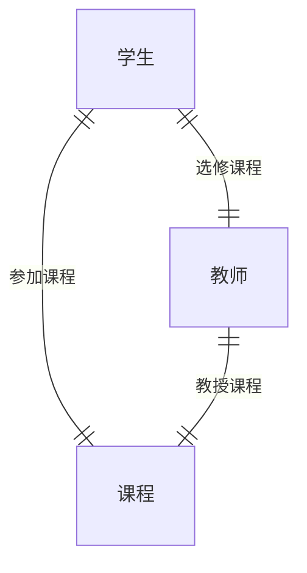

                 

# 数学与复杂系统科学的理论基础

## 关键词

- 数学
- 复杂系统科学
- 理论基础
- 算法
- 数学模型
- 系统分析与架构设计

## 摘要

本文将探讨数学与复杂系统科学的紧密结合，剖析二者之间的理论基础。首先，我们将介绍数学与复杂系统科学的核心概念和原理，明确其定义、特点和研究方法。接着，通过对比分析数学与复杂系统科学的核心概念属性，搭建其之间的联系与区分框架。随后，我们将详细讲解复杂系统科学中的ER实体关系图，以帮助读者更直观地理解其结构与应用。在算法原理讲解部分，我们将以具体算法为例，详细阐述其流程、原理及实际应用。在此基础上，本文还将深入探讨数学模型与公式的应用，通过实例分析展示其在复杂系统中的实际效果。最后，我们将结合实际项目，介绍系统分析与架构设计的方法，并提供最佳实践与拓展建议，以期为读者提供全方位的理论与实践指导。

### 第一部分：导论

#### 第1章：问题的背景与意义

##### 1.1 问题背景

数学与复杂系统科学在现代社会中扮演着至关重要的角色。随着信息技术和人工智能的迅猛发展，复杂系统科学的应用场景不断拓展，从经济系统、生态系统到社会系统，复杂系统科学提供了有效的理论工具和算法模型。数学作为科学的基础，其原理与方法在复杂系统科学中得到了广泛应用，尤其在算法设计、数据分析、优化问题解决等方面发挥了关键作用。

在现代科技领域中，数学与复杂系统科学的结合不仅有助于提高系统效率、优化资源配置，还对于解决现实世界中的诸多难题具有重要意义。例如，在金融领域，数学模型和算法被广泛应用于风险评估、资产定价和算法交易；在生态系统中，复杂系统科学帮助我们理解生态网络的动态变化，预测生物多样性保护策略；在社会系统中，复杂系统科学为理解社会行为、预测社会趋势提供了强有力的工具。

##### 1.2 问题描述

尽管数学与复杂系统科学有着广泛的应用，但在理论和实践层面仍面临诸多挑战。首先，数学模型在复杂系统中的应用往往需要面对高维数据和非线性关系，这使得模型构建和算法设计变得复杂且具有挑战性。其次，复杂系统科学的理论和方法在具体应用中往往需要结合实际背景进行调整和优化，这对于研究人员提出了较高的要求。

本文旨在解决以下问题：

1. 数学与复杂系统科学的核心概念与理论基础是什么？
2. 数学与复杂系统科学之间的联系与区分如何？
3. 复杂系统科学中的关键算法及其应用原理是什么？
4. 数学模型与公式在复杂系统科学中的应用效果如何？
5. 如何进行系统分析与架构设计，以实现复杂系统的高效运行？

##### 1.3 问题解决思路

本文将采用以下思路解决问题：

1. **核心概念与联系**：首先，明确数学与复杂系统科学的核心概念和原理，构建二者之间的联系框架。
2. **对比分析**：通过对比分析数学与复杂系统科学的核心概念属性，帮助读者更好地理解其差异与联系。
3. **算法原理讲解**：以具体算法为例，详细阐述其流程、原理及实际应用。
4. **数学模型与公式**：探讨数学模型与公式的定义、类型及其在复杂系统科学中的应用。
5. **系统分析与架构设计**：结合实际项目，介绍系统分析与架构设计的方法与技巧。
6. **项目实战与拓展**：通过环境安装、系统实现、案例分析等实战环节，展示数学与复杂系统科学在现实中的应用。

##### 1.4 边界与外延

在本文的研究中，我们将重点关注数学与复杂系统科学的基础理论和方法，不涉及具体应用领域的深入探讨。同时，我们将以经典的数学模型和算法为例，展示其在复杂系统科学中的应用。此外，本文将在以下范围内进行讨论：

1. **数学基础**：基础数学知识，如微积分、线性代数、概率论与数理统计。
2. **复杂系统科学**：复杂系统的定义、特点、研究方法及其在各类复杂系统中的应用。
3. **算法原理**：常见算法的原理、流程图及Python源代码实现。
4. **系统分析与架构设计**：系统功能设计、架构设计、接口设计与系统交互序列图。

##### 1.5 核心概念与要素组成

在本文中，我们将定义以下核心概念和要素：

1. **数学基础**：包括基础数学知识、数学工具与技巧。
2. **复杂系统科学基础**：复杂系统定义、特点、研究方法。
3. **算法原理**：算法概述、算法流程图、Python源代码讲解、数学模型与公式。
4. **系统分析与架构设计**：问题场景介绍、系统功能设计、系统架构设计、系统接口设计、系统交互序列图。
5. **项目实战与拓展**：环境安装、系统核心实现、代码应用解读与分析、实际案例分析。

##### 1.6 本章小结

本章介绍了数学与复杂系统科学结合的背景与意义，明确了本文要解决的问题，并提出了问题解决的思路。通过本章的介绍，读者可以初步了解本文的核心内容与研究框架，为后续章节的深入探讨奠定基础。

### 第二部分：核心概念与联系

#### 第2章：核心概念原理

##### 2.1 数学基础

**基础数学知识**

数学是一门基础学科，涉及多个分支，如微积分、线性代数、概率论与数理统计。这些数学分支为复杂系统科学提供了丰富的理论工具和方法。

- **微积分**：研究函数的极限、导数、积分等概念，广泛应用于优化问题、模型建立和数据分析。
- **线性代数**：研究向量空间、线性变换、矩阵等概念，在数据分析、图像处理和信号处理等领域具有广泛应用。
- **概率论与数理统计**：研究随机事件、概率分布、统计推断等概念，为复杂系统的建模与分析提供了理论依据。

**数学工具与技巧**

数学工具和技巧是解决复杂系统科学问题的关键。常用的数学工具包括：

- **微积分工具**：如泰勒公式、欧拉公式、积分变换等，用于处理复杂函数和方程。
- **线性代数工具**：如矩阵分解、特征值与特征向量、奇异值分解等，用于求解线性方程组和优化问题。
- **概率论与数理统计工具**：如贝叶斯定理、最大似然估计、假设检验等，用于处理随机事件和数据。

##### 2.2 复杂系统科学基础

**复杂系统定义**

复杂系统是指由大量相互作用的个体组成的系统，这些个体在相互作用过程中表现出整体涌现行为。复杂系统具有以下特点：

- **非线性**：复杂系统的行为往往具有非线性特征，难以用简单的线性模型描述。
- **多层次**：复杂系统包含多个层次和维度，不同层次之间的相互作用影响整体行为。
- **自适应**：复杂系统中的个体具有自适应能力，能够根据环境变化调整自身行为。
- **涌现性**：复杂系统中的个体相互作用会产生新的整体行为，这些行为无法从个体行为中简单推导。

**复杂系统特点**

复杂系统的特点决定了其研究的挑战性和复杂性。以下为复杂系统的主要特点：

- **高维性**：复杂系统中的变量和状态可能非常高维，导致分析难度增加。
- **不确定性**：复杂系统中的变量和参数可能存在不确定性，使得模型建立和预测变得更加复杂。
- **动态性**：复杂系统的行为随时间变化，需要考虑动态演化的特点。
- **混沌性**：复杂系统可能表现出混沌行为，即初始条件的微小差异可能导致长期行为的巨大差异。

**复杂系统研究方法**

复杂系统科学采用多种研究方法来揭示其内在规律和机制。以下为复杂系统研究的常见方法：

- **统计物理学方法**：采用概率论和统计物理学的理论工具，研究复杂系统中的相变和临界现象。
- **计算模拟方法**：利用计算机模拟技术，模拟复杂系统的演化过程和动态行为。
- **网络分析方法**：通过研究复杂系统中的网络结构，揭示节点和边的关系及其对整体行为的影响。
- **机器学习方法**：利用机器学习算法，从大量数据中提取复杂系统的特征和模式。

##### 第3章：概念属性特征对比

**数学与复杂系统科学对比**

数学与复杂系统科学在研究对象、研究方法、应用领域等方面存在显著差异。以下为二者之间的对比：

| 对比项 | 数学 | 复杂系统科学 |
| --- | --- | --- |
| **研究对象** | 函数、方程、几何图形等 | 大量相互作用的个体组成的系统 |
| **研究方法** | 抽象模型、数学证明、计算方法等 | 统计物理学、计算模拟、网络分析等 |
| **应用领域** | 优化问题、数据分析、工程问题等 | 经济系统、生态系统、社会系统等 |
| **特点** | 结构清晰、可预测性高 | 非线性、多层次、自适应、涌现性 |

**概念之间的联系与区分**

数学与复杂系统科学之间存在紧密联系，但二者也有明确的区分。以下为数学与复杂系统科学核心概念之间的联系与区分：

| 概念 | 数学 | 复杂系统科学 |
| --- | --- | --- |
| **函数** | 函数关系、导数、积分等 | 系统中的变量关系、演化过程等 |
| **方程** | 线性方程、非线性方程等 | 系统的动力学方程、稳定性分析等 |
| **网络** | 网络拓扑、路径分析等 | 系统中的相互作用、网络结构等 |
| **概率论** | 概率分布、随机变量等 | 系统中的随机行为、概率模型等 |

通过对比分析，我们可以更清晰地理解数学与复杂系统科学之间的关系，为后续章节的深入探讨提供理论基础。

#### 第4章：ER实体关系图

**ER图基础知识**

实体关系图（Entity-Relationship Diagram，简称ER图）是数据库设计中用于描述实体及其关系的图形表示方法。ER图由实体、属性和关系三个核心元素组成。

- **实体**：现实世界中具有独立意义的对象，如人、物、事件等。在ER图中，实体用矩形表示，并在矩形内注明实体名称。
- **属性**：实体的特征或特性，如人的姓名、年龄、性别等。在ER图中，属性用椭圆表示，并通过线段连接到对应的实体。
- **关系**：实体之间的交互或关联，如师生关系、雇员与部门关系等。在ER图中，关系用菱形表示，并通过线段连接相关的实体。

**实体关系图示例**

以下为一个简单的实体关系图示例，描述学生、课程和教师之间的关联。

在上面的ER图中：

- 学生、课程和教师是三个实体，分别用矩形表示。
- 学生的属性包括姓名、学号等，课程的属性包括课程号、课程名等，教师的属性包括姓名、工号等。
- 学生与课程之间存在“参加课程”的关系，教师与课程之间存在“教授课程”的关系，学生与教师之间存在“选修课程”的关系。

**ER图在实际中的应用**

ER图在数据库设计和信息系统中具有广泛的应用。以下为ER图在复杂系统科学中的一些应用场景：

- **数据库设计**：通过ER图，可以直观地表示数据库中实体的结构及其关系，为数据库设计和优化提供依据。
- **信息系

