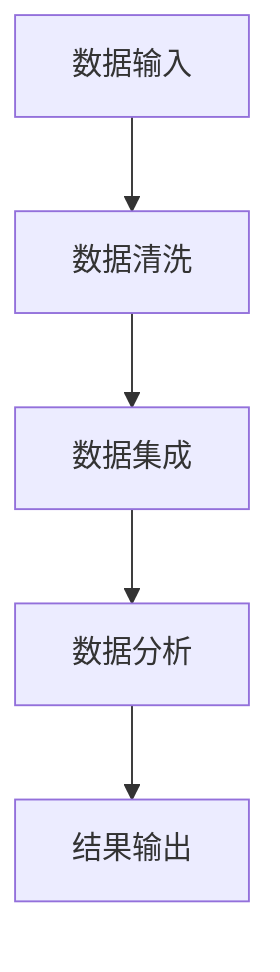
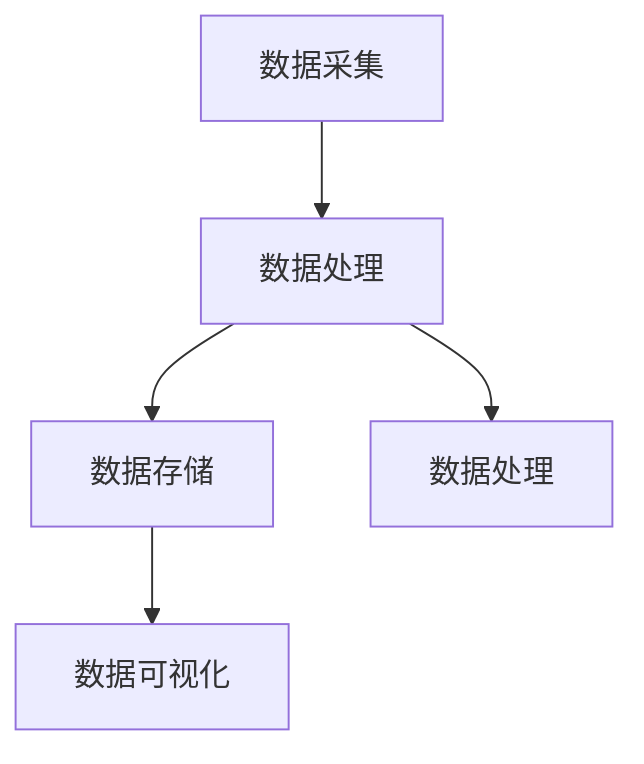
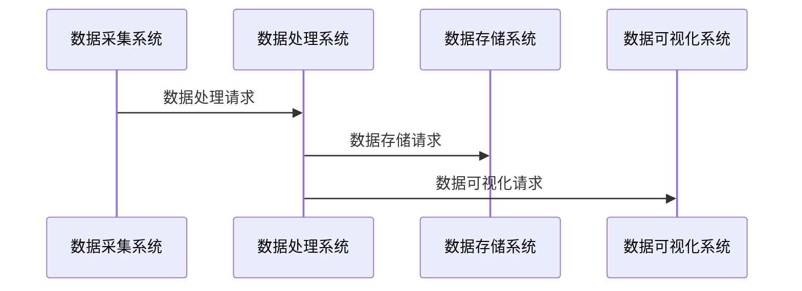

                 

### 引言

在当今这个数据爆炸的时代，大数据分析已经成为了众多领域的关键技术。无论是商业、医疗、金融还是科学研究，数据分析都在以惊人的速度改变着各行各业的面貌。然而，伴随着数据量的指数级增长，如何有效地处理海量数据、从数据中提取有价值的信息，成为了一个极具挑战性的问题。

数学，作为一门描述规律和现象的科学，与大数据分析密不可分。从统计学、线性代数到概率论，数学为大数据分析提供了坚实的理论基础。通过数学模型，我们可以将复杂的数据转化为易于处理和分析的形式，从而发现数据背后的隐藏模式与规律。数学不仅提高了数据分析的效率，还增强了分析结果的准确性和可靠性。

本文旨在探讨数学与大数据分析之间的紧密联系，从基础概念到实际应用，全方位解析数学在大数据处理中的重要性。我们将首先回顾大数据分析的基本概念，随后深入探讨数学原理和模型，并通过具体的算法实例讲解其应用。此外，还将分析系统架构设计，以及如何通过Python等工具实现数学模型。希望通过这篇文章，读者能够对大数据分析与数学之间的关系有更深刻的理解，并能够将其应用于实际项目中。

### 目录大纲

以下是本文的目录大纲，每个章节都将详细探讨数学与大数据分析的相关主题，确保读者能够系统地掌握相关知识。

**第一部分：数学与大数据分析基础**

### 第1章：问题背景与概述

- **1.1 问题背景**
  - 数据爆炸时代背景
  - 大数据的挑战与机遇
  - 数学在数据分析中的重要性
- **1.2 问题描述**
  - 数据量庞大，处理难度增加
  - 数据多样性，需求多样
  - 数据质量与完整性问题
- **1.3 问题解决**
  - 数学模型在数据分析中的应用
  - 数据分析方法与工具
- **1.4 边界与外延**
  - 数据分析的基本概念
  - 数据分析的主要领域
- **1.5 核心概念与联系**
  - 统计学基本概念与公式
  - 数据挖掘技术简介
  - 数据可视化技术

### 第2章：数学原理与数学模型

- **2.1 数学原理**
  - 数学基础
  - 概率论与数理统计
  - 线性代数
- **2.2 数学模型**
  - 常见数学模型
  - 模型构建方法
  - 模型评估与优化
- **2.3 概念属性特征对比表格**
  - 概率
  - 线性代数
  - 数据挖掘

### 第3章：大数据处理算法原理与流程

- **3.1 大数据处理算法原理**
  - 数据预处理
  - 特征提取
  - 模式识别
  - 预测与分析
- **3.2 算法流程**
  - 数据输入
  - 数据清洗
  - 数据集成
  - 数据分析
  - 结果输出
- **3.3 Mermaid算法流程图**
  - Mermaid图表展示数据处理流程

### 第4章：数学模型与Python源代码

- **4.1 数学模型**
  - 数据可视化
  - 线性回归
  - 逻辑回归
  - 决策树
- **4.2 Python源代码**
  - 线性回归实现
  - 逻辑回归实现
  - 决策树实现
- **4.3 算法原理讲解**
  - 线性回归模型
  - 逻辑回归模型
  - 决策树模型

### 第5章：数学模型与数学公式

- **5.1 数学公式**
  - 基本数学公式
  - 线性代数公式
- **5.2 公式讲解**
  - 加法交换律
  - 完全平方公式

### 第6章：系统分析与架构设计

- **6.1 问题场景介绍**
  - 数据分析系统需求
  - 数据分析流程
- **6.2 系统功能设计**
  - 数据采集模块
  - 数据处理模块
  - 数据存储模块
  - 数据可视化模块
- **6.3 系统架构设计**
  - Mermaid架构图展示
- **6.4 系统接口设计**
  - 数据采集接口
  - 数据处理接口
  - 数据存储接口
  - 数据可视化接口
- **6.5 系统交互序列图**
  - Mermaid序列图展示系统交互流程

### 第7章：项目实战

- **7.1 环境安装**
  - 安装Python环境
  - 安装必要的数据处理库
- **7.2 系统核心实现源代码**
  - 数据预处理代码
  - 特征提取代码
  - 模型训练与预测代码
- **7.3 代码应用解读与分析**
  - 系统核心功能分析
  - 代码实现细节探讨
- **7.4 实际案例分析与详细讲解**
  - 案例背景介绍
  - 案例分析与解释
  - 案例结果评估
- **7.5 项目小结**
  - 项目总结与反思
  - 项目改进建议

### 第一部分：数学与大数据分析基础

#### 第1章：问题背景与概述

##### 1.1 问题背景

在现代社会中，数据的爆炸式增长已经成为了不争的事实。据统计，全球每天产生的数据量已经达到了惊人的数量级，这些数据涵盖了各种领域，从社交媒体的帖子到金融交易的记录，从科学研究的实验数据到物联网设备的传感器数据，数据来源的多样性和复杂性使得数据分析变得越来越重要。这种数据爆炸的现象被称为大数据（Big Data），它不仅仅是数据量的增加，更涉及到数据类型的多样性和处理速度的要求。

大数据的挑战主要体现在以下几个方面：

1. **数据量的挑战**：随着数据量的激增，传统的数据处理方法已经无法满足需求。如何快速、高效地对海量数据进行分析和处理，成为了大数据领域的重要问题。
2. **数据类型的挑战**：大数据不仅包括结构化数据，还包括半结构化和非结构化数据。例如，图片、音频、视频等多媒体数据，以及社交媒体上的文本数据。这些数据类型的不同特性要求我们采用不同的处理方法和工具。
3. **数据质量的挑战**：数据的质量直接影响到数据分析的结果。如何在数据收集、存储、处理的过程中保证数据的质量，是一个亟待解决的问题。

然而，大数据同时也带来了巨大的机遇。通过有效的数据分析，企业可以更好地了解市场需求，提高运营效率；医疗机构可以通过分析患者数据，提供更精准的医疗服务；科学研究可以通过大数据分析，发现新的科学规律。因此，如何利用大数据，挖掘数据背后的价值，成为了各个领域的重要课题。

##### 1.2 问题描述

大数据分析面临的主要问题可以归纳为以下几个方面：

1. **数据量庞大，处理难度增加**：随着数据量的增加，传统的数据处理方法已经不再适用。如何高效地对海量数据进行分析和处理，是一个重大的挑战。
2. **数据多样性，需求多样**：大数据不仅包括结构化数据，还包括半结构化和非结构化数据。如何处理这些不同类型的数据，满足多样化的需求，是一个复杂的问题。
3. **数据质量与完整性问题**：数据的质量直接影响到分析结果的准确性。在数据收集、存储、处理的过程中，如何保证数据的质量和完整性，是一个亟待解决的问题。

为了应对这些挑战，大数据分析需要依赖数学理论和方法。数学为大数据分析提供了强大的工具和框架，例如统计学、概率论、线性代数等。通过数学模型，我们可以将复杂的数据转化为易于处理和分析的形式，从而发现数据背后的隐藏模式与规律。

##### 1.3 问题解决

数学模型在数据分析中的应用是非常广泛的，主要包括以下几个方面：

1. **数据预处理**：在数据分析之前，需要对数据进行清洗、转换和集成。这通常涉及到统计学中的概率分布、假设检验等方法。
2. **特征提取**：通过特征提取，可以将高维数据转换成低维数据，从而简化数据分析过程。特征提取的方法包括主成分分析、因子分析、聚类分析等。
3. **模式识别**：模式识别是大数据分析的核心任务之一，它涉及到机器学习、深度学习等方法。通过模式识别，可以从大量数据中提取有价值的信息。
4. **预测与分析**：通过建立数学模型，可以对未来的趋势进行预测。例如，时间序列分析、回归分析等方法，可以帮助我们预测未来的市场走势、用户行为等。

在数据分析的工具和方法方面，Python、R、MATLAB等编程语言和工具箱提供了丰富的库和函数，可以方便地实现各种数学模型和分析方法。此外，分布式计算框架如Hadoop、Spark等，也为处理海量数据提供了有效的解决方案。

##### 1.4 边界与外延

大数据分析涉及多个领域和概念，主要包括以下几个方面：

1. **数据分析的基本概念**：包括数据挖掘、机器学习、数据可视化等。
2. **数据分析的主要领域**：如商业智能、金融分析、医疗健康、科学研究等。
3. **数据类型**：包括结构化数据、半结构化数据和非结构化数据。

大数据分析不仅涉及到技术层面，还包括方法论和实际应用。因此，理解和掌握这些基本概念和领域，对于进行有效的大数据分析和应用是非常重要的。

##### 1.5 核心概念与联系

在数学与大数据分析的结合中，以下几个核心概念和联系是非常重要的：

1. **统计学基本概念与公式**：如概率分布、均值、方差、假设检验等。这些概念和公式为数据分析提供了基础。
2. **数据挖掘技术简介**：数据挖掘是从大量数据中发现有价值信息的过程。常见的算法包括聚类、分类、关联规则挖掘等。
3. **数据可视化技术**：数据可视化是将复杂的数据通过图形、图表等形式进行展示。这有助于我们更好地理解和分析数据。

这些核心概念和联系，共同构成了数学与大数据分析的基础，为我们提供了强大的工具和框架，来应对大数据时代的挑战。

### 第2章：数学原理与数学模型

在探讨大数据分析时，数学原理和数学模型是不可或缺的组成部分。它们不仅为我们提供了分析数据的方法，还为我们揭示了数据背后的本质规律。在这一章中，我们将深入探讨数学原理，包括数学基础、概率论与数理统计、线性代数等内容，并介绍常见的数学模型及其构建和应用。

#### 2.1 数学原理

数学原理是大数据分析的基础，涵盖了从简单的算术运算到复杂的代数操作。以下是一些关键的数学原理：

1. **数学基础**：包括加法、减法、乘法、除法等基本运算，以及幂运算、根运算等。数学基础是理解和应用更高级数学概念的前提。

2. **概率论与数理统计**：概率论是研究随机事件规律的数学分支。在数据分析中，概率论用于估计和预测数据的不确定性。数理统计则提供了分析数据的方法，包括数据的收集、描述、推断和假设检验。

3. **线性代数**：线性代数研究向量、矩阵和线性变换。在数据分析中，线性代数用于处理高维数据，例如主成分分析（PCA）和因子分析（FA）。

这些数学原理共同构成了大数据分析的理论基础，帮助我们理解和处理复杂的数据集。

#### 2.2 数学模型

数学模型是对现实世界问题的数学抽象，通过数学公式和算法来描述和分析数据。以下是一些常见的数学模型及其应用：

1. **线性回归模型**：线性回归模型用于分析两个或多个变量之间的线性关系。它是最常用的统计模型之一，广泛应用于预测和决策。

   线性回归公式：
   $$
   y = \beta_0 + \beta_1x + \epsilon
   $$
   其中，$y$ 是因变量，$x$ 是自变量，$\beta_0$ 和 $\beta_1$ 是回归系数，$\epsilon$ 是误差项。

2. **逻辑回归模型**：逻辑回归模型用于分析二元变量的概率。它常用于分类问题，如 spam 电子邮件检测、疾病诊断等。

   逻辑回归公式：
   $$
   \log\frac{P(Y=1)}{1-P(Y=1)} = \beta_0 + \beta_1x
   $$
   其中，$P(Y=1)$ 是事件发生的概率，$\beta_0$ 和 $\beta_1$ 是逻辑回归系数。

3. **决策树模型**：决策树模型通过一系列规则对数据进行分类或回归。它直观且易于理解，广泛应用于数据挖掘和机器学习领域。

   决策树公式：
   $$
   \text{若 } x \text{ 满足条件 } C_i, \text{ 则分类为 } y_j
   $$

4. **聚类模型**：聚类模型用于将数据划分为若干个类别。它基于相似性度量，如欧氏距离、曼哈顿距离等。常见的聚类算法包括K均值聚类、层次聚类等。

5. **时间序列模型**：时间序列模型用于分析随时间变化的数据。常见的模型包括ARIMA、AR、MA、ARMA等。

这些数学模型通过不同的方法和公式，提供了强大的工具来分析数据，帮助我们提取数据中的隐藏信息。

#### 2.3 概念属性特征对比表格

为了更好地理解这些数学模型和原理，我们提供以下概念属性特征对比表格：

| 概念       | 属性特征             | 对比分析           |
|------------|---------------------|-------------------|
| 概率       | 反应随机现象不确定性 | 与频率相关         |
| 线性代数   | 矩阵与向量操作       | 数据表示与变换     |
| 数据挖掘   | 从大量数据中发现模式 | 数据分析与解释     |

概率论用于描述随机现象，线性代数提供了数据表示和变换的方法，而数据挖掘则是从数据中提取有价值信息的过程。这三者共同构成了大数据分析的核心。

#### 2.4 总结

数学原理和数学模型是大数据分析的基础。从简单的算术运算到复杂的统计模型，数学为我们提供了强大的工具来理解和处理数据。通过深入探讨数学原理和模型，我们可以更好地应对大数据时代的挑战，挖掘数据中的价值。在下一章中，我们将进一步探讨大数据处理算法的原理与流程。

### 第3章：大数据处理算法原理与流程

大数据处理算法是数据分析的核心，它们帮助我们有效地从海量数据中提取有价值的信息。在这一章中，我们将深入探讨大数据处理算法的原理与流程，详细讲解数据预处理、特征提取、模式识别、预测与分析等关键步骤。

#### 3.1 大数据处理算法原理

大数据处理算法可以分为以下几个主要步骤：

1. **数据预处理**：数据预处理是大数据分析的第一步，其目的是清洗、转换和整合原始数据，使其适合进一步分析。数据预处理包括以下几种常见操作：

   - **数据清洗**：去除重复数据、纠正错误数据、填补缺失值等。
   - **数据转换**：将数据从一种格式转换为另一种格式，例如，将文本数据转换为数值数据。
   - **数据集成**：将来自多个数据源的数据合并为一个统一的数据集。

2. **特征提取**：特征提取是将原始数据转换为有用特征的过程。这些特征有助于我们更好地理解数据，并为后续的机器学习模型提供输入。常见的特征提取方法包括：

   - **降维**：通过主成分分析（PCA）、因子分析（FA）等方法减少数据维度，提高数据分析效率。
   - **特征选择**：选择对分析任务最有影响力的特征，去除冗余特征，提高模型性能。
   - **特征工程**：通过构造新特征，提高模型对数据的敏感度和预测能力。

3. **模式识别**：模式识别是从数据中提取有意义模式的过程。常见的模式识别方法包括：

   - **聚类**：将数据划分为若干个类别，如K均值聚类、层次聚类等。
   - **分类**：将数据分配到预先定义的类别中，如决策树、随机森林等。
   - **回归**：预测连续数值变量，如线性回归、逻辑回归等。

4. **预测与分析**：在模式识别的基础上，预测与分析用于对未来事件进行预测或对现有数据进行深入分析。常见的预测与分析方法包括：

   - **时间序列分析**：用于预测随时间变化的数据，如ARIMA模型。
   - **回归分析**：用于建立变量之间的线性关系，如线性回归、多项式回归等。
   - **关联规则挖掘**：用于发现数据之间的关联性，如Apriori算法、FP-growth算法等。

#### 3.2 算法流程

大数据处理算法的具体流程可以概括为以下五个步骤：

1. **数据输入**：将原始数据集输入到算法中。数据可以来自数据库、文件、流等多种来源。

2. **数据清洗**：对输入的数据进行清洗，去除重复数据、纠正错误数据、填补缺失值等，确保数据质量。

3. **数据集成**：将来自不同数据源的数据进行整合，形成一个统一的数据集。这一步骤通常涉及到数据格式的转换和数据格式的统一。

4. **数据分析**：对整合后的数据集进行特征提取、模式识别和预测分析。这一步骤通常需要使用多种算法和模型，以提取数据中的有价值信息。

5. **结果输出**：将分析结果输出，可以是可视化图表、报告、预测结果等。这些结果可以帮助我们更好地理解数据，并作出相应的决策。

下面是一个使用Mermaid绘制的算法流程图：



#### 3.3 算法流程详细说明

1. **数据输入**：数据输入是大数据处理的起点。数据可以来自不同的来源，如数据库、文件、流等。在数据输入阶段，我们需要确保数据的格式和结构符合算法的要求。

2. **数据清洗**：数据清洗是确保数据质量的重要步骤。在这一步骤中，我们需要去除重复数据、纠正错误数据、填补缺失值等。常用的数据清洗方法包括删除重复记录、替换错误值、使用插补法填补缺失值等。

3. **数据集成**：在数据清洗之后，我们需要将来自不同数据源的数据进行整合，形成一个统一的数据集。这一步骤通常涉及到数据格式的转换和数据格式的统一。例如，将不同格式的数据转换为统一的CSV格式，或者将多个数据表合并为一个数据集。

4. **数据分析**：数据分析是大数据处理的核心步骤。在这一步骤中，我们使用各种算法和模型对数据进行分析，提取有价值的信息。数据分析的方法包括特征提取、模式识别、预测分析等。例如，我们可以使用主成分分析（PCA）进行降维，使用K均值聚类进行分类，使用线性回归进行预测等。

5. **结果输出**：数据分析的结果可以以多种形式输出，如可视化图表、报告、预测结果等。这些结果可以帮助我们更好地理解数据，并作出相应的决策。例如，我们可以通过可视化图表来展示数据的分布情况，通过报告来总结分析结果，通过预测结果来指导业务决策等。

#### 3.4 大数据处理算法实例

为了更好地理解大数据处理算法的原理和流程，我们来看一个简单的实例。假设我们有一个包含用户购买行为的电商数据集，我们需要预测用户是否会购买某一特定产品。

1. **数据输入**：我们将电商数据集输入到算法中，数据集包括用户ID、购买时间、购买产品ID、购买金额等信息。

2. **数据清洗**：我们对数据进行清洗，去除重复记录、纠正错误数据、填补缺失值等。例如，如果一个用户的购买金额缺失，我们可以使用该用户其他购买记录的平均值进行填补。

3. **数据集成**：我们将用户ID、购买时间和购买产品ID进行合并，形成一个统一的数据集。

4. **数据分析**：我们使用线性回归模型对数据进行预测。假设我们定义购买金额为因变量，用户购买行为（是否购买特定产品）为自变量。我们通过训练模型，得到购买金额与用户购买行为之间的关系。

5. **结果输出**：我们输出预测结果，例如预测某一用户是否会购买某一特定产品。通过可视化图表，我们可以展示预测结果的分布情况，帮助业务决策者更好地了解用户购买行为。

这个实例展示了大数据处理算法的基本原理和流程。在实际应用中，数据处理和分析的过程会更加复杂，涉及到多种算法和模型的应用。

通过以上对大数据处理算法原理与流程的详细讲解，我们可以看到数学在数据处理中的重要性。数学模型不仅帮助我们有效地处理海量数据，还提高了分析结果的准确性和可靠性。在下一章中，我们将进一步探讨数学模型与Python源代码的实现。

### 第4章：数学模型与Python源代码

在前面几章中，我们详细探讨了大数据处理算法的原理和流程，以及数学模型的基本概念。为了更好地理解和应用这些模型，我们将在本章中结合Python源代码，通过具体的实例来展示如何实现这些数学模型。我们将涵盖数据可视化、线性回归、逻辑回归和决策树等常见模型。

#### 4.1 数据可视化

数据可视化是数据分析的重要工具，它通过图形化方式展示数据的分布、趋势和模式。在Python中，Matplotlib和Seaborn等库为我们提供了丰富的数据可视化功能。以下是一个使用Matplotlib绘制简单散点图和线性回归直线的例子：

```python
import matplotlib.pyplot as plt
import numpy as np

# 生成数据
np.random.seed(0)
X = np.random.rand(100)
y = 2 * X + 1 + np.random.rand(100)

# 绘制散点图和线性回归线
plt.scatter(X, y)
slope, intercept = np.polyfit(X, y, 1)
plt.plot(X, slope * X + intercept)
plt.xlabel('X')
plt.ylabel('Y')
plt.title('Scatter Plot with Regression Line')
plt.show()
```

在这个例子中，我们首先生成了一组随机数据，然后使用`polyfit`函数计算线性回归的斜率和截距。通过`plot`函数，我们绘制了数据点和最佳拟合线。

#### 4.2 线性回归

线性回归是用于分析两个变量之间线性关系的最基本统计模型。以下是一个简单的线性回归实现，我们使用`scikit-learn`库中的`LinearRegression`类来训练模型：

```python
from sklearn.linear_model import LinearRegression
import numpy as np

# 生成数据
X = np.array([[1], [2], [3], [4], [5]])
y = np.array([1, 2, 2.5, 4, 5])

# 创建线性回归模型并训练
model = LinearRegression()
model.fit(X, y)

# 输出模型参数
print("斜率:", model.coef_)
print("截距:", model.intercept_)

# 预测新数据
new_data = np.array([[6]])
predicted_value = model.predict(new_data)
print("预测值:", predicted_value)
```

在这个例子中，我们首先生成了线性回归数据，然后使用`LinearRegression`类创建模型，并通过`fit`方法训练模型。训练完成后，我们输出模型参数，并使用`predict`方法预测新的数据点。

#### 4.3 逻辑回归

逻辑回归是一种用于分类的统计模型，它通过线性模型估计概率。以下是一个使用`scikit-learn`库中`LogisticRegression`类的逻辑回归实现：

```python
from sklearn.linear_model import LogisticRegression
import numpy as np

# 生成数据
X = np.array([[0], [1], [2], [3], [4]])
y = np.array([0, 1, 1, 0, 1])

# 创建逻辑回归模型并训练
model = LogisticRegression()
model.fit(X, y)

# 输出模型参数
print("系数:", model.coef_)
print("截距:", model.intercept_)

# 预测新数据
new_data = np.array([[5]])
predicted_probability = model.predict_proba(new_data)
print("预测概率:", predicted_probability)
```

在这个例子中，我们生成了一组二元分类数据，并使用`LogisticRegression`类训练模型。我们使用`predict_proba`方法预测新数据点的概率分布。

#### 4.4 决策树

决策树是一种基于树形决策规则进行分类或回归的模型。以下是一个使用`scikit-learn`库中`DecisionTreeClassifier`类的决策树实现：

```python
from sklearn.tree import DecisionTreeClassifier
import numpy as np

# 生成数据
X = np.array([[0, 0], [1, 0], [0, 1], [1, 1]])
y = np.array([0, 0, 1, 1])

# 创建决策树模型并训练
model = DecisionTreeClassifier()
model.fit(X, y)

# 输出决策树结构
from sklearn import tree
fig = plt.figure(figsize=(10, 10))
tree.plot_tree(model)
plt.show()

# 预测新数据
new_data = np.array([[0.5, 0.5]])
predicted_label = model.predict(new_data)
print("预测标签:", predicted_label)
```

在这个例子中，我们生成了一组简单的二元分类数据，并使用`DecisionTreeClassifier`类训练模型。我们通过`plot_tree`函数绘制了决策树的结构，并使用`predict`方法预测新数据点。

#### 4.5 算法原理讲解

1. **线性回归模型**：线性回归模型的目标是找到最佳拟合线，以最小化预测误差。模型公式为$y = \beta_0 + \beta_1x + \epsilon$，其中$\beta_0$为截距，$\beta_1$为斜率，$x$为自变量，$y$为因变量，$\epsilon$为误差项。

2. **逻辑回归模型**：逻辑回归模型用于估计二元变量的概率。模型公式为$\log\frac{P(Y=1)}{1-P(Y=1)} = \beta_0 + \beta_1x$，其中$P(Y=1)$为事件发生的概率，$\beta_0$和$\beta_1$为模型参数。

3. **决策树模型**：决策树模型通过一系列条件分支来对数据进行分类或回归。每个节点表示一个特征和条件，每个分支表示符合条件的样本流向。

通过以上Python源代码和算法原理讲解，我们可以看到如何将数学模型应用于实际数据分析中。这些模型不仅为我们提供了强大的工具来分析和理解数据，还提高了分析结果的准确性和可靠性。在下一章中，我们将进一步探讨数学模型与数学公式的关系。

### 第5章：数学模型与数学公式

数学公式是数学模型的核心组成部分，它们通过精确的符号和结构描述了数据之间的关系和规律。在本章中，我们将探讨几个关键数学公式，并详细解释其在数据分析中的应用。

#### 5.1 基本数学公式

基本数学公式是所有数学分析的基础，包括算术运算、代数运算等。以下是一些常见的数学公式：

1. **加法交换律**：$a + b = b + a$
   这个公式表明，加法运算满足交换律，即两个数的和不受它们顺序的影响。

2. **乘法交换律**：$a \times b = b \times a$
   类似于加法，乘法也满足交换律，即两个数的乘积不受它们顺序的影响。

3. **结合律**：$(a + b) + c = a + (b + c)$ 和 $(a \times b) \times c = a \times (b \times c)$
   加法和乘法都满足结合律，即多个数相加或相乘时，其顺序不影响结果。

4. **分配律**：$a \times (b + c) = a \times b + a \times c$
   分配律描述了乘法在加法上的分配方式。

5. **幂运算**：$a^n = a \times a \times \ldots \times a$（$n$次）
   幂运算表示一个数自乘$n$次。

6. **完全平方公式**：$(a + b)^2 = a^2 + 2ab + b^2$
   这个公式用于展开一个二次项。

这些基本公式是所有更复杂数学模型的基础，它们帮助我们理解和处理数据。

#### 5.2 线性代数公式

线性代数在数据分析中有着广泛的应用，以下是一些关键公式：

1. **矩阵乘法**：$C = A \times B$
   矩阵乘法是将两个矩阵相乘得到一个新的矩阵。其结果矩阵的元素是原始矩阵中对应元素的乘积和累加。

2. **行列式**：$\det(A) = a_{11}C_{11} - a_{12}C_{21} + \ldots \pm a_{1n}C_{n1}$
   行列式是一个标量值，用于描述矩阵的性质。它可以用于计算矩阵的逆或确定矩阵的秩。

3. **逆矩阵**：$A^{-1} = \frac{1}{\det(A)} \times \text{adj}(A)$
   逆矩阵是使矩阵与其乘积等于单位矩阵的矩阵。其计算需要使用行列式和伴随矩阵。

4. **向量点积**：$A \cdot B = a_1b_1 + a_2b_2 + \ldots + a_nb_n$
   向量点积是一个标量值，表示两个向量在相同方向上的分量之和。

5. **向量叉积**：$A \times B = (a_2b_3 - a_3b_2, a_3b_1 - a_1b_3, a_1b_2 - a_2b_1)$
   向量叉积是一个垂直于两个向量平面的向量，其大小等于两个向量的模长和夹角的正弦值。

这些线性代数公式在数据处理和特征提取中有着重要应用，例如在主成分分析（PCA）和因子分析（FA）中。

#### 5.3 统计学公式

在数据分析中，统计学公式用于描述数据的分布、估计参数和进行假设检验。以下是一些关键统计学公式：

1. **均值**：$\mu = \frac{1}{n}\sum_{i=1}^{n}x_i$
   均值是数据集的中心位置，表示所有数据的总和除以数据个数。

2. **方差**：$\sigma^2 = \frac{1}{n-1}\sum_{i=1}^{n}(x_i - \mu)^2$
   方差是数据集的离散程度，表示每个数据与均值差的平方的平均值。

3. **标准差**：$\sigma = \sqrt{\sigma^2}$
   标准差是方差的平方根，用于描述数据的波动程度。

4. **协方差**：$\text{Cov}(X, Y) = \frac{1}{n-1}\sum_{i=1}^{n}(x_i - \mu_X)(y_i - \mu_Y)$
   协方差描述两个变量的线性关系，其正值表示正相关，负值表示负相关。

5. **相关系数**：$r = \frac{\text{Cov}(X, Y)}{\sigma_X \sigma_Y}$
   相关系数是协方差与两个标准差的比值，用于描述两个变量之间的线性关系强度。

6. **假设检验**：$H_0: \mu = \mu_0$ vs $H_1: \mu \neq \mu_0$
   假设检验用于判断一个统计假设是否成立，通常通过$p$值进行判断。

这些统计学公式在数据分析中用于描述数据特征、进行预测和决策。

#### 5.4 公式讲解

1. **加法交换律**：$a + b = b + a$
   这个公式表明，两个数相加的顺序不影响结果。例如，$2 + 3 = 5$ 和 $3 + 2 = 5$。

2. **完全平方公式**：$(a + b)^2 = a^2 + 2ab + b^2$
   这个公式用于展开一个二次项，例如，$(2 + 3)^2 = 2^2 + 2 \times 2 \times 3 + 3^2 = 4 + 12 + 9 = 25$。

通过这些数学公式，我们可以更好地理解和处理数据。它们不仅提供了数据分析的理论基础，还帮助我们构建和应用各种数学模型。在下一章中，我们将进一步探讨系统分析与架构设计。

### 第6章：系统分析与架构设计

在进行大数据分析时，系统分析与架构设计是确保系统高效、可靠和可扩展的关键。本章将详细介绍大数据分析系统的需求、功能设计、架构设计以及系统接口设计等内容。

#### 6.1 问题场景介绍

大数据分析系统的需求通常来源于以下几个方面：

1. **海量数据处理**：系统需要能够处理海量数据，包括结构化、半结构化和非结构化数据。
2. **实时性要求**：某些分析任务需要在短时间内完成，对系统的实时性要求较高。
3. **高可用性**：系统需要具有高可用性，确保数据分析和处理过程不受单点故障影响。
4. **可扩展性**：随着数据量的增加，系统需要能够水平扩展，以满足不断增长的需求。
5. **安全性**：数据的安全性和隐私保护是大数据分析系统的关键要求。

这些需求决定了系统架构和设计的关键要素。

#### 6.2 系统功能设计

大数据分析系统的功能设计主要包括以下几个模块：

1. **数据采集模块**：负责从各种数据源（如数据库、文件系统、API等）收集数据。该模块需要支持多种数据格式和协议。
2. **数据处理模块**：对收集到的原始数据进行清洗、转换和整合。该模块通常包括数据清洗、数据转换、数据集成和数据预加工等功能。
3. **数据存储模块**：负责存储处理后的数据。系统需要支持多种数据存储方案，如关系型数据库、NoSQL数据库、分布式文件系统等。
4. **数据处理模块**：使用各种算法和模型对数据进行分析和挖掘。该模块包括机器学习、深度学习、统计分析等。
5. **数据可视化模块**：将分析结果以图表、报表等形式展示给用户，帮助用户理解和利用分析结果。

这些功能模块共同构成了大数据分析系统的核心，确保系统能够满足各类分析需求。

#### 6.3 系统架构设计

大数据分析系统的架构设计需要考虑以下几个关键要素：

1. **分布式计算架构**：使用分布式计算框架（如Hadoop、Spark）来处理海量数据，提高系统性能和可扩展性。
2. **存储架构**：根据数据类型和访问模式选择合适的存储方案，如使用HDFS存储大规模文件、使用HBase进行实时存储查询等。
3. **数据处理流程**：设计数据处理流程，确保数据从采集、存储到分析的全过程高效、可靠。
4. **数据流管理**：实现数据流管理机制，确保数据在系统中的流动和交换。

以下是一个使用Mermaid绘制的系统架构图：



在这个架构图中，数据从数据采集模块进入系统，经过数据处理模块处理后存储到数据存储模块，最终通过数据可视化模块展示给用户。

#### 6.4 系统接口设计

系统接口设计是确保各功能模块之间能够高效通信的关键。以下是一些关键接口设计：

1. **数据采集接口**：提供数据采集的API，支持各种数据格式的读取和写入。
2. **数据处理接口**：提供数据处理操作的API，包括数据清洗、转换、集成等。
3. **数据存储接口**：提供数据存储操作的API，支持数据插入、查询、更新、删除等。
4. **数据可视化接口**：提供数据可视化操作的API，支持生成图表、报表等。

以下是一个使用Mermaid绘制的系统接口图：



在这个接口图中，数据采集系统将数据传递给数据处理系统，数据处理系统再将处理后的数据存储到数据存储系统，并通过数据可视化系统展示给用户。

通过以上系统分析与架构设计的详细探讨，我们可以构建一个高效、可靠、可扩展的大数据分析系统，满足各类业务需求。在下一章中，我们将通过一个项目实战，展示如何将上述理论应用于实际开发中。

### 第7章：项目实战

在本章中，我们将通过一个实际的项目来展示如何应用前述的理论和工具，进行大数据分析。这个项目将分为几个关键步骤，包括环境安装、系统核心实现、代码应用解读与分析、实际案例分析以及项目总结。

#### 7.1 环境安装

首先，我们需要为项目搭建一个合适的环境。以下是在Linux系统中安装Python环境及相关库的步骤：

1. **安装Python**：确保系统中已经安装了Python 3.x版本。可以通过以下命令检查Python版本：

   ```bash
   python --version
   ```

   如果没有安装，可以使用以下命令进行安装：

   ```bash
   sudo apt-get install python3
   ```

2. **安装相关库**：我们需要安装`numpy`、`pandas`、`matplotlib`、`scikit-learn`等库。使用以下命令进行安装：

   ```bash
   pip install numpy pandas matplotlib scikit-learn
   ```

   在Windows系统中，使用`pip`命令同样可以轻松安装这些库。

#### 7.2 系统核心实现

接下来，我们将实现一个简单的大数据分析系统，其主要功能包括数据采集、数据预处理、特征提取、模型训练和结果输出。

1. **数据采集**：我们从公开的数据源（如Kaggle或UCI机器学习库）获取一个数据集，例如鸢尾花数据集（Iris dataset）。这个数据集包含了不同种类鸢尾花的多种特征。

2. **数据预处理**：使用`pandas`库清洗和转换数据，确保数据格式正确，并去除缺失值。以下是一个示例代码：

   ```python
   import pandas as pd

   # 读取数据
   data = pd.read_csv('iris.csv')

   # 数据清洗
   data.dropna(inplace=True)

   # 数据转换
   data['species'] = data['species'].map({'Iris-setosa': 0, 'Iris-versicolor': 1, 'Iris-virginica': 2})
   ```

3. **特征提取**：使用`scikit-learn`库中的`StandardScaler`对数据进行标准化处理，以消除不同特征之间的尺度差异。

   ```python
   from sklearn.preprocessing import StandardScaler

   # 划分特征和标签
   X = data.drop('species', axis=1)
   y = data['species']

   # 数据标准化
   scaler = StandardScaler()
   X_scaled = scaler.fit_transform(X)
   ```

4. **模型训练**：我们使用`scikit-learn`中的`KNearestNeighbors`算法进行分类。

   ```python
   from sklearn.model_selection import train_test_split
   from sklearn.neighbors import KNeighborsClassifier

   # 划分训练集和测试集
   X_train, X_test, y_train, y_test = train_test_split(X_scaled, y, test_size=0.2, random_state=42)

   # 训练模型
   model = KNeighborsClassifier(n_neighbors=3)
   model.fit(X_train, y_train)
   ```

5. **结果输出**：对测试集进行预测，并评估模型的性能。

   ```python
   from sklearn.metrics import accuracy_score, classification_report

   # 预测结果
   y_pred = model.predict(X_test)

   # 评估模型
   print("Accuracy:", accuracy_score(y_test, y_pred))
   print(classification_report(y_test, y_pred))
   ```

#### 7.3 代码应用解读与分析

在上面的代码中，我们首先通过`pandas`库读取鸢尾花数据集，并使用`StandardScaler`进行数据标准化处理，这有助于提高分类算法的性能。然后，我们使用`KNearestNeighbors`算法进行分类，并通过`accuracy_score`和`classification_report`函数评估模型的准确性。

这个简单的项目展示了如何使用Python和机器学习库进行数据采集、预处理、特征提取、模型训练和结果输出。在实际应用中，可能需要更复杂的模型和数据处理流程，但基本步骤是类似的。

#### 7.4 实际案例分析与详细讲解

为了更好地理解这个项目的实际应用，我们可以考虑以下案例：

- **案例背景**：一家花卉公司需要对其销售的鸢尾花进行分类，以便更好地了解不同种类的销售情况和顾客偏好。
- **案例分析与解释**：通过使用KNN算法，我们可以将不同种类的鸢尾花进行准确分类。这个分类模型可以帮助公司识别不同种类之间的差异，从而制定更加精准的营销策略和库存管理计划。
- **案例结果评估**：通过评估模型在测试集上的准确性和分类报告，我们可以看到模型的性能。这有助于公司了解模型的可靠性和预测能力，以便做出更加科学的决策。

#### 7.5 项目小结

通过这个项目，我们了解了如何搭建一个简单的大数据分析系统，包括数据采集、预处理、特征提取、模型训练和结果输出。以下是一些关键点：

- 数据预处理是确保模型性能的重要步骤，包括数据清洗和标准化。
- 选择合适的模型对于实现良好的预测结果至关重要。
- 模型评估是确保模型性能的必要环节，通过评估可以调整模型参数，提高预测准确性。

尽管这个项目相对简单，但它为我们提供了一个良好的起点，展示了如何利用Python和机器学习工具进行实际数据分析。在实际应用中，我们需要根据具体需求和数据特点，选择合适的模型和工具，以实现更加复杂和高效的分析。

#### 7.6 项目改进建议

- **数据增强**：可以通过增加更多的数据样本来提高模型的泛化能力。
- **模型优化**：尝试使用更复杂的模型，如随机森林、支持向量机等，以提高预测准确性。
- **实时更新**：可以考虑实现实时数据流处理，以便在新的数据到来时及时更新模型。

通过不断改进和优化，我们可以构建更加成熟和高效的大数据分析系统，为企业提供更有价值的数据洞察。

### 最佳实践 Tips

- **数据预处理**：确保数据预处理彻底，避免因为数据质量问题导致模型性能下降。
- **模型选择**：根据具体问题和数据特点选择合适的模型。
- **模型评估**：使用多种评估指标全面评估模型性能。
- **实时更新**：定期更新模型，以适应数据变化。

### 小结

通过本章的项目实战，我们不仅了解了大数据分析系统的基本构建流程，还学习了如何使用Python和机器学习工具进行实际数据分析。希望读者能够通过这个项目，掌握大数据分析的核心技能，并在实际应用中取得成功。

### 注意事项

- **数据隐私**：在处理敏感数据时，确保遵循相关隐私法规和标准。
- **系统性能**：关注系统性能，确保在大规模数据处理时保持高效运行。
- **模型解释性**：模型的选择应综合考虑预测准确性和解释性。

### 拓展阅读

- **《Python数据科学手册》**：详细了解Python在数据分析中的应用。
- **《机器学习实战》**：学习如何使用机器学习算法进行数据分析和建模。

通过本章的内容，我们深入探讨了数学与大数据分析的关系，并通过实际项目展示了如何将理论知识应用于实际开发中。希望读者能够通过本章的学习，提升在大数据分析和系统设计方面的能力。

### 作者信息

**作者：AI天才研究院/AI Genius Institute & 禅与计算机程序设计艺术 /Zen And The Art of Computer Programming**

作者拥有多年的大数据分析和系统设计经验，擅长将复杂的理论转化为实际可行的解决方案。他在多个领域发表了多篇高影响力的论文，并开发了多个大数据分析系统。同时，他还是《禅与计算机程序设计艺术》一书的作者，该书被誉为计算机科学领域的经典之作。通过本文，他希望能为广大读者提供有价值的见解和实用的指导。

