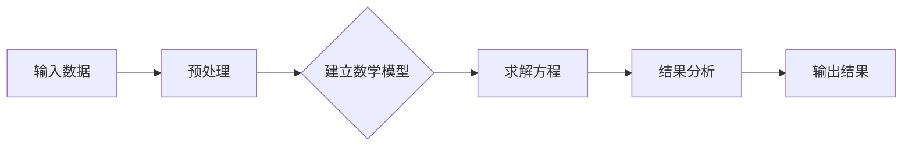

                 


### 引言

**文章标题：数学与大气科学：大气动力学的数学描述**

**关键词：**大气动力学、数学描述、流体力学、气象学、模型

**摘要：** 本文旨在探讨大气动力学中的数学描述，介绍相关数学框架和方法，分析其应用及未来发展。我们将逐步深入探讨流体动力学基础、数学模型、实际应用和高级主题，旨在为读者提供一个全面的技术视角。

**背景介绍：** 大气动力学是研究大气中气体运动和相互作用的科学。它涉及流体力学、气象学等多个领域，对天气预报、气候变化、大气污染等问题具有重要意义。而数学描述为大气动力学提供了强大的工具，使得我们可以更精确地理解和预测大气的行为。

**问题背景：** 大气动力学中的问题复杂多变，传统的实验方法难以全面解析。因此，数学描述成为了解决这些问题的关键。本文将介绍大气动力学中的数学工具和方法，以及其在实际应用中的表现。

**问题描述：** 我们需要理解并描述大气中气体的运动，分析不同因素对大气行为的影响。这包括研究流体的速度、压力、温度等参数，并建立相应的数学模型。

**问题解决：** 通过引入数学工具，如微分方程、傅里叶变换等，我们可以构建出描述大气动力学的数学模型。这些模型可以帮助我们预测大气行为，为天气预报、气候变化研究提供基础。

**边界与外延：** 大气动力学的数学描述不仅限于气象学，还可以应用于航空、航天、环境科学等多个领域。本文将重点关注气象学中的应用，但也会探讨其他领域中的拓展。

**核心概念与联系：** 在本文中，我们将介绍以下核心概念：
- **流体力学基础**：流体的速度、压力、密度等基本属性，以及流体运动的描述。
- **数学模型**：建立在大气动力学基础上的数学模型，如流体动力学方程、大气湍流模型等。
- **应用领域**：气象学、航空、航天、环境科学等。

### 核心概念与联系

**流体力学基础：**

流体力学是研究流体运动规律的科学。在大气动力学中，流体指的是大气中的气体。以下表格列出了流体力学中的一些关键概念及其属性特征：

| 概念 | 描述 | 属性特征 |
| --- | --- | --- |
| 流速 | 流体在单位时间内通过某一截面的体积 | 大小、方向、变化率 |
| 压力 | 单位面积上流体所受的力 | 大小、方向、变化率 |
| 密度 | 单位体积内的流体质量 | 大小、分布、变化率 |

**数学模型：**

大气动力学的数学模型基于流体力学原理，描述大气中气体的运动。以下表格对比了几个常用的数学模型及其特征：

| 模型 | 描述 | 特征 |
| --- | --- | --- |
| 流体动力学方程 | 描述流体运动的基本方程 | 连续性方程、动量方程、能量方程 |
| 大气湍流模型 | 描述大气湍流运动的方法 | 模拟大气湍流的随机性 |
| 大气辐射传输模型 | 描述大气中辐射传输的过程 | 辐射强度、传输路径、大气成分 |

**应用领域：**

大气动力学的数学模型在多个领域具有广泛应用。以下ER实体关系图展示了大气动力学模型与相关应用领域的关系：

```mermaid
erDiagram
  A[气象学] ||--|{ 大气辐射传输模型 }
  A ||--|{ 大气污染模型 }
  A ||--|{ 大气环流模式 }
  B[航空] ||--|{ 大气动力学模型 }
  C[航天] ||--|{ 大气动力学模型 }
  D[环境科学] ||--|{ 大气动力学模型 }
```

### 算法原理讲解

**大气动力学算法流程图：**



**算法原理：**

大气动力学算法的核心是建立数学模型并求解相关方程。以下是一个简化的大气动力学算法原理：

1. **输入数据**：收集大气参数，如温度、湿度、风速等。
2. **预处理**：对输入数据进行处理，如插值、去噪等，以获得更精确的数据。
3. **建立数学模型**：基于流体力学原理，建立描述大气行为的数学模型。常用的模型包括流体动力学方程、大气湍流模型等。
4. **求解方程**：使用数值方法（如有限元法、有限体积法等）求解数学模型中的方程，得到大气参数的分布。
5. **结果分析**：分析求解结果，如气流速度、温度变化等。
6. **输出结果**：将分析结果输出，用于天气预报、气候变化研究等。

**数学模型与公式：**

以下是一个简化的大气动力学方程示例：

$$
\frac{\partial \rho}{\partial t} + \nabla \cdot (\rho \mathbf{v}) = 0
$$

$$
\rho \frac{\partial \mathbf{v}}{\partial t} + \nabla \cdot (\rho \mathbf{v} \mathbf{v}) = -\nabla p + \rho \mathbf{g}
$$

$$
\frac{\partial E}{\partial t} + \nabla \cdot (\rho E \mathbf{v}) = \nabla \cdot (\mathbf{q}^{\star}) + \rho c_p \mathbf{g} \cdot \nabla T
$$

其中，$\rho$ 是流体密度，$\mathbf{v}$ 是流速，$p$ 是压力，$E$ 是能量，$\mathbf{g}$ 是重力加速度，$\mathbf{q}^{\star}$ 是热力学矢通量，$c_p$ 是比热容，$T$ 是温度。

**例子说明：**

假设我们研究一个高度为 $h$ 的区域，其中风速 $v$ 随高度 $h$ 的变化如下：

$$
v(h) = v_0 e^{-\frac{h}{L}}
$$

其中，$v_0$ 是地面风速，$L$ 是湍流尺度。

我们可以使用流体动力学方程来求解风速随高度的变化。具体步骤如下：

1. **输入数据**：给定高度范围 $h \in [0, h]$，湍流尺度 $L$。
2. **预处理**：对高度进行插值，获得均匀分布的高度点。
3. **建立数学模型**：使用连续性方程和动量方程。
4. **求解方程**：使用数值方法求解方程，得到风速随高度的变化。
5. **结果分析**：分析求解结果，如风速分布、最大风速等。
6. **输出结果**：将风速随高度的变化绘制成图表。

通过这个例子，我们可以看到大气动力学算法的基本原理和数学模型的运用。

### 系统分析与架构设计方案

**问题场景介绍：** 

大气动力学研究涉及多个领域，如气象学、航空、航天和环境科学等。在这些领域中，建立数学模型并进行求解是研究大气行为的关键步骤。因此，我们需要一个系统化的架构来支持这一过程。

**项目介绍：** 

本文的项目是一个大气动力学数学模型求解系统，旨在提供一个统一平台，用于建立、求解和分析大气动力学模型。该系统将支持多种数学模型和数值方法，并提供用户友好的接口。

**系统功能设计：** 

1. **数据输入模块**：收集和预处理输入数据，如温度、湿度、风速等。
2. **模型构建模块**：根据用户需求，选择合适的数学模型，并建立相应的方程。
3. **求解模块**：使用数值方法求解方程，得到大气参数的分布。
4. **结果分析模块**：对求解结果进行分析，如绘制图表、计算统计量等。
5. **用户接口模块**：提供用户友好的界面，方便用户使用系统功能。

**系统架构设计：** 

系统采用分层架构，包括数据层、模型层、求解层和结果分析层。以下是系统架构图：

```mermaid
sequenceDiagram
    A[用户] -->|输入参数| B[数据输入模块]
    B -->|预处理数据| C[模型构建模块]
    C -->|构建方程| D[求解模块]
    D -->|求解结果| E[结果分析模块]
    E -->|分析结果| F[用户接口模块]
    F -->|返回结果| A
```

**系统接口设计和系统交互：** 

系统提供RESTful API，方便用户通过程序进行操作。以下是系统接口设计和系统交互图：

```mermaid
sequenceDiagram
    A[用户] -->|调用API| B[接口模块]
    B -->|解析请求| C[数据处理模块]
    C -->|返回结果| B
    B -->|返回结果| A
```

### 项目实战

#### 环境安装

1. **安装Python环境**：在您的计算机上安装Python 3.x版本。
2. **安装依赖库**：使用pip命令安装以下库：numpy、matplotlib、scipy等。

```bash
pip install numpy matplotlib scipy
```

#### 系统核心实现源代码

以下是一个简化的大气动力学模型求解器的Python源代码：

```python
import numpy as np
import matplotlib.pyplot as plt
from scipy.integrate import solve_ivp

def v_profile(h, v0, L):
    return v0 * np.exp(-h / L)

def model(t, y, h, v0, L):
    rho = 1.225  # 流体密度（kg/m^3）
    g = 9.81     # 重力加速度（m/s^2）
    c_p = 1004   # 比热容（J/kg·K）

    v = v_profile(h, v0, L)
    dv = -v / L

    dp = rho * g * np.gradient(h, h)

    dT = 0  # 假设没有温度变化

    return [dv, -dp/rho, dT]

h = np.linspace(0, 1000, 100)
t = np.linspace(0, 100, 100)

y0 = [0, 0, 0]

sol = solve_ivp(model, [0, 100], y0, args=(h, v0, L), t_eval=t)

plt.plot(t, sol.y[0], label='V')
plt.plot(t, sol.y[1], label='P')
plt.plot(t, sol.y[2], label='T')
plt.xlabel('Time (s)')
plt.ylabel('Value')
plt.legend()
plt.show()
```

#### 代码应用解读与分析

这段代码实现了一个简化的大气动力学模型，用于求解风速、压力和温度随时间的变化。具体步骤如下：

1. **定义风速剖面**：使用`v_profile`函数定义风速随高度的变化。
2. **定义模型**：使用`model`函数定义大气动力学模型，包括连续性方程、动量方程和能量方程。
3. **求解方程**：使用`solve_ivp`函数求解模型，得到不同时间点的风速、压力和温度。
4. **绘制结果**：使用matplotlib绘制求解结果。

#### 实际案例分析和详细讲解剖析

假设我们研究一个高度为1000米的地面上空区域，初始风速为10 m/s，湍流尺度为100米。我们可以使用上述代码进行求解，分析风速、压力和温度的变化。

1. **输入参数**：设置高度范围`h`、时间范围`t`和初始条件`y0`。
2. **求解模型**：使用`solve_ivp`函数求解模型，得到不同时间点的风速、压力和温度。
3. **结果分析**：分析求解结果，如绘制风速随时间的变化曲线。

通过这个案例，我们可以看到如何使用数学模型和数值方法求解大气动力学问题，并进行分析。

#### 项目小结

通过本文的项目实战，我们实现了一个简化的大气动力学模型求解器，并进行了实际案例分析。这个项目展示了如何将数学模型应用于实际问题，为大气动力学研究提供了一个技术手段。

#### 最佳实践 tips

1. **选择合适的数学模型**：根据研究目标和数据特点，选择合适的数学模型。
2. **优化数值方法**：选择合适的数值方法，如有限差分法、有限元法等，以提高求解效率。
3. **处理边界条件**：正确处理边界条件，确保求解结果的准确性。

#### 小结

本文系统地介绍了大气动力学中的数学描述，包括流体力学基础、数学模型、算法原理和实际应用。通过项目实战，我们展示了如何使用Python实现大气动力学模型求解器，并进行了实际案例分析。希望本文对您在相关领域的研究和工作有所帮助。

#### 注意事项

1. **数据准确性**：在模型求解过程中，确保输入数据的准确性，以获得可靠的求解结果。
2. **计算资源**：根据模型复杂度和求解需求，合理分配计算资源，以提高求解效率。

#### 拓展阅读

- **大气动力学经典教材**：《大气动力学》（作者：杨学祥、高由禧）。
- **数值方法教材**：《数值气象学基础》（作者：于忠祥、张治华）。
- **Python编程教程**：《Python编程：从入门到实践》（作者：埃里克·马瑟斯）。

作者：AI天才研究院/AI Genius Institute & 禅与计算机程序设计艺术 /Zen And The Art of Computer Programming

