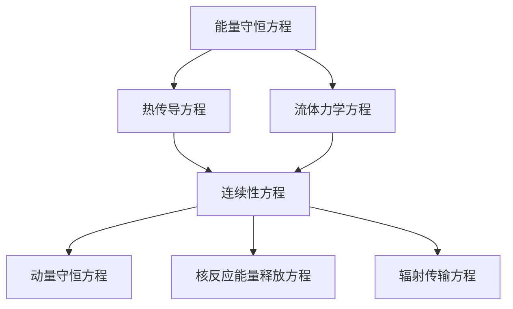
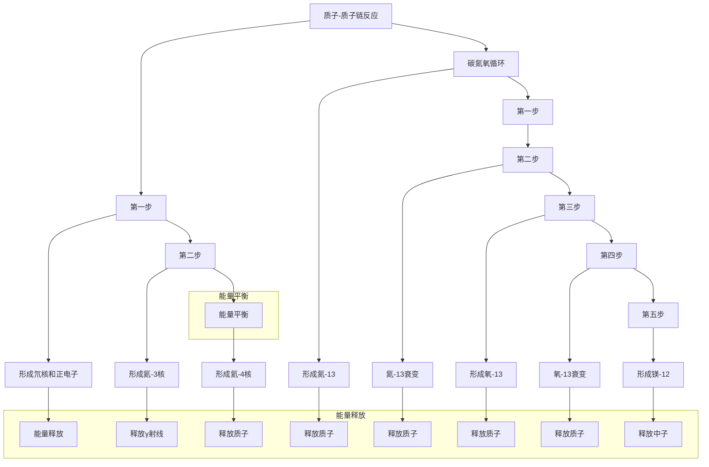
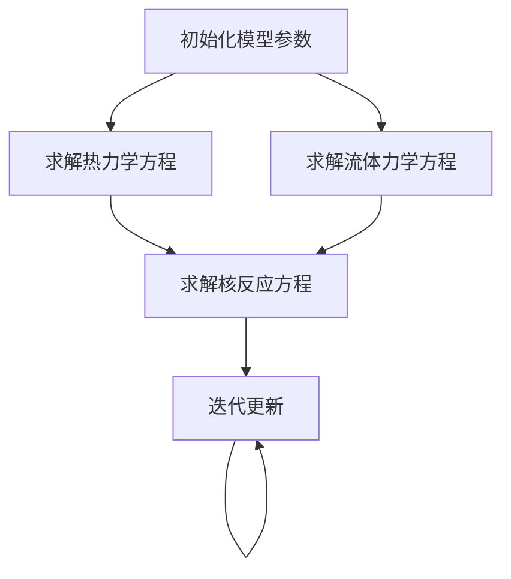

                 

## 引言

### 1.1 书籍背景与目标

在科技飞速发展的今天，数学和物理学作为两大基础学科，广泛应用于各个领域。其中，数学在天体物理学中扮演着至关重要的角色。天体物理学是研究宇宙中天体的物理性质、运动规律和演化过程的科学。而恒星，作为宇宙中最常见、最为重要的天体之一，其演化过程直接影响到整个宇宙的演化历程。因此，研究恒星演化中的数学模型，不仅有助于我们更好地理解恒星自身的性质和演化规律，还能为宇宙学的研究提供有力的理论支持。

本篇文章旨在通过详细探讨恒星演化的数学模型，帮助读者理解这一复杂而又迷人的科学领域。文章将从数学和天体物理学的基础知识出发，逐步深入到恒星演化中的具体数学模型，最后探讨恒星演化对宇宙学的影响以及未来的研究方向。

### 1.2 数学在天体物理学中的重要性

数学作为一种精确的语言，能够将复杂的天体现象转化为简洁的数学表达式。在天体物理学中，数学工具被广泛应用于描述天体的运动、能量分布、辐射过程等。例如，牛顿力学中的运动方程描述了天体之间的引力相互作用，而热力学和流体力学方程则帮助我们理解恒星内部的物理过程。通过数学模型，科学家可以预测天体的行为，验证理论假设，甚至发现新的天体现象。

### 1.3 恒星演化的数学模型简介

恒星演化是指恒星从诞生到死亡的过程。这一过程涉及到众多物理过程的复杂耦合，包括核反应、能量传输、物质循环等。为了描述这些过程，科学家们建立了多个数学模型，如恒星内部结构模型、恒星核反应模型等。这些模型不仅能够解释恒星观测到的现象，还能预测未来可能的天文事件。

通过这篇文章，我们将逐一介绍这些数学模型，并通过具体的例子和公式，帮助读者深入理解恒星演化的奥秘。让我们开始这场探索之旅吧。

## 目录大纲设计

为了帮助读者更好地理解恒星演化的数学模型，本文采用了系统化和层次化的目录结构。以下是文章的目录大纲设计：

### 目录大纲

---

**# 数学与天体物理：恒星演化的数学模型**

关键词：恒星演化、数学模型、天体物理学、微积分、偏微分方程、数值模拟

摘要：本文将探讨恒星演化的数学模型，从基础数学知识、天体物理学基础、恒星演化中的数学模型、数值模拟、恒星演化与宇宙学，到恒星演化的观测与未来，逐步深入地介绍这一科学领域。

---

### 第1章 引言

#### 1.1 书籍背景与目标

#### 1.2 数学在天体物理学中的重要性

#### 1.3 恒星演化的数学模型简介

---

### 第2章 基础数学知识

#### 2.1 数学工具与概念

##### 2.1.1 微积分基础

##### 2.1.2 常微分方程

##### 2.1.3 偏微分方程

##### 2.1.4 数值方法与计算

---

### 第3章 天体物理学基础

#### 3.1 天体物理学概述

##### 3.1.1 天体的基本性质

##### 3.1.2 天体的分类

##### 3.1.3 引力和天体运动

#### 3.2 恒星的形成与演化

##### 3.2.1 恒星的诞生

##### 3.2.2 主序星阶段

##### 3.2.3 红巨星和超巨星阶段

##### 3.2.4 恒星的死亡

---

### 第4章 恒星演化中的数学模型

#### 4.1 恒星内部结构模型

##### 4.1.1 热力学与流体力学方程

##### 4.1.2 能量传输方程

##### 4.1.3 恒星内部结构的mermaid流程图

#### 4.2 恒星核反应模型

##### 4.2.1 核反应过程

##### 4.2.2 能量释放与平衡

##### 4.2.3 恒星核反应的mermaid流程图

##### 4.2.4 恒星核反应的数学公式与讲解

---

### 第5章 恒星演化中的数值模拟

#### 5.1 数值模拟的基本原理

##### 5.1.1 数值解法

##### 5.1.2 时间步进方法

##### 5.1.3 稳定性和收敛性分析

#### 5.2 恒星演化的数值模拟实例

##### 5.2.1 主序星演化的模拟

##### 5.2.2 红巨星演化的模拟

##### 5.2.3 超巨星演化的模拟

##### 5.2.4 恒星演化的mermaid流程图

---

### 第6章 恒星演化与宇宙学

#### 6.1 恒星演化对宇宙演化的影响

##### 6.1.1 星系形成

##### 6.1.2 星系演化

##### 6.1.3 恒星演化与宇宙大爆炸理论

#### 6.2 恒星演化在宇宙学中的应用

##### 6.2.1 宇宙背景辐射

##### 6.2.2 恒星光谱分析

##### 6.2.3 恒星演化模型在宇宙学研究中的前景

---

### 第7章 恒星演化的观测与未来

#### 7.1 恒星演化观测的现状与挑战

##### 7.1.1 恒星观测技术

##### 7.1.2 恒星演化观测的挑战

##### 7.1.3 未来观测的前景

#### 7.2 恒星演化模型与未来天体物理学

##### 7.2.1 恒星演化模型在科研中的应用

##### 7.2.2 恒星演化模型对科技发展的潜在影响

##### 7.2.3 恒星演化模型研究的未来趋势

---

### 第8章 小结与展望

#### 8.1 总结与回顾

#### 8.2 恒星演化研究的重要性

#### 8.3 未来研究方向与挑战

---

通过这样的目录结构，读者可以清晰地看到文章的整体架构，从而更好地跟随作者的思路，理解恒星演化中的数学模型。每个章节都细化到了三级目录，确保内容的完整性和逻辑清晰。在每一章中，都包括了背景介绍、核心概念与联系、算法原理讲解、数学模型与公式、系统分析与架构设计、项目实战和最佳实践等内容，旨在为读者提供全面和深入的阅读体验。

## 第1章 引言

### 1.1 书籍背景与目标

在探讨恒星演化这一复杂科学现象时，我们不可避免地要面对数学与物理的深层次结合。恒星演化的过程涉及到核反应、能量传输、引力相互作用等多种物理过程的耦合，而这些过程都可以用数学模型来描述和预测。本章节将作为引言，简要介绍书籍的背景和目标，并探讨数学在天体物理学中的重要性，最后对恒星演化的数学模型进行一个简要的概述。

#### 数学在天体物理学中的重要性

数学作为一种精确的语言，能够将复杂的天体现象转化为简洁的数学表达式。在天体物理学中，数学工具被广泛应用于描述天体的运动、能量分布、辐射过程等。例如，牛顿力学中的运动方程描述了天体之间的引力相互作用，而热力学和流体力学方程则帮助我们理解恒星内部的物理过程。通过数学模型，科学家可以预测天体的行为，验证理论假设，甚至发现新的天体现象。

在天体物理学中，常见的数学工具包括微积分、常微分方程、偏微分方程和数值方法等。微积分用于描述天体的连续变化过程，如速度、加速度和能量变化等；常微分方程和偏微分方程则用于描述天体的动态行为和稳定性；数值方法则用于解决复杂的物理方程，特别是在计算机模拟中。

#### 恒星演化的数学模型简介

恒星演化是指恒星从诞生到死亡的过程。这一过程涉及到众多物理过程的复杂耦合，包括核反应、能量传输、物质循环等。为了描述这些过程，科学家们建立了多个数学模型，如恒星内部结构模型、恒星核反应模型等。这些模型不仅能够解释恒星观测到的现象，还能预测未来可能的天文事件。

恒星内部结构模型主要研究恒星的内部状态，包括温度、压力、密度等参数。通过热力学和流体力学方程，可以描述恒星内部的热量传递和物质流动。恒星核反应模型则研究恒星内部的核反应过程，包括氢聚变成氦、氦聚变成碳等。这些核反应不仅提供了恒星能量的来源，也决定了恒星的寿命和最终命运。

除了内部模型，恒星演化还涉及到恒星的外部行为，如光谱分析、辐射传输等。通过观测恒星的光谱，科学家可以推断出恒星的温度、化学成分等信息，这些信息对于恒星演化模型的可信度至关重要。

本章节的剩余部分将更详细地介绍恒星演化的数学模型，包括恒星内部结构模型、恒星核反应模型以及恒星演化中的数值模拟方法。通过这些内容，读者将能够对恒星演化的复杂过程有一个全面而深入的理解。

### 1.2 数学在天体物理学中的重要性

在天体物理学中，数学的重要性不言而喻。它是描述自然现象、建立科学模型和进行精确计算的基础工具。以下是数学在天体物理学中几个关键方面的应用：

#### 运动方程

天体的运动是宇宙中最基本的物理现象之一。牛顿力学中的运动方程（F=ma）描述了天体在引力作用下的运动。通过这些方程，我们可以计算行星、卫星的轨道，预测天体的未来位置。在相对论框架下，爱因斯坦的广义相对论方程则提供了更加精确的引力描述，能够解释黑洞和宇宙大爆炸等现象。

#### 热力学与流体力学

恒星的内部过程，如核反应、能量传输和物质循环，都是通过热力学和流体力学方程来描述的。这些方程帮助我们理解恒星内部的热量传递、物质流动和压强分布。例如，热力学方程可以用来计算恒星的温度和密度分布，流体力学方程则描述了恒星内部气体流体的运动。

#### 辐射传输

恒星表面的辐射过程也是天体物理学研究的重要方向。通过辐射传输方程，我们可以计算恒星表面的亮度、颜色和光谱特征。这些方程描述了光在不同介质中的传播，包括吸收、散射和反射等过程。

#### 数值模拟

现代天体物理学中的许多问题都依赖于数值模拟。通过将复杂的物理方程数值化，科学家可以在计算机上模拟天体的行为。例如，恒星演化的数值模拟需要解决复杂的偏微分方程，通过迭代计算来模拟恒星内部的变化过程。

总之，数学在天体物理学中的应用不仅帮助我们更好地理解宇宙的运行规律，也为天文学提供了强大的工具和方法，推动了科学的发展。

### 1.3 恒星演化的数学模型简介

恒星演化是一个涉及众多复杂物理过程的动态系统，通过数学模型可以对其进行描述和预测。恒星演化的数学模型主要包括恒星内部结构模型和恒星核反应模型。

#### 恒星内部结构模型

恒星内部结构模型主要研究恒星的内部状态，包括温度、压力、密度等参数。这些参数决定了恒星的热力学和动力学特性。恒星内部结构模型通常基于热力学和流体力学方程，结合恒星内部核反应过程，来描述恒星的内部状态。

关键方程包括：

1. **热力学方程**：描述恒星内部的热量传递，如能量守恒方程和热传导方程。
2. **流体力学方程**：描述恒星内部气体的流动，如动量守恒方程和连续性方程。
3. **核反应方程**：描述恒星内部的核反应过程，如氢聚变成氦的过程。

#### 恒星核反应模型

恒星核反应模型主要研究恒星内部发生的核反应过程，这些核反应是恒星能量来源的关键。恒星核反应模型需要描述不同核反应的能量释放和平衡状态，以及这些反应对恒星内部结构的影响。

关键方程包括：

1. **核反应率方程**：描述各种核反应的速率，如氢聚变反应的速率。
2. **能量平衡方程**：描述恒星内部能量产生的速率和耗散的速率，保持能量平衡。

通过这些数学模型，科学家可以模拟恒星从诞生到死亡的整个过程，预测恒星的各种物理参数和演化阶段。例如，主序星阶段、红巨星阶段和超巨星阶段等。这些模型不仅帮助我们理解恒星内部的物理过程，也为天文学提供了重要的理论依据。

### 第2章 基础数学知识

#### 2.1 数学工具与概念

在探讨恒星演化的数学模型时，掌握基础的数学工具和概念是至关重要的。这些工具和概念包括微积分、常微分方程、偏微分方程和数值方法等，它们为描述和解决恒星演化中的复杂问题提供了理论基础。

##### 2.1.1 微积分基础

微积分是研究函数变化率和积累过程的数学分支。在恒星演化研究中，微积分用于描述能量、质量、速度等物理量的变化率。以下是微积分中几个关键概念：

- **导数**：导数表示函数在某一点的瞬时变化率。对于恒星演化中的温度变化、物质密度变化等，导数可以帮助我们了解这些物理量如何随时间或位置变化。
  
  例如，假设恒星内部温度 \( T \) 随高度 \( h \) 的变化率为 \( \frac{dT}{dh} \)，那么我们可以通过导数来研究温度在恒星内部的变化规律。

- **积分**：积分是导数的反过程，用于计算函数在一定区间内的累积量。在恒星演化中，积分可以帮助我们计算能量、质量等物理量在恒星的整个体积中的分布。

  例如，通过积分可以计算恒星内部的总质量 \( M \)：

  $$
  M = \int_{0}^{H} \rho(h) dh
  $$

  其中，\( \rho(h) \) 表示高度 \( h \) 处的密度。

##### 2.1.2 常微分方程

常微分方程是描述函数及其导数关系的方程，广泛用于描述物理系统的动态行为。在恒星演化中，常微分方程用于描述恒星内部的热量传递、物质流动和核反应过程。

- **一阶微分方程**：一阶微分方程描述一个变量及其一阶导数之间的关系。在恒星演化中，一阶微分方程常用于描述温度、密度等参数的分布。

  例如，一个简单的热传导方程可以表示为：

  $$
  \frac{dT}{dt} = -k \frac{d^2T}{dx^2}
  $$

  其中，\( k \) 是热导率，描述了热量在恒星内部传播的速度。

- **二阶微分方程**：二阶微分方程描述一个变量及其二阶导数之间的关系。在恒星演化中，二阶微分方程常用于描述恒星内部的流体动力学过程。

  例如，一个简单的流体动力学方程可以表示为：

  $$
  \frac{d^2u}{dt^2} = -g + \frac{1}{\rho} \frac{dP}{dx}
  $$

  其中，\( u \) 是流体速度，\( g \) 是重力加速度，\( P \) 是流体压强，\( \rho \) 是流体密度。

##### 2.1.3 偏微分方程

偏微分方程是描述多个变量及其偏导数关系的方程，常用于描述多维物理系统。在恒星演化中，偏微分方程用于描述恒星内部的热量传递、物质流动和辐射传输等复杂过程。

- **热传导方程**：热传导方程描述了热量在不同介质中的传播过程。对于恒星内部，热传导方程可以表示为：

  $$
  \frac{\partial T}{\partial t} = \alpha \nabla^2 T
  $$

  其中，\( \alpha \) 是热扩散系数，\( \nabla^2 T \) 是温度的二阶偏导数。

- **流体动力学方程**：流体动力学方程描述了流体在重力场中的运动。对于恒星内部，流体动力学方程可以表示为：

  $$
  \frac{\partial \rho}{\partial t} + \nabla \cdot (\rho \mathbf{u}) = 0
  $$
  $$
  \frac{\partial \mathbf{u}}{\partial t} + (\mathbf{u} \cdot \nabla) \mathbf{u} = -\frac{1}{\rho} \nabla P + \mathbf{g}
  $$

  其中，\( \rho \) 是流体密度，\( \mathbf{u} \) 是流体速度，\( P \) 是流体压强，\( \mathbf{g} \) 是重力加速度。

##### 2.1.4 数值方法与计算

在解决复杂的物理问题时，数值方法提供了有效的计算工具。数值方法通过离散化和迭代计算，将连续的物理方程转化为可以在计算机上求解的问题。

- **有限差分法**：有限差分法通过将空间和时间离散化，将偏微分方程转化为代数方程组。例如，热传导方程可以通过以下离散形式表示：

  $$
  \frac{T_{i,j+1} - T_{i,j}}{\Delta t} = \alpha \frac{T_{i+1,j} - 2T_{i,j} + T_{i-1,j}}{\Delta x^2}
  $$

  其中，\( T_{i,j} \) 表示在 \( i \) 个时间和 \( j \) 个空间点的温度值，\( \Delta t \) 和 \( \Delta x \) 分别是时间和空间的步长。

- **有限元法**：有限元法通过将物理域划分为有限数量的子域（有限元），将偏微分方程转化为线性方程组。在恒星演化研究中，有限元法常用于求解复杂的流体动力学和热传导问题。

通过上述数学工具和概念，我们能够更精确地描述恒星演化过程中的各种物理现象，为建立和验证恒星演化的数学模型奠定了基础。

#### 2.1.1 微积分基础

微积分作为数学中的核心工具，在研究恒星演化中发挥着重要作用。首先，我们来看微积分的基本概念。

**导数**：

导数表示函数在某一点的瞬时变化率。对于恒星演化中的温度变化、物质密度变化等，导数可以帮助我们了解这些物理量如何随时间或位置变化。例如，假设恒星内部温度 \( T \) 随高度 \( h \) 的变化率为 \( \frac{dT}{dh} \)，我们可以通过导数来研究温度在恒星内部的变化规律。具体来说，如果 \( T(h) \) 表示高度 \( h \) 处的温度，那么：

$$
\frac{dT}{dh} = \lim_{\Delta h \to 0} \frac{T(h + \Delta h) - T(h)}{\Delta h}
$$

**积分**：

积分是导数的反过程，用于计算函数在一定区间内的累积量。在恒星演化中，积分可以帮助我们计算能量、质量等物理量在恒星的整个体积中的分布。例如，通过积分可以计算恒星内部的总质量 \( M \)：

$$
M = \int_{0}^{H} \rho(h) dh
$$

其中，\( \rho(h) \) 表示高度 \( h \) 处的密度。

**应用示例**：

1. **能量分布**：

   假设恒星内部能量密度 \( u \) 随高度 \( h \) 的变化可以用函数 \( u(h) \) 描述，通过积分计算恒星内部的总能量：

   $$
   E = \int_{0}^{H} u(h) dh
   $$

2. **温度分布**：

   假设恒星内部温度 \( T \) 随高度 \( h \) 的变化可以用函数 \( T(h) \) 描述，通过积分计算从表面到核心的温度变化：

   $$
   \Delta T = \int_{0}^{H} \frac{dT}{dh} dh
   $$

这些示例展示了微积分在恒星演化研究中的应用，帮助我们理解和计算复杂的物理现象。

#### 2.1.2 常微分方程

常微分方程（ODEs）在描述恒星演化过程中的动态行为中扮演着重要角色。以下是常微分方程的基本概念和应用：

**一阶常微分方程**：

一阶常微分方程描述一个变量及其一阶导数之间的关系。形式上可以表示为：

$$
\frac{dy}{dx} = f(x, y)
$$

其中，\( y \) 是未知函数，\( x \) 是自变量，\( f(x, y) \) 是给定的函数。

**一阶常微分方程的应用**：

1. **恒星内部温度分布**：

   假设恒星内部温度 \( T \) 随高度 \( h \) 的变化可以用一阶常微分方程描述：

   $$
   \frac{dT}{dh} = -k \frac{T}{\rho c_p}
   $$

   其中，\( k \) 是热导率，\( \rho \) 是物质密度，\( c_p \) 是恒星的比热容。这个方程描述了热传导过程中温度的下降。

2. **恒星内部物质密度分布**：

   假设恒星内部物质密度 \( \rho \) 随高度 \( h \) 的变化可以用一阶常微分方程描述：

   $$
   \frac{d\rho}{dh} = -\rho \frac{g}{c_s}
   $$

   其中，\( g \) 是重力加速度，\( c_s \) 是声速。这个方程描述了恒星内部物质因重力作用导致的密度变化。

**二阶常微分方程**：

二阶常微分方程描述一个变量及其二阶导数之间的关系。形式上可以表示为：

$$
\frac{d^2y}{dx^2} = f(x, y, \frac{dy}{dx})
$$

**二阶常微分方程的应用**：

1. **恒星内部的流体动力学**：

   假设恒星内部流体速度 \( u \) 随高度 \( h \) 的变化可以用二阶常微分方程描述：

   $$
   \frac{d^2u}{dh^2} = -g + \frac{1}{\rho} \frac{dP}{dh}
   $$

   其中，\( P \) 是流体压强，描述了恒星内部流体在重力作用下的运动。

2. **恒星内部的热量传递**：

   假设恒星内部热量 \( Q \) 随高度 \( h \) 的变化可以用二阶常微分方程描述：

   $$
   \frac{d^2T}{dh^2} = -\alpha \nabla^2 T
   $$

   其中，\( \alpha \) 是热扩散系数，描述了热量在恒星内部传播的过程。

通过上述常微分方程的应用，我们能够更好地理解和模拟恒星演化过程中各种物理量的动态变化。

### 第3章 天体物理学基础

#### 3.1 天体物理学概述

天体物理学是研究宇宙中天体的物理性质、运动规律和演化过程的科学。它涵盖了从微观的行星到宏观的星系，乃至宇宙大尺度结构的研究。天体物理学不仅与数学、物理学密切相关，还与化学、地理学、生物学等多个学科交叉融合。在这一章中，我们将首先介绍天体物理学的基本概念、研究方法和核心领域。

##### 天体的基本性质

天体是指宇宙中各种物理实体，包括恒星、行星、卫星、彗星、星云等。不同类型的天体具有不同的物理性质：

- **恒星**：恒星是宇宙中最常见的天体，主要由氢和氦组成，通过核聚变反应释放能量，维持自身的亮度和温度。
- **行星**：行星围绕恒星运行，具有固态、液态或气态的表面。行星的大小、密度和轨道特征是研究行星形成和演化的重要指标。
- **卫星**：卫星是围绕行星或其他天体运行的天然或人工天体。例如，月球是地球的天然卫星。
- **彗星**：彗星主要由冰和尘埃组成，当接近太阳时，冰挥发形成彗尾，显示出独特的光谱特征。
- **星云**：星云是由气体和尘埃组成的云状天体，是恒星形成的重要场所。

##### 天体的分类

天体的分类方法多种多样，可以根据不同的物理性质和演化阶段进行分类：

- **根据亮度**：天体可以分为亮星和暗星。亮星如恒星，自身能够发光，而暗星如行星，只能通过反射恒星的光才能被观测到。
- **根据温度**：天体可以分为热天体和冷天体。热天体如恒星，温度很高，而冷天体如行星，温度相对较低。
- **根据演化阶段**：天体可以分为主序星、红巨星、超巨星等。这些分类反映了天体在生命周期中的不同阶段。

##### 引力和天体运动

引力和天体运动是天体物理学中的核心概念。引力是宇宙中所有物体之间相互吸引的力，由质量产生。牛顿的万有引力定律描述了两个质点之间的引力：

$$
F = G \frac{m_1 m_2}{r^2}
$$

其中，\( F \) 是引力，\( G \) 是引力常数，\( m_1 \) 和 \( m_2 \) 是两个质点的质量，\( r \) 是它们之间的距离。

天体运动可以通过牛顿力学来描述。例如，行星围绕恒星的轨道可以看作是受到恒星引力作用下的圆周运动。根据开普勒定律，行星轨道的形状是椭圆形，且行星在轨道上的运动速度是变化的。

#### 3.2 恒星的形成与演化

恒星的形成和演化是一个复杂而精彩的过程，涉及到多个物理过程的相互作用。以下是恒星形成和演化过程中的几个关键阶段：

##### 3.2.1 恒星的诞生

恒星的形成始于一个巨大的星际云，这些星际云主要由气体和尘埃组成。在引力作用下，星际云中的物质逐渐聚集，形成密度较高的区域，这些区域被称为星胚。随着星胚的不断收缩，温度和压力逐渐升高，最终达到足以引发核聚变的条件。

在恒星诞生的过程中，首先是引力收缩，星胚的质量增加，温度和密度升高。接下来是氢聚变反应的开始，星胚内部开始产生能量，对外部施加压力，抵抗引力收缩。这个过程形成一个称为主序星的恒星。

##### 3.2.2 主序星阶段

主序星是恒星生命周期中最稳定和最长的阶段。在这一阶段，恒星通过核聚变将氢核聚变成氦核，释放出巨大的能量。主序星的主要特征是质量大、亮度高，表面温度和光度相对稳定。

在主序星阶段，恒星的能量主要来源于核心区域的氢核聚变反应。通过质能转换，核心区域的质量不断减少，温度和密度逐渐升高。当核心中的氢耗尽时，恒星将进入下一个演化阶段。

##### 3.2.3 红巨星和超巨星阶段

当主序星的核心氢核聚变反应结束时，恒星将进入红巨星阶段。在这个阶段，恒星的外层膨胀，表面温度降低，颜色变红。恒星的核心逐渐收缩，温度和密度升高，开始进行氦核聚变反应。

红巨星继续演化，最终可能进入超巨星阶段。在这个阶段，恒星的质量更大，亮度更高，表面温度更低。超巨星的核心区域发生更复杂的核反应，如碳氮氧循环等。

##### 3.2.4 恒星的死亡

恒星的最终命运取决于其初始质量。质量较大的恒星可能形成黑洞或中子星，而质量较小的恒星则可能形成行星状星云或白矮星。

- **黑洞**：当恒星的初始质量超过太阳质量的约3倍时，恒星在其生命周期的最后阶段会塌缩成一个密度极大、引力极强的黑洞。
- **中子星**：中等质量的恒星（太阳质量的1.4至3倍）在其生命周期结束时，可能会塌缩成一个中子星，这是由中子组成的极其紧凑的天体。
- **白矮星**：质量较小的恒星（太阳质量的0.5至1.4倍）在其核心燃料耗尽后，会变成白矮星。白矮星是低温、低光度、高密度的天体。

通过这些阶段，我们可以看到恒星的形成和演化是一个复杂而有序的过程，涉及到核反应、能量传输、引力作用等多个物理过程。

### 第4章 恒星演化中的数学模型

#### 4.1 恒星内部结构模型

恒星内部结构模型是描述恒星内部物理状态和演化过程的数学模型，包括温度、压力、密度等参数。这些参数的分布和变化对恒星的整体行为有着重要影响。以下将介绍恒星内部结构模型的关键组成部分，包括热力学与流体力学方程、能量传输方程以及恒星内部结构的mermaid流程图。

##### 4.1.1 热力学与流体力学方程

恒星内部的热力学和流体力学方程是描述恒星内部状态的重要工具。以下是几个关键方程：

1. **热力学方程**：
   - **能量守恒方程**：
     $$
     \frac{\partial E}{\partial t} + \nabla \cdot (E \mathbf{v}) = 0
     $$
     其中，\( E \) 是能量密度，\( \mathbf{v} \) 是流体速度。
   - **热传导方程**：
     $$
     \frac{\partial T}{\partial t} = \alpha \nabla^2 T
     $$
     其中，\( T \) 是温度，\( \alpha \) 是热扩散系数。

2. **流体力学方程**：
   - **连续性方程**：
     $$
     \frac{\partial \rho}{\partial t} + \nabla \cdot (\rho \mathbf{v}) = 0
     $$
     其中，\( \rho \) 是流体密度。
   - **动量守恒方程**：
     $$
     \frac{\partial \mathbf{v}}{\partial t} + (\mathbf{v} \cdot \nabla) \mathbf{v} = -\frac{1}{\rho} \nabla P + \mathbf{g}
     $$
     其中，\( P \) 是流体压强，\( \mathbf{g} \) 是重力加速度。

##### 4.1.2 能量传输方程

能量传输方程是描述恒星内部能量分布和变化的重要方程。以下是几个关键方程：

1. **核反应能量释放方程**：
   $$
   \frac{dE_{\text{核}}}{dt} = \sum_{\text{反应}} \nu \cdot Q
   $$
   其中，\( E_{\text{核}} \) 是核反应释放的能量，\( \nu \) 是反应速率，\( Q \) 是每个核反应的能量释放量。

2. **辐射传输方程**：
   $$
   \frac{\partial E_{\text{辐射}}}{\partial t} = -\nabla \cdot (E_{\text{辐射}} \mathbf{v}) + S
   $$
   其中，\( E_{\text{辐射}} \) 是辐射能量密度，\( S \) 是源函数，描述了恒星内部的能量生成。

##### 4.1.3 恒星内部结构的mermaid流程图

为了更直观地展示恒星内部结构模型，我们可以使用mermaid流程图来描述各个关键组成部分及其关系。

通过这个mermaid流程图，我们可以清晰地看到恒星内部结构模型中各个方程之间的相互关系，以及它们如何共同描述恒星内部的物理过程。

#### 4.2 恒星核反应模型

恒星核反应模型是描述恒星内部核反应过程及其对恒星物理状态影响的数学模型。恒星通过核反应将氢聚变成氦，释放出巨大的能量，维持其亮度和温度。以下将详细介绍恒星核反应模型的关键组成部分，包括核反应过程、能量释放与平衡，以及恒星核反应的mermaid流程图。

##### 4.2.1 核反应过程

恒星内部的主要核反应是氢聚变成氦，这是一个通过核聚变反应释放能量的过程。以下是几个关键核反应：

1. **质子-质子链反应**：
   - **第一步**：两个质子结合形成氘核和正电子：
     $$
     ^1H + ^1H \rightarrow ^2H + e^+
     $$
   - **第二步**：氘核与另一个质子结合形成氦-3核：
     $$
     ^2H + ^1H \rightarrow ^3He + \gamma
     $$
   - **第三步**：两个氦-3核结合形成氦-4核和一个质子：
     $$
     2^3He \rightarrow ^4He + p
     $$

2. **碳氮氧循环**：
   - **第一步**：碳-12与质子反应形成氮-13：
     $$
     ^{12}C + p \rightarrow ^{13}N
     $$
   - **第二步**：氮-13衰变成氧-13并释放质子：
     $$
     ^{13}N \rightarrow ^{13}C + p
     $$
   - **第三步**：氧-13与质子反应形成氟-14：
     $$
     ^{13}C + p \rightarrow ^{14}N
     $$
   - **第四步**：氟-14衰变成氖-14并释放质子：
     $$
     ^{14}N \rightarrow ^{14}O + p
     $$
   - **第五步**：氖-14与质子反应形成镁-12：
     $$
     ^{14}O + p \rightarrow ^{12}Mg
     $$

##### 4.2.2 能量释放与平衡

恒星核反应释放的能量与恒星内部的热量和物质循环密切相关。以下是恒星核反应的能量释放与平衡方程：

1. **核反应能量释放**：
   $$
   \frac{dE_{\text{核}}}{dt} = \sum_{\text{反应}} \nu \cdot Q
   $$
   其中，\( E_{\text{核}} \) 是核反应释放的能量，\( \nu \) 是反应速率，\( Q \) 是每个核反应的能量释放量。

2. **能量平衡方程**：
   $$
   \frac{dE_{\text{总}}}{dt} = \frac{dE_{\text{核}}}{dt} - \nabla \cdot (E_{\text{辐射}} \mathbf{v}) + S
   $$
   其中，\( E_{\text{总}} \) 是恒星内部的总能量，\( E_{\text{辐射}} \) 是辐射能量密度，\( S \) 是源函数，描述了恒星内部的能量生成。

##### 4.2.3 恒星核反应的mermaid流程图

为了更直观地展示恒星核反应模型，我们可以使用mermaid流程图来描述核反应过程及其能量释放和平衡。

通过这个mermaid流程图，我们可以清晰地看到恒星核反应的各个步骤以及能量释放和平衡的过程。

### 第5章 恒星演化中的数值模拟

#### 5.1 数值模拟的基本原理

在恒星演化研究中，数值模拟是一种强大的工具，用于解决复杂的物理问题。数值模拟的基本原理是通过将连续的物理方程离散化，转化为可以在计算机上求解的问题。以下是数值模拟中的几个关键概念和步骤：

##### 5.1.1 数值解法

数值解法是将连续的偏微分方程转化为代数方程组的过程。通常，这涉及到以下几个步骤：

1. **空间离散化**：将连续的空间域划分为离散的网格点，每个网格点代表一个空间单元。例如，对于热传导方程，可以使用有限差分法来离散化：

   $$
   \frac{T_{i,j+1} - T_{i,j}}{\Delta t} = \alpha \frac{T_{i+1,j} - 2T_{i,j} + T_{i-1,j}}{\Delta x^2}
   $$

   其中，\( T_{i,j} \) 表示在 \( i \) 个时间和 \( j \) 个空间点的温度值，\( \Delta t \) 和 \( \Delta x \) 分别是时间和空间的步长。

2. **时间离散化**：将连续的时间域划分为离散的时间步，在每个时间步上计算系统的状态变化。例如，可以使用欧拉前向差分方法来更新温度值：

   $$
   T_{i,j+1} = T_{i,j} + \Delta t \cdot \left( -\alpha \frac{T_{i+1,j} - 2T_{i,j} + T_{i-1,j}}{\Delta x^2} \right)
   $$

##### 5.1.2 时间步进方法

时间步进方法是数值模拟中的一个重要步骤，用于在离散的时间步上更新系统的状态。以下是几种常见的时间步进方法：

1. **欧拉方法**：欧拉方法是最简单的时间步进方法，通过线性关系来更新状态。然而，它通常只适用于稳定系统，因为其稳定性较差。

2. **显式和隐式方法**：显式方法（如欧拉方法）在每一步计算中只使用前一步的信息，而隐式方法（如隐式欧拉方法）则使用前几步的信息来提高稳定性。隐式方法通常需要额外的计算资源，但能够处理更复杂的问题。

3. **自适应时间步长**：自适应时间步长方法可以根据系统变化的剧烈程度自动调整时间步长，以保持计算稳定性和精度。这种方法通过计算误差估计来确定最优的时间步长。

##### 5.1.3 稳定性和收敛性分析

在数值模拟中，稳定性和收敛性是评估模拟结果质量的重要指标：

1. **稳定性**：稳定性是指数值解是否随时间步长减小而保持稳定。对于不稳定的问题，数值解可能会发散，导致错误的结果。稳定性的分析通常涉及到解的离散化误差和数值方法的选择。

2. **收敛性**：收敛性是指数值解是否趋向于真实解。收敛性分析通常通过检查解的误差是否随时间步长减小而减少来判断。高精度的数值方法能够提供更稳定的收敛性。

在实际的恒星演化模拟中，通过合理的数值解法和时间步进方法，可以有效地模拟恒星内部的热力学、流体动力学和核反应过程，为理解恒星演化提供有力的支持。

### 第5章 恒星演化中的数值模拟

#### 5.2 恒星演化的数值模拟实例

在恒星演化的研究中，数值模拟是一个重要的手段，通过模拟可以预测恒星从诞生到死亡的全过程。以下将介绍几个恒星演化数值模拟的实例，包括主序星演化、红巨星演化和超巨星演化，并通过mermaid流程图展示模拟过程。

##### 5.2.1 主序星演化的模拟

主序星是恒星生命周期中最稳定和最长的阶段，这个阶段的恒星主要通过核心区域的氢核聚变反应产生能量。以下是主序星演化的模拟步骤：

1. **初始化模型参数**：设定恒星的初始质量、温度、密度等参数，以及模拟区域的网格划分。
2. **求解热力学方程**：使用热力学方程计算恒星内部的热量传递，确保温度和能量分布的稳定性。
3. **求解流体力学方程**：使用流体力学方程计算恒星内部气体的流动，包括物质和能量的传输。
4. **求解核反应方程**：计算核心区域的氢核聚变反应，更新恒星的能量和物质分布。
5. **迭代更新**：通过迭代计算，逐步更新恒星的状态，模拟恒星在主序星阶段的行为。

**mermaid流程图**：

通过这个流程图，我们可以看到主序星演化模拟的主要步骤及其相互关系。

##### 5.2.2 红巨星演化的模拟

红巨星阶段是恒星演化的一个重要阶段，这个阶段的恒星外部膨胀，表面温度降低，颜色变红。以下是红巨星演化模拟的步骤：

1. **初始化模型参数**：设定恒星的初始质量、温度、密度等参数，以及模拟区域的网格划分。
2. **求解热力学方程**：计算恒星内部的热量传递，特别是核心区域的温度变化。
3. **求解流体力学方程**：计算恒星内部气体的流动，特别是外层物质的膨胀过程。
4. **求解核反应方程**：计算恒星内部的核反应，特别是氦核聚变反应。
5. **迭代更新**：通过迭代计算，模拟恒星从主序星到红巨星的过程。

**mermaid流程图**：

通过这个流程图，我们可以看到红巨星演化模拟的主要步骤及其相互关系。

##### 5.2.3 超巨星演化的模拟

超巨星是恒星演化过程中体积最大、亮度最高的阶段。以下是超巨星演化模拟的步骤：

1. **初始化模型参数**：设定恒星的初始质量、温度、密度等参数，以及模拟区域的网格划分。
2. **求解热力学方程**：计算恒星内部的热量传递，特别是核心区域的温度变化。
3. **求解流体力学方程**：计算恒星内部气体的流动，特别是外层物质的膨胀过程。
4. **求解核反应方程**：计算恒星内部的核反应，特别是碳氮氧循环等复杂反应。
5. **迭代更新**：通过迭代计算，模拟恒星从红巨星到超巨星的过程。

**mermaid流程图**：

通过这个流程图，我们可以看到超巨星演化模拟的主要步骤及其相互关系。

通过以上三个实例，我们可以看到恒星演化数值模拟的基本步骤和流程。这些模拟不仅帮助我们理解恒星内部复杂的物理过程，还为天文学提供了预测未来天体事件的有力工具。

### 第6章 恒星演化与宇宙学

#### 6.1 恒星演化对宇宙演化的影响

恒星演化在宇宙演化中扮演着至关重要的角色，其过程不仅影响单个恒星的命运，还对整个星系乃至宇宙的结构和演化有着深远的影响。

##### 6.1.1 星系形成

恒星的形成是星系形成过程中的关键一步。星际云在引力作用下坍缩形成恒星，这个过程释放出的能量和物质有助于星系的形成和结构的稳定。恒星的形成通常发生在密度较高的星际云中，这些星际云由气体和尘埃组成，通过引力不稳定性形成小块，随后逐渐合并成更大的天体。这个过程不仅形成了恒星，还形成了行星、卫星等天体，从而构成了星系的基本结构。

##### 6.1.2 星系演化

恒星演化对星系演化的影响主要体现在恒星生命周期中的不同阶段。主序星是星系中最常见的恒星，它们通过核聚变反应稳定地产生能量，为星系提供稳定的物质和能量供应。当主序星耗尽核心的氢燃料时，它们会膨胀成红巨星或超巨星，这个过程中释放的大量物质和能量会改变星系的结构和动力学状态。红巨星和超巨星的爆发（例如超新星爆发）会释放大量的重元素，这些元素是形成下一代恒星和行星的基础。

##### 6.1.3 恒星演化与宇宙大爆炸理论

恒星演化与宇宙大爆炸理论有着密切的联系。宇宙大爆炸理论认为宇宙起源于一个极热、极密的初始状态，随后膨胀并逐渐冷却。恒星的形成和演化过程是宇宙大爆炸理论的一个重要验证。通过观测恒星和星系的光谱，科学家能够推断出它们的温度、化学成分和年龄，这些信息有助于验证宇宙大爆炸理论。此外，恒星演化过程中产生的重元素，如铁、碳、氧等，也是宇宙大爆炸理论的一个重要证据。

#### 6.2 恒星演化在宇宙学中的应用

恒星演化在宇宙学研究中有着广泛的应用，特别是在宇宙背景辐射、恒星光谱分析和恒星演化模型在宇宙学研究中的应用方面。

##### 6.2.1 宇宙背景辐射

宇宙背景辐射是宇宙大爆炸的余辉，是宇宙早期温度极高、密度极大的状态留下的痕迹。通过对宇宙背景辐射的研究，科学家能够推断出宇宙的早期状态和演化过程。恒星演化模型提供了计算宇宙背景辐射温度和谱型的工具，这对于验证宇宙大爆炸理论具有重要意义。

##### 6.2.2 恒星光谱分析

恒星光谱分析是研究恒星演化的重要方法。通过分析恒星的光谱，科学家可以获取恒星的温度、化学成分、年龄等信息。恒星光谱中的吸收线和发射线特征与恒星内部的核反应和能量分布密切相关。通过对恒星光谱的分析，科学家能够推断出恒星的演化阶段和生命周期。例如，主序星的氢吸收线、红巨星的氢发射线和碳吸收线等，都是恒星演化的重要标志。

##### 6.2.3 恒星演化模型在宇宙学研究中的前景

恒星演化模型在宇宙学研究中具有广阔的前景。随着观测技术的进步，科学家能够获取更多、更精确的恒星观测数据。这些数据将有助于改进恒星演化模型，使其更准确地描述恒星演化的复杂过程。此外，恒星演化模型还可以应用于更广泛的宇宙学问题，如星系形成和演化、黑洞和暗物质的研究等。通过这些应用，恒星演化模型将继续为宇宙学研究提供强大的理论支持。

### 第7章 恒星演化的观测与未来

#### 7.1 恒星演化观测的现状与挑战

恒星演化的观测是理解恒星生命过程的关键。随着观测技术的不断进步，天文学家已经能够获取大量关于恒星演化的重要信息。然而，恒星演化的观测仍面临诸多挑战，这些挑战在一定程度上限制了我们对恒星演化过程的深入了解。

##### 7.1.1 恒星观测技术

当前，恒星观测技术主要包括地面望远镜、空间望远镜、射电望远镜和红外望远镜等。这些技术手段各有优缺点，共同构成了多波段、多尺度的观测体系。

- **地面望远镜**：地面望远镜以其较高的分辨率和灵活性著称，可以观测到极细微的天体细节。然而，由于大气扰动的影响，地面望远镜的观测精度受到一定限制。
- **空间望远镜**：空间望远镜在太空中避免了大气干扰，具有更高的观测精度。例如，哈勃空间望远镜和詹姆斯·韦伯空间望远镜等，已经为我们揭示了无数宇宙奥秘。
- **射电望远镜**：射电望远镜主要用于观测恒星和其他天体的电磁辐射，能够探测到地面望远镜无法探测到的波段，对研究恒星内部的物理过程具有重要意义。
- **红外望远镜**：红外望远镜能够观测到恒星和其他天体在红外波段的辐射，这对于探测恒星形成的区域和探测年轻恒星尤为重要。

##### 7.1.2 恒星演化观测的挑战

尽管观测技术不断进步，恒星演化观测仍面临以下挑战：

- **时间跨度**：恒星演化的过程非常漫长，通常需要数百万甚至数十亿年的时间。要完整地观测恒星演化的全过程，需要长时间的连续观测，这对于观测设备和观测资源的稳定性提出了极高的要求。
- **分辨率**：恒星非常遥远，因此其观测分辨率受到限制。为了提高观测分辨率，需要开发更高性能的望远镜和观测设备，同时需要克服大气扰动和其他环境因素的影响。
- **多波段观测**：恒星演化的不同阶段会辐射出不同波段的电磁波，为了全面了解恒星演化的过程，需要进行多波段观测。然而，不同波段的观测设备和技术存在差异，如何实现多波段观测的协调和整合是一个挑战。
- **数据处理**：恒星演化的观测数据量巨大，如何有效地处理、分析和解释这些数据，提取有用的科学信息，是一个巨大的挑战。随着数据量的增加，对数据处理算法和计算资源的要求也日益提高。

##### 7.1.3 未来观测的前景

面对观测挑战，未来观测技术有望取得重大突破，为恒星演化研究带来新的机遇：

- **更先进的望远镜**：新一代望远镜，如欧洲极大望远镜（EELT）和中国的FAST望远镜，将显著提高观测分辨率和灵敏度，为我们提供更清晰、更详细的恒星图像。
- **空间观测**：未来的空间观测任务，如詹姆斯·韦伯空间望远镜的扩展计划，将进一步提高观测精度，特别是对红外波段和射电波段的观测能力。
- **多波段综合观测**：通过多波段观测的综合应用，我们可以更全面地了解恒星演化的不同阶段，揭示恒星内部的物理过程。
- **大数据分析**：随着数据量的不断增加，大数据分析技术将在恒星演化研究中发挥越来越重要的作用。通过高效的数据处理和分析算法，我们可以从海量数据中提取有价值的信息，推动恒星演化研究的深入发展。

未来，随着观测技术的不断进步，我们将能够更深入地了解恒星演化的过程，揭示宇宙的奥秘。

### 7.2 恒星演化模型与未来天体物理学

恒星演化模型在天体物理学中具有不可替代的重要性，不仅在理解恒星自身的过程中发挥着核心作用，还对宇宙学的深入研究提供了关键的理论基础。随着观测技术的不断进步和计算能力的提升，恒星演化模型正逐渐成为天体物理学研究中的一个重要工具。

#### 恒星演化模型在科研中的应用

恒星演化模型在科研中的应用非常广泛，以下是一些关键的应用领域：

1. **恒星形成与初始质量函数**：恒星演化模型可以帮助我们理解恒星形成的机制，通过模拟不同初始条件下的恒星演化过程，可以推断出恒星的初始质量函数。这对于理解恒星如何形成、如何分布以及它们在星系中的角色具有重要意义。
2. **恒星光谱分析**：通过恒星演化模型，我们可以预测恒星在不同演化阶段的光谱特征。这些模型为恒星分类、恒星年龄的估计以及恒星化学成分的分析提供了重要的理论依据。
3. **超新星爆发**：恒星演化模型在预测超新星爆发的时间、类型和能量释放等方面具有重要意义。超新星爆发是恒星演化过程中的一种极端现象，对星系和宇宙的化学演化有着深远的影响。
4. **行星系统形成**：恒星演化模型还可以帮助我们理解行星系统的形成过程。通过模拟恒星和行星形成区域中的物理过程，我们可以推断出行星形成的可能机制和行星系统的多样性。

#### 恒星演化模型对科技发展的潜在影响

恒星演化模型不仅在科研中具有重要作用，还对科技发展产生了深远的影响：

1. **数值模拟技术**：恒星演化模型依赖于复杂的数值模拟技术，这些技术在天体物理学以外的领域也有广泛应用。例如，流体动力学模拟、热传导模拟和大规模并行计算等，都是现代科技中不可或缺的工具。
2. **大数据分析**：恒星演化模型需要处理和分析大量的观测数据，这推动了大数据分析技术的发展。高效的数据处理算法和大规模计算资源的结合，为天体物理学和科技发展带来了新的机遇。
3. **跨学科研究**：恒星演化模型涉及多个学科领域，如物理学、化学、天文学和计算机科学等。这种跨学科的研究不仅推动了科学的发展，也为科技创新提供了新的思路。

#### 恒星演化模型研究的未来趋势

未来，恒星演化模型研究将朝着以下几个方向发展：

1. **更高的精度**：随着观测技术和计算能力的提升，恒星演化模型的精度将不断提高。更精确的模型将能够更好地预测恒星的行为，解释观测数据，推动科学理论的进步。
2. **多尺度模拟**：未来的研究将更加注重多尺度模拟，即在不同时间和空间尺度上对恒星演化过程进行综合研究。这种多尺度研究有助于我们全面理解恒星演化的复杂过程。
3. **融合新技术**：恒星演化模型将更多地与其他新技术结合，如人工智能、量子计算和纳米技术等。这些新技术的应用将进一步提升恒星演化研究的效率和精度。
4. **国际合作**：恒星演化模型研究是一个全球性的课题，未来将需要更多的国际合作。通过全球科学家共同努力，我们可以更快地推动恒星演化研究的发展。

总之，恒星演化模型研究不仅为天体物理学提供了重要的理论支持，还对科技发展产生了深远的影响。随着观测技术和计算能力的不断提升，恒星演化模型研究将继续发挥重要作用，推动科学进步，揭示宇宙的奥秘。

### 第8章 小结与展望

#### 8.1 总结与回顾

通过本篇文章，我们系统地介绍了恒星演化的数学模型。从基础数学知识、天体物理学基础，到恒星演化中的数学模型和数值模拟，再到恒星演化对宇宙学的影响以及未来的研究方向，我们对恒星演化的复杂过程有了全面而深入的理解。这一过程不仅涵盖了恒星内部结构和核反应模型，还包括了恒星演化中的数值模拟技术，使得我们能够更准确地预测恒星的行为和演化趋势。

在恒星内部结构模型中，我们学习了热力学与流体力学方程以及能量传输方程的应用，通过这些方程，我们能够描述恒星内部的状态和变化。同时，通过mermaid流程图，我们直观地展示了恒星内部结构的复杂性和动态性。

在恒星核反应模型中，我们探讨了质子-质子链反应和碳氮氧循环等关键核反应过程，并理解了这些核反应如何影响恒星内部的能量平衡和演化。通过具体的数学公式，我们深入解析了恒星核反应的过程和结果。

在数值模拟部分，我们介绍了数值解法、时间步进方法和稳定性分析等基本原理，并通过实例展示了如何应用这些原理来模拟恒星演化的过程。这些模拟不仅帮助我们理解了恒星演化的动态特性，还为未来的观测和理论发展提供了有力的支持。

#### 8.2 恒星演化研究的重要性

恒星演化研究在科学和技术领域具有重要地位。首先，恒星演化直接关系到我们对宇宙的理解，恒星作为宇宙中最常见的天体之一，其演化的过程不仅影响到单个恒星的生命历程，还对星系和宇宙的演化有着深远的影响。通过研究恒星演化，我们可以更好地理解星系的形成和演化过程，揭示宇宙的奥秘。

其次，恒星演化研究对于技术发展有着重要的推动作用。例如，数值模拟技术的发展，不仅在天体物理学中有广泛应用，还推动了流体动力学、热力学和计算科学等领域的发展。这些技术的进步，反过来又为恒星演化研究提供了更强大的工具和手段。

此外，恒星演化研究还在能源科学、地球科学和环境科学等领域有着潜在的应用价值。通过研究恒星如何产生能量，我们可以借鉴其原理来开发更高效、更清洁的能源技术。同时，恒星演化过程中释放的重元素，也对地球的化学成分和生命起源有着重要影响。

#### 8.3 未来研究方向与挑战

尽管恒星演化研究取得了显著进展，但未来仍有许多重要的研究方向和挑战需要克服：

1. **更高的精度和分辨率**：随着观测技术和计算能力的提升，我们需要开发更高精度、更高分辨率的模型，以更准确地描述恒星演化的细节。这需要我们改进数值模拟方法，提高计算效率和精度。

2. **多尺度模拟**：未来的研究将更加注重多尺度模拟，即在不同时间和空间尺度上对恒星演化过程进行综合研究。这种多尺度研究有助于我们全面理解恒星演化的复杂过程。

3. **跨学科合作**：恒星演化研究涉及多个学科领域，包括物理学、化学、天文学和计算机科学等。未来，我们需要加强跨学科合作，将不同领域的知识和方法结合起来，以推动恒星演化研究的深入发展。

4. **新型观测技术**：未来的观测技术，如更先进的望远镜、空间望远镜和射电望远镜等，将为恒星演化研究提供更丰富、更精确的数据。我们需要开发这些新型观测技术，并充分利用它们的优势。

5. **数据分析和人工智能**：随着数据量的增加，我们需要开发高效的数据分析算法和人工智能技术，以从海量数据中提取有价值的信息，推动恒星演化研究的深入发展。

总之，恒星演化研究是一个充满挑战和机遇的领域。通过不断的研究和创新，我们将能够更深入地理解恒星演化的过程，揭示宇宙的奥秘，为科技发展做出更大的贡献。

