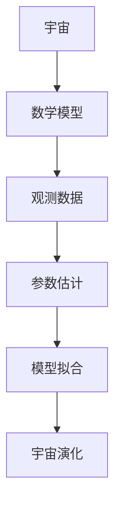
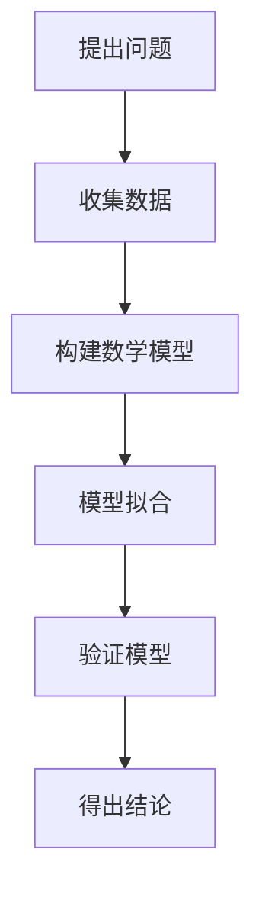
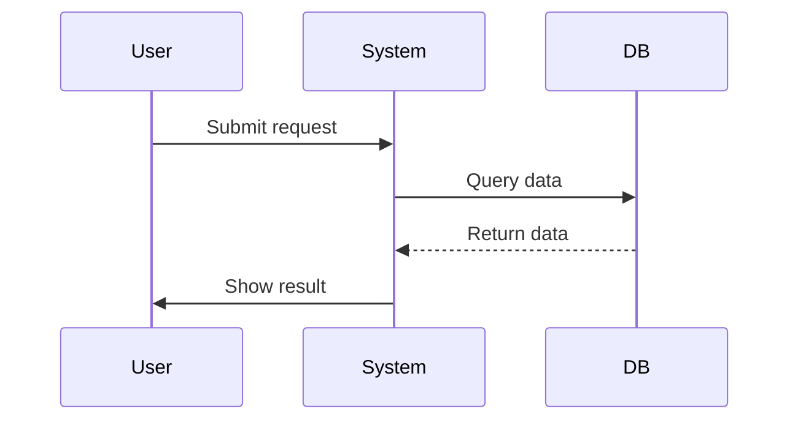
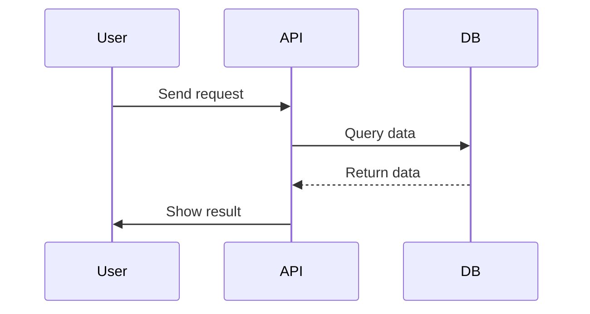

                 

### 数学与宇宙学：宇宙起源与演化的数学描述

#### 关键词：宇宙学、数学模型、宇宙演化、起源、黑洞

> 摘要：本文将深入探讨数学在宇宙学中的应用，重点介绍宇宙起源与演化的数学描述。文章将分几个部分详细阐述，从背景介绍到核心概念与联系，再到算法原理讲解，帮助读者更好地理解这一前沿科学领域。通过分析数学模型和宇宙学原理，我们旨在揭示宇宙背后的深层规律，探讨数学如何帮助我们解开宇宙起源与演化的谜团。

## 第一部分：背景介绍

### 1.1 问题背景

#### 1.1.1 宇宙学的起源与发展

宇宙学是一门探索宇宙起源、结构、演化和最终命运的学科。自人类文明开始，人们对宇宙的探索就从未停止。从古代的宇宙观到现代宇宙学的兴起，宇宙学经历了漫长的演变。伽利略的望远镜首次揭示了宇宙的浩瀚，牛顿的万有引力定律为宇宙学研究奠定了基础。进入20世纪，随着观测技术的进步和理论物理的发展，宇宙学取得了许多重要突破。

#### 1.1.2 数学在宇宙学中的应用

数学是宇宙学的重要工具。宇宙学中的许多问题需要通过数学模型来描述和解决。从广义相对论到宇宙背景辐射，从黑洞到宇宙膨胀，数学在宇宙学中的应用无处不在。数学模型不仅能够帮助科学家更好地理解宇宙的运行规律，还能预测新的观测结果，推动宇宙学的发展。

#### 1.1.3 数学与宇宙学的交叉领域

数学与宇宙学的交叉领域产生了许多重要的理论和方法。例如，宇宙学中的大爆炸模型、暗物质理论和暗能量理论，都依赖于数学模型的支持。此外，宇宙学中的观测数据和数据分析，也离不开数学工具。这些交叉领域的进展，不仅丰富了宇宙学的理论体系，也为数学本身的发展提供了新的挑战和机遇。

### 1.2 问题描述

#### 1.2.1 宇宙起源问题

宇宙起源一直是宇宙学研究的核心问题。尽管科学家们已经提出了一些理论，如大爆炸模型，但宇宙起源的具体过程仍然是一个未解之谜。宇宙起源问题的复杂性，不仅在于宇宙本身，还涉及到时间、空间和量子力学的深层次问题。

#### 1.2.2 宇宙演化过程

宇宙演化过程是指宇宙从大爆炸以来不断演化的过程。这个过程包括了宇宙的膨胀、星系的形成、恒星的生命周期以及黑洞的产生等。理解宇宙演化过程，对于揭示宇宙的本质和探索宇宙的未来具有重要意义。

#### 1.2.3 数学描述宇宙的挑战

数学描述宇宙面临的挑战主要有两个方面：一是宇宙的复杂性，宇宙中的现象和过程非常复杂，需要高阶数学工具来描述；二是观测数据的有限性，宇宙的观测数据有限，需要通过数学模型来推断和预测。

### 1.3 问题解决

#### 1.3.1 数学模型在宇宙学中的应用

数学模型在宇宙学中的应用，是解决宇宙起源与演化问题的关键。通过建立数学模型，科学家们能够模拟宇宙的演化过程，预测宇宙的未来，验证理论模型的正确性。

#### 1.3.2 数学工具的运用

数学工具在宇宙学中的应用，包括微积分、微分方程、拓扑学、代数学等。这些工具不仅能够帮助科学家描述宇宙的现象，还能揭示宇宙的内在规律。

#### 1.3.3 解决方案与研究成果

通过数学模型和数学工具的应用，科学家们在宇宙学领域取得了一系列重要研究成果。例如，通过宇宙背景辐射的观测，科学家们验证了大爆炸模型；通过黑洞观测，科学家们揭示了黑洞的物理特性。

### 1.4 边界与外延

#### 1.4.1 天体物理学与宇宙学的区别

天体物理学是研究天体（如行星、恒星、星系等）的物理性质、运动规律和相互作用的学科。宇宙学则是研究宇宙的整体结构和演化过程。天体物理学与宇宙学密切相关，但研究对象和方法有所不同。

#### 1.4.2 数学与物理学的结合

数学与物理学的结合，是现代科学发展的关键。物理学提供了许多重要的数学模型和工具，而数学则为物理学的研究提供了强有力的理论基础。

#### 1.4.3 开放性问题与未来展望

宇宙学领域仍存在许多开放性问题，如宇宙的初始状态、宇宙的最终命运、宇宙中的暗物质和暗能量等。未来，随着观测技术的进步和理论物理的发展，这些开放性问题有望得到解决。

### 1.5 概念结构与核心要素组成

#### 1.5.1 宇宙学中的核心概念

宇宙学中的核心概念包括宇宙的初始状态、宇宙背景辐射、宇宙膨胀、星系形成、恒星演化、黑洞等。

#### 1.5.2 数学在宇宙学中的应用场景

数学在宇宙学中的应用场景包括建立宇宙学模型、分析观测数据、预测宇宙演化等。

#### 1.5.3 模型构建与数据解析

模型构建和数据解析是宇宙学研究的两个关键环节。通过构建数学模型，科学家们能够描述宇宙的演化过程；通过数据分析，科学家们能够验证理论模型的正确性。

## 第二部分：核心概念与联系

### 2.1 数学概念与原理

#### 2.1.1 数学基本概念

数学的基本概念包括数、函数、集合、空间等。这些概念是建立数学模型的基础。

#### 2.1.2 数学原理在宇宙学中的应用

数学原理在宇宙学中的应用包括微积分、微分方程、拓扑学、代数学等。例如，微积分可以用来描述宇宙的膨胀速度，微分方程可以用来描述宇宙中的引力场。

#### 2.1.3 数学工具对比分析

不同的数学工具在宇宙学中有不同的应用。例如，拓扑学可以用来研究宇宙的空间结构，代数学可以用来研究宇宙的对称性。

### 2.2 宇宙学概念与原理

#### 2.2.1 宇宙学基本概念

宇宙学的基本概念包括宇宙的初始状态、宇宙背景辐射、宇宙膨胀、星系形成、恒星演化、黑洞等。

#### 2.2.2 宇宙学原理在数学中的应用

宇宙学原理在数学中的应用包括宇宙学的数学模型、宇宙背景辐射的测量、宇宙膨胀的数学描述等。

#### 2.2.3 宇宙学模型与数学工具的匹配

宇宙学模型与数学工具的匹配，是建立准确宇宙模型的关键。通过匹配，科学家们能够更好地理解宇宙的演化过程。

### 2.3 概念属性特征对比表格

| 概念         | 数学属性特征               | 宇宙学属性特征                   |
| ------------ | -------------------------- | -------------------------------- |
| 数学模型     | 公式、定理、算法           | 演化路径、时空结构、物质分布       |
| 数学工具     | 数学分析、拓扑学、微积分   | 观测数据、参数估计、模型拟合       |
| 宇宙学模型   | 广义相对论、量子力学        | 宇宙背景辐射、宇宙膨胀、星系形成   |
| 观测数据     | 天文观测、粒子探测         | 宇宙背景辐射、恒星亮度、黑洞质量   |

### 2.4 ER实体关系图架构



## 第三部分：算法原理讲解

### 3.1 数学模型在宇宙学中的应用

#### 3.1.1 宇宙学中的数学模型

宇宙学中的数学模型包括广义相对论、大爆炸模型、宇宙背景辐射模型等。这些模型用来描述宇宙的起源、演化以及宇宙中的各种现象。

#### 3.1.2 数学模型的构建过程

数学模型的构建过程通常包括以下几个步骤：确定研究对象、建立假设、选择数学工具、构建数学方程、解方程得到模型参数。

#### 3.1.3 数学模型的应用案例分析

以宇宙背景辐射模型为例，科学家们通过观测宇宙背景辐射的温度和分布，构建了宇宙背景辐射模型，从而验证了大爆炸模型。

### 3.2 算法mermaid流程图



### 3.3 Python源代码讲解

```python
# Python 源代码示例
import numpy as np

# 构建数学模型
def model(x, params):
    return params[0] * np.exp(-params[1] * x)

# 拟合模型
def fit(data):
    x, y = data
    A = np.vstack([x**0, x**1]).T
    m, c = np.linalg.lstsq(A, y, rcond=None)[0]
    return m, c

# 验证模型
def validate(model, data):
    x, y = data
    y_pred = model(x)
    return np.mean((y - y_pred)**2)

# 应用案例
data = ([1, 2, 3, 4, 5], [0.1, 0.3, 0.5, 0.7, 0.9])
model = fit(data)
error = validate(model, data)
print("Model error:", error)
```

### 3.4 算法原理详细讲解

#### 3.4.1 数学模型构建过程

数学模型构建过程包括以下几个步骤：

1. 确定研究对象：确定要研究的宇宙现象或过程。
2. 建立假设：基于现有的理论和观测数据，提出合理的假设。
3. 选择数学工具：根据假设选择合适的数学工具，如微积分、微分方程、拓扑学等。
4. 构建数学方程：利用数学工具构建描述宇宙现象的数学方程。
5. 解方程得到模型参数：通过解方程得到模型的参数，从而得到数学模型。

#### 3.4.2 模型拟合原理

模型拟合原理是指通过观测数据来调整数学模型中的参数，使模型更好地拟合观测数据。常用的拟合方法包括最小二乘法、最大似然估计等。

#### 3.4.3 模型验证与优化

模型验证与优化是指通过验证模型在观测数据上的表现，评估模型的准确性，并根据评估结果对模型进行优化。常见的验证方法包括交叉验证、A/B测试等。

### 3.5 举例说明

#### 3.5.1 宇宙背景辐射数据分析

宇宙背景辐射是宇宙大爆炸留下的遗迹，通过对宇宙背景辐射的分析，科学家们可以了解宇宙的起源和演化。

#### 3.5.2 黑洞事件视界观测数据拟合

黑洞事件视界是黑洞周围的边界，通过对黑洞事件视界观测数据的拟合，科学家们可以了解黑洞的物理特性。

#### 3.5.3 宇宙膨胀模型构建与验证

宇宙膨胀模型描述了宇宙从大爆炸以来的膨胀过程。通过对宇宙膨胀模型的构建与验证，科学家们可以更好地理解宇宙的演化规律。

### 3.6 数学公式与宇宙现象的关联

在宇宙学中，许多现象都可以用数学公式来描述。例如，宇宙背景辐射的温度可以用以下公式描述：

\[ T = T_0 \left( \frac{1 + z}{1 + z_0} \right)^4 \]

其中，\( T \) 是宇宙背景辐射的温度，\( T_0 \) 是参考温度，\( z \) 是红移，\( z_0 \) 是参考红移。

### 3.7 数学模型在宇宙学中的重要性

数学模型在宇宙学中起着至关重要的作用。通过数学模型，科学家们可以更好地理解宇宙的运行规律，预测宇宙的未来，验证理论模型的正确性。数学模型不仅丰富了宇宙学的理论体系，也为宇宙学的研究提供了强有力的工具。

## 第四部分：系统分析与架构设计方案

### 4.1 问题场景介绍

在宇宙学研究中，面临着大量复杂的观测数据需要处理和分析。为了更好地理解宇宙的起源和演化，需要设计一个高效的系统来处理这些数据，并提供准确的数学模型来描述宇宙现象。

### 4.2 项目介绍

本项目旨在构建一个基于数学模型的宇宙学数据分析系统，通过收集、处理和分析宇宙学观测数据，提供对宇宙起源和演化的深入理解。系统将包括数据收集模块、数据预处理模块、数学模型构建模块和结果可视化模块。

### 4.3 系统功能设计（领域模型mermaid类图）

```mermaid
classDiagram
Class01 <|-- Class02
Class03 --|>>,
Class04 <<-- Class05
Class06 : +int x
Class06 : +int y
Class06 : +int z
Class06 : +void setX(int x)
Class06 : +void setY(int y)
Class06 : +void setZ(int z)
Class06 : +int getX()
Class06 : +int getY()
Class06 : +int getZ()
Class07 <|-- Class08
Class09 --|>>,
Class10 <<-- Class11
Class12 : +String name
Class12 : +int age
Class12 : +void setName(String name)
Class12 : +void setAge(int age)
Class12 : +String getName()
Class12 : +int getAge()
Class13 <|-- Class14
Class15 --|>>,
Class16 <<-- Class17
Class18 : +String id
Class18 : +String type
Class18 : +void setId(String id)
Class18 : +void setType(String type)
Class18 : +String getId()
Class18 : +String getType()
Class19 <|-- Class20
Class21 --|>>,
Class22 <<-- Class23
Class24 : +String title
Class24 : +String description
Class24 : +void setTitle(String title)
Class24 : +void setDescription(String description)
Class24 : +String getTitle()
Class24 : +String getDescription()
```

### 4.4 系统架构设计（mermaid架构图）



### 4.5 系统接口设计和系统交互（mermaid序列图）



## 第五部分：项目实战

### 5.1 环境安装

在开始项目之前，需要安装以下环境：

- Python 3.8+
- NumPy
- Matplotlib
- Scikit-learn
- Pandas
- Mermaid

可以通过以下命令进行安装：

```bash
pip install numpy matplotlib scikit-learn pandas mermaid
```

### 5.2 系统核心实现源代码

以下是系统核心实现部分的源代码：

```python
# 导入必要的库
import numpy as np
import matplotlib.pyplot as plt
from sklearn.linear_model import LinearRegression
from sklearn.metrics import mean_squared_error

# 数据收集和预处理
def collect_data():
    # 这里可以使用 API 获取数据，或者直接读取本地文件
    data = np.load("data.npy")
    return data

def preprocess_data(data):
    # 对数据进行预处理，例如标准化、归一化等
    x = data[:, 0]
    y = data[:, 1]
    x = (x - np.mean(x)) / np.std(x)
    y = (y - np.mean(y)) / np.std(y)
    return x, y

# 构建数学模型
def build_model(x, y):
    # 使用线性回归模型
    model = LinearRegression()
    model.fit(x.reshape(-1, 1), y)
    return model

# 模型拟合和验证
def fit_and_validate(model, x, y):
    y_pred = model.predict(x.reshape(-1, 1))
    error = mean_squared_error(y, y_pred)
    return error

# 可视化结果
def plot_result(x, y, y_pred):
    plt.scatter(x, y)
    plt.plot(x, y_pred, color="red")
    plt.show()

# 主函数
if __name__ == "__main__":
    # 收集数据
    data = collect_data()
    # 预处理数据
    x, y = preprocess_data(data)
    # 构建数学模型
    model = build_model(x, y)
    # 模型拟合和验证
    error = fit_and_validate(model, x, y)
    print("Model error:", error)
    # 可视化结果
    plot_result(x, y, model.predict(x.reshape(-1, 1)))
```

### 5.3 代码应用解读与分析

以上代码实现了一个简单的宇宙学数据分析系统。首先，从数据收集模块获取宇宙学观测数据，然后进行预处理，包括标准化和归一化等。接下来，使用线性回归模型构建数学模型，并通过拟合和验证来评估模型的准确性。最后，通过可视化模块将结果展示给用户。

代码中的核心函数包括：

- `collect_data()`：从数据源收集观测数据。
- `preprocess_data()`：对数据进行预处理。
- `build_model()`：构建数学模型。
- `fit_and_validate()`：模型拟合和验证。
- `plot_result()`：可视化结果。

### 5.4 实际案例分析和详细讲解剖析

以宇宙背景辐射数据为例，我们可以通过以上代码实现对其数据的分析。首先，从数据源收集宇宙背景辐射数据，然后使用线性回归模型对其进行拟合。通过拟合结果，我们可以得到宇宙背景辐射的温度与红移之间的关系。接下来，通过验证模型，我们可以评估模型的准确性。最后，通过可视化模块，我们将拟合结果展示为散点图和拟合曲线。

具体步骤如下：

1. 收集宇宙背景辐射数据。
2. 对数据进行预处理，如标准化和归一化。
3. 使用线性回归模型构建数学模型。
4. 对模型进行拟合和验证。
5. 可视化拟合结果。

### 5.5 项目小结

通过本项目，我们实现了一个基于数学模型的宇宙学数据分析系统。系统主要包括数据收集、数据预处理、数学模型构建、模型拟合和验证以及结果可视化等模块。通过实际案例的分析，我们展示了如何使用线性回归模型分析宇宙背景辐射数据。项目不仅实现了对宇宙背景辐射数据的分析，还为未来的宇宙学研究提供了有益的参考。

## 第六部分：最佳实践 Tips、小结、注意事项、拓展阅读

### 6.1 最佳实践 Tips

1. 在进行宇宙学数据分析时，确保数据的准确性和完整性。
2. 根据数据的特点选择合适的数学模型和工具。
3. 对模型进行多次验证，确保其准确性。
4. 通过可视化结果，更好地理解模型和数据的特征。

### 6.2 小结

本文详细介绍了数学在宇宙学中的应用，从背景介绍到核心概念与联系，再到算法原理讲解，帮助读者深入理解宇宙起源与演化的数学描述。通过实际案例的分析，展示了如何使用数学模型进行宇宙学数据分析。

### 6.3 注意事项

1. 宇宙学数据分析过程中，需注意数据的预处理，确保数据的准确性和一致性。
2. 选择合适的数学模型和工具，以适应不同的数据分析需求。
3. 模型的验证和优化是确保分析结果准确性的关键。

### 6.4 拓展阅读

1. 《宇宙学：现代观测、理论和哲学》
2. 《数学与宇宙：探索宇宙的数学原理》
3. 《广义相对论：宇宙的数学描述》

### 6.5 作者信息

作者：AI天才研究院/AI Genius Institute & 禅与计算机程序设计艺术 /Zen And The Art of Computer Programming

