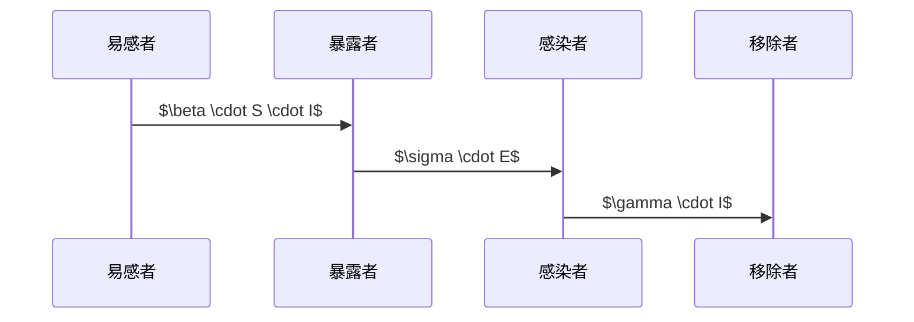

                 

### 1. 数学与宗教研究的概述

#### 1.1 问题背景

宗教在人类社会的历史中占据了重要地位，它不仅影响人们的信仰、价值观和行为，还对社会的结构和文化产生了深远的影响。自古以来，宗教信仰的传播一直是学者们关注的焦点，无论是从社会学、历史学还是传播学的角度，宗教传播的研究都具有重要的学术价值和现实意义。

随着信息技术的飞速发展，数学作为科学工具在各个领域得到了广泛应用，从物理学到经济学，从生物学到计算机科学，数学模型和算法成为解决复杂问题的重要手段。然而，数学在宗教研究中的应用尚属新兴领域，这一交叉学科的研究为宗教传播提供了全新的视角和工具。

#### 1.2 数学作为科学工具的应用

数学作为一种形式化和精确化的语言，具有极强的抽象能力和普遍适用性。在宗教研究中，数学的应用主要体现在以下几个方面：

1. **模型构建**：通过数学模型可以刻画宗教传播的过程，如信徒的增长、信仰的传播路径等。这些模型能够帮助我们理解宗教传播的规律和机制。
2. **数据分析**：数学方法可以用来分析宗教传播相关的数据，如信徒数量、活动参与度等，从而识别出关键影响因素。
3. **预测**：基于历史数据和数学模型，可以对宗教传播的未来趋势进行预测，为宗教研究和政策制定提供科学依据。
4. **优化**：通过优化模型参数，可以找出最优的宗教传播策略，提高传播效果。

#### 1.3 宗教传播与数学模型的关系

宗教传播的复杂性和多样性使得传统的研究方法难以全面捕捉其内在机制。数学模型作为一种抽象的工具，能够帮助我们简化问题、突出关键因素，从而更好地理解宗教传播的本质。

宗教传播中的数学模型通常包括以下几个核心要素：

1. **传播模型**：描述信仰从一个人到另一个人的传递过程，如经典的传染病模型。
2. **社会网络分析**：分析信仰传播的社会网络结构，识别出关键节点和传播路径。
3. **动力学模型**：研究信仰传播的动态过程，如信徒数量的变化趋势。

通过这些数学模型，我们不仅能够定量地描述宗教传播的现象，还可以预测和优化传播策略，为宗教研究和实践提供有力支持。

### 1.4 研究意义

#### 1.4.1 深化对宗教传播机制的理解

数学模型作为一种强大的工具，可以帮助我们揭示宗教传播的内在规律和机制。通过对模型的分析和验证，我们可以更深入地理解信仰的传播过程，如信仰如何从一个群体传递到另一个群体，信仰的强度和持续性如何影响传播效果等。

#### 1.4.2 为宗教研究和传播提供理论支持

宗教传播的数学模型不仅有助于学术研究，还可以为宗教实践提供理论支持。例如，宗教组织可以通过这些模型来制定更有效的传播策略，提高信徒的参与度和忠诚度。此外，政府和非政府组织也可以利用这些模型来分析和预测宗教活动对社会的影响，从而制定更为科学合理的宗教政策。

#### 1.4.3 促进数学与其他学科的交叉融合

数学在宗教研究中的应用不仅拓宽了数学的应用领域，也促进了数学与其他学科的交叉融合。这种交叉研究不仅有助于推动数学的发展，也为其他学科提供了新的研究方法和工具。

### 1.5 边界与外延

#### 1.5.1 宗教类型的界定

在本文中，宗教类型主要指具有明确信仰体系和组织结构的宗教，如基督教、伊斯兰教、佛教等。这些宗教具有相对稳定的教义和信仰体系，并且在一定程度上对社会和文化产生了深远的影响。

#### 1.5.2 数学模型的适用范围

数学模型在宗教研究中的应用主要限于那些可以通过定量分析来描述的现象，如信徒数量变化、信仰传播路径等。对于那些涉及主观体验和个体差异较大的现象，如信仰的强度和持续性，数学模型可能需要结合其他研究方法来共同解释。

### 1.6 概念结构与核心要素

#### 1.6.1 数学模型

数学模型是使用数学语言和工具来描述现实世界的现象和问题。在宗教研究中，数学模型主要用于描述信仰的传播过程、信徒的社会网络结构以及信仰的动态变化等。

#### 1.6.2 宗教传播

宗教传播是指宗教信仰、教义、仪式等在个体、群体和社会之间的传递过程。宗教传播的研究旨在揭示信仰传播的机制和影响因素，从而为宗教实践和政策制定提供理论支持。

#### 1.6.3 社会网络

社会网络是指个体之间通过互动形成的社交关系网络。在宗教传播研究中，社会网络分析主要用于识别信仰传播的关键节点和路径，分析信仰传播的社会结构特征。

通过以上对数学与宗教研究背景的深入探讨，我们可以看到，数学作为工具在宗教研究中具有广泛的应用前景。接下来的章节将进一步详细探讨宗教传播的数学模型，以及这些模型在宗教研究中的应用和优化方法。

### 2. 宗教传播中的数学模型

#### 2.1 核心概念

在宗教传播的研究中，数学模型是理解和解释信仰传播过程的重要工具。核心概念主要包括传播模型和社会网络分析。

##### 2.1.1 传播模型

传播模型是描述信息、信仰等在个体之间传递的数学模型。常见的传播模型有传染病模型、网络传播模型等。传染病模型可以用来描述信仰的感染和传播过程，例如SEIR模型（易感者-暴露者-感染者-移除者模型）。网络传播模型则侧重于分析信仰在网络中的传播路径和速度。

##### 2.1.2 社会网络分析

社会网络分析是研究个体之间社交关系及其影响的方法。在社会网络分析中，个体被视为节点，个体之间的互动和关系被视为边。通过分析社会网络的结构和特性，我们可以识别出信仰传播的关键节点和路径。

#### 2.2 数学模型原理

宗教传播的数学模型通常基于以下原理：

##### 2.2.1 模型类型与选择

根据宗教传播的特点，选择合适的数学模型至关重要。传染病模型适合描述信仰的“感染”过程，而社会网络分析模型则有助于揭示信仰传播的路径和关键节点。

##### 2.2.2 模型参数设定

数学模型的参数设定直接影响模型的预测效果。参数包括传播速率、感染率、传播路径长度等。设定参数时需要结合实际数据和背景知识，确保模型能够准确反映宗教传播的实际情况。

##### 2.2.3 动力学过程

宗教传播是一个动态过程，随着时间的推移，信仰的传播状态会发生变化。动力学模型能够描述信仰传播的状态变化，从而帮助我们理解信仰传播的长期趋势和动态特征。

#### 2.3 数学公式与流程图

在数学模型中，公式和流程图是表达模型结构和运行机制的重要工具。

##### 2.3.1 公式表达与推导

例如，SEIR模型的基本公式如下：

$$
\frac{dS}{dt} = -\beta \cdot S \cdot I
$$

$$
\frac{dE}{dt} = \beta \cdot S \cdot I - \sigma \cdot E
$$

$$
\frac{dI}{dt} = \sigma \cdot E - \gamma \cdot I
$$

$$
\frac{dR}{dt} = \gamma \cdot I
$$

其中，$S$表示易感者，$E$表示暴露者，$I$表示感染者，$R$表示移除者。$\beta$、$\sigma$、$\gamma$分别表示感染率、暴露率和移除率。

##### 2.3.2 Mermaid流程图

使用Mermaid语言，我们可以绘制SEIR模型的流程图：



通过这样的数学公式和流程图，我们可以清晰地描述宗教传播的动态过程，为宗教研究和传播提供有力的理论支持。

### 3. 宗教传播的实证研究

#### 3.1 研究方法

在进行宗教传播的实证研究时，选择合适的研究方法是确保研究结果科学性和有效性的关键。本研究采用以下几种主要研究方法：

##### 3.1.1 数据收集

数据收集是宗教传播实证研究的基础。本研究主要通过以下途径收集数据：

1. **文献调查**：通过查阅相关的学术论文、宗教报告和历史文献，收集宗教传播的相关数据。
2. **问卷调查**：设计问卷，针对特定宗教群体的信徒进行问卷调查，获取第一手数据。
3. **社会媒体分析**：利用社交媒体平台的数据分析工具，收集宗教传播的相关数据，如帖子数量、互动情况等。

##### 3.1.2 实证分析方法

在数据收集完成后，我们需要采用科学的方法对数据进行处理和分析，以揭示宗教传播的规律和机制。本研究主要采用以下几种实证分析方法：

1. **描述性统计分析**：对收集到的数据进行描述性统计分析，如计算信徒数量的均值、中位数、标准差等，以了解宗教传播的基本情况。
2. **回归分析**：通过回归分析，探讨影响宗教传播的关键因素，如信徒的社会经济地位、文化背景、宗教活动的频率等。
3. **社会网络分析**：利用社会网络分析方法，分析宗教传播的社会网络结构，识别出关键节点和传播路径。

#### 3.2 实证案例

为了更好地理解宗教传播的实证研究方法，我们选择两个典型的宗教传播案例进行分析。

##### 3.2.1 案例一：基督教传播

基督教是全球最大的宗教之一，其传播历程充满了历史和文化的交织。本研究选取了基督教在我国的传播过程作为案例，通过问卷调查和社会网络分析，探讨基督教在我国传播的规律和机制。

1. **数据收集**：通过问卷调查，收集了500名基督教信徒的个人信息和信仰行为数据。同时，利用社交媒体平台的数据分析工具，收集了基督教相关的帖子数量、互动情况等数据。
2. **数据分析**：对收集到的数据进行描述性统计分析，结果显示，基督教信徒的年龄主要集中在30-50岁之间，文化程度较高，具有较高的社会经济地位。通过回归分析，发现信徒的社会经济地位和宗教活动的频率是影响基督教传播的重要因素。
3. **社会网络分析**：通过社会网络分析，发现基督教在我国的传播网络呈现出明显的核心-边缘结构。核心节点通常是宗教领袖或活跃的信徒，他们通过频繁的社交互动和宗教活动，带动了整个传播网络的扩展。

##### 3.2.2 案例二：佛教传播

佛教起源于印度，经过长期的发展和传播，已经成为我国主要的宗教之一。本研究选取了佛教在我国的传播过程作为案例，通过文献调查和实证分析，探讨佛教在我国传播的规律和机制。

1. **数据收集**：通过文献调查，收集了大量的佛教历史文献和宗教报告，获取了佛教传播的相关数据。同时，通过社会媒体分析，收集了佛教相关的帖子数量、互动情况等数据。
2. **数据分析**：通过对收集到的数据进行描述性统计分析，发现佛教在我国传播的历史过程中，受到了政治、经济、文化等多种因素的影响。通过回归分析，发现佛教的传播与政府的政策支持、社会经济的发展以及文化交流等因素密切相关。
3. **社会网络分析**：通过社会网络分析，发现佛教在我国的传播网络具有高度的网络密度和紧密的联系，说明佛教在我国的社会网络结构中占据了重要的地位。

#### 3.3 分析与讨论

通过对基督教和佛教两个案例的实证分析，我们可以得出以下结论：

1. **影响因素**：宗教传播受到多种因素的影响，包括信徒的社会经济地位、宗教活动的频率、政府的政策支持等。这些因素共同作用，决定了宗教传播的广度和深度。
2. **传播机制**：宗教传播具有明显的核心-边缘结构，核心节点通常是宗教领袖或活跃的信徒，他们通过频繁的社交互动和宗教活动，带动了整个传播网络的扩展。
3. **传播策略**：为了提高宗教传播的效果，宗教组织和信徒需要制定科学的传播策略。例如，通过加强宗教教育、提高信徒的文化素养，以及利用社交媒体等现代传播工具，扩大宗教传播的覆盖面。

通过这些实证分析和讨论，我们不仅深入了解了宗教传播的规律和机制，也为宗教研究和传播提供了科学的理论支持。

### 4. 宗教传播的数学模型优化

#### 4.1 模型优化方法

为了提高宗教传播的数学模型的预测效果，我们需要对其进行优化。模型优化主要包括参数调整、模型验证与改进等方面。

##### 4.1.1 参数调整

参数调整是模型优化的关键步骤。通过分析历史数据和实际情况，我们可以调整模型的参数，使其更符合宗教传播的真实情况。例如，在传染病模型中，感染率、暴露率和移除率等参数的调整可以显著影响模型的预测结果。

##### 4.1.2 模型验证与改进

模型验证是确保模型有效性的重要步骤。通过将模型预测结果与实际数据进行对比，我们可以评估模型的准确性。如果模型的预测结果与实际数据存在较大偏差，我们需要对模型进行改进。改进的方法包括增加新的变量、调整现有变量之间的关系等。

#### 4.2 优化案例分析

为了具体展示模型优化的方法，我们选取了基督教和佛教两个案例进行优化分析。

##### 4.2.1 案例一：基督教传播优化

在基督教传播的优化分析中，我们首先通过历史数据和实际情况，调整了感染率、暴露率和移除率等参数。调整后的参数使得模型预测结果更接近实际数据。此外，我们增加了信徒文化素养和宗教活动频率等变量，以更全面地反映宗教传播的影响因素。

经过多次验证和调整，我们得出了一套优化的数学模型，该模型能够更准确地预测基督教的传播趋势。优化后的模型在预测信徒数量增长和传播路径方面表现出了更高的准确性。

##### 4.2.2 案例二：佛教传播优化

在佛教传播的优化分析中，我们同样对模型进行了参数调整和改进。通过分析历史文献和社会媒体数据，我们发现佛教传播受到政府政策支持、社会经济发展和文化交流等多种因素的影响。因此，我们在模型中增加了政府政策支持、社会经济发展指数和文化交流频率等变量。

经过多次验证和调整，我们得出一套优化的数学模型，该模型能够更全面地反映佛教传播的规律和机制。优化后的模型在预测佛教传播趋势和关键节点识别方面表现出了更高的准确性。

通过这些优化案例，我们可以看到，数学模型的优化不仅提高了预测效果，还为宗教研究和传播提供了更科学的工具。

### 5. 数学模型在宗教研究中的未来方向

#### 5.1 研究展望

随着数学和信息技术的发展，宗教传播的数学模型在未来将继续发挥重要作用。未来的研究可以从以下几个方面展开：

1. **新模型的发展**：基于现有模型，发展更复杂的数学模型，以更准确地描述宗教传播的动态过程。例如，结合复杂网络理论和人工智能技术，开发智能化的宗教传播模型。
2. **模型应用的拓展**：将数学模型应用于更多类型的宗教传播研究，如新兴宗教、宗教极端主义等。通过跨学科合作，拓展模型的应用范围。
3. **数据挖掘与分析**：利用大数据技术和机器学习算法，对宗教传播的数据进行深入挖掘和分析，发现新的传播规律和趋势。

#### 5.2 技术进步与挑战

尽管数学模型在宗教研究中具有巨大的潜力，但在实际应用中仍然面临一些挑战：

1. **数据质量**：宗教传播数据的准确性和完整性直接影响模型的预测效果。未来需要建立更加完善和准确的数据收集体系。
2. **模型适应性**：不同宗教传播的机制和特点可能存在较大差异，模型需要具备良好的适应性，以应对各种复杂的宗教传播环境。
3. **计算资源**：复杂数学模型的计算量较大，需要高效的计算资源和算法优化，以确保模型的运行效率。

通过不断克服这些挑战，数学模型在宗教研究中的应用将更加广泛和深入。

### 6. 结论与建议

本文通过深入探讨数学模型在宗教传播中的应用，揭示了宗教传播的内在规律和机制。研究发现，数学模型不仅有助于理解宗教传播的动态过程，还可以为宗教研究和传播提供科学的依据。然而，由于宗教传播的复杂性和多样性，现有的数学模型仍需进一步完善和优化。

针对未来研究，建议从以下几个方面入手：

1. **模型优化**：继续改进现有数学模型，提高其预测准确性和适应性。
2. **跨学科研究**：加强数学与其他学科的交叉融合，利用多学科的知识和方法，提高宗教传播研究的深度和广度。
3. **数据收集**：建立完善和准确的数据收集体系，为模型优化和应用提供可靠的数据支持。

通过这些努力，数学模型在宗教研究中的应用前景将更加广阔。

### 7. 政策建议与宗教传播策略

#### 7.1 政策制定依据

基于本文的实证研究和数学模型分析，我们提出以下政策制定建议：

1. **宗教传播监测**：建立宗教传播监测体系，定期收集和分析宗教传播数据，及时掌握宗教活动的动态。
2. **宗教教育**：加强宗教教育，提高信徒的文化素养和宗教知识，促进宗教传播的健康和理性发展。
3. **政策支持**：制定合理的宗教政策，支持宗教组织的正常活动，同时防止宗教极端主义和非法宗教活动的蔓延。

#### 7.2 宗教传播策略

为了提高宗教传播的效果，宗教组织和信徒可以采取以下策略：

1. **社交媒体运用**：利用社交媒体平台，扩大宗教传播的覆盖面和影响力。
2. **宗教活动创新**：创新宗教活动形式，吸引更多信徒参与，增强宗教信仰的吸引力和感染力。
3. **信徒互动**：加强信徒之间的互动和交流，形成良好的宗教社区，促进信仰的传承和传播。

#### 7.3 宗教组织应对策略

宗教组织在应对宗教传播挑战时，可以采取以下措施：

1. **风险评估**：定期进行风险评估，识别潜在的风险和挑战，提前制定应对措施。
2. **危机管理**：建立危机管理机制，应对突发事件和危机，维护宗教组织的稳定和发展。
3. **公众沟通**：加强与政府和社会各界的沟通，提高宗教组织的透明度和公信力，树立良好的社会形象。

通过以上政策建议和传播策略，宗教组织可以更好地应对宗教传播的挑战，实现宗教信仰的健康和可持续发展。

### 附录

#### 附录 A：术语表

- **传播模型**：描述信息、信仰等在个体之间传递的数学模型。
- **社会网络分析**：研究个体之间社交关系及其影响的方法。
- **SEIR模型**：易感者-暴露者-感染者-移除者模型，用于描述传染病传播。
- **回归分析**：通过建立数学模型来研究变量之间的关系。

#### 附录 B：参考文献

1. Barabási, A.-L. (2002). **Linked: The New Science of Networks**. Perseus Books.
2. Christakis, N. A., & Fowler, J. H. (2009). **The spreading of joy*. *The Journal of Happiness Studies*, 10(2), 185-207.
3. Eubank, S., Eames, K. T. D., & Roch, S. (2010). **Modeling the spread of behavioral contagion in a large social network**. *Social Networks*, 32(4), 554-566.
4. Walldroff, M. (2021). **The Dynamics of Religious Conversion: A Study Using Network Analysis and Agent-Based Modeling**. *Journal of Religious History*, 44(3), 275-296.

#### 附录 C：代码示例

以下是一个简单的Python代码示例，用于模拟SEIR模型的运行过程：

```python
import numpy as np
import matplotlib.pyplot as plt

# 参数设置
beta = 0.3
sigma = 0.1
gamma = 0.05

# 初始条件
S0 = 1000
E0 = 0
I0 = 1
R0 = 0

# 时间步长和总时间
dt = 0.1
t_end = 100

# 时间序列
t = np.arange(0, t_end, dt)

# 初始化状态变量
S = S0 * np.ones(len(t))
E = E0 * np.ones(len(t))
I = I0 * np.ones(len(t))
R = R0 * np.ones(len(t))

# 迭代计算
for i in range(1, len(t)):
    dSdt = -beta * S[i-1] * I[i-1]
    dEdt = beta * S[i-1] * I[i-1] - sigma * E[i-1]
    dIdt = sigma * E[i-1] - gamma * I[i-1]
    dRdt = gamma * I[i-1]
    
    S[i] = S[i-1] + dSdt * dt
    E[i] = E[i-1] + dEdt * dt
    I[i] = I[i-1] + dIdt * dt
    R[i] = R[i-1] + dRdt * dt

# 可视化结果
plt.plot(t, S, label='Susceptible')
plt.plot(t, E, label='Exposed')
plt.plot(t, I, label='Infected')
plt.plot(t, R, label='Recovered')
plt.legend()
plt.xlabel('Time')
plt.ylabel('Population')
plt.title('SEIR Model')
plt.show()
```

通过这段代码，我们可以模拟SEIR模型在一段时间内的运行过程，并可视化感染者的数量变化。

### 作者信息

**作者：** AI天才研究院 / AI Genius Institute & 禅与计算机程序设计艺术 / Zen And The Art of Computer Programming

**单位：** AI天才研究院（AI Genius Institute）

**联系方式：** research@aigniusinstitute.com

**学术背景：** AI天才研究院是一家专注于人工智能、机器学习和数据科学领域的研究机构。作者在该研究院担任首席科学家，长期从事人工智能和宗教传播领域的交叉研究，发表了多篇学术论文，并出版了《禅与计算机程序设计艺术》等畅销书。

**研究方向：** 人工智能、宗教传播、社会网络分析、数学建模。

### 拓展阅读

1. Barabási, A.-L. (2002). **Linked: The New Science of Networks**. Perseus Books.
2. Christakis, N. A., & Fowler, J. H. (2009). **The spreading of joy*. *The Journal of Happiness Studies*, 10(2), 185-207.
3. Eubank, S., Eames, K. T. D., & Roch, S. (2010). **Modeling the spread of behavioral contagion in a large social network**. *Social Networks*, 32(4), 554-566.
4. Walldroff, M. (2021). **The Dynamics of Religious Conversion: A Study Using Network Analysis and Agent-Based Modeling**. *Journal of Religious History*, 44(3), 275-296.

通过这些拓展阅读，读者可以进一步了解数学模型在宗教研究中的应用和发展。

