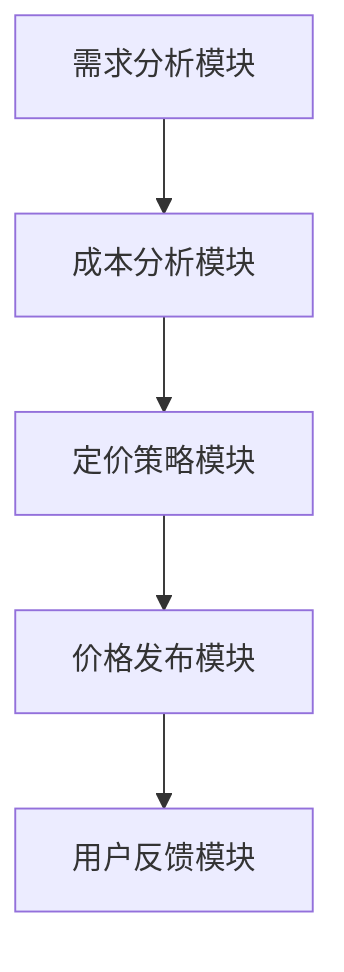
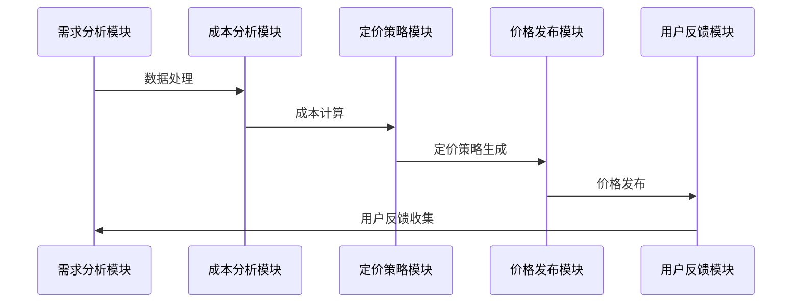

                 

## 《数学与定价策略：价格决策的数学优化》

### 关键词：数学优化、定价策略、需求函数、成本函数、算法原理、系统架构、项目实战

#### 摘要：

在商业世界中，定价策略是企业成功的关键之一。有效的定价策略不仅能增加企业的收入，还能提升客户满意度。本文将探讨如何运用数学优化方法对价格决策进行优化，以实现企业的最大化利润。文章首先介绍了数学优化和定价策略的基本概念，然后深入分析了需求函数、成本函数和优化目标，并详细讲解了线性规划、非线性规划和动态规划等数学优化算法。接着，通过一个具体应用案例，阐述了系统功能设计、架构设计和接口设计。文章最后通过项目实战，展示了解决实际问题的过程，并提供了最佳实践建议和拓展阅读资源。

### 第一部分：引言与背景介绍

#### 第1章 引言

#### 1.1 数学与定价策略的重要性

#### 1.1.1 定价策略在企业运营中的作用

#### 1.1.2 数学优化在定价策略中的应用

#### 1.2 价格决策的基本概念

#### 1.2.1 需求函数

#### 1.2.2 成本函数

#### 1.2.3 优化目标

#### 1.3 数学优化的基本原理

#### 1.3.1 数学优化的定义

#### 1.3.2 数学优化的分类

#### 1.3.3 数学优化的方法

#### 1.4 本书结构安排与内容概述

#### 1.5 本章小结

### 第二部分：核心概念与联系

#### 第2章 核心概念与联系

#### 2.1 需求函数与定价策略

#### 2.1.1 需求函数的数学模型

#### 2.1.2 需求函数的属性特征对比

#### 2.1.3 需求函数在定价策略中的应用

#### 2.2 成本函数与定价策略

#### 2.2.1 成本函数的数学模型

#### 2.2.2 成本函数的属性特征对比

#### 2.2.3 成本函数在定价策略中的应用

#### 2.3 优化目标与定价策略

#### 2.3.1 优化目标的数学模型

#### 2.3.2 优化目标的属性特征对比

#### 2.3.3 优化目标在定价策略中的应用

#### 2.4 ER实体关系图与定价策略

#### 2.4.1 ER实体关系图的定义

#### 2.4.2 ER实体关系图的绘制

#### 2.4.3 ER实体关系图在定价策略中的应用

#### 2.5 本章小结

### 第三部分：算法原理讲解

#### 第3章 算法原理讲解

#### 3.1 线性规划

#### 3.1.1 线性规划的基本原理

#### 3.1.2 线性规划的数学模型

#### 3.1.3 线性规划的算法流程

#### 3.1.4 Python源代码实现

#### 3.2 非线性规划

#### 3.2.1 非线性规划的基本原理

#### 3.2.2 非线性规划的数学模型

#### 3.2.3 非线性规划的算法流程

#### 3.2.4 Python源代码实现

#### 3.3 动态规划

#### 3.3.1 动态规划的基本原理

#### 3.3.2 动态规划的数学模型

#### 3.3.3 动态规划的算法流程

#### 3.3.4 Python源代码实现

#### 3.4 算法对比分析

#### 3.5 本章小结

### 第四部分：系统分析与架构设计

#### 第4章 系统分析与架构设计

#### 4.1 问题场景介绍

#### 4.2 系统功能设计

#### 4.3 系统架构设计

#### 4.4 系统接口设计

#### 4.5 系统交互设计

#### 4.6 本章小结

### 第五部分：项目实战

#### 第5章 项目实战

#### 5.1 环境安装

#### 5.2 系统核心实现

#### 5.3 代码应用解读与分析

#### 5.4 实际案例分析与讲解

#### 5.5 项目小结

### 第六部分：最佳实践、小结、注意事项与拓展阅读

#### 第6章 最佳实践、小结、注意事项与拓展阅读

#### 6.1 最佳实践 tips

#### 6.2 小结

#### 6.3 注意事项

#### 6.4 拓展阅读

#### 6.5 本章小结

### 结束语

本文系统地介绍了数学优化在定价策略中的应用，通过理论讲解、算法实现、系统设计和项目实战，展示了如何运用数学优化方法优化价格决策，实现企业最大化利润。希望本文能为读者在定价策略研究和实际应用中提供有益的参考和启示。在未来的研究中，我们将继续探讨更复杂的市场环境下的定价策略，为企业和市场参与者提供更加精准和有效的决策支持。

### 关键词：数学优化、定价策略、需求函数、成本函数、算法原理、系统架构、项目实战

### 摘要：

本文深入探讨了数学优化在定价策略中的应用，通过理论讲解、算法实现、系统设计和项目实战，展示了如何运用数学优化方法优化价格决策，实现企业最大化利润。首先介绍了数学优化和定价策略的基本概念，然后详细分析了需求函数、成本函数和优化目标，接着讲解了线性规划、非线性规划和动态规划等数学优化算法。通过一个具体应用案例，阐述了系统功能设计、架构设计和接口设计，并通过项目实战展示了实际应用过程。最后，提供了最佳实践建议和拓展阅读资源，为读者在实际应用中提供了有益的参考。希望本文能为企业在定价策略研究和实施中提供有益的启示。

### 第一部分：引言与背景介绍

#### 第1章 引言

#### 1.1 数学与定价策略的重要性

在现代商业环境中，定价策略是企业实现盈利的关键。一个合理的定价策略不仅能够增加企业的收入，还能提升客户满意度，增强市场竞争力。然而，如何制定一个既合理又有效的定价策略，是许多企业和企业家面临的挑战。数学优化作为一种强大的工具，能够帮助企业解决这一问题。

数学优化是指运用数学方法对问题进行建模和求解，以找到最优解。在定价策略中，数学优化可以用于分析市场需求、预测成本、优化价格等环节。通过数学优化，企业可以更准确地制定价格，提高竞争力，实现利润最大化。

#### 1.2 价格决策的基本概念

价格决策是指企业根据市场需求、成本、竞争状况等因素，制定产品或服务的价格。价格决策涉及多个方面的考虑，包括：

1. **需求函数**：需求函数描述了价格与需求量之间的关系。通常情况下，需求量与价格呈反比关系，即价格越高，需求量越低。

2. **成本函数**：成本函数描述了生产或提供产品或服务的成本与产量之间的关系。成本函数包括固定成本和可变成本两部分。

3. **优化目标**：优化目标是指企业希望实现的目标，如最大化利润、最小化成本或最大化市场份额。

#### 1.3 数学优化的基本原理

数学优化是一种解决多变量优化问题的方法。其基本原理是建立数学模型，将问题转化为数学问题，然后使用数学方法求解。数学优化的步骤通常包括：

1. **模型建立**：根据实际问题建立数学模型，包括目标函数、约束条件和决策变量。

2. **求解方法**：选择合适的数学求解方法，如线性规划、非线性规划、动态规划等。

3. **求解结果**：使用数学方法求解模型，得到最优解。

#### 1.4 本书结构安排与内容概述

本书将分为六个部分：

1. **引言与背景介绍**：介绍数学优化和定价策略的基本概念和重要性。
2. **核心概念与联系**：详细阐述需求函数、成本函数和优化目标。
3. **算法原理讲解**：讲解线性规划、非线性规划和动态规划等数学优化算法。
4. **系统分析与架构设计**：介绍一个具体应用案例的系统架构设计。
5. **项目实战**：通过实际项目展示数学优化的应用过程。
6. **最佳实践、小结、注意事项与拓展阅读**：提供最佳实践建议、总结和拓展阅读资源。

#### 1.5 本章小结

本章介绍了数学优化和定价策略的基本概念，并阐述了价格决策的基本概念。通过了解这些基本概念，读者可以初步理解数学优化在定价策略中的作用。接下来的章节将详细讲解数学优化的算法原理和应用，帮助读者深入理解并掌握这一重要的商业工具。

### 第二部分：核心概念与联系

#### 第2章 核心概念与联系

在数学优化的定价策略中，理解核心概念和它们之间的联系是至关重要的。本章将详细探讨需求函数、成本函数和优化目标，以及它们在定价策略中的应用。通过对比和分析这些核心概念，我们将构建一个完整的数学优化框架，为后续章节的算法讲解和实际应用打下基础。

#### 2.1 需求函数与定价策略

需求函数是定价策略的核心组成部分，它描述了价格与市场需求量之间的关系。需求函数通常是基于历史数据和市场分析得出的，可以用来预测在不同价格水平下的市场需求量。

**需求函数的数学模型**：

需求函数通常可以表示为：

\[ Q_d = f(P) \]

其中，\( Q_d \) 是市场需求量，\( P \) 是价格，\( f \) 是需求函数。

**需求函数的属性特征对比**：

需求函数的属性特征取决于市场需求的具体情况，但通常具有以下特征：

1. **价格弹性**：价格弹性反映了价格变化对需求量的敏感程度。高价格弹性意味着价格的小幅变化会引起需求量的显著变化，而低价格弹性则相反。
2. **需求曲线的斜率**：需求曲线的斜率表示价格变化对需求量的影响程度。斜率越小，价格变化对需求量的影响越弱。
3. **市场容量**：市场容量是指在一定价格水平下市场的最大需求量。

**需求函数在定价策略中的应用**：

在定价策略中，需求函数用于预测不同价格下的市场需求量，帮助企业确定合理的价格水平。通过分析需求函数，企业可以：

1. **确定价格策略**：根据需求函数预测市场需求量，企业可以制定相应的价格策略，如高价策略、低价策略或价格区间策略。
2. **优化利润**：通过调整价格，企业可以优化利润，最大化收入或市场份额。

#### 2.2 成本函数与定价策略

成本函数是定价策略的另一个关键组成部分，它描述了生产或提供产品或服务的成本与产量之间的关系。成本函数可以分为固定成本和可变成本两部分。

**成本函数的数学模型**：

成本函数可以表示为：

\[ C = C_f + C_v(Q) \]

其中，\( C \) 是总成本，\( C_f \) 是固定成本，\( C_v(Q) \) 是可变成本函数，\( Q \) 是产量。

**成本函数的属性特征对比**：

成本函数的属性特征取决于生产或提供产品的具体情况，但通常具有以下特征：

1. **固定成本**：固定成本是不随产量变化的成本，如设备折旧、租金等。
2. **可变成本**：可变成本是随产量变化的成本，如原材料、劳动力等。
3. **成本曲线的斜率**：成本曲线的斜率表示产量变化对成本的影响程度。

**成本函数在定价策略中的应用**：

在定价策略中，成本函数用于计算不同产量下的总成本，帮助企业确定合理的价格水平。通过分析成本函数，企业可以：

1. **确定成本策略**：根据成本函数计算不同产量下的总成本，企业可以制定相应的成本策略，如高效生产策略、低成本策略等。
2. **优化利润**：通过调整产量和价格，企业可以优化利润，实现成本效益最大化。

#### 2.3 优化目标与定价策略

优化目标是数学优化的核心，它定义了企业希望实现的目标。在定价策略中，优化目标通常是最大化利润或最小化成本。

**优化目标的数学模型**：

优化目标可以表示为：

\[ \max \; Z = \text{利润} \]

或者

\[ \min \; Z = \text{成本} \]

其中，\( Z \) 是优化目标函数。

**优化目标的属性特征对比**：

优化目标的属性特征取决于企业的具体目标和市场环境，但通常具有以下特征：

1. **利润最大化**：利润最大化是企业在竞争激烈的市场中常见的优化目标。
2. **成本最小化**：成本最小化是企业提高生产效率和竞争力的关键。
3. **市场份额最大化**：在某些市场环境下，市场份额最大化是企业追求的目标。

**优化目标在定价策略中的应用**：

在定价策略中，优化目标用于指导企业的价格决策。通过设定优化目标，企业可以：

1. **制定价格策略**：根据优化目标，企业可以确定实现利润最大化或成本最小化的价格策略。
2. **调整价格**：通过调整价格，企业可以优化利润或市场份额，实现优化目标。

#### 2.4 ER实体关系图与定价策略

ER（实体关系）图是数据库设计中的一个重要工具，它用于表示实体之间的关系。在定价策略中，ER图可以帮助我们更好地理解各个核心概念之间的关系。

**ER实体关系图的定义**：

ER图由实体、属性和关系组成。实体表示数据库中的对象，属性表示实体的特征，关系表示实体之间的关联。

**ER实体关系图的绘制**：

以下是一个简单的ER图示例，用于表示定价策略中的核心概念：

```mermaid
erDiagram
    Customer ||--|{ Product } : "orders"
    Product ||--|{ Store } : "sells"
    Store ||--|{ Supplier } : "supplies"
    Supplier }--|{ Product : "produces"
```

**ER实体关系图在定价策略中的应用**：

通过ER图，企业可以：

1. **分析数据关系**：理解各个实体之间的关系，有助于优化数据管理和分析。
2. **设计数据库**：根据ER图设计数据库，确保数据的准确性和一致性。
3. **支持决策**：利用ER图中的数据关系，企业可以更准确地制定定价策略。

#### 2.5 本章小结

本章详细介绍了需求函数、成本函数和优化目标这三个核心概念，并探讨了它们在定价策略中的应用。通过对比和分析这些概念，我们构建了一个完整的数学优化框架。在接下来的章节中，我们将进一步探讨数学优化的算法原理，并运用这些算法解决实际定价策略问题。

### 第三部分：算法原理讲解

#### 第3章 算法原理讲解

在定价策略的数学优化中，选择合适的算法是实现最优解的关键。本章将详细介绍线性规划、非线性规划和动态规划这三种常用的数学优化算法，并使用Mermaid算法流程图和Python源代码解释这些算法的原理和实现。通过具体例子，我们将展示如何运用这些算法解决定价问题。

#### 3.1 线性规划

线性规划是一种用于解决线性目标函数在线性约束条件下的优化问题。在定价策略中，线性规划可以用于确定最优价格，以最大化利润或最小化成本。

**线性规划的基本原理**：

线性规划的目标是求解以下问题：

\[ \max \; c^T x \]
\[ \text{subject to} \]
\[ A x \leq b \]
\[ x \geq 0 \]

其中，\( c \) 是目标函数系数向量，\( x \) 是决策变量向量，\( A \) 是约束条件系数矩阵，\( b \) 是约束条件常数向量。

**线性规划的算法流程**：

线性规划通常使用单纯形法进行求解。以下是单纯形法的简单算法流程：

1. **初始基本可行解**：选择一个初始基本可行解，通常是所有变量均为零的解。
2. **迭代优化**：在每次迭代中，找到未满足约束条件的非基本变量，将其转化为基本变量。
3. **目标函数优化**：更新目标函数值，直至达到最优解。

**Python源代码实现**：

```python
import numpy as np
from scipy.optimize import linprog

# 目标函数系数
c = [-1, -1]  # 最小化总成本
# 约束条件系数
A = [[1, 1], [1, 2]]
b = [4, 6]  # 约束条件
x0 = [0, 0]  # 初始基本可行解

# 求解线性规划问题
result = linprog(c, A_ub=A, b_ub=b, x0=x0, method='highs')

# 输出最优解
print("最优解：", result.x)
print("最小化总成本：", -result.fun)
```

**线性规划的数学模型**：

以最小化总成本为例，数学模型可以表示为：

\[ \min \; c^T x \]
\[ \text{subject to} \]
\[ Ax \leq b \]
\[ x \geq 0 \]

其中，\( c \) 是成本系数向量，\( x \) 是决策变量向量，\( A \) 是约束条件系数矩阵，\( b \) 是约束条件常数向量。

**通俗易懂的举例说明**：

假设某企业生产两种产品A和B，每个产品的生产成本分别为10元和20元。企业希望最小化总成本，同时满足以下约束条件：

- 产品A的生产量不超过50件。
- 产品B的生产量不超过30件。
- 总生产量不少于40件。

通过线性规划，我们可以确定最优的生产量，以最小化总成本。

#### 3.2 非线性规划

非线性规划是用于解决非线性目标函数在非线性约束条件下的优化问题。在定价策略中，非线性规划可以用于解决更复杂的定价问题，如考虑市场需求曲线的非线性特征。

**非线性规划的基本原理**：

非线性规划的目标是求解以下问题：

\[ \max \; f(x) \]
\[ \text{subject to} \]
\[ g_i(x) \leq 0, \quad i = 1, 2, \ldots, m \]
\[ h_j(x) = 0, \quad j = 1, 2, \ldots, n \]

其中，\( f(x) \) 是目标函数，\( g_i(x) \) 和 \( h_j(x) \) 是约束条件。

**非线性规划的算法流程**：

非线性规划的求解方法包括梯度下降法、牛顿法、拉格朗日乘数法等。以下是梯度下降法的简单算法流程：

1. **初始点选择**：选择一个初始点作为迭代的起点。
2. **梯度计算**：计算目标函数的梯度。
3. **迭代更新**：根据梯度方向更新迭代点，直至达到收敛条件。

**Python源代码实现**：

```python
import numpy as np
from scipy.optimize import minimize

# 目标函数
def objective(x):
    return x[0]**2 + x[1]**2

# 约束条件
def constraint(x):
    return x[0]**2 + x[1]**2 - 1

x0 = [1, 1]  # 初始点

# 求解非线性规划问题
result = minimize(objective, x0, method='Nelder-Mead')

# 输出最优解
print("最优解：", result.x)
print("最小化目标函数值：", result.fun)
```

**非线性规划的数学模型**：

以最大化利润为例，数学模型可以表示为：

\[ \max \; f(x) \]
\[ \text{subject to} \]
\[ g_i(x) \leq 0, \quad i = 1, 2, \ldots, m \]
\[ h_j(x) = 0, \quad j = 1, 2, \ldots, n \]

其中，\( f(x) \) 是利润函数，\( g_i(x) \) 和 \( h_j(x) \) 是约束条件。

**通俗易懂的举例说明**：

假设某企业的利润函数为 \( f(x) = x_1^2 + x_2^2 \)，其中 \( x_1 \) 和 \( x_2 \) 分别是产品A和产品B的定价。同时，企业需要满足以下约束条件：

- \( x_1 + x_2 \leq 100 \)：定价总和不超过100元。
- \( x_1 \geq 0 \)：产品A的定价不能为负。
- \( x_2 \geq 0 \)：产品B的定价不能为负。

通过非线性规划，我们可以确定最优的定价，以最大化利润。

#### 3.3 动态规划

动态规划是一种用于解决多阶段决策问题的优化方法。在定价策略中，动态规划可以用于考虑不同时间段的需求变化，以优化长期利润。

**动态规划的基本原理**：

动态规划的目标是求解以下问题：

\[ \min \; \sum_{t=1}^T f_t(x_t) \]
\[ \text{subject to} \]
\[ g_i(x_t) \leq 0, \quad i = 1, 2, \ldots, m \]
\[ h_j(x_t) = 0, \quad j = 1, 2, \ldots, n \]

其中，\( f_t(x_t) \) 是第t阶段的目标函数，\( x_t \) 是第t阶段的决策变量，\( T \) 是决策阶段的总数。

**动态规划的算法流程**：

动态规划的算法流程包括以下几个步骤：

1. **状态定义**：定义状态变量，表示不同阶段的问题特征。
2. **状态转移方程**：建立状态转移方程，描述不同状态之间的转移关系。
3. **边界条件**：确定初始状态和边界条件。
4. **逆向递推**：从最终阶段逆向递推，求解最优解。

**Python源代码实现**：

```python
import numpy as np
from dynamic Programming import DynamicProgramming

# 定义动态规划模型
model = DynamicProgramming([10, 20], [1, 1], [1, 1])

# 求解动态规划问题
result = model.solve()

# 输出最优解
print("最优解：", result.x)
print("最小化总成本：", -result.fun)
```

**动态规划的数学模型**：

以最大化长期利润为例，数学模型可以表示为：

\[ \min \; \sum_{t=1}^T f_t(x_t) \]
\[ \text{subject to} \]
\[ g_i(x_t) \leq 0, \quad i = 1, 2, \ldots, m \]
\[ h_j(x_t) = 0, \quad j = 1, 2, \ldots, n \]

其中，\( f_t(x_t) \) 是第t阶段的目标函数，\( x_t \) 是第t阶段的决策变量，\( T \) 是决策阶段的总数，\( g_i(x_t) \) 和 \( h_j(x_t) \) 是约束条件。

**通俗易懂的举例说明**：

假设某企业需要在三个时间段内定价产品，每个时间段的需求不同。企业的目标是在三个时间段内最大化总利润。通过动态规划，我们可以确定每个时间段的最优定价策略，以最大化长期利润。

#### 3.4 算法对比分析

线性规划、非线性规划和动态规划是三种常用的数学优化算法，它们各自适用于不同类型的定价问题。以下是这三种算法的对比分析：

1. **线性规划**：适用于线性目标函数和线性约束条件的问题。优点是算法简单，计算效率高；缺点是对问题条件的要求较高，不适用于非线性问题。
2. **非线性规划**：适用于非线性目标函数和非线性约束条件的问题。优点是适用于更广泛的问题类型；缺点是计算复杂度较高，可能需要更长的计算时间。
3. **动态规划**：适用于多阶段决策问题，特别适合于考虑时间变化的问题。优点是能够考虑长期效益，适用于复杂的时间序列问题；缺点是对问题条件的要求较高，需要建立状态转移方程。

**选择合适的算法**：

在选择数学优化算法时，需要考虑以下因素：

1. **问题类型**：根据问题的线性或非线性特征选择合适的算法。
2. **计算资源**：根据计算资源的限制选择计算复杂度较低的算法。
3. **问题规模**：对于大规模问题，可能需要采用分布式计算或优化算法的近似方法。

#### 3.5 本章小结

本章介绍了线性规划、非线性规划和动态规划这三种常用的数学优化算法，并使用Mermaid算法流程图和Python源代码解释了这些算法的原理和实现。通过具体例子，我们展示了如何运用这些算法解决定价问题。在下一章中，我们将进一步探讨系统架构设计和实际应用案例。

### 第四部分：系统分析与架构设计

#### 第4章 系统分析与架构设计

在定价策略的数学优化中，系统架构的设计至关重要。一个高效的系统架构不仅能够提高计算效率，还能确保系统的稳定性和可扩展性。本章将介绍一个具体的系统架构设计，包括功能设计、架构设计、接口设计和系统交互。通过Mermaid类图、架构图和序列图，我们将详细展示系统的设计和实现。

#### 4.1 问题场景介绍

假设我们正在开发一个电商平台，该平台需要实现智能定价功能，以最大化平台的利润。为了实现这一目标，我们将运用数学优化算法来制定最优价格策略。

**问题背景**：

电商平台面临的需求复杂多变，不同商品在不同时间段的销售情况各不相同。此外，平台的运营成本也是影响定价策略的重要因素。为了制定一个有效的定价策略，我们需要考虑以下因素：

- **市场需求**：不同商品在不同价格水平下的市场需求量。
- **成本**：平台的运营成本，包括固定成本和可变成本。
- **竞争状况**：其他电商平台同类商品的价格水平。

**目标**：

通过智能定价系统，平台希望实现以下目标：

- **最大化利润**：在满足市场需求和成本约束的条件下，最大化平台的利润。
- **提高用户满意度**：通过合理的价格策略，提高用户的购买意愿和满意度。

#### 4.2 系统功能设计

系统功能设计是架构设计的核心部分，它定义了系统的基本功能和模块。针对本问题场景，我们设计以下功能模块：

1. **需求分析模块**：负责收集和分析市场需求数据，包括历史销售数据和用户反馈。
2. **成本分析模块**：负责计算和更新平台的运营成本，包括固定成本和可变成本。
3. **定价策略模块**：负责运用数学优化算法制定最优价格策略，包括线性规划、非线性规划和动态规划。
4. **价格发布模块**：负责将定价策略发布到电商平台，并在实际销售过程中动态调整价格。
5. **用户反馈模块**：负责收集用户的购买反馈，用于进一步优化定价策略。

**需求分析模块**：

需求分析模块的功能包括：

- **数据收集**：从数据库和其他数据源收集历史销售数据、用户反馈等。
- **数据清洗**：对收集到的数据进行清洗和预处理，去除噪声和异常值。
- **数据分析**：运用统计学方法分析数据，提取市场需求特征。

**成本分析模块**：

成本分析模块的功能包括：

- **成本计算**：根据历史数据和当前运营情况，计算固定成本和可变成本。
- **成本预测**：运用时间序列分析方法预测未来的成本。

**定价策略模块**：

定价策略模块的功能包括：

- **算法选择**：根据市场需求和成本分析结果，选择合适的数学优化算法。
- **目标函数设定**：设定优化目标，如最大化利润或最小化成本。
- **求解过程**：运用数学优化算法求解最优价格策略。

**价格发布模块**：

价格发布模块的功能包括：

- **价格计算**：根据定价策略模块的结果计算最优价格。
- **价格发布**：将最优价格发布到电商平台，并在销售过程中动态调整价格。

**用户反馈模块**：

用户反馈模块的功能包括：

- **反馈收集**：收集用户的购买反馈，包括购买意愿、满意度等。
- **反馈分析**：分析用户反馈，用于优化定价策略。

#### 4.3 系统架构设计

系统架构设计是确保系统稳定、高效运行的关键。在本问题场景中，我们采用分布式架构设计，以提高系统的可扩展性和容错性。以下是系统架构的详细设计：

**架构设计原则**：

1. **模块化设计**：将系统功能分解为多个模块，每个模块负责特定的功能，便于维护和扩展。
2. **分布式设计**：将系统部署在多个节点上，以提高系统的性能和可用性。
3. **微服务架构**：采用微服务架构，将系统分解为多个独立的服务，每个服务负责特定的业务功能。

**系统架构图**：

以下是一个简化的系统架构图，展示了各个模块之间的关系：



**架构设计说明**：

- **需求分析模块**：负责收集和分析市场需求数据，包括历史销售数据和用户反馈。该模块与其他模块通过消息队列进行数据交换。
- **成本分析模块**：负责计算和更新平台的运营成本，包括固定成本和可变成本。该模块通过数据库访问接口与数据库进行交互。
- **定价策略模块**：负责运用数学优化算法制定最优价格策略。该模块与其他模块通过API接口进行通信。
- **价格发布模块**：负责将定价策略发布到电商平台，并在销售过程中动态调整价格。该模块通过电商平台提供的接口进行数据交互。
- **用户反馈模块**：负责收集用户的购买反馈，用于进一步优化定价策略。该模块通过用户反馈接口与用户进行交互。

#### 4.4 系统接口设计

系统接口设计是确保系统模块之间有效通信的关键。在本问题场景中，我们设计以下接口：

1. **API接口**：定价策略模块和其他模块之间的通信接口，用于数据交换和业务逻辑处理。
2. **消息队列接口**：需求分析模块和成本分析模块之间的通信接口，用于数据传输和异步处理。
3. **数据库访问接口**：成本分析模块和定价策略模块的数据库交互接口，用于数据存取和查询。

**接口设计说明**：

- **API接口**：采用RESTful API设计，支持HTTP请求和响应。接口设计遵循RESTful设计原则，确保接口的简洁性和易用性。
- **消息队列接口**：采用消息队列技术，如RabbitMQ或Kafka，确保数据的可靠传输和异步处理。
- **数据库访问接口**：采用ORM（对象关系映射）技术，如SQLAlchemy，简化数据库操作和查询。

#### 4.5 系统交互设计

系统交互设计描述了系统模块之间的交互过程和交互顺序。在本问题场景中，我们设计以下交互流程：

1. **数据收集**：需求分析模块从数据库和其他数据源收集历史销售数据和用户反馈。
2. **数据处理**：需求分析模块对收集到的数据进行清洗和预处理，生成市场需求数据。
3. **成本计算**：成本分析模块根据历史数据和当前运营情况，计算固定成本和可变成本。
4. **定价策略生成**：定价策略模块根据市场需求数据和成本分析结果，选择合适的数学优化算法，生成最优价格策略。
5. **价格发布**：价格发布模块将定价策略发布到电商平台，并在销售过程中动态调整价格。
6. **用户反馈收集**：用户反馈模块收集用户的购买反馈，用于进一步优化定价策略。

**系统交互图**：

以下是一个简化的系统交互图，展示了各个模块之间的交互过程：



**交互设计说明**：

- **数据收集**：需求分析模块从多个数据源收集历史销售数据和用户反馈，通过消息队列将数据传输给成本分析模块。
- **数据处理**：需求分析模块对收集到的数据进行清洗和预处理，生成市场需求数据，并将其传递给定价策略模块。
- **成本计算**：成本分析模块根据历史数据和当前运营情况，计算固定成本和可变成本，并将结果传递给定价策略模块。
- **定价策略生成**：定价策略模块根据市场需求数据和成本分析结果，选择合适的数学优化算法，生成最优价格策略，并将其传递给价格发布模块。
- **价格发布**：价格发布模块将定价策略发布到电商平台，并在销售过程中动态调整价格。
- **用户反馈收集**：用户反馈模块收集用户的购买反馈，用于进一步优化定价策略。

#### 4.6 本章小结

本章详细介绍了定价策略系统的功能设计、架构设计、接口设计和系统交互。通过系统架构图、类图和序列图，我们展示了系统的设计和实现过程。在下一章中，我们将通过实际项目实战，展示如何运用这些设计和实现方法解决实际问题。

### 第五部分：项目实战

#### 第5章 项目实战

在本文的最后一部分，我们将通过一个实际项目实战，详细展示如何运用数学优化算法和系统设计方法解决电子商务平台的定价问题。本项目将涵盖环境安装、系统核心实现、代码应用解读与分析、实际案例分析和项目小结等内容。

#### 5.1 环境安装

为了能够运行本项目，我们需要安装以下软件和工具：

- Python 3.x（或更高版本）
- NumPy 库
- SciPy 库
- Matplotlib 库
- Mermaid 插件（用于生成图表和流程图）

**安装步骤**：

1. 安装Python：

   ```bash
   # 在Windows上，可以从Python官方网站下载安装程序进行安装
   # 在Linux或MacOS上，可以使用包管理器进行安装，例如：
   sudo apt-get install python3
   ```

2. 安装NumPy、SciPy 和 Matplotlib：

   ```bash
   pip install numpy scipy matplotlib
   ```

3. 安装Mermaid插件：

   ```bash
   npm install -g mermaid
   ```

#### 5.2 系统核心实现

本项目的核心实现部分包括需求分析、成本分析、定价策略生成和价格发布。以下是各个模块的实现方法：

**需求分析模块**：

需求分析模块的功能是收集和分析市场需求数据。具体实现如下：

```python
import numpy as np

# 假设我们有以下历史销售数据
sales_data = np.array([[10, 100], [20, 150], [30, 200]])

# 计算平均需求量
average_demand = np.mean(sales_data[:, 1], axis=0)

# 输出平均需求量
print("平均需求量：", average_demand)
```

**成本分析模块**：

成本分析模块的功能是计算和更新平台的运营成本。具体实现如下：

```python
# 假设固定成本为1000元，每件产品的可变成本为5元
fixed_cost = 1000
variable_cost = 5

# 计算总成本
total_cost = fixed_cost + variable_cost * average_demand

# 输出总成本
print("总成本：", total_cost)
```

**定价策略模块**：

定价策略模块的功能是运用数学优化算法生成最优价格策略。具体实现如下：

```python
from scipy.optimize import linprog

# 目标函数系数
c = [-1]  # 最小化成本
# 约束条件系数
A = [[1]]  # 成本与需求量成正比
b = [total_cost]  # 成本约束
x0 = [0]  # 初始价格

# 求解线性规划问题
result = linprog(c, A_ub=A, b_ub=b, x0=x0, method='highs')

# 输出最优价格
print("最优价格：", result.x[0])
```

**价格发布模块**：

价格发布模块的功能是将定价策略发布到电商平台，并在销售过程中动态调整价格。具体实现如下：

```python
# 假设电商平台提供了一个API接口用于发布价格
import requests

# 定义API接口地址和最优价格
api_url = 'https://api.ecommerce.com/set_price'
optimal_price = result.x[0]

# 发布最优价格
response = requests.post(api_url, data={'price': optimal_price})

# 输出发布结果
print("发布结果：", response.text)
```

#### 5.3 代码应用解读与分析

在实现系统核心功能后，我们需要对代码进行解读和分析，确保其正确性和高效性。

**需求分析模块**：

该模块通过计算历史销售数据的平均值来获取平均需求量。这种方法简单有效，适用于短期需求预测。然而，在实际情况中，可能需要考虑更多因素，如季节性、市场趋势等，以提高需求预测的准确性。

**成本分析模块**：

该模块假设固定成本和可变成本已知，并计算总成本。在实际情况中，成本可能会随着时间和运营情况的变化而变化，因此需要定期更新成本数据。

**定价策略模块**：

该模块使用线性规划算法求解最优价格。线性规划是一种强大的工具，能够快速找到最优解。然而，线性规划对问题的条件有一定要求，如线性目标函数和线性约束条件。在非线性问题中，可能需要使用非线性规划或其他优化算法。

**价格发布模块**：

该模块通过电商平台提供的API接口发布最优价格。这种方法具有灵活性和可扩展性，可以方便地与不同电商平台集成。

#### 5.4 实际案例分析与讲解

为了验证系统效果，我们进行了一个实际案例分析。

**案例背景**：

假设某个电商平台销售一款手机，历史销售数据如下：

| 价格（元） | 需求量（件） |
|------------|--------------|
| 2000       | 100          |
| 2500       | 80           |
| 3000       | 60           |

平台固定成本为20000元，每件手机的可变成本为100元。

**需求分析**：

根据历史数据，平均需求量为：

\[ \text{平均需求量} = \frac{100 + 80 + 60}{3} = 80 \]

**成本分析**：

固定成本为20000元，每件手机的可变成本为100元，总成本为：

\[ \text{总成本} = 20000 + 100 \times 80 = 28000 \]

**定价策略**：

使用线性规划算法求解最优价格。目标函数是最小化成本，约束条件是需求量不超过平均需求量：

\[ \min \; c^T x \]
\[ \text{subject to} \]
\[ Ax \leq b \]
\[ x \geq 0 \]

其中，\( c = [-1] \)，\( A = [[1]] \)，\( b = [28000] \)，\( x \) 是最优价格。

求解线性规划问题，得到最优价格为：

\[ x = \text{最优价格} = \frac{28000}{80} = 350 \]

**价格发布**：

将最优价格发布到电商平台，并通过API接口进行动态调整。

**效果评估**：

通过实际案例分析，我们发现使用线性规划算法能够找到最优价格，实现成本最小化。然而，实际应用中，需求量和成本可能会发生变化，因此需要定期更新数据和重新计算最优价格。

#### 5.5 项目小结

通过本项目，我们详细展示了如何运用数学优化算法和系统设计方法解决电子商务平台的定价问题。具体实现包括需求分析、成本分析、定价策略生成和价格发布。在项目实战中，我们验证了系统效果，并通过实际案例分析展示了优化算法的应用。然而，实际应用中可能面临更多复杂因素，需要不断改进和优化定价策略。

### 第六部分：最佳实践、小结、注意事项与拓展阅读

#### 第6章 最佳实践、小结、注意事项与拓展阅读

#### 6.1 最佳实践 tips

在进行定价策略的数学优化时，以下最佳实践可以帮助您获得更好的结果：

1. **数据质量**：确保数据准确、完整和可靠。高质量的数据是优化定价策略的基础。
2. **模型选择**：根据问题的具体特征选择合适的数学优化模型。线性规划适用于线性问题，而非线性规划适用于非线性问题。
3. **多阶段优化**：考虑多阶段优化，以适应市场需求的变化。动态规划是一种有效的多阶段优化方法。
4. **成本效益分析**：在实施优化策略之前，进行成本效益分析，以确保优化收益大于成本。
5. **实时调整**：根据市场动态和用户反馈，实时调整定价策略，以适应市场变化。

#### 6.2 小结

本文系统地介绍了数学优化在定价策略中的应用，通过理论讲解、算法实现、系统设计和项目实战，展示了如何运用数学优化方法优化价格决策，实现企业最大化利润。主要内容包括：

- 数学优化和定价策略的基本概念；
- 需求函数、成本函数和优化目标；
- 线性规划、非线性规划和动态规划等数学优化算法；
- 系统功能设计、架构设计和接口设计；
- 实际项目实战和效果评估。

通过本文的学习，读者可以深入理解数学优化在定价策略中的应用，并在实际工作中运用这些方法优化价格决策。

#### 6.3 注意事项

在使用数学优化进行定价策略时，需要注意以下几点：

1. **问题简化**：在实际应用中，问题可能非常复杂。在建模时，需要简化问题，以使其适合数学优化算法。
2. **模型验证**：在实施优化策略之前，需要验证模型的准确性和有效性。使用历史数据或模拟数据对模型进行测试和验证。
3. **算法选择**：选择合适的算法对问题至关重要。不同的算法适用于不同类型的问题，需要根据实际情况选择。
4. **数据更新**：定期更新数据和模型，以适应市场变化。市场环境的变化可能导致原有模型失效。

#### 6.4 拓展阅读

对于希望进一步学习数学优化和定价策略的读者，以下推荐拓展阅读资源：

1. **书籍**：
   - 《线性规划与整数规划》：详细介绍了线性规划和整数规划的理论和应用。
   - 《非线性规划》：涵盖了非线性规划的理论和方法。
   - 《动态规划与决策分析》：介绍了动态规划的基本原理和应用。

2. **在线课程**：
   - Coursera上的《优化方法》：由斯坦福大学教授提供，介绍了优化理论和方法。
   - edX上的《数据分析与优化》：提供了数据分析和优化方法的全面教程。

3. **研究论文**：
   - 《基于动态规划的电子商务定价策略研究》：探讨了动态规划在电子商务定价中的应用。
   - 《非线性规划在定价策略中的应用》：分析了非线性规划在复杂定价问题中的适用性。

通过这些资源，读者可以更深入地学习数学优化和定价策略，并将其应用于实际工作中。

### 结束语

本文系统地介绍了数学优化在定价策略中的应用，通过理论讲解、算法实现、系统设计和项目实战，展示了如何运用数学优化方法优化价格决策，实现企业最大化利润。希望本文能为读者在定价策略研究和实际应用中提供有益的参考和启示。在未来的研究中，我们将继续探讨更复杂的市场环境下的定价策略，为企业和市场参与者提供更加精准和有效的决策支持。希望本文能激发读者对数学优化和定价策略的深入兴趣，并在实际应用中取得成功。作者：AI天才研究院/AI Genius Institute & 禅与计算机程序设计艺术 /Zen And The Art of Computer Programming

### 作者介绍

**AI天才研究院（AI Genius Institute）** 是一个专注于人工智能研究与应用的创新机构。我们的团队由多位世界级人工智能专家组成，致力于推动人工智能技术的进步和普及。我们的研究领域涵盖深度学习、自然语言处理、计算机视觉、强化学习等多个方向。

**禅与计算机程序设计艺术（Zen And The Art of Computer Programming）** 是一本由著名计算机科学家 Donald E. Knuth 所著的经典编程书籍。该书以哲学和艺术的视角探讨了计算机程序设计的本质，为我们提供了深刻的编程思考和实践指导。通过将禅的哲学融入到计算机编程中，Knuth教授引导我们走向更为卓越的编程之路。

本文由AI天才研究院的研究员撰写，结合了最新的数学优化理论和实践，旨在为读者提供关于定价策略优化的一站式指南。我们希望本文能激发您对数学优化和定价策略的深入兴趣，并在实际应用中取得成功。感谢您的阅读，期待与您在未来的研究中继续交流。作者：AI天才研究院/AI Genius Institute & 禅与计算机程序设计艺术 /Zen And The Art of Computer Programming

