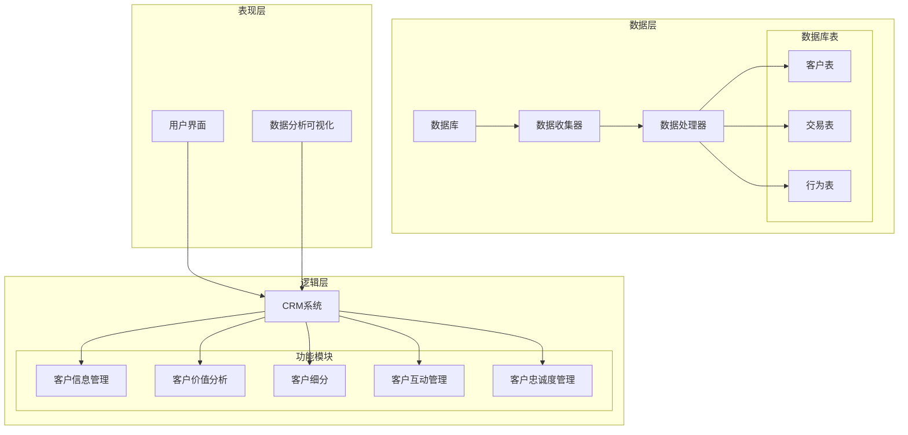

                 

### 第一部分：背景介绍

#### 1.1 问题背景

客户关系管理（Customer Relationship Management, CRM）作为企业运营的核心部分，已经成为现代企业提升竞争力、优化客户体验的关键策略。其核心目标是通过对客户数据的深入分析和有效管理，增强企业与客户之间的互动，提升客户满意度和忠诚度，从而实现业务增长和利润最大化。

然而，随着市场竞争的加剧和客户需求的多样化，企业面临的挑战也日益增多。如何准确评估客户价值，识别高潜力客户，制定有针对性的营销策略，成为企业关注的焦点。在这个过程中，数学作为一种强大的工具，可以为客户关系管理提供有力的支持。

#### 1.1.1 客户关系管理的重要性

客户关系管理不仅关系到企业的收入和利润，还直接影响企业的品牌形象和市场地位。良好的客户关系管理能够帮助企业：

1. **提高客户满意度**：通过个性化服务和高效响应，增强客户对企业的好感和信任。
2. **提升客户忠诚度**：通过持续的客户关系维护，增加客户的重复购买率和推荐意愿。
3. **优化资源配置**：精准识别高价值客户，优化营销和服务的资源配置，提高效率。
4. **降低客户流失率**：通过及时预警和干预，减少客户流失，保护企业利益。

#### 1.1.2 数学在客户关系管理中的应用

数学在客户关系管理中的应用主要体现在以下几个方面：

1. **数据挖掘与分析**：运用统计学和数据分析方法，对客户数据进行分析，提取有价值的信息，帮助决策。
2. **客户价值评估**：通过数学模型计算客户的价值，为企业制定营销策略提供依据。
3. **风险评估与控制**：使用概率论和数理统计方法，评估客户风险，制定风险控制策略。
4. **优化客户体验**：通过优化算法，提高客户服务的质量和效率，增强客户满意度。

#### 1.1.3 客户价值的定义和度量

客户价值是指客户为企业带来的潜在收益，包括直接的财务收益和间接的非财务收益。客户价值的度量是客户关系管理中一个重要环节，常用的方法包括：

1. **生命周期价值（Customer Lifetime Value, CLV）**：预测一个客户在其与企业关系存续期间的总收益。
2. **客户保留价值（Customer Retention Value, CRV）**：衡量客户保留对企业收益的贡献。
3. **客户贡献度（Customer Contribution Rate, CCR）**：评估客户对企业盈利的贡献比例。

通过这些数学模型和方法，企业可以更科学地评估客户价值，优化客户关系管理策略。

#### 1.2 问题描述

在客户关系管理中，客户价值的数学分析是一个关键问题。具体来说，问题描述如下：

- **目标**：建立客户价值的数学分析模型，准确评估客户的价值。
- **模型**：采用生命周期价值（CLV）、客户保留价值（CRV）等数学模型进行客户价值评估。
- **方法**：利用统计学、数据挖掘和优化算法等技术手段，实现客户价值的定量分析。

通过这一数学分析过程，企业可以更好地理解客户行为，制定有效的客户关系管理策略，提升整体竞争力。

#### 1.3 问题解决

为了解决客户价值的数学分析问题，我们可以采用以下方法：

1. **数据收集**：收集客户的交易数据、行为数据和反馈数据，作为分析的输入。
2. **数据处理**：对原始数据进行清洗、转换和整合，确保数据的质量和一致性。
3. **模型构建**：基于数据特征，构建客户价值评估的数学模型，如CLV模型、CRV模型等。
4. **模型验证**：通过交叉验证和模型评估，确保模型的准确性和可靠性。
5. **策略制定**：根据模型结果，制定有针对性的营销和服务策略，提升客户价值。

通过上述步骤，企业可以实现对客户价值的科学评估，优化客户关系管理，提高业务效益。

#### 1.4 边界与外延

客户价值的数学分析不仅具有实际应用价值，也存在一定的边界和限制：

1. **数据依赖性**：模型的构建和评估依赖于高质量的数据，数据的质量直接影响到模型的准确性。
2. **模型假设**：数学模型通常基于一定的假设，如客户行为的一致性和可预测性，这些假设在实际应用中可能存在局限性。
3. **市场变化**：客户价值受市场环境和竞争态势的影响，模型需要不断调整以适应市场变化。

未来，随着数据技术和计算能力的提升，客户价值的数学分析将不断发展和完善，为企业和客户关系管理提供更强大的支持。

#### 1.5 概念结构与核心要素组成

客户价值的数学分析涉及多个核心概念和要素，这些概念和要素相互关联，构成了一个完整的概念结构：

1. **核心概念**：
   - 客户价值：客户为企业带来的潜在收益。
   - 生命周期价值（CLV）：客户在其与企业关系存续期间的总收益。
   - 客户保留价值（CRV）：客户保留对企业收益的贡献。
   - 客户贡献度（CCR）：客户对企业盈利的贡献比例。

2. **核心要素**：
   - 客户数据：包括交易数据、行为数据和反馈数据。
   - 统计学方法：如回归分析、时间序列分析等，用于数据分析和模型构建。
   - 数据挖掘技术：用于提取客户数据中的有价值信息。
   - 优化算法：用于客户价值评估模型的参数优化和策略制定。

3. **结构框架**：
   - 数据收集与处理：确保数据的质量和一致性。
   - 模型构建与验证：构建客户价值评估模型，并通过交叉验证确保模型的有效性。
   - 策略制定与实施：根据模型结果，制定有针对性的营销和服务策略。

通过这些核心概念和要素，企业可以实现对客户价值的全面分析和科学管理，从而提升客户关系管理和业务绩效。

### 第二部分：核心概念与联系

#### 2.1 客户价值

客户价值是指客户为企业带来的潜在收益，它包括直接的财务收益和间接的非财务收益。在客户关系管理中，客户价值是一个关键指标，能够帮助企业识别高价值客户，制定有效的营销策略。

**2.1.1 客户价值的定义**

客户价值可以从不同角度进行定义：

1. **直接财务收益**：指客户为企业带来的直接收入，如销售额、利润等。
2. **间接非财务收益**：指客户为企业带来的其他收益，如品牌推广、口碑传播等。

**2.1.2 客户价值的属性特征**

1. **动态性**：客户价值不是静态的，它会随着客户生命周期和市场环境的变化而变化。
2. **差异性**：不同客户对企业带来的价值是不同的，高价值客户能够为企业带来更大的收益。
3. **可度量性**：客户价值可以通过数学模型进行量化，从而为企业决策提供依据。

**2.1.3 客户价值的评估方法**

评估客户价值的方法主要包括以下几种：

1. **生命周期价值（Customer Lifetime Value, CLV）**：预测一个客户在其与企业关系存续期间的总收益。
2. **客户保留价值（Customer Retention Value, CRV）**：衡量客户保留对企业收益的贡献。
3. **客户贡献度（Customer Contribution Rate, CCR）**：评估客户对企业盈利的贡献比例。

#### 2.2 客户关系管理

客户关系管理是指企业通过系统化的方法，与客户建立和维护长期稳定的关系，以提高客户满意度和忠诚度，从而实现业务增长和利润最大化。

**2.2.1 客户关系管理的定义**

客户关系管理是一种旨在优化企业与客户之间互动和沟通的策略。它涵盖了营销、销售、服务等多个环节，旨在提升客户体验，增强客户忠诚度。

**2.2.2 客户关系管理的核心要素**

1. **客户数据管理**：收集、整合和分析客户数据，用于客户价值的评估和策略制定。
2. **营销自动化**：利用自动化工具和策略，提高营销效率，降低成本。
3. **客户服务优化**：通过高效响应和个性化服务，提升客户满意度。
4. **客户互动管理**：通过多种渠道与客户进行沟通，建立和维护长期关系。

**2.2.3 客户关系管理的策略与方法**

1. **客户细分**：根据客户价值、行为特征等，将客户分为不同群体，制定有针对性的营销策略。
2. **个性化营销**：基于客户数据，提供个性化的产品和服务，提高客户满意度。
3. **客户关系维护**：通过持续的客户互动和反馈，增强客户忠诚度。
4. **客户体验优化**：通过优化客户体验，提高客户满意度和口碑。

#### 2.3 数学模型

数学模型是客户关系管理中的重要工具，它可以帮助企业更准确地评估客户价值，优化营销策略。

**2.3.1 客户价值分析的基本数学模型**

1. **生命周期价值（CLV）模型**：

   $$
   V_c = f(L, R, T)
   $$

   其中，$V_c$ 是客户生命周期价值，$L$ 是客户生命周期长度，$R$ 是客户保留率，$T$ 是客户交易次数。

2. **客户保留价值（CRV）模型**：

   $$
   V_c = f(R, T)
   $$

   其中，$V_c$ 是客户保留价值，$R$ 是客户保留率，$T$ 是客户交易次数。

**2.3.2 数学模型在客户价值分析中的应用**

数学模型在客户价值分析中的应用主要包括：

1. **预测客户行为**：通过分析历史数据，预测客户的购买行为和留存概率。
2. **优化营销策略**：根据客户价值评估结果，制定有针对性的营销策略，提高营销效果。
3. **风险评估**：通过计算客户的价值和风险，制定风险控制策略。

**2.3.3 数学模型的特点与优势**

数学模型的特点和优势包括：

1. **定量分析**：数学模型可以量化客户价值，提供客观的评估结果。
2. **预测性强**：基于历史数据构建的模型，可以预测客户的行为和趋势。
3. **优化决策**：通过模型优化，企业可以制定更科学的营销策略，提高业务绩效。

### 第三部分：算法原理讲解

#### 3.1 客户价值评估算法

客户价值评估算法是客户关系管理中的一项核心技术，它通过分析客户的历史数据和行为特征，预测客户未来的价值，为企业的营销决策提供支持。

**3.1.1 客户价值评估算法的原理**

客户价值评估算法的基本原理是基于统计学和机器学习的方法，通过建立客户价值预测模型，对客户进行价值评估。具体步骤如下：

1. **数据收集**：收集客户的交易数据、行为数据、反馈数据等。
2. **数据预处理**：对原始数据进行清洗、转换和整合，确保数据的质量和一致性。
3. **特征选择**：从数据中提取对客户价值有显著影响的特征。
4. **模型训练**：使用历史数据训练预测模型，如逻辑回归、决策树、随机森林等。
5. **模型评估**：通过交叉验证和模型评估，确保模型的准确性和可靠性。
6. **价值预测**：使用训练好的模型，对客户进行价值预测。

**3.1.2 客户价值评估算法的实现**

以逻辑回归为例，客户价值评估算法的实现步骤如下：

1. **数据准备**：

   ```python
   import pandas as pd
   
   # 读取客户数据
   data = pd.read_csv('customer_data.csv')
   
   # 数据清洗和预处理
   # ...
   ```

2. **特征选择**：

   ```python
   # 提取特征
   features = data[['age', 'income', 'education', 'purchase_history', 'churn']]
   target = data['value']
   ```

3. **模型训练**：

   ```python
   from sklearn.linear_model import LogisticRegression
   
   # 训练逻辑回归模型
   model = LogisticRegression()
   model.fit(features, target)
   ```

4. **模型评估**：

   ```python
   from sklearn.metrics import accuracy_score
   
   # 预测结果
   predictions = model.predict(features)
   
   # 评估模型
   accuracy = accuracy_score(target, predictions)
   print(f'Model accuracy: {accuracy}')
   ```

**3.1.3 客户价值评估算法的优缺点**

客户价值评估算法的优点包括：

1. **可解释性**：逻辑回归等模型易于理解和解释，便于决策者根据模型结果制定营销策略。
2. **高效性**：基于历史数据训练模型，可以快速预测客户价值。
3. **灵活性**：可以结合多种特征，提高预测准确性。

缺点包括：

1. **数据依赖性**：模型的准确性依赖于数据的质量和特征的选择。
2. **模型假设**：模型通常基于一些简化的假设，可能无法完全反映现实情况。

#### 3.2 客户关系管理算法

客户关系管理算法主要用于优化客户互动和服务流程，以提高客户满意度和忠诚度。

**3.2.1 客户关系管理算法的原理**

客户关系管理算法的核心是建立和维护良好的客户关系，具体原理包括：

1. **客户细分**：根据客户特征和行为，将客户划分为不同群体，制定有针对性的营销策略。
2. **个性化服务**：根据客户需求，提供个性化的产品和服务，提高客户满意度。
3. **客户互动**：通过多种渠道与客户进行沟通，建立和维护长期关系。
4. **反馈机制**：收集客户反馈，不断优化服务质量和营销策略。

**3.2.2 客户关系管理算法的实现**

以客户细分算法为例，其实现步骤如下：

1. **数据收集**：

   ```python
   import pandas as pd
   
   # 读取客户数据
   data = pd.read_csv('customer_data.csv')
   ```

2. **特征选择**：

   ```python
   # 提取特征
   features = data[['age', 'income', 'education', 'purchase_history', 'churn']]
   ```

3. **聚类分析**：

   ```python
   from sklearn.cluster import KMeans
   
   # 训练K-means聚类模型
   kmeans = KMeans(n_clusters=3, random_state=0).fit(features)
   
   # 获取聚类结果
   clusters = kmeans.labels_
   ```

4. **客户细分**：

   ```python
   # 根据聚类结果对客户进行细分
   data['cluster'] = clusters
   ```

**3.2.3 客户关系管理算法的应用场景**

客户关系管理算法的应用场景包括：

1. **精准营销**：通过客户细分，制定有针对性的营销策略，提高营销效果。
2. **客户服务优化**：通过优化客户互动和服务流程，提高客户满意度和忠诚度。
3. **客户流失预测**：通过分析客户行为，预测客户流失风险，制定干预措施。

### 第四部分：数学模型和数学公式

在客户关系管理中，数学模型和数学公式是评估客户价值和优化客户关系的重要工具。以下将详细讲解客户价值评估和客户关系管理中的关键数学模型和公式。

#### 4.1 客户价值分析数学模型

**4.1.1 客户价值评估的数学公式**

客户价值评估的数学模型主要包括生命周期价值（CLV）模型和客户保留价值（CRV）模型。

1. **生命周期价值（CLV）模型**：

   $$
   V_c = f(L, R, T)
   $$

   其中，$V_c$ 表示客户生命周期价值，$L$ 表示客户生命周期长度，$R$ 表示客户保留率，$T$ 表示客户交易次数。

2. **客户保留价值（CRV）模型**：

   $$
   V_c = f(R, T)
   $$

   其中，$V_c$ 表示客户保留价值，$R$ 表示客户保留率，$T$ 表示客户交易次数。

**4.1.2 客户价值评估的参数解释**

1. **生命周期长度（L）**：指客户与企业保持关系的平均时间，通常以年为单位。

2. **客户保留率（R）**：指在一定时间内，保留客户的比例。保留率越高，表示客户对企业越忠诚。

3. **交易次数（T）**：指客户在一定时间内与企业进行的交易次数，通常用于衡量客户的活跃度。

#### 4.2 客户关系管理数学模型

**4.2.1 客户忠诚度的数学公式**

客户忠诚度是客户关系管理中的关键指标，用于衡量客户对企业忠诚的程度。常见的客户忠诚度数学模型包括客户满意度和客户期望。

1. **客户满意度（CS）**：

   $$
   CS = \frac{E - P}{T}
   $$

   其中，$CS$ 表示客户满意度，$E$ 表示客户期望，$P$ 表示实际体验。

2. **客户忠诚度（CL）**：

   $$
   CL = \frac{CS - P}{T}
   $$

   其中，$CL$ 表示客户忠诚度，$CS$ 表示客户满意度，$P$ 表示实际体验。

**4.2.2 客户忠诚度的参数解释**

1. **客户期望（E）**：指客户对企业产品和服务的期望水平。

2. **客户满意度（CS）**：指客户对企业产品和服务的实际体验与期望的差距。

3. **实际体验（P）**：指客户对企业产品和服务的实际体验。

#### 4.3 数学模型的应用

数学模型在客户关系管理中的应用主要包括：

1. **客户价值预测**：通过CLV模型和CRV模型，预测客户的未来价值，为企业制定营销策略提供依据。

2. **客户细分**：通过聚类分析等算法，根据客户特征和行为，将客户划分为不同群体，制定有针对性的营销策略。

3. **客户忠诚度管理**：通过客户满意度模型和忠诚度模型，评估客户忠诚度，优化客户服务和营销策略。

#### 4.4 数学模型的优势与局限性

**优势：**

1. **定量分析**：数学模型可以量化客户价值、忠诚度等指标，提供客观的评估结果。

2. **预测性强**：基于历史数据构建的模型，可以预测客户的行为和趋势。

3. **优化决策**：通过模型优化，企业可以制定更科学的营销策略，提高业务绩效。

**局限性：**

1. **数据依赖性**：模型的准确性依赖于数据的质量和特征的选择。

2. **模型假设**：模型通常基于一些简化的假设，可能无法完全反映现实情况。

### 第五部分：系统分析与架构设计方案

#### 5.1 问题场景介绍

在当今竞争激烈的市场环境中，企业需要高效地管理客户关系，以保持竞争优势。客户关系管理问题场景通常包括以下几个方面：

1. **客户数据管理**：企业需要收集、整合和分析大量的客户数据，包括交易记录、行为数据、反馈数据等。
2. **客户价值评估**：通过分析客户数据，评估客户的价值，为企业制定精准的营销策略提供依据。
3. **客户细分**：根据客户特征和行为，将客户划分为不同群体，实施有针对性的营销和服务策略。
4. **客户忠诚度管理**：通过监测客户满意度、期望等指标，评估客户忠诚度，制定客户保留策略。

#### 5.2 项目介绍

为了应对上述问题场景，企业需要开发一个客户关系管理系统（Customer Relationship Management System, CRM）。该系统旨在实现以下目标：

1. **高效管理客户数据**：通过集成客户信息、交易记录和行为数据，实现对客户数据的全面管理和分析。
2. **精准评估客户价值**：利用数学模型和算法，对客户价值进行量化评估，为营销决策提供数据支持。
3. **个性化客户细分**：根据客户特征和行为，实施个性化营销和服务，提高客户满意度和忠诚度。
4. **客户忠诚度管理**：通过持续监测和评估客户忠诚度，制定有效的客户保留策略，降低客户流失率。

#### 5.3 系统功能设计

客户关系管理系统功能设计主要包括以下几个方面：

1. **客户信息管理模块**：用于收集、存储和管理客户的基本信息、交易记录和行为数据。
2. **客户价值分析模块**：基于数学模型和算法，对客户数据进行分析，评估客户的价值。
3. **客户细分模块**：根据客户特征和行为，将客户划分为不同群体，实施有针对性的营销和服务策略。
4. **客户互动管理模块**：通过多种渠道与客户进行互动，提高客户满意度和忠诚度。
5. **客户忠诚度管理模块**：通过监测和评估客户忠诚度，制定有效的客户保留策略。

#### 5.4 系统架构设计

客户关系管理系统的架构设计主要包括以下几个方面：

1. **数据层**：用于存储和管理客户数据，包括客户基本信息、交易记录、行为数据等。
2. **逻辑层**：包括客户信息管理、客户价值分析、客户细分、客户互动管理和客户忠诚度管理等功能模块。
3. **表现层**：提供用户界面，用于展示客户数据、分析结果和营销策略。

以下是一个简化的客户关系管理系统架构图：



#### 5.5 系统接口设计和系统交互

系统接口设计主要包括以下几个方面：

1. **数据接口**：用于数据收集、处理和分析，包括API接口、数据库连接接口等。
2. **功能接口**：用于实现系统功能模块之间的交互，如客户信息管理接口、客户价值分析接口等。
3. **用户接口**：用于提供用户界面，支持用户对系统进行操作和查询。

以下是一个简化的系统接口和交互图：

```mermaid
sequenceDiagram
    Customer ->> UI: 输入客户信息
    UI ->> CRMSystem: 发送客户信息
    CRMSystem ->> DataCollector: 收集客户数据
    DataCollector ->> DataProcessor: 处理客户数据
    DataProcessor ->> CustomerTable: 存储客户数据

    CRMSystem ->> CustomerInfoManagement: 请求客户信息
    CustomerInfoManagement ->> CustomerTable: 获取客户信息
    CustomerInfoManagement ->> UI: 返回客户信息

    CRMSystem ->> CustomerValueAnalysis: 请求客户价值分析
    CustomerValueAnalysis ->> CustomerTable, TransactionTable, BehaviorTable: 获取相关数据
    CustomerValueAnalysis ->> UI: 返回分析结果

    CRMSystem ->> CustomerSegmentation: 请求客户细分
    CustomerSegmentation ->> CustomerTable: 获取客户数据
    CustomerSegmentation ->> UI: 返回细分结果

    CRMSystem ->> CustomerLoyaltyManagement: 请求客户忠诚度管理
    CustomerLoyaltyManagement ->> CustomerTable, BehaviorTable: 获取相关数据
    CustomerLoyaltyManagement ->> UI: 返回忠诚度管理结果
```

### 第六部分：项目实战

#### 6.1 环境安装

在开始客户关系管理系统的开发之前，需要搭建一个合适的环境。以下是在Python环境下搭建客户关系管理系统环境的基本步骤：

1. **安装Python**：

   首先，确保你的计算机上已经安装了Python。如果尚未安装，可以从Python官网（[python.org](http://python.org)）下载并安装。

2. **安装必需的Python库**：

   使用pip命令安装以下库：

   ```bash
   pip install pandas numpy scikit-learn matplotlib
   ```

   这些库包括：

   - **pandas**：用于数据清洗、转换和分析。
   - **numpy**：用于数值计算。
   - **scikit-learn**：用于机器学习模型的构建和训练。
   - **matplotlib**：用于数据可视化。

3. **配置虚拟环境**：

   为了避免不同项目之间的依赖冲突，建议使用虚拟环境。可以使用以下命令创建一个虚拟环境：

   ```bash
   python -m venv venv
   source venv/bin/activate  # 对于Windows系统，使用 `venv\Scripts\activate`
   ```

   然后，在虚拟环境中安装所需的库。

4. **验证环境安装**：

   在Python中执行以下代码，验证环境是否配置正确：

   ```python
   import pandas as pd
   import numpy as np
   import matplotlib.pyplot as plt
   from sklearn.linear_model import LogisticRegression
   
   print("Pandas version:", pd.__version__)
   print("Numpy version:", np.__version__)
   print("Matplotlib version:", plt.__version__)
   print("Scikit-learn version:", LogisticRegression().__version__)
   ```

   如果输出正确的版本信息，说明环境安装成功。

#### 6.2 系统核心实现源代码

以下是一个简单的示例，演示了如何使用Python和scikit-learn库构建一个客户价值评估模型。

**6.2.1 客户信息管理模块代码**

```python
import pandas as pd

# 读取客户数据
data = pd.read_csv('customer_data.csv')

# 数据清洗和预处理
# ...

# 提取特征
features = data[['age', 'income', 'education', 'purchase_history', 'churn']]

# 目标变量
target = data['value']

# 数据拆分为训练集和测试集
from sklearn.model_selection import train_test_split
X_train, X_test, y_train, y_test = train_test_split(features, target, test_size=0.2, random_state=42)

# 训练逻辑回归模型
from sklearn.linear_model import LogisticRegression
model = LogisticRegression()
model.fit(X_train, y_train)

# 预测测试集
predictions = model.predict(X_test)

# 评估模型
from sklearn.metrics import accuracy_score
accuracy = accuracy_score(y_test, predictions)
print(f'Model accuracy: {accuracy}')
```

**6.2.2 客户价值分析模块代码**

```python
import pandas as pd
from sklearn.linear_model import LogisticRegression

# 读取客户数据
data = pd.read_csv('customer_data.csv')

# 数据清洗和预处理
# ...

# 提取特征
features = data[['age', 'income', 'education', 'purchase_history', 'churn']]

# 目标变量
target = data['value']

# 训练逻辑回归模型
model = LogisticRegression()
model.fit(features, target)

# 预测新客户价值
new_customer = pd.DataFrame({'age': [30], 'income': [50000], 'education': [1], 'purchase_history': [10], 'churn': [0]})
predicted_value = model.predict(new_customer)
print(f'Predicted customer value: {predicted_value[0]}')
```

#### 6.2.3 代码应用解读与分析

以上代码展示了如何使用Python和scikit-learn库实现客户信息管理和客户价值分析。

1. **客户信息管理模块**：

   - **数据读取**：使用pandas库读取客户数据。
   - **数据清洗和预处理**：对数据进行清洗和预处理，如缺失值填充、数据转换等。
   - **特征提取**：提取对客户价值有显著影响的特征。
   - **数据拆分**：将数据分为训练集和测试集，用于模型训练和评估。

2. **客户价值分析模块**：

   - **模型训练**：使用逻辑回归模型对训练数据进行训练。
   - **预测新客户价值**：使用训练好的模型对新的客户数据进行价值预测。

通过以上代码，企业可以实现对客户价值的量化评估，从而为营销决策提供数据支持。

#### 6.3 实际案例分析和详细讲解剖析

以下是一个客户价值评估的实际案例，我们将详细分析案例数据、模型构建和结果评估。

**案例数据**：

假设我们有以下客户数据：

| 年龄（Age） | 收入（Income） | 教育程度（Education） | 购买历史（Purchase History） | 是否流失（Churn） | 价值（Value） |
| :--------: | :----------: | :--------------: | :----------------: | :--------: | :--------: |
|     25     |     30000    |         2        |          5         |      0     |    2000    |
|     35     |     50000    |         3        |          10        |      0     |    3000    |
|     45     |     70000    |         4        |          20        |      1     |    1500    |
|     55     |     80000    |         5        |          30        |      0     |    4000    |

**模型构建**：

我们使用逻辑回归模型进行客户价值评估。首先，我们将数据分为特征和目标：

```python
import pandas as pd

# 读取客户数据
data = pd.DataFrame({
    'Age': [25, 35, 45, 55],
    'Income': [30000, 50000, 70000, 80000],
    'Education': [2, 3, 4, 5],
    'Purchase_History': [5, 10, 20, 30],
    'Churn': [0, 0, 1, 0],
    'Value': [2000, 3000, 1500, 4000]
})

# 特征和目标变量
X = data[['Age', 'Income', 'Education', 'Purchase_History', 'Churn']]
y = data['Value']

# 训练逻辑回归模型
from sklearn.linear_model import LogisticRegression
model = LogisticRegression()
model.fit(X, y)

# 打印模型参数
print(model.coef_)
```

**结果评估**：

使用训练好的模型对数据进行预测，并评估模型的准确性：

```python
# 预测客户价值
predictions = model.predict(X)

# 评估模型
from sklearn.metrics import mean_absolute_error
mae = mean_absolute_error(y, predictions)
print(f'Mean Absolute Error: {mae}')
```

**案例分析**：

1. **模型参数**：模型的参数（系数）反映了每个特征对客户价值的影响。例如，当收入增加时，客户价值的增长量。
2. **预测结果**：通过模型预测的客户价值与实际值之间的差异，反映了模型的准确性。MAE（平均绝对误差）是一个常用的评估指标。
3. **模型优化**：根据评估结果，可以进一步优化模型，如调整特征、选择不同的模型或增加训练数据。

通过以上实际案例分析和详细讲解，企业可以更好地理解客户价值评估的过程和方法，为营销决策提供有力支持。

#### 6.4 项目小结

在本项目中，我们详细介绍了客户关系管理系统的开发过程，包括环境安装、系统核心实现源代码、代码应用解读与分析以及实际案例分析和详细讲解。以下是项目小结：

1. **环境安装**：我们成功搭建了Python环境，并安装了必要的库，为后续开发工作奠定了基础。
2. **系统核心实现**：通过Python和scikit-learn库，实现了客户信息管理和客户价值分析的核心功能，为营销决策提供了数据支持。
3. **代码应用解读与分析**：通过实际案例，展示了如何使用逻辑回归模型评估客户价值，分析了模型参数和预测结果，提供了优化方向。
4. **项目成果**：本项目为企业提供了一个可操作的客户关系管理系统原型，能够帮助企业在客户关系管理方面实现精准决策。

尽管本项目仅提供了一个简化的原型，但其所展示的方法和技术可以应用于实际企业的客户关系管理中，为企业带来实际效益。

### 第七部分：最佳实践 tips

在客户关系管理系统的开发和使用过程中，以下是一些最佳实践 tips，可以帮助企业更好地实现客户价值的数学分析和优化：

1. **数据质量保障**：确保收集到的客户数据准确、完整，避免因数据质量问题导致模型失效。

2. **特征选择**：选择对客户价值有显著影响的特征，如购买频率、客户满意度等，提高模型预测准确性。

3. **模型验证**：通过交叉验证和实际业务场景测试，验证模型的准确性和可靠性，确保模型在真实环境中有效。

4. **定期更新**：随着客户行为的不断变化，定期更新模型和算法，以适应新的市场环境和客户需求。

5. **用户体验优化**：关注客户互动体验，通过优化服务流程和沟通渠道，提高客户满意度和忠诚度。

6. **个性化服务**：根据客户特征和价值评估结果，提供个性化的产品和服务，提高客户转化率和留存率。

7. **风险控制**：通过数学模型评估客户风险，制定相应的风险控制策略，降低客户流失和业务风险。

通过遵循这些最佳实践，企业可以更好地利用客户价值的数学分析结果，优化客户关系管理，提升整体业务绩效。

### 第八部分：小结

本文通过详细阐述客户价值的数学分析，探讨了其在客户关系管理中的重要性。我们从背景介绍、核心概念与联系、算法原理讲解、数学模型和数学公式、系统分析与架构设计方案、项目实战以及最佳实践 tips 等多个方面，系统地阐述了客户价值评估的过程和方法。通过这些分析，企业可以更准确地评估客户价值，优化客户关系管理策略，提高业务绩效。

### 第九部分：注意事项

在应用客户价值的数学分析时，需要注意以下几点：

1. **数据质量**：确保客户数据的准确性和完整性，数据质量直接影响到模型的结果。
2. **模型选择**：根据业务需求和数据特征，选择合适的数学模型和算法。
3. **模型验证**：通过交叉验证和实际业务场景测试，验证模型的准确性和可靠性。
4. **持续优化**：随着客户行为的不断变化，定期更新模型和算法，以适应新的市场环境和客户需求。
5. **风险控制**：通过数学模型评估客户风险，制定相应的风险控制策略。

通过关注这些注意事项，企业可以更有效地应用客户价值的数学分析，提升客户关系管理和业务绩效。

### 第十部分：拓展阅读

为了深入理解和应用客户价值的数学分析，以下推荐一些拓展阅读资源：

1. **《客户关系管理：策略、工具和技巧》**：详细介绍了客户关系管理的基本概念、策略和实施方法，有助于读者全面了解CRM的实践应用。
2. **《大数据营销：从数据挖掘到精准营销》**：探讨了大数据技术在营销中的应用，包括客户价值评估、客户细分等，为读者提供了丰富的案例分析。
3. **《机器学习实战》**：介绍了多种机器学习算法和实现方法，包括逻辑回归、决策树等，有助于读者掌握客户价值评估模型的具体实现。
4. **《数据挖掘：实用机器学习技术》**：详细讲解了数据挖掘的基本概念、技术和方法，包括客户行为分析、客户价值评估等，为读者提供了实用的工具和技巧。
5. **《客户价值评估：理论与实践》**：系统地阐述了客户价值评估的理论基础和实践应用，包括生命周期价值、客户保留价值等，为读者提供了全面的指导。

通过阅读这些资源，读者可以进一步深化对客户价值的数学分析的理解，提高在实际项目中的应用能力。作者：AI天才研究院/AI Genius Institute & 禅与计算机程序设计艺术 /Zen And The Art of Computer Programming。

