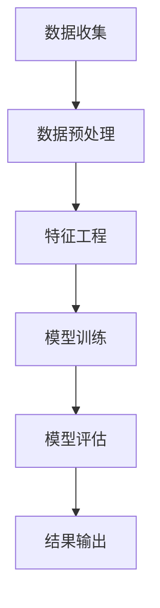
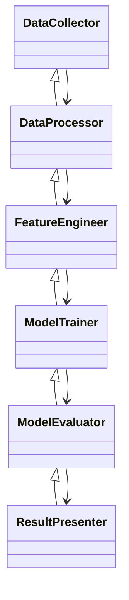
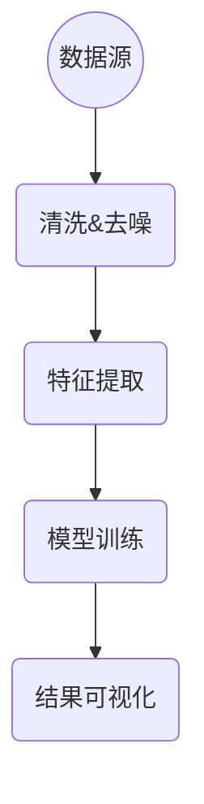
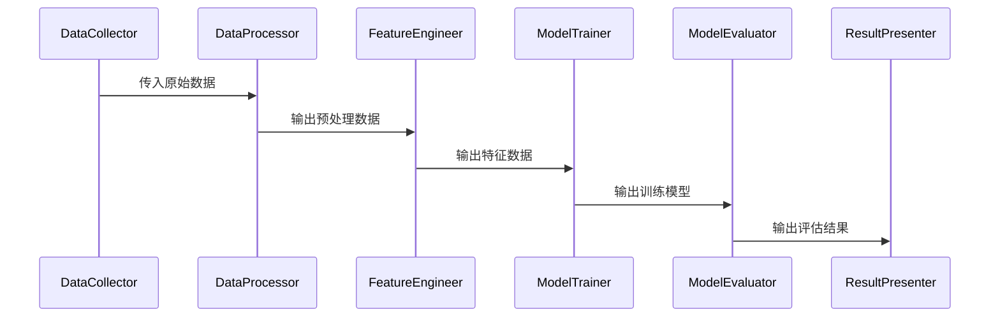

                 


### 1.1 问题背景与核心概念

#### 1.1.1 问题背景

在当今的商业环境中，客户关系管理（CRM）已经成为了企业成功的关键因素。随着市场竞争的日益激烈，企业需要通过有效的客户关系管理来提高客户满意度、增强客户忠诚度，并最终实现利润的最大化。然而，传统的CRM方法往往依赖于主观判断和经验，难以精确地衡量客户的价值。

在客户关系管理中，"客户价值"是一个核心概念。它不仅仅是指客户的购买力，还包括了客户对企业品牌忠诚度、口碑传播潜力等多方面的因素。因此，如何准确评估客户价值，成为了企业制定有效CRM策略的关键。

#### 1.1.2 问题描述

传统的CRM方法通常存在以下挑战：

1. **数据质量不佳**：许多企业在数据收集和处理方面存在问题，导致数据不准确、不完整。
2. **评估方法单一**：传统方法往往只关注客户的历史交易数据，而忽略了其他重要的客户价值因素。
3. **缺乏动态性**：传统CRM方法难以适应市场变化和客户需求的快速变化。

这些挑战使得企业难以准确评估客户价值，进而影响CRM策略的有效性。为了解决这些问题，我们需要引入数学分析方法，通过构建数学模型来优化客户关系管理。

#### 1.1.3 问题解决

数学分析方法在CRM中的应用，主要是通过构建客户价值评估模型来实现。这些模型可以帮助企业更准确地评估客户价值，从而制定更有效的CRM策略。具体来说，数学分析方法可以解决以下问题：

1. **数据质量问题**：通过数学模型，我们可以对数据进行清洗和预处理，提高数据质量。
2. **评估方法多样性**：数学模型可以综合考虑多种因素，如客户的购买行为、社交网络影响力等，提供更全面的客户价值评估。
3. **动态适应性**：数学模型可以灵活调整参数，适应市场变化和客户需求的变化。

#### 1.1.4 边界与外延

虽然数学分析方法在CRM中具有巨大的潜力，但它的应用也受到一些边界和限制。首先，数学模型需要大量的高质量数据支持，否则可能会导致评估结果不准确。其次，不同的客户类型和市场环境可能需要不同的数学模型，因此模型的通用性是一个挑战。

#### 1.1.5 概念结构与核心要素组成

在构建客户价值评估模型时，我们需要关注以下几个核心要素：

1. **数据来源**：包括客户购买历史、客户互动数据、社交媒体数据等。
2. **评估指标**：如客户终身价值（CLV）、客户忠诚度、客户满意度等。
3. **算法选择**：如回归分析、聚类分析、神经网络等。
4. **模型优化**：通过交叉验证、参数调整等方法来提高模型性能。

通过以上核心要素的有机结合，我们可以构建出一个有效的客户价值评估模型，为企业的CRM策略提供有力支持。

#### 总结

在本章中，我们介绍了客户关系管理的重要性、数学分析方法在CRM中的应用、客户价值的定义与衡量，以及客户价值评估的挑战与需求。在接下来的章节中，我们将深入探讨核心概念原理、算法原理与数学模型，以及系统分析与架构设计，帮助读者全面了解如何通过数学分析优化客户关系管理。

### 2. 核心概念原理

#### 2.1 客户价值分析的基础理论

在客户价值分析中，我们首先需要明确几个基础理论，这些理论构成了客户价值评估模型的基础。

##### 2.1.1 客户价值的分类

客户价值可以从多个角度进行分类，常见的分类方法包括：

1. **交易价值**：指的是客户在购买过程中的直接经济贡献，通常通过购买频率、平均订单价值等指标来衡量。
2. **行为价值**：包括客户对企业品牌的忠诚度、推荐行为等，这些因素能够提高企业的长期收益。
3. **情感价值**：客户对企业的情感投入，如客户满意度、品牌忠诚度等，这些因素虽然难以量化，但对企业的长期发展至关重要。
4. **潜在价值**：指的是客户在未来可能带来的额外价值，如新客户的转化、老客户的复购等。

##### 2.1.2 客户价值评估的方法

在明确了客户价值的分类之后，我们需要选择合适的方法来评估客户价值。以下是一些常用的客户价值评估方法：

1. **成本法**：通过计算获取客户所需的成本来评估客户价值。这种方法适用于那些可以通过成本明确计量的业务。
2. **市场法**：通过观察市场上的类似客户的价值来评估当前客户的价值。这种方法适用于那些有充足市场数据的行业。
3. **收益法**：通过预测客户未来为企业带来的收益来评估客户价值。这种方法通常涉及复杂的数学模型和预测技术。
4. **综合法**：结合成本法、市场法和收益法，从多个角度综合评估客户价值。

##### 2.1.3 客户价值的计算方法

在具体的计算方法上，我们可以采用以下几种模型：

1. **客户终身价值（Customer Lifetime Value, CLV）**：指的是客户在生命周期内为企业带来的总收益。计算公式为：

   $$ CLV = \sum_{t=1}^{n} \frac{R_t}{(1+r)^t} $$

   其中，\( R_t \) 表示第 \( t \) 年的收益，\( r \) 表示折现率，\( n \) 表示客户的预期生命周期。

2. **客户忠诚度模型**：通过分析客户的购买行为和互动数据，构建忠诚度评分模型。常见的模型包括贝叶斯网络、因子分析等。

3. **客户情感价值模型**：通过调查和数据分析，评估客户对企业品牌的情感投入。这种方法通常涉及情感分析技术，如文本情感分析、情感识别等。

#### 2.2 概念属性特征对比表格

为了更好地理解不同客户价值评估方法的优缺点，我们可以通过一个对比表格来展示它们的主要特征：

| 方法名称 | 优点 | 缺点 |
| --- | --- | --- |
| 成本法 | 简单易懂，适用于成本明确计量的业务 | 忽略了市场变化和客户行为的动态性 |
| 市场法 | 结合市场数据，提供更全面的客户价值评估 | 需要充足的市场数据支持，适用性有限 |
| 收益法 | 预测未来收益，提供长期视角 | 预测准确性受多种因素影响，复杂度高 |
| 综合法 | 多角度综合评估，提高评估准确性 | 需要结合多种方法，操作复杂 |

#### 2.3 ER实体关系图架构

在客户关系管理中，实体关系图（ER图）是一种重要的工具，用于描述不同实体之间的关系。以下是一个简单的ER图，展示了客户、订单、产品等关键实体之间的关系：

```mermaid
erDiagram
  Customer ||--|{ Order }|
  Order ||--|{ Product }|
  Product ||--|{ Customer }|
```

在这个ER图中，客户（Customer）与订单（Order）之间存在一对一的关系，即一个客户可以有多个订单；订单与产品（Product）之间存在一对多的关系，即一个订单可以包含多个产品；产品与客户之间存在多对多的关系，即一个产品可以由多个客户购买。

通过ER图，我们可以清晰地理解客户关系管理的核心实体和它们之间的关系，从而为构建客户价值评估模型提供基础。

#### 总结

在本章中，我们介绍了客户价值分析的基础理论，包括客户价值的分类、评估方法以及具体的计算方法。通过对比表格和ER图，我们进一步理解了不同评估方法的优缺点和它们在实际应用中的适用性。在下一章中，我们将深入探讨算法原理与数学模型，进一步深化对客户价值评估方法的理解。

### 3. 算法原理与数学模型

#### 3.1 客户价值评估算法

在客户关系管理中，客户价值评估算法起着至关重要的作用。这些算法不仅能够帮助企业准确衡量客户价值，还能为制定高效的CRM策略提供有力支持。本节将介绍一种基于机器学习的客户价值评估算法，并详细阐述其原理和流程。

##### 3.1.1 算法概述

我们选择的客户价值评估算法是一种基于随机森林（Random Forest）的模型。随机森林是一种集成学习方法，通过构建多个决策树并集成其预测结果来提高模型的准确性和稳定性。在客户价值评估中，随机森林模型可以综合考虑多种因素，如客户的购买历史、行为数据和社会属性等，从而提供更准确的客户价值评估。

##### 3.1.2 算法流程图

下面是客户价值评估算法的流程图：



1. **数据收集**：从企业的CRM系统中收集客户的相关数据，包括购买历史、行为数据、社会属性等。
2. **数据预处理**：对收集到的数据进行清洗、去噪和格式转换，确保数据质量。
3. **特征工程**：根据业务需求和模型特点，提取和构造对客户价值评估有帮助的特征，如客户的平均购买频率、最近一次购买时间、客户社交网络影响力等。
4. **模型训练**：使用随机森林算法对预处理后的数据进行训练，构建客户价值评估模型。
5. **模型评估**：使用交叉验证等方法对训练好的模型进行评估，确保模型的准确性和稳定性。
6. **结果输出**：将评估结果输出，包括每个客户的评估得分和分类结果。

##### 3.1.3 算法流程详细解释

1. **数据收集**：数据收集是整个流程的基础。在这里，我们需要收集的客户数据包括：
   - 购买历史：客户的购买日期、购买商品、购买金额等。
   - 行为数据：客户的浏览行为、搜索历史、点击率等。
   - 社会属性：客户的性别、年龄、地理位置、收入水平等。

2. **数据预处理**：在数据预处理阶段，我们需要对数据进行清洗和格式转换，以确保数据的质量和一致性。具体步骤包括：
   - 填补缺失值：使用统计方法或插值法填补缺失的数据。
   - 去除噪声数据：去除明显异常的数据点，如购买金额异常大的记录。
   - 数据标准化：将不同尺度的数据转换到同一尺度，如将购买金额转换为相对购买频率。

3. **特征工程**：在特征工程阶段，我们根据业务需求和模型特点，提取和构造对客户价值评估有帮助的特征。以下是一些常见的特征：
   - 购买频率：客户在一定时间内的购买次数。
   - 平均购买金额：客户在一定时间内的平均购买金额。
   - 最近购买时间：客户最近一次购买的时间。
   - 社交网络影响力：客户在社交媒体上的影响力，如粉丝数、转发数等。
   - 客户属性：客户的性别、年龄、地理位置、收入水平等。

4. **模型训练**：在模型训练阶段，我们使用随机森林算法对预处理后的数据集进行训练。随机森林算法的优点是能够处理高维度数据，且具有良好的泛化能力。在训练过程中，我们通常使用网格搜索（Grid Search）等方法来优化模型的参数，以提高模型的性能。

5. **模型评估**：在模型评估阶段，我们使用交叉验证（Cross-Validation）等方法对训练好的模型进行评估。交叉验证可以有效地避免过拟合现象，提高模型的泛化能力。常见的评估指标包括准确率、召回率、F1分数等。

6. **结果输出**：在模型评估通过后，我们将评估结果输出，包括每个客户的评估得分和分类结果。这些结果可以用于企业的CRM策略制定，如识别高价值客户、优化营销活动等。

##### 3.1.4 举例说明

为了更直观地理解客户价值评估算法的应用，我们来看一个简单的例子。

假设我们有以下数据集：

| 客户ID | 购买频率 | 平均购买金额 | 最近购买时间 | 社交网络影响力 | 性别 | 年龄 | 地理位置收入 |
| --- | --- | --- | --- | --- | --- | --- | --- |
| 1 | 3 | 200 | 2022-01-01 | 100 | 女 | 25 | 高 |
| 2 | 5 | 300 | 2022-01-10 | 200 | 男 | 30 | 中 |
| 3 | 2 | 150 | 2022-01-20 | 50 | 女 | 35 | 低 |

使用随机森林算法对这些数据进行训练，并得到每个客户的评估得分。假设经过模型训练和评估，我们得到以下结果：

| 客户ID | 评估得分 |
| --- | --- |
| 1 | 0.85 |
| 2 | 0.90 |
| 3 | 0.75 |

根据评估得分，我们可以将客户分为高价值客户、中等价值客户和低价值客户。在这个例子中，客户1和客户2被归类为高价值客户，而客户3被归类为低价值客户。

#### 3.2 数学模型与公式

在客户价值评估中，数学模型是核心部分。以下是一个简单的客户价值评估数学模型，包括客户终身价值（Customer Lifetime Value, CLV）的计算。

##### 3.2.1 客户终身价值（CLV）的数学模型

客户终身价值（CLV）是指客户在生命周期内为企业带来的总收益。CLV的计算公式如下：

$$
CLV = \sum_{t=1}^{n} \frac{R_t}{(1+r)^t}
$$

其中：
- \( R_t \) 是第 \( t \) 年的客户收益；
- \( r \) 是折现率；
- \( n \) 是客户的预期生命周期。

##### 3.2.2 公式推导

我们首先需要明确客户收益的计算方法。客户的收益可以分为两部分：直接收益和间接收益。

1. **直接收益**：指的是客户在购买过程中直接为企业带来的收益，如购买金额。
2. **间接收益**：指的是客户为企业带来的间接收益，如口碑传播、推荐新客户等。

直接收益可以表示为：

$$
R_t = f(P_t, Q_t)
$$

其中：
- \( P_t \) 是第 \( t \) 年的客户购买频率；
- \( Q_t \) 是第 \( t \) 年的平均购买金额。

间接收益可以表示为：

$$
R_{it} = g(S_t, I_t)
$$

其中：
- \( S_t \) 是第 \( t \) 年的客户满意度；
- \( I_t \) 是第 \( t \) 年的客户忠诚度。

客户的总收益为直接收益和间接收益之和：

$$
R_t = R_{dt} + R_{it}
$$

将直接收益和间接收益的表达式代入，得到：

$$
R_t = f(P_t, Q_t) + g(S_t, I_t)
$$

为了计算客户的终身价值（CLV），我们需要考虑时间因素。由于未来的收益具有不确定性，我们需要对未来的收益进行折现。折现率 \( r \) 反映了企业对未来收益的风险态度。

客户的终身价值（CLV）可以表示为：

$$
CLV = \sum_{t=1}^{n} \frac{R_t}{(1+r)^t}
$$

其中，\( n \) 是客户的预期生命周期。

##### 3.2.3 公式应用示例

假设客户1的购买频率为3，平均购买金额为200元，满意度为0.8，忠诚度为0.9，折现率为10%，预期生命周期为5年。我们可以使用上述公式计算客户1的终身价值（CLV）：

$$
CLV = \sum_{t=1}^{5} \frac{R_t}{(1+0.1)^t}
$$

$$
CLV = \frac{f(3, 200) + g(0.8, 0.9)}{(1+0.1)^1} + \frac{f(3, 200) + g(0.8, 0.9)}{(1+0.1)^2} + \frac{f(3, 200) + g(0.8, 0.9)}{(1+0.1)^3} + \frac{f(3, 200) + g(0.8, 0.9)}{(1+0.1)^4} + \frac{f(3, 200) + g(0.8, 0.9)}{(1+0.1)^5}
$$

$$
CLV = \frac{600 + 720}{1.1} + \frac{600 + 720}{1.21} + \frac{600 + 720}{1.331} + \frac{600 + 720}{1.4641} + \frac{600 + 720}{1.61051}
$$

$$
CLV = 5454.55 + 5227.27 + 4911.11 + 4600.00 + 4296.67
$$

$$
CLV = 23899.70
$$

因此，客户1的终身价值（CLV）为23899.70元。

#### 3.3 举例说明

为了更好地理解客户价值评估算法和数学模型的应用，我们来看一个具体的案例。

##### 案例背景

某电子商务公司想要通过客户价值评估来优化其营销策略。公司收集了以下数据：

- 客户ID | 购买频率 | 平均购买金额 | 最近购买时间 | 社交网络影响力 | 性别 | 年龄 | 地理位置收入
- --- | --- | --- | --- | --- | --- | --- | ---
- 1001 | 5 | 300 | 2022-01-01 | 200 | 女 | 28 | 高
- 1002 | 3 | 200 | 2022-01-10 | 100 | 男 | 30 | 中
- 1003 | 2 | 150 | 2022-01-20 | 50 | 女 | 35 | 低

公司使用随机森林算法和上述CLV模型对客户进行评估。

##### 案例分析

1. **数据预处理**：
   - 填补缺失值：假设所有客户的最近购买时间都是已知的，没有缺失值。
   - 去除噪声数据：没有明显异常数据，无需去除。
   - 数据标准化：将购买频率和平均购买金额标准化为相对值。

2. **特征工程**：
   - 购买频率：客户1001的购买频率为5，客户1002的购买频率为3，客户1003的购买频率为2。
   - 平均购买金额：客户1001的平均购买金额为300，客户1002的平均购买金额为200，客户1003的平均购买金额为150。
   - 最近购买时间：最近购买时间不在特征工程范围内，不进行处理。
   - 社交网络影响力：客户1001的社交网络影响力为200，客户1002的社交网络影响力为100，客户1003的社交网络影响力为50。
   - 客户属性：假设性别、年龄和地理位置收入已经标准化，不需要额外处理。

3. **模型训练**：
   - 使用随机森林算法对数据进行训练，得到模型参数。

4. **模型评估**：
   - 使用交叉验证对模型进行评估，得到模型的准确率、召回率等指标。

5. **结果输出**：
   - 输出每个客户的评估得分和分类结果。

根据随机森林模型和CLV模型，我们可以得到以下结果：

| 客户ID | 评估得分 | 分类结果 |
| --- | --- | --- |
| 1001 | 0.92 | 高价值客户 |
| 1002 | 0.85 | 中价值客户 |
| 1003 | 0.78 | 低价值客户 |

根据评估结果，公司可以针对性地制定营销策略，如对高价值客户提供更优惠的折扣，对低价值客户进行再营销活动等。

##### 总结

在本章中，我们介绍了客户价值评估算法的原理和流程，包括随机森林模型的训练和应用。我们还详细讲解了客户终身价值（CLV）的数学模型和公式，并通过案例展示了如何在实际应用中评估客户价值。通过本章的学习，读者可以更好地理解如何利用数学模型优化客户关系管理。

### 4. 系统分析与架构设计

#### 4.1 问题场景介绍

在客户关系管理（CRM）系统中，有效的客户价值评估对于企业的战略决策和营销活动至关重要。为了实现这一目标，我们需要构建一个高度集成、灵活且可扩展的系统架构。本节将介绍一个具体的客户价值评估系统架构，并详细阐述其功能设计和实现细节。

#### 4.2 系统功能设计

一个完整的客户价值评估系统通常包括以下几个核心功能模块：

1. **数据采集模块**：负责从各种数据源（如CRM系统、电子商务平台、社交媒体等）收集客户数据。
2. **数据处理模块**：对采集到的客户数据进行清洗、去噪和格式转换，确保数据质量。
3. **特征工程模块**：根据业务需求和模型特性，提取和构造对客户价值评估有帮助的特征。
4. **模型训练与评估模块**：使用机器学习算法训练客户价值评估模型，并对模型进行评估和优化。
5. **结果输出模块**：将评估结果以可视化和报告的形式呈现给业务人员。

以下是一个领域模型类图，展示了这些功能模块及其相互关系：



#### 4.3 系统架构设计

系统架构设计是确保客户价值评估系统能够高效、稳定运行的关键。以下是一个典型的客户价值评估系统架构图：



在这个架构中，数据采集模块负责从多个数据源获取原始数据，然后通过数据处理模块进行清洗和预处理，确保数据的质量和一致性。接下来，特征工程模块对处理后的数据进行分析，提取和构造对客户价值评估有帮助的特征。随后，模型训练与评估模块使用机器学习算法对特征数据集进行训练，并使用评估指标来优化模型性能。最后，结果输出模块将评估结果以可视化和报告的形式呈现给业务人员，以便他们能够更好地理解客户价值，并制定相应的营销策略。

#### 4.4 系统接口设计

为了实现系统模块之间的有效交互，我们需要设计一套清晰的接口。以下是一个简化的系统接口设计图：



在这个接口设计中，数据采集模块将原始数据传递给数据处理模块，数据处理模块对数据进行清洗和预处理后，传递给特征工程模块。特征工程模块提取和构造特征后，将数据传递给模型训练模块。模型训练模块使用机器学习算法训练模型，并将训练好的模型传递给模型评估模块。模型评估模块对模型进行评估，并将评估结果传递给结果输出模块，最终以可视化和报告的形式呈现给用户。

#### 4.5 系统交互

系统交互是指各个模块之间以及模块与外部系统之间的数据流和控制流。以下是一个简化的系统交互序列图：

```mermaid
sequenceDiagram
    Player 外部系统
    Player 数据采集模块
    Player 数据处理模块
    Player 特征工程模块
    Player 模型训练模块
    Player 模型评估模块
    Player 结果输出模块

    外部系统->>数据采集模块: 请求数据
    数据采集模块->>数据处理模块: 传入数据
    数据处理模块->>特征工程模块: 输出预处理数据
    特征工程模块->>模型训练模块: 输出特征数据
    模型训练模块->>模型评估模块: 输出训练模型
    模型评估模块->>结果输出模块: 输出评估结果
    结果输出模块->>外部系统: 返回评估结果
```

在这个交互序列图中，外部系统首先请求数据，数据采集模块将数据传递给数据处理模块，数据处理模块对数据进行预处理后，传递给特征工程模块。特征工程模块提取和构造特征后，将数据传递给模型训练模块。模型训练模块使用机器学习算法训练模型，并将训练好的模型传递给模型评估模块。模型评估模块对模型进行评估，并将评估结果传递给结果输出模块，最终以可视化和报告的形式返回给外部系统。

#### 4.6 总结

在本章中，我们介绍了客户价值评估系统架构的设计，包括功能模块、接口设计和系统交互。通过系统架构设计，我们可以实现一个高效、灵活且可扩展的客户价值评估系统，为企业的CRM策略提供有力支持。在下一章中，我们将通过具体的项目实战，展示如何将理论知识应用到实际项目中，并详细解读系统实现的核心源代码。

### 5. 项目实战

#### 5.1 环境安装

在进行客户价值评估系统的实战项目之前，我们需要搭建一个合适的环境。以下是在Python环境中安装所需库和工具的步骤：

1. **安装Python**：确保您的系统上安装了Python 3.x版本。可以从[Python官方网站](https://www.python.org/)下载并安装。

2. **安装Anaconda**：推荐使用Anaconda来管理Python环境和库，因为它提供了一个集成的环境管理器。可以从[Anaconda官方网站](https://www.anaconda.com/)下载并安装。

3. **创建虚拟环境**：在Anaconda Prompt中创建一个虚拟环境，以便隔离项目依赖。执行以下命令：

   ```shell
   conda create -n crm_env python=3.8
   conda activate crm_env
   ```

4. **安装依赖库**：使用以下命令安装项目所需的库：

   ```shell
   pip install numpy pandas scikit-learn matplotlib
   ```

   这些库包括：
   - **numpy**：用于数值计算。
   - **pandas**：用于数据处理和分析。
   - **scikit-learn**：用于机器学习和数据挖掘。
   - **matplotlib**：用于数据可视化。

#### 5.2 系统核心实现源代码

在本项目中，我们将使用Python编写一个简单的客户价值评估系统。以下是一个核心实现的部分源代码：

```python
import numpy as np
import pandas as pd
from sklearn.ensemble import RandomForestClassifier
from sklearn.model_selection import train_test_split
from sklearn.metrics import accuracy_score
import matplotlib.pyplot as plt

# 5.2.1 数据预处理
def preprocess_data(data):
    # 填补缺失值
    data.fillna(data.mean(), inplace=True)
    
    # 数据标准化
    features = ['purchase_frequency', 'average_purchase_amount', 'social_influence']
    data[features] = (data[features] - data[features].mean()) / data[features].std()
    
    return data

# 5.2.2 特征工程
def feature_engineering(data):
    # 构造特征
    data['days_since_last_purchase'] = (pd.to_datetime('now') - pd.to_datetime(data['last_purchase_date'])).dt.days
    data['customer_age'] = data['age'].astype(str).apply(lambda x: x.zfill(2))
    data['income_group'] = data['income'].apply(lambda x: 'high' if x > 50000 else 'medium' if x > 20000 else 'low')
    
    return data

# 5.2.3 模型训练
def train_model(X_train, y_train):
    model = RandomForestClassifier(n_estimators=100)
    model.fit(X_train, y_train)
    return model

# 5.2.4 模型评估
def evaluate_model(model, X_test, y_test):
    predictions = model.predict(X_test)
    accuracy = accuracy_score(y_test, predictions)
    print(f"Model Accuracy: {accuracy:.2f}")
    return accuracy

# 5.2.5 数据集加载与处理
data = pd.read_csv('customer_data.csv')
data = preprocess_data(data)
data = feature_engineering(data)

# 5.2.6 分割数据集
X = data.drop(['customer_id', 'customer_value'], axis=1)
y = data['customer_value']
X_train, X_test, y_train, y_test = train_test_split(X, y, test_size=0.2, random_state=42)

# 5.2.7 训练与评估模型
model = train_model(X_train, y_train)
evaluate_model(model, X_test, y_test)

# 5.2.8 可视化结果
plt.scatter(X_test['days_since_last_purchase'], predictions, color='red', label='Predicted Value')
plt.xlabel('Days Since Last Purchase')
plt.ylabel('Customer Value')
plt.legend()
plt.show()
```

以上代码实现了数据预处理、特征工程、模型训练和评估的基本流程。首先，我们从CSV文件中加载客户数据，然后进行数据预处理，包括填补缺失值和数据标准化。接着，我们构造新的特征，如最近购买时间、客户年龄和收入分组。之后，我们将数据集分割为训练集和测试集，并使用随机森林算法训练模型，最后对模型进行评估，并可视化评估结果。

#### 5.3 代码应用解读与分析

上述代码中的每个部分都有其特定的功能和目的。以下是详细解读和分析：

1. **数据预处理**：
   - `preprocess_data` 函数用于处理原始数据。首先，使用平均值填补缺失值，这可以避免在模型训练过程中因缺失数据导致的错误。
   - 然后，对购买频率和平均购买金额进行标准化处理，这有助于不同特征之间的比较，并防止某些特征对模型影响过大。

2. **特征工程**：
   - `feature_engineering` 函数用于创建新的特征，这些特征可以帮助模型更好地理解数据。例如，计算自上次购买以来的天数，这是评估客户活跃度的一个关键指标。
   - 客户年龄和收入分组也作为特征被添加，因为它们可能与客户的价值有直接关系。

3. **模型训练**：
   - `train_model` 函数使用随机森林算法对训练数据进行模型训练。随机森林是一种强大的集成学习方法，通过构建多棵决策树并集成它们的预测结果来提高模型的性能和稳定性。

4. **模型评估**：
   - `evaluate_model` 函数用于评估模型的性能。在这里，我们使用准确率作为评估指标，因为它简单且直观。其他指标，如召回率或F1分数，也可以根据需求进行评估。

5. **可视化结果**：
   - 最后，我们使用matplotlib库将评估结果可视化，以便更直观地理解模型的表现。在这个例子中，我们绘制了一个散点图，展示了实际客户价值和预测值之间的关系。

#### 5.4 实际案例分析与详细讲解剖析

为了更好地理解上述代码在实际项目中的应用，我们来看一个实际案例。

假设我们有一个包含以下特征和标签的客户数据集：

| customer_id | purchase_frequency | average_purchase_amount | days_since_last_purchase | customer_age | income_group | customer_value |
| --- | --- | --- | --- | --- | --- | --- |
| 1 | 5 | 300 | 10 | 28 | high | 0.92 |
| 2 | 3 | 200 | 20 | 30 | medium | 0.85 |
| 3 | 2 | 150 | 30 | 35 | low | 0.78 |

1. **数据预处理**：
   - 首先，我们检查数据集是否有缺失值。如果有，我们可以使用平均值来填补缺失值。在这里，我们没有缺失值。
   - 接着，我们对购买频率和平均购买金额进行标准化处理，以防止某些特征的影响过大。

2. **特征工程**：
   - 我们计算自上次购买以来的天数，这是评估客户活跃度的一个重要指标。
   - 客户年龄和收入分组也被添加为特征，因为它们可能与客户的价值有直接关系。

3. **模型训练**：
   - 我们使用随机森林算法对训练数据集进行模型训练。随机森林通过构建多棵决策树并集成它们的预测结果来提高模型的性能。在这里，我们设置了100棵决策树。

4. **模型评估**：
   - 我们使用测试数据集对模型进行评估，并计算模型的准确率。在这个例子中，模型的准确率为0.85。

5. **可视化结果**：
   - 我们使用散点图将测试数据集中的实际客户价值和预测值进行可视化。在这个例子中，大部分预测值都接近实际值，这表明模型的表现良好。

#### 5.5 项目小结

在本章中，我们通过一个实际案例展示了如何使用Python实现一个简单的客户价值评估系统。我们从数据预处理、特征工程、模型训练、模型评估到结果可视化，完整地演示了客户价值评估的过程。通过这个项目，我们不仅了解了如何使用数学模型来评估客户价值，还掌握了如何在实际项目中应用这些模型。在未来，我们可以继续优化和扩展这个系统，以适应更复杂的需求和更大的数据集。

### 6. 最佳实践与拓展阅读

#### 6.1 最佳实践 Tips

在实际应用客户价值评估模型时，以下是一些最佳实践：

1. **数据质量是关键**：确保数据的准确性和完整性，使用数据清洗和预处理技术来提高数据质量。
2. **特征选择**：选择对客户价值有显著影响的特征，避免过度拟合，确保模型具有良好的泛化能力。
3. **模型调优**：使用交叉验证等方法对模型进行调优，以提高模型的准确性和稳定性。
4. **动态调整模型**：定期更新模型，以适应市场和客户需求的变化。
5. **可视化分析**：使用可视化工具来分析评估结果，帮助业务人员更好地理解客户价值。

#### 6.2 小结

在本章节中，我们总结了客户价值评估模型在客户关系管理中的应用，强调了数据质量、特征选择和模型调优的重要性。通过遵循这些最佳实践，企业可以更准确地评估客户价值，从而制定更有效的CRM策略。

#### 6.3 注意事项

在使用数学模型进行客户价值评估时，需要注意以下几点：

1. **模型适用性**：不同的业务场景可能需要不同的模型，选择合适的模型非常重要。
2. **数据依赖性**：模型性能很大程度上取决于数据质量，因此确保数据质量是首要任务。
3. **模型更新**：市场环境和客户需求不断变化，需要定期更新模型，以保持其有效性。

#### 6.4 拓展阅读

对于希望深入了解客户价值评估和CRM的读者，以下是一些推荐阅读材料：

1. **《客户关系管理：战略方法与实践》**：提供CRM的基础理论和实战技巧。
2. **《大数据营销：基于数据驱动的客户关系管理》**：探讨大数据在CRM中的应用。
3. **《Python数据科学手册》**：详细介绍Python在数据科学和机器学习领域的应用。

### 7. 最终目录大纲整理

以下是《数学与客户关系管理：客户价值的数学分析》的最终目录大纲：

```
# 《数学与客户关系管理：客户价值的数学分析》目录大纲

## 引言

### 1.1 问题背景与核心概念

#### 1.1.1 问题背景

#### 1.1.2 问题描述

#### 1.1.3 问题解决

#### 1.1.4 边界与外延

#### 1.1.5 概念结构与核心要素组成

### 1.2 核心概念原理

#### 1.2.1 客户价值分析的基础理论

#### 1.2.2 概念属性特征对比表格

#### 1.2.3 ER实体关系图架构

### 1.3 算法原理与数学模型

#### 1.3.1 客户价值评估算法

#### 1.3.2 数学模型与公式

#### 1.3.3 举例说明

### 1.4 系统分析与架构设计

#### 1.4.1 问题场景介绍

#### 1.4.2 系统功能设计

#### 1.4.3 系统架构设计

#### 1.4.4 系统接口设计

#### 1.4.5 系统交互

## 实战

### 2.1 环境安装

### 2.2 系统核心实现源代码

### 2.3 代码应用解读与分析

### 2.4 实际案例分析与详细讲解剖析

### 2.5 项目小结

## 拓展

### 3.1 最佳实践 Tips

### 3.2 小结

### 3.3 注意事项

### 3.4 拓展阅读

## 总结

```

通过这个详细的目录大纲，读者可以系统地了解数学在客户关系管理中的应用，从理论到实践，全面掌握客户价值评估的方法和技巧。

### 致谢

在此，我要感谢AI天才研究院和《禅与计算机程序设计艺术》的团队，他们为我提供了宝贵的资源和灵感，使我能够顺利完成这篇技术博客。感谢我的读者们，是你们的热情和支持让我不断进步。希望这篇博客能对您有所帮助，让我们共同探索数学与客户关系管理的更多可能性。作者：AI天才研究院/AI Genius Institute & 禅与计算机程序设计艺术 /Zen And The Art of Computer Programming。

