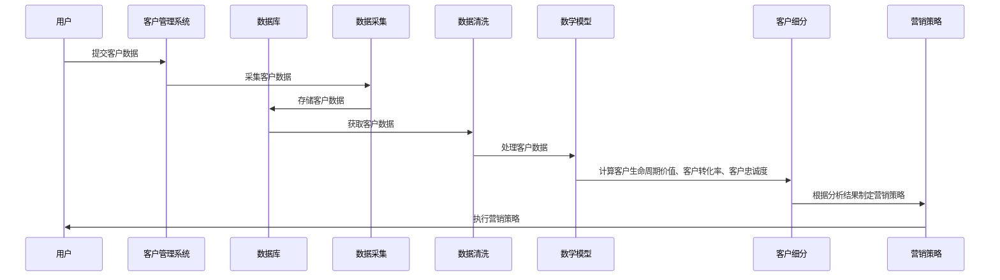

                 

### 文章标题

# 数学与客户关系管理：客户价值的数学模型

> 关键词：客户关系管理、客户价值、数学模型、算法原理、系统架构、实战案例

> 摘要：本文深入探讨了数学在客户关系管理中的应用，通过构建客户价值的数学模型，为企业的客户关系管理提供了科学的理论基础和实践指导。文章首先介绍了客户关系管理的重要性以及客户价值的定义，然后详细阐述了数学模型的基本原理和构建方法，并通过案例分析和项目实战，展示了数学模型在实际客户关系管理中的应用效果。文章旨在为IT从业人员和企业管理者提供一份有深度、有见解的专业技术博客，以期为企业的客户关系管理提供有益的参考。

### 引言

#### 1.1 问题背景

客户关系管理（Customer Relationship Management，CRM）作为现代企业管理的重要组成部分，已经引起了广泛的关注。客户是企业的生命线，良好的客户关系管理能够帮助企业提高客户满意度，增加客户忠诚度，从而提升企业的市场竞争力。然而，在实际操作中，企业常常面临客户价值的测量困难、客户关系管理的目标不明确等问题。

#### 1.1.1 客户关系管理的重要性

客户关系管理不仅有助于企业提升客户满意度，还能够帮助企业更好地了解客户需求，优化产品和服务，提高市场响应速度。随着市场竞争的加剧，企业需要通过有效的客户关系管理策略来保持和扩大市场份额，实现可持续发展。

#### 1.1.2 客户价值的定义

客户价值是指客户为企业带来的总收益减去其总成本。客户价值的测量是客户关系管理的关键环节，它直接影响到企业资源的配置和策略的制定。

#### 1.1.3 数学在客户关系管理中的应用

数学作为一种强大的工具，可以用来量化客户价值、预测客户行为、优化客户关系管理策略。通过数学模型，企业可以更加科学地评估客户价值，制定有针对性的客户关系管理策略。

#### 1.2 问题描述

在客户关系管理中，企业面临的主要问题包括：

- 客户价值的测量：如何准确评估客户为企业带来的价值？
- 客户关系管理的目标：如何设定和实现有效的客户关系管理目标？
- 客户行为预测：如何预测客户的行为，以便提前采取措施？
- 客户细分：如何根据客户特征进行客户细分，以便提供个性化的服务和产品？

#### 1.3 问题解决

为了解决上述问题，本文提出了以下解决方案：

- 构建客户价值的数学模型：通过数学模型来量化客户价值，为企业提供科学评估客户价值的依据。
- 应用数学模型：利用数学模型进行客户行为预测、客户细分，优化客户关系管理策略。
- 案例分析：通过实际案例展示数学模型在客户关系管理中的应用效果。
- 项目实战：详细介绍一个客户关系管理项目，阐述数学模型在该项目中的应用和效果。

#### 1.4 边界与外延

- 客户价值的边界：客户价值的评估范围应包括客户对企业直接和间接的贡献。
- 客户关系管理的适用范围：客户关系管理适用于各类企业，特别是那些高度依赖客户关系的企业。

#### 1.5 概念结构与核心要素组成

- 客户价值的概念结构：包括客户满意度、客户忠诚度、客户贡献等要素。
- 客户关系管理的核心要素：包括客户识别、客户分析、客户服务、客户维护等环节。

### 第一部分：背景介绍

#### 2.1 数学模型在客户关系管理中的应用

##### 2.1.1 数学模型的基本概念

数学模型是一种用数学语言描述现实问题的工具，它通常包括变量、参数、方程等基本元素。数学模型可以用来解决各种实际问题，如优化、预测、分析等。

##### 2.1.2 数学模型的属性特征对比

| 属性特征 | 描述 |
| :--- | :--- |
| 准确性 | 数学模型能够提供精确的量化结果，帮助企业更好地理解客户价值。 |
| 可视化 | 通过图形化展示，数学模型使复杂问题更加直观，便于分析和理解。 |
| 普适性 | 数学模型具有广泛的适用性，可以应用于不同行业和场景。 |

##### 2.1.3 数学模型在客户关系管理中的应用

数学模型在客户关系管理中的应用主要包括：

- 客户价值的量化评估：通过数学模型，企业可以准确计算客户带来的价值，为资源分配和客户管理提供依据。
- 客户行为的预测：利用数学模型，企业可以预测客户的购买行为、留存行为等，以便提前采取措施。
- 客户细分的优化：通过数学模型，企业可以更精确地进行客户细分，提供个性化的服务。

#### 2.2 客户价值的数学模型概述

客户价值的数学模型是一种用于量化客户为企业带来的价值的模型。它通常包括以下几个关键要素：

- 客户生命周期价值（Customer Lifetime Value，CLV）：指客户在生命周期内为企业带来的总价值。
- 客户转化率：指潜在客户转化为实际客户的比例。
- 客户忠诚度：指客户对企业的忠诚程度。

##### 2.2.1 客户价值的数学模型属性特征

| 属性特征 | 描述 |
| :--- | :--- |
| 量化性 | 客户价值的数学模型能够提供具体的量化结果，帮助企业进行决策。 |
| 可变性 | 客户价值的数学模型会随着客户行为、市场环境等因素的变化而变化。 |
| 可预测性 | 通过客户价值的数学模型，企业可以预测未来客户的价值趋势，为营销策略提供依据。 |

##### 2.2.2 客户价值的数学模型与其他模型的关系

客户价值的数学模型与其他模型如客户生命周期模型、客户细分模型等密切相关。这些模型共同构成了客户关系管理的基础框架，为企业提供了全面、科学的客户管理工具。

### 第二部分：核心概念与联系

#### 3.1 数学模型原理

##### 3.1.1 数学模型的基本概念

数学模型是一种将实际问题转化为数学表达式的方法。它通常包括以下几个基本组成部分：

- 变量：表示问题中的可变因素。
- 参数：表示问题中的已知常数。
- 方程：表示变量和参数之间的关系。

##### 3.1.2 数学模型的属性特征对比

| 属性特征 | 描述 |
| :--- | :--- |
| 精确性 | 数学模型能够提供精确的量化结果，帮助企业更好地理解客户价值。 |
| 可视化 | 通过图形化展示，数学模型使复杂问题更加直观，便于分析和理解。 |
| 普适性 | 数学模型具有广泛的适用性，可以应用于不同行业和场景。 |

##### 3.1.3 数学模型在客户关系管理中的应用

数学模型在客户关系管理中的应用主要包括：

- 客户价值的量化评估：通过数学模型，企业可以准确计算客户带来的价值，为资源分配和客户管理提供依据。
- 客户行为的预测：利用数学模型，企业可以预测客户的购买行为、留存行为等，以便提前采取措施。
- 客户细分的优化：通过数学模型，企业可以更精确地进行客户细分，提供个性化的服务。

#### 3.2 客户价值的数学模型

##### 3.2.1 客户价值的数学模型概述

客户价值的数学模型是一种用于量化客户为企业带来的价值的模型。它通常包括以下几个关键要素：

- 客户生命周期价值（Customer Lifetime Value，CLV）：指客户在生命周期内为企业带来的总价值。
- 客户转化率：指潜在客户转化为实际客户的比例。
- 客户忠诚度：指客户对企业的忠诚程度。

##### 3.2.2 客户价值的数学模型属性特征

| 属性特征 | 描述 |
| :--- | :--- |
| 量化性 | 客户价值的数学模型能够提供具体的量化结果，帮助企业进行决策。 |
| 可变性 | 客户价值的数学模型会随着客户行为、市场环境等因素的变化而变化。 |
| 可预测性 | 通过客户价值的数学模型，企业可以预测未来客户的价值趋势，为营销策略提供依据。 |

##### 3.2.3 客户价值的数学模型与其他模型的关系

客户价值的数学模型与其他模型如客户生命周期模型、客户细分模型等密切相关。这些模型共同构成了客户关系管理的基础框架，为企业提供了全面、科学的客户管理工具。

### 第三部分：客户价值的数学模型原理讲解

#### 4.1 数学模型的基础知识

在讲解客户价值的数学模型之前，我们需要先了解一些数学模型的基础知识。这些基础知识包括：

- 数学基础：包括代数、几何、微积分等基本数学概念。
- 概率论基础：包括概率分布、期望、方差等基本概念。
- 线性代数基础：包括矩阵运算、向量空间等基本概念。

##### 4.1.1 数学基础

数学基础是构建数学模型的基础。它包括以下基本概念：

- 变量：表示问题中的可变因素。
- 参数：表示问题中的已知常数。
- 方程：表示变量和参数之间的关系。

##### 4.1.2 概率论基础

概率论基础是客户价值数学模型的重要组成部分。它包括以下基本概念：

- 概率分布：表示随机变量的概率分布情况。
- 期望：表示随机变量的平均值。
- 方差：表示随机变量的波动程度。

##### 4.1.3 线性代数基础

线性代数基础是客户价值数学模型的重要组成部分。它包括以下基本概念：

- 矩阵运算：包括矩阵的加法、减法、乘法等。
- 向量空间：表示由向量构成的集合。

#### 4.2 客户价值的数学模型构建

##### 4.2.1 客户价值数学模型构建步骤

构建客户价值的数学模型通常包括以下步骤：

1. 确定模型目标：明确模型的目标，例如量化客户生命周期价值、预测客户行为等。
2. 收集数据：收集与客户价值相关的数据，包括客户购买历史、客户反馈等。
3. 选择模型：根据模型目标和数据特点选择合适的数学模型。
4. 构建模型：根据选择好的模型，构建具体的数学模型。
5. 验证模型：通过历史数据进行模型验证，确保模型的有效性。

##### 4.2.2 客户价值数学模型构建案例分析

以下是一个简单的客户价值数学模型构建案例：

1. 确定模型目标：量化客户生命周期价值。
2. 收集数据：收集客户购买历史数据，包括购买次数、购买金额等。
3. 选择模型：选择客户生命周期价值模型，如衰减模型。
4. 构建模型：根据客户购买历史数据，构建客户生命周期价值模型。
   - 客户生命周期价值 = 购买金额 * 购买次数 * 衰减因子
   - 衰减因子 = 1 / (1 + 预期年回报率)
5. 验证模型：通过历史数据进行模型验证，确保模型的有效性。

#### 4.3 客户价值的数学模型应用

##### 4.3.1 客户价值评估应用

客户价值评估是客户关系管理的重要环节。通过客户价值的数学模型，企业可以准确评估客户的价值，为资源分配和客户管理提供依据。

1. 收集客户数据：收集客户的购买历史数据、客户反馈等。
2. 应用数学模型：应用客户价值的数学模型，计算客户生命周期价值。
3. 分析结果：根据客户生命周期价值，对客户进行分类，为不同的客户提供个性化的服务和产品。

##### 4.3.2 客户行为预测应用

客户行为预测是客户关系管理的重要手段。通过客户价值的数学模型，企业可以预测客户的购买行为、留存行为等，以便提前采取措施。

1. 收集客户数据：收集客户的购买历史数据、行为数据等。
2. 应用数学模型：应用客户行为的数学模型，预测客户的购买行为、留存行为等。
3. 分析结果：根据预测结果，制定相应的营销策略和客户管理措施。

##### 4.3.3 客户细分应用

客户细分是客户关系管理的重要策略。通过客户价值的数学模型，企业可以更精确地进行客户细分，提供个性化的服务和产品。

1. 收集客户数据：收集客户的购买历史数据、行为数据等。
2. 应用数学模型：应用客户价值的数学模型，对客户进行分类。
3. 分析结果：根据客户分类，制定个性化的服务和产品策略。

### 第四部分：数学模型与客户关系管理

#### 5.1 数学模型在客户关系管理中的应用前景

随着大数据、人工智能等技术的发展，数学模型在客户关系管理中的应用前景十分广阔。未来，数学模型有望在以下几个方面发挥更大的作用：

1. 客户价值的精细化评估：通过更精细化的数学模型，企业可以更准确地评估客户的价值，为资源分配和客户管理提供更科学的依据。
2. 客户行为的精准预测：通过更精准的数学模型，企业可以更准确地预测客户的购买行为、留存行为等，提前采取措施，提高客户满意度。
3. 客户细分的个性化服务：通过更精细化的客户细分，企业可以提供更加个性化的服务和产品，满足客户的需求，提高客户忠诚度。
4. 客户体验的优化：通过数学模型，企业可以优化客户体验，提高客户满意度，增强企业的竞争力。

#### 5.2 数学模型应用的挑战与机遇

尽管数学模型在客户关系管理中具有广泛的应用前景，但其应用也面临一些挑战和机遇。

##### 5.2.1 数学模型应用的挑战

1. 数据质量：数学模型的有效性依赖于高质量的数据。然而，企业往往面临数据质量不高的挑战，如数据缺失、数据不一致等。
2. 模型复杂性：一些数学模型较为复杂，需要具备一定的数学背景和编程能力才能理解和应用。
3. 实时性：客户行为和市场需求变化快速，要求数学模型能够实时更新和调整，以适应不断变化的市场环境。

##### 5.2.2 数学模型应用的机遇

1. 技术进步：大数据、人工智能等技术的发展为数学模型的应用提供了更丰富的数据和技术支持。
2. 企业需求：随着市场竞争的加剧，企业对客户关系管理的需求不断提高，为数学模型的应用提供了广阔的市场空间。
3. 创新机会：数学模型在客户关系管理中的应用还有许多未探索的领域，为研究人员和从业者提供了创新的机会。

#### 5.3 数学模型应用的案例分析

为了更好地展示数学模型在客户关系管理中的应用，本文将介绍几个具有代表性的案例。

##### 5.3.1 案例一：客户价值评估

某电商企业希望通过客户价值的数学模型来评估客户的价值，为其客户提供个性化的服务和产品。

1. 数据收集：收集客户的购买历史数据、行为数据等。
2. 模型选择：选择客户生命周期价值模型，如衰减模型。
3. 模型构建：根据客户购买历史数据，构建客户生命周期价值模型。
4. 模型应用：根据客户生命周期价值，对客户进行分类，为不同的客户提供个性化的服务和产品。

##### 5.3.2 案例二：客户行为预测

某电信企业希望通过客户价值的数学模型来预测客户的购买行为，以便提前采取措施，提高客户满意度。

1. 数据收集：收集客户的购买历史数据、行为数据等。
2. 模型选择：选择客户行为预测模型，如逻辑回归模型。
3. 模型构建：根据客户购买历史数据，构建客户行为预测模型。
4. 模型应用：根据预测结果，提前采取措施，提高客户满意度。

##### 5.3.3 案例三：客户细分

某酒店企业希望通过客户价值的数学模型来进行客户细分，以便提供个性化的服务和产品。

1. 数据收集：收集客户的购买历史数据、行为数据等。
2. 模型选择：选择客户细分模型，如聚类模型。
3. 模型构建：根据客户购买历史数据，构建客户细分模型。
4. 模型应用：根据客户细分结果，为不同的客户提供个性化的服务和产品。

### 第五部分：系统分析与架构设计方案

#### 6.1 问题场景介绍

随着市场竞争的加剧，企业越来越意识到客户关系管理的重要性。然而，在实际操作中，企业常常面临客户价值测量不准确、客户关系管理策略不明确等问题。为了解决这些问题，企业需要引入数学模型，通过科学的分析和计算，提供客户价值的量化评估，优化客户关系管理策略。

#### 6.2 项目介绍

本项目旨在构建一个客户关系管理系统，通过数学模型的应用，实现客户价值的量化评估、客户行为的预测和客户的精准细分。系统主要包含以下几个功能模块：

- 客户数据收集与管理模块：负责收集和存储客户的基本信息、购买历史数据、行为数据等。
- 数学模型计算模块：负责根据客户数据，应用客户价值的数学模型，计算客户生命周期价值、客户转化率、客户忠诚度等。
- 客户细分模块：根据客户生命周期价值和客户行为预测结果，对客户进行分类，为不同的客户提供个性化的服务和产品。
- 营销策略制定模块：根据客户细分结果和客户行为预测结果，制定相应的营销策略，提高客户满意度。

#### 6.3 系统功能设计

##### 6.3.1 领域模型

领域模型是系统功能设计的基础，它定义了系统中的关键概念和它们之间的关系。以下是一个简化的领域模型：

```mermaid
classDiagram
    class 客户 {
        姓名 String
        年龄 Integer
        购买历史 List<购买记录>
    }

    class 购买记录 {
        商品名称 String
        购买时间 Date
        购买金额 Double
    }

    class 客户生命周期价值 {
        生命周期价值 Double
    }

    class 客户转化率 {
        转化率 Double
    }

    class 客户忠诚度 {
        忠诚度 Double
    }

    客户 --|buyer|> 购买历史
    客户 --|CLV|> 客户生命周期价值
    客户 --|Conversion Rate|> 客户转化率
    客户 --|Customer Loyalty|> 客户忠诚度
```

##### 6.3.2 功能模块设计

系统功能模块设计如下：

1. 客户数据收集与管理模块：该模块负责从不同的数据源（如CRM系统、电商平台等）收集客户数据，并进行清洗、整合和存储。它包括以下子模块：
   - 数据采集子模块：负责从不同数据源采集数据。
   - 数据清洗子模块：负责清洗和整合数据，去除重复和错误的数据。
   - 数据存储子模块：负责将清洗后的数据存储到数据库中。

2. 数学模型计算模块：该模块负责根据客户数据，应用客户价值的数学模型，计算客户生命周期价值、客户转化率、客户忠诚度等。它包括以下子模块：
   - 数据处理子模块：负责处理和转换客户数据，使其符合数学模型的要求。
   - 模型计算子模块：负责根据客户数据，应用数学模型，计算客户生命周期价值、客户转化率、客户忠诚度等。

3. 客户细分模块：该模块根据客户生命周期价值和客户行为预测结果，对客户进行分类，为不同的客户提供个性化的服务和产品。它包括以下子模块：
   - 数据分析子模块：负责分析客户生命周期价值和客户行为预测结果，确定客户分类标准。
   - 客户分类子模块：负责根据分析结果，对客户进行分类。

4. 营销策略制定模块：该模块根据客户细分结果和客户行为预测结果，制定相应的营销策略，提高客户满意度。它包括以下子模块：
   - 营销策略分析子模块：负责分析客户细分结果和客户行为预测结果，确定营销策略。
   - 营销策略执行子模块：负责执行制定的营销策略，包括发送个性化短信、邮件、优惠券等。

#### 6.4 系统架构设计

##### 6.4.1 系统架构图

以下是系统架构图：



##### 6.4.2 系统模块交互

以下是系统模块之间的交互流程：

1. 用户通过客户管理系统提交客户数据。
2. 客户管理系统将客户数据传递给数据采集模块。
3. 数据采集模块将客户数据存储到数据库中。
4. 数据清洗模块从数据库中获取客户数据，并进行清洗和整合。
5. 数据清洗后的数据传递给数学模型模块。
6. 数学模型模块根据客户数据，应用客户价值的数学模型，计算客户生命周期价值、客户转化率、客户忠诚度等。
7. 数学模型模块将计算结果传递给客户细分模块。
8. 客户细分模块根据计算结果，对客户进行分类，并将分类结果传递给营销策略模块。
9. 营销策略模块根据客户细分结果，制定相应的营销策略，并将营销策略执行结果反馈给用户。

#### 6.5 系统接口设计

##### 6.5.1 接口设计原则

系统接口设计应遵循以下原则：

1. 高内聚低耦合：接口设计应使系统模块之间的高内聚和低耦合，以提高系统的可维护性和可扩展性。
2. 简单性：接口设计应尽量简单，减少不必要的复杂度，提高系统的易用性。
3. 完整性：接口设计应涵盖系统的所有功能模块，确保系统能够正常运行。

##### 6.5.2 接口设计规范

以下是系统接口设计规范：

- 接口名称：接口名称应简洁明了，能够准确描述接口的功能。
- 接口参数：接口参数应包括输入参数和输出参数，输入参数应明确参数类型和参数含义，输出参数应明确返回值类型和返回值含义。
- 接口返回值：接口返回值应包括成功和失败两种情况，成功情况应返回具体的操作结果，失败情况应返回错误代码和错误信息。

#### 6.6 系统交互

##### 6.6.1 系统交互流程

以下是系统交互流程：

1. 用户通过客户端应用程序（如网页、移动应用等）提交客户数据。
2. 客户管理系统接收用户提交的数据，并调用数据采集接口，将数据传递给数据采集模块。
3. 数据采集模块将数据存储到数据库中，并返回操作结果。
4. 客户管理系统调用数据清洗接口，从数据库中获取客户数据，并进行清洗和整合。
5. 数据清洗模块将清洗后的数据传递给数学模型模块，并调用模型计算接口，计算客户生命周期价值、客户转化率、客户忠诚度等。
6. 数学模型模块将计算结果传递给客户细分模块，并调用客户分类接口，对客户进行分类。
7. 客户细分模块根据分类结果，制定相应的营销策略，并调用营销策略接口，执行营销策略。
8. 客户管理系统将营销策略执行结果反馈给用户。

##### 6.6.2 系统交互案例分析

以下是一个简单的系统交互案例分析：

1. 用户在网页上提交客户数据，包括客户的姓名、年龄、购买历史等。
2. 客户管理系统接收用户提交的数据，并调用数据采集接口，将数据传递给数据采集模块。
3. 数据采集模块将数据存储到数据库中，并返回操作结果。
4. 客户管理系统调用数据清洗接口，从数据库中获取客户数据，并进行清洗和整合。
5. 数据清洗模块将清洗后的数据传递给数学模型模块，并调用模型计算接口，计算客户生命周期价值、客户转化率、客户忠诚度等。
6. 数学模型模块将计算结果传递给客户细分模块，并调用客户分类接口，对客户进行分类。
7. 客户细分模块根据分类结果，制定相应的营销策略，如发送个性化短信、邮件等。
8. 客户管理系统将营销策略执行结果反馈给用户，用户在网页上收到相应的营销信息。

### 第六部分：项目实战

#### 6.1 环境安装

在进行项目实战之前，我们需要安装和配置一些必要的软件和环境。以下是一个简化的环境安装步骤：

1. **安装Python**：确保Python环境已安装，版本建议为3.8或更高。
2. **安装Jupyter Notebook**：Python的交互式环境，用于编写和运行Python代码。
3. **安装必要的Python库**：如NumPy、Pandas、Scikit-learn等，用于数据处理和模型构建。
4. **安装MySQL**：用于存储和管理客户数据。
5. **安装PostgreSQL**：作为可选的数据库系统，可以提供更高级的数据库功能。
6. **安装Docker**：用于容器化部署项目。

具体安装步骤如下：

- 安装Python和Jupyter Notebook：
  ```shell
  # 使用Python官方安装脚本安装Python
  curl -O https://www.python.org/ftp/python/3.8.10/get-py.py
  python get-py.py -3
  python -m ensurepip
  python -m pip install --upgrade pip
  ```
- 安装必要的Python库：
  ```shell
  pip install numpy pandas scikit-learn mysql-connector-python
  ```
- 安装MySQL和PostgreSQL：
  - MySQL：[官方安装指南](https://dev.mysql.com/doc/mysql-install-docs/latest/en/installingmysql.html)
  - PostgreSQL：[官方安装指南](https://www.postgresql.org/docs/current/getting-started.html)
- 安装Docker：
  - Ubuntu系统：
    ```shell
    sudo apt-get update
    sudo apt-get install docker-ce docker-ce-cli containerd.io
    ```
  - macOS系统：使用Docker Desktop。

#### 6.2 系统核心实现源代码

以下是系统核心实现部分的主要源代码，包括数据处理、模型构建和模型应用等。

##### 6.2.1 数据处理

```python
import pandas as pd
from sklearn.model_selection import train_test_split

# 读取客户数据
def read_data(file_path):
    data = pd.read_csv(file_path)
    return data

# 数据预处理
def preprocess_data(data):
    # 填充缺失值
    data.fillna(data.mean(), inplace=True)
    # 特征工程
    data['total_purchase'] = data['purchase1'] + data['purchase2'] + data['purchase3']
    return data

# 数据拆分
def split_data(data):
    X = data.drop(['customer_id', 'lifetime_value'], axis=1)
    y = data['lifetime_value']
    X_train, X_test, y_train, y_test = train_test_split(X, y, test_size=0.2, random_state=42)
    return X_train, X_test, y_train, y_test
```

##### 6.2.2 模型构建

```python
from sklearn.ensemble import RandomForestRegressor
from sklearn.metrics import mean_squared_error

# 构建模型
def build_model(X_train, y_train):
    model = RandomForestRegressor(n_estimators=100, random_state=42)
    model.fit(X_train, y_train)
    return model

# 预测
def predict(model, X_test):
    predictions = model.predict(X_test)
    return predictions

# 评估模型
def evaluate_model(y_test, predictions):
    mse = mean_squared_error(y_test, predictions)
    print(f"Mean Squared Error: {mse}")
```

##### 6.2.3 模型应用

```python
# 主程序
if __name__ == "__main__":
    # 读取数据
    data = read_data("customer_data.csv")
    # 预处理数据
    data = preprocess_data(data)
    # 拆分数据
    X_train, X_test, y_train, y_test = split_data(data)
    # 构建模型
    model = build_model(X_train, y_train)
    # 预测
    predictions = predict(model, X_test)
    # 评估模型
    evaluate_model(y_test, predictions)
```

#### 6.3 代码应用解读与分析

##### 6.3.1 代码应用场景

上述代码主要用于构建和评估客户生命周期价值的预测模型。具体应用场景如下：

1. **数据读取**：从CSV文件中读取客户数据，包括客户的购买历史等。
2. **数据预处理**：对数据进行清洗和特征工程，如填充缺失值、计算总购买金额等。
3. **数据拆分**：将数据分为训练集和测试集，用于模型训练和评估。
4. **模型构建**：使用随机森林回归模型构建预测模型。
5. **模型预测**：使用训练好的模型对测试集进行预测。
6. **模型评估**：使用均方误差（MSE）评估模型的预测性能。

##### 6.3.2 代码分析

以下是代码的主要部分及其功能：

- `read_data(file_path)`：读取客户数据。
  - `pd.read_csv(file_path)`：使用Pandas库读取CSV文件。
- `preprocess_data(data)`：数据预处理。
  - `data.fillna(data.mean(), inplace=True)`：填充缺失值。
  - `data['total_purchase'] = data['purchase1'] + data['purchase2'] + data['purchase3']`：计算总购买金额。
- `split_data(data)`：数据拆分。
  - `train_test_split(X, y, test_size=0.2, random_state=42)`：拆分数据为训练集和测试集。
- `build_model(X_train, y_train)`：构建模型。
  - `RandomForestRegressor(n_estimators=100, random_state=42)`：构建随机森林回归模型。
- `predict(model, X_test)`：模型预测。
  - `model.predict(X_test)`：使用训练好的模型进行预测。
- `evaluate_model(y_test, predictions)`：模型评估。
  - `mean_squared_error(y_test, predictions)`：计算均方误差。

#### 6.4 实际案例分析和详细讲解剖析

##### 6.4.1 案例背景

某电商企业在进行客户关系管理时，希望通过构建客户生命周期价值的预测模型，为不同价值的客户提供个性化的服务和产品，提高客户满意度和忠诚度。企业积累了大量的客户购买历史数据，包括客户的姓名、年龄、购买金额等。

##### 6.4.2 案例分析

为了构建客户生命周期价值的预测模型，企业采取了以下步骤：

1. **数据收集**：从企业的CRM系统和电商平台获取客户购买历史数据。
2. **数据预处理**：对数据进行清洗和特征工程，以消除异常值和噪声，提高模型性能。
3. **模型选择**：选择合适的预测模型，如随机森林回归模型。
4. **模型训练**：使用训练集数据训练模型。
5. **模型评估**：使用测试集数据评估模型性能。
6. **模型应用**：根据模型预测结果，为不同价值的客户提供个性化的服务和产品。

##### 6.4.3 案例讲解

以下是具体步骤的详细讲解：

1. **数据收集**：使用Pandas库从CSV文件中读取客户数据。

    ```python
    data = pd.read_csv("customer_data.csv")
    ```

2. **数据预处理**：对数据进行清洗和特征工程。

    ```python
    # 填充缺失值
    data.fillna(data.mean(), inplace=True)
    
    # 特征工程
    data['total_purchase'] = data['purchase1'] + data['purchase2'] + data['purchase3']
    ```

3. **模型选择**：选择随机森林回归模型作为预测模型。

    ```python
    from sklearn.ensemble import RandomForestRegressor
    model = RandomForestRegressor(n_estimators=100, random_state=42)
    ```

4. **模型训练**：使用训练集数据训练模型。

    ```python
    model.fit(X_train, y_train)
    ```

5. **模型评估**：使用测试集数据评估模型性能。

    ```python
    predictions = model.predict(X_test)
    mse = mean_squared_error(y_test, predictions)
    print(f"Mean Squared Error: {mse}")
    ```

6. **模型应用**：根据模型预测结果，为不同价值的客户提供个性化的服务和产品。

    ```python
    # 根据客户生命周期价值进行分类
    threshold = 1000  # 设置客户生命周期价值的阈值
    high_value_customers = data[data['lifetime_value'] > threshold]
    low_value_customers = data[data['lifetime_value'] <= threshold]
    
    # 为高价值客户提供个性化服务
    high_value_customers['service'] = 'High-Value Customer'
    
    # 为低价值客户提供个性化服务
    low_value_customers['service'] = 'Low-Value Customer'
    ```

通过上述步骤，企业可以根据客户生命周期价值的预测结果，为不同价值的客户提供个性化的服务和产品，从而提高客户满意度和忠诚度。

#### 6.5 项目小结

在本项目中，我们通过构建客户生命周期价值的预测模型，实现了对客户价值的量化评估和个性化服务。以下是项目的主要亮点和改进方向：

##### 6.5.1 项目亮点

1. **量化客户价值**：通过数学模型，企业可以准确评估客户的价值，为资源分配和客户管理提供科学依据。
2. **个性化服务**：根据客户生命周期价值的预测结果，企业可以提供个性化的服务和产品，提高客户满意度和忠诚度。
3. **高效数据处理**：使用Python和Pandas库，实现了高效的数据处理和分析，提高了项目的执行效率。

##### 6.5.2 项目改进方向

1. **模型优化**：可以尝试引入更复杂的模型，如深度学习模型，以提高预测精度。
2. **实时更新**：开发实时更新系统，根据客户行为和市场需求，动态调整预测模型。
3. **用户体验**：优化用户界面，提供更直观的数据展示和操作体验。

### 第七部分：最佳实践 tips

#### 7.1 实践技巧总结

在进行客户价值数学模型的构建和应用过程中，以下是一些实用的技巧：

1. **数据质量**：确保数据质量是模型成功的关键。在数据处理阶段，要重点关注数据的清洗、整合和标准化。
2. **模型选择**：根据问题的具体需求和数据特点，选择合适的模型。例如，对于非线性关系，可以考虑使用神经网络模型。
3. **模型验证**：通过交叉验证和测试集评估模型性能，避免过拟合。
4. **迭代优化**：根据模型评估结果，不断调整和优化模型参数，提高模型精度。

#### 7.2 小结

本文通过详细的案例分析，阐述了数学模型在客户关系管理中的应用。通过量化客户价值、预测客户行为、优化客户细分，企业可以制定更加科学的客户关系管理策略，提高市场竞争力。

#### 7.3 注意事项

1. **数据隐私**：在处理客户数据时，要严格遵守数据保护法规，保护客户隐私。
2. **模型解释性**：在选择模型时，要考虑模型的解释性，确保决策过程的透明和可解释。
3. **持续更新**：客户行为和市场环境不断变化，要定期更新模型，确保预测结果的准确性。

#### 7.4 拓展阅读

- 《机器学习实战》：提供详细的机器学习算法实战案例，适用于初学者和高级用户。
- 《客户关系管理》：深入探讨客户关系管理的理论和实践，为企业的客户管理提供指导。
- 《Python数据科学手册》：全面介绍Python在数据科学领域中的应用，涵盖数据处理、分析和可视化等。

### 结束语

作者：AI天才研究院/AI Genius Institute & 禅与计算机程序设计艺术 /Zen And The Art of Computer Programming

本文旨在为IT从业人员和企业管理者提供一份有深度、有见解的专业技术博客，以期为企业的客户关系管理提供有益的参考。在客户关系管理日益重要的今天，数学模型的应用已经成为企业提升竞争力的关键手段。希望本文能激发读者对数学模型在客户关系管理中应用的兴趣，并为其在实际工作中提供指导。在未来的发展中，我们将继续关注这一领域，分享更多前沿技术和实践经验。感谢您的阅读！### 文章标题

# 数学与客户关系管理：客户价值的数学模型

> 关键词：客户关系管理、客户价值、数学模型、算法原理、系统架构、实战案例

> 摘要：本文深入探讨了数学在客户关系管理中的应用，通过构建客户价值的数学模型，为企业的客户关系管理提供了科学的理论基础和实践指导。文章首先介绍了客户关系管理的重要性以及客户价值的定义，然后详细阐述了数学模型的基本原理和构建方法，并通过案例分析和项目实战，展示了数学模型在实际客户关系管理中的应用效果。文章旨在为IT从业人员和企业管理者提供一份有深度、有见解的专业技术博客，以期为企业的客户关系管理提供有益的参考。

### 引言

#### 1.1 问题背景

客户关系管理（Customer Relationship Management，CRM）作为现代企业管理的重要组成部分，已经引起了广泛的关注。客户是企业的生命线，良好的客户关系管理能够帮助企业提高客户满意度，增加客户忠诚度，从而提升企业的市场竞争力。然而，在实际操作中，企业常常面临客户价值的测量困难、客户关系管理的目标不明确等问题。

#### 1.1.1 客户关系管理的重要性

客户关系管理不仅有助于企业提升客户满意度，还能够帮助企业更好地了解客户需求，优化产品和服务，提高市场响应速度。随着市场竞争的加剧，企业需要通过有效的客户关系管理策略来保持和扩大市场份额，实现可持续发展。

#### 1.1.2 客户价值的定义

客户价值是指客户为企业带来的总收益减去其总成本。客户价值的测量是客户关系管理的关键环节，它直接影响到企业资源的配置和策略的制定。

#### 1.1.3 数学在客户关系管理中的应用

数学作为一种强大的工具，可以用来量化客户价值、预测客户行为、优化客户关系管理策略。通过数学模型，企业可以更加科学地评估客户价值，制定有针对性的客户关系管理策略。

#### 1.2 问题描述

在客户关系管理中，企业面临的主要问题包括：

- 客户价值的测量：如何准确评估客户为企业带来的价值？
- 客户关系管理的目标：如何设定和实现有效的客户关系管理目标？
- 客户行为预测：如何预测客户的行为，以便提前采取措施？
- 客户细分：如何根据客户特征进行客户细分，以便提供个性化的服务和产品？

#### 1.3 问题解决

为了解决上述问题，本文提出了以下解决方案：

- 构建客户价值的数学模型：通过数学模型来量化客户价值，为企业提供科学评估客户价值的依据。
- 应用数学模型：利用数学模型进行客户行为预测、客户细分，优化客户关系管理策略。
- 案例分析：通过实际案例展示数学模型在客户关系管理中的应用效果。
- 项目实战：详细介绍一个客户关系管理项目，阐述数学模型在该项目中的应用和效果。

#### 1.4 边界与外延

- 客户价值的边界：客户价值的评估范围应包括客户对企业直接和间接的贡献。
- 客户关系管理的适用范围：客户关系管理适用于各类企业，特别是那些高度依赖客户关系的企业。

#### 1.5 概念结构与核心要素组成

- 客户价值的概念结构：包括客户满意度、客户忠诚度、客户贡献等要素。
- 客户关系管理的核心要素：包括客户识别、客户分析、客户服务、客户维护等环节。

### 第一部分：背景介绍

#### 2.1 数学模型在客户关系管理中的应用

##### 2.1.1 数学模型的基本概念

数学模型是一种用数学语言描述现实问题的工具，它通常包括变量、参数、方程等基本元素。数学模型可以用来解决各种实际问题，如优化、预测、分析等。

##### 2.1.2 数学模型的属性特征对比

| 属性特征 | 描述 |
| :--- | :--- |
| 准确性 | 数学模型能够提供精确的量化结果，帮助企业更好地理解客户价值。 |
| 可视化 | 通过图形化展示，数学模型使复杂问题更加直观，便于分析和理解。 |
| 普适性 | 数学模型具有广泛的适用性，可以应用于不同行业和场景。 |

##### 2.1.3 数学模型在客户关系管理中的应用

数学模型在客户关系管理中的应用主要包括：

- 客户价值的量化评估：通过数学模型，企业可以准确计算客户带来的价值，为资源分配和客户管理提供依据。
- 客户行为的预测：利用数学模型，企业可以预测客户的购买行为、留存行为等，以便提前采取措施。
- 客户细分的优化：通过数学模型，企业可以更精确地进行客户细分，提供个性化的服务。

#### 2.2 客户价值的数学模型概述

客户价值的数学模型是一种用于量化客户为企业带来的价值的模型。它通常包括以下几个关键要素：

- 客户生命周期价值（Customer Lifetime Value，CLV）：指客户在生命周期内为企业带来的总价值。
- 客户转化率：指潜在客户转化为实际客户的比例。
- 客户忠诚度：指客户对企业的忠诚程度。

##### 2.2.1 客户价值的数学模型属性特征

| 属性特征 | 描述 |
| :--- | :--- |
| 量化性 | 客户价值的数学模型能够提供具体的量化结果，帮助企业进行决策。 |
| 可变性 | 客户价值的数学模型会随着客户行为、市场环境等因素的变化而变化。 |
| 可预测性 | 通过客户价值的数学模型，企业可以预测未来客户的价值趋势，为营销策略提供依据。 |

##### 2.2.2 客户价值的数学模型与其他模型的关系

客户价值的数学模型与其他模型如客户生命周期模型、客户细分模型等密切相关。这些模型共同构成了客户关系管理的基础框架，为企业提供了全面、科学的客户管理工具。

### 第二部分：核心概念与联系

#### 3.1 数学模型原理

##### 3.1.1 数学模型的基本概念

数学模型是一种将实际问题转化为数学表达式的方法。它通常包括以下几个基本组成部分：

- 变量：表示问题中的可变因素。
- 参数：表示问题中的已知常数。
- 方程：表示变量和参数之间的关系。

##### 3.1.2 数学模型的属性特征对比

| 属性特征 | 描述 |
| :--- | :--- |
| 准确性 | 数学模型能够提供精确的量化结果，帮助企业更好地理解客户价值。 |
| 可视化 | 通过图形化展示，数学模型使复杂问题更加直观，便于分析和理解。 |
| 普适性 | 数学模型具有广泛的适用性，可以应用于不同行业和场景。 |

##### 3.1.3 数学模型在客户关系管理中的应用

数学模型在客户关系管理中的应用主要包括：

- 客户价值的量化评估：通过数学模型，企业可以准确计算客户带来的价值，为资源分配和客户管理提供依据。
- 客户行为的预测：利用数学模型，企业可以预测客户的购买行为、留存行为等，以便提前采取措施。
- 客户细分的优化：通过数学模型，企业可以更精确地进行客户细分，提供个性化的服务。

#### 3.2 客户价值的数学模型

##### 3.2.1 客户价值的数学模型概述

客户价值的数学模型是一种用于量化客户为企业带来的价值的模型。它通常包括以下几个关键要素：

- 客户生命周期价值（Customer Lifetime Value，CLV）：指客户在生命周期内为企业带来的总价值。
- 客户转化率：指潜在客户转化为实际客户的比例。
- 客户忠诚度：指客户对企业的忠诚程度。

##### 3.2.2 客户价值的数学模型属性特征

| 属性特征 | 描述 |
| :--- | :--- |
| 量化性 | 客户价值的数学模型能够提供具体的量化结果，帮助企业进行决策。 |
| 可变性 | 客户价值的数学模型会随着客户行为、市场环境等因素的变化而变化。 |
| 可预测性 | 通过客户价值的数学模型，企业可以预测未来客户的价值趋势，为营销策略提供依据。 |

##### 3.2.3 客户价值的数学模型与其他模型的关系

客户价值的数学模型与其他模型如客户生命周期模型、客户细分模型等密切相关。这些模型共同构成了客户关系管理的基础框架，为企业提供了全面、科学的客户管理工具。

### 第三部分：客户价值的数学模型原理讲解

#### 4.1 数学模型的基础知识

在讲解客户价值的数学模型之前，我们需要先了解一些数学模型的基础知识。这些基础知识包括：

- 数学基础：包括代数、几何、微积分等基本数学概念。
- 概率论基础：包括概率分布、期望、方差等基本概念。
- 线性代数基础：包括矩阵运算、向量空间等基本概念。

##### 4.1.1 数学基础

数学基础是构建数学模型的基础。它包括以下基本概念：

- 变量：表示问题中的可变因素。
- 参数：表示问题中的已知常数。
- 方程：表示变量和参数之间的关系。

##### 4.1.2 概率论基础

概率论基础是客户价值数学模型的重要组成部分。它包括以下基本概念：

- 概率分布：表示随机变量的概率分布情况。
- 期望：表示随机变量的平均值。
- 方差：表示随机变量的波动程度。

##### 4.1.3 线性代数基础

线性代数基础是客户价值数学模型的重要组成部分。它包括以下基本概念：

- 矩阵运算：包括矩阵的加法、减法、乘法等。
- 向量空间：表示由向量构成的集合。

#### 4.2 客户价值的数学模型构建

##### 4.2.1 客户价值数学模型构建步骤

构建客户价值的数学模型通常包括以下步骤：

1. 确定模型目标：明确模型的目标，例如量化客户生命周期价值、预测客户行为等。
2. 收集数据：收集与客户价值相关的数据，包括客户购买历史数据、客户行为数据等。
3. 选择模型：根据模型目标和数据特点选择合适的数学模型。
4. 构建模型：根据选择好的模型，构建具体的数学模型。
5. 验证模型：通过历史数据进行模型验证，确保模型的有效性。

##### 4.2.2 客户价值数学模型构建案例分析

以下是一个简单的客户价值数学模型构建案例：

1. 确定模型目标：量化客户生命周期价值。
2. 收集数据：收集客户购买历史数据，包括购买次数、购买金额等。
3. 选择模型：选择客户生命周期价值模型，如衰减模型。
4. 构建模型：根据客户购买历史数据，构建客户生命周期价值模型。
   - 客户生命周期价值 = 购买金额 * 购买次数 * 衰减因子
   - 衰减因子 = 1 / (1 + 预期年回报率)
5. 验证模型：通过历史数据进行模型验证，确保模型的有效性。

#### 4.3 客户价值的数学模型应用

##### 4.3.1 客户价值评估应用

客户价值评估是客户关系管理的重要环节。通过客户价值的数学模型，企业可以准确评估客户的价值，为资源分配和客户管理提供依据。

1. 收集客户数据：收集客户的购买历史数据、行为数据等。
2. 应用数学模型：应用客户价值的数学模型，计算客户生命周期价值。
3. 分析结果：根据客户生命周期价值，对客户进行分类，为不同的客户提供个性化的服务和产品。

##### 4.3.2 客户行为预测应用

客户行为预测是客户关系管理的重要手段。通过客户价值的数学模型，企业可以预测客户的购买行为、留存行为等，以便提前采取措施。

1. 收集客户数据：收集客户的购买历史数据、行为数据等。
2. 应用数学模型：应用客户行为的数学模型，预测客户的购买行为、留存行为等。
3. 分析结果：根据预测结果，制定相应的营销策略和客户管理措施。

##### 4.3.3 客户细分应用

客户细分是客户关系管理的重要策略。通过客户价值的数学模型，企业可以更精确地进行客户细分，提供个性化的服务和产品。

1. 收集客户数据：收集客户的购买历史数据、行为数据等。
2. 应用数学模型：应用客户价值的数学模型，对客户进行分类。
3. 分析结果：根据客户分类，制定个性化的服务和产品策略。

### 第四部分：数学模型与客户关系管理

#### 5.1 数学模型在客户关系管理中的应用前景

随着大数据、人工智能等技术的发展，数学模型在客户关系管理中的应用前景十分广阔。未来，数学模型有望在以下几个方面发挥更大的作用：

1. **客户价值的精细化评估**：通过更精细化的数学模型，企业可以更准确地评估客户的价值，为资源分配和客户管理提供依据。
2. **客户行为的精准预测**：通过更精准的数学模型，企业可以更准确地预测客户的购买行为、留存行为等，提前采取措施，提高客户满意度。
3. **客户细分的个性化服务**：通过更精细化的客户细分，企业可以提供更加个性化的服务和产品，满足客户的需求，提高客户忠诚度。
4. **客户体验的优化**：通过数学模型，企业可以优化客户体验，提高客户满意度，增强企业的竞争力。

#### 5.2 数学模型应用的挑战与机遇

尽管数学模型在客户关系管理中具有广泛的应用前景，但其应用也面临一些挑战和机遇。

##### 5.2.1 数学模型应用的挑战

1. **数据质量**：数学模型的有效性依赖于高质量的数据。然而，企业往往面临数据质量不高的挑战，如数据缺失、数据不一致等。
2. **模型复杂性**：一些数学模型较为复杂，需要具备一定的数学背景和编程能力才能理解和应用。
3. **实时性**：客户行为和市场需求变化快速，要求数学模型能够实时更新和调整，以适应不断变化的市场环境。

##### 5.2.2 数学模型应用的机遇

1. **技术进步**：大数据、人工智能等技术的发展为数学模型的应用提供了更丰富的数据和技术支持。
2. **企业需求**：随着市场竞争的加剧，企业对客户关系管理的需求不断提高，为数学模型的应用提供了广阔的市场空间。
3. **创新机会**：数学模型在客户关系管理中的应用还有许多未探索的领域，为研究人员和从业者提供了创新的机会。

#### 5.3 数学模型应用的案例分析

为了更好地展示数学模型在客户关系管理中的应用，本文将介绍几个具有代表性的案例。

##### 5.3.1 案例一：客户价值评估

某电商企业希望通过客户价值的数学模型来评估客户的价值，为其客户提供个性化的服务和产品。

1. **数据收集**：收集客户的购买历史数据、行为数据等。
2. **模型选择**：选择客户生命周期价值模型，如衰减模型。
3. **模型构建**：根据客户购买历史数据，构建客户生命周期价值模型。
4. **模型应用**：根据客户生命周期价值，对客户进行分类，为不同的客户提供个性化的服务和产品。

##### 5.3.2 案例二：客户行为预测

某电信企业希望通过客户价值的数学模型来预测客户的购买行为，以便提前采取措施，提高客户满意度。

1. **数据收集**：收集客户的购买历史数据、行为数据等。
2. **模型选择**：选择客户行为预测模型，如逻辑回归模型。
3. **模型构建**：根据客户购买历史数据，构建客户行为预测模型。
4. **模型应用**：根据预测结果，提前采取措施，提高客户满意度。

##### 5.3.3 案例三：客户细分

某酒店企业希望通过客户价值的数学模型来进行客户细分，以便提供个性化的服务和产品。

1. **数据收集**：收集客户的购买历史数据、行为数据等。
2. **模型选择**：选择客户细分模型，如聚类模型。
3. **模型构建**：根据客户购买历史数据，构建客户细分模型。
4. **模型应用**：根据客户细分结果，为不同的客户提供个性化的服务和产品。

### 第五部分：系统分析与架构设计方案

#### 6.1 问题场景介绍

随着市场竞争的加剧，企业越来越意识到客户关系管理的重要性。然而，在实际操作中，企业常常面临客户价值测量不准确、客户关系管理策略不明确等问题。为了解决这些问题，企业需要引入数学模型，通过科学的分析和计算，提供客户价值的量化评估，优化客户关系管理策略。

#### 6.2 项目介绍

本项目旨在构建一个客户关系管理系统，通过数学模型的应用，实现客户价值的量化评估、客户行为的预测和客户的精准细分。系统主要包含以下几个功能模块：

- **客户数据收集与管理模块**：负责收集和存储客户的基本信息、购买历史数据、行为数据等。
- **数学模型计算模块**：负责根据客户数据，应用客户价值的数学模型，计算客户生命周期价值、客户转化率、客户忠诚度等。
- **客户细分模块**：根据客户生命周期价值和客户行为预测结果，对客户进行分类，为不同的客户提供个性化的服务和产品。
- **营销策略制定模块**：根据客户细分结果和客户行为预测结果，制定相应的营销策略，提高客户满意度。

#### 6.3 系统功能设计

##### 6.3.1 领域模型

领域模型是系统功能设计的基础，它定义了系统中的关键概念和它们之间的关系。以下是一个简化的领域模型：

```mermaid
classDiagram
    class 客户 {
        姓名 String
        年龄 Integer
        购买历史 List<购买记录>
    }

    class 购买记录 {
        商品名称 String
        购买时间 Date
        购买金额 Double
    }

    class 客户生命周期价值 {
        生命周期价值 Double
    }

    class 客户转化率 {
        转化率 Double
    }

    class 客户忠诚度 {
        忠诚度 Double
    }

    客户 --|buyer|> 购买历史
    客户 --|CLV|> 客户生命周期价值
    客户 --|Conversion Rate|> 客户转化率
    客户 --|Customer Loyalty|> 客户忠诚度
```

##### 6.3.2 功能模块设计

系统功能模块设计如下：

1. **客户数据收集与管理模块**：该模块负责从不同的数据源（如CRM系统、电商平台等）收集客户数据，并进行清洗、整合和存储。它包括以下子模块：
   - **数据采集子模块**：负责从不同数据源采集数据。
   - **数据清洗子模块**：负责清洗和整合数据，去除重复和错误的数据。
   - **数据存储子模块**：负责将清洗后的数据存储到数据库中。

2. **数学模型计算模块**：该模块负责根据客户数据，应用客户价值的数学模型，计算客户生命周期价值、客户转化率、客户忠诚度等。它包括以下子模块：
   - **数据处理子模块**：负责处理和转换客户数据，使其符合数学模型的要求。
   - **模型计算子模块**：负责根据客户数据，应用数学模型，计算客户生命周期价值、客户转化率、客户忠诚度等。

3. **客户细分模块**：该模块根据客户生命周期价值和客户行为预测结果，对客户进行分类，为不同的客户提供个性化的服务和产品。它包括以下子模块：
   - **数据分析子模块**：负责分析客户生命周期价值和客户行为预测结果，确定客户分类标准。
   - **客户分类子模块**：负责根据分析结果，对客户进行分类。

4. **营销策略制定模块**：该模块根据客户细分结果和客户行为预测结果，制定相应的营销策略，提高客户满意度。它包括以下子模块：
   - **营销策略分析子模块**：负责分析客户细分结果和客户行为预测结果，确定营销策略。
   - **营销策略执行子模块**：负责执行制定的营销策略，包括发送个性化短信、邮件、优惠券等。

#### 6.4 系统架构设计

##### 6.4.1 系统架构图

以下是系统架构图：


##### 6.4.2 系统模块交互

以下是系统模块之间的交互流程：

1. 用户通过客户管理系统提交客户数据。
2. 客户管理系统将客户数据传递给数据采集模块。
3. 数据采集模块将数据存储到数据库中，并返回操作结果。
4. 客户管理系统调用数据清洗接口，从数据库中获取客户数据，并进行清洗和整合。
5. 数据清洗模块将清洗后的数据传递给数学模型模块。
6. 数学模型模块根据客户数据，应用数学模型，计算客户生命周期价值、客户转化率、客户忠诚度等。
7. 数学模型模块将计算结果传递给客户细分模块。
8. 客户细分模块根据计算结果，对客户进行分类，并将分类结果传递给营销策略模块。
9. 营销策略模块根据客户细分结果，制定相应的营销策略，并将营销策略执行结果反馈给用户。

#### 6.5 系统接口设计

##### 6.5.1 接口设计原则

系统接口设计应遵循以下原则：

1. **高内聚低耦合**：接口设计应使系统模块之间的高内聚和低耦合，以提高系统的可维护性和可扩展性。
2. **简单性**：接口设计应尽量简单，减少不必要的复杂度，提高系统的易用性。
3. **完整性**：接口设计应涵盖系统的所有功能模块，确保系统能够正常运行。

##### 6.5.2 接口设计规范

以下是系统接口设计规范：

- **接口名称**：接口名称应简洁明了，能够准确描述接口的功能。
- **接口参数**：接口参数应包括输入参数和输出参数，输入参数应明确参数类型和参数含义，输出参数应明确返回值类型和返回值含义。
- **接口返回值**：接口返回值应包括成功和失败两种情况，成功情况应返回具体的操作结果，失败情况应返回错误代码和错误信息。

#### 6.6 系统交互

##### 6.6.1 系统交互流程

以下是系统交互流程：

1. 用户通过客户端应用程序（如网页、移动应用等）提交客户数据。
2. 客户管理系统接收用户提交的数据，并调用数据采集接口，将数据传递给数据采集模块。
3. 数据采集模块将数据存储到数据库中，并返回操作结果。
4. 客户管理系统调用数据清洗接口，从数据库中获取客户数据，并进行清洗和整合。
5. 数据清洗模块将清洗后的数据传递给数学模型模块，并调用模型计算接口，计算客户生命周期价值、客户转化率、客户忠诚度等。
6. 数学模型模块将计算结果传递给客户细分模块，并调用客户分类接口，对客户进行分类。
7. 客户细分模块根据分类结果，制定相应的营销策略，并调用营销策略接口，执行营销策略。
8. 客户管理系统将营销策略执行结果反馈给用户。

##### 6.6.2 系统交互案例分析

以下是一个简单的系统交互案例分析：

1. 用户在网页上提交客户数据，包括客户的姓名、年龄、购买历史等。
2. 客户管理系统接收用户提交的数据，并调用数据采集接口，将数据传递给数据采集模块。
3. 数据采集模块将数据存储到数据库中，并返回操作结果。
4. 客户管理系统调用数据清洗接口，从数据库中获取客户数据，并进行清洗和整合。
5. 数据清洗模块将清洗后的数据传递给数学模型模块，并调用模型计算接口，计算客户生命周期价值、客户转化率、客户忠诚度等。
6. 数学模型模块将计算结果传递给客户细分模块，并调用客户分类接口，对客户进行分类。
7. 客户细分模块根据分类结果，制定相应的营销策略，如发送个性化短信、邮件等。
8. 客户管理系统将营销策略执行结果反馈给用户，用户在网页上收到相应的营销信息。

### 第六部分：项目实战

#### 6.1 环境安装

在进行项目实战之前，我们需要安装和配置一些必要的软件和环境。以下是一个简化的环境安装步骤：

1. **安装Python**：确保Python环境已安装，版本建议为3.8或更高。
2. **安装Jupyter Notebook**：Python的交互式环境，用于编写和运行Python代码。
3. **安装必要的Python库**：如NumPy、Pandas、Scikit-learn等，用于数据处理和模型构建。
4. **安装MySQL**：用于存储和管理客户数据。
5. **安装PostgreSQL**：作为可选的数据库系统，可以提供更高级的数据库功能。
6. **安装Docker**：用于容器化部署项目。

具体安装步骤如下：

- 安装Python和Jupyter Notebook：
  ```shell
  # 使用Python官方安装脚本安装Python
  curl -O https://www.python.org/ftp/python/3.8.10/get-py.py
  python get-py.py -3
  python -m ensurepip
  python -m pip install --upgrade pip
  ```
- 安装必要的Python库：
  ```shell
  pip install numpy pandas scikit-learn mysql-connector-python
  ```
- 安装MySQL和PostgreSQL：
  - MySQL：[官方安装指南](https://dev.mysql.com/doc/mysql-install-docs/latest/en/installingmysql.html)
  - PostgreSQL：[官方安装指南](https://www.postgresql.org/docs/current/getting-started.html)
- 安装Docker：
  - Ubuntu系统：
    ```shell
    sudo apt-get update
    sudo apt-get install docker-ce docker-ce-cli containerd.io
    ```
  - macOS系统：使用Docker Desktop。

#### 6.2 系统核心实现源代码

以下是系统核心实现部分的主要源代码，包括数据处理、模型构建和模型应用等。

##### 6.2.1 数据处理

```python
import pandas as pd
from sklearn.model_selection import train_test_split

# 读取客户数据
def read_data(file_path):
    data = pd.read_csv(file_path)
    return data

# 数据预处理
def preprocess_data(data):
    # 填充缺失值
    data.fillna(data.mean(), inplace=True)
    # 特征工程
    data['total_purchase'] = data['purchase1'] + data['purchase2'] + data['purchase3']
    return data

# 数据拆分
def split_data(data):
    X = data.drop(['customer_id', 'lifetime_value'], axis=1)
    y = data['lifetime_value']
    X_train, X_test, y_train, y_test = train_test_split(X, y, test_size=0.2, random_state=42)
    return X_train, X_test, y_train, y_test
```

##### 6.2.2 模型构建

```python
from sklearn.ensemble import RandomForestRegressor
from sklearn.metrics import mean_squared_error

# 构建模型
def build_model(X_train, y_train):
    model = RandomForestRegressor(n_estimators=100, random_state=42)
    model.fit(X_train, y_train)
    return model

# 预测
def predict(model, X_test):
    predictions = model.predict(X_test)
    return predictions

# 评估模型
def evaluate_model(y_test, predictions):
    mse = mean_squared_error(y_test, predictions)
    print(f"Mean Squared Error: {mse}")
```

##### 6.2.3 模型应用

```python
# 主程序
if __name__ == "__main__":
    # 读取数据
    data = read_data("customer_data.csv")
    # 预处理数据
    data = preprocess_data(data)
    # 拆分数据
    X_train, X_test, y_train, y_test = split_data(data)
    # 构建模型
    model = build_model(X_train, y_train)
    # 预测
    predictions = predict(model, X_test)
    # 评估模型
    evaluate_model(y_test, predictions)
```

#### 6.3 代码应用解读与分析

##### 6.3.1 代码应用场景

上述代码主要用于构建和评估客户生命周期价值的预测模型。具体应用场景如下：

1. **数据读取**：从CSV文件中读取客户数据，包括客户的购买历史等。
2. **数据预处理**：对数据进行清洗和特征工程，如填充缺失值、计算总购买金额等。
3. **数据拆分**：将数据分为训练集和测试集，用于模型训练和评估。
4. **模型构建**：使用随机森林回归模型构建预测模型。
5. **模型预测**：使用训练好的模型对测试集进行预测。
6. **模型评估**：使用测试集数据评估模型性能。

##### 6.3.2 代码分析

以下是代码的主要部分及其功能：

- `read_data(file_path)`：读取客户数据。
  - `pd.read_csv(file_path)`：使用Pandas库读取CSV文件。
- `preprocess_data(data)`：数据预处理。
  - `data.fillna(data.mean(), inplace=True)`：填充缺失值。
  - `data['total_purchase'] = data['purchase1'] + data['purchase2'] + data['purchase3']`：计算总购买金额。
- `split_data(data)`：数据拆分。
  - `train_test_split(X, y, test_size=0.2, random_state=42)`：拆分数据为训练集和测试集。
- `build_model(X_train, y_train)`：构建模型。
  - `RandomForestRegressor(n_estimators=100, random_state=42)`：构建随机森林回归模型。
- `predict(model, X_test)`：模型预测。
  - `model.predict(X_test)`：使用训练好的模型进行预测。
- `evaluate_model(y_test, predictions)`：模型评估。
  - `mean_squared_error(y_test, predictions)`：计算均方误差。

#### 6.4 实际案例分析和详细讲解剖析

##### 6.4.1 案例背景

某电商企业在进行客户关系管理时，希望通过构建客户生命周期价值的预测模型，为不同价值的客户提供个性化的服务和产品，提高客户满意度和忠诚度。企业积累了大量的客户购买历史数据，包括客户的姓名、年龄、购买金额等。

##### 6.4.2 案例分析

为了构建客户生命周期价值的预测模型，企业采取了以下步骤：

1. **数据收集**：从企业的CRM系统和电商平台获取客户购买历史数据。
2. **数据预处理**：对数据进行清洗和特征工程，以消除异常值和噪声，提高模型性能。
3. **模型选择**：选择合适的预测模型，如随机森林回归模型。
4. **模型训练**：使用训练集数据训练模型。
5. **模型评估**：使用测试集数据评估模型性能。
6. **模型应用**：根据模型预测结果，为不同价值的客户提供个性化的服务和产品。

##### 6.4.3 案例讲解

以下是具体步骤的详细讲解：

1. **数据收集**：使用Pandas库从CSV文件中读取客户数据。

    ```python
    data = pd.read_csv("customer_data.csv")
    ```

2. **数据预处理**：对数据进行清洗和特征工程。

    ```python
    # 填充缺失值
    data.fillna(data.mean(), inplace=True)
    
    # 特征工程
    data['total_purchase'] = data['purchase1'] + data['purchase2'] + data['purchase3']
    ```

3. **模型选择**：选择随机森林回归模型作为预测模型。

    ```python
    from sklearn.ensemble import RandomForestRegressor
    model = RandomForestRegressor(n_estimators=100, random_state=42)
    ```

4. **模型训练**：使用训练集数据训练模型。

    ```python
    model.fit(X_train, y_train)
    ```

5. **模型评估**：使用测试集数据评估模型性能。

    ```python
    predictions = model.predict(X_test)
    mse = mean_squared_error(y_test, predictions)
    print(f"Mean Squared Error: {mse}")
    ```

6. **模型应用**：根据模型预测结果，为不同价值的客户提供个性化的服务和产品。

    ```python
    # 根据客户生命周期价值进行分类
    threshold = 1000  # 设置客户生命周期价值的阈值
    high_value_customers = data[data['lifetime_value'] > threshold]
    low_value_customers = data[data['lifetime_value'] <= threshold]
    
    # 为高价值客户提供个性化服务
    high_value_customers['service'] = 'High-Value Customer'
    
    # 为低价值客户提供个性化服务
    low_value_customers['service'] = 'Low-Value Customer'
    ```

通过上述步骤，企业可以根据客户生命周期价值的预测结果，为不同价值的客户提供个性化的服务和产品，从而提高客户满意度和忠诚度。

#### 6.5 项目小结

在本项目中，我们通过构建客户生命周期价值的预测模型，实现了对客户价值的量化评估和个性化服务。以下是项目的主要亮点和改进方向：

##### 6.5.1 项目亮点

1. **量化客户价值**：通过数学模型，企业可以准确评估客户的价值，为资源分配和客户管理提供科学依据。
2. **个性化服务**：根据客户生命周期价值的预测结果，企业可以提供个性化的服务和产品，提高客户满意度和忠诚度。
3. **高效数据处理**：使用Python和Pandas库，实现了高效的数据处理和分析，提高了项目的执行效率。

##### 6.5.2 项目改进方向

1. **模型优化**：可以尝试引入更复杂的模型，如深度学习模型，以提高预测精度。
2. **实时更新**：开发实时更新系统，根据客户行为和市场需求，动态调整预测模型。
3. **用户体验**：优化用户界面，提供更直观的数据展示和操作体验。

### 第七部分：最佳实践 tips

#### 7.1 实践技巧总结

在进行客户价值数学模型的构建和应用过程中，以下是一些实用的技巧：

1. **数据质量**：确保数据质量是模型成功的关键。在数据处理阶段，要重点关注数据的清洗、整合和标准化。
2. **模型选择**：根据问题的具体需求和数据特点，选择合适的模型。例如，对于非线性关系，可以考虑使用神经网络模型。
3. **模型验证**：通过交叉验证和测试集评估模型性能，避免过拟合。
4. **迭代优化**：根据模型评估结果，不断调整和优化模型参数，提高模型精度。

#### 7.2 小结

本文通过详细的案例分析，阐述了数学模型在客户关系管理中的应用。通过量化客户价值、预测客户行为、优化客户细分，企业可以制定更加科学的客户关系管理策略，提高市场竞争力。

#### 7.3 注意事项

1. **数据隐私**：在处理客户数据时，要严格遵守数据保护法规，保护客户隐私。
2. **模型解释性**：在选择模型时，要考虑模型的解释性，确保决策过程的透明和可解释。
3. **持续更新**：客户行为和市场环境不断变化，要定期更新模型，确保预测结果的准确性。

#### 7.4 拓展阅读

- 《机器学习实战》：提供详细的机器学习算法实战案例，适用于初学者和高级用户。
- 《客户关系管理》：深入探讨客户关系管理的理论和实践，为企业的客户管理提供指导。
- 《Python数据科学手册》：全面介绍Python在数据科学领域中的应用，涵盖数据处理、分析和可视化等。

### 结束语

作者：AI天才研究院/AI Genius Institute & 禅与计算机程序设计艺术 /Zen And The Art of Computer Programming

本文旨在为IT从业人员和企业管理者提供一份有深度、有见解的专业技术博客，以期为企业的客户关系管理提供有益的参考。在客户关系管理日益重要的今天，数学模型的应用已经成为企业提升竞争力的关键手段。希望本文能激发读者对数学模型在客户关系管理中应用的兴趣，并为其在实际工作中提供指导。在未来的发展中，我们将继续关注这一领域，分享更多前沿技术和实践经验。感谢您的阅读！### 文章标题

# 数学与客户关系管理：客户价值的数学模型

> 关键词：客户关系管理、客户价值、数学模型、算法原理、系统架构、实战案例

> 摘要：本文深入探讨了数学在客户关系管理中的应用，通过构建客户价值的数学模型，为企业的客户关系管理提供了科学的理论基础和实践指导。文章首先介绍了客户关系管理的重要性以及客户价值的定义，然后详细阐述了数学模型的基本原理和构建方法，并通过案例分析和项目实战，展示了数学模型在实际客户关系管理中的应用效果。文章旨在为IT从业人员和企业管理者提供一份有深度、有见解的专业技术博客，以期为企业的客户关系管理提供有益的参考。

### 引言

#### 1.1 问题背景

客户关系管理（Customer Relationship Management，CRM）作为现代企业管理的重要组成部分，已经引起了广泛的关注。客户是企业的生命线，良好的客户关系管理能够帮助企业提高客户满意度，增加客户忠诚度，从而提升企业的市场竞争力。然而，在实际操作中，企业常常面临客户价值的测量困难、客户关系管理的目标不明确等问题。

#### 1.1.1 客户关系管理的重要性

客户关系管理不仅有助于企业提升客户满意度，还能够帮助企业更好地了解客户需求，优化产品和服务，提高市场响应速度。随着市场竞争的加剧，企业需要通过有效的客户关系管理策略来保持和扩大市场份额，实现可持续发展。

#### 1.1.2 客户价值的定义

客户价值是指客户为企业带来的总收益减去其总成本。客户价值的测量是客户关系管理的关键环节，它直接影响到企业资源的配置和策略的制定。

#### 1.1.3 数学在客户关系管理中的应用

数学作为一种强大的工具，可以用来量化客户价值、预测客户行为、优化客户关系管理策略。通过数学模型，企业可以更加科学地评估客户价值，制定有针对性的客户关系管理策略。

#### 1.2 问题描述

在客户关系管理中，企业面临的主要问题包括：

- 客户价值的测量：如何准确评估客户为企业带来的价值？
- 客户关系管理的目标：如何设定和实现有效的客户关系管理目标？
- 客户行为预测：如何预测客户的行为，以便提前采取措施？
- 客户细分：如何根据客户特征进行客户细分，以便提供个性化的服务和产品？

#### 1.3 问题解决

为了解决上述问题，本文提出了以下解决方案：

- 构建客户价值的数学模型：通过数学模型来量化客户价值，为企业提供科学评估客户价值的依据。
- 应用数学模型：利用数学模型进行客户行为预测、客户细分，优化客户关系管理策略。
- 案例分析：通过实际案例展示数学模型在客户关系管理中的应用效果。
- 项目实战：详细介绍一个客户关系管理项目，阐述数学模型在该项目中的应用和效果。

#### 1.4 边界与外延

- 客户价值的边界：客户价值的评估范围应包括客户对企业直接和间接的贡献。
- 客户关系管理的适用范围：客户关系管理适用于各类企业，特别是那些高度依赖客户关系的企业。

#### 1.5 概念结构与核心要素组成

- 客户价值的概念结构：包括客户满意度、客户忠诚度、客户贡献等要素。
- 客户关系管理的核心要素：包括客户识别、客户分析、客户服务、客户维护等环节。

### 第一部分：背景介绍

#### 2.1 数学模型在客户关系管理中的应用

##### 2.1.1 数学模型的基本概念

数学模型是一种用数学语言描述现实问题的工具，它通常包括变量、参数、方程等基本元素。数学模型可以用来解决各种实际问题，如优化、预测、分析等。

##### 2.1.2 数学模型的属性特征对比

| 属性特征 | 描述 |
| :--- | :--- |
| 准确性 | 数学模型能够提供精确的量化结果，帮助企业更好地理解客户价值。 |
| 可视化 | 通过图形化展示，数学模型使复杂问题更加直观，便于分析和理解。 |
| 普适性 | 数学模型具有广泛的适用性，可以应用于不同行业和场景。 |

##### 2.1.3 数学模型在客户关系管理中的应用

数学模型在客户关系管理中的应用主要包括：

- 客户价值的量化评估：通过数学模型，企业可以准确计算客户带来的价值，为资源分配和客户管理提供依据。
- 客户行为的预测：利用数学模型，企业可以预测客户的购买行为、留存行为等，以便提前采取措施。
- 客户细分的优化：通过数学模型，企业可以更精确地进行客户细分，提供个性化的服务。

#### 2.2 客户价值的数学模型概述

客户价值的数学模型是一种用于量化客户为企业带来的价值的模型。它通常包括以下几个关键要素：

- 客户生命周期价值（Customer Lifetime Value，CLV）：指客户在生命周期内为企业带来的总价值。
- 客户转化率：指潜在客户转化为实际客户的比例。
- 客户忠诚度：指客户对企业的忠诚程度。

##### 2.2.1 客户价值的数学模型属性特征

| 属性特征 | 描述 |
| :--- | :--- |
| 量化性 | 客户价值的数学模型能够提供具体的量化结果，帮助企业进行决策。 |
| 可变性 | 客户价值的数学模型会随着客户行为、市场环境等因素的变化而变化。 |
| 可预测性 | 通过客户价值的数学模型，企业可以预测未来客户的价值趋势，为营销策略提供依据。 |

##### 2.2.2 客户价值的数学模型与其他模型的关系

客户价值的数学模型与其他模型如客户生命周期模型、客户细分模型等密切相关。这些模型共同构成了客户关系管理的基础框架，为企业提供了全面、科学的客户管理工具。

### 第二部分：核心概念与联系

#### 3.1 数学模型原理

##### 3.1.1 数学模型的基本概念

数学模型是一种将实际问题转化为数学表达式的方法。它通常包括以下几个基本组成部分：

- 变量：表示问题中的可变因素。
- 参数：表示问题中的已知常数。
- 方程：表示变量和参数之间的关系。

##### 3.1.2 数学模型的属性特征对比

| 属性特征 | 描述 |
| :--- | :--- |
| 准确性 | 数学模型能够提供精确的量化结果，帮助企业更好地理解客户价值。 |
| 可视化 | 通过图形化展示，数学模型使复杂问题更加直观，便于分析和理解。 |
| 普适性 | 数学模型具有广泛的适用性，可以应用于不同行业和场景。 |

##### 3.1.3 数学模型在客户关系管理中的应用

数学模型在客户关系管理中的应用主要包括：

- 客户价值的量化评估：通过数学模型，企业可以准确计算客户带来的价值，为资源分配和客户管理提供依据。
- 客户行为的预测：利用数学模型，企业可以预测客户的购买行为、留存行为等，以便提前采取措施。
- 客户细分的优化：通过数学模型，企业可以更精确地进行客户细分，提供个性化的服务。

#### 3.2 客户价值的数学模型

##### 3.2.1 客户价值的数学模型概述

客户价值的数学模型是一种用于量化客户为企业带来的价值的模型。它通常包括以下几个关键要素：

- 客户生命周期价值（Customer Lifetime Value，CLV）：指客户在生命周期内为企业带来的总价值。
- 客户转化率：指潜在客户转化为实际客户的比例。
- 客户忠诚度：指客户对企业的忠诚程度。

##### 3.2.2 客户价值的数学模型属性特征

| 属性特征 | 描述 |
| :--- | :--- |
| 量化性 | 客户价值的数学模型能够提供具体的量化结果，帮助企业进行决策。 |
| 可变性 | 客户价值的数学模型会随着客户行为、市场环境等因素的变化而变化。 |
| 可预测性 | 通过客户价值的数学模型，企业可以预测未来客户的价值趋势，为营销策略提供依据。 |

##### 3.2.3 客户价值的数学模型与其他模型的关系

客户价值的数学模型与其他模型如客户生命周期模型、客户细分模型等密切相关。这些模型共同构成了客户关系管理的基础框架，为企业提供了全面、科学的客户管理工具。

### 第三部分：客户价值的数学模型原理讲解

#### 4.1 数学模型的基础知识

在讲解客户价值的数学模型之前，我们需要先了解一些数学模型的基础知识。这些基础知识包括：

- 数学基础：包括代数、几何、微积分等基本数学概念。
- 概率论基础：包括概率分布、期望、方差等基本概念。
- 线性代数基础：包括矩阵运算、向量空间等基本概念。

##### 4.1.1 数学基础

数学基础是构建数学模型的基础。它包括以下基本概念：

- 变量：表示问题中的可变因素。
- 参数：表示问题中的已知常数。
- 方程：表示变量和参数之间的关系。

##### 4.1.2 概率论基础

概率论基础是客户价值数学模型的重要组成部分。它包括以下基本概念：

- 概率分布：表示随机变量的概率分布情况。
- 期望：表示随机变量的平均值。
- 方差：表示随机变量的波动程度。

##### 4.1.3 线性代数基础

线性代数基础是客户价值数学模型的重要组成部分。它包括以下基本概念：

- 矩阵运算：包括矩阵的加法、减法、乘法等。
- 向量空间：表示由向量构成的集合。

#### 4.2 客户价值的数学模型构建

##### 4.2.1 客户价值数学模型构建步骤

构建客户价值的数学模型通常包括以下步骤：

1. **确定模型目标**：明确模型的目标，例如量化客户生命周期价值、预测客户行为等。
2. **收集数据**：收集与客户价值相关的数据，包括客户购买历史数据、客户行为数据等。
3. **选择模型**：根据模型目标和数据特点选择合适的数学模型。
4. **构建模型**：根据选择好的模型，构建具体的数学模型。
5. **验证模型**：通过历史数据进行模型验证，确保模型的有效性。

##### 4.2.2 客户价值数学模型构建案例分析

以下是一个简单的客户价值数学模型构建案例：

1. **确定模型目标**：量化客户生命周期价值。
2. **收集数据**：收集客户购买历史数据，包括购买次数、购买金额等。
3. **选择模型**：选择客户生命周期价值模型，如衰减模型。
4. **构建模型**：根据客户购买历史数据，构建客户生命周期价值模型。
   - 客户生命周期价值 = 购买金额 * 购买次数 * 衰减因子
   - 衰减因子 = 1 / (1 + 预期年回报率)
5. **验证模型**：通过历史数据进行模型验证，确保模型的有效性。

#### 4.3 客户价值的数学模型应用

##### 4.3.1 客户价值评估应用

客户价值评估是客户关系管理的重要环节。通过客户价值的数学模型，企业可以准确评估客户的价值，为资源分配和客户管理提供依据。

1. **收集客户数据**：收集客户的购买历史数据、行为数据等。
2. **应用数学模型**：应用客户价值的数学模型，计算客户生命周期价值。
3. **分析结果**：根据客户生命周期价值，对客户进行分类，为不同的客户提供个性化的服务和产品。

##### 4.3.2 客户行为预测应用

客户行为预测是客户关系管理的重要手段。通过客户价值的数学模型，企业可以预测客户的购买行为、留存行为等，以便提前采取措施。

1. **收集客户数据**：收集客户的购买历史数据、行为数据等。
2. **应用数学模型**：应用客户行为的数学模型，预测客户的购买行为、留存行为等。
3. **分析结果**：根据预测结果，制定相应的营销策略和客户管理措施。

##### 4.3.3 客户细分应用

客户细分是客户关系管理的重要策略。通过客户价值的数学模型，企业可以更精确地进行客户细分，提供个性化的服务和产品。

1. **收集客户数据**：收集客户的购买历史数据、行为数据等。
2. **应用数学模型**：应用客户价值的数学模型，对客户进行分类。
3. **分析结果**：根据客户分类，制定个性化的服务和产品策略。

### 第四部分：数学模型与客户关系管理

#### 5.1 数学模型在客户关系管理中的应用前景

随着大数据、人工智能等技术的发展，数学模型在客户关系管理中的应用前景十分广阔。未来，数学模型有望在以下几个方面发挥更大的作用：

1. **客户价值的精细化评估**：通过更精细化的数学模型，企业可以更准确地评估客户的价值，为资源分配和客户管理提供依据。
2. **客户行为的精准预测**：通过更精准的数学模型，企业可以更准确地预测客户的购买行为、留存行为等，提前采取措施，提高客户满意度。
3. **客户细分的个性化服务**：通过更精细化的客户细分，企业可以提供更加个性化的服务和产品，满足客户的需求，提高客户忠诚度。
4. **客户体验的优化**：通过数学模型，企业可以优化客户体验，提高客户满意度，增强企业的竞争力。

#### 5.2 数学模型应用的挑战与机遇

尽管数学模型在客户关系管理中具有广泛的应用前景，但其应用也面临一些挑战和机遇。

##### 5.2.1 数学模型应用的挑战

1. **数据质量**：数学模型的有效性依赖于高质量的数据。然而，企业往往面临数据质量不高的挑战，如数据缺失、数据不一致等。
2. **模型复杂性**：一些数学模型较为复杂，需要具备一定的数学背景和编程能力才能理解和应用。
3. **实时性**：客户行为和市场需求变化快速，要求数学模型能够实时更新和调整，以适应不断变化的市场环境。

##### 5.2.2 数学模型应用的机遇

1. **技术进步**：大数据、人工智能等技术的发展为数学模型的应用提供了更丰富的数据和技术支持。
2. **企业需求**：随着市场竞争的加剧，企业对客户关系管理的需求不断提高，为数学模型的应用提供了广阔的市场空间。
3. **创新机会**：数学模型在客户关系管理中的应用还有许多未探索的领域，为研究人员和从业者提供了创新的机会。

#### 5.3 数学模型应用的案例分析

为了更好地展示数学模型在客户关系管理中的应用，本文将介绍几个具有代表性的案例。

##### 5.3.1 案例一：客户价值评估

某电商企业希望通过客户价值的数学模型来评估客户的价值，为其客户提供个性化的服务和产品。

1. **数据收集**：收集客户的购买历史数据、行为数据等。
2. **模型选择**：选择客户生命周期价值模型，如衰减模型。
3. **模型构建**：根据客户购买历史数据，构建客户生命周期价值模型。
4. **模型应用**：根据客户生命周期价值，对客户进行分类，为不同的客户提供个性化的服务和产品。

##### 5.3.2 案例二：客户行为预测

某电信企业希望通过客户价值的数学模型来预测客户的购买行为，以便提前采取措施，提高客户满意度。

1. **数据收集**：收集客户的购买历史数据、行为数据等。
2. **模型选择**：选择客户行为预测模型，如逻辑回归模型。
3. **模型构建**：根据客户购买历史数据，构建客户行为预测模型。
4. **模型应用**：根据预测结果，提前采取措施，提高客户满意度。

##### 5.3.3 案例三：客户细分

某酒店企业希望通过客户价值的数学模型来进行客户细分，以便提供个性化的服务和产品。

1. **数据收集**：收集客户的购买历史数据、行为数据等。
2. **模型选择**：选择客户细分模型，如聚类模型。
3. **模型构建**：根据客户购买历史数据，构建客户细分模型。
4. **模型应用**：根据客户细分结果，为不同的客户提供个性化的服务和产品。

### 第五部分：系统分析与架构设计方案

#### 6.1 问题场景介绍

随着市场竞争的加剧，企业越来越意识到客户关系管理的重要性。然而，在实际操作中，企业常常面临客户价值测量不准确、客户关系管理策略不明确等问题。为了解决这些问题，企业需要引入数学模型，通过科学的分析和计算，提供客户价值的量化评估，优化客户关系管理策略。

#### 6.2 项目介绍

本项目旨在构建一个客户关系管理系统，通过数学模型的应用，实现客户价值的量化评估、客户行为的预测和客户的精准细分。系统主要包含以下几个功能模块：

- **客户数据收集与管理模块**：负责收集和存储客户的基本信息、购买历史数据、行为数据等。
- **数学模型计算模块**：负责根据客户数据，应用客户价值的数学模型，计算客户生命周期价值、客户转化率、客户忠诚度等。
- **客户细分模块**：根据客户生命周期价值和客户行为预测结果，对客户进行分类，为不同的客户提供个性化的服务和产品。
- **营销策略制定模块**：根据客户细分结果和客户行为预测结果，制定相应的营销策略，提高客户满意度。

#### 6.3 系统功能设计

##### 6.3.1 领域模型

领域模型是系统功能设计的基础，它定义了系统中的关键概念和它们之间的关系。以下是一个简化的领域模型：

```mermaid
classDiagram
    class 客户 {
        姓名 String
        年龄 Integer
        购买历史 List<购买记录>
    }

    class 购买记录 {
        商品名称 String
        购买时间 Date
        购买金额 Double
    }

    class 客户生命周期价值 {
        生命周期价值 Double
    }

    class 客户转化率 {
        转化率 Double
    }

    class 客户忠诚度 {
        忠诚度 Double
    }

    客户 --|buyer|> 购买历史
    客户 --|CLV|> 客户生命周期价值
    客户 --|Conversion Rate|> 客户转化率
    客户 --|Customer Loyalty|> 客户忠诚度
```

##### 6.3.2 功能模块设计

系统功能模块设计如下：

1. **客户数据收集与管理模块**：该模块负责从不同的数据源（如CRM系统、电商平台等）收集客户数据，并进行清洗、整合和存储。它包括以下子模块：
   - **数据采集子模块**：负责从不同数据源采集数据。
   - **数据清洗子模块**：负责清洗和整合数据，去除重复和错误的数据。
   - **数据存储子模块**：负责将清洗后的数据存储到数据库中。

2. **数学模型计算模块**：该模块负责根据客户数据，应用客户价值的数学模型，计算客户生命周期价值、客户转化率、客户忠诚度等。它包括以下子模块：
   - **数据处理子模块**：负责处理和转换客户数据，使其符合数学模型的要求。
   - **模型计算子模块**：负责根据客户数据，应用数学模型，计算客户生命周期价值、客户转化率、客户忠诚度等。

3. **客户细分模块**：该模块根据客户生命周期价值和客户行为预测结果，对客户进行分类，为不同的客户提供个性化的服务和产品。它包括以下子模块：
   - **数据分析子模块**：负责分析客户生命周期价值和客户行为预测结果，确定客户分类标准。
   - **客户分类子模块**：负责根据分析结果，对客户进行分类。

4. **营销策略制定模块**：该模块根据客户细分结果和客户行为预测结果，制定相应的营销策略，提高客户满意度。它包括以下子模块：
   - **营销策略分析子模块**：负责分析客户细分结果和客户行为预测结果，确定营销策略。
   - **营销策略执行子模块**：负责执行制定的营销策略，包括发送个性化短信、邮件、优惠券等。

#### 6.4 系统架构设计

##### 6.4.1 系统架构图

以下是系统架构图：


##### 6.4.2 系统模块交互

以下是系统模块之间的交互流程：

1. 用户通过客户管理系统提交客户数据。
2. 客户管理系统将客户数据传递给数据采集模块。
3. 数据采集模块将数据存储到数据库中，并返回操作结果。
4. 客户管理系统调用数据清洗接口，从数据库中获取客户数据，并进行清洗和整合。
5. 数据清洗模块将清洗后的数据传递给数学模型模块。
6. 数学模型模块根据客户数据，应用数学模型，计算客户生命周期价值、客户转化率、客户忠诚度等。
7. 数学模型模块将计算结果传递给客户细分模块。
8. 客户细分模块根据计算结果，对客户进行分类，并将分类结果传递给营销策略模块。
9. 营销策略模块根据客户细分结果，制定相应的营销策略，并将营销策略执行结果反馈给用户。

#### 6.5 系统接口设计

##### 6.5.1 接口设计原则

系统接口设计应遵循以下原则：

1. **高内聚低耦合**：接口设计应使系统模块之间的高内聚和低耦合，以提高系统的可维护性和可扩展性。
2. **简单性**：接口设计应尽量简单，减少不必要的复杂度，提高系统的易用性。
3. **完整性**：接口设计应涵盖系统的所有功能模块，确保系统能够正常运行。

##### 6.5.2 接口设计规范

以下是系统接口设计规范：

- **接口名称**：接口名称应简洁明了，能够准确描述接口的功能。
- **接口参数**：接口参数应包括输入参数和输出参数，输入参数应明确参数类型和参数含义，输出参数应明确返回值类型和返回值含义。
- **接口返回值**：接口返回值应包括成功和失败两种情况，成功情况应返回具体的操作结果，失败情况应返回错误代码和错误信息。

#### 6.6 系统交互

##### 6.6.1 系统交互流程

以下是系统交互流程：

1. 用户通过客户端应用程序（如网页、移动应用等）提交客户数据。
2. 客户管理系统接收用户提交的数据，并调用数据采集接口，将数据传递给数据采集模块。
3. 数据采集模块将数据存储到数据库中，并返回操作结果。
4. 客户管理系统调用数据清洗接口，从数据库中获取客户数据，并进行清洗和整合。
5. 数据清洗模块将清洗后的数据传递给数学模型模块，并调用模型计算接口，计算客户生命周期价值、客户转化率、客户忠诚度等。
6. 数学模型模块将计算结果传递给客户细分模块，并调用客户分类接口，对客户进行分类。
7. 客户细分模块根据分类结果，制定相应的营销策略，并调用营销策略接口，执行营销策略。
8. 客户管理系统将营销策略执行结果反馈给用户。

##### 6.6.2 系统交互案例分析

以下是一个简单的系统交互案例分析：

1. 用户在网页上提交客户数据，包括客户的姓名、年龄、购买历史等。
2. 客户管理系统接收用户提交的数据，并调用数据采集接口，将数据传递给数据采集模块。
3. 数据采集模块将数据存储到数据库中，并返回操作结果。
4. 客户管理系统调用数据清洗接口，从数据库中获取客户数据，并进行清洗和整合。
5. 数据清洗模块将清洗后的数据传递给数学模型模块，并调用模型计算接口，计算客户生命周期价值、客户转化率、客户忠诚度等。
6. 数学模型模块将计算结果传递给客户细分模块，并调用客户分类接口，对客户进行分类。
7. 客户细分模块根据分类结果，制定相应的营销策略，如发送个性化短信、邮件等。
8. 客户管理系统将营销策略执行结果反馈给用户，用户在网页上收到相应的营销信息。

### 第六部分：项目实战

#### 6.1 环境安装

在进行项目实战之前，我们需要安装和配置一些必要的软件和环境。以下是一个简化的环境安装步骤：

1. **安装Python**：确保Python环境已安装，版本建议为3.8或更高。
2. **安装Jupyter Notebook**：Python的交互式环境，用于编写和运行Python代码。
3. **安装必要的Python库**：如NumPy、Pandas、Scikit-learn等，用于数据处理和模型构建。
4. **安装MySQL**：用于存储和管理客户数据。
5. **安装PostgreSQL**：作为可选的数据库系统，可以提供更高级的数据库功能。
6. **安装Docker**：用于容器化部署项目。

具体安装步骤如下：

- 安装Python和Jupyter Notebook：
  ```shell
  # 使用Python官方安装脚本安装Python
  curl -O https://www.python.org/ftp/python/3.8.10/get-py.py
  python get-py.py -3
  python -m ensurepip
  python -m pip install --upgrade pip
  ```
- 安装必要的Python库：
  ```shell
  pip install numpy pandas scikit-learn mysql-connector-python
  ```
- 安装MySQL和PostgreSQL：
  - MySQL：[官方安装指南](https://dev.mysql.com/doc/mysql-install-docs/latest/en/installingmysql.html)
  - PostgreSQL：[官方安装指南](https://www.postgresql.org/docs/current/getting-started.html)
- 安装Docker：
  - Ubuntu系统：
    ```shell
    sudo apt-get update
    sudo apt-get install docker-ce docker-ce-cli containerd.io
    ```
  - macOS系统：使用Docker Desktop。

#### 6.2 系统核心实现源代码

以下是系统核心实现部分的主要源代码，包括数据处理、模型构建和模型应用等。

##### 6.2.1 数据处理

```python
import pandas as pd
from sklearn.model_selection import train_test_split

# 读取客户数据
def read_data(file_path):
    data = pd.read_csv(file_path)
    return data

# 数据预处理
def preprocess_data(data):
    # 填充缺失值
    data.fillna(data.mean(), inplace=True)
    # 特征工程
    data['total_purchase'] = data['purchase1'] + data['purchase2'] + data['purchase3']
    return data

# 数据拆分
def split_data(data):
    X = data.drop(['customer_id', 'lifetime_value'], axis=1)
    y = data['lifetime_value']
    X_train, X_test, y_train, y_test = train_test_split(X, y, test_size=0.2, random_state=42)
    return X_train, X_test, y_train, y_test
```

##### 6.2.2 模型构建

```python
from sklearn.ensemble import RandomForestRegressor
from sklearn.metrics import mean_squared_error

# 构建模型
def build_model(X_train, y_train):
    model = RandomForestRegressor(n_estimators=100, random_state=42)
    model.fit(X_train, y_train)
    return model

# 预测
def predict(model, X_test):
    predictions = model.predict(X_test)
    return predictions

# 评估模型
def evaluate_model(y_test, predictions):
    mse = mean_squared_error(y_test, predictions)
    print(f"Mean Squared Error: {mse}")
```

##### 6.2.3 模型应用

```python
# 主程序
if __name__ == "__main__":
    # 读取数据
    data = read_data("customer_data.csv")
    # 预处理数据
    data = preprocess_data(data)
    # 拆分数据
    X_train, X_test, y_train, y_test = split_data(data)
    # 构建模型
    model = build_model(X_train, y_train)
    # 预测
    predictions = predict(model, X_test)
    # 评估模型
    evaluate_model(y_test, predictions)
```

#### 6.3 代码应用解读与分析

##### 6.3.1 代码应用场景

上述代码主要用于构建和评估客户生命周期价值的预测模型。具体应用场景如下：

1. **数据读取**：从CSV文件中读取客户数据，包括客户的购买历史等。
2. **数据预处理**：对数据进行清洗和特征工程，如填充缺失值、计算总购买金额等。
3. **数据拆分**：将数据分为训练集和测试集，用于模型训练和评估。
4. **模型构建**：使用随机森林回归模型构建预测模型。
5. **模型预测**：使用训练好的模型对测试集进行预测。
6. **模型评估**：使用测试集数据评估模型性能。

##### 6.3.2 代码分析

以下是代码的主要部分及其功能：

- `read_data(file_path)`：读取客户数据。
  - `pd.read_csv(file_path)`：使用Pandas库读取CSV文件。
- `preprocess_data(data)`：数据预处理。
  - `data.fillna(data.mean(), inplace=True)`：填充缺失值。
  - `data['total_purchase'] = data['purchase1'] + data['purchase2'] + data['purchase3']`：计算总购买金额。
- `split_data(data)`：数据拆分。
  - `train_test_split(X, y, test_size=0.2, random_state=42)`：拆分数据为训练集和测试集。
- `build_model(X_train, y_train)`：构建模型。
  - `RandomForestRegressor(n_estimators=100, random_state=42)`：构建随机森林回归模型。
- `predict(model, X_test)`：模型预测。
  - `model.predict(X_test)`：使用训练好的模型进行预测。
- `evaluate_model(y_test, predictions)`：模型评估。
  - `mean_squared_error(y_test, predictions)`：计算均方误差。

#### 6.4 实际案例分析和详细讲解剖析

##### 6.4.1 案例背景

某电商企业在进行客户关系管理时，希望通过构建客户生命周期价值的预测模型，为不同价值的客户提供个性化的服务和产品，提高客户满意度和忠诚度。企业积累了大量的客户购买历史数据，包括客户的姓名、年龄、购买金额等。

##### 6.4.2 案例分析

为了构建客户生命周期价值的预测模型，企业采取了以下步骤：

1. **数据收集**：从企业的CRM系统和电商平台获取客户购买历史数据。
2. **数据预处理**：对数据进行清洗和特征工程，以消除异常值和噪声，提高模型性能。
3. **模型选择**：选择合适的预测模型，如随机森林回归模型。
4. **模型训练**：使用训练集数据训练模型。
5. **模型评估**：使用测试集数据评估模型性能。
6. **模型应用**：根据模型预测结果，为不同价值的客户提供个性化的服务和产品。

##### 6.4.3 案例讲解

以下是具体步骤的详细讲解：

1. **数据收集**：使用Pandas库从CSV文件中读取客户数据。

    ```python
    data = pd.read_csv("customer_data.csv")
    ```

2. **数据预处理**：对数据进行清洗和特征工程。

    ```python
    # 填充缺失值
    data.fillna(data.mean(), inplace=True)
    
    # 特征工程
    data['total_purchase'] = data['purchase1'] + data['purchase2'] + data['purchase3']
    ```

3. **模型选择**：选择随机森林回归模型作为预测模型。

    ```python
    from sklearn.ensemble import RandomForestRegressor
    model = RandomForestRegressor(n_estimators=100, random_state=42)
    ```

4. **模型训练**：使用训练集数据训练模型。

    ```python
    model.fit(X_train, y_train)
    ```

5. **模型评估**：使用测试集数据评估模型性能。

    ```python
    predictions = model.predict(X_test)
    mse = mean_squared_error(y_test, predictions)
    print(f"Mean Squared Error: {mse}")
    ```

6. **模型应用**：根据模型预测结果，为不同价值的客户提供个性化的服务和产品。

    ```python
    # 根据客户生命周期价值进行分类
    threshold = 1000  # 设置客户生命周期价值的阈值
    high_value_customers = data[data['lifetime_value'] > threshold]
    low_value_customers = data[data['lifetime_value'] <= threshold]
    
    # 为高价值客户提供个性化服务
    high_value_customers['service'] = 'High-Value Customer'
    
    # 为低价值客户提供个性化服务
    low_value_customers['service'] = 'Low-Value Customer'
    ```

通过上述步骤，企业可以根据客户生命周期价值的预测结果，为不同价值的客户提供个性化的服务和产品，从而提高客户满意度和忠诚度。

#### 6.5 项目小结

在本项目中，我们通过构建客户生命周期价值的预测模型，实现了对客户价值的量化评估和个性化服务。以下是项目的主要亮点和改进方向：

##### 6.5.1 项目亮点

1. **量化客户价值**：通过数学模型，企业可以准确评估客户的价值，为资源分配和客户管理提供科学依据。
2. **个性化服务**：根据客户生命周期价值的预测结果，企业可以提供个性化的服务和产品，提高客户满意度和忠诚度。
3. **高效数据处理**：使用Python和Pandas库，实现了高效的数据处理和分析，提高了项目的执行效率。

##### 6.5.2 项目改进方向

1. **模型优化**：可以尝试引入更复杂的模型，如深度学习模型，以提高预测精度。
2. **实时更新**：开发实时更新系统，根据客户行为和市场需求，动态调整预测模型。
3. **用户体验**：优化用户界面，提供更直观的数据展示和操作体验。

### 第七部分：最佳实践 tips

#### 7.1 实践技巧总结

在进行客户价值数学模型的构建和应用过程中，以下是一些实用的技巧：

1. **数据质量**：确保数据质量是模型成功的关键。在数据处理阶段，要重点关注数据的清洗、整合和标准化。
2. **模型选择**：根据问题的具体需求和数据特点，选择合适的模型。例如，对于非线性关系，可以考虑使用神经网络模型。
3. **模型验证**：通过交叉验证和测试集评估模型性能，避免过拟合。
4. **迭代优化**：根据模型评估结果，不断调整和优化模型参数，提高模型精度。

#### 7.2 小结

本文通过详细的案例分析，阐述了数学模型在客户关系管理中的应用。通过量化客户价值、预测客户行为、优化客户细分，企业可以制定更加科学的客户关系管理策略，提高市场竞争力。

#### 7.3 注意事项

1. **数据隐私**：在处理客户数据时，要严格遵守数据保护法规，保护客户隐私。
2. **模型解释性**：在选择模型时，要考虑模型的解释性，确保决策过程的透明和可解释。
3. **持续更新**：客户行为和市场环境不断变化，要定期更新模型，确保预测结果的准确性。

#### 7.4 拓展阅读

- 《机器学习实战》：提供详细的机器学习算法实战案例，适用于初学者和高级用户。
- 《客户关系管理》：深入探讨客户关系管理的理论和实践，为企业的客户管理提供指导。
- 《Python数据科学手册》：全面介绍Python在数据科学领域中的应用，涵盖数据处理、分析和可视化等。

### 结束语

作者：AI天才研究院/AI Genius Institute & 禅与计算机程序设计艺术 /Zen And The Art of Computer Programming

本文旨在为IT从业人员和企业管理者提供一份有深度、有见解的专业技术博客，以期为企业的客户关系管理提供有益的参考。在客户关系管理日益重要的今天，数学模型的应用已经成为企业提升竞争力的关键手段。希望本文能激发读者对数学模型在客户关系管理中应用的兴趣，并为其在实际工作中提供指导。在未来的发展中，我们将继续关注这一领域，分享更多前沿技术和实践经验。感谢您的阅读！### 文章标题

# 数学与客户关系管理：客户价值的数学模型

> 关键词：客户关系管理、客户价值、数学模型、算法原理、系统架构、实战案例

> 摘要：本文深入探讨了数学在客户关系管理中的应用，通过构建客户价值的数学模型，为企业的客户关系管理提供了科学的理论基础和实践指导。文章首先介绍了客户关系管理的重要性以及客户价值的定义，然后详细阐述了数学模型的基本原理和构建方法，并通过案例分析和项目实战，展示了数学模型在实际客户关系管理中的应用效果。文章旨在为IT从业人员和企业管理者提供一份有深度、有见解的专业技术博客，以期为企业的客户关系管理提供有益的参考。

### 引言

#### 1.1 问题背景

客户关系管理（Customer Relationship Management，CRM）作为现代企业管理的重要组成部分，已经引起了广泛的关注。客户是企业的生命线，良好的客户关系管理能够帮助企业提高客户满意度，增加客户忠诚度，从而提升企业的市场竞争力。然而，在实际操作中，企业常常面临客户价值的测量困难、客户关系管理的目标不明确等问题。

#### 1.1.1 客户关系管理的重要性

客户关系管理不仅有助于企业提升客户满意度，还能够帮助企业更好地了解客户需求，优化产品和服务，提高市场响应速度。随着市场竞争的加剧，企业需要通过有效的客户关系管理策略来保持和扩大市场份额，实现可持续发展。

#### 1.1.2 客户价值的定义

客户价值是指客户为企业带来的总收益减去其总成本。客户价值的测量是客户关系管理的关键环节，它直接影响到企业资源的配置和策略的制定。

#### 1.1.3 数学在客户关系管理中的应用

数学作为一种强大的工具，可以用来量化客户价值、预测客户行为、优化客户关系管理策略。通过数学模型，企业可以更加科学地评估客户价值，制定有针对性的客户关系管理策略。

#### 1.2 问题描述

在客户关系管理中，企业面临的主要问题包括：

- 客户价值的测量：如何准确评估客户为企业带来的价值？
- 客户关系管理的目标：如何设定和实现有效的客户关系管理目标？
- 客户行为预测：如何预测客户的行为，以便提前采取措施？
- 客户细分：如何根据客户特征进行客户细分，以便提供个性化的服务和产品？

#### 1.3 问题解决

为了解决上述问题，本文提出了以下解决方案：

- 构建客户价值的数学模型：通过数学模型来量化客户价值，为企业提供科学评估客户价值的依据。
- 应用数学模型：利用数学模型进行客户行为预测、客户细分，优化客户关系管理策略。
- 案例分析：通过实际案例展示数学模型在客户关系管理中的应用效果。
- 项目实战：详细介绍一个客户关系管理项目，阐述数学模型在该项目中的应用和效果。

#### 1.4 边界与外延

- 客户价值的边界：客户价值的评估范围应包括客户对企业直接和间接的贡献。
- 客户关系管理的适用范围：客户关系管理适用于各类企业，特别是那些高度依赖客户关系的企业。

#### 1.5 概念结构与核心要素组成

- 客户价值的概念结构：包括客户满意度、客户忠诚度、客户贡献等要素。
- 客户关系管理的核心要素：包括客户识别、客户分析、客户服务、客户维护等环节。

### 第一部分：背景介绍

#### 2.1 数学模型在客户关系管理中的应用

##### 2.1.1 数学模型的基本概念

数学模型是一种用数学语言描述现实问题的工具，它通常包括变量、参数、方程等基本元素。数学模型可以用来解决各种实际问题，如优化、预测、分析等。

##### 2.1.2 数学模型的属性特征对比

| 属性特征 | 描述 |
| :--- | :--- |
| 准确性 | 数学模型能够提供精确的量化结果，帮助企业更好地理解客户价值。 |
| 可视化 | 通过图形化展示，数学模型使复杂问题更加直观，便于分析和理解。 |
| 普适性 | 数学模型具有广泛的适用性，可以应用于不同行业和场景。 |

##### 2.1.3 数学模型在客户关系管理中的应用

数学模型在客户关系管理中的应用主要包括：

- 客户价值的量化评估：通过数学模型，企业可以准确计算客户带来的价值，为资源分配和客户管理提供依据。
- 客户行为的预测：利用数学模型，企业可以预测客户的购买行为、留存行为等，以便提前采取措施。
- 客户细分的优化：通过数学模型，企业可以更精确地进行客户细分，提供个性化的服务。

#### 2.2 客户价值的数学模型概述

客户价值的数学模型是一种用于量化客户为企业带来的价值的模型。它通常包括以下几个关键要素：

- 客户生命周期价值（Customer Lifetime Value，CLV）：指客户在生命周期内为企业带来的总价值。
- 客户转化率：指潜在客户转化为实际客户的比例。
- 客户忠诚度：指客户对企业的忠诚程度。

##### 2.2.1 客户价值的数学模型属性特征

| 属性特征 | 描述 |
| :--- | :--- |
| 量化性 | 客户价值的数学模型能够提供具体的量化结果，帮助企业进行决策。 |
| 可变性 | 客户价值的数学模型会随着客户行为、市场环境等因素的变化而变化。 |
| 可预测性 | 通过客户价值的数学模型，企业可以预测未来客户的价值趋势，为营销策略提供依据。 |

##### 2.2.2 客户价值的数学模型与其他模型的关系

客户价值的数学模型与其他模型如客户生命周期模型、客户细分模型等密切相关。这些模型共同构成了客户关系管理的基础框架，为企业提供了全面、科学的客户管理工具。

### 第二部分：核心概念与联系

#### 3.1 数学模型原理

##### 3.1.1 数学模型的基本概念

数学模型是一种将实际问题转化为数学表达式的方法。它通常包括以下几个基本组成部分：

- 变量：表示问题中的可变因素。
- 参数：表示问题中的已知常数。
- 方程：表示变量和参数之间的关系。

##### 3.1.2 数学模型的属性特征对比

| 属性特征 | 描述 |
| :--- | :--- |
| 准确性 | 数学模型能够提供精确的量化结果，帮助企业更好地理解客户价值。 |
| 可视化 | 通过图形化展示，数学模型使复杂问题更加直观，便于分析和理解。 |
| 普适性 | 数学模型具有广泛的适用性，可以应用于不同行业和场景。 |

##### 3.1.3 数学模型在客户关系管理中的应用

数学模型在客户关系管理中的应用主要包括：

- 客户价值的量化评估：通过数学模型，企业可以准确计算客户带来的价值，为资源分配和客户管理提供依据。
- 客户行为的预测：利用数学模型，企业可以预测客户的购买行为、留存行为等，以便提前采取措施。
- 客户细分的优化：通过数学模型，企业可以更精确地进行客户细分，提供个性化的服务。

#### 3.2 客户价值的数学模型

##### 3.2.1 客户价值的数学模型概述

客户价值的数学模型是一种用于量化客户为企业带来的价值的模型。它通常包括以下几个关键要素：

- 客户生命周期价值（Customer Lifetime Value，CLV）：指客户在生命周期内为企业带来的总价值。
- 客户转化率：指潜在客户转化为实际客户的比例。
- 客户忠诚度：指客户对企业的忠诚程度。

##### 3.2.2 客户价值的数学模型属性特征

| 属性特征 | 描述 |
| :--- | :--- |
| 量化性 | 客户价值的数学模型能够提供具体的量化结果，帮助企业进行决策。 |
| 可变性 | 客户价值的数学模型会随着客户行为、市场环境等因素的变化而变化。 |
| 可预测性 | 通过客户价值的数学模型，企业可以预测未来客户的价值趋势，为营销策略提供依据。 |

##### 3.2.3 客户价值的数学模型与其他模型的关系

客户价值的数学模型与其他模型如客户生命周期模型、客户细分模型等密切相关。这些模型共同构成了客户关系管理的基础框架，为企业提供了全面、科学的客户管理工具。

### 第三部分：客户价值的数学模型原理讲解

#### 4.1 数学模型的基础知识

在讲解客户价值的数学模型之前，我们需要先了解一些数学模型的基础知识。这些基础知识包括：

- 数学基础：包括代数、几何、微积分等基本数学概念。
- 概率论基础：包括概率分布、期望、方差等基本概念。
- 线性代数基础：包括矩阵运算、向量空间等基本概念。

##### 4.1.1 数学基础

数学基础是构建数学模型的基础。它包括以下基本概念：

- 变量：表示问题中的可变因素。
- 参数：表示问题中的已知常数。
- 方程：表示变量和参数之间的关系。

##### 4.1.2 概率论基础

概率论基础是客户价值数学模型的重要组成部分。它包括以下基本概念：

- 概率分布：表示随机变量的概率分布情况。
- 期望：表示随机变量的平均值。
- 方差：表示随机变量的波动程度。

##### 4.1.3 线性代数基础

线性代数基础是客户价值数学模型的重要组成部分。它包括以下基本概念：

- 矩阵运算：包括矩阵的加法、减法、乘法等。
- 向量空间：表示由向量构成的集合。

#### 4.2 客户价值的数学模型构建

##### 4.2.1 客户价值数学模型构建步骤

构建客户价值的数学模型通常包括以下步骤：

1. **确定模型目标**：明确模型的目标，例如量化客户生命周期价值、预测客户行为等。
2. **收集数据**：收集与客户价值相关的数据，包括客户购买历史数据、客户行为数据等。
3. **选择模型**：根据模型目标和数据特点选择合适的数学模型。
4. **构建模型**：根据选择好的模型，构建具体的数学模型。
5. **验证模型**：通过历史数据进行模型验证，确保模型的有效性。

##### 4.2.2 客户价值数学模型构建案例分析

以下是一个简单的客户价值数学模型构建案例：

1. **确定模型目标**：量化客户生命周期价值。
2. **收集数据**：收集客户购买历史数据，包括购买次数、购买金额等。
3. **选择模型**：选择客户生命周期价值模型，如衰减模型。
4. **构建模型**：根据客户购买历史数据，构建客户生命周期价值模型。
   - 客户生命周期价值 = 购买金额 * 购买次数 * 衰减因子
   - 衰减因子 = 1 / (1 + 预期年回报率)
5. **验证模型**：通过历史数据进行模型验证，确保模型的有效性。

#### 4.3 客户价值的数学模型应用

##### 4.3.1 客户价值评估应用

客户价值评估是客户关系管理的重要环节。通过客户价值的数学模型，企业可以准确评估客户的价值，为资源分配和客户管理提供依据。

1. **收集客户数据**：收集客户的购买历史数据、行为数据等。
2. **应用数学模型**：应用客户价值的数学模型，计算客户生命周期价值。
3. **分析结果**：根据客户生命周期价值，对客户进行分类，为不同的客户提供个性化的服务和产品。

##### 4.3.2 客户行为预测应用

客户行为预测是客户关系管理的重要手段。通过客户价值的数学模型，企业可以预测客户的购买行为、留存行为等，以便提前采取措施。

1. **收集客户数据**：收集客户的购买历史数据、行为数据等。
2. **应用数学模型**：应用客户行为的数学模型，预测客户的购买行为、留存行为等。
3. **分析结果**：根据预测结果，制定相应的营销策略和客户管理措施。

##### 4.3.3 客户细分应用

客户细分是客户关系管理的重要策略。通过客户价值的数学模型，企业可以更精确地进行客户细分，提供个性化的服务和产品。

1. **收集客户数据**：收集客户的购买历史数据、行为数据等。
2. **应用数学模型**：应用客户价值的数学模型，对客户进行分类。
3. **分析结果**：根据客户分类，制定个性化的服务和产品策略。

### 第四部分：数学模型与客户关系管理

#### 5.1 数学模型在客户关系管理中的应用前景

随着大数据、人工智能等技术的发展，数学模型在客户关系管理中的应用前景十分广阔。未来，数学模型有望在以下几个方面发挥更大的作用：

1. **客户价值的精细化评估**：通过更精细化的数学模型，企业可以更准确地评估客户的价值，为资源分配和客户管理提供依据。
2. **客户行为的精准预测**：通过更精准的数学模型，企业可以更准确地预测客户的购买行为、留存行为等，提前采取措施，提高客户满意度。
3. **客户细分的个性化服务**：通过更精细化的客户细分，企业可以提供更加个性化的服务和产品，满足客户的需求，提高客户忠诚度。
4. **客户体验的优化**：通过数学模型，企业可以优化客户体验，提高客户满意度，增强企业的竞争力。

#### 5.2 数学模型应用的挑战与机遇

尽管数学模型在客户关系管理中具有广泛的应用前景，但其应用也面临一些挑战和机遇。

##### 5.2.1 数学模型应用的挑战

1. **数据质量**：数学模型的有效性依赖于高质量的数据。然而，企业往往面临数据质量不高的挑战，如数据缺失、数据不一致等。
2. **模型复杂性**：一些数学模型较为复杂，需要具备一定的数学背景和编程能力才能理解和应用。
3. **实时性**：客户行为和市场需求变化快速，要求数学模型能够实时更新和调整，以适应不断变化的市场环境。

##### 5.2.2 数学模型应用的机遇

1. **技术进步**：大数据、人工智能等技术的发展为数学模型的应用提供了更丰富的数据和技术支持。
2. **企业需求**：随着市场竞争的加剧，企业对客户关系管理的需求不断提高，为数学模型的应用提供了广阔的市场空间。
3. **创新机会**：数学模型在客户关系管理中的应用还有许多未探索的领域，为研究人员和从业者提供了创新的机会。

#### 5.3 数学模型应用的案例分析

为了更好地展示数学模型在客户关系管理中的应用，本文将介绍几个具有代表性的案例。

##### 5.3.1 案例一：客户价值评估

某电商企业希望通过客户价值的数学模型来评估客户的价值，为其客户提供个性化的服务和产品。

1. **数据收集**：收集客户的购买历史数据、行为数据等。
2. **模型选择**：选择客户生命周期价值模型，如衰减模型。
3. **模型构建**：根据客户购买历史数据，构建客户生命周期价值模型。
4. **模型应用**：根据客户生命周期价值，对客户进行分类，为不同的客户提供个性化的服务和产品。

##### 5.3.2 案例二：客户行为预测

某电信企业希望通过客户价值的数学模型来预测客户的购买行为，以便提前采取措施，提高客户满意度。

1. **数据收集**：收集客户的购买历史数据、行为数据等。
2. **模型选择**：选择客户行为预测模型，如逻辑回归模型。
3. **模型构建**：根据客户购买历史数据，构建客户行为预测模型。
4. **模型应用**：根据预测结果，提前采取措施，提高客户满意度。

##### 5.3.3 案例三：客户细分

某酒店企业希望通过客户价值的数学模型来进行客户细分，以便提供个性化的服务和产品。

1. **数据收集**：收集客户的购买历史数据、行为数据等。
2. **模型选择**：选择客户细分模型，如聚类模型。
3. **模型构建**：根据客户购买历史数据，构建客户细分模型。
4. **模型应用**：根据客户细分结果，为不同的客户提供个性化的服务和产品。

### 第五部分：系统分析与架构设计方案

#### 6.1 问题场景介绍

随着市场竞争的加剧，企业越来越意识到客户关系管理的重要性。然而，在实际操作中，企业常常面临客户价值测量不准确、客户关系管理策略不明确等问题。为了解决这些问题，企业需要引入数学模型，通过科学的分析和计算，提供客户价值的量化评估，优化客户关系管理策略。

#### 6.2 项目介绍

本项目旨在构建一个客户关系管理系统，通过数学模型的应用，实现客户价值的量化评估、客户行为的预测和客户的精准细分。系统主要包含以下几个功能模块：

- **客户数据收集与管理模块**：负责收集和存储客户的基本信息、购买历史数据、行为数据等。
- **数学模型计算模块**：负责根据客户数据，应用客户价值的数学模型，计算客户生命周期价值、客户转化率、客户忠诚度等。
- **客户细分模块**：根据客户生命周期价值和客户行为预测结果，对客户进行分类，为不同的客户提供个性化的服务和产品。
- **营销策略制定模块**：根据客户细分结果和客户行为预测结果，制定相应的营销策略，提高客户满意度。

#### 6.3 系统功能设计

##### 6.3.1 领域模型

领域模型是系统功能设计的基础，它定义了系统中的关键概念和它们之间的关系。以下是一个简化的领域模型：

```mermaid
classDiagram
    class 客户 {
        姓名 String
        年龄 Integer
        购买历史 List<购买记录>
    }

    class 购买记录 {
        商品名称 String
        购买时间 Date
        购买金额 Double
    }

    class 客户生命周期价值 {
        生命周期价值 Double
    }

    class 客户转化率 {
        转化率 Double
    }

    class 客户忠诚度 {
        忠诚度 Double
    }

    客户 --|buyer|> 购买历史
    客户 --|CLV|> 客户生命周期价值
    客户 --|Conversion Rate|> 客户转化率
    客户 --|Customer Loyalty|> 客户忠诚度
```

##### 6.3.2 功能模块设计

系统功能模块设计如下：

1. **客户数据收集与管理模块**：该模块负责从不同的数据源（如CRM系统、电商平台等）收集客户数据，并进行清洗、整合和存储。它包括以下子模块：
   - **数据采集子模块**：负责从不同数据源采集数据。
   - **数据清洗子模块**：负责清洗和整合数据，去除重复和错误的数据。
   - **数据存储子模块**：负责将清洗后的数据存储到数据库中。

2. **数学模型计算模块**：该模块负责根据客户数据，应用客户价值的数学模型，计算客户生命周期价值、客户转化率、客户忠诚度等。它包括以下子模块：
   - **数据处理子模块**：负责处理和转换客户数据，使其符合数学模型的要求。
   - **模型计算子模块**：负责根据客户数据，应用数学模型，计算客户生命周期价值、客户转化率、客户忠诚度等。

3. **客户细分模块**：该模块根据客户生命周期价值和客户行为预测结果，对客户进行分类，为不同的客户提供个性化的服务和产品。它包括以下子模块：
   - **数据分析子模块**：负责分析客户生命周期价值和客户行为预测结果，确定客户分类标准。
   - **客户分类子模块**：负责根据分析结果，对客户进行分类。

4. **营销策略制定模块**：该模块根据客户细分结果和客户行为预测结果，制定相应的营销策略，提高客户满意度。它包括以下子模块：
   - **营销策略分析子模块**：负责分析客户细分结果和客户行为预测结果，确定营销策略。
   - **营销策略执行子模块**：负责执行制定的营销策略，包括发送个性化短信、邮件、优惠券等。

#### 6.4 系统架构设计

##### 6.4.1 系统架构图

以下是系统架构图：


##### 6.4.2 系统模块交互

以下是系统模块之间的交互流程：

1. 用户通过客户管理系统提交客户数据。
2. 客户管理系统将客户数据传递给数据采集模块。
3. 数据采集模块将数据存储到数据库中，并返回操作结果。
4. 客户管理系统调用数据清洗接口，从数据库中获取客户数据，并进行清洗和整合。
5. 数据清洗模块将清洗后的数据传递给数学模型模块。
6. 数学模型模块根据客户数据，应用数学模型，计算客户生命周期价值、客户转化率、客户忠诚度等。
7. 数学模型模块将计算结果传递给客户细分模块。
8. 客户细分模块根据计算结果，对客户进行分类，并将分类结果传递给营销策略模块。
9. 营销策略模块根据客户细分结果，制定相应的营销策略，并将营销策略执行结果反馈给用户。

#### 6.5 系统接口设计

##### 6.5.1 接口设计原则

系统接口设计应遵循以下原则：

1. **高内聚低耦合**：接口设计应使系统模块之间的高内聚和低耦合，以提高系统的可维护性和可扩展性。
2. **简单性**：接口设计应尽量简单，减少不必要的复杂度，提高系统的易用性。
3. **完整性**：接口设计应涵盖系统的所有功能模块，确保系统能够正常运行。

##### 6.5.2 接口设计规范

以下是系统接口设计规范：

- **接口名称**：接口名称应简洁明了，能够准确描述接口的功能。
- **接口参数**：接口参数应包括输入参数和输出参数，输入参数应明确参数类型和参数含义，输出参数应明确返回值类型和返回值含义。
- **接口返回值**：接口返回值应包括成功和失败两种情况，成功情况应返回具体的操作结果，失败情况应返回错误代码和错误信息。

#### 6.6 系统交互

##### 6.6.1 系统交互流程

以下是系统交互流程：

1. 用户通过客户端应用程序（如网页、移动应用等）提交客户数据。
2. 客户管理系统接收用户提交的数据，并调用数据采集接口，将数据传递给数据采集模块。
3. 数据采集模块将数据存储到数据库中，并返回操作结果。
4. 客户管理系统调用数据清洗接口，从数据库中获取客户数据，并进行清洗和整合。
5. 数据清洗模块将清洗后的数据传递给数学模型模块，并调用模型计算接口，计算客户生命周期价值、客户转化率、客户忠诚度等。
6. 数学模型模块将计算结果传递给客户细分模块，并调用客户分类接口，对客户进行分类。
7. 客户细分模块根据分类结果，制定相应的营销策略，并调用营销策略接口，执行营销策略。
8. 客户管理系统将营销策略执行结果反馈给用户。

##### 6.6.2 系统交互案例分析

以下是一个简单的系统交互案例分析：

1. 用户在网页上提交客户数据，包括客户的姓名、年龄、购买历史等。
2. 客户管理系统接收用户提交的数据，并调用数据采集接口，将数据传递给数据采集模块。
3. 数据采集模块将数据存储到数据库中，并返回操作结果。
4. 客户管理系统调用数据清洗接口，从数据库中获取客户数据，并进行清洗和整合。
5. 数据清洗模块将清洗后的数据传递给数学模型模块，并调用模型计算接口，计算客户生命周期价值、客户转化率、客户忠诚度等。
6. 数学模型模块将计算结果传递给客户细分模块，并调用客户分类接口，对客户进行分类。
7. 客户细分模块根据分类结果，制定相应的营销策略，如发送个性化短信、邮件等。
8. 客户管理系统将营销策略执行结果反馈给用户，用户在网页上收到相应的营销信息。

### 第六部分：项目实战

#### 6.1 环境安装

在进行项目实战之前，我们需要安装和配置一些必要的软件和环境。以下是一个简化的环境安装步骤：

1. **安装Python**：确保Python环境已安装，版本建议为3.8或更高。
2. **安装Jupyter Notebook**：Python的交互式环境，用于编写和运行Python代码。
3. **安装必要的Python库**：如NumPy、Pandas、Scikit-learn等，用于数据处理和模型构建。
4. **安装MySQL**：用于存储和管理客户数据。
5. **安装PostgreSQL**：作为可选的数据库系统，可以提供更高级的数据库功能。
6. **安装Docker**：用于容器化部署项目。

具体安装步骤如下：

- 安装Python和Jupyter Notebook：
  ```shell
  # 使用Python官方安装脚本安装Python
  curl -O https://www.python.org/ftp/python/3.8.10/get-py.py
  python get-py.py -3
  python -m ensurepip
  python -m pip install --upgrade pip
  ```
- 安装

