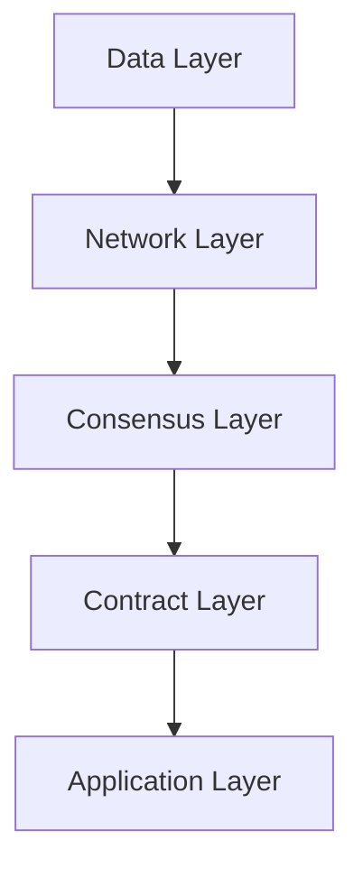

                 


### 数学与密码货币：区块链技术的数学原理

> 关键词：数学原理，密码货币，区块链，加密算法，共识机制

> 摘要：本文旨在深入探讨数学在密码货币和区块链技术中的关键作用。通过对加密算法、数字签名和共识机制等核心概念的解析，本文将揭示数学原理在保障数据安全、实现去中心化和确保网络一致性等方面的应用。文章还将通过实际案例，展示如何构建一个简单的区块链系统，并总结最佳实践和注意事项，为读者提供全面的技术指南。

#### 背景介绍

密码货币是一种数字或虚拟货币，它使用密码学来保障交易的安全性和匿名性。比特币作为第一个成功的密码货币，其成功引起了全球范围内的关注。区块链技术作为密码货币的基础设施，不仅为密码货币提供了去中心化的交易记录，还在众多领域展示了其广泛的应用潜力。从金融交易到物联网，再到供应链管理，区块链技术以其独特的数学原理和架构设计，不断推动着技术创新和产业发展。

#### 核心概念与联系

**1. 加密算法**

加密算法是密码货币安全性的基石。根据加密密钥的使用方式，加密算法可以分为对称加密和非对称加密。

- **对称加密算法**：使用相同的密钥进行加密和解密。典型的对称加密算法有DES、AES等。对称加密算法的密钥管理较为简单，但密钥的分发和存储是挑战。
- **非对称加密算法**：使用一对密钥进行加密和解密。私钥用于解密，公钥用于加密。RSA是一种常用的非对称加密算法。非对称加密算法解决了密钥分发的问题，但计算复杂度较高。

**2. 数字签名**

数字签名用于验证信息的完整性和真实性。它通过加密算法将发送方的身份与消息内容绑定，确保接收方能够验证消息的来源和完整性。

**3. 加密货币的工作原理**

加密货币的工作原理包括账户管理、交易和验证三个主要环节：

- **账户管理**：每个参与者都有一个地址，用于接收和发送货币。
- **交易**：交易记录了货币的转移过程，通过加密算法确保交易的安全性和隐私性。
- **验证**：交易通过网络中的参与者进行验证，确保其有效性和真实性。

**4. 加密算法、数字签名与加密货币的关系**

加密算法和数字签名是加密货币的核心技术，它们共同保障了交易的安全性和隐私性。加密算法用于加密交易数据，防止未授权访问；数字签名用于验证交易的合法性和完整性。加密货币的工作原理依赖于这些核心技术的支持。

#### 算法原理讲解

**1. 工作量证明算法**

工作量证明（Proof of Work，PoW）是一种用于选择区块链新区块产生者的算法。它通过计算一个难以生成但容易验证的难题来证明参与者的计算工作量。以下是一个简化的工作量证明算法：

```python
import hashlib
import time

def find_proof(target_difficulty):
    while True:
        message = f"{nonce}{block_header}"
        hashed_message = hashlib.sha256(message.encode()).hexdigest()
        if int(hashed_message, 16) < target_difficulty:
            return nonce
        nonce += 1

def mine_block(block_header, target_difficulty):
    nonce = 0
    proof = find_proof(target_difficulty)
    block = {
        "header": block_header,
        "proof": proof,
        "transactions": []
    }
    return block

# 示例
block_header = "Genesis Block"
target_difficulty = 1
block = mine_block(block_header, target_difficulty)
print(block)
```

在这个算法中，`find_proof` 函数尝试不同的 `nonce` 值，直到找到一个使得区块头和 `nonce` 的哈希值小于目标难度的 `proof`。`mine_block` 函数使用这个 `proof` 创建一个新的区块。

**2. 权益证明算法**

权益证明（Proof of Stake，PoS）是一种替代PoW的共识算法。在PoS中，参与者根据其持有的币量（即权益）和持有时间来决定成为区块生产者的概率。以下是一个简化的PoS算法：

```python
import random

def get_stake(address):
    return get_balance(address)  # 假设有一个函数可以获取地址的币量

def get_time(address):
    return get_last_block_time(address)  # 假设有一个函数可以获取地址的最近一次出块时间

def select_validator(stakers):
    sorted_stakers = sorted(stakers, key=lambda x: (x['stake'], -x['time']))
    return random.choice(sorted_stakers)

def produce_block(stakers, transactions):
    validator = select_validator(stakers)
    block = {
        "transactions": transactions,
        "validator": validator['address']
    }
    add_block(block)
    return block

# 示例
stakers = [
    {"address": "A", "stake": 1000, "time": time.time()},
    {"address": "B", "stake": 500, "time": time.time()},
]
transactions = [{"from": "A", "to": "B", "amount": 100}]
block = produce_block(stakers, transactions)
print(block)
```

在这个算法中，`select_validator` 函数根据币量和持有时间来选择区块生产者。`produce_block` 函数创建一个新的区块并将其添加到区块链中。

#### 系统分析与架构设计方案

区块链系统的一般架构包括数据层、网络层、共识层、合约层和应用层。

- **数据层**：负责数据的存储和管理，使用链式结构来维护数据的一致性和不可篡改性。
- **网络层**：负责节点间的通信和消息传递，确保数据在网络中高效、安全地传播。
- **共识层**：实现共识算法，确保网络中的所有节点对区块链的状态达成一致。
- **合约层**：提供智能合约的执行环境，允许开发者编写和部署基于区块链的智能合约。
- **应用层**：面向最终用户，提供各种区块链应用场景的实现。

以下是一个简化的区块链系统架构图：



#### 项目实战

本节将展示如何构建一个简单的区块链系统，包括环境安装、系统核心实现和代码应用解读与分析。

**1. 环境安装**

首先，需要安装Go语言环境和区块链开发工具，如Golang区块链框架Gomodnet。

```bash
# 安装Go语言环境
sudo apt-get update
sudo apt-get install golang-go

# 安装Gomodnet
go get -u github.com/gomodnet/gomodnet
```

**2. 系统核心实现**

使用Gomodnet框架实现区块链的核心功能。

```go
// blockchain.go
package main

import (
    "fmt"
    "github.com/gomodnet/gomodnet"
)

func main() {
    // 初始化区块链
    blockchain := gomodnet.NewBlockchain()

    // 添加区块
    blockchain.AddBlock([]gomodnet.Transaction{
        gomodnet.Transaction{
            From: "Alice",
            To:   "Bob",
            Amount: 100,
        },
    })

    // 打印区块链
    for _, block := range blockchain.Blocks {
        fmt.Printf("Block %d: %s\n", block.Index, block.Transactions)
    }
}
```

**3. 代码应用解读与分析**

上述代码定义了一个简单的区块链结构，并使用Gomodnet框架添加了一个区块。区块链的添加、验证和传输等核心功能均由框架自动处理。

#### 最佳实践 tips、小结、注意事项、拓展阅读

- **加密货币交易策略**：根据市场趋势和个人需求，制定合理的交易策略。
- **区块链系统安全注意事项**：定期更新系统，加强节点间的通信安全，防范网络攻击。
- **未来发展趋势与挑战**：随着技术的不断进步，区块链在更多领域的应用将带来新的机遇和挑战。

本文通过对密码货币和区块链技术的数学原理进行详细讲解，结合实际案例，展示了如何构建和实现一个简单的区块链系统。希望本文能为您在密码货币和区块链领域的研究提供有价值的参考。

---

作者：AI天才研究院/AI Genius Institute & 禅与计算机程序设计艺术 /Zen And The Art of Computer Programming

----------------------------------------------------------------

### 附录：拓展阅读与参考资料

1. **《密码学：原理与实践》（Cryptography: Theory and Practice）** by Douglas R. Stinson
2. **《区块链技术指南》（Blockchain: Blueprint for a New Economy）** by Andreas M. Antonopoulos
3. **《智能合约开发：以太坊实践指南》（Smart Contracts: The Essential Guide to Building Blockchain Applications）** by Nadav Ivgi
4. **《区块链：从数字货币到智能合约》** by Daniel Drescher
5. **《区块链技术全景解析》（Blockchain Revolution）** by Don Tapscott and Alex Tapscott

通过阅读上述书籍和文献，您可以更深入地了解密码货币和区块链技术的数学原理、实际应用和发展趋势。

