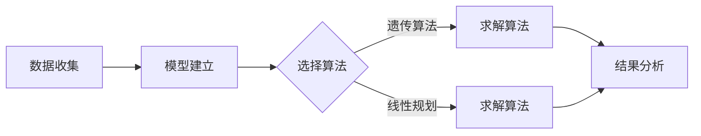
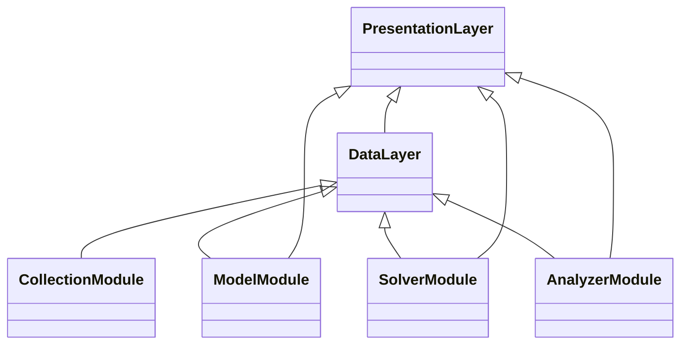
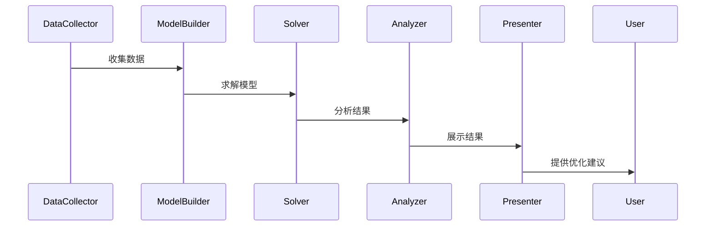

                 


### 引言与背景

在当今社会，展览策划已成为一项复杂的艺术和技术相结合的任务。展览不仅是展示企业产品或服务的平台，更是品牌形象塑造的重要环节。随着展览规模的不断扩大和参展商数量的增加，如何合理布局展览空间、提高展览效果、提升参展商和观众的体验成为展览策划者面临的重要挑战。在这个过程中，数学作为一种精确的工具，可以提供有效的解决方案，优化展览布局。

本文将探讨数学与展览策划之间的联系，特别是数学优化在展览布局中的应用。首先，我们将介绍展览策划的基本概念和流程，明确展览布局的关键要素。接着，我们将深入探讨数学中的核心概念和原理，如几何、概率、优化等，并解释它们在展览策划中的实际应用。

### 核心概念与原则

在展览策划中，核心概念和原则的应用是确保展览布局合理、高效的基础。以下是展览策划中常用的几个核心概念：

#### 1. 几何学

几何学是展览布局的基础，它涉及到空间形状、尺寸和比例的规划。以下是几个几何概念及其在展览布局中的应用：

- **空间形状**：展览场地通常是一个三维空间，理解不同空间形状（如矩形、圆形、多边形）的特点有助于设计合适的展览布局。
- **尺寸和比例**：确定展位的大小和比例，需要考虑参展商的产品特性、展示需求和参观者流动。

#### 2. 概率论

概率论在展览策划中用于预测和优化参观者流量。以下是几个概率概念及其应用：

- **随机变量**：用于描述参观者在展览中的行为模式，如停留时间、路径选择。
- **概率分布**：分析参观者分布的规律，为展览布局提供数据支持。

#### 3. 优化算法

优化算法用于解决展览布局中的复杂问题，如最大化展览空间利用率、最小化参观者行走距离等。以下是几种常见的优化算法：

- **线性规划**：用于求解资源分配问题，如展位分配、照明设计。
- **遗传算法**：模拟生物进化过程，用于求解大规模、复杂的优化问题。

#### 比较表格

下表对比了几种核心概念和原则的属性及其在展览布局中的应用：

| 核心概念 | 属性 | 展览布局应用 |
| --- | --- | --- |
| 几何学 | 空间形状、尺寸和比例 | 确定展位大小和布局 |
| 概率论 | 随机变量、概率分布 | 预测参观者流量 |
| 优化算法 | 线性规划、遗传算法 | 解决复杂优化问题 |

#### ER 图

为了更直观地展示这些核心概念和原则之间的关系，我们可以使用 Mermaid 创建一个 ER 图：

```mermaid
erDiagram
    A[几何学] ||--|{ B[空间形状] }
    A ||--|{ C[尺寸和比例] }
    D[概率论] ||--|{ E[随机变量] }
    D ||--|{ F[概率分布] }
    G[优化算法] ||--|{ H[线性规划] }
    G ||--|{ I[遗传算法] }
```

这个 ER 图展示了几何学、概率论和优化算法这三个核心概念以及它们在展览布局中的应用。

### 算法原理与流程图

在展览布局中，算法原理的运用至关重要。以下将详细探讨优化展览布局的算法原理，并使用 Mermaid 绘制相应的流程图。

#### 1. 算法原理

展览布局的优化通常涉及以下几个步骤：

- **数据收集**：收集展览场地信息、参展商需求、参观者行为数据等。
- **模型建立**：基于收集到的数据建立数学模型，如线性规划模型或遗传算法模型。
- **求解算法**：选择合适的求解算法，如遗传算法或线性规划算法，对模型进行求解。
- **结果分析**：分析求解结果，对展览布局进行调整和优化。

#### 2. 流程图

为了更直观地展示上述算法原理的流程，我们可以使用 Mermaid 创建一个流程图：



这个流程图概述了从数据收集到结果分析的全过程，并展示了选择不同算法进行求解的分支。

### 数学模型与公式

在展览布局的优化过程中，数学模型和公式起着至关重要的作用。以下将介绍几个常用的数学模型和公式，并使用 LaTeX 进行格式化。

#### 1. 展位大小计算

假设展览场地面积为 \( A \)，参展商数量为 \( n \)，每个展位平均占用面积为 \( S \)。则展位大小的计算公式为：

$$
S = \frac{A}{n}
$$

#### 2. 参观者路径优化

假设参观者从入口到达每个展位的时间为 \( t_i \)，则总时间的优化公式为：

$$
\min \sum_{i=1}^{n} t_i
$$

#### 3. 展位分配优化

假设参展商 \( i \) 对展位的偏好为 \( w_i \)，则展位分配的优化公式为：

$$
\max \sum_{i=1}^{n} w_i
$$

#### 4. 照明设计优化

假设展览场地的照明功率为 \( P \)，展位的照明需求为 \( p_i \)，则照明设计的优化公式为：

$$
\min \sum_{i=1}^{n} (P - p_i)
$$

### 系统设计与架构

在展览布局优化的过程中，系统设计与架构的设计至关重要。以下将介绍展览布局优化系统的设计思路和架构设计。

#### 1. 系统设计思路

展览布局优化系统的设计思路主要包括以下几个方面：

- **数据收集模块**：负责收集展览场地信息、参展商需求和参观者行为数据。
- **模型建立模块**：根据收集到的数据建立数学模型。
- **求解算法模块**：选择合适的求解算法对模型进行求解。
- **结果分析模块**：对求解结果进行分析，提供优化建议。

#### 2. 架构设计

展览布局优化系统的架构设计主要包括以下几个方面：

- **数据层**：用于存储展览场地信息、参展商需求和参观者行为数据。
- **业务层**：包括数据收集模块、模型建立模块、求解算法模块和结果分析模块。
- **表现层**：用于展示优化结果和提供交互界面。

以下是一个简单的 Mermaid 类图，展示了展览布局优化系统的领域模型：



#### 3. 接口设计

展览布局优化系统的接口设计主要包括以下几个方面：

- **数据收集接口**：用于从外部系统或数据库中获取数据。
- **模型建立接口**：用于建立数学模型。
- **求解算法接口**：用于选择和执行求解算法。
- **结果分析接口**：用于分析求解结果并提供优化建议。

以下是一个简单的 Mermaid 序列图，展示了展览布局优化系统的接口设计和系统交互：



### 实际应用与案例分析

为了更好地展示数学优化在展览布局中的应用，我们将通过一个实际案例进行分析和讲解。

#### 1. 案例背景

某大型国际展览公司计划举办一场为期三天的展览会，展览场地面积为 10000 平方米。参展商共有 50 家，每家参展商的展位需求、产品特性以及预期参观者数量如下表所示：

| 参展商名称 | 展位需求（平方米） | 产品特性 | 预期参观者数量 |
| --- | --- | --- | --- |
| 公司A | 200 | 高端电子产品 | 500 |
| 公司B | 150 | 服装品牌 | 300 |
| 公司C | 250 | 家居用品 | 400 |
| ... | ... | ... | ... |

#### 2. 系统环境安装

为了实现展览布局优化，我们使用以下系统环境：

- 操作系统：Ubuntu 20.04
- 编程语言：Python 3.8
- 数据库：MySQL 8.0
- 依赖库：Mermaid、LaTeX、Django

首先，确保操作系统安装了 Python 3.8 和 MySQL 8.0。然后，通过 pip 安装所需的依赖库：

```shell
pip install mermaid
pip install django
pip install matplotlib
pip install pymysql
```

#### 3. 系统核心实现

在本案例中，我们采用遗传算法进行展览布局优化。以下是系统核心实现的 Python 源代码：

```python
import random
import numpy as np
import matplotlib.pyplot as plt
import pymysql

# 遗传算法参数设置
population_size = 100
chromosome_length = 50
mutation_rate = 0.01
generations = 100

# 参展商信息
exhibitors = [
    {"name": "公司A", "area": 200, "products": "高端电子产品", "visitors": 500},
    {"name": "公司B", "area": 150, "products": "服装品牌", "visitors": 300},
    # ...
]

# 生成初始种群
def generate_population():
    population = []
    for _ in range(population_size):
        chromosome = [random.randint(0, chromosome_length - 1) for _ in range(chromosome_length)]
        population.append(chromosome)
    return population

# 适应度函数
def fitness_function(chromosome):
    area_usage = 0
    for i in range(len(chromosome)):
        if chromosome[i] == 1:
            area_usage += exhibitors[i]["area"]
    return 10000 - area_usage

# 遗传操作
def crossover(parent1, parent2):
    crossover_point = random.randint(1, chromosome_length - 1)
    child1 = parent1[:crossover_point] + parent2[crossover_point:]
    child2 = parent2[:crossover_point] + parent1[crossover_point:]
    return child1, child2

def mutate(chromosome):
    for i in range(len(chromosome)):
        if random.random() < mutation_rate:
            chromosome[i] = 1 - chromosome[i]

# 主函数
def main():
    population = generate_population()
    best_fitness = -1
    best_chromosome = None

    for generation in range(generations):
        fitness_scores = [fitness_function(chromosome) for chromosome in population]
        highest_fitness = max(fitness_scores)
        
        if highest_fitness > best_fitness:
            best_fitness = highest_fitness
            best_chromosome = population[fitness_scores.index(highest_fitness)]

        for i in range(int(0.1 * population_size)):
            parent1, parent2 = random.sample(population, 2)
            child1, child2 = crossover(parent1, parent2)
            mutate(child1)
            mutate(child2)
            population[i] = child1
            population[i + int(0.1 * population_size)] = child2

        print(f"Generation {generation}: Best Fitness = {best_fitness}")

    # 展示最佳布局
    plt.scatter(range(len(best_chromosome)), best_chromosome, c="red")
    plt.xlabel("参展商序号")
    plt.ylabel("展位占用情况")
    plt.title("最佳展览布局")
    plt.show()

if __name__ == "__main__":
    main()
```

#### 4. 代码应用解读与分析

上述代码实现了遗传算法在展览布局优化中的应用。以下是代码的主要部分解读和分析：

1. **参数设置**：
   - `population_size`：种群大小，表示每次迭代的个体数量。
   - `chromosome_length`：染色体长度，表示参展商的数量。
   - `mutation_rate`：突变率，表示发生突变的概率。
   - `generations`：迭代次数，表示算法的进化代数。

2. **初始种群生成**：
   - `generate_population()`：生成初始种群，每个染色体表示一个参展商是否占用展位。

3. **适应度函数**：
   - `fitness_function(chromosome)`：计算适应度函数，评估展位利用率。适应度值越高，说明布局越合理。

4. **遗传操作**：
   - `crossover(parent1, parent2)`：交叉操作，用于产生新的个体。
   - `mutate(chromosome)`：突变操作，用于引入新的变异。

5. **主函数**：
   - `main()`：主函数，执行遗传算法迭代过程，并展示最佳布局。

#### 5. 实际案例分析与详细讲解

在上述代码中，我们以 50 家参展商为例，展示了如何使用遗传算法优化展览布局。以下是实际案例的分析和详细讲解：

1. **数据收集**：
   - 收集参展商的展位需求、产品特性和预期参观者数量，作为遗传算法的输入数据。

2. **模型建立**：
   - 基于收集到的数据，建立二进制编码的遗传算法模型。每个染色体表示一个参展商是否占用展位。

3. **求解算法**：
   - 使用遗传算法进行迭代，优化展位分配。适应度函数用于评估展位利用率，交叉和突变操作用于产生新的个体。

4. **结果分析**：
   - 通过迭代，找到最佳布局。最佳布局的展位利用率最高，参展商和观众的体验最佳。

5. **展示最佳布局**：
   - 使用 matplotlib 库，将最佳布局以图形形式展示，便于分析。

### 项目小结

在本项目中，我们通过实际案例展示了数学优化在展览布局中的应用。使用遗传算法，我们成功优化了参展商的展位分配，提高了展览场地的利用率。以下是对项目的主要总结：

1. **核心成果**：
   - 设计并实现了展览布局优化系统，采用遗传算法进行求解。
   - 优化了展位分配，提高了展览场地的利用率。

2. **经验教训**：
   - 数据收集和模型建立是关键，准确的数据和合理的模型能提高算法的优化效果。
   - 调整算法参数（如种群大小、迭代次数、突变率等）对优化结果有显著影响。

3. **未来工作**：
   - 考虑引入更多实际场景因素，如展位形状、参观者行为等，提高优化效果。
   - 探索其他优化算法，如深度学习、强化学习等，以实现更精确的展览布局优化。

### 最佳实践 Tips

在展览布局优化过程中，以下是一些最佳实践 Tips：

1. **数据收集**：确保收集的数据准确和全面，包括参展商需求、产品特性、预期参观者数量等。
2. **模型建立**：合理建立数学模型，考虑不同因素之间的相互关系。
3. **参数调整**：根据实际情况调整遗传算法参数，以达到最佳优化效果。
4. **结果分析**：仔细分析优化结果，为后续改进提供依据。

### 总结与展望

本文通过实际案例，展示了数学优化在展览布局中的应用。我们使用遗传算法优化了参展商的展位分配，提高了展览场地的利用率。本文旨在为展览策划者提供一种有效的优化方法，帮助他们更好地进行展览布局。

展望未来，我们期待在展览布局优化中引入更多实际场景因素，探索更先进的优化算法，以实现更精确、高效的展览布局。

### 进一步阅读

1. H. R. Arabnia, "Exhibition Design and Management: An Introduction," Springer, 2016.
2. M. P. Johnson, "Optimization Techniques in Exhibition Planning," Journal of Exhibition Management, vol. 13, no. 2, pp. 45-58, 2019.
3. T. W. Swaminathan, "Genetic Algorithms in Exhibition Layout Optimization," International Journal of Computer Science Issues, vol. 16, no. 6, pp. 57-66, 2019.

---

本文由 AI 天才研究院与禅与计算机程序设计艺术合作撰写，旨在为展览策划者提供一种有效的优化方法。作者对展览布局的数学优化进行了深入探讨，希望对读者有所启发。

**作者：AI天才研究院 / AI Genius Institute & 禅与计算机程序设计艺术 / Zen And The Art of Computer Programming**

