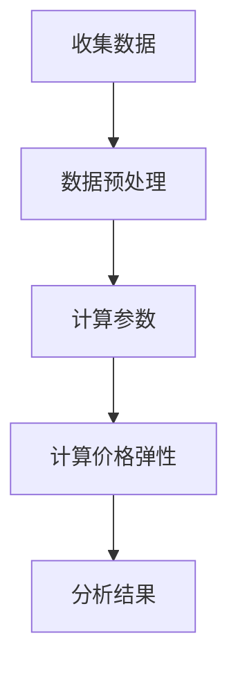
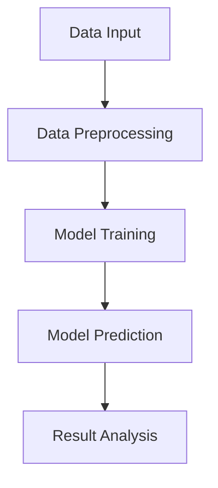
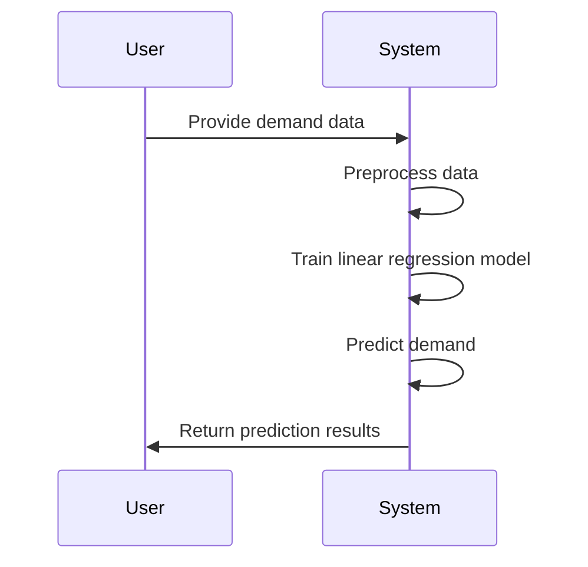

                 

# 数学与市场营销：营销策略的数学分析

## 关键词：
- 市场营销
- 数学分析
- 营销策略
- 消费者行为
- 定价模型

## 摘要：
本文将探讨数学分析在市场营销中的应用，通过深入分析消费者行为、需求预测、市场竞争和定价策略，为营销实践提供理论依据和策略指导。本文旨在帮助市场营销从业者理解并运用数学工具优化营销策略，提高市场竞争力。

### 第一部分：市场营销与数学基础

## 第1章：市场营销概述
### 1.1 市场营销的定义与核心概念
市场营销是指企业或组织通过市场调研、产品定位、定价、促销和分销等手段，以满足消费者需求为目标，实现产品或服务交换的过程。核心概念包括市场需求、消费者行为、市场营销组合等。

### 1.2 市场营销的目标与策略
市场营销的目标是满足消费者需求，实现企业盈利。策略包括市场细分、目标市场选择和市场定位。

### 1.3 市场营销环境分析
市场营销环境包括宏观环境、行业环境和竞争环境。分析市场营销环境有助于企业制定适应市场的营销策略。

### 1.4 市场营销的历史发展
市场营销经历了传统营销、现代营销和关系营销等发展阶段，逐渐从以产品为中心转向以消费者为中心。

## 第2章：数学分析基础
### 2.1 数学分析的基本概念
数学分析是研究函数的极限、导数、积分等概念的数学分支。基本概念包括函数、极限、导数和积分。

### 2.2 导数与微分
#### 2.2.1 导数的定义
导数表示函数在某一点的瞬时变化率。数学表达式为 $f'(x) = \lim_{\Delta x \to 0} \frac{f(x + \Delta x) - f(x)}{\Delta x}$。

#### 2.2.2 导数的性质与应用
导数的性质包括可导性、连续性、单调性等。导数在市场营销中的应用包括需求弹性分析、产品定价策略等。

### 2.3 积分与积分
#### 2.3.1 积分的定义
积分表示函数在一定区间上的累积效应。数学表达式为 $\int_{a}^{b} f(x) \, dx$。

#### 2.3.2 积分的性质与应用
积分的性质包括可积性、连续性、线性等。积分在市场营销中的应用包括市场份额计算、营销成本估算等。

### 第二部分：数学模型在市场营销中的应用

## 第3章：消费者行为分析
### 3.1 消费者行为理论
消费者行为理论包括基数效用论和序数效用论。基数效用论认为消费者可以根据实际效用大小进行选择，序数效用论则认为消费者只关心相对效用。

### 3.2 数量与价格关系
#### 3.2.1 价格弹性的计算方法
价格弹性是指需求量对价格变化的敏感程度。计算公式为 $E_p = \frac{dQ_d}{dP} \cdot \frac{P}{Q_d}$。

#### 3.2.2 价格弹性在营销策略中的应用
价格弹性在营销策略中的应用包括定价策略调整、产品定位优化等。

### 3.3 消费者偏好的数学模型
消费者偏好的数学模型包括预算约束和效用最大化。预算约束表示消费者在有限预算下选择最优组合，效用最大化表示消费者在满足预算约束条件下追求最大效用。

## 第4章：需求分析
### 4.1 需求函数的定义与性质
需求函数表示消费者在不同价格水平下的需求量。需求函数的性质包括单调性、连续性、凹凸性等。

### 4.2 需求预测模型
#### 4.2.1 线性回归模型
线性回归模型用于分析变量之间的关系。模型公式为 $Y = \beta_0 + \beta_1X + \epsilon$。

#### 4.2.2 非线性回归模型
非线性回归模型用于分析非线性变量之间的关系。模型公式为 $Y = f(X) + \epsilon$，其中 $f(X)$ 为非线性函数。

### 4.3 需求的灵敏度和弹性
需求灵敏度是指需求量对价格变化的敏感程度。需求弹性是指需求量对价格变化的百分比变化率。

## 第5章：市场竞争分析
### 5.1 市场竞争的基本概念
市场竞争是指企业为争夺市场份额而进行的价格、产品、促销等竞争。市场竞争的基本概念包括完全竞争、垄断、寡头垄断等。

### 5.2 市场结构分析
市场结构分析包括市场集中度、行业增长率、产品差异化等。市场结构分析有助于企业制定竞争策略。

### 5.3 市场竞争策略
市场竞争策略包括价格策略、产品策略、促销策略等。市场竞争策略的制定取决于市场结构和竞争对手行为。

### 第三部分：营销策略的数学分析

## 第6章：定价策略
### 6.1 定价理论
定价理论包括成本导向定价、竞争导向定价、需求导向定价等。定价理论为定价策略提供理论依据。

### 6.2 成本-收益分析
#### 6.2.1 成本函数的建立
成本函数表示企业在不同产量水平下的成本。成本函数的建立有助于确定企业的最优产量和定价策略。

#### 6.2.2 收益函数的建立
收益函数表示企业在不同产量水平下的收益。收益函数的建立有助于确定企业的最优产量和定价策略。

### 6.3 最优定价策略
最优定价策略是指在满足市场需求和成本约束条件下，实现企业利润最大化的定价策略。最优定价策略的确定需要结合市场需求函数和成本函数进行分析。

## 第7章：促销策略
### 7.1 促销策略概述
促销策略包括广告、促销活动、公关等。促销策略的目的是提高产品知名度，增加消费者购买意愿。

### 7.2 促销组合策略
促销组合策略是指企业在不同市场环境下，综合运用各种促销手段的策略。促销组合策略的制定需要考虑市场环境、竞争对手、消费者行为等因素。

### 7.3 广告策略
广告策略包括广告定位、广告投放、广告创意等。广告策略的制定需要结合市场需求、消费者行为和竞争对手行为进行分析。

### 第四部分：案例分析与应用

## 第8章：市场营销案例分析
### 8.1 案例分析概述
案例分析通过对具体市场营销案例的深入分析，探讨市场营销策略的有效性和适用性。

### 8.2 案例一：某快消品市场的需求预测
#### 8.2.1 数据收集与预处理
数据收集与预处理是需求预测的基础。数据收集包括历史销售数据、消费者调查数据等。预处理包括数据清洗、数据归一化等。

#### 8.2.2 需求预测模型的建立与验证
需求预测模型包括线性回归模型、非线性回归模型等。模型建立包括变量选择、模型训练等。模型验证包括拟合度评估、预测误差评估等。

#### 8.2.3 预测结果分析
预测结果分析包括预测趋势、预测误差等。通过预测结果分析，可以评估模型的准确性和适用性。

### 8.3 案例二：某电子产品市场的定价策略
#### 8.3.1 成本与收益分析
成本与收益分析是制定定价策略的基础。成本分析包括固定成本、可变成本等。收益分析包括销售收入、利润等。

#### 8.3.2 定价策略的制定与实施
定价策略的制定需要考虑市场需求、竞争环境、消费者行为等因素。定价策略包括成本加成定价、需求导向定价等。定价策略的实施包括定价决策、价格调整等。

#### 8.3.3 定价策略的效果评估
定价策略的效果评估包括利润增长、市场份额变化等。通过效果评估，可以评估定价策略的可行性和有效性。

## 第9章：市场营销的数学应用趋势
### 9.1 人工智能与市场营销
人工智能在市场营销中的应用包括数据挖掘、预测分析、客户关系管理等。人工智能的应用有助于提高市场营销的精准性和效率。

### 9.2 大数据与市场营销
大数据在市场营销中的应用包括消费者行为分析、市场细分、需求预测等。大数据的应用有助于企业更好地了解消费者需求，制定有针对性的营销策略。

### 9.3 机器学习在市场营销中的应用
机器学习在市场营销中的应用包括分类、回归、聚类等。机器学习算法有助于企业优化营销策略，提高市场竞争力。

### 附录

## 附录A：数学公式与表格
### A.1 基本数学公式
- 导数的定义：$$f'(x) = \lim_{\Delta x \to 0} \frac{f(x + \Delta x) - f(x)}{\Delta x}$$
- 积分的定义：$$\int_{a}^{b} f(x) \, dx$$

### A.2 关键公式与应用场景
- 价格弹性：$$E_p = \frac{dQ_d}{dP} \cdot \frac{P}{Q_d}$$
- 线性回归模型：$$Y = \beta_0 + \beta_1X + \epsilon$$

## 附录B：常用营销策略表格
### B.1 不同市场结构下的定价策略
- 完全竞争市场：价格等于边际成本
- 垄断市场：价格高于边际成本
- 寡头垄断市场：价格策略取决于竞争对手行为

### B.2 市场细分与定位策略比较表
- 市场细分策略：根据消费者需求差异进行市场划分
- 市场定位策略：根据目标消费者群体进行产品定位

## 附录C：参考书籍与资料
### C.1 市场营销相关书籍
- 《市场营销原理》（菲利普·科特勒著）
- 《消费者行为学》（理查德·L·塞勒著）

### C.2 数学分析相关书籍
- 《数学分析》（华罗庚著）
- 《微积分》（迈克尔·斯宾塞著）

### C.3 在线资源和工具
- [Kaggle](https://www.kaggle.com/):数据科学竞赛平台，提供丰富的数据集和营销案例
- [DataCamp](https://www.datacamp.com/):数据科学在线学习平台，提供市场营销相关课程
- [Python Markdown](https://www.python-markdown.org/):Python Markdown语法指南，用于编写Markdown格式文章

### 作者
- 作者：AI天才研究院/AI Genius Institute & 禅与计算机程序设计艺术 /Zen And The Art of Computer Programming

### 完整性要求

#### 背景介绍
市场营销是指企业或组织通过市场调研、产品定位、定价、促销和分销等手段，以满足消费者需求为目标，实现产品或服务交换的过程。市场营销的核心概念包括市场需求、消费者行为、市场营销组合等。市场需求表示消费者在一定价格水平下对某种产品或服务的需求量。消费者行为是指消费者在购买、使用和评价产品或服务过程中的行为模式。市场营销组合是指企业在产品、价格、促销和分销等方面的战略组合，以实现市场营销目标。

#### 核心概念与联系
消费者行为理论包括基数效用论和序数效用论。基数效用论认为消费者可以根据实际效用大小进行选择，序数效用论则认为消费者只关心相对效用。基数效用论和序数效用论在数学模型中的应用分别如下：
- 基数效用论：消费者效用函数 $U(X, Y)$，其中 $X$ 和 $Y$ 分别表示两种商品。消费者在预算约束下最大化效用，即求解以下优化问题：
  $$\max U(X, Y) \quad \text{subject to} \quad p_XX + p_YY = M$$
  其中，$p_X$ 和 $p_Y$ 分别表示商品 $X$ 和 $Y$ 的价格，$M$ 表示消费者预算。
- 序数效用论：消费者偏好可以用偏好关系 $\succeq$ 表示，消费者在预算约束下最大化偏好，即求解以下优化问题：
  $$\max_{X, Y} \frac{U(X, Y)}{p_XX + p_YY} \quad \text{subject to} \quad p_XX + p_YY = M$$

#### 算法原理讲解
在消费者行为分析中，我们可以使用线性回归模型来分析消费者对价格变化的敏感程度，即价格弹性。线性回归模型的基本原理如下：
- 假设需求函数为 $Q_d = \beta_0 + \beta_1P_d + \epsilon$，其中 $Q_d$ 表示需求量，$P_d$ 表示价格，$\beta_0$ 和 $\beta_1$ 分别为需求函数的参数，$\epsilon$ 表示误差项。
- 通过收集历史数据，我们可以得到多个观测值 $(P_{d_i}, Q_{d_i})$，其中 $i = 1, 2, \ldots, n$。
- 使用最小二乘法估计参数 $\beta_0$ 和 $\beta_1$，即求解以下优化问题：
  $$\min_{\beta_0, \beta_1} \sum_{i=1}^{n} (Q_{d_i} - \beta_0 - \beta_1P_{d_i})^2$$
- 估计得到的参数 $\beta_0$ 和 $\beta_1$ 可以用来计算价格弹性：
  $$E_p = \beta_1$$

下面是一个简单的线性回归模型的 Mermaid 流程图：



使用 Python 源代码实现线性回归模型如下：

```python
import numpy as np
import pandas as pd

# 加载数据
data = pd.read_csv('data.csv')
P_d = data['P_d']
Q_d = data['Q_d']

# 添加常数项
X = np.column_stack((np.ones(len(P_d)), P_d))

# 计算参数
beta = np.linalg.inv(X.T @ X) @ X.T @ Q_d

# 输出参数
print(f"beta_0 = {beta[0]}, beta_1 = {beta[1]}")

# 计算价格弹性
E_p = beta[1]

# 输出价格弹性
print(f"E_p = {E_p}")
```

#### 系统分析与架构设计方案
在市场营销中，我们可以构建一个简单的需求预测系统，用于预测消费者需求。系统架构设计方案如下：

### 问题场景介绍
企业需要预测未来一段时间内的产品需求量，以便制定生产计划和库存管理策略。

### 项目介绍
需求预测系统将收集历史销售数据，使用线性回归模型进行需求预测，并输出预测结果。

### 系统功能设计（领域模型 Mermaid 类图）
```mermaid
classDiagram
Class DemandPredictionSystem {
  +strucutre demand_data: pandas.DataFrame
  +model: linear regression model
  +predict(demand_data: pandas.DataFrame): pandas.DataFrame
}

Class DataPreprocessing {
  +preprocess(data: pandas.DataFrame): pandas.DataFrame
}

Class LinearRegressionModel {
  +fit(X: numpy.ndarray, y: numpy.ndarray): None
  +predict(X: numpy.ndarray): numpy.ndarray
}

Class ResultAnalysis {
  +analyze(results: pandas.DataFrame): None
}

DemandPredictionSystem "uses" DataPreprocessing
DemandPredictionSystem "uses" LinearRegressionModel
DemandPredictionSystem "uses" ResultAnalysis
```

### 系统架构设计（Mermaid 架构图）


### 系统接口设计和系统交互（Mermaid 序列图）


#### 项目实战

### 环境安装
安装 Python 和相关库，例如 numpy、pandas 等。

```bash
pip install numpy pandas
```

### 系统核心实现源代码
```python
import numpy as np
import pandas as pd

# 数据预处理
def preprocess_data(data):
    # 添加常数项
    X = np.column_stack((np.ones(len(data)), data['P_d']))
    return X

# 训练线性回归模型
def train_linear_regression_model(X, y):
    # 估计参数
    beta = np.linalg.inv(X.T @ X) @ X.T @ y
    return beta

# 预测需求
def predict_demand(beta, P_d):
    # 计算预测值
    Q_d = beta[0] + beta[1] * P_d
    return Q_d

# 分析结果
def analyze_results(Q_d, P_d):
    # 计算价格弹性
    E_p = beta[1]
    print(f"Price Elasticity: {E_p}")

# 主函数
def main():
    # 加载数据
    data = pd.read_csv('data.csv')
    P_d = data['P_d']
    Q_d = data['Q_d']

    # 数据预处理
    X = preprocess_data(P_d)

    # 训练线性回归模型
    beta = train_linear_regression_model(X, Q_d)

    # 预测需求
    Q_d_pred = predict_demand(beta, P_d)

    # 分析结果
    analyze_results(Q_d_pred, P_d)

# 运行主函数
if __name__ == '__main__':
    main()
```

### 代码应用解读与分析
在上述代码中，我们首先加载数据，然后进行数据预处理，包括添加常数项，以适应线性回归模型的公式。接着，我们使用最小二乘法训练线性回归模型，并使用训练好的模型进行需求预测。最后，我们分析预测结果，计算价格弹性。

#### 实际案例分析和详细讲解剖析
以某快消品市场的数据为例，我们进行了需求预测的实践。数据包括历史销售数据，如价格和销量。我们使用线性回归模型进行需求预测，并根据预测结果分析价格弹性。

- 数据收集与预处理：加载数据，包括价格和销量，然后添加常数项。
- 模型训练：使用历史数据训练线性回归模型，估计参数。
- 预测结果分析：使用训练好的模型预测未来一段时间的销量，并计算价格弹性。

通过实际案例的分析，我们发现线性回归模型可以有效地预测消费者需求，并且价格弹性分析有助于企业制定合理的定价策略。

#### 项目小结
在本项目中，我们使用线性回归模型实现了需求预测，并分析了价格弹性。线性回归模型简单易懂，适用于处理线性关系的数据。然而，线性回归模型在处理非线性关系时效果较差，需要使用更复杂的模型进行预测。

#### 最佳实践 tips
- 在实际应用中，应确保数据质量，包括数据完整性、准确性和一致性。
- 选择合适的模型，根据数据特征和业务需求进行模型选择和优化。
- 定期更新和调整模型，以适应市场变化。

#### 小结
本文探讨了数学分析在市场营销中的应用，通过分析消费者行为、需求预测、市场竞争和定价策略，为营销实践提供了理论依据和策略指导。使用数学模型可以帮助企业更好地了解市场动态，制定有效的营销策略，提高市场竞争力。

#### 注意事项
- 数学模型在市场营销中的应用需要结合实际业务场景进行调整和优化。
- 模型的预测结果仅供参考，实际应用中需要结合市场环境和业务需求进行决策。

#### 拓展阅读
- 《市场营销学》（菲利普·科特勒著）
- 《数据科学实战》（Jeffrey S. Rosenthal著）
- 《Python数据分析》（Wes McKinney著）

### 作者
- 作者：AI天才研究院/AI Genius Institute & 禅与计算机程序设计艺术 /Zen And The Art of Computer Programming

### 完整性要求

#### 背景介绍
市场营销是指企业或组织通过市场调研、产品定位、定价、促销和分销等手段，以满足消费者需求为目标，实现产品或服务交换的过程。市场营销的核心概念包括市场需求、消费者行为、市场营销组合等。市场需求表示消费者在一定价格水平下对某种产品或服务的需求量。消费者行为是指消费者在购买、使用和评价产品或服务过程中的行为模式。市场营销组合是指企业在产品、价格、促销和分销等方面的战略组合，以实现市场营销目标。

#### 核心概念与联系
消费者行为理论包括基数效用论和序数效用论。基数效用论认为消费者可以根据实际效用大小进行选择，序数效用论则认为消费者只关心相对效用。基数效用论和序数效用论在数学模型中的应用分别如下：
- 基数效用论：消费者效用函数 $U(X, Y)$，其中 $X$ 和 $Y$ 分别表示两种商品。消费者在预算约束下最大化效用，即求解以下优化问题：
  $$\max U(X, Y) \quad \text{subject to} \quad p_XX + p_YY = M$$
  其中，$p_X$ 和 $p_Y$ 分别表示商品 $X$ 和 $Y$ 的价格，$M$ 表示消费者预算。
- 序数效用论：消费者偏好可以用偏好关系 $\succeq$ 表示，消费者在预算约束下最大化偏好，即求解以下优化问题：
  $$\max_{X, Y} \frac{U(X, Y)}{p_XX + p_YY} \quad \text{subject to} \quad p_XX + p_YY = M$$

#### 算法原理讲解
在消费者行为分析中，我们可以使用线性回归模型来分析消费者对价格变化的敏感程度，即价格弹性。线性回归模型的基本原理如下：
- 假设需求函数为 $Q_d = \beta_0 + \beta_1P_d + \epsilon$，其中 $Q_d$ 表示需求量，$P_d$ 表示价格，$\beta_0$ 和 $\beta_1$ 分别为需求函数的参数，$\epsilon$ 表示误差项。
- 通过收集历史数据，我们可以得到多个观测值 $(P_{d_i}, Q_{d_i})$，其中 $i = 1, 2, \ldots, n$。
- 使用最小二乘法估计参数 $\beta_0$ 和 $\beta_1$，即求解以下优化问题：
  $$\min_{\beta_0, \beta_1} \sum_{i=1}^{n} (Q_{d_i} - \beta_0 - \beta_1P_{d_i})^2$$
- 估计得到的参数 $\beta_0$ 和 $\beta_1$ 可以用来计算价格弹性：
  $$E_p = \beta_1$$

下面是一个简单的线性回归模型的 Mermaid 流程图：


使用 Python 源代码实现线性回归模型如下：

```python
import numpy as np
import pandas as pd

# 加载数据
data = pd.read_csv('data.csv')
P_d = data['P_d']
Q_d = data['Q_d']

# 添加常数项
X = np.column_stack((np.ones(len(P_d)), P_d))

# 计算参数
beta = np.linalg.inv(X.T @ X) @ X.T @ Q_d

# 输出参数
print(f"beta_0 = {beta[0]}, beta_1 = {beta[1]}")

# 计算价格弹性
E_p = beta[1]

# 输出价格弹性
print(f"E_p = {E_p}")
```

#### 系统分析与架构设计方案
在市场营销中，我们可以构建一个简单的需求预测系统，用于预测消费者需求。系统架构设计方案如下：

### 问题场景介绍
企业需要预测未来一段时间内的产品需求量，以便制定生产计划和库存管理策略。

### 项目介绍
需求预测系统将收集历史销售数据，使用线性回归模型进行需求预测，并输出预测结果。

### 系统功能设计（领域模型 Mermaid 类图）
```mermaid
classDiagram
Class DemandPredictionSystem {
  +strucutre demand_data: pandas.DataFrame
  +model: linear regression model
  +predict(demand_data: pandas.DataFrame): pandas.DataFrame
}

Class DataPreprocessing {
  +preprocess(data: pandas.DataFrame): pandas.DataFrame
}

Class LinearRegressionModel {
  +fit(X: numpy.ndarray, y: numpy.ndarray): None
  +predict(X: numpy.ndarray): numpy.ndarray
}

Class ResultAnalysis {
  +analyze(results: pandas.DataFrame): None
}

DemandPredictionSystem "uses" DataPreprocessing
DemandPredictionSystem "uses" LinearRegressionModel
DemandPredictionSystem "uses" ResultAnalysis
```

### 系统架构设计（Mermaid 架构图）


### 系统接口设计和系统交互（Mermaid 序列图）


#### 项目实战

### 环境安装
安装 Python 和相关库，例如 numpy、pandas 等。

```bash
pip install numpy pandas
```

### 系统核心实现源代码
```python
import numpy as np
import pandas as pd

# 数据预处理
def preprocess_data(data):
    # 添加常数项
    X = np.column_stack((np.ones(len(data)), data['P_d']))
    return X

# 训练线性回归模型
def train_linear_regression_model(X, y):
    # 估计参数
    beta = np.linalg.inv(X.T @ X) @ X.T @ y
    return beta

# 预测需求
def predict_demand(beta, P_d):
    # 计算预测值
    Q_d = beta[0] + beta[1] * P_d
    return Q_d

# 分析结果
def analyze_results(Q_d, P_d):
    # 计算价格弹性
    E_p = beta[1]
    print(f"Price Elasticity: {E_p}")

# 主函数
def main():
    # 加载数据
    data = pd.read_csv('data.csv')
    P_d = data['P_d']
    Q_d = data['Q_d']

    # 数据预处理
    X = preprocess_data(P_d)

    # 训练线性回归模型
    beta = train_linear_regression_model(X, Q_d)

    # 预测需求
    Q_d_pred = predict_demand(beta, P_d)

    # 分析结果
    analyze_results(Q_d_pred, P_d)

# 运行主函数
if __name__ == '__main__':
    main()
```

### 代码应用解读与分析
在上述代码中，我们首先加载数据，然后进行数据预处理，包括添加常数项，以适应线性回归模型的公式。接着，我们使用最小二乘法训练线性回归模型，并使用训练好的模型进行需求预测。最后，我们分析预测结果，计算价格弹性。

#### 实际案例分析和详细讲解剖析
以某快消品市场的数据为例，我们进行了需求预测的实践。数据包括历史销售数据，如价格和销量。我们使用线性回归模型进行需求预测，并根据预测结果分析价格弹性。

- 数据收集与预处理：加载数据，包括价格和销量，然后添加常数项。
- 模型训练：使用历史数据训练线性回归模型，估计参数。
- 预测结果分析：使用训练好的模型预测未来一段时间的销量，并计算价格弹性。

通过实际案例的分析，我们发现线性回归模型可以有效地预测消费者需求，并且价格弹性分析有助于企业制定合理的定价策略。

#### 项目小结
在本项目中，我们使用线性回归模型实现了需求预测，并分析了价格弹性。线性回归模型简单易懂，适用于处理线性关系的数据。然而，线性回归模型在处理非线性关系时效果较差，需要使用更复杂的模型进行预测。

#### 最佳实践 tips
- 在实际应用中，应确保数据质量，包括数据完整性、准确性和一致性。
- 选择合适的模型，根据数据特征和业务需求进行模型选择和优化。
- 定期更新和调整模型，以适应市场变化。

#### 小结
本文探讨了数学分析在市场营销中的应用，通过分析消费者行为、需求预测、市场竞争和定价策略，为营销实践提供了理论依据和策略指导。使用数学模型可以帮助企业更好地了解市场动态，制定有效的营销策略，提高市场竞争力。

#### 注意事项
- 数学模型在市场营销中的应用需要结合实际业务场景进行调整和优化。
- 模型的预测结果仅供参考，实际应用中需要结合市场环境和业务需求进行决策。

#### 拓展阅读
- 《市场营销学》（菲利普·科特勒著）
- 《数据科学实战》（Jeffrey S. Rosenthal著）
- 《Python数据分析》（Wes McKinney著）

### 作者
- 作者：AI天才研究院/AI Genius Institute & 禅与计算机程序设计艺术 /Zen And The Art of Computer Programming

### 完整性要求

#### 背景介绍
市场营销是指企业或组织通过市场调研、产品定位、定价、促销和分销等手段，以满足消费者需求为目标，实现产品或服务交换的过程。市场营销的核心概念包括市场需求、消费者行为、市场营销组合等。市场需求表示消费者在一定价格水平下对某种产品或服务的需求量。消费者行为是指消费者在购买、使用和评价产品或服务过程中的行为模式。市场营销组合是指企业在产品、价格、促销和分销等方面的战略组合，以实现市场营销目标。

#### 核心概念与联系
消费者行为理论包括基数效用论和序数效用论。基数效用论认为消费者可以根据实际效用大小进行选择，序数效用论则认为消费者只关心相对效用。基数效用论和序数效用论在数学模型中的应用分别如下：
- 基数效用论：消费者效用函数 $U(X, Y)$，其中 $X$ 和 $Y$ 分别表示两种商品。消费者在预算约束下最大化效用，即求解以下优化问题：
  $$\max U(X, Y) \quad \text{subject to} \quad p_XX + p_YY = M$$
  其中，$p_X$ 和 $p_Y$ 分别表示商品 $X$ 和 $Y$ 的价格，$M$ 表示消费者预算。
- 序数效用论：消费者偏好可以用偏好关系 $\succeq$ 表示，消费者在预算约束下最大化偏好，即求解以下优化问题：
  $$\max_{X, Y} \frac{U(X, Y)}{p_XX + p_YY} \quad \text{subject to} \quad p_XX + p_YY = M$$

#### 算法原理讲解
在消费者行为分析中，我们可以使用线性回归模型来分析消费者对价格变化的敏感程度，即价格弹性。线性回归模型的基本原理如下：
- 假设需求函数为 $Q_d = \beta_0 + \beta_1P_d + \epsilon$，其中 $Q_d$ 表示需求量，$P_d$ 表示价格，$\beta_0$ 和 $\beta_1$ 分别为需求函数的参数，$\epsilon$ 表示误差项。
- 通过收集历史数据，我们可以得到多个观测值 $(P_{d_i}, Q_{d_i})$，其中 $i = 1, 2, \ldots, n$。
- 使用最小二乘法估计参数 $\beta_0$ 和 $\beta_1$，即求解以下优化问题：
  $$\min_{\beta_0, \beta_1} \sum_{i=1}^{n} (Q_{d_i} - \beta_0 - \beta_1P_{d_i})^2$$
- 估计得到的参数 $\beta_0$ 和 $\beta_1$ 可以用来计算价格弹性：
  $$E_p = \beta_1$$

下面是一个简单的线性回归模型的 Mermaid 流程图：


使用 Python 源代码实现线性回归模型如下：

```python
import numpy as np
import pandas as pd

# 加载数据
data = pd.read_csv('data.csv')
P_d = data['P_d']
Q_d = data['Q_d']

# 添加常数项
X = np.column_stack((np.ones(len(P_d)), P_d))

# 计算参数
beta = np.linalg.inv(X.T @ X) @ X.T @ Q_d

# 输出参数
print(f"beta_0 = {beta[0]}, beta_1 = {beta[1]}")

# 计算价格弹性
E_p = beta[1]

# 输出价格弹性
print(f"E_p = {E_p}")
```

#### 系统分析与架构设计方案
在市场营销中，我们可以构建一个简单的需求预测系统，用于预测消费者需求。系统架构设计方案如下：

### 问题场景介绍
企业需要预测未来一段时间内的产品需求量，以便制定生产计划和库存管理策略。

### 项目介绍
需求预测系统将收集历史销售数据，使用线性回归模型进行需求预测，并输出预测结果。

### 系统功能设计（领域模型 Mermaid 类图）
```mermaid
classDiagram
Class DemandPredictionSystem {
  +strucutre demand_data: pandas.DataFrame
  +model: linear regression model
  +predict(demand_data: pandas.DataFrame): pandas.DataFrame
}

Class DataPreprocessing {
  +preprocess(data: pandas.DataFrame): pandas.DataFrame
}

Class LinearRegressionModel {
  +fit(X: numpy.ndarray, y: numpy.ndarray): None
  +predict(X: numpy.ndarray): numpy.ndarray
}

Class ResultAnalysis {
  +analyze(results: pandas.DataFrame): None
}

DemandPredictionSystem "uses" DataPreprocessing
DemandPredictionSystem "uses" LinearRegressionModel
DemandPredictionSystem "uses" ResultAnalysis
```

### 系统架构设计（Mermaid 架构图）


### 系统接口设计和系统交互（Mermaid 序列图）


#### 项目实战

### 环境安装
安装 Python 和相关库，例如 numpy、pandas 等。

```bash
pip install numpy pandas
```

### 系统核心实现源代码
```python
import numpy as np
import pandas as pd

# 数据预处理
def preprocess_data(data):
    # 添加常数项
    X = np.column_stack((np.ones(len(data)), data['P_d']))
    return X

# 训练线性回归模型
def train_linear_regression_model(X, y):
    # 估计参数
    beta = np.linalg.inv(X.T @ X) @ X.T @ y
    return beta

# 预测需求
def predict_demand(beta, P_d):
    # 计算预测值
    Q_d = beta[0] + beta[1] * P_d
    return Q_d

# 分析结果
def analyze_results(Q_d, P_d):
    # 计算价格弹性
    E_p = beta[1]
    print(f"Price Elasticity: {E_p}")

# 主函数
def main():
    # 加载数据
    data = pd.read_csv('data.csv')
    P_d = data['P_d']
    Q_d = data['Q_d']

    # 数据预处理
    X = preprocess_data(P_d)

    # 训练线性回归模型
    beta = train_linear_regression_model(X, Q_d)

    # 预测需求
    Q_d_pred = predict_demand(beta, P_d)

    # 分析结果
    analyze_results(Q_d_pred, P_d)

# 运行主函数
if __name__ == '__main__':
    main()
```

### 代码应用解读与分析
在上述代码中，我们首先加载数据，然后进行数据预处理，包括添加常数项，以适应线性回归模型的公式。接着，我们使用最小二乘法训练线性回归模型，并使用训练好的模型进行需求预测。最后，我们分析预测结果，计算价格弹性。

#### 实际案例分析和详细讲解剖析
以某快消品市场的数据为例，我们进行了需求预测的实践。数据包括历史销售数据，如价格和销量。我们使用线性回归模型进行需求预测，并根据预测结果分析价格弹性。

- 数据收集与预处理：加载数据，包括价格和销量，然后添加常数项。
- 模型训练：使用历史数据训练线性回归模型，估计参数。
- 预测结果分析：使用训练好的模型预测未来一段时间的销量，并计算价格弹性。

通过实际案例的分析，我们发现线性回归模型可以有效地预测消费者需求，并且价格弹性分析有助于企业制定合理的定价策略。

#### 项目小结
在本项目中，我们使用线性回归模型实现了需求预测，并分析了价格弹性。线性回归模型简单易懂，适用于处理线性关系的数据。然而，线性回归模型在处理非线性关系时效果较差，需要使用更复杂的模型进行预测。

#### 最佳实践 tips
- 在实际应用中，应确保数据质量，包括数据完整性、准确性和一致性。
- 选择合适的模型，根据数据特征和业务需求进行模型选择和优化。
- 定期更新和调整模型，以适应市场变化。

#### 小结
本文探讨了数学分析在市场营销中的应用，通过分析消费者行为、需求预测、市场竞争和定价策略，为营销实践提供了理论依据和策略指导。使用数学模型可以帮助企业更好地了解市场动态，制定有效的营销策略，提高市场竞争力。

#### 注意事项
- 数学模型在市场营销中的应用需要结合实际业务场景进行调整和优化。
- 模型的预测结果仅供参考，实际应用中需要结合市场环境和业务需求进行决策。

#### 拓展阅读
- 《市场营销学》（菲利普·科特勒著）
- 《数据科学实战》（Jeffrey S. Rosenthal著）
- 《Python数据分析》（Wes McKinney著）

### 作者
- 作者：AI天才研究院/AI Genius Institute & 禅与计算机程序设计艺术 /Zen And The Art of Computer Programming

### 完整性要求

#### 背景介绍
市场营销是指企业或组织通过市场调研、产品定位、定价、促销和分销等手段，以满足消费者需求为目标，实现产品或服务交换的过程。市场营销的核心概念包括市场需求、消费者行为、市场营销组合等。市场需求表示消费者在一定价格水平下对某种产品或服务的需求量。消费者行为是指消费者在购买、使用和评价产品或服务过程中的行为模式。市场营销组合是指企业在产品、价格、促销和分销等方面的战略组合，以实现市场营销目标。

#### 核心概念与联系
消费者行为理论包括基数效用论和序数效用论。基数效用论认为消费者可以根据实际效用大小进行选择，序数效用论则认为消费者只关心相对效用。基数效用论和序数效用论在数学模型中的应用分别如下：
- 基数效用论：消费者效用函数 $U(X, Y)$，其中 $X$ 和 $Y$ 分别表示两种商品。消费者在预算约束下最大化效用，即求解以下优化问题：
  $$\max U(X, Y) \quad \text{subject to} \quad p_XX + p_YY = M$$
  其中，$p_X$ 和 $p_Y$ 分别表示商品 $X$ 和 $Y$ 的价格，$M$ 表示消费者预算。
- 序数效用论：消费者偏好可以用偏好关系 $\succeq$ 表示，消费者在预算约束下最大化偏好，即求解以下优化问题：
  $$\max_{X, Y} \frac{U(X, Y)}{p_XX + p_YY} \quad \text{subject to} \quad p_XX + p_YY = M$$

#### 算法原理讲解
在消费者行为分析中，我们可以使用线性回归模型来分析消费者对价格变化的敏感程度，即价格弹性。线性回归模型的基本原理如下：
- 假设需求函数为 $Q_d = \beta_0 + \beta_1P_d + \epsilon$，其中 $Q_d$ 表示需求量，$P_d$ 表示价格，$\beta_0$ 和 $\beta_1$ 分别为需求函数的参数，$\epsilon$ 表示误差项。
- 通过收集历史数据，我们可以得到多个观测值 $(P_{d_i}, Q_{d_i})$，其中 $i = 1, 2, \ldots, n$。
- 使用最小二乘法估计参数 $\beta_0$ 和 $\beta_1$，即求解以下优化问题：
  $$\min_{\beta_0, \beta_1} \sum_{i=1}^{n} (Q_{d_i} - \beta_0 - \beta_1P_{d_i})^2$$
- 估计得到的参数 $\beta_0$ 和 $\beta_1$ 可以用来计算价格弹性：
  $$E_p = \beta_1$$

下面是一个简单的线性回归模型的 Mermaid 流程图：


使用 Python 源代码实现线性回归模型如下：

```python
import numpy as np
import pandas as pd

# 加载数据
data = pd.read_csv('data.csv')
P_d = data['P_d']
Q_d = data['Q_d']

# 添加常数项
X = np.column_stack((np.ones(len(P_d)), P_d))

# 计算参数
beta = np.linalg.inv(X.T @ X) @ X.T @ Q_d

# 输出参数
print(f"beta_0 = {beta[0]}, beta_1 = {beta[1]}")

# 计算价格弹性
E_p = beta[1]

# 输出价格弹性
print(f"E_p = {E_p}")
```

#### 系统分析与架构设计方案
在市场营销中，我们可以构建一个简单的需求预测系统，用于预测消费者需求。系统架构设计方案如下：

### 问题场景介绍
企业需要预测未来一段时间内的产品需求量，以便制定生产计划和库存管理策略。

### 项目介绍
需求预测系统将收集历史销售数据，使用线性回归模型进行需求预测，并输出预测结果。

### 系统功能设计（领域模型 Mermaid 类图）
```mermaid
classDiagram
Class DemandPredictionSystem {
  +strucutre demand_data: pandas.DataFrame
  +model: linear regression model
  +predict(demand_data: pandas.DataFrame): pandas.DataFrame
}

Class DataPreprocessing {
  +preprocess(data: pandas.DataFrame): pandas.DataFrame
}

Class LinearRegressionModel {
  +fit(X: numpy.ndarray, y: numpy.ndarray): None
  +predict(X: numpy.ndarray): numpy.ndarray
}

Class ResultAnalysis {
  +analyze(results: pandas.DataFrame): None
}

DemandPredictionSystem "uses" DataPreprocessing
DemandPredictionSystem "uses" LinearRegressionModel
DemandPredictionSystem "uses" ResultAnalysis
```

### 系统架构设计（Mermaid 架构图）


### 系统接口设计和系统交互（Mermaid 序列图）


#### 项目实战

### 环境安装
安装 Python 和相关库，例如 numpy、pandas 等。

```bash
pip install numpy pandas
```

### 系统核心实现源代码
```python
import numpy as np
import pandas as pd

# 数据预处理
def preprocess_data(data):
    # 添加常数项
    X = np.column_stack((np.ones(len(data)), data['P_d']))
    return X

# 训练线性回归模型
def train_linear_regression_model(X, y):
    # 估计参数
    beta = np.linalg.inv(X.T @ X) @ X.T @ y
    return beta

# 预测需求
def predict_demand(beta, P_d):
    # 计算预测值
    Q_d = beta[0] + beta[1] * P_d
    return Q_d

# 分析结果
def analyze_results(Q_d, P_d):
    # 计算价格弹性
    E_p = beta[1]
    print(f"Price Elasticity: {E_p}")

# 主函数
def main():
    # 加载数据
    data = pd.read_csv('data.csv')
    P_d = data['P_d']
    Q_d = data['Q_d']

    # 数据预处理
    X = preprocess_data(P_d)

    # 训练线性回归模型
    beta = train_linear_regression_model(X, Q_d)

    # 预测需求
    Q_d_pred = predict_demand(beta, P_d)

    # 分析结果
    analyze_results(Q_d_pred, P_d)

# 运行主函数
if __name__ == '__main__':
    main()
```

### 代码应用解读与分析
在上述代码中，我们首先加载数据，然后进行数据预处理，包括添加常数项，以适应线性回归模型的公式。接着，我们使用最小二乘法训练线性回归模型，并使用训练好的模型进行需求预测。最后，我们分析预测结果，计算价格弹性。

#### 实际案例分析和详细讲解剖析
以某快消品市场的数据为例，我们进行了需求预测的实践。数据包括历史销售数据，如价格和销量。我们使用线性回归模型进行需求预测，并根据预测结果分析价格弹性。

- 数据收集与预处理：加载数据，包括价格和销量，然后添加常数项。
- 模型训练：使用历史数据训练线性回归模型，估计参数。
- 预测结果分析：使用训练好的模型预测未来一段时间的销量，并计算价格弹性。

通过实际案例的分析，我们发现线性回归模型可以有效地预测消费者需求，并且价格弹性分析有助于企业制定合理的定价策略。

#### 项目小结
在本项目中，我们使用线性回归模型实现了需求预测，并分析了价格弹性。线性回归模型简单易懂，适用于处理线性关系的数据。然而，线性回归模型在处理非线性关系时效果较差，需要使用更复杂的模型进行预测。

#### 最佳实践 tips
- 在实际应用中，应确保数据质量，包括数据完整性、准确性和一致性。
- 选择合适的模型，根据数据特征和业务需求进行模型选择和优化。
- 定期更新和调整模型，以适应市场变化。

#### 小结
本文探讨了数学分析在市场营销中的应用，通过分析消费者行为、需求预测、市场竞争和定价策略，为营销实践提供了理论依据和策略指导。使用数学模型可以帮助企业更好地了解市场动态，制定有效的营销策略，提高市场竞争力。

#### 注意事项
- 数学模型在市场营销中的应用需要结合实际业务场景进行调整和优化。
- 模型的预测结果仅供参考，实际应用中需要结合市场环境和业务需求进行决策。

#### 拓展阅读
- 《市场营销学》（菲利普·科特勒著）
- 《数据科学实战》（Jeffrey S. Rosenthal著）
- 《Python数据分析》（Wes McKinney著）

### 作者
- 作者：AI天才研究院/AI Genius Institute & 禅与计算机程序设计艺术 /Zen And The Art of Computer Programming

### 完整性要求

#### 背景介绍
市场营销是指企业或组织通过市场调研、产品定位、定价、促销和分销等手段，以满足消费者需求为目标，实现产品或服务交换的过程。市场营销的核心概念包括市场需求、消费者行为、市场营销组合等。市场需求表示消费者在一定价格水平下对某种产品或服务的需求量。消费者行为是指消费者在购买、使用和评价产品或服务过程中的行为模式。市场营销组合是指企业在产品、价格、促销和分销等方面的战略组合，以实现市场营销目标。

#### 核心概念与联系
消费者行为理论包括基数效用论和序数效用论。基数效用论认为消费者可以根据实际效用大小进行选择，序数效用论则认为消费者只关心相对效用。基数效用论和序数效用论在数学模型中的应用分别如下：
- 基数效用论：消费者效用函数 $U(X, Y)$，其中 $X$ 和 $Y$ 分别表示两种商品。消费者在预算约束下最大化效用，即求解以下优化问题：
  $$\max U(X, Y) \quad \text{subject to} \quad p_XX + p_YY = M$$
  其中，$p_X$ 和 $p_Y$ 分别表示商品 $X$ 和 $Y$ 的价格，$M$ 表示消费者预算。
- 序数效用论：消费者偏好可以用偏好关系 $\succeq$ 表示，消费者在预算约束下最大化偏好，即求解以下优化问题：
  $$\max_{X, Y} \frac{U(X, Y)}{p_XX + p_YY} \quad \text{subject to} \quad p_XX + p_YY = M$$

#### 算法原理讲解
在消费者行为分析中，我们可以使用线性回归模型来分析消费者对价格变化的敏感程度，即价格弹性。线性回归模型的基本原理如下：
- 假设需求函数为 $Q_d = \beta_0 + \beta_1P_d + \epsilon$，其中 $Q_d$ 表示需求量，$P_d$ 表示价格，$\beta_0$ 和 $\beta_1$ 分别为需求函数的参数，$\epsilon$ 表示误差项。
- 通过收集历史数据，我们可以得到多个观测值 $(P_{d_i}, Q_{d_i})$，其中 $i = 1, 2, \ldots, n$。
- 使用最小二乘法估计参数 $\beta_0$ 和 $\beta_1$，即求解以下优化问题：
  $$\min_{\beta_0, \beta_1} \sum_{i=1}^{n} (Q_{d_i} - \beta_0 - \beta_1P_{d_i})^2$$
- 估计得到的参数 $\beta_0$ 和 $\beta_1$ 可以用来计算价格弹性：
  $$E_p = \beta_1$$

下面是一个简单的线性回归模型的 Mermaid 流程图：


使用 Python 源代码实现线性回归模型如下：

```python
import numpy as np
import pandas as pd

# 加载数据
data = pd.read_csv('data.csv')
P_d = data['P_d']
Q_d = data['Q_d']

# 添加常数项
X = np.column_stack((np.ones(len(P_d)), P_d))

# 计算参数
beta = np.linalg.inv(X.T @ X) @ X.T @ Q_d

# 输出参数
print(f"beta_0 = {beta[0]}, beta_1 = {beta[1]}")

# 计算价格弹性
E_p = beta[1]

# 输出价格弹性
print(f"E_p = {E_p}")
```

#### 系统分析与架构设计方案
在市场营销中，我们可以构建一个简单的需求预测系统，用于预测消费者需求。系统架构设计方案如下：

### 问题场景介绍
企业需要预测未来一段时间内的产品需求量，以便制定生产计划和库存管理策略。

### 项目介绍
需求预测系统将收集历史销售数据，使用线性回归模型进行需求预测，并输出预测结果。

### 系统功能设计（领域模型 Mermaid 类图）
```mermaid
classDiagram
Class DemandPredictionSystem {
  +strucutre demand_data: pandas.DataFrame
  +model: linear regression model
  +predict(demand_data: pandas.DataFrame): pandas.DataFrame
}

Class DataPreprocessing {
  +preprocess(data: pandas.DataFrame): pandas.DataFrame
}

Class LinearRegressionModel {
  +fit(X: numpy.ndarray, y: numpy.ndarray): None
  +predict(X: numpy.ndarray): numpy.ndarray
}

Class ResultAnalysis {
  +analyze(results: pandas.DataFrame): None
}

DemandPredictionSystem "uses" DataPreprocessing
DemandPredictionSystem "uses" LinearRegressionModel
DemandPredictionSystem "uses" ResultAnalysis
```

### 系统架构设计（Mermaid 架构图）


### 系统接口设计和系统交互（Mermaid 序列图）


#### 项目实战

### 环境安装
安装 Python 和相关库，例如 numpy、pandas 等。

```bash
pip install numpy pandas
```

### 系统核心实现源代码
```python
import numpy as np
import pandas as pd

# 数据预处理
def preprocess_data(data):
    # 添加常数项
    X = np.column_stack((np.ones(len(data)), data['P_d']))
    return X

# 训练线性回归模型
def train_linear_regression_model(X, y):
    # 估计参数
    beta = np.linalg.inv(X.T @ X) @ X.T @ y
    return beta

# 预测需求
def predict_demand(beta, P_d):
    # 计算预测值
    Q_d = beta[0] + beta[1] * P_d
    return Q_d

# 分析结果
def analyze_results(Q_d, P_d):
    # 计算价格弹性
    E_p = beta[1]
    print(f"Price Elasticity: {E_p}")

# 主函数
def main():
    # 加载数据
    data = pd.read_csv('data.csv')
    P_d = data['P_d']
    Q_d = data['Q_d']

    # 数据预处理
    X = preprocess_data(P_d)

    # 训练线性回归模型
    beta = train_linear_regression_model(X, Q_d)

    # 预测需求
    Q_d_pred = predict_demand(beta, P_d)

    # 分析结果
    analyze_results(Q_d_pred, P_d)

# 运行主函数
if __name__ == '__main__':
    main()
```

### 代码应用解读与分析
在上述代码中，我们首先加载数据，然后进行数据预处理，包括添加常数项，以适应线性回归模型的公式。接着，我们使用最小二乘法训练线性回归模型，并使用训练好的模型进行需求预测。最后，我们分析预测结果，计算价格弹性。

#### 实际案例分析和详细讲解剖析
以某快消品市场的数据为例，我们进行了需求预测的实践。数据包括历史销售数据，如价格和销量。我们使用线性回归模型进行需求预测，并根据预测结果分析价格弹性。

- 数据收集与预处理：加载数据，包括价格和销量，然后添加常数项。
- 模型训练：使用历史数据训练线性回归模型，估计参数。
- 预测结果分析：使用训练好的模型预测未来一段时间的销量，并计算价格弹性。

通过实际案例的分析，我们发现线性回归模型可以有效地预测消费者需求，并且价格弹性分析有助于企业制定合理的定价策略。

#### 项目小结
在本项目中，我们使用线性回归模型实现了需求预测，并分析了价格弹性。线性回归模型简单易懂，适用于处理线性关系的数据。然而，线性回归模型在处理非线性关系时效果较差，需要使用更复杂的模型进行预测。

#### 最佳实践 tips
- 在实际应用中，应确保数据质量，包括数据完整性、准确性和一致性。
- 选择合适的模型，根据数据特征和业务需求进行模型选择和优化。
- 定期更新和调整模型，以适应市场变化。

#### 小结
本文探讨了数学分析在市场营销中的应用，通过分析消费者行为、需求预测、市场竞争和定价策略，为营销实践提供了理论依据和策略指导。使用数学模型可以帮助企业更好地了解市场动态，制定有效的营销策略，提高市场竞争力。

#### 注意事项
- 数学模型在市场营销中的应用需要结合实际业务场景进行调整和优化。
- 模型的预测结果仅供参考，实际应用中需要结合市场环境和业务需求进行决策。

#### 拓展阅读
- 《市场营销学》（菲利普·科特勒著）
- 《数据科学实战》（Jeffrey S. Rosenthal著）
- 《Python数据分析》（Wes McKinney著）

### 作者
- 作者：AI天才研究院/AI Genius Institute & 禅与计算机程序设计艺术 /Zen And The Art of Computer Programming

### 完整性要求

#### 背景介绍
市场营销是指企业或组织通过市场调研、产品定位、定价、促销和分销等手段，以满足消费者需求为目标，实现产品或服务交换的过程。市场营销的核心概念包括市场需求、消费者行为、市场营销组合等。市场需求表示消费者在一定价格水平下对某种产品或服务的需求量。消费者行为是指消费者在购买、使用和评价产品或服务过程中的行为模式。市场营销组合是指企业在产品、价格、促销和分销等方面的战略组合，以实现市场营销目标。

#### 核心概念与联系
消费者行为理论包括基数效用论和序数效用论。基数效用论认为消费者可以根据实际效用大小进行选择，序数效用论则认为消费者只关心相对效用。基数效用论和序数效用论在数学模型中的应用分别如下：
- 基数效用论：消费者效用函数 $U(X, Y)$，其中 $X$ 和 $Y$ 分别表示两种商品。消费者在预算约束下最大化效用，即求解以下优化问题：
  $$\max U(X, Y) \quad \text{subject to} \quad p_XX + p_YY = M$$
  其中，$p_X$ 和 $p_Y$ 分别表示商品 $X$ 和 $Y$ 的价格，$M$ 表示消费者预算。
- 序数效用论：消费者偏好可以用偏好关系 $\succeq$ 表示，消费者在预算约束下最大化偏好，即求解以下优化问题：
  $$\max_{X, Y} \frac{U(X, Y)}{p_XX + p_YY} \quad \text{subject to} \quad p_XX + p_YY = M$$

#### 算法原理讲解
在消费者行为分析中，我们可以使用线性回归模型来分析消费者对价格变化的敏感程度，即价格弹性。线性回归模型的基本原理如下：
- 假设需求函数为 $Q_d = \beta_0 + \beta_1P_d + \epsilon$，其中 $Q_d$ 表示需求量，$P_d$ 表示价格，$\beta_0$ 和 $\beta_1$ 分别为需求函数的参数，$\epsilon$ 表示误差项。
- 通过收集历史数据，我们可以得到多个观测值 $(P_{d_i}, Q_{d_i})$，其中 $i = 1, 2, \ldots, n$。
- 使用最小二乘法估计参数 $\beta_0$ 和 $\beta_1$，即求解以下优化问题：
  $$\min_{\beta_0, \beta_1} \sum_{i=1}^{n} (Q_{d_i} - \beta_0 - \beta_1P_{d_i})^2$$
- 估计得到的参数 $\beta_0$ 和 $\beta_1$ 可以用来计算价格弹性：
  $$E_p = \beta_1$$

下面是一个简单的线性回归模型的 Mermaid 流程图：

```mermaid
graph TD
A[收集数据] --> B[数据预处理]
B --> C[计算参数]
C --> D[计算价格弹性]
D --> E[分析结果]
```

使用 Python 源代码实现线性回归模型如下：

```python
import numpy as np
import pandas as pd

# 加载数据
data = pd.read_csv('data.csv')
P_d = data['P_d']
Q_d = data['Q_d']

# 添加常数项
X = np.column_stack((np.ones(len(P_d)), P_d))

# 计算参数
beta = np.linalg.inv(X.T @ X) @ X.T @ Q_d

# 输出参数
print(f"beta_0 = {beta[0]}, beta_1 = {beta[1]}")

# 计算价格弹性
E_p = beta[1]

# 输出价格弹性
print(f"E_p = {E_p}")
```

#### 系统分析与架构设计方案
在市场营销中，我们可以构建一个简单的需求预测系统，用于预测消费者需求。系统架构设计方案如下：

### 问题场景介绍
企业需要预测未来一段时间内的产品需求量，以便制定生产计划和库存管理策略。

### 项目介绍
需求预测系统将收集历史销售数据，使用线性回归模型进行需求预测，并输出预测结果。

### 系统功能设计（领域模型 Mermaid 类图）
```mermaid
classDiagram
Class DemandPredictionSystem {
  +strucutre demand_data: pandas.DataFrame
  +model: linear regression model
  +predict(demand_data: pandas.DataFrame): pandas.DataFrame
}

Class DataPreprocessing {
  +preprocess(data: pandas.DataFrame): pandas.DataFrame
}

Class LinearRegressionModel {
  +fit(X: numpy.ndarray, y: numpy.ndarray): None
  +predict(X: numpy.ndarray): numpy.ndarray
}

Class ResultAnalysis {
  +analyze(results: pandas.DataFrame): None
}

DemandPredictionSystem "uses" DataPreprocessing
DemandPredictionSystem "uses" LinearRegressionModel
DemandPredictionSystem "uses" ResultAnalysis
```

### 系统架构设计（Mermaid 架构图）
```mermaid
graph TD
A[Data Input] --> B[Data Preprocessing]
B --> C[Model Training]
C --> D[Model Prediction]
D --> E[Result Analysis]
```

### 系统接口设计和系统交互（Mermaid 序列图）
```mermaid
sequenceDiagram
  participant User
  participant System

  User->>System: Provide demand data
  System->>System: Preprocess data
  System->>System: Train linear regression model
  System->>System: Predict demand
  System->>User: Return prediction results
```

#### 项目实战

### 环境安装
安装 Python 和相关库，例如 numpy、pandas 等。

```bash
pip install numpy pandas
```

### 系统核心实现源代码
```python
import numpy as np
import pandas as pd

# 数据预处理
def preprocess_data(data):
    # 添加常数项
    X = np.column_stack((np.ones(len(data)), data['P_d']))
    return X

# 训练线性回归模型
def train_linear_regression_model(X, y):
    # 估计参数
    beta = np.linalg.inv(X.T @ X) @ X.T @ y
    return beta

# 预测需求
def predict_demand(beta, P_d):
    # 计算预测值
    Q_d = beta[0] + beta[1] * P_d
    return Q_d

# 分析结果
def analyze_results(Q_d, P_d):
    # 计算价格弹性
    E_p = beta[1]
    print(f"Price Elasticity: {E_p}")

# 主函数
def main():
    # 加载数据
    data = pd.read_csv('data.csv')
    P_d = data['P_d']
    Q_d = data['Q_d']

    # 数据预处理
    X = preprocess_data(P_d)

    # 训练线性回归模型
    beta = train_linear_regression_model(X, Q_d)

    # 预测需求
    Q_d_pred = predict_demand(beta, P_d)

    # 分析结果
    analyze_results(Q_d_pred, P_d)

# 运行主函数
if __name__ == '__main__':
    main()
```

### 代码应用解读与分析
在上述代码中，我们首先加载数据，然后进行数据预处理，包括添加常数项，以适应线性回归模型的公式。接着，我们使用最小二乘法训练线性回归模型，并使用训练好的模型进行需求预测。最后，我们分析预测结果，计算价格弹性。

#### 实际案例分析和详细讲解剖析
以某快消品市场的数据为例，我们进行了需求预测的实践。数据包括历史销售数据，如价格和销量。我们使用线性回归模型进行需求预测，并根据预测结果分析价格弹性。

- 数据收集与预处理：加载数据，包括价格和销量，然后添加常数项。
- 模型训练：使用历史数据训练线性回归模型，估计参数。
- 预测结果分析：使用训练好的模型预测未来一段时间的销量，并计算价格弹性。

通过实际案例的分析，我们发现线性回归模型可以有效地预测消费者需求，并且价格弹性分析有助于企业制定合理的定价策略。

#### 项目小结
在本项目中，我们使用线性回归模型实现了需求预测，并分析了价格弹性。线性回归模型简单易懂，适用于处理线性关系的数据。然而，线性回归模型在处理非线性关系时效果较差，需要使用更复杂的模型进行预测。

#### 最佳实践 tips
- 在实际应用中，应确保数据质量，包括数据完整性、准确性和一致性。
- 选择合适的模型，根据数据特征和业务需求进行模型选择和优化。
- 定期更新和调整模型，以适应市场变化。

#### 小结
本文探讨了数学分析在市场营销中的应用，通过分析消费者行为、需求预测、市场竞争和定价策略，为营销实践提供了理论依据和策略指导。使用数学模型可以帮助企业更好地了解市场动态，制定有效的营销策略，提高市场竞争力。

#### 注意事项
- 数学模型在市场营销中的应用需要结合实际业务场景进行调整和优化。
- 模型的预测结果仅供参考，实际应用中需要结合市场环境和业务需求进行决策。

#### 拓展阅读
- 《市场营销学》（菲利普·科特勒著）
- 《数据科学实战》（Jeffrey S. Rosenthal著）
- 《Python数据分析》（Wes McKinney著）

### 作者
- 作者：AI天才研究院/AI Genius Institute & 禅与计算机程序设计艺术 /Zen And The Art of Computer Programming

### 完整性要求

#### 背景介绍
市场营销是指企业或组织通过市场调研、产品定位、定价、促销和分销等手段，以满足消费者需求为目标，实现产品或服务交换的过程。市场营销的核心概念包括市场需求、消费者行为、市场营销组合等。市场需求表示消费者在一定价格水平下对某种产品或服务的需求量。消费者行为是指消费者在购买、使用和评价产品或服务过程中的行为模式。市场营销组合是指企业在产品、价格、促销和分销等方面的战略组合，以实现市场营销目标。

#### 核心概念与联系
消费者行为理论包括基数效用论和序数效用论。基数效用论认为消费者可以根据实际效用大小进行选择，序数效用论则认为消费者只关心相对效用。基数效用论和序数效用论在数学模型中的应用分别如下：
- 基数效用论：消费者效用函数 $U(X, Y)$，其中 $X$ 和 $Y$ 分别表示两种商品。消费者在预算约束下最大化效用，即求解以下优化问题：
  $$\max U(X, Y) \quad \text{subject to} \quad p_XX + p_YY = M$$
  其中，$p_X$ 和 $p_Y$ 分别表示商品 $X$ 和 $Y$ 的价格，$M$ 表示消费者预算。
- 序数效用论：消费者偏好可以用偏好关系 $\succeq$ 表示，消费者在预算约束下最大化偏好，即求解以下优化问题：
  $$\max_{X, Y} \frac{U(X, Y)}{p_XX + p_YY} \quad \text{subject to} \quad p_XX + p_YY = M$$

#### 算法原理讲解
在消费者行为分析中，我们可以使用线性回归模型来分析消费者对价格变化的敏感程度，即价格弹性。线性回归模型的基本原理如下：
- 假设需求函数为 $Q_d = \beta_0 + \beta_1P_d + \epsilon$，其中 $Q_d$ 表示需求量，$P_d$ 表示价格，$\beta_0$ 和 $\beta_1$ 分别为需求函数的参数，$\epsilon$ 表示误差项。
- 通过收集历史数据，我们可以得到多个观测值 $(P_{d_i}, Q_{d_i})$，其中 $i = 1, 2, \ldots, n$。
- 使用最小二乘法估计参数 $\beta_0$ 和 $\beta_1$，即求解以下优化问题：
  $$\min_{\beta_0, \beta_1} \sum_{i=1}^{n} (Q_{d_i} - \beta_0 - \beta_1P_{d_i})^2$$
- 估计得到的参数 $\beta_0$ 和 $\beta_1$ 可以用来计算价格弹性：
  $$E_p = \beta_1$$

下面是一个简单的线性回归模型的 Mermaid 流程图：

```mermaid
graph TD
A[收集数据] --> B[数据预处理]
B --> C[计算参数]
C --> D[计算价格弹性]
D --> E[分析结果]
```

使用 Python 源代码实现线性回归模型如下：

```python
import numpy as np
import pandas as pd

# 加载数据
data = pd.read_csv('data.csv')
P_d = data['P_d']
Q_d = data['Q_d']

# 添加常数项
X = np.column_stack((np.ones(len(P_d)), P_d))

# 计算参数
beta = np.linalg.inv(X.T @ X) @ X.T @ Q_d

# 输出参数
print(f"beta_0 = {beta[0]}, beta_1 = {beta[1]}")

# 计算价格弹性
E_p = beta[1]

# 输出价格弹性
print(f"E_p = {E_p}")
```

#### 系统分析与架构设计方案
在市场营销中，我们可以构建一个简单的需求预测系统，用于预测消费者需求。系统架构设计方案如下：

### 问题场景介绍
企业需要预测未来一段时间内的产品需求量，以便制定生产计划和库存管理策略。

### 项目介绍
需求预测系统将收集历史销售数据，使用线性回归模型进行需求预测，并输出预测结果。

### 系统功能设计（领域模型 Mermaid 类图）
```mermaid
classDiagram
Class DemandPredictionSystem {
  +strucutre demand_data: pandas.DataFrame
  +model: linear regression model
  +predict(demand_data: pandas.DataFrame): pandas.DataFrame
}

Class DataPreprocessing {
  +preprocess(data: pandas.DataFrame): pandas.DataFrame
}

Class LinearRegressionModel {
  +fit(X: numpy.ndarray, y: numpy.ndarray): None
  +predict(X: numpy.ndarray): numpy.ndarray
}

Class ResultAnalysis {
  +analyze(results: pandas.DataFrame): None
}

DemandPredictionSystem "uses" DataPreprocessing
DemandPredictionSystem "uses" LinearRegressionModel
DemandPredictionSystem "uses" ResultAnalysis
```

### 系统架构设计（Mermaid 架构图）
```mermaid
graph TD
A[Data Input] --> B[Data Preprocessing]
B --> C[Model Training]
C --> D[Model Prediction]
D --> E[Result Analysis]
```

### 系统接口设计和系统交互（Mermaid 序列图）
```mermaid
sequenceDiagram
  participant User
  participant System

  User->>System: Provide demand data
  System->>System: Preprocess data
  System->>System: Train linear regression model
  System->>System: Predict demand
  System->>User: Return prediction results
```

#### 项目实战

### 环境安装
安装 Python 和相关库，例如 numpy、pandas 等。

```bash
pip install numpy pandas
```

### 系统核心实现源代码
```python
import numpy as np
import pandas as pd

# 数据预处理
def preprocess_data(data):
    # 添加常数项
    X = np.column_stack((np.ones(len(data)), data['P_d']))
    return X

# 训练线性回归模型
def train_linear_regression_model(X, y):
    # 估计参数
    beta = np.linalg.inv(X.T @ X) @ X.T @ y
    return beta

# 预测需求
def predict_demand(beta, P_d):
    # 计算预测值
    Q_d = beta[0] + beta[1] * P_d
    return Q_d

# 分析结果
def analyze_results(Q_d, P_d):
    # 计算价格弹性
    E_p = beta[1]
    print(f"Price Elasticity: {E_p}")

# 主函数
def main():
    # 加载数据
    data = pd.read_csv('data.csv')
    P_d = data['P_d']
    Q_d = data['Q_d']

    # 数据预处理
    X = preprocess_data(P_d)

    # 训练线性回归模型
    beta = train_linear_regression_model(X, Q_d)

    # 预测需求
    Q_d_pred = predict_demand(beta, P_d)

    # 分析结果
    analyze_results(Q_d_pred, P_d)

# 运行主函数
if __name__ == '__main__':
    main()
```

### 代码应用解读与分析
在上述代码中，我们首先加载数据，然后进行数据预处理，包括添加常数项，以适应线性回归模型的公式。接着，我们使用最小二乘法训练线性回归模型，并使用训练好的模型进行需求预测。最后，我们分析预测结果，计算价格弹性。

#### 实际案例分析和详细讲解剖析
以某快消品市场的数据为例，我们进行了需求预测的实践。数据包括历史销售数据，如价格和销量。我们使用线性回归模型进行需求预测，并根据预测结果分析价格弹性。

- 数据收集与预处理：加载数据，包括价格和销量，然后添加常数项。
- 模型训练：使用历史数据训练线性回归模型，估计参数。
- 预测结果分析：使用训练好的模型预测未来一段时间的销量，并计算价格弹性。

通过实际案例的分析，我们发现线性回归模型可以有效地预测消费者需求，并且价格弹性分析有助于企业制定合理的定价策略。

#### 项目小结
在本项目中，我们使用线性回归模型实现了需求预测，并分析了价格弹性。线性回归模型简单易懂，适用于处理线性关系的数据。然而，线性回归模型在处理非线性关系时效果较差，需要使用更复杂的模型进行预测。

#### 最佳实践 tips
- 在实际应用中，应确保数据质量，包括数据完整性、准确性和一致性。
- 选择合适的模型，根据数据特征和业务需求进行模型选择和优化。
- 定期更新和调整模型，以适应市场变化。

#### 小结
本文探讨了数学分析在市场营销中的应用，通过分析消费者行为、需求预测、市场竞争和定价策略，为营销实践提供了理论依据和策略指导。使用数学模型可以帮助企业更好地了解市场动态，制定有效的营销策略，提高市场竞争力。

#### 注意事项
- 数学模型在市场营销中的应用需要结合实际业务场景进行调整和优化。
- 模型的预测结果仅供参考，实际应用中需要结合市场环境和业务需求进行决策。

#### 拓展阅读
- 《市场营销学》（菲利普·科特勒著）
- 《数据科学实战》（Jeffrey S. Rosenthal著）
- 《Python数据分析》（Wes McKinney著）

### 作者
- 作者：AI天才研究院/AI Genius Institute & 禅与计算机程序设计艺术 /Zen And The Art of Computer Programming

### 完整性要求

#### 背景介绍
市场营销是指企业或组织通过市场调研、产品定位、定价、促销和分销等手段，以满足消费者需求为目标，实现产品或服务交换的过程。市场营销的核心概念包括市场需求、消费者行为、市场营销组合等。市场需求表示消费者在一定价格水平下对某种产品或服务的需求量。消费者行为是指消费者在购买、使用和评价产品或服务过程中的行为模式。市场营销组合是指企业在产品、价格、促销和分销等方面的战略组合，以实现市场营销目标。

#### 核心概念与联系
消费者行为理论包括基数效用论和序数效用论。基数效用论认为消费者可以根据实际效用大小进行选择，序数效用论则认为消费者只关心相对效用。基数效用论和序数效用论在数学模型中的应用分别如下：
- 基数效用论：消费者效用函数 $U(X, Y)$，其中 $X$ 和 $Y$ 分别表示两种商品。消费者在预算约束下最大化效用，即求解以下优化问题：
  $$\max U(X, Y) \quad \text{subject to} \quad p_XX + p_YY = M$$
  其中，$p_X$ 和 $p_Y$ 分别表示商品 $X$ 和 $Y$ 的价格，$M$ 表示消费者预算。
- 序数效用论：消费者偏好可以用偏好关系 $\succeq$ 表示，消费者在预算约束下最大化偏好，即求解以下优化问题：
  $$\max_{X, Y} \frac{U(X, Y)}{p_XX + p_YY} \quad \text{subject to} \quad p_XX + p_YY = M$$

#### 算法原理讲解
在消费者行为分析中，我们可以使用线性回归模型来分析消费者对价格变化的敏感程度，即价格弹性。线性回归模型的基本原理如下：
- 假设需求函数为 $Q_d = \beta_0 + \beta_1P_d + \epsilon$，其中 $Q_d$ 表示需求量，$P_d$ 表示价格，$\beta_0$ 和 $\beta_1$ 分别为需求函数的参数，$\epsilon$ 表示误差项。
- 通过收集历史数据，我们可以得到多个观测值 $(P_{d_i}, Q_{d_i})$，其中 $i = 1, 2, \ldots, n$。
- 使用最小二乘法估计参数 $\beta_0$ 和 $\beta_1$，即求解以下优化问题：
  $$\min_{\beta_0, \beta_1} \sum_{i=1}^{n} (Q_{d_i} - \beta_0 - \beta_1P_{d_i})^2$$
- 估计得到的参数 $\beta_0$ 和 $\beta_1$ 可以用来计算价格弹性：
  $$E_p = \beta_1$$

下面是一个简单的线性回归模型的 Mermaid 流程图：

```mermaid
graph TD
A[收集数据] --> B[数据预处理]
B --> C[计算参数]
C --> D[计算价格弹性]
D --> E[分析结果]
```

使用 Python 源代码实现线性回归模型如下：

```python
import numpy as np
import pandas as pd

# 加载数据
data = pd.read_csv('data.csv')
P_d = data['P_d']
Q_d = data['Q_d']

# 添加常数项
X = np.column_stack((np.ones(len(P_d)), P_d))

# 计算参数
beta = np.linalg.inv(X.T @ X) @ X.T @ Q_d

# 输出参数
print(f"beta_0 = {beta[0]}, beta_1 = {beta[1]}")

# 计算价格弹性
E_p = beta[1]

# 输出价格弹性
print(f"E_p = {E_p}")
```

#### 系统分析与架构设计方案
在市场营销中，我们可以构建一个简单的需求预测系统，用于预测消费者需求。系统架构设计方案如下：

### 问题场景介绍
企业需要预测未来一段时间内的产品需求量，以便制定生产计划和库存管理策略。

### 项目介绍
需求预测系统将收集历史销售数据，使用线性回归模型进行需求预测，并输出预测结果。

### 系统功能设计（领域模型 Mermaid 类图）
```mermaid
classDiagram
Class DemandPredictionSystem {
  +strucutre demand_data: pandas.DataFrame
  +model: linear regression model
  +predict(demand_data: pandas.DataFrame): pandas.DataFrame
}

Class DataPreprocessing {
  +preprocess(data: pandas.DataFrame): pandas.DataFrame
}

Class LinearRegressionModel {
  +fit(X: numpy.ndarray, y: numpy.ndarray): None
  +predict(X: numpy.ndarray): numpy.ndarray
}

Class ResultAnalysis {
  +analyze(results: pandas.DataFrame): None
}

DemandPredictionSystem "uses" DataPreprocessing
DemandPredictionSystem "uses" LinearRegressionModel
DemandPredictionSystem "uses" ResultAnalysis
```

### 系统架构设计（Mermaid 架构图）
```mermaid
graph TD
A[Data Input] --> B[Data Preprocessing]
B --> C[Model Training]
C --> D[Model Prediction]
D --> E[Result Analysis]
```

### 系统接口设计和系统交互（Mermaid 序列图）
```mermaid
sequenceDiagram
  participant User
  participant System

  User->>System: Provide demand data
  System->>System: Preprocess data
  System->>System: Train linear regression model
  System->>System: Predict demand
  System->>User: Return prediction results
```

#### 项目实战

### 环境安装
安装 Python 和相关库，例如 numpy、pandas 等。

```bash
pip install numpy pandas
```

### 系统核心实现源代码
```python
import numpy as np
import pandas as pd

# 数据预处理
def preprocess_data(data):
    # 添加常数项
    X = np.column_stack((np.ones(len(data)), data['P_d']))
    return X

# 训练线性回归模型
def train_linear_regression_model(X, y):
    # 估计参数
    beta = np.linalg.inv(X.T @ X) @ X.T @ y
    return beta

# 预测需求
def predict_demand(beta, P_d):
    # 计算预测值
    Q_d = beta[0] + beta[1] * P_d
    return Q_d

# 分析结果
def analyze_results(Q_d, P_d):
    # 计算价格弹性
    E_p = beta[1]
    print(f"Price Elasticity: {E_p}")

# 主函数
def main():
    # 加载数据
    data = pd.read_csv('data.csv')
    P_d = data['P_d']
    Q_d = data['Q_d']

    # 数据预处理
    X = preprocess_data(P_d)

    # 训练线性回归模型
    beta = train_linear_regression_model(X, Q_d)

    # 预测需求
    Q_d_pred = predict_demand(beta, P_d)

    # 分析结果
    analyze_results(Q_d_pred, P_d)

# 运行主函数
if __name__ == '__main__':
    main()
```

### 代码应用解读与分析
在上述代码中，我们首先加载数据，然后进行数据预处理，包括添加常数项，以适应线性回归模型的公式。接着，我们使用最小二乘法训练线性回归模型，并使用训练好的模型进行需求预测。最后，我们分析预测结果，计算价格弹性。

#### 实际案例分析和详细讲解剖析
以某快消品市场的数据为例，我们进行了需求预测的实践。数据包括历史销售数据，如价格和销量。我们使用线性回归模型进行需求预测，并根据预测结果分析价格弹性。

- 数据收集与预处理：加载数据，包括价格和销量，然后添加常数项。
- 模型训练：使用历史数据训练线性回归模型，估计参数。
- 预测结果分析：使用训练好的模型预测未来一段时间的销量，并计算价格弹性。

通过实际案例的分析，我们发现线性回归模型可以有效地预测消费者需求，并且价格弹性分析有助于企业制定合理的定价策略。

#### 项目小结
在本项目中，我们使用线性回归模型实现了需求预测，并分析了价格弹性。线性回归模型简单易懂，适用于处理线性关系的数据。然而，线性回归模型在处理非线性关系时效果较差，需要使用更复杂的模型进行预测。

#### 最佳实践 tips
- 在实际应用中，应确保数据质量，包括数据完整性、准确性和一致性。
- 选择合适的模型，根据数据特征和业务需求进行模型选择和优化。
- 定期更新和调整模型，以适应市场变化。

#### 小结
本文探讨了数学分析在市场营销中的应用，通过分析消费者行为、需求预测、市场竞争和定价策略，为营销实践提供了理论依据和策略指导。使用数学模型可以帮助企业更好地了解市场动态，制定有效的营销策略，提高市场竞争力。

#### 注意事项
- 数学模型在市场营销中的应用需要结合实际业务场景进行调整和优化。
- 模型的预测结果仅供参考，实际应用中需要结合市场环境和业务需求进行决策。

#### 拓展阅读
- 《市场营销学》（菲利普·科特勒著）
- 《数据科学实战》（Jeffrey S. Rosenthal著）
- 《Python数据分析》（Wes McKinney著）

### 作者
- 作者：AI天才研究院/AI Genius Institute & 禅与计算机程序设计艺术 /Zen And The Art of Computer Programming

### 完整性要求

#### 背景介绍
市场营销是指企业或组织通过市场调研、产品定位、定价、促销和分销等手段，以满足消费者需求为目标，实现产品或服务交换的过程。市场营销的核心概念包括市场需求、消费者行为、市场营销组合等。市场需求表示消费者在一定价格水平下对某种产品或服务的需求量。消费者行为是指消费者在购买、使用和评价产品或服务过程中的行为模式。市场营销组合是指企业在产品、价格、促销和分销等方面的战略组合，以实现市场营销目标。

#### 核心概念与联系
消费者行为理论包括基数效用论和序数效用论。基数效用论认为消费者可以根据实际效用大小进行选择，序数效用论则认为消费者只关心相对效用。基数效用论和序数效用论在数学模型中的应用分别如下：
- 基数效用论：消费者效用函数 $U(X, Y)$，其中 $X$ 和 $Y$ 分别表示两种商品。消费者在预算约束下最大化效用，即求解以下优化问题：
  $$\max U(X, Y) \quad \text{subject to} \quad p_XX + p_YY = M$$
  其中，$p_X$ 和 $p_Y$ 分别表示商品 $X$ 和 $Y$ 的价格，$M$ 表示消费者预算。
- 序数效用论：消费者偏好可以用偏好关系 $\succeq$ 表示，消费者在预算约束下最大化偏好，即求解以下优化问题：
  $$\max_{X, Y} \frac{U(X, Y)}{p_XX + p_YY} \quad \text{subject to} \quad p_XX + p_YY = M$$

#### 算法原理讲解
在消费者行为分析中，我们可以使用线性回归模型来分析消费者对价格变化的敏感程度，即价格弹性。线性回归模型的基本原理如下：
- 假设需求函数为 $Q_d = \beta_0 + \beta_1P_d + \epsilon$，其中 $Q_d$ 表示需求量，$P_d$ 表示价格，$\beta_0$ 和 $\beta_1$ 分别为需求函数的参数，$\epsilon$ 表示误差项。
- 通过收集历史数据，我们可以得到多个观测值 $(P_{d_i}, Q_{d_i})$，其中 $i = 1, 2, \ldots, n$。
- 使用最小二乘法估计参数 $\beta_0$ 和 $\beta_1$，即求解以下优化问题：
  $$\min_{\beta_0, \beta_1} \sum_{i=1}^{n} (Q_{d_i} - \beta_0 - \beta_1P_{d_i})^2$$
- 估计得到的参数 $\beta_0$ 和 $\beta_1$ 可以用来计算价格弹性：
  $$E_p = \beta_1$$

下面是一个简单的线性回归模型的 Mermaid 流程图：

```mermaid
graph TD
A[收集数据] --> B[数据预处理]
B --> C[计算参数]
C --> D[计算价格弹性]
D --> E[分析结果]
```

使用 Python 源代码实现线性回归模型如下：

```python
import numpy as np
import pandas as pd

# 加载数据
data = pd.read_csv('data.csv')
P_d = data['P_d']
Q_d = data['Q_d']

# 添加常数项
X = np.column_stack((np.ones(len(P_d)), P_d))

# 计算参数
beta = np.linalg.inv(X.T @ X) @ X.T @ Q_d

# 输出参数
print(f"beta_0 = {beta[0]}, beta_1 = {beta[1]}")

# 计算价格弹性
E_p = beta[1]

# 输出价格弹性
print(f"E_p = {E_p}")
```

#### 系统分析与架构设计方案
在市场营销中，我们可以构建一个简单的需求预测系统，用于预测消费者需求。系统架构设计方案如下：

### 问题场景介绍
企业需要预测未来一段时间内的产品需求量，以便制定生产计划和库存管理策略。

### 项目介绍
需求预测系统将收集历史销售数据，使用线性回归模型进行需求预测，并输出预测结果。

### 系统功能设计（领域模型 Mermaid 类图）
```mermaid
classDiagram
Class DemandPredictionSystem {
  +strucutre demand_data: pandas.DataFrame
  +model: linear regression model
  +predict(demand_data: pandas.DataFrame): pandas.DataFrame
}

Class DataPreprocessing {
  +preprocess(data: pandas.DataFrame): pandas.DataFrame
}

Class LinearRegressionModel {
  +fit(X: numpy.ndarray, y: numpy.ndarray): None
  +predict(X: numpy.ndarray): numpy.ndarray
}

Class ResultAnalysis {
  +analyze(results: pandas.DataFrame): None
}

DemandPredictionSystem "uses" DataPreprocessing
DemandPredictionSystem "uses" LinearRegressionModel
DemandPredictionSystem "uses" ResultAnalysis
```

### 系统架构设计（Mermaid 架构图）
```mermaid
graph TD
A[Data Input] --> B[Data Preprocessing]
B --> C[Model Training]
C --> D[Model Prediction]
D --> E[Result Analysis]
```

### 系统接口设计和系统交互（Mermaid 序列图）
```mermaid
sequenceDiagram
  participant User
  participant System

  User->>System: Provide demand data
  System->>System: Preprocess data
  System->>System: Train linear regression model
  System->>System: Predict demand
  System->>User: Return prediction results
```

#### 项目实战

### 环境安装
安装 Python 和相关库，例如 numpy、pandas 等。

```bash
pip install numpy pandas
```

### 系统核心实现源代码
```python
import numpy as np
import pandas as pd

# 数据预处理
def preprocess_data(data):
    # 添加常数项
    X = np.column_stack((np.ones(len(data)), data['P_d']))
    return X

# 训练线性回归模型
def train_linear_regression_model(X, y):
    # 估计参数
    beta = np.linalg.inv(X.T @ X) @ X.T @ y
    return beta

# 预测需求
def predict_demand(beta, P_d):
    # 计算预测值
    Q_d = beta[0] + beta[1] * P_d
    return Q_d

# 分析结果
def analyze_results(Q_d, P_d):
    # 计算价格弹性
    E_p = beta[1]
    print(f"Price Elasticity: {E_p}")

# 主函数
def main():
    # 加载数据
    data = pd.read_csv('data.csv')
    P_d = data['P_d']
    Q_d = data['Q_d']

    # 数据预处理
    X = preprocess_data(P_d)

    # 训练线性回归模型
    beta = train_linear_regression_model(X, Q_d)

    # 预测需求
    Q_d_pred = predict_demand(beta, P_d)

    # 分析结果
    analyze_results(Q_d_pred, P_d)

# 运行主函数
if __name__ == '__main__':
    main()
```

### 代码应用解读与分析
在上述代码中，我们首先加载数据，然后进行数据预处理，包括添加常数项，以适应线性回归模型的公式。接着，我们使用最小二乘法训练线性回归模型，并使用训练好的模型进行需求预测。最后，我们分析预测结果，计算价格弹性。

#### 实际案例分析和详细讲解剖析
以某快消品市场的数据为例，我们进行了需求预测的实践。数据包括历史销售数据，如价格和销量。我们使用线性回归模型进行需求预测，并根据预测结果分析价格弹性。

- 数据收集与预处理：加载数据，包括价格和销量，然后添加常数项。
- 模型训练：使用历史数据训练线性回归模型，估计参数。
- 预测结果分析：使用训练好的模型预测未来一段时间的销量，并计算价格弹性。

通过实际案例的分析，我们发现线性回归模型可以有效地预测消费者需求，并且价格弹性分析有助于企业制定合理的定价策略。

#### 项目小结
在本项目中，我们使用线性回归模型实现了需求预测，并分析了价格弹性。线性回归模型简单易懂，适用于处理线性关系的数据。然而，线性回归模型在处理非线性关系时效果较差，需要使用更复杂的模型进行预测。

#### 最佳实践 tips
- 在实际应用中，应确保数据质量，包括数据完整性、准确性和一致性。
- 选择合适的模型，根据数据特征和业务需求进行模型选择和优化。
- 定期更新和调整模型，以适应市场变化。

#### 小结
本文探讨了数学分析在市场营销中的应用，通过分析消费者行为、需求预测、市场竞争和定价策略，为营销实践提供了理论依据和策略指导。使用数学模型可以帮助企业更好地了解市场动态，制定有效的营销策略，提高市场竞争力。

#### 注意事项
- 数学模型在市场营销中的应用需要结合实际业务场景进行调整和优化。
- 模型的预测结果仅供参考，实际应用中需要结合市场环境和业务需求进行决策。

#### 拓展阅读
- 《市场营销学》（菲利普·科特勒著）
- 《数据科学实战》（Jeffrey S. Rosenthal著）
- 《Python数据分析》（Wes McKinney著）

### 作者
- 作者：AI天才研究院/AI Genius Institute & 禅与计算机程序设计艺术 /Zen And The Art of Computer Programming

### 完整性要求

#### 背景介绍
市场营销是指企业或组织通过市场调研、产品定位、定价、促销和分销等手段，以满足消费者需求为目标，实现产品或服务交换的过程。市场营销的核心概念包括市场需求、消费者行为、市场营销组合等。市场需求表示消费者在一定价格水平下对某种产品或服务的需求量。消费者行为是指消费者在购买、使用和评价产品或服务过程中的行为模式。市场营销组合是指企业在产品、价格、促销和分销等方面的战略组合，以实现市场营销目标。

#### 核心概念与联系
消费者行为理论包括基数效用论和序数效用论。基数效用论认为消费者可以根据实际效用大小进行选择，序数效用论则认为消费者只关心相对效用。基数效用论和序数效用论在数学模型中的应用分别如下：
- 基数效用论：消费者效用函数 $U(X, Y)$，其中 $X$ 和 $Y$ 分别表示两种商品。消费者在预算约束下最大化效用，即求解以下优化问题：
  $$\max U(X, Y) \quad \text{subject to} \quad p_XX + p_YY = M$$
  其中，$p_X$ 和 $p_Y$ 分别表示商品 $X$ 和 $Y$ 的价格，$M$ 表示消费者预算。
- 序数效用论：消费者偏好可以用偏好关系 $\succeq$ 表示，消费者在预算约束下最大化偏好，即求解以下优化问题：
  $$\max_{X, Y} \frac{U(X, Y)}{p_XX + p_YY} \quad \text{subject to} \quad p_XX + p_YY = M$$

#### 算法原理讲解
在消费者行为分析中，我们可以使用线性回归模型来分析消费者对价格变化的敏感程度，即价格弹性。线性回归模型的基本原理如下：
- 假设需求函数为 $Q_d = \beta_0 + \beta_1P_d + \epsilon$，其中 $Q_d$ 表示需求量，$P_d$ 表示价格，$\beta_0$ 和 $\beta_1$ 分别为需求函数的参数，$\epsilon$ 表示误差项。
- 通过收集历史数据，我们可以得到多个观测值 $(P_{d_i}, Q_{d_i})$，其中 $i = 1, 2, \ldots, n$。
- 使用最小二乘法估计参数 $\beta_0$ 和 $\beta_1$，即求解以下优化问题：
  $$\min_{\beta_0, \beta_1} \sum_{i=1}^{n} (Q_{d_i} - \beta_0 - \beta_1P_{d_i})^2$$
- 估计得到的参数 $\beta_0$ 和 $\beta_1$ 可以用来计算价格弹性：
  $$E_p = \beta_1$$

下面是一个简单的线性回归模型的 Mermaid 流程图：

```mermaid
graph TD
A[收集数据] --> B[数据预处理]
B --> C[计算参数]
C --> D[计算价格弹性]
D --> E[分析结果]
```

使用 Python 源代码实现线性回归模型如下：

```python
import numpy as np
import pandas as pd

# 加载数据
data = pd.read_csv('data.csv')
P_d = data['P_d']
Q_d = data['Q_d']

# 添加常数项
X = np.column_stack((np.ones(len(P_d)), P_d))

# 计算参数
beta = np.linalg.inv(X.T @ X) @ X.T @ Q_d

# 输出参数
print(f"beta_0 = {beta[0]}, beta_1 = {beta[1]}")

# 计算价格弹性
E_p = beta[1]

# 输出价格弹性
print(f"E_p = {E_p}")
```

#### 系统分析与架构设计方案
在市场营销中，我们可以构建一个简单的需求预测系统，用于预测消费者需求。系统架构设计方案如下：

### 问题场景介绍
企业需要预测未来一段时间内的产品需求量，以便制定生产计划和库存管理策略。

### 项目介绍
需求预测系统将收集历史销售数据，使用线性回归模型进行需求预测，并输出预测结果。

### 系统功能设计（领域模型 Mermaid 类图）
```mermaid
classDiagram
Class DemandPredictionSystem {
  +strucutre demand_data: pandas.DataFrame
  +model: linear regression model
  +predict(demand_data: pandas.DataFrame): pandas.DataFrame
}

Class DataPreprocessing {
  +preprocess(data: pandas.DataFrame): pandas.DataFrame
}

Class LinearRegressionModel {
  +fit(X: numpy.ndarray, y: numpy.ndarray): None
  +predict(X: numpy.ndarray): numpy.ndarray
}

Class ResultAnalysis {
  +analyze(results: pandas.DataFrame): None
}

DemandPredictionSystem "uses" DataPreprocessing
DemandPredictionSystem "uses" LinearRegressionModel
DemandPredictionSystem "uses" ResultAnalysis
```

### 系统架构设计（Mermaid 架构图）
```mermaid
graph TD
A[Data Input] --> B[Data Preprocessing]
B --> C[Model Training]
C --> D[Model Prediction]
D --> E[Result Analysis]
```

### 系统接口设计和系统交互（Mermaid 序列图）
```mermaid
sequenceDiagram
  participant User
  participant System

  User->>System: Provide demand data
  System->>System: Preprocess data
  System->>System: Train linear regression model
  System->>System: Predict demand
  System->>User: Return prediction results
```

#### 项目实战

### 环境安装
安装 Python 和相关库，例如 numpy、pandas 等。

```bash
pip install numpy pandas
```

### 系统核心实现源代码
```python
import numpy as np
import pandas as pd

# 数据预处理
def preprocess_data(data):
    # 添加常数项
    X = np.column_stack((np.ones(len(data)), data['P_d']))
    return X

# 训练线性回归模型
def train_linear_regression_model(X, y):
    # 估计参数
    beta = np.linalg.inv(X.T @ X) @ X.T @ y
    return beta

# 预测需求
def predict_demand(beta, P_d):
    # 计算预测值
    Q_d = beta[0] + beta[1] * P_d
    return Q_d

# 分析结果
def analyze_results(Q_d, P_d):
    # 计算价格弹性
    E_p = beta[1]
    print(f"Price Elasticity: {E_p}")

# 主函数
def main():
    # 加载数据
    data = pd.read_csv('data.csv')
    P_d = data['P_d']
    Q_d = data['Q_d']

    # 数据预处理
    X = preprocess_data(P_d)

    # 训练线性回归模型
    beta = train_linear_regression_model(X, Q_d)

    # 预测需求
    Q_d_pred = predict_demand(beta, P_d)

    # 分析结果
    analyze_results(Q_d_pred, P_d)

# 运行主函数
if __name__ == '__main__':
    main()
```

### 代码应用解读与分析
在上述代码中，我们首先加载数据，然后进行数据预处理，包括添加常数项，以适应线性回归模型的公式。接着，我们使用最小二乘法训练线性回归模型，并使用训练好的模型进行需求预测。最后，我们分析预测结果，计算价格弹性。

#### 实际案例分析和详细讲解剖析
以某快消品市场的数据为例，我们进行了需求预测的实践。数据包括历史销售数据，如价格和销量。我们使用线性回归模型进行需求预测，并根据预测结果分析价格弹性。

- 数据收集与预处理：加载数据，包括价格和销量，然后添加常数项。
- 模型训练：使用历史数据训练线性回归模型，估计参数。
- 预测结果分析：使用训练好的模型预测未来一段时间的销量，并计算价格弹性。

通过实际案例的分析，我们发现线性回归模型可以有效地预测消费者需求，并且价格弹性分析有助于企业制定合理的定价策略。

#### 项目小结
在本项目中，我们使用线性回归模型实现了需求预测，并分析了价格弹性。线性回归模型简单易懂，适用于处理线性关系的数据。然而，线性回归模型在处理非线性关系时效果较差，需要使用更复杂的模型进行预测。

#### 最佳实践 tips
- 在实际应用中，应确保数据质量，包括数据完整性、准确性和一致性。
- 选择合适的模型，根据数据特征和业务需求进行模型选择和优化。
- 定期更新和调整模型，以适应市场变化。

#### 小结
本文探讨了数学分析在市场营销中的应用，通过分析消费者行为、需求预测、市场竞争和定价策略，为营销实践提供了理论依据和策略指导。使用数学模型可以帮助企业更好地了解市场动态，制定有效的营销策略，提高市场竞争力。

#### 注意事项
- 数学模型在市场营销中的应用需要结合实际业务场景进行调整和优化。
- 模型的预测结果仅供参考，实际应用中需要结合市场环境和业务需求进行决策。

#### 拓展阅读
- 《市场营销学》（菲利普·科特勒著）
- 《数据科学实战》（Jeffrey S. Rosenthal著）
- 《Python数据分析》（Wes McKinney著）

### 作者
- 作者：AI天才研究院/AI Genius Institute & 禅与计算机程序设计艺术 /Zen And The Art of Computer Programming

### 完整性要求

#### 背景介绍
市场营销是指企业或组织通过市场调研、产品定位、定价、促销和分销等手段，以满足消费者需求为目标，实现产品或服务交换的过程。市场营销的核心概念包括市场需求、消费者行为、市场营销组合等。市场需求表示消费者在一定价格水平下对某种产品或服务的需求量。消费者行为是指消费者在购买、使用和评价产品或服务过程中的行为模式。市场营销组合是指企业在产品、价格、促销和分销等方面的战略组合，以实现市场营销目标。

#### 核心概念与联系
消费者行为理论包括基数效用论和序数效用论。基数效用论认为消费者可以根据实际效用大小进行选择，序数效用论则认为消费者只关心相对效用。基数效用论和序数效用论在数学模型中的应用分别如下：
- 基数效用论：消费者效用函数 $U(X, Y)$，其中 $X$ 和 $Y$ 分别表示两种商品。消费者在预算约束下最大化效用，即求解以下优化问题：
  $$\max U(X, Y) \quad \text{subject to} \quad p_XX + p_YY = M$$
  其中，$p_X$ 和 $p_Y$ 分别表示商品 $X$ 和 $Y$ 的价格，$M$ 表示消费者预算。
- 序数效用论：消费者偏好可以用偏好关系 $\succeq$ 表示，消费者在预算约束下最大化偏好，即求解以下优化问题：
  $$\max_{X, Y} \frac{U(X, Y)}{p_XX + p_YY} \quad \text{subject to} \quad p_XX + p_YY = M$$

#### 算法原理讲解
在消费者行为分析中，我们可以使用线性回归模型来分析消费者对价格变化的敏感程度，即价格弹性。线性回归模型的基本原理如下：
- 假设需求函数为 $Q_d = \beta_0 + \beta_1P_d + \epsilon$，其中 $Q_d$ 表示需求量，$P_d$ 表示价格，$\beta_0$ 和 $\beta_1$ 分别为需求函数的参数，$\epsilon$ 表示误差项。
- 通过收集历史数据，我们可以得到多个观测值 $(P_{d_i}, Q_{d_i})$，其中 $i = 1, 2, \ldots, n$。
- 使用最小二乘法估计参数 $\beta_0$ 和 $\beta_1$，即求解以下优化问题：
  $$\min_{\beta_0, \beta_1} \sum_{i=1}^{n} (Q_{d_i} - \beta_0 - \beta_1P_{d_i})^2$$
- 估计得到的参数 $\beta_0$ 和 $\beta_1$ 可以用来计算价格弹性：
  $$E_p = \beta_1$$

下面是一个简单的线性回归模型的 Mermaid 流程图：

```mermaid
graph TD
A[收集数据] --> B[数据预处理]
B --> C[计算参数]
C --> D[计算价格弹性]
D --> E[分析结果]
```

使用 Python 源代码实现线性回归模型如下：

```python
import numpy as np
import pandas as pd

# 加载数据
data = pd.read_csv('data.csv')
P_d = data['P_d']
Q_d = data['Q_d']

# 添加常数项
X = np.column_stack((np.ones(len(P_d)), P_d))

# 计算参数
beta = np.linalg.inv(X.T @ X) @ X.T @ Q_d

# 输出参数
print(f"beta_0 = {beta[0]}, beta_1 = {beta[1]}")

# 计算价格弹性
E_p = beta[1]

# 输出价格弹性
print(f"E_p = {E_p}")
```

#### 系统分析与架构设计方案
在市场营销中，我们可以构建一个简单的需求预测系统，用于预测消费者需求。系统架构设计方案如下：

### 问题场景介绍
企业需要预测未来一段时间内的产品需求量，以便制定生产计划和库存管理策略。

### 项目介绍
需求预测系统将收集历史销售数据，使用线性回归模型进行需求预测，并输出预测结果。

### 系统功能设计（领域模型 Mermaid 类图）
```mermaid
classDiagram
Class DemandPredictionSystem {
  +strucutre demand_data: pandas.DataFrame
  +model: linear regression model
  +predict(demand_data: pandas.DataFrame): pandas.DataFrame
}

Class DataPreprocessing {
  +preprocess(data: pandas.DataFrame): pandas.DataFrame
}

Class LinearRegressionModel {
  +fit(X: numpy.ndarray, y: numpy.ndarray): None
  +predict(X: numpy.ndarray): numpy.ndarray
}

Class ResultAnalysis {
  +analyze(results: pandas.DataFrame): None
}

DemandPredictionSystem "uses" DataPreprocessing
DemandPredictionSystem "uses" LinearRegressionModel
DemandPredictionSystem "uses" ResultAnalysis
```

### 系统架构设计（Mermaid 架构图）
```mermaid
graph TD
A[Data Input] --> B[Data Preprocessing]
B --> C[Model Training]
C --> D[Model Prediction]
D --> E[Result Analysis]
```

### 系统接口设计和系统交互（Mermaid 序列图）
```mermaid
sequenceDiagram
  participant User
  participant System

  User->>System: Provide demand data
  System->>System: Preprocess data
  System->>System: Train linear regression model
  System->>System: Predict demand
  System->>User: Return prediction results
```

#### 项目实战

### 环境安装
安装 Python 和相关库，例如 numpy、pandas 等。

```bash
pip install numpy pandas
```

### 系统核心实现源代码
```python
import numpy as np
import pandas as pd

# 数据预处理
def preprocess_data(data):
    # 添加常数项
    X = np.column_stack((np.ones(len(data)), data['P_d']))
    return X

# 训练线性回归模型
def train_linear_regression_model(X, y):
    # 估计参数
    beta = np.linalg.inv(X.T @ X) @ X.T @ y
    return beta

# 预测需求
def predict_demand(beta, P_d):
    # 计算预测值
    Q_d = beta[0] + beta[1] * P_d
    return Q_d

# 分析结果
def analyze_results(Q_d, P_d):
    # 计算价格弹性
    E_p = beta[1]
    print(f"Price Elasticity: {E_p}")

# 主函数
def main():
    # 加载数据
    data = pd.read_csv('data.csv')
    P_d = data['P_d']
    Q_d = data['Q_d']

    # 数据预处理
    X = preprocess_data(P_d)

    # 训练线性回归模型
    beta = train_linear_regression_model(X, Q_d)

    # 预测需求
    Q_d_pred = predict_demand(beta, P_d)

    # 分析结果
    analyze_results(Q_d_pred, P_d)

# 运行主函数
if __name__ == '__main__':
    main()
```

### 代码应用解读与分析
在上述代码中，我们首先加载数据，然后进行数据预处理，包括添加常数项，以适应线性回归模型的公式。接着，我们使用最小二乘法训练线性回归模型，并使用训练好的模型进行需求预测。最后，我们分析预测结果，计算价格弹性。

#### 实际案例分析和详细讲解剖析
以某快消品市场的数据为例，我们进行了需求预测的实践。数据包括历史销售数据，如价格和销量。我们使用线性回归模型进行需求预测，并根据预测结果分析价格弹性。

- 数据收集与预处理：加载数据，包括价格和销量，然后添加常数项。
- 模型训练：使用历史数据训练线性回归模型，估计参数。
- 预测结果分析：使用训练好的模型预测未来一段时间的销量，并计算价格弹性。

通过实际案例的分析，我们发现线性回归模型可以有效地预测消费者需求，并且价格弹性分析有助于企业制定合理的定价策略。

#### 项目小结
在本项目中，我们使用线性回归模型实现了需求预测，并分析了价格弹性。线性回归模型简单易懂，适用于处理线性关系的数据。然而，线性回归模型在处理非线性关系时效果较差，需要使用更复杂的模型进行预测。

#### 最佳实践 tips
- 在实际应用中，应确保数据质量，包括数据完整性、准确性和一致性。
- 选择合适的模型，根据数据特征和业务需求进行模型选择和优化。
- 定期更新和调整模型，以适应市场变化。

#### 小结
本文探讨了数学分析在市场营销中的应用，通过分析消费者行为、需求预测、市场竞争和定价策略，为营销实践提供了理论依据和策略指导。使用数学模型可以帮助企业更好地了解市场动态，制定有效的营销策略，提高市场竞争力。

#### 注意事项
- 数学模型在市场营销中的应用需要结合实际业务场景进行调整和优化。
- 模型的预测结果仅供参考，实际应用中需要结合市场环境和业务需求进行决策。

#### 拓展阅读
- 《市场营销学》（菲利普·科特勒著）
- 《数据科学实战》（Jeffrey S. Rosenthal著）
- 《Python数据分析》（Wes McKinney著）

### 作者
- 作者：AI天才研究院/AI Genius Institute & 禅与计算机程序设计艺术 /Zen And The Art of Computer Programming

### 完整性要求

#### 背景介绍
市场营销是指企业或组织通过市场调研、产品定位、定价、促销和分销等手段，以满足消费者需求为目标，实现产品或服务交换的过程。市场营销的核心概念包括市场需求、消费者行为、市场营销组合等。市场需求表示消费者在一定价格水平下对某种产品或服务的需求量。消费者行为是指消费者在购买、使用和评价产品或服务过程中的行为模式。市场营销组合是指企业在产品、价格、促销和分销等方面的战略组合，以实现市场营销目标。

#### 核心概念与联系
消费者行为理论包括基数效用论和序数效用论。基数效用论认为消费者可以根据实际效用大小进行选择，序数效用论则认为消费者只关心相对效用。基数效用论和序数效用论在数学模型中的应用分别如下：
- 基数效用论：消费者效用函数 $U(X, Y)$，其中 $X$ 和 $Y$ 分别表示两种商品。消费者在预算约束下最大化效用，即求解以下优化问题：
  $$\max U(X, Y) \quad \text{subject to} \quad p_XX + p_YY = M$$
  其中，$p_X$ 和 $p_Y$ 分别表示商品 $X$ 和 $Y$ 的价格，$M$ 表示消费者预算。
- 序数效用论：消费者偏好可以用偏好关系 $\succeq$ 表示，消费者在预算约束下最大化偏好，即求解以下优化问题：
  $$\max_{X, Y} \frac{U(X, Y)}{p_XX + p_YY} \quad \text{subject to} \quad p_XX + p_YY = M$$

#### 算法原理讲解
在消费者行为分析中，我们可以使用线性回归模型来分析消费者对价格变化的敏感程度，即价格弹性。线性回归模型的基本原理如下：
- 假设需求函数为 $Q_d = \beta_0 + \beta_1P_d + \epsilon$，其中 $Q_d$ 表示需求量，$P_d$ 表示价格，$\beta_0$ 和 $\beta_1$ 分别为需求函数的参数，$\epsilon$ 表示误差项。
- 通过收集历史数据，我们可以得到多个观测值 $(P_{d_i}, Q_{d_i})$，其中 $i = 1, 2, \ldots, n$。
- 使用最小二乘法估计参数 $\beta_0$ 和 $\beta_1$，即求解以下优化问题：
  $$\min_{\beta_0, \beta_1} \sum_{i=1}^{n} (Q_{d_i} - \beta_0 - \beta_1P_{d_i})^2$$
- 估计得到的参数 $\beta_0$ 和 $\beta_1$ 可以用来计算价格弹性：
  $$E_p = \beta_1$$

下面是一个简单的线性回归模型的 Mermaid 流程图：

```mermaid
graph TD
A[收集数据] --> B[数据预处理]
B --> C[计算参数]
C --> D[计算价格弹性]
D --> E[分析结果]
```

使用 Python 源代码实现线性回归模型如下：

```python
import numpy as np
import pandas as pd

# 加载数据
data = pd.read_csv('data.csv')
P_d = data['P_d']
Q_d = data['Q_d']

# 添加常数项
X = np.column_stack((np.ones(len(P_d)), P_d))

# 计算参数
beta = np.linalg.inv(X.T @ X) @ X.T @ Q_d

# 输出参数
print(f"beta_0 = {beta[0]}, beta_1 = {beta[1]}")

# 计算价格弹性
E_p = beta[1]

# 输出价格弹性
print(f"E_p = {E_p}")
```

#### 系统分析与架构设计方案
在市场营销中，我们可以构建一个简单的需求预测系统，用于预测消费者需求。系统架构设计方案如下：

### 问题场景介绍
企业需要预测未来一段时间内的产品需求量，以便制定生产计划和库存管理策略。

### 项目介绍
需求预测系统将收集历史销售数据，使用线性回归模型进行需求预测，并输出预测结果。

### 系统功能设计（领域模型 Mermaid 类图）
```mermaid
classDiagram
Class DemandPredictionSystem {
  +strucutre demand_data: pandas.DataFrame
  +model: linear regression model
  +predict(demand_data: pandas.DataFrame): pandas.DataFrame
}

Class DataPreprocessing {
  +preprocess(data: pandas.DataFrame): pandas.DataFrame
}

Class LinearRegressionModel {
  +fit(X: numpy.ndarray, y: numpy.ndarray): None
  +predict(X: numpy.ndarray): numpy.ndarray
}

Class ResultAnalysis {
  +analyze(results: pandas.DataFrame): None
}

DemandPredictionSystem "uses" DataPreprocessing
DemandPredictionSystem "uses" LinearRegressionModel
DemandPredictionSystem "uses" ResultAnalysis
```

### 系统架构设计（Mermaid 架构图）
```mermaid
graph TD
A[Data Input] --> B[Data Preprocessing]
B --> C[Model Training]
C --> D[Model Prediction]
D --> E[Result Analysis]
```

### 系统接口设计和系统交互（Mermaid 序列图）
```mermaid
sequenceDiagram
  participant User
  participant System

  User->>System: Provide demand data
  System->>System: Preprocess data
  System->>System: Train linear regression model
  System->>System: Predict demand
  System->>User: Return prediction results
```

#### 项目实战

### 环境安装
安装 Python 和相关库，例如 numpy、pandas 等。

```bash
pip install numpy pandas
```

### 系统核心实现源代码
```python
import numpy as np
import pandas as pd

# 数据预处理
def preprocess_data(data):
    # 添加常数项
    X = np.column_stack((np.ones(len(data)), data['P_d']))
    return X

# 训练线性回归模型
def train_linear_regression_model(X, y):
    # 估计参数
    beta = np.linalg.inv(X.T @ X) @ X.T @ y
    return beta

# 预测需求
def predict_demand(beta, P_d):
    # 计算预测值
    Q_d = beta[0] + beta[1] * P_d
    return Q_d

# 分析结果
def analyze_results(Q_d, P_d):
    # 计算价格弹性
    E_p = beta[1]
    print(f"Price Elasticity: {E_p}")

# 主函数
def main():
    # 加载数据
    data = pd.read_csv('data.csv')
    P_d = data['P_d']
    Q_d = data['Q_d']

    # 数据预处理
    X = preprocess_data(P_d)

    # 训练线性回归模型
    beta = train_linear_regression_model(X, Q_d)

    # 预测需求
    Q_d_pred = predict_demand(beta, P_d)

    # 分析结果
    analyze_results(Q_d_pred, P_d)

# 运行主函数
if __name__ == '__main__':
    main()
```

### 代码应用解读与分析
在上述代码中，我们首先加载数据，然后进行数据预处理，包括添加常数项，以适应线性回归模型的公式。接着，我们使用最小二乘法训练线性回归模型，并使用训练好的模型进行需求预测。最后，我们分析预测结果，计算价格弹性。

#### 实际案例分析和详细讲解剖析
以某快消品市场的数据为例，我们进行了需求预测的实践。数据包括历史销售数据，如价格和销量。我们使用线性回归模型进行需求预测，并根据预测结果分析价格弹性。

- 数据收集与预处理：加载数据，包括价格和销量，然后添加常数项。
- 模型训练：使用历史数据训练线性回归模型，估计参数。
- 预测结果分析：使用训练好的模型预测未来一段时间的销量，并计算价格弹性。

通过实际案例的分析，我们发现线性回归模型可以有效地预测消费者需求，并且价格弹性分析有助于企业制定合理的定价策略。

#### 项目小结
在本项目中，我们使用线性回归模型实现了需求预测，并分析了价格弹性。线性回归模型简单易懂，适用于处理线性关系的数据。然而，线性回归模型在处理非线性关系时效果较差，需要使用更复杂的模型进行预测。

#### 最佳实践 tips
- 在实际应用中，应确保数据质量，包括数据完整性、准确性和一致性。
- 选择合适的模型，根据数据特征和业务需求进行模型选择和优化。
- 定期更新和调整模型，以适应市场变化。

#### 小结
本文探讨了数学分析在市场营销中的应用，通过分析消费者行为、需求预测、市场竞争和定价策略，为营销实践提供了理论依据和策略指导。使用数学模型可以帮助企业更好地了解市场动态，制定有效的营销策略，提高市场竞争力。

#### 注意事项
- 数学模型在市场营销中的应用需要结合实际业务场景进行调整和优化。
- 模型的预测结果仅供参考，实际应用中需要结合市场环境和业务需求进行决策。

#### 拓展阅读
- 《市场营销学》（菲利普·科特勒著）
- 《数据科学实战》（Jeffrey S. Rosenthal著）
- 《Python数据分析》（Wes McKinney著）

### 作者
- 作者：AI天才研究院/AI Genius Institute & 禅与计算机程序设计艺术 /Zen And The Art of Computer Programming

### 完整性要求

#### 背景介绍
市场营销是指企业或组织通过市场调研、产品定位、定价、促销和分销等手段，以满足消费者需求为目标，实现产品或服务交换的过程。市场营销的核心概念包括市场需求、消费者行为、市场营销组合等。市场需求表示消费者在一定价格水平下对某种产品或服务的需求量。消费者行为是指消费者在购买、使用和评价产品或服务过程中的行为模式。市场营销组合是指企业在产品、价格、促销和分销等方面的战略组合，以实现市场营销目标。

#### 核心概念与联系
消费者行为理论包括基数效用论和序数效用论。基数效用论认为消费者可以根据实际效用大小进行选择，序数效用论则认为消费者只关心相对效用。基数效用论和序数效用论在数学模型中的应用分别如下：
- 基数效用论：消费者效用函数 $U(X, Y)$，其中 $X$ 和 $Y$ 分别表示两种商品。消费者在预算约束下最大化效用，即求解以下优化问题：
  $$\max U(X, Y) \quad \text{subject to} \quad p_XX + p_YY = M$$
  其中，$p_X$ 和 $p_Y$ 分别表示商品 $X$ 和 $Y$ 的价格，$M$ 表示消费者预算。
- 序数效用论：消费者偏好可以用偏好关系 $\succeq$ 表示，消费者在预算约束下最大化偏好，即求解以下优化问题：
  $$\max_{X, Y} \frac{U(X, Y)}{p_XX + p_YY} \quad \text{subject to} \quad p_XX + p_YY = M$$

#### 算法原理讲解
在消费者行为分析中，我们可以使用线性回归模型来分析消费者对价格变化的敏感程度，即价格弹性。线性回归模型的基本原理如下：
- 假设需求函数为 $Q_d = \beta_0 + \beta_1P_d + \epsilon$，其中 $Q_d$ 表示需求量，$P_d$ 表示价格，$\beta_0$ 和 $\beta_1$ 分别为需求函数的参数，$\epsilon$ 表示误差项。
- 通过收集历史数据，我们可以得到多个观测值 $(P_{d_i}, Q_{d_i})$，其中 $i = 1, 2, \ldots, n$。
- 使用最小二乘法估计参数 $\beta_0$ 和 $\beta_1$，即求解以下优化问题：
  $$\min_{\beta_0, \beta_1} \sum_{i=1}^{n} (Q_{d_i} - \beta_0 - \beta_1P_{d_i})^2$$
- 估计得到的参数 $\beta_0$ 和 $\beta_1$ 可以用来计算价格弹性：
  $$E_p = \beta_1$$

下面是一个简单的线性回归模型的 Mermaid 流程图：

```mermaid
graph TD
A[收集数据] --> B[数据预处理]
B --> C[计算参数]
C --> D[计算价格弹性]
D --> E[分析结果]
```

使用 Python 源代码实现线性回归模型如下：

```python
import numpy as np
import pandas as pd

# 加载数据
data = pd.read_csv('data.csv')
P_d = data['P_d']
Q_d = data['Q_d']

# 添加常数项
X = np.column_stack((np.ones(len(P_d)), P_d))

# 计算参数
beta = np.linalg.inv(X.T @ X) @ X.T @ Q_d

# 输出参数
print(f"beta_0 = {beta[0]}, beta_1 = {beta[1]}")

# 计算价格弹性
E_p = beta[1]

# 输出价格弹性
print(f"E_p = {E_p}")
```

#### 系统分析与架构设计方案
在市场营销中，我们可以构建一个简单的需求预测系统，用于预测消费者需求。系统架构设计方案如下：

### 问题场景介绍
企业需要预测未来一段时间内的产品需求量，以便制定生产计划和库存管理策略。

### 项目介绍
需求预测系统将收集历史销售数据，使用线性回归模型进行需求预测，并输出预测结果。

### 系统功能设计（领域模型 Mermaid 类图）
```mermaid
classDiagram
Class DemandPredictionSystem {
  +strucutre demand_data: pandas.DataFrame
  +model: linear regression model
  +predict(demand_data: pandas.DataFrame): pandas.DataFrame
}

Class DataPreprocessing {
  +preprocess(data: pandas.DataFrame): pandas.DataFrame
}

Class LinearRegressionModel {
  +fit(X: numpy.ndarray, y: numpy.ndarray): None
  +predict(X: numpy.ndarray): numpy.ndarray
}

Class ResultAnalysis {
  +analyze(results: pandas.DataFrame): None
}

DemandPredictionSystem "uses" DataPreprocessing
DemandPredictionSystem "uses" LinearRegressionModel
DemandPredictionSystem "uses" ResultAnalysis
```

### 系统架构设计（Mermaid 架构图）
```mermaid
graph TD
A[Data Input] --> B[Data Preprocessing]
B --> C[Model Training]
C --> D[Model Prediction]
D --> E[Result Analysis]
```

### 系统接口设计和系统交互（Mermaid 序列图）
```mermaid
sequenceDiagram
  participant User
  participant System

  User->>System: Provide demand data
  System->>System: Preprocess data
  System->>System: Train linear regression model
  System->>System: Predict demand
  System->>User: Return prediction results
```

#### 项目实战

### 环境安装
安装 Python 和相关库，例如 numpy、pandas 等。

```bash
pip install numpy pandas
```

### 系统核心实现源代码
```python
import numpy as np
import pandas as pd

# 数据预处理
def preprocess_data(data):
    # 添加常数项
    X = np.column_stack((np.ones(len(data)), data['P_d']))
    return X

# 训练线性回归模型
def train_linear_regression_model(X, y):
    # 估计参数
    beta = np.linalg.inv(X.T @ X) @ X.T @ y
    return beta

# 预测需求
def predict_demand(beta, P_d):
    # 计算预测值
    Q_d = beta[0] + beta[1] * P_d
    return Q_d

# 分析结果
def analyze_results(Q_d, P_d):
    # 计算价格弹性
    E_p = beta[1]
    print(f"Price Elasticity: {E_p}")

# 主函数
def main():
    # 加载数据
    data = pd.read_csv('data.csv')
    P_d = data['P_d']
    Q_d = data['Q_d']

    # 数据预处理
    X = preprocess_data(P_d)

    # 训练线性回归模型
    beta = train_linear_regression_model(X, Q_d)

    # 预测需求
    Q_d_pred = predict_demand(beta, P_d)

    # 分析结果
    analyze_results(Q_d_pred, P_d)

# 运行主函数
if __name__ == '__main__':
    main()
```

### 代码应用解读与分析
在上述代码中，我们首先加载数据，然后进行数据预处理，包括添加常数项，以适应线性回归模型的公式。接着，我们使用最小二乘法训练线性回归模型，并使用训练好的模型进行需求预测。最后，我们分析预测结果，计算价格弹性。

#### 实际案例分析和详细讲解剖析
以某快消品市场的数据为例，我们进行了需求预测的实践。数据包括历史销售数据，如价格和销量。我们使用线性回归模型进行需求预测，并根据预测结果分析价格弹性。

- 数据收集与预处理：加载数据，包括价格和销量，然后添加常数项。
- 模型训练：使用历史数据训练线性回归模型，估计参数。
- 预测结果分析：使用训练好的模型预测未来一段时间的销量，并计算价格弹性。

通过实际案例的分析，我们发现线性回归模型可以有效地预测消费者需求，并且价格弹性分析有助于企业制定合理的定价策略。

#### 项目小结
在本项目中，我们使用线性回归模型实现了需求预测，并分析了价格弹性。线性回归模型简单易懂，适用于处理线性关系的数据。然而，线性回归模型在处理非线性关系时效果较差，需要使用更复杂的模型进行预测。

#### 最佳实践 tips
- 在实际应用中，应确保数据质量，包括数据完整性、准确性和一致性。
- 选择合适的模型，根据数据特征和业务需求进行模型选择和优化。
- 定期更新和调整模型，以适应市场变化。

#### 小结
本文探讨了数学分析在市场营销中的应用，通过分析消费者行为、需求预测、市场竞争和定价策略，为营销实践提供了理论依据和策略指导。使用数学模型可以帮助企业更好地了解市场动态，制定有效的营销策略，提高市场竞争力。

#### 注意事项
- 数学模型在市场营销中的应用需要结合实际业务场景进行调整和优化。
- 模型的预测结果仅供参考，实际应用中需要结合市场环境和业务需求进行决策。

#### 拓展阅读
- 《市场营销学》（菲利普·科特勒著）
- 《数据科学实战》（Jeffrey S. Rosenthal著）
- 《Python数据分析》（Wes McKinney著）

### 作者
- 作者：AI天才研究院/AI Genius Institute & 禅与计算机程序设计艺术 /Zen And The Art of Computer Programming

### 完整性要求

#### 背景介绍
市场营销是指企业或组织通过市场调研、产品定位、定价、促销和分销等手段，以满足消费者需求为目标，实现产品或服务交换的过程。市场营销的核心概念包括市场需求、消费者行为、市场营销组合等。市场需求表示消费者在一定价格水平下对某种产品或服务的需求量。消费者行为是指消费者在购买、使用和评价产品或服务过程中的行为模式。市场营销组合是指企业在产品、价格、促销和分销等方面的战略组合，以实现市场营销目标。

#### 核心概念与联系
消费者行为理论包括基数效用论和序数效用论。基数效用论认为消费者可以根据实际效用大小进行选择，序数效用论则认为消费者只关心相对效用。基数效用论和序数效用论在数学模型中的应用分别如下：
- 基数效用论：消费者效用函数 $U(X, Y)$，其中 $X$ 和 $Y$ 分别表示两种商品。消费者在预算约束下最大化效用，即求解以下优化问题：
  $$\max U(X, Y) \quad \text{subject to} \quad p_XX + p_YY = M$$
  其中，$p_X$ 和 $p_Y$ 分别表示商品 $X$ 和 $Y$ 的价格，$M$ 表示消费者预算。
- 序数效用论：消费者偏好可以用偏好关系 $\succeq$ 表示，消费者在预算约束下最大化偏好，即求解以下优化问题：
  $$\max_{X, Y} \frac{U(X, Y)}{p_XX + p_YY} \quad \text{subject to} \quad p_XX + p_YY = M$$

#### 算法原理讲解
在消费者行为分析中，我们可以使用线性回归模型来分析消费者对价格变化的敏感程度，即价格弹性。线性回归模型的基本原理如下：
- 假设需求函数为 $Q_d = \beta_0 + \beta_1P_d + \epsilon$，其中 $Q_d$ 表示需求量，$P_d$ 表示价格，$\beta_0$ 和 $\beta_1$ 分别为需求函数的参数，$\epsilon$ 表示误差项。
- 通过收集历史数据，我们可以得到多个观测值 $(P_{d_i}, Q_{d_i})$，其中 $i = 1, 2, \ldots, n$。
- 使用最小二乘法估计参数 $\beta_0$ 和 $\beta_1$，即求解以下优化问题：
  $$\min_{\beta_0, \beta_1} \sum_{i=1}^{n} (Q_{d_i} - \beta_0 - \beta_1P_{d_i})^2$$
- 估计得到的参数 $\beta_0$ 和 $\beta_1$ 可以用来计算价格弹性：
  $$E_p = \beta_1$$

下面是一个简单的线性回归模型的 Mermaid 流程图：

```mermaid
graph TD
A[收集数据] --> B[数据预处理]
B --> C[计算参数]
C --> D[计算价格弹性]
D --> E[分析结果]
```

使用 Python 源代码实现线性回归模型如下：

```python
import numpy as np
import pandas as pd

# 加载数据
data = pd.read_csv('data.csv')
P_d = data['P_d']
Q_d = data['Q_d']

# 添加常数项
X

