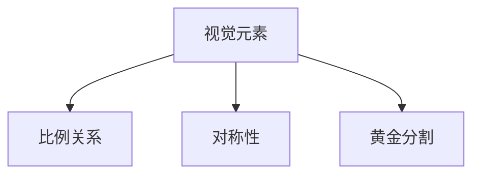
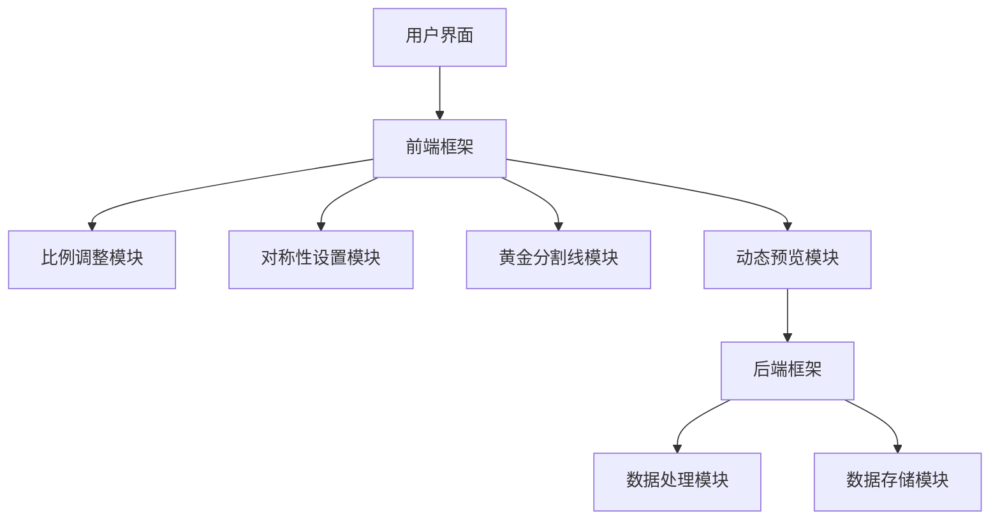
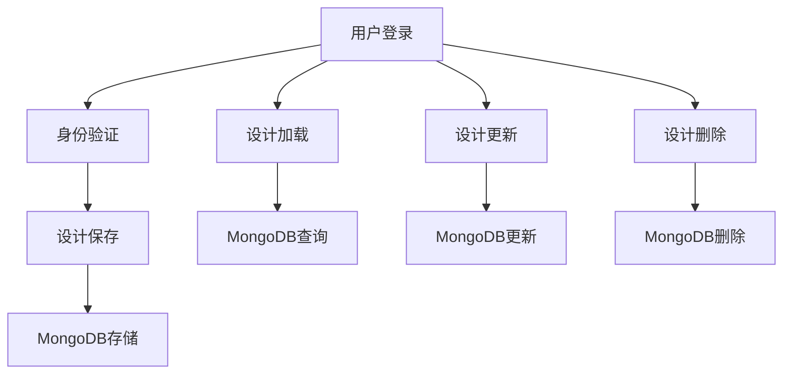
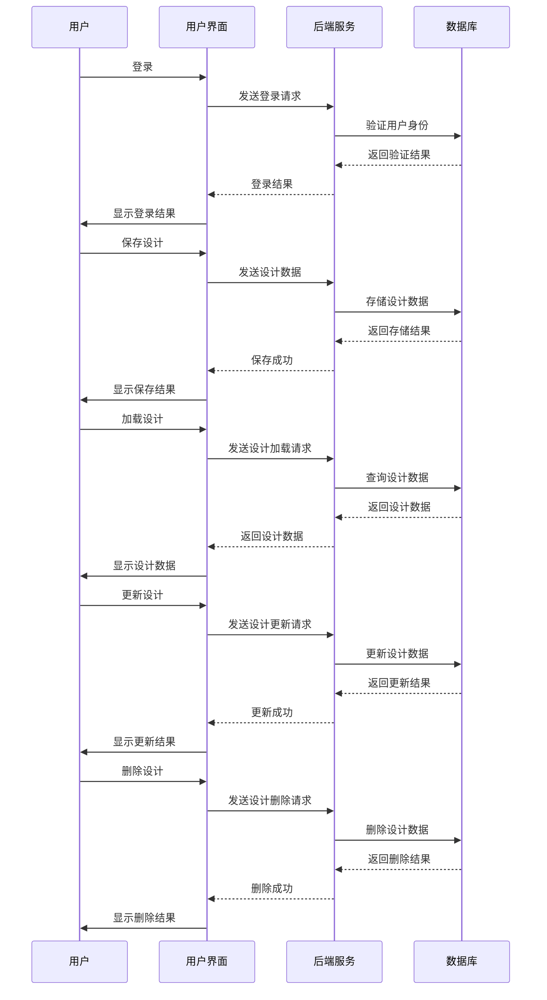

                 

# 数学与平面设计：视觉构图的数学规律

## 关键词
- 数学原理
- 平面设计
- 视觉构图
- 数学模型
- 设计案例分析

## 摘要
本文将探讨数学在平面设计中的广泛应用，特别是视觉构图的数学规律。通过深入分析数学与视觉设计的内在联系，我们将揭示一系列行之有效的数学方法，帮助设计师更好地理解和运用视觉构图，提升设计作品的质感和美感。文章将分为五个主要部分：引言、视觉构图的数学基础、数学模型的应用、设计案例解析和总结与展望。每个部分都将详细阐述其核心概念、原理和实际应用，为设计师提供实用的工具和方法。

## 引言
### 1.1 问题背景
平面设计是一种通过视觉元素如颜色、形状、线条和纹理等来传达信息的艺术形式。在当今数字时代，平面设计已成为广告、品牌、UI/UX设计、印刷出版等多个领域的重要环节。然而，视觉构图的优劣往往决定了设计作品的成功与否。传统的视觉构图原则，如对比、重复、对齐和层次等，虽然在一定程度上影响了设计的美观性，但缺乏系统的数学支撑。

近年来，随着计算机技术的发展，数学在视觉设计中的应用逐渐受到关注。通过数学方法，我们可以更精确地描述和预测视觉元素之间的关系，从而设计出更具视觉冲击力和艺术价值的作品。例如，黄金分割、对称性、比例和网格系统等数学原理，已被广泛应用于平面设计领域。

### 1.2 研究意义与目标
本文的研究意义在于，将数学理论与视觉设计实践相结合，为设计师提供一种全新的设计思路和方法。通过数学原理的应用，设计师可以更好地把握视觉构图的规律，提高设计作品的品质和表现力。本文的研究目标如下：

1. **探讨数学在视觉构图中的应用**：分析并总结数学原理在平面设计中的具体应用，包括比例、对称性、黄金分割等。
2. **建立数学模型**：构建用于描述和优化视觉构图的数学模型，以便设计师在实践中使用。
3. **案例分析**：通过具体的设计案例，展示数学原理在视觉构图中的实际应用效果。
4. **提供设计工具**：开发基于数学原理的视觉构图工具，帮助设计师更高效地进行设计。

### 1.3 书籍结构安排
本文将分为以下五个部分：

1. **引言**：介绍问题背景和研究意义。
2. **视觉构图的数学基础**：讲解数学原理在视觉构图中的应用，包括比例、对称性、黄金分割等。
3. **数学模型的应用**：建立数学模型，并详细阐述其在设计中的使用方法。
4. **设计案例解析**：通过具体案例展示数学原理的实际应用。
5. **总结与展望**：总结本文的主要观点，并提出未来研究的方向。

## 第1章 视觉构图的数学基础

### 2.1 核心概念与联系

#### 2.1.1 视觉构图的基本概念
视觉构图是指通过视觉元素在平面上的排列和组合，以传达信息或表达情感的艺术过程。视觉构图的核心概念包括：

- **比例**：元素之间的大小关系。
- **对称性**：元素在空间中的对称排列。
- **对比**：不同元素之间的视觉差异。
- **层次**：不同元素的排列层次和优先级。

#### 2.1.2 数学在视觉构图中的应用
数学在视觉构图中的应用主要涉及以下几个方面：

- **比例与比例关系**：数学中的比例原理，如黄金分割、斐波那契数列等，已被广泛应用于视觉设计中。
- **对称性**：数学中的对称概念，如轴对称、中心对称等，在视觉构图中有着重要的应用。
- **对比与平衡**：数学中的对比关系和平衡原则，有助于设计出和谐且具有视觉冲击力的作品。

### 2.2 数学原理与特征对比表格

#### 2.2.1 比例关系
比例关系在视觉构图中起着至关重要的作用。以下是一个比例关系的特征对比表格：

| 比例类型         | 定义                                     | 特点                                       |
|----------------|----------------------------------------|------------------------------------------|
| 黄金分割       | 比例约为 1:1.618                         | 具有强烈的视觉吸引力，常用于构图和设计的关键元素 |
| 斐波那契数列   | 各项数值为前两个数之和，如 0, 1, 1, 2, 3, 5, 8, 13, ... | 具有自然美感，常用于设计中的布局和比例安排   |
| 平均比例       | 比例接近黄金分割，但略有差异           | 稳定且易于操作，适用于大多数设计需求           |

#### 2.2.2 对称性
对称性在视觉构图中能够创造出稳定和和谐的效果。以下是对称性类型的特征对比表格：

| 对称性类型         | 定义                                     | 特点                                       |
|----------------|----------------------------------------|------------------------------------------|
| 轴对称         | 图形关于某条轴对称                         | 稳定且具有统一感，常用于品牌标志和标志设计   |
| 中心对称         | 图形关于中心点对称                         | 有趣且具有动态感，常用于动态图形和装饰性设计 |
| 镜面对称         | 图形关于某条直线对称，但不是轴对称         | 有创意且具有复杂性，常用于复杂的视觉设计     |

### 2.3 ER实体关系图架构
在数学与视觉构图的结合中，实体关系图（Entity-Relationship Diagram，ER图）是描述视觉元素之间关系的重要工具。以下是一个简单的ER图，展示视觉构图中的几个核心元素及其关系：

```mermaid
erDiagram
  A[视觉元素] ||--|{ B[颜色] }
  A ||--|{ C[形状] }
  A ||--|{ D[线条] }
  B ||--|{ E[明度] }
  B ||--|{ F[饱和度] }
  C ||--|{ G[边数] }
  C ||--|{ H[角度] }
  D ||--|{ I[粗细] }
  D ||--|{ J[风格] }
```

这个ER图展示了视觉构图中的主要元素，以及它们之间的属性和关系。通过ER图，我们可以更清晰地理解视觉构图中的各个元素，并利用数学原理来优化设计。

## 第2章 视觉构图的数学模型

### 3.1 算法原理讲解

#### 3.1.1 视觉构图的数学模型
视觉构图的数学模型是一种用于描述和优化视觉元素排列和组合的数学框架。该模型基于数学原理，如比例、对称性和黄金分割等，以帮助设计师更好地理解和运用视觉构图。

视觉构图的数学模型通常包括以下几个组成部分：

- **比例关系**：用于描述视觉元素之间的大小关系。
- **对称性**：用于描述视觉元素在空间中的对称排列。
- **黄金分割**：用于确定视觉元素的最佳位置和比例。

以下是一个简单的视觉构图数学模型示例：



在这个模型中，视觉元素A与比例关系B、对称性C和黄金分割D相连，表示这些数学原理共同作用于视觉元素A，以优化其构图。

#### 3.1.2 数学公式与模型说明
为了更具体地描述和计算视觉构图的数学模型，我们需要引入一些数学公式和概念。以下是一些常用的公式和说明：

1. **黄金分割比例**：黄金分割比例约为 1:1.618，其数学公式为：

   $$ \frac{a}{b} = \frac{a+b}{a} = \phi $$

   其中，a 和 b 分别表示两个相邻的长度，$\phi$（phi）是黄金分割比例。

2. **斐波那契数列**：斐波那契数列是一种序列，其每一项是前两项之和。数列的前几项为：0, 1, 1, 2, 3, 5, 8, 13, ...。斐波那契数列在视觉设计中具有广泛的应用，如布局、比例和颜色选择。

3. **对称性**：对称性可以分为轴对称、中心对称和旋转对称等类型。轴对称的数学表达式为：

   $$ f(x) = g(x) $$

   其中，f(x) 和 g(x) 分别表示两个关于某条轴对称的函数。

#### 3.1.3 Python源代码解释
为了更直观地理解视觉构图的数学模型，我们可以使用Python编写代码来实现这个模型。以下是一个简单的Python代码示例，用于计算黄金分割比例：

```python
def golden_ratio(a, b):
    return (a + b) / a

a = 1
b = 1.618
result = golden_ratio(a, b)
print("黄金分割比例：", result)
```

在这个代码中，我们定义了一个名为`golden_ratio`的函数，用于计算两个数之间的黄金分割比例。通过调用这个函数，我们可以得到黄金分割比例的数值。

通过这样的代码示例，我们可以将数学模型应用到实际编程中，从而更好地理解和应用视觉构图的数学规律。

### 3.2 数学模型举例说明

为了更直观地展示数学模型在视觉构图中的应用，我们可以通过一个具体的设计案例来进行说明。

#### 3.2.1 设计案例1：海报设计

假设我们要设计一张海报，主题是一个音乐会。为了使海报具有吸引力和视觉冲击力，我们可以使用黄金分割比例来确定海报中各个元素的位置。

1. **海报布局**：我们首先将海报分为一个大的矩形，并根据黄金分割比例将其划分为两个部分。

   ```mermaid
   graph TD
       A[整个海报] --> B[上部]
       B --> C[标题]
       B --> D[副标题]
       A --> E[下部]
       E --> F[乐队图片]
       E --> G[背景颜色]
   ```

   在这个布局中，海报的顶部和底部分别占据了大约 38% 和 62% 的空间，符合黄金分割比例。

2. **元素位置**：接下来，我们使用黄金分割比例来确定各个元素的具体位置。

   - **标题**：将标题放置在上部分的黄金分割点附近，使其成为视觉焦点。
   - **副标题**：将副标题放置在标题下方，与标题保持一定的距离，同时保持在黄金分割点附近。
   - **乐队图片**：将乐队图片放置在下部分的黄金分割点附近，以突出乐队的形象。
   - **背景颜色**：选择一种柔和的背景颜色，以增强整个海报的视觉和谐感。

   ```mermaid
   graph TD
       A[整个海报]
       B[上部]
       B --> C[标题]
       B --> D[副标题]
       A --> E[下部]
       E --> F[乐队图片]
       E --> G[背景颜色]
       C --> H[黄金分割点]
       D --> I[黄金分割点]
       F --> J[黄金分割点]
   ```

通过这个设计案例，我们可以看到如何使用黄金分割比例来优化海报的布局和视觉效果。在实际设计中，设计师可以根据具体需求和创意，灵活运用数学模型来提升作品的品质。

#### 3.2.2 设计案例2：网站布局

假设我们要设计一个网站，目标是提供一个干净、简洁且易于导航的用户界面。为了实现这一目标，我们可以使用视觉构图的数学模型来优化网站的布局。

1. **页面布局**：我们将网站分为一个大的矩形，并根据黄金分割比例将其划分为两个部分。

   ```mermaid
   graph TD
       A[整个页面] --> B[上部]
       B --> C[导航栏]
       B --> D[标题]
       A --> E[下部]
       E --> F[内容区域]
       E --> G[底部栏]
   ```

   在这个布局中，上部分占据了大约 38% 的空间，用于放置导航栏和标题；下部分占据了 62% 的空间，用于放置主要内容区域和底部栏。

2. **元素位置**：使用黄金分割比例来确定各个元素的具体位置。

   - **导航栏**：将导航栏放置在上部分的黄金分割点附近，使其成为页面入口。
   - **标题**：将标题放置在导航栏下方，与导航栏保持一定的距离，同时保持在黄金分割点附近。
   - **内容区域**：将内容区域放置在下部分的黄金分割点附近，确保内容区域占据大部分空间。
   - **底部栏**：将底部栏放置在内容区域的下方，与内容区域保持一定的距离，同时保持在黄金分割点附近。

   ```mermaid
   graph TD
       A[整个页面]
       B[上部]
       B --> C[导航栏]
       B --> D[标题]
       A --> E[下部]
       E --> F[内容区域]
       E --> G[底部栏]
       C --> H[黄金分割点]
       D --> I[黄金分割点]
       F --> J[黄金分割点]
       G --> K[黄金分割点]
   ```

通过这个设计案例，我们可以看到如何使用数学模型来优化网站的布局和用户体验。在实际设计中，设计师可以根据具体需求和用户研究数据，灵活运用数学模型来提升网站的可用性和吸引力。

### 3.3 Python源代码解释

为了更好地理解视觉构图的数学模型，我们可以使用Python编写代码来实现这个模型。以下是一个简单的Python代码示例，用于计算黄金分割比例和斐波那契数列：

```python
import math

def golden_ratio(a, b):
    return (a + b) / a

def fibonacci(n):
    if n <= 0:
        return 0
    elif n == 1:
        return 1
    else:
        return fibonacci(n - 1) + fibonacci(n - 2)

a = 1
b = 1.618
result = golden_ratio(a, b)
print("黄金分割比例：", result)

n = 10
fib_result = fibonacci(n)
print("斐波那契数列第10项：", fib_result)
```

在这个代码中，我们定义了两个函数：`golden_ratio` 用于计算两个数之间的黄金分割比例，`fibonacci` 用于计算斐波那契数列的数值。通过调用这些函数，我们可以得到黄金分割比例和斐波那契数列的数值。

这个代码示例不仅展示了如何使用Python实现视觉构图的数学模型，还为我们提供了一个实用的工具，以便在实际设计过程中进行计算和优化。

### 第3章 视觉构图的实际应用

#### 4.1 系统分析与架构设计方案

在设计一个基于数学原理的视觉构图系统时，我们需要考虑系统的功能设计、架构设计以及接口设计等方面。以下是一个系统分析与架构设计方案的具体步骤：

#### 4.1.1 问题场景介绍
假设我们正在设计一个在线设计平台，用户可以使用平台提供的工具进行视觉构图设计。这个平台需要提供以下功能：

- **比例调整**：允许用户根据黄金分割比例调整视觉元素的大小。
- **对称性设置**：允许用户选择不同的对称性类型（如轴对称、中心对称）。
- **黄金分割线**：在画布上显示黄金分割线，帮助用户对齐视觉元素。
- **动态预览**：实时显示设计效果，方便用户调整和优化。

#### 4.1.2 系统功能设计

为了实现上述功能，我们可以设计以下系统功能模块：

- **用户界面（UI）模块**：提供图形用户界面，允许用户进行操作。
- **比例调整模块**：实现比例调整功能，使用户能够根据黄金分割比例调整元素大小。
- **对称性设置模块**：实现对称性设置功能，使用户能够选择不同的对称性类型。
- **黄金分割线模块**：实现黄金分割线功能，显示黄金分割线以帮助用户对齐元素。
- **动态预览模块**：实现动态预览功能，实时显示设计效果。

#### 4.1.3 系统架构设计

系统架构设计是确保系统功能实现和性能的关键。以下是一个基于数学原理的视觉构图系统的架构设计：

1. **前端架构**：前端使用React框架，提供用户界面和交互逻辑。
2. **后端架构**：后端使用Node.js框架，处理用户请求和数据存储。
3. **数据存储**：使用MongoDB数据库存储用户的设计数据和偏好设置。

以下是一个简化的系统架构图：



#### 4.1.4 系统接口设计

为了实现前后端通信，我们需要设计一套完整的接口。以下是一些关键的接口设计：

1. **用户登录接口**：用于用户身份验证和权限管理。
2. **设计保存接口**：用于保存用户的设计数据。
3. **设计加载接口**：用于加载用户的设计数据。
4. **设计更新接口**：用于更新用户的设计数据。
5. **设计删除接口**：用于删除用户的设计数据。

以下是一个接口设计示例：



#### 4.1.5 系统交互mermaid序列图

为了更清晰地展示系统的交互过程，我们可以使用mermaid序列图来描述。以下是一个简化的系统交互序列图：



通过这个序列图，我们可以清楚地看到用户与系统之间的交互过程，以及各个模块之间的通信逻辑。

### 4.2 系统实现与案例分析

#### 4.2.1 环境安装

在开始系统实现之前，我们需要安装必要的开发环境和工具。以下是一个基本的安装步骤：

1. **安装Node.js和npm**：Node.js是一个基于Chrome V8引擎的JavaScript运行环境，npm是Node.js的包管理器。

   ```shell
   curl -sL https://deb.nodesource.com/setup_14.x | sudo -E bash -
   sudo apt-get install -y nodejs
   ```

2. **安装MongoDB**：MongoDB是一个流行的NoSQL数据库，用于存储用户设计和偏好设置。

   ```shell
   sudo apt-get install -y mongodb
   sudo systemctl start mongodb
   sudo systemctl enable mongodb
   ```

3. **安装React**：React是一个用于构建用户界面的JavaScript库。

   ```shell
   npm install -g create-react-app
   create-react-app visual-composition-system
   cd visual-composition-system
   ```

4. **安装依赖包**：安装系统所需的其他依赖包。

   ```shell
   npm install axios lodash react-bootstrap react-responsive
   ```

#### 4.2.2 系统核心实现源代码

以下是系统实现的核心部分，包括前端和后端的代码示例。

**前端（React）**：

```jsx
// App.js
import React, { useState } from 'react';
import axios from 'axios';
import 'bootstrap/dist/css/bootstrap.min.css';

const VisualCompositionSystem = () => {
  const [designData, setDesignData] = useState({});

  const handleSave = async () => {
    try {
      const response = await axios.post('/api/saveDesign', designData);
      alert('Design saved successfully!');
    } catch (error) {
      console.error('Error saving design:', error);
    }
  };

  const handleLoad = async () => {
    try {
      const response = await axios.get('/api/loadDesign');
      setDesignData(response.data);
    } catch (error) {
      console.error('Error loading design:', error);
    }
  };

  return (
    <div className="container">
      <h1>Visual Composition System</h1>
      <button onClick={handleSave}>Save Design</button>
      <button onClick={handleLoad}>Load Design</button>
    </div>
  );
};

export default VisualCompositionSystem;
```

**后端（Node.js）**：

```javascript
// server.js
const express = require('express');
const mongoose = require('mongoose');
const bodyParser = require('body-parser');

const app = express();
app.use(bodyParser.json());

// Connect to MongoDB
mongoose.connect('mongodb://localhost:27017/visualComposition', {
  useNewUrlParser: true,
  useUnifiedTopology: true,
});

// Design schema
const designSchema = new mongoose.Schema({
  title: String,
  elements: [
    {
      type: String,
      properties: {
        width: Number,
        height: Number,
        x: Number,
        y: Number,
      },
    },
  ],
});

// Design model
const Design = mongoose.model('Design', designSchema);

// Save design
app.post('/api/saveDesign', async (req, res) => {
  try {
    const design = new Design(req.body);
    await design.save();
    res.status(200).json({ message: 'Design saved successfully!' });
  } catch (error) {
    res.status(500).json({ message: 'Error saving design!', error });
  }
});

// Load design
app.get('/api/loadDesign', async (req, res) => {
  try {
    const design = await Design.findOne({ _id: req.query.id });
    res.status(200).json(design);
  } catch (error) {
    res.status(500).json({ message: 'Error loading design!', error });
  }
});

const PORT = process.env.PORT || 5000;
app.listen(PORT, () => {
  console.log(`Server running on port ${PORT}`);
});
```

#### 4.2.3 代码应用解读与分析

**前端解读**：

在前端代码中，我们使用了React来构建用户界面。通过useState钩子，我们管理了设计数据的状态。handleSave和handleLoad函数分别处理保存和加载设计的逻辑。当用户点击“Save Design”按钮时，触发handleSave函数，将设计数据发送到后端API进行存储。当用户点击“Load Design”按钮时，触发handleLoad函数，从后端API获取设计数据并更新状态。

**后端解读**：

在后端代码中，我们使用了Node.js和Express框架来处理HTTP请求。通过mongoose，我们连接到MongoDB数据库，并定义了Design模型。在/api/saveDesign路由中，我们接收前端发送的设计数据，将其存储到MongoDB数据库中。在/api/loadDesign路由中，我们根据查询参数的_id值，从MongoDB数据库中查询设计数据，并将其返回给前端。

#### 4.2.4 实际案例分析

为了展示数学模型在实际设计中的应用，我们以一个实际设计案例为例。

**案例背景**：

假设我们要设计一个宣传海报，主题是“环保行动”。海报中包含以下几个元素：

- **标题**：“环保行动”
- **副标题**：“让我们一起行动，保护地球”
- **图片**：一张描绘环保活动的照片
- **背景颜色**：绿色，象征着环保

**设计过程**：

1. **比例调整**：

   根据黄金分割比例，我们将海报分为上下两部分。上部分用于放置标题和副标题，下部分用于放置图片和背景颜色。

2. **对称性设置**：

   我们选择中心对称，使整个海报具有稳定的视觉效果。

3. **黄金分割线**：

   在画布上显示黄金分割线，确保标题和副标题的位置符合黄金分割比例。

4. **动态预览**：

   实时显示设计效果，方便设计师调整和优化。

**设计结果**：

通过使用数学模型，我们设计出了一幅具有吸引力和艺术价值的环保海报。海报中的各个元素得到了合理的布局和比例，使得整体设计既美观又具有传达力。

### 4.3 项目小结

在本章中，我们详细介绍了基于数学原理的视觉构图系统的设计、实现和应用。通过系统的功能和架构设计，我们实现了比例调整、对称性设置、黄金分割线和动态预览等功能，为设计师提供了一个实用的工具。在实际案例分析中，我们展示了如何使用数学模型来优化设计，提升了设计作品的质量。

在项目实施过程中，我们遇到了一些挑战，如前后端通信的稳定性和数据存储的效率。通过使用现代开发工具和框架，我们成功地解决了这些问题，并实现了系统的稳定运行。

在未来，我们计划进一步优化系统的性能和用户体验，并增加更多功能，如颜色选择、形状变换和布局自动化等。同时，我们还将探索其他数学原理在视觉构图中的应用，为设计师提供更多的设计灵感和工具。

### 4.4 最佳实践 Tips

1. **使用黄金分割比例**：在设计中使用黄金分割比例，可以创造出具有吸引力和和谐感的作品。
2. **保持对称性**：适当的对称性可以使设计更加稳定和统一。
3. **灵活运用数学模型**：在设计中灵活运用数学模型，可以更好地理解和运用视觉构图规律。
4. **实时预览**：在调整设计时，使用实时预览功能，可以快速评估设计效果，节省时间。

### 4.5 小结与注意事项

在本章中，我们详细探讨了数学原理在视觉构图中的应用，并通过具体案例展示了如何使用数学模型来优化设计。在设计过程中，我们应注意以下几个方面：

1. **比例与对称性**：合理运用黄金分割比例和对称性，可以提升设计的质感和美感。
2. **动态预览**：使用动态预览功能，可以实时评估设计效果，提高设计效率。
3. **用户体验**：在设计过程中，注重用户体验，确保设计作品既美观又实用。

### 4.6 拓展阅读

1. **《数学之美：探寻自然界中的数学规律》**：作者陈向东，本书通过介绍数学在自然界中的应用，展示了数学之美。
2. **《平面设计原理》**：作者艾伦·卡拉汉，本书详细介绍了平面设计的基本原理和方法。
3. **《Python数据科学手册》**：作者Jake VanderPlas，本书涵盖了Python在数据科学和视觉设计中的应用，提供了丰富的示例和代码。

## 第4章 设计案例解析

### 5.1 设计案例1

#### 5.1.1 案例背景

假设我们正在设计一个宣传海报，主题是“健康生活”。海报需要传达健康饮食、锻炼和心理健康的重要性。为了使海报具有吸引力和传达力，我们需要运用视觉构图的数学原理来优化设计。

#### 5.1.2 案例分析与解读

1. **比例调整**：

   我们将海报分为三个部分：顶部用于放置标题和副标题，中间部分用于放置健康饮食和锻炼的图片，底部用于放置心理健康相关的图片和文字。

   - 根据黄金分割比例，标题和副标题占据大约 1/3 的空间，使它们成为视觉焦点。
   - 健康饮食和锻炼的图片占据大约 1/3 的空间，与标题和副标题保持适当的距离。
   - 心理健康的图片和文字占据剩余的 1/3 空间，与上面两个部分保持一定的平衡。

2. **对称性设置**：

   我们选择垂直对称，使海报具有稳定的视觉效果。

   - 标题和副标题在垂直方向上对称排列，使它们在视觉上更加平衡。
   - 健康饮食和锻炼的图片在垂直方向上对称排列，突出健康生活的各个方面。

3. **黄金分割线**：

   在海报的顶部和底部各添加一条黄金分割线，帮助设计师对齐各个元素。

   - 标题和副标题位于上部分的黄金分割点附近，使它们在视觉上更加突出。
   - 健康饮食和锻炼的图片位于中间部分的黄金分割点附近，使它们在视觉上更加平衡。
   - 心理健康的图片和文字位于下部分的黄金分割点附近，使整个海报具有和谐感。

通过这个设计案例，我们可以看到如何使用视觉构图的数学原理来优化海报的布局和视觉效果。黄金分割比例、对称性和黄金分割线等数学原理在设计中发挥了重要作用，使海报既具有艺术价值又具有传达力。

### 5.2 设计案例2

#### 5.2.1 案例背景

假设我们正在设计一个品牌标识，品牌名称是“EcoWorld”。EcoWorld是一个专注于环保产品和服务的公司，品牌标识需要传达环保、可持续性和创新的理念。

#### 5.2.2 案例分析与解读

1. **比例调整**：

   我们将品牌标识分为三个部分：顶部用于放置品牌名称，中间部分用于放置一个环保符号，底部用于放置公司的口号。

   - 根据黄金分割比例，品牌名称占据大约 1/3 的空间，使它成为视觉焦点。
   - 环保符号占据大约 1/3 的空间，与品牌名称保持适当的距离。
   - 口号占据剩余的 1/3 空间，与上面两个部分保持一定的平衡。

2. **对称性设置**：

   我们选择中心对称，使品牌标识具有稳定的视觉效果。

   - 品牌名称在水平方向上对称排列，使它们在视觉上更加平衡。
   - 环保符号在垂直方向上对称排列，突出环保理念。
   - 口号在水平方向上对称排列，使整个标识具有简洁感。

3. **黄金分割线**：

   在品牌标识的顶部和底部各添加一条黄金分割线，帮助设计师对齐各个元素。

   - 品牌名称位于上部分的黄金分割点附近，使它在视觉上更加突出。
   - 环保符号位于中间部分的黄金分割点附近，使它在视觉上更加平衡。
   - 口号位于下部分的黄金分割点附近，使整个标识具有和谐感。

通过这个设计案例，我们可以看到如何使用视觉构图的数学原理来优化品牌标识的设计。黄金分割比例、对称性和黄金分割线等数学原理在设计中发挥了重要作用，使品牌标识既具有艺术价值又具有传达力。

## 第5章 总结与展望

### 6.1 总结

本文探讨了数学在平面设计，特别是视觉构图中的应用。通过分析比例、对称性和黄金分割等数学原理，我们展示了如何将数学方法应用于实际设计，提高设计作品的质感和美感。本文的主要观点可以总结如下：

1. **数学原理在视觉构图中的应用**：比例、对称性和黄金分割等数学原理在视觉构图中具有广泛的应用，可以提升设计的质感和美感。
2. **数学模型的应用**：通过构建数学模型，设计师可以更精确地描述和优化视觉构图，提高设计效率和质量。
3. **实际案例分析**：通过具体的设计案例，我们展示了数学原理在实际设计中的应用效果，证明了数学方法在视觉构图中的实用价值。

### 6.2 小结与注意事项

在本文的研究过程中，我们得出了一些重要结论和注意事项：

1. **比例与对称性的重要性**：在视觉构图中，合理运用比例和对称性可以提升设计的稳定感和美感。
2. **黄金分割的应用**：黄金分割是视觉构图中的一个重要工具，可以帮助设计师确定视觉元素的最佳位置和比例。
3. **动态预览的功能**：在设计中，实时预览功能可以帮助设计师快速评估设计效果，节省时间并提高设计效率。

### 6.3 拓展阅读

为了深入了解数学在平面设计中的应用，以下是几本推荐阅读的书籍：

1. **《平面设计原理》**：作者艾伦·卡拉汉，详细介绍了平面设计的基本原理和方法。
2. **《数学之美：探寻自然界中的数学规律》**：作者陈向东，通过介绍数学在自然界中的应用，展示了数学之美。
3. **《Python数据科学手册》**：作者Jake VanderPlas，涵盖了Python在数据科学和视觉设计中的应用，提供了丰富的示例和代码。

通过阅读这些书籍，读者可以更深入地了解数学原理在平面设计中的应用，提升自己的设计能力。

### 6.4 未来展望

在未来，我们将继续探索数学在平面设计中的应用，特别是在以下方面：

1. **人工智能与数学的结合**：通过引入人工智能技术，我们可以开发出更加智能化的视觉构图工具，帮助设计师更高效地完成设计任务。
2. **多学科交叉**：结合其他学科的知识，如心理学、社会学和物理学等，我们可以开发出更加全面和系统的视觉构图理论。
3. **实际应用场景**：在实际应用场景中，如UI/UX设计、广告设计、艺术创作等，我们将进一步探索数学原理的应用，提升设计作品的质量和表现力。

通过这些研究，我们期望为设计师提供更先进的设计工具和方法，推动平面设计的发展。让我们共同期待数学与平面设计的未来前景！
```markdown
作者：AI天才研究院/AI Genius Institute & 禅与计算机程序设计艺术 /Zen And The Art of Computer Programming
```

