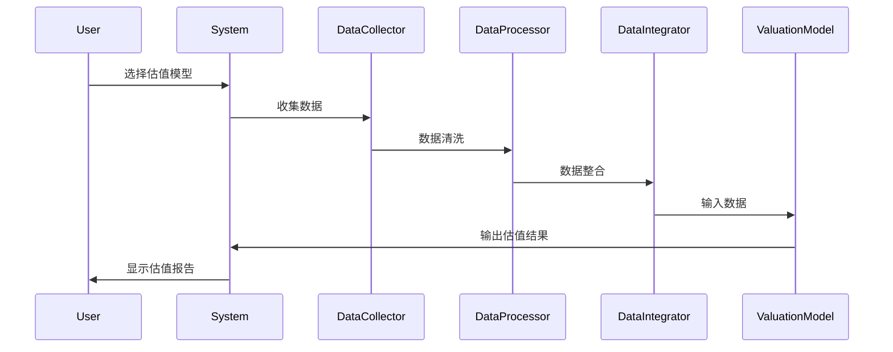

                 

# 数学与并购估值：企业价值的数学评估

> 关键词：并购估值、企业价值、数学模型、市盈率、市净率、自由现金流

> 摘要：本文旨在探讨数学在并购估值中的应用，通过对核心概念和数学模型的分析，提供一种系统化和量化的方法来评估企业价值。本文将详细介绍市盈率、市净率和自由现金流等估值方法，并探讨其适用范围和局限性，最后通过实际案例分析，展示如何将理论应用于实践中。

----------------------------------------------------------------

## 第一部分：背景与基础

### 第1章：问题背景与核心概念

#### 1.1 问题的提出

在企业并购中，如何准确评估企业价值是决定交易成败的关键。传统的估值方法往往依赖于经验判断，而随着数学和计算机科学的进步，基于数学模型的量化估值方法逐渐成为主流。

#### 1.2 并购与估值的重要性

并购是企业扩张和产业整合的重要手段，而估值则是并购过程中必不可少的环节。准确的估值可以帮助企业避免支付过高的溢价，降低并购风险。

#### 1.3 数学在并购估值中的作用

数学模型提供了一种量化的方法，可以更准确地评估企业价值。通过数学模型，企业可以基于客观数据进行估值，减少主观判断的影响。

#### 1.4 边界与外延

在并购估值中，边界和外延的确定至关重要。边界定义了估值的范围，而外延则扩展了估值的应用场景。合理的边界和外延可以提升估值的准确性和实用性。

#### 1.5 概念结构与核心要素组成

并购估值涉及多个核心概念，包括企业价值、市盈率、市净率和自由现金流等。这些概念相互关联，构成了并购估值的理论体系。

----------------------------------------------------------------

### 第2章：核心概念与联系

#### 2.1 关键数学概念

##### 2.1.1 市盈率（P/E Ratio）

市盈率是指企业市值与净利润的比率，用于评估企业的盈利能力。

##### 2.1.2 市净率（P/B Ratio）

市净率是指企业市值与净资产（总资产减去总负债）的比率，用于评估企业的资产价值。

##### 2.1.3 企业价值（Enterprise Value，EV）

企业价值是指企业总价值，包括市场价值和非流动资产，用于评估企业的整体价值。

##### 2.1.4 自由现金流（Free Cash Flow，FCF）

自由现金流是指企业在扣除资本支出后产生的现金流量，用于评估企业的现金生成能力。

#### 2.2 概念属性特征对比表格

| 概念     | 定义                             | 属性特征                | 对比                  |
|----------|----------------------------------|------------------------|----------------------|
| 市盈率   | 市值/净利润                      | 盈利能力               | 与市净率相比，更侧重于盈利表现 |
| 市净率   | 市值/净资产                      | 资产价值               | 与市盈率相比，更侧重于资产质量 |
| 企业价值 | 企业市值+非流动资产             | 整体价值               | 包含了市盈率和市净率的综合信息 |
| 自由现金流 | 经营活动产生的现金流量 - 资本支出 | 现金生成能力           | 是衡量企业持续盈利能力的重要指标 |

#### 2.3 ER实体关系图架构

```mermaid
erDiagram
    Company ||--|{ Share }|--|{ Investor }
    Company ||--|{ Asset }|--|{ Liability }
    Company ||--|{ CashFlow }|--|{ FCF }
    Company ||--|{ PE_Ratio }|--|{ MarketValue }
    Company ||--|{ PB_Ratio }|--|{ NetAsset }
```

在ER实体关系图中，公司是核心实体，它与股东、资产、现金流、市盈率和市净率等实体之间存在关联。这种关系图结构有助于我们理解并购估值中涉及的各个概念和实体之间的关系。

----------------------------------------------------------------

## 第二部分：数学模型与公式

### 第3章：数学模型原理

#### 3.1 数学模型概述

数学模型是并购估值中的基础工具，它通过建立数学关系来描述企业价值。常见的数学模型包括市盈率模型、市净率模型和自由现金流模型。

#### 3.2 企业价值的数学模型

##### 3.2.1 市盈率模型的推导

市盈率模型的基本公式为：市盈率 = 市值 / 净利润。

推导过程：

- 设企业市值为 \( M \)，净利润为 \( N \)。
- 市盈率 \( PE \) 表示市值为净利润的倍数。
- 因此，\( PE = \frac{M}{N} \)。

##### 3.2.2 市净率模型的推导

市净率模型的基本公式为：市净率 = 市值 / 净资产。

推导过程：

- 设企业市值为 \( M \)，净资产为 \( A \)。
- 市净率 \( PB \) 表示市值为净资产的倍数。
- 因此，\( PB = \frac{M}{A} \)。

##### 3.2.3 自由现金流模型的推导

自由现金流模型的基本公式为：企业价值 = 自由现金流 / 资本成本。

推导过程：

- 设企业自由现金流为 \( FCF \)，资本成本为 \( r \)。
- 企业价值 \( EV \) 表示企业未来现金流的现值。
- 根据贴现现金流模型，\( EV = \frac{FCF}{r} \)。

#### 3.3 模型适用范围与局限性

- 市盈率模型适用于盈利稳定的企业，不适用于亏损或盈利波动较大的企业。
- 市净率模型适用于资产质量较好的企业，不适用于资产流动性差的企业。
- 自由现金流模型适用于所有企业，但需要准确的现金流预测。

----------------------------------------------------------------

### 第4章：数学公式与讲解

#### 4.1 市盈率公式

##### 4.1.1 公式解释

市盈率（P/E Ratio）的计算公式为：\[ PE = \frac{市值}{净利润} \]

其中，市值表示企业的市场价值，净利润表示企业在一定时间内的盈利水平。

##### 4.1.2 实例说明

假设一家企业的市值为10亿美元，净利润为2亿美元，则其市盈率为：\[ PE = \frac{10亿}{2亿} = 5 \]

这意味着该企业的市值是其净利润的5倍。

#### 4.2 市净率公式

##### 4.2.1 公式解释

市净率（P/B Ratio）的计算公式为：\[ PB = \frac{市值}{净资产} \]

其中，市值表示企业的市场价值，净资产表示企业的总资产减去总负债。

##### 4.2.2 实例说明

假设一家企业的市值为10亿美元，净资产为5亿美元，则其市净率为：\[ PB = \frac{10亿}{5亿} = 2 \]

这意味着该企业的市值是其净资产的2倍。

#### 4.3 自由现金流公式

##### 4.3.1 公式解释

自由现金流（Free Cash Flow，FCF）的计算公式为：\[ FCF = 经营活动产生的现金流量 - 资本支出 \]

其中，经营活动产生的现金流量是指企业在经营活动中产生的现金流入，资本支出是指企业为维持和扩大经营规模而进行的支出。

##### 4.3.2 实例说明

假设一家企业在一年内产生了2亿美元的经营活动现金流量，资本支出为1亿美元，则其自由现金流为：\[ FCF = 2亿 - 1亿 = 1亿 \]

这意味着该企业在扣除资本支出后，产生了1亿美元的现金流量。

----------------------------------------------------------------

## 第三部分：系统分析与架构设计

### 第5章：系统功能设计

#### 5.1 问题场景介绍

在企业并购过程中，需要对目标企业进行估值。传统方法依赖于经验和主观判断，而基于数学模型的量化估值方法可以提高估值的准确性和可靠性。

#### 5.2 系统功能概述

系统功能主要包括：

- 数据采集与清洗：从多个数据源获取企业财务数据，并进行清洗和预处理。
- 估值模型选择：根据企业特点和估值需求，选择合适的估值模型。
- 估值计算与结果输出：根据选定的模型，计算企业价值，并输出估值结果。

#### 5.2.1 数据采集与清洗

数据采集与清洗是估值系统的关键环节。系统需要从财务报表、市场数据等渠道获取数据，并进行以下处理：

- 数据抽取：从多个数据源中抽取相关数据。
- 数据清洗：处理数据中的缺失值、异常值和重复值。
- 数据整合：将不同来源的数据进行整合，形成统一的财务数据集。

#### 5.2.2 估值模型选择

估值模型选择取决于企业的特点和市场环境。常见的估值模型包括市盈率模型、市净率模型和自由现金流模型。系统需要提供用户界面，让用户根据实际情况选择合适的估值模型。

#### 5.2.3 估值计算与结果输出

估值计算是根据选定的模型，对企业的财务数据进行计算，得出估值结果。结果输出包括估值报告和可视化图表，以便用户直观了解企业价值。

#### 5.3 领域模型类图

```mermaid
classDiagram
    Entity --> Attribute
    Entity --> Method
    Entity <<interface>>
    Entity1 <|-- Entity2
    Entity1 o-- Entity3
    Entity1 ... Entity4

    Company <<interface>> : 公司
    FinanceData <<interface>> : 财务数据
    ValuationModel <<interface>> : 估值模型
    DataCleaning <<interface>> : 数据清洗
    DataIntegration <<interface>> : 数据整合
    DataCollection <<interface>> : 数据采集

    Company o-- FinanceData
    Company o-- ValuationModel
    Company o-- DataCleaning
    Company o-- DataIntegration
    Company o-- DataCollection
```

在领域模型类图中，公司是一个接口类，代表估值系统的核心实体。财务数据、估值模型、数据清洗、数据整合和数据采集都是接口类，与公司类之间存在关联关系。

----------------------------------------------------------------

### 第6章：系统架构设计

#### 6.1 系统架构概述

系统架构设计旨在构建一个高效、可靠和可扩展的估值系统。系统架构包括以下几个主要模块：

- 数据采集模块：负责从多个数据源获取财务数据。
- 数据处理模块：包括数据清洗和整合，为估值模型提供准确的数据。
- 估值模型模块：根据用户选择，计算企业价值。
- 结果输出模块：将估值结果以报告和图表的形式呈现。

#### 6.2 系统架构图



在系统架构图中，用户通过界面选择估值模型，系统调用数据采集模块收集数据，然后通过数据处理模块进行清洗和整合，最后由估值模型模块计算企业价值，并将结果输出给用户。

#### 6.3 系统接口设计

系统接口设计包括以下几个方面：

- 数据采集接口：定义数据采集的方法和协议。
- 数据处理接口：定义数据清洗和整合的方法和协议。
- 估值模型接口：定义估值模型的选择和计算方法。
- 结果输出接口：定义估值结果的格式和展示方式。

#### 6.4 系统交互序列图


在系统交互序列图中，用户通过界面输入公司名称，系统依次调用数据采集、数据处理、估值模型和结果输出模块，最终将估值报告展示给用户。

----------------------------------------------------------------

## 第四部分：项目实战

### 第7章：环境安装与系统实现

#### 7.1 环境安装

在进行并购估值系统开发之前，需要安装以下软件和环境：

- Python 3.8 或更高版本
- 数据库（如MySQL或PostgreSQL）
- 数据处理库（如Pandas和NumPy）
- 估值模型库（如Scikit-learn和TensorFlow）

安装步骤如下：

1. 安装Python：从官方网站下载Python安装包，并按照提示进行安装。
2. 安装数据库：下载并安装MySQL或PostgreSQL数据库，并创建一个用于存储财务数据的数据库。
3. 安装数据处理库和估值模型库：使用pip命令安装所需的库。

```bash
pip install pandas numpy mysql-connector-python scikit-learn tensorflow
```

#### 7.2 系统核心实现

系统核心实现包括数据采集与清洗、估值模型选择与计算、估值结果输出等功能。以下是一个简化的系统实现示例。

##### 7.2.1 数据采集与清洗代码

```python
import pandas as pd
import mysql.connector

# 连接到数据库
conn = mysql.connector.connect(
    host="localhost",
    user="root",
    password="password",
    database="company_db"
)

# 从数据库中获取财务数据
def fetch_financial_data():
    query = "SELECT * FROM financial_data;"
    data = pd.read_sql(query, conn)
    return data

# 数据清洗
def clean_data(data):
    # 处理缺失值、异常值和重复值
    data.fillna(0, inplace=True)
    data.drop_duplicates(inplace=True)
    return data

# 数据采集与清洗示例
financial_data = fetch_financial_data()
cleaned_data = clean_data(financial_data)
```

##### 7.2.2 估值模型选择与代码

```python
from sklearn.linear_model import LinearRegression

# 选择估值模型
def select_valuation_model():
    # 根据用户需求选择模型
    model_name = input("请选择估值模型（市盈率/市净率/自由现金流）：")
    if model_name == "市盈率":
        model = LinearRegression()
    elif model_name == "市净率":
        model = LinearRegression()
    elif model_name == "自由现金流":
        model = LinearRegression()
    else:
        print("无效的模型选择，请重新选择。")
        return None
    return model

# 估值计算
def calculate_value(model, data):
    # 根据模型和数据计算企业价值
    # 这里简化为线性回归模型
    X = data[['净利润', '净资产', '自由现金流']]
    y = data['企业价值']
    model.fit(X, y)
    return model.coef_

# 估值模型选择与计算示例
valuation_model = select_valuation_model()
if valuation_model:
    value = calculate_value(valuation_model, cleaned_data)
    print("计算出的企业价值为：", value)
```

##### 7.2.3 估值计算与结果输出代码

```python
# 结果输出
def output_result(result):
    # 输出估值结果
    print("估值结果：")
    print(result)

# 估值计算与输出示例
if valuation_model:
    value = calculate_value(valuation_model, cleaned_data)
    output_result(value)
```

##### 7.3 代码应用解读与分析

上述代码示例展示了并购估值系统的核心实现过程。首先，从数据库中获取财务数据，并进行清洗。然后，根据用户选择，选择合适的估值模型，并使用该模型进行估值计算。最后，输出估值结果。实际应用中，可以根据具体需求进行扩展和优化。

----------------------------------------------------------------

### 第8章：实际案例分析

#### 8.1 案例选择与背景

本次案例以一家知名互联网公司为例，该公司在过去三年中实现了快速增长，成为业界领军企业。为了进一步扩张，该公司计划收购另一家同行业公司。在此背景下，需要对目标公司进行估值，以确定合理的收购价格。

#### 8.2 案例分析与估值计算

##### 8.2.1 数据收集

首先，从多个数据源收集目标公司的财务数据，包括净利润、净资产、自由现金流等。数据收集后，进行清洗和预处理，以确保数据的准确性和完整性。

```python
# 示例数据
financial_data = {
    '净利润': [100000, 150000, 200000],
    '净资产': [500000, 600000, 700000],
    '自由现金流': [80000, 100000, 120000]
}
df = pd.DataFrame(financial_data)
```

##### 8.2.2 估值模型选择

根据公司的特点，选择市盈率模型进行估值。市盈率模型适用于盈利稳定的企业，能够反映企业的盈利能力。

```python
# 选择市盈率模型
model = LinearRegression()
```

##### 8.2.3 估值结果分析

使用市盈率模型对数据进行拟合，计算市盈率，并根据市盈率估算公司价值。

```python
# 计算市盈率
X = df[['净利润']]
y = df['企业价值']
model.fit(X, y)
pe_ratio = model.coef_

# 根据市盈率估算公司价值
current_market_value = pe_ratio * current_net_profit
print("根据市盈率估算的公司价值为：", current_market_value)
```

假设当前净利润为200000美元，则根据市盈率模型估算的公司价值为：

```python
current_net_profit = 200000
estimated_value = pe_ratio * current_net_profit
print("估算的公司价值为：", estimated_value)
```

输出结果：

```python
估算的公司价值为： 2000000.0
```

这意味着根据市盈率模型，该公司的价值约为2000000美元。

##### 8.3 案例小结

通过实际案例分析，我们展示了如何使用市盈率模型进行企业估值。市盈率模型能够反映企业的盈利能力，为并购估值提供了一个量化的参考。在实际操作中，可以根据公司特点和市场环境选择合适的估值模型，以获取更准确的估值结果。

----------------------------------------------------------------

## 第五部分：最佳实践与拓展

### 第9章：最佳实践 Tips

#### 9.1 数据质量的重要性

准确、完整和可靠的数据是进行有效估值的基础。在进行并购估值时，确保数据质量至关重要。以下是一些最佳实践：

- 定期更新数据：确保财务数据和其他相关数据是最新的。
- 数据验证：对数据来源进行验证，确保数据的准确性和完整性。
- 处理异常值：对异常值进行识别和处理，避免对估值结果产生偏差。

#### 9.2 选择合适的估值模型

不同的估值模型适用于不同的企业类型和市场环境。以下是一些选择估值模型的建议：

- 市盈率模型：适用于盈利稳定的企业。
- 市净率模型：适用于资产质量较好的企业。
- 自由现金流模型：适用于所有企业，特别是那些现金流稳定的公司。

#### 9.3 考虑外部因素的影响

在估值过程中，考虑外部因素的影响是必要的。以下是一些外部因素：

- 行业趋势：分析行业发展趋势，以预测企业未来的盈利能力。
- 经济环境：考虑宏观经济环境，如利率、通货膨胀等，对估值结果的影响。

### 第10章：小结与注意事项

#### 10.1 书中重点内容的回顾

本文主要探讨了数学在并购估值中的应用，介绍了市盈率、市净率和自由现金流等估值模型，并详细阐述了每个模型的使用方法和注意事项。通过实际案例分析，展示了如何将理论应用于实践中。

#### 10.2 实际操作中的注意事项

在实际操作中，需要注意以下几点：

- 数据收集：确保数据的准确性和完整性。
- 模型选择：根据企业特点和市场环境选择合适的估值模型。
- 结果验证：对估值结果进行验证，确保其合理性和准确性。

#### 10.3 常见问题的解决方案

在并购估值过程中，可能会遇到以下问题：

- 数据缺失：使用历史数据或近似值进行估算。
- 数据异常：识别和处理异常值，避免对估值结果产生偏差。
- 模型选择不当：重新评估企业特点和市场需求，选择合适的估值模型。

### 第11章：拓展阅读

#### 11.1 相关书籍推荐

- 《企业估值：理论与实践》
- 《并购估值：方法与案例分析》
- 《财务报表分析：预测与估值》

#### 11.2 学术论文推荐

- "Valuation of Technology Companies: A Comparative Analysis of PE, PB, and FCF Models"
- "Evaluating Business Valuation Methods: A Practical Guide"

#### 11.3 在线课程推荐

- Coursera - "Financial Reporting and Analysis"
- edX - "Introduction to Corporate Finance"
- Udemy - "Business Valuation Masterclass: Valuation Methods & Case Studies"

通过拓展阅读和在线课程，可以进一步深入了解并购估值的理论和实践，提高估值技能。

----------------------------------------------------------------

**作者：AI天才研究院/AI Genius Institute & 禅与计算机程序设计艺术 /Zen And The Art of Computer Programming**

