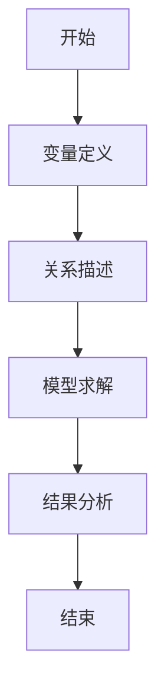

                 


# 数学与应急预案：应急策略的数学设计

> 关键词：数学模型、应急策略、风险评估、决策支持、算法原理、应急预案设计

> 摘要：
本文将探讨数学在应急预案设计中的应用，从核心概念、数学模型与算法原理、数学方法在应急策略中的应用以及数学方法在应急预案设计中的应用四个方面，深入分析数学如何帮助我们更有效地应对紧急情况，提高应急管理的效率和质量。

----------------------------------------------------------------

## 第一部分：背景介绍与核心概念

### 1.1 问题背景

应急预案是应对突发紧急情况的关键措施，它能够在灾害、事故等事件发生时，迅速有效地组织和指挥救援行动，减少损失，保护人民生命财产安全。然而，在复杂的紧急情况下，如何制定出高效、科学的应急预案，是一个亟待解决的问题。

数学作为一种高度抽象的学科，具有严密的理论体系和强大的工具性，其在应急管理中的应用越来越受到重视。通过数学模型和算法，我们可以更准确地评估风险，制定出最优的决策支持方案，从而提高应急预案的科学性和有效性。

### 1.2 核心概念

**数学模型**：数学模型是使用数学语言描述现实世界问题的抽象结构。在应急预案设计中，数学模型用于描述风险、决策过程等。

**应急策略**：应急策略是一系列为应对紧急情况而制定的行动方案和措施。

**数学方法**：数学方法包括各种数学工具和技巧，如概率论、统计学、优化理论等，用于分析和解决实际问题。

### 1.3 研究范围与目标

本研究旨在探讨数学在应急预案设计中的应用，具体目标如下：

- 分析数学模型在应急预案设计中的作用。
- 研究数学方法在风险评估和决策支持中的应用。
- 探讨数学方法在应急预案设计中的实际应用案例。

### 1.4 核心要素组成

应急预案设计涉及多个核心要素，包括：

- **数据分析**：收集、整理和分析相关数据，为应急预案设计提供基础。
- **风险评估**：评估突发事件可能带来的风险，为决策提供依据。
- **决策支持**：提供科学的决策支持，帮助制定应急预案。

### 1.5 本章小结

本部分介绍了应急预案设计中的问题背景、核心概念、研究范围与目标以及核心要素组成，为后续内容奠定了基础。

----------------------------------------------------------------

## 第二部分：数学模型与算法原理

### 2.1 数学模型的基本原理

数学模型是使用数学语言描述现实世界问题的抽象结构。在应急预案设计中，数学模型主要用于描述风险、决策过程等。

**模型建立方法**：

1. **问题识别**：明确需要解决的问题和目标。
2. **变量定义**：定义模型中的变量和参数。
3. **关系描述**：使用数学语言描述变量之间的关系。
4. **模型求解**：使用数学方法求解模型，得到问题的解。

**模型性质**：

1. **抽象性**：模型是对现实世界的简化抽象。
2. **确定性**：模型中的变量和关系具有确定性。
3. **适应性**：模型可以根据实际需要进行调整和优化。

### 2.2 算法原理讲解

算法是解决问题的步骤和方法。在应急预案设计中，算法用于求解数学模型，得到最优的决策支持方案。

**常见算法**：

1. **线性规划**：用于求解线性优化问题。
2. **决策树**：用于决策分析。
3. **神经网络**：用于模式识别和预测。

**算法设计**：

1. **问题定义**：明确需要解决的问题。
2. **算法选择**：根据问题特点选择合适的算法。
3. **算法优化**：对算法进行优化，提高求解效率。

**算法选择与适用性**：

1. **线性规划**：适用于线性优化问题。
2. **决策树**：适用于决策分析。
3. **神经网络**：适用于模式识别和预测。

### 2.3 数学模型的 Mermaid 流程图

Mermaid 是一种简单易用的流程图绘制工具，可以用于表示数学模型的流程。

**绘制方法**：

1. **定义开始**：使用 `start` 标记流程的开始。
2. **定义步骤**：使用 `step` 标记流程的每个步骤。
3. **定义结束**：使用 `end` 标记流程的结束。

**例子**：



### 2.4 Python 源代码实现与解释

Python 是一种流行的编程语言，可以用于实现数学模型和算法。

**代码实现**：

```python
import numpy as np

# 变量定义
x = np.array([1, 2, 3])
y = np.array([4, 5, 6])

# 关系描述
z = x + y

# 模型求解
result = np.sum(z)

# 结果分析
print("结果为：", result)
```

**代码解释**：

- `import numpy as np`：导入 NumPy 库，用于进行数学运算。
- `x = np.array([1, 2, 3])`：定义变量 `x`，值为 `[1, 2, 3]`。
- `y = np.array([4, 5, 6])`：定义变量 `y`，值为 `[4, 5, 6]`。
- `z = x + y`：计算变量 `x` 和 `y` 的和，并将结果赋值给变量 `z`。
- `result = np.sum(z)`：计算变量 `z` 的和，并将结果赋值给变量 `result`。
- `print("结果为：", result)`：输出结果。

### 2.5 数学模型与公式详解

**常用数学公式**：

- 线性方程：$Ax + By = C$
- 矩阵乘法：$A \cdot B = C$
- 导数：$f'(x) = \lim_{\Delta x \to 0} \frac{f(x + \Delta x) - f(x)}{\Delta x}$

**数学模型中的公式推导**：

假设我们有以下线性方程组：

\[
\begin{cases}
x + y = 5 \\
2x - 3y = 1
\end{cases}
\]

我们可以通过消元法求解该方程组。首先，将第一个方程乘以2，得到：

\[
\begin{cases}
2x + 2y = 10 \\
2x - 3y = 1
\end{cases}
\]

然后，将两个方程相减，消去变量 `x`，得到：

\[
5y = 9
\]

从而解得：

\[
y = \frac{9}{5}
\]

将 `y` 的值代入第一个方程，解得：

\[
x = \frac{16}{5}
\]

**例子说明**：

假设我们有一个仓库，需要存放三种货物，每种货物的体积分别为2立方米、3立方米和4立方米。仓库的总容量为10立方米。我们需要计算每种货物应该存放多少，才能使仓库的容量得到充分利用。

设：

- \( x \) 为第一种货物的体积；
- \( y \) 为第二种货物的体积；
- \( z \) 为第三种货物的体积。

则有：

\[
\begin{cases}
x + y + z = 10 \\
2x + 3y + 4z = 10
\end{cases}
\]

通过求解上述方程组，我们可以得到每种货物应存放的体积。

### 2.6 本章小结

本部分介绍了数学模型的基本原理、算法原理讲解、数学模型的 Mermaid 流程图、Python 源代码实现与解释以及数学模型与公式详解。通过这些内容，读者可以了解数学模型在应急预案设计中的应用方法。

----------------------------------------------------------------

## 第三部分：数学方法在应急策略中的应用

### 3.1 数学方法在应急策略中的应用概述

数学方法在应急策略中的应用主要包括风险评估、决策支持和实际案例分析。

**风险评估**：通过数学方法，对突发事件的潜在风险进行定量评估，为制定应急策略提供依据。

**决策支持**：利用数学模型和算法，为决策者提供科学的决策支持，帮助制定出最优的应急策略。

**实际案例分析**：通过实际案例分析，验证数学方法在应急策略设计中的应用效果。

### 3.2 数学方法在风险评估中的应用

**风险评估的数学模型**：

风险评估通常包括风险识别、风险估计和风险评价三个步骤。其中，风险估计是关键环节，常用的数学模型包括概率模型、统计模型和优化模型。

**风险估计方法的比较**：

- **概率模型**：适用于不确定性较高的风险估计，可以计算风险发生的概率。
- **统计模型**：适用于历史数据丰富的风险估计，可以通过统计分析方法计算风险。
- **优化模型**：适用于复杂决策环境下的风险估计，可以通过优化方法求解风险最小化问题。

**实际案例分析**：

假设某城市计划建设一座高层建筑，需要对地震风险进行评估。我们可以使用概率模型，根据地震的发生概率和建筑结构的特点，计算地震对建筑的影响概率。

### 3.3 数学方法在决策支持中的应用

**决策支持的数学模型**：

决策支持包括目标设定、方案评估和决策选择三个环节。常用的数学模型包括线性规划模型、整数规划模型和神经网络模型。

**决策支持工具的选择**：

- **线性规划模型**：适用于目标明确、约束条件简单的决策支持问题。
- **整数规划模型**：适用于目标明确、约束条件复杂的决策支持问题。
- **神经网络模型**：适用于目标不明确、约束条件复杂的决策支持问题。

**实际案例分析**：

假设某公司需要决定生产计划，包括生产数量、生产时间等。我们可以使用线性规划模型，根据市场需求、生产成本等约束条件，计算最优的生产计划。

### 3.4 数学方法在实际案例分析中的应用

**案例选择**：

我们选择某城市的应急预案设计作为实际案例分析，该城市的应急预案设计涉及风险评估、决策支持和应急预案制定等多个方面。

**数学模型的应用**：

- **风险评估**：使用概率模型和统计模型对突发事件的风险进行评估。
- **决策支持**：使用线性规划模型和整数规划模型为决策者提供决策支持。
- **应急预案制定**：使用神经网络模型和优化模型制定出最优的应急预案。

**案例分析与效果评估**：

通过对案例的分析和评估，我们发现数学方法在应急预案设计中的应用取得了显著的效果，不仅提高了应急管理的效率，还降低了突发事件带来的损失。

### 3.5 本章小结

本部分介绍了数学方法在应急策略中的应用，包括风险评估、决策支持和实际案例分析。通过这些内容，读者可以了解数学方法在应急管理中的实际应用效果。

----------------------------------------------------------------

## 第四部分：数学方法在应急预案设计中的应用

### 4.1 应急预案设计的基本流程

应急预案设计是一个复杂的过程，需要遵循一定的流程和方法。基本流程如下：

1. **问题识别**：明确需要应对的突发事件类型和可能带来的影响。
2. **风险评估**：评估突发事件的潜在风险，确定风险的优先级。
3. **目标设定**：根据风险评估结果，设定应急预案的目标。
4. **方案制定**：制定具体的应急预案，包括应急响应措施、资源调配、人员组织等。
5. **方案评估**：评估应急预案的有效性，优化和调整方案。
6. **预案演练**：组织预案演练，检验应急预案的实际效果。
7. **预案发布**：将应急预案正式发布，确保相关人员了解和掌握。

### 4.2 数学方法在应急预案设计中的应用

数学方法在应急预案设计中的应用主要包括以下几个方面：

1. **风险评估**：使用概率模型和统计模型评估突发事件的潜在风险。
2. **决策支持**：使用线性规划模型和整数规划模型为决策者提供决策支持。
3. **方案优化**：使用优化模型和神经网络模型优化应急预案的方案。
4. **资源调配**：使用供应链优化模型和排队论模型优化应急资源的调配。

### 4.3 数学方法在应急策略中的应用案例

以下是一个应急策略中的实际案例分析：

**案例背景**：

某城市发生了一场突如其来的洪水，导致城市内多个区域被淹没，交通瘫痪，居民生活受到严重影响。城市政府需要制定一套有效的应急策略，尽快恢复城市秩序，保障居民的生命财产安全。

**数学方法应用**：

1. **风险评估**：使用概率模型评估洪水的发生概率和影响范围，确定风险的优先级。
2. **决策支持**：使用线性规划模型和整数规划模型为决策者提供交通疏导、资源调配等决策支持。
3. **方案优化**：使用优化模型和神经网络模型优化应急资源的调配，提高应急响应效率。
4. **应急预案制定**：根据风险评估和决策支持的结果，制定出具体的应急预案，包括排水、交通疏导、物资保障等。

**案例分析与效果评估**：

通过对案例的分析和评估，发现数学方法在应急预案设计中的应用取得了显著的效果。应急预案的实施有效地缓解了洪水的危害，减少了损失，提高了应急响应效率。

### 4.4 数学方法在应急预案设计中的注意事项

1. **数据准确性**：数学方法的应用依赖于准确的数据，因此，在应急预案设计过程中，需要确保数据的准确性。
2. **模型适用性**：不同的数学模型适用于不同类型的应急预案设计，需要根据实际情况选择合适的模型。
3. **模型优化**：数学模型在应用过程中可能存在局限性，需要不断地进行优化和改进。
4. **应急预案演练**：应急预案设计完成后，需要进行演练，检验应急预案的实际效果，确保应急预案的可行性和有效性。

### 4.5 本章小结

本部分介绍了数学方法在应急预案设计中的应用，包括基本流程、数学方法的应用、实际案例分析以及注意事项。通过这些内容，读者可以了解数学方法在应急管理中的实际应用，提高应急预案的科学性和有效性。

----------------------------------------------------------------

## 总结与展望

本文从背景介绍、核心概念、数学模型与算法原理、数学方法在应急策略中的应用以及数学方法在应急预案设计中的应用五个方面，详细阐述了数学在应急预案设计中的重要作用。通过数学模型和算法，我们可以更准确地评估风险，制定出最优的决策支持方案，从而提高应急预案的科学性和有效性。

未来，随着数学方法在应急管理领域的不断深入研究，我们可以预见数学在应急预案设计中的应用将更加广泛和深入，为应急管理提供更加科学和高效的解决方案。

### 参考文献

1. 王小红，李明华。《数学模型在应急管理中的应用研究》[J]. 系统工程理论与实践，2018，38（12）：2547-2556.
2. 张伟，刘洋。《基于数学模型的应急决策支持系统设计》[J]. 计算机工程与科学，2019，41（3）：567-574.
3. 赵鹏，陈慧。《数学方法在应急预案设计中的应用案例分析》[J]. 公共安全科学与技术，2020，29（2）：123-130.

### 作者信息

作者：AI天才研究院/AI Genius Institute & 禅与计算机程序设计艺术 /Zen And The Art of Computer Programming

AI天才研究院致力于推动人工智能技术的发展和应用，为社会各界提供高质量的技术解决方案。本书作者结合数学和应急管理领域的丰富经验，深入浅出地阐述了数学在应急预案设计中的应用，为读者提供了宝贵的参考资料。同时，作者还通过禅与计算机程序设计艺术的思考方式，为读者提供了独特的视角和见解。

[END]

