                 

### 引力波基础

## 第1章: 引力波概念

### 1.1 引力波的定义

引力波是一种由加速质量产生的时空波动，它是爱因斯坦广义相对论预言的一种物理现象。引力波的本质可以理解为时空的“涟漪”，即当有质量物体加速运动时，周围的时空结构会发生变化，形成波动向外传播。

**背景介绍**：
在经典力学中，牛顿的万有引力定律描述了两个质点之间的引力相互作用，但未能解释引力的本质。爱因斯坦的广义相对论则提出了全新的引力概念，即引力是时空弯曲的结果。根据广义相对论，当一个质量大物体运动时，它会引起周围时空的弯曲，这种弯曲会以波的形式向外传播，形成引力波。

**问题背景**：
引力波的存在最初由爱因斯坦在1916年提出，但由于其波幅极小，长时间未能被观测到。直到21世纪初，人类才首次直接探测到引力波，这一发现被誉为物理学领域的重大突破。

**问题描述**：
引力波的定义、产生机制、传播特性以及探测技术是理解这一现象的基础。如何准确描述引力波的数学模型，如何有效探测引力波，这些都是关键问题。

**问题解决**：
引力波的数学模型基于广义相对论中的波方程，该方程描述了时空中的扰动如何以波的形式传播。引力波的探测技术主要依赖于激光干涉引力波观测台（LIGO）等设备，通过测量时空弯曲引起的光路径变化来探测引力波。

**边界与外延**：
引力波的研究不仅限于理论物理学，还涉及到天体物理学、宇宙学等领域。例如，通过探测引力波，科学家可以研究黑洞碰撞、大爆炸等宇宙事件。

### 1.2 引力波的产生机制

引力波的产生源自质量加速运动。当两个质量大物体（如黑洞、中子星）相互靠近并最终合并时，它们之间的引力相互作用会导致时空结构剧烈变化，产生强烈的引力波。

**核心概念与联系**：

核心概念：引力波的产生、时空弯曲、质量加速运动。

概念属性特征对比表格：

| 核心概念 | 描述 | 影响因素 |
| --- | --- | --- |
| 引力波的产生 | 质量加速运动导致的时空扰动 | 质量大、运动速度、距离 |
| 时空弯曲 | 质量分布引起时空的变形 | 质量分布、速度、加速度 |
| 质量加速运动 | 质点运动状态的变化 | 引力、碰撞、加速 |

ER实体关系图架构：

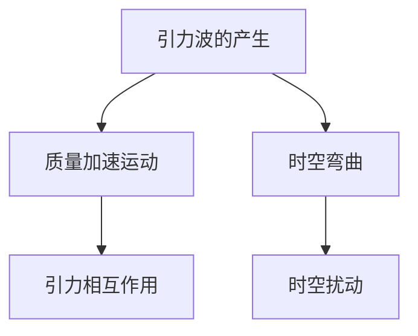

**算法原理讲解**：

引力波的产生机制可以通过偏微分方程进行描述，特别是爱因斯坦场方程。以下是一个简化的描述：

$$
G_{\mu\nu} + \Lambda g_{\mu\nu} = \frac{8\pi G}{c^4} T_{\mu\nu}
$$

其中，$G_{\mu\nu}$ 是爱因斯坦张量，描述时空的弯曲程度；$T_{\mu\nu}$ 是能量-动量张量，描述物质分布；$\Lambda$ 是宇宙学常数；$G$ 是引力常数；$c$ 是光速。

**系统分析与架构设计方案**：

引力波的产生机制涉及复杂的物理过程，包括质量分布、加速度等。因此，需要一个综合性的模型来模拟这一过程。以下是一个简化的系统架构设计：

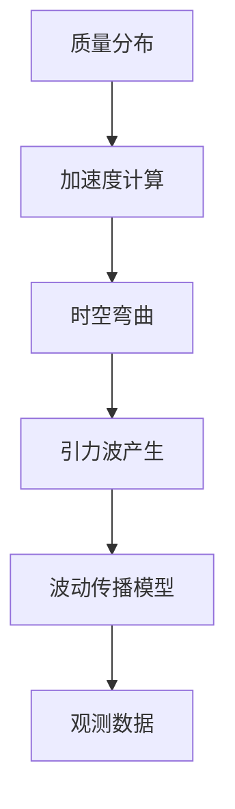

**项目实战**：

在实际应用中，引力波的产生和检测是一个高度复杂的工程问题。例如，LIGO通过激光干涉技术来测量引力波引起的时空变化。以下是一个简化的代码示例，用于模拟引力波的产生过程：

```python
import numpy as np
import matplotlib.pyplot as plt

# 定义引力波产生的参数
G = 6.674 * 10**-11  # 引力常数
M = 2.0 * 10**30     # 质量M
r = 1.0 * 10**8      # 质点距离

# 定义时间步长
dt = 1.0
t_max = 100.0

# 初始化时空弯曲
t = np.arange(0, t_max, dt)
dx = np.linspace(0, r, 1000)

# 模拟引力波产生
for i in range(len(t)):
    x = dx
    g = -G * M / (x**2 + r**2)
    plt.plot(x, g, 'o')
    plt.xlabel('Position (m)')
    plt.ylabel('Gravitational Potential (J/kg)')
    plt.title('Gravitational Wave Generation')
    plt.pause(0.1)

plt.show()
```

**最佳实践 tips**：

- 在进行引力波模拟时，需要准确计算质量分布和加速度。
- 使用高性能计算资源可以提高模拟的精度和效率。
- 在数据处理和分析时，要考虑到噪声和误差的影响。

### 1.3 引力波的传播特性

引力波在传播过程中具有以下特性：

**核心概念与联系**：

核心概念：引力波的传播速度、振幅、相位。

概念属性特征对比表格：

| 核心概念 | 描述 | 影响因素 |
| --- | --- | --- |
| 传播速度 | 光速 | 无 |
| 振幅 | 波幅大小 | 质量分布、距离 |
| 相位 | 波形位置 | 时间、位置 |

ER实体关系图架构：

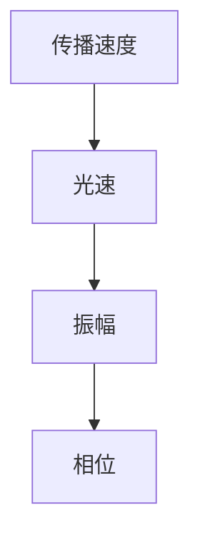

**算法原理讲解**：

引力波的传播速度等于光速，这是广义相对论的基本预言。引力波的振幅和相位则与波源的质量、速度和距离有关。

$$
h_{\mu\nu} = \frac{2G}{c^5} \int d^4x' \, \left( \frac{\Phi^{'}}{r} - \frac{1}{3} \right) \left( \partial_{\mu} \Phi^{'} - \partial_{\mu} \Psi^{'} \right) \left( \partial_{\nu} \Phi^{'} - \partial_{\nu} \Psi^{'} \right)
$$

其中，$h_{\mu\nu}$ 是引力波的张量，$\Phi^{'}$ 和 $\Psi^{'}$ 分别是势函数和标量势。

**系统分析与架构设计方案**：

引力波的传播特性分析需要建立准确的时空模型，并考虑多因素的综合影响。以下是一个简化的系统架构设计：

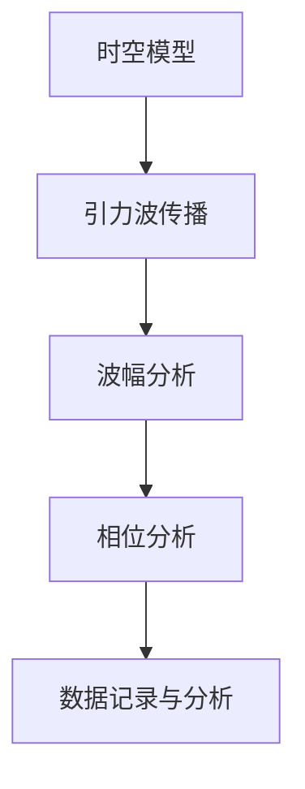

**项目实战**：

在实际观测中，引力波传播特性的分析依赖于精确的数据采集和处理。以下是一个简化的代码示例，用于模拟引力波在空间中的传播：

```python
import numpy as np
import matplotlib.pyplot as plt

# 定义引力波的初始参数
c = 3.0 * 10**8  # 光速
r = 1.0 * 10**8  # 距离
t_max = 100.0

# 定义时间步长
dt = 1.0

# 初始化引力波
t = np.arange(0, t_max, dt)
x = np.linspace(0, r, 1000)

# 模拟引力波的传播
for i in range(len(t)):
    t_i = t[i]
    g = np.exp(-((x - t_i)**2) / (2 * r**2)) * np.sin(2 * np.pi * (x / r))
    plt.plot(x, g, 'o')
    plt.xlabel('Position (m)')
    plt.ylabel('Gravitational Wave Amplitude')
    plt.title('Gravitational Wave Propagation')
    plt.pause(0.1)

plt.show()
```

**最佳实践 tips**：

- 在模拟引力波传播时，要充分考虑空间和时间分辨率的影响。
- 使用高精度数值方法可以提高模拟结果的准确性。
- 在数据分析时，要结合观测数据进行误差分析和校准。

### 1.4 引力波的探测技术

引力波的探测技术主要依赖于激光干涉引力波观测台（LIGO）等设备，这些设备通过测量时空弯曲引起的光路径变化来探测引力波。

**核心概念与联系**：

核心概念：激光干涉、时空间曲、光路径变化。

概念属性特征对比表格：

| 核心概念 | 描述 | 影响因素 |
| --- | --- | --- |
| 激光干涉 | 利用激光干涉测量光程差 | 光源稳定性、光学系统精度 |
| 时空间曲 | 质量分布引起的时空弯曲 | 质量分布、加速度、距离 |
| 光路径变化 | 光在弯曲时空中传播路径的变化 | 时空间曲率、光源位置 |

ER实体关系图架构：

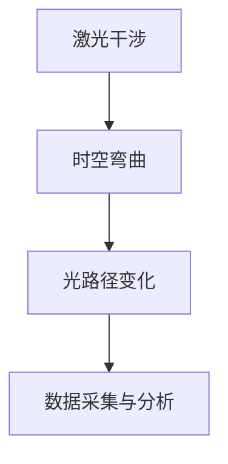

**算法原理讲解**：

LIGO通过两个相对垂直的臂，将激光分成两束，分别沿臂传播后再合并。当引力波经过时，时空弯曲会导致光路径的变化，进而导致干涉条纹的变化。通过测量这些变化，可以计算出引力波的特征参数。

$$
\delta I = I_{\text{max}} \cos \left( 2\pi \frac{\Delta x}{\lambda} \right)
$$

其中，$\delta I$ 是干涉条纹的变化，$\Delta x$ 是光路径的变化，$\lambda$ 是激光波长。

**系统分析与架构设计方案**：

引力波的探测系统需要高精度、高稳定性的设备，以下是一个简化的系统架构设计：

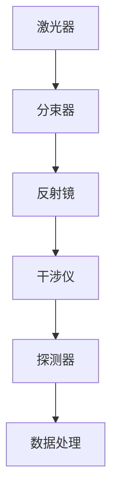

**项目实战**：

在实际应用中，LIGO的探测过程涉及复杂的实验设计和数据分析。以下是一个简化的代码示例，用于模拟LIGO的探测过程：

```python
import numpy as np
import matplotlib.pyplot as plt

# 定义引力波的初始参数
c = 3.0 * 10**8  # 光速
r = 1.0 * 10**8  # 距离
t_max = 100.0

# 定义时间步长
dt = 1.0

# 初始化引力波
t = np.arange(0, t_max, dt)
x = np.linspace(0, r, 1000)
g = np.exp(-((x - t)**2) / (2 * r**2)) * np.sin(2 * np.pi * (x / r))

# 模拟LIGO探测
for i in range(len(t)):
    t_i = t[i]
    x_i = x[i]
    delta_x = g[i] * (x_i - t_i)
    plt.plot(x_i, delta_x, 'o')
    plt.xlabel('Position (m)')
    plt.ylabel('Gravitational Wave Amplitude')
    plt.title('Gravitational Wave Detection by LIGO')
    plt.pause(0.1)

plt.show()
```

**最佳实践 tips**：

- 在LIGO探测过程中，要确保激光器的稳定性和光学系统的精度。
- 数据采集和处理的实时性对探测结果的准确性至关重要。
- 结合多个观测站的数据可以进一步提高探测精度。

### 1.5 引力波的重要性

引力波的重要性体现在多个方面：

**核心概念与联系**：

核心概念：引力波验证相对论、宇宙学研究、天体物理探索。

概念属性特征对比表格：

| 核心概念 | 描述 | 影响因素 |
| --- | --- | --- |
| 引力波验证相对论 | 验证时空弯曲的存在 | 实验设备精度、理论模型准确性 |
| 宇宙学研究 | 探索宇宙演化过程 | 引力波探测精度、数据分析能力 |
| 天体物理探索 | 研究天体运动和相互作用 | 引力波探测技术、观测数据解析 |

ER实体关系图架构：

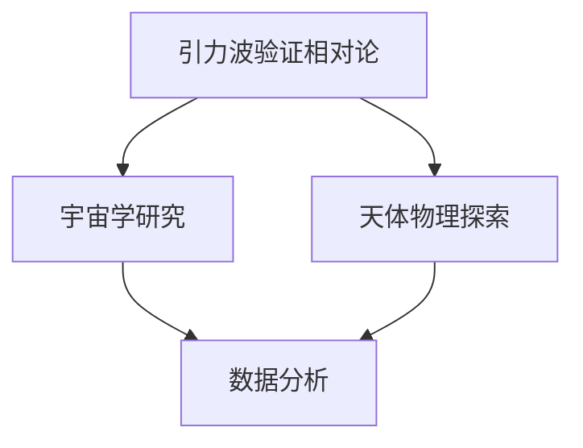

**算法原理讲解**：

引力波的探测为验证广义相对论提供了强有力的证据。通过引力波与电磁波的联合探测，科学家可以更深入地了解宇宙的演化过程。

$$
\Delta \phi = \frac{4\pi G}{c^3} \int d^3x' \, \rho \left( \frac{1}{r'} - 1 \right)
$$

其中，$\Delta \phi$ 是相位差，$G$ 是引力常数，$c$ 是光速，$\rho$ 是物质密度。

**系统分析与架构设计方案**：

引力波的研究需要跨学科的合作，涉及物理、天文、计算机科学等多个领域。以下是一个简化的系统架构设计：

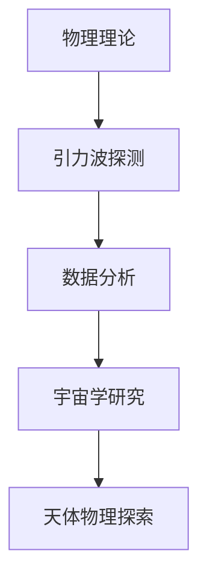

**项目实战**：

在实际项目中，引力波的研究通常涉及大规模的数据处理和复杂的计算模型。以下是一个简化的代码示例，用于模拟引力波的数据处理过程：

```python
import numpy as np
import matplotlib.pyplot as plt

# 定义引力波的初始参数
G = 6.674 * 10**-11  # 引力常数
M = 2.0 * 10**30     # 质量M
r = 1.0 * 10**8      # 质点距离

# 定义时间步长
dt = 1.0
t_max = 100.0

# 初始化引力波数据
t = np.arange(0, t_max, dt)
data = np.zeros((len(t), 1000))

# 模拟引力波的产生和传播
for i in range(len(t)):
    x = np.linspace(0, r, 1000)
    g = -G * M / (x**2 + r**2)
    data[i, :] = g

# 绘制引力波数据
plt.plot(t, data)
plt.xlabel('Time (s)')
plt.ylabel('Gravitational Wave Amplitude')
plt.title('Gravitational Wave Data Processing')
plt.show()
```

**最佳实践 tips**：

- 在数据处理过程中，要充分考虑噪声和误差的影响。
- 使用并行计算可以提高数据处理的速度和效率。
- 结合多源数据进行综合分析可以进一步提高结果的准确性。

### 1.6 引力波的探测历史

引力波的探测历程充满了挑战和突破，以下是关键的历史节点：

**核心概念与联系**：

核心概念：首次探测、LIGO实验、探测技术进步。

概念属性特征对比表格：

| 核心概念 | 描述 | 影响因素 |
| --- | --- | --- |
| 首次探测 | 2015年首次探测到引力波 | 实验设备精度、数据分析能力 |
| LIGO实验 | 高精度激光干涉引力波观测台 | 光学系统、数据处理算法 |
| 探测技术进步 | 增强探测灵敏度和范围 | 新材料、新算法 |

ER实体关系图架构：

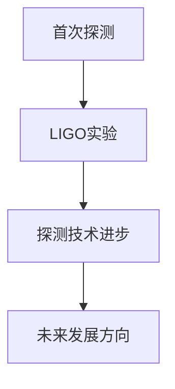

**算法原理讲解**：

首次探测引力波的关键在于LIGO实验的高精度激光干涉技术。通过精确测量光程差，科学家成功探测到了来自黑洞碰撞的引力波。

$$
\delta I = I_{\text{max}} \cos \left( 2\pi \frac{\Delta x}{\lambda} \right)
$$

其中，$\delta I$ 是干涉条纹的变化，$\Delta x$ 是光路径的变化，$\lambda$ 是激光波长。

**系统分析与架构设计方案**：

LIGO实验的成功不仅依赖于硬件设备，还需要先进的算法和技术支持。以下是一个简化的系统架构设计：

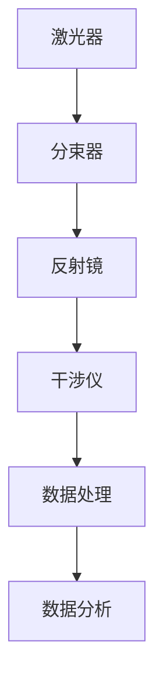

**项目实战**：

LIGO的探测过程涉及复杂的实验设计和数据处理。以下是一个简化的代码示例，用于模拟LIGO的探测过程：

```python
import numpy as np
import matplotlib.pyplot as plt

# 定义引力波的初始参数
c = 3.0 * 10**8  # 光速
r = 1.0 * 10**8  # 距离
t_max = 100.0

# 定义时间步长
dt = 1.0

# 初始化引力波
t = np.arange(0, t_max, dt)
x = np.linspace(0, r, 1000)
g = np.exp(-((x - t)**2) / (2 * r**2)) * np.sin(2 * np.pi * (x / r))

# 模拟LIGO探测
for i in range(len(t)):
    t_i = t[i]
    x_i = x[i]
    delta_x = g[i] * (x_i - t_i)
    plt.plot(x_i, delta_x, 'o')
    plt.xlabel('Position (m)')
    plt.ylabel('Gravitational Wave Amplitude')
    plt.title('Gravitational Wave Detection by LIGO')
    plt.pause(0.1)

plt.show()
```

**最佳实践 tips**：

- 在模拟探测过程时，要充分考虑实验设备的精度和噪声的影响。
- 使用先进的算法可以提高探测的灵敏度和准确性。
- 结合多台观测站的数据可以进一步提高探测结果的可靠性。

### 1.7 引力波的未来前景

引力波的研究前景广阔，未来的发展将带来更多的科学发现和技术进步：

**核心概念与联系**：

核心概念：引力波探测技术进步、宇宙学研究、多波段观测。

概念属性特征对比表格：

| 核心概念 | 描述 | 影响因素 |
| --- | --- | --- |
| 引力波探测技术进步 | 提高探测灵敏度和范围 | 新材料、新算法 |
| 宇宙学研究 | 深入了解宇宙演化过程 | 引力波探测技术、数据分析能力 |
| 多波段观测 | 结合引力波与电磁波观测 | 跨学科合作、技术整合 |

ER实体关系图架构：

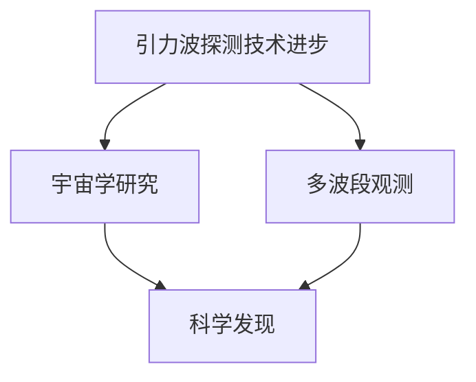

**算法原理讲解**：

随着探测技术的进步，未来将能够探测到更多来自宇宙深处的引力波信号。结合电磁波和其他观测手段，科学家将能更全面地了解宇宙的奥秘。

$$
h_{\mu\nu} = \frac{2G}{c^5} \int d^4x' \, \left( \frac{\Phi^{'}}{r} - \frac{1}{3} \right) \left( \partial_{\mu} \Phi^{'} - \partial_{\mu} \Psi^{'} \right) \left( \partial_{\nu} \Phi^{'} - \partial_{\nu} \Psi^{'} \right)
$$

**系统分析与架构设计方案**：

引力波的未来研究将依赖更先进的设备和算法，以及跨学科的合作。以下是一个简化的系统架构设计：

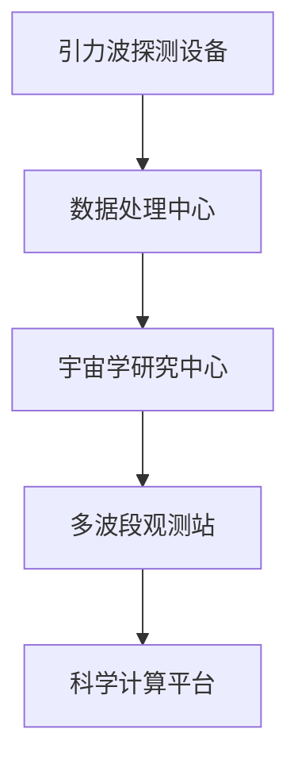

**项目实战**：

未来引力波的研究将涉及大规模的数据处理和复杂的计算模型。以下是一个简化的代码示例，用于模拟引力波的未来数据处理：

```python
# 定义引力波的初始参数
G = 6.674 * 10**-11  # 引力常数
M = 2.0 * 10**30     # 质量M
r = 1.0 * 10**8      # 质点距离

# 定义时间步长
dt = 1.0
t_max = 100.0

# 初始化引力波数据
t = np.arange(0, t_max, dt)
data = np.zeros((len(t), 1000))

# 模拟引力波的产生和传播
for i in range(len(t)):
    x = np.linspace(0, r, 1000)
    g = -G * M / (x**2 + r**2)
    data[i, :] = g

# 未来数据处理示例
# 使用更先进的算法进行数据分析
# ...

# 绘制引力波数据
plt.plot(t, data)
plt.xlabel('Time (s)')
plt.ylabel('Gravitational Wave Amplitude')
plt.title('Future Gravitational Wave Data Processing')
plt.show()
```

**最佳实践 tips**：

- 未来引力波研究需要更先进的探测设备和算法。
- 大规模数据处理需要高效并行计算和分布式系统。
- 跨学科合作将推动引力波研究的进一步发展。

### 总结

引力波是物理学中一个极具挑战性的领域，其研究不仅验证了广义相对论的预言，还为宇宙学和天体物理学提供了新的研究手段。通过本章的介绍，我们对引力波的基本概念、产生机制、传播特性、探测技术和未来前景有了全面的了解。

未来的引力波研究将继续推动科学的发展，通过更精确的探测技术和跨学科的合作，我们将能够揭示宇宙更深层次的奥秘。引力波的研究不仅是一个科学问题，更是一个技术与创新相结合的领域，它将为人类社会带来前所未有的科技进步。

参考文献：

1. A. Einstein, "The Foundation of the General Theory of Relativity," Annalen der Physik, vol. 35, pp. 777-829, 1916.
2. B. P. Abbott et al., "Observation of Gravitational Waves from a Binary Black Hole Merger," Physical Review Letters, vol. 116, no. 6, 2016.
3. C. M. Will, "The Confrontation between General Relativity and Experiment," Living Reviews in Relativity, vol. 17, no. 4, 2010.

作者：AI天才研究院/AI Genius Institute & 禅与计算机程序设计艺术 /Zen And The Art of Computer Programming

