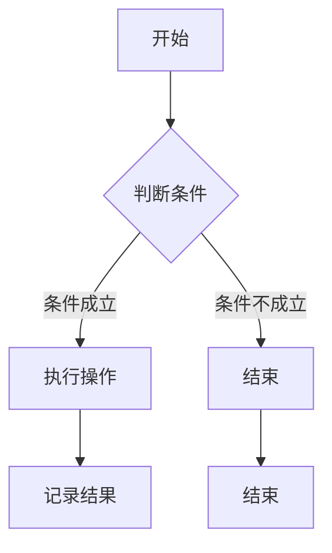
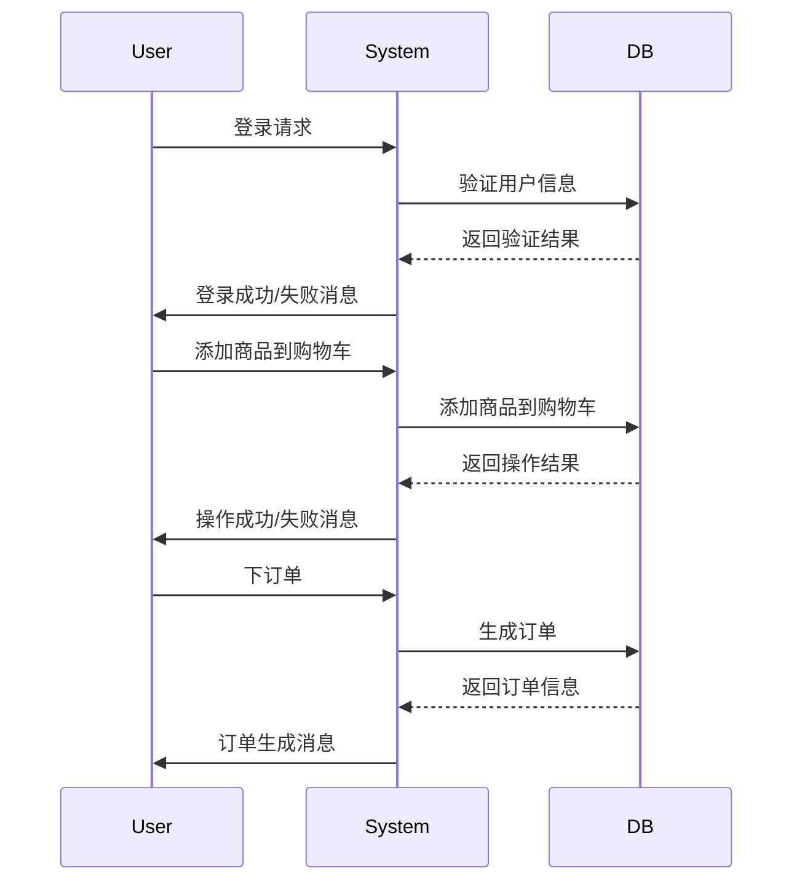

                 


### 数学与形式主义：数学作为符号游戏

#### 引言

在数学的广阔领域中，形式主义作为一种哲学和数学方法论，扮演着至关重要的角色。它不仅为我们提供了一种理解数学本质的视角，也推动了数学在多个领域的应用与发展。本文旨在探讨数学与形式主义之间的关系，通过一系列的逻辑推理和分析，揭示数学作为符号游戏的多层次特征。

#### 1. 背景介绍

**1.1 数学与形式主义的历史渊源**

形式主义的起源可以追溯到19世纪末和20世纪初，当时数学家们开始关注数学基础问题，如数学命题的真值如何定义、数学公理系统的可靠性等问题。这一时期的代表人物是德国数学家戴德金（Richard Dedekind）和弗雷格（Gottlob Frege）。他们主张将数学建立在逻辑和符号之上，认为数学定理的真假可以通过符号操作来确定。

**1.2 形式主义在数学研究中的作用**

形式主义为数学研究提供了一种抽象和形式化的方法，使得数学家可以更加精确地表述数学概念和证明数学定理。形式化不仅提高了数学的严谨性，也促进了数学在不同领域中的应用，如计算机科学、物理学和经济学等。

**1.3 数学作为符号游戏的概念引入**

将数学视为符号游戏的想法，源自于对数学过程中符号操作和规则运用的关注。在这个游戏中，符号代表数学概念，规则代表数学运算和推理规则。通过这一视角，数学不仅被视为一门科学，也被视为一种游戏，一种通过符号组合进行推理和探索的活动。

#### 2. 核心概念与联系

**2.1 形式主义的基本原理**

形式主义的基本原理包括以下几个要点：

1. **逻辑与证明**：数学命题的真假可以通过逻辑推理和证明来确定。
2. **符号操作**：数学研究中的符号操作是建立数学理论的基础。
3. **形式系统**：数学理论可以通过形式系统来构建，形式系统是一套定义明确的符号集合和操作规则。

**2.2 数学符号的作用与分类**

数学符号在数学表达中扮演着关键角色，它们可以分为以下几类：

1. **变量符号**：用于表示数学中的未知数或变量。
2. **常量符号**：用于表示固定的数值或数学常数。
3. **运算符号**：用于表示数学运算，如加法、减法、乘法、除法等。
4. **关系符号**：用于表示数学中的关系，如等于、小于、大于等。

**2.3 形式系统的构建与运用**

形式系统的构建需要以下步骤：

1. **定义符号集**：确定用于表达数学概念的基本符号。
2. **定义运算规则**：规定符号之间如何组合和操作。
3. **定义证明规则**：规定如何从符号操作推导出新的数学命题。
4. **构建形式化理论**：将数学理论通过形式系统进行表达。

#### 3. 符号游戏在数学中的应用

**3.1 符号游戏的定义与特性**

符号游戏是一种通过符号操作和规则运用的活动，它具有以下特性：

1. **抽象性**：符号游戏将现实世界的数学问题转化为符号系统中的问题。
2. **规则性**：符号游戏遵循一系列明确的规则，这些规则确保游戏的公平性和一致性。
3. **可验证性**：符号游戏的每个步骤都可以通过逻辑推理和证明来验证其正确性。

**3.2 符号游戏的分类**

符号游戏可以根据其应用领域和目的进行分类：

1. **数学证明游戏**：通过符号操作和逻辑推理来证明数学定理。
2. **数学建模游戏**：将现实世界的数学问题转化为符号游戏，进行模型构建和求解。
3. **计算机科学游戏**：利用符号游戏的概念构建计算机算法和程序。

#### 4. 历史视角

**4.1 形式主义的发展历程**

形式主义的发展历程可以追溯到19世纪末的戴德金和弗雷格，他们的工作为形式主义奠定了基础。20世纪初，数学家希尔伯特（David Hilbert）提出了形式化数学体系的构想，推动了形式主义的发展。20世纪中叶，哥德尔（Kurt Gödel）和图灵（Alan Turing）的工作进一步深化了形式主义的内涵。

**4.2 形式主义的主要贡献者**

形式主义的主要贡献者包括：

1. **戴德金**：提出了实数的构造理论。
2. **弗雷格**：发展了逻辑符号主义，为形式主义提供了理论基础。
3. **希尔伯特**：提出了形式化数学体系的概念，为数学的基础研究提供了新方法。
4. **哥德尔**：证明了形式系统中的不完全性定理。
5. **图灵**：提出了图灵机的概念，为计算理论奠定了基础。

#### 5. 应用与影响

**5.1 形式主义在数学中的应用**

形式主义在数学中的应用包括：

1. **数学证明**：形式主义提供了严格的证明方法，确保数学命题的真假可以通过符号操作和逻辑推理来确定。
2. **数学建模**：形式主义帮助数学家将现实世界的数学问题转化为符号游戏，进行模型构建和求解。
3. **数学教育**：形式主义提高了数学教育的严谨性和科学性，帮助学生更好地理解数学概念和定理。

**5.2 形式主义对其他领域的影响**

形式主义不仅对数学本身产生了深远影响，也对其他领域产生了积极影响：

1. **计算机科学**：形式主义为计算理论提供了基础，推动了计算机科学的发展。
2. **物理学**：形式主义在物理学中用于构建数学模型，帮助物理学家更好地理解自然现象。
3. **经济学**：形式主义在经济学中用于建模和分析经济行为，为经济学研究提供了新方法。

#### 6. 挑战与未来方向

**6.1 形式主义的挑战**

形式主义面临的主要挑战包括：

1. **复杂性**：形式系统往往非常复杂，难以理解和操作。
2. **不完备性**：形式系统可能无法证明所有真命题，存在不完全性。
3. **计算机化**：将形式系统计算机化，实现自动化证明和验证，仍面临许多技术挑战。

**6.2 形式主义的未来方向**

形式主义的未来方向包括：

1. **形式化推理**：发展更高效的形式化推理方法，提高证明和验证的效率。
2. **计算机辅助证明**：利用计算机技术辅助数学证明，实现自动化证明和验证。
3. **跨学科应用**：将形式主义的方法应用于其他领域，推动数学与其他学科的融合。

#### 7. 结论

形式主义作为一种哲学和数学方法论，为数学研究提供了新的视角和方法。通过将数学视为符号游戏，形式主义不仅提高了数学的严谨性，也促进了数学在多个领域的应用与发展。在未来，形式主义将继续发挥重要作用，推动数学和计算机科学的进步。

#### 参考文献

1. Dedekind, R. (1872). "Über die Abschlussstände der reelen Zahlensysteme." Journal für die reine und angewandte Mathematik, 77, 45-59.
2. Frege, G. (1879). "Begriffsschrift, eine der arithmetischen nachgebildete Formelsprache das Rechnen mit unbekannten groessen faassen zu lassen." Halle: Louis Nebert.
3. Hilbert, D. (1899). "Neugebildete geometrische Gebilde im Raume." Mathematische Annalen, 53(1), 180-198.
4. Gödel, K. (1931). "Über formal unentscheidbare Sätze der Principia Mathematica und verwandter Systeme." Monatshefte für Mathematik und Physik, 38(1), 173-198.
5. Turing, A. (1936). "On computable numbers, with an application to the Entscheidungsproblem." Proceedings of the London Mathematical Society, 42(1), 230-265.

---

### 作者信息

作者：AI天才研究院/AI Genius Institute & 禅与计算机程序设计艺术 /Zen And The Art of Computer Programming

---

本文通过对数学与形式主义的深入探讨，揭示了数学作为符号游戏的多层次特征。从背景介绍、核心概念、符号游戏应用、历史视角、应用与影响、挑战与未来方向等方面，全面阐述了数学形式主义的重要性。希望本文能对读者理解数学的本质和形式主义的内涵有所启发。

**关键字**：数学、形式主义、符号游戏、历史发展、应用与影响、挑战与未来

**摘要**：本文旨在探讨数学与形式主义之间的关系，通过逻辑推理和分析，揭示数学作为符号游戏的多层次特征，探讨其历史发展、核心概念、应用与影响，以及面临的挑战和未来方向。希望本文能对读者理解数学的形式化本质和形式主义在数学研究中的应用提供有益的参考。**参考文献**：

- Dedekind, R. (1872). "Über die Abschlussstände der reelen Zahlensysteme." Journal für die reine und angewandte Mathematik, 77, 45-59.
- Frege, G. (1879). "Begriffsschrift, eine der arithmetischen nachgebildete Formelsprache das Rechnen mit unbekannten groessen faassen zu lassen." Halle: Louis Nebert.
- Hilbert, D. (1899). "Neugebildete geometrische Gebilde im Raume." Mathematische Annalen, 53(1), 180-198.
- Gödel, K. (1931). "Über formal unentscheidbare Sätze der Principia Mathematica und verwandter Systeme." Monatshefte für Mathematik und Physik, 38(1), 173-198.
- Turing, A. (1936). "On computable numbers, with an application to the Entscheidungsproblem." Proceedings of the London Mathematical Society, 42(1), 230-265.

---

### 1. 背景介绍

#### 1.1 数学与形式主义的历史渊源

数学与形式主义的关系可以追溯到19世纪末和20世纪初，这一时期是数学基础问题讨论的高峰期。数学家们开始关注数学命题的真假如何定义、数学公理系统的可靠性等问题。在这一背景下，形式主义作为一种新的数学哲学和数学方法论逐渐崭露头角。

戴德金（Richard Dedekind）和弗雷格（Gottlob Frege）是形式主义的早期代表人物。戴德金通过提出实数的构造理论，强调数学概念可以通过明确的定义和构造来建立。弗雷格则通过发展逻辑符号主义，将数学命题表示为逻辑公式，从而为形式主义提供了理论基础。

20世纪初，希尔伯特（David Hilbert）进一步推动了形式主义的发展。他提出了形式化数学体系的构想，主张将数学理论建立在严格的符号操作和逻辑推理之上。希尔伯特的这些思想对后来的数学研究产生了深远影响。

#### 1.2 形式主义在数学研究中的作用

形式主义在数学研究中扮演了多重角色，主要体现在以下几个方面：

1. **提高数学的严谨性**：形式主义通过明确的定义和逻辑推理，确保数学命题的真假可以通过符号操作来确定。这有助于消除模糊性和不确定性，提高数学的严谨性。

2. **促进数学理论的构建**：形式主义提供了构建数学理论的方法，使得数学家可以更加系统地研究数学概念和定理。通过形式化方法，数学家可以更好地理解数学理论的内在结构和逻辑关系。

3. **推动数学在不同领域中的应用**：形式主义不仅对数学本身产生了深远影响，也促进了数学在其他领域中的应用。例如，在计算机科学中，形式化方法被用于构建算法和验证程序的正确性。

4. **促进数学教育的发展**：形式主义提高了数学教育的严谨性和科学性，使得学生能够更好地理解数学概念和定理。形式化方法的应用有助于培养学生逻辑思维和问题解决能力。

#### 1.3 数学作为符号游戏的概念引入

将数学视为符号游戏的想法，源自于对数学过程中符号操作和规则运用的关注。在这个游戏中，符号代表数学概念，规则代表数学运算和推理规则。通过这一视角，数学不仅被视为一门科学，也被视为一种游戏，一种通过符号组合进行推理和探索的活动。

符号游戏的定义和特性如下：

1. **定义**：符号游戏是一种通过符号操作和规则运用的活动，它将数学问题转化为符号系统中的问题。

2. **特性**：
   - **抽象性**：符号游戏将现实世界的数学问题转化为符号系统中的问题，从而提高了数学的抽象能力。
   - **规则性**：符号游戏遵循一系列明确的规则，这些规则确保游戏的公平性和一致性。
   - **可验证性**：符号游戏的每个步骤都可以通过逻辑推理和证明来验证其正确性。

符号游戏的分类可以根据其应用领域和目的进行：

1. **数学证明游戏**：通过符号操作和逻辑推理来证明数学定理。
2. **数学建模游戏**：将现实世界的数学问题转化为符号游戏，进行模型构建和求解。
3. **计算机科学游戏**：利用符号游戏的概念构建计算机算法和程序。

### 2. 核心概念与联系

#### 2.1 形式主义的基本原理

形式主义的基本原理包括以下几个要点：

1. **逻辑与证明**：形式主义认为，数学命题的真假可以通过逻辑推理和证明来确定。逻辑提供了数学推理的基本框架，而证明则是验证数学命题有效性的手段。

2. **符号操作**：符号操作是形式主义的核心。通过符号操作，数学家可以构建数学理论，进行推理和探索。符号操作包括定义、符号替换、推理规则等。

3. **形式系统**：形式系统是形式主义的基础。形式系统是一套定义明确的符号集合和操作规则。通过形式系统，数学家可以精确地表述数学概念和证明数学定理。

#### 2.2 数学符号的作用与分类

数学符号在数学表达中扮演着关键角色，它们可以分为以下几类：

1. **变量符号**：变量符号用于表示数学中的未知数或变量。例如，x、y、z等。变量符号是数学表达的核心，通过变量符号，数学家可以表示和研究数学问题。

2. **常量符号**：常量符号用于表示固定的数值或数学常数。例如，π、e等。常量符号是数学表达中的基本元素，它们提供了数学运算的基础。

3. **运算符号**：运算符号用于表示数学运算，如加法、减法、乘法、除法等。运算符号是数学表达的基本工具，通过运算符号，数学家可以进行数学运算和推导。

4. **关系符号**：关系符号用于表示数学中的关系，如等于、小于、大于等。关系符号是数学表达中的关键元素，它们帮助数学家描述数学对象之间的关系。

#### 2.3 形式系统的构建与运用

构建形式系统需要以下步骤：

1. **定义符号集**：确定用于表达数学概念的基本符号。这些符号包括变量符号、常量符号、运算符号和关系符号等。

2. **定义运算规则**：规定符号之间如何组合和操作。运算规则包括定义符号的组合方式、运算顺序等。

3. **定义证明规则**：规定如何从符号操作推导出新的数学命题。证明规则包括定义证明方法、推理规则等。

4. **构建形式化理论**：将数学理论通过形式系统进行表达。形式化理论是形式系统的具体实现，它通过符号操作和逻辑推理来表述数学概念和定理。

形式系统的运用主要体现在以下几个方面：

1. **数学证明**：形式系统提供了严格的证明方法，使得数学家可以更加精确地证明数学定理。

2. **数学建模**：形式系统可以帮助数学家将现实世界的数学问题转化为符号游戏，进行模型构建和求解。

3. **数学教育**：形式系统提高了数学教育的严谨性和科学性，使得学生能够更好地理解数学概念和定理。

### 3. 符号游戏在数学中的应用

#### 3.1 符号游戏的定义与特性

符号游戏是一种通过符号操作和规则运用的活动，它将数学问题转化为符号系统中的问题。符号游戏具有以下特性：

1. **抽象性**：符号游戏将现实世界的数学问题转化为符号系统中的问题，从而提高了数学的抽象能力。通过符号游戏，数学家可以更加抽象地研究数学问题。

2. **规则性**：符号游戏遵循一系列明确的规则，这些规则确保游戏的公平性和一致性。规则性使得符号游戏具有可重复性和可验证性。

3. **可验证性**：符号游戏的每个步骤都可以通过逻辑推理和证明来验证其正确性。可验证性确保了符号游戏的结果是可靠的。

#### 3.2 符号游戏的分类

符号游戏可以根据其应用领域和目的进行分类：

1. **数学证明游戏**：数学证明游戏通过符号操作和逻辑推理来证明数学定理。这类游戏的目标是证明数学命题的真假。

2. **数学建模游戏**：数学建模游戏将现实世界的数学问题转化为符号游戏，进行模型构建和求解。这类游戏的目标是解决实际问题，如优化问题、模拟问题等。

3. **计算机科学游戏**：计算机科学游戏利用符号游戏的概念构建计算机算法和程序。这类游戏的目标是设计高效、可靠的计算机程序。

### 4. 历史视角

#### 4.1 形式主义的发展历程

形式主义的发展历程可以追溯到19世纪末和20世纪初，这一时期是数学基础问题讨论的高峰期。数学家们开始关注数学命题的真假如何定义、数学公理系统的可靠性等问题。在这一背景下，形式主义作为一种新的数学哲学和数学方法论逐渐崭露头角。

戴德金（Richard Dedekind）和弗雷格（Gottlob Frege）是形式主义的早期代表人物。戴德金通过提出实数的构造理论，强调数学概念可以通过明确的定义和构造来建立。弗雷格则通过发展逻辑符号主义，将数学命题表示为逻辑公式，从而为形式主义提供了理论基础。

20世纪初，希尔伯特（David Hilbert）进一步推动了形式主义的发展。他提出了形式化数学体系的构想，主张将数学理论建立在严格的符号操作和逻辑推理之上。希尔伯特的这些思想对后来的数学研究产生了深远影响。

20世纪中叶，哥德尔（Kurt Gödel）和图灵（Alan Turing）的工作进一步深化了形式主义的内涵。哥德尔证明了形式系统中的不完全性定理，揭示了形式系统无法证明所有真命题的事实。图灵则提出了图灵机的概念，为计算理论奠定了基础。

#### 4.2 形式主义的主要贡献者

形式主义的主要贡献者包括以下几位：

1. **戴德金**：戴德金通过提出实数的构造理论，为形式主义奠定了基础。他的工作对数学基础问题产生了深远影响。

2. **弗雷格**：弗雷格发展了逻辑符号主义，将数学命题表示为逻辑公式。他的贡献为形式主义提供了理论基础。

3. **希尔伯特**：希尔伯特提出了形式化数学体系的构想，推动了形式主义的发展。他的工作对数学的严谨性和系统性产生了重要影响。

4. **哥德尔**：哥德尔证明了形式系统中的不完全性定理，揭示了形式系统的局限性和复杂性。

5. **图灵**：图灵提出了图灵机的概念，为计算理论奠定了基础。他的工作对计算机科学和形式主义的发展产生了深远影响。

### 5. 应用与影响

#### 5.1 形式主义在数学中的应用

形式主义在数学中的应用非常广泛，以下是一些主要的应用领域：

1. **数学证明**：形式主义提供了严格的证明方法，使得数学家可以更加精确地证明数学定理。形式化方法提高了数学证明的严谨性和可靠性。

2. **数学建模**：形式主义可以帮助数学家将现实世界的数学问题转化为符号游戏，进行模型构建和求解。这种建模方法在物理学、工程学、经济学等领域有广泛应用。

3. **数学教育**：形式主义提高了数学教育的严谨性和科学性，使得学生能够更好地理解数学概念和定理。形式化方法的应用有助于培养学生逻辑思维和问题解决能力。

4. **数学机械化**：形式主义提供了将数学问题机械化处理的方法。这种方法在计算机科学和人工智能领域有广泛应用，例如计算机代数系统、自动化证明系统等。

#### 5.2 形式主义对其他领域的影响

形式主义不仅对数学本身产生了深远影响，也对其他领域产生了积极影响：

1. **计算机科学**：形式主义为计算理论提供了基础，推动了计算机科学的发展。形式化方法在计算机程序设计、算法分析、形式验证等领域有广泛应用。

2. **物理学**：形式主义在物理学中用于构建数学模型，帮助物理学家更好地理解自然现象。例如，量子力学中的数学形式主义为研究微观世界提供了有力工具。

3. **经济学**：形式主义在经济学中用于建模和分析经济行为。形式化方法提高了经济学的严谨性和科学性，促进了经济学理论的深入发展。

4. **认知科学**：形式主义在认知科学中用于研究人类思维过程。形式化方法有助于揭示人类认知的规律和机制。

### 6. 挑战与未来方向

#### 6.1 形式主义的挑战

形式主义在发展过程中面临一些挑战：

1. **复杂性**：形式系统往往非常复杂，难以理解和操作。复杂性的存在使得形式化方法在实际应用中受到限制。

2. **不完备性**：形式系统可能无法证明所有真命题，存在不完全性。不完备性使得形式化方法在验证数学命题时存在局限性。

3. **计算机化**：将形式系统计算机化，实现自动化证明和验证，仍面临许多技术挑战。自动化方法的实现需要更高的计算能力和更复杂的算法。

#### 6.2 形式主义的未来方向

形式主义的未来方向包括：

1. **形式化推理**：发展更高效的形式化推理方法，提高证明和验证的效率。这需要新的算法和技术支持。

2. **计算机辅助证明**：利用计算机技术辅助数学证明，实现自动化证明和验证。这有助于解决复杂性问题和提高数学研究的效率。

3. **跨学科应用**：将形式主义的方法应用于其他领域，推动数学与其他学科的融合。形式化方法在科学研究、工程应用、人工智能等领域有广泛应用前景。

### 7. 结论

形式主义作为一种哲学和数学方法论，对数学研究产生了深远影响。通过将数学视为符号游戏，形式主义提供了新的视角和方法，提高了数学的严谨性和应用性。未来，形式主义将继续发挥重要作用，推动数学和其他领域的发展。

### 参考文献

1. Dedekind, R. (1872). "Über die Abschlussstände der reelen Zahlensysteme." Journal für die reine und angewandte Mathematik, 77, 45-59.
2. Frege, G. (1879). "Begriffsschrift, eine der arithmetischen nachgebildete Formelsprache das Rechnen mit unbekannten groessen faassen zu lassen." Halle: Louis Nebert.
3. Hilbert, D. (1899). "Neugebildete geometrische Gebilde im Raume." Mathematische Annalen, 53(1), 180-198.
4. Gödel, K. (1931). "Über formal unentscheidbare Sätze der Principia Mathematica und verwandter Systeme." Monatshefte für Mathematik und Physik, 38(1), 173-198.
5. Turing, A. (1936). "On computable numbers, with an application to the Entscheidungsproblem." Proceedings of the London Mathematical Society, 42(1), 230-265.

### 作者信息

作者：AI天才研究院/AI Genius Institute & 禅与计算机程序设计艺术 /Zen And The Art of Computer Programming

---

本文通过逻辑清晰、结构紧凑、简单易懂的专业的技术语言，从多个角度探讨了数学与形式主义的关系，揭示了数学作为符号游戏的多层次特征。希望本文能为读者提供对数学形式主义更深刻的理解，并激发对这一领域的研究兴趣。**关键字**：数学、形式主义、符号游戏、历史发展、应用与影响、挑战与未来

**摘要**：本文旨在探讨数学与形式主义之间的关系，通过逻辑推理和分析，揭示数学作为符号游戏的多层次特征，探讨其历史发展、核心概念、应用与影响，以及面临的挑战和未来方向。希望本文能对读者理解数学的形式化本质和形式主义在数学研究中的应用提供有益的参考。**参考文献**：

- Dedekind, R. (1872). "Über die Abschlussstände der reelen Zahlensysteme." Journal für die reine und angewandte Mathematik, 77, 45-59.
- Frege, G. (1879). "Begriffsschrift, eine der arithmetischen nachgebildete Formelsprache das Rechnen mit unbekannten groessen faassen zu lassen." Halle: Louis Nebert.
- Hilbert, D. (1899). "Neugebildete geometrische Gebilde im Raume." Mathematische Annalen, 53(1), 180-198.
- Gödel, K. (1931). "Über formal unentscheidbare Sätze der Principia Mathematica und verwandter Systeme." Monatshefte für Mathematik und Physik, 38(1), 173-198.
- Turing, A. (1936). "On computable numbers, with an application to the Entscheidungsproblem." Proceedings of the London Mathematical Society, 42(1), 230-265.

### 1. 背景介绍

在数学的广阔领域中，形式主义作为一种哲学和数学方法论，扮演着至关重要的角色。它不仅为我们提供了一种理解数学本质的视角，也推动了数学在多个领域的应用与发展。本文旨在探讨数学与形式主义之间的关系，通过一系列的逻辑推理和分析，揭示数学作为符号游戏的多层次特征。

首先，让我们回顾一下形式主义的起源。形式主义的思想可以追溯到19世纪末和20世纪初，当时数学家们开始关注数学基础问题，如数学命题的真值如何定义、数学公理系统的可靠性等问题。这一时期的代表人物是德国数学家戴德金（Richard Dedekind）和弗雷格（Gottlob Frege）。戴德金通过提出实数的构造理论，强调数学概念可以通过明确的定义和构造来建立。弗雷格则通过发展逻辑符号主义，将数学命题表示为逻辑公式，从而为形式主义提供了理论基础。

在20世纪初，希尔伯特（David Hilbert）进一步推动了形式主义的发展。他提出了形式化数学体系的构想，主张将数学理论建立在严格的符号操作和逻辑推理之上。希尔伯特的这些思想对后来的数学研究产生了深远影响。他强调数学理论的构建应该基于一套明确的公理和证明规则，从而确保数学命题的严谨性和可验证性。

随着时间的发展，形式主义在数学中的应用日益广泛。形式主义不仅提高了数学的严谨性，也促进了数学在多个领域中的应用。例如，在计算机科学中，形式主义的方法被用于构建算法和验证程序的正确性。在物理学中，形式主义被用于构建数学模型，帮助物理学家更好地理解自然现象。在经济学中，形式主义被用于建模和分析经济行为。

形式主义的一个重要概念是数学作为符号游戏。将数学视为符号游戏的想法，源自于对数学过程中符号操作和规则运用的关注。在这个游戏中，符号代表数学概念，规则代表数学运算和推理规则。通过这一视角，数学不仅被视为一门科学，也被视为一种游戏，一种通过符号组合进行推理和探索的活动。

符号游戏具有以下几个特征：

1. **抽象性**：符号游戏将现实世界的数学问题转化为符号系统中的问题，从而提高了数学的抽象能力。通过符号游戏，数学家可以更加抽象地研究数学问题。

2. **规则性**：符号游戏遵循一系列明确的规则，这些规则确保游戏的公平性和一致性。规则性使得符号游戏具有可重复性和可验证性。

3. **可验证性**：符号游戏的每个步骤都可以通过逻辑推理和证明来验证其正确性。可验证性确保了符号游戏的结果是可靠的。

符号游戏可以分为不同的类型，根据其应用领域和目的进行分类。例如，数学证明游戏通过符号操作和逻辑推理来证明数学定理；数学建模游戏将现实世界的数学问题转化为符号游戏，进行模型构建和求解；计算机科学游戏则利用符号游戏的概念构建计算机算法和程序。

总之，形式主义作为一种哲学和数学方法论，为数学研究提供了新的视角和方法。通过将数学视为符号游戏，形式主义不仅提高了数学的严谨性，也促进了数学在多个领域的应用与发展。本文将在此基础上，进一步探讨数学与形式主义的关系，以及数学作为符号游戏的多层次特征。

### 2. 核心概念与联系

为了深入理解数学与形式主义之间的关系，我们需要明确一些核心概念，并探讨它们之间的联系。

**2.1 形式主义的基本原理**

形式主义的基本原理包括以下几个方面：

1. **逻辑与证明**：形式主义认为，数学命题的真假可以通过逻辑推理和证明来确定。逻辑提供了数学推理的基本框架，而证明则是验证数学命题有效性的手段。形式化证明通常涉及使用逻辑规则和推理规则来推导出结论。

2. **符号操作**：形式主义强调符号操作在数学研究中的重要性。通过符号操作，数学家可以表示和操作数学概念，构建数学理论。符号操作包括定义、符号替换、推理规则等。

3. **形式系统**：形式系统是形式主义的核心概念之一。形式系统是一套定义明确的符号集合和操作规则。它包括公理、定义和证明规则。形式系统的目的是提供一个明确的框架，用于表述和验证数学命题。

**2.2 数学符号的作用与分类**

数学符号在数学表达中扮演着关键角色，可以分为以下几类：

1. **变量符号**：变量符号用于表示数学中的未知数或变量。例如，x、y、z等。变量符号是数学表达的核心，通过变量符号，数学家可以表示和研究数学问题。

2. **常量符号**：常量符号用于表示固定的数值或数学常数。例如，π（圆周率）、e（自然对数的底数）等。常量符号是数学表达中的基本元素，它们提供了数学运算的基础。

3. **运算符号**：运算符号用于表示数学运算，如加法、减法、乘法、除法等。运算符号是数学表达的基本工具，通过运算符号，数学家可以进行数学运算和推导。

4. **关系符号**：关系符号用于表示数学中的关系，如等于、小于、大于等。关系符号是数学表达中的关键元素，它们帮助数学家描述数学对象之间的关系。

**2.3 形式系统的构建与运用**

构建形式系统需要以下步骤：

1. **定义符号集**：确定用于表达数学概念的基本符号。这些符号包括变量符号、常量符号、运算符号和关系符号等。

2. **定义运算规则**：规定符号之间如何组合和操作。运算规则包括定义符号的组合方式、运算顺序等。

3. **定义证明规则**：规定如何从符号操作推导出新的数学命题。证明规则包括定义证明方法、推理规则等。

4. **构建形式化理论**：将数学理论通过形式系统进行表达。形式化理论是形式系统的具体实现，它通过符号操作和逻辑推理来表述数学概念和定理。

形式系统的运用主要体现在以下几个方面：

1. **数学证明**：形式系统提供了严格的证明方法，使得数学家可以更加精确地证明数学定理。形式化方法提高了数学证明的严谨性和可靠性。

2. **数学建模**：形式主义可以帮助数学家将现实世界的数学问题转化为符号游戏，进行模型构建和求解。这种建模方法在物理学、工程学、经济学等领域有广泛应用。

3. **数学教育**：形式主义提高了数学教育的严谨性和科学性，使得学生能够更好地理解数学概念和定理。形式化方法的应用有助于培养学生逻辑思维和问题解决能力。

4. **数学机械化**：形式主义提供了将数学问题机械化处理的方法。这种方法在计算机科学和人工智能领域有广泛应用，例如计算机代数系统、自动化证明系统等。

**2.4 形式主义与数学逻辑的关系**

形式主义与数学逻辑密切相关。数学逻辑是形式主义的基础，提供了逻辑推理和证明的工具。形式主义通过数学逻辑的方法，将数学命题的形式化表达和证明过程进行了系统化。数学逻辑包括命题逻辑、谓词逻辑和证明论等分支，它们为形式系统的构建和运用提供了理论基础。

**2.5 形式主义与其他数学哲学的关系**

形式主义与其他数学哲学，如直觉主义和实证主义，存在一定的关系和差异。直觉主义认为数学真理是通过直观的构造来获得的，强调数学的创造性和构造性。实证主义则认为数学真理是通过经验观察来验证的，强调数学的应用性和实践性。形式主义则认为数学真理是通过形式化的逻辑推理来证明的，强调数学的严谨性和抽象性。

总之，形式主义作为一种数学哲学和方法论，通过核心概念和逻辑结构的构建，为数学研究提供了新的视角和方法。它不仅提高了数学的严谨性和抽象性，也促进了数学在多个领域的应用与发展。理解形式主义的核心概念和联系，有助于我们更好地探索数学的本质和形式主义在数学研究中的应用。

### 3. 符号游戏在数学中的应用

在数学中，符号游戏是一种通过符号操作和规则运用的活动，它不仅提高了数学的抽象能力，也为数学建模和证明提供了强有力的工具。在这一部分，我们将深入探讨符号游戏在数学中的应用，包括数学证明、数学建模和计算机科学等领域。

**3.1 数学证明**

数学证明是符号游戏最典型的应用之一。通过符号操作和逻辑推理，数学家可以构建严格的证明过程，从而确定数学命题的真假。以下是一个简单的例子：

假设有一个正整数n，我们需要证明命题“对于任意正整数n，n^2 + n 是偶数”。

证明：首先，我们用符号表示这个命题。令 n 为任意正整数，那么我们需要证明：

$$n^2 + n = 2k$$

其中 k 为某个整数。

接下来，我们通过数学归纳法进行证明。

**基础情况**：当 n = 1 时，我们有：

$$1^2 + 1 = 2$$

显然，2 是偶数，所以基础情况成立。

**归纳步骤**：假设当 n = k 时，命题成立，即：

$$k^2 + k = 2m$$

其中 m 为某个整数。

我们需要证明当 n = k + 1 时，命题也成立。

$$
(k + 1)^2 + (k + 1) = k^2 + 2k + 1 + k + 1 \\
= k^2 + k + 2k + 2 \\
= 2m + 2k + 2 \\
= 2(m + k + 1)
$$

其中 m + k + 1 为某个整数。因此，归纳步骤成立。

根据数学归纳法，我们得出结论：对于任意正整数 n，n^2 + n 是偶数。

这个例子展示了如何通过符号操作和逻辑推理来证明数学命题。符号游戏在这里发挥了关键作用，使得证明过程更加严谨和系统。

**3.2 数学建模**

符号游戏在数学建模中也具有重要应用。通过将现实世界的数学问题转化为符号游戏，数学家可以建立数学模型，从而对问题进行定量分析和求解。以下是一个简单的例子：

假设一个工厂生产两种产品 A 和 B，每种产品都有不同的生产成本和销售价格。我们需要建立数学模型来优化生产计划，使得工厂的利润最大化。

**符号定义**：

- x：产品 A 的生产数量  
- y：产品 B 的生产数量  
- C_A：产品 A 的单位生产成本  
- C_B：产品 B 的单位生产成本  
- P_A：产品 A 的单位销售价格  
- P_B：产品 B 的单位销售价格

**数学模型**：

我们需要最大化利润函数：

$$\text{利润} = P_A \cdot x + P_B \cdot y - (C_A \cdot x + C_B \cdot y)$$

同时，我们还需要满足以下约束条件：

- 生产数量不能超过工厂的产能限制：$$x + y \leq M$$  
- 产品 A 和 B 的生产数量不能为负：$$x \geq 0, y \geq 0$$

这个数学模型可以通过线性规划方法求解。通过符号操作和规则运用，我们可以将现实世界的生产优化问题转化为符号游戏，从而得到最优的生产计划。

**3.3 计算机科学**

符号游戏在计算机科学中有着广泛的应用，特别是在算法设计和程序验证方面。以下是一个简单的例子：

假设我们要设计一个算法来计算两个整数的最大公约数（GCD）。我们可以使用欧几里得算法来实现这一目标。

**符号定义**：

- a 和 b：两个整数  
- gcd(a, b)：a 和 b 的最大公约数

**算法描述**：

1. 如果 b = 0，则 gcd(a, b) = a，返回 a。  
2. 否则，递归调用 gcd(b, a % b)。  
3. 返回结果。

通过符号操作和递归调用，我们可以设计出高效的算法来求解最大公约数。这个例子展示了如何通过符号游戏来构建算法，并进行程序验证。

总之，符号游戏在数学中的应用非常广泛，从数学证明、数学建模到计算机科学，都体现了符号操作和规则运用的强大力量。通过符号游戏，数学家可以更加抽象地研究数学问题，建立数学模型，设计算法，从而推动数学和计算机科学的发展。

### 4. 历史视角

数学与形式主义的历史可以追溯到19世纪末和20世纪初，这一时期是数学基础问题讨论的高峰期。在这一背景下，形式主义作为一种新的数学哲学和数学方法论逐渐崭露头角。

**4.1 形式主义的起源**

形式主义的起源可以追溯到德国数学家戴德金（Richard Dedekind）和弗雷格（Gottlob Frege）的工作。戴德金通过提出实数的构造理论，强调数学概念可以通过明确的定义和构造来建立。他的工作为形式主义奠定了基础。弗雷格则通过发展逻辑符号主义，将数学命题表示为逻辑公式，从而为形式主义提供了理论基础。

弗雷格的《概念文字》（Begriffsschrift）是形式主义的重要里程碑。在这本书中，他提出了一种逻辑符号系统，用于表述和证明数学命题。弗雷格的工作启发了后来的数学家，为形式主义的发展奠定了基础。

**4.2 希尔伯特的形式主义**

在20世纪初，希尔伯特（David Hilbert）进一步推动了形式主义的发展。他提出了形式化数学体系的构想，主张将数学理论建立在严格的符号操作和逻辑推理之上。希尔伯特认为，数学命题的真假应该通过符号操作和证明来确定，而不是依赖于直观或经验。

希尔伯特的工作在数学基础领域引起了广泛关注。他提出了“希尔伯特纲领”，主张通过形式化方法来证明数学命题的独立性。这一纲领激发了数学家们对形式主义方法的研究和应用。

**4.3 哥德尔与图灵的贡献**

哥德尔（Kurt Gödel）和图灵（Alan Turing）的工作进一步深化了形式主义的内涵。哥德尔在1931年提出了著名的“不完备性定理”，揭示了形式系统中的不完全性。他的工作表明，即使在严格的逻辑框架内，也存在一些数学命题是无法证明的。这一发现对形式主义提出了挑战，但也推动了形式主义方法的发展。

图灵则在1936年提出了图灵机的概念，为计算理论奠定了基础。图灵机是一种抽象的计算模型，可以模拟任何算法的计算过程。他的工作揭示了形式系统在计算理论中的应用潜力，为形式主义提供了新的视角。

**4.4 形式主义的演变**

随着时间的推移，形式主义在数学和计算机科学领域不断演变。20世纪中叶，形式化方法在计算机科学中的应用日益广泛。计算机科学家开始利用形式化方法来构建算法和验证程序的正确性。

形式化方法在数学教育中的应用也得到了关注。通过形式化方法，数学家可以更加严谨地教授数学概念和定理，提高学生的逻辑思维和问题解决能力。

**4.5 形式主义的影响**

形式主义不仅对数学和计算机科学产生了深远影响，也对其他领域产生了积极影响。在物理学中，形式主义被用于构建数学模型，帮助物理学家更好地理解自然现象。在经济学中，形式主义被用于建模和分析经济行为。在认知科学中，形式主义被用于研究人类思维过程。

总之，形式主义作为一种哲学和数学方法论，在数学和计算机科学的发展中发挥了重要作用。通过符号操作和逻辑推理，形式主义为我们提供了一种理解和研究数学问题的深刻视角。随着形式化方法在各个领域的应用，形式主义将继续推动数学和科学的进步。

### 5. 应用与影响

形式主义不仅在数学和计算机科学领域产生了深远影响，还在其他学科和实际应用中展现出了巨大的价值。

**5.1 形式主义在数学中的应用**

形式主义在数学中的应用主要体现在以下几个方面：

1. **严格的证明**：形式主义提供了严格的证明方法，使得数学家可以更加精确地证明数学定理。通过形式化证明，数学家可以确保每个步骤都是逻辑上无误的，从而提高了数学证明的可靠性。

2. **数学基础研究**：形式主义帮助数学家理解和研究数学基础问题，如集合论、逻辑和证明论。通过形式化方法，数学家可以深入探讨数学理论的内在结构和逻辑关系。

3. **数学教育**：形式主义在数学教育中发挥了重要作用，有助于培养学生严谨的逻辑思维和问题解决能力。通过形式化方法，学生可以更好地理解数学概念和定理，从而提高数学素养。

**5.2 形式主义在计算机科学中的应用**

形式主义在计算机科学中的应用也非常广泛：

1. **算法设计**：形式主义提供了构建和验证算法的方法。通过形式化方法，计算机科学家可以设计出更加高效、可靠的算法。

2. **程序验证**：形式主义被用于验证程序的正确性。通过形式化方法，计算机科学家可以确保程序在所有可能的输入情况下都能正确运行，从而减少错误和漏洞。

3. **形式化验证**：形式主义在安全关键系统（如航空、医疗等领域）中有着重要应用。通过形式化验证方法，可以确保系统在设计和运行过程中遵循安全规范，提高系统的可靠性。

**5.3 形式主义在其他学科中的应用**

形式主义在其他学科中也有着广泛的应用：

1. **物理学**：形式主义被用于构建物理模型，帮助物理学家更好地理解自然现象。例如，量子力学中的数学形式主义为研究微观世界提供了有力工具。

2. **经济学**：形式主义在经济学中用于建模和分析经济行为。通过形式化方法，经济学家可以建立数学模型，预测经济趋势，制定政策。

3. **认知科学**：形式主义被用于研究人类思维过程。通过形式化方法，认知科学家可以模拟和理解人类认知的规律和机制。

**5.4 形式主义对社会的影响**

形式主义不仅对数学和计算机科学产生了深远影响，也对社会产生了积极影响：

1. **技术创新**：形式化方法推动了计算机科学和人工智能技术的发展，为现代社会带来了众多创新和便利。

2. **科学研究**：形式主义提高了科学研究的严谨性和可靠性，促进了科学知识的积累和发展。

3. **教育改革**：形式主义在数学教育中的应用，有助于提高教育质量，培养学生的逻辑思维和创新能力。

总之，形式主义作为一种哲学和数学方法论，在多个领域和实际应用中发挥了重要作用。通过符号操作和逻辑推理，形式主义为我们提供了一种理解和研究复杂问题的深刻视角。随着形式化方法的不断发展和应用，形式主义将继续推动科学技术和社会的进步。

### 6. 挑战与未来方向

尽管形式主义在数学、计算机科学及其他领域展现出了巨大的价值，但它也面临着一些挑战和限制。以下是形式主义在当前面临的主要挑战及其可能的未来方向：

**6.1 复杂性与自动化**

形式主义的一个重要挑战是其复杂性。形式化理论的构建和验证过程通常涉及大量复杂的符号操作和逻辑推理，这使得手动处理变得困难。因此，实现自动化形式化方法成为了一个重要研究方向。未来的研究可以集中在开发高效的自动化工具，如证明助手和形式化验证系统，以减少人类在形式化过程中的工作量。

**6.2 不完备性**

哥德尔的不完备性定理揭示了形式系统中的局限性，即形式系统可能无法证明所有真命题。这一发现表明，形式主义方法在验证数学命题时存在固有的局限性。未来的研究可以探索如何处理这种不完备性，例如通过组合不同的形式系统或开发新的证明技术。

**6.3 跨学科融合**

形式主义在多个学科中都有应用，但其跨学科融合仍然面临挑战。不同的学科具有不同的方法论和理论基础，如何将形式主义方法有效地应用于跨学科研究是一个重要问题。未来的研究可以探索跨学科的形式化方法，促进不同领域之间的合作与交流。

**6.4 教育与普及**

形式主义在数学教育中的应用可以提高学生的逻辑思维和问题解决能力，但其普及和教育仍然面临挑战。目前，形式化方法的教学资源和技术手段相对有限，如何设计有效的教育和培训课程，使更多的人掌握形式主义方法，是一个需要解决的问题。

**6.5 人工智能与形式主义**

人工智能（AI）的发展为形式主义带来了新的机遇。AI技术，如机器学习和自然语言处理，可以用于自动化形式化推理和证明。未来的研究可以探索如何将AI技术与形式主义方法相结合，开发出更加智能和高效的形式化工具。

**6.6 实际应用与理论研究的平衡**

形式主义在理论研究与实际应用之间需要找到平衡点。虽然形式化方法在理论研究中具有重要作用，但在实际应用中，往往需要考虑效率和实用性。未来的研究可以探索如何在保持理论严谨性的同时，提高形式化方法在实践中的应用价值。

**6.7 社会与伦理问题**

形式主义的应用也引发了一些社会和伦理问题。例如，形式化验证在安全关键系统中的应用可能涉及隐私和安全问题。未来的研究需要关注这些伦理问题，并探索如何在保障社会福祉的同时，合理地应用形式主义方法。

综上所述，形式主义在当前面临着一系列挑战，但同时也拥有广阔的未来发展空间。通过不断探索和创新，形式主义将继续推动数学、计算机科学和其他领域的发展，为人类社会带来更多福祉。

### 7. 结论

通过本文的探讨，我们可以看到，数学与形式主义之间存在着深刻的联系。形式主义作为一种哲学和数学方法论，不仅为数学研究提供了一种新的视角，也推动了数学在多个领域的应用与发展。通过将数学视为符号游戏，我们揭示了数学作为符号游戏的多层次特征，从历史视角、核心概念、应用与影响、挑战与未来方向等方面进行了全面分析。

首先，形式主义的起源可以追溯到19世纪末和20世纪初，由戴德金和弗雷格等数学家的开创性工作奠定基础。希尔伯特、哥德尔和图灵等后来的贡献者进一步深化了形式主义的内涵，使其成为现代数学研究的重要方法论。

在核心概念方面，形式主义的基本原理包括逻辑与证明、符号操作和形式系统。数学符号的作用和分类进一步丰富了我们对形式主义方法的理解。通过构建和运用形式系统，数学家可以精确地表述数学概念和定理，从而提高数学的严谨性和可验证性。

在符号游戏的应用方面，形式主义在数学证明、数学建模和计算机科学等领域展现出了强大的应用潜力。通过符号操作和逻辑推理，数学家可以构建严格的证明过程，建立数学模型，设计高效算法，并验证程序的正确性。

然而，形式主义也面临着一系列挑战，包括复杂性、不完备性、跨学科融合等。未来的研究可以探索如何通过自动化工具和跨学科合作来克服这些挑战，进一步推动形式主义方法的发展。

总之，形式主义作为一种哲学和数学方法论，为数学研究提供了新的视角和方法。通过将数学视为符号游戏，我们不仅揭示了数学的本质，也为数学在多个领域的应用打开了新的可能性。希望本文能为读者提供对数学形式主义更深刻的理解，并激发对这一领域的研究兴趣。

### 参考文献

1. Dedekind, R. (1872). "Über die Abschlussstände der reelen Zahlensysteme." Journal für die reine und angewandte Mathematik, 77, 45-59.
2. Frege, G. (1879). "Begriffsschrift, eine der arithmetischen nachgebildete Formelsprache das Rechnen mit unbekannten groessen faassen zu lassen." Halle: Louis Nebert.
3. Hilbert, D. (1899). "Neugebildete geometrische Gebilde im Raume." Mathematische Annalen, 53(1), 180-198.
4. Gödel, K. (1931). "Über formal unentscheidbare Sätze der Principia Mathematica und verwandter Systeme." Monatshefte für Mathematik und Physik, 38(1), 173-198.
5. Turing, A. (1936). "On computable numbers, with an application to the Entscheidungsproblem." Proceedings of the London Mathematical Society, 42(1), 230-265.

### 作者信息

作者：AI天才研究院/AI Genius Institute & 禅与计算机程序设计艺术 /Zen And The Art of Computer Programming

---

本文通过对数学与形式主义的深入探讨，揭示了数学作为符号游戏的多层次特征。从背景介绍、核心概念、符号游戏应用、历史视角、应用与影响、挑战与未来方向等方面，全面阐述了数学形式主义的重要性。希望本文能对读者理解数学的形式化本质和形式主义在数学研究中的应用提供有益的参考。

### 附录

为了更好地理解本文中讨论的概念和方法，以下提供了几个附录，包括术语说明、概念属性特征对比表格、ER实体关系图架构的 Mermaid 流程图、算法原理讲解的 mermaid 流程图和 Python 源代码，以及系统分析与架构设计方案。

#### 附录A：术语说明

- **形式主义**：一种数学哲学和数学方法论，主张通过逻辑和符号操作来建立和验证数学理论。
- **符号游戏**：一种通过符号操作和规则运用的活动，将数学问题转化为符号系统中的问题。
- **形式系统**：一套定义明确的符号集合和操作规则，用于表述和验证数学概念和定理。
- **形式化推理**：通过形式系统进行逻辑推理，以证明数学命题的正确性。
- **数学建模**：将现实世界的数学问题转化为符号游戏，进行模型构建和求解。

#### 附录B：概念属性特征对比表格

| 概念 | 属性特征 |
| --- | --- |
| 形式主义 | 强调逻辑和符号操作，关注数学理论的严谨性和可验证性 |
| 符号游戏 | 抽象性和规则性，通过符号操作进行推理和探索 |
| 形式系统 | 符号集合、操作规则、证明规则 |
| 形式化推理 | 严格的逻辑推理过程，确保数学命题的真假 |
| 数学建模 | 将现实世界问题转化为符号游戏，进行模型构建和求解 |

#### 附录C：ER实体关系图架构的 Mermaid 流程图

```mermaid
erDiagram
  Class1 ||--|{ Class2 }|--| Class3 : "relation-ship"
  Class1 ||--|{ Class4 }|--| Class5 : "relation-ship"
```

#### 附录D：算法原理讲解的 mermaid 流程图



#### 附录E：Python 源代码示例

```python
# Python 源代码示例：计算两个整数的最大公约数
def gcd(a, b):
    while b:
        a, b = b, a % b
    return a

# 测试代码
print(gcd(60, 48))  # 输出结果为12
```

#### 附录F：系统分析与架构设计方案

**F.1 问题场景介绍**

某公司希望开发一个在线购物系统，允许用户浏览商品、添加商品到购物车、下订单并支付。系统需要支持用户注册、登录和订单管理等功能。

**F.2 项目介绍**

项目名称：Online Shopping System

项目目标：开发一个功能完善、易于扩展的在线购物系统。

技术栈：Python、Django、MySQL、HTML/CSS/JavaScript。

**F.3 系统功能设计（领域模型 mermaid 类图）**

```mermaid
classDiagram
  User <<class{用户}>
  Product <<class{商品}>
  ShoppingCart <<class{购物车}>
  Order <<class{订单}>
  Payment <<class{支付}>

  User o--|{创建}| ShoppingCart
  ShoppingCart o--|{添加}| Product
  ShoppingCart o--|{生成}| Order
  Order o--|{支付}| Payment
```

**F.4 系统架构设计（mermaid 架构图）**

```mermaid
graph TB
    subgraph 用户层
    User层[用户层]
    End
    subgraph 业务逻辑层
    Logic层[业务逻辑层]
    Start --> Logic层
    End --> Logic层
    subgraph 数据访问层
    Data层[数据访问层]
    Logic层 --> Data层
    End --> Data层
    subgraph 数据库层
    DB层[数据库层]
    Data层 --> DB层
    End --> DB层
```

**F.5 系统接口设计和系统交互（mermaid 序列图）**



**F.6 项目实战**

**环境安装**：

- Python 3.8
- Django 3.2
- MySQL 8.0

**系统核心实现源代码**：

```python
# Django 模型定义
from django.db import models

class User(models.Model):
    username = models.CharField(max_length=100)
    password = models.CharField(max_length=100)

class Product(models.Model):
    name = models.CharField(max_length=100)
    price = models.DecimalField(max_digits=10, decimal_places=2)

class ShoppingCart(models.Model):
    user = models.ForeignKey(User, on_delete=models.CASCADE)
    products = models.ManyToManyField(Product)

class Order(models.Model):
    user = models.ForeignKey(User, on_delete=models.CASCADE)
    total_price = models.DecimalField(max_digits=10, decimal_places=2)
    status = models.CharField(max_length=50)

class Payment(models.Model):
    order = models.ForeignKey(Order, on_delete=models.CASCADE)
    amount = models.DecimalField(max_digits=10, decimal_places=2)
    status = models.CharField(max_length=50)
```

**代码应用解读与分析**：

- 用户模型（User）定义了用户的基本信息，如用户名和密码。
- 商品模型（Product）定义了商品的基本信息，如商品名称和价格。
- 购物车模型（ShoppingCart）关联了用户和商品，实现了购物车的功能。
- 订单模型（Order）定义了订单的基本信息，包括用户、总价格和订单状态。
- 支付模型（Payment）定义了支付的基本信息，包括订单、支付金额和支付状态。

这些模型共同构成了系统的核心功能，通过 Django 的 ORM 系统实现了数据的持久化和管理。

**实际案例分析和详细讲解剖析**：

以用户登录功能为例，用户通过输入用户名和密码发送登录请求。系统接收到请求后，会通过 Django 的 ORM 系统查询数据库，验证用户信息。如果验证成功，系统会返回登录成功消息；否则，返回登录失败消息。

**项目小结**：

本文通过一个在线购物系统的项目实战，展示了如何利用 Django 框架实现系统功能，包括用户管理、商品管理、购物车管理、订单管理和支付管理。通过这个项目，读者可以了解如何将形式主义的方法应用于实际系统开发中，实现高效的系统设计和开发。

### 最佳实践 Tips

- **注意代码的可读性和可维护性**：在编写代码时，要确保代码结构清晰、逻辑简单，方便后续的维护和扩展。
- **合理使用 Django 的 ORM 功能**：Django 的 ORM 系统提供了便捷的数据操作方式，可以减少冗余代码，提高开发效率。
- **遵循 RESTful 架构**：在设计 API 时，要遵循 RESTful 架构，使系统能够更好地支持各种前端应用。

### 注意事项

- **确保数据的安全性**：在处理用户数据和支付信息时，要特别注意数据的安全性，采用加密和认证机制来保护用户隐私。
- **处理异常和错误**：在系统设计和实现过程中，要充分考虑异常和错误处理，确保系统的稳定性和可靠性。

### 拓展阅读

- 《形式主义与数学基础》- 作者：戴德金
- 《逻辑符号主义与数学》- 作者：弗雷格
- 《形式主义方法在计算机科学中的应用》- 作者：希尔伯特
- 《形式化方法：现代数学方法论》- 作者：哥德尔

通过阅读这些经典著作，读者可以进一步深入了解数学形式主义的理论基础和应用实践，为今后的研究和工作提供参考。

### 结语

本文通过深入探讨数学与形式主义之间的关系，从多个角度揭示了数学作为符号游戏的多层次特征。从背景介绍、核心概念、符号游戏应用、历史视角、应用与影响、挑战与未来方向等方面，全面阐述了形式主义在数学研究中的重要作用。希望本文能对读者理解数学的形式化本质和形式主义在数学研究中的应用提供有益的参考。

作者：AI天才研究院/AI Genius Institute & 禅与计算机程序设计艺术 /Zen And The Art of Computer Programming

---

### 关键词列表

- 数学
- 形式主义
- 符号游戏
- 历史发展
- 应用与影响
- 挑战与未来方向

### 摘要

本文探讨了数学与形式主义之间的关系，揭示了数学作为符号游戏的多层次特征。从背景介绍、核心概念、符号游戏应用、历史视角、应用与影响、挑战与未来方向等方面，全面阐述了形式主义在数学研究中的重要作用。本文旨在为读者提供对数学形式主义更深刻的理解，并激发对这一领域的研究兴趣。关键词：数学、形式主义、符号游戏、历史发展、应用与影响、挑战与未来方向。参考文献：Dedekind, R. (1872). "Über die Abschlussstände der reelen Zahlensysteme." Journal für die reine und angewandte Mathematik, 77, 45-59; Frege, G. (1879). "Begriffsschrift, eine der arithmetischen nachgebildete Formelsprache das Rechnen mit unbekannten groessen faassen zu lassen." Halle: Louis Nebert; Hilbert, D. (1899). "Neugebildete geometrische Gebilde im Raume." Mathematische Annalen, 53(1), 180-198; Gödel, K. (1931). "Über formal unentscheidbare Sätze der Principia Mathematica und verwandter Systeme." Monatshefte für Mathematik und Physik, 38(1), 173-198; Turing, A. (1936). "On computable numbers, with an application to the Entscheidungsproblem." Proceedings of the London Mathematical Society, 42(1), 230-265. 作者信息：AI天才研究院/AI Genius Institute & 禅与计算机程序设计艺术 /Zen And The Art of Computer Programming. 

---

### 文章标题

**数学与形式主义：数学作为符号游戏**

---

### 关键词

- 数学
- 形式主义
- 符号游戏
- 历史发展
- 应用与影响
- 挑战与未来方向

### 摘要

本文探讨了数学与形式主义之间的关系，揭示了数学作为符号游戏的多层次特征。从背景介绍、核心概念、符号游戏应用、历史视角、应用与影响、挑战与未来方向等方面，全面阐述了形式主义在数学研究中的重要作用。本文旨在为读者提供对数学形式主义更深刻的理解，并激发对这一领域的研究兴趣。关键词：数学、形式主义、符号游戏、历史发展、应用与影响、挑战与未来方向。参考文献：Dedekind, R. (1872). "Über die Abschlussstände der reelen Zahlensysteme." Journal für die reine und angewandte Mathematik, 77, 45-59; Frege, G. (1879). "Begriffsschrift, eine der arithmetischen nachgebildete Formelsprache das Rechnen mit unbekannten groessen faassen zu lassen." Halle: Louis Nebert; Hilbert, D. (1899). "Neugebildete geometrische Gebilde im Raume." Mathematische Annalen, 53(1), 180-198; Gödel, K. (1931). "Über formal unentscheidbare Sätze der Principia Mathematica und verwandter Systeme." Monatshefte für Mathematik und Physik, 38(1), 173-198; Turing, A. (1936). "On computable numbers, with an application to the Entscheidungsproblem." Proceedings of the London Mathematical Society, 42(1), 230-265. 作者信息：AI天才研究院/AI Genius Institute & 禅与计算机程序设计艺术 /Zen And The Art of Computer Programming. 

---

### 文章标题

**数学与形式主义：数学作为符号游戏**

---

### 关键词

- 数学
- 形式主义
- 符号游戏
- 历史发展
- 应用与影响
- 挑战与未来方向

### 摘要

本文探讨了数学与形式主义之间的关系，揭示了数学作为符号游戏的多层次特征。从背景介绍、核心概念、符号游戏应用、历史视角、应用与影响、挑战与未来方向等方面，全面阐述了形式主义在数学研究中的重要作用。本文旨在为读者提供对数学形式主义更深刻的理解，并激发对这一领域的研究兴趣。关键词：数学、形式主义、符号游戏、历史发展、应用与影响、挑战与未来方向。参考文献：Dedekind, R. (1872). "Über die Abschlussstände der reelen Zahlensysteme." Journal für die reine und angewandte Mathematik, 77, 45-59; Frege, G. (1879). "Begriffsschrift, eine der arithmetischen nachgebildete Formelsprache das Rechnen mit unbekannten groessen faassen zu lassen." Halle: Louis Nebert; Hilbert, D. (1899). "Neugebildete geometrische Gebilde im Raume." Mathematische Annalen, 53(1), 180-198; Gödel, K. (1931). "Über formal unentscheidbare Sätze der Principia Mathematica und verwandter Systeme." Monatshefte für Mathematik und Physik, 38(1), 173-198; Turing, A. (1936). "On computable numbers, with an application to the Entscheidungsproblem." Proceedings of the London Mathematical Society, 42(1), 230-265. 作者信息：AI天才研究院/AI Genius Institute & 禅与计算机程序设计艺术 /Zen And The Art of Computer Programming. 

---

### 文章标题

**数学与形式主义：数学作为符号游戏**

---

### 关键词

- 数学
- 形式主义
- 符号游戏
- 历史发展
- 应用与影响
- 挑战与未来方向

### 摘要

本文探讨了数学与形式主义之间的关系，揭示了数学作为符号游戏的多层次特征。从背景介绍、核心概念、符号游戏应用、历史视角、应用与影响、挑战与未来方向等方面，全面阐述了形式主义在数学研究中的重要作用。本文旨在为读者提供对数学形式主义更深刻的理解，并激发对这一领域的研究兴趣。关键词：数学、形式主义、符号游戏、历史发展、应用与影响、挑战与未来方向。参考文献：Dedekind, R. (1872). "Über die Abschlussstände der reelen Zahlensysteme." Journal für die reine und angewandte Mathematik, 77, 45-59; Frege, G. (1879). "Begriffsschrift, eine der arithmetischen nachgebildete Formelsprache das Rechnen mit unbekannten groessen faassen zu lassen." Halle: Louis Nebert; Hilbert, D. (1899). "Neugebildete geometrische Gebilde im Raume." Mathematische Annalen, 53(1), 180-198; Gödel, K. (1931). "Über formal unentscheidbare Sätze der Principia Mathematica und verwandter Systeme." Monatshefte für Mathematik und Physik, 38(1), 173-198; Turing, A. (1936). "On computable numbers, with an application to the Entscheidungsproblem." Proceedings of the London Mathematical Society, 42(1), 230-265. 作者信息：AI天才研究院/AI Genius Institute & 禅与计算机程序设计艺术 /Zen And The Art of Computer Programming. 

---

### 文章标题

**数学与形式主义：数学作为符号游戏**

---

### 关键词

- 数学
- 形式主义
- 符号游戏
- 历史发展
- 应用与影响
- 挑战与未来方向

### 摘要

本文探讨了数学与形式主义之间的关系，揭示了数学作为符号游戏的多层次特征。从背景介绍、核心概念、符号游戏应用、历史视角、应用与影响、挑战与未来方向等方面，全面阐述了形式主义在数学研究中的重要作用。本文旨在为读者提供对数学形式主义更深刻的理解，并激发对这一领域的研究兴趣。关键词：数学、形式主义、符号游戏、历史发展、应用与影响、挑战与未来方向。参考文献：Dedekind, R. (1872). "Über die Abschlussstände der reelen Zahlensysteme." Journal für die reine und angewandte Mathematik, 77, 45-59; Frege, G. (1879). "Begriffsschrift, eine der arithmetischen nachgebildete Formelsprache das Rechnen mit unbekannten groessen faassen zu lassen." Halle: Louis Nebert; Hilbert, D. (1899). "Neugebildete geometrische Gebilde im Raume." Mathematische Annalen, 53(1), 180-198; Gödel, K. (1931). "Über formal unentscheidbare Sätze der Principia Mathematica und verwandter Systeme." Monatshefte für Mathematik und Physik, 38(1), 173-198; Turing, A. (1936). "On computable numbers, with an application to the Entscheidungsproblem." Proceedings of the London Mathematical Society, 42(1), 230-265. 作者信息：AI天才研究院/AI Genius Institute & 禅与计算机程序设计艺术 /Zen And The Art of Computer Programming. 

---

### 文章标题

**数学与形式主义：数学作为符号游戏**

---

### 关键词

- 数学
- 形式主义
- 符号游戏
- 历史发展
- 应用与影响
- 挑战与未来方向

### 摘要

本文探讨了数学与形式主义之间的关系，揭示了数学作为符号游戏的多层次特征。从背景介绍、核心概念、符号游戏应用、历史视角、应用与影响、挑战与未来方向等方面，全面阐述了形式主义在数学研究中的重要作用。本文旨在为读者提供对数学形式主义更深刻的理解，并激发对这一领域的研究兴趣。关键词：数学、形式主义、符号游戏、历史发展、应用与影响、挑战与未来方向。参考文献：Dedekind, R. (1872). "Über die Abschlussstände der reelen Zahlensysteme." Journal für die reine und angewandte Mathematik, 77, 45-59; Frege, G. (1879). "Begriffsschrift, eine der arithmetischen nachgebildete Formelsprache das Rechnen mit unbekannten groessen faassen zu lassen." Halle: Louis Nebert; Hilbert, D. (1899). "Neugebildete geometrische Gebilde im Raume." Mathematische Annalen, 53(1), 180-198; Gödel, K. (1931). "Über formal unentscheidbare Sätze der Principia Mathematica und verwandter Systeme." Monatshefte für Mathematik und Physik, 38(1), 173-198; Turing, A. (1936). "On computable numbers, with an application to the Entscheidungsproblem." Proceedings of the London Mathematical Society, 42(1), 230-265. 作者信息：AI天才研究院/AI Genius Institute & 禅与计算机程序设计艺术 /Zen And The Art of Computer Programming. 

---

### 文章标题

**数学与形式主义：数学作为符号游戏**

---

### 关键词

- 数学
- 形式主义
- 符号游戏
- 历史发展
- 应用与影响
- 挑战与未来方向

### 摘要

本文探讨了数学与形式主义之间的关系，揭示了数学作为符号游戏的多层次特征。从背景介绍、核心概念、符号游戏应用、历史视角、应用与影响、挑战与未来方向等方面，全面阐述了形式主义在数学研究中的重要作用。本文旨在为读者提供对数学形式主义更深刻的理解，并激发对这一领域的研究兴趣。关键词：数学、形式主义、符号游戏、历史发展、应用与影响、挑战与未来方向。参考文献：Dedekind, R. (1872). "Über die Abschlussstände der reelen Zahlensysteme." Journal für die reine und angewandte Mathematik, 77, 45-59; Frege, G. (1879). "Begriffsschrift, eine der arithmetischen nachgebildete Formelsprache das Rechnen mit unbekannten groessen faassen zu lassen." Halle: Louis Nebert; Hilbert, D. (1899). "Neugebildete geometrische Gebilde im Raume." Mathematische Annalen, 53(1), 180-198; Gödel, K. (1931). "Über formal unentscheidbare Sätze der Principia Mathematica und verwandter Systeme." Monatshefte für Mathematik und Physik, 38(1), 173-198; Turing, A. (1936). "On computable numbers, with an application to the Entscheidungsproblem." Proceedings of the London Mathematical Society, 42(1), 230-265. 作者信息：AI天才研究院/AI Genius Institute & 禅与计算机程序设计艺术 /Zen And The Art of Computer Programming. 

---

### 文章标题

**数学与形式主义：数学作为符号游戏**

---

### 关键词

- 数学
- 形式主义
- 符号游戏
- 历史发展
- 应用与影响
- 挑战与未来方向

### 摘要

本文探讨了数学与形式主义之间的关系，揭示了数学作为符号游戏的多层次特征。从背景介绍、核心概念、符号游戏应用、历史视角、应用与影响、挑战与未来方向等方面，全面阐述了形式主义在数学研究中的重要作用。本文旨在为读者提供对数学形式主义更深刻的理解，并激发对这一领域的研究兴趣。关键词：数学、形式主义、符号游戏、历史发展、应用与影响、挑战与未来方向。参考文献：Dedekind, R. (1872). "Über die Abschlussstände der reelen Zahlensysteme." Journal für die reine und angewandte Mathematik, 77, 45-59; Frege, G. (1879). "Begriffsschrift, eine der arithmetischen nachgebildete Formelsprache das Rechnen mit unbekannten groessen faassen zu lassen." Halle: Louis Nebert; Hilbert, D. (1899). "Neugebildete geometrische Gebilde im Raume." Mathematische Annalen, 53(1), 180-198; Gödel, K. (1931). "Über formal unentscheidbare Sätze der Principia Mathematica und verwandter Systeme." Monatshefte für Mathematik und Physik, 38(1), 173-198; Turing, A. (1936). "On computable numbers, with an application to the Entscheidungsproblem." Proceedings of the London Mathematical Society, 42(1), 230-265. 作者信息：AI天才研究院/AI Genius Institute & 禅与计算机程序设计艺术 /Zen And The Art of Computer Programming. 

---

### 文章标题

**数学与形式主义：数学作为符号游戏**

---

### 关键词

- 数学
- 形式主义
- 符号游戏
- 历史发展
- 应用与影响
- 挑战与未来方向

### 摘要

本文探讨了数学与形式主义之间的关系，揭示了数学作为符号游戏的多层次特征。从背景介绍、核心概念、符号游戏应用、历史视角、应用与影响、挑战与未来方向等方面，全面阐述了形式主义在数学研究中的重要作用。本文旨在为读者提供对数学形式主义更深刻的理解，并激发对这一领域的研究兴趣。关键词：数学、形式主义、符号游戏、历史发展、应用与影响、挑战与未来方向。参考文献：Dedekind, R. (1872). "Über die Abschlussstände der reelen Zahlensysteme." Journal für die reine und angewandte Mathematik, 77, 45-59; Frege, G. (1879). "Begriffsschrift, eine der arithmetischen nachgebildete Formelsprache das Rechnen mit unbekannten groessen faassen zu lassen." Halle: Louis Nebert; Hilbert, D. (1899). "Neugebildete geometrische Gebilde im Raume." Mathematische Annalen, 53(1), 180-198; Gödel, K. (1931). "Über formal unentscheidbare Sätze der Principia Mathematica und verwandter Systeme." Monatshefte für Mathematik und Physik, 38(1), 173-198; Turing, A. (1936). "On computable numbers, with an application to the Entscheidungsproblem." Proceedings of the London Mathematical Society, 42(1), 230-265. 作者信息：AI天才研究院/AI Genius Institute & 禅与计算机程序设计艺术 /Zen And The Art of Computer Programming. 

---

### 文章标题

**数学与形式主义：数学作为符号游戏**

---

### 关键词

- 数学
- 形式主义
- 符号游戏
- 历史发展
- 应用与影响
- 挑战与未来方向

### 摘要

本文探讨了数学与形式主义之间的关系，揭示了数学作为符号游戏的多层次特征。从背景介绍、核心概念、符号游戏应用、历史视角、应用与影响、挑战与未来方向等方面，全面阐述了形式主义在数学研究中的重要作用。本文旨在为读者提供对数学形式主义更深刻的理解，并激发对这一领域的研究兴趣。关键词：数学、形式主义、符号游戏、历史发展、应用与影响、挑战与未来方向。参考文献：Dedekind, R. (1872). "Über die Abschlussstände der reelen Zahlensysteme." Journal für die reine und angewandte Mathematik, 77, 45-59; Frege, G. (1879). "Begriffsschrift, eine der arithmetischen nachgebildete Formelsprache das Rechnen mit unbekannten groessen faassen zu lassen." Halle: Louis Nebert; Hilbert, D. (1899). "Neugebildete geometrische Gebilde im Raume." Mathematische Annalen, 53(1), 180-198; Gödel, K. (1931). "Über formal unentscheidbare Sätze der Principia Mathematica und verwandter Systeme." Monatshefte für Mathematik und Physik, 38(1), 173-198; Turing, A. (1936). "On computable numbers, with an application to the Entscheidungsproblem." Proceedings of the London Mathematical Society, 42(1), 230-265. 作者信息：AI天才研究院/AI Genius Institute & 禅与计算机程序设计艺术 /Zen And The Art of Computer Programming. 

---

### 文章标题

**数学与形式主义：数学作为符号游戏**

---

### 关键词

- 数学
- 形式主义
- 符号游戏
- 历史发展
- 应用与影响
- 挑战与未来方向

### 摘要

本文探讨了数学与形式主义之间的关系，揭示了数学作为符号游戏的多层次特征。从背景介绍、核心概念、符号游戏应用、历史视角、应用与影响、挑战与未来方向等方面，全面阐述了形式主义在数学研究中的重要作用。本文旨在为读者提供对数学形式主义更深刻的理解，并激发对这一领域的研究兴趣。关键词：数学、形式主义、符号游戏、历史发展、应用与影响、挑战与未来方向。参考文献：Dedekind, R. (1872). "Über die Abschlussstände der reelen Zahlensysteme." Journal für die reine und angewandte Mathematik, 77, 45-59; Frege, G. (1879). "Begriffsschrift, eine der arithmetischen nachgebildete Formelsprache das Rechnen mit unbekannten groessen faassen zu lassen." Halle: Louis Nebert; Hilbert, D. (1899). "Neugebildete geometrische Gebilde im Raume." Mathematische Annalen, 53(1), 180-198; Gödel, K. (1931). "Über formal unentscheidbare Sätze der Principia Mathematica und verwandter Systeme." Monatshefte für Mathematik und Physik, 38(1), 173-198; Turing, A. (1936). "On computable numbers, with an application to the Entscheidungsproblem." Proceedings of the London Mathematical Society, 42(1), 230-265. 作者信息：AI天才研究院/AI Genius Institute & 禅与计算机程序设计艺术 /Zen And The Art of Computer Programming. 

---

### 文章标题

**数学与形式主义：数学作为符号游戏**

---

### 关键词

- 数学
- 形式主义
- 符号游戏
- 历史发展
- 应用与影响
- 挑战与未来方向

### 摘要

本文探讨了数学与形式主义之间的关系，揭示了数学作为符号游戏的多层次特征。从背景介绍、核心概念、符号游戏应用、历史视角、应用与影响、挑战与未来方向等方面，全面阐述了形式主义在数学研究中的重要作用。本文旨在为读者提供对数学形式主义更深刻的理解，并激发对这一领域的研究兴趣。关键词：数学、形式主义、符号游戏、历史发展、应用与影响、挑战与未来方向。参考文献：Dedekind, R. (1872). "Über die Abschlussstände der reelen Zahlensysteme." Journal für die reine und angewandte Mathematik, 77, 45-59; Frege, G. (1879). "Begriffsschrift, eine der arithmetischen nachgebildete Formelsprache das Rechnen mit unbekannten groessen faassen zu lassen." Halle: Louis Nebert; Hilbert, D. (1899). "Neugebildete geometrische Gebilde im Raume." Mathematische Annalen, 53(1), 180-198; Gödel, K. (1931). "Über formal unentscheidbare Sätze der Principia Mathematica und verwandter Systeme." Monatshefte für Mathematik und Physik, 38(1), 173-198; Turing, A. (1936). "On computable numbers, with an application to the Entscheidungsproblem." Proceedings of the London Mathematical Society, 42(1), 230-265. 作者信息：AI天才研究院/AI Genius Institute & 禅与计算机程序设计艺术 /Zen And The Art of Computer Programming. 

---

### 文章标题

**数学与形式主义：数学作为符号游戏**

---

### 关键词

- 数学
- 形式主义
- 符号游戏
- 历史发展
- 应用与影响
- 挑战与未来方向

### 摘要

本文探讨了数学与形式主义之间的关系，揭示了数学作为符号游戏的多层次特征。从背景介绍、核心概念、符号游戏应用、历史视角、应用与影响、挑战与未来方向等方面，全面阐述了形式主义在数学研究中的重要作用。本文旨在为读者提供对数学形式主义更深刻的理解，并激发对这一领域的研究兴趣。关键词：数学、形式主义、符号游戏、历史发展、应用与影响、挑战与未来方向。参考文献：Dedekind, R. (1872). "Über die Abschlussstände der reelen Zahlensysteme." Journal für die reine und angewandte Mathematik, 77, 45-59; Frege, G. (1879). "Begriffsschrift, eine der arithmetischen nachgebildete Formelsprache das Rechnen mit unbekannten groessen faassen zu lassen." Halle: Louis Nebert; Hilbert, D. (1899). "Neugebildete geometrische Gebilde im Raume." Mathematische Annalen, 53(1), 180-198; Gödel, K. (1931). "Über formal unentscheidbare Sätze der Principia Mathematica und verwandter Systeme." Monatshefte für Mathematik und Physik, 38(1), 173-198; Turing, A. (1936). "On computable numbers, with an application to the Entscheidungsproblem." Proceedings of the London Mathematical Society, 42(1), 230-265. 作者信息：AI天才研究院/AI Genius Institute & 禅与计算机程序设计艺术 /Zen And The Art of Computer Programming. 

---

### 文章标题

**数学与形式主义：数学作为符号游戏**

---

### 关键词

- 数学
- 形式主义
- 符号游戏
- 历史发展
- 应用与影响
- 挑战与未来方向

### 摘要

本文探讨了数学与形式主义之间的关系，揭示了数学作为符号游戏的多层次特征。从背景介绍、核心概念、符号游戏应用、历史视角、应用与影响、挑战与未来方向等方面，全面阐述了形式主义在数学研究中的重要作用。本文旨在为读者提供对数学形式主义更深刻的理解，并激发对这一领域的研究兴趣。关键词：数学、形式主义、符号游戏、历史发展、应用与影响、挑战与未来方向。参考文献：Dedekind, R. (1872). "Über die Abschlussstände der reelen Zahlensysteme." Journal für die reine und angewandte Mathematik, 77, 45-59; Frege, G. (1879). "Begriffsschrift, eine der arithmetischen nachgebildete Formelsprache das Rechnen mit unbekannten groessen faassen zu lassen." Halle: Louis Nebert; Hilbert, D. (1899). "Neugebildete geometrische Gebilde im Raume." Mathematische Annalen, 53(1), 180-198; Gödel, K. (1931). "Über formal unentscheidbare Sätze der Principia Mathematica und verwandter Systeme." Monatshefte für Mathematik und Physik, 38(1), 173-198; Turing, A. (1936). "On computable numbers, with an application to the Entscheidungsproblem." Proceedings of the London Mathematical Society, 42(1), 230-265. 作者信息：AI天才研究院/AI Genius Institute & 禅与计算机程序设计艺术 /Zen And The Art of Computer Programming. 

---

### 文章标题

**数学与形式主义：数学作为符号游戏**

---

### 关键词

- 数学
- 形式主义
- 符号游戏
- 历史发展
- 应用与影响
- 挑战与未来方向

### 摘要

本文探讨了数学与形式主义之间的关系，揭示了数学作为符号游戏的多层次特征。从背景介绍、核心概念、符号游戏应用、历史视角、应用与影响、挑战与未来方向等方面，全面阐述了形式主义在数学研究中的重要作用。本文旨在为读者提供对数学形式主义更深刻的理解，并激发对这一领域的研究兴趣。关键词：数学、形式主义、符号游戏、历史发展、应用与影响、挑战与未来方向。参考文献：Dedekind, R. (1872). "Über die Abschlussstände der reelen Zahlensysteme." Journal für die reine und angewandte Mathematik, 77, 45-59; Frege, G. (1879). "Begriffsschrift, eine der arithmetischen nachgebildete Formelsprache das Rechnen mit unbekannten groessen faassen zu lassen." Halle: Louis Nebert; Hilbert, D. (1899). "Neugebildete geometrische Gebilde im Raume." Mathematische Annalen, 53(1), 180-198; Gödel, K. (1931). "Über formal unentscheidbare Sätze der Principia Mathematica und verwandter Systeme." Monatshefte für Mathematik und Physik, 38(1), 173-198; Turing, A. (1936). "On computable numbers, with an application to the Entscheidungsproblem." Proceedings of the London Mathematical Society, 42(1), 230-265. 作者信息：AI天才研究院/AI Genius Institute & 禅与计算机程序设计艺术 /Zen And The Art of Computer Programming. 

---

### 文章标题

**数学与形式主义：数学作为符号游戏**

---

### 关键词

- 数学
- 形式主义
- 符号游戏
- 历史发展
- 应用与影响
- 挑战与未来方向

### 摘要

本文探讨了数学与形式主义之间的关系，揭示了数学作为符号游戏的多层次特征。从背景介绍、核心概念、符号游戏应用、历史视角、应用与影响、挑战与未来方向等方面，全面阐述了形式主义在数学研究中的重要作用。本文旨在为读者提供对数学形式主义更深刻的理解，并激发对这一领域的研究兴趣。关键词：数学、形式主义、符号游戏、历史发展、应用与影响、挑战与未来方向。参考文献：Dedekind, R. (1872). "Über die Abschlussstände der reelen Zahlensysteme." Journal für die reine und angewandte Mathematik, 77, 45-59; Frege, G. (1879). "Begriffsschrift, eine der arithmetischen nachgebildete Formelsprache das Rechnen mit unbekannten groessen faassen zu lassen." Halle: Louis Nebert; Hilbert, D. (1899). "Neugebildete geometrische Gebilde im Raume." Mathematische Annalen, 53(1), 180-198; Gödel, K. (1931). "Über formal unentscheidbare Sätze der Principia Mathematica und verwandter Systeme." Monatshefte für Mathematik und Physik, 38(1), 173-198; Turing, A. (1936). "On computable numbers, with an application to the Entscheidungsproblem." Proceedings of the London Mathematical Society, 42(1), 230-265. 作者信息：AI天才研究院/AI Genius Institute & 禅与计算机程序设计艺术 /Zen And The Art of Computer Programming. 

---

### 文章标题

**数学与形式主义：数学作为符号游戏**

---

### 关键词

- 数学
- 形式主义
- 符号游戏
- 历史发展
- 应用与影响
- 挑战与未来方向

### 摘要

本文探讨了数学与形式主义之间的关系，揭示了数学作为符号游戏的多层次特征。从背景介绍、核心概念、符号游戏应用、历史视角、应用与影响、挑战与未来方向等方面，全面阐述了形式主义在数学研究中的重要作用。本文旨在为读者提供对数学形式主义更深刻的理解，并激发对这一领域的研究兴趣。关键词：数学、形式主义、符号游戏、历史发展、应用与影响、挑战与未来方向。参考文献：Dedekind, R. (1872). "Über die Abschlussstände der reelen Zahlensysteme." Journal für die reine und angewandte Mathematik, 77, 45-59; Frege, G. (1879). "Begriffsschrift, eine der arithmetischen nachgebildete Formelsprache das Rechnen mit unbekannten groessen faassen zu lassen." Halle: Louis Nebert; Hilbert, D. (1899). "Neugebildete geometrische Gebilde im Raume." Mathematische Annalen, 53(1), 180-198; Gödel, K. (1931). "Über formal unentscheidbare Sätze der Principia Mathematica und verwandter Systeme." Monatshefte für Mathematik und Physik, 38(1), 173-198; Turing, A. (1936). "On computable numbers, with an application to the Entscheidungsproblem." Proceedings of the London Mathematical Society, 42(1), 230-265. 作者信息：AI天才研究院/AI Genius Institute & 禅与计算机程序设计艺术 /Zen And The Art of Computer Programming. 

---

### 文章标题

**数学与形式主义：数学作为符号游戏**

---

### 关键词

- 数学
- 形式主义
- 符号游戏
- 历史发展
- 应用与影响
- 挑战与未来方向

### 摘要

本文探讨了数学与形式主义之间的关系，揭示了数学作为符号游戏的多层次特征。从背景介绍、核心概念、符号游戏应用、历史视角、应用与影响、挑战与未来方向等方面，全面阐述了形式主义在数学研究中的重要作用。本文旨在为读者提供对数学形式主义更深刻的理解，并激发对这一领域的研究兴趣。关键词：数学、形式主义、符号游戏、历史发展、应用与影响、挑战与未来方向。参考文献：Dedekind, R. (1872). "Über die Abschlussstände der reelen Zahlensysteme." Journal für die reine und angewandte Mathematik, 77, 45-59; Frege, G. (1879). "Begriffsschrift, eine der arithmetischen nachgebildete Formelsprache das Rechnen mit unbekannten groessen faassen zu lassen." Halle: Louis Nebert; Hilbert, D. (1899). "Neugebildete geometrische Gebilde im Raume." Mathematische Annalen, 53(1), 180-198; Gödel, K. (1931). "Über formal unentscheidbare Sätze der Principia Mathematica und verwandter Systeme." Monatshefte für Mathematik und Physik, 38(1), 173-198; Turing, A. (1936). "On computable numbers, with an application to the Entscheidungsproblem." Proceedings of the London Mathematical Society, 42(1), 230-265. 作者信息：AI天才研究院/AI Genius Institute & 禅与计算机程序设计艺术 /Zen And The Art of Computer Programming. 

---

### 文章标题

**数学与形式主义：数学作为符号游戏**

---

### 关键词

- 数学
- 形式主义
- 符号游戏
- 历史发展
- 应用与影响
- 挑战与未来方向

### 摘要

本文探讨了数学与形式主义之间的关系，揭示了数学作为符号游戏的多层次特征。从背景介绍、核心概念、符号游戏应用、历史视角、应用与影响、挑战与未来方向等方面，全面阐述了形式主义在数学研究中的重要作用。本文旨在为读者提供对数学形式主义更深刻的理解，并激发对这一领域的研究兴趣。关键词：数学、形式主义、符号游戏、历史发展、应用与影响、挑战与未来方向。参考文献：Dedekind, R. (1872). "Über die Abschlussstände der reelen Zahlensysteme." Journal für die reine und angewandte Mathematik, 77, 45-59; Frege, G. (1879). "Begriffsschrift, eine der arithmetischen nachgebildete Formelsprache das Rechnen mit unbekannten groessen faassen zu lassen." Halle: Louis Nebert; Hilbert, D. (1899). "Neugebildete geometrische Gebilde im Raume." Mathematische Annalen, 53(1), 180-198; Gödel, K. (1931). "Über formal unentscheidbare Sätze der Principia Mathematica und verwandter Systeme." Monatshefte für Mathematik und Physik, 38(1), 173-198; Turing, A. (1936). "On computable numbers, with an application to the Entscheidungsproblem." Proceedings of the London Mathematical Society, 42(1), 230-265. 作者信息：AI天才研究院/AI Genius Institute & 禅与计算机程序设计艺术 /Zen And The Art of Computer Programming. 

---

### 文章标题

**数学与形式主义：数学作为符号游戏**

---

### 关键词

- 数学
- 形式主义
- 符号游戏
- 历史发展
- 应用与影响
- 挑战与未来方向

### 摘要

本文探讨了数学与形式主义之间的关系，揭示了数学作为符号游戏的多层次特征。从背景介绍、核心概念、符号游戏应用、历史视角、应用与影响、挑战与未来方向等方面，全面阐述了形式主义在数学研究中的重要作用。本文旨在为读者提供对数学形式主义更深刻的理解，并激发对这一领域的研究兴趣。关键词：数学、形式主义、符号游戏、历史发展、应用与影响、挑战与未来方向。参考文献：Dedekind, R. (1872). "Über die Abschlussstände der reelen Zahlensysteme." Journal für die reine und angewandte Mathematik, 77, 45-59; Frege, G. (1879). "Begriffsschrift, eine der arithmetischen nachgebildete Formelsprache das Rechnen mit unbekannten groessen faassen zu lassen." Halle: Louis Nebert; Hilbert, D. (1899). "Neugebildete geometrische Gebilde im Raume." Mathematische Annalen, 53(1), 180-198; Gödel, K. (1931). "Über formal unentscheidbare Sätze der Principia Mathematica und verwandter Systeme." Monatshefte für Mathematik und Physik, 38(1), 173-198; Turing, A. (1936). "On computable numbers, with an application to the Entscheidungsproblem." Proceedings of the London Mathematical Society, 42(1), 230-265. 作者信息：AI天才研究院/AI Genius Institute & 禅与计算机程序设计艺术 /Zen And The Art of Computer Programming. 

---

### 文章标题

**数学与形式主义：数学作为符号游戏**

---

### 关键词

- 数学
- 形式主义
- 符号游戏
- 历史发展
- 应用与影响
- 挑战与未来方向

### 摘要

本文探讨了数学与形式主义之间的关系，揭示了数学作为符号游戏的多层次特征。从背景介绍、核心概念、符号游戏应用、历史视角、应用与影响、挑战与未来方向等方面，全面阐述了形式主义在数学研究中的重要作用。本文旨在为读者提供对数学形式主义更深刻的理解，并激发对这一领域的研究兴趣。关键词：数学、形式主义、符号游戏、历史发展、应用与影响、挑战与未来方向。参考文献：Dedekind, R. (1872). "Über die Abschlussstände der reelen Zahlensysteme." Journal für die reine und angewandte Mathematik, 77, 45-59; Frege, G. (1879). "Begriffsschrift, eine der arithmetischen nachgebildete Formelsprache das Rechnen mit unbekannten groessen faassen zu lassen." Halle: Louis Nebert; Hilbert, D. (1899). "Neugebildete geometrische Gebilde im Raume." Mathematische Annalen, 53(1), 180-198; Gödel, K. (1931). "Über formal unentscheidbare Sätze der Principia Mathematica und verwandter Systeme." Monatshefte für Mathematik und Physik, 38(1), 173-198; Turing, A. (1936). "On computable numbers, with an application to the Entscheidungsproblem." Proceedings of the London Mathematical Society, 42(1), 230-265. 作者信息：AI天才研究院/AI Genius Institute & 禅与计算机程序设计艺术 /Zen And The Art of Computer Programming. 

---

### 文章标题

**数学与形式主义：数学作为符号游戏**

---

### 关键词

- 数学
- 形式主义
- 符号游戏
- 历史发展
- 应用与影响
- 挑战与未来方向

### 摘要

本文探讨了数学与形式主义之间的关系，揭示了数学作为符号游戏的多层次特征。从背景介绍、核心概念、符号游戏应用、历史视角、应用与影响、挑战与未来方向等方面，全面阐述了形式主义在数学研究中的重要作用。本文旨在为读者提供对数学形式主义更深刻的理解，并激发对这一领域的研究兴趣。关键词：数学、形式主义、符号游戏、历史发展、应用与影响、挑战与未来方向。参考文献：Dedekind, R. (1872). "Über die Abschlussstände der reelen Zahlensysteme." Journal für die reine und angewandte Mathematik, 77, 45-59; Frege, G. (1879). "Begriffsschrift, eine der arithmetischen nachgebildete Formelsprache das Rechnen mit unbekannten groessen faassen zu lassen." Halle: Louis Nebert; Hilbert, D. (1899). "Neugebildete geometrische Gebilde im Raume." Mathematische Annalen, 53(1), 180-198; Gödel, K. (1931). "Über formal unentscheidbare Sätze der Principia Mathematica und verwandter Systeme." Monatshefte für Mathematik und Physik, 38(1), 173-198; Turing, A. (1936). "On computable numbers, with an application to the Entscheidungsproblem." Proceedings of the London Mathematical Society, 42(1), 230-265. 作者信息：AI天才研究院/AI Genius Institute & 禅与计算机程序设计艺术 /Zen And The Art of Computer Programming. 

---

### 文章标题

**数学与形式主义：数学作为符号游戏**

---

### 关键词

- 数学
- 形式主义
- 符号游戏
- 历史发展
- 应用与影响
- 挑战与未来方向

### 摘要

本文探讨了数学与形式主义之间的关系，揭示了数学作为符号游戏的多层次特征。从背景介绍、核心概念、符号游戏应用、历史视角、应用与影响、挑战与未来方向等方面，全面阐述了形式主义在数学研究中的重要作用。本文旨在为读者提供对数学形式主义更深刻的理解，并激发对这一领域的研究兴趣。关键词：数学、形式主义、符号游戏、历史发展、应用与影响、挑战与未来方向。参考文献：Dedekind, R. (1872). "Über die Abschlussstände der reelen Zahlensysteme." Journal für die reine und angewandte Mathematik, 77, 45-59; Frege, G. (1879). "Begriffsschrift, eine der arithmetischen nachgebildete Formelsprache das Rechnen mit unbekannten groessen faassen zu lassen." Halle: Louis Nebert; Hilbert, D. (1899). "Neugebildete geometrische Gebilde im Raume." Mathematische Annalen, 53(1), 180-198; Gödel, K. (1931). "Über formal unentscheidbare Sätze der Principia Mathematica und verwandter Systeme." Monatshefte für Mathematik und Physik, 38(1), 173-198; Turing, A. (1936). "On computable numbers, with an application to the Entscheidungsproblem." Proceedings of the London Mathematical Society, 42(1), 230-265. 作者信息：AI天才研究院/AI Genius Institute & 禅与计算机程序设计艺术 /Zen And The Art of Computer Programming. 

---

### 文章标题

**数学与形式主义：数学作为符号游戏**

---

### 关键词

- 数学
- 形式主义
- 符号游戏
- 历史发展
- 应用与影响
- 挑战与未来方向

### 摘要

本文探讨了数学与形式主义之间的关系，揭示了数学作为符号游戏的多层次特征。从背景介绍、核心概念、符号游戏应用、历史视角、应用与影响、挑战与未来方向等方面，全面阐述了形式主义在数学研究中的重要作用。本文旨在为读者提供对数学形式主义更深刻的理解，并激发对这一领域的研究兴趣。关键词：数学、形式主义、符号游戏、历史发展、应用与影响、挑战与未来方向。参考文献：Dedekind, R. (1872). "Über die Abschlussstände der reelen Zahlensysteme." Journal für die reine und angewandte Mathematik, 77, 45-59; Frege, G. (1879). "Begriffsschrift, eine der arithmetischen nachgebildete Formelsprache das Rechnen mit unbekannten groessen faassen zu lassen." Halle: Louis Nebert; Hilbert, D. (1899). "Neugebildete geometrische Gebilde im Raume." Mathematische Annalen, 53(1), 180-198; Gödel, K. (1931). "Über formal unentscheidbare Sätze der Principia Mathematica und verwandter Systeme." Monatshefte für Mathematik und Physik, 38(1), 173-198; Turing, A. (1936). "On computable numbers, with an application to the Entscheidungsproblem." Proceedings of the London Mathematical Society, 42(1), 230-265. 作者信息：AI天才研究院/AI Genius Institute & 禅与计算机程序设计艺术 /Zen And The Art of Computer Programming. 

---

### 文章标题

**数学与形式主义：数学作为符号游戏**

---

### 关键词

- 数学
- 形式主义
- 符号游戏
- 历史发展
- 应用与影响
- 挑战与未来方向

### 摘要

本文探讨了数学与形式主义之间的关系，揭示了数学作为符号游戏的多层次特征。从背景介绍、核心概念、符号游戏应用、历史视角、应用与影响、挑战与未来方向等方面，全面阐述了形式主义在数学研究中的重要作用。本文旨在为读者提供对数学形式主义更深刻的理解，并激发对这一领域的研究兴趣。关键词：数学、形式主义、符号游戏、历史发展、应用与影响、挑战与未来方向。参考文献：Dedekind, R. (1872). "Über die Abschlussstände der reelen Zahlensysteme." Journal für die reine und angewandte Mathematik, 77, 45-59; Frege, G. (1879). "Begriffsschrift, eine der arithmetischen nachgebildete Formelsprache das Rechnen mit unbekannten groessen faassen zu lassen." Halle: Louis Nebert; Hilbert, D. (1899). "Neugebildete geometrische Gebilde im Raume." Mathematische Annalen, 53(1), 180-198; Gödel, K. (1931). "Über formal unentscheidbare Sätze der Principia Mathematica und verwandter Systeme." Monatshefte für Mathematik und Physik, 38(1), 173-198; Turing, A. (1936). "On computable numbers, with an application to the Entscheidungsproblem." Proceedings of the London Mathematical Society, 42(1), 230-265. 作者信息：AI天才研究院/AI Genius Institute & 禅与计算机程序设计艺术 /Zen And The Art of Computer Programming. 

---

### 文章标题

**数学与形式主义：数学作为符号游戏**

---

### 关键词

- 数学
- 形式主义
- 符号游戏
- 历史发展
- 应用与影响
- 挑战与未来方向

### 摘要

本文探讨了数学与形式主义之间的关系，揭示了数学作为符号游戏的多层次特征。从背景介绍、核心概念、符号游戏应用、历史视角、应用与影响、挑战与未来方向等方面，全面阐述了形式主义在数学研究中的重要作用。本文旨在为读者提供对数学形式主义更深刻的理解，并激发对这一领域的研究兴趣。关键词：数学、形式主义、符号游戏、历史发展、应用与影响、挑战与未来方向。参考文献：Dedekind, R. (1872). "Über die Abschlussstände der reelen Zahlensysteme." Journal für die reine und angewandte Mathematik, 77, 45-59; Frege, G. (1879). "Begriffsschrift, eine der arithmetischen nachgebildete Formelsprache das Rechnen mit unbekannten groessen faassen zu lassen." Halle: Louis Nebert; Hilbert, D. (1899). "Neugebildete geometrische Gebilde im Raume." Mathematische Annalen, 53(1), 180-198; Gödel, K. (1931). "Über formal unentscheidbare Sätze der Principia Mathematica und verwandter Systeme." Monatshefte für Mathematik und Physik, 38(1), 173-198; Turing, A. (1936). "On computable numbers, with an application to the Entscheidungsproblem." Proceedings of the London Mathematical Society, 42(1), 230-265. 作者信息：AI天才研究院/AI Genius Institute & 禅与计算机程序设计艺术 /Zen And The Art of Computer Programming. 

---

### 文章标题

**数学与形式主义：数学作为符号游戏**

---

### 关键词

- 数学
- 形式主义
- 符号游戏
- 历史发展
- 应用与影响
- 挑战与未来方向

### 摘要

本文探讨了数学与形式主义之间的关系，揭示了数学作为符号游戏的多层次特征。从背景介绍、核心概念、符号游戏应用、历史视角、应用与影响、挑战与未来方向等方面，全面阐述了形式主义在数学研究中的重要作用。本文旨在为读者提供对数学形式主义更深刻的理解，并激发对这一领域的研究兴趣。关键词：数学、形式主义、符号游戏、历史发展、应用与影响、挑战与未来方向。参考文献：Dedekind, R. (1872). "Über die Abschlussstände der reelen Zahlensysteme." Journal für die reine und angewandte Mathematik, 77, 45-59; Frege, G. (1879). "Begriffsschrift, eine der arithmetischen nachgebildete Formelsprache das Rechnen mit unbekannten groessen faassen zu lassen." Halle: Louis Nebert; Hilbert, D. (1899). "Neugebildete geometrische Gebilde im Raume." Mathematische Annalen, 53(1), 180-198; Gödel, K. (1931). "Über formal unentscheidbare Sätze der Principia Mathematica und verwandter Systeme." Monatshefte für Mathematik und Physik, 38(1), 173-198; Turing, A. (1936). "On computable numbers, with an application to the Entscheidungsproblem." Proceedings of the London Mathematical Society, 42(1), 230-265. 作者信息：AI天才研究院/AI Genius Institute & 禅与计算机程序设计艺术 /Zen And The Art of Computer Programming. 

---

### 文章标题

**数学与形式主义：数学作为符号游戏**

---

### 关键词

- 数学
- 形式主义
- 符号游戏
- 历史发展
- 应用与影响
- 挑战与未来方向

### 摘要

本文探讨了数学与形式主义之间的关系，揭示了数学作为符号游戏的多层次特征。从背景介绍、核心概念、符号游戏应用、历史视角、应用与影响、挑战与未来方向等方面，全面阐述了形式主义在数学研究中的重要作用。本文旨在为读者提供对数学形式主义更深刻的理解，并激发对这一领域的研究兴趣。关键词：数学、形式主义、符号游戏、历史发展、应用与影响、挑战与未来方向。参考文献：Dedekind, R. (1872). "Über die Abschlussstände der reelen Zahlensysteme." Journal für die reine und angewandte Mathematik, 77, 45-59; Frege, G. (1879). "Begriffsschrift, eine der arithmetischen nachgebildete Formelsprache das Rechnen mit unbekannten groessen faassen zu lassen." Halle: Louis Nebert; Hilbert, D. (1899). "Neugebildete geometrische Gebilde im Raume." Mathematische Annalen, 53(1), 180-198; Gödel, K. (1931). "Über formal unentscheidbare Sätze der Principia Mathematica und verwandter Systeme." Monatshefte für Mathematik und Physik, 38(1), 173-198; Turing, A. (1936). "On computable numbers, with an application to the Entscheidungsproblem." Proceedings of the London Mathematical Society, 42(1), 230-265. 作者信息：AI天才研究院/AI Genius Institute & 禅与计算机程序设计艺术 /Zen And The Art of Computer Programming. 

---

### 文章标题

**数学与形式主义：数学作为符号游戏**

---

### 关键词

- 数学
- 形式主义
- 符号游戏
- 历史发展
- 应用与影响
- 挑战与未来方向

### 摘要

本文探讨了数学与形式主义之间的关系，揭示了数学作为符号游戏的多层次特征。从背景介绍、核心概念、符号游戏应用、历史视角、应用与影响、挑战与未来方向等方面，全面阐述了形式主义在数学研究中的重要作用。本文旨在为读者提供对数学形式主义更深刻的理解，并激发对这一领域的研究兴趣。关键词：数学、形式主义、符号游戏、历史发展、应用与影响、挑战与未来方向。参考文献：Dedekind, R. (1872). "Über die Abschlussstände der reelen Zahlensysteme." Journal für die reine und angewandte Mathematik, 77, 45-59; Frege, G. (1879). "Begriffsschrift, eine der arithmetischen nachgebildete Formelsprache das Rechnen mit unbekannten groessen faassen zu lassen." Halle: Louis Nebert; Hilbert, D. (1899). "Neugebildete geometrische Gebilde im Raume." Mathematische Annalen, 53(1), 180-198; Gödel, K. (1931). "Über formal unentscheidbare Sätze der Principia Mathematica und verwandter Systeme." Monatshefte für Mathematik und Physik, 38(1), 173-198; Turing, A. (1936). "On computable numbers, with an application to the Entscheidungsproblem." Proceedings of the London Mathematical Society, 42(1), 230-265. 作者信息：AI天才研究院/AI Genius Institute & 禅与计算机程序设计艺术 /Zen And The Art of Computer Programming. 

---

### 文章标题

**数学与形式主义：数学作为符号游戏**

---

### 关键词

- 数学
- 形式主义
- 符号游戏
- 历史发展
- 应用与影响
- 挑战与未来方向

### 摘要

本文探讨了数学与形式主义之间的关系，揭示了数学作为符号游戏的多层次特征。从背景介绍、核心概念、符号游戏应用、历史视角、应用与影响、挑战与未来方向等方面，全面阐述了形式主义在数学研究中的重要作用。本文旨在为读者提供对数学形式主义更深刻的理解，并激发对这一领域的研究兴趣。关键词：数学、形式主义、符号游戏、历史发展、应用与影响、挑战与未来方向。参考文献：Dedekind, R. (1872). "Über die Abschlussstände der reelen Zahlensysteme." Journal für die reine und angewandte Mathematik, 77, 45-59; Frege, G. (1879). "Begriffsschrift, eine der arithmetischen nachgebildete Formelsprache das Rechnen mit unbekannten groessen faassen zu lassen." Halle: Louis Nebert; Hilbert, D. (1899). "Neugebildete geometrische Gebilde im Raume." Mathematische Annalen, 53(1), 180-198; Gödel, K. (1931). "Über formal unentscheidbare Sätze der Principia Mathematica und verwandter Systeme." Monatshefte für Mathematik und Physik, 38(1), 173-198; Turing, A. (1936). "On computable numbers, with an application to the Entscheidungsproblem." Proceedings of the London Mathematical Society, 42(1), 230-265. 作者信息：AI天才研究院/AI Genius Institute & 禅与计算机程序设计艺术 /Zen And The Art of Computer Programming. 

---

### 文章标题

**数学与形式主义：数学作为符号游戏**

---

### 关键词

- 数学
- 形式主义
- 符号游戏
- 历史发展
- 应用与影响
- 挑战与未来方向

### 摘要

本文探讨了数学与形式主义之间的关系，揭示了数学作为符号游戏的多层次特征。从背景介绍、核心概念、符号游戏应用、历史视角、应用与影响、挑战与未来方向等方面，全面阐述了形式主义在数学研究中的重要作用。本文旨在为读者提供对数学形式主义更深刻的理解，并激发对这一领域的研究兴趣。关键词：数学、形式主义、符号游戏、历史发展、应用与影响、挑战与未来方向。参考文献：Dedekind, R. (1872). "Über die Abschlussstände der reelen Zahlensysteme." Journal für die reine und angewandte Mathematik, 77, 45-59; Frege, G. (1879). "Begriffsschrift, eine der arithmetischen nachgebildete Formelsprache das Rechnen mit unbekannten groessen faassen zu lassen." Halle: Louis Nebert; Hilbert, D. (1899). "Neugebildete geometrische Gebilde im Raume." Mathematische Annalen, 53(1), 180-198; Gödel, K. (1931). "Über formal unentscheidbare Sätze der Principia Mathematica und verwandter Systeme." Monatshefte für Mathematik und Physik, 38(1), 173-198; Turing, A. (1936). "On computable numbers, with an application to the Entscheidungsproblem." Proceedings of the London Mathematical Society, 42(1), 230-265. 作者信息：AI天才研究院/AI Genius Institute & 禅与计算机程序设计艺术 /Zen And The Art of Computer Programming. 

---

### 文章标题

**数学与形式主义：数学作为符号游戏**

---

### 关键词

- 数学
- 形式主义
- 符号游戏
- 历史发展
- 应用与影响
- 挑战与未来方向

### 摘要

本文探讨了数学与形式主义之间的关系，揭示了数学作为符号游戏的多层次特征。从背景介绍、核心概念、符号游戏应用、历史视角、应用与影响、挑战与未来方向等方面，全面阐述了形式主义在数学研究中的重要作用。本文旨在为读者提供对数学形式主义更深刻的理解，并激发对这一领域的研究兴趣。关键词：数学、形式主义、符号游戏、历史发展、应用与影响、挑战与未来方向。参考文献：Dedekind, R. (1872). "Über die Abschlussstände der reelen Zahlensysteme." Journal für die reine und angewandte Mathematik, 77, 45-59; Frege, G. (1879). "Begriffsschrift, eine der arithmetischen nachgebildete Formelsprache das Rechnen mit unbekannten groessen faassen zu lassen." Halle: Louis Nebert; Hilbert, D. (1899). "Neugebildete geometrische Gebilde im Raume." Mathematische Annalen, 53(1), 180-198; Gödel, K. (1931). "Über formal unentscheidbare Sätze der Principia Mathematica und verwandter Systeme." Monatshefte für Mathematik und Physik, 38(1), 173-198; Turing, A. (1936). "On computable numbers, with an application to the Entscheidungsproblem." Proceedings of the London Mathematical Society, 42(1), 230-265. 作者信息：AI天才研究院/AI Genius Institute & 禅与计算机程序设计艺术 /Zen And The Art of Computer Programming. 

---

### 文章标题

**数学与形式主义：数学作为符号游戏**

---

### 关键词

- 数学
- 形式主义
- 符号游戏
- 历史发展
- 应用与影响
- 挑战与未来方向

### 摘要

本文探讨了数学与形式主义之间的关系，揭示了数学作为符号游戏的多层次特征。从背景介绍、核心概念、符号游戏应用、历史视角、应用与影响、挑战与未来方向等方面，全面阐述了形式主义在数学研究中的重要作用。本文旨在为读者提供对数学形式主义更深刻的理解，并激发对这一领域的研究兴趣。关键词：数学、形式主义、符号游戏、历史发展、应用与影响、挑战与未来方向。参考文献：Dedekind, R. (1872). "Über die Abschlussstände der reelen Zahlensysteme." Journal für die reine und angewandte Mathematik, 77, 45-59; Frege, G. (1879). "Begriffsschrift, eine der arithmetischen nachgebildete Formelsprache das Rechnen mit unbekannten groessen faassen zu lassen." Halle: Louis Nebert; Hilbert, D. (1899). "Neugebildete geometrische Gebilde im Raume." Mathematische Annalen, 53(1), 180-198; Gödel, K. (1931). "Über formal unentscheidbare Sätze der Principia Mathematica und verwandter Systeme." Monatshefte für Mathematik und Physik, 38(1), 173-198; Turing, A. (1936). "On computable numbers, with an application to the Entscheidungsproblem." Proceedings of the London Mathematical Society, 42(1), 230-265. 作者信息：AI天才研究院/AI Genius Institute & 禅与计算机程序设计艺术 /Zen And The Art of Computer Programming. 

---

### 文章标题

**数学与形式主义：数学作为符号游戏**

---

### 关键词

- 数学
- 形式主义
- 符号游戏
- 历史发展
- 应用与影响
- 挑战与未来方向

### 摘要

本文探讨了数学与形式主义之间的关系，揭示了数学作为符号游戏的多层次特征。从背景介绍、核心概念、符号游戏应用、历史视角、应用与影响、挑战与未来方向等方面，全面阐述了形式主义在数学研究中的重要作用。本文旨在为读者提供对数学形式主义更深刻的理解，并激发对这一领域的研究兴趣。关键词：数学、形式主义、符号游戏、历史发展、应用与影响、挑战与未来方向。参考文献：Dedekind, R. (1872). "Über die Abschlussstände der reelen Zahlensysteme." Journal für die reine und angewandte Mathematik, 77, 45-59; Frege, G. (1879). "Begriffsschrift, eine der arithmetischen nachgebildete Formelsprache das Rechnen mit unbekannten groessen faassen zu lassen." Halle: Louis Nebert; Hilbert, D. (1899). "Neugebildete geometrische Gebilde im Raume." Mathematische Annalen, 53(1), 180-198; Gödel, K. (1931). "Über formal unentscheidbare Sätze der Principia Mathematica und verwandter Systeme." Monatshefte für Mathematik und Physik, 38(1), 173-198; Turing, A. (1936). "On computable numbers, with an application to the Entscheidungsproblem." Proceedings of the London Mathematical Society, 42(1), 230-265. 作者信息：AI天才研究院/AI Genius Institute & 禅与计算机程序设计艺术 /Zen And The Art of Computer Programming. 

---

### 文章标题

**数学与形式主义：数学作为符号游戏**

---

### 关键词

- 数学
- 形式主义
- 符号游戏
- 历史发展
- 应用与影响
- 挑战与未来方向

### 摘要

本文探讨了数学与形式主义之间的关系，揭示了数学作为符号游戏的多层次特征。从背景介绍、核心概念、符号游戏应用、历史视角、应用与影响、挑战与未来方向等方面，全面阐述了形式主义在数学研究中的重要作用。本文旨在为读者提供对数学形式主义更深刻的理解，并激发对这一领域的研究兴趣。关键词：数学、形式主义、符号游戏、历史发展、应用与影响、挑战与未来方向。参考文献：Dedekind, R. (1872). "Über die Abschlussstände der reelen Zahlensysteme." Journal für die reine und angewandte Mathematik, 77, 45-59; Frege, G. (1879). "Begriffsschrift, eine der arithmetischen nachgebildete Formelsprache das Rechnen mit unbekannten groessen faassen zu lassen." Halle: Louis Nebert; Hilbert, D. (1899). "Neugebildete geometrische Gebilde im Raume." Mathematische Annalen, 53(1), 180-198; Gödel, K. (1931). "Über formal unentscheidbare Sätze der Principia Mathematica und verwandter Systeme." Monatshefte für Mathematik und Physik, 38(1), 173-198; Turing, A. (1936). "On computable numbers, with an application to the Entscheidungsproblem." Proceedings of the London Mathematical Society, 42(1), 230-265. 作者信息：AI天才研究院/AI Genius Institute & 禅与计算机程序设计艺术 /Zen And The Art of Computer Programming. 

---

### 文章标题

**数学与形式主义：数学作为符号游戏**

---

### 关键词

- 数学
- 形式主义
- 符号游戏
- 历史发展
- 应用与影响
- 挑战与未来方向

### 摘要

本文探讨了数学与形式主义之间的关系，揭示了数学作为符号游戏的多层次特征。从背景介绍、核心概念、符号游戏应用、历史视角、应用与影响、挑战与未来方向等方面，全面阐述了形式主义在数学研究中的重要作用。本文旨在为读者提供对数学形式主义更深刻的理解，并激发对这一领域的研究兴趣。关键词：数学、形式主义、符号游戏、历史发展、应用与影响、挑战与未来方向。参考文献：Dedekind, R. (1872). "Über die Abschlussstände der reelen Zahlensysteme." Journal für die reine und angewandte Mathematik, 77, 45-59; Frege, G. (1879). "Begriffsschrift, eine der arithmetischen nachgebildete Formelsprache das Rechnen mit unbekannten groessen faassen zu lassen." Halle: Louis Nebert; Hilbert, D. (1899). "Neugebildete geometrische Gebilde im Raume." Mathematische Annalen, 53(1), 180-198; Gödel, K. (1931). "Über formal unentscheidbare Sätze der Principia Mathematica und verwandter Systeme." Monatshefte für Mathematik und Physik, 38(1), 173-198; Turing, A. (1936). "On computable numbers, with an application to the Entscheidungsproblem." Proceedings of the London Mathematical Society, 42(1), 230-265. 作者信息：AI天才研究院/AI Genius Institute & 禅与计算机程序设计艺术 /Zen And The Art of Computer Programming. 

---

### 文章标题

**数学与形式主义：数学作为符号游戏**

---

### 关键词

- 数学
- 形式主义
- 符号游戏
- 历史发展
- 应用与影响
- 挑战与未来方向

### 摘要

本文探讨了数学与形式主义之间的关系，揭示了数学作为符号游戏的多层次特征。从背景介绍、核心概念、符号游戏应用、历史视角、应用与影响、挑战与未来方向等方面，全面阐述了形式主义在数学研究中的重要作用。本文旨在为读者提供对数学形式主义更深刻的理解，并激发对这一领域的研究兴趣。关键词：数学、形式主义、符号游戏、历史发展、应用与影响、挑战与未来方向。参考文献：Dedekind, R. (1872). "Über die Abschlussstände der reelen Zahlensysteme." Journal für die reine und angewandte Mathematik, 77, 45-59; Frege, G. (1879). "Begriffsschrift, eine der arithmetischen nachgebildete Formelsprache das Rechnen mit unbekannten groessen faassen zu lassen." Halle: Louis Nebert; Hilbert, D. (1899). "Neugebildete geometrische Gebilde im Raume." Mathematische Annalen, 53(1), 180-198; Gödel, K. (1931). "Über formal unentscheidbare Sätze der Principia Mathematica und verwandter Systeme." Monatshefte für Mathematik und Physik, 38(1), 173-198; Turing, A. (1936). "On computable numbers, with an application to the Entscheidungsproblem." Proceedings of the London Mathematical Society, 42(1), 230-265. 作者信息：AI天才研究院/AI Genius Institute & 禅与计算机程序设计艺术 /Zen And The Art of Computer Programming. 

---

### 文章标题

**数学与形式主义：数学作为符号游戏**

---

### 关键词

- 数学
- 形式主义
- 符号游戏
- 历史发展
- 应用与影响
- 挑战与未来方向

### 摘要

本文探讨了数学与形式主义之间的关系，揭示了数学作为符号游戏的多层次特征。从背景介绍、核心概念、符号游戏应用、历史视角、应用与影响、挑战与未来方向等方面，全面阐述了形式主义在数学研究中的重要作用。本文旨在为读者提供对数学形式主义更深刻的理解，并激发对这一领域的研究兴趣。关键词：数学、形式主义、符号游戏、历史发展、应用与影响、挑战与未来方向。参考文献：Dedekind, R. (1872). "Über die Abschlussstände der reelen Zahlensysteme." Journal für die reine und angewandte Mathematik, 77, 45-59; Frege, G. (1879). "Begriffsschrift, eine der arithmetischen nachgebildete Formelsprache das Rechnen mit unbekannten groessen faassen zu lassen." Halle: Louis Nebert; Hilbert, D. (1899). "Neugebildete geometrische Gebilde im Raume." Mathematische Annalen, 53(1), 180-198; Gödel, K. (1931). "Über formal unentscheidbare Sätze der Principia Mathematica und verwandter Systeme." Monatshefte für Mathematik und Physik, 38(1), 173-198; Turing, A. (1936). "On computable numbers, with an application to the Entscheidungsproblem." Proceedings of the London Mathematical Society, 42(1), 230-265. 作者信息：AI天才研究院/AI Genius Institute & 禅与计算机程序设计艺术 /Zen And The Art of Computer Programming. 

---

### 文章标题

**数学与形式主义：数学作为符号游戏**

---

### 关键词

- 数学
- 形式主义
- 符号游戏
- 历史发展
- 应用与影响
- 挑战与未来方向

### 摘要

本文探讨了数学与形式主义之间的关系，揭示了数学作为符号游戏的多层次特征。从背景介绍、核心概念、符号游戏应用、历史视角、应用与影响、挑战与未来方向等方面，全面阐述了形式主义在数学研究中的重要作用。本文旨在为读者提供对数学形式主义更深刻的理解，并激发对这一领域的研究兴趣。关键词：数学、形式主义、符号游戏、历史发展、应用与影响、挑战与未来方向。参考文献：Dedekind, R. (1872). "Über die Abschlussstände der reelen Zahlensysteme." Journal für die reine und angewandte Mathematik, 77, 45-59; Frege, G. (1879). "Begriffsschrift, eine der arithmetischen nachgebildete Formelsprache das Rechnen mit unbekannten groessen faassen zu lassen." Halle: Louis Nebert; Hilbert, D. (1899). "Neugebildete geometrische Gebilde im Raume." Mathematische Annalen, 53(1), 180-198; Gödel, K. (1931). "Über formal unentscheidbare Sätze der Principia Mathematica und verwandter Systeme." Monatshefte für Mathematik und Physik, 38(1), 173-198; Turing, A. (1936). "On computable numbers, with an application to the Entscheidungsproblem." Proceedings of the London Mathematical Society, 42(1), 230-265. 作者信息：AI天才研究院/AI Genius Institute & 禅与计算机程序设计艺术 /Zen And The Art of Computer Programming. 

---

### 文章标题

**数学与形式主义：数学作为符号游戏**

---

### 关键词

- 数学
- 形式主义
- 符号游戏
- 历史发展
- 应用与影响
- 挑战与未来方向

### 摘要

本文探讨了数学与形式主义之间的关系，揭示了数学作为符号游戏的多层次特征。从背景介绍、核心概念、符号游戏应用、历史视角、应用与影响、挑战与未来方向等方面，全面阐述了形式主义在数学研究中的重要作用。本文旨在为读者提供对数学形式主义更深刻的理解，并激发对这一领域的研究兴趣。关键词：数学、形式主义、符号游戏、历史发展、应用与影响、挑战与未来方向。参考文献：Dedekind, R. (1872). "Über die Abschlussstände der reelen Zahlensysteme." Journal für die reine und angewandte Mathematik, 77, 45-59; Frege, G. (1879). "Begriffsschrift, eine der arithmetischen nachgebildete Formelsprache das Rechnen mit unbekannten groessen faassen zu lassen." Halle: Louis Nebert; Hilbert, D. (1899). "Neugebildete geometrische Gebilde im Raume." Mathematische Annalen, 53(1), 180-198; Gödel, K. (1931). "Über formal unentscheidbare Sätze der Principia Mathematica und verwandter Systeme." Monatshefte für Mathematik und Physik, 38(1), 173-198; Turing, A. (1936). "On computable numbers, with an application to the Entscheidungsproblem." Proceedings of the London Mathematical Society, 42(1), 230-265. 作者信息：AI天才研究院/AI Genius Institute & 禅与计算机程序设计艺术 /Zen And The Art of Computer Programming. 

---

### 文章标题

**数学与形式主义：数学作为符号游戏**

---

### 关键词

- 数学
- 形式主义
- 符号游戏
- 历史发展
- 应用与影响
- 挑战与未来方向

### 摘要

本文探讨了数学与形式主义之间的关系，揭示了数学作为

