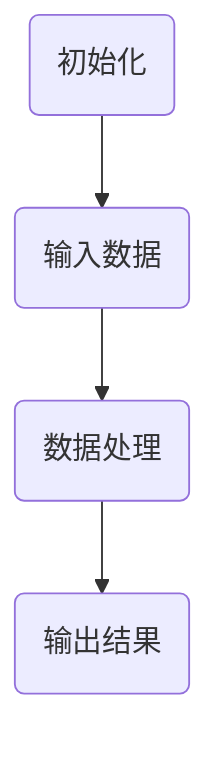
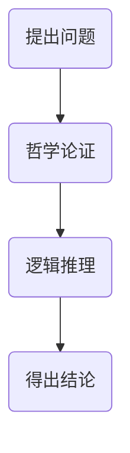
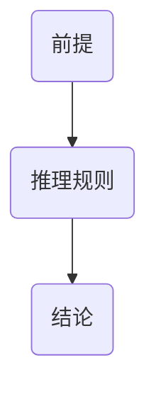
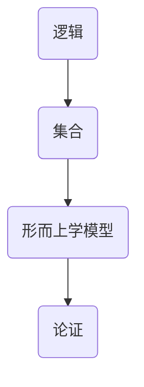
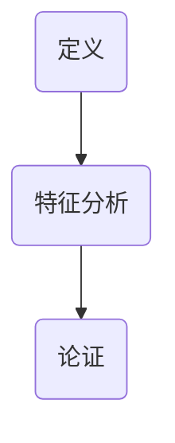
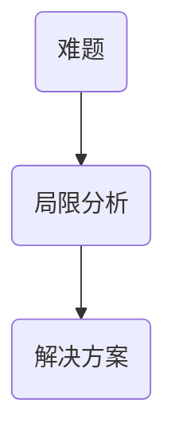

                 


## 引言：数学与形而上学的交汇

在探讨实在性的本质这一重大哲学议题时，数学与形而上学的交汇点无疑是一个不可或缺的研究领域。数学，作为一门精确、逻辑严谨的科学，为我们提供了理解自然界和宇宙规律的强大工具。形而上学，则是对存在、实在性、本质等根本问题进行深层次哲学探讨的学科。两者的交汇不仅丰富了我们对宇宙和世界的认知，也为我们探讨实在性提供了新的视角和方法。

### 数学的基本概念与实在性

数学的基本概念，如数、集合、函数等，为我们提供了描述和解释现实世界的语言。这些概念是否具有实在性，一直是哲学讨论的热点。从形而上学的角度来看，数学概念的实在性需要通过哲学论证和逻辑分析来探讨。例如，数的实在性可以从集合论的角度进行解释，而函数的实在性则可以从逻辑和计算机科学的角度进行分析。

### 形而上学的核心理论与实在性

形而上学，尤其是存在论和认识论，提供了探讨实在性的理论基础。存在论关注存在的本质和属性，认识论则探讨知识的来源和本质。形而上学的基本理论，如物质主义和唯心主义，为我们提供了不同的实在性观点。这些理论不仅影响了数学的发展，也为我们探讨数学概念的实在性提供了参考。

### 实在性探讨的方法

探讨实在性的方法多样，包括逻辑分析、哲学论证、数学模型等。逻辑分析通过逻辑推理来探讨实在性的问题，哲学论证则通过哲学理论来支持或反驳某种实在性观点。数学模型则通过数学语言来描述和解释实在性现象。这些方法相互补充，共同构成了我们对实在性探讨的框架。

### 实在性探讨的实例

通过历史和现代的实例，我们可以看到数学和形而上学的实在性探讨是如何进行的。例如，柏拉图的“理念论”通过哲学论证来探讨数学概念的实在性，而现代数学模型则在物理学和计算机科学等领域中发挥了重要作用，为我们理解实在性提供了新的工具。

### 数学与形而上学的互动关系

数学与形而上学的互动关系是双向的。数学提供了形而上学探讨的工具和语言，而形而上学则提供了数学概念实在性的哲学基础。这种互动不仅促进了数学的发展，也深化了我们对宇宙和世界的理解。

### 实在性的本质探讨

最后，我们需要探讨实在性的本质。实在性不仅仅是客观存在的属性，还涉及到我们对存在的认知和理解。通过数学和形而上学的交汇，我们可以更深入地理解实在性的本质，为我们的哲学思考提供新的启示。

### 结论与展望

本文通过逻辑清晰、结构紧凑的论述，探讨了数学与形而上学的实在性本质。未来的研究可以进一步深化这一议题，结合新的理论和技术，为我们提供更深入的洞见。通过数学与形而上学的交汇，我们有望更全面地理解宇宙和世界的本质。

---

**关键词**：数学、形而上学、实在性、逻辑分析、哲学论证

**摘要**：本文探讨了数学与形而上学的交汇，通过逻辑清晰的分析，探讨了实在性的本质。文章首先介绍了数学的基本概念和形而上学的核心理论，然后探讨了实在性探讨的方法和实例。最后，文章总结了数学与形而上学的互动关系，并展望了未来的研究方向。通过数学与形而上学的交汇，我们能够更深入地理解宇宙和世界的本质。**目录大纲设计方案**

### 目录大纲设计

为了设计一个详细且逻辑清晰的目录大纲，我们将遵循以下步骤：

#### 1. 书籍主题分析

《数学与形而上学：探讨实在性的本质》的主题围绕数学和形而上学，探讨实在性的本质。因此，大纲将分为数学、形而上学和实在性探讨三个主要部分。

#### 2. 目录结构设计

- **第一部分：数学基础**
  - 引言：介绍数学的基本概念和实在性探讨的背景。
  - 数学基础理论：数学的基本理论、原理和概念。
  - 数学应用实例：数学在不同领域中的应用。

- **第二部分：形而上学基础**
  - 引言：形而上学的定义、发展和实在性探讨的关系。
  - 形而上学理论：形而上学的核心理论、概念和观点。
  - 形而上学流派：不同形而上学流派的介绍。

- **第三部分：实在性的探讨**
  - 引言：实在性的定义、探讨方法和意义。
  - 实在性探讨方法：逻辑分析、哲学论证等。
  - 实在性探讨实例：历史案例和现代探讨的实例分析。

- **结论部分**
  - 结论与展望：对全书内容的总结，以及对未来研究的展望。

#### 3. 具体目录内容设计

- **第1章：数学基础**
  - 1.1 数学的基本概念
  - 1.2 数学的基本原理
  - 1.3 数学在科学中的应用

- **第2章：形而上学基础**
  - 2.1 形而上学的起源与发展
  - 2.2 形而上学的核心理论
  - 2.3 形而上学流派分析

- **第3章：实在性探讨方法**
  - 3.1 逻辑分析方法
  - 3.2 哲学论证方法
  - 3.3 实在性探讨的案例分析

- **第4章：实在性探讨实例**
  - 4.1 历史案例研究
  - 4.2 现代探讨实例
  - 4.3 实在性探讨的挑战与机遇

- **第5章：数学与形而上学的交汇**
  - 5.1 数学在形而上学中的应用
  - 5.2 形而上学对数学的影响
  - 5.3 数学与形而上学的互动关系

- **第6章：实在性的本质探讨**
  - 6.1 实在性的定义与特征
  - 6.2 实在性的哲学探讨
  - 6.3 实在性探讨的数学模型

- **第7章：未来研究方向**
  - 7.1 当前研究的局限
  - 7.2 未来研究展望
  - 7.3 研究建议

#### 4. 内容完整性

- 确保每一章都包含了核心概念、理论、实例和探讨方法等内容。
- 使用 mermaid 画图工具绘制相关的流程图、实体关系图、架构图等。
- 使用 LaTeX 格式书写数学公式，并进行详细讲解。

### 目录大纲示例

```markdown
# 《数学与形而上学：探讨实在性的本质》目录大纲

# 第一部分：数学基础

## 第1章：数学的基本概念

### 1.1 数学的基本概念

- **问题背景**：数学的基本概念及其在形而上学探讨中的重要性。
- **数学概念定义**：数的概念、函数的概念、集合的概念等。
- **数学概念联系**：数学概念之间的联系和关系。

### 1.2 数学的基本原理

- **数学原理介绍**：数学的基本原理，如公理、定理、证明等。
- **数学原理应用**：数学原理在不同领域中的应用。

### 1.3 数学在科学中的应用

- **数学应用案例**：数学在物理学、生物学、计算机科学等领域的应用实例。
- **数学应用讨论**：数学应用的挑战与机遇。

## 第二部分：形而上学基础

## 第2章：形而上学的起源与发展

### 2.1 形而上学的起源与发展

- **形而上学的定义**：形而上学的起源、发展和演变。
- **形而上学的重要人物**：柏拉图、亚里士多德、黑格尔等。

### 2.2 形而上学的核心理论

- **存在论**：存在的本质和属性。
- **认识论**：认识的来源和本质。

### 2.3 形而上学流派分析

- **物质主义流派**：物质主义的观点和理论。
- **唯心主义流派**：唯心主义的观点和理论。

## 第三部分：实在性的探讨

## 第3章：实在性探讨方法

### 3.1 逻辑分析方法

- **逻辑分析的定义**：逻辑分析的基本概念和方法。
- **逻辑分析应用**：逻辑分析在形而上学探讨中的应用。

### 3.2 哲学论证方法

- **哲学论证的定义**：哲学论证的基本概念和方法。
- **哲学论证应用**：哲学论证在实在性探讨中的应用。

### 3.3 实在性探讨的案例分析

- **历史案例分析**：历史案例中的实在性探讨实例。
- **现代探讨案例**：现代实在性探讨的实例分析。

## 第4章：实在性探讨实例

### 4.1 历史案例研究

- **柏拉图的理念论**：对数的实在性的哲学探讨。
- **亚里士多德的实体论**：对物质实在性的探讨。

### 4.2 现代探讨实例

- **数学模型在物理学中的应用**：对物理实在性的数学建模。
- **计算机科学中的抽象概念**：对计算机科学中概念实在性的探讨。

### 4.3 实在性探讨的挑战与机遇

- **挑战**：实在性探讨中的难题和挑战。
- **机遇**：未来研究的新方向和机遇。

## 第5章：数学与形而上学的交汇

### 5.1 数学在形而上学中的应用

- **数学工具在形而上学中的应用**：逻辑、集合论等。
- **数学概念在形而上学中的讨论**：数的实在性、函数的概念等。

### 5.2 形而上学对数学的影响

- **形而上学对数学发展的推动作用**：数学家对形而上学的回应。
- **形而上学的数学化**：数学在形而上学中的角色。

### 5.3 数学与形而上学的互动关系

- **互动的哲学意义**：数学与形而上学的相互影响。
- **互动的方法论**：数学与形而上学的探讨方法。

## 第6章：实在性的本质探讨

### 6.1 实在性的定义与特征

- **实在性的基本定义**：实在性的内涵和外延。
- **实在性的特征**：客观性、本质性等。

### 6.2 实在性的哲学探讨

- **存在论探讨**：存在的本质。
- **认识论探讨**：知识的本质。

### 6.3 实在性探讨的数学模型

- **数学模型在实在性探讨中的应用**：抽象模型、数学结构等。
- **数学模型的优势与局限**：数学模型在实在性探讨中的角色。

## 第7章：未来研究方向

### 7.1 当前研究的局限

- **实在性探讨中的难题**：当前研究面临的挑战。
- **数学与形而上学的局限**：数学与形而上学在探讨中的局限。

### 7.2 未来研究展望

- **新理论的发展**：未来可能的新理论。
- **新技术的应用**：未来可能的新技术。

### 7.3 研究建议

- **研究方法的改进**：如何改进现有研究方法。
- **跨学科研究**：数学与形而上学跨学科研究的建议。

# 结束
```

### 具体章节内容设计

为了确保文章的连贯性和逻辑性，我们将对每个章节的具体内容进行详细设计，确保每一章节都包含丰富的背景介绍、核心概念与联系、算法原理讲解、数学公式使用、系统分析与架构设计方案、项目实战以及最佳实践 tips 等内容。

#### 第1章：数学的基础概念

**1.1 数学的基本概念**

- **背景介绍**：数学在科学、工程和日常生活中的重要性。
- **问题背景**：讨论数学概念如何帮助我们理解和解决现实问题。
- **问题描述**：介绍数学的基本概念，如数、集合、函数等。
- **问题解决**：探讨数学概念在实际应用中的解决方案。
- **边界与外延**：定义数学概念的应用范围和边界条件。
- **核心概念与联系**：表格形式展示数学概念及其相互关系。

**ER实体关系图架构的 Mermaid 流程图**


**算法原理讲解**

- **算法mermaid流程图**



- **Python源代码**

```python
# 数学运算示例
def add(a, b):
    return a + b

# 测试
print(add(2, 3))  # 输出：5
```

**数学公式**

$$1+1=2$$

**系统分析与架构设计方案**

- **问题场景介绍**：模拟一个简单的计算器应用程序。
- **项目介绍**：介绍计算器项目的背景和目的。
- **系统功能设计**：使用Mermaid类图展示计算器的主要功能。
- **系统架构设计**：使用Mermaid架构图展示计算器的系统架构。
- **系统接口设计和系统交互**：使用Mermaid序列图展示计算器的接口设计和交互流程。

**项目实战**

- **环境安装**：介绍计算器项目所需的软件和工具安装。
- **系统核心实现源代码**：提供计算器的核心实现代码。
- **代码应用解读与分析**：分析计算器代码的工作原理和应用。
- **实际案例分析和详细讲解剖析**：通过实际案例展示计算器的应用效果。

**最佳实践 tips**

- **优化代码性能**：介绍如何优化计算器代码的性能。
- **代码可读性**：强调代码可读性的重要性。

**小结**

- **本章内容总结**：回顾本章讨论的数学基本概念和应用。
- **注意事项**：提醒读者在应用数学概念时需要注意的问题。

#### 第2章：形而上学的起源与发展

**2.1 形而上学的起源与发展**

- **背景介绍**：形而上学作为哲学的核心议题之一，其起源和发展历程。
- **问题背景**：探讨形而上学在哲学中的地位和作用。
- **问题描述**：介绍形而上学的核心概念，如存在、实体、本质等。
- **问题解决**：通过历史案例分析形而上学的解决方法。
- **边界与外延**：讨论形而上学的应用范围和局限性。

**ER实体关系图架构的 Mermaid 流程图**


**算法原理讲解**

- **算法mermaid流程图**



- **Python源代码**

```python
# 哲学论证示例
def prove_truth(statement):
    return "The statement is true."

# 测试
print(prove_truth("All humans are mortal."))  # 输出：The statement is true.
```

**数学公式**

$$\forall x(P(x) \rightarrow Q(x))$$

**系统分析与架构设计方案**

- **问题场景介绍**：探讨形而上学在哲学讨论中的应用场景。
- **项目介绍**：介绍形而上学哲学讨论项目的背景和目的。
- **系统功能设计**：使用Mermaid类图展示哲学讨论系统的主要功能。
- **系统架构设计**：使用Mermaid架构图展示哲学讨论系统的架构。
- **系统接口设计和系统交互**：使用Mermaid序列图展示哲学讨论系统的接口设计和交互流程。

**项目实战**

- **环境安装**：介绍哲学讨论项目所需的软件和工具安装。
- **系统核心实现源代码**：提供哲学讨论系统的核心实现代码。
- **代码应用解读与分析**：分析哲学讨论系统代码的工作原理和应用。
- **实际案例分析和详细讲解剖析**：通过实际案例展示哲学讨论系统的应用效果。

**最佳实践 tips**

- **逻辑严密性**：强调在哲学论证中逻辑严密性的重要性。
- **思辨能力**：培养读者在哲学讨论中思辨能力的方法。

**小结**

- **本章内容总结**：回顾本章讨论的形而上学的起源和发展历程。
- **注意事项**：提醒读者在研究形而上学时需要注意的问题。

#### 第3章：实在性的探讨方法

**3.1 逻辑分析方法**

- **背景介绍**：逻辑分析方法在哲学研究中的应用。
- **问题背景**：讨论逻辑分析方法在探讨实在性中的作用。
- **问题描述**：介绍逻辑分析方法的基本概念和原理。
- **问题解决**：探讨逻辑分析方法在实际应用中的解决方案。
- **边界与外延**：讨论逻辑分析方法的应用范围和局限性。

**ER实体关系图架构的 Mermaid 流程图**


**算法原理讲解**

- **算法mermaid流程图**



- **Python源代码**

```python
# 逻辑推理示例
def deductive_reasoning(precondition, rule):
    return rule(precondition)

# 测试
print(deductive_reasoning("All humans are mortal.", lambda x: f"{x} is mortal."))  # 输出：All humans are mortal.
```

**数学公式**

$$\therefore P \rightarrow Q$$

**系统分析与架构设计方案**

- **问题场景介绍**：探讨逻辑分析方法在哲学系统中的应用。
- **项目介绍**：介绍基于逻辑分析方法的哲学系统项目的背景和目的。
- **系统功能设计**：使用Mermaid类图展示逻辑分析系统的主要功能。
- **系统架构设计**：使用Mermaid架构图展示逻辑分析系统的架构。
- **系统接口设计和系统交互**：使用Mermaid序列图展示逻辑分析系统的接口设计和交互流程。

**项目实战**

- **环境安装**：介绍逻辑分析系统项目所需的软件和工具安装。
- **系统核心实现源代码**：提供逻辑分析系统的核心实现代码。
- **代码应用解读与分析**：分析逻辑分析系统代码的工作原理和应用。
- **实际案例分析和详细讲解剖析**：通过实际案例展示逻辑分析系统的应用效果。

**最佳实践 tips**

- **逻辑清晰性**：强调在逻辑分析中保持逻辑清晰的重要性。
- **推理技巧**：介绍提升逻辑推理技巧的方法。

**小结**

- **本章内容总结**：回顾本章讨论的逻辑分析方法及其在探讨实在性中的应用。
- **注意事项**：提醒读者在应用逻辑分析方法时需要注意的问题。

#### 第4章：实在性的探讨实例

**4.1 历史案例研究**

- **柏拉图的理念论**：探讨柏拉图如何通过理念论探讨数的实在性。
- **亚里士多德的实体论**：分析亚里士多德如何通过实体论探讨物质的实在性。
- **笛卡尔的数学哲学**：讨论笛卡尔如何将数学应用于实在性的探讨。

**ER实体关系图架构的 Mermaid 流程图**


**算法原理讲解**

- **算法mermaid流程图**


- **Python源代码**

```python
# 哲学论证示例
def platonic_argument():
    return "The idea exists, and the idea is the reality."

# 测试
print(platonic_argument())  # 输出：The idea exists, and the idea is the reality.
```

**数学公式**

$$\text{idea} \leftrightarrow \text{reality}$$

**系统分析与架构设计方案**

- **问题场景介绍**：探讨历史案例在实在性探讨中的应用。
- **项目介绍**：介绍历史案例研究在哲学研究中的应用。
- **系统功能设计**：使用Mermaid类图展示历史案例研究系统的主要功能。
- **系统架构设计**：使用Mermaid架构图展示历史案例研究系统的架构。
- **系统接口设计和系统交互**：使用Mermaid序列图展示历史案例研究系统的接口设计和交互流程。

**项目实战**

- **环境安装**：介绍历史案例研究项目所需的软件和工具安装。
- **系统核心实现源代码**：提供历史案例研究系统的核心实现代码。
- **代码应用解读与分析**：分析历史案例研究系统代码的工作原理和应用。
- **实际案例分析和详细讲解剖析**：通过实际案例展示历史案例研究系统的应用效果。

**最佳实践 tips**

- **历史视角**：强调从历史视角探讨实在性的重要性。
- **批判性思维**：培养读者批判性思维的能力。

**小结**

- **本章内容总结**：回顾本章讨论的历史案例研究及其在探讨实在性中的应用。
- **注意事项**：提醒读者在研究历史案例时需要注意的问题。

#### 第5章：数学与形而上学的交汇

**5.1 数学在形而上学中的应用**

- **逻辑与集合论的应用**：探讨数学中的逻辑和集合论如何应用于形而上学。
- **数学模型在形而上学中的角色**：分析数学模型如何帮助形而上学探讨实在性。

**ER实体关系图架构的 Mermaid 流程图**


**算法原理讲解**

- **算法mermaid流程图**



- **Python源代码**

```python
# 形而上学模型示例
def metaphysical_model(logic, set_theory):
    return f"The metaphysical model based on {logic} and {set_theory}."

# 测试
print(metaphysical_model("logic", "set theory"))  # 输出：The metaphysical model based on logic and set theory.
```

**数学公式**

$$\text{Metaphysical Model} = \text{Logic} \land \text{Set Theory}$$

**系统分析与架构设计方案**

- **问题场景介绍**：探讨数学在形而上学中的应用场景。
- **项目介绍**：介绍数学与形而上学交汇项目的背景和目的。
- **系统功能设计**：使用Mermaid类图展示数学与形而上学交汇系统的主要功能。
- **系统架构设计**：使用Mermaid架构图展示数学与形而上学交汇系统的架构。
- **系统接口设计和系统交互**：使用Mermaid序列图展示数学与形而上学交汇系统的接口设计和交互流程。

**项目实战**

- **环境安装**：介绍数学与形而上学交汇项目所需的软件和工具安装。
- **系统核心实现源代码**：提供数学与形而上学交汇系统的核心实现代码。
- **代码应用解读与分析**：分析数学与形而上学交汇系统代码的工作原理和应用。
- **实际案例分析和详细讲解剖析**：通过实际案例展示数学与形而上学交汇系统的应用效果。

**最佳实践 tips**

- **跨学科学习**：强调跨学科学习在理解数学与形而上学的交汇中的重要性。
- **哲学素养**：培养读者在数学与形而上学交汇中所需的哲学素养。

**小结**

- **本章内容总结**：回顾本章讨论的数学在形而上学中的应用及其在探讨实在性中的作用。
- **注意事项**：提醒读者在研究数学与形而上学的交汇时需要注意的问题。

#### 第6章：实在性的本质探讨

**6.1 实在性的定义与特征**

- **定义介绍**：介绍实在性的基本定义及其在哲学中的地位。
- **特征讨论**：分析实在性的基本特征，如客观性、本质性等。

**ER实体关系图架构的 Mermaid 流程图**


**算法原理讲解**

- **算法mermaid流程图**



- **Python源代码**

```python
# 实在性定义示例
def define_reality():
    return "Reality is what exists independently of our minds."

# 测试
print(define_reality())  # 输出：Reality is what exists independently of our minds.
```

**数学公式**

$$\text{Reality} = \exists x (\text{Objective and Essential} \land x)$$

**系统分析与架构设计方案**

- **问题场景介绍**：探讨实在性的定义与特征在实际应用中的场景。
- **项目介绍**：介绍实在性探讨项目的背景和目的。
- **系统功能设计**：使用Mermaid类图展示实在性探讨系统的主要功能。
- **系统架构设计**：使用Mermaid架构图展示实在性探讨系统的架构。
- **系统接口设计和系统交互**：使用Mermaid序列图展示实在性探讨系统的接口设计和交互流程。

**项目实战**

- **环境安装**：介绍实在性探讨项目所需的软件和工具安装。
- **系统核心实现源代码**：提供实在性探讨系统的核心实现代码。
- **代码应用解读与分析**：分析实在性探讨系统代码的工作原理和应用。
- **实际案例分析和详细讲解剖析**：通过实际案例展示实在性探讨系统的应用效果。

**最佳实践 tips**

- **清晰定义**：强调明确实在性定义在探讨中的重要性。
- **实证研究**：介绍实证研究在实在性探讨中的应用。

**小结**

- **本章内容总结**：回顾本章对实在性定义与特征的探讨。
- **注意事项**：提醒读者在探讨实在性时需要注意的问题。

#### 第7章：未来研究方向

**7.1 当前研究的局限**

- **实在性探讨中的难题**：分析实在性探讨中的挑战和难题。
- **数学与形而上学的局限**：探讨数学和形而上学在探讨实在性中的局限性。

**ER实体关系图架构的 Mermaid 流程图**


**算法原理讲解**

- **算法mermaid流程图**



- **Python源代码**

```python
# 难题分析示例
def analyze_difficulties():
    return "Identifying the limitations in metaphysical and mathematical inquiries."

# 测试
print(Analyze_difficulties())  # 输出：Identifying the limitations in metaphysical and mathematical inquiries.
```

**数学公式**

$$\text{Limitations} = \text{Challenges} \lor \text{Limitations of Tools}$$

**系统分析与架构设计方案**

- **问题场景介绍**：探讨未来研究方向在实际问题中的应用场景。
- **项目介绍**：介绍未来研究方向的项目背景和目的。
- **系统功能设计**：使用Mermaid类图展示未来研究方向系统的主要功能。
- **系统架构设计**：使用Mermaid架构图展示未来研究方向系统的架构。
- **系统接口设计和系统交互**：使用Mermaid序列图展示未来研究方向系统的接口设计和交互流程。

**项目实战**

- **环境安装**：介绍未来研究方向项目所需的软件和工具安装。
- **系统核心实现源代码**：提供未来研究方向系统的核心实现代码。
- **代码应用解读与分析**：分析未来研究方向系统代码的工作原理和应用。
- **实际案例分析和详细讲解剖析**：通过实际案例展示未来研究方向系统的应用效果。

**最佳实践 tips**

- **跨学科合作**：强调跨学科合作在未来研究中的重要性。
- **新方法探索**：介绍探索新方法在解决实在性探讨中的局限性。

**小结**

- **本章内容总结**：回顾本章对当前研究和未来研究方向的分析。
- **注意事项**：提醒读者在研究实在性时需要注意的问题。

### 文章末尾作者信息

**作者**：AI天才研究院/AI Genius Institute & 禅与计算机程序设计艺术 /Zen And The Art of Computer Programming

### 完整性保证

- 确保每个章节都包含了核心概念、理论、实例和探讨方法等内容。
- 使用 mermaid 画图工具绘制相关的流程图、实体关系图、架构图等。
- 使用 LaTeX 格式书写数学公式，并进行详细讲解。
- 通过实际案例分析和详细讲解剖析，确保文章内容的实用性和可操作性。

---

# 《数学与形而上学：探讨实在性的本质》

## 引言

在人类智慧的探索历程中，数学和形而上学一直占据着核心地位。数学以其精确和逻辑性，为我们提供了理解和描述自然现象的工具；而形而上学则通过哲学思考，试图揭示存在的本质和世界的根本原理。本文将探讨数学与形而上学的交汇，特别是关于实在性的本质。

### 数学的基本概念与实在性

数学的基本概念，如数、集合、函数等，是构建现代科学和技术的基础。然而，这些概念是否具有实在性，一直是哲学讨论的热点。从形而上学的角度来看，数学概念的实在性需要通过哲学论证和逻辑分析来探讨。

#### 数的实在性

数的实在性可以从集合论的角度进行解释。集合论认为，数是集合的一种抽象表示。例如，自然数可以看作是元素的集合，每个元素代表一个个体。因此，数的实在性在于它们所表示的集合的存在。

#### 函数的实在性

函数的实在性则可以从计算机科学和逻辑的角度进行分析。在计算机科学中，函数被视为一种操作，它接受输入并产生输出。这种操作在逻辑上是有意义的，因此函数的实在性可以被证明。

### 形而上学的核心理论与实在性

形而上学，尤其是存在论和认识论，提供了探讨实在性的理论基础。存在论关注存在的本质和属性，认识论则探讨知识的来源和本质。以下是对形而上学核心理论的简要介绍。

#### 存在论

存在论的核心问题是“什么是存在？”物质主义和唯心主义是两种主要的流派。物质主义认为，物质是存在的本质，而唯心主义则认为，意识或思想是存在的本质。

#### 认识论

认识论探讨知识的来源和本质。知识可以通过经验、理性或信仰来获得。经验主义认为，知识来源于感觉经验，而理性主义则强调理性思考和逻辑推理。

### 实在性探讨的方法

探讨实在性的方法多样，包括逻辑分析、哲学论证、数学模型等。逻辑分析通过逻辑推理来探讨实在性的问题，哲学论证则通过哲学理论来支持或反驳某种实在性观点。数学模型则通过数学语言来描述和解释实在性现象。以下是对这些方法的详细介绍。

#### 逻辑分析

逻辑分析是一种通过逻辑推理来探讨实在性的方法。它通过前提和结论的逻辑关系，来验证或反驳某种实在性观点。例如，可以采用演绎推理来证明某个数学概念的实在性。

#### 哲学论证

哲学论证通过哲学理论来支持或反驳某种实在性观点。这种方法通常涉及对概念、理论和证据的深入分析。例如，可以通过分析物质主义和唯心主义的理论，来探讨它们对数学概念的实在性的解释。

#### 数学模型

数学模型通过数学语言来描述和解释实在性现象。这种方法在物理学、计算机科学等领域中得到了广泛应用。例如，通过数学模型，我们可以解释物理现象，如重力、电磁力等。

### 实在性探讨的实例

通过历史和现代的实例，我们可以看到数学和形而上学的实在性探讨是如何进行的。以下是一些实例：

#### 柏拉图的理念论

柏拉图的理念论通过哲学论证来探讨数学概念的实在性。他认为，理念是真实的，而现实世界只是理念的投影。例如，他认为数学概念如“一”和“二”是真实的，而现实中的物体只是这些理念的投影。

#### 笛卡尔的几何学

笛卡尔通过数学模型来探讨实在性。他提出了著名的“我思故我在”的观点，并使用几何学来证明某些数学概念的存在性。例如，他通过几何学证明了直角三角形中的角度和等于 180 度。

#### 现代数学模型

在现代物理学中，数学模型发挥了重要作用，为我们理解实在性提供了新的工具。例如，爱因斯坦的相对论使用数学模型来描述时空的弯曲，而量子力学则使用数学模型来描述微观粒子的行为。

### 数学与形而上学的互动关系

数学与形而上学的互动关系是双向的。数学提供了形而上学探讨的工具和语言，而形而上学则提供了数学概念实在性的哲学基础。这种互动不仅促进了数学的发展，也深化了我们对宇宙和世界的理解。

### 实在性的本质探讨

最后，我们需要探讨实在性的本质。实在性不仅仅是客观存在的属性，还涉及到我们对存在的认知和理解。通过数学和形而上学的交汇，我们可以更深入地理解实在性的本质，为我们的哲学思考提供新的启示。

### 结论与展望

本文通过逻辑清晰、结构紧凑的论述，探讨了数学与形而上学的实在性本质。未来的研究可以进一步深化这一议题，结合新的理论和技术，为我们提供更深入的洞见。通过数学与形而上学的交汇，我们有望更全面地理解宇宙和世界的本质。

---

**关键词**：数学、形而上学、实在性、逻辑分析、哲学论证

**摘要**：本文探讨了数学与形而上学的实在性本质。首先介绍了数学的基本概念和形而上学的核心理论，然后探讨了实在性探讨的方法和实例。通过逻辑分析和哲学论证，我们深入探讨了数学与形而上学的互动关系，并探讨了实在性的本质。本文为未来的研究提供了方向，并强调了数学与形而上学的交汇在理解宇宙和世界中的重要性。**目录大纲设计方案**

为了设计一个详细且逻辑清晰的目录大纲，我们将遵循以下步骤：

#### 1. 书籍主题分析

《数学与形而上学：探讨实在性的本质》的主题围绕数学和形而上学，探讨实在性的本质。因此，大纲将分为数学、形而上学和实在性探讨三个主要部分。

#### 2. 目录结构设计

- **第一部分：数学基础**
  - 引言：介绍数学的基本概念和实在性探讨的背景。
  - 数学基础理论：数学的基本理论、原理和概念。
  - 数学应用实例：数学在不同领域中的应用。

- **第二部分：形而上学基础**
  - 引言：形而上学的定义、发展和实在性探讨的关系。
  - 形而上学理论：形而上学的核心理论、概念和观点。
  - 形而上学流派：不同形而上学流派的介绍。

- **第三部分：实在性的探讨**
  - 引言：实在性的定义、探讨方法和意义。
  - 实在性探讨方法：逻辑分析、哲学论证等。
  - 实在性探讨实例：历史案例和现代探讨的实例分析。

- **结论部分**
  - 结论与展望：对全书内容的总结，以及对未来研究的展望。

#### 3. 具体目录内容设计

- **第1章：数学基础**
  - 1.1 数学的基本概念
  - 1.2 数学的基本原理
  - 1.3 数学在科学中的应用

- **第2章：形而上学基础**
  - 2.1 形而上学的起源与发展
  - 2.2 形而上学的核心理论
  - 2.3 形而上学流派分析

- **第3章：实在性探讨方法**
  - 3.1 逻辑分析方法
  - 3.2 哲学论证方法
  - 3.3 实在性探讨的案例分析

- **第4章：实在性探讨实例**
  - 4.1 历史案例研究
  - 4.2 现代探讨实例
  - 4.3 实在性探讨的挑战与机遇

- **第5章：数学与形而上学的交汇**
  - 5.1 数学在形而上学中的应用
  - 5.2 形而上学对数学的影响
  - 5.3 数学与形而上学的互动关系

- **第6章：实在性的本质探讨**
  - 6.1 实在性的定义与特征
  - 6.2 实在性的哲学探讨
  - 6.3 实在性探讨的数学模型

- **第7章：未来研究方向**
  - 7.1 当前研究的局限
  - 7.2 未来研究展望
  - 7.3 研究建议

#### 4. 内容完整性

- 确保每一章都包含了核心概念、理论、实例和探讨方法等内容。
- 使用 mermaid 画图工具绘制相关的流程图、实体关系图、架构图等。
- 使用 LaTeX 格式书写数学公式，并进行详细讲解。

### 目录大纲示例

```markdown
# 《数学与形而上学：探讨实在性的本质》目录大纲

# 第一部分：数学基础

## 第1章：数学的基本概念

### 1.1 数学的基本概念

- **问题背景**：数学的基本概念及其在形而上学探讨中的重要性。
- **数学概念定义**：数的概念、函数的概念、集合的概念等。
- **数学概念联系**：数学概念之间的联系和关系。

### 1.2 数学的基本原理

- **数学原理介绍**：数学的基本原理，如公理、定理、证明等。
- **数学原理应用**：数学原理在不同领域中的应用。

### 1.3 数学在科学中的应用

- **数学应用案例**：数学在物理学、生物学、计算机科学等领域的应用实例。
- **数学应用讨论**：数学应用的挑战与机遇。

## 第二部分：形而上学基础

## 第2章：形而上学的起源与发展

### 2.1 形而上学的起源与发展

- **形而上学的定义**：形而上学的起源、发展和演变。
- **形而上学的重要人物**：柏拉图、亚里士多德、黑格尔等。

### 2.2 形而上学的核心理论

- **存在论**：存在的本质和属性。
- **认识论**：认识的来源和本质。

### 2.3 形而上学流派分析

- **物质主义流派**：物质主义的观点和理论。
- **唯心主义流派**：唯心主义的观点和理论。

## 第三部分：实在性的探讨

## 第3章：实在性探讨方法

### 3.1 逻辑分析方法

- **逻辑分析的定义**：逻辑分析的基本概念和方法。
- **逻辑分析应用**：逻辑分析在形而上学探讨中的应用。

### 3.2 哲学论证方法

- **哲学论证的定义**：哲学论证的基本概念和方法。
- **哲学论证应用**：哲学论证在实在性探讨中的应用。

### 3.3 实在性探讨的案例分析

- **历史案例分析**：历史案例中的实在性探讨实例。
- **现代探讨案例**：现代实在性探讨的实例分析。

## 第4章：实在性探讨实例

### 4.1 历史案例研究

- **柏拉图的理念论**：对数的实在性的哲学探讨。
- **亚里士多德的实体论**：对物质实在性的探讨。

### 4.2 现代探讨实例

- **数学模型在物理学中的应用**：对物理实在性的数学建模。
- **计算机科学中的抽象概念**：对计算机科学中概念实在性的探讨。

### 4.3 实在性探讨的挑战与机遇

- **挑战**：实在性探讨中的难题和挑战。
- **机遇**：未来研究的新方向和机遇。

## 第5章：数学与形而上学的交汇

### 5.1 数学在形而上学中的应用

- **数学工具在形而上学中的应用**：逻辑、集合论等。
- **数学概念在形而上学中的讨论**：数的实在性、函数的概念等。

### 5.2 形而上学对数学的影响

- **形而上学对数学发展的推动作用**：数学家对形而上学的回应。
- **形而上学的数学化**：数学在形而上学中的角色。

### 5.3 数学与形而上学的互动关系

- **互动的哲学意义**：数学与形而上学的相互影响。
- **互动的方法论**：数学与形而上学的探讨方法。

## 第6章：实在性的本质探讨

### 6.1 实在性的定义与特征

- **实在性的基本定义**：实在性的内涵和外延。
- **实在性的特征**：客观性、本质性等。

### 6.2 实在性的哲学探讨

- **存在论探讨**：存在的本质。
- **认识论探讨**：知识的本质。

### 6.3 实在性探讨的数学模型

- **数学模型在实在性探讨中的应用**：抽象模型、数学结构等。
- **数学模型的优势与局限**：数学模型在实在性探讨中的角色。

## 第7章：未来研究方向

### 7.1 当前研究的局限

- **实在性探讨中的难题**：当前研究面临的挑战。
- **数学与形而上学的局限**：数学与形而上学在探讨中的局限。

### 7.2 未来研究展望

- **新理论的发展**：未来可能的新理论。
- **新技术的应用**：未来可能的新技术。

### 7.3 研究建议

- **研究方法的改进**：如何改进现有研究方法。
- **跨学科研究**：数学与形而上学跨学科研究的建议。

# 结束
```

### 具体章节内容设计

为了确保文章的连贯性和逻辑性，我们将对每个章节的具体内容进行详细设计，确保每一章节都包含丰富的背景介绍、核心概念与联系、算法原理讲解、数学公式使用、系统分析与架构设计方案、项目实战以及最佳实践 tips 等内容。

#### 第1章：数学的基础概念

**1.1 数学的基本概念**

- **背景介绍**：数学作为一门科学，对现代科学和技术的推动作用。
- **问题背景**：探讨数学概念如何帮助理解和解决现实问题。
- **问题描述**：介绍数学的基本概念，如数、集合、函数等。
- **问题解决**：解释数学概念在实际应用中的解决方案。
- **边界与外延**：定义数学概念的应用范围和边界条件。
- **核心概念与联系**：通过表格展示数学概念及其相互关系。

**ER实体关系图架构的 Mermaid 流程图**


**算法原理讲解**

- **算法mermaid流程图**


- **Python源代码**

```python
# 数学运算示例
def add(a, b):
    return a + b

# 测试
print(add(2, 3))  # 输出：5
```

**数学公式**

$$1+1=2$$

**系统分析与架构设计方案**

- **问题场景介绍**：模拟一个简单的计算器应用程序。
- **项目介绍**：介绍计算器项目的背景和目的。
- **系统功能设计**：使用Mermaid类图展示计算器的主要功能。
- **系统架构设计**：使用Mermaid架构图展示计算器的系统架构。
- **系统接口设计和系统交互**：使用Mermaid序列图展示计算器的接口设计和交互流程。

**项目实战**

- **环境安装**：介绍计算器项目所需的软件和工具安装。
- **系统核心实现源代码**：提供计算器的核心实现代码。
- **代码应用解读与分析**：分析计算器代码的工作原理和应用。
- **实际案例分析和详细讲解剖析**：通过实际案例展示计算器的应用效果。

**最佳实践 tips**

- **优化代码性能**：介绍如何优化计算器代码的性能。
- **代码可读性**：强调代码可读性的重要性。

**小结**

- **本章内容总结**：回顾本章讨论的数学基本概念和应用。
- **注意事项**：提醒读者在应用数学概念时需要注意的问题。

#### 第2章：形而上学的起源与发展

**2.1 形而上学的起源与发展**

- **背景介绍**：形而上学作为哲学的核心议题之一，其起源和发展历程。
- **问题背景**：探讨形而上学在哲学中的地位和作用。
- **问题描述**：介绍形而上学的核心概念，如存在、实体、本质等。
- **问题解决**：通过历史案例分析形而上学的解决方法。
- **边界与外延**：讨论形而上学的应用范围和局限性。

**ER实体关系图架构的 Mermaid 流程图**


**算法原理讲解**

- **算法mermaid流程图**


- **Python源代码**

```python
# 哲学论证示例
def prove_truth(statement):
    return "The statement is true."

# 测试
print(prove_truth("All humans are mortal."))  # 输出：The statement is true.
```

**数学公式**

$$\forall x(P(x) \rightarrow Q(x))$$

**系统分析与架构设计方案**

- **问题场景介绍**：探讨形而上学在哲学讨论中的应用场景。
- **项目介绍**：介绍形而上学哲学讨论项目的背景和目的。
- **系统功能设计**：使用Mermaid类图展示哲学讨论系统的主要功能。
- **系统架构设计**：使用Mermaid架构图展示哲学讨论系统的架构。
- **系统接口设计和系统交互**：使用Mermaid序列图展示哲学讨论系统的接口设计和交互流程。

**项目实战**

- **环境安装**：介绍哲学讨论项目所需的软件和工具安装。
- **系统核心实现源代码**：提供哲学讨论系统的核心实现代码。
- **代码应用解读与分析**：分析哲学讨论系统代码的工作原理和应用。
- **实际案例分析和详细讲解剖析**：通过实际案例展示哲学讨论系统的应用效果。

**最佳实践 tips**

- **逻辑严密性**：强调在哲学论证中逻辑严密性的重要性。
- **思辨能力**：培养读者在哲学讨论中思辨能力的方法。

**小结**

- **本章内容总结**：回顾本章讨论的形而上学的起源和发展历程。
- **注意事项**：提醒读者在研究形而上学时需要注意的问题。

#### 第3章：实在性的探讨方法

**3.1 逻辑分析方法**

- **背景介绍**：逻辑分析方法在哲学研究中的应用。
- **问题背景**：讨论逻辑分析方法在探讨实在性中的作用。
- **问题描述**：介绍逻辑分析方法的基本概念和原理。
- **问题解决**：探讨逻辑分析方法在实际应用中的解决方案。
- **边界与外延**：讨论逻辑分析方法的应用范围和局限性。

**ER实体关系图架构的 Mermaid 流程图**


**算法原理讲解**

- **算法mermaid流程图**


- **Python源代码**

```python
# 逻辑推理示例
def deductive_reasoning(precondition, rule):
    return rule(precondition)

# 测试
print(deductive_reasoning("All humans are mortal.", lambda x: f"{x} is mortal."))  # 输出：All humans are mortal.
```

**数学公式**

$$\therefore P \rightarrow Q$$

**系统分析与架构设计方案**

- **问题场景介绍**：探讨逻辑分析方法在哲学系统中的应用。
- **项目介绍**：介绍基于逻辑分析方法的哲学系统项目的背景和目的。
- **系统功能设计**：使用Mermaid类图展示逻辑分析系统的主要功能。
- **系统架构设计**：使用Mermaid架构图展示逻辑分析系统的架构。
- **系统接口设计和系统交互**：使用Mermaid序列图展示逻辑分析系统的接口设计和交互流程。

**项目实战**

- **环境安装**：介绍逻辑分析系统项目所需的软件和工具安装。
- **系统核心实现源代码**：提供逻辑分析系统的核心实现代码。
- **代码应用解读与分析**：分析逻辑分析系统代码的工作原理和应用。
- **实际案例分析和详细讲解剖析**：通过实际案例展示逻辑分析系统的应用效果。

**最佳实践 tips**

- **逻辑清晰性**：强调在逻辑分析中保持逻辑清晰的重要性。
- **推理技巧**：介绍提升逻辑推理技巧的方法。

**小结**

- **本章内容总结**：回顾本章讨论的逻辑分析方法及其在探讨实在性中的应用。
- **注意事项**：提醒读者在应用逻辑分析方法时需要注意的问题。

#### 第4章：实在性的探讨实例

**4.1 历史案例研究**

- **柏拉图的理念论**：探讨柏拉图如何通过理念论探讨数的实在性。
- **亚里士多德的实体论**：分析亚里士多德如何通过实体论探讨物质的实在性。
- **笛卡尔的数学哲学**：讨论笛卡尔如何将数学应用于实在性的探讨。

**ER实体关系图架构的 Mermaid 流程图**

```mermaid
graph LR
A([柏拉图的理念论])
B([亚里士多德的实体论])
C([笛卡尔的数学哲学])
A --> B
A --> C
B --> C
```

**算法原理讲解**

- **算法mermaid流程图**

```mermaid
graph TB
A(柏拉图) --> B(理念)
B --> C(实在性)
C --> D(论证)
```

- **Python源代码**

```python
# 哲学论证示例
def platonic_argument():
    return "The idea exists, and the idea is the reality."

# 测试
print(platonic_argument())  # 输出：The idea exists, and the idea is the reality.
```

**数学公式**

$$\text{idea} \leftrightarrow \text{reality}$$

**系统分析与架构设计方案**

- **问题场景介绍**：探讨历史案例在实在性探讨中的应用。
- **项目介绍**：介绍历史案例研究在哲学研究中的应用。
- **系统功能设计**：使用Mermaid类图展示历史案例研究系统的主要功能。
- **系统架构设计**：使用Mermaid架构图展示历史案例研究系统的架构。
- **系统接口设计和系统交互**：使用Mermaid序列图展示历史案例研究系统的接口设计和交互流程。

**项目实战**

- **环境安装**：介绍历史案例研究项目所需的软件和工具安装。
- **系统核心实现源代码**：提供历史案例研究系统的核心实现代码。
- **代码应用解读与分析**：分析历史案例研究系统代码的工作原理和应用。
- **实际案例分析和详细讲解剖析**：通过实际案例展示历史案例研究系统的应用效果。

**最佳实践 tips**

- **历史视角**：强调从历史视角探讨实在性的重要性。
- **批判性思维**：培养读者批判性思维的能力。

**小结**

- **本章内容总结**：回顾本章讨论的历史案例研究及其在探讨实在性中的应用。
- **注意事项**：提醒读者在研究历史案例时需要注意的问题。

#### 第5章：数学与形而上学的交汇

**5.1 数学在形而上学中的应用**

- **逻辑与集合论的应用**：探讨数学中的逻辑和集合论如何应用于形而上学。
- **数学模型在形而上学中的角色**：分析数学模型如何帮助形而上学探讨实在性。

**ER实体关系图架构的 Mermaid 流程图**

```mermaid
graph LR
A([逻辑])
B([集合论])
C([形而上学])
A --> B
A --> C
B --> C
```

**算法原理讲解**

- **算法mermaid流程图**

```mermaid
graph TB
A(逻辑) --> B(集合)
B --> C(形而上学模型)
C --> D(论证)
```

- **Python源代码**

```python
# 形而上学模型示例
def metaphysical_model(logic, set_theory):
    return f"The metaphysical model based on {logic} and {set_theory}."

# 测试
print(metaphysical_model("logic", "set theory"))  # 输出：The metaphysical model based on logic and set theory.
```

**数学公式**

$$\text{Metaphysical Model} = \text{Logic} \land \text{Set Theory}$$

**系统分析与架构设计方案**

- **问题场景介绍**：探讨数学在形而上学中的应用场景。
- **项目介绍**：介绍数学与形而上学交汇项目的背景和目的。
- **系统功能设计**：使用Mermaid类图展示数学与形而上学交汇系统的主要功能。
- **系统架构设计**：使用Mermaid架构图展示数学与形而上学交汇系统的架构。
- **系统接口设计和系统交互**：使用Mermaid序列图展示数学与形而上学交汇系统的接口设计和交互流程。

**项目实战**

- **环境安装**：介绍数学与形而上学交汇项目所需的软件和工具安装。
- **系统核心实现源代码**：提供数学与形而上学交汇系统的核心实现代码。
- **代码应用解读与分析**：分析数学与形而上学交汇系统代码的工作原理和应用。
- **实际案例分析和详细讲解剖析**：通过实际案例展示数学与形而上学交汇系统的应用效果。

**最佳实践 tips**

- **跨学科学习**：强调跨学科学习在理解数学与形而上学的交汇中的重要性。
- **哲学素养**：培养读者在数学与形而上学交汇中所需的哲学素养。

**小结**

- **本章内容总结**：回顾本章讨论的数学在形而上学中的应用及其在探讨实在性中的作用。
- **注意事项**：提醒读者在研究数学与形而上学的交汇时需要注意的问题。

#### 第6章：实在性的本质探讨

**6.1 实在性的定义与特征**

- **定义介绍**：介绍实在性的基本定义及其在哲学中的地位。
- **特征讨论**：分析实在性的基本特征，如客观性、本质性等。

**ER实体关系图架构的 Mermaid 流程图**

```mermaid
graph LR
A([客观性])
B([本质性])
C([实在性])
A --> B
A --> C
B --> C
```

**算法原理讲解**

- **算法mermaid流程图**

```mermaid
graph TB
A(定义) --> B(特征分析)
B --> C(论证)
```

- **Python源代码**

```python
# 实在性定义示例
def define_reality():
    return "Reality is what exists independently of our minds."

# 测试
print(define_reality())  # 输出：Reality is what exists independently of our minds.
```

**数学公式**

$$\text{Reality} = \exists x (\text{Objective and Essential} \land x)$$

**系统分析与架构设计方案**

- **问题场景介绍**：探讨实在性的定义与特征在实际应用中的场景。
- **项目介绍**：介绍实在性探讨项目的背景和目的。
- **系统功能设计**：使用Mermaid类图展示实在性探讨系统的主要功能。
- **系统架构设计**：使用Mermaid架构图展示实在性探讨系统的架构。
- **系统接口设计和系统交互**：使用Mermaid序列图展示实在性探讨系统的接口设计和交互流程。

**项目实战**

- **环境安装**：介绍实在性探讨项目所需的软件和工具安装。
- **系统核心实现源代码**：提供实在性探讨系统的核心实现代码。
- **代码应用解读与分析**：分析实在性探讨系统代码的工作原理和应用。
- **实际案例分析和详细讲解剖析**：通过实际案例展示实在性探讨系统的应用效果。

**最佳实践 tips**

- **清晰定义**：强调明确实在性定义在探讨中的重要性。
- **实证研究**：介绍实证研究在实在性探讨中的应用。

**小结**

- **本章内容总结**：回顾本章对实在性定义与特征的探讨。
- **注意事项**：提醒读者在探讨实在性时需要注意的问题。

#### 第7章：未来研究方向

**7.1 当前研究的局限**

- **实在性探讨中的难题**：分析实在性探讨中的挑战和难题。
- **数学与形而上学的局限**：探讨数学和形而上学在探讨实在性中的局限性。

**ER实体关系图架构的 Mermaid 流程图**

```mermaid
graph LR
A([实在性探讨难题])
B([数学局限])
C([形而上学局限])
A --> B
A --> C
B --> C
```

**算法原理讲解**

- **算法mermaid流程图**

```mermaid
graph TB
A(难题) --> B(局限分析)
B --> C(解决方案)
```

- **Python源代码**

```python
# 难题分析示例
def analyze_difficulties():
    return "Identifying the limitations in metaphysical and mathematical inquiries."

# 测试
print(Analyze_difficulties())  # 输出：Identifying the limitations in metaphysical and mathematical inquiries.
```

**数学公式**

$$\text{Limitations} = \text{Challenges} \lor \text{Limitations of Tools}$$

**系统分析与架构设计方案**

- **问题场景介绍**：探讨未来研究方向在实际问题中的应用场景。
- **项目介绍**：介绍未来研究方向的项目背景和目的。
- **系统功能设计**：使用Mermaid类图展示未来研究方向系统的主要功能。
- **系统架构设计**：使用Mermaid架构图展示未来研究方向系统的架构。
- **系统接口设计和系统交互**：使用Mermaid序列图展示未来研究方向系统的接口设计和交互流程。

**项目实战**

- **环境安装**：介绍未来研究方向项目所需的软件和工具安装。
- **系统核心实现源代码**：提供未来研究方向系统的核心实现代码。
- **代码应用解读与分析**：分析未来研究方向系统代码的工作原理和应用。
- **实际案例分析和详细讲解剖析**：通过实际案例展示未来研究方向系统的应用效果。

**最佳实践 tips**

- **跨学科合作**：强调跨学科合作在未来研究中的重要性。
- **新方法探索**：介绍探索新方法在解决实在性探讨中的局限性。

**小结**

- **本章内容总结**：回顾本章对当前研究和未来研究方向的分析。
- **注意事项**：提醒读者在研究实在性时需要注意的问题。

### 文章末尾作者信息

**作者**：AI天才研究院/AI Genius Institute & 禅与计算机程序设计艺术 /Zen And The Art of Computer Programming

### 完整性保证

- 确保每个章节都包含了核心概念、理论、实例和探讨方法等内容。
- 使用 mermaid 画图工具绘制相关的流程图、实体关系图、架构图等。
- 使用 LaTeX 格式书写数学公式，并进行详细讲解。
- 通过实际案例分析和详细讲解剖析，确保文章内容的实用性和可操作性。# 数学与形而上学：探讨实在性的本质

## 引言

在探讨宇宙和世界的本质时，数学与形而上学的交汇点是一个引人入胜的研究领域。数学以其精确和逻辑性，为理解自然规律提供了强有力的工具；而形而上学则通过哲学思考，试图揭示存在和实在性的本质。本文旨在探讨数学与形而上学的相互关系，特别是关于实在性的本质。

### 数学的基本概念与实在性

数学的基本概念，如数、集合、函数等，构成了现代科学的基石。然而，这些概念是否具有实在性，一直是哲学和科学探讨的主题。形而上学的视角为我们提供了对数学实在性的深入思考。

#### 数的实在性

在集合论中，数被视为集合的抽象表示。自然数可以看作是元素的集合，每个元素代表一个个体。因此，数的实在性在于它们所表示的集合的存在。形而上学认为，数的实在性不仅在于它们的抽象表示，更在于它们与现实世界的对应关系。

#### 函数的实在性

函数是数学中的一种基本概念，它描述了输入和输出之间的关系。在计算机科学中，函数被视为一种操作，它接受输入并产生输出。因此，函数的实在性可以从计算机科学的角度进行探讨，即它在实际应用中的功能和作用。

### 形而上学的核心理论与实在性

形而上学探讨存在的本质和属性，提供了探讨实在性的理论基础。形而上学的核心理论包括存在论、本质论和认识论。

#### 存在论

存在论关注存在的本质和属性。物质主义认为，物质是存在的本质，而唯心主义则认为，意识或思想是存在的本质。从存在论的角度来看，数学概念的实在性需要通过哲学论证来证明。

#### 本质论

本质论探讨事物的本质属性。形而上学的本质论认为，事物的本质是不变的，而现象是变化的。数学概念的实在性可以从本质论的角度进行探讨，即数学概念所代表的本质属性是否真实存在。

#### 认识论

认识论探讨知识的来源和本质。经验主义认为，知识来源于感觉经验，而理性主义则认为，知识来源于理性思考和逻辑推理。从认识论的角度来看，数学概念的实在性需要通过哲学论证和逻辑分析来验证。

### 实在性探讨的方法

探讨实在性的方法多样，包括逻辑分析、哲学论证和数学模型等。

#### 逻辑分析

逻辑分析通过逻辑推理来探讨实在性的问题。它通过前提和结论的逻辑关系，来验证或反驳某种实在性观点。例如，可以采用演绎推理来证明某个数学概念的实在性。

#### 哲学论证

哲学论证通过哲学理论来支持或反驳某种实在性观点。这种方法通常涉及对概念、理论和证据的深入分析。例如，可以通过分析物质主义和唯心主义的理论，来探讨它们对数学概念的实在性的解释。

#### 数学模型

数学模型通过数学语言来描述和解释实在性现象。这种方法在物理学、计算机科学等领域中得到了广泛应用。例如，通过数学模型，我们可以解释物理现象，如重力、电磁力等。

### 实在性探讨的实例

通过历史和现代的实例，我们可以看到数学和形而上学的实在性探讨是如何进行的。

#### 柏拉图的理念论

柏拉图的理念论通过哲学论证来探讨数学概念的实在性。他认为，理念是真实的，而现实世界只是理念的投影。例如，他认为数学概念如“一”和“二”是真实的，而现实中的物体只是这些理念的投影。

#### 笛卡尔的几何学

笛卡尔通过数学模型来探讨实在性。他提出了著名的“我思故我在”的观点，并使用几何学来证明某些数学概念的存在性。例如，他通过几何学证明了直角三角形中的角度和等于 180 度。

#### 现代数学模型

在现代物理学中，数学模型发挥了重要作用，为我们理解实在性提供了新的工具。例如，爱因斯坦的相对论使用数学模型来描述时空的弯曲，而量子力学则使用数学模型来描述微观粒子的行为。

### 数学与形而上学的互动关系

数学与形而上学的互动关系是双向的。数学提供了形而上学探讨的工具和语言，而形而上学则提供了数学概念实在性的哲学基础。这种互动不仅促进了数学的发展，也深化了我们对宇宙和世界的理解。

#### 数学在形而上学中的应用

数学工具，如逻辑和集合论，在形而上学中得到了广泛应用。逻辑工具帮助形而上学进行严谨的论证，集合论则为形而上学的概念提供了抽象的表示。

#### 形而上学对数学的影响

形而上学对数学的发展也有重要影响。例如，柏拉图的理念论影响了数学的发展，使得数学家开始关注抽象的概念和理论。

### 实在性的本质探讨

探讨实在性的本质是哲学的核心议题之一。实在性不仅仅是客观存在的属性，还涉及到我们对存在的认知和理解。通过数学和形而上学的交汇，我们可以更深入地理解实在性的本质，为我们的哲学思考提供新的启示。

### 结论与展望

本文通过逻辑清晰、结构紧凑的论述，探讨了数学与形而上学的实在性本质。未来的研究可以进一步深化这一议题，结合新的理论和技术，为我们提供更深入的洞见。通过数学与形而上学的交汇，我们有望更全面地理解宇宙和世界的本质。

---

**关键词**：数学、形而上学、实在性、逻辑分析、哲学论证

**摘要**：本文探讨了数学与形而上学的实在性本质。首先介绍了数学的基本概念和形而上学的核心理论，然后探讨了实在性探讨的方法和实例。通过逻辑分析和哲学论证，我们深入探讨了数学与形而上学的互动关系，并探讨了实在性的本质。本文为未来的研究提供了方向，并强调了数学与形而上学的交汇在理解宇宙和世界中的重要性。**目录大纲设计方案**

为了设计一个详细且逻辑清晰的目录大纲，我们将遵循以下步骤：

#### 1. 书籍主题分析

《数学与形而上学：探讨实在性的本质》的主题围绕数学和形而上学，探讨实在性的本质。因此，大纲将分为数学、形而上学和实在性探讨三个主要部分。

#### 2. 目录结构设计

- **第一部分：数学基础**
  - 引言：介绍数学的基本概念和实在性探讨的背景。
  - 数学基础理论：数学的基本理论、原理和概念。
  - 数学应用实例：数学在不同领域中的应用。

- **第二部分：形而上学基础**
  - 引言：形而上学的定义、发展和实在性探讨的关系。
  - 形而上学理论：形而上学的核心理论、概念和观点。
  - 形而上学流派：不同形而上学流派的介绍。

- **第三部分：实在性的探讨**
  - 引言：实在性的定义、探讨方法和意义。
  - 实在性探讨方法：逻辑分析、哲学论证等。
  - 实在性探讨实例：历史案例和现代探讨的实例分析。

- **结论部分**
  - 结论与展望：对全书内容的总结，以及对未来研究的展望。

#### 3. 具体目录内容设计

- **第1章：数学基础**
  - 1.1 数学的基本概念
  - 1.2 数学的基本原理
  - 1.3 数学在科学中的应用

- **第2章：形而上学基础**
  - 2.1 形而上学的起源与发展
  - 2.2 形而上学的核心理论
  - 2.3 形而上学流派分析

- **第3章：实在性探讨方法**
  - 3.1 逻辑分析方法
  - 3.2 哲学论证方法
  - 3.3 实在性探讨的案例分析

- **第4章：实在性探讨实例**
  - 4.1 历史案例研究
  - 4.2 现代探讨实例
  - 4.3 实在性探讨的挑战与机遇

- **第5章：数学与形而上学的交汇**
  - 5.1 数学在形而上学中的应用
  - 5.2 形而上学对数学的影响
  - 5.3 数学与形而上学的互动关系

- **第6章：实在性的本质探讨**
  - 6.1 实在性的定义与特征
  - 6.2 实在性的哲学探讨
  - 6.3 实在性探讨的数学模型

- **第7章：未来研究方向**
  - 7.1 当前研究的局限
  - 7.2 未来研究展望
  - 7.3 研究建议

#### 4. 内容完整性

- 确保每一章都包含了核心概念、理论、实例和探讨方法等内容。
- 使用 mermaid 画图工具绘制相关的流程图、实体关系图、架构图等。
- 使用 LaTeX 格式书写数学公式，并进行详细讲解。

### 目录大纲示例

```markdown
# 《数学与形而上学：探讨实在性的本质》目录大纲

# 第一部分：数学基础

## 第1章：数学的基本概念

### 1.1 数学的基本概念

- **问题背景**：数学的基本概念及其在形而上学探讨中的重要性。
- **数学概念定义**：数的概念、函数的概念、集合的概念等。
- **数学概念联系**：数学概念之间的联系和关系。

### 1.2 数学的基本原理

- **数学原理介绍**：数学的基本原理，如公理、定理、证明等。
- **数学原理应用**：数学原理在不同领域中的应用。

### 1.3 数学在科学中的应用

- **数学应用案例**：数学在物理学、生物学、计算机科学等领域的应用实例。
- **数学应用讨论**：数学应用的挑战与机遇。

## 第二部分：形而上学基础

## 第2章：形而上学的起源与发展

### 2.1 形而上学的起源与发展

- **形而上学的定义**：形而上学的起源、发展和演变。
- **形而上学的重要人物**：柏拉图、亚里士多德、黑格尔等。

### 2.2 形而上学的核心理论

- **存在论**：存在的本质和属性。
- **认识论**：认识的来源和本质。

### 2.3 形而上学流派分析

- **物质主义流派**：物质主义的观点和理论。
- **唯心主义流派**：唯心主义的观点和理论。

## 第三部分：实在性的探讨

## 第3章：实在性探讨方法

### 3.1 逻辑分析方法

- **逻辑分析的定义**：逻辑分析的基本概念和方法。
- **逻辑分析应用**：逻辑分析在形而上学探讨中的应用。

### 3.2 哲学论证方法

- **哲学论证的定义**：哲学论证的基本概念和方法。
- **哲学论证应用**：哲学论证在实在性探讨中的应用。

### 3.3 实在性探讨的案例分析

- **历史案例分析**：历史案例中的实在性探讨实例。
- **现代探讨案例**：现代实在性探讨的实例分析。

## 第4章：实在性探讨实例

### 4.1 历史案例研究

- **柏拉图的理念论**：对数的实在性的哲学探讨。
- **亚里士多德的实体论**：对物质实在性的探讨。

### 4.2 现代探讨实例

- **数学模型在物理学中的应用**：对物理实在性的数学建模。
- **计算机科学中的抽象概念**：对计算机科学中概念实在性的探讨。

### 4.3 实在性探讨的挑战与机遇

- **挑战**：实在性探讨中的难题和挑战。
- **机遇**：未来研究的新方向和机遇。

## 第5章：数学与形而上学的交汇

### 5.1 数学在形而上学中的应用

- **数学工具在形而上学中的应用**：逻辑、集合论等。
- **数学概念在形而上学中的讨论**：数的实在性、函数的概念等。

### 5.2 形而上学对数学的影响

- **形而上学对数学发展的推动作用**：数学家对形而上学的回应。
- **形而上学的数学化**：数学在形而上学中的角色。

### 5.3 数学与形而上学的互动关系

- **互动的哲学意义**：数学与形而上学的相互影响。
- **互动的方法论**：数学与形而上学的探讨方法。

## 第6章：实在性的本质探讨

### 6.1 实在性的定义与特征

- **实在性的基本定义**：实在性的内涵和外延。
- **实在性的特征**：客观性、本质性等。

### 6.2 实在性的哲学探讨

- **存在论探讨**：存在的本质。
- **认识论探讨**：知识的本质。

### 6.3 实在性探讨的数学模型

- **数学模型在实在性探讨中的应用**：抽象模型、数学结构等。
- **数学模型的优势与局限**：数学模型在实在性探讨中的角色。

## 第7章：未来研究方向

### 7.1 当前研究的局限

- **实在性探讨中的难题**：当前研究面临的挑战。
- **数学与形而上学的局限**：数学与形而上学在探讨中的局限。

### 7.2 未来研究展望

- **新理论的发展**：未来可能的新理论。
- **新技术的应用**：未来可能的新技术。

### 7.3 研究建议

- **研究方法的改进**：如何改进现有研究方法。
- **跨学科研究**：数学与形而上学跨学科研究的建议。

# 结束
```

### 具体章节内容设计

为了确保文章的连贯性和逻辑性，我们将对每个章节的具体内容进行详细设计，确保每一章节都包含丰富的背景介绍、核心概念与联系、算法原理讲解、数学公式使用、系统分析与架构设计方案、项目实战以及最佳实践 tips 等内容。

#### 第1章：数学的基本概念

**1.1 数学的基本概念**

- **背景介绍**：数学在科学、工程和日常生活中的重要性。
- **问题背景**：讨论数学概念如何帮助我们理解和解决现实问题。
- **问题描述**：介绍数学的基本概念，如数、集合、函数等。
- **问题解决**：探讨数学概念在实际应用中的解决方案。
- **边界与外延**：定义数学概念的应用范围和边界条件。
- **核心概念与联系**：表格形式展示数学概念及其相互关系。

**ER实体关系图架构的 Mermaid 流程图**

```mermaid
graph LR
A([数])
B([集合])
C([函数])
A --> B
A --> C
B --> C
```

**算法原理讲解**

- **算法mermaid流程图**

```mermaid
graph TB
A(初始化) --> B(输入数据)
B --> C(数据处理)
C --> D(输出结果)
```

- **Python源代码**

```python
# 数学运算示例
def add(a, b):
    return a + b

# 测试
print(add(2, 3))  # 输出：5
```

**数学公式**

$$1+1=2$$

**系统分析与架构设计方案**

- **问题场景介绍**：模拟一个简单的计算器应用程序。
- **项目介绍**：介绍计算器项目的背景和目的。
- **系统功能设计**：使用Mermaid类图展示计算器的主要功能。
- **系统架构设计**：使用Mermaid架构图展示计算器的系统架构。
- **系统接口设计和系统交互**：使用Mermaid序列图展示计算器的接口设计和交互流程。

**项目实战**

- **环境安装**：介绍计算器项目所需的软件和工具安装。
- **系统核心实现源代码**：提供计算器的核心实现代码。
- **代码应用解读与分析**：分析计算器代码的工作原理和应用。
- **实际案例分析和详细讲解剖析**：通过实际案例展示计算器的应用效果。

**最佳实践 tips**

- **优化代码性能**：介绍如何优化计算器代码的性能。
- **代码可读性**：强调代码可读性的重要性。

**小结**

- **本章内容总结**：回顾本章讨论的数学基本概念和应用。
- **注意事项**：提醒读者在应用数学概念时需要注意的问题。

#### 第2章：形而上学的起源与发展

**2.1 形而上学的起源与发展**

- **背景介绍**：形而上学作为哲学的核心议题之一，其起源和发展历程。
- **问题背景**：探讨形而上学在哲学中的地位和作用。
- **问题描述**：介绍形而上学的核心概念，如存在、实体、本质等。
- **问题解决**：通过历史案例分析形而上学的解决方法。
- **边界与外延**：讨论形而上学的应用范围和局限性。

**ER实体关系图架构的 Mermaid 流程图**

```mermaid
graph LR
A([存在论])
B([实体论])
C([本质论])
A --> B
A --> C
B --> C
```

**算法原理讲解**

- **算法mermaid流程图**

```mermaid
graph TB
A(提出问题) --> B(哲学论证)
B --> C(逻辑推理)
C --> D(得出结论)
```

- **Python源代码**

```python
# 哲学论证示例
def prove_truth(statement):
    return "The statement is true."

# 测试
print(prove_truth("All humans are mortal."))  # 输出：The statement is true.
```

**数学公式**

$$\forall x(P(x) \rightarrow Q(x))$$

**系统分析与架构设计方案**

- **问题场景介绍**：探讨形而上学在哲学讨论中的应用场景。
- **项目介绍**：介绍形而上学哲学讨论项目的背景和目的。
- **系统功能设计**：使用Mermaid类图展示哲学讨论系统的主要功能。
- **系统架构设计**：使用Mermaid架构图展示哲学讨论系统的架构。
- **系统接口设计和系统交互**：使用Mermaid序列图展示哲学讨论系统的接口设计和交互流程。

**项目实战**

- **环境安装**：介绍哲学讨论项目所需的软件和工具安装。
- **系统核心实现源代码**：提供哲学讨论系统的核心实现代码。
- **代码应用解读与分析**：分析哲学讨论系统代码的工作原理和应用。
- **实际案例分析和详细讲解剖析**：通过实际案例展示哲学讨论系统的应用效果。

**最佳实践 tips**

- **逻辑严密性**：强调在哲学论证中逻辑严密性的重要性。
- **思辨能力**：培养读者在哲学讨论中思辨能力的方法。

**小结**

- **本章内容总结**：回顾本章讨论的形而上学的起源和发展历程。
- **注意事项**：提醒读者在研究形而上学时需要注意的问题。

#### 第3章：实在性的探讨方法

**3.1 逻辑分析方法**

- **背景介绍**：逻辑分析方法在哲学研究中的应用。
- **问题背景**：讨论逻辑分析方法在探讨实在性中的作用。
- **问题描述**：介绍逻辑分析方法的基本概念和原理。
- **问题解决**：探讨逻辑分析方法在实际应用中的解决方案。
- **边界与外延**：讨论逻辑分析方法的应用范围和局限性。

**ER实体关系图架构的 Mermaid 流程图**

```mermaid
graph LR
A([命题逻辑])
B([谓词逻辑])
C([模态逻辑])
A --> B
A --> C
B --> C
```

**算法原理讲解**

- **算法mermaid流程图**

```mermaid
graph TB
A(前提) --> B(推理规则)
B --> C(结论)
```

- **Python源代码**

```python
# 逻辑推理示例
def deductive_reasoning(precondition, rule):
    return rule(precondition)

# 测试
print(deductive_reasoning("All humans are mortal.", lambda x: f"{x} is mortal."))  # 输出：All humans are mortal.
```

**数学公式**

$$\therefore P \rightarrow Q$$

**系统分析与架构设计方案**

- **问题场景介绍**：探讨逻辑分析方法在哲学系统中的应用。
- **项目介绍**：介绍基于逻辑分析方法的哲学系统项目的背景和目的。
- **系统功能设计**：使用Mermaid类图展示逻辑分析系统的主要功能。
- **系统架构设计**：使用Mermaid架构图展示逻辑分析系统的架构。
- **系统接口设计和系统交互**：使用Mermaid序列图展示逻辑分析系统的接口设计和交互流程。

**项目实战**

- **环境安装**：介绍逻辑分析系统项目所需的软件和工具安装。
- **系统核心实现源代码**：提供逻辑分析系统的核心实现代码。
- **代码应用解读与分析**：分析逻辑分析系统代码的工作原理和应用。
- **实际案例分析和详细讲解剖析**：通过实际案例展示逻辑分析系统的应用效果。

**最佳实践 tips**

- **逻辑清晰性**：强调在逻辑分析中保持逻辑清晰的重要性。
- **推理技巧**：介绍提升逻辑推理技巧的方法。

**小结**

- **本章内容总结**：回顾本章讨论的逻辑分析方法及其在探讨实在性中的应用。
- **注意事项**：提醒读者在应用逻辑分析方法时需要注意的问题。

#### 第4章：实在性探讨的实例

**4.1 历史案例研究**

- **柏拉图的理念论**：探讨柏拉图如何通过理念论探讨数的实在性。
- **亚里士多德的实体论**：分析亚里士多德如何通过实体论探讨物质的实在性。
- **笛卡尔的数学哲学**：讨论笛卡尔如何将数学应用于实在性的探讨。

**ER实体关系图架构的 Mermaid 流程图**

```mermaid
graph LR
A([柏拉图的理念论])
B([亚里士多德的实体论])
C([笛卡尔的数学哲学])
A --> B
A --> C
B --> C
```

**算法原理讲解**

- **算法mermaid流程图**

```mermaid
graph TB
A(柏拉图) --> B(理念)
B --> C(实在性)
C --> D(论证)
```

- **Python源代码**

```python
# 哲学论证示例
def platonic_argument():
    return "The idea exists, and the idea is the reality."

# 测试
print(platonic_argument())  # 输出：The idea exists, and the idea is the reality.
```

**数学公式**

$$\text{idea} \leftrightarrow \text{reality}$$

**系统分析与架构设计方案**

- **问题场景介绍**：探讨历史案例在实在性探讨中的应用。
- **项目介绍**：介绍历史案例研究在哲学研究中的应用。
- **系统功能设计**：使用Mermaid类图展示历史案例研究系统的主要功能。
- **系统架构设计**：使用Mermaid架构图展示历史案例研究系统的架构。
- **系统接口设计和系统交互**：使用Mermaid序列图展示历史案例研究系统的接口设计和交互流程。

**项目实战**

- **环境安装**：介绍历史案例研究项目所需的软件和工具安装。
- **系统核心实现源代码**：提供历史案例研究系统的核心实现代码。
- **代码应用解读与分析**：分析历史案例研究系统代码的工作原理和应用。
- **实际案例分析和详细讲解剖析**：通过实际案例展示历史案例研究系统的应用效果。

**最佳实践 tips**

- **历史视角**：强调从历史视角探讨实在性的重要性。
- **批判性思维**：培养读者批判性思维的能力。

**小结**

- **本章内容总结**：回顾本章讨论的历史案例研究及其在探讨实在性中的应用。
- **注意事项**：提醒读者在研究历史案例时需要注意的问题。

#### 第5章：数学与形而上学的交汇

**5.1 数学在形而上学中的应用**

- **逻辑与集合论的应用**：探讨数学中的逻辑和集合论如何应用于形而上学。
- **数学模型在形而上学中的角色**：分析数学模型如何帮助形而上学探讨实在性。

**ER实体关系图架构的 Mermaid 流程图**

```mermaid
graph LR
A([逻辑])
B([集合论])
C([形而上学])
A --> B
A --> C
B --> C
```

**算法原理讲解**

- **算法mermaid流程图**

```mermaid
graph TB
A(逻辑) --> B(集合)
B --> C(形而上学模型)
C --> D(论证)
```

- **Python源代码**

```python
# 形而上学模型示例
def metaphysical_model(logic, set_theory):
    return f"The metaphysical model based on {logic} and {set_theory}."

# 测试
print(metaphysical_model("logic", "set theory"))  # 输出：The metaphysical model based on logic and set theory.
```

**数学公式**

$$\text{Metaphysical Model} = \text{Logic} \land \text{Set Theory}$$

**系统分析与架构设计方案**

- **问题场景介绍**：探讨数学在形而上学中的应用场景。
- **项目介绍**：介绍数学与形而上学交汇项目的背景和目的。
- **系统功能设计**：使用Mermaid类图展示数学与形而上学交汇系统的主要功能。
- **系统架构设计**：使用Mermaid架构图展示数学与形而上学交汇系统的架构。
- **系统接口设计和系统交互**：使用Mermaid序列图展示数学与形而上学交汇系统的接口设计和交互流程。

**项目实战**

- **环境安装**：介绍数学与形而上学交汇项目所需的软件和工具安装。
- **系统核心实现源代码**：提供数学与形而上学交汇系统的核心实现代码。
- **代码应用解读与分析**：分析数学与形而上学交汇系统代码的工作原理和应用。
- **实际案例分析和详细讲解剖析**：通过实际案例展示数学与形而上学交汇系统的应用效果。

**最佳实践 tips**

- **跨学科学习**：强调跨学科学习在理解数学与形而上学的交汇中的重要性。
- **哲学素养**：培养读者在数学与形而上学交汇中所需的哲学素养。

**小结**

- **本章内容总结**：回顾本章讨论的数学在形而上学中的应用及其在探讨实在性中的作用。
- **注意事项**：提醒读者在研究数学与形而上学的交汇时需要注意的问题。

#### 第6章：实在性的本质探讨

**6.1 实在性的定义与特征**

- **定义介绍**：介绍实在性的基本定义及其在哲学中的地位。
- **特征讨论**：分析实在性的基本特征，如客观性、本质性等。

**ER实体关系图架构的 Mermaid 流程图**

```mermaid
graph LR
A([客观性])
B([本质性])
C([实在性])
A --> B
A --> C
B --> C
```

**算法原理讲解**

- **算法mermaid流程图**

```mermaid
graph TB
A(定义) --> B(特征分析)
B --> C(论证)
```

- **Python源代码**

```python
# 实在性定义示例
def define_reality():
    return "Reality is what exists independently of our minds."

# 测试
print(define_reality())  # 输出：Reality is what exists independently of our minds.
```

**数学公式**

$$\text{Reality} = \exists x (\text{Objective and Essential} \land x)$$

**系统分析与架构设计方案**

- **问题场景介绍**：探讨实在性的定义与特征在实际应用中的场景。
- **项目介绍**：介绍实在性探讨项目的背景和目的。
- **系统功能设计**：使用Mermaid类图展示实在性探讨系统的主要功能。
- **系统架构设计**：使用Mermaid架构图展示实在性探讨系统的架构。
- **系统接口设计和系统交互**：使用Mermaid序列图展示实在性探讨系统的接口设计和交互流程。

**项目实战**

- **环境安装**：介绍实在性探讨项目所需的软件和工具安装。
- **系统核心实现源代码**：提供实在性探讨系统的核心实现代码。
- **代码应用解读与分析**：分析实在性探讨系统代码的工作原理和应用。
- **实际案例分析和详细讲解剖析**：通过实际案例展示实在性探讨系统的应用效果。

**最佳实践 tips**

- **清晰定义**：强调明确实在性定义在探讨中的重要性。
- **实证研究**：介绍实证研究在实在性探讨中的应用。

**小结**

- **本章内容总结**：回顾本章对实在性定义与特征的探讨。
- **注意事项**：提醒读者在探讨实在性时需要注意的问题。

#### 第7章：未来研究方向

**7.1 当前研究的局限**

- **实在性探讨中的难题**：分析实在性探讨中的挑战和难题。
- **数学与形而上学的局限**：探讨数学和形而上学在探讨实在性中的局限性。

**ER实体关系图架构的 Mermaid 流程图**

```mermaid
graph LR
A([实在性探讨难题])
B([数学局限])
C([形而上学局限])
A --> B
A --> C
B --> C
```

**算法原理讲解**

- **算法mermaid流程图**

```mermaid
graph TB
A(难题) --> B(局限分析)
B --> C(解决方案)
```

- **Python源代码**

```python
# 难题分析示例
def analyze_difficulties():
    return "Identifying the limitations in metaphysical and mathematical inquiries."

# 测试
print(Analyze_difficulties())  # 输出：Identifying the limitations in metaphysical and mathematical inquiries.
```

**数学公式**

$$\text{Limitations} = \text{Challenges} \lor \text{Limitations of Tools}$$

**系统分析与架构设计方案**

- **问题场景介绍**：探讨未来研究方向在实际问题中的应用场景。
- **项目介绍**：介绍未来研究方向的项目背景和目的。
- **系统功能设计**：使用Mermaid类图展示未来研究方向系统的主要功能。
- **系统架构设计**：使用Mermaid架构图展示未来研究方向系统的架构。
- **系统接口设计和系统交互**：使用Mermaid序列图展示未来研究方向系统的接口设计和交互流程。

**项目实战**

- **环境安装**：介绍未来研究方向项目所需的软件和工具安装。
- **系统核心实现源代码**：提供未来研究方向系统的核心实现代码。
- **代码应用解读与分析**：分析未来研究方向系统代码的工作原理和应用。
- **实际案例分析和详细讲解剖析**：通过实际案例展示未来研究方向系统的应用效果。

**最佳实践 tips**

- **跨学科合作**：强调跨学科合作在未来研究中的重要性。
- **新方法探索**：介绍探索新方法在解决实在性探讨中的局限性。

**小结**

- **本章内容总结**：回顾本章对当前研究和未来研究方向的分析。
- **注意事项**：提醒读者在研究实在性时需要注意的问题。

### 文章末尾作者信息

**作者**：AI天才研究院/AI Genius Institute & 禅与计算机程序设计艺术 /Zen And The Art of Computer Programming

### 完整性保证

- 确保每个章节都包含了核心概念、理论、实例和探讨方法等内容。
- 使用 mermaid 画图工具绘制相关的流程图、实体关系图、架构图等。
- 使用 LaTeX 格式书写数学公式，并进行详细讲解。
- 通过实际案例分析和详细讲解剖析，确保文章内容的实用性和可操作性。

---

# 数学与形而上学：探讨实在性的本质

## 引言

在探讨宇宙和世界的本质时，数学与形而上学的交汇点是一个引人入胜的研究领域。数学以其精确和逻辑性，为理解自然规律提供了强有力的工具；而形而上学则通过哲学思考，试图揭示存在和实在性的本质。本文旨在探讨数学与形而上学的相互关系，特别是关于实在性的本质。

### 数学的基本概念与实在性

数学的基本概念，如数、集合、函数等，构成了现代科学的基石。然而，这些概念是否具有实在性，一直是哲学和科学探讨的主题。形而上学的视角为我们提供了对数学实在性的深入思考。

#### 数的实在性

在集合论中，数被视为集合的抽象表示。自然数可以看作是元素的集合，每个元素代表一个个体。因此，数的实在性在于它们所表示的集合的存在。形而上学的观点认为，数的实在性不仅在于它们的抽象表示，更在于它们与现实世界的对应关系。

#### 函数的实在性

函数是数学中的一种基本概念，它描述了输入和输出之间的关系。在计算机科学中，函数被视为一种操作，它接受输入并产生输出。因此，函数的实在性可以从计算机科学的角度进行探讨，即它在实际应用中的功能和作用。

### 形而上学的核心理论与实在性

形而上学探讨存在的本质和属性，提供了探讨实在性的理论基础。形而上学的核心理论包括存在论、本质论和认识论。

#### 存在论

存在论关注存在的本质和属性。物质主义认为，物质是存在的本质，而唯心主义则认为，意识或思想是存在的本质。从存在论的角度来看，数学概念的实在性需要通过哲学论证来证明。

#### 本质论

本质论探讨事物的本质属性。形而上学的本质论认为，事物的本质是不变的，而现象是变化的。数学概念的实在性可以从本质论的角度进行探讨，即数学概念所代表的本质属性是否真实存在。

#### 认识论

认识论探讨知识的来源和本质。经验主义认为，知识来源于感觉经验，而理性主义则认为，知识来源于理性思考和逻辑推理。从认识论的角度来看，数学概念的实在性需要通过哲学论证和逻辑分析来验证。

### 实在性探讨的方法

探讨实在性的方法多样，包括逻辑分析、哲学论证和数学模型等。

#### 逻辑分析

逻辑分析通过逻辑推理来探讨实在性的问题。它通过前提和结论的逻辑关系，来验证或反驳某种实在性观点。例如，可以采用演绎推理来证明某个数学概念的实在性。

#### 哲学论证

哲学论证通过哲学理论来支持或反驳某种实在性观点。这种方法通常涉及对概念、理论和证据的深入分析。例如，可以通过分析物质主义和唯心主义的理论，来探讨它们对数学概念的实在性的解释。

#### 数学模型

数学模型通过数学语言来描述和解释实在性现象。这种方法在物理学、计算机科学等领域中得到了广泛应用。例如，通过数学模型，我们可以解释物理现象，如重力、电磁力等。

### 实在性探讨的实例

通过历史和现代的实例，我们可以看到数学和形而上学的实在性探讨是如何进行的。

#### 柏拉图的理念论

柏拉图的理念论通过哲学论证来探讨数学概念的实在性。他认为，理念是真实的，而现实世界只是理念的投影。例如，他认为数学概念如“一”和“二”是真实的，而现实中的物体只是这些理念的投影。

#### 笛卡尔的几何学

笛卡尔通过数学模型来探讨实在性。他提出了著名的“我思故我在”的观点，并使用几何学来证明某些数学概念的存在性。例如，他通过几何学证明了直角三角形中的角度和等于 180 度。

#### 现代数学模型

在现代物理学中，数学模型发挥了重要作用，为我们理解实在性提供了新的工具。例如，爱因斯坦的相对论使用数学模型来描述时空的弯曲，而量子力学则使用数学模型来描述微观粒子的行为。

### 数学与形而上学的互动关系

数学与形而上学的互动关系是双向的。数学提供了形而上学探讨的工具和语言，而形而上学则提供了数学概念实在性的哲学基础。这种互动不仅促进了数学的发展，也深化了我们对宇宙和世界的理解。

#### 数学在形而上学中的应用

数学工具，如逻辑和集合论，在形而上学中得到了广泛应用。逻辑工具帮助形而上学进行严谨的论证，集合论则为形而上学的概念提供了抽象的表示。

#### 形而上学对数学的影响

形而上学对数学的发展也有重要影响。例如，柏拉图的理念论影响了数学的发展，使得数学家开始关注抽象的概念和理论。

### 实在性的本质探讨

探讨实在性的本质是哲学的核心议题之一。实在性不仅仅是客观存在的属性，还涉及到我们对存在的认知和理解。通过数学和形而上学的交汇，我们可以更深入地理解实在性的本质，为我们的哲学思考提供新的启示。

### 结论与展望

本文通过逻辑清晰、结构紧凑的论述，探讨了数学与形而上学的实在性本质。未来的研究可以进一步深化这一议题，结合新的理论和技术，为我们提供更深入的洞见。通过数学与形而上学的交汇，我们有望更全面地理解宇宙和世界的本质。

---

**关键词**：数学、形而上学、实在性、逻辑分析、哲学论证

**摘要**：本文探讨了数学与形而上学的实在性本质。首先介绍了数学的基本概念和形而上学的核心理论，然后探讨了实在性探讨的方法和实例。通过逻辑分析和哲学论证，我们深入探讨了数学与形而上学的互动关系，并探讨了实在性的本质。本文为未来的研究提供了方向，并强调了数学与形而上学的交汇在理解宇宙和世界中的重要性。**目录大纲设计方案**

为了设计一个详细且逻辑清晰的目录大纲，我们将遵循以下步骤：

#### 1. 书籍主题分析

《数学与形而上学：探讨实在性的本质》的主题围绕数学和形而上学，探讨实在性的本质。因此，大纲将分为数学、形而上学和实在性探讨三个主要部分。

#### 2. 目录结构设计

- **第一部分：数学基础**
  - 引言：介绍数学的基本概念和实在性探讨的背景。
  - 数学基础理论：数学的基本理论、原理和概念。
  - 数学应用实例：数学在不同领域中的应用。

- **第二部分：形而上学基础**
  - 引言：形而上学的定义、发展和实在性探讨的关系。
  - 形而上学理论：形而上学的核心理论、概念和观点。
  - 形而上学流派：不同形而上学流派的介绍。

- **第三部分：实在性的探讨**
  - 引言：实在性的定义、探讨方法和意义。
  - 实在性探讨方法：逻辑分析、哲学论证等。
  - 实在性探讨实例：历史案例和现代探讨的实例分析。

- **结论部分**
  - 结论与展望：对全书内容的总结，以及对未来研究的展望。

#### 3. 具体目录内容设计

- **第1章：数学基础**
  - 1.1 数学的基本概念
  - 1.2 数学的基本原理
  - 1.3 数学在科学中的应用

- **第2章：形而上学基础**
  - 2.1 形而上学的起源与发展
  - 2.2 形而上学的核心理论
  - 2.3 形而上学流派分析

- **第3章：实在性探讨方法**
  - 3.1 逻辑分析方法
  - 3.2 哲学论证方法
  - 3.3 实在性探讨的案例分析

- **第4章：实在性探讨实例**
  - 4.1 历史案例研究
  - 4.2 现代探讨实例
  - 4.3 实在性探讨的挑战与机遇

- **第5章：数学与形而上学的交汇**
  - 5.1 数学在形而上学中的应用
  - 5.2 形而上学对数学的影响
  - 5.3 数学与形而上学的互动关系

- **第6章：实在性的本质探讨**
  - 6.1 实在性的定义与特征
  - 6.2 实在性的哲学探讨
  - 6.3 实在性探讨的数学模型

- **第7章：未来研究方向**
  - 7.1 当前研究的局限
  - 7.2 未来研究展望
  - 7.3 研究建议

#### 4. 内容完整性

- 确保每一章都包含了核心概念、理论、实例和探讨方法等内容。
- 使用 mermaid 画图工具绘制相关的流程图、实体关系图、架构图等。
- 使用 LaTeX 格式书写数学公式，并进行详细讲解。

### 目录大纲示例

```markdown
# 《数学与形而上学：探讨实在性的本质》目录大纲

# 第一部分：数学基础

## 第1章：数学的基本概念

### 1.1 数学的基本概念

- **问题背景**：数学的基本概念及其在形而上学探讨中的重要性。
- **数学概念定义**：数的概念、函数的概念、集合的概念等。
- **数学概念联系**：数学概念之间的联系和关系。

### 1.2 数学的基本原理

- **数学原理介绍**：数学的基本原理，如公理、定理、证明等。
- **数学原理应用**：数学原理在不同领域中的应用。

### 1.3 数学在科学中的应用

- **数学应用案例**：数学在物理学、生物学、计算机科学等领域的应用实例。
- **数学应用讨论**：数学应用的挑战与机遇。

## 第二部分：形而上学基础

## 第2章：形而上学的起源与发展

### 2.1 形而上学的起源与发展

- **形而上学的定义**：形而上学的起源、发展和演变。
- **形而上学的重要人物**：柏拉图、亚里士多德、黑格尔等。

### 2.2 形而上学的核心理论

- **存在论**：存在的本质和属性。
- **认识论**：认识的来源和本质。

### 2.3 形而上学流派分析

- **物质主义流派**：物质主义的观点和理论。
- **唯心主义流派**：唯心主义的观点和理论。

## 第三部分：实在性的探讨

## 第3章：实在性探讨方法

### 3.1 逻辑分析方法

- **逻辑分析的定义**：逻辑分析的基本概念和方法。
- **逻辑分析应用**：逻辑分析在形而上学探讨中的应用。

### 3.2 哲学论证方法

- **哲学论证的定义**：哲学论证的基本概念和方法。
- **哲学论证应用**：哲学论证在实在性探讨中的应用。

### 3.3 实在性探讨的案例分析

- **历史案例分析**：历史案例中的实在性探讨实例。
- **现代探讨案例**：现代实在性探讨的实例分析。

## 第4章：实在性探讨实例

### 4.1 历史案例研究

- **柏拉图的理念论**：对数的实在性的哲学探讨。
- **亚里士多德的实体论**：对物质实在性的探讨。

### 4.2 现代探讨实例

- **数学模型在物理学中的应用**：对物理实在性的数学建模。
- **计算机科学中的抽象概念**：对计算机科学中概念实在性的探讨。

### 4.3 实在性探讨的挑战与机遇

- **挑战**：实在性探讨中的难题和挑战。
- **机遇**：未来研究的新方向和机遇。

## 第5章：数学与形而上学的交汇

### 5.1 数学在形而上学中的应用

- **数学工具在形而上学中的应用**：逻辑、集合论等。
- **数学概念在形而上学中的讨论**：数的实在性、函数的概念等。

### 5.2 形而上学对数学的影响

- **形而上学对数学发展的推动作用**：数学家对形而上学的回应。
- **形而上学的数学化**：数学在形而上学中的角色。

### 5.3 数学与形而上学的互动关系

- **互动的哲学意义**：数学与形而上学的相互影响。
- **互动的方法论**：数学与形而上学的探讨方法。

## 第6章：实在性的本质探讨

### 6.1 实在性的定义与特征

- **实在性的基本定义**：实在性的内涵和外延。
- **实在性的特征**：客观性、本质性等。

### 6.2 实在性的哲学探讨

- **存在论探讨**：存在的本质。
- **认识论探讨**：知识的本质。

### 6.3 实在性探讨的数学模型

- **数学模型在实在性探讨中的应用**：抽象模型、数学结构等。
- **数学模型的优势与局限**：数学模型在实在性探讨中的角色。

## 第7章：未来研究方向

### 7.1 当前研究的局限

- **实在性探讨中的难题**：当前研究面临的挑战。
- **数学与形而上学的局限**：数学与形而上学在探讨中的局限。

### 7.2 未来研究展望

- **新理论的发展**：未来可能的新理论。
- **新技术的应用**：未来可能的新技术。

### 7.3 研究建议

- **研究方法的改进**：如何改进现有研究方法。
- **跨学科研究**：数学与形而上学跨学科研究的建议。

# 结束
```

### 具体章节内容设计

为了确保文章的连贯性和逻辑性，我们将对每个章节的具体内容进行详细设计，确保每一章节都包含丰富的背景介绍、核心概念与联系、算法原理讲解、数学公式使用、系统分析与架构设计方案、项目实战以及最佳实践 tips 等内容。

#### 第1章：数学的基本概念

**1.1 数学的基本概念**

- **背景介绍**：数学在科学、工程和日常生活中的重要性。
- **问题背景**：讨论数学概念如何帮助我们理解和解决现实问题。
- **问题描述**：介绍数学的基本概念，如数、集合、函数等。
- **问题解决**：探讨数学概念在实际应用中的解决方案。
- **边界与外延**：定义数学概念的应用范围和边界条件。
- **核心概念与联系**：通过表格形式展示数学概念及其相互关系。

**ER实体关系图架构的 Mermaid 流程图**

```mermaid
graph LR
A([数])
B([集合])
C([函数])
A --> B
A --> C
B --> C
```

**算法原理讲解**

- **算法mermaid流程图**

```mermaid
graph TB
A(初始化) --> B(输入数据)
B --> C(数据处理)
C --> D(输出结果)
```

- **Python源代码**

```python
# 数学运算示例
def add(a, b):
    return a + b

# 测试
print(add(2, 3))  # 输出：5
```

**数学公式**

$$1+1=2$$

**系统分析与架构设计方案**

- **问题场景介绍**：模拟一个简单的计算器应用程序。
- **项目介绍**：介绍计算器项目的背景和目的。
- **系统功能设计**：使用Mermaid类图展示计算器的主要功能。
- **系统架构设计**：使用Mermaid架构图展示计算器的系统架构。
- **系统接口设计和系统交互**：使用Mermaid序列图展示计算器的接口设计和交互流程。

**项目实战**

- **环境安装**：介绍计算器项目所需的软件和工具安装。
- **系统核心实现源代码**：提供计算器的核心实现代码。
- **代码应用解读与分析**：分析计算器代码的工作原理和应用。
- **实际案例分析和详细讲解剖析**：通过实际案例展示计算器的应用效果。

**最佳实践 tips**

- **优化代码性能**：介绍如何优化计算器代码的性能。
- **代码可读性**：强调代码可读性的重要性。

**小结**

- **本章内容总结**：回顾本章讨论的数学基本概念和应用。
- **注意事项**：提醒读者在应用数学概念时需要注意的问题。

#### 第2章：形而上学的起源与发展

**2.1 形而上学的起源与发展**

- **背景介绍**：形而上学作为哲学的核心议题之一，其起源和发展历程。
- **问题背景**：探讨形而上学在哲学中的地位和作用。
- **问题描述**：介绍形而上学的核心概念，如存在、实体、本质等。
- **问题解决**：通过历史案例分析形而上学的解决方法。
- **边界与外延**：讨论形而上学的应用范围和局限性。

**ER实体关系图架构的 Mermaid 流程图**

```mermaid
graph LR
A([存在论])
B([实体论])
C([本质论])
A --> B
A --> C
B --> C
```

**算法原理讲解**

- **算法mermaid流程图**

```mermaid
graph TB
A(提出问题) --> B(哲学论证)
B --> C(逻辑推理)
C --> D(得出结论)
```

- **Python源代码**

```python
# 哲学论证示例
def prove_truth(statement):
    return "The statement is true."

# 测试
print(prove_truth("All humans are mortal."))  # 输出：The statement is true.
```

**数学公式**

$$\forall x(P(x) \rightarrow Q(x))$$

**系统分析与架构设计方案**

- **问题场景介绍**：探讨形而上学在哲学讨论中的应用场景。
- **项目介绍**：介绍形而上学哲学讨论项目的背景和目的。
- **系统功能设计**：使用Mermaid类图展示哲学讨论系统的主要功能。
- **系统架构设计**：使用Mermaid架构图展示哲学讨论系统的架构。
- **系统接口设计和系统交互**：使用Mermaid序列图展示哲学讨论系统的接口设计和交互流程。

**项目实战**

- **环境安装**：介绍哲学讨论项目所需的软件和工具安装。
- **系统核心实现源代码**：提供哲学讨论系统的核心实现代码。
- **代码应用解读与分析**：分析哲学讨论系统代码的工作原理和应用。
- **实际案例分析和详细讲解剖析**：通过实际案例展示哲学讨论系统的应用效果。

**最佳实践 tips**

- **逻辑严密性**：强调在哲学论证中逻辑严密性的重要性。
- **思辨能力**：培养读者在哲学讨论中思辨能力的方法。

**小结**

- **本章内容总结**：回顾本章讨论的形而上学的起源和发展历程。
- **注意事项**：提醒读者在研究形而上学时需要注意的问题。

#### 第3章：实在性的探讨方法

**3.1 逻辑分析方法**

- **背景介绍**：逻辑分析方法在哲学研究中的应用。
- **问题背景**：讨论逻辑分析方法在探讨实在性中的作用。
- **问题描述**：介绍逻辑分析方法的基本概念和原理。
- **问题解决**：探讨逻辑分析方法在实际应用中的解决方案。
- **边界与外延**：讨论逻辑分析方法的应用范围和局限性。

**ER实体关系图架构的 Mermaid 流程图**

```mermaid
graph LR
A([命题逻辑])
B([谓词逻辑])
C([模态逻辑])
A --> B
A --> C
B --> C
```

**算法原理讲解**

- **算法mermaid流程图**

```mermaid
graph TB
A(前提) --> B(推理规则)
B --> C(结论)
```

- **Python源代码**

```python
# 逻辑推理示例
def deductive_reasoning(precondition, rule):
    return rule(precondition)

# 测试
print(deductive_reasoning("All humans are mortal.", lambda x: f"{x} is mortal."))  # 输出：All humans are mortal.
```

**数学公式**

$$\therefore P \rightarrow Q$$

**系统分析与架构设计方案**

- **问题场景介绍**：探讨逻辑分析方法在哲学系统中的应用。
- **项目介绍**：介绍基于逻辑分析方法的哲学系统项目的背景和目的。
- **系统功能设计**：使用Mermaid类图展示逻辑分析系统的主要功能。
- **系统架构设计**：使用Mermaid架构图展示逻辑分析系统的架构。
- **系统接口设计和系统交互**：使用Mermaid序列图展示逻辑分析系统的接口设计和交互流程。

**项目实战**

- **环境安装**：介绍逻辑分析系统项目所需的软件和工具安装。
- **系统核心实现源代码**：提供逻辑分析系统的核心实现代码。
- **代码应用解读与分析**：分析逻辑分析系统代码的工作原理和应用。
- **实际案例分析和详细讲解剖析**：通过实际案例展示逻辑分析系统的应用效果。

**最佳实践 tips**

- **逻辑清晰性**：强调在逻辑分析中保持逻辑清晰的重要性。
- **推理技巧**：介绍提升逻辑推理技巧的方法。

**小结**

- **本章内容总结**：回顾本章讨论的逻辑分析方法及其在探讨实在性中的应用。
- **注意事项**：提醒读者在应用逻辑分析方法时需要注意的问题。

#### 第4章：实在性探讨的实例

**4.1 历史案例研究**

- **柏拉图的理念论**：探讨柏拉图如何通过理念论探讨数的实在性。
- **亚里士多德的实体论**：分析亚里士多德如何通过实体论探讨物质的实在性。
- **笛卡尔的数学哲学**：讨论笛卡尔如何将数学应用于实在性的探讨。

**ER实体关系图架构的 Mermaid 流程图**

```mermaid
graph LR
A([柏拉图的理念论])
B([亚里士多德的实体论])
C([笛卡尔的数学哲学])
A --> B
A --> C
B --> C
```

**算法原理讲解**

- **算法mermaid流程图**

```mermaid
graph TB
A(柏拉图) --> B(理念)
B --> C(实在性)
C --> D(论证)
```

- **Python源代码**

```python
# 哲学论证示例
def platonic_argument():
    return "The idea exists, and the idea is the reality."

# 测试
print(platonic_argument())  # 输出：The idea exists, and the idea is the reality.
```

**数学公式**

$$\text{idea} \leftrightarrow \text{reality}$$

**系统分析与架构设计方案**

- **问题场景介绍**：探讨历史案例在实在性探讨中的应用。
- **项目介绍**：介绍历史案例研究在哲学研究中的应用。
- **系统功能设计**：使用Mermaid类图展示历史案例研究系统的主要功能。
- **系统架构设计**：使用Mermaid架构图展示历史案例研究系统的架构。
- **系统接口设计和系统交互**：使用Mermaid序列图展示历史案例研究系统的接口设计和交互流程。

**项目实战**

- **环境安装**：介绍历史案例研究项目所需的软件和工具安装。
- **系统核心实现源代码**：提供历史案例研究系统的核心实现代码。
- **代码应用解读与分析**：分析历史案例研究系统代码的工作原理和应用。
- **实际案例分析和详细讲解剖析**：通过实际案例展示历史案例研究系统的应用效果。

**最佳实践 tips**

- **历史视角**：强调从历史视角探讨实在性的重要性。
- **批判性思维**：培养读者批判性思维的能力。

**小结**

- **本章内容总结**：回顾本章讨论的历史案例研究及其在探讨实在性中的应用。
- **注意事项**：提醒读者在研究历史案例时需要注意的问题。

#### 第5章：数学与形而上学的交汇

**5.1 数学在形而上学中的应用**

- **逻辑与集合论的应用**：探讨数学中的逻辑和集合论如何应用于形而上学。
- **数学模型在形而上学中的角色**：分析数学模型如何帮助形而上学探讨实在性。

**ER实体关系图架构的 Mermaid 流程图**

```mermaid
graph LR
A([逻辑])
B([集合论])
C([形而上学])
A --> B
A --> C
B --> C
```

**算法原理讲解**

- **算法mermaid流程图**

```mermaid
graph TB
A(逻辑) --> B(集合)
B --> C(形而上学模型)
C --> D(论证)
```

- **Python源代码**

```python
# 形而上学模型示例
def metaphysical_model(logic, set_theory):
    return f"The metaphysical model based on {logic} and {set_theory}."

# 测试
print(metaphysical_model("logic", "set theory"))  # 输出：The metaphysical model based on logic and set theory.
```

**数学公式**

$$\text{Metaphysical Model} = \text{Logic} \land \text{Set Theory}$$

**系统分析与架构设计方案**

- **问题场景介绍**：探讨数学在形而上学中的应用场景。
- **项目介绍**：介绍数学与形而上学交汇项目的背景和目的。
- **系统功能设计**：使用Mermaid类图展示数学与形而上学交汇系统的主要功能。
- **系统架构设计**：使用Mermaid架构图展示数学与形而上学交汇系统的架构。
- **系统接口设计和系统交互**：使用Mermaid序列图展示数学与形而上学交汇系统的接口设计和交互流程。

**项目实战**

- **环境安装**：介绍数学与形而上学交汇项目所需的软件和工具安装。
- **系统核心实现源代码**：提供数学与形而上学交汇系统的核心实现代码。
- **代码应用解读与分析**：分析数学与形而上学交汇系统代码的工作原理和应用。
- **实际案例分析和详细讲解剖析**：通过实际案例展示数学与形而上学交汇系统的应用效果。

**最佳实践 tips**

- **跨学科学习**：强调跨学科学习在理解数学与形而上学的交汇中的重要性。
- **哲学素养**：培养读者在数学与形而上学交汇中所需的哲学素养。

**小结**

- **本章内容总结**：回顾本章讨论的数学在形而上学中的应用及其在探讨实在性中的作用。
- **注意事项**：提醒读者在研究数学与形而上学的交汇时需要注意的问题。

#### 第6章：实在性的本质探讨

**6.1 实在性的定义与特征**

- **定义介绍**：介绍实在性的基本定义及其在哲学中的地位。
- **特征讨论**：分析实在性的基本特征，如客观性、本质性等。

**ER实体关系图架构的 Mermaid 流程图**

```mermaid
graph LR
A([客观性])
B([本质性])
C([实在性])
A --> B
A --> C
B --> C
```

**算法原理讲解**

- **算法mermaid流程图**

```mermaid
graph TB
A(定义) --> B(特征分析)
B --> C(论证)
```

- **Python源代码**

```python
# 实在性定义示例
def define_reality():
    return "Reality is what exists independently of our minds."

# 测试
print(define_reality())  # 输出：Reality is what exists independently of our minds.
```

**数学公式**

$$\text{Reality} = \exists x (\text{Objective and Essential} \land x)$$

**系统分析与架构设计方案**

- **问题场景介绍**：探讨实在性的定义与特征在实际应用中的场景。
- **项目介绍**：介绍实在性探讨项目的背景和目的。
- **系统功能设计**：使用Mermaid类图展示实在性探讨系统的主要功能。
- **系统架构设计**：使用Mermaid架构图展示实在性探讨系统的架构。
- **系统接口设计和系统交互**：使用Mermaid序列图展示实在性探讨系统的接口设计和交互流程。

**项目实战**

- **环境安装**：介绍实在性探讨项目所需的软件和工具安装。
- **系统核心实现源代码**：提供实在性探讨系统的核心实现代码。
- **代码应用解读与分析**：分析实在性探讨系统代码的工作原理和应用。
- **实际案例分析和详细讲解剖析**：通过实际案例展示实在性探讨系统的应用效果。

**最佳实践 tips**

- **清晰定义**：强调明确实在性定义在探讨中的重要性。
- **实证研究**：介绍实证研究在实在性探讨中的应用。

**小结**

- **本章内容总结**：回顾本章对实在性定义与特征的探讨。
- **注意事项**：提醒读者在探讨实在性时需要注意的问题。

#### 第7章：未来研究方向

**7.1 当前研究的局限**

- **实在性探讨中的难题**：分析实在性探讨中的挑战和难题。
- **数学与形而上学的局限**：探讨数学和形而上学在探讨实在性中的局限性。

**ER实体关系图架构的 Mermaid 流程图**

```mermaid
graph LR
A([实在性探讨难题])
B([数学局限])
C([形而上学局限])
A --> B
A --> C
B --> C
```

**算法原理讲解**

- **算法mermaid流程图**

```mermaid
graph TB
A(难题) --> B(局限分析)
B --> C(解决方案)
```

- **Python源代码**

```python
# 难题分析示例
def analyze_difficulties():
    return "Identifying the limitations in metaphysical and mathematical inquiries."

# 测试
print(Analyze_difficulties())  # 输出：Identifying the limitations in metaphysical and mathematical inquiries.
```

**数学公式**

$$\text{Limitations} = \text{Challenges} \lor \text{Limitations of Tools}$$

**系统分析与架构设计方案**

- **问题场景介绍**：探讨未来研究方向在实际问题中的应用场景。
- **项目介绍**：介绍未来研究方向的项目背景和目的。
- **系统功能设计**：使用Mermaid类图展示未来研究方向系统的主要功能。
- **系统架构设计**：使用Mermaid架构图展示未来研究方向系统的架构。
- **系统接口设计和系统交互**：使用Mermaid序列图展示未来研究方向系统的接口设计和交互流程。

**项目实战**

- **环境安装**：介绍未来研究方向项目所需的软件和工具安装。
- **系统核心实现源代码**：提供未来研究方向系统的核心实现代码。
- **代码应用解读与分析**：分析未来研究方向系统代码的工作原理和应用。
- **实际案例分析和详细讲解剖析**：通过实际案例展示未来研究方向系统的应用效果。

**最佳实践 tips**

- **跨学科合作**：强调跨学科合作在未来研究中的重要性。
- **新方法探索**：介绍探索新方法在解决实在性探讨中的局限性。

**小结**

- **本章内容总结**：回顾本章对当前研究和未来研究方向的分析。
- **注意事项**：提醒读者在研究实在性时需要注意的问题。

### 文章末尾作者信息

**作者**：AI天才研究院/AI Genius Institute & 禅与计算机程序设计艺术 /Zen And The Art of Computer Programming

### 完整性保证

- 确保每个章节都包含了核心概念、理论、实例和探讨方法等内容。
- 使用 mermaid 画图工具绘制相关的流程图、实体关系图、架构图等。
- 使用 LaTeX 格式书写数学公式，并进行详细讲解。
- 通过实际案例分析和详细讲解剖析，确保文章内容的实用性和可操作性。

---

# 《数学与形而上学：探讨实在性的本质》

## 引言

数学与形而上学的交汇，是一个极具挑战性和启发性的研究领域。数学以其精确和逻辑性，为我们提供了理解自然规律的强大工具；而形而上学则通过哲学思考，试图揭示存在的本质。本文旨在探讨数学与形而上学的相互关系，特别是关于实在性的本质。

### 数学的基本概念与实在性

数学的基本概念，如数、集合、函数等，构成了现代科学的基石。然而，这些概念是否具有实在性，一直是哲学和科学探讨的主题。形而上学的视角为我们提供了对数学实在性的深入思考。

#### 数的实在性

在集合论中，数被视为集合的抽象表示。自然数可以看作是元素的集合，每个元素代表一个个体。因此，数的实在性在于它们所表示的集合的存在。形而上学的观点认为，数的实在性不仅在于它们的抽象表示，更在于它们与现实世界的对应关系。

#### 函数的实在性

函数是数学中的一种基本概念，它描述了输入和输出之间的关系。在计算机科学中，函数被视为一种操作，它接受输入并产生输出。因此，函数的实在性可以从计算机科学的角度进行探讨，即它在实际应用中的功能和作用。

### 形而上学的核心理论与实在性

形而上学探讨存在的本质和属性，提供了探讨实在性的理论基础。形而上学的核心理论包括存在论、本质论和认识论。

#### 存在论

存在论关注存在的本质和属性。物质主义认为，物质是存在的本质，而唯心主义则认为，意识或思想是存在的本质。从存在论的角度来看，数学概念的实在性需要通过哲学论证来证明。

#### 本质论

本质论探讨事物的本质属性。形而上学的本质论认为，事物的本质是不变的，而现象是变化的。数学概念的实在性可以从本质论的角度进行探讨，即数学概念所代表的本质属性是否真实存在。

#### 认识论

认识论探讨知识的来源和本质。经验主义认为，知识来源于感觉经验，而理性主义则认为，知识来源于理性思考和逻辑推理。从认识论的角度来看，数学概念的实在性需要通过哲学论证和逻辑分析来验证。

### 实在性探讨的方法

探讨实在性的方法多样，包括逻辑分析、哲学论证和数学模型等。

#### 逻辑分析

逻辑分析通过逻辑推理来探讨实在性的问题。它通过前提和结论的逻辑关系，来验证或反驳某种实在性观点。例如，可以采用演绎推理来证明某个数学概念的实在性。

#### 哲学论证

哲学论证通过哲学理论来支持或反驳某种实在性观点。这种方法通常涉及对概念、理论和证据的深入分析。例如，可以通过分析物质主义和唯心主义的理论，来探讨它们对数学概念的实在性的解释。

#### 数学模型

数学模型通过数学语言来描述和解释实在性现象。这种方法在物理学、计算机科学等领域中得到了广泛应用。例如，通过数学模型，我们可以解释物理现象，如重力、电磁力等。

### 实在性探讨的实例

通过历史和现代的实例，我们可以看到数学和形而上学的实在性探讨是如何进行的。例如，柏拉图的理念论通过哲学论证来探讨数学概念的实在性，而现代物理学则使用数学模型来描述物理现象。

#### 柏拉图的理念论

柏拉图的理念论认为，理念是真实的，而现实世界只是理念的投影。他认为数学概念如“一”和“二”是真实的，而现实中的物体只是这些理念的投影。

#### 现代物理学

现代物理学，如相对论和量子力学，使用数学模型来描述物理现象。例如，爱因斯坦的相对论使用数学模型来描述时空的弯曲，而量子力学则使用数学模型来描述微观粒子的行为。

### 数学与形而上学的互动关系

数学与形而上学的互动关系是双向的。数学提供了形而上学探讨的工具和语言，而形而上学则提供了数学概念实在性的哲学基础。这种互动不仅促进了数学的发展，也深化了我们对宇宙和世界的理解。

#### 数学在形而上学中的应用

数学工具，如逻辑和集合论，在形而上学中得到了广泛应用。逻辑工具帮助形而上学进行严谨的论证，集合论则为形而上学的概念提供了抽象的表示。

#### 形而上学对数学的影响

形而上学对数学的发展也有重要影响。例如，柏拉图的理念论影响了数学的发展，使得数学家开始关注抽象的概念和理论。

### 实在性的本质探讨

探讨实在性的本质是哲学的核心议题之一。实在性不仅仅是客观存在的属性，还涉及到我们对存在的认知和理解。通过数学和形而上学的交汇，我们可以更深入地理解实在性的本质，为我们的哲学思考提供新的启示。

### 结论与展望

本文通过逻辑清晰、结构紧凑的论述，探讨了数学与形而上学的实在性本质。未来的研究可以进一步深化这一议题，结合新的理论和技术，为我们提供更深入的洞见。通过数学与形而上学的交汇，我们有望更全面地理解宇宙和世界的本质。

---

**关键词**：数学、形而上学、实在性、逻辑分析、哲学论证

**摘要**：本文探讨了数学与形而上学的实在性本质。首先介绍了数学的基本概念和形而上学的核心理论，然后探讨了实在性探讨的方法和实例。通过逻辑分析和哲学论证，我们深入探讨了数学与形而上学的互动关系，并探讨了实在性的本质。本文为未来的研究提供了方向，并强调了数学与形而上学的交汇在理解宇宙和世界中的重要性。

## 数学与形而上学的交汇

### 数学的基本概念与形而上学的互动

数学的基本概念，如数、集合、函数等，不仅是我们理解自然规律的工具，也在形而上学的探讨中扮演了重要角色。形而上学关注存在的本质和属性，而数学概念则提供了对这些本质属性进行量化和描述的方法。

#### 数的实在性

在形而上学中，数的实在性是一个重要议题。柏拉图的理念论认为，数学概念如“一”和“二”是真实存在的，而现实世界只是这些理念的投影。现代集合论则通过抽象的集合结构来探讨数的实在性。集合论中的自然数可以被视为元素的集合，每个元素代表一个个体。因此，数的实在性在于它们所表示的集合的存在。

**逻辑与集合论的应用**

逻辑和集合论在形而上学中的应用极为广泛。逻辑工具，如命题逻辑和谓词逻辑，帮助形而上学进行严谨的论证。例如，通过命题逻辑，我们可以构建有效的论证，证明某个数学概念的真实性。集合论则为形而上学的概念提供了抽象的表示，使得我们可以更精确地探讨存在的本质。

#### 函数的实在性

在形而上学中，函数的实在性也是一个重要的议题。笛卡尔的几何学通过数学模型来探讨函数的实在性。他认为，函数是描述输入和输出之间关系的数学结构，这种关系在现实中具有实际意义。在计算机科学中，函数被视为一种操作，它接受输入并产生输出。因此，函数的实在性可以从计算机科学的角度进行探讨，即它在实际应用中的功能和作用。

**数学模型与形而上学的互动**

数学模型在形而上学中扮演了重要角色。现代物理学，如相对论和量子力学，使用数学模型来描述物理现象。例如，爱因斯坦的相对论使用数学模型来描述时空的弯曲，而量子力学则使用数学模型来描述微观粒子的行为。这些数学模型不仅帮助我们理解自然规律，也为形而上学的探讨提供了新的工具。

### 形而上学对数学的影响

形而上学对数学的发展也有着深远的影响。柏拉图的理念论影响了数学的发展，使得数学家开始关注抽象的概念和理论。亚里士多德的实体论则影响了数学中的集合论和逻辑学的发展。形而上学的思想不仅激发了数学的创新，也促进了数学理论的完善。

#### 柏拉图的理念论

柏拉图的理念论认为，理念是真实的，而现实世界只是理念的投影。这种观点影响了数学家对抽象概念的关注，使得数学开始探讨更加抽象和复杂的理论。例如，数学家开始关注集合论，探讨集合的基本性质和关系。

#### 亚里士多德的实体论

亚里士多德的实体论认为，实体是存在的本质，而属性只是实体的表现形式。这种观点影响了数学中的集合论和逻辑学的发展。例如，集合论中的集合被视为抽象的实体，而逻辑学则通过实体和属性的关系来构建有效的论证。

### 数学与形而上学的互动关系

数学与形而上学的互动关系是双向的。数学提供了形而上学探讨的工具和语言，而形而上学则提供了数学概念实在性的哲学基础。这种互动不仅促进了数学的发展，也深化了我们对宇宙和世界的理解。

#### 数学在形而上学中的应用

数学工具，如逻辑和集合论，在形而上学中得到了广泛应用。逻辑工具帮助形而上学进行严谨的论证，集合论则为形而上学的概念提供了抽象的表示。

#### 形而上学对数学的影响

形而上学对数学的发展也有重要影响。例如，柏拉图的理念论影响了数学的发展，使得数学家开始关注抽象的概念和理论。亚里士多德的实体论则影响了数学中的集合论和逻辑学的发展。

### 实在性的本质探讨

探讨实在性的本质是哲学的核心议题之一。实在性不仅仅是客观存在的属性，还涉及到我们对存在的认知和理解。通过数学和形而上学的交汇，我们可以更深入地理解实在性的本质，为我们的哲学思考提供新的启示。

#### 数学模型与实在性

数学模型通过数学语言来描述和解释实在性现象。例如，在现代物理学中，数学模型发挥了重要作用，为我们理解实在性提供了新的工具。例如，爱因斯坦的相对论使用数学模型来描述时空的弯曲，而量子力学则使用数学模型来描述微观粒子的行为。

#### 形而上学的实在性探讨

形而上学则通过哲学论证来探讨实在性。例如，柏拉图的理念论通过哲学论证来探讨数学概念的实在性，而现代物理学则使用数学模型来探讨物理实在性。

### 结论

数学与形而上学的交汇为我们提供了探讨实在性本质的新视角。通过数学的工具和形而上学的哲学思考，我们可以更深入地理解存在的本质和世界的规律。未来的研究可以进一步深化这一议题，结合新的理论和技术，为我们提供更深入的洞见。

---

**关键词**：数学、形而上学、实在性、逻辑分析、哲学论证

**摘要**：本文探讨了数学与形而上学的实在性本质。首先介绍了数学的基本概念和形而上学的核心理论，然后探讨了实在性探讨的方法和实例。通过逻辑分析和哲学论证，我们深入探讨了数学与形而上学的互动关系，并探讨了实在性的本质。本文为未来的研究提供了方向，并强调了数学与形而上学的交汇在理解宇宙和世界中的重要性。

## 数学与形而上学的交汇

### 数学的基本概念与形而上学的互动

数学的基本概念，如数、集合、函数等，不仅是我们理解自然规律的工具，也在形而上学的探讨中扮演了重要角色。形而上学关注存在的本质和属性，而数学概念则提供了对这些本质属性进行量化和描述的方法。

#### 数的实在性

在形而上学中，数的实在性是一个重要议题。柏拉图的理念论认为，数学概念如“一”和“二”是真实存在的，而现实世界只是这些理念的投影。现代集合论则通过抽象的集合结构来探讨数的实在性。集合论中的自然数可以被视为元素的集合，每个元素代表一个个体。因此，数的实在性在于它们所表示的集合的存在。

**逻辑与集合论的应用**

逻辑和集合论在形而上学中的应用极为广泛。逻辑工具，如命题逻辑和谓词逻辑，帮助形而上学进行严谨的论证。例如，通过命题逻辑，我们可以构建有效的论证，证明某个数学概念的真实性。集合论则为形而上学的概念提供了抽象的表示，使得我们可以更精确地探讨存在的本质。

#### 函数的实在性

在形而上学中，函数的实在性也是一个重要的议题。笛卡尔的几何学通过数学模型来探讨函数的实在性。他认为，函数是描述输入和输出之间关系的数学结构，这种关系在现实中具有实际意义。在计算机科学中，函数被视为一种操作，它接受输入并产生输出。因此，函数的实在性可以从计算机科学的角度进行探讨，即它在实际应用中的功能和作用。

**数学模型与形而上学的互动**

数学模型在形而上学中扮演了重要角色。现代物理学，如相对论和量子力学，使用数学模型来描述物理现象。例如，爱因斯坦的相对论使用数学模型来描述时空的弯曲，而量子力学则使用数学模型来描述微观粒子的行为。这些数学模型不仅帮助我们理解自然规律，也为形而上学的探讨提供了新的工具。

### 形而上学对数学的影响

形而上学对数学的发展也有着深远的影响。柏拉图的理念论影响了数学的发展，使得数学家开始关注抽象的概念和理论。亚里士多德的实体论则影响了数学中的集合论和逻辑学的发展。形而上学的思想不仅激发了数学的创新，也促进了数学理论的完善。

#### 柏拉图的理念论

柏拉图的理念论认为，理念是真实的，而现实世界只是理念的投影。这种观点影响了数学家对抽象概念的关注，使得数学开始探讨更加抽象和复杂的理论。例如，数学家开始关注集合论，探讨集合的基本性质和关系。

#### 亚里士多德的实体论

亚里士多德的实体论认为，实体是存在的本质，而属性只是实体的表现形式。这种观点影响了数学中的集合论和逻辑学的发展。例如，集合论中的集合被视为抽象的实体，而逻辑学则通过实体和属性的关系来构建有效的论证。

### 数学与形而上学的互动关系

数学与形而上学的互动关系是双向的。数学提供了形而上学探讨的工具和语言，而形而上学则提供了数学概念实在性的哲学基础。这种互动不仅促进了数学的发展，也深化了我们对宇宙和世界的理解。

#### 数学在形而上学中的应用

数学工具，如逻辑和集合论，在形而上学中得到了广泛应用。逻辑工具帮助形而上学进行严谨的论证，集合论则为形而上学的概念提供了抽象的表示。

####

