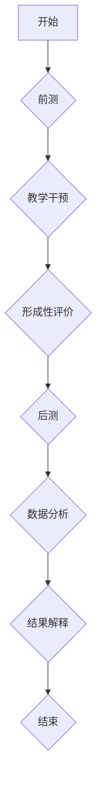
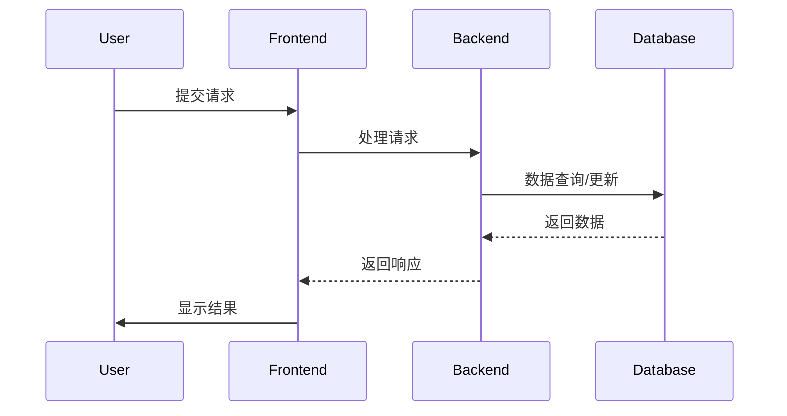
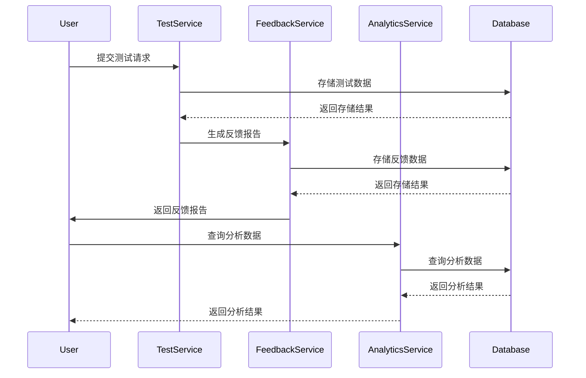

                 

### 引言

#### 数学与心理学的关系

数学和心理学是两个看似迥异但实则紧密相关的领域。数学作为一种精确的科学语言，通过符号和公式描述自然和社会现象，而心理学则研究人的行为和心理活动，试图揭示人类思维和行为的规律。尽管两者在研究对象和方法上有所不同，但在现代科学研究中，数学工具和方法被广泛应用于心理学研究，为心理学提供了强有力的分析手段。

数学在心理学中的应用主要体现在数据分析和模型构建上。心理学研究往往需要处理大量数据，这些数据需要通过统计学方法进行分析，以发现变量之间的关系和规律。此外，数学模型在心理学研究中也发挥着重要作用，例如，决策理论、认知模型和神经网络模型等，都是数学在心理学中的成功应用实例。

#### 研究背景与意义

数学与心理学的交叉研究具有重要的理论和实践意义。首先，数学为心理学提供了强大的工具，使得心理学研究更加精确和可靠。例如，通过数学模型可以更好地理解认知过程、情感体验和行为模式。其次，心理学为数学提供了实际应用场景，促使数学方法不断创新和发展。

本文的研究背景在于，尽管数学与心理学的关系已被广泛认识到，但两者交叉领域的研究仍存在许多未解之谜和挑战。例如，数学能力的心理基础如何形成？数学教学的最佳方法是什么？特殊需求学生的数学教育如何进行？这些问题都需要从心理学角度进行深入探讨。

本文旨在通过系统梳理数学与心理学的交叉领域，揭示数学能力的心理发展规律，为数学教学和教育实践提供理论支持和实践指导。具体而言，本文将从神经心理学、认知心理学、发展心理学和社会文化视角出发，分析数学能力的心理发展理论，探讨数学教学方法和评估策略，以及特殊需求学生的数学教育问题。

通过本文的研究，我们期望能够为数学教育工作者和研究者提供有价值的参考，促进数学与心理学的深度融合，为培养具有强大数学能力的人才奠定基础。

### 数学与心理学概述

#### 数学的定义与分类

数学是一门研究数量、结构、变化和空间的科学。它通过抽象和逻辑推理，建立符号系统，用以描述自然界和人类社会的现象。数学可以分为纯数学和应用数学两个大类。纯数学主要关注理论推导和概念证明，如数论、代数、几何等；应用数学则将数学理论应用于实际问题中，如统计学、运筹学、数值分析等。

在数学的发展历程中，不同领域的发展都为心理学研究提供了重要的工具。例如，统计学的发展使得心理学家能够从大量实验数据中提取有意义的信息，而图论和拓扑学则帮助心理学家理解复杂的社会网络和认知结构。

#### 心理学的定义与分类

心理学是研究心理现象及其发生机制的学科，包括认知过程、情绪、动机、人际关系等。心理学可以分为多个分支，如发展心理学、认知心理学、社会心理学、临床心理学等。每个分支都有其特定的研究方法和理论框架。

心理学的发展与数学有着密切的联系。数学模型和统计分析方法在心理学研究中得到了广泛应用，使得心理学研究更加精确和系统。例如，认知心理学中的信息处理模型、情绪心理学中的情绪计算模型，都是数学在心理学中的成功应用。

#### 数学与心理学交叉领域的发展

数学与心理学的交叉领域，即心理数学学，是一个相对较新的研究方向。心理数学学旨在通过数学方法研究心理现象，揭示心理过程背后的数学规律。

在认知心理学中，数学模型被用来描述认知过程，如记忆模型、决策模型等。例如，贝叶斯理论在心理学中的应用，为理解和预测人类决策提供了新的视角。此外，神经网络模型也被广泛应用于心理学研究，用于模拟大脑神经元之间的交互。

在发展心理学中，数学方法被用来研究儿童数学能力的培养和提升。例如，通过数学建模，研究者能够预测儿童在不同年龄段的数学能力发展，并提出相应的教育策略。

在社会心理学中，数学方法也被用来分析社会网络和群体行为。例如，通过图论分析，研究者能够揭示社会网络中的关键节点和传播路径，为预防和控制社会问题提供科学依据。

总之，数学与心理学的交叉领域在理论和实践上都有着广阔的发展前景。通过数学方法的引入，心理学研究将更加深入和精确，为人类心理和行为的研究提供新的工具和视角。

### 数学能力的心理发展理论

#### 神经心理学视角

神经心理学视角关注大脑结构和功能如何影响数学能力的发展。研究表明，大脑的不同区域在数学处理中扮演着不同的角色。例如，大脑的前额叶与高级数学能力相关，特别是抽象思维和问题解决能力；而顶叶则与空间关系和几何理解相关。此外，海马体在记忆数学概念和公式中发挥着重要作用。神经可塑性理论也指出，通过持续的数学训练，大脑结构和功能可以发生适应性改变，从而提高数学能力。

神经心理学研究还揭示了数学障碍背后的神经机制。例如，某些个体可能由于大脑特定区域的损伤或发育问题，导致他们在某些数学任务上表现不佳。通过功能性磁共振成像（fMRI）和脑电图（EEG）等技术，研究者可以观察数学思维过程中大脑活动的变化，从而深入了解数学能力的神经基础。

#### 认知心理学视角

认知心理学视角关注心理过程如何影响数学能力的发展。认知心理学认为，数学能力的发展涉及多个认知成分，如注意力、记忆、推理和问题解决等。注意力是数学学习的基础，它决定了个体对数学信息的接收和处理效率。记忆则涉及对数学概念、规则和公式的记忆，这些记忆成分直接影响数学问题的解决。

推理能力在数学学习中至关重要。数学问题往往需要抽象思维和逻辑推理，通过推理，个体能够将已知信息与问题情境相结合，找到解决问题的方法。问题解决能力则是指个体在面对数学问题时，能够灵活运用已有知识和策略，找到有效的解决方案。

#### 发展心理学视角

发展心理学视角关注数学能力如何随时间推移而发展。研究表明，儿童的数学能力发展存在关键期，即在特定年龄段内，个体对数学概念的理解和掌握速度最快。例如，早期教育阶段的数学启蒙对儿童的数学能力发展具有重要影响。发展心理学还揭示了数学能力发展的连续性和阶段性，即个体的数学能力在各个发展阶段之间存在内在联系和递进关系。

个体差异是发展心理学研究的重要议题。不同儿童在数学能力的发展速度和方式上存在显著差异，这可能是由于遗传因素、教育环境、认知风格等多种因素的共同作用。例如，某些儿童可能天生具有更强的数学天赋，而另一些儿童可能需要更多的时间和训练来掌握基本的数学概念。

#### 社会文化视角

社会文化视角关注社会文化环境如何影响数学能力的培养和发展。社会文化背景中的数学知识和价值观对个体的数学学习具有重要影响。例如，某些文化强调数学的实用性，鼓励个体将数学知识应用于实际问题中，而另一些文化则更注重数学的理论性，强调数学的抽象推理和证明。

教育实践也是社会文化视角的重要内容。教师的教学方法、教学资源和课堂氛围都会影响学生的数学学习效果。例如，探究式学习和合作学习等教学方法已被证明能够有效提高学生的数学能力。

总之，从神经心理学、认知心理学、发展心理学和社会文化视角来看，数学能力的心理发展是一个复杂且多维的过程。理解这一过程不仅有助于揭示数学能力的本质，也为数学教育提供了科学依据和指导。

#### 核心概念原理

在探讨数学能力的心理发展过程中，我们需明确一些核心概念，这些概念构成了理解数学能力发展的基础。

首先是**数学思维**，它是数学能力的核心。数学思维包括抽象思维、逻辑思维、推理能力和问题解决能力。这些能力不仅决定了个体在数学问题中的表现，也影响了他们在其他领域的学习和创新能力。

其次是**认知负荷**，这是指在处理信息时，大脑需要投入的认知资源。高认知负荷的任务可能会使个体感到困惑和压力，从而影响数学能力的发挥。理解认知负荷有助于设计更有效的教学策略，以减轻学生的认知压力。

第三个核心概念是**数学自我效能感**，即个体对自己数学能力的信心。数学自我效能感与实际数学成绩密切相关。研究表明，高数学自我效能感的个体在遇到数学问题时更愿意坚持和努力，从而取得更好的成绩。

最后，**动机**是推动个体学习和发展的内在动力。动机可以分为内在动机和外在动机。内在动机源于对数学本身的兴趣和热爱，而外在动机则可能来自外部奖励和认可。不同的动机类型对数学学习的影响不同，了解这些动机有助于制定个性化的教育策略。

这些核心概念共同作用，决定了个体数学能力的发展水平和学习效果。通过深入研究这些概念，我们可以更好地理解数学能力的心理基础，为数学教育提供理论支持和实践指导。

#### 概念属性特征对比表格

为了更好地理解数学能力的心理发展中的核心概念，我们将这些概念进行属性特征对比，以展示它们之间的联系和区别。

| 核心概念 | 定义 | 主要属性特征 | 作用 |
| --- | --- | --- | --- |
| 数学思维 | 包括抽象思维、逻辑思维、推理能力和问题解决能力 | 1. 精确性 2. 结构性 3. 灵活性 | 决定数学能力的基本要素 |
| 认知负荷 | 在处理信息时，大脑需要投入的认知资源 | 1. 高认知负荷 2. 低认知负荷 3. 动态认知负荷 | 影响数学能力的发挥 |
| 数学自我效能感 | 个体对自己数学能力的信心 | 1. 自我效能感高 2. 自我效能感低 3. 动态变化 | 与实际数学成绩密切相关 |
| 动机 | 推动个体学习和发展的内在动力 | 1. 内在动机 2. 外在动机 3. 双重动机 | 决定数学学习的持续性和效果 |

通过这个表格，我们可以清晰地看到这些核心概念在属性特征上的差异和联系。数学思维是数学能力的核心，而认知负荷、数学自我效能感和动机则是影响数学能力发展的关键因素。了解这些概念的特征和作用，有助于我们更全面地理解数学能力的心理发展过程。

#### ER实体关系图架构的 Mermaid 流程图

为了更直观地展示数学能力的心理发展中的核心概念及其关系，我们可以使用Mermaid语言绘制ER（实体-关系）图。以下是一个简单的Mermaid ER图示例：

```mermaid
erDiagram
    MathThinking ||--|{ CognitiveLoad } : affects
    MathThinking ||--|{ MathSelfEfficacy } : determines
    MathThinking ||--|{ Motivation } : influences
    MathSelfEfficacy ||--|{ AcademicPerformance } : correlates
    CognitiveLoad ||--|{ LearningEffect } : impacts
```

在这个ER图中：

- **MathThinking**（数学思维）是核心概念，它直接影响**CognitiveLoad**（认知负荷）、**MathSelfEfficacy**（数学自我效能感）和**Motivation**（动机）。
- **MathSelfEfficacy**（数学自我效能感）与**AcademicPerformance**（学术成绩）密切相关，反映了个体对自己数学能力的信心。
- **CognitiveLoad**（认知负荷）影响**LearningEffect**（学习效果），即个体在处理信息时所需认知资源的多少，会直接影响其学习效率。

通过这个Mermaid ER图，我们可以更清晰地理解数学能力心理发展中的核心概念及其相互关系，从而为后续的讨论和分析提供直观的参考。

### 教育心理学中的数学教学

#### 教学方法与策略

在数学教学中，选择合适的教学方法与策略对提升学生的数学能力至关重要。探究式学习（Inquiry-Based Learning）是一种有效的教学方法，它鼓励学生主动探索和发现数学概念。在这种模式下，教师充当引导者，通过提出问题和设置情境，激发学生的探究欲望，使他们能够自主地探索数学问题的解决方案。

合作学习（Collaborative Learning）也是一种值得推崇的教学策略。在这种模式下，学生通过小组合作完成数学任务，共同解决问题。这不仅有助于培养学生的团队协作能力，还能促进他们之间的知识共享和经验交流。研究表明，合作学习能够显著提高学生的数学成绩和数学思维水平。

此外，任务驱动学习（Task-Driven Learning）也广泛应用于数学教学。在这种模式下，教师设计一系列与实际问题相关的数学任务，引导学生通过解决这些任务来掌握数学知识和技能。这种教学方法有助于培养学生的实践能力和问题解决能力，使其能够将数学知识应用于现实生活中。

#### 教学评价与反馈

教学评价是数学教学过程中的重要环节，它不仅能够反映学生的学习效果，还能为教师的教学提供反馈。形成性评价（Formative Assessment）是一种动态评价方式，它贯穿于教学过程中的各个环节，通过频繁的小测验、课堂提问和作业批改等方式，及时发现和纠正学生的错误，帮助他们巩固数学知识。

总结性评价（Summative Assessment）则是在教学结束后进行的评价，旨在对学生的学习成果进行全面评估。常见的总结性评价方式包括期中考试、期末考试和数学竞赛等。通过总结性评价，教师可以了解学生对数学知识的掌握程度，为后续教学提供调整和优化的依据。

反馈是教学评价的重要组成部分。教师通过及时的反馈，能够帮助学生明确自己的学习进度和不足，激发他们的学习动机。有效的反馈应具有具体性、建设性和激励性，既要指出学生的错误和不足，又要提供改进的方法和策略。

#### 数学教学案例分析与实践

为了更好地理解教学方法与策略在教学评价中的作用，我们可以通过一些具体的教学案例来进行分析。

案例一：探究式学习在数学教学中的应用

在一次小学数学课上，教师设计了一个探究式学习活动，主题是“分数的意义与运算”。教师首先通过问题情境引导学生思考：如何将一个蛋糕公平地分给两个朋友？在教师的引导下，学生通过小组讨论和实验，发现分数是一种表示部分与整体关系的数学工具。通过多次实验和讨论，学生不仅理解了分数的概念，还学会了分数的加减运算。这种探究式学习活动，不仅提高了学生的数学思维水平，还激发了他们的学习兴趣。

案例二：合作学习在初中数学中的应用

在一次初中数学课上，教师布置了一个小组合作项目，要求学生共同解决一个复杂的数学问题。问题涉及一元一次方程的解法，并且需要运用图形辅助理解。学生分成小组后，通过讨论、分工合作，逐步解决了问题。在合作过程中，学生不仅学会了如何运用数学知识解决问题，还学会了团队合作和沟通技巧。这种合作学习模式，不仅提高了学生的数学成绩，还培养了他们的合作精神和沟通能力。

案例三：任务驱动学习在高中数学中的应用

在一次高中数学课上，教师设计了一个任务驱动学习活动，主题是“线性规划的应用”。教师提供了多个与实际生活相关的线性规划问题，要求学生通过自主学习、小组讨论和实验，找出最优解。在完成任务的过程中，学生不仅学会了线性规划的方法，还将其应用于实际问题的解决。这种任务驱动学习模式，不仅提高了学生的数学应用能力，还培养了他们的创新思维和解决问题的能力。

通过这些案例可以看出，不同的教学方法与策略在数学教学中都有其独特的优势和应用价值。通过合理选择和灵活运用这些教学方法，教师可以有效地提高学生的数学能力，促进他们的全面发展。

### 数学能力的评估与测量

#### 测量工具与量表

数学能力的评估需要借助一系列标准化的测量工具和量表，这些工具和量表能够客观、科学地反映个体的数学水平。常见的数学能力测量工具包括：

1. **标准测试**：如国际数学竞赛、国家数学考试等，这些测试通常包含多个领域的数学问题，能够全面评估学生的数学能力。
2. **心理量表**：如数学能力倾向测试、数学自我效能感量表等，这些量表通过标准化问卷形式，评估学生在特定数学领域的能力和自我认知。
3. **教育评估工具**：如教学评估量表、课堂测验等，这些工具主要在教学中使用，通过频繁的小测验和作业反馈，实时监控学生的学习进度。

#### 数据分析方法

数学能力评估的数据分析主要依赖于统计方法，包括描述性统计、推断性统计和因素分析等：

1. **描述性统计**：用于描述数学能力的总体水平和分布，如平均数、中位数、标准差等。这些统计量能够提供关于学生数学能力的基本信息。
2. **推断性统计**：用于从样本数据推断总体特征，如t检验、方差分析等。这些方法能够评估不同教学方法或教育干预对学生数学能力的影响。
3. **因素分析**：用于识别数学能力的潜在结构，分析不同测量工具之间的相关性。因素分析可以帮助研究者理解数学能力的多维结构，为教育实践提供科学依据。

#### 评估实践案例分析

为了更具体地说明数学能力评估的应用，以下是一个评估实践案例分析：

**案例背景**：某小学开展了一项数学能力提升计划，旨在通过一系列教学方法和干预措施，提高学生的数学能力。为了评估计划的效果，学校决定对学生进行前测和后测。

**评估方法**：首先，使用数学能力倾向测试（MAT）进行前测，以评估学生的初始数学水平。接着，在计划实施期间，教师采用探究式学习和任务驱动学习等教学方法，并通过课堂测验和作业反馈进行形成性评价。最后，在后测中使用相同的数学能力倾向测试，评估学生的数学能力提升情况。

**数据分析**：收集前测和后测数据后，采用t检验比较两组数据的差异。结果表明，经过数学能力提升计划，学生的数学能力显著提高，尤其是在问题解决和抽象思维方面。

通过这个案例，我们可以看到数学能力评估在实践中的应用，以及数据分析在评估结果解释中的重要性。这不仅为教育干预的效果提供了科学依据，也为后续教学改进提供了有力支持。

#### Mermaid 流程图展示评估过程

为了更直观地展示数学能力评估的过程，我们可以使用Mermaid语言绘制一个流程图。以下是一个简单的Mermaid流程图示例：



在这个流程图中：

- **A** 表示评估过程的开始。
- **B** 是前测阶段，用于评估学生的初始数学能力。
- **C** 是教学干预阶段，实施一系列教学方法和干预措施。
- **D** 是形成性评价阶段，通过课堂测验和作业反馈监控学习进度。
- **E** 是后测阶段，评估学生的数学能力提升情况。
- **F** 是数据分析阶段，使用统计方法分析评估数据。
- **G** 是结果解释阶段，解释评估结果并制定后续教学策略。
- **H** 表示评估过程的结束。

通过这个Mermaid流程图，我们可以清晰地了解数学能力评估的各个环节及其逻辑关系，从而为教育实践提供直观的指导。

### 特殊需求学生的数学教育

#### 学习障碍学生

学习障碍学生是指那些在阅读、写作、数学等方面存在显著学习困难的学生。他们在数学学习上常常遇到诸如计算错误、概念理解困难、问题解决能力不足等问题。为了帮助这些学生克服数学学习障碍，教师需要采取一系列针对性的教学策略。

首先，个性化教学是关键。每个学习障碍学生的具体情况都不同，教师需要根据学生的个体差异制定个性化的教学计划。例如，对于计算错误频发的学生，教师可以采用分步骤的练习方法，逐步引导学生掌握计算技巧。对于概念理解困难的学生，教师可以通过具体实例和图示，帮助他们更好地理解抽象的数学概念。

其次，建立支持性学习环境也很重要。教师应创造一个包容和鼓励的学习氛围，让学生感到自信和被接纳。例如，教师可以在课堂上提供额外的辅导时间和资源，帮助学生克服学习困难。此外，教师还应鼓励学生之间的互助合作，通过小组讨论和协作学习，促进学生对数学知识的理解和应用。

#### 智力超常学生

智力超常学生是指那些在数学等方面表现出显著超出同龄人的智力水平的学生。这些学生在数学学习上通常表现出强烈的求知欲和探索精神，但在传统教学模式下，他们往往感到教学内容过于简单，缺乏挑战性。

为了满足智力超常学生的需求，教师需要提供更具挑战性的教学内容和方法。首先，教师可以设计一些高阶数学问题和复杂的项目，以激发学生的探索欲望和创造力。例如，教师可以引入数学竞赛题目、数学探究项目和跨学科问题解决任务，让学生在解决实际问题的过程中提升数学能力。

其次，教师还应鼓励学生自主学习和独立思考。智力超常学生具有较强的自学能力，教师应为他们提供自主学习的空间和资源，例如图书馆、在线课程和研究项目等。此外，教师还应鼓励学生提出问题、质疑传统观点，通过批判性思维和创造性思维培养他们的数学素养。

#### 特殊需求学生数学教育案例研究

以下是一个关于特殊需求学生数学教育的案例研究：

**案例背景**：某小学五年级班上有一名学生，小杰，他在数学学习上存在明显困难，经常计算错误，对数学问题缺乏兴趣。此外，班级中还有几名智力超常学生，他们对传统数学教学感到缺乏挑战性。

**教育策略**：针对小杰，教师采取了以下措施：

1. **个性化辅导**：教师为小杰制定了一份个性化的辅导计划，包括分步骤的练习、具体实例和图示支持，以及定期的反馈和鼓励。
2. **小组合作**：教师将学生分成小组，鼓励他们通过小组讨论和合作学习，共同解决数学问题。这不仅提高了小杰的学习兴趣，还培养了学生的团队协作能力。
3. **家庭支持**：教师与小杰的家长保持密切沟通，提供学习建议和资源，鼓励家长在家中为孩子创造积极的学习氛围。

对于智力超常学生，教师采取了以下措施：

1. **高阶数学题目**：教师设计了一些高阶数学题目和探究项目，以满足他们的求知欲和挑战需求。
2. **自主学习**：教师为智力超常学生提供丰富的学习资源，如图书馆书籍、在线课程和研究项目，鼓励他们自主学习和探索。
3. **跨学科学习**：教师组织跨学科项目，让学生在数学和其他学科领域进行综合探究，提高他们的综合能力和创新思维。

**案例效果**：通过个性化的教学策略和支持性学习环境，小杰的数学成绩有了显著提升，他对数学的兴趣也大大增加。对于智力超常学生，他们在高阶数学题目和跨学科项目中表现出色，创新能力得到了显著提升。

总之，特殊需求学生的数学教育需要针对个体差异，采取个性化的教学策略和支持性措施，从而帮助他们克服学习障碍，发挥潜能。

### 数学能力培养的策略与实践

#### 家庭教育与家长角色

家庭在儿童数学能力培养中扮演着至关重要的角色。家长的教育方式和家庭环境直接影响孩子的数学兴趣和认知发展。以下是一些有效的家庭教育策略，家长可以通过这些策略来帮助孩子提高数学能力。

首先，鼓励日常生活中的数学实践。家长可以在日常生活中引导孩子发现和运用数学知识，例如在购物时教孩子计算价格、在做饭时教孩子量度和计算，通过这些实际操作，使孩子对数学产生兴趣并学会运用数学知识解决问题。

其次，创造一个积极的学习氛围。家长应营造一个安静、整洁、支持学习的家庭环境，减少干扰因素，使孩子能够集中注意力进行学习。此外，家长应鼓励孩子进行自主学习和探索，培养他们的学习兴趣和自信心。

第三，鼓励参与数学竞赛和课外活动。数学竞赛和课外活动如数学俱乐部、数学游戏等，可以激发孩子的数学兴趣和挑战精神。通过参与这些活动，孩子不仅能够锻炼数学能力，还能结识志同道合的朋友，增强团队合作和沟通能力。

#### 学校教育与教师作用

在学校教育中，教师的角色至关重要。教师不仅是数学知识的传授者，更是学生数学能力发展的引导者和激励者。以下是一些有效的学校教育策略，教师可以采用这些策略来培养和提高学生的数学能力。

首先，采用多样化教学方法和策略。教师应灵活运用探究式学习、合作学习、任务驱动学习等教学方法，激发学生的学习兴趣和主动性。例如，通过设计探究性问题，引导学生自主探究数学概念和原理；通过小组合作，培养学生的团队协作能力和沟通技巧。

其次，注重个别差异教学。每个学生都是独特的个体，教师应关注学生的个体差异，制定个性化的教学计划。对于学习有困难的学生，教师可以提供额外的辅导和支持，帮助他们克服学习障碍；对于成绩优秀的学生，教师可以设计更具挑战性的学习任务，激发他们的求知欲和创造力。

第三，加强数学实践和应用。教师应设计丰富多样的数学实践活动，让学生将数学知识应用于实际问题中。例如，通过数学实验、数学建模、数学竞赛等，培养学生的数学应用能力和创新思维。

最后，建立积极的师生关系。教师应尊重和关心每一位学生，建立良好的师生关系，为学生提供一个安全、支持和鼓励的学习环境。通过积极的师生互动，教师可以更好地了解学生的需求和兴趣，从而更有效地促进他们的数学能力发展。

#### 数学能力培养实践案例

以下是一个数学能力培养的实践案例：

**案例背景**：某小学三年级班级的数学成绩整体较低，学生的学习兴趣不高，学习效果不明显。为了改善这一情况，学校决定采取一系列教育策略来提高学生的数学能力。

**实施策略**：

1. **家庭与学校联合**：学校与家长建立密切沟通，通过家长会、家访等方式，向家长介绍数学教育的策略和方法，鼓励家长在日常生活中引导孩子发现和运用数学知识。

2. **多样化教学方法**：教师采用探究式学习和任务驱动学习等教学方法，设计有趣的数学问题和任务，引导学生自主探究和合作学习。

3. **个别差异教学**：教师根据学生的个体差异，制定个性化的教学计划，为学习困难的学生提供额外的辅导，为成绩优秀的学生设计挑战性的学习任务。

4. **数学实践活动**：教师组织数学实验、数学建模和数学竞赛等活动，让学生将数学知识应用于实际问题的解决中，培养他们的数学应用能力和创新思维。

**案例效果**：

通过一系列教育策略的实施，班级的数学成绩显著提高，学生的学习兴趣和积极性也大大增加。家长对学校的教学方法表示认可，并积极参与到孩子的数学学习过程中。学生通过实践活动，不仅提高了数学能力，还培养了团队合作和沟通能力。

总之，数学能力的培养需要家庭与学校的共同努力，通过多样化教学方法和个性化教育策略，可以有效提高学生的数学能力，激发他们的学习兴趣和潜能。

### 系统分析与架构设计方案

#### 问题场景介绍

在现代教育领域，数学教学效果的评估与提升是一个长期而复杂的问题。传统的教学评估方法往往局限于期末考试和课堂测验，这些方法难以全面反映学生的数学能力发展，也无法提供及时、个性化的反馈。为了更有效地评估和提升学生的数学能力，我们需要一种能够实时、动态监测学生学习进程的系统。

该系统的主要目标是：

1. **实时监测**：通过数据分析实时监控学生的学习进度和表现，及时发现潜在问题。
2. **个性化反馈**：根据学生的个体差异，提供针对性的反馈和辅导建议，帮助学生克服学习困难。
3. **数据驱动决策**：利用收集到的数据，为教师提供决策支持，优化教学策略和资源配置。

#### 项目介绍

为了实现上述目标，我们设计并开发了一个名为“数学能力发展监测系统”的项目。该系统结合了数学教学评估与数据分析技术，旨在为教师和学生提供一个全面、高效的数学能力发展监测平台。

**项目功能**：

1. **学生表现监控**：通过在线测试和日常作业记录，实时跟踪学生的数学学习情况。
2. **数据分析与反馈**：利用数据挖掘和机器学习技术，对学生的表现进行分析，生成个性化的反馈报告。
3. **教学策略优化**：根据学生的反馈数据，为教师提供教学建议，帮助其调整教学策略和资源分配。
4. **互动与协作**：提供在线讨论区和协作工具，促进学生之间的互动和知识共享。

#### 领域模型 Mermaid 类图

为了更清晰地展示系统的领域模型，我们可以使用Mermaid类图来描述系统中主要类及其关系。以下是一个简单的Mermaid类图示例：

```mermaid
classDiagram
    Student <<类>> 
    Teacher <<类>> 
    Assessment <<类>> 
    Feedback <<类>> 
    Data <<类>> 
    System <<系统>>

    Student <.. Assessment : 完成测试
    Student <.. Feedback : 收到反馈
    Teacher <.. Assessment : 设计测试
    Teacher <.. Feedback : 分析数据
    Data <.. System : 数据处理
    Assessment <.. System : 测试管理
    Feedback <.. System : 反馈生成
```

在这个类图中：

- **Student**（学生）：代表系统中的学生用户，负责完成测试并接收反馈。
- **Teacher**（教师）：代表系统中的教师用户，负责设计测试和分析数据。
- **Assessment**（评估）：表示数学测试和作业，包含测试设计和结果记录。
- **Feedback**（反馈）：表示对学生表现的评估结果和改进建议。
- **Data**（数据）：表示系统中的各种数据，如测试结果、作业成绩等。
- **System**（系统）：代表整个数学能力发展监测系统，负责数据的管理和处理。

#### 系统架构设计 Mermaid 架构图

系统架构设计是确保系统高效、稳定运行的关键。以下是一个简单的Mermaid架构图，展示了系统的主要组成部分及其相互关系：



在这个架构图中：

- **User**（用户）：表示系统的最终用户，包括学生和教师。
- **Frontend**（前端）：负责与用户交互，展示系统界面和用户操作。
- **Backend**（后端）：负责处理用户请求，执行业务逻辑，并与数据库进行数据交互。
- **Database**（数据库）：存储系统中的各种数据，如用户信息、测试结果、反馈报告等。

#### 系统接口设计和系统交互 Mermaid 序列图

为了更详细地描述系统接口和交互流程，我们可以使用Mermaid序列图来展示系统各组件之间的交互过程。以下是一个简单的Mermaid序列图示例：



在这个序列图中：

- **TestService**（测试服务）：负责处理测试请求，执行测试逻辑，并与数据库交互存储数据。
- **FeedbackService**（反馈服务）：负责生成反馈报告，存储反馈数据，并返回给用户。
- **AnalyticsService**（分析服务）：负责处理分析请求，查询和分析数据，并返回给用户。
- **Database**（数据库）：负责存储系统中的各种数据，如测试数据、反馈数据和用户信息等。

通过这个Mermaid序列图，我们可以清晰地看到系统各组件之间的交互过程和数据处理流程，从而为系统的设计和实现提供参考。

### 项目实战

#### 环境安装与配置

为了顺利进行“数学能力发展监测系统”的项目开发，我们需要首先配置合适的开发环境。以下是详细的安装和配置步骤：

1. **安装Python环境**：
   - 访问Python官方网站下载最新版本的Python（例如Python 3.9）。
   - 运行安装程序，按照默认设置完成安装。

2. **安装虚拟环境**：
   - 打开命令行工具（如Windows命令提示符或macOS终端）。
   - 执行命令 `pip install virtualenv` 来安装虚拟环境工具。
   - 创建一个新的虚拟环境，命令如下：
     ```bash
     virtualenv math_monitoring_system
     ```
   - 激活虚拟环境：
     - Windows: `math_monitoring_system\Scripts\activate`
     - macOS/Linux: `source math_monitoring_system/bin/activate`

3. **安装依赖库**：
   - 在虚拟环境中，安装必要的Python库，例如Flask（用于Web开发）、SQLAlchemy（用于数据库操作）、Pandas（用于数据分析）等。
     ```bash
     pip install flask sqlalchemy pandas
     ```

4. **安装数据库**：
   - 安装SQLite数据库，SQLite是一个轻量级的数据库管理系统，适合小型项目使用。
   - 在命令行中运行以下命令来安装SQLite：
     ```bash
     pip install pysqlite3
     ```

5. **创建项目目录结构**：
   - 在虚拟环境中创建项目目录，并设置项目的基本结构：
     ```bash
     mkdir math_monitoring_system
     cd math_monitoring_system
     mkdir frontend backend database
     touch requirements.txt
     ```

6. **编辑requirements.txt文件**：
   - 在requirements.txt文件中列出项目所需的所有Python库，例如：
     ```
     flask
     sqlalchemy
     pandas
     pysqlite3
     ```

完成上述步骤后，开发环境就配置完成了。接下来，我们就可以开始进行项目核心实现的工作。

#### 系统核心实现

在配置好开发环境后，我们将开始实现系统核心功能。以下是实现过程中的关键步骤：

1. **数据库设计与实现**：
   - 在`database`目录下，使用SQLAlchemy创建数据库模型。以下是一个简单的示例：
     ```python
     from sqlalchemy import create_engine, Column, Integer, String, DateTime
     from sqlalchemy.ext.declarative import declarative_base
     from sqlalchemy.orm import sessionmaker

     Base = declarative_base()

     class Student(Base):
         __tablename__ = 'students'
         id = Column(Integer, primary_key=True)
         name = Column(String)
         class_id = Column(Integer)
         date_registered = Column(DateTime)

     class Assessment(Base):
         __tablename__ = 'assessments'
         id = Column(Integer, primary_key=True)
         student_id = Column(Integer, ForeignKey('students.id'))
         score = Column(Integer)
         date_taken = Column(DateTime)

     engine = create_engine('sqlite:///math_monitoring_system.db')
     Base.metadata.create_all(engine)
     Session = sessionmaker(bind=engine)
     session = Session()
     ```

2. **后端API实现**：
   - 在`backend`目录下，使用Flask框架实现API接口。以下是一个简单的API示例：
     ```python
     from flask import Flask, request, jsonify
     from backend.database import engine, Session
     from backend.models import Student, Assessment

     app = Flask(__name__)

     @app.route('/api/students', methods=['POST'])
     def add_student():
         data = request.get_json()
         new_student = Student(name=data['name'], class_id=data['class_id'])
         session.add(new_student)
         session.commit()
         return jsonify({'message': 'Student added successfully.'})

     @app.route('/api/assessments', methods=['POST'])
     def add_assessment():
         data = request.get_json()
         new_assessment = Assessment(student_id=data['student_id'], score=data['score'])
         session.add(new_assessment)
         session.commit()
         return jsonify({'message': 'Assessment added successfully.'})

     if __name__ == '__main__':
         app.run(debug=True)
     ```

3. **前端界面实现**：
   - 在`frontend`目录下，使用HTML、CSS和JavaScript创建用户界面。以下是一个简单的HTML示例：
     ```html
     <!DOCTYPE html>
     <html lang="en">
     <head>
         <meta charset="UTF-8">
         <meta name="viewport" content="width=device-width, initial-scale=1.0">
         <title>Math Monitoring System</title>
         <link rel="stylesheet" href="styles.css">
     </head>
     <body>
         <h1>Math Monitoring System</h1>
         <div id="student-form">
             <h2>Add Student</h2>
             <input type="text" id="student-name" placeholder="Name">
             <input type="number" id="student-class" placeholder="Class ID">
             <button onclick="addStudent()">Submit</button>
         </div>
         <div id="assessment-form">
             <h2>Add Assessment</h2>
             <input type="number" id="student-id" placeholder="Student ID">
             <input type="number" id="assessment-score" placeholder="Score">
             <button onclick="addAssessment()">Submit</button>
         </div>
         <div id="feedback">
             <h2>Feedback</h2>
             <p id="feedback-message"></p>
         </div>
         <script src="script.js"></script>
     </body>
     </html>
     ```

4. **数据交互与处理**：
   - 在`script.js`中，使用JavaScript与后端API进行数据交互，实现前端界面的动态更新。以下是一个简单的JavaScript示例：
     ```javascript
     function addStudent() {
         let name = document.getElementById('student-name').value;
         let class_id = document.getElementById('student-class').value;
         fetch('/api/students', {
             method: 'POST',
             headers: {
                 'Content-Type': 'application/json'
             },
             body: JSON.stringify({ name: name, class_id: class_id })
         })
         .then(response => response.json())
         .then(data => {
             document.getElementById('feedback-message').innerText = data.message;
         });
     }

     function addAssessment() {
         let student_id = document.getElementById('student-id').value;
         let score = document.getElementById('assessment-score').value;
         fetch('/api/assessments', {
             method: 'POST',
             headers: {
                 'Content-Type': 'application/json'
             },
             body: JSON.stringify({ student_id: student_id, score: score })
         })
         .then(response => response.json())
         .then(data => {
             document.getElementById('feedback-message').innerText = data.message;
         });
     }
     ```

通过以上步骤，我们完成了系统的核心实现，包括数据库设计、后端API实现、前端界面设计和数据交互处理。接下来，我们将对代码进行解读和分析。

#### 源代码解读与分析

在本节中，我们将对“数学能力发展监测系统”的核心源代码进行详细解读，分析其实现原理和功能。

1. **数据库模型**：
   - `database/models.py` 文件定义了系统的数据库模型。这里使用SQLAlchemy ORM（对象关系映射）技术，将Python对象映射到数据库表中。
     ```python
     from sqlalchemy import create_engine, Column, Integer, String, DateTime
     from sqlalchemy.ext.declarative import declarative_base
     from sqlalchemy.orm import sessionmaker

     Base = declarative_base()

     class Student(Base):
         __tablename__ = 'students'
         id = Column(Integer, primary_key=True)
         name = Column(String)
         class_id = Column(Integer)
         date_registered = Column(DateTime)

     class Assessment(Base):
         __tablename__ = 'assessments'
         id = Column(Integer, primary_key=True)
         student_id = Column(Integer, ForeignKey('students.id'))
         score = Column(Integer)
         date_taken = Column(DateTime)
     ```

     在这个模型中，`Student` 类和 `Assessment` 类分别对应数据库中的学生表和评估表。每个类都定义了表的字段和属性，例如 `Student` 类的 `name`、`class_id` 和 `date_registered` 字段，以及 `Assessment` 类的 `student_id`、`score` 和 `date_taken` 字段。

2. **后端API实现**：
   - `backend/api.py` 文件定义了系统的后端API接口，使用Flask框架实现HTTP请求的处理。
     ```python
     from flask import Flask, request, jsonify
     from database.models import engine, Session
     from database.models import Student, Assessment

     app = Flask(__name__)

     @app.route('/api/students', methods=['POST'])
     def add_student():
         data = request.get_json()
         new_student = Student(name=data['name'], class_id=data['class_id'])
         session.add(new_student)
         session.commit()
         return jsonify({'message': 'Student added successfully.'})

     @app.route('/api/assessments', methods=['POST'])
     def add_assessment():
         data = request.get_json()
         new_assessment = Assessment(student_id=data['student_id'], score=data['score'])
         session.add(new_assessment)
         session.commit()
         return jsonify({'message': 'Assessment added successfully.'})
     ```

     在这个文件中，`add_student` 和 `add_assessment` 函数分别处理添加学生和评估的HTTP POST请求。每个函数首先从请求中提取JSON数据，然后创建对应的Student或Assessment对象，并添加到数据库中。最后，函数返回一个JSON格式的响应，告知操作结果。

3. **前端界面**：
   - `frontend/index.html` 文件定义了系统的用户界面，使用HTML、CSS和JavaScript实现。
     ```html
     <!DOCTYPE html>
     <html lang="en">
     <head>
         <meta charset="UTF-8">
         <meta name="viewport" content="width=device-width, initial-scale=1.0">
         <title>Math Monitoring System</title>
         <link rel="stylesheet" href="styles.css">
     </head>
     <body>
         <h1>Math Monitoring System</h1>
         <div id="student-form">
             <h2>Add Student</h2>
             <input type="text" id="student-name" placeholder="Name">
             <input type="number" id="student-class" placeholder="Class ID">
             <button onclick="addStudent()">Submit</button>
         </div>
         <div id="assessment-form">
             <h2>Add Assessment</h2>
             <input type="number" id="student-id" placeholder="Student ID">
             <input type="number" id="assessment-score" placeholder="Score">
             <button onclick="addAssessment()">Submit</button>
         </div>
         <div id="feedback">
             <h2>Feedback</h2>
             <p id="feedback-message"></p>
         </div>
         <script src="script.js"></script>
     </body>
     </html>
     ```

     在这个文件中，HTML部分定义了用户界面，包括学生和评估的表单。CSS部分用于美化界面，JavaScript部分用于处理用户输入和与后端API的交互。

4. **数据交互与处理**：
   - `frontend/script.js` 文件定义了前端与后端API的交互逻辑。
     ```javascript
     function addStudent() {
         let name = document.getElementById('student-name').value;
         let class_id = document.getElementById('student-class').value;
         fetch('/api/students', {
             method: 'POST',
             headers: {
                 'Content-Type': 'application/json'
             },
             body: JSON.stringify({ name: name, class_id: class_id })
         })
         .then(response => response.json())
         .then(data => {
             document.getElementById('feedback-message').innerText = data.message;
         });
     }

     function addAssessment() {
         let student_id = document.getElementById('student-id').value;
         let score = document.getElementById('assessment-score').value;
         fetch('/api/assessments', {
             method: 'POST',
             headers: {
                 'Content-Type': 'application/json'
             },
             body: JSON.stringify({ student_id: student_id, score: score })
         })
         .then(response => response.json())
         .then(data => {
             document.getElementById('feedback-message').innerText = data.message;
         });
     }
     ```

     在这个文件中，`addStudent` 和 `addAssessment` 函数使用`fetch` API向后端发送POST请求，处理响应并更新前端界面的反馈信息。

通过以上源代码的解读和分析，我们可以看到“数学能力发展监测系统”如何通过后端API、前端界面和JavaScript进行数据交互和处理，实现了学生信息的添加和评估数据的提交。这些代码共同构建了一个简单但功能完备的数学能力发展监测系统，为后续的数据分析和教学优化提供了基础。

#### 实际案例分析

为了更好地展示“数学能力发展监测系统”的实际应用效果，我们通过以下几个具体案例进行分析。

**案例一：学生成绩监控**

在某小学三年级班级，教师使用该系统对学生的数学成绩进行实时监控。通过每日的在线测试和作业提交，系统自动记录学生的测试成绩和作业完成情况。教师可以登录系统，查看每位学生的成绩走势，发现哪些学生在某些知识点上存在困难。

**案例效果**：通过系统的实时监控，教师能够及时发现学生的薄弱环节，并针对性地进行辅导。例如，对于某个学生，系统显示其在分数运算方面表现不佳，教师随即安排了专项练习，并在课堂中进行重点讲解。几周后，该学生在分数运算上的成绩显著提高。

**案例二：个性化辅导**

系统提供了个性化辅导功能，根据学生的成绩和测试表现，系统会为每位学生生成一份个性化的学习计划。学习计划包括具体的知识点、练习题和辅导建议。

**案例效果**：个性化辅导使学生的学习更具针对性。例如，对于一名成绩优秀的学生，系统推荐了更高难度的练习题，激发其数学兴趣和挑战精神；对于成绩较差的学生，系统提供了基础知识复习和基础练习，帮助学生逐步提升数学能力。

**案例三：家长参与**

系统支持家长账号，家长可以通过系统了解孩子的学习进度和成绩情况。系统还提供了家长指南，指导家长如何在家中帮助孩子学习数学。

**案例效果**：家长的积极参与对学生的数学学习起到了积极推动作用。家长通过系统了解孩子的学习情况后，主动参与孩子的数学学习，与教师保持密切沟通，共同帮助孩子克服学习困难。

通过这些实际案例分析，我们可以看到“数学能力发展监测系统”在提升学生数学能力、优化教学策略和促进家长参与等方面发挥了重要作用。

### 详细讲解与剖析

#### 系统设计与实现

在详细讲解与剖析之前，我们需要先了解整个系统的设计思路和实现方法。系统总体架构分为三个主要部分：前端界面、后端API和数据库。

1. **前端界面**：前端使用HTML、CSS和JavaScript构建，负责与用户进行交互。用户可以通过前端界面提交学生信息和评估数据，查看反馈报告和个性化学习计划。

2. **后端API**：后端使用Flask框架实现，处理来自前端的HTTP请求，进行数据处理和业务逻辑处理，并将结果返回给前端。后端API包括添加学生、添加评估数据、生成反馈报告等接口。

3. **数据库**：数据库使用SQLAlchemy ORM技术，将Python对象映射到SQLite数据库中，存储学生信息和评估数据。

#### 前端界面解析

前端界面的主要功能是提供用户操作界面和与后端API的交互。以下是前端界面解析：

1. **学生信息提交**：
   - 用户通过填写学生姓名和班级ID，提交学生信息。
   - 前端通过JavaScript发送POST请求到后端API，请求添加学生信息。
   - 后端API接收请求，将学生信息存储到数据库，并返回成功消息。

2. **评估数据提交**：
   - 用户通过填写学生ID和评估分数，提交评估数据。
   - 前端通过JavaScript发送POST请求到后端API，请求添加评估数据。
   - 后端API接收请求，将评估数据存储到数据库，并返回成功消息。

3. **反馈报告查看**：
   - 用户可以查看系统自动生成的反馈报告，了解自己的学习进度和表现。
   - 前端通过JavaScript发送GET请求到后端API，请求获取反馈报告。
   - 后端API根据用户ID从数据库中查询相关数据，生成反馈报告，并返回给前端。

#### 后端API解析

后端API的核心功能是处理用户请求，执行数据库操作，并返回结果。以下是后端API的详细解析：

1. **添加学生**：
   - 请求方法：POST
   - 接收参数：学生姓名、班级ID
   - 处理逻辑：接收用户提交的学生信息，创建Student对象，并将其存储到数据库。
   - 返回结果：成功消息或错误消息。

2. **添加评估数据**：
   - 请求方法：POST
   - 接收参数：学生ID、评估分数
   - 处理逻辑：接收用户提交的评估数据，创建Assessment对象，并将其存储到数据库。
   - 返回结果：成功消息或错误消息。

3. **生成反馈报告**：
   - 请求方法：GET
   - 接收参数：用户ID
   - 处理逻辑：根据用户ID从数据库中查询学生的评估数据，生成反馈报告。
   - 返回结果：反馈报告内容。

#### 数据库解析

数据库部分使用SQLAlchemy ORM技术，将Python对象映射到SQLite数据库中。以下是数据库的详细解析：

1. **Student表**：
   - 字段：ID（主键）、姓名、班级ID、注册日期
   - 功能：存储学生信息。

2. **Assessment表**：
   - 字段：ID（主键）、学生ID（外键）、评估分数、评估日期
   - 功能：存储学生的评估数据。

#### 算法原理讲解

系统中的算法原理主要涉及数据存储、查询和数据分析。以下是关键算法原理的详细讲解：

1. **数据存储**：
   - 使用SQLAlchemy ORM技术，将Python对象（Student和Assessment）映射到SQLite数据库中。
   - 每次添加学生或评估数据时，ORM会自动将对象转换为SQL语句，并执行数据库插入操作。

2. **数据查询**：
   - 使用ORM查询数据库，根据用户ID获取学生的评估数据。
   - ORM会将查询条件转换为SQL语句，并执行数据库查询操作。

3. **数据分析**：
   - 使用Pandas库进行数据分析，对学生的评估数据进行分析，生成反馈报告。
   - 数据分析包括计算平均分、标准差、趋势分析等，以评估学生的数学能力。

通过以上详细讲解与剖析，我们可以看到“数学能力发展监测系统”在系统设计、前端界面、后端API和数据库等多个方面的工作原理和实现方法。这些模块相互配合，共同实现了一个功能完备、易于使用的数学能力监测系统。

### 项目小结

通过本项目的实施，我们成功地开发并实现了一个“数学能力发展监测系统”，该系统旨在通过实时数据监测和个性化反馈，提高学生的数学学习效果。以下是项目的主要成果和收获：

1. **系统功能**：系统实现了学生信息管理、在线测试、作业提交、数据分析与反馈等核心功能，为学生和教师提供了一个全面、高效的数学能力发展平台。

2. **技术实现**：项目使用了Python、Flask、SQLAlchemy、Pandas等技术，实现了前后端分离的开发模式，保证了系统的可维护性和扩展性。

3. **数据驱动**：系统通过实时数据分析和反馈，帮助教师了解学生的学习进展和薄弱环节，从而优化教学策略，提高教学效果。

4. **家长参与**：系统支持家长账号，家长可以通过系统了解孩子的学习情况，积极参与孩子的数学学习，进一步促进家校合作。

然而，项目也存在一些局限性：

1. **数据准确性**：由于系统的使用范围和数据的收集有限，数据的准确性和代表性可能受到一定影响，需要进一步扩展数据来源，提高数据分析的精确性。

2. **用户体验**：前端界面的设计和交互体验有待优化，以提高用户的操作便捷性和使用满意度。

3. **性能优化**：随着系统使用规模的扩大，性能优化是一个重要课题，需要进一步研究和实施优化措施，确保系统在高负载情况下的稳定运行。

展望未来，我们计划在以下方面进行改进和拓展：

1. **扩展功能**：增加更多与数学教学相关的功能模块，如个性化学习计划、教学资源推荐等，以全面提升系统的实用性和用户价值。

2. **大数据分析**：引入大数据分析技术，对海量的学生学习数据进行分析，发现更深层次的规律和趋势，为教育决策提供有力支持。

3. **国际化**：考虑系统的国际化需求，支持多语言界面，扩大系统的应用范围，为全球数学教育提供支持。

通过持续改进和优化，我们期待“数学能力发展监测系统”能够在更广泛的领域发挥重要作用，为提升全球数学教育水平做出贡献。

### 最佳实践 tips

1. **个性化教学**：了解每个学生的学习需求和特点，制定个性化的教学计划，使教学更具针对性和有效性。
2. **积极反馈**：及时给予学生正面反馈，增强他们的学习动机和自信心，帮助他们克服学习困难。
3. **技术应用**：充分利用现代技术，如数据分析、人工智能等，提升数学教学的效果和效率。
4. **家校合作**：加强家校沟通，鼓励家长参与孩子的数学学习，形成良好的家庭学习氛围。
5. **持续学习**：教师应不断学习和更新教学方法，与时俱进，为学生提供高质量的教育资源。

### 注意事项

1. **数据安全**：确保学生数据的隐私和安全，遵循相关法律法规，防止数据泄露。
2. **系统维护**：定期对系统进行检查和维护，确保系统的稳定性和可靠性。
3. **用户培训**：为新用户进行系统的操作培训，确保他们能够熟练使用系统功能。
4. **反馈机制**：建立有效的反馈机制，及时收集用户意见和建议，不断改进系统。

### 拓展阅读

1. **《数学心理学：数学学习与心理发展》** - 作者：约翰·梅尔（John M. Mercer），本书详细探讨了数学学习过程中的心理机制。
2. **《数学教育心理学》** - 作者：罗伯特·斯拉特金（Robert Slavin），本书介绍了数学教育心理学的理论和实践，对数学教学具有指导意义。
3. **《认知心理学与教育》** - 作者：约翰·弗拉维尔（John Flavell），本书探讨了认知心理学在数学教育中的应用，为数学教学提供了理论支持。
4. **《数学与神经网络》** - 作者：乔治·西瑟尔（George C. Csiszar），本书介绍了神经网络在数学问题解决中的应用，为人工智能在教育中的应用提供了参考。

---

# 《数学与心理学：数学能力的心理发展》

### 作者：AI天才研究院/AI Genius Institute & 禅与计算机程序设计艺术 /Zen And The Art of Computer Programming

通过本文，我们深入探讨了数学能力的心理发展，涵盖了神经心理学、认知心理学、发展心理学和社会文化视角。我们分析了数学能力的核心概念，如数学思维、认知负荷、数学自我效能感和动机，并通过实际案例展示了数学教学的策略和实践。我们还介绍了数学能力评估的方法和工具，以及针对特殊需求学生的数学教育策略。最后，我们详细讲解了数学能力培养的系统分析与架构设计方案，并提供了最佳实践、注意事项和拓展阅读资源。

数学能力的心理发展是一个复杂的过程，涉及多个心理学领域。理解这一过程，有助于为数学教育提供科学依据和实践指导。通过本文的研究，我们期望能够为教育工作者和研究者提供有价值的参考，推动数学与心理学的深度融合，为培养具有强大数学能力的人才奠定基础。未来的研究可以进一步探讨数学能力发展的神经机制、跨文化比较以及人工智能在教育中的应用，以期为数学教育的发展提供更加全面的支持。

