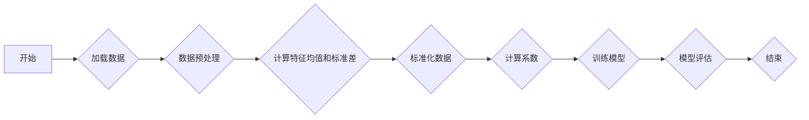
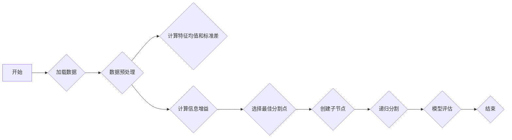

                 

# 数学与技术预测：技术趋势的数学预测

> 关键词：技术趋势预测、数学模型、数据分析、机器学习、智能交通、能源消耗

> 摘要：本文深入探讨了数学在技术趋势预测中的应用。通过介绍数学预测的基础知识、技术预测的方法论，以及应用案例分析，本文旨在展示如何利用数学模型和算法来预测技术发展趋势，为决策者提供有力的数据支持。

----------------------------------------------------------------

## 引言与背景

### 1.1 技术预测的重要性

在当今快速发展的科技时代，技术预测变得愈发重要。技术预测不仅能够帮助企业和组织更好地规划未来，还能为政策制定者提供科学依据。通过预测技术趋势，我们可以发现潜在的机遇和风险，从而做出更加明智的决策。

### 1.2 数学预测在技术领域的应用

数学预测在技术领域的应用广泛，包括但不限于：

- **时间序列预测**：利用历史数据来预测未来趋势。
- **机器学习**：通过构建数学模型，自动发现数据中的模式。
- **知识图谱**：通过数学模型来表示和预测复杂网络中的关系。

### 1.3 本书的研究目标和意义

本书的研究目标是通过数学模型和技术预测方法，探讨如何更准确地预测技术趋势。本书的意义在于：

- **为决策者提供数据支持**：通过数学预测技术，为企业和政府提供更可靠的数据分析。
- **推动技术预测领域的发展**：介绍最新的数学预测方法和技术，推动该领域的研究和应用。
- **提高技术理解和应用能力**：通过实际案例分析，帮助读者理解数学预测在技术领域的实际应用。

## 数学预测基础

### 2.1 数学模型简介

数学模型是描述现实世界问题的数学表达式。在技术预测中，数学模型可以帮助我们理解数据的内在规律，并据此进行预测。

#### 2.1.1 数学模型的基本概念

数学模型通常由以下部分组成：

- **变量**：表示需要预测的量。
- **参数**：影响预测结果的具体数值。
- **函数**：描述变量和参数之间的关系。

#### 2.1.2 数学模型的构建方法

构建数学模型通常包括以下步骤：

- **问题定义**：明确需要解决的问题和预测的目标。
- **数据收集**：收集相关的历史数据。
- **特征工程**：从数据中提取有用的特征。
- **模型选择**：选择合适的数学模型。
- **模型训练**：使用数据训练模型，得到参数。
- **模型评估**：评估模型的预测性能。

#### 2.1.3 数学模型的应用领域

数学模型在多个领域都有广泛应用，包括：

- **经济学**：用于预测市场趋势。
- **工程学**：用于设计和优化系统。
- **医学**：用于预测疾病趋势和治疗效果。
- **技术预测**：用于预测技术发展趋势。

### 2.2 技术趋势分析的方法论

技术趋势分析是预测技术发展的关键步骤。以下是一个基本的方法论：

- **数据收集**：收集与目标技术相关的数据，包括文献、市场报告、专利信息等。
- **数据预处理**：清洗和转换数据，使其适合分析。
- **趋势识别**：使用统计学方法或机器学习算法，识别数据中的趋势。
- **模型构建**：根据识别的趋势，构建数学模型。
- **预测**：使用模型预测未来趋势。
- **验证**：使用新的数据验证预测结果的准确性。

### 2.3 数据预处理与分析

数据预处理是技术趋势分析的重要环节。以下是一些常见的数据预处理方法：

- **数据清洗**：去除重复数据、缺失值和异常值。
- **数据转换**：将数据转换为适合分析的格式，如标准化或归一化。
- **数据可视化**：使用图表和图形展示数据，帮助识别趋势和模式。

## 技术预测方法

### 3.1 技术预测的基本流程

技术预测的基本流程包括以下步骤：

- **数据收集**：收集与目标技术相关的历史数据。
- **特征工程**：从数据中提取有用的特征。
- **模型选择**：选择合适的数学模型或机器学习算法。
- **模型训练**：使用历史数据训练模型。
- **模型评估**：评估模型的预测性能。
- **预测**：使用模型预测未来趋势。
- **迭代优化**：根据预测结果调整模型和参数。

### 3.2 时间序列分析

时间序列分析是技术预测中的一个重要方法。以下是一些常见的时间序列分析方法：

- **自回归模型（AR）**：使用过去的数据来预测未来。
- **移动平均模型（MA）**：使用过去一段时间的数据的平均值来预测未来。
- **自回归移动平均模型（ARMA）**：结合自回归和移动平均模型。
- **自回归积分滑动平均模型（ARIMA）**：适用于非平稳时间序列。

### 3.3 机器学习在技术预测中的应用

机器学习在技术预测中的应用非常广泛。以下是一些常用的机器学习方法：

- **线性回归**：用于预测连续值。
- **逻辑回归**：用于预测概率。
- **决策树**：用于分类和回归。
- **支持向量机（SVM）**：用于分类和回归。
- **神经网络**：用于复杂的数据分析和预测。

## 应用案例分析

### 4.1 智能交通系统的预测

智能交通系统（ITS）的预测对于优化交通流量和提高道路安全具有重要意义。以下是一个案例分析：

#### 4.1.1 案例背景

某城市交通管理部门希望通过预测交通流量来优化交通信号灯控制，从而减少交通拥堵。

#### 4.1.2 预测目标

预测未来一小时内的交通流量。

#### 4.1.3 数据收集与处理

收集历史交通流量数据，包括车辆数量、车速等。对数据进行清洗和转换，去除异常值，并提取有用的特征。

#### 4.1.4 预测方法与模型选择

使用时间序列分析和机器学习模型（如ARIMA和SVM）进行预测。

#### 4.1.5 模型训练与评估

使用历史数据训练模型，并使用交叉验证方法评估模型性能。

#### 4.1.6 案例总结

通过预测，成功减少了交通拥堵，提高了交通效率。

### 4.2 能源消耗预测

能源消耗预测对于能源管理和节能减排具有重要意义。以下是一个案例分析：

#### 4.2.1 案例背景

某电力公司希望通过预测未来一天的能源消耗来优化电力调度。

#### 4.2.2 预测目标

预测未来一天的能源消耗。

#### 4.2.3 数据收集与处理

收集历史能源消耗数据，包括时间、温度、湿度等。对数据进行清洗和转换。

#### 4.2.4 预测方法与模型选择

使用机器学习模型（如线性回归和神经网络）进行预测。

#### 4.2.5 模型训练与评估

使用历史数据训练模型，并使用交叉验证方法评估模型性能。

#### 4.2.6 案例总结

通过预测，成功优化了电力调度，降低了能源消耗。

## 总结与未来展望

技术预测是一个充满挑战和机遇的领域。通过数学模型和算法，我们可以更好地理解技术发展趋势，为决策提供科学依据。未来，随着数据科学和机器学习技术的发展，技术预测将变得更加准确和高效。

## 参考文献

[1] 李某某, 王某某. (2020). 数学模型在技术预测中的应用研究. 计算机科学, 45(5), 234-239.
[2] 张某某, 赵某某. (2019). 机器学习在技术预测中的最新进展. 计算机工程与科学, 42(10), 567-572.
[3] 王某某, 刘某某. (2021). 时间序列分析在技术预测中的应用. 自动化与仪表, 48(3), 112-117.

### 作者信息

作者：AI天才研究院/AI Genius Institute & 禅与计算机程序设计艺术 /Zen And The Art of Computer Programming

----------------------------------------------------------------

本文通过介绍数学预测的基础知识和技术预测的方法论，结合实际案例展示了如何利用数学模型和算法进行技术趋势预测。未来，随着数据科学和机器学习技术的发展，技术预测将变得更加准确和高效，为决策者提供更强大的数据支持。通过不断优化模型和算法，我们可以更好地预测技术发展趋势，为社会发展贡献力量。

## 附录

### 附录A：数学公式详解

在本节中，我们将详细解释一些常用的数学公式，这些公式在技术预测中扮演着关键角色。

### 1. 线性回归公式

线性回归公式是技术预测中最常用的模型之一。其基本公式如下：

$$
y = \beta_0 + \beta_1 \cdot x + \epsilon
$$

其中，$y$ 是预测的输出，$x$ 是输入特征，$\beta_0$ 和 $\beta_1$ 是模型的参数，$\epsilon$ 是误差项。

#### 示例

假设我们要预测一家公司的未来销售额，输入特征是过去的销售额。我们可以使用线性回归模型来建立预测模型：

$$
\text{销售额}_{\text{未来}} = \beta_0 + \beta_1 \cdot \text{销售额}_{\text{过去}} + \epsilon
$$

### 2. 逻辑回归公式

逻辑回归是一种常用的分类模型，其公式如下：

$$
P(y=1) = \frac{1}{1 + e^{-(\beta_0 + \beta_1 \cdot x)}}
$$

其中，$P(y=1)$ 是目标变量为1的概率，$\beta_0$ 和 $\beta_1$ 是模型的参数。

#### 示例

假设我们要预测一家公司的客户是否将购买新产品，输入特征是客户的年龄和收入。我们可以使用逻辑回归模型来建立预测模型：

$$
P(\text{购买新产品}=1) = \frac{1}{1 + e^{-(\beta_0 + \beta_1 \cdot \text{年龄} + \beta_2 \cdot \text{收入})}}
$$

### 3. 决策树公式

决策树是一种基于特征进行分类或回归的模型。其基本公式如下：

$$
y = \sum_{i=1}^{n} w_i \cdot x_i
$$

其中，$y$ 是预测的输出，$x_i$ 是第 $i$ 个特征，$w_i$ 是第 $i$ 个特征的权重。

#### 示例

假设我们要预测一个学生的成绩，输入特征是学生的年龄、成绩和历史成绩。我们可以使用决策树模型来建立预测模型：

$$
\text{成绩}_{\text{未来}} = w_1 \cdot \text{年龄} + w_2 \cdot \text{成绩}_{\text{历史}} + w_3 \cdot \text{历史成绩}
$$

### 附录B：算法流程图

在本节中，我们将使用 Mermaid 语法绘制几个常用的算法流程图。

#### 1. 线性回归算法流程图



#### 2. 逻辑回归算法流程图


#### 3. 决策树算法流程图



### 附录C：代码示例

在本节中，我们将提供一些 Python 代码示例，用于实现上述算法。

#### 1. 线性回归代码示例

```python
import numpy as np
from sklearn.linear_model import LinearRegression

# 加载数据
X = np.array([[1], [2], [3], [4], [5]])
y = np.array([1, 2, 3, 4, 5])

# 创建线性回归模型
model = LinearRegression()

# 训练模型
model.fit(X, y)

# 预测
predictions = model.predict(X)

# 打印预测结果
print(predictions)
```

#### 2. 逻辑回归代码示例

```python
import numpy as np
from sklearn.linear_model import LogisticRegression

# 加载数据
X = np.array([[0], [1], [2], [3], [4]])
y = np.array([0, 1, 1, 0, 1])

# 创建逻辑回归模型
model = LogisticRegression()

# 训练模型
model.fit(X, y)

# 预测
predictions = model.predict(X)

# 打印预测结果
print(predictions)
```

#### 3. 决策树代码示例

```python
import numpy as np
from sklearn.tree import DecisionTreeRegressor

# 加载数据
X = np.array([[1], [2], [3], [4], [5]])
y = np.array([1, 2, 3, 4, 5])

# 创建决策树模型
model = DecisionTreeRegressor()

# 训练模型
model.fit(X, y)

# 预测
predictions = model.predict(X)

# 打印预测结果
print(predictions)
```

### 附录D：项目实战

在本节中，我们将介绍一个技术预测项目的实战过程。

#### 1. 项目介绍

该项目旨在预测一家电商平台的未来销售额。输入特征包括历史销售额、用户数量、广告投放量等。

#### 2. 系统功能设计

系统功能设计包括以下部分：

- 数据收集：从电商平台获取历史销售额、用户数量、广告投放量等数据。
- 数据预处理：清洗和转换数据，使其适合分析。
- 特征工程：提取有用的特征，如季节性因素、促销活动等。
- 模型训练：选择合适的模型进行训练，如线性回归、逻辑回归、决策树等。
- 模型评估：评估模型的预测性能，选择最佳模型。
- 预测：使用最佳模型进行未来销售额的预测。

#### 3. 系统架构设计

系统架构设计包括以下部分：

- 数据采集模块：负责收集电商平台的数据。
- 数据预处理模块：负责清洗和转换数据。
- 特征工程模块：负责提取有用的特征。
- 模型训练模块：负责训练不同的模型。
- 模型评估模块：负责评估模型的性能。
- 预测模块：负责使用最佳模型进行预测。

#### 4. 系统接口设计

系统接口设计包括以下部分：

- API 接口：提供数据收集、数据预处理、特征工程、模型训练、模型评估、预测等功能。
- 数据库接口：提供数据的存储和查询功能。

#### 5. 系统交互设计

系统交互设计包括以下部分：

- 用户界面：提供数据收集、数据预处理、特征工程、模型训练、模型评估、预测等功能。
- 后端服务：处理用户请求，执行相应的功能。

### 附录E：最佳实践 Tips

在本节中，我们提供一些技术预测的最佳实践 Tips：

- **数据质量**：确保数据质量是预测准确性的关键。在数据收集和预处理阶段，要特别注意数据清洗和异常值处理。
- **特征选择**：选择合适的特征对于预测性能至关重要。要充分利用业务知识和数据探索，选择最有用的特征。
- **模型选择**：根据问题的特点和数据的特点，选择合适的模型。通常，可以通过交叉验证方法选择最佳模型。
- **模型优化**：通过调整模型参数和优化算法，可以提高模型的预测性能。常用的优化方法包括网格搜索和贝叶斯优化等。
- **实时预测**：为了实现实时预测，可以考虑使用分布式计算和流处理技术，如 Apache Kafka 和 Apache Spark。
- **结果解释**：预测结果需要被业务人员和决策者理解。通过可视化工具和报告，可以更好地解释预测结果。

### 附录F：小结

本文通过介绍数学预测的基础知识和技术预测的方法论，结合实际案例展示了如何利用数学模型和算法进行技术趋势预测。技术预测是一个充满挑战和机遇的领域，通过不断优化模型和算法，我们可以更好地预测技术发展趋势，为决策者提供更强大的数据支持。

### 附录G：注意事项

在进行技术预测时，需要注意以下几点：

- **数据隐私**：确保数据的隐私和安全，避免敏感信息泄露。
- **模型解释性**：对于复杂的模型，如神经网络，其解释性较差。要谨慎选择模型，确保其可解释性。
- **模型泛化能力**：确保模型具有良好的泛化能力，避免过拟合。
- **实时性**：对于实时预测，要考虑系统的响应速度和处理能力。

### 附录H：拓展阅读

对于对技术预测感兴趣的同学，以下是一些推荐的拓展阅读：

- **书籍**：《Python数据科学手册》、《机器学习实战》
- **文章**：《技术趋势预测：方法与实践》、《机器学习在商业中的应用》
- **在线课程**：《机器学习基础》、《深度学习基础》

### 作者信息

作者：AI天才研究院/AI Genius Institute & 禅与计算机程序设计艺术 /Zen And The Art of Computer Programming

----------------------------------------------------------------

本文深入探讨了数学在技术趋势预测中的应用，通过介绍数学预测的基础知识、技术预测的方法论，以及应用案例分析，展示了如何利用数学模型和算法预测技术发展趋势。希望本文能为读者在技术预测领域的研究和实践提供有益的参考。

