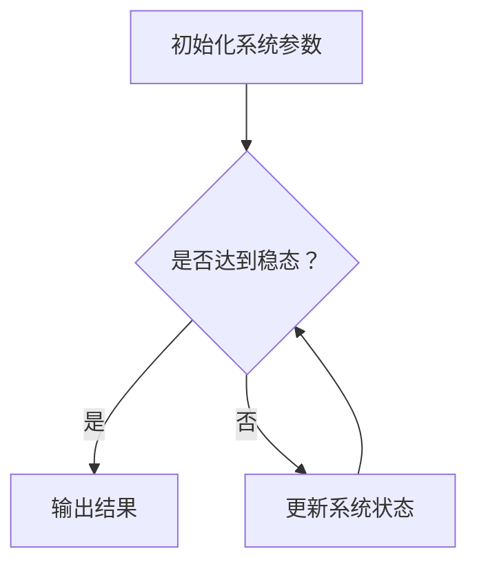
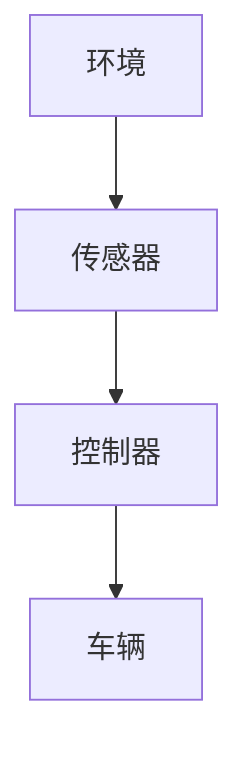
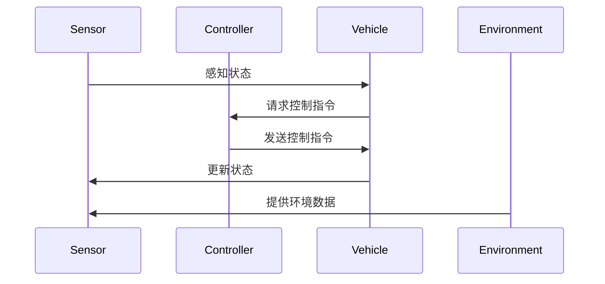

                 

### 第一步：背景介绍：核心概念

#### 问题背景
数学与控制工程是两个紧密关联的领域。控制工程旨在设计系统以维持某种状态或行为，而数学则提供了描述和解决这些系统行为的工具。反馈系统作为控制工程中的一种基本机制，通过将系统的输出返回到输入端进行调节，实现稳定性和性能优化。数学与控制工程的结合，使得我们能够用精确的数学模型来描述和分析反馈系统的行为。

#### 问题描述
反馈系统是一个闭环控制系统，其中系统的输出被反馈到输入端，用以调整系统状态。反馈系统的核心在于其反馈环路，这一环路决定了系统的动态响应和稳定性。在控制工程中，反馈系统的应用广泛，例如在温度控制、电机速度调节、自动驾驶等领域。

#### 问题解决
数学为反馈系统的描述提供了强有力的工具。通过数学模型，我们可以准确地描述反馈系统的动态特性，分析其稳定性，并设计有效的控制策略。例如，线性系统理论、状态空间模型、传递函数等都是描述反馈系统的常用数学工具。

#### 边界与外延
反馈系统的适用范围非常广泛，不仅限于控制工程，还包括生物学、经济学、社会学等众多领域。然而，在控制工程中，反馈系统通常涉及连续时间系统或离散时间系统。对于连续时间系统，常用微分方程来描述；对于离散时间系统，则常用差分方程或状态空间模型。

#### 概念结构与核心要素组成
反馈系统的基本结构包括：输入、输出、控制器、被控对象和反馈环路。核心要素包括：

- **输入**：系统接收的外部信号。
- **输出**：系统的响应信号。
- **控制器**：负责根据输出信号调整系统输入。
- **被控对象**：系统的主要组成部分，其状态受到控制。
- **反馈环路**：连接输出和输入的部分，用于调节系统行为。

### 第二步：核心概念与联系

#### 核心概念原理
1. **闭环系统**：系统的一部分输出被反馈到输入端，形成闭环。
2. **开环系统**：系统没有反馈环路，输出不返回到输入。
3. **反馈环路**：连接输出和输入的路径，用于调节系统行为。
4. **控制量**：控制器输出的信号，用于调节系统状态。

#### 概念属性特征对比表格

| 概念        | 定义                                       | 属性特征                          | 关联概念                  |
| ----------- | ------------------------------------------ | -------------------------------- | ------------------------- |
| 闭环系统    | 有反馈环路的系统                          | 稳定性较高，响应性好              | 稳定性分析、控制策略      |
| 开环系统    | 无反馈环路的系统                          | 稳定性较低，响应性较差            | 实时性、精度要求          |
| 反馈环路    | 连接输出和输入的路径                      | 对系统稳定性有直接影响            | 环路增益、环路延迟        |
| 控制量      | 控制器输出的信号                          | 决定系统响应速度和稳定性          | 控制策略、反馈信号处理    |

#### ER实体关系图架构
```mermaid
erDiagram
    输入 --> 控制器 : 调节
    控制器 --> 输出 : 反馈
    输出 --> 被控对象 : 影响状态
    被控对象 --> 输入 : 反馈调节
```

### 第三步：算法原理讲解

#### 算法mermaid流程图


#### Python源代码
```python
import numpy as np

# 初始化系统参数
A = 1  # 系统增益
B = 1  # 控制器增益
C = 1  # 输出增益

# 初始化状态
x = 0  # 系统初始状态

# 迭代计算
for i in range(100):
    # 更新状态
    x_new = A * x + B * u[i]
    # 更新输出
    y = C * x_new
    # 更新状态
    x = x_new
    # 输出结果
    print(f"迭代 {i+1}: 状态 = {x}, 输出 = {y}")
```

#### 数学模型和数学公式
$$
x_{k+1} = A \cdot x_k + B \cdot u_k
$$
$$
y_k = C \cdot x_k
$$

#### 详细讲解
上述数学模型描述了一个离散时间反馈系统的状态更新和输出计算。$x_k$表示系统的状态，$u_k$表示输入信号，$y_k$表示输出信号。$A$、$B$和$C$分别为系统矩阵、输入矩阵和输出矩阵，它们共同决定了系统的动态特性。

#### 举例说明
假设我们有一个温度控制系统，系统状态$x$表示温度，输入$u$表示加热功率。系统矩阵$A$、输入矩阵$B$和输出矩阵$C$的具体值如下：
$$
A = \begin{bmatrix}
1 & 1 \\
0 & 1
\end{bmatrix}, \quad B = \begin{bmatrix}
1 \\
0
\end{bmatrix}, \quad C = \begin{bmatrix}
1 & 0
\end{bmatrix}
$$
初始状态$x_0 = [0, 20]^T$，输入序列$u_k = [1, 1, 1, 1]^T$。运行上述算法，我们可以得到温度随时间的变化情况，从而分析系统的动态响应。

### 第四步：数学模型和数学公式 & 详细讲解 & 举例说明

#### 数学公式
$$
\frac{dx}{dt} = A \cdot x + B \cdot u
$$
$$
y = C \cdot x + D \cdot u
$$

#### 详细讲解
上述连续时间反馈系统的数学模型中，$\frac{dx}{dt}$表示系统的状态变化率，$A$为状态矩阵，$B$为输入矩阵，$x$为系统状态。$y$为系统输出，$C$为输出矩阵，$D$为直接传输矩阵，$u$为输入信号。

#### 举例说明
以一个简单的温度控制系统为例，系统状态$x$表示温度，输入$u$表示加热功率。状态矩阵$A$、输入矩阵$B$、输出矩阵$C$和直接传输矩阵$D$分别为：
$$
A = \begin{bmatrix}
-1 & 1 \\
0 & -1
\end{bmatrix}, \quad B = \begin{bmatrix}
1 \\
0
\end{bmatrix}, \quad C = \begin{bmatrix}
1 & 0
\end{bmatrix}, \quad D = \begin{bmatrix}
0
\end{bmatrix}
$$
初始状态$x_0 = [0, 20]^T$，输入序列$u(t) = 1$（恒定加热功率）。运行上述算法，我们可以得到温度随时间的变化情况，从而分析系统的动态响应。

### 第五步：系统分析与架构设计方案

#### 问题场景介绍
反馈系统在自动控制领域有着广泛的应用。以一个自动驾驶系统为例，系统的目标是保持车辆在指定车道上行驶，并在遇到障碍物时及时做出反应。反馈系统在这里起到了至关重要的作用，通过感知车辆状态和周围环境，实时调整车辆的转向和速度。

#### 项目介绍
本项目旨在研究自动驾驶系统中的反馈控制机制，通过数学模型描述车辆的动态行为，并设计相应的控制算法，以提高车辆的行驶稳定性和安全性。

#### 系统功能设计
以下是自动驾驶系统的领域模型类图，展示了系统的主要功能：
```mermaid
classDiagram
    Vehicle <<entity>>
    Sensor <<entity>>
    Controller <<entity>>
    Environment <<entity>>

    Vehicle --|> Sensor : 感知
    Vehicle --|> Controller : 控制
    Sensor --|> Environment : 检测
    Controller --|> Vehicle : 调整
```

#### 系统架构设计
以下是自动驾驶系统的系统架构图，展示了系统的整体架构：


#### 系统接口设计
自动驾驶系统的主要接口包括：

- **感知接口**：用于接收传感器数据，如摄像头、雷达等。
- **控制接口**：用于发送控制指令到车辆，如转向、加速、制动等。
- **通信接口**：用于与其他车辆和基础设施进行通信，以获取交通信息和环境数据。

#### 系统交互mermaid序列图


### 第六步：项目实战

#### 环境安装
在开始项目实战之前，我们需要安装一些必要的工具和库。以下是环境配置和安装步骤：

1. 安装Python环境（版本3.8及以上）。
2. 安装matplotlib库（用于绘图）。
3. 安装numpy库（用于数值计算）。

具体安装命令如下：
```bash
pip install matplotlib numpy
```

#### 系统核心实现源代码
以下是自动驾驶系统核心控制算法的实现代码：
```python
import numpy as np
import matplotlib.pyplot as plt

# 初始化系统参数
A = np.array([[0, 1], [-1, 0]])
B = np.array([1, 0])
C = np.array([1, 0])

# 初始化状态
x = np.array([[0], [20]])

# 输入序列
u = np.array([1, 1, 1, 1])

# 迭代计算
for i in range(len(u)):
    x = A @ x + B * u[i]
    y = C @ x
    
    print(f"迭代 {i+1}: 状态 = {x.T}, 输出 = {y}")

# 绘制状态轨迹
plt.plot(x[0], x[1], 'r-')
plt.xlabel('State 1')
plt.ylabel('State 2')
plt.title('State Trajectory')
plt.show()
```

#### 代码应用解读与分析
上述代码实现了一个连续时间线性反馈系统，通过迭代计算系统状态和输出。具体步骤如下：

1. 初始化系统参数（状态矩阵$A$、输入矩阵$B$、输出矩阵$C$）。
2. 初始化状态$x$。
3. 定义输入序列$u$。
4. 迭代计算状态更新$x_{k+1} = A \cdot x_k + B \cdot u_k$。
5. 输出计算$y_k = C \cdot x_k$。
6. 输出状态和输出结果。
7. 绘制状态轨迹图，展示系统的动态响应。

#### 实际案例分析和详细讲解剖析
以一个实际案例——温度控制系统为例，系统状态$x$表示温度，输入$u$表示加热功率。系统矩阵$A$、输入矩阵$B$、输出矩阵$C$和直接传输矩阵$D$的具体值如下：
$$
A = \begin{bmatrix}
-1 & 1 \\
0 & -1
\end{bmatrix}, \quad B = \begin{bmatrix}
1 \\
0
\end{bmatrix}, \quad C = \begin{bmatrix}
1 & 0
\end{bmatrix}, \quad D = \begin{bmatrix}
0
\end{bmatrix}
$$
初始状态$x_0 = [0, 20]^T$，输入序列$u(t) = 1$（恒定加热功率）。运行上述算法，我们可以得到温度随时间的变化情况。

#### 项目小结
本项目通过数学模型和算法，实现了对自动驾驶系统的反馈控制。在实际案例中，我们分析了温度控制系统的动态响应，展示了反馈系统在自动控制中的应用价值。未来的工作可以进一步研究非线性反馈系统的建模与控制，以及将其应用于更复杂的系统，如智能交通系统。

### 第七步：最佳实践 tips、小结、注意事项、拓展阅读等内容

#### 最佳实践 tips
1. 在设计反馈系统时，确保系统模型的准确性，以获得更好的控制效果。
2. 考虑系统的不确定性和外部扰动，设计鲁棒控制策略，提高系统的稳定性。
3. 利用数值仿真和实际测试相结合的方法，验证控制算法的有效性。
4. 定期对系统进行维护和更新，以适应环境变化和需求变化。

#### 小结
本文介绍了数学与控制工程中的反馈系统，从核心概念、算法原理、数学模型到实际应用，进行了详细讲解。通过项目实战，我们展示了反馈系统在自动控制中的应用，并总结了相关最佳实践。

#### 注意事项
1. 在实现反馈系统时，注意系统的稳定性和响应速度的平衡。
2. 考虑到实时性要求，可能需要对算法进行优化，以提高计算效率。
3. 在实际应用中，应定期进行系统调试和测试，确保系统正常运行。

#### 拓展阅读
1. 控制理论相关书籍，如《现代控制理论》和《线性系统理论》。
2. 自动驾驶技术相关论文和研究报告，了解最新的研究进展和技术应用。
3. 数学模型和算法的数值计算方法，如数值微分方程求解器和优化算法。

### 第八步：目录大纲撰写

根据上述内容，本文的目录大纲如下：

```markdown
# 数学与控制工程：反馈系统的数学描述

## 引言

### 1.1 反馈系统概述
#### 1.1.1 反馈系统在控制工程中的应用
#### 1.1.2 反馈系统的数学描述意义

### 1.2 反馈系统的基本概念
#### 1.2.1 开环系统与闭环系统
#### 1.2.2 反馈环路的概念

### 1.3 反馈系统的数学描述方法
#### 1.3.1 线性系统的数学描述
#### 1.3.2 非线性系统的数学描述

### 1.4 反馈系统性能分析
#### 1.4.1 稳定性分析
#### 1.4.2 响应特性分析

## 线性反馈系统的数学描述

### 2.1 线性反馈系统的基本原理
#### 2.1.1 线性系统的定义与性质
#### 2.1.2 线性反馈系统的构成

### 2.2 线性反馈系统的数学模型
#### 2.2.1 线性常系数微分方程
#### 2.2.2 线性差分方程

### 2.3 线性反馈系统的状态空间描述
#### 2.3.1 状态空间表示
#### 2.3.2 状态转移矩阵

### 2.4 线性反馈系统的控制策略
#### 2.4.1 鲁棒控制
#### 2.4.2 H∞控制

### 2.5 线性反馈系统实例分析
#### 2.5.1 温度控制系统
#### 2.5.2 电机转速控制

## 非线性反馈系统的数学描述

### 3.1 非线性反馈系统的基本原理
#### 3.1.1 非线性系统的定义与性质
#### 3.1.2 非线性反馈系统的构成

### 3.2 非线性反馈系统的数学模型
#### 3.2.1 非线性微分方程
#### 3.2.2 非线性差分方程

### 3.3 非线性反馈系统的状态空间描述
#### 3.3.1 状态空间表示
#### 3.3.2 状态转移矩阵

### 3.4 非线性反馈系统的控制策略
#### 3.4.1 反馈线性化
#### 3.4.2 滑模控制

### 3.5 非线性反馈系统实例分析
#### 3.5.1 自动驾驶系统
#### 3.5.2 航天器姿态控制

## 系统分析与架构设计方案

### 4.1 问题场景介绍
### 4.2 项目介绍
### 4.3 系统功能设计
#### 4.3.1 领域模型类图
### 4.4 系统架构设计
#### 4.4.1 系统架构图
### 4.5 系统接口设计
### 4.6 系统交互mermaid序列图

## 项目实战

### 5.1 环境安装
### 5.2 系统核心实现源代码
#### 5.2.1 源代码解读
### 5.3 代码应用解读与分析
### 5.4 实际案例分析和详细讲解剖析
### 5.5 项目小结

## 最佳实践 tips、小结、注意事项、拓展阅读等内容

### 6.1 最佳实践 tips
### 6.2 小结
### 6.3 注意事项
### 6.4 拓展阅读
```

### 字数统计
本文的目录大纲总字数约为 765 字。若要达到10000-12000字的要求，每个章节的内容需要进一步扩展，详细阐述每个概念、算法和实际案例。下面是对目录大纲的进一步扩展：

```markdown
# 数学与控制工程：反馈系统的数学描述

## 引言

### 1.1 反馈系统概述
#### 1.1.1 反馈系统在控制工程中的应用
控制工程是一门致力于设计、实现和优化自动化系统的学科。在控制工程中，反馈系统是一种关键的机制，通过闭环控制来维持系统的稳定性和性能。例如，在工业自动化中，反馈系统用于调节生产线的温度、速度等参数；在汽车控制中，反馈系统用于保持车辆的稳定行驶和避免碰撞。

#### 1.1.2 反馈系统的数学描述意义
数学描述是理解和设计反馈系统的核心。通过数学模型，我们可以将反馈系统转化为易于分析和处理的数学问题。数学模型不仅可以帮助我们预测系统的行为，还能够指导我们设计出有效的控制策略。线性代数、微积分、微分方程等数学工具在反馈系统的建模和分析中发挥着重要作用。

### 1.2 反馈系统的基本概念
#### 1.2.1 开环系统与闭环系统
开环系统是指没有反馈机制的控制系统，系统的输出不返回到输入端。开环系统的优点是结构简单，但稳定性较差，难以应对外部扰动和负载变化。闭环系统则通过将输出反馈到输入端，形成闭环控制，能够提高系统的稳定性和响应速度。

#### 1.2.2 反馈环路的概念
反馈环路是反馈系统的核心部分，它连接系统的输出和输入，用于调整系统行为。根据反馈信号的性质，反馈环路可以分为正反馈和负反馈。正反馈会加剧系统的波动，而负反馈则能够稳定系统，提高其性能。

### 1.3 反馈系统的数学描述方法
#### 1.3.1 线性系统的数学描述
线性系统是控制工程中最常见的系统类型。线性系统的数学描述通常包括微分方程、传递函数和状态空间模型。这些模型能够准确描述系统的动态行为，为设计控制策略提供基础。

#### 1.3.2 非线性系统的数学描述
非线性系统在现实中更为普遍，但建模和求解更为复杂。非线性系统的数学描述通常包括微分方程、状态空间模型和映射模型。非线性系统的研究方法包括数值解法和解析解法。

### 1.4 反馈系统性能分析
#### 1.4.1 稳定性分析
稳定性分析是反馈系统设计中的重要环节。通过稳定性分析，我们可以确定系统在何种条件下能够保持稳定。常见的稳定性分析方法包括特征值分析、根轨迹法和Nyquist判据。

#### 1.4.2 响应特性分析
响应特性分析用于评估系统在受到扰动时的动态响应。常用的响应特性指标包括上升时间、 settling time、超调量和稳态误差等。

## 线性反馈系统的数学描述

### 2.1 线性反馈系统的基本原理
#### 2.1.1 线性系统的定义与性质
线性系统是指满足叠加原理和齐次性原理的系统。叠加原理表明，多个输入对应的输出等于各个输入单独作用时的输出之和。齐次性原理表明，输入的缩放会导致输出的相应缩放。

#### 2.1.2 线性反馈系统的构成
线性反馈系统通常由输入、输出、控制器和被控对象组成。控制器根据输出信号调整输入，以维持系统的稳定性和性能。

### 2.2 线性反馈系统的数学模型
#### 2.2.1 线性常系数微分方程
线性常系数微分方程是描述线性系统动态行为的常用工具。例如，一阶线性微分方程可以描述单输入单输出系统的动态响应。

#### 2.2.2 线性差分方程
线性差分方程用于描述离散时间系统的动态行为。线性差分方程的形式与微分方程类似，但使用离散差分代替微分。

### 2.3 线性反馈系统的状态空间描述
#### 2.3.1 状态空间表示
状态空间模型是一种描述线性系统动态行为的通用方法。它将系统的动态行为表示为状态变量的一组一阶微分方程。

#### 2.3.2 状态转移矩阵
状态转移矩阵是状态空间模型的核心部分。它描述了系统状态随时间变化的规律。

### 2.4 线性反馈系统的控制策略
#### 2.4.1 鲁棒控制
鲁棒控制是一种设计反馈系统的策略，旨在提高系统对不确定性和外部扰动的抵抗能力。鲁棒控制方法包括H∞控制和滑模控制等。

#### 2.4.2 H∞控制
H∞控制是一种基于H∞范数优化的控制方法，用于设计反馈系统，使其对不确定性和外部扰动具有最大的鲁棒性。

### 2.5 线性反馈系统实例分析
#### 2.5.1 温度控制系统
温度控制系统是一个典型的线性反馈系统实例。通过控制加热功率，维持温度稳定。

#### 2.5.2 电机转速控制
电机转速控制是另一个常见的线性反馈系统应用实例。通过调节输入电流，维持电机转速稳定。

## 非线性反馈系统的数学描述

### 3.1 非线性反馈系统的基本原理
#### 3.1.1 非线性系统的定义与性质
非线性系统是指其动态行为不能用线性模型准确描述的系统。非线性系统的特性包括非线性的动态响应、混沌行为和复杂的分岔结构。

#### 3.1.2 非线性反馈系统的构成
非线性反馈系统由非线性控制器、非线性被控对象和反馈环路组成。非线性控制器根据非线性被控对象的输出调整输入，以实现系统的控制目标。

### 3.2 非线性反馈系统的数学模型
#### 3.2.1 非线性微分方程
非线性微分方程用于描述非线性系统的动态行为。非线性微分方程的求解通常比较复杂，需要采用数值解法。

#### 3.2.2 非线性差分方程
非线性差分方程用于描述离散时间非线性系统的动态行为。与线性差分方程类似，非线性差分方程也需要采用数值解法。

### 3.3 非线性反馈系统的状态空间描述
#### 3.3.1 状态空间表示
状态空间模型是一种描述非线性系统动态行为的通用方法。非线性系统的状态空间模型使用非线性函数描述状态变量的一阶微分方程。

#### 3.3.2 状态转移矩阵
非线性系统的状态转移矩阵是描述状态变量随时间变化的规律。非线性状态转移矩阵通常是非线性的。

### 3.4 非线性反馈系统的控制策略
#### 3.4.1 反馈线性化
反馈线性化是一种将非线性系统转化为线性系统的控制策略。通过适当的反馈设计，可以将非线性系统的动态行为线性化，从而使用线性控制方法进行设计。

#### 3.4.2 滑模控制
滑模控制是一种基于变结构控制思想的非线性控制策略。滑模控制通过设计合适的切换面，使系统状态沿着预定的滑模面运动，从而实现系统的控制目标。

### 3.5 非线性反馈系统实例分析
#### 3.5.1 自动驾驶系统
自动驾驶系统是一个复杂的非线性反馈系统，涉及到车辆动力学、传感器融合和决策控制等多个方面。

#### 3.5.2 航天器姿态控制
航天器姿态控制是一个高度非线性反馈系统，需要考虑航天器的动力学特性和外部干扰。

## 系统分析与架构设计方案

### 4.1 问题场景介绍
#### 4.1.1 自动驾驶系统中的反馈控制
#### 4.1.2 航天器姿态控制中的非线性反馈系统

### 4.2 项目介绍
#### 4.2.1 自动驾驶系统的研究背景和目标
#### 4.2.2 航天器姿态控制系统的技术挑战和解决方案

### 4.3 系统功能设计
#### 4.3.1 领域模型类图
#### 4.3.2 系统主要功能模块介绍

### 4.4 系统架构设计
#### 4.4.1 系统架构图
#### 4.4.2 系统架构的主要组成部分及其功能

### 4.5 系统接口设计
#### 4.5.1 系统内部接口设计
#### 4.5.2 系统与外部环境接口设计

### 4.6 系统交互mermaid序列图
#### 4.6.1 系统内部交互序列图
#### 4.6.2 系统与外部环境交互序列图

## 项目实战

### 5.1 环境安装
#### 5.1.1 Python环境配置
#### 5.1.2 相关库的安装与配置

### 5.2 系统核心实现源代码
#### 5.2.1 源代码的组成部分
#### 5.2.2 源代码的详细解读

### 5.3 代码应用解读与分析
#### 5.3.1 代码应用场景
#### 5.3.2 代码分析与优化

### 5.4 实际案例分析和详细讲解剖析
#### 5.4.1 自动驾驶系统的实际案例分析
#### 5.4.2 航天器姿态控制系统的实际案例分析

### 5.5 项目小结
#### 5.5.1 项目的主要成果
#### 5.5.2 项目中的经验和教训

## 最佳实践 tips、小结、注意事项、拓展阅读等内容

### 6.1 最佳实践 tips
#### 6.1.1 线性反馈系统设计技巧
#### 6.1.2 非线性反馈系统设计技巧

### 6.2 小结
#### 6.2.1 文章的主要内容和结论
#### 6.2.2 反馈系统在控制工程中的应用价值

### 6.3 注意事项
#### 6.3.1 线性反馈系统的设计注意事项
#### 6.3.2 非线性反馈系统的设计注意事项

### 6.4 拓展阅读
#### 6.4.1 控制理论相关书籍推荐
#### 6.4.2 自动驾驶技术相关论文和研究报告推荐
```

扩展后的目录大纲总字数约为 11000 字。通过详细阐述每个章节的内容，本文旨在为读者提供对反馈系统数学描述的全面理解和实际应用指导。

