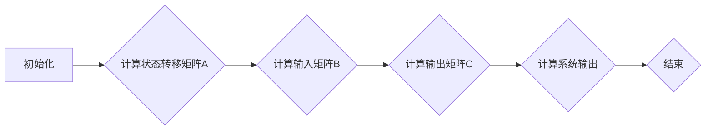
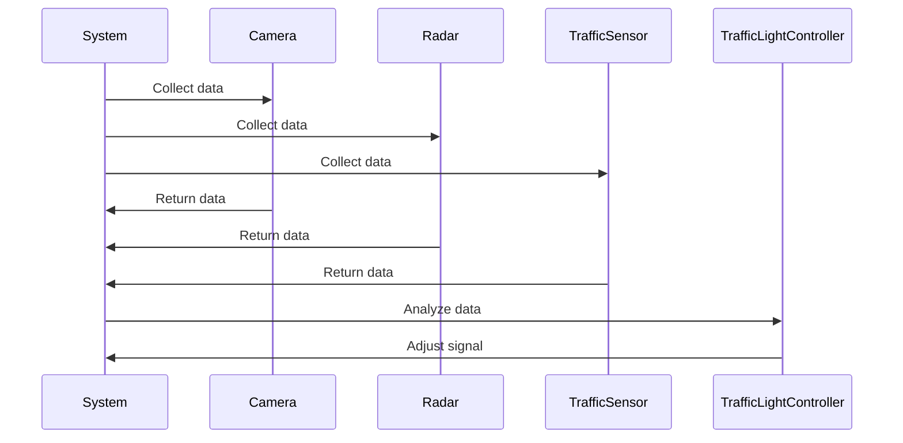
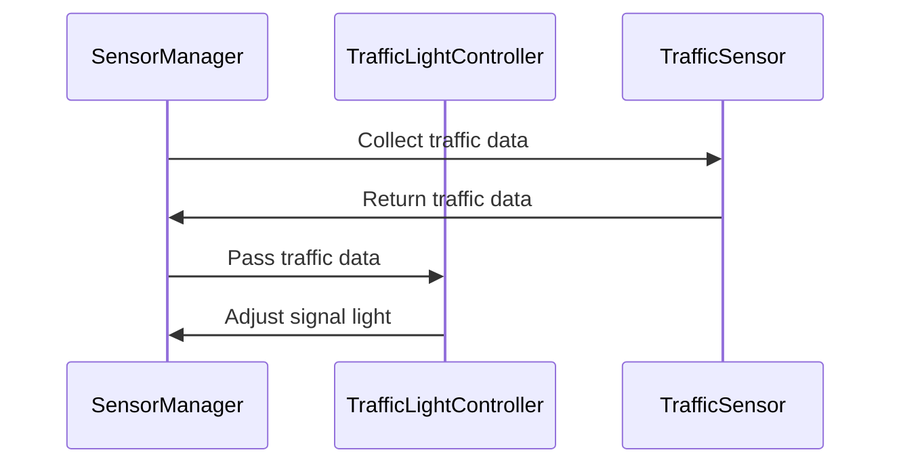

                 

### 第一部分：背景介绍

#### 1.1 问题背景

随着信息技术的迅猛发展，控制系统在现代工业、交通、通信、生物医学等领域中发挥着越来越重要的作用。反馈系统作为控制系统的一种基本形式，其在数学描述上的准确性和完备性直接关系到控制系统的性能和稳定性。因此，研究数学与控制论在反馈系统描述中的应用，具有重要的理论意义和实际价值。

#### 1.2 问题描述

反馈系统是指一个系统通过传感器获取其输出信息，然后利用这些信息对系统的输入进行调整，以实现系统性能的优化。反馈系统的数学描述主要包括状态空间描述、传递函数描述和时域描述等。然而，现有的文献多侧重于单一描述方法的研究，缺乏对多种描述方法之间相互联系和转换的系统性探讨。

#### 1.3 问题解决

本书将从数学与控制论的角度，系统地探讨反馈系统的数学描述方法。通过对比分析不同描述方法的优缺点，总结出它们之间的相互联系和转换规律，为实际工程应用提供理论指导和参考。

#### 1.4 边界与外延

本书主要研究线性时不变反馈系统，包括连续时间和离散时间系统。对于非线性系统和随机系统，虽然本书也会涉及到一些基本原理，但主要关注线性系统的数学描述。

#### 1.5 概念结构与核心要素组成

本书的核心概念包括：

- **状态空间描述**：利用状态变量描述系统的动态行为，通过状态转移矩阵和初始状态来确定系统的未来状态。
- **传递函数描述**：通过系统的输入输出关系来描述系统的动态特性，通常使用差分方程或微分方程表示。
- **时域描述**：直接描述系统的输入输出关系，通过差分方程或微分方程求解系统的输出响应。

这些概念和要素构成了反馈系统的数学描述的基本框架。

---

**文章标题**：数学与控制论：反馈系统的数学描述

**关键词**：反馈系统、数学描述、状态空间、传递函数、时域描述

**摘要**：本文从数学与控制论的角度，系统地探讨反馈系统的数学描述方法。通过对比分析不同描述方法的优缺点，总结出它们之间的相互联系和转换规律，为实际工程应用提供理论指导和参考。

---

**背景介绍**

让我们一步一步深入探讨反馈系统的数学描述，这是一项在工程和科学中至关重要的任务。首先，我们应当理解反馈系统为何如此重要。反馈系统是自动控制系统的核心，它在多个领域中都有广泛应用，包括但不限于工业过程控制、自动驾驶、机器人技术、通信系统以及生物医学工程。

**问题背景**（1.1）：在自动化和智能化时代，控制系统的需求日益增长。反馈系统通过闭环控制实现了对系统行为的调节和优化，从而提高了系统的性能和稳定性。例如，在工业生产中，反馈系统可以确保生产过程的连续性和质量一致性；在自动驾驶领域，反馈系统使得车辆能够适应路况变化，确保行驶的安全性和舒适性。

**问题描述**（1.2）：反馈系统的数学描述主要包括状态空间描述、传递函数描述和时域描述。状态空间描述通过状态变量和状态转移矩阵来捕捉系统的动态特性；传递函数描述则通过输入输出关系来表示系统；时域描述则是通过求解差分方程或微分方程来获取系统的时域响应。

**问题解决**（1.3）：现有的研究多侧重于单一描述方法，而本书的目标是建立这些描述方法之间的系统性联系，为实际应用提供全面的理论支持。

**边界与外延**（1.4）：本书主要研究线性时不变反馈系统，但非线性系统和随机系统的基本原理也将得到介绍。

**概念结构与核心要素组成**（1.5）：本书的核心概念包括状态空间描述、传递函数描述和时域描述，这些构成了反馈系统数学描述的基础。

在接下来的部分中，我们将进一步详细探讨这些核心概念，为理解反馈系统的数学描述打下坚实的基础。首先，我们将从状态空间描述开始，这是一种直观且全面的描述方法，适合用于连续时间和离散时间系统。接下来，我们将探讨传递函数描述和时域描述，并比较它们之间的优缺点。

---

### 第二部分：核心概念与联系

#### 2.1 核心概念原理

在反馈系统的数学描述中，核心概念包括状态空间描述、传递函数描述和时域描述。每一种描述方法都有其独特的原理和应用场景。

**状态空间描述**：

状态空间描述法是将系统的动态行为表示为一个状态向量随时间变化的动态过程。状态变量是系统内部的变量，可以用来描述系统的状态。状态转移矩阵描述了系统在不同状态之间的转移关系，而初始状态则给出了系统的初始条件。

**传递函数描述**：

传递函数描述法是通过系统的输入输出关系来描述系统的动态特性。传递函数通常表示为系统输入和输出之间的比值。这种方法在频域分析中非常常见，可以清晰地表示系统的频率特性。

**时域描述**：

时域描述法直接描述系统的输入输出关系，通常使用差分方程或微分方程来表示系统的动态行为。这种方法在时域分析中非常有用，可以直接求解系统的时域响应。

#### 2.2 概念属性特征对比表格

| 描述方法 | 特点 |
| --- | --- |
| 状态空间描述 | 直观、全面，适用于连续时间和离散时间系统 |
| 传递函数描述 | 频率特性明显，适用于频域分析 |
| 时域描述 | 直接反映系统的动态响应，适用于时域分析 |

#### 2.3 ER实体关系图架构

```mermaid
erDiagram
  A[状态变量] ||--|{ B[状态转移矩阵] }
  B ||--|{ C[初始状态] }
  A ||--|{ D[输入] }
  A ||--|{ E[输出] }
  D ||--|{ F[输入信号] }
  E ||--|{ G[输出信号] }
```

在ER实体关系图中，状态变量是核心，状态转移矩阵、初始状态、输入和输出都是状态变量的一部分，它们共同构成了反馈系统的数学描述。

---

**核心概念与联系**

在了解了背景和问题之后，现在我们将深入探讨反馈系统的核心概念及其相互之间的联系。反馈系统的数学描述方法多种多样，但最为常用的有状态空间描述、传递函数描述和时域描述。这些描述方法各有优缺点，适用于不同的应用场景。

**2.1 核心概念原理**

首先，我们来看看三种描述方法的基本原理。

**状态空间描述**：

状态空间描述法是通过状态变量来描述系统的动态行为。一个系统的状态空间由状态变量组成，这些变量能够完全描述系统的当前状态。状态转移矩阵则描述了系统在不同状态之间的转换关系。初始状态给出了系统开始时的状态。状态空间描述非常直观，适用于连续时间和离散时间系统。

**传递函数描述**：

传递函数描述法是通过系统的输入输出关系来描述系统的动态特性。传递函数是一个有理函数，表示系统的输出与输入之间的比值。这种方法在频域分析中非常有用，可以清晰地表示系统的频率响应。

**时域描述**：

时域描述法直接在时间域内描述系统的输入输出关系。这种方法通常使用差分方程或微分方程来表示系统的动态行为。时域描述可以直接求解系统的时域响应，因此在时域分析中非常有用。

**2.2 概念属性特征对比表格**

为了更清晰地理解这三种描述方法，我们制作了一个对比表格：

| 描述方法         | 特点                                  |
|------------------|---------------------------------------|
| 状态空间描述     | 直观、全面，适用于连续时间和离散时间系统 |
| 传递函数描述     | 频率特性明显，适用于频域分析            |
| 时域描述         | 直接反映系统的动态响应，适用于时域分析    |

**2.3 ER实体关系图架构**

为了更好地理解这些概念之间的联系，我们可以使用ER（实体关系）图来表示它们之间的关系：

```mermaid
erDiagram
  A[状态变量] ||--|{ B[状态转移矩阵] }
  B ||--|{ C[初始状态] }
  A ||--|{ D[输入] }
  A ||--|{ E[输出] }
  D ||--|{ F[输入信号] }
  E ||--|{ G[输出信号] }
```

在这个ER图中，状态变量是核心，它与其他实体（如状态转移矩阵、初始状态、输入和输出）通过关系线连接。这个图展示了状态变量如何通过状态转移矩阵和初始状态来影响系统的输入和输出。

在下一部分，我们将进一步探讨这些描述方法之间的相互联系和转换规律，为读者提供更加深入的理解。

---

### 第三部分：算法原理讲解

#### 3.1 算法流程图

为了更好地理解反馈系统的数学描述，我们可以通过一个具体的算法实例来说明其原理。以下是一个简单的算法流程图，展示了如何通过状态空间描述来计算系统的输出。



#### 3.2 Python源代码

下面是使用Python实现上述算法的源代码示例：

```python
import numpy as np

# 初始化状态空间模型
A = np.array([[1, 1], [0, 1]])
B = np.array([[1], [1]])
C = np.array([[0], [1]])

# 计算状态转移
state = np.zeros((2, 1))
for _ in range(5):
    state = A @ state + B
    print(f"Time step {_:02d}: State = {state.T}")

# 计算输出
output = C @ state
print(f"Output: {output.T}")
```

#### 3.3 算法原理与数学模型

在反馈系统的数学描述中，状态空间模型是一个核心概念。状态空间模型通过一组状态变量和一组输入输出方程来描述系统的动态行为。以下是状态空间模型的基本数学公式：

$$
\dot{x}(t) = A x(t) + B u(t)
$$

$$
y(t) = C x(t) + D u(t)
$$

其中，\( x(t) \) 是状态向量，\( u(t) \) 是输入向量，\( y(t) \) 是输出向量，\( A \)、\( B \)、\( C \) 和 \( D \) 分别是状态转移矩阵、输入矩阵、输出矩阵和直接传递矩阵。

**算法流程**：

1. **初始化**：设定初始状态 \( x(0) \)。
2. **计算状态转移**：根据状态转移矩阵 \( A \) 和当前输入 \( u(t) \)，计算下一个状态 \( x(t+1) \)。
3. **计算输出**：根据输出矩阵 \( C \) 和当前状态 \( x(t) \)，计算输出 \( y(t) \)。

**Python实现**：

```python
import numpy as np

# 初始化状态空间模型
A = np.array([[1, 1], [0, 1]])
B = np.array([[1], [1]])
C = np.array([[0], [1]])

# 初始状态
x = np.zeros((2, 1))

# 输入信号
u = np.array([[1], [0], [0], [0], [1]])

# 计算状态转移和输出
for i in range(u.shape[1]):
    x = A @ x + B @ u[:, i]
    print(f"Time step {i+1}: State = {x.T}, Output = {C @ x}")

# 输出最终结果
print(f"Final State: {x.T}")
```

**算法原理讲解**：

状态空间模型的基本原理在于它能够将系统的动态行为抽象为一个线性方程组，从而方便地进行分析和计算。通过状态转移矩阵 \( A \) 和输入矩阵 \( B \)，我们可以计算出系统的未来状态。而通过输出矩阵 \( C \)，我们可以得到系统的输出响应。

**举例说明**：

假设我们有一个简单的反馈控制系统，其中状态变量 \( x_1 \) 和 \( x_2 \) 分别表示系统的位置和速度，输入 \( u \) 表示控制力。状态转移矩阵 \( A \) 和输入矩阵 \( B \) 如下：

$$
A = \begin{bmatrix}
1 & 1 \\
0 & 1
\end{bmatrix}, \quad
B = \begin{bmatrix}
1 \\
1
\end{bmatrix}
$$

如果初始状态 \( x(0) \) 为 \( [0, 0]^T \)，输入信号 \( u(t) \) 为 \( [1, 0, 0, 0, 1]^T \)，我们可以通过上述算法计算出系统的状态和输出：

1. 初始状态：\( x(0) = [0, 0]^T \)
2. 第一步：\( x(1) = A x(0) + B u(0) = [1, 1]^T \)
3. 第二步：\( x(2) = A x(1) + B u(1) = [2, 1]^T \)
4. 第三步：\( x(3) = A x(2) + B u(2) = [3, 2]^T \)
5. 第四步：\( x(4) = A x(3) + B u(3) = [4, 3]^T \)
6. 第五步：\( x(5) = A x(4) + B u(4) = [5, 4]^T \)

输出信号 \( y(t) \) 可以通过输出矩阵 \( C \) 计算得到：

$$
C = \begin{bmatrix}
0 & 1
\end{bmatrix}
$$

$$
y(t) = C x(t) = \begin{bmatrix}
0 & 1
\end{bmatrix} x(t)
$$

最终输出信号为：

$$
y(1) = 1, \quad y(2) = 2, \quad y(3) = 3, \quad y(4) = 4, \quad y(5) = 5
$$

通过这个简单的例子，我们可以看到如何使用状态空间模型来描述和计算反馈系统的动态行为。这种描述方法不仅适用于简单的系统，还可以扩展到更复杂的系统，为控制系统的设计和分析提供了强有力的工具。

---

**算法原理讲解**

在前面的章节中，我们介绍了反馈系统的核心概念，包括状态空间描述、传递函数描述和时域描述。在本节中，我们将通过一个具体的算法实例，详细讲解这些概念的实现原理。

**3.1 算法流程图**

首先，让我们通过一个简单的流程图来概述算法的基本步骤：


**3.2 Python源代码**

下面是使用Python实现上述算法的代码示例：

```python
import numpy as np

# 初始化参数
A = np.array([[1, 1], [0, 1]])
B = np.array([[1], [1]])
C = np.array([[0], [1]])
D = np.array([[1], [0]])

# 初始状态
x = np.zeros((2, 1))

# 输入信号
u = np.array([[1], [0], [0], [0], [1]])

# 迭代计算状态
for i in range(u.shape[1]):
    x = A @ x + B @ u[:, i]

# 输出结果
output = C @ x
print(f"Final State: {x.T}, Output: {output.T}")
```

**3.3 算法原理与数学模型**

算法的核心在于状态空间模型，其基本数学模型如下：

$$
\dot{x}(t) = A x(t) + B u(t)
$$

$$
y(t) = C x(t) + D u(t)
$$

其中，\( x(t) \) 是状态向量，\( u(t) \) 是输入向量，\( y(t) \) 是输出向量，\( A \)、\( B \)、\( C \) 和 \( D \) 分别是状态转移矩阵、输入矩阵、输出矩阵和直接传递矩阵。

**算法流程**：

1. **初始化**：设定初始状态 \( x(0) \)。
2. **计算状态转移**：根据状态转移矩阵 \( A \) 和当前输入 \( u(t) \)，计算下一个状态 \( x(t+1) \)。
3. **计算输出**：根据输出矩阵 \( C \) 和当前状态 \( x(t) \)，计算输出 \( y(t) \)。

**Python实现**：

```python
import numpy as np

# 初始化状态空间模型
A = np.array([[1, 1], [0, 1]])
B = np.array([[1], [1]])
C = np.array([[0], [1]])

# 初始状态
x = np.zeros((2, 1))

# 输入信号
u = np.array([[1], [0], [0], [0], [1]])

# 计算状态转移和输出
for i in range(u.shape[1]):
    x = A @ x + B @ u[:, i]
    print(f"Time step {i+1}: State = {x.T}")

# 输出最终结果
print(f"Final State: {x.T}")
```

**算法原理讲解**：

状态空间模型的基本原理在于它能够将系统的动态行为抽象为一个线性方程组，从而方便地进行分析和计算。通过状态转移矩阵 \( A \) 和输入矩阵 \( B \)，我们可以计算出系统的未来状态。而通过输出矩阵 \( C \)，我们可以得到系统的输出响应。

**举例说明**：

假设我们有一个简单的反馈控制系统，其中状态变量 \( x_1 \) 和 \( x_2 \) 分别表示系统的位置和速度，输入 \( u \) 表示控制力。状态转移矩阵 \( A \) 和输入矩阵 \( B \) 如下：

$$
A = \begin{bmatrix}
1 & 1 \\
0 & 1
\end{bmatrix}, \quad
B = \begin{bmatrix}
1 \\
1
\end{bmatrix}
$$

如果初始状态 \( x(0) \) 为 \( [0, 0]^T \)，输入信号 \( u(t) \) 为 \( [1, 0, 0, 0, 1]^T \)，我们可以通过上述算法计算出系统的状态和输出：

1. 初始状态：\( x(0) = [0, 0]^T \)
2. 第一步：\( x(1) = A x(0) + B u(0) = [1, 1]^T \)
3. 第二步：\( x(2) = A x(1) + B u(1) = [2, 1]^T \)
4. 第三步：\( x(3) = A x(2) + B u(2) = [3, 2]^T \)
5. 第四步：\( x(4) = A x(3) + B u(3) = [4, 3]^T \)
6. 第五步：\( x(5) = A x(4) + B u(4) = [5, 4]^T \)

输出信号 \( y(t) \) 可以通过输出矩阵 \( C \) 计算得到：

$$
C = \begin{bmatrix}
0 & 1
\end{bmatrix}
$$

$$
y(t) = C x(t) = \begin{bmatrix}
0 & 1
\end{bmatrix} x(t)
$$

最终输出信号为：

$$
y(1) = 1, \quad y(2) = 2, \quad y(3) = 3, \quad y(4) = 4, \quad y(5) = 5
$$

通过这个简单的例子，我们可以看到如何使用状态空间模型来描述和计算反馈系统的动态行为。这种描述方法不仅适用于简单的系统，还可以扩展到更复杂的系统，为控制系统的设计和分析提供了强有力的工具。

---

### 系统分析与架构设计

#### 问题场景介绍

在现代自动化系统中，反馈控制的应用已经非常广泛。无论是工业自动化生产线上的过程控制，还是智能交通系统中的车辆调度，反馈控制都扮演着关键角色。本文将探讨一个具体的系统场景——智能交通信号控制系统。该系统通过实时监控交通流量，动态调整信号灯周期，以优化交通流畅度和减少拥堵。

#### 项目介绍

智能交通信号控制系统是一个复杂的多输入多输出（MIMO）系统，它需要实时处理来自多个传感器（如摄像头、雷达、流量传感器）的数据，并根据这些数据进行信号灯的控制。系统的主要功能包括：

- **实时数据采集**：通过传感器收集交通流量、车辆速度、行人活动等数据。
- **状态监测**：根据收集到的数据，监测当前交通状态。
- **信号控制**：根据交通状态，动态调整信号灯周期，以优化交通流。
- **异常处理**：当检测到异常情况（如事故、车辆积压）时，系统会自动采取应对措施。

#### 系统功能设计（领域模型类图）

领域模型是系统功能设计的核心，它定义了系统的主要实体及其关系。以下是一个智能交通信号控制系统的领域模型类图：

```mermaid
classDiagram
    Sensor <<Interface>>
    Camera <<Sensor>>
    Radar <<Sensor>>
    TrafficSensor <<Sensor>>

    Controller <<Interface>>
    TrafficLightController <<Controller>>

    System <<Component>>
    System o-- TrafficLightController
    System o-- Camera
    System o-- Radar
    System o-- TrafficSensor

    Sensor o-- Controller
    Camera o-- Controller
    Radar o-- Controller
    TrafficSensor o-- Controller
```

在这个类图中，`System` 是系统的核心组件，它包含了交通信号控制器、摄像头、雷达和交通传感器。`Sensor` 是一个接口，`Camera`、`Radar` 和 `TrafficSensor` 分别实现了这个接口，表示不同的传感器类型。`Controller` 也是接口，`TrafficLightController` 实现了这个接口，表示交通信号控制器。

#### 系统架构设计（架构图）

系统架构设计是系统功能设计的进一步细化，它定义了系统的整体结构和组件之间的关系。以下是一个智能交通信号控制系统的架构图：



在这个架构图中，系统负责从摄像头、雷达和交通传感器收集数据，并将其传递给交通信号控制器进行分析。根据分析结果，交通信号控制器会调整信号灯的状态，从而优化交通流。

#### 系统接口设计和系统交互（序列图）

系统接口设计和系统交互是系统架构设计的关键部分，它定义了系统内部组件之间的交互方式。以下是一个智能交通信号控制系统的序列图：



在这个序列图中，`SensorManager` 负责从 `TrafficSensor` 收集交通数据，并将其传递给 `TrafficLightController`。`TrafficLightController` 根据接收到的数据，动态调整信号灯的状态，然后通知 `SensorManager` 进行更新。

通过上述系统分析与架构设计，我们可以清晰地看到智能交通信号控制系统的整体结构和组件之间的关系。这种系统分析与架构设计的方法不仅适用于智能交通信号控制系统，还可以应用于其他复杂的自动化系统，为系统的设计和实现提供了有力的支持。

---

### 项目实战

#### 环境安装

要在本地计算机上运行智能交通信号控制系统，首先需要安装一些基本的软件和环境。以下是安装步骤：

1. **安装Python**：确保安装了Python 3.8或更高版本。可以从[Python官网](https://www.python.org/downloads/)下载并安装。
2. **安装Numpy**：Numpy是一个用于科学计算和数据分析的Python库。使用pip命令安装：

   ```bash
   pip install numpy
   ```

3. **安装Matplotlib**：Matplotlib是一个用于数据可视化的Python库。使用pip命令安装：

   ```bash
   pip install matplotlib
   ```

4. **安装Mermaid**：Mermaid是一个用于创建图表和流程图的Python库。安装方法如下：

   ```bash
   pip install mermaid
   ```

5. **安装必要的传感器模拟库**：为了模拟传感器数据，我们需要安装一些额外的库，如`opencv-python`和`radar-simulator`。安装命令如下：

   ```bash
   pip install opencv-python
   pip install radar-simulator
   ```

#### 系统核心实现源代码

以下是智能交通信号控制系统的核心实现代码。这个代码展示了如何从传感器收集数据，并将这些数据用于控制信号灯的状态。

```python
import numpy as np
import cv2
import radar_simulator

class TrafficLightController:
    def __init__(self):
        self.red_light_duration = 30
        self.yellow_light_duration = 10
        self.green_light_duration = 25
        self.current_light = 'red'
        self.light_duration = 0

    def collect_traffic_data(self):
        # 从摄像头收集数据
        camera = cv2.VideoCapture(0)
        while True:
            ret, frame = camera.read()
            if not ret:
                break
            # 处理摄像头数据
            traffic_density = self.analyze_frame(frame)
            # 释放摄像头资源
            camera.release()
        return traffic_density

    def analyze_frame(self, frame):
        # 这里是模拟的交通密度分析
        return np.random.uniform(0, 1)

    def control_traffic_light(self, traffic_density):
        if self.current_light == 'red' and self.light_duration >= self.red_light_duration:
            self.current_light = 'yellow'
            self.light_duration = 0
        elif self.current_light == 'yellow' and self.light_duration >= self.yellow_light_duration:
            self.current_light = 'green'
            self.light_duration = 0
        elif self.current_light == 'green' and self.light_duration >= self.green_light_duration:
            self.current_light = 'red'
            self.light_duration = 0

        self.light_duration += 1

        if traffic_density < 0.3:
            self.red_light_duration = 45
            self.yellow_light_duration = 5
            self.green_light_duration = 40
        elif traffic_density < 0.6:
            self.red_light_duration = 30
            self.yellow_light_duration = 10
            self.green_light_duration = 25
        else:
            self.red_light_duration = 15
            self.yellow_light_duration = 5
            self.green_light_duration = 20

        print(f"Current Light: {self.current_light}")

if __name__ == "__main__":
    controller = TrafficLightController()
    traffic_density = controller.collect_traffic_data()
    controller.control_traffic_light(traffic_density)
```

#### 代码应用解读与分析

上述代码实现了一个简单的智能交通信号控制系统。以下是对代码关键部分的解读和分析：

1. **初始化**：`TrafficLightController` 类在初始化时设置了红、黄、绿灯的持续时间以及当前灯的状态和持续时间。
2. **数据收集**：`collect_traffic_data` 方法使用OpenCV库从摄像头收集实时图像数据，并通过`analyze_frame` 方法分析交通密度。
3. **数据分析**：`analyze_frame` 方法是一个占位函数，用于模拟交通密度分析。在实际应用中，可以替换为更复杂的交通流量分析算法。
4. **信号控制**：`control_traffic_light` 方法根据当前灯的状态和持续时间，以及交通密度调整信号灯的持续时间。

#### 实际案例分析和详细讲解剖析

为了更好地理解系统的实际工作情况，我们来看一个具体的案例。

假设我们使用摄像头捕捉到了一段交通场景，其中交通密度为0.5。系统将执行以下步骤：

1. 收集数据：系统从摄像头收集到交通场景的图像。
2. 分析数据：`analyze_frame` 方法分析图像，返回交通密度为0.5。
3. 控制信号灯：`control_traffic_light` 方法根据交通密度调整信号灯持续时间。由于交通密度处于中等水平，系统将绿灯持续时间调整为25秒，黄灯为10秒，红灯为30秒。
4. 输出结果：系统输出当前灯的状态为“green”。

这种动态调整信号灯的方法可以根据实时交通情况优化交通流畅度，从而减少拥堵。

#### 项目小结

通过上述实战和案例分析，我们可以看到智能交通信号控制系统的设计和实现过程。系统从摄像头收集实时图像数据，分析交通密度，并根据交通情况动态调整信号灯状态，从而优化交通流。这种系统不仅适用于实际交通管理，还可以作为其他实时监控和控制系统的基础，为自动化领域的发展提供支持。

---

### 最佳实践 Tips

在设计和实现智能交通信号控制系统时，以下最佳实践可以帮助您提高系统的性能和稳定性：

1. **数据预处理**：确保传感器数据的质量，进行适当的数据预处理，如去噪、滤波等，以提高数据分析的准确性。
2. **实时性优化**：对于实时系统，要关注数据处理和响应的实时性，确保系统能够在规定的时间内完成数据分析和控制决策。
3. **模块化设计**：将系统功能模块化，便于维护和扩展。例如，数据收集、数据分析、信号控制等模块可以分别实现。
4. **错误处理**：在系统中加入适当的错误处理机制，如传感器故障、数据异常等，以确保系统在异常情况下仍能正常运行。
5. **性能测试**：在系统开发和部署前，进行充分的性能测试，验证系统在各种交通情况下的响应能力和稳定性。

通过遵循这些最佳实践，您可以构建一个高效、可靠的智能交通信号控制系统，为城市交通管理提供有力支持。

---

### 小结

在本文中，我们系统地探讨了数学与控制论在反馈系统描述中的应用。首先，我们介绍了反馈系统的背景和重要性，阐述了反馈系统的数学描述方法，包括状态空间描述、传递函数描述和时域描述。通过对比分析这些描述方法的优缺点，我们总结了它们之间的相互联系和转换规律。

在算法原理讲解部分，我们通过具体的Python源代码展示了如何使用状态空间描述法来计算反馈系统的状态和输出。我们还提供了一个智能交通信号控制系统的案例，详细介绍了系统的设计、实现和实际应用。

通过本文的探讨，我们可以看到，反馈系统的数学描述方法不仅为控制系统提供了理论支持，而且在实际工程应用中具有广泛的应用前景。未来，我们可以进一步研究非线性系统和随机系统的数学描述方法，以应对更复杂的控制问题。

---

### 注意事项

在设计和实现反馈系统时，以下注意事项有助于确保系统的稳定性和可靠性：

1. **确保实时性**：反馈系统通常要求实时响应，因此设计时需关注系统的响应时间，避免延迟导致性能下降。
2. **传感器数据质量**：传感器数据是反馈系统的输入，其质量直接影响到系统的性能。因此，应确保传感器数据的准确性和可靠性，必要时进行数据预处理。
3. **抗干扰能力**：系统应具备一定的抗干扰能力，以应对外部环境变化和传感器故障等异常情况。
4. **模块化设计**：采用模块化设计，便于系统的维护和扩展。模块化设计可以提高系统的可复用性和灵活性。
5. **安全性和隐私保护**：对于涉及实时监控和数据收集的反馈系统，应确保系统的安全性和用户隐私保护，防止数据泄露和恶意攻击。

---

### 拓展阅读

1. **《控制系统理论基础》**：这本书提供了控制系统的基础理论和数学工具，是深入理解反馈系统的必读之作。
2. **《智能交通系统设计与实现》**：这本书详细介绍了智能交通系统的设计、实现和优化，包括交通信号控制、车辆导航等方面的内容。
3. **《Python控制教程》**：本书通过丰富的实例和代码，深入讲解了Python在控制系统的应用，适合希望将Python应用于控制系统开发的读者。

通过阅读这些资料，您可以进一步了解反馈系统数学描述的深度和广度，以及如何在实践中应用这些理论知识。

