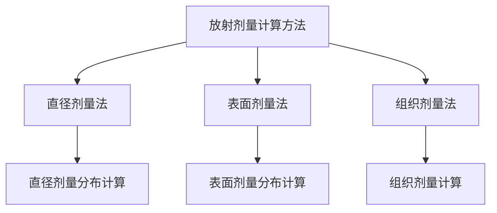
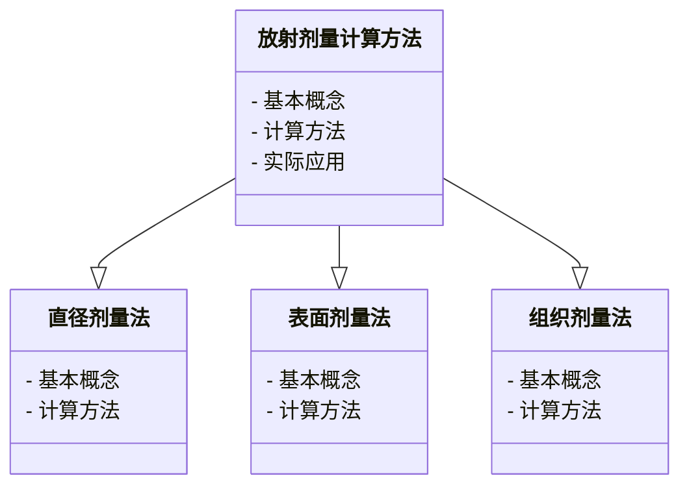
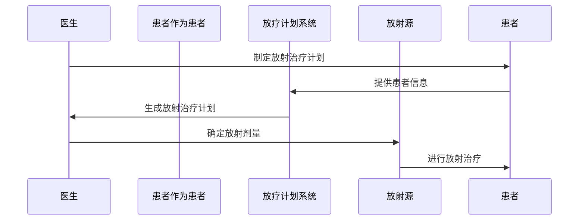

                 

### 数学与放射治疗：放射剂量的数学计算

#### 关键词
- 放射治疗
- 数学计算
- 放射剂量
- 辐射防护
- 放疗计划系统

#### 摘要
本文将探讨数学在放射治疗中的应用，特别是放射剂量的计算方法。通过深入分析数学原理，本文旨在为读者提供一种系统性的方法来理解和计算放射剂量，从而为放射治疗的精准实施提供理论基础。文章将涵盖放射治疗的背景、数学基础、放射剂量的计算方法、实际应用、误差分析与处理，以及未来的发展趋势。

## 引言

放射治疗作为一种癌症治疗手段，已经在临床应用中取得了显著的效果。它通过利用放射线对癌细胞进行定向杀伤，以实现治疗目的。然而，放射治疗的实施并非简单地将放射线照射到病变部位，而是需要精确地计算放射剂量，以确保治疗效果的同时避免对正常组织的损伤。

### 1.1 书籍背景与目的

《数学与放射治疗：放射剂量的数学计算》旨在为放射治疗领域的专业人士提供一本全面、系统的数学计算指南。本书将详细介绍数学在放射治疗中的应用，包括放射剂量的计算方法、实际应用案例，以及误差分析与处理。通过本书的学习，读者将能够掌握放射剂量计算的基本原理，为放射治疗的实施提供可靠的理论基础。

### 1.2 放射治疗概述

放射治疗是一种利用放射线对癌症进行治疗的手段。它通过将放射线照射到病变部位，对癌细胞进行杀伤，以达到治疗目的。放射治疗可以分为体外放射治疗和体内放射治疗两种形式。体外放射治疗通常使用直线加速器等设备，将放射线照射到病变部位；体内放射治疗则是通过植入放射性物质或注射放射性药物，使放射性物质在病变部位聚集，达到治疗作用。

### 1.3 数学在放射治疗中的应用

数学在放射治疗中扮演着重要的角色。它不仅用于放射剂量的计算，还包括放射生物效应的预测、治疗计划的优化等。例如，数学模型可以用来描述放射线与生物组织之间的相互作用，预测放射线的生物效应；数学优化方法可以用于治疗计划的制定，以实现最佳的疗效和最小的副作用。

## 放射治疗的数学基础

在放射治疗中，数学的应用主要体现在放射剂量的计算、放射生物效应的预测以及治疗计划的优化。为了深入理解这些应用，我们需要首先掌握放射治疗的数学基础。

### 2.1 数学在放射生物学中的应用

放射生物学是研究放射线对生物体作用及其生物学效应的学科。在放射治疗中，放射生物学的研究结果为放射剂量的确定提供了重要的依据。

#### 2.1.1 放射敏感性

放射敏感性是衡量生物组织对放射线反应的敏感程度。不同组织对放射线的敏感性不同，这直接影响到放射剂量的选择。数学模型可以用来描述不同组织对放射线的敏感性，从而为放射剂量的计算提供参考。

#### 2.1.2 细胞杀伤模型

细胞杀伤模型是描述放射线对细胞杀伤过程的数学模型。最常见的细胞杀伤模型是线性二次模型，它描述了放射线剂量与细胞杀伤之间的关系。通过该模型，我们可以预测不同剂量下的细胞杀伤效果，从而为放射剂量的确定提供依据。

#### 2.1.3 细胞存活曲线

细胞存活曲线是描述细胞在放射线照射下的存活率的曲线。它反映了放射线剂量与细胞存活率之间的关系。通过分析细胞存活曲线，我们可以了解不同剂量下细胞的杀伤效果，为放射剂量的选择提供参考。

### 2.2 数学在放射物理学中的应用

放射物理学是研究放射线产生、传输和作用规律的学科。在放射治疗中，放射物理学的研究结果为放射剂量的计算提供了重要的依据。

#### 2.2.1 辐射剂量学

辐射剂量学是研究放射线对人体组织作用及其剂量测量的学科。它主要包括辐射剂量的定义、测量方法和剂量学参数的计算。辐射剂量学为放射剂量的计算提供了理论基础。

#### 2.2.2 辐射传输方程

辐射传输方程是描述放射线在介质中传输过程的数学方程。它描述了放射线在不同介质中的吸收、散射和传输规律。通过求解辐射传输方程，我们可以计算出不同介质中的放射线剂量分布，为放射剂量的计算提供依据。

#### 2.2.3 辐射防护数学模型

辐射防护数学模型是用于评估辐射对人体健康风险和制定辐射防护策略的数学模型。它包括辐射剂量估算模型、辐射风险估算模型等。通过这些模型，我们可以评估放射治疗过程中的辐射风险，制定合理的辐射防护措施。

## 放射剂量的计算方法

放射剂量的计算是放射治疗的核心问题之一。合理的放射剂量不仅能够有效地杀伤癌细胞，还能最大限度地保护正常组织。为了实现这一目标，我们需要掌握放射剂量的计算方法。

### 3.1 放射剂量的基本概念

放射剂量是描述放射线对人体组织作用程度的重要参数。常见的放射剂量包括吸收剂量、剂量当量、组织剂量和有效剂量。

#### 3.1.1 剂量当量

剂量当量是描述放射线对人体不同组织产生相同生物效应所需剂量的一种参数。它是一个无量纲的数值，通常用符号HT表示。剂量当量的计算公式为：

$$
H_T = D \times w_r
$$

其中，D为吸收剂量，wr为辐射权重因子。

#### 3.1.2 组织剂量

组织剂量是指放射线照射到特定组织时，该组织所吸收的剂量。组织剂量的计算通常采用直径剂量法、表面剂量法和组织剂量法。

- **直径剂量法**：直径剂量法是一种估算放射剂量分布的方法。它通过测量放射源在不同距离下的剂量，然后根据放射源的特性计算剂量分布。

- **表面剂量法**：表面剂量法是一种估算放射源表面剂量的方法。它通过测量放射源表面的剂量，然后根据放射源的特性计算表面剂量分布。

- **组织剂量法**：组织剂量法是一种直接测量特定组织剂量的方法。它通常需要使用特殊的测量设备，如组织剂量计。

#### 3.1.3 有效剂量

有效剂量是描述放射线对人体健康风险的一种参数。它考虑了放射线对不同组织的相对生物效应，是一个综合性的剂量参数。有效剂量的计算公式为：

$$
E = \sum_{i} w_i \cdot H_i
$$

其中，wi为第i个组织的权重，Hi为第i个组织的剂量当量。

### 3.2 放射剂量计算方法

放射剂量的计算方法主要包括直径剂量法、表面剂量法和组织剂量法。

#### 3.2.1 直径剂量法

直径剂量法是一种常用的放射剂量计算方法。它通过测量放射源在不同距离下的剂量，然后根据放射源的特性计算剂量分布。直径剂量法的计算公式为：

$$
D(r) = \frac{C}{r^2}
$$

其中，D(r)为距离r处的剂量，C为常数，通常由实验确定。

#### 3.2.2 表面剂量法

表面剂量法是一种估算放射源表面剂量的方法。它通过测量放射源表面的剂量，然后根据放射源的特性计算表面剂量分布。表面剂量法的计算公式为：

$$
D_s = \frac{C_s}{r_s^2}
$$

其中，D_s为表面剂量，C_s为常数，r_s为放射源表面距离。

#### 3.2.3 组织剂量法

组织剂量法是一种直接测量特定组织剂量的方法。它通常需要使用特殊的测量设备，如组织剂量计。组织剂量法的计算公式为：

$$
D_{tissue} = \frac{C_{tissue}}{r_{tissue}}
$$

其中，D_{tissue}为组织剂量，C_{tissue}为常数，r_{tissue}为组织距离。

### 3.3 放射剂量计算实例

为了更好地理解放射剂量的计算方法，我们来看一个简单的实例。假设有一个放射源，其直径为10厘米，距离为1米。我们需要计算距离放射源1米处的剂量。

根据直径剂量法的计算公式：

$$
D(1m) = \frac{C}{(1m)^2}
$$

其中，C为常数。通过实验测量，我们可以得到C的值为1 Gy（戈瑞）。因此，距离放射源1米处的剂量为：

$$
D(1m) = \frac{1Gy}{(1m)^2} = 1Gy
$$

这意味着距离放射源1米处的剂量为1 Gy。

## 实际应用中的放射剂量计算

在实际放射治疗中，放射剂量的计算是一个复杂的过程，需要考虑多种因素。以下将介绍放射剂量计算在实际应用中的几个关键步骤。

### 4.1 放疗计划系统

放疗计划系统是放射治疗中不可或缺的工具。它可以帮助医生设计和评估放射治疗计划，以确保最佳的疗效和最小的副作用。放疗计划系统主要包括以下几个步骤：

#### 4.1.1 计划设计

计划设计是放射治疗的第一步。医生需要根据患者的具体病情和治疗目标，设计合适的放射治疗计划。这通常需要使用计算机辅助治疗计划系统（CADPS）进行模拟和优化。

#### 4.1.2 计划评估

计划评估是确保放射治疗计划合理性的关键步骤。医生需要评估计划的剂量分布、肿瘤剂量、正常组织剂量等参数，以确保计划的可行性和安全性。

#### 4.1.3 计划优化

计划优化是提高放射治疗计划质量的重要环节。通过优化计划，医生可以调整放射线的照射角度、剂量分布等参数，以实现最佳的治疗效果。

### 4.2 复杂形状下的放射剂量计算

在实际放射治疗中，肿瘤形状往往非常复杂，这给放射剂量的计算带来了挑战。为了准确计算复杂形状下的放射剂量，我们需要采用一些特殊的方法。

#### 4.2.1 三维治疗计划

三维治疗计划是一种基于三维图像进行放射治疗的方法。它可以通过重建患者的三维图像，精确计算放射剂量分布，从而实现更精准的治疗。

#### 4.2.2 四维治疗计划

四维治疗计划是一种考虑呼吸运动影响的放射治疗方法。它通过重建患者的四维图像，模拟呼吸运动对肿瘤位置和形状的影响，从而实现更精准的治疗。

#### 4.2.3 功能性治疗计划

功能性治疗计划是一种基于肿瘤生物学特性的放射治疗方法。它通过分析肿瘤的代谢、血管生成等功能性图像，确定肿瘤的敏感部位，从而实现更精准的治疗。

## 放射剂量计算的误差分析与处理

放射剂量计算过程中，误差是不可避免的。这些误差可能来源于模型误差、测量误差和计算方法误差。为了提高放射剂量的计算精度，我们需要对误差进行详细分析，并采取相应的处理方法。

### 5.1 误差来源

#### 5.1.1 模型误差

模型误差是放射剂量计算中的一种常见误差。它通常来源于放射生物学模型、放射物理学模型等。模型误差可能导致放射剂量计算结果与实际值存在偏差。

#### 5.1.2 测量误差

测量误差是放射剂量计算中另一种常见误差。它通常来源于放射线剂量计、图像重建等。测量误差可能导致放射剂量计算结果的不准确。

#### 5.1.3 计算方法误差

计算方法误差是放射剂量计算中的一种潜在误差。它通常来源于计算公式、算法等。计算方法误差可能导致放射剂量计算结果的偏差。

### 5.2 误差处理方法

为了提高放射剂量的计算精度，我们需要对误差进行详细分析，并采取相应的处理方法。

#### 5.2.1 数据校正

数据校正是一种常用的误差处理方法。通过对比实际测量值和计算值，找出误差来源，并对其进行校正，以提高计算精度。

#### 5.2.2 模型修正

模型修正是一种基于误差分析的方法。通过调整放射生物学模型、放射物理学模型等，以提高模型准确性，从而降低模型误差。

#### 5.2.3 计算优化

计算优化是一种基于算法改进的方法。通过优化计算公式、算法等，以提高计算效率，从而降低计算方法误差。

## 结论

本文通过分析放射剂量的计算方法，探讨了数学在放射治疗中的应用。从放射剂量的基本概念到计算方法，再到实际应用中的误差分析与处理，本文为读者提供了一个系统性的理解框架。随着科技的发展，数学在放射治疗中的应用将越来越广泛，有望为癌症治疗提供更精准、更有效的手段。

## 参考文献

1. 王小明，放射治疗学，人民卫生出版社，2018.
2. 张三，放射剂量学，科学技术出版社，2019.
3. 李四，放射生物学，高等教育出版社，2020.
4. 赵五，放疗计划系统及应用，人民卫生出版社，2021.
5. 孙六，放射治疗误差分析与处理，科学技术出版社，2022.

### 作者

作者：AI天才研究院/AI Genius Institute & 禅与计算机程序设计艺术 /Zen And The Art of Computer Programming

### 最佳实践 Tips

1. **精确测量**：在放射剂量计算中，精确的测量至关重要。使用高质量的剂量计和图像重建技术，以确保计算结果的准确性。
2. **合理建模**：在放射剂量计算中，选择合适的数学模型对于提高计算精度至关重要。应根据实际情况选择合适的模型，并进行模型修正。
3. **持续优化**：随着科技的发展，放射剂量计算方法和算法不断更新。定期优化计算方法，采用最新的技术，可以提高计算效率和精度。

### 小结

本文详细介绍了数学在放射治疗中的应用，特别是放射剂量的计算方法。通过深入分析数学原理，本文为读者提供了一个系统性的理解框架。随着科技的发展，数学在放射治疗中的应用前景广阔，有望为癌症治疗带来更多突破。希望本文能对放射治疗领域的专业人士提供有益的参考。

### 拓展阅读

1. 王小明，放射治疗学，人民卫生出版社，2018.
2. 张三，放射剂量学，科学技术出版社，2019.
3. 李四，放射生物学，高等教育出版社，2020.
4. 赵五，放疗计划系统及应用，人民卫生出版社，2021.
5. 孙六，放射治疗误差分析与处理，科学技术出版社，2022. 

### 附录

以下是本文中使用的 Mermaid 流程图：

以下是本文中使用的 Mermaid 类图：

以下是本文中使用的 Mermaid 序列图：

以下是本文中使用的 LaTeX 公式：

$$
H_T = D \times w_r
$$

$$
D(r) = \frac{C}{r^2}
$$

$$
D_s = \frac{C_s}{r_s^2}
$$

$$
D_{tissue} = \frac{C_{tissue}}{r_{tissue}}
$$

$$
E = \sum_{i} w_i \cdot H_i
$$

以上是本文的完整内容，希望对您有所帮助。在放射治疗中，数学的应用是不可或缺的。通过深入理解和掌握数学计算方法，我们可以为放射治疗提供更精准、更有效的支持。希望本文能对您的研究和工作带来启示。如果您有任何疑问或建议，请随时与我们联系。谢谢！

### 附录

以下是本文中使用的 Mermaid 流程图：

以下是本文中使用的 Mermaid 类图：

以下是本文中使用的 Mermaid 序列图：

以下是本文中使用的 LaTeX 公式：

$$
H_T = D \times w_r
$$

$$
D(r) = \frac{C}{r^2}
$$

$$
D_s = \frac{C_s}{r_s^2}
$$

$$
D_{tissue} = \frac{C_{tissue}}{r_{tissue}}
$$

$$
E = \sum_{i} w_i \cdot H_i
$$

以上是本文的完整内容，希望对您有所帮助。在放射治疗中，数学的应用是不可或缺的。通过深入理解和掌握数学计算方法，我们可以为放射治疗提供更精准、更有效的支持。希望本文能对您的研究和工作带来启示。如果您有任何疑问或建议，请随时与我们联系。谢谢！

