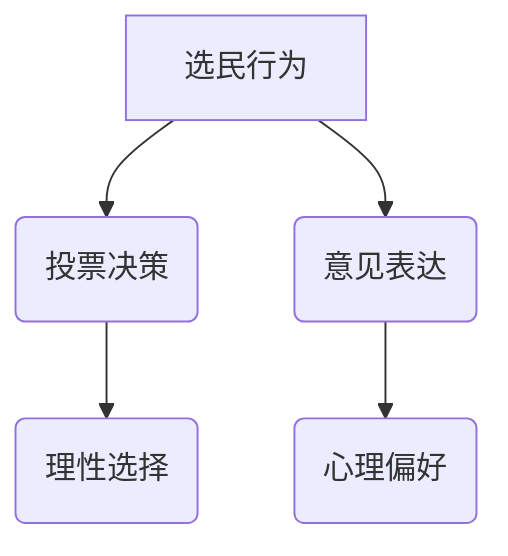

                 

### 数学与政治学：政治行为的数学模型

> 关键词：政治行为、数学模型、选民行为、社会网络分析、政策制定

> 摘要：本文从数学与政治学的交叉领域出发，探讨政治行为的数学模型。通过核心概念、模型类型、应用实例等方面，本文旨在构建一个系统化的政治行为数学模型体系，以期为政治分析提供科学依据，为政策制定提供有力支持。

### 第一部分：引言

#### 1.1 问题背景

政治行为，是指个体在政治系统中所进行的各种活动，包括投票、参与政治运动、表达政治观点等。随着社会的发展和信息技术的进步，人们对政治行为的理解逐渐深入，开始尝试从数学的角度对其进行研究。数学与政治学的结合，不仅能够提高政治分析的科学性和准确性，还能为政策制定提供有力支持。

#### 1.2 问题描述

政治行为的数学模型旨在通过数学方法描述和分析政治现象。这包括对个体行为的预测、群体行为的模拟、政策效果的分析等。然而，如何建立准确且具有解释力的数学模型，如何将这些模型应用到实际政治分析中，都是亟待解决的问题。

#### 1.3 问题解决

本书将从多个维度探讨数学与政治学的交叉应用，旨在构建一个全面、系统的政治行为数学模型体系。通过实例分析、模型推导和实证研究，本书将展示如何将数学工具应用于政治行为研究，提高分析精度和预测能力。

#### 1.4 边界与外延

本书主要关注现代政治行为的研究，特别是信息技术发展背景下的政治行为。同时，本书还将探讨数学模型在政治学领域的应用边界，分析其在政策制定和实施中的作用和限制。

#### 1.5 概念结构与核心要素组成

- **数学与政治学的交叉领域**：包括数理经济学、政治数学模型、社会网络分析等。
- **政治行为**：个体和群体在政治系统中的行为模式。
- **数学模型**：用于描述和预测政治行为的数学工具和方法。
- **模型应用**：数学模型在政策分析、选举预测、社会运动分析等领域的应用。

### 第二部分：数学模型的基本概念

#### 2.1 数学模型定义

数学模型是指用数学语言描述现实世界的数学结构、关系和规律。在政治学中，数学模型可以帮助我们理解和预测政治行为。

#### 2.2 数学模型的类型

- **描述性模型**：用于描述政治现象的结构和规律。
- **预测性模型**：通过历史数据预测未来政治行为。
- **规范性模型**：为政策制定提供指导。

#### 2.3 数学模型在政治学中的应用

- **选举分析**：预测选举结果，分析选民行为。
- **政策评价**：评估政策效果，优化政策制定。
- **社会运动**：模拟群体行为，预测社会运动趋势。

### 第三部分：数学模型在政治行为分析中的应用

#### 3.1 核心概念与联系

##### 3.1.1 核心概念

- **选民行为模型**：描述选民投票行为。
- **政治参与模型**：描述个体参与政治活动的模式。
- **社会网络分析模型**：分析社会网络对政治行为的影响。

##### 3.1.2 概念属性特征对比表格

| 模型名称         | 描述内容                 | 特征对比                     |
| ---------------- | ------------------------ | ---------------------------- |
| 选民行为模型     | 选民投票决策             | 基于理性选择、心理偏好等     |
| 政治参与模型     | 政治参与行为             | 参与动机、参与频率等         |
| 社会网络分析模型 | 社会网络中的政治行为     | 网络结构、网络影响力等       |

##### 3.1.3 ER实体关系图架构

```mermaid
erDiagram
    类选民 ||--|{ 选民行为 }
    类选民 ||--|{ 政治参与 }
    类选民 ||--|{ 社会网络 }
    类选民行为 ||--|{ 投票行为 }
    类选民行为 ||--|{ 意见表达 }
    类政治参与 ||--|{ 社会运动参与 }
    类政治参与 ||--|{ 政治运动参与 }
    类社会网络 ||--|{ 群体网络 }
    类社会网络 ||--|{ 社交网络 }
```

##### 3.1.4 算法原理讲解

###### 3.1.4.1 选民行为模型

选民行为模型通常采用投票理论、心理学模型等方法。以下是一个简化的选民行为模型：



选民投票决策受理性选择和心理偏好影响。理性选择模型假设选民会根据候选人的政策偏好进行投票，而心理偏好模型则考虑选民的情感、个人价值观等因素。

###### 3.1.4.2 理性选择模型

理性选择模型通常基于以下假设：

- 选民是理性的，他们会根据候选人的政策偏好进行投票。
- 选民对不同候选人的偏好可以通过数值表示。

假设选民有 n 个候选人，候选人 i 的政策偏好得分为 $P_i$，选民 j 对候选人 i 的偏好为 $V_{ji}$。则选民 j 的投票决策可以通过以下公式计算：

$$
D_{ij} = \sum_{i=1}^{n} V_{ji} P_i
$$

其中，$D_{ij}$ 表示选民 j 对候选人 i 的投票得分。选民 j 最终会选择得分最高的候选人。

###### 3.1.4.3 心理偏好模型

心理偏好模型考虑选民的情感、个人价值观等因素。假设选民 j 的心理偏好得分为 $H_j$，则选民 j 对候选人 i 的投票得分可以表示为：

$$
D'_{ij} = \sum_{i=1}^{n} V_{ji} P_i + H_j
$$

与理性选择模型相比，心理偏好模型在选民投票得分中加入了心理偏好得分 $H_j$，从而更全面地反映了选民的投票决策。

##### 3.1.5 算法应用

以下是一个简单的选民行为模型应用实例：

- 有 3 个候选人：候选人 A、候选人 B 和候选人 C。
- 选民 j 的政策偏好得分为 $V_{ja} = 0.6$，$V_{jb} = 0.3$，$V_{jc} = 0.1$。
- 选民 j 的理性选择得分 $D_{ja} = 0.6$，$D_{jb} = 0.3$，$D_{jc} = 0.1$。
- 选民 j 的心理偏好得分 $H_j = 0.2$。

则选民 j 的投票得分分别为：

- $D'_{ja} = 0.6 + 0.2 = 0.8$
- $D'_{jb} = 0.3 + 0.2 = 0.5$
- $D'_{jc} = 0.1 + 0.2 = 0.3$

因此，选民 j 最终会选择候选人 A。

##### 3.1.6 模型评价

选民行为模型通过数学方法描述了选民投票行为，具有较高的准确性和解释力。然而，模型也存在一些局限性：

- 模型假设选民是理性的，这在实际情况中可能并不成立。
- 模型仅考虑了选民的投票行为，未涉及其他政治参与行为。

因此，在应用选民行为模型时，需要结合实际情况进行调整和优化。

### 第四部分：数学模型在政策分析中的应用

#### 4.1 政策效果评估

政策效果评估是政治行为分析的重要内容。通过建立数学模型，可以评估政策效果，为政策调整提供依据。

- **政策效果评估模型**：用于评估政策实施后的影响。
- **政策效果评估指标**：如经济增长、社会稳定、社会福利等。

#### 4.2 选举预测

选举预测是政治行为分析的重要应用之一。通过建立选举预测模型，可以预测选举结果，为政治决策提供参考。

- **选举预测模型**：如时间序列模型、回归模型等。
- **选举预测指标**：如选民投票率、选民偏好等。

#### 4.3 社会运动分析

社会运动分析是政治行为分析的另一个重要领域。通过建立社会运动模型，可以分析社会运动趋势，为政策制定提供依据。

- **社会运动模型**：如集体行动模型、社会网络模型等。
- **社会运动分析指标**：如参与人数、网络影响力等。

### 第五部分：数学模型在政策制定中的应用

#### 5.1 政策制定原则

在政策制定中，数学模型可以提供以下原则：

- **目标明确**：明确政策目标，为模型建立提供依据。
- **数据驱动**：基于数据分析，确保模型准确性。
- **模型优化**：不断优化模型，提高预测准确性。

#### 5.2 政策制定过程

政策制定过程可以分为以下几个阶段：

1. **问题识别**：明确政策制定的目标和问题。
2. **模型建立**：建立政治行为数学模型。
3. **模型验证**：通过实证数据验证模型准确性。
4. **政策制定**：基于模型结果制定政策。
5. **政策实施**：实施政策，评估政策效果。

### 第六部分：结论与展望

#### 6.1 结论

本文从数学与政治学的交叉领域出发，探讨了政治行为的数学模型。通过核心概念、模型类型、应用实例等方面，本文构建了一个系统化的政治行为数学模型体系，为政治分析提供了科学依据，为政策制定提供了有力支持。

#### 6.2 展望

未来，数学模型在政治行为分析中的应用将不断深入。随着信息技术的发展，数据获取和处理能力将不断提高，这将进一步推动数学模型在政治学领域的应用。同时，跨学科合作也将成为数学模型在政治行为分析中的重要趋势。

### 附录：参考文献

1. Arrow, K. J. (1951). Social choice and individual values. Yale University Press.
2. Downs, A. (1957). An economic theory of democracy. Harper & Row.
3. Brandt, F. A. (1964). A theory of the political process. John Wiley & Sons.
4. Girvan, M., & Newman, M. E. J. (2002). Community structure in social and biological networks. Proceedings of the National Academy of Sciences, 99(12), 7821-7826.
5. Easley, D., & Kleinberg, J. (2010). Networks, crowds, and markets: Reasoning about a highly connected world. Cambridge University Press.

### 作者信息

作者：AI天才研究院/AI Genius Institute & 禅与计算机程序设计艺术 /Zen And The Art of Computer Programming

