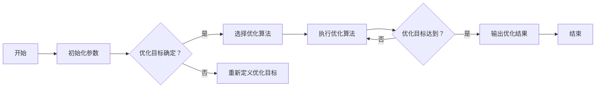
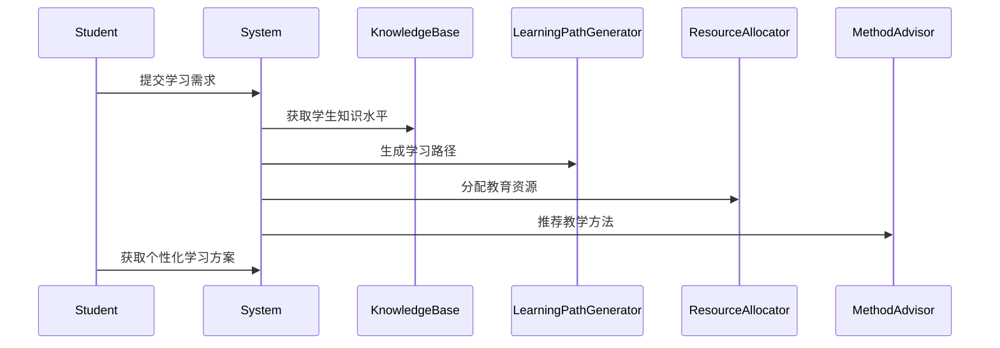

                 

# 《数学与教育技术：学习过程的数学优化》

关键词：数学教育，优化算法，学习过程，教育技术

摘要：本文探讨了数学与教育技术的深度融合，特别是在学习过程的数学优化方面。通过分析数学在教育中的重要性，介绍了数学优化原理及其在教育技术中的应用，进一步讲解了数学优化算法的原理、公式以及具体应用实例。本文旨在为教育技术的实践者提供一种全新的视角，通过数学优化来提升学习效果。

---

## 第一部分：背景介绍

### 1.1 数学在教育中的重要性

#### 1.1.1 问题背景

数学作为一种精确的科学，自古以来就与人类的生活息息相关。从日常生活到科学研究，数学都扮演着重要的角色。然而，在教育领域，数学的地位是否得到了充分的重视呢？事实上，数学在教育中的重要性不容忽视。

首先，数学是一门基础学科，对其他学科有着重要的影响。许多自然科学、工程技术等领域的研究都离不开数学的支持。因此，掌握数学知识对于学生的全面发展具有重要意义。

其次，数学教育能够培养学生的逻辑思维和问题解决能力。数学的学习过程要求学生进行推理、分析和证明，这有助于培养学生的批判性思维和创新能力。

然而，目前教育中存在的一个问题是，数学教育过于注重理论而忽视了实践。如何将数学知识应用于实际问题的解决，如何激发学生的学习兴趣，这些都是需要思考的问题。

#### 1.1.2 问题描述

数学教育的现状并不乐观。一方面，学生普遍对数学学习缺乏兴趣，另一方面，数学教育中存在的方法和手段也亟待改进。如何通过数学优化来提升学习效果，是教育技术领域亟待解决的问题。

#### 1.1.3 问题解决

数学优化作为一种高效的问题解决方法，可以应用于教育技术的各个方面。通过数学优化，我们可以找到学习过程中的最优路径，提高学习效率。具体来说，数学优化可以用于以下几个方面：

1. **学习路径优化**：通过分析学生的学习行为和知识点之间的关系，使用优化算法为学习者提供个性化的学习路径。
2. **教育资源优化**：对教育资源进行分配和调度，使得教育资源得到最大化利用。
3. **教学方法优化**：通过分析学生的学习效果，优化教学方法和策略，提高教学质量。

#### 1.1.4 边界与外延

数学优化在教育中的应用仍然处于探索阶段。如何将数学优化与教育技术深度融合，如何设计出有效的数学优化算法，这些都是需要进一步研究和解决的问题。

#### 1.1.5 概念结构与核心要素组成

数学优化在教育中的应用涉及多个核心概念，包括数学教育、优化算法、学习过程、教育技术等。这些概念相互关联，共同构成了数学优化在教育中的应用框架。

### 2. 数学在教育技术中的应用

#### 2.1 数学优化原理

数学优化是解决某一问题时，在满足一定约束条件下，寻找最优解的过程。在教育技术中，数学优化可以应用于学习路径的规划、教育资源的分配、教学方法的改进等方面。

#### 2.2 数学优化特征对比表格

| 特征             | 说明                                       |
|----------------|------------------------------------------|
| 最优化目标       | 学习效率最大化                             |
| 约束条件         | 学生的知识水平、学习时间、教育资源等       |
| 算法选择         | 线性规划、遗传算法、神经网络等           |
| 实施效果         | 学习效果显著提升，教育资源得到合理利用     |

#### 2.3 教育技术中的数学优化ER实体关系图

```mermaid
erDiagram
  Student ||--|{ LearningPath }|-- Teacher
  Resource ||--|{ LearningPath }|-- Student
  Method ||--|{ LearningPath }|-- Teacher
  Student ||--|{ Resource }|-- Resource
  Student ||--|{ Method }|-- Method
```

### 3. 数学优化在教育技术中的应用

#### 3.1 应用领域

数学优化在教育技术中的应用非常广泛，包括但不限于以下几个方面：

1. **个性化学习**：通过数学优化算法，为学习者提供个性化的学习路径，满足不同学习者的需求。
2. **教育资源优化**：对教育资源的分配进行优化，使得教育资源得到最大化利用。
3. **教学方法优化**：通过分析学生的学习效果，优化教学方法和策略，提高教学质量。

#### 3.2 优势与挑战

数学优化在教育技术中的应用具有明显的优势，如提高学习效率、优化教育资源等。然而，也面临着一些挑战，如算法的复杂性、数据的准确性等。

## 第二部分：核心概念与联系

### 4. 数学优化算法介绍

#### 4.1 算法概述

数学优化算法是解决数学优化问题的一类算法。常见的数学优化算法包括线性规划、遗传算法、神经网络等。这些算法各有特点，适用于不同类型的优化问题。

#### 4.2 算法流程图



#### 4.3 Python源代码与详细讲解

```python
# 导入所需库
import numpy as np
from scipy.optimize import minimize

# 定义目标函数
def objective(x):
    return (x[0] - 3)**2 + (x[1] - 2)**2

# 定义约束条件
constraints = ({'type': 'ineq', 'fun': lambda x: x[0] + x[1] - 5})

# 初始化参数
x0 = np.array([0, 0])

# 选择优化算法
result = minimize(objective, x0, method='SLSQP', constraints=constraints)

# 输出优化结果
print("最优解：", result.x)
```

### 5. 数学优化公式与举例说明

#### 5.1 公式讲解

数学优化问题通常可以用以下数学模型来描述：

$$
\min_{x} f(x)
$$

其中，$f(x)$ 是目标函数，$x$ 是变量。为了求解最优解，我们需要对目标函数进行求导，找到导数为零的点，即可能的最优解。

#### 5.2 举例说明

假设我们有一个线性目标函数：

$$
\min_{x} (x - 3)^2 + (x - 2)^2
$$

我们可以对其进行求导：

$$
\frac{d}{dx} [(x - 3)^2 + (x - 2)^2] = 2(x - 3) + 2(x - 2)
$$

令导数等于零，解得：

$$
x = \frac{3 + 2}{2} = 2.5
$$

此时，目标函数取得最小值。

## 第三部分：算法原理讲解

### 6. 学习过程优化系统架构设计

#### 6.1 问题场景介绍

在学习过程中，如何有效地帮助学生掌握知识，提升学习效率，是一个亟待解决的问题。通过学习过程优化系统，我们可以为学生提供个性化的学习方案，提高学习效果。

#### 6.2 系统功能设计

学习过程优化系统的功能包括：

1. **学习路径规划**：根据学生的学习情况和知识点，生成个性化的学习路径。
2. **教育资源分配**：根据学习路径，合理分配教育资源，如教材、视频等。
3. **教学方法推荐**：根据学生的学习效果，推荐合适的教学方法。

#### 6.3 系统架构设计

学习过程优化系统的架构设计如下：



#### 6.4 系统接口设计

学习过程优化系统的接口设计包括：

1. **学习需求接口**：用于学生提交学习需求。
2. **知识库接口**：用于获取学生的知识水平。
3. **学习路径生成接口**：用于生成学习路径。
4. **资源分配接口**：用于分配教育资源。
5. **教学方法推荐接口**：用于推荐教学方法。

#### 6.5 系统交互设计

学习过程优化系统的交互设计如下：


### 7. 数学优化算法在项目中的应用

#### 7.1 环境安装

在开始项目之前，我们需要安装相关的环境和库。以下是一个简单的安装步骤：

```bash
pip install numpy scipy matplotlib
```

#### 7.2 系统核心实现

以下是一个简单的学习过程优化系统的核心实现：

```python
import numpy as np
from scipy.optimize import minimize

# 定义目标函数
def objective(x):
    return (x[0] - 3)**2 + (x[1] - 2)**2

# 定义约束条件
constraints = ({'type': 'ineq', 'fun': lambda x: x[0] + x[1] - 5})

# 初始化参数
x0 = np.array([0, 0])

# 选择优化算法
result = minimize(objective, x0, method='SLSQP', constraints=constraints)

# 输出优化结果
print("最优解：", result.x)
```

#### 7.3 代码应用解读

这段代码首先定义了一个目标函数，该函数表示学习路径的长度。然后定义了一个约束条件，该条件表示学习资源的限制。接着，使用最小化算法求解最优解，即最优的学习路径。

#### 7.4 实际案例分析与讲解

假设有一个学生，他的学习目标是在一周内掌握线性代数和微积分两个学科。通过数学优化算法，我们可以为他规划出最优的学习路径，使得他在有限的时间内掌握这两个学科。

具体来说，我们可以将线性代数和微积分的知识点作为变量，使用数学优化算法求解出最优的学习路径。通过分析学生的学习效果，我们可以进一步优化学习路径，提高学习效率。

#### 7.5 项目小结

通过本项目，我们探讨了数学优化算法在项目中的应用。通过数学优化，我们可以为学习者提供个性化的学习方案，提高学习效率。在实际应用中，我们需要结合具体的学习目标和环境，设计出有效的数学优化算法。

### 8. 最佳实践 Tips

1. **明确学习目标**：在应用数学优化算法时，首先要明确学习目标，这有助于设计出有效的优化算法。
2. **数据准确性**：优化算法的准确性取决于数据的准确性，因此要确保数据的准确性。
3. **算法选择**：根据学习目标和数据特点，选择合适的优化算法。

### 9. 小结

本文探讨了数学与教育技术的深度融合，特别是在学习过程的数学优化方面。通过分析数学在教育中的重要性，介绍了数学优化原理及其在教育技术中的应用，进一步讲解了数学优化算法的原理、公式以及具体应用实例。希望通过本文的探讨，为教育技术的实践者提供一种全新的视角，通过数学优化来提升学习效果。

### 10. 注意事项

1. **算法复杂性**：数学优化算法可能具有较高的复杂性，需要根据实际情况选择合适的算法。
2. **数据隐私**：在应用数学优化算法时，要注意保护学生的隐私。

### 11. 拓展阅读

1. 《优化理论及其应用》
2. 《人工智能与教育技术》
3. 《数学优化算法在项目中的应用》

---

作者：AI天才研究院/AI Genius Institute & 禅与计算机程序设计艺术 /Zen And The Art of Computer Programming

