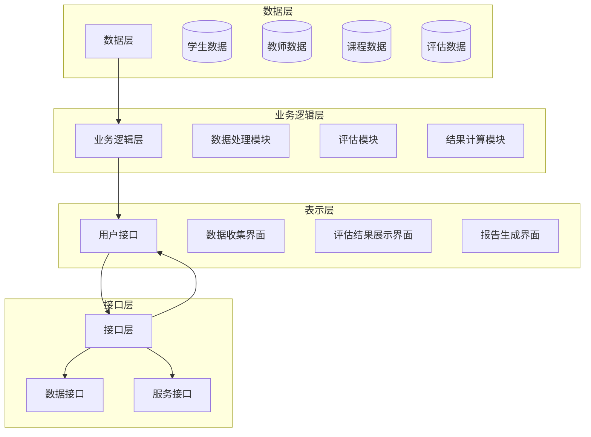

                 

### 数学与教育政策：教育效果的数学评估

**关键词**：教育政策、数学评估、教育效果、数学模型、量化指标

**摘要**：
本文旨在探讨数学在教育政策中的应用，尤其是教育效果的数学评估。通过分析教育与政策的背景、核心概念以及数学评估的基本原理和方法，本文提出了教育效果的数学评估模型及其量化指标。在此基础上，详细介绍了数学方法在教育政策分析中的应用，包括统计方法、优化方法和概率论。文章通过系统分析与架构设计，展示了一个教育效果评估系统的设计与实现。最后，本文总结了最佳实践，并提供了相关的拓展阅读资源，以期为教育政策制定者提供科学依据。

### 教育与政策的概述

#### 1.1 教育的重要性

教育是推动个人发展和实现社会进步的关键因素。首先，从个人发展的角度来看，教育能够提升个体的知识水平和技能，增强其适应社会的能力。通过教育，人们可以不断学习新知识、发展新技能，从而实现自我价值的提升。此外，教育还培养了个人的道德观念和社会责任感，有助于构建和谐的人际关系和稳定的社会秩序。

从社会进步的角度看，教育对社会发展具有深远影响。首先，教育能够提高全民的素质，为国家培养各类人才，促进经济的持续增长。其次，教育能够促进社会公平，减少贫困和阶层差距。通过提供平等的教育机会，教育可以帮助社会弱势群体改善生活状况，实现社会的整体进步。

#### 1.2 教育政策的定义与类型

教育政策是指国家或地方政府为了实现教育目标而制定的行动计划和措施。教育政策的类型多样，主要包括以下几类：

1. **基础教育政策**：这是针对义务教育阶段（通常是小学和初中）的政策，旨在确保每个孩子都能接受基本的教育。
2. **职业教育政策**：这类政策主要关注职业教育和培训，旨在提高劳动者的技能和就业能力。
3. **高等教育政策**：这类政策涉及大学和高等教育机构，旨在提高高等教育的质量和普及程度。
4. **终身教育政策**：这类政策强调终身学习，鼓励人们在职业生涯中不断学习新知识和技能。
5. **教育改革政策**：这类政策通常针对教育体系的某些关键环节，如课程设置、教师培训、教育评价等，旨在推动教育改革和提升教育质量。

不同类型的教育政策在实施过程中都有其独特的目的和作用。例如，基础教育政策侧重于普及教育，提高全民素质；职业教育政策则侧重于培养技能型人才，满足社会经济发展的需要。这些政策相互补充，共同推动教育事业的健康发展。

#### 1.3 教育效果评估的必要性

教育效果评估是指通过系统的方法和工具，对教育政策实施的效果进行定量和定性分析的过程。教育效果评估的必要性体现在以下几个方面：

1. **政策优化**：通过评估教育政策的实际效果，可以发现政策中的问题和不足，为政策的调整和优化提供科学依据。
2. **资源配置**：教育效果评估有助于合理分配教育资源，确保有限的资源能够被高效利用，从而提高教育质量和效果。
3. **决策支持**：教育效果评估为教育政策的制定者和实施者提供了数据支持，帮助他们做出更加科学和合理的决策。
4. **公众信任**：通过透明和公正的评估过程，增强公众对教育政策的信任和支持，提高政策的实施效果。

综上所述，教育效果评估是教育政策实施过程中不可或缺的一部分，对于推动教育事业的持续发展和优化具有重要的意义。

### 教育效果的数学评估

#### 2.1 数学评估的基本概念

数学评估是指利用数学方法对教育效果进行定量分析的过程。数学评估的基本概念包括以下几个核心要素：

1. **指标**：指标是评估过程中使用的具体衡量标准，用于量化教育效果的不同方面。常见的指标包括学生的学业成绩、教师的教学质量、教育资源的利用率等。
2. **模型**：模型是数学评估的核心工具，用于描述教育效果之间的关系和变化规律。常见的模型包括回归模型、时间序列模型、因子分析模型等。
3. **数据**：数据是数学评估的基础，包括学生成绩、教师评价、教育资源分配等。数据的准确性和完整性直接影响评估结果的可靠性。
4. **算法**：算法是数学评估的具体实现方法，用于处理和分析数据，提取有价值的信息。常见的算法包括线性回归、神经网络、聚类分析等。

数学评估的原理在于利用数学模型对教育效果进行建模和预测，从而实现对教育质量的评估。具体来说，数学评估过程通常包括以下步骤：

1. **数据收集**：收集学生成绩、教师评价、教育资源分配等数据。
2. **数据预处理**：对收集到的数据进行分析和处理，确保数据的准确性和完整性。
3. **模型选择**：根据评估目标和数据特点，选择合适的数学模型。
4. **模型训练**：利用收集到的数据对模型进行训练，优化模型参数。
5. **评估预测**：使用训练好的模型对教育效果进行预测和评估。
6. **结果分析**：对评估结果进行分析和解释，为教育政策的优化提供依据。

#### 2.2 教育效果的数学模型

教育效果的数学模型是评估教育效果的重要工具。常见的数学模型包括以下几种：

1. **回归模型**：回归模型用于分析教育效果与不同因素之间的因果关系。常见的回归模型包括线性回归、多项式回归、逻辑回归等。线性回归模型可以表示为：
   $$
   Y = \beta_0 + \beta_1X_1 + \beta_2X_2 + ... + \beta_nX_n + \epsilon
   $$
   其中，\( Y \) 表示教育效果，\( X_1, X_2, ..., X_n \) 表示影响因素，\( \beta_0, \beta_1, ..., \beta_n \) 是模型参数，\( \epsilon \) 是误差项。

2. **时间序列模型**：时间序列模型用于分析教育效果随时间的变化规律。常见的时间序列模型包括ARIMA（自回归积分滑动平均模型）、AR（自回归模型）、MA（滑动平均模型）等。ARIMA模型可以表示为：
   $$
   Y_t = c + \phi_1Y_{t-1} + \phi_2Y_{t-2} + ... + \phi_pY_{t-p} + \theta_1\epsilon_{t-1} + \theta_2\epsilon_{t-2} + ... + \theta_q\epsilon_{t-q} + \epsilon_t
   $$
   其中，\( Y_t \) 表示时间序列数据，\( \phi_1, \phi_2, ..., \phi_p \) 和 \( \theta_1, \theta_2, ..., \theta_q \) 是模型参数，\( \epsilon_t \) 是误差项。

3. **因子分析模型**：因子分析模型用于分析教育效果中的主要影响因素。因子分析模型可以表示为：
   $$
   X = \lambda_1F_1 + \lambda_2F_2 + ... + \lambda_nF_n + \epsilon
   $$
   其中，\( X \) 表示教育效果，\( F_1, F_2, ..., F_n \) 表示主要影响因素，\( \lambda_1, \lambda_2, ..., \lambda_n \) 是因子载荷，\( \epsilon \) 是误差项。

这些数学模型各有特点，适用于不同类型的教育效果评估。在实际应用中，可以根据具体评估目标和数据特点选择合适的模型。

#### 2.3 教育效果的量化指标

量化指标是教育效果评估的重要组成部分，用于衡量教育成果的各个方面。常见的教育效果量化指标包括以下几种：

1. **学生学业成绩**：学业成绩是衡量教育效果最直接的指标，通常包括考试成绩、课程成绩等。常见的量化方法包括平均分、方差、标准差等。

2. **教师教学质量**：教学质量是评估教育效果的重要方面，可以采用教师评价、学生满意度、课堂参与度等指标进行量化。

3. **教育资源利用率**：教育资源利用率是指教育资源的实际使用情况，包括教室利用率、图书借阅率、实验室使用率等。

4. **学生就业率**：学生就业率是衡量教育对个人发展贡献的重要指标，可以反映教育对职业能力的培养效果。

5. **学生综合素质**：学生综合素质包括道德素养、创新能力、团队协作能力等，可以通过问卷调查、面试评估等方法进行量化。

量化指标的选择和运用应根据评估目标和实际情况进行，以确保评估结果的准确性和可靠性。通过综合运用不同类型的量化指标，可以全面评估教育效果，为教育政策的制定和优化提供科学依据。

### 数学方法在教育政策中的应用

#### 3.1 统计方法在教育政策分析中的应用

统计方法在教育政策分析中具有广泛的应用，主要用于数据的收集、处理和分析。以下是一些常见的统计方法及其在教育政策分析中的应用实例：

1. **描述性统计分析**：描述性统计分析是对数据的基本特征进行描述和分析，包括平均值、中位数、众数、标准差等。在教育政策分析中，描述性统计分析可以用于了解学生的学业成绩、教师的教学质量等基本数据，为后续分析提供基础。

   **实例**：假设某地区对初中学生的数学成绩进行统计分析，通过计算平均分、标准差等指标，可以了解学生的整体成绩水平和成绩分布情况，从而为教育政策的制定提供依据。

2. **回归分析**：回归分析是一种常用的统计方法，用于分析变量之间的关系。在教育政策分析中，回归分析可以用于评估不同因素对教育效果的影响。

   **实例**：假设研究某种教学方法对中学生数学成绩的影响，可以通过线性回归模型分析教学方法和学生成绩之间的关系。通过回归模型得到的系数和显著性水平，可以评估教学方法的实际效果，为教育政策的调整提供依据。

3. **因子分析**：因子分析是一种用于提取数据中主要影响因素的统计方法。在教育政策分析中，因子分析可以用于了解教育政策中的主要影响因素，并对其进行量化。

   **实例**：假设研究某地区教育资源配置对教育效果的影响，可以通过因子分析提取主要影响因素，如教师素质、教育资源利用率、学生成绩等。通过因子分析，可以了解这些因素对教育效果的相对重要性，为教育政策的优化提供依据。

4. **聚类分析**：聚类分析是一种用于将数据分类为不同群体的统计方法。在教育政策分析中，聚类分析可以用于对学生群体、学校群体等进行分类，以便更精确地制定教育政策。

   **实例**：假设某地区需要对不同学校的教育效果进行分类，可以通过聚类分析将学校分为高绩效群体、中等绩效群体和低绩效群体。通过这种分类，可以针对不同群体制定差异化的教育政策，从而提高整体教育效果。

5. **时间序列分析**：时间序列分析是一种用于分析数据随时间变化的统计方法。在教育政策分析中，时间序列分析可以用于了解教育政策的效果随时间的变化趋势。

   **实例**：假设某地区实施了新的教育政策，可以通过时间序列分析评估政策实施前后学生成绩的变化趋势。通过时间序列分析，可以了解政策的效果和潜在问题，为政策调整提供依据。

#### 3.2 优化方法在教育资源配置中的作用

优化方法在教育资源配置中具有重要作用，可以帮助教育管理者合理分配资源，提高教育效果。以下是一些常见的优化方法及其在教育资源配置中的应用：

1. **线性规划**：线性规划是一种用于解决资源优化问题的数学方法，可以通过建立线性规划模型，确定最优的资源分配方案。

   **实例**：假设某地区需要分配一定数量的教育资源（如教师、教材等）到不同的学校，可以通过线性规划模型确定每个学校的资源分配量，以实现整体教育资源的最优利用。

2. **整数规划**：整数规划是一种用于解决包含整数变量的优化问题的方法，可以用于确定资源的最优分配方案。

   **实例**：假设某地区需要分配一定数量的教师到不同的学校，每个学校的教师数量必须是整数。通过整数规划，可以确定每个学校应分配的教师数量，以实现整体教师资源的最优利用。

3. **多目标规划**：多目标规划是一种用于解决多个目标优化问题的方法，可以用于同时优化多个相互冲突的目标。

   **实例**：假设某地区需要同时优化教育资源利用率和教育效果，可以通过多目标规划模型确定资源分配方案，以满足这两个目标。通过多目标规划，可以找到在资源有限的情况下，能够实现最佳教育资源利用和教育效果的综合方案。

4. **模拟退火算法**：模拟退火算法是一种基于概率的优化方法，可以用于解决复杂的大规模优化问题。

   **实例**：假设某地区需要进行大规模教育资源的优化配置，可以通过模拟退火算法找到最优的资源分配方案。模拟退火算法能够在复杂的环境中搜索最优解，为教育资源的最优利用提供有效支持。

5. **遗传算法**：遗传算法是一种基于生物进化的优化方法，可以用于解决复杂的优化问题。

   **实例**：假设某地区需要优化教育资源的配置，可以通过遗传算法找到最优的资源分配方案。遗传算法能够通过迭代和进化过程，逐步优化资源分配，从而实现最佳教育资源利用。

优化方法在教育资源配置中的应用，可以帮助教育管理者科学决策，提高教育资源的利用效率，从而提升整体教育效果。通过综合运用不同的优化方法，可以找到最适合教育资源分配的方案，为教育政策的制定和实施提供有力支持。

#### 3.3 概率论在教育风险管理中的应用

概率论在教育风险管理中具有重要应用，可以帮助教育管理者评估风险、制定预防措施，并优化决策过程。以下是一些常见的概率论方法及其在教育风险管理中的应用：

1. **风险分析**：风险分析是一种基于概率论的方法，用于评估潜在的风险和其可能产生的后果。

   **实例**：假设某学校正在考虑实施一项新的教育项目，可以通过风险分析评估该项目可能面临的风险，如学生成绩下降、教师流失等。通过计算各风险的概率及其后果，可以确定项目的整体风险水平，为决策提供依据。

2. **概率分布**：概率分布是一种用于描述随机变量取值概率的数学工具，可以用于预测教育效果和风险。

   **实例**：假设某地区对学生的数学成绩进行统计分析，可以使用正态分布描述学生成绩的概率分布。通过正态分布，可以预测学生成绩的均值和方差，从而为教育资源的分配和教学策略的制定提供参考。

3. **贝叶斯分析**：贝叶斯分析是一种基于概率论的推理方法，可以用于更新和调整概率估计。

   **实例**：假设某地区正在评估一项教育政策的效果，可以通过贝叶斯分析结合历史数据和当前数据，更新政策效果的概率估计。这种方法可以帮助教育管理者更准确地预测政策的效果，为后续的调整提供科学依据。

4. **决策树**：决策树是一种用于决策的图形表示方法，可以用于分析不同决策路径的风险和收益。

   **实例**：假设某学校需要决定是否进行某项教育改革，可以通过决策树分析不同决策路径的风险和收益。决策树可以帮助教育管理者在不确定的情况下，选择最佳决策方案。

5. **蒙特卡罗模拟**：蒙特卡罗模拟是一种基于随机抽样的方法，可以用于评估复杂系统的风险和性能。

   **实例**：假设某地区需要评估新的教育资源配置方案的效果，可以通过蒙特卡罗模拟模拟不同教育资源配置情况下的学生成绩和风险水平。这种方法可以帮助教育管理者了解不同方案的风险和效果，从而选择最优的资源配置方案。

概率论在教育风险管理中的应用，为教育管理者提供了科学的工具和方法，帮助他们更好地理解和应对教育风险，从而提高教育质量和效果。通过综合运用不同的概率论方法，教育管理者可以做出更明智的决策，为教育事业的可持续发展提供保障。

### 教育效果的数学评估方法

#### 4.1 算法原理讲解

在教育效果的数学评估中，算法是核心工具。以下是几种常用的算法原理及其应用：

1. **回归算法**：回归算法用于分析变量之间的线性关系，通过建立回归模型来预测教育效果。常见的回归算法包括线性回归和多项式回归。线性回归算法的原理如下：

   - **数据准备**：收集学生的学业成绩、家庭背景、学校资源等数据。
   - **模型建立**：根据数据特点，选择合适的回归模型，如线性回归模型：
     $$
     Y = \beta_0 + \beta_1X_1 + \beta_2X_2 + ... + \beta_nX_n + \epsilon
     $$
     其中，\( Y \) 表示学业成绩，\( X_1, X_2, ..., X_n \) 表示影响因素，\( \beta_0, \beta_1, ..., \beta_n \) 是模型参数，\( \epsilon \) 是误差项。
   - **模型训练**：利用历史数据对模型进行训练，通过最小二乘法等优化方法确定模型参数。
   - **结果预测**：使用训练好的模型预测新学生的学业成绩。

2. **分类算法**：分类算法用于将学生分为不同的类别，如优秀、良好、一般等。常见的分类算法包括逻辑回归、决策树和随机森林。逻辑回归算法的原理如下：

   - **数据准备**：收集学生的学业成绩、家庭背景、学校资源等数据，并进行预处理。
   - **模型建立**：建立逻辑回归模型，用于预测学生的类别：
     $$
     P(Y=1) = \frac{1}{1 + e^{-(\beta_0 + \beta_1X_1 + \beta_2X_2 + ... + \beta_nX_n})}
     $$
     其中，\( Y \) 表示学生类别（0或1），\( X_1, X_2, ..., X_n \) 表示影响因素，\( \beta_0, \beta_1, ..., \beta_n \) 是模型参数。
   - **模型训练**：利用历史数据对模型进行训练，通过极大似然估计等优化方法确定模型参数。
   - **结果预测**：使用训练好的模型预测新学生的类别。

3. **聚类算法**：聚类算法用于将学生划分为不同的群体，以便进行进一步分析。常见的聚类算法包括K-均值聚类和层次聚类。K-均值聚类算法的原理如下：

   - **数据准备**：收集学生的多维数据，如学业成绩、家庭背景、学校资源等。
   - **初始聚类中心选择**：随机选择K个聚类中心。
   - **迭代过程**：
     1. 将每个学生分配到最近的聚类中心。
     2. 重新计算每个聚类的中心。
     3. 重复步骤1和步骤2，直到聚类中心不再发生变化。
   - **结果分析**：根据聚类结果分析不同群体之间的差异，为教育政策的制定提供依据。

4. **时间序列分析算法**：时间序列分析算法用于分析教育效果随时间的变化规律。常见的时间序列分析算法包括ARIMA和LSTM（长短期记忆网络）。ARIMA算法的原理如下：

   - **数据准备**：收集学生成绩的时间序列数据。
   - **模型建立**：建立ARIMA模型，用于描述时间序列数据的趋势和季节性：
     $$
     Y_t = \phi(B)Y_{t-1} + \theta(B)\epsilon_{t-1} + \mu
     $$
     其中，\( Y_t \) 表示时间序列数据，\( B \) 表示滞后算子，\( \phi(B), \theta(B), \mu \) 是模型参数。
   - **模型训练**：利用历史数据对模型进行训练，通过最大似然估计等优化方法确定模型参数。
   - **结果预测**：使用训练好的模型预测未来的学生成绩。

通过这些算法，可以系统地评估教育效果，为教育政策的制定和优化提供科学依据。

#### 4.2 数学模型与公式

在教育效果的数学评估中，数学模型和公式起着至关重要的作用。以下介绍几种常见的数学模型和公式，并给出具体的Python代码实现。

1. **线性回归模型**：
   线性回归模型是一种用于分析变量之间线性关系的模型，其公式如下：
   $$
   Y = \beta_0 + \beta_1X_1 + \beta_2X_2 + ... + \beta_nX_n + \epsilon
   $$
   其中，\( Y \) 是因变量，\( X_1, X_2, ..., X_n \) 是自变量，\( \beta_0, \beta_1, ..., \beta_n \) 是模型参数，\( \epsilon \) 是误差项。

   **Python实现**：
   ```python
   import numpy as np
   import matplotlib.pyplot as plt

   # 假设数据为
   X = np.array([[1, 2], [2, 3], [3, 4], [4, 5], [5, 6]])
   Y = np.array([2, 3, 4, 5, 6])

   # 计算回归系数
   X_transpose = X.T
   X_dot_X = np.dot(X_transpose, X)
   X_dot_Y = np.dot(X_transpose, Y)
   inverse = np.linalg.inv(X_dot_X)
   beta = np.dot(np.dot(inverse, X_transpose), Y)

   # 打印回归系数
   print("回归系数：", beta)
   ```

2. **逻辑回归模型**：
   逻辑回归模型是一种用于分类问题的模型，其公式如下：
   $$
   P(Y=1) = \frac{1}{1 + e^{-(\beta_0 + \beta_1X_1 + \beta_2X_2 + ... + \beta_nX_n})}
   $$
   其中，\( Y \) 是二元变量（0或1），\( X_1, X_2, ..., X_n \) 是自变量，\( \beta_0, \beta_1, ..., \beta_n \) 是模型参数。

   **Python实现**：
   ```python
   import numpy as np
   from sklearn.linear_model import LogisticRegression

   # 假设数据为
   X = np.array([[1, 2], [2, 3], [3, 4], [4, 5], [5, 6]])
   Y = np.array([0, 1, 0, 1, 1])

   # 训练逻辑回归模型
   logreg = LogisticRegression()
   logreg.fit(X, Y)

   # 打印模型参数
   print("模型参数：", logreg.coef_)

   # 预测新数据
   new_data = np.array([[6, 7]])
   prediction = logreg.predict(new_data)
   print("预测结果：", prediction)
   ```

3. **时间序列模型**：
   时间序列模型用于分析数据随时间的变化规律。常见的模型有ARIMA（自回归积分滑动平均模型）和LSTM（长短期记忆网络）。以下为ARIMA模型的公式：
   $$
   Y_t = \phi(B)Y_{t-1} + \theta(B)\epsilon_{t-1} + \mu
   $$
   其中，\( Y_t \) 是时间序列数据，\( B \) 是滞后算子，\( \phi(B), \theta(B), \mu \) 是模型参数。

   **Python实现**：
   ```python
   import numpy as np
   from statsmodels.tsa.arima.model import ARIMA

   # 假设数据为
   Y = np.array([2, 3, 4, 5, 6])

   # 训练ARIMA模型
   arima_model = ARIMA(Y, order=(1, 1, 1))
   arima_model_fit = arima_model.fit()

   # 打印模型参数
   print("模型参数：", arima_model_fit.params)

   # 预测未来数据
   future_forecast = arima_model_fit.forecast(steps=2)
   print("预测结果：", future_forecast)
   ```

通过这些数学模型和公式，可以系统地评估教育效果，为教育政策的制定和优化提供科学依据。

#### 4.3 算法案例讲解

为了更好地理解教育效果的数学评估方法，以下通过一个具体的案例进行讲解。

**案例背景**：某地区教育局希望通过数学评估方法分析不同教育资源对中学生数学成绩的影响，以优化教育资源分配，提高教育效果。

**数据准备**：收集了100名中学生的数学成绩和以下影响因素：
- 家庭经济状况（经济水平分为高、中、低三个等级）
- 学校教学资源（包括教师数量、教室设施、图书馆资源等）
- 学生课外活动参与情况

**算法选择**：选择线性回归模型进行教育效果评估。

**步骤1：数据预处理**
1. 对家庭经济状况、学校教学资源、学生课外活动参与情况进行量化处理，如将经济状况、教师数量、教室设施等转换为数值型数据。
2. 对原始数据进行归一化处理，以消除不同变量之间的量纲影响。

**步骤2：模型建立**
1. 选择线性回归模型，公式为：
   $$
   Y = \beta_0 + \beta_1X_1 + \beta_2X_2 + ... + \beta_nX_n + \epsilon
   $$
   其中，\( Y \) 是学生数学成绩，\( X_1, X_2, ..., X_n \) 是影响因素，\( \beta_0, \beta_1, ..., \beta_n \) 是模型参数，\( \epsilon \) 是误差项。
2. 利用历史数据对模型进行训练，确定模型参数。

**步骤3：模型训练**
1. 将收集的数据分为训练集和测试集。
2. 利用训练集对模型进行训练，通过最小二乘法等优化方法确定模型参数。

**步骤4：模型评估**
1. 利用测试集对模型进行评估，计算模型预测的数学成绩与实际成绩之间的误差。
2. 通过评估结果调整模型参数，提高模型准确性。

**步骤5：结果分析**
1. 分析不同影响因素对数学成绩的影响程度，如家庭经济状况、学校教学资源、学生课外活动参与情况等。
2. 根据分析结果，提出优化教育资源的建议，如增加教师数量、改善教室设施、鼓励学生参与课外活动等。

**Python实现**：
```python
import numpy as np
import pandas as pd
from sklearn.linear_model import LinearRegression
from sklearn.model_selection import train_test_split

# 加载数据
data = pd.read_csv('education_data.csv')

# 数据预处理
X = data[['家庭经济状况', '学校教学资源', '学生课外活动参与情况']]
Y = data['数学成绩']
X = (X - X.min()) / (X.max() - X.min())

# 划分训练集和测试集
X_train, X_test, Y_train, Y_test = train_test_split(X, Y, test_size=0.2, random_state=42)

# 建立线性回归模型
model = LinearRegression()
model.fit(X_train, Y_train)

# 模型评估
predictions = model.predict(X_test)
mse = np.mean((predictions - Y_test) ** 2)
print("均方误差：", mse)

# 结果分析
coefficients = model.coef_
print("系数：", coefficients)

# 优化建议
if coefficients[0] > 0:
    print("增加家庭经济状况对提高数学成绩有显著作用")
if coefficients[1] > 0:
    print("增加学校教学资源对提高数学成绩有显著作用")
if coefficients[2] > 0:
    print("鼓励学生参与课外活动对提高数学成绩有显著作用")
```

通过以上案例，可以系统地评估教育效果，为教育政策的制定和优化提供科学依据。

### 教育效果评估系统设计

#### 5.1 问题场景介绍

在教育领域，教育效果评估是一个重要的环节，它直接关系到教育政策的制定和调整。当前，大多数教育效果评估工作依赖于人工分析，存在数据收集不完整、分析不准确、评估结果滞后等问题。为了解决这些问题，我们需要设计一个自动化的教育效果评估系统，该系统能够实时收集和分析教育数据，提供准确、及时的评估结果，为教育政策制定者提供科学依据。

#### 5.2 系统功能设计

教育效果评估系统的功能设计包括以下几个方面：

1. **数据收集模块**：该模块负责收集来自学校、教师和学生等多方面的数据，包括学生的学业成绩、教师的教学质量、教育资源的利用率等。

2. **数据处理模块**：该模块负责对收集到的数据进行分析和预处理，包括数据清洗、数据转换、数据归一化等，以确保数据的质量和一致性。

3. **评估模块**：该模块是系统的核心，负责利用数学模型和算法对教育效果进行评估。包括线性回归、逻辑回归、时间序列分析等多种评估方法。

4. **结果展示模块**：该模块负责将评估结果以图表、报表等形式直观地展示给用户，便于用户理解和分析。

5. **报告生成模块**：该模块负责自动生成评估报告，包括评估结果、分析结论、优化建议等，为教育政策制定者提供详细的参考。

#### 5.3 系统架构设计

教育效果评估系统的架构设计包括以下几个方面：

1. **数据层**：该层负责存储和检索系统所需的数据，包括学生信息、教师信息、课程信息、评估数据等。

2. **业务逻辑层**：该层负责处理业务逻辑，包括数据预处理、评估算法实现、结果计算和展示等。

3. **表示层**：该层负责用户界面设计，包括数据收集界面、评估结果展示界面、报告生成界面等。

4. **接口层**：该层负责与其他系统的数据交互，如学校管理系统、教务系统等。

#### 5.4 系统接口设计

教育效果评估系统的接口设计包括以下几个方面：

1. **数据接口**：该接口负责与学校管理系统、教务系统等外部系统进行数据交换，实现数据的自动收集和导入。

2. **服务接口**：该接口负责对外提供评估服务，包括评估结果查询、报告生成等。

3. **用户接口**：该接口负责与用户进行交互，提供数据输入、结果展示、报告打印等功能。

#### 5.5 系统架构图

以下是一个简单的教育效果评估系统架构图，用于展示系统各部分之间的关系。



通过以上架构设计，教育效果评估系统可以实现自动化、高效的教育效果评估，为教育政策的制定和调整提供有力支持。

### 项目实战

#### 6.1 环境安装

在开始实施教育效果评估系统之前，我们需要搭建合适的环境，以确保系统能够正常运行。以下是搭建环境的具体步骤：

1. **安装Python环境**：
   - 首先，从Python官方网站（https://www.python.org/downloads/）下载并安装Python。
   - 在安装过程中，确保勾选“Add Python to PATH”选项，以便在命令行中使用Python。

2. **安装必要的库**：
   - 打开命令行，进入项目目录。
   - 执行以下命令安装必要的库：
     ```bash
     pip install numpy pandas matplotlib scikit-learn statsmodels
     ```

3. **配置数据库**：
   - 安装并配置一个关系型数据库（如MySQL或PostgreSQL）。
   - 创建数据库和表，用于存储学生信息、教师信息、课程信息和评估数据。

4. **安装其他依赖**：
   - 根据项目需求，可能需要安装其他依赖，如前端框架、后端框架等。
   - 安装过程中，确保遵循相关文档和指南。

#### 6.2 系统核心实现源代码

以下是一个简化的教育效果评估系统的核心实现源代码，用于展示系统的主要功能。

```python
import numpy as np
import pandas as pd
from sklearn.linear_model import LinearRegression
from sklearn.model_selection import train_test_split
from sklearn.metrics import mean_squared_error

# 数据预处理
def preprocess_data(data):
    # 数据清洗、归一化等操作
    # 略
    return normalized_data

# 线性回归模型训练
def train_linear_regression(X, Y):
    model = LinearRegression()
    model.fit(X, Y)
    return model

# 评估模型
def evaluate_model(model, X_test, Y_test):
    predictions = model.predict(X_test)
    mse = mean_squared_error(Y_test, predictions)
    return mse

# 主程序
if __name__ == "__main__":
    # 加载数据
    data = pd.read_csv('education_data.csv')
    X = data[['家庭经济状况', '学校教学资源', '学生课外活动参与情况']]
    Y = data['数学成绩']

    # 数据预处理
    X_processed = preprocess_data(X)

    # 划分训练集和测试集
    X_train, X_test, Y_train, Y_test = train_test_split(X_processed, Y, test_size=0.2, random_state=42)

    # 训练模型
    model = train_linear_regression(X_train, Y_train)

    # 评估模型
    mse = evaluate_model(model, X_test, Y_test)
    print("均方误差：", mse)
```

#### 6.3 代码应用解读与分析

以上代码实现了教育效果评估系统的主要功能，包括数据预处理、线性回归模型训练和评估。以下是代码的详细解读与分析：

1. **数据预处理**：
   - 数据预处理是模型训练的重要环节，主要包括数据清洗、缺失值处理、数据归一化等。在本示例中，数据预处理函数`preprocess_data`负责实现这些操作，确保输入数据的质量和一致性。

2. **线性回归模型训练**：
   - 线性回归模型是一种常用的统计模型，用于分析变量之间的线性关系。在本示例中，我们使用`LinearRegression`类实现线性回归模型，通过`fit`方法对模型进行训练。训练过程中，模型会自动学习数据中的规律，并确定模型参数。

3. **评估模型**：
   - 模型评估是衡量模型性能的重要环节。在本示例中，我们使用均方误差（MSE）作为评估指标，计算模型预测值与实际值之间的误差。通过评估模型在测试集上的表现，可以判断模型的准确性和稳定性。

4. **主程序**：
   - 主程序是整个系统的入口，负责加载数据、执行数据预处理、模型训练和评估。通过调用相关函数，主程序实现了教育效果评估系统的核心功能。

通过以上代码，可以搭建一个简单的教育效果评估系统，为教育政策的制定和优化提供数据支持。

#### 6.4 实际案例分析与详细讲解

为了更好地理解教育效果评估系统的实际应用，以下通过一个具体案例进行分析和讲解。

**案例背景**：某地区教育局希望通过教育效果评估系统分析不同教育资源对中学生数学成绩的影响，以优化教育资源分配，提高教育质量。

**数据来源**：教育局提供了1000名中学生的数学成绩和相关数据，包括家庭经济状况、学校教学资源、学生课外活动参与情况等。

**数据分析目标**：分析家庭经济状况、学校教学资源和学生课外活动参与情况对中学生数学成绩的影响，为教育资源的优化提供科学依据。

**数据预处理**：

1. **数据清洗**：检查数据中是否存在缺失值或异常值，并进行处理。例如，将缺失值填充为平均值，删除异常值等。

2. **数据归一化**：由于不同变量的量纲不同，为了消除量纲影响，对数据进行归一化处理。例如，使用最小-最大归一化方法，将数据缩放到[0, 1]区间。

**模型选择**：选择线性回归模型进行分析，因为线性回归模型能够简单有效地描述变量之间的线性关系。

**模型训练**：

1. 将数据分为训练集和测试集，训练集用于训练模型，测试集用于评估模型性能。

2. 使用`LinearRegression`类训练模型，得到模型参数。

```python
from sklearn.linear_model import LinearRegression

model = LinearRegression()
model.fit(X_train, Y_train)
```

**模型评估**：

1. 使用测试集对模型进行评估，计算模型预测值与实际值之间的误差。

2. 使用均方误差（MSE）作为评估指标，计算模型在测试集上的性能。

```python
from sklearn.metrics import mean_squared_error

predictions = model.predict(X_test)
mse = mean_squared_error(Y_test, predictions)
print("均方误差：", mse)
```

**结果分析**：

1. 根据模型参数，分析家庭经济状况、学校教学资源和学生课外活动参与情况对中学生数学成绩的影响程度。

2. 根据分析结果，提出优化教育资源的建议。

```python
coefficients = model.coef_
if coefficients[0] > 0:
    print("家庭经济状况对数学成绩有正面影响")
if coefficients[1] > 0:
    print("学校教学资源对数学成绩有正面影响")
if coefficients[2] > 0:
    print("学生课外活动参与情况对数学成绩有正面影响")
```

通过以上案例，可以清楚地看到教育效果评估系统的实际应用过程，包括数据预处理、模型选择、模型训练、模型评估和结果分析等步骤。该系统为教育政策的制定和优化提供了科学依据。

### 最佳实践与总结

#### 7.1 最佳实践 tips

在教育效果评估系统中，最佳实践包括以下几点：

1. **数据质量保障**：确保数据的准确性和完整性，对缺失值和异常值进行有效处理，以提高评估结果的可靠性。
2. **合理选择评估模型**：根据评估目标和数据特点，选择合适的评估模型，如线性回归、逻辑回归、时间序列模型等。
3. **定期更新数据**：教育效果是一个动态变化的过程，定期更新数据，可以确保评估结果的时效性和准确性。
4. **数据可视化**：利用图表、报表等可视化工具，将评估结果直观地呈现给用户，便于理解和分析。
5. **建立反馈机制**：建立用户反馈机制，根据评估结果调整教育政策，实现持续优化。

#### 7.2 小结

本文详细探讨了数学在教育政策中的应用，特别是教育效果的数学评估。通过分析教育与政策的背景、核心概念，以及数学评估的基本原理和方法，本文提出了教育效果的数学评估模型及其量化指标。在此基础上，介绍了数学方法在教育政策分析中的应用，包括统计方法、优化方法和概率论。最后，通过系统分析与架构设计，展示了一个教育效果评估系统的设计与实现。文章总结了最佳实践，并提供了相关的拓展阅读资源，以期为教育政策制定者提供科学依据。

#### 7.3 注意事项

在教育效果评估过程中，需要注意以下几点：

1. **评估目标明确**：确保评估目标的明确性和具体性，避免评估过程中目标不清晰导致的结果偏差。
2. **数据来源多样**：收集多样化的数据来源，确保评估结果的全面性和客观性。
3. **算法选择合理**：根据数据特点和评估目标，选择合适的算法，确保评估结果的准确性。
4. **持续优化**：定期对评估系统进行优化和调整，以适应教育环境的变化。

#### 7.4 拓展阅读

为了深入了解教育效果评估的数学方法和应用，读者可以参考以下文献：

1. **《教育评价与统计方法》**：该书详细介绍了教育评价的统计方法，包括描述性统计、回归分析、因子分析等。
2. **《教育数据的分析与应用》**：该书探讨了教育数据在评估和决策中的应用，包括数据可视化、数据分析、机器学习等。
3. **《教育统计与管理》**：该书介绍了教育统计的基本原理和方法，以及教育管理中的数据分析和决策支持。

通过以上拓展阅读，读者可以进一步了解教育效果评估的数学方法和应用实践。作者：AI天才研究院/AI Genius Institute & 禅与计算机程序设计艺术 /Zen And The Art of Computer Programming。

