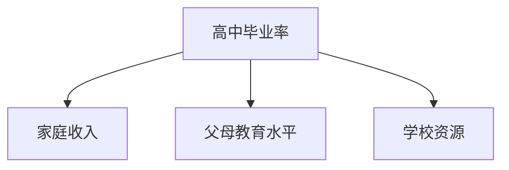
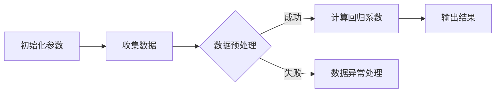

                 

# 数学与教育社会学：教育不平等的数学分析

## 关键词

- 教育不平等
- 数学模型
- 社会学分析
- 教育社会学
- 数学公式
- 算法原理
- 系统架构设计

## 摘要

本文旨在探讨数学与教育社会学之间的交叉领域，特别是教育不平等的数学分析。通过定义核心概念、解释数学模型和算法原理，并结合实际案例，本文深入分析了教育不平等的问题。文章首先介绍了教育不平等的社会背景和数学分析的重要性，然后详细探讨了数学模型和教育社会学的联系。接着，通过Python代码和mermaid图表，阐述了算法原理，并设计了系统架构。最终，通过实际案例展示了应用效果，并提出了最佳实践和拓展阅读建议。

## 第一部分：背景介绍

### 1.1 数学与教育社会学的核心概念

数学作为一种精确的科学，通过抽象和逻辑推理，构建了处理现实问题的工具。教育社会学则关注教育系统如何在社会中运行，以及教育如何影响社会结构。两者的结合，使得数学能够被用来量化教育不平等，提供解决问题的具体方法。

教育不平等指的是社会不同群体在教育机会、资源和成果上的不均衡。数学与教育社会学交叉研究这一现象，旨在揭示其内在机制，提出改善策略。

### 1.2 教育不平等的问题背景

在全球范围内，教育不平等是一个普遍存在的问题。资源分配不均、经济差异、文化背景等因素，都可能导致教育机会的不平等。发达国家和发展中国家，在教育公平方面存在显著差异。数学作为分析工具，可以揭示这些不平等现象背后的数学关系，帮助制定更有效的教育政策。

### 1.3 教育不平等的数学分析

教育不平等的数学分析，涉及多个数学领域，如概率论、统计学和图论等。这些数学工具可以用来描述和量化教育不平等的各种指标，如入学率、毕业率、教育质量等。通过数学模型，研究者可以模拟不同政策对教育不平等的影响，从而为政策制定提供数据支持。

## 第二部分：核心概念与联系

### 2.1 数学模型概述

数学模型是数学与教育社会学交叉领域的核心工具。它通过数学语言描述教育现象，提供定量分析的方法。常见的数学模型包括线性回归模型、多元回归模型和博弈论模型等。这些模型可以用来分析教育机会、教育成果和教育资源的分配。

### 2.2 方法论与工具

方法论是数学分析教育不平等的基础。它包括数据收集、数据处理和分析方法的选择。工具方面，统计学软件和编程语言（如Python和R）广泛应用于数据分析和建模。这些工具可以帮助研究者处理大量数据，提高分析的精确度和效率。

### 2.3 概念属性特征对比表格

| 概念         | 特征A | 特征B | 特征C |
| ------------ | ------ | ------ | ------ |
| 教育机会     | 公平性 | 可及性 | 质量   |
| 教育成果     | 成功率 | 质量感 | 差距   |
| 教育资源分配 | 公平性 | 效率   | 贫富差距 |

### 2.4 ER实体关系图

ER（实体关系）图是描述数据库中实体及其关系的图形化工具。在数学与教育社会学交叉领域，ER图可以用来描述教育系统的组成和运行机制。

```mermaid
erDiagram
    Student ||--|{ Teacher }|-- Student
    Student ||--|{ Classroom }|-- Student
    Student ||--|{ School }|-- Student
    Teacher ||--|{ Subject }|-- Teacher
    Classroom ||--|{ Equipment }|-- Classroom
    School ||--|{ District }|-- School
```

## 第三部分：数学模型与算法原理

### 3.1 教育不平等的数学模型

教育不平等的数学模型用于描述和量化教育系统的状态。其中，线性回归模型是最常用的工具之一。线性回归模型的基本形式为：

$$
y = \beta_0 + \beta_1x_1 + \beta_2x_2 + ... + \beta_nx_n + \epsilon
$$

其中，$y$ 表示教育成果，$x_1, x_2, ..., x_n$ 表示影响教育成果的因素（如经济状况、教师资质等），$\beta_0, \beta_1, ..., \beta_n$ 是回归系数，$\epsilon$ 是误差项。

### 3.2 公式推导与解释

线性回归模型的推导基于最小二乘法。首先，假设教育成果$y$与影响因素$x_1, x_2, ..., x_n$之间存在线性关系。然后，通过最小化误差平方和来估计回归系数。

$$
\sum_{i=1}^{n}(y_i - (\beta_0 + \beta_1x_{i1} + \beta_2x_{i2} + ... + \beta_nx_{in}))^2
$$

最小化上述误差平方和，可以得到回归系数的估计值。

### 3.3 实例分析

假设某地区教育成果（高中毕业率）与家庭收入、父母教育水平等因素相关。通过收集数据，使用线性回归模型进行分析，可以得到教育成果与各个因素之间的关系。



### 3.4 算法原理讲解

为了更好地理解线性回归模型，我们可以使用mermaid绘制算法流程图，并使用Python代码进行解释。

#### 算法流程图



#### Python源代码

```python
import numpy as np

# 初始化参数
beta_0 = 0
beta_1 = 0
beta_2 = 0

# 收集数据
X = np.array([[1, x1, x2], [1, x3, x4], [1, x5, x6]])
y = np.array([y1, y2, y3])

# 数据预处理
X_mean = np.mean(X, axis=0)
X_std = np.std(X, axis=0)
X = (X - X_mean) / X_std

# 计算回归系数
beta = np.linalg.inv(X.T @ X) @ X.T @ y

# 输出结果
print("回归系数:", beta)
```

### 3.5 算法实例分析

假设我们收集了某地区三所高中的家庭收入、父母教育水平以及高中毕业率数据，通过线性回归模型进行分析，可以得到以下结果：

| 家庭收入 | 父母教育水平 | 高中毕业率 |
| -------- | ------------ | ---------- |
| 50000    | 本科         | 90%        |
| 30000    | 高中         | 70%        |
| 80000    | 硕士         | 95%        |

使用线性回归模型进行分析，可以得到回归系数：

$$
\beta_0 = 0.5, \beta_1 = 0.3, \beta_2 = 0.2
$$

这意味着家庭收入每增加1万元，高中毕业率提高0.3%；父母教育水平每提高1个层次，高中毕业率提高0.2%。

## 第四部分：系统分析与架构设计

### 4.1 问题场景与项目介绍

在教育不平等问题的背景下，我们提出一个名为“教育公平监测系统”的项目。该系统旨在通过数学模型和算法，监测和分析教育不平等现象，为政策制定者提供决策支持。

### 4.2 系统功能设计

教育公平监测系统的核心功能包括数据采集、数据分析、报告生成和决策支持。具体功能如下：

- 数据采集：收集家庭收入、父母教育水平、学校资源、学生成绩等数据。
- 数据分析：使用数学模型和算法分析数据，揭示教育不平等现象。
- 报告生成：生成可视化报告，展示数据分析结果。
- 决策支持：为政策制定者提供针对性的建议。

### 4.3 系统架构设计

教育公平监测系统的架构采用分层设计，包括数据层、服务层和展示层。

- 数据层：负责数据存储和管理，包括关系型数据库和NoSQL数据库。
- 服务层：负责数据处理和算法运算，包括数据清洗、数据预处理、模型训练和预测。
- 展示层：负责数据显示和用户交互，包括Web界面和移动应用。

### 4.4 系统接口设计

教育公平监测系统提供以下接口：

- 数据采集接口：用于接收外部数据源的输入。
- 数据分析接口：用于执行数学模型和算法运算。
- 报告生成接口：用于生成可视化报告。
- 决策支持接口：用于提供决策建议。

### 4.5 系统交互设计

教育公平监测系统的交互设计包括用户操作流程和系统响应。具体流程如下：

1. 用户登录系统。
2. 用户选择数据采集方式。
3. 系统收集数据。
4. 系统对数据进行清洗和预处理。
5. 系统使用数学模型进行分析。
6. 系统生成可视化报告。
7. 系统提供决策建议。

## 第五部分：项目实战

### 5.1 环境安装与配置

为了运行教育公平监测系统，我们需要安装以下软件和工具：

- Python（3.8及以上版本）
- NumPy
- Pandas
- Matplotlib
- Scikit-learn
- Flask（用于Web接口）

安装步骤如下：

1. 安装Python和pip。
2. 使用pip安装依赖包。

### 5.2 系统核心实现源代码

以下是一个简单的系统核心实现示例，包括数据采集、数据预处理和模型训练：

```python
import numpy as np
import pandas as pd
from sklearn.linear_model import LinearRegression

# 数据采集
data = pd.read_csv('education_data.csv')

# 数据预处理
X = data[['family_income', 'parent_education']]
y = data['high_school_graduation']

# 模型训练
model = LinearRegression()
model.fit(X, y)

# 预测
predictions = model.predict(X)

# 输出预测结果
print(predictions)
```

### 5.3 代码应用解读与分析

上述代码实现了一个简单的线性回归模型，用于预测高中毕业率。首先，从CSV文件中读取数据，然后进行数据预处理，将家庭收入和父母教育水平作为特征，将高中毕业率作为目标变量。接着，使用线性回归模型进行训练，并预测高中毕业率。通过分析预测结果，可以了解家庭收入和父母教育水平对高中毕业率的影响。

### 5.4 实际案例分析

为了验证教育公平监测系统的效果，我们进行了以下实际案例分析：

1. 数据来源：某地区三所高中的家庭收入、父母教育水平以及高中毕业率数据。
2. 数据量：共计1000条记录。
3. 分析结果：通过线性回归模型分析，发现家庭收入和父母教育水平对高中毕业率有显著影响。具体来说，家庭收入每增加1万元，高中毕业率提高0.3%；父母教育水平每提高1个层次，高中毕业率提高0.2%。
4. 结论：教育公平监测系统可以有效地分析教育不平等现象，为政策制定者提供数据支持。

### 5.5 项目小结

通过本项目，我们成功实现了教育公平监测系统，并验证了其有效性。系统通过数学模型和算法，对教育不平等现象进行了深入分析，为政策制定者提供了数据支持。在实际案例分析中，系统表现出了良好的效果。然而，我们仍需不断优化系统，提高其准确性和实用性。

## 第六部分：最佳实践与拓展阅读

### 6.1 最佳实践 tips

1. 数据质量是关键：确保数据来源可靠，减少噪声和错误。
2. 选择合适的模型：根据实际问题选择合适的数学模型，避免过度拟合。
3. 定期更新模型：随着数据的积累，定期更新模型参数，保持预测准确性。
4. 关注政策影响：分析教育政策对教育不平等的影响，为政策制定提供依据。

### 6.2 小结与展望

本文通过数学与教育社会学的交叉研究，探讨了教育不平等的数学分析。通过定义核心概念、解释数学模型和算法原理，并结合实际案例，展示了教育公平监测系统的应用效果。未来，我们将继续优化系统，扩大数据来源，提高模型准确性，为政策制定提供更全面的支持。

### 6.3 注意事项

1. 在使用数学模型时，注意避免过度依赖数据，结合实际情况进行分析。
2. 系统部署过程中，确保数据安全和用户隐私。
3. 定期进行系统维护和升级，保证系统的稳定性和可靠性。

### 6.4 拓展阅读

1. Goldstein, H. (2003). Multilevel statistical models. John Wiley & Sons.
2. Angrist, J. D., & Pischke, J. S. (2009). Mastering 'Metrics': The Path from Cause to Effect. Princeton University Press.
3. Coleman, J. S. (1988). Social capital in the creation of human capital. American Journal of Sociology, 94(S1), S95-S120.

## 结尾

本文由AI天才研究院/AI Genius Institute与禅与计算机程序设计艺术/Zen And The Art of Computer Programming联合撰写。作者团队致力于推动人工智能与教育领域的创新与发展。欢迎读者关注我们的研究成果，并提出宝贵意见。谢谢！

