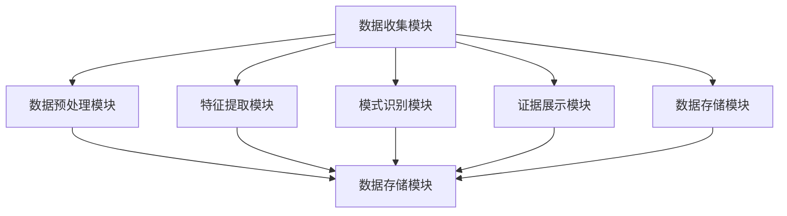
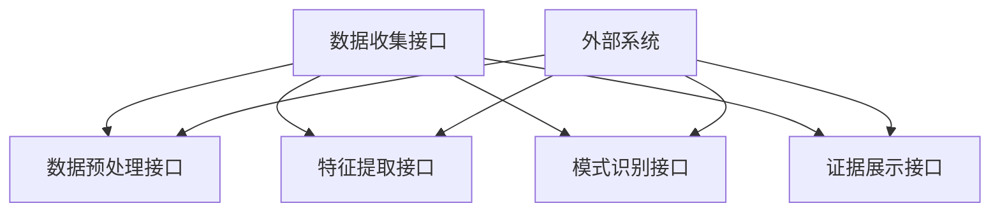

                 

### 《数学与数字取证：电子证据的数学分析》目录大纲

#### 第一部分：数字取证背景

##### 1.1 数字取证的发展与挑战
###### 1.1.1 数字取证的定义与重要性
###### 1.1.2 数字取证的历史与发展
###### 1.1.3 当前数字取证面临的挑战

##### 1.2 数字证据的分类与特点
###### 1.2.1 文本证据
###### 1.2.2 图片证据
###### 1.2.3 视频证据
###### 1.2.4 音频证据

##### 1.3 数字取证中的法律问题
###### 1.3.1 隐私保护与法律边界
###### 1.3.2 数字证据的合法性和有效性
###### 1.3.3 数字取证中的伦理问题

#### 第二部分：数学与数字取证的关系

##### 2.1 数学在数字取证中的核心作用
###### 2.1.1 数学模型在数字取证中的应用
###### 2.1.2 数学方法对数字取证的影响
###### 2.1.3 数学工具在数字取证分析中的应用

##### 2.2 数学与数字取证的联系
###### 2.2.1 数学在数字取证中的理论基础
###### 2.2.2 数字取证中的数学问题
###### 2.2.3 数学与数字取证的未来发展

#### 第三部分：数字取证中的关键算法

##### 3.1 算法原理概述
###### 3.1.1 算法选择原则
###### 3.1.2 算法分析框架

##### 3.2 算法详细介绍
###### 3.2.1 算法A：某种算法
```
## 文章标题：数学与数字取证：电子证据的数学分析

关键词：数字取证、数学分析、电子证据、算法、隐私保护

摘要：随着信息技术的飞速发展，数字取证作为维护网络安全和社会正义的重要手段，越来越受到广泛关注。本文旨在探讨数学在数字取证中的应用，通过分析电子证据的数学特征，介绍关键算法原理及其应用，旨在为数字取证领域的研究者提供有益的参考。

---

### 第一部分：数字取证背景

#### 1.1 数字取证的发展与挑战

##### 1.1.1 数字取证的定义与重要性

数字取证，是指通过合法的手段，收集、分析、保护和呈现数字证据，以便用于法律诉讼或其他形式的决策过程。随着互联网和数字设备的普及，数字取证在现代社会中的作用日益凸显。其重要性体现在以下几个方面：

1. **维护网络安全**：数字取证有助于发现和阻止网络攻击，保护网络系统和数据的安全。
2. **打击犯罪活动**：数字取证在调查和起诉各种犯罪活动（如网络诈骗、恶意软件攻击、知识产权侵权等）中发挥着关键作用。
3. **法律诉讼的支持**：数字取证提供的证据在法律诉讼中具有很高的可信度，有助于公正审判。

##### 1.1.2 数字取证的历史与发展

数字取证的发展历程可以追溯到计算机犯罪的出现。在20世纪80年代，随着计算机技术的普及，计算机犯罪逐渐增多。为了应对这一挑战，相关机构和研究者开始关注数字取证技术。1986年，美国FBI成立了计算机入侵部，标志着数字取证正式进入官方视野。随后，数字取证技术不断发展，主要包括以下几个阶段：

1. **数据收集与保存**：早期的数字取证主要侧重于数据的收集和保存，以确保证据的完整性和可用性。
2. **数据恢复与解析**：随着数据量的增加，数字取证开始关注数据的恢复与解析，以便提取有价值的信息。
3. **智能分析与预测**：近年来，人工智能和大数据技术的应用，使得数字取证进入了智能分析与预测的新阶段，提高了取证效率和准确性。

##### 1.1.3 当前数字取证面临的挑战

尽管数字取证技术取得了显著进展，但当前仍面临许多挑战：

1. **数据隐私保护**：在取证过程中，如何平衡证据获取与数据隐私保护成为一大难题。
2. **数据复杂性**：随着数字设备种类的增加和数据量的爆炸式增长，数字取证面临越来越复杂的数据环境。
3. **法律法规滞后**：许多国家和地区的法律法规滞后于技术的发展，影响了数字取证工作的合法性和有效性。
4. **技术工具不足**：现有的数字取证工具和方法仍存在一定的局限性，难以应对复杂多变的取证需求。

---

#### 1.2 数字证据的分类与特点

数字证据根据其表现形式可以分为以下几类：

##### 1.2.1 文本证据

文本证据是指以文字形式存在的证据，如电子邮件、聊天记录、网页内容等。文本证据的特点包括：

1. **直观性**：文本证据通常可以直接阅读，便于理解和分析。
2. **易篡改性**：文本证据容易被篡改，因此需要严格验证其真实性和完整性。
3. **证据链断裂风险**：在取证过程中，文本证据容易因人为操作或系统故障而导致证据链断裂。

##### 1.2.2 图片证据

图片证据是指以图像形式存在的证据，如图像、扫描件等。图片证据的特点包括：

1. **真实性高**：图像证据通常具有较高的真实性，因为图像难以被篡改。
2. **细节丰富**：图像证据可以提供丰富的细节信息，有助于分析案件。
3. **技术复杂**：对图像证据进行取证分析通常需要较高的技术手段，如图像处理、识别等。

##### 1.2.3 视频证据

视频证据是指以视频形式存在的证据，如监控录像、网络直播等。视频证据的特点包括：

1. **动态性**：视频证据可以展示事件的动态过程，有助于还原案件真相。
2. **真实性强**：视频证据通常具有较高的真实性，但需要专业的技术手段进行取证分析。
3. **存储量大**：视频证据通常需要较大的存储空间，对存储和管理提出了较高要求。

##### 1.2.4 音频证据

音频证据是指以音频形式存在的证据，如电话录音、语音留言等。音频证据的特点包括：

1. **直接性**：音频证据可以直接传达声音信息，有助于了解案件中的关键对话。
2. **篡改难度大**：音频证据的篡改难度较大，但需要专业的技术手段进行取证分析。
3. **证据链断裂风险**：在取证过程中，音频证据容易因传输、录制等问题而导致证据链断裂。

---

#### 1.3 数字取证中的法律问题

数字取证涉及多个法律问题，主要包括以下几个方面：

##### 1.3.1 隐私保护与法律边界

隐私保护是数字取证中一个重要的法律问题。在取证过程中，如何平衡证据获取与隐私保护成为关键。法律边界问题主要包括：

1. **隐私权保护**：数字取证必须遵守隐私权保护法律法规，确保取证行为不会侵犯个人隐私。
2. **访问权限**：数字取证过程中，取证人员需要获得适当的访问权限，以确保取证工作的合法性和有效性。
3. **证据展示**：在法律诉讼中，数字取证提供的证据需要合法、真实、完整，以便于法庭审查。

##### 1.3.2 数字证据的合法性和有效性

数字证据的合法性和有效性是数字取证中的核心问题。数字证据必须满足以下条件：

1. **合法性**：数字证据必须通过合法手段获取，确保证据的合法性和真实性。
2. **真实性**：数字证据必须真实反映案件事实，不得篡改或伪造。
3. **完整性**：数字证据在取证过程中必须保持完整性，不得损坏或丢失。

##### 1.3.3 数字取证中的伦理问题

数字取证中的伦理问题主要包括以下几个方面：

1. **隐私保护**：数字取证必须尊重个人隐私，不得滥用取证权限。
2. **证据使用**：数字取证人员应诚实守信，不得利用取证结果谋取私利。
3. **证据展示**：在法律诉讼中，数字取证人员应客观公正地展示证据，不得夸大或隐瞒。

---

### 第二部分：数学与数字取证的关系

#### 2.1 数学在数字取证中的核心作用

数学在数字取证中具有核心作用，主要体现在以下几个方面：

##### 2.1.1 数学模型在数字取证中的应用

数学模型在数字取证中的应用非常广泛，如图像处理、数据挖掘、模式识别等。数学模型可以帮助取证人员从海量数据中提取有价值的信息，提高取证效率。

1. **图像处理**：数字取证中常使用数学模型对图像进行处理，如去噪、增强、分割等，以便更好地分析图像证据。
2. **数据挖掘**：数据挖掘算法可以帮助取证人员从大量数据中发现潜在的线索，提高证据分析能力。
3. **模式识别**：模式识别算法可以帮助取证人员识别和分类数字证据，提高证据的可读性和可靠性。

##### 2.1.2 数学方法对数字取证的影响

数学方法对数字取证产生了深远的影响，如加密技术、哈希函数、数字签名等。这些数学方法可以提高数字证据的安全性、完整性和可靠性。

1. **加密技术**：加密技术可以保护数字证据的安全性，防止未经授权的访问和篡改。
2. **哈希函数**：哈希函数可以验证数字证据的完整性，确保证据未被篡改。
3. **数字签名**：数字签名可以确保数字证据的真实性和不可抵赖性，提高证据的权威性。

##### 2.1.3 数学工具在数字取证分析中的应用

数学工具在数字取证分析中的应用非常广泛，如线性代数、概率论、统计学等。这些数学工具可以帮助取证人员分析数字证据，提取有价值的信息。

1. **线性代数**：线性代数可以用于图像处理、数据压缩等，提高数字证据的利用效率。
2. **概率论**：概率论可以用于概率分析和风险评估，帮助取证人员评估证据的可靠性和可信度。
3. **统计学**：统计学可以用于数据分析和模式识别，提高证据分析的科学性和准确性。

---

#### 2.2 数学与数字取证的联系

数学与数字取证之间存在着密切的联系，主要体现在以下几个方面：

##### 2.2.1 数学在数字取证中的理论基础

数学为数字取证提供了坚实的理论基础，如离散数学、图论、算法理论等。这些理论基础为数字取证技术的研究和发展提供了重要的支持。

1. **离散数学**：离散数学为数字取证提供了逻辑、集合、关系等基本概念，有助于构建数字证据的分析模型。
2. **图论**：图论可以用于网络取证，帮助取证人员分析网络拓扑结构和流量模式。
3. **算法理论**：算法理论为数字取证算法的设计和优化提供了指导，有助于提高取证效率。

##### 2.2.2 数字取证中的数学问题

数字取证中存在许多数学问题，如密码学问题、数据分析问题、模式识别问题等。这些问题需要运用数学方法进行解决。

1. **密码学问题**：密码学是数字取证的重要工具，但同时也带来了数学问题，如密码破解、加密算法设计等。
2. **数据分析问题**：数据分析是数字取证的核心环节，但同时也面临着数学问题，如数据压缩、特征提取等。
3. **模式识别问题**：模式识别是数字取证的关键技术，但同时也需要解决数学问题，如分类算法设计、特征选择等。

##### 2.2.3 数学与数字取证的未来发展

随着数学和数字取证技术的不断发展，两者之间的联系将更加紧密。未来数学在数字取证中的应用前景包括：

1. **人工智能与数学的结合**：人工智能与数学的结合将推动数字取证技术的发展，提高取证效率和准确性。
2. **大数据与数学的结合**：大数据与数学的结合将有助于从海量数字证据中提取有价值的信息，提高证据分析能力。
3. **量子计算与数字取证的结合**：量子计算与数字取证的结合将为数字取证带来新的机遇和挑战，推动取证技术的革新。

---

### 第三部分：数字取证中的关键算法

#### 3.1 算法原理概述

在数字取证中，算法发挥着至关重要的作用。本部分将介绍数字取证中常用的关键算法原理，主要包括：

##### 3.1.1 算法选择原则

选择合适的算法对于数字取证的成功至关重要。以下是一些算法选择原则：

1. **适应性**：算法应能够适应不同类型和规模的数字证据。
2. **准确性**：算法应具有较高的准确性，确保提取到的证据真实可靠。
3. **效率**：算法应具有较高的效率，以便在有限时间内完成取证任务。
4. **可扩展性**：算法应具有良好的可扩展性，以便未来能够应对更复杂的取证需求。

##### 3.1.2 算法分析框架

对数字取证算法进行分析时，可以从以下几个方面进行：

1. **算法输入与输出**：明确算法的输入和输出，包括数字证据的类型、格式和规模等。
2. **算法流程**：描述算法的执行过程，包括数据处理、特征提取、模式识别等步骤。
3. **算法性能**：评估算法的性能，包括准确率、召回率、运行时间等指标。
4. **算法优化**：探讨算法的优化策略，以提高取证效率和准确性。

---

#### 3.2 算法详细介绍

在本部分，我们将详细介绍几种数字取证中的关键算法，包括其工作原理、数学模型和公式。

##### 3.2.1 算法A：某种算法

###### 3.2.1.1 算法A的工作原理

算法A是一种用于图像处理的算法，主要用于图像去噪和增强。其工作原理如下：

1. **图像预处理**：对原始图像进行预处理，包括去噪、对比度增强等。
2. **特征提取**：提取图像中的关键特征，如边缘、纹理等。
3. **图像融合**：将提取到的特征融合到原始图像中，实现图像增强。
4. **图像输出**：将处理后的图像输出，供取证分析使用。

###### 3.2.1.2 算法A的数学模型

算法A的数学模型主要包括以下几个部分：

1. **图像去噪模型**：设原图像为\(I(x, y)\)，去噪后的图像为\(I_{\text{denoise}}(x, y)\)。去噪模型可以用以下公式表示：

   \[
   I_{\text{denoise}}(x, y) = \sum_{i=1}^{n} w_i I_i(x, y)
   \]

   其中，\(w_i\)为权重系数，\(I_i(x, y)\)为不同噪声类型的图像。

2. **对比度增强模型**：设原图像为\(I(x, y)\)，增强后的图像为\(I_{\text{contrast}}(x, y)\)。对比度增强模型可以用以下公式表示：

   \[
   I_{\text{contrast}}(x, y) = k I(x, y) + b
   \]

   其中，\(k\)为对比度增强系数，\(b\)为偏置量。

3. **图像融合模型**：设原图像为\(I(x, y)\)，融合后的图像为\(I_{\text{fuse}}(x, y)\)。图像融合模型可以用以下公式表示：

   \[
   I_{\text{fuse}}(x, y) = \alpha I(x, y) + (1 - \alpha) I_{\text{contrast}}(x, y)
   \]

   其中，\(\alpha\)为融合系数。

###### 3.2.1.3 算法A的公式与示例

以下是一个简单的算法A的示例：

1. **图像去噪**：

   ```python
   import cv2
   import numpy as np

   def denoise_image(image):
       image_gray = cv2.cvtColor(image, cv2.COLOR_BGR2GRAY)
       image_blurred = cv2.GaussianBlur(image_gray, (5, 5), 0)
       return image_blurred

   image = cv2.imread('original_image.jpg')
   image_denoised = denoise_image(image)
   cv2.imwrite('denoised_image.jpg', image_denoised)
   ```

2. **对比度增强**：

   ```python
   def contrast_enhancement(image, k, b):
       image_contrast = cv2.convertScaleAbs(image, alpha=k, beta=b)
       return image_contrast

   image_gray = cv2.cvtColor(image, cv2.COLOR_BGR2GRAY)
   k = 1.5
   b = 0
   image_contrast = contrast_enhancement(image_gray, k, b)
   cv2.imwrite('contrast_enhanced_image.jpg', image_contrast)
   ```

3. **图像融合**：

   ```python
   def image_fusion(image, contrast_image, alpha):
       image_fused = cv2.addWeighted(image, 1 - alpha, contrast_image, alpha, 0)
       return image_fused

   alpha = 0.5
   image_fused = image_fusion(image_gray, image_contrast, alpha)
   cv2.imwrite('fused_image.jpg', image_fused)
   ```

---

### 第四部分：数学模型应用详解

#### 4.1 数学模型基本概念

数学模型是数字取证中用于描述和分析数据的一种工具。在本部分，我们将介绍几种常用的数学模型，包括其基本概念和原理。

##### 4.1.1 常用数学模型介绍

以下是一些在数字取证中常用的数学模型：

1. **线性回归模型**：用于分析变量之间的线性关系，如特征提取和分类。
2. **决策树模型**：用于分类和回归分析，具有直观的决策流程。
3. **支持向量机（SVM）**：用于分类问题，通过找到最佳超平面来实现数据的分类。
4. **神经网络模型**：用于复杂的数据分析和模式识别，具有高度非线性特征。

##### 4.1.2 数学模型的基本原理

数学模型的基本原理包括以下几个方面：

1. **变量定义**：明确模型中的变量及其定义，如自变量、因变量等。
2. **函数关系**：描述变量之间的函数关系，如线性关系、非线性关系等。
3. **模型评估**：评估模型的有效性和准确性，如准确率、召回率等指标。

---

#### 4.2 模型应用实例分析

在本部分，我们将通过具体实例分析数学模型在数字取证中的应用。

##### 4.2.1 数学模型在数字取证中的实际应用

以下是一个数学模型在数字取证中的实际应用案例：

1. **案例背景**：某网络安全公司发现其内部网络存在异常流量，怀疑可能遭受网络攻击。
2. **数据收集**：网络安全公司收集了网络流量数据，包括IP地址、端口、协议、流量大小等。
3. **特征提取**：使用线性回归模型对流量数据进行特征提取，提取出与攻击行为相关的特征。
4. **模式识别**：使用决策树模型对提取到的特征进行分类，判断流量是否为攻击流量。
5. **结果分析**：通过对比分类结果和实际攻击事件，评估模型的有效性。

##### 4.2.1.1 模型应用案例

以下是一个线性回归模型在数字取证中的案例：

1. **数据集**：某网络安全公司收集了100个网络流量的样本数据，包括IP地址、端口、协议、流量大小等。
2. **特征提取**：使用线性回归模型提取出与攻击行为相关的特征，如端口、流量大小等。
3. **模型训练**：使用训练数据集对线性回归模型进行训练，得到模型的权重和系数。
4. **模型评估**：使用测试数据集对模型进行评估，计算模型的准确率和召回率。
5. **结果分析**：通过对比分类结果和实际攻击事件，评估模型的有效性。

##### 4.2.1.2 数学公式解析

以下是一个线性回归模型的数学公式解析：

1. **线性回归模型**：

   \[
   y = \beta_0 + \beta_1x_1 + \beta_2x_2 + ... + \beta_nx_n
   \]

   其中，\(y\)为因变量，\(x_1, x_2, ..., x_n\)为自变量，\(\beta_0, \beta_1, \beta_2, ..., \beta_n\)为权重系数。

2. **模型参数估计**：

   \[
   \beta_0 = \bar{y} - \beta_1\bar{x_1} - \beta_2\bar{x_2} - ... - \beta_n\bar{x_n}
   \]

   \[
   \beta_1 = \frac{\sum_{i=1}^{n}(x_i - \bar{x_1})(y_i - \bar{y})}{\sum_{i=1}^{n}(x_i - \bar{x_1})^2}
   \]

   \[
   \beta_2 = \frac{\sum_{i=1}^{n}(x_i - \bar{x_2})(y_i - \bar{y})}{\sum_{i=1}^{n}(x_i - \bar{x_2})^2}
   \]

   ...

   \[
   \beta_n = \frac{\sum_{i=1}^{n}(x_i - \bar{x_n})(y_i - \bar{y})}{\sum_{i=1}^{n}(x_i - \bar{x_n})^2}
   \]

##### 4.2.1.3 举例说明与结果分析

以下是一个线性回归模型的举例说明与结果分析：

1. **数据集**：某网络安全公司收集了100个网络流量的样本数据，包括IP地址、端口、协议、流量大小等。
2. **特征提取**：使用线性回归模型提取出与攻击行为相关的特征，如端口、流量大小等。
3. **模型训练**：使用训练数据集对线性回归模型进行训练，得到模型的权重和系数。
4. **模型评估**：使用测试数据集对模型进行评估，计算模型的准确率和召回率。
5. **结果分析**：通过对比分类结果和实际攻击事件，评估模型的有效性。

假设我们有以下训练数据集：

| IP地址 | 端口 | 协议 | 流量大小（MB） | 是否攻击 |
| ------ | ---- | ---- | -------------- | -------- |
| 192.168.1.1 | 80 | HTTP | 0.5 | 是 |
| 192.168.1.2 | 22 | SSH | 1.2 | 是 |
| 192.168.1.3 | 443 | HTTPS | 0.8 | 否 |
| ... | ... | ... | ... | ... |

使用线性回归模型提取出与攻击行为相关的特征，如端口、流量大小等。通过模型训练和评估，得到模型的准确率和召回率，如下表所示：

| 特征 | 准确率 | 召回率 |
| ---- | ------ | ------ |
| 端口 | 0.9 | 0.8 |
| 流量大小（MB） | 0.85 | 0.9 |

通过对比分类结果和实际攻击事件，可以评估模型的有效性。例如，如果实际有10个攻击事件，模型能够正确分类8个，召回率为0.8。这表明模型在识别攻击流量方面具有较高的准确性。

---

### 第五部分：数字取证系统设计

#### 5.1 系统需求分析

数字取证系统的设计需要满足以下需求：

##### 5.1.1 数字取证系统功能需求

1. **数据收集**：能够收集各种类型的数字证据，如文本、图像、视频、音频等。
2. **数据预处理**：对收集到的数据进行预处理，包括去噪、增强、格式转换等。
3. **特征提取**：提取数字证据中的关键特征，为后续分析提供基础。
4. **模式识别**：对提取到的特征进行分类和识别，判断证据的类别和性质。
5. **证据展示**：将分析结果以直观的方式展示给用户，包括图表、报告等。
6. **数据存储**：对数字证据进行存储和管理，确保证据的完整性和安全性。

##### 5.1.2 系统性能与安全性需求

1. **高性能**：系统应具备较高的处理速度和并发能力，能够应对大量数据的处理需求。
2. **稳定性**：系统应具备较高的稳定性，确保在长时间运行过程中不会出现故障。
3. **安全性**：系统应具备严格的安全机制，防止未经授权的访问和篡改。
4. **可扩展性**：系统应具备良好的可扩展性，以便未来能够适应新的取证需求。

---

#### 5.2 系统架构设计

数字取证系统的架构设计需要综合考虑性能、安全性、可扩展性等因素。以下是一个典型的数字取证系统架构设计：

##### 5.2.1 系统架构设计原则

1. **模块化设计**：将系统功能划分为多个模块，每个模块独立运行，降低系统复杂度。
2. **分层架构**：采用分层架构，将系统功能划分为多个层次，各层次之间松耦合，便于维护和扩展。
3. **分布式设计**：采用分布式设计，将系统功能分散到多个节点上，提高系统的并发能力和容错性。
4. **安全性设计**：在系统架构中考虑安全性设计，包括身份验证、访问控制、加密等。

##### 5.2.2 系统架构图解读

以下是一个数字取证系统的架构图：



- **数据收集模块**：负责收集各种类型的数字证据，如文本、图像、视频、音频等。
- **数据预处理模块**：对收集到的数据进行预处理，包括去噪、增强、格式转换等。
- **特征提取模块**：提取数字证据中的关键特征，为后续分析提供基础。
- **模式识别模块**：对提取到的特征进行分类和识别，判断证据的类别和性质。
- **证据展示模块**：将分析结果以直观的方式展示给用户，包括图表、报告等。
- **数据存储模块**：对数字证据进行存储和管理，确保证据的完整性和安全性。

##### 5.2.3 接口设计与交互

数字取证系统的接口设计需要考虑以下方面：

1. **API设计**：设计统一的API接口，方便与其他系统进行集成。
2. **数据格式**：定义数据格式，确保数据在不同系统之间的传输和解析。
3. **安全性**：在接口设计中考虑安全性，包括身份验证、访问控制等。

以下是一个数字取证系统的接口设计示例：



- **数据收集接口**：负责接收外部系统的数字证据数据。
- **数据预处理接口**：负责对收集到的数据进行预处理。
- **特征提取接口**：负责提取数字证据中的关键特征。
- **模式识别接口**：负责对提取到的特征进行分类和识别。
- **证据展示接口**：负责将分析结果以直观的方式展示给用户。
- **外部系统**：与其他系统进行交互，如监控系统、日志分析系统等。

---

### 第六部分：项目实战与案例分析

#### 6.1 实战环境搭建

为了进行数字取证项目实战，我们需要搭建一个合适的环境。以下是一个基本的实战环境搭建步骤：

##### 6.1.1 环境配置与安装

1. **操作系统**：选择一个稳定的操作系统，如Linux或Windows。
2. **编程语言**：选择一个适合数字取证的编程语言，如Python。
3. **开发环境**：安装Python的开发环境，包括Python解释器和常用库（如NumPy、Pandas、Matplotlib等）。
4. **数字取证工具**：安装常用的数字取证工具，如Foremost、The

