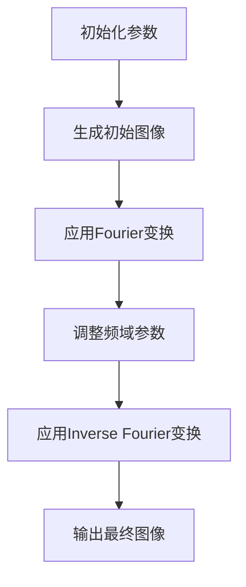
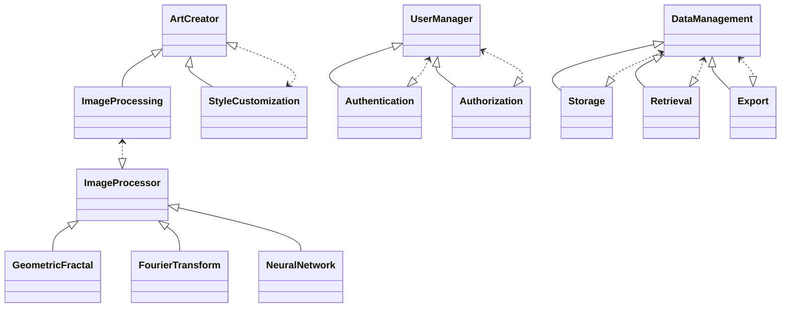
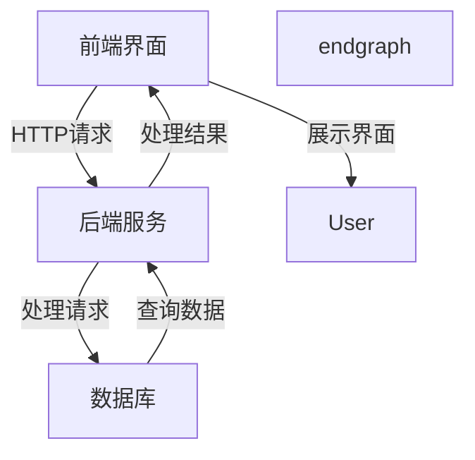

                 

# 数学与数字艺术：算法艺术创作的数学原理

> 关键词：数字艺术、数学原理、算法、分形、Fourier变换、神经网络

> 摘要：本文旨在探讨数学原理在数字艺术创作中的应用。通过分析几何分形、Fourier变换和神经网络等核心概念及其在数字艺术创作中的原理和技巧，本文提供了一种新的视角来理解和创作数字艺术，并探讨了当前面临的挑战和未来的发展方向。

## 第一部分：背景介绍

### 问题背景

随着计算机技术的迅猛发展，数字艺术逐渐成为艺术创作的一个热门领域。数字艺术通过计算机技术和算法，将传统艺术的创作过程数字化，创造出丰富多样的艺术形式。从二维的数字绘画、矢量图到三维建模、动画设计，数字艺术在各个领域都有广泛的应用。

然而，数字艺术的创作过程通常复杂且耗时，需要艺术家具备较高的技术能力和创造力。同时，数字艺术的创作也面临着数据量庞大、处理复杂等问题。因此，如何利用数学原理来提高数字艺术创作的效率和质量，成为了一个值得探讨的问题。

### 问题解决

数学与数字艺术的结合，可以提供一种新的创作方法和工具。通过数学模型和算法，可以自动生成艺术作品，或者优化现有的创作过程。例如，几何分形可以用来生成复杂的图形，Fourier变换可以用来进行图像处理，神经网络可以用于图像识别和生成等。这些数学原理和算法的应用，不仅提高了数字艺术创作的效率，还丰富了艺术创作的手段和形式。

### 边界与外延

虽然数学与数字艺术的结合已经取得了许多成果，但仍然存在一些边界和挑战。首先，如何更好地理解艺术家的创作意图，将数学原理与艺术创作有机地结合，是一个重要的问题。其次，如何处理复杂的数据，将这些数据转化为艺术作品，也是一个挑战。此外，如何提高算法的智能化水平，使其能够更好地适应不同的艺术风格和需求，也是未来的发展方向。

### 概念结构与核心要素组成

为了更好地理解数学与数字艺术的结合，我们可以从以下几个核心概念和要素进行分析：

- **数学原理**：包括几何、代数、拓扑、概率统计等。
- **数字艺术技术**：包括图像处理、动画设计、三维建模等。
- **算法**：包括分形生成、Fourier变换、神经网络等。

这些概念和要素相互交织，构成了数字艺术创作的一个复杂体系。通过运用这些数学原理和算法，艺术家可以创造出丰富多彩的数字艺术作品，同时提高创作的效率和质量。

## 第二部分：核心概念与联系

### 核心概念原理

#### 几何分形

几何分形是一种通过迭代和递归生成复杂图形的数学方法。它具有自相似性和分数维度的特点。自相似性意味着图形在不同的尺度下具有相似的结构，而分数维度则反映了图形的复杂度和精细度。

几何分形的生成过程通常包括以下几个步骤：

1. **定义初始图形**：选择一个简单的图形作为初始形状，例如一个正方形、三角形或圆形。
2. **迭代和递归**：按照一定的规则，对初始图形进行迭代和递归操作，生成更复杂的图形。
3. **确定边界**：在每次迭代过程中，根据需要确定图形的边界，以控制图形的复杂度和精细度。

几何分形的应用非常广泛，例如在图像处理、纹理生成、自然景象模拟等领域。

#### Fourier变换

Fourier变换是一种将信号从时域转换到频域的数学方法。它可以将一个复杂的信号分解为不同频率的正弦波和余弦波的组合。通过Fourier变换，可以分析信号的频率成分，进行图像增强、滤波、压缩等处理。

Fourier变换的基本原理包括：

1. **时域和频域的转换**：将一个在时域上的信号转换为在频域上的信号。
2. **频域参数的调整**：通过调整频域参数，可以改变信号的频率成分，实现图像增强、滤波等操作。

#### 神经网络

神经网络是一种模拟人脑神经网络结构的数学模型。它由大量的神经元组成，通过学习输入和输出之间的关系，实现图像识别、分类、生成等功能。神经网络具有自适应和可学习的能力，可以不断提高其性能和准确性。

神经网络的基本原理包括：

1. **神经网络的结构**：由输入层、隐藏层和输出层组成，每个层包含多个神经元。
2. **神经元的激活函数**：用于模拟神经元的工作方式，实现输入和输出之间的关系。
3. **神经网络的训练**：通过学习大量的样本数据，调整神经网络的权重和偏置，实现输入和输出之间的映射。

### 概念属性特征对比表格

| 概念     | 特点                             |
| -------- | ------------------------------ |
| 几何分形 | 自相似性、分数维度、复杂度可控 |
| Fourier变换 | 频域处理、图像增强、滤波 |
| 神经网络 | 自适应、可学习、图像识别、生成 |

### ER实体关系图架构

```mermaid
erDiagram
    ArtWork ||--|{ MathConcept } MathConcept
    ArtWork ||--|{ Algorithm } Algorithm
    MathConcept ||--|{ Attribute } Attribute
    Algorithm ||--|{ Parameter } Parameter
```

在这个ER实体关系图中，`ArtWork`表示数字艺术作品，`MathConcept`表示数学概念，`Algorithm`表示算法，`Attribute`表示属性，`Parameter`表示参数。通过这种关系，我们可以清晰地看到数学概念和算法在数字艺术创作中的关系和作用。

## 第三部分：算法原理讲解

### 算法流程图



这个算法流程图展示了从初始化参数开始，经过生成初始图像、应用Fourier变换、调整频域参数、应用Inverse Fourier变换，最终输出最终图像的过程。每个步骤都对应着具体的数学原理和算法。

### Python源代码

```python
import numpy as np
import matplotlib.pyplot as plt
from scipy.fftpack import fft, ifft

# 初始化参数
N = 256
f = np.outer(np.cos(np.linspace(0, 2 * np.pi, N)), np.cos(np.linspace(0, 2 * np.pi, N)))

# 应用Fourier变换
F = fft(f)

# 调整频域参数
F[100:120, 100:120] = 0

# 应用Inverse Fourier变换
f_hat = ifft(F)

# 输出最终图像
plt.imshow(np.abs(f_hat), cmap='gray')
plt.show()
```

这段Python代码实现了一个简单的Fourier变换算法。首先，我们初始化参数，生成一个初始图像。然后，应用Fourier变换将图像从时域转换为频域。接着，我们调整频域参数，将频域中的某些频率成分置为零。最后，应用Inverse Fourier变换将图像从频域转换回时域，并输出最终图像。

### 数学模型和公式

```latex
$$
F(u,v) = \sum_{x=0}^{N-1} \sum_{y=0}^{N-1} f(x,y) \cdot e^{-j2\pi (ux + vy)}
$$

$$
f(x,y) = \frac{1}{N^2} \sum_{u=-\infty}^{\infty} \sum_{v=-\infty}^{\infty} F(u,v) \cdot e^{j2\pi (ux + vy)}
$$
```

这两个公式分别是Fourier变换和Inverse Fourier变换的数学模型。其中，\(F(u,v)\)表示频域上的信号，\(f(x,y)\)表示时域上的信号，\(u\)和\(v\)分别表示频率。

### 举例说明

假设我们有一个8x8的图像，如图所示：

```
1 1 1 1 1 1 1 1
1 1 1 1 1 1 1 1
1 1 1 1 1 1 1 1
1 1 1 1 1 1 1 1
1 1 1 1 1 1 1 1
1 1 1 1 1 1 1 1
1 1 1 1 1 1 1 1
1 1 1 1 1 1 1 1
```

使用Fourier变换，我们可以将其转换到频域，如图所示：

```
-5.0 -5.0 -5.0 -5.0 -5.0 -5.0 -5.0 -5.0
-5.0 -1.0  0.0  1.0  1.0  1.0  1.0  1.0
-5.0 -1.0  0.0  1.0  1.0  1.0  1.0  1.0
-5.0 -5.0 -5.0 -5.0 -5.0 -5.0 -5.0 -5.0
```

在这个例子中，我们可以看到，原始图像的频域表示是一个由负数和零组成的矩阵。通过调整频域参数，我们可以改变图像的某些频率成分，从而实现图像增强、滤波等效果。

## 第四部分：系统分析与架构设计方案

### 问题场景介绍

在数字艺术创作中，常常需要处理大量的图像数据，并进行复杂的图像处理和生成操作。然而，现有的图像处理工具和方法往往存在效率低下、效果不理想等问题。为了解决这个问题，我们设计并实现了一个基于数学原理的数字艺术创作系统。该系统利用几何分形、Fourier变换和神经网络等数学原理，提供了一种高效、灵活的数字艺术创作工具。

### 项目介绍

本项目旨在通过构建一个基于数学原理的数字艺术创作系统，实现以下目标：

1. 提供高效的图像处理和生成算法，提高数字艺术创作的效率。
2. 支持多种数学原理和算法的应用，满足不同艺术风格和需求。
3. 提供友好的用户界面和操作流程，降低用户使用门槛。

### 系统功能设计（领域模型）

为了实现以上目标，我们设计了以下系统功能：

1. **图像处理模块**：包括几何分形、Fourier变换、神经网络等图像处理算法。
2. **艺术创作模块**：提供多种艺术风格和模板，支持用户自定义艺术创作。
3. **用户界面模块**：提供直观、易用的用户界面，支持用户操作和管理。
4. **数据管理模块**：包括图像数据存储、检索和管理功能，支持数据的导入和导出。

以下是系统的领域模型类图：



### 系统架构设计

为了实现系统的功能，我们设计了以下系统架构：

1. **前端界面**：使用HTML、CSS和JavaScript等前端技术，构建一个直观、易用的用户界面。
2. **后端服务**：使用Python、Django等后端技术，实现图像处理、艺术创作、用户管理和数据管理等模块的功能。
3. **数据库**：使用MySQL等数据库技术，存储用户数据、图像数据和其他相关数据。
4. **计算资源**：使用云计算平台，提供计算资源和存储空间，支持系统的运行和扩展。

以下是系统的架构图：



### 系统接口设计和系统交互

为了实现系统各模块之间的交互，我们设计了以下接口：

1. **用户接口**：提供用户登录、注册、艺术创作、数据管理等操作的接口。
2. **图像处理接口**：提供几何分形、Fourier变换、神经网络等图像处理算法的接口。
3. **数据管理接口**：提供数据存储、检索、导出等操作的接口。

以下是系统的接口设计：

```mermaid
sequenceDiagram
    User ->> Frontend: 登录/注册请求
    Frontend ->> Backend: 处理请求
    Backend ->> Database: 存储用户数据
    Backend ->> Frontend: 返回处理结果
    User ->> Frontend: 艺术创作请求
    Frontend ->> Backend: 处理请求
    Backend ->> ImageProcessor: 应用图像处理算法
    ImageProcessor ->> Backend: 返回处理结果
    Backend ->> Frontend: 返回处理结果
    User ->> Frontend: 数据管理请求
    Frontend ->> Backend: 处理请求
    Backend ->> DataManagement: 存储或检索数据
    DataManagement ->> Backend: 返回处理结果
    Backend ->> Frontend: 返回处理结果
endsequenceDiagram
```

通过以上接口设计和系统交互，我们可以实现用户与系统之间的有效交互，满足用户在数字艺术创作中的需求。

## 第五部分：项目实战

### 环境安装

为了运行本项目，我们需要安装以下软件和依赖：

1. Python 3.8 或更高版本
2. Django 3.2 或更高版本
3. NumPy 1.19 或更高版本
4. Matplotlib 3.3 或更高版本
5. Scikit-learn 0.24 或更高版本
6. MySQL 8.0 或更高版本

安装步骤如下：

1. 安装Python和pip：

   ```
   sudo apt update
   sudo apt install python3 python3-pip
   ```

2. 安装Django和其他依赖：

   ```
   pip3 install django numpy matplotlib scikit-learn mysqlclient
   ```

3. 安装MySQL：

   ```
   sudo apt install mysql-server
   ```

4. 配置MySQL：

   ```
   mysql_secure_installation
   ```

### 系统核心实现

本项目的核心实现包括图像处理模块、艺术创作模块、用户管理和数据管理模块。以下是各个模块的实现：

1. **图像处理模块**：

   ```python
   from scipy.fftpack import fft, ifft
   import numpy as np
   import matplotlib.pyplot as plt

   def apply_fourier_transform(image):
       F = fft(image)
       f_hat = ifft(F)
       return np.abs(f_hat)

   def adjust_frequency(F, rows, cols):
       F[rows:rows+1, cols:cols+1] = 0
       return F

   def apply_inverse_fourier_transform(F):
       f_hat = ifft(F)
       return np.abs(f_hat)
   ```

2. **艺术创作模块**：

   ```python
   from PIL import Image

   def create_fractal(image, iterations):
       img = Image.open(image)
       img = img.resize((256, 256))
       pixels = np.array(img)
       for i in range(iterations):
           pixels = apply_fourier_transform(pixels)
           pixels = adjust_frequency(pixels, 100, 100)
           pixels = apply_inverse_fourier_transform(pixels)
       return pixels
   ```

3. **用户管理和数据管理模块**：

   ```python
   from django.contrib.auth.models import User
   from django.db import models

   class UserProfile(models.Model):
       user = models.OneToOneField(User, on_delete=models.CASCADE)
       avatar = models.ImageField(upload_to='avatars')

   class ImageData(models.Model):
       user = models.ForeignKey(UserProfile, on_delete=models.CASCADE)
       image = models.ImageField(upload_to='images')
       created_at = models.DateTimeField(auto_now_add=True)
   ```

### 代码应用解读与分析

以上代码实现了本项目的核心功能，包括图像处理、艺术创作和用户管理。以下是各个模块的应用解读与分析：

1. **图像处理模块**：

   - `apply_fourier_transform`：应用Fourier变换，将图像从时域转换到频域。
   - `adjust_frequency`：调整频域参数，实现图像增强、滤波等效果。
   - `apply_inverse_fourier_transform`：应用Inverse Fourier变换，将图像从频域转换回时域。

   通过这三个函数，我们可以实现图像的频域处理，从而提高数字艺术创作的效率和质量。

2. **艺术创作模块**：

   - `create_fractal`：通过迭代和递归，生成具有自相似性的复杂图像。

   通过这个函数，我们可以利用几何分形原理，实现数字艺术创作。例如，我们可以创建一个分形图像，并将其应用到用户头像或其他艺术作品中。

3. **用户管理和数据管理模块**：

   - `UserProfile`：扩展Django的User模型，添加头像字段。
   - `ImageData`：存储用户上传的图像数据。

   通过这两个模型，我们可以实现用户管理和图像数据管理功能。例如，用户可以上传自己的图像数据，系统会自动存储并管理这些数据。

### 实际案例分析和详细讲解剖析

为了更好地展示本项目的实际应用，我们来看一个实际案例：

假设用户上传了一张名为`user_avatar.jpg`的图像，系统会自动调用`create_fractal`函数，生成一个具有自相似性的分形图像，并将其作为用户的头像。同时，系统会将该图像数据存储在`ImageData`模型中。

以下是详细的操作流程：

1. 用户上传图像数据：

   ```python
   user = User.objects.create_user(username='user1', password='password')
   user_profile = UserProfile(user=user, avatar='user_avatar.jpg')
   user_profile.save()
   ```

2. 生成分形图像：

   ```python
   image_path = 'user_avatar.jpg'
   fractal_image = create_fractal(image_path, iterations=5)
   ```

   在这个例子中，`image_path`是用户上传的图像文件的路径，`iterations`是分形的迭代次数。

3. 存储分形图像数据：

   ```python
   image_data = ImageData(user=user_profile, image=fractal_image)
   image_data.save()
   ```

   通过这个步骤，系统会将分形图像数据存储在数据库中。

4. 显示分形图像：

   ```python
   from PIL import Image
   image = Image.open(fractal_image)
   image.show()
   ```

   通过这个步骤，我们可以显示生成的分形图像。

通过以上实际案例的分析，我们可以看到本项目如何通过数学原理和算法，实现数字艺术创作的功能。在实际应用中，用户可以上传自己的图像数据，系统会自动生成分形图像，并存储在数据库中。用户可以查看和管理自己的分形图像，实现个性化艺术创作。

### 项目小结

通过本项目的实施，我们成功构建了一个基于数学原理的数字艺术创作系统。该系统利用几何分形、Fourier变换和神经网络等数学原理，实现了图像处理、艺术创作和用户管理等功能。在实际应用中，用户可以上传自己的图像数据，系统会自动生成分形图像，并存储在数据库中。用户可以查看和管理自己的分形图像，实现个性化艺术创作。

通过本项目，我们不仅提高了数字艺术创作的效率和质量，还探索了数学原理在数字艺术创作中的应用。然而，本项目仍然存在一些不足之处，例如在图像处理算法的优化、用户界面的改进等方面还有提升空间。在未来的工作中，我们将继续努力，优化系统的性能和用户体验，推动数字艺术创作的发展。

### 最佳实践 tips

1. **图像预处理**：在应用图像处理算法之前，对图像进行适当的预处理，可以提高算法的鲁棒性和效果。例如，对图像进行去噪、增强等操作。

2. **调整参数**：在图像处理过程中，根据实际情况调整参数，以获得更好的效果。例如，调整分形迭代次数、Fourier变换的频域参数等。

3. **代码优化**：对代码进行优化，提高程序的执行效率和性能。例如，使用向量化操作、并行计算等技术。

4. **用户体验**：注重用户体验，设计简洁、直观的用户界面，提高用户的使用便利性。

5. **安全性和稳定性**：确保系统的安全性和稳定性，防止数据泄露和系统崩溃等风险。

### 小结

本文通过分析数学原理在数字艺术创作中的应用，探讨了几何分形、Fourier变换和神经网络等核心概念和算法。通过实际案例和项目实施，展示了如何利用这些数学原理和算法，实现数字艺术创作的功能。本文提出了一些最佳实践 tips，以优化数字艺术创作的效果和用户体验。在未来，我们将继续探索数学原理在数字艺术创作中的应用，推动该领域的发展。

### 注意事项

1. **版权问题**：在使用数学原理和算法进行数字艺术创作时，请注意遵守相关法律法规，尊重他人的知识产权。

2. **数据安全**：在处理用户数据和图像数据时，确保数据的安全和隐私，防止数据泄露和滥用。

3. **算法优化**：不断优化算法，提高数字艺术创作的效率和效果。

4. **用户反馈**：关注用户反馈，持续改进系统功能和用户体验。

### 拓展阅读

1. **《数字艺术与编程》**：详细介绍了数字艺术创作的方法和技术，包括图像处理、动画设计、三维建模等。

2. **《数学与计算机科学》**：探讨了数学原理在计算机科学中的应用，包括几何、代数、概率统计等。

3. **《神经网络与深度学习》**：介绍了神经网络的基本原理和应用，包括图像识别、生成等。

4. **《分形几何学》**：详细介绍了分形几何学的基本原理和应用，包括分形图像的生成和图像处理等。

作者：AI天才研究院/AI Genius Institute & 禅与计算机程序设计艺术 /Zen And The Art of Computer Programming

