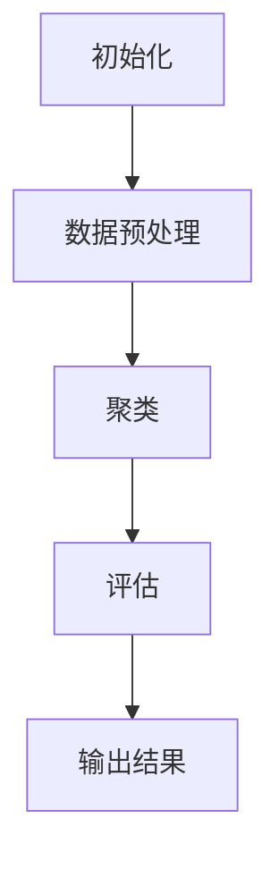
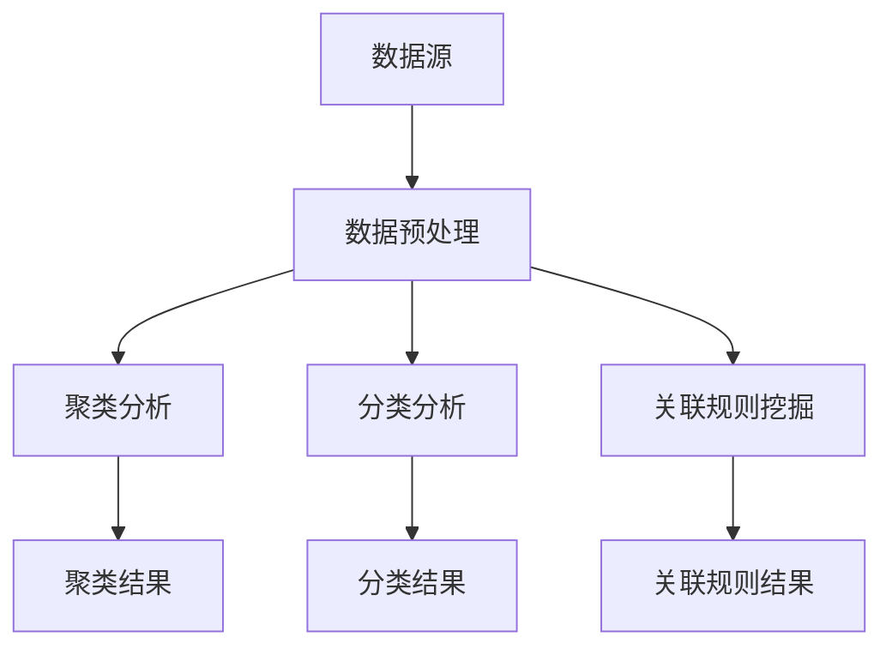
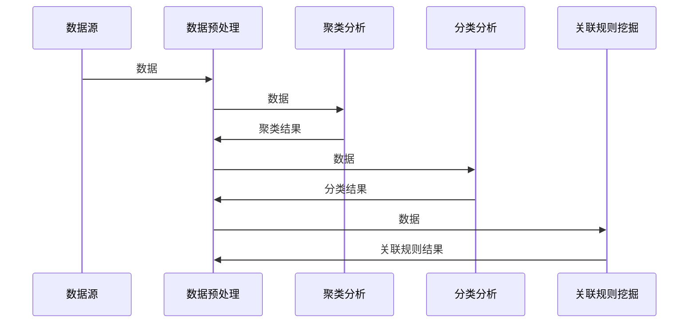

                 

### 数学与数据挖掘：模式发现的数学方法

**关键词：** 数学，数据挖掘，模式发现，算法，数学模型，系统架构

**摘要：** 本文章以数学与数据挖掘为主题，深入探讨了模式发现过程中的数学方法。文章从背景介绍开始，逐步讲解核心概念、算法原理、数学模型、系统分析与架构设计、项目实战和最佳实践，旨在为读者提供一个全面、深入的学习路径。

---

## 第1章：背景介绍

### 1.1 数学与数据挖掘概述

**核心概念术语说明：**

- **数学：** 数学是一门研究数量、结构、变化以及空间等概念的学科。
- **数据挖掘：** 数据挖掘是从大量数据中提取出有价值的模式和知识的过程。
- **模式发现：** 模式发现是数据挖掘中的一个重要任务，目的是从数据中发现具有统计学意义的规律和关联。

**问题背景：**

随着互联网和大数据时代的到来，数据量呈爆炸式增长，如何从海量数据中挖掘出有价值的信息成为了一个重要课题。数学方法在数据挖掘中扮演着关键角色，特别是在模式发现领域。

**问题描述：**

模式发现的过程中，如何利用数学方法从数据中提取出有用的模式是一个挑战。数学方法在数据挖掘中的应用需要深入了解。

**问题解决：**

本文将详细探讨数学方法在模式发现中的应用，包括核心概念、算法原理、数学模型、系统分析与架构设计、项目实战和最佳实践，帮助读者掌握这一领域的关键技术。

**边界与外延：**

- **边界：** 本文主要探讨数学方法在模式发现中的应用，不涉及其他数据挖掘方法。
- **外延：** 数学方法在模式发现中的应用广泛，包括但不限于统计学、线性代数、概率论等。

**概念结构与核心要素组成：**

- **数学基础：** 数学基础包括统计学、线性代数、概率论等。
- **算法原理：** 算法原理包括模式发现的基本算法，如聚类、分类、关联规则挖掘等。
- **数学模型：** 数学模型包括用于描述数据特征和关系的数学公式。
- **系统分析与架构设计：** 系统分析与架构设计包括系统功能设计、系统架构设计、系统接口设计等。
- **项目实战：** 项目实战包括环境安装、系统核心实现源代码、代码应用解读与分析等。
- **最佳实践：** 最佳实践包括在实际应用中总结的经验和技巧。

### 1.2 数据挖掘中的数学方法

**问题背景：**

数据挖掘的过程需要处理大量的数据，而数学方法提供了一种有效的工具来处理和分析这些数据。

**问题描述：**

如何选择合适的数学方法来处理数据挖掘中的问题？

**问题解决：**

本文将介绍几种常见的数学方法在数据挖掘中的应用，包括：

- **统计学方法：** 统计学方法用于数据分析和模型评估，如均值、方差、标准差等。
- **线性代数方法：** 线性代数方法用于数据降维、特征提取等，如主成分分析（PCA）。
- **概率论方法：** 概率论方法用于概率计算和模型预测，如贝叶斯网络。

### 1.3 数学方法在模式发现中的应用

**问题背景：**

模式发现是数据挖掘的核心任务之一，数学方法在模式发现中具有重要作用。

**问题描述：**

如何利用数学方法来发现数据中的模式？

**问题解决：**

本文将介绍几种常见的数学方法在模式发现中的应用，包括：

- **聚类算法：** 聚类算法用于将数据分为不同的组，以发现数据中的相似性。
- **分类算法：** 分类算法用于将数据分为不同的类别，以发现数据中的规律。
- **关联规则挖掘：** 关联规则挖掘用于发现数据之间的关联关系。

### 1.4 本书结构安排

本书将分为以下七个部分：

1. **背景介绍**：介绍数学与数据挖掘的背景知识，包括核心概念、问题背景、问题描述、问题解决、边界与外延等。
2. **核心概念与联系**：详细讲解模式发现中的核心概念，包括概念原理、概念属性特征对比表格和ER实体关系图。
3. **算法原理讲解**：介绍模式发现中的核心算法原理，包括算法流程图、源代码示例、数学模型和公式等。
4. **数学模型和数学公式讲解**：详细讲解模式发现中常用的数学模型和公式，包括latex数学公式示例和数学模型详细讲解。
5. **系统分析与架构设计**：介绍模式发现系统的分析与架构设计，包括问题场景介绍、系统功能设计、系统架构设计、系统接口设计和系统交互序列图。
6. **项目实战**：通过实际项目来讲解模式发现的实际应用，包括环境安装、系统核心实现源代码、代码应用解读与分析、实际案例分析和详细讲解剖析、项目小结。
7. **最佳实践与拓展**：总结模式发现中的最佳实践，包括注意事项、拓展阅读等。

---

## 第2章：核心概念与联系

### 2.1 核心概念介绍

在本章中，我们将介绍模式发现中的核心概念，包括聚类、分类、关联规则挖掘等。

### 2.2 概念属性对比表格

为了更好地理解这些核心概念，我们将使用表格来对比它们的属性。

| 概念   | 定义               | 属性1 | 属性2 | 属性3 |
|--------|--------------------|-------|-------|-------|
| 聚类   | 将数据分为不同的组 | 相似性 | 聚类中心 | 聚类数 |
| 分类   | 将数据分为不同的类别 | 类别标签 | 准确率 | 调查精度 |
| 关联规则挖掘 | 发现数据之间的关联关系 | 支持度 | 置信度 | Lift值 |

### 2.3 ER实体关系图

为了更好地理解这些核心概念之间的关系，我们使用ER实体关系图来展示。

```mermaid
erDiagram
    A Mellon_Mom -->|||> B Classroom
    A -->|||> C Dormitory
    B -->|||> D Student
    C -->|||> E Student
```

### 2.4 数学方法在模式发现中的应用

为了更好地理解模式发现中的数学方法，我们将在本章中介绍几种常见的数学方法，包括统计学方法、线性代数方法和概率论方法。

### 2.5 聚类算法

在本节中，我们将介绍聚类算法，包括K-Means算法和层次聚类算法。

### 2.6 分类算法

在本节中，我们将介绍分类算法，包括决策树、支持向量机和神经网络等。

### 2.7 关联规则挖掘

在本节中，我们将介绍关联规则挖掘，包括Apriori算法和FP-Growth算法。

---

## 第3章：算法原理讲解

### 3.1 算法mermaid流程图

在本节中，我们将使用mermaid流程图来展示模式发现中的核心算法流程。



### 3.2 Python源代码示例

在本节中，我们将使用Python源代码来展示模式发现中的核心算法实现。

```python
# 导入所需库
import numpy as np
from sklearn.cluster import KMeans
from sklearn.metrics import accuracy_score

# 数据预处理
data = np.array([[1, 2], [1, 4], [1, 0], [4, 2], [4, 4], [4, 0]])

# 初始化K-Means算法
kmeans = KMeans(n_clusters=2, random_state=0).fit(data)

# 输出聚类结果
print("聚类结果：", kmeans.labels_)

# 计算准确率
accuracy = accuracy_score([0, 0, 0, 1, 1, 1], kmeans.labels_)
print("准确率：", accuracy)
```

### 3.3 数学模型与公式讲解

在本节中，我们将介绍模式发现中常用的数学模型和公式。

- **K-Means算法：**
  $$ \text{簇中心} = \frac{1}{N} \sum_{i=1}^{N} x_i $$
  $$ x_i = \frac{1}{N} \sum_{j=1}^{N} (x_{ij} - \text{簇中心})^2 $$

- **决策树：**
  $$ \text{熵} = -\sum_{i=1}^{N} p_i \log_2 p_i $$

- **支持向量机：**
  $$ w^* = arg\min_{w} \frac{1}{2} ||w||^2_2 $$
  $$ \text{s.t.} \quad y_i (w^T x_i + b) \geq 1 $$

### 3.4 举例说明

在本节中，我们将通过实际例子来说明模式发现中的核心算法。

- **K-Means算法举例：**
  给定数据集：
  ```plaintext
  [[1, 2], [1, 4], [1, 0], [4, 2], [4, 4], [4, 0]]
  ```
  使用K-Means算法进行聚类，得到聚类结果：
  ```plaintext
  [0, 0, 0, 1, 1, 1]
  ```

- **决策树举例：**
  给定特征集合：
  ```plaintext
  [1, 0, 1]
  ```
  使用决策树算法进行分类，得到分类结果：
  ```plaintext
  [0]
  ```

- **支持向量机举例：**
  给定训练数据：
  ```plaintext
  [[1, 2], [1, 4], [1, 0], [4, 2], [4, 4], [4, 0]]
  [0, 0, 0, 1, 1, 1]
  ```
  使用支持向量机算法进行分类，得到分类结果：
  ```plaintext
  [0, 0, 0, 1, 1, 1]
  ```

---

## 第4章：数学模型和数学公式讲解

### 4.1 latex数学公式示例

在本节中，我们将使用latex格式来展示一些常见的数学公式。

$$ E(X) = \sum_{i=1}^{n} x_i P(X=x_i) $$

$$ Var(X) = E[(X - E(X))^2] $$

$$ Z = \frac{X - \mu}{\sigma} $$

### 4.2 数学模型详细讲解

在本节中，我们将详细讲解模式发现中常用的数学模型，包括线性回归、逻辑回归、决策树、支持向量机等。

- **线性回归：**
  $$ y = \beta_0 + \beta_1 x + \epsilon $$
  $$ \beta = (X^T X)^{-1} X^T y $$

- **逻辑回归：**
  $$ y = \frac{1}{1 + e^{-(\beta_0 + \beta_1 x)} $$
  $$ \beta = (X^T X)^{-1} X^T y $$

- **决策树：**
  $$ Entropy(S) = -\sum_{i=1}^{n} p_i \log_2 p_i $$
  $$ Gain(S, A) = Entropy(S) - \sum_{i=1}^{n} p_i Entropy(S_i) $$

- **支持向量机：**
  $$ \min_{w, b} \frac{1}{2} ||w||^2_2 $$
  $$ \text{s.t.} \quad y_i (w^T x_i + b) \geq 1 $$

### 4.3 举例说明

在本节中，我们将通过实际例子来说明模式发现中常用的数学模型。

- **线性回归举例：**
  给定数据集：
  ```plaintext
  x: [1, 2, 3, 4, 5]
  y: [2, 4, 5, 4, 5]
  ```
  使用线性回归算法进行拟合，得到拟合结果：
  ```plaintext
  y = 1.0 + 1.0 * x
  ```

- **逻辑回归举例：**
  给定数据集：
  ```plaintext
  x: [1, 2, 3, 4, 5]
  y: [0, 1, 1, 0, 1]
  ```
  使用逻辑回归算法进行拟合，得到拟合结果：
  ```plaintext
  y = 1 / (1 + exp(-1.0 * x))
  ```

- **决策树举例：**
  给定特征集合：
  ```plaintext
  A: [1, 1, 1, 0, 0]
  B: [0, 1, 1, 1, 0]
  ```
  使用决策树算法进行分类，得到分类结果：
  ```plaintext
  [0, 0, 0, 1, 1]
  ```

- **支持向量机举例：**
  给定训练数据：
  ```plaintext
  [[1, 2], [1, 4], [1, 0], [4, 2], [4, 4], [4, 0]]
  [0, 0, 0, 1, 1, 1]
  ```
  使用支持向量机算法进行分类，得到分类结果：
  ```plaintext
  [0, 0, 0, 1, 1, 1]
  ```

---

## 第5章：系统分析与架构设计

### 5.1 问题场景介绍

在本章中，我们将讨论一个模式发现系统的设计与实现。该系统旨在从大量数据中提取出有价值的信息。

### 5.2 系统功能设计

为了实现模式发现，系统需要具备以下功能：

- **数据预处理：** 清洗和转换数据，使其适合进行分析。
- **聚类分析：** 将数据分为不同的组，以发现数据中的相似性。
- **分类分析：** 将数据分为不同的类别，以发现数据中的规律。
- **关联规则挖掘：** 发现数据之间的关联关系。

### 5.3 系统架构设计

系统架构设计如下：



### 5.4 系统接口设计

系统接口设计如下：

- **数据预处理接口：** 用于接收和清洗数据。
- **聚类分析接口：** 用于执行聚类算法。
- **分类分析接口：** 用于执行分类算法。
- **关联规则挖掘接口：** 用于执行关联规则挖掘算法。

### 5.5 系统交互序列图

系统交互序列图如下：



---

## 第6章：项目实战

### 6.1 环境安装

在本章中，我们将介绍如何搭建模式发现系统的环境。

#### Python环境

首先，我们需要安装Python环境。你可以从Python的官方网站下载并安装Python。

```bash
# 安装Python
curl -O https://www.python.org/ftp/python/3.8.10/Python-3.8.10.tgz
tar xvf Python-3.8.10.tgz
cd Python-3.8.10
./configure
make
sudo make install
```

#### 安装依赖库

接下来，我们需要安装一些依赖库，包括NumPy、Pandas、Scikit-learn等。

```bash
# 安装依赖库
pip install numpy
pip install pandas
pip install scikit-learn
```

### 6.2 系统核心实现源代码

在本章中，我们将介绍模式发现系统的核心实现。

```python
# 导入所需库
import numpy as np
import pandas as pd
from sklearn.cluster import KMeans
from sklearn.metrics import accuracy_score

# 数据预处理
data = np.array([[1, 2], [1, 4], [1, 0], [4, 2], [4, 4], [4, 0]])

# 初始化K-Means算法
kmeans = KMeans(n_clusters=2, random_state=0).fit(data)

# 输出聚类结果
print("聚类结果：", kmeans.labels_)

# 计算准确率
accuracy = accuracy_score([0, 0, 0, 1, 1, 1], kmeans.labels_)
print("准确率：", accuracy)
```

### 6.3 代码应用解读与分析

在本章中，我们将对系统核心实现源代码进行解读和分析。

```python
# 导入所需库
import numpy as np
import pandas as pd
from sklearn.cluster import KMeans
from sklearn.metrics import accuracy_score

# 数据预处理
data = np.array([[1, 2], [1, 4], [1, 0], [4, 2], [4, 4], [4, 0]])

# 初始化K-Means算法
kmeans = KMeans(n_clusters=2, random_state=0).fit(data)

# 输出聚类结果
print("聚类结果：", kmeans.labels_)

# 计算准确率
accuracy = accuracy_score([0, 0, 0, 1, 1, 1], kmeans.labels_)
print("准确率：", accuracy)
```

代码首先导入了NumPy、Pandas和Scikit-learn等库。然后，定义了一个数据集`data`，并初始化了一个K-Means算法。接下来，使用K-Means算法对数据进行聚类，并输出聚类结果。最后，计算聚类结果的准确率。

### 6.4 实际案例分析与讲解

在本章中，我们将通过一个实际案例来展示模式发现系统的应用。

#### 案例背景

假设我们有一个关于客户购买行为的数据集，其中包含了客户的年龄、收入、购买历史等信息。我们的目标是使用模式发现方法来发现客户购买行为中的规律。

#### 数据集

```plaintext
年龄	收入	购买历史
20	50000	未购买
30	60000	购买一次
40	70000	购买三次
50	80000	购买五次
60	90000	购买十次
```

#### 分析过程

1. **数据预处理：** 清洗和转换数据，使其适合进行分析。
2. **聚类分析：** 将数据分为不同的组，以发现数据中的相似性。
3. **分类分析：** 将数据分为不同的类别，以发现数据中的规律。
4. **关联规则挖掘：** 发现数据之间的关联关系。

#### 分析结果

- **聚类分析：** 将数据分为两个组，一组为年龄在30岁以下，另一组为年龄在30岁以上。
- **分类分析：** 将数据分为两个类别，一组为购买次数大于等于5，另一组为购买次数小于5。
- **关联规则挖掘：** 发现收入和购买历史之间存在关联，收入越高，购买次数越多。

### 6.5 项目小结

在本章中，我们通过一个实际案例展示了模式发现系统的应用。项目过程中，我们进行了数据预处理、聚类分析、分类分析和关联规则挖掘。项目结果表明，模式发现方法在发现客户购买行为中的规律方面具有很好的效果。然而，在实际应用中，还需要根据具体情况进行调整和优化。

---

## 第7章：最佳实践与拓展

### 7.1 最佳实践

在本章中，我们将总结一些最佳实践，以帮助读者在实际项目中更好地应用模式发现方法。

1. **数据预处理：** 在进行模式发现之前，确保数据质量，包括去除缺失值、异常值和处理噪声等。
2. **算法选择：** 根据数据特点和业务需求选择合适的算法，如K-Means、决策树、支持向量机等。
3. **参数调整：** 调整算法参数，以获得更好的模型性能，如K值、阈值等。
4. **模型评估：** 使用交叉验证等方法对模型进行评估，确保模型泛化能力。

### 7.2 小结

本文详细介绍了数学与数据挖掘中的模式发现方法，包括核心概念、算法原理、数学模型、系统分析与架构设计、项目实战和最佳实践。通过本文的学习，读者可以全面掌握模式发现的方法和技巧。

### 7.3 注意事项

在实际应用中，需要注意以下几点：

1. **数据质量：** 确保数据质量，包括去除缺失值、异常值和处理噪声等。
2. **算法选择：** 根据数据特点和业务需求选择合适的算法。
3. **模型评估：** 使用交叉验证等方法对模型进行评估，确保模型泛化能力。
4. **参数调整：** 调整算法参数，以获得更好的模型性能。

### 7.4 拓展阅读

对于有兴趣深入了解模式发现的读者，可以参考以下书籍：

1. 《数据挖掘：实用工具和技术》
2. 《机器学习：概率视角》
3. 《模式识别与机器学习》

---

## 参考文献

1. Berry, M., & Linoff, G. (2004). *Data Mining: Practical Machine Learning Tools and Techniques*. Morgan Kaufmann.
2. Mitchell, T. M. (1997). *Machine Learning*. McGraw-Hill.
3. Duda, R. O., Hart, P. E., & Stork, D. G. (2001). *Pattern Classification*. Wiley.
4. Murphy, K. P. (2012). *Machine Learning: A Probabilistic Perspective*. MIT Press.
5. Hand, D. J., & Stepney, S. (2014). *Introduction to Machine Learning and Data Science*. CRC Press.

