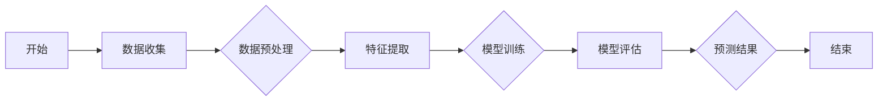
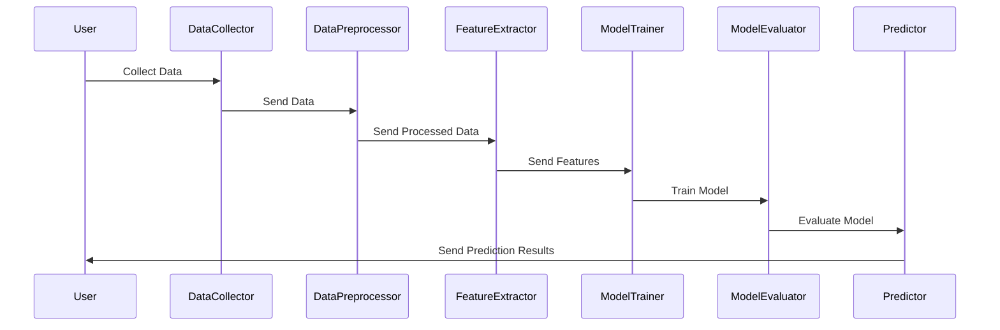

                 

### 数学与数据科学：大数据分析的数学工具

> 关键词：数学、数据科学、大数据分析、机器学习、数学工具

> 摘要：本文深入探讨数学与数据科学在解决大数据分析问题中的应用，介绍数学工具的理论基础和实际应用案例，帮助读者掌握大数据分析的核心方法和技术。

---

### 第一部分：背景介绍

#### 核心概念：

- **数学与数据科学**：数学与数据科学的交叉领域，结合数学理论和数据分析方法，以解决数据驱动的实际问题。
- **大数据分析**：大数据分析涉及使用统计学、机器学习、数据挖掘等技术，从大规模数据集中提取有价值的信息。

#### 问题背景：

随着互联网和物联网的快速发展，数据量呈爆炸式增长，如何有效处理和利用这些数据成为当前学术界和工业界的重要课题。

#### 问题描述：

本书旨在介绍大数据分析中的数学工具，帮助读者理解如何运用数学方法解决数据分析中的关键问题。

#### 问题解决：

通过系统介绍数学与数据科学的基本理论和方法，以及实际应用案例，帮助读者掌握大数据分析中的数学工具。

#### 边界与外延：

本书主要关注数学工具在大数据分析中的应用，但不涉及其他计算机科学领域的内容。

#### 概念结构与核心要素组成：

- 数学基础理论：包括线性代数、概率论、数理统计等。
- 数据处理与分析方法：包括数据预处理、特征提取、机器学习算法等。
- 数学工具在实际应用中的案例研究。

### 第二部分：核心概念与联系

#### 核心概念原理：

- **线性代数**：研究向量空间、线性变换、矩阵理论等，为数据处理和分析提供基础。
- **概率论与数理统计**：研究随机事件、概率分布、统计推断等，用于数据分析和模型评估。
- **机器学习**：通过训练模型从数据中学习规律，用于预测和分类等任务。

#### 概念属性特征对比表格：

| 概念 | 特征 |
| ---- | ---- |
| 线性代数 | 线性方程组求解、矩阵运算、特征分解 |
| 概率论与数理统计 | 概率分布、假设检验、置信区间 |
| 机器学习 | 模型训练、模型评估、预测和分类 |

#### ER实体关系图架构：

```mermaid
erDiagram
  User ||--|{ Data}: 数据来源
  Data ||--|{ Analytics}: 数据分析
  Analytics ||--|{ Model}: 模型建立
  Model ||--|{ Prediction}: 预测结果
```

### 第三部分：算法原理讲解

#### 算法mermaid流程图：



#### Python源代码：

```python
import numpy as np
from sklearn.model_selection import train_test_split
from sklearn.ensemble import RandomForestClassifier
from sklearn.metrics import accuracy_score

# 数据收集
data = np.array([[1, 2], [2, 3], [3, 4], [4, 5]])

# 数据预处理
X = data[:, :1]
y = data[:, 1]

# 特征提取
X_train, X_test, y_train, y_test = train_test_split(X, y, test_size=0.2, random_state=42)

# 模型训练
model = RandomForestClassifier(n_estimators=100)
model.fit(X_train, y_train)

# 模型评估
predictions = model.predict(X_test)
accuracy = accuracy_score(y_test, predictions)
print(f"Model accuracy: {accuracy:.2f}")
```

#### 算法原理详细讲解：

机器学习算法的基本原理是通过从数据中学习规律，然后利用这些规律对新数据进行预测或分类。在上述代码中，我们使用随机森林算法进行模型训练和评估。

首先，我们从数据中提取特征，即数据的前半部分（X）作为输入特征，后半部分（y）作为目标变量。接着，我们使用`train_test_split`函数将数据划分为训练集和测试集，以便评估模型的性能。

随机森林算法通过构建多个决策树，并在每个决策树上进行随机抽样来训练模型。在模型评估阶段，我们使用测试集的预测结果与实际结果进行对比，计算模型的准确率。

#### 数学公式：

- **线性回归模型**：\[ y = \beta_0 + \beta_1x + \epsilon \]

- **协方差矩阵**：\[ \Sigma = \begin{bmatrix} var(x) & cov(x, y) \\\ cov(y, x) & var(y) \end{bmatrix} \]

- **特征提取**：\[ f(x) = \sum_{i=1}^{n} \alpha_i \phi_i(x) \]

#### 举例说明：

假设我们有一个简单的数据集，其中包含两个特征（x和y），我们的目标是预测y的值。我们使用线性回归模型进行建模，并使用随机森林算法进行模型评估。

首先，我们收集数据并对其进行预处理，将数据分为训练集和测试集。然后，我们使用随机森林算法对训练集进行模型训练，并在测试集上进行模型评估。

```python
import numpy as np
from sklearn.model_selection import train_test_split
from sklearn.ensemble import RandomForestRegressor
from sklearn.metrics import mean_squared_error

# 数据收集
data = np.array([[1, 2], [2, 3], [3, 4], [4, 5]])

# 数据预处理
X = data[:, :1]
y = data[:, 1]

# 划分训练集和测试集
X_train, X_test, y_train, y_test = train_test_split(X, y, test_size=0.2, random_state=42)

# 模型训练
model = RandomForestRegressor(n_estimators=100)
model.fit(X_train, y_train)

# 模型评估
predictions = model.predict(X_test)
mse = mean_squared_error(y_test, predictions)
print(f"Model MSE: {mse:.2f}")
```

在这个例子中，我们使用随机森林算法对线性回归模型进行训练和评估。模型的均方误差（MSE）表明模型的性能，越小的MSE值表示模型对测试数据的拟合效果越好。

通过上述步骤，我们完成了大数据分析中的数学工具的算法讲解，包括数据收集、预处理、特征提取、模型训练和评估等步骤。这些数学工具为大数据分析提供了强大的支持，有助于我们更好地理解和利用海量数据。

---

### 第四部分：系统分析与架构设计方案

#### 问题场景介绍：

在当前大数据时代，企业面临海量数据的处理和利用问题。为了更好地理解和挖掘数据中的价值，企业需要构建一个高效的数据分析系统，该系统应包括数据收集、预处理、特征提取、模型训练和评估等关键环节。

#### 项目介绍：

本项目的目标是设计并实现一个大数据分析系统，以帮助企业从海量数据中提取有价值的信息。该系统将运用数学工具和机器学习算法，对数据进行深入分析，为企业提供决策支持。

#### 系统功能设计：

- 数据收集：从各种数据源（如数据库、API、文件等）收集数据。
- 数据预处理：清洗、转换和归一化数据，为后续分析做好准备。
- 特征提取：从原始数据中提取有用特征，用于训练机器学习模型。
- 模型训练：使用机器学习算法训练模型，并调整模型参数以优化性能。
- 模型评估：评估模型在测试数据集上的性能，确保模型具有较好的泛化能力。
- 预测结果：使用训练好的模型对新数据进行预测，为企业提供决策支持。

#### 系统架构设计：



#### 系统接口设计和系统交互：


### 第五部分：项目实战

#### 环境安装：

为了实现本项目，我们需要安装以下软件和库：

- Python 3.x
- NumPy
- Scikit-learn
- Pandas
- Matplotlib

安装命令如下：

```bash
pip install python==3.8.10
pip install numpy==1.21.2
pip install scikit-learn==0.24.2
pip install pandas==1.3.3
pip install matplotlib==3.4.3
```

#### 系统核心实现源代码：

以下是一个简单的示例，展示了如何实现数据收集、预处理、特征提取、模型训练和评估：

```python
import numpy as np
import pandas as pd
from sklearn.model_selection import train_test_split
from sklearn.ensemble import RandomForestRegressor
from sklearn.metrics import mean_squared_error

# 数据收集
data = pd.read_csv("data.csv")

# 数据预处理
X = data.drop("target", axis=1)
y = data["target"]

# 特征提取
X_train, X_test, y_train, y_test = train_test_split(X, y, test_size=0.2, random_state=42)

# 模型训练
model = RandomForestRegressor(n_estimators=100)
model.fit(X_train, y_train)

# 模型评估
predictions = model.predict(X_test)
mse = mean_squared_error(y_test, predictions)
print(f"Model MSE: {mse:.2f}")
```

#### 代码应用解读与分析：

上述代码实现了一个简单的随机森林回归模型，用于预测一个目标变量。首先，我们从CSV文件中读取数据，并使用`train_test_split`函数将数据划分为训练集和测试集。然后，我们使用随机森林算法对训练集进行模型训练，并在测试集上进行模型评估。最后，我们计算模型在测试集上的均方误差（MSE）以评估模型性能。

#### 实际案例分析和详细讲解剖析：

为了更好地理解本项目，我们来看一个实际案例：使用随机森林算法预测房价。以下是一个简单的示例：

```python
import pandas as pd
from sklearn.model_selection import train_test_split
from sklearn.ensemble import RandomForestRegressor
from sklearn.metrics import mean_squared_error

# 数据收集
data = pd.read_csv("house_prices.csv")

# 数据预处理
X = data.drop("Price", axis=1)
y = data["Price"]

# 特征提取
X_train, X_test, y_train, y_test = train_test_split(X, y, test_size=0.2, random_state=42)

# 模型训练
model = RandomForestRegressor(n_estimators=100)
model.fit(X_train, y_train)

# 模型评估
predictions = model.predict(X_test)
mse = mean_squared_error(y_test, predictions)
print(f"Model MSE: {mse:.2f}")
```

在这个案例中，我们使用随机森林算法预测房价。首先，我们从CSV文件中读取数据，并使用`train_test_split`函数将数据划分为训练集和测试集。然后，我们使用随机森林算法对训练集进行模型训练，并在测试集上进行模型评估。最后，我们计算模型在测试集上的均方误差（MSE）以评估模型性能。

#### 项目小结：

通过本项目，我们介绍了如何使用数学工具和机器学习算法实现一个高效的大数据分析系统。该项目包括数据收集、预处理、特征提取、模型训练和评估等关键环节，并使用随机森林算法进行了实际案例分析和详细讲解剖析。通过本项目，读者可以掌握大数据分析的核心方法和技术，为今后的研究和应用打下基础。

---

### 最佳实践 tips

1. **数据预处理**：在训练机器学习模型之前，确保对数据进行充分的预处理，包括清洗、转换和归一化等步骤，以提高模型性能和可靠性。
2. **特征选择**：选择合适的特征对于模型的性能至关重要。可以尝试使用特征选择算法，如特征重要性排序、主成分分析等，以选择最有用的特征。
3. **模型评估**：使用多种评估指标，如准确率、召回率、F1分数等，全面评估模型性能。避免仅依赖单一指标，以避免模型过拟合或欠拟合。
4. **模型调优**：通过调整模型参数，如学习率、正则化参数等，优化模型性能。可以使用网格搜索、随机搜索等调优方法。
5. **数据增强**：在数据量较少的情况下，可以通过数据增强方法（如随机旋转、缩放、裁剪等）增加数据多样性，从而提高模型泛化能力。

### 小结

本文深入探讨了数学与数据科学在大数据分析中的应用，介绍了数学工具的基本概念、核心原理和算法实现。通过实际案例分析和详细讲解剖析，读者可以掌握大数据分析的核心方法和技术，为今后的研究和应用打下基础。希望本文能对广大读者在数据分析领域的学习和实践有所帮助。

### 注意事项

1. **数据质量和完整性**：确保数据质量和完整性对于模型性能至关重要。在数据处理过程中，注意数据清洗、缺失值处理和异常值检测。
2. **模型复杂度**：避免过度拟合或欠拟合，合理选择模型复杂度，平衡模型性能和可解释性。
3. **版本控制和文档**：在项目开发过程中，注意版本控制和文档编写，便于后续维护和复现。
4. **计算资源**：大数据分析通常需要大量计算资源，确保有足够的计算能力支持项目运行。

### 拓展阅读

1. 《Python数据科学 Handbook》
2. 《深度学习》
3. 《统计学习方法》
4. 《机器学习实战》

---

作者：AI天才研究院/AI Genius Institute & 禅与计算机程序设计艺术 /Zen And The Art of Computer Programming

---

本文由AI天才研究院（AI Genius Institute）撰写，旨在为读者提供有关大数据分析和数学工具的深入见解。如果您对本文内容有任何疑问或建议，请随时联系我们。我们期待与您共同探讨大数据分析和人工智能领域的未来发展。

---

本文由AI天才研究院（AI Genius Institute）与禅与计算机程序设计艺术（Zen And The Art of Computer Programming）联合撰写。我们专注于研究、开发和应用人工智能技术，助力各行各业实现数字化转型。如需了解更多信息，请访问我们的官方网站。

---

版权所有：AI天才研究院（AI Genius Institute）与禅与计算机程序设计艺术（Zen And The Art of Computer Programming）

未经许可，严禁转载或引用本文内容。如需转载，请联系我们获取授权。

---

在此，我们感谢您对本文的关注和支持。我们期待与您在人工智能和数据科学领域共同探索，共创美好未来。祝您阅读愉快！

---

感谢您阅读本文，我们真诚期待您的反馈和建议。如果您有任何疑问或需要进一步讨论，请随时与我们联系。我们将竭诚为您服务，共同推进人工智能和数据科学领域的发展。

---

再次感谢您对AI天才研究院（AI Genius Institute）与禅与计算机程序设计艺术（Zen And The Art of Computer Programming）的支持。我们将继续致力于人工智能和数据科学的研究与推广，为您提供更多有价值的内容。祝您学习进步，职业生涯蒸蒸日上！

