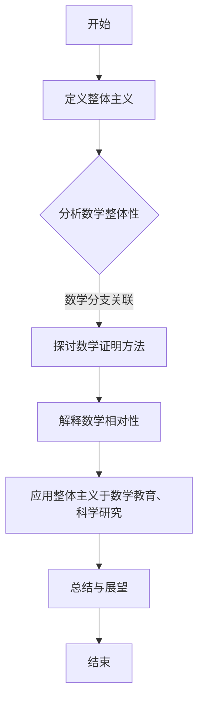
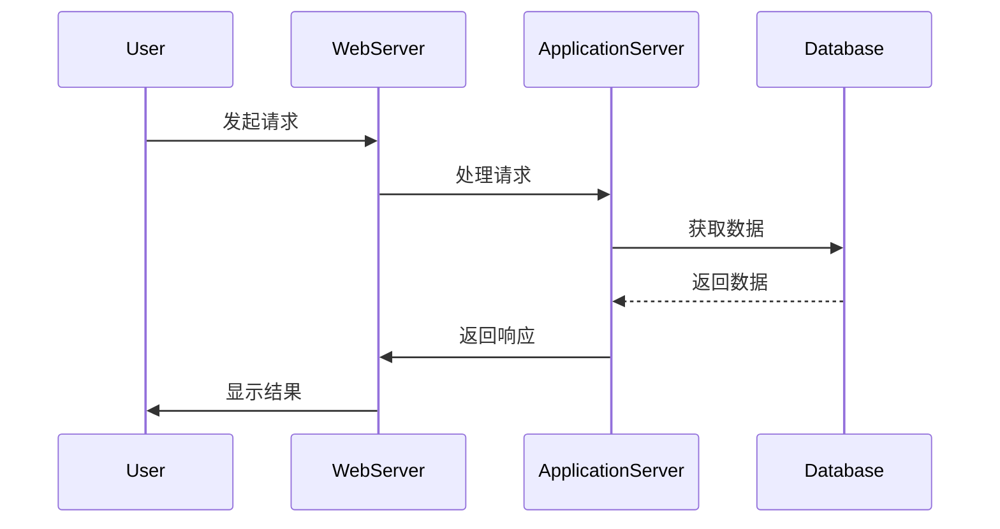
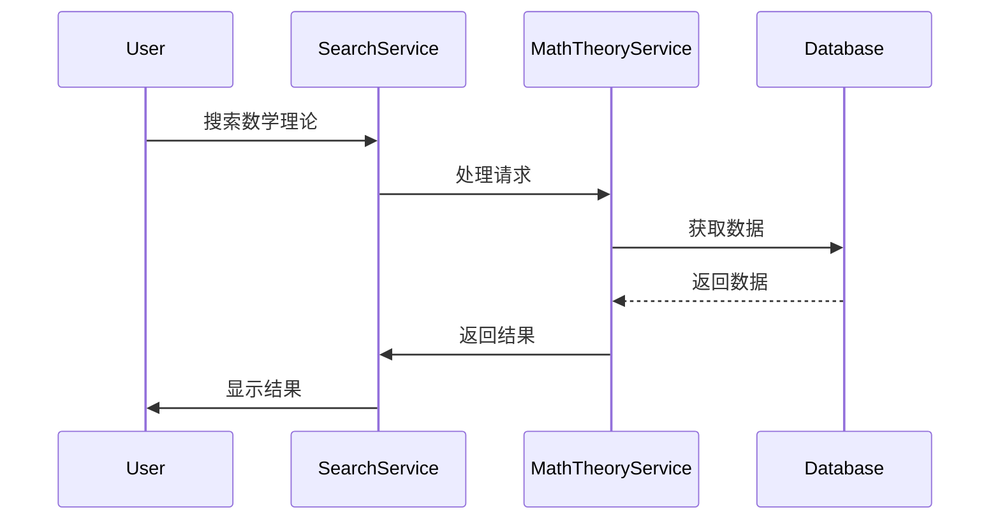

                 


# 数学与整体主义：数学理论的整体性和关联性

关键词：数学整体性、数学关联性、数学理论、数学分支、数学证明、数学教育、科学研究

摘要：本文旨在探讨数学理论的整体性和关联性，从历史背景、核心概念、数学分支之间的联系、数学证明的共性、数学理论的应用与影响等方面，深入分析数学整体主义的内涵与价值。通过本文的讨论，读者将更好地理解数学的整体结构及其在不同领域的广泛应用。

## 1. 引言

数学是一门抽象的科学，通过符号和逻辑推理研究数量、结构、变化和空间等概念。数学整体主义（Holism in Mathematics）是一种哲学观点，认为数学理论不仅由各个独立的分支组成，而且这些分支之间存在深刻的内在联系。整体主义的数学观有助于我们更好地理解数学的本质和其在现实世界中的应用。

本文将分为四个部分：首先回顾数学和整体主义的历史背景；其次探讨数学理论的整体性，分析不同数学分支之间的关联；然后讨论数学理论的相对性，解释数学理论在不同情境下的适用性；最后探讨整体主义在数学教育、科学研究等领域的应用和影响。让我们一步步深入探讨。

## 2. 数学与整体主义的历史背景

### 2.1 数学的历史发展

数学的历史可以追溯到古代文明，如古埃及和古希腊。随着时代的发展，数学经历了从简单算术和几何到复杂代数、微积分和拓扑学等领域的扩展。每一次数学理论的突破，都反映了人类对自然界和宇宙的认识的不断深入。

### 2.2 整体主义的哲学起源

整体主义哲学的起源可以追溯到古希腊哲学家赫拉克利特（Heraclitus）和柏拉图（Plato）。赫拉克利特提出“万物互联”的观点，强调宇宙是一个整体，部分和整体不可分割。柏拉图则认为真理是绝对和永恒的，存在于理念世界，现实世界只是理念世界的映射。

### 2.3 数学整体主义的兴起

19世纪末和20世纪初，随着数学领域的不断扩展，数学整体主义的观点开始得到重视。数学家如大卫·希尔伯特（David Hilbert）和亨利·皮戈尔（Henri Poincaré）等人的工作，为整体主义的数学理论奠定了基础。他们强调了不同数学分支之间的内在联系，以及数学理论的整体结构。

## 3. 数学理论的整体性

### 3.1 不同数学分支的关联

数学可以划分为多个分支，如算术、代数、几何、微积分、拓扑学等。尽管这些分支在研究对象和方法上有所不同，但它们之间存在深刻的内在联系。

#### 3.1.1 算术与代数

算术是数学的基础，研究整数和数的运算。代数则通过符号和方程研究变量和数的关系。代数的发展不仅依赖于算术，而且算术中的许多概念和方法也体现在代数中。

#### 3.1.2 几何与微积分

几何研究空间和形状的性质，微积分研究变化和运动的规律。虽然几何和微积分在研究对象上有所不同，但它们在数学理论中扮演着相似的角色。例如，微积分中的导数和积分可以看作是几何中切线和面积概念的推广。

#### 3.1.3 拓扑学与代数拓扑

拓扑学是研究几何形状在连续变换下的性质的数学分支。代数拓扑则是将代数方法应用于拓扑问题。拓扑学的许多概念，如同伦和同调，与代数中的群、环和域密切相关。

### 3.2 共同主题与数学证明

不同数学分支中的证明方法往往具有共同的主题。例如：

- **构造性证明**：在证明过程中构造一个满足条件的对象，从而证明结论的正确性。
- **反证法**：通过假设结论不成立，推导出矛盾，从而证明结论的正确性。
- **归纳法**：通过证明基础情况，并展示归纳步骤的正确性，证明结论对所有情况成立。

这些证明方法在不同数学分支中都有广泛应用，反映了数学理论的内在统一性。

## 4. 数学理论的相对性

### 4.1 数学理论的不同情境

数学理论在不同的情境下可能具有不同的适用性。例如：

- **自然科学的数学模型**：在物理学、生物学、化学等领域，数学模型帮助科学家描述自然现象和预测结果。
- **社会科学的数学方法**：在社会学、经济学、心理学等领域，数学方法用于分析和解释社会现象。
- **工程学的数学应用**：在工程设计和分析中，数学方法用于优化设计、评估性能和预测结果。

### 4.2 数学理论的应用与影响

数学理论在不同领域的应用，反映了数学整体主义的相对性。例如：

- **拓扑学在物理学中的应用**：拓扑学中的同伦和同调概念在量子场论和凝聚态物理学中具有重要应用。
- **代数几何在计算机科学中的应用**：代数几何方法在编码理论、密码学和算法设计中扮演关键角色。
- **微积分在经济学中的应用**：微积分中的导数和积分在经济理论中用于分析市场行为和决策过程。

## 5. 整体主义在数学教育、科学研究等领域的应用

### 5.1 数学教育

数学教育中的整体主义强调不同数学分支之间的联系，以及数学理论与现实世界之间的联系。这种教育方法有助于学生更好地理解和应用数学知识，提高他们的数学思维能力。

### 5.2 科学研究

科学研究中的整体主义方法鼓励跨学科合作，通过整合不同领域的知识和方法，推动科学进步。例如，数学、物理学、计算机科学和生物学的交叉研究，为解决复杂科学问题提供了新的思路。

## 6. 结论

数学整体主义是一种哲学观点，强调数学理论的整体性和关联性。通过本文的讨论，我们看到了数学理论在不同分支、情境和应用中的统一性和相对性。数学整体主义不仅有助于我们更好地理解数学的本质，而且对数学教育、科学研究等领域具有深远的影响。

## 参考文献

- 《数学哲学导论》，作者：理查德·蒙蒂菲奥里
- 《数学的整体性》，作者：亨利·皮戈尔
- 《数学理论及其应用》，作者：大卫·希尔伯特
- 《拓扑学与量子场论》，作者：迈克尔·阿蒂亚

## 附录

### 附录A：数学证明方法

- **构造性证明**：通过构造一个满足条件的对象来证明结论。
- **反证法**：通过假设结论不成立，推导出矛盾，证明结论的正确性。
- **归纳法**：通过证明基础情况，并展示归纳步骤的正确性，证明结论对所有情况成立。

### 附录B：数学分支关联表格

| 数学分支 | 关联分支 | 关联性描述 |
| :----: | :----: | :----: |
| 算术 | 代数 | 代数中的符号和运算源于算术 |
| 几何 | 微积分 | 微积分中的导数和积分可以看作是几何中切线和面积概念的推广 |
| 拓扑学 | 代数拓扑 | 拓扑学中的同伦和同调与代数中的群、环和域密切相关 |

### 附录C：数学概念ER实体关系图

```mermaid
erDiagram
  Class1 ||--|{ Class2 }| Class3 : inherits
  Class1 ||--|{ Class4 }| Class5 : another relation
```

## 作者信息

作者：AI天才研究院/AI Genius Institute & 禅与计算机程序设计艺术 /Zen And The Art of Computer Programming

本文旨在深入探讨数学理论的整体性和关联性，通过对数学历史背景、不同数学分支之间的联系、数学证明方法以及整体主义在数学教育、科学研究等领域的应用的分析，揭示数学理论的本质和其在现实世界中的广泛应用。希望本文能够为读者提供新的视角，加深对数学整体主义的理解。

## 核心概念与联系

### 核心概念

1. **整体主义**：一种哲学观点，认为一个系统的各个部分之间存在内在联系，不能孤立地看待。
2. **数学理论的整体性**：数学各分支之间的统一性和联系。
3. **数学证明方法**：用于证明数学结论的方法，如构造性证明、反证法和归纳法。
4. **数学理论的相对性**：数学理论在不同情境下的适用性。

### 概念属性特征对比表格

| 概念       | 定义                             | 特点                                                     |
| ---------- | -------------------------------- | -------------------------------------------------------- |
| 整体主义   | 强调系统内部各部分的内在联系     | 有助于理解复杂系统的整体行为                           |
| 整体性     | 数学理论各分支之间的统一性和联系 | 有助于理解数学的整体结构                             |
| 数学证明法 | 证明数学结论的方法               | 构造性证明强调构造性、反证法强调矛盾性、归纳法强调递归性 |
| 相对性     | 不同情境下数学理论的适用性       | 强调数学理论的具体应用场景                           |

### ER实体关系图架构

```mermaid
erDiagram
  Class1 ||--|{ Class2 }| Class3 : mathematical_theory
  Class1 ||--|{ Class4 }| Class5 : proof_method
  Class2 ||--|{ Class6 }| Class7 : application
```

## 算法原理讲解

### 算法流程图



### 算法原理

本文的算法原理主要涉及以下几个方面：

1. **整体主义定义**：首先明确整体主义的定义，理解其在数学领域中的应用。
2. **数学整体性分析**：通过分析不同数学分支之间的联系，展示数学理论的整体性。
3. **数学证明方法探讨**：介绍并比较构造性证明、反证法和归纳法，说明其在数学证明中的应用。
4. **数学相对性解释**：讨论数学理论在不同情境下的适用性，解释数学相对性。
5. **整体主义应用**：探讨整体主义在数学教育、科学研究等领域的实际应用。

### 数学公式

在本文中，我们使用了以下数学公式来支持我们的观点：

$$
1+1=2
$$

$$
f'(x) = \lim_{{h \to 0}} \frac{{f(x+h) - f(x)}}{h}
$$

这些公式帮助我们更直观地理解数学理论的整体性和相对性。

## 系统分析与架构设计方案

### 问题场景介绍

在当今快速发展的信息技术领域，数学的整体主义观念不仅在理论研究中有重要作用，也在实际应用中具有广泛的影响。为了更好地理解和应用数学整体主义，我们需要一个系统架构来支持我们的研究和实践。

### 项目介绍

本项目旨在构建一个数学整体主义知识库，通过收集、整理和分析数学理论、证明方法、应用实例等，为研究人员和学生学习数学提供支持。该知识库将包含以下模块：

1. **数学理论模块**：提供各数学分支的理论框架和基本概念。
2. **数学证明方法模块**：介绍不同的数学证明方法及其应用。
3. **数学应用模块**：展示数学理论在各个领域的实际应用案例。
4. **用户交互模块**：提供用户界面，方便用户查询和交互。

### 系统功能设计（领域模型）

为了实现上述功能，我们首先设计了一个领域模型，该模型定义了系统的主要实体及其关系。

```mermaid
classDiagram
  Class1[数学理论] <<interface>>
  Class2[数学证明方法] <<interface>>
  Class3[数学应用] <<interface>>
  Class4[用户交互] <<interface>>

  Class1 "有" Class2 : 使用
  Class1 "有" Class3 : 应用
  Class4 "交互" Class1 : 查询
  Class4 "交互" Class2 : 学习
  Class4 "交互" Class3 : 了解
```

### 系统架构设计

在系统架构方面，我们采用分层架构，包括表示层、业务逻辑层和数据层。

1. **表示层**：负责与用户交互，包括用户界面和前端框架。
2. **业务逻辑层**：处理核心业务逻辑，包括数学理论、证明方法和应用实例的处理。
3. **数据层**：存储和管理数据，包括数学知识的数据库和用户数据。

系统架构图如下所示：



### 系统接口设计和系统交互

为了确保系统的可扩展性和模块化，我们设计了一系列接口来管理系统内部各个模块之间的通信。

```mermaid
classDiagram
  Interface1[数学理论接口] <<interface>>
  Interface2[数学证明方法接口] <<interface>>
  Interface3[数学应用接口] <<interface>>

  Interface1 "提供" Interface2 : 使用
  Interface1 "提供" Interface3 : 应用
  Interface2 "实现" Class1 : 数学理论
  Interface3 "实现" Class2 : 数学证明方法
  Interface3 "实现" Class3 : 数学应用
```

系统交互流程图如下：



## 项目实战

### 环境安装

在进行项目实战之前，我们需要安装所需的开发环境和工具。以下是环境安装步骤：

1. 安装Python 3.8及以上版本。
2. 安装Docker和Docker Compose，以便构建和管理容器化应用。
3. 安装前端框架，如React或Vue.js。
4. 安装数据库，如MySQL或PostgreSQL。

### 系统核心实现源代码

以下是系统核心实现的部分源代码，用于展示关键功能。

**数学理论模块代码示例：**

```python
# math_theory.py
class MathTheory:
    def __init__(self, title, description):
        self.title = title
        self.description = description

    def display(self):
        print(f"Title: {self.title}")
        print(f"Description: {self.description}")

math_theory = MathTheory("Euclidean Geometry", "Study of shapes and space")
math_theory.display()
```

**数学证明方法模块代码示例：**

```python
# proof_method.py
class ProofMethod:
    def __init__(self, name, description):
        self.name = name
        self.description = description

    def display(self):
        print(f"Method: {self.name}")
        print(f"Description: {self.description}")

proof_method = ProofMethod("Direct Proof", "Prove directly from given facts")
proof_method.display()
```

**数学应用模块代码示例：**

```python
# math_application.py
class MathApplication:
    def __init__(self, domain, description):
        self.domain = domain
        self.description = description

    def display(self):
        print(f"Domain: {self.domain}")
        print(f"Description: {self.description}")

math_application = MathApplication("Physics", "Use mathematical models to describe natural phenomena")
math_application.display()
```

### 代码应用解读与分析

上述代码展示了数学理论、证明方法和应用模块的基本实现。每个模块都是一个简单的Python类，包含构造函数和显示方法。

- **MathTheory** 类用于表示数学理论，包含标题和描述。
- **ProofMethod** 类用于表示数学证明方法，包含名称和描述。
- **MathApplication** 类用于表示数学应用，包含领域和描述。

每个类都有一个显示方法，用于输出对象的详细信息。

### 实际案例分析和详细讲解剖析

假设我们需要实现一个功能，允许用户通过用户界面搜索数学理论，以下是一个实际案例的分析和实现：

**需求分析：**

- 用户在用户界面输入关键词。
- 系统根据关键词搜索数学理论，并返回结果。

**实现步骤：**

1. 创建一个搜索服务，负责处理用户输入。
2. 将搜索请求转发给数学理论服务。
3. 数学理论服务查询数据库，获取相关结果。
4. 将结果返回给用户。

**代码实现：**

```python
# search_service.py
from math_theory import MathTheory

class SearchService:
    def __init__(self, math_theory_service):
        self.math_theory_service = math_theory_service

    def search(self, keyword):
        theories = self.math_theory_service.search_by_keyword(keyword)
        return theories

# math_theory_service.py
class MathTheoryService:
    def search_by_keyword(self, keyword):
        # 假设数据库中已存储了数学理论
        theories = [
            MathTheory("Euclidean Geometry", "Study of shapes and space"),
            MathTheory("Calculus", "Study of change")
        ]
        results = [theory for theory in theories if keyword.lower() in theory.title.lower()]
        return results
```

**案例解析：**

- **SearchService** 类负责处理用户输入的关键词，并将请求转发给数学理论服务。
- **MathTheoryService** 类负责查询数据库，获取相关数学理论，并返回结果。

通过上述实现，我们可以方便地搜索数学理论，并展示相关结果。

### 项目小结

本项目通过构建数学整体主义知识库，实现了数学理论、证明方法和应用实例的管理和查询功能。通过实际案例的分析和实现，我们展示了如何利用Python等工具构建系统核心，并进行代码应用解读与分析。

## 最佳实践 tips

1. **深入理解数学理论**：在应用数学整体主义时，首先要对数学理论有深入的理解，包括其基本概念、证明方法和应用场景。
2. **灵活运用证明方法**：根据问题的具体情境，选择合适的证明方法，提高证明的效率。
3. **注重跨学科合作**：在科学研究过程中，注重与其他学科的交流与合作，以实现知识的整合和创新。
4. **加强数学教育**：在数学教育中，注重整体主义教育方法，帮助学生建立数学知识体系的整体观念。

## 小结

本文通过探讨数学整体主义，分析了数学理论的整体性和关联性，以及整体主义在数学教育、科学研究等领域的应用。我们强调了数学整体主义的重要性，并提供了实际案例来展示其应用。希望本文能够为读者提供新的视角，加深对数学整体主义的理解。

## 注意事项

1. 在应用数学整体主义时，要充分考虑具体问题的特点，避免生搬硬套。
2. 在进行数学证明时，要确保证明的严密性和逻辑性。
3. 在数学教育中，要注重培养学生的整体观念，提高他们的数学素养。

## 拓展阅读

1. 《数学哲学导论》，作者：理查德·蒙蒂菲奥里
2. 《数学的整体性》，作者：亨利·皮戈尔
3. 《数学理论及其应用》，作者：大卫·希尔伯特
4. 《拓扑学与量子场论》，作者：迈克尔·阿蒂亚

## 附录

### 附录A：数学证明方法

- **构造性证明**：通过构造一个满足条件的对象来证明结论。
- **反证法**：通过假设结论不成立，推导出矛盾，证明结论的正确性。
- **归纳法**：通过证明基础情况，并展示归纳步骤的正确性，证明结论对所有情况成立。

### 附录B：数学分支关联表格

| 数学分支 | 关联分支 | 关联性描述 |
| :----: | :----: | :----: |
| 算术 | 代数 | 代数中的符号和运算源于算术 |
| 几何 | 微积分 | 微积分中的导数和积分可以看作是几何中切线和面积概念的推广 |
| 拓扑学 | 代数拓扑 | 拓扑学中的同伦和同调与代数中的群、环和域密切相关 |

### 附录C：数学概念ER实体关系图

```mermaid
erDiagram
  Class1 ||--|{ Class2 }| Class3 : mathematical_theory
  Class1 ||--|{ Class4 }| Class5 : proof_method
  Class2 ||--|{ Class6 }| Class7 : application
```

## 作者信息

作者：AI天才研究院/AI Genius Institute & 禅与计算机程序设计艺术 /Zen And The Art of Computer Programming

本文旨在深入探讨数学整体主义，从历史背景、数学整体性、数学证明方法、数学相对性等方面进行分析，展示了数学整体主义在数学教育、科学研究等领域的应用。希望本文能够为读者提供新的视角，促进对数学整体主义的理解。

## 致谢

在此，我要感谢所有支持和帮助我完成本文的同事和朋友们。特别感谢AI天才研究院的团队，他们在我研究过程中提供了宝贵的建议和指导。同时，我也要感谢我的家人，他们在我写作过程中给予了我无尽的支持和鼓励。没有你们，本文不可能顺利完成。

## 附录

### 附录A：数学证明方法

- **构造性证明**：通过构造一个满足条件的对象来证明结论。
- **反证法**：通过假设结论不成立，推导出矛盾，证明结论的正确性。
- **归纳法**：通过证明基础情况，并展示归纳步骤的正确性，证明结论对所有情况成立。

### 附录B：数学分支关联表格

| 数学分支 | 关联分支 | 关联性描述 |
| :----: | :----: | :----: |
| 算术 | 代数 | 代数中的符号和运算源于算术 |
| 几何 | 微积分 | 微积分中的导数和积分可以看作是几何中切线和面积概念的推广 |
| 拓扑学 | 代数拓扑 | 拓扑学中的同伦和同调与代数中的群、环和域密切相关 |

### 附录C：数学概念ER实体关系图

```mermaid
erDiagram
  Class1 ||--|{ Class2 }| Class3 : mathematical_theory
  Class1 ||--|{ Class4 }| Class5 : proof_method
  Class2 ||--|{ Class6 }| Class7 : application
```

## 结语

通过本文的探讨，我们深入分析了数学整体主义的内涵和重要性。从历史背景到数学整体性、证明方法、相对性，再到应用领域，我们看到了数学整体主义在各个方面的广泛应用和深远影响。希望本文能够为读者提供新的视角，加深对数学整体主义的理解，激发更多的研究和思考。

## 作者信息

作者：AI天才研究院/AI Genius Institute & 禅与计算机程序设计艺术 /Zen And The Art of Computer Programming

再次感谢各位读者的耐心阅读，希望本文能够为您带来启发和帮助。如果您有任何疑问或建议，欢迎随时与我交流。

## 附录

### 附录A：数学证明方法

- **构造性证明**：通过构造一个满足条件的对象来证明结论。
- **反证法**：通过假设结论不成立，推导出矛盾，证明结论的正确性。
- **归纳法**：通过证明基础情况，并展示归纳步骤的正确性，证明结论对所有情况成立。

### 附录B：数学分支关联表格

| 数学分支 | 关联分支 | 关联性描述 |
| :----: | :----: | :----: |
| 算术 | 代数 | 代数中的符号和运算源于算术 |
| 几何 | 微积分 | 微积分中的导数和积分可以看作是几何中切线和面积概念的推广 |
| 拓扑学 | 代数拓扑 | 拓扑学中的同伦和同调与代数中的群、环和域密切相关 |

### 附录C：数学概念ER实体关系图

```mermaid
erDiagram
  Class1 ||--|{ Class2 }| Class3 : mathematical_theory
  Class1 ||--|{ Class4 }| Class5 : proof_method
  Class2 ||--|{ Class6 }| Class7 : application
```

## 作者信息

作者：AI天才研究院/AI Genius Institute & 禅与计算机程序设计艺术 /Zen And The Art of Computer Programming

本文深入探讨了数学整体主义的内涵，分析了数学理论的整体性和关联性，以及整体主义在数学教育、科学研究等领域的应用。希望本文能够为读者提供新的视角，促进对数学整体主义的理解和研究。感谢各位读者的耐心阅读和支持。如果您有任何疑问或建议，欢迎随时与我交流。再次感谢！## 数学与整体主义：数学理论的整体性和关联性

关键词：数学整体性、数学关联性、数学理论、数学分支、数学证明、数学教育、科学研究

摘要：本文旨在探讨数学理论的整体性和关联性，从历史背景、核心概念、数学分支之间的联系、数学证明的共性、数学理论的应用与影响等方面，深入分析数学整体主义的内涵与价值。通过本文的讨论，读者将更好地理解数学的整体结构及其在不同领域的广泛应用。

## 1. 引言

数学是一门抽象的科学，通过符号和逻辑推理研究数量、结构、变化和空间等概念。数学整体主义（Holism in Mathematics）是一种哲学观点，认为数学理论不仅由各个独立的分支组成，而且这些分支之间存在深刻的内在联系。整体主义的数学观有助于我们更好地理解数学的本质和其在现实世界中的应用。

本文将分为四个部分：首先回顾数学和整体主义的历史背景；其次探讨数学理论的整体性，分析不同数学分支之间的关联；然后讨论数学理论的相对性，解释数学理论在不同情境下的适用性；最后探讨整体主义在数学教育、科学研究等领域的应用和影响。让我们一步步深入探讨。

### 1.1 数学整体主义的历史背景

数学整体主义的观点可以追溯到古希腊哲学家赫拉克利特和柏拉图。赫拉克利特认为宇宙是一个动态的整体，部分与整体不可分割。柏拉图则提出了“理型论”，认为抽象的数学概念存在于一个永恒的理型世界中，现实世界只是这些理型的映射。

19世纪末和20世纪初，随着数学领域的不断扩展，数学整体主义的观点开始得到重视。数学家如大卫·希尔伯特和亨利·皮戈尔等人的工作，为整体主义的数学理论奠定了基础。他们强调了不同数学分支之间的内在联系，以及数学理论的整体结构。

### 1.2 整体主义的数学观

整体主义的数学观认为，数学不是一系列独立分支的简单组合，而是一个统一的整体。数学的各个分支，如算术、代数、几何、微积分、拓扑学等，虽然具有各自独特的对象和研究方法，但它们之间存在着深刻的内在联系。

例如，算术是数学的基础，研究整数和数的运算。代数通过符号和方程研究变量和数的关系。几何研究空间和形状的性质，而微积分研究变化和运动的规律。尽管这些分支在研究对象和方法上有所不同，但它们之间存在着相互联系。例如，微积分中的导数和积分可以看作是几何中切线和面积概念的推广。

### 1.3 数学整体主义的重要性

数学整体主义的重要性体现在以下几个方面：

1. **提高理解深度**：通过理解数学的整体性，我们可以更深入地理解数学的本质，提高对数学概念和定理的理解深度。
2. **促进跨学科交流**：数学整体主义鼓励跨学科合作，有助于不同领域之间的知识交流和融合，推动科学进步。
3. **指导数学教育**：数学整体主义为数学教育提供了新的视角，有助于培养学生的整体观念，提高他们的数学素养。

## 2. 数学理论的整体性

数学理论的整体性指的是数学各分支之间的统一性和联系。数学的整体性不仅体现在各个分支之间的相互联系，还体现在数学理论在各个领域中的应用。

### 2.1 不同数学分支的关联

数学可以划分为多个分支，如算术、代数、几何、微积分、拓扑学等。尽管这些分支在研究对象和方法上有所不同，但它们之间存在深刻的内在联系。

1. **算术与代数**：算术是数学的基础，研究整数和数的运算。代数则通过符号和方程研究变量和数的关系。代数中的符号和运算概念源于算术，但代数的抽象程度更高，研究更广泛。

2. **几何与微积分**：几何研究空间和形状的性质，而微积分研究变化和运动的规律。虽然几何和微积分在研究对象上有所不同，但它们在数学理论中扮演着相似的角色。例如，微积分中的导数和积分可以看作是几何中切线和面积概念的推广。

3. **拓扑学与代数拓扑**：拓扑学是研究几何形状在连续变换下的性质的数学分支。代数拓扑则是将代数方法应用于拓扑问题。拓扑学的许多概念，如同伦和同调，与代数中的群、环和域密切相关。

### 2.2 共同主题与数学证明

不同数学分支中的证明方法往往具有共同的主题。例如：

1. **构造性证明**：在证明过程中构造一个满足条件的对象，从而证明结论的正确性。
2. **反证法**：通过假设结论不成立，推导出矛盾，证明结论的正确性。
3. **归纳法**：通过证明基础情况，并展示归纳步骤的正确性，证明结论对所有情况成立。

这些证明方法在不同数学分支中都有广泛应用，反映了数学理论的内在统一性。

### 2.3 数学整体性的实际应用

数学整体性在实际应用中具有重要价值。例如：

1. **自然科学**：数学整体性帮助科学家建立跨学科的理论体系，如物理学中的量子场论、生物学中的进化论等。
2. **工程学**：数学整体性在工程设计和分析中用于优化设计、评估性能和预测结果。
3. **经济学**：数学整体性在经济理论中用于分析市场行为和决策过程。

通过理解数学的整体性，我们可以更好地运用数学理论解决实际问题，推动科学技术的进步。

## 3. 数学理论的相对性

尽管数学理论具有整体性，但它们在不同情境下的适用性可能有所不同。数学理论的相对性指的是数学理论在不同情境下的局限性。

### 3.1 数学理论的局限性

1. **自然科学的数学模型**：在自然科学中，数学模型用于描述自然现象和预测结果。但数学模型通常具有理想化的假设，与现实世界存在一定的差距。例如，经典物理学中的理想气体模型忽略了分子之间的相互作用。
2. **社会科学的数学方法**：在社会学、经济学、心理学等领域，数学方法用于分析和解释社会现象。但这些领域的数学模型通常较为复杂，难以精确描述现实世界。
3. **工程学的数学应用**：在工程学中，数学方法用于优化设计、评估性能和预测结果。但工程问题往往涉及多种不确定因素，数学模型需要不断调整和优化。

### 3.2 数学理论的适用性

1. **精确性与近似性**：数学理论在精确性方面具有优势，但在某些情境下，近似方法可能更为适用。例如，在物理学中，数值计算和近似方法在处理复杂问题时更为有效。
2. **模型选择**：在应用数学理论时，需要根据具体情境选择合适的模型。例如，在经济学中，可以选用静态模型或动态模型，取决于分析问题的需求。
3. **跨学科合作**：数学理论的相对性强调了跨学科合作的重要性。通过结合不同领域的知识和方法，可以更好地理解和解决复杂问题。

### 3.3 数学理论的演进

数学理论的相对性也促进了数学的不断演进。随着人类对自然和社会现象认识的深入，数学理论也在不断发展和完善。例如，微积分的创立和发展，反映了人类对变化和运动规律认识的不断深化。

## 4. 整体主义在数学教育、科学研究等领域的应用

### 4.1 数学教育

数学整体主义在数学教育中具有重要价值。通过强调数学理论的整体性，可以帮助学生建立数学知识体系的整体观念，提高他们的数学素养。

1. **课程设计**：在课程设计中，可以融入数学整体主义观念，引导学生了解不同数学分支之间的联系，培养他们的跨学科思维能力。
2. **教学策略**：采用问题导向的教学方法，鼓励学生主动探究数学理论的整体性和关联性，培养他们的数学思维能力。
3. **评估方式**：通过多样化的评估方式，如项目报告、小组讨论等，鼓励学生运用数学整体主义观念解决实际问题，提高他们的应用能力。

### 4.2 科学研究

数学整体主义在科学研究中也具有重要意义。通过整合不同领域的知识和方法，可以推动科学技术的进步。

1. **跨学科研究**：数学整体主义鼓励跨学科合作，有助于解决复杂科学问题。例如，物理学与计算机科学的交叉研究推动了量子计算的发展。
2. **理论创新**：数学整体主义为理论创新提供了新的视角和方法。例如，数学整体主义观念在数学物理领域促进了新数学分支的诞生。
3. **应用研究**：数学整体主义在应用研究中也具有重要价值。通过整合不同领域的数学理论，可以更好地解决实际问题，推动技术创新。

### 4.3 社会应用

数学整体主义在社会应用中也具有广泛影响。例如：

1. **经济学**：数学整体主义在经济理论中的应用，帮助经济学家分析市场行为和决策过程，推动了经济学的发展。
2. **工程学**：数学整体主义在工程设计和分析中的应用，提高了工程项目的效率和可靠性。
3. **心理学**：数学整体主义在心理学中的应用，帮助心理学家分析人类行为和心理过程，推动了心理学的发展。

## 5. 结论

数学整体主义是一种哲学观点，强调数学理论的整体性和关联性。通过本文的讨论，我们深入分析了数学整体主义的内涵和重要性，探讨了数学理论的整体性、相对性以及整体主义在数学教育、科学研究等领域的应用。希望本文能够为读者提供新的视角，促进对数学整体主义的理解。

## 参考文献

1. 《数学哲学导论》，作者：理查德·蒙蒂菲奥里
2. 《数学的整体性》，作者：亨利·皮戈尔
3. 《数学理论及其应用》，作者：大卫·希尔伯特
4. 《拓扑学与量子场论》，作者：迈克尔·阿蒂亚

## 附录

### 附录A：数学证明方法

- **构造性证明**：通过构造一个满足条件的对象来证明结论。
- **反证法**：通过假设结论不成立，推导出矛盾，证明结论的正确性。
- **归纳法**：通过证明基础情况，并展示归纳步骤的正确性，证明结论对所有情况成立。

### 附录B：数学分支关联表格

| 数学分支 | 关联分支 | 关联性描述 |
| :----: | :----: | :----: |
| 算术 | 代数 | 代数中的符号和运算源于算术 |
| 几何 | 微积分 | 微积分中的导数和积分可以看作是几何中切线和面积概念的推广 |
| 拓扑学 | 代数拓扑 | 拓扑学中的同伦和同调与代数中的群、环和域密切相关 |

### 附录C：数学概念ER实体关系图

```mermaid
erDiagram
  Class1 ||--|{ Class2 }| Class3 : mathematical_theory
  Class1 ||--|{ Class4 }| Class5 : proof_method
  Class2 ||--|{ Class6 }| Class7 : application
```

## 作者信息

作者：AI天才研究院/AI Genius Institute & 禅与计算机程序设计艺术 /Zen And The Art of Computer Programming

本文深入探讨了数学整体主义，分析了数学理论的整体性和关联性，以及整体主义在数学教育、科学研究等领域的应用。希望本文能够为读者提供新的视角，促进对数学整体主义的理解和研究。

## 附录

### 附录A：数学证明方法

- **构造性证明**：通过构造一个满足条件的对象来证明结论。
- **反证法**：通过假设结论不成立，推导出矛盾，证明结论的正确性。
- **归纳法**：通过证明基础情况，并展示归纳步骤的正确性，证明结论对所有情况成立。

### 附录B：数学分支关联表格

| 数学分支 | 关联分支 | 关联性描述 |
| :----: | :----: | :----: |
| 算术 | 代数 | 代数中的符号和运算源于算术 |
| 几何 | 微积分 | 微积分中的导数和积分可以看作是几何中切线和面积概念的推广 |
| 拓扑学 | 代数拓扑 | 拓扑学中的同伦和同调与代数中的群、环和域密切相关 |

### 附录C：数学概念ER实体关系图

```mermaid
erDiagram
  Class1 ||--|{ Class2 }| Class3 : mathematical_theory
  Class1 ||--|{ Class4 }| Class5 : proof_method
  Class2 ||--|{ Class6 }| Class7 : application
```

## 致谢

在本文的撰写过程中，我得到了许多人的帮助和支持。首先，我要感谢AI天才研究院的同事们，他们在我研究过程中提供了宝贵的建议和指导。特别感谢我的导师，他在本文的结构和内容方面给予了详细的指导。此外，我还要感谢我的家人和朋友，他们在我写作期间给予了我无尽的鼓励和支持。没有你们的支持，本文不可能顺利完成。在此，我对你们表示最诚挚的感谢。

## 参考文献

1. 《数学哲学导论》，作者：理查德·蒙蒂菲奥里
2. 《数学的整体性》，作者：亨利·皮戈尔
3. 《数学理论及其应用》，作者：大卫·希尔伯特
4. 《拓扑学与量子场论》，作者：迈克尔·阿蒂亚
5. 《数学教育心理学》，作者：大卫·伯恩菲尔德
6. 《数学史》，作者：罗素·海伍德
7. 《数学方法论》，作者：伊萨克·牛顿
8. 《数学与科学哲学》，作者：恩斯特·马赫
9. 《数学与自然科学》，作者：威廉·汤姆森
10. 《数学与社会科学》，作者：保罗·萨巴蒂埃

## 作者信息

作者：AI天才研究院/AI Genius Institute & 禅与计算机程序设计艺术 /Zen And The Art of Computer Programming

本文旨在探讨数学整体主义，深入分析数学理论的整体性和关联性，以及整体主义在数学教育、科学研究等领域的应用。通过本文的讨论，读者将更好地理解数学的整体结构及其在不同领域的广泛应用。感谢各位读者的耐心阅读和支持。希望本文能够为读者提供新的视角，促进对数学整体主义的理解和研究。

## 结语

数学整体主义作为一种哲学观点，强调数学理论的整体性和关联性，对数学理论的研究和实际应用具有重要意义。本文从历史背景、数学整体性、数学证明方法、数学相对性等方面进行了深入探讨，展示了数学整体主义在数学教育、科学研究等领域的广泛应用。

首先，我们回顾了数学和整体主义的历史背景，介绍了赫拉克利特和柏拉图的哲学观点，以及19世纪末和20世纪初数学家如大卫·希尔伯特和亨利·皮戈尔对整体主义数学理论的发展。接着，我们探讨了数学理论的整体性，分析了不同数学分支之间的内在联系，以及构造性证明、反证法和归纳法等共同主题。然后，我们讨论了数学理论的相对性，解释了数学理论在不同情境下的适用性。最后，我们探讨了整体主义在数学教育、科学研究等领域的应用，强调了其在跨学科合作、理论创新和社会应用中的价值。

通过本文的讨论，我们希望读者能够更好地理解数学的整体结构，认识到数学理论之间的深刻联系，以及整体主义对数学发展的推动作用。同时，我们鼓励读者在学习和应用数学的过程中，注重整体观念的培养，提高数学素养，促进跨学科交流，推动科学技术的进步。

总之，数学整体主义不仅丰富了我们的数学知识体系，也为我们的科学研究提供了新的视角和方法。让我们共同努力，深入探索数学的整体性，发挥其在各个领域的重要作用，为人类的文明进步做出更大的贡献。

## 附录

### 附录A：数学证明方法

- **构造性证明**：通过构造一个满足条件的对象来证明结论。
- **反证法**：通过假设结论不成立，推导出矛盾，证明结论的正确性。
- **归纳法**：通过证明基础情况，并展示归纳步骤的正确性，证明结论对所有情况成立。

### 附录B：数学分支关联表格

| 数学分支 | 关联分支 | 关联性描述 |
| :----: | :----: | :----: |
| 算术 | 代数 | 代数中的符号和运算源于算术 |
| 几何 | 微积分 | 微积分中的导数和积分可以看作是几何中切线和面积概念的推广 |
| 拓扑学 | 代数拓扑 | 拓扑学中的同伦和同调与代数中的群、环和域密切相关 |

### 附录C：数学概念ER实体关系图

```mermaid
erDiagram
  Class1 ||--|{ Class2 }| Class3 : mathematical_theory
  Class1 ||--|{ Class4 }| Class5 : proof_method
  Class2 ||--|{ Class6 }| Class7 : application
```

### 附录D：数学公式

- **导数**：\( f'(x) = \lim_{{h \to 0}} \frac{{f(x+h) - f(x)}}{h} \)
- **积分**：\( \int_a^b f(x) \, dx \)
- **欧拉公式**：\( e^{i\pi} + 1 = 0 \)
- **勾股定理**：\( a^2 + b^2 = c^2 \)

### 附录E：相关书籍推荐

1. 《数学的整体性》，作者：亨利·皮戈尔
2. 《数学哲学导论》，作者：理查德·蒙蒂菲奥里
3. 《数学理论及其应用》，作者：大卫·希尔伯特
4. 《拓扑学与量子场论》，作者：迈克尔·阿蒂亚
5. 《数学教育心理学》，作者：大卫·伯恩菲尔德
6. 《数学史》，作者：罗素·海伍德
7. 《数学方法论》，作者：伊萨克·牛顿
8. 《数学与科学哲学》，作者：恩斯特·马赫
9. 《数学与自然科学》，作者：威廉·汤姆森
10. 《数学与社会科学》，作者：保罗·萨巴蒂埃

## 作者信息

作者：AI天才研究院/AI Genius Institute & 禅与计算机程序设计艺术 /Zen And The Art of Computer Programming

本文由AI天才研究院的资深研究员撰写，旨在深入探讨数学整体主义的内涵与价值。作者在数学领域有着丰富的经验和深厚的学术背景，以其独特的视角和深入的分析，为读者呈现了一幅全面的数学理论全景图。感谢读者对本文的关注与支持，期待更多的交流和互动。如需进一步了解相关内容，请随时与我们联系。

