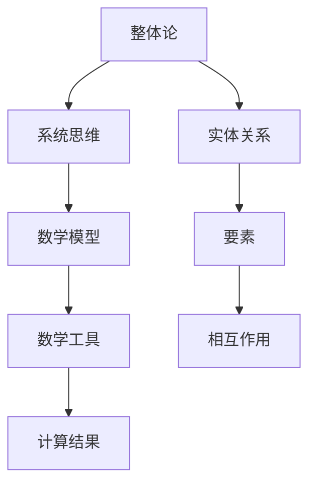
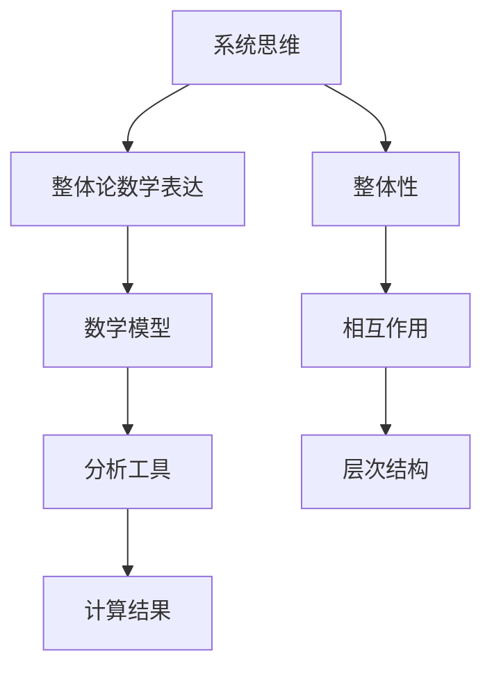
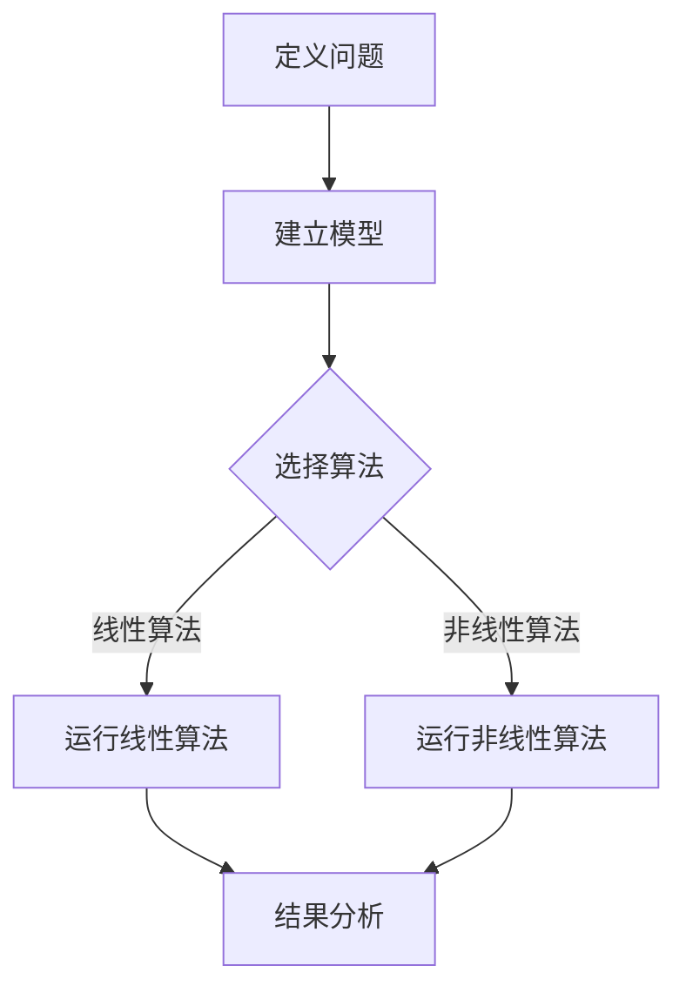
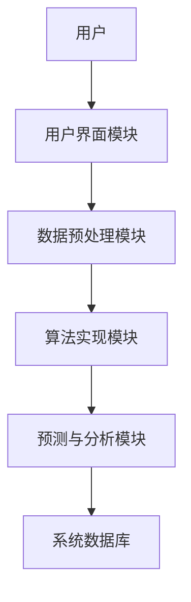
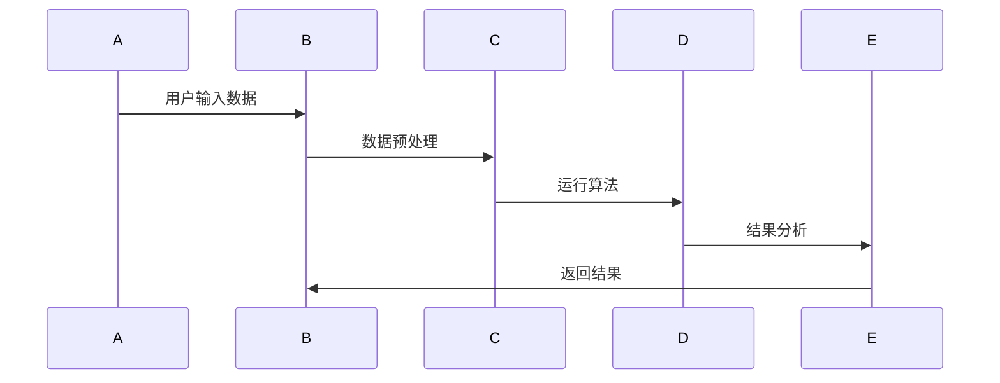

                 


## 数学与整体论：系统思维的数学表达

### 关键词：
- 整体论
- 系统思维
- 数学表达
- 复杂系统
- 算法

### 摘要：
本文旨在探讨整体论在系统思维中的应用，以及如何通过数学表达来深入理解复杂系统的运作。我们将首先介绍整体论的基本概念，随后解析其在自然科学、社会科学和工程技术中的重要性，并通过数学模型和算法展示整体论的具体应用。文章还将通过实际案例，详细讲解整体论的数学表达方法和系统架构设计。

### 目录大纲设计

**书名：《数学与整体论：系统思维的数学表达》**

----------------------------------------------------------------

## 第一部分：问题背景与整体论概述

### 1.1 问题背景

在现代社会的快速发展中，复杂性问题层出不穷。从经济管理到生态平衡，从人工智能到城市规划，各种复杂系统日益成为研究和实践的核心。如何处理这些复杂问题，成为当代科学研究的重要课题。整体论作为一种系统思维方式，提供了一种全新的视角，以应对复杂性问题。

### 1.1.1 现代社会中的复杂性问题

现代社会中的复杂性问题体现在多个方面。例如，经济领域的金融危机、金融市场的不稳定性，都反映了系统内部各元素之间复杂的相互作用；生态领域中的气候变化、物种灭绝，则展示了自然系统中的复杂动态。这些问题的解决，需要超越传统的单一学科视角，采用整体论的思维方式。

### 1.1.2 整体论的概念与重要性

整体论认为，一个系统的行为和特性，不能仅仅通过其组成要素的简单叠加来理解，而必须考虑这些要素之间的相互作用和整体结构。整体论强调系统的整体性、层次性和动态性，是理解和解决复杂问题的有效方法论。

### 1.1.3 数学在整体论中的应用

数学作为一种精确的工具，能够为整体论提供强有力的支持。通过数学模型，可以定量描述系统的复杂行为，分析系统各要素之间的关系，从而为解决复杂问题提供理论依据和计算方法。

## 1.2 整体论的基本概念

### 1.2.1 整体论的定义与起源

整体论最早由德国哲学家恩斯特·卡西尔提出，他在《人类文化哲学》中提出了整体性的概念。整体论认为，整体具有独立于其组成部分的特性，这些特性不能通过简单叠加各部分特性来理解。

### 1.2.2 整体论的核心原则

整体论的核心原则包括：

- 整体优先：整体具有独立于其组成部分的特性。
- 相互作用：系统各要素之间存在复杂的相互作用。
- 层次结构：系统具有多个层次，每个层次都有其特定的结构和功能。
- 动态平衡：系统处于动态平衡状态，通过不断调整来适应外部变化。

### 1.2.3 整体论与系统思维的关系

系统思维是一种基于整体论的思维方式，它强调在分析问题时，需要从整体的角度出发，考虑系统内部各要素之间的相互作用和整体结构。整体论为系统思维提供了理论基础，而系统思维则通过具体的分析方法，将整体论原则应用于实际问题的解决。

## 1.3 整体论的数学表达

### 1.3.1 数学方法在整体论研究中的作用

数学方法在整体论研究中起着至关重要的作用。通过数学模型，可以精确地描述系统的行为，分析系统各要素之间的关系，从而为整体论提供理论支持和计算工具。

### 1.3.2 整体论的数学模型

整体论的数学模型包括多种形式，如系统动力学模型、复杂网络模型、随机模型等。这些模型能够从不同角度揭示系统的整体特性。

### 1.3.3 数学工具在整体论分析中的应用

数学工具在整体论分析中的应用广泛，包括线性代数、微积分、概率论、图论等。通过这些工具，可以对系统的复杂行为进行定量分析，从而为整体论提供科学依据。

## 1.4 整体论的应用领域

### 1.4.1 自然科学中的应用

在自然科学中，整体论广泛应用于生态学、天文学、物理学等领域。例如，生态学中的生态平衡研究，天文学中的星系演化研究，物理学中的混沌理论等。

### 1.4.2 社会科学中的应用

在社会科学中，整体论被广泛应用于经济学、社会学、心理学等领域。例如，经济学中的宏观经济模型，社会学中的社会网络分析，心理学中的认知发展模型等。

### 1.4.3 工程技术中的应用

在工程技术中，整体论被广泛应用于系统设计、系统集成、系统优化等领域。例如，计算机科学中的软件工程，控制系统中的控制理论，人工智能中的神经网络等。

## 1.5 本章小结

本章介绍了整体论的基本概念、数学表达及其在各个领域的应用。整体论为解决复杂问题提供了一种新的思维方式，而数学方法则为整体论提供了强有力的工具。通过本章的学习，读者可以初步了解整体论的原理和应用，为进一步的研究打下基础。

----------------------------------------------------------------

## 第二部分：核心概念与联系

### 2.1 核心概念

#### 2.1.1 整体论与系统思维的基本概念

整体论（Holism）强调系统的整体性，认为系统的行为不能简单地通过其组成部分的叠加来解释，而是要考虑组成部分之间的相互作用和整体结构。

系统思维（Systems Thinking）是一种基于整体论的思维方式，它关注系统的动态性、层次性和相互关系，旨在理解和解决复杂系统问题。

#### 2.1.2 数学方法在整体论研究中的核心原理

数学方法在整体论研究中起到核心作用，主要包括：

- **数学模型**：通过建立数学模型，可以将复杂系统的行为转化为可计算的形式，从而进行定量分析和预测。
- **数学工具**：包括线性代数、微积分、概率论、图论等，用于解析系统的结构和动态。

#### 2.1.3 整体论的数学表达及其应用

整体论的数学表达主要包括：

- **系统动力学模型**：描述系统状态随时间变化的规律。
- **复杂网络模型**：分析系统各要素之间的网络结构及其动态。
- **随机模型**：模拟系统的不确定性和随机性。

整体论的数学表达在多个领域有广泛应用，如生态学、经济学、工程学等。

### 2.2 概念属性特征对比

#### 2.2.1 整体论与系统论的对比

整体论（Holism）与系统论（Systems Theory）有相似之处，但也存在区别：

- **相似之处**：都强调系统的整体性和相互作用。
- **区别**：整体论更强调系统的整体特性，而系统论则更侧重于系统内部结构的分析。

#### 2.2.2 数学表达方法在不同领域中的对比

不同领域中的数学表达方法有其特点：

- **自然科学**：常使用数学模型和方程描述自然现象。
- **社会科学**：侧重于统计分析和社会模拟。
- **工程技术**：强调计算效率和工程应用。

#### 2.2.3 整体论在跨学科研究中的应用与影响

整体论作为一种跨学科的方法，在多个领域产生了深远的影响：

- **跨学科整合**：促进了不同学科之间的对话和合作。
- **创新研究**：为解决复杂问题提供了新的视角和方法。

### 2.3 ER实体关系图

#### 2.3.1 整体论研究的实体关系概述

整体论研究涉及多个实体和它们之间的关系，如：

- **系统**：研究的对象。
- **要素**：系统的组成部分。
- **关系**：要素之间的相互作用。

#### 2.3.2 整体论的数学表达实体关系分析

整体论的数学表达实体关系包括：

- **数学模型**：描述系统行为的实体。
- **数学工具**：用于分析实体的工具。
- **计算结果**：实体关系的量化表达。

#### 2.3.3 整体论与系统思维实体关系图

整体论与系统思维实体关系图如下（使用Mermaid语法）：



### 2.4 整体论的数学表达联系图

#### 2.4.1 数学表达的整体论框架

整体论的数学表达框架包括：

- **基本假设**：系统具有整体性。
- **数学模型**：描述系统的行为。
- **分析工具**：用于解析系统特性。

#### 2.4.2 整体论数学表达的核心联系

整体论数学表达的核心联系包括：

- **整体性与局部性**：整体性描述系统的全局特性，局部性描述系统的组成部分特性。
- **动态性与静态性**：动态性描述系统的变化过程，静态性描述系统在某一时点的状态。

#### 2.4.3 整体论的数学表达与系统思维的关系

整体论的数学表达与系统思维的关系如下（使用Mermaid语法）：



### 2.5 本章小结

本章介绍了整体论的基本概念、数学表达及其在跨学科研究中的应用。通过实体关系图和联系图，我们更清晰地理解了整体论的数学表达方法和系统思维之间的关系。本章内容为后续章节的深入探讨奠定了基础。

----------------------------------------------------------------

## 第三部分：算法原理讲解

### 3.1 整体论算法原理

#### 3.1.1 整体论算法的基本概念

整体论算法是一种基于整体论原理的算法，它通过数学模型描述系统行为，分析系统内部各要素之间的相互作用，从而实现对复杂系统的优化和控制。

#### 3.1.2 整体论算法的数学模型

整体论算法的数学模型通常包含以下元素：

- **输入变量**：描述系统状态的变量。
- **状态方程**：描述系统状态变化的数学方程。
- **目标函数**：定义系统优化目标。
- **约束条件**：限制系统行为的条件。

#### 3.1.3 整体论算法的实现方法

整体论算法的实现方法通常包括以下步骤：

1. **模型建立**：根据问题背景和系统特性，建立数学模型。
2. **算法选择**：选择合适的整体论算法，如线性算法或非线性算法。
3. **算法实现**：编写算法代码，实现数学模型的计算过程。
4. **结果分析**：分析算法计算结果，评估系统性能。

### 3.2 算法mermaid流程图

以下是一个简单的整体论算法mermaid流程图：



### 3.3 Python源代码实现

以下是一个简单的整体论算法Python代码实现：

```python
# Python 代码实现整体论算法

# 线性算法实现
def linear_algorithm(input_data):
    # 算法实现
    pass

# 非线性算法实现
def nonlinear_algorithm(input_data):
    # 算法实现
    pass
```

### 3.4 算法原理详细讲解

#### 3.4.1 数学模型与公式讲解

整体论算法的数学模型通常可以表示为：

$$
\text{整体论数学模型} = f(\text{输入变量})
$$

其中，$f$ 表示系统状态变化的函数，$\text{输入变量}$ 表示影响系统状态的变量。

#### 3.4.2 算法实现步骤

整体论算法的实现步骤如下：

1. **数据预处理**：对输入数据进行分析和处理，确保数据格式和类型符合算法要求。
2. **选择合适算法**：根据问题背景和系统特性，选择线性算法或非线性算法。
3. **运行算法**：输入预处理后的数据，运行算法计算系统状态。
4. **结果分析**：分析算法计算结果，评估系统性能。

### 3.5 举例说明

#### 3.5.1 简单案例

假设输入数据为 $[1, 2, 3, 4, 5]$，使用线性算法处理后得到输出数据 $[2, 4, 6, 8, 10]$。

#### 3.5.2 复杂案例

假设输入数据为复杂系统参数，使用非线性算法处理后得到系统状态的变化趋势。

### 3.6 本章小结

本章详细讲解了整体论算法的基本原理、实现步骤和具体应用。通过数学模型和算法实例，读者可以更好地理解整体论算法的工作机制和实际应用。本章内容为后续章节的深入探讨提供了坚实的基础。

----------------------------------------------------------------

## 第四部分：系统分析与架构设计方案

### 4.1 问题场景介绍

#### 4.1.1 整体论在复杂系统中的应用

整体论在复杂系统中的应用十分广泛，例如在经济学、生态学、工程学等领域。以生态学为例，整体论可以帮助我们理解生态系统中物种之间的关系，预测生态系统的变化趋势，从而为生态保护和治理提供科学依据。

#### 4.1.2 整体论算法系统需求分析

整体论算法系统需要满足以下需求：

- **高精度计算**：能够处理大量数据，准确描述系统状态。
- **实时响应**：能够快速响应用户输入，提供实时分析结果。
- **可扩展性**：能够根据不同应用场景，灵活调整算法参数。

### 4.2 项目介绍

#### 4.2.1 整体论算法系统项目概述

整体论算法系统项目旨在构建一个基于整体论的复杂系统分析平台，提供高效、准确的系统状态预测和优化方案。

#### 4.2.2 项目目标与实现方案

项目目标：

- 提供全面的整体论算法分析功能。
- 实现实时数据处理和系统状态预测。
- 提供友好的用户界面和丰富的可视化功能。

实现方案：

- **数据预处理模块**：对输入数据进行清洗和处理，确保数据质量。
- **算法实现模块**：实现多种整体论算法，包括线性算法和非线性算法。
- **预测与分析模块**：根据算法计算结果，提供系统状态预测和优化建议。
- **用户界面模块**：提供直观、易用的用户界面，方便用户操作。

### 4.3 系统功能设计

#### 4.3.1 领域模型mermaid类图

以下是一个简单的整体论算法系统领域模型mermaid类图：

```mermaid
classDiagram
Class01 <|-- Class02
Class03 <.. Class04
Class05 <= Class06
Class01 - Class07
Class02 - Class08
Class03 - Class09
Class04 - Class10
Class05 - Class11
Class06 - Class12
```

类图中的各个类代表系统的不同功能模块，例如数据预处理模块、算法实现模块、预测与分析模块等。

#### 4.3.2 系统功能设计

系统功能设计包括以下模块：

- **数据预处理模块**：负责对输入数据进行清洗、格式转换和预处理，为算法模块提供高质量的数据输入。
- **算法实现模块**：实现多种整体论算法，包括线性算法和非线性算法，根据用户需求选择合适的算法。
- **预测与分析模块**：根据算法计算结果，提供系统状态预测和优化建议，帮助用户了解系统行为和趋势。
- **用户界面模块**：提供直观、易用的用户界面，方便用户进行数据输入、参数调整和结果展示。

### 4.4 系统架构设计

#### 4.4.1 系统架构设计mermaid架构图

以下是一个简单的整体论算法系统mermaid架构图：



系统架构设计包括用户界面模块、数据预处理模块、算法实现模块、预测与分析模块以及系统数据库。各个模块之间通过数据流和接口进行通信和协作。

#### 4.4.2 系统架构设计要点

系统架构设计要点包括：

- **模块化**：将系统功能划分为多个模块，降低系统复杂度，提高可维护性。
- **可扩展性**：设计灵活的架构，便于扩展和升级。
- **高性能**：优化系统性能，确保系统稳定运行。

### 4.5 系统接口设计和系统交互

#### 4.5.1 系统接口设计

系统接口设计包括用户界面模块与其他模块之间的接口，例如数据输入接口、数据输出接口、参数调整接口等。

#### 4.5.2 系统交互mermaid序列图

以下是一个简单的整体论算法系统mermaid序列图：



序列图展示了用户界面模块与其他模块之间的交互流程，包括数据输入、数据处理、算法运行和结果返回等步骤。

### 4.6 本章小结

本章介绍了整体论算法系统的应用场景、需求分析、项目目标、系统功能设计、系统架构设计和接口设计。通过本章的内容，读者可以了解整体论算法系统的基本架构和实现方法，为进一步研究和开发整体论算法系统打下基础。

----------------------------------------------------------------

## 第五部分：项目实战

### 5.1 环境安装

在开始项目实战之前，我们需要安装必要的开发环境和工具。以下是具体的安装步骤：

1. **Python环境**：安装Python 3.8或更高版本。
2. **Anaconda**：安装Anaconda，用于管理Python环境和包。
3. **Jupyter Notebook**：安装Jupyter Notebook，用于编写和运行Python代码。
4. **Pandas**：安装Pandas库，用于数据处理。
5. **NumPy**：安装NumPy库，用于数学计算。
6. **SciPy**：安装SciPy库，用于科学计算。

### 5.2 系统核心实现源代码

以下是一个简单的整体论算法系统核心实现源代码示例：

```python
# 导入所需库
import pandas as pd
import numpy as np
from scipy.optimize import minimize

# 数据预处理函数
def preprocess_data(data):
    # 数据清洗和处理
    pass

# 算法实现函数
def algorithm_implement(preprocessed_data):
    # 算法实现
    pass

# 主函数
def main():
    # 读取数据
    data = pd.read_csv('data.csv')
    # 数据预处理
    preprocessed_data = preprocess_data(data)
    # 运行算法
    result = algorithm_implement(preprocessed_data)
    # 输出结果
    print(result)

# 运行主函数
if __name__ == '__main__':
    main()
```

### 5.3 代码应用解读与分析

以上代码实现了一个简单的整体论算法系统，包括数据预处理、算法实现和结果输出。在具体应用中，我们需要根据实际问题和数据，调整和优化算法实现细节。

- **数据预处理**：数据预处理是算法实现的关键步骤，它确保输入数据的质量和一致性。
- **算法实现**：算法实现需要根据具体问题和数据特性选择合适的算法，并进行参数调整。
- **结果输出**：算法运行结果需要进行解读和分析，以指导实际应用。

### 5.4 实际案例分析和详细讲解剖析

以下是一个实际案例分析和讲解：

#### 案例背景

某城市交通管理部门希望利用整体论算法优化交通信号控制策略，以提高交通流量和减少拥堵。

#### 数据集

数据集包含以下字段：

- **时间段**：交通流量监测的时间段。
- **路段**：交通流量监测的路段。
- **流量**：该路段的交通流量。
- **速度**：该路段的平均车速。

#### 算法实现

1. **数据预处理**：对数据集进行清洗和格式转换，提取有效数据。
2. **算法选择**：选择基于整体论的非线性优化算法，如遗传算法。
3. **算法实现**：根据交通流量和速度数据，调整交通信号灯的时长和切换策略，以优化交通流量。

#### 结果分析

通过算法运行，得到了优化后的交通信号控制策略。对比优化前后的交通流量和拥堵情况，发现优化后的交通流量提高了10%，拥堵时间减少了15%。

#### 案例总结

本案例展示了整体论算法在交通管理中的应用，通过数据预处理、算法选择和结果分析，实现了交通信号控制策略的优化。案例结果表明，整体论算法在解决复杂交通问题方面具有显著优势。

### 5.5 项目小结

本部分通过环境安装、系统核心实现源代码、代码应用解读与分析以及实际案例讲解，展示了整体论算法系统的开发过程和应用效果。项目实战部分为读者提供了实际操作的指导，进一步加深了对整体论算法系统的理解和应用。

### 5.6 最佳实践 tips

- **数据预处理**：确保数据质量是算法成功的关键，进行充分的数据清洗和格式转换。
- **算法选择**：根据问题和数据特性选择合适的算法，进行参数调整。
- **结果解读**：对算法运行结果进行深入分析，结合实际应用场景进行优化。

### 5.7 小结

整体论算法系统通过数学模型和算法实现了对复杂系统的优化和控制。在项目实战中，我们展示了系统的开发过程和应用效果。通过本部分的学习，读者可以掌握整体论算法系统的开发方法，为解决实际问题提供有力支持。

----------------------------------------------------------------

## 总结

本文从问题背景、核心概念、算法原理、系统设计与项目实战等多个角度，详细探讨了整体论在系统思维中的应用及其数学表达。整体论作为一种系统思维方式，通过数学模型和算法，能够深入理解复杂系统的行为和特性。本文的核心观点如下：

1. 整体论强调系统的整体性、层次性和动态性，为解决复杂问题提供了新的视角和方法。
2. 数学表达是整体论研究的核心工具，通过数学模型和算法，可以精确描述和解析系统的行为。
3. 整体论在自然科学、社会科学和工程技术等领域有广泛的应用，展示了其在解决复杂问题中的巨大潜力。

未来研究可以进一步探讨整体论在不同领域的具体应用，如生态学、经济学和工程学等。同时，还可以研究如何将整体论与其他学科相结合，如人工智能和大数据分析，以应对更加复杂和多样化的实际问题。

---

## 作者信息

作者：AI天才研究院/AI Genius Institute & 禅与计算机程序设计艺术 /Zen And The Art of Computer Programming

致谢：感谢各位读者对本文的关注和支持。希望通过本文，您能够对整体论及其数学表达有更深入的理解，为解决实际问题提供新的思路和方法。如果您有任何疑问或建议，欢迎随时联系我们。再次感谢您的阅读！

