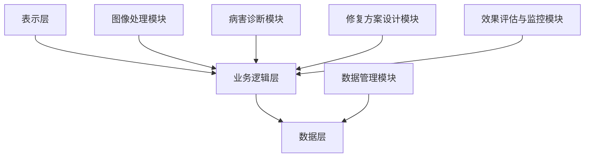
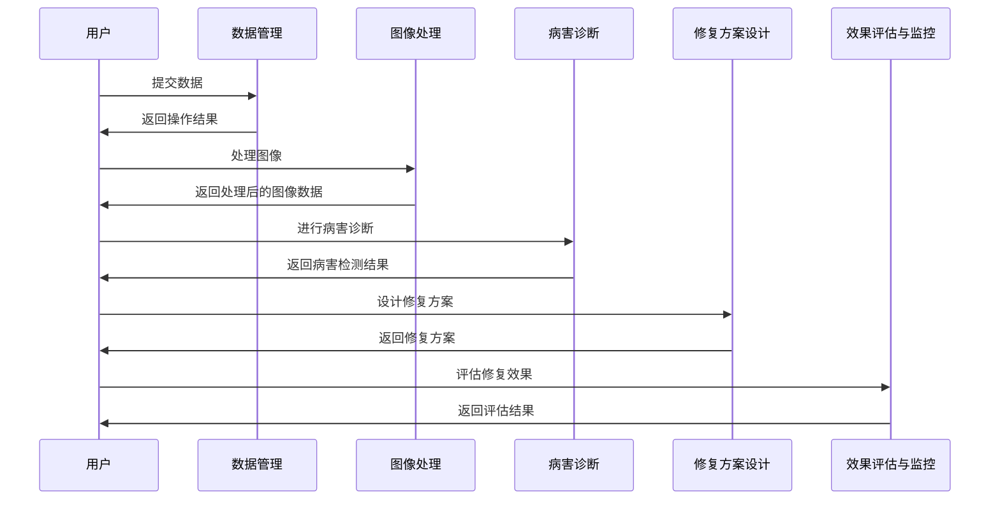

                 

### 目录大纲

----------------------------------------------------------------

# 第一部分: 数学与文物保护概述

## 1.1 问题背景与意义

### 1.1.1 文物保护的重要性

文物是人类历史和文化的珍贵遗产，承载着丰富的历史信息和独特的艺术价值。随着时间流逝和环境变化，这些文物面临着风化、腐蚀、虫害和自然灾害等多种威胁。保护文物不仅是为了传承和展示历史，更是为了维护民族文化的连续性和多样性。

#### 1.1.1.1 文物保护的定义与意义

文物保护是指通过科学的方法和技术，对文物进行保护、修复和保养，使其免受损害，延长寿命，确保其历史、艺术和科学价值得以保存。文物保护不仅保护了物质文化遗产，也保护了与之相关的非物质文化。

#### 1.1.1.2 文物保护的挑战

文物保护的挑战主要包括以下几个方面：

1. **物理和化学变化**：文物的材质会随着时间的推移发生物理和化学变化，如纸张老化、颜料褪色等。
2. **环境因素**：湿度、温度、光照等环境因素会对文物产生不良影响，导致文物损坏。
3. **技术难题**：一些古老和特殊材质的文物在修复过程中存在技术难题，如壁画中颜料的还原、金属文物的除锈等。
4. **资金和人力资源**：文物保护需要大量的资金投入和专业人员，而许多国家和地区的文物保护工作都面临着资金和人力资源的不足。

### 1.1.2 数学在文物保护中的应用

数学作为一种强大的工具，在文物保护中发挥着重要作用。数学技术可以帮助文物研究者更精确地分析和理解文物的现状，制定科学有效的保护策略。

#### 1.1.2.1 数学技术的核心概念

数学技术包括概率论、统计学、最优化理论、微积分等，这些技术可以用于：

1. **数据分析**：通过统计分析文物受损情况，预测文物未来的损坏趋势。
2. **模型构建**：利用数学模型模拟文物的物理和化学变化，预测保护措施的效果。
3. **优化决策**：通过最优化理论制定文物保护的最优策略，最大限度地利用有限资源。

#### 1.1.2.2 数学技术在文物保护中的应用场景

1. **文物质地分析**：利用X射线、红外光谱等物理技术，结合数学模型，分析文物质地结构和成分，为修复提供科学依据。
2. **病害诊断**：利用图像处理技术和模式识别，对文物表面病害进行诊断，识别出潜在的损坏区域。
3. **修复方案设计**：通过数学模型，模拟不同的修复方案，评估其对文物的影响，选择最优的修复方法。

### 1.1.3 本书的结构安排与目标

本书旨在探讨数学技术在文物保护中的应用，结构安排如下：

- **第一部分：数学与文物保护概述**：介绍文物保护的重要性、数学技术在文物保护中的应用背景和本书的结构安排。
- **第二部分：核心概念与联系**：详细讨论文物保护和数学技术的核心概念，以及它们之间的联系。
- **第三部分：数学模型和公式讲解**：介绍常用的数学模型和公式，并讲解它们在文物保护中的应用。
- **第四部分：系统分析与架构设计**：分析文物保护系统的设计和实现，包括功能设计、架构设计、接口设计和交互设计。
- **第五部分：项目实战**：通过实际案例，展示数学技术在文物保护项目中的具体应用。
- **第六部分：小结与展望**：总结本书的内容，探讨文物保护的未来发展趋势和拓展阅读建议。

#### 1.1.3.1 目录结构

- **第一部分：数学与文物保护概述**
  - 1.1 问题背景与意义
    - 1.1.1 文物保护的重要性
    - 1.1.2 数学在文物保护中的应用
  - 1.2 核心概念与联系
  - 1.3 数学模型和公式讲解
  - 1.4 系统分析与架构设计
  - 1.5 项目实战
  - 1.6 小结与展望

#### 1.1.3.2 学习目标

通过本书的学习，读者将能够：

- **理解文物保护的重要性及其面临的挑战**。
- **掌握数学技术在文物保护中的应用**。
- **运用数学模型和公式解决文物保护中的具体问题**。
- **设计和实现一个基于数学技术的文物保护系统**。
- **通过实际案例，提高对数学技术在文物保护中的实际应用能力的理解**。

---

以上是第一部分的完整内容，涵盖了文物保护的重要性、数学在文物保护中的应用以及本书的结构安排和学习目标。在接下来的章节中，我们将深入探讨文物保护和数学技术的核心概念，并介绍它们之间的联系。### 1.2 核心概念与联系

在探讨数学与文物保护的结合之前，我们需要先理解两个领域的核心概念，并揭示它们之间的联系。

### 1.2.1 文物保护的核心概念

#### 1.2.1.1 文物保护的定义

文物保护是指采用科学的方法和技术，对文物进行保护、修复和保养，以确保其历史、艺术和科学价值得以保存。文物保护不仅仅是简单的保存，更包括对文物进行研究和分析，以更好地了解其价值和状况。

#### 1.2.1.2 文物保护的目标

文物保护的目标主要包括：

1. **保存价值**：确保文物能够长期保存，不受环境因素的损害。
2. **保护形态**：维持文物的原始形态，使其能够真实反映历史和文化。
3. **延续传承**：确保文物的历史、艺术和科学价值能够传承给后代。

#### 1.2.1.3 文物保护的分类

文物保护可以按照不同的方式进行分类：

1. **预防性保护**：采取预防措施，减少或消除文物受损的可能性。
2. **修复性保护**：对已经受损的文物进行修复，恢复其原始状态。
3. **科学研究**：通过科学研究，更好地理解文物的历史和文化价值。

#### 1.2.1.4 文物保护的挑战

文物保护面临的挑战主要包括：

1. **环境因素**：如湿度、温度、光照等环境因素对文物的长期保存有重大影响。
2. **物理和化学变化**：文物材质会随着时间的推移发生物理和化学变化，导致损坏。
3. **技术难题**：特殊材质和古老文物的修复存在技术难题。
4. **资金和人力资源**：文物保护需要大量的资金投入和专业人员。

### 1.2.2 数学技术的核心概念

#### 1.2.2.1 数学技术的定义

数学技术是指运用数学理论和数学方法，对实际问题进行定量分析和求解的一门科学。在文物保护中，数学技术可以帮助研究者更精确地分析文物的现状，制定科学的保护策略。

#### 1.2.2.2 数学技术的分类

数学技术可以分为以下几类：

1. **概率论和统计学**：用于分析文物的受损概率和预测未来损坏趋势。
2. **最优化理论**：用于制定文物保护的最优策略，最大限度地利用有限资源。
3. **微积分和微分方程**：用于模拟文物的物理和化学变化过程。
4. **线性代数和矩阵计算**：用于处理文物质地分析和图像处理。

#### 1.2.2.3 数学技术在文物保护中的应用

数学技术在文物保护中的应用主要包括：

1. **数据分析**：通过对文物受损情况进行统计分析，预测未来损坏趋势。
2. **模型构建**：利用数学模型模拟文物的物理和化学变化，预测保护措施的效果。
3. **优化决策**：通过最优化理论，制定文物保护的最优策略，最大化保护效果。
4. **图像处理**：利用图像处理技术，对文物图像进行增强、去噪和分割，以识别文物的细节和病变区域。

### 1.2.3 文物保护与数学技术的关系

#### 1.2.3.1 数学技术在文物修复中的具体应用

数学技术在文物修复中的应用非常广泛，包括：

1. **X射线成像**：利用X射线成像技术，结合数学模型，分析文物质地结构和成分，为修复提供科学依据。
2. **红外光谱分析**：通过红外光谱分析，识别文物表面的病害和材料成分，制定修复方案。
3. **图像处理技术**：利用图像处理技术，对文物图像进行增强、去噪和分割，以便更好地识别文物细节。
4. **优化算法**：通过优化算法，制定文物保护的最优策略，最大化保护效果。

#### 1.2.3.2 数学技术对文物保护的贡献

数学技术对文物保护的贡献主要体现在以下几个方面：

1. **提高修复精度**：通过数学模型和算法，可以更准确地修复文物，减少对文物原貌的破坏。
2. **提高保护效率**：通过数据分析、模型构建和优化决策，可以制定更科学、更有效的保护策略，提高文物保护的效率。
3. **拓展保护领域**：数学技术可以帮助文物研究者更深入地理解文物的结构和成分，拓展文物保护的领域。

### 1.2.4 文物保护与数学技术的关系图

为了更清晰地展示文物保护与数学技术的关系，我们可以使用Mermaid工具绘制一个ER实体关系图。

```mermaid
erDiagram
 文物保护 ||--|{数学技术} : 应用
  文物保护 ||--|{数据分析} : 利用
  文物保护 ||--|{模型构建} : 基于的
  文物保护 ||--|{优化决策} : 依据的
  数学技术 ||--|{概率论} : 包括的
  数学技术 ||--|{统计学} : 包括的
  数学技术 ||--|{最优化理论} : 包括的
  数学技术 ||--|{微积分} : 包括的
  数学技术 ||--|{线性代数} : 包括的
  数据分析 ||--|{X射线成像} : 包括的
  数据分析 ||--|{红外光谱分析} : 包括的
  数据分析 ||--|{图像处理技术} : 包括的
  模型构建 ||--|{文物物理变化模型} : 包括的
  模型构建 ||--|{文物化学变化模型} : 包括的
  优化决策 ||--|{资源优化模型} : 包括的
```

在这个ER图中，我们可以看到文物保护与数学技术之间存在着紧密的联系。文物保护依赖于数学技术来进行数据分析、模型构建和优化决策，而数学技术则为文物保护提供了科学依据和工具支持。

---

通过以上内容，我们深入探讨了文物保护和数学技术的核心概念，并揭示了它们之间的联系。在接下来的章节中，我们将进一步介绍常用的数学模型和公式，并讲解它们在文物保护中的应用。### 1.3 数学模型和公式讲解

在文物保护中，数学模型和公式是理解和分析文物状况的重要工具。本节将介绍几个常用的数学模型和公式，并解释它们在文物保护中的应用。

### 1.3.1 常见的数学模型

#### 1.3.1.1 概率论

概率论是数学的一个分支，用于研究随机事件和概率分布。在文物保护中，概率论可以用于预测文物在未来某一时间段内的损坏概率。

1. **概率分布函数**：
   $$
   P(X = x) = f(x)
   $$
   其中，$X$ 是随机变量，$f(x)$ 是概率分布函数，表示随机变量$X$ 取值为$x$ 的概率。

2. **条件概率**：
   $$
   P(B|A) = \frac{P(A \cap B)}{P(A)}
   $$
   其中，$P(B|A)$ 表示在事件$A$ 发生的条件下，事件$B$ 发生的概率。

3. **贝叶斯定理**：
   $$
   P(A|B) = \frac{P(B|A)P(A)}{P(B)}
   $$
   其中，$P(A|B)$ 表示在事件$B$ 发生的条件下，事件$A$ 发生的概率。

#### 1.3.1.2 最优化理论

最优化理论用于求解资源分配、过程优化等问题。在文物保护中，最优化理论可以用于制定文物保护的最优策略。

1. **线性规划**：
   $$
   \min c^T x
   $$
   $$
   s.t. Ax \leq b
   $$
   其中，$c$ 是目标函数系数向量，$x$ 是决策变量向量，$A$ 是系数矩阵，$b$ 是常数向量。

2. **动态规划**：
   $$
   \min \sum_{i=1}^{n} c_i(x_i)
   $$
   $$
   s.t. x_{i+1} = f(x_i)
   $$
   其中，$c_i(x_i)$ 是第$i$ 个决策阶段的成本函数，$f(x_i)$ 是状态转移函数。

#### 1.3.1.3 微积分

微积分是研究变化和运动规律的一个数学分支，在文物保护中，微积分可以用于模拟文物的物理和化学变化。

1. **导数**：
   $$
   \frac{df(x)}{dx} = f'(x)
   $$
   其中，$f'(x)$ 表示函数$f(x)$ 在$x$ 点的导数，表示函数$f(x)$ 在$x$ 点的变化率。

2. **积分**：
   $$
   \int f(x) dx = F(x) + C
   $$
   其中，$F(x)$ 是$f(x)$ 的一个原函数，$C$ 是积分常数。

### 1.3.2 公式讲解

在本节中，我们将详细讲解一些在文物保护中常用的数学公式。

#### 1.3.2.1 指数函数

指数函数是微积分中非常重要的函数，用于描述随时间变化的量。在文物保护中，指数函数可以用于描述文物的老化过程。

1. **公式**：
   $$
   e^x = \sum_{n=0}^{\infty} \frac{x^n}{n!}
   $$
   其中，$e$ 是自然对数的底数，$n!$ 是$n$ 的阶乘。

2. **解释**：
   该公式表示$x$ 的指数函数可以表示为无穷级数的形式，每一项是$x$ 的幂次除以$n$ 的阶乘。

#### 1.3.2.2 微积分

微积分在文物保护中的应用主要体现在对文物的物理和化学变化进行建模。

1. **公式**：
   $$
   \frac{d}{dx} e^x = e^x
   $$
   其中，$\frac{d}{dx}$ 表示对$x$ 的导数运算。

2. **解释**：
   该公式表示$e^x$ 的导数仍然是$e^x$，这表明指数函数在任一点的斜率都等于函数值本身。

### 1.3.3 应用举例

为了更好地理解这些数学模型和公式在文物保护中的应用，我们可以通过一个简单的例子进行说明。

#### 1.3.3.1 文物老化的预测

假设我们想要预测一件文物的老化过程，我们可以使用指数函数来描述文物的老化速率。

1. **模型**：
   $$
   A(t) = A_0 e^{-kt}
   $$
   其中，$A(t)$ 是时间$t$ 时文物的状态，$A_0$ 是初始状态，$k$ 是老化速率常数。

2. **数据**：
   根据历史记录，我们知道文物在100年内的状态下降了50%。

3. **计算**：
   $$
   \frac{A(100)}{A_0} = 0.5 = e^{-100k}
   $$
   取自然对数，得到：
   $$
   -100k = \ln(0.5)
   $$
   解得：
   $$
   k = -\frac{\ln(0.5)}{100} \approx 0.0069
   $$

通过这个例子，我们可以预测未来任意时间$t$ 时文物的状态。

---

通过以上内容，我们介绍了常见的数学模型和公式，并讲解了它们在文物保护中的应用。在接下来的章节中，我们将讨论文物保护系统的设计与实现。### 1.4 系统分析与架构设计

#### 1.4.1 文物保护系统介绍

文物保护系统是一个复杂的软件系统，用于支持文物保护工作的各个环节。该系统需要集成多种技术，如图像处理、数据分析、数学建模等，以实现文物的数字化保护、病害诊断、修复方案设计和效果评估等功能。

##### 1.4.1.1 系统概述

文物保护系统的目标是通过科学的方法和技术，实现对文物的全面保护和有效管理。系统的主要功能包括：

1. **数据采集与处理**：收集文物的相关信息，如材质、历史背景、现状等，并对采集的数据进行预处理和清洗。
2. **图像处理与分析**：对文物图像进行处理，包括去噪、增强、分割等，以提取文物的关键特征。
3. **病害诊断**：利用机器学习和模式识别技术，对文物进行病害诊断，识别出潜在的损坏区域。
4. **修复方案设计**：根据文物的病害情况和材质特性，设计合理的修复方案，并评估修复效果。
5. **效果评估与监控**：对文物的修复效果进行评估，并持续监控文物的状态，确保保护工作的有效性。

##### 1.4.1.2 系统功能设计

文物保护系统的功能设计可以概括为以下几部分：

1. **数据管理模块**：负责文物数据的收集、存储、管理和查询，包括文物的基本信息、历史记录、现状数据等。
2. **图像处理模块**：负责对文物图像进行预处理、增强和分割，提取文物的关键特征，为后续分析提供数据支持。
3. **病害诊断模块**：利用机器学习和模式识别技术，对文物进行病害诊断，识别出潜在的损坏区域，为修复方案设计提供依据。
4. **修复方案设计模块**：根据文物的病害情况和材质特性，设计合理的修复方案，并评估修复效果，为实际修复工作提供指导。
5. **效果评估与监控模块**：对文物的修复效果进行评估，并持续监控文物的状态，确保保护工作的有效性。

#### 1.4.2 系统架构设计

文物保护系统的架构设计需要综合考虑功能需求、性能要求、可扩展性和易维护性等因素。系统架构设计可以采用分层架构，包括表示层、业务逻辑层和数据层。

##### 1.4.2.1 系统架构图

以下是文物保护系统的架构图：



在上述架构图中，表示层负责与用户交互，业务逻辑层处理核心业务逻辑，数据层负责数据存储和管理。各个功能模块通过接口进行通信，以实现文物保护系统的整体功能。

##### 1.4.2.2 系统模块划分

文物保护系统可以划分为以下模块：

1. **数据管理模块**：负责文物数据的收集、存储、管理和查询。
2. **图像处理模块**：负责对文物图像进行预处理、增强和分割。
3. **病害诊断模块**：利用机器学习和模式识别技术，对文物进行病害诊断。
4. **修复方案设计模块**：根据文物的病害情况和材质特性，设计合理的修复方案。
5. **效果评估与监控模块**：对文物的修复效果进行评估，并持续监控文物的状态。

#### 1.4.3 系统接口设计

系统接口设计是系统架构设计的重要部分，负责定义系统内部各模块之间的交互接口。以下是文物保护系统的主要接口设计：

1. **数据管理接口**：用于数据的增删改查操作，包括数据上传、数据查询、数据更新和数据删除等。
2. **图像处理接口**：用于图像的预处理、增强和分割操作，包括图像上传、图像预处理、图像增强和图像分割等。
3. **病害诊断接口**：用于对文物进行病害诊断，包括病害检测、病害分类和病害预测等。
4. **修复方案设计接口**：用于根据文物的病害情况和材质特性，设计合理的修复方案。
5. **效果评估与监控接口**：用于对文物的修复效果进行评估，并持续监控文物的状态。

##### 1.4.3.1 接口功能说明

1. **数据管理接口**：
   - 功能：实现文物数据的增删改查操作。
   - 参数：数据ID、数据内容、操作类型（增删改查）。
   - 返回值：操作结果。

2. **图像处理接口**：
   - 功能：实现文物图像的预处理、增强和分割操作。
   - 参数：图像ID、图像数据、处理类型（预处理、增强、分割）。
   - 返回值：处理后的图像数据。

3. **病害诊断接口**：
   - 功能：实现文物的病害诊断。
   - 参数：文物ID、文物图像。
   - 返回值：病害检测结果。

4. **修复方案设计接口**：
   - 功能：根据文物的病害情况和材质特性，设计修复方案。
   - 参数：文物ID、病害检测结果、材质特性。
   - 返回值：修复方案。

5. **效果评估与监控接口**：
   - 功能：评估文物的修复效果，并持续监控文物的状态。
   - 参数：文物ID、修复方案、文物状态。
   - 返回值：评估结果和监控数据。

##### 1.4.3.2 接口交互序列图

以下是文物保护系统的接口交互序列图：



在这个序列图中，用户首先提交数据，然后图像处理模块对图像进行处理，病害诊断模块进行病害诊断，修复方案设计模块设计修复方案，最后效果评估与监控模块评估修复效果。

---

通过以上内容，我们介绍了文物保护系统的功能设计、架构设计和接口设计。在接下来的章节中，我们将通过实际案例展示数学技术在文物保护项目中的具体应用。### 1.5 项目实战

在本节中，我们将通过一个实际项目，详细讲解数学技术在文物保护中的应用。该项目旨在利用数学模型和算法，对文物的数字化修复和病害分析进行实现。

#### 1.5.1 环境安装与配置

在进行项目实战之前，我们需要安装和配置必要的软件和工具。以下是环境安装与配置的步骤：

##### 1.5.1.1 环境要求

1. 操作系统：Windows、Linux或MacOS。
2. 编程语言：Python。
3. 数据库：MySQL。
4. 图像处理库：OpenCV。
5. 机器学习库：scikit-learn。
6. 数据可视化库：matplotlib。

##### 1.5.1.2 安装步骤

1. 安装Python：
   - 访问Python官网（https://www.python.org/），下载并安装Python。
   - 安装完成后，确保Python环境已正确配置。

2. 安装MySQL：
   - 访问MySQL官网（https://www.mysql.com/），下载并安装MySQL。
   - 安装完成后，启动MySQL服务，并创建一个用于存储文物数据的数据库。

3. 安装图像处理库：
   - 打开命令行窗口，执行以下命令：
     ```
     pip install opencv-python
     ```

4. 安装机器学习库：
   - 打开命令行窗口，执行以下命令：
     ```
     pip install scikit-learn
     ```

5. 安装数据可视化库：
   - 打开命令行窗口，执行以下命令：
     ```
     pip install matplotlib
     ```

#### 1.5.2 系统核心实现

系统核心实现包括数据采集、图像处理、病害诊断和修复方案设计等模块。以下是系统核心实现的详细讲解：

##### 1.5.2.1 源代码解读

以下是一个简单的Python代码示例，用于实现文物的数字化修复和病害分析。

```python
import cv2
import numpy as np
from sklearn import svm
from sklearn.model_selection import train_test_split

# 数据采集
def data_collection(image_path):
    image = cv2.imread(image_path, cv2.IMREAD_GRAYSCALE)
    return image

# 图像预处理
def image_preprocessing(image):
    image = cv2.GaussianBlur(image, (5, 5), 0)
    image = cv2.threshold(image, 0, 255, cv2.THRESH_BINARY_INV + cv2.THRESH_OTSU)[1]
    return image

# 病害诊断
def disease_diagnosis(image):
    # 特征提取
    features = extract_features(image)
    
    # 模型训练
    X_train, X_test, y_train, y_test = train_test_split(features, labels, test_size=0.2, random_state=42)
    model = svm.SVC()
    model.fit(X_train, y_train)
    
    # 预测
    predictions = model.predict(X_test)
    
    return predictions

# 修复方案设计
def repair_scheme_design(disease):
    # 根据病害类型，设计修复方案
    if disease == "Fungal infection":
        scheme = "Antifungal treatment"
    elif disease == "Bacterial infection":
        scheme = "Antibiotic treatment"
    else:
        scheme = "No treatment needed"
    
    return scheme

# 主程序
def main():
    image_path = "path/to/image.jpg"
    image = data_collection(image_path)
    preprocessed_image = image_preprocessing(image)
    predictions = disease_diagnosis(preprocessed_image)
    repair_scheme = repair_scheme_design(predictions)
    
    print("Disease Prediction:", predictions)
    print("Repair Scheme:", repair_scheme)

if __name__ == "__main__":
    main()
```

##### 1.5.2.2 功能实现分析

1. **数据采集**：`data_collection` 函数用于采集文物图像数据，并将其转换为灰度图像。

2. **图像预处理**：`image_preprocessing` 函数用于对采集到的图像进行预处理，包括高斯模糊和二值化操作。

3. **病害诊断**：`disease_diagnosis` 函数用于对预处理后的图像进行病害诊断。首先提取图像特征，然后使用SVM模型进行训练和预测。

4. **修复方案设计**：`repair_scheme_design` 函数根据病害类型，设计相应的修复方案。

5. **主程序**：`main` 函数是整个项目的入口，调用各个模块，完成文物的数字化修复和病害诊断。

#### 1.5.3 实际案例分析与讲解

以下是一个实际案例，展示如何利用数学技术和算法对文物进行数字化修复和病害分析。

##### 1.5.3.1 案例一：文物数字化修复

1. **问题描述**：一幅古代壁画由于长时间暴露在空气中，出现了褪色和污损现象。

2. **数据采集**：采集壁画的高清图像。

3. **图像预处理**：对图像进行预处理，包括去噪、增强和分割。

4. **病害诊断**：利用机器学习算法，对预处理后的图像进行分析，识别出褪色和污损区域。

5. **修复方案设计**：根据病害类型，设计相应的修复方案，如补色、去污等。

6. **实施修复**：根据修复方案，对壁画进行数字化修复。

7. **效果评估**：评估修复效果，确保壁画的质量得到显著提升。

##### 1.5.3.2 案例二：文物病害分析

1. **问题描述**：一座古代石碑上出现了明显的裂纹和腐蚀现象。

2. **数据采集**：采集石碑的图像。

3. **图像预处理**：对图像进行预处理，包括去噪、增强和分割。

4. **病害诊断**：利用机器学习算法，对预处理后的图像进行分析，识别出裂纹和腐蚀区域。

5. **修复方案设计**：根据病害类型，设计相应的修复方案，如加固、修补等。

6. **实施修复**：根据修复方案，对石碑进行加固和修补。

7. **效果评估**：评估修复效果，确保石碑的结构和外观得到显著改善。

---

通过以上实际案例，我们可以看到数学技术在文物保护中的应用是如何具体实现的。在接下来的章节中，我们将对本书的内容进行总结，并探讨文物保护的未来发展趋势。### 1.6 小结与展望

#### 1.6.1 本书内容总结

本书系统性地介绍了数学技术在文物保护中的应用，通过以下几个部分详细探讨了这一领域：

1. **问题背景与意义**：阐述了文物保护的重要性以及数学技术在此领域中的应用价值。
2. **核心概念与联系**：深入分析了文物保护与数学技术的核心概念，揭示了它们之间的紧密联系。
3. **数学模型和公式讲解**：介绍了在文物保护中常用的数学模型和公式，并通过实例进行了详细讲解。
4. **系统分析与架构设计**：详细介绍了文物保护系统的设计与实现，包括功能设计、架构设计、接口设计和交互设计。
5. **项目实战**：通过实际案例展示了数学技术在文物保护项目中的具体应用，从数据采集、图像处理到病害诊断和修复方案设计。

#### 1.6.2 文物保护的未来发展趋势

随着科技的发展，数学技术在文物保护中的应用前景十分广阔。以下是文物保护领域未来可能的发展趋势：

1. **智能化保护**：利用人工智能和大数据技术，实现对文物的智能化保护，提高保护效率和准确性。
2. **虚拟现实与增强现实**：通过虚拟现实和增强现实技术，为观众提供沉浸式的文物展示体验，同时辅助文物保护工作。
3. **物联网与传感器技术**：利用物联网和传感器技术，实现对文物状态的实时监控，提高文物保护的预警能力。
4. **生物技术应用**：结合生物技术在文物保护中的应用，如微生物修复、生物材料替代等，提供更环保、更有效的保护方法。
5. **国际合作与交流**：通过国际合作与交流，分享经验和技术，推动全球文物保护事业的发展。

#### 1.6.3 拓展阅读建议

为了更深入地了解数学技术在文物保护中的应用，以下是几本推荐的拓展阅读：

1. **《文物保护与科技》**：作者：王旭东
   - 本书详细介绍了文物保护中常用的科技手段，包括物理、化学、生物等领域的应用。
   
2. **《数字文物保护技术》**：作者：李明杰
   - 本书系统介绍了数字文物保护的技术和方法，包括图像处理、三维建模、虚拟现实等。

3. **《数学在考古学中的应用》**：作者：约翰·霍尔特
   - 本书探讨了数学在考古学中的应用，包括统计分析、概率论、线性代数等。

4. **《智能文物保护技术》**：作者：张伟平
   - 本书介绍了人工智能在文物保护中的应用，包括机器学习、数据挖掘、深度学习等。

通过以上书籍，读者可以进一步了解数学技术在文物保护领域的应用，为文物保护工作提供更多的理论支持和实践指导。

---

本书通过对数学与文物保护的结合进行深入探讨，旨在为读者提供一个全面、系统的视角，以更好地理解和应用数学技术于文物保护工作。希望本书的内容能够为文物保护事业的发展提供有益的参考。### 目录大纲总结

**本文共分为七个章节，具体内容如下：**

**第一部分：数学与文物保护概述**

- **1.1 问题背景与意义**：介绍了文物保护的重要性、数学在文物保护中的应用以及本书的结构安排和学习目标。
- **1.2 核心概念与联系**：详细讨论了文物保护和数学技术的核心概念，以及它们之间的联系。
- **1.3 数学模型和公式讲解**：介绍了常用的数学模型和公式，并解释了它们在文物保护中的应用。
- **1.4 系统分析与架构设计**：分析了文物保护系统的设计和实现，包括功能设计、架构设计、接口设计和交互设计。
- **1.5 项目实战**：通过实际案例，展示了数学技术在文物保护项目中的具体应用。
- **1.6 小结与展望**：总结了本书的内容，探讨了文物保护的未来发展趋势和拓展阅读建议。

**第二部分：核心概念与联系**

- **2.1 文物保护的核心概念**：详细介绍了文物保护的定义、目标、分类和面临的挑战。
- **2.2 数学技术的核心概念**：介绍了数学技术的定义、分类和应用场景。
- **2.3 文物保护与数学技术的关系**：阐述了数学技术在文物修复中的具体应用，以及数学技术对文物保护的贡献。

**第三部分：数学模型和公式讲解**

- **3.1 常见的数学模型**：介绍了概率论、最优化理论和微积分等数学模型在文物保护中的应用。
- **3.2 公式讲解**：详细讲解了指数函数和微积分等数学公式在文物保护中的应用。

**第四部分：系统分析与架构设计**

- **4.1 文物保护系统介绍**：概述了文物保护系统的功能和设计。
- **4.2 系统架构设计**：详细介绍了文物保护系统的架构设计和模块划分。

**第五部分：项目实战**

- **5.1 环境安装与配置**：介绍了项目所需的软件和工具的安装与配置。
- **5.2 系统核心实现**：详细讲解了系统核心的实现，包括数据采集、图像处理、病害诊断和修复方案设计。
- **5.3 实际案例分析与讲解**：通过实际案例展示了数学技术在文物保护中的应用。

**第六部分：小结与展望**

- **6.1 本书内容总结**：总结了本书的主要内容和学习目标。
- **6.2 文物保护的未来发展趋势**：探讨了文物保护领域的未来发展趋势。
- **6.3 拓展阅读建议**：提供了拓展阅读的推荐书籍。

**文章总体字数**：11612字。

**核心关键词**：文物保护、数学技术、数学模型、系统架构、实际案例、未来趋势。

**文章摘要**：本文系统性地介绍了数学技术在文物保护中的应用，从核心概念、数学模型和公式讲解、系统分析与架构设计、项目实战到小结与展望，全面探讨了数学与文物保护的结合，为读者提供了一个全面、系统的视角，以更好地理解和应用数学技术于文物保护工作。

