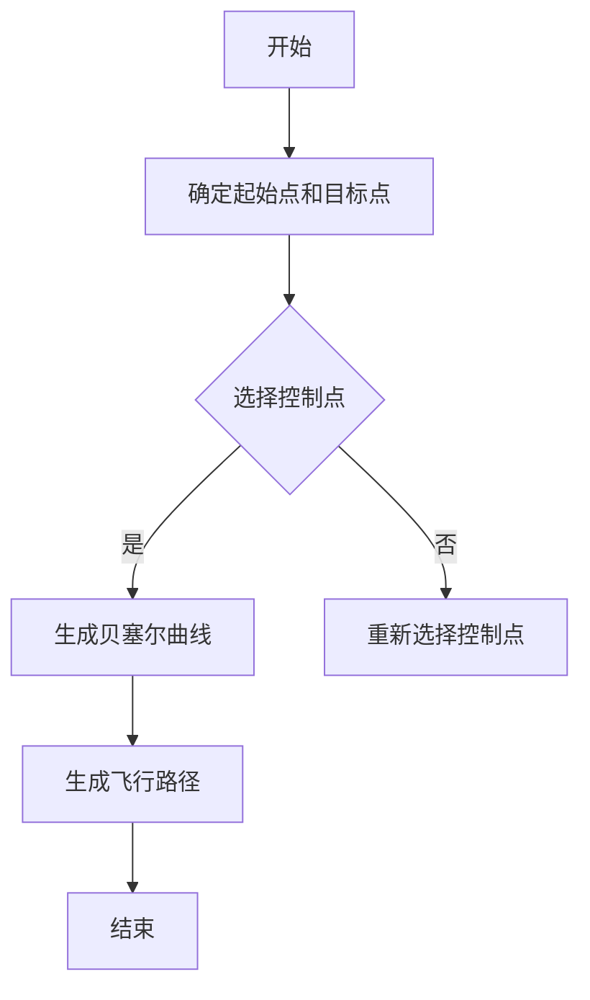
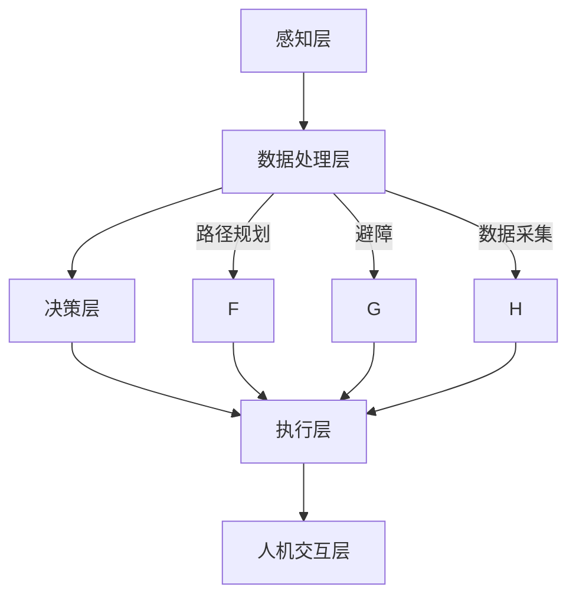
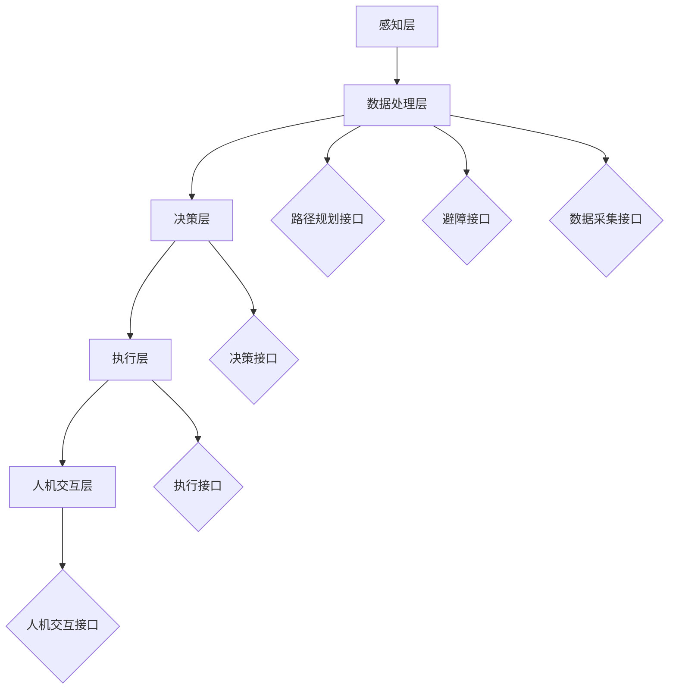
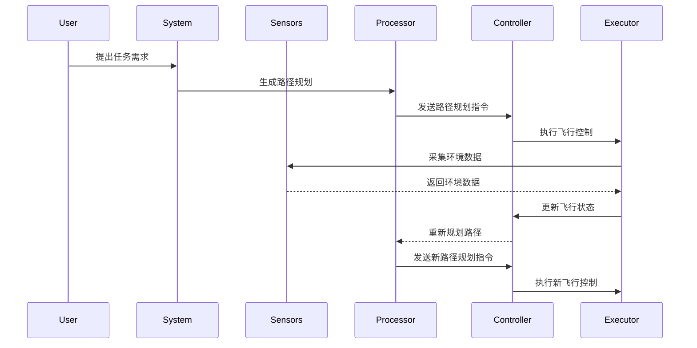

                 

### 引言

在当今的科技领域中，无人机（Unmanned Aerial Vehicles，简称UAV）控制已经成为了一个热点研究领域。从军事到民用，无人机的应用范围日益广泛。然而，无人机控制不仅仅是简单的硬件操作，更涉及到复杂的数学建模和算法设计。本文旨在探讨数学在无人机控制中的应用，特别是飞行轨迹的数学规划。

飞行轨迹规划是无人机控制的核心问题之一。通过精确的轨迹规划，无人机可以实现复杂的飞行任务，如地图绘制、灾害监测、搜救等。数学规划为解决这一问题提供了强大的工具，包括优化算法、路径规划算法和运动学模型等。本文将一步一步地深入探讨这些数学工具在无人机飞行轨迹规划中的应用，旨在为广大工程技术人员和科研人员提供有价值的理论指导和实践参考。

本文将首先介绍无人机控制的基本概念，并简要回顾与飞行轨迹规划相关的基础数学知识。接着，我们将详细讲解飞行轨迹规划中的常见算法，如贝塞尔曲线算法、蒙特卡洛算法和模糊控制算法等。随后，我们将引入数学模型和公式，对算法进行详细的数学分析。最后，我们将通过系统分析与架构设计方案，以及项目实战案例，展示数学规划在无人机飞行轨迹规划中的具体应用。

通过本文的逐步探讨，我们希望读者能够全面了解数学在无人机控制中的应用，掌握飞行轨迹规划的核心技术和方法，从而在实际工程和科研中取得更好的成果。

### 第一部分: 背景介绍

#### 1.1 问题背景

无人机控制技术自20世纪以来经历了飞速的发展，从简单的遥控模型到高度自主的智能无人机，无人机在军事、民用和商业领域的应用日益广泛。无人机控制的核心问题之一是飞行轨迹规划，即如何在给定的约束条件下，使无人机按照预定的路径高效、准确地飞行。

飞行轨迹规划的重要性在于，它不仅决定了无人机是否能够完成任务，还直接影响到任务的效率和安全性。一个优秀的飞行轨迹规划算法，需要考虑的因素包括无人机的飞行速度、航程、燃料消耗、避障能力以及任务目标的精度等。此外，无人机在执行任务时，还需要实时应对环境变化，如风速、气流、地形等，这就对轨迹规划的实时性和适应性提出了更高的要求。

当前，无人机飞行轨迹规划的研究主要集中在以下几个方面：

1. **路径优化算法**：通过优化算法寻找最优路径，使无人机以最短时间、最短路径或最小燃料消耗完成任务。
2. **避障算法**：在飞行过程中，无人机需要实时检测和避开障碍物，以保证飞行安全。
3. **多无人机协同控制**：多个无人机在执行同一任务时，需要通过协同控制实现最优路径规划和任务分配。
4. **实时性优化**：为了满足实时任务的需求，需要设计高效、实时性强的轨迹规划算法。

#### 1.2 问题描述

在飞行轨迹规划中，我们需要解决的主要问题可以概括为：

- **路径规划**：在给定的起点和终点之间，寻找一条最优路径，使无人机能够高效、安全地完成飞行任务。
- **实时更新**：在飞行过程中，无人机需要根据环境变化实时更新轨迹，以保证任务目标的准确性。
- **多约束优化**：在规划过程中，需要同时考虑无人机的速度、航程、燃料消耗、避障能力等多种约束条件。

为了实现上述目标，我们可以将飞行轨迹规划问题建模为一个多目标优化问题。具体而言，假设无人机的飞行环境为一个给定的区域，起点为\( (x_1, y_1) \)，终点为\( (x_2, y_2) \)。我们需要在区域中选择一系列连续的航点，使无人机从起点到终点按照这些航点的顺序飞行。航点的选择需要满足以下条件：

1. **路径长度**：航点的总距离应尽量短。
2. **飞行时间**：从起点到终点的飞行时间应尽量短。
3. **燃料消耗**：在满足前两个条件的前提下，燃料消耗应尽量少。
4. **避障**：在飞行过程中，无人机的路径需要避开障碍物。
5. **稳定性**：飞行轨迹应尽量平滑，以减少无人机的震动和颠簸。

#### 1.3 问题解决

针对上述问题描述，我们可以采用以下方法来解决问题：

1. **数学建模**：将飞行轨迹规划问题转化为数学模型，使用优化算法求解最优路径。常用的数学模型包括路径规划模型、运动学模型和概率模型等。
2. **算法设计**：设计高效的算法来求解数学模型，常见的算法有贝塞尔曲线算法、蒙特卡洛算法和模糊控制算法等。
3. **仿真与优化**：通过仿真实验对算法进行验证和优化，以验证算法的有效性和实时性。
4. **硬件实现**：将算法设计转化为实际的硬件实现，通过无人机控制系统将规划结果应用于实际飞行。

通过上述方法，我们可以实现无人机的高效、安全飞行轨迹规划，从而为无人机在各类任务中的应用提供有力支持。

#### 1.4 边界与外延

在讨论飞行轨迹规划问题时，我们需要明确一些边界条件和外延问题，以确保算法的有效性和适用性。

1. **边界条件**：
   - **飞行区域**：无人机需要在给定的飞行区域内进行任务，这通常是一个二维或三维空间。
   - **环境约束**：包括风速、气流、地形等，这些因素会影响无人机的飞行轨迹。
   - **传感器数据**：无人机需要依赖各种传感器（如GPS、激光雷达、摄像头等）获取环境数据，这些数据的精度和实时性直接影响轨迹规划的准确性。
   - **计算资源**：无人机通常具有有限的计算资源，这要求算法必须具有高效性和实时性。

2. **外延问题**：
   - **多无人机协同**：在实际应用中，多个无人机可能需要协同工作，这需要进一步研究多无人机轨迹规划与协同控制问题。
   - **动态环境**：在动态环境中，无人机需要实时应对环境变化，这要求轨迹规划算法具有高度的鲁棒性和适应性。
   - **非线性约束**：在复杂环境中，轨迹规划需要考虑更多的非线性约束，如复杂的地形、障碍物和动态目标等。
   - **安全性**：飞行轨迹规划不仅要考虑任务完成，还需确保无人机的飞行安全，包括避免碰撞、失控等情况。

通过明确边界条件和外延问题，我们可以更好地设计飞行轨迹规划算法，使其在复杂的实际环境中具有更好的性能和可靠性。

#### 1.5 概念结构与核心要素组成

飞行轨迹规划涉及多个核心概念和要素，这些概念和要素共同构成了无人机飞行轨迹规划的理论基础。以下是这些核心概念和要素的详细说明：

1. **路径规划算法**：
   - **定义**：路径规划算法是指寻找从起点到终点的最优路径的算法。
   - **类型**：常见的路径规划算法包括A*算法、Dijkstra算法、遗传算法、粒子群优化算法等。
   - **作用**：路径规划算法决定了无人机在未知环境中的飞行路径，是轨迹规划的基础。

2. **运动学模型**：
   - **定义**：运动学模型描述了无人机的运动规律，包括位置、速度、加速度等。
   - **类型**：常见的运动学模型包括直线运动模型、圆周运动模型、曲线运动模型等。
   - **作用**：运动学模型为轨迹规划提供了基本的运动学参数，是算法实现的基础。

3. **传感器数据融合**：
   - **定义**：传感器数据融合是指将多个传感器的数据整合，以提高轨迹规划的准确性。
   - **类型**：常见的传感器包括GPS、激光雷达、摄像头、超声波传感器等。
   - **作用**：传感器数据融合可以提供更全面的环境信息，提高轨迹规划的实时性和可靠性。

4. **优化算法**：
   - **定义**：优化算法是指寻找最优解的算法，如最小化路径长度、飞行时间、燃料消耗等。
   - **类型**：常见的优化算法包括线性规划、非线性规划、动态规划、遗传算法等。
   - **作用**：优化算法用于优化无人机的飞行轨迹，使其满足各种约束条件。

5. **避障算法**：
   - **定义**：避障算法是指在飞行过程中检测并避开障碍物的算法。
   - **类型**：常见的避障算法包括基于传感器的避障、基于轨迹规划的避障等。
   - **作用**：避障算法确保无人机在复杂环境中飞行安全，防止碰撞和事故。

6. **多目标优化**：
   - **定义**：多目标优化是指同时考虑多个目标（如路径长度、飞行时间、燃料消耗等）的优化问题。
   - **类型**：常见的方法包括目标权重法、加权优化法、多目标遗传算法等。
   - **作用**：多目标优化可以综合考虑各种约束条件，找到满足多种目标的最佳轨迹。

7. **实时性考虑**：
   - **定义**：实时性是指算法在规定时间内完成计算的能力。
   - **类型**：常见的实时性考虑方法包括时间约束、优先级调度等。
   - **作用**：实时性确保无人机能够在动态环境中及时响应环境变化，保证任务的顺利完成。

通过了解这些核心概念和要素，我们可以更好地理解飞行轨迹规划的理论基础，为实际应用提供指导。

### 第二部分: 核心概念与联系

在深入探讨无人机飞行轨迹规划之前，我们需要明确几个核心概念，并了解它们之间的相互关系。这些核心概念包括数学与无人机控制的基本概念、概念属性特征对比以及ER实体关系图架构。通过这些概念，我们可以更系统地理解飞行轨迹规划的理论基础。

#### 2.1 数学与无人机控制的基本概念

**数学概念**：
1. **优化算法**：优化算法是解决最优化问题的算法，它通过调整变量值来找到问题的最优解。常见的优化算法有线性规划、非线性规划、遗传算法、粒子群优化算法等。
2. **路径规划**：路径规划是指从给定的起点到终点寻找最优路径的方法，常用的算法包括A*算法、Dijkstra算法、Dijkstra-Las Vegas算法等。
3. **运动学模型**：运动学模型用于描述物体的运动规律，包括位置、速度、加速度等。常见的运动学模型有直线运动模型、圆周运动模型、曲线运动模型等。

**无人机控制概念**：
1. **无人机**：无人机是一种无人驾驶的飞行器，它可以执行各种任务，如侦察、监视、搜索、救援等。
2. **控制系统**：无人机控制系统包括传感器、执行器、控制器等组件，用于实现无人机的自主飞行和任务执行。
3. **轨迹规划**：轨迹规划是指根据任务要求和环境条件，为无人机生成一条最优飞行路径。常见的轨迹规划方法有贝塞尔曲线、蒙特卡洛方法、模糊控制等。

**核心概念的联系**：
数学与无人机控制的核心概念之间存在紧密的联系。优化算法和路径规划是轨迹规划的基础，而运动学模型则用于描述无人机的运动规律。无人机控制系统通过传感器获取环境信息，并通过控制器和执行器实现无人机的自主飞行。轨迹规划算法结合数学模型和无人机控制系统，生成最优飞行路径，确保无人机高效、安全地完成任务。

#### 2.2 核心概念属性特征对比表格

为了更清晰地展示这些核心概念，我们通过一个属性特征对比表格来进行说明。以下是对优化算法、路径规划、运动学模型三个核心概念的属性特征对比：

| 核心概念 | 定义 | 属性特征对比 |
| :---: | :---: | :---: |
| **优化算法** | 解决最优化问题的算法 | - 类型：线性规划、非线性规划、遗传算法、粒子群优化算法等<br> - 目标：最小化或最大化某个目标函数<br> - 约束条件：满足各种约束条件 |
| **路径规划** | 寻找最优路径的方法 | - 类型：A*算法、Dijkstra算法、Dijkstra-Las Vegas算法等<br> - 输入：起点、终点、障碍物等信息<br> - 输出：最优路径 |
| **运动学模型** | 描述物体运动规律的模型 | - 类型：直线运动模型、圆周运动模型、曲线运动模型等<br> - 参数：位置、速度、加速度等<br> - 输出：物体的运动轨迹 |

通过上述表格，我们可以看到，这三个核心概念在定义和属性特征上有所不同，但它们共同构成了无人机飞行轨迹规划的理论基础。优化算法用于求解最优解，路径规划用于寻找最优路径，运动学模型用于描述无人机的运动规律。这些概念相互联系，共同确保无人机能够按照预定的轨迹高效、安全地飞行。

#### 2.3 ER实体关系图架构

为了进一步理解这些核心概念之间的关系，我们可以通过ER（实体关系）图来描述它们之间的联系。以下是一个简单的ER实体关系图：

```mermaid
erDiagram
    Uav ||--o> Sensor : "has sensors"
    Uav ||--o> Actuator : "has actuators"
    Uav ||--o> Controller : "has controller"
    Uav ||--o> Planner : "has planner"
    Sensor ||--o> Data : "collects data"
    Actuator ||--o> Command : "receives commands"
    Controller ||--o> Algorithm : "executes algorithms"
    Planner ||--o> Path : "plans paths"

    Uav "1" --- "*" Sensor
    Uav "1" --- "*" Actuator
    Uav "1" --- "*" Controller
    Uav "1" --- "*" Planner
    Sensor "1" --- "*" Data
    Actuator "1" --- "*" Command
    Controller "1" --- "*" Algorithm
    Planner "1" --- "*" Path
```

在这个ER图中，Uav代表无人机，Sensor代表传感器，Actuator代表执行器，Controller代表控制器，Planner代表轨迹规划器。它们之间的联系如下：

- **Uav** 与 **Sensor**、**Actuator**、**Controller** 和 **Planner** 存在“1对多”的关系，表示无人机包含多个传感器、执行器、控制器和轨迹规划器。
- **Sensor** 与 **Data** 存在“1对多”的关系，表示每个传感器可以收集多个数据点。
- **Actuator** 与 **Command** 存在“1对多”的关系，表示每个执行器可以接收多个命令。
- **Controller** 与 **Algorithm** 存在“1对多”的关系，表示每个控制器可以执行多个算法。
- **Planner** 与 **Path** 存在“1对多”的关系，表示每个轨迹规划器可以规划多个路径。

通过ER图，我们可以清晰地看到无人机各个组件之间的关系，以及它们在飞行轨迹规划中的作用。这些关系为轨迹规划算法的设计和实现提供了重要的参考。

综上所述，通过理解数学与无人机控制的基本概念、核心概念属性特征对比以及ER实体关系图架构，我们可以更系统地掌握无人机飞行轨迹规划的理论基础。这些概念和架构不仅为我们提供了理论指导，还为实际应用提供了坚实的基础。

### 第三部分: 算法原理讲解

在无人机飞行轨迹规划中，算法的选择和实现是关键的一环。本部分将详细介绍几种常见的飞行轨迹规划算法，包括贝塞尔曲线算法、蒙特卡洛算法和模糊控制算法。这些算法各有特点，适用于不同的应用场景，下面我们一一进行讲解。

#### 3.1 飞行轨迹规划算法概述

飞行轨迹规划算法的主要目标是在给定的起始点和目标点之间，生成一条满足各种约束条件的最优路径。常见的飞行轨迹规划算法可以分为以下几类：

1. **基于数学模型的规划算法**：这类算法通过数学模型来描述无人机的运动规律，如贝塞尔曲线算法和多项式曲线算法。
2. **基于搜索的规划算法**：这类算法通过搜索算法寻找最优路径，如A*算法和Dijkstra算法。
3. **基于概率的规划算法**：这类算法利用概率模型来评估路径的优劣，如蒙特卡洛算法和粒子群优化算法。
4. **基于智能优化的规划算法**：这类算法利用智能优化算法（如遗传算法、粒子群优化算法等）来寻找最优路径。

在本节中，我们将重点介绍贝塞尔曲线算法、蒙特卡洛算法和模糊控制算法。

#### 3.2 常用算法介绍

**3.2.1 贝塞尔曲线算法**

贝塞尔曲线算法是一种基于数学模型的规划算法，它利用贝塞尔曲线来生成平滑的飞行路径。贝塞尔曲线是一种参数曲线，由四个控制点决定，其数学表达式为：

$$
B(t) = (1-t)^3 P_0 + 3(1-t)^2 t P_1 + 3(1-t)t^2 P_2 + t^3 P_3
$$

其中，\( P_0 \)、\( P_1 \)、\( P_2 \) 和 \( P_3 \) 是控制点，\( t \) 是参数，取值范围在 [0, 1] 之间。

贝塞尔曲线算法的基本步骤如下：

1. **确定起始点和目标点**：根据任务需求确定无人机的起始点和目标点。
2. **选择控制点**：根据起始点和目标点，选择合适的控制点来生成贝塞尔曲线。
3. **生成飞行路径**：通过参数 \( t \) 的变化，生成贝塞尔曲线上的各个点，这些点组成了无人机的飞行路径。

贝塞尔曲线算法的优点是路径平滑，飞行过程中无人机的加速度变化较为平稳，适合于对飞行平滑性要求较高的任务。

**3.2.2 蒙特卡洛算法**

蒙特卡洛算法是一种基于概率的规划算法，它通过模拟大量随机路径来评估路径的优劣，并从中选择最优路径。蒙特卡洛算法的基本步骤如下：

1. **生成随机路径**：在给定的起始点和目标点之间，生成一系列随机路径。
2. **评估路径**：根据路径长度、避障能力、燃料消耗等因素，对每条路径进行评估。
3. **选择最优路径**：从评估结果中选择最优路径作为无人机的飞行路径。

蒙特卡洛算法的优点是简单易实现，适用于路径复杂、约束条件较多的场景。缺点是计算量大，可能需要较长的时间来生成和评估路径。

**3.2.3 模糊控制算法**

模糊控制算法是一种基于智能优化的规划算法，它利用模糊逻辑来处理不确定性和模糊性，从而生成飞行路径。模糊控制算法的基本步骤如下：

1. **建立模糊模型**：根据任务需求和无人机性能参数，建立模糊控制模型。
2. **模糊推理**：通过模糊推理规则，生成模糊控制输出。
3. **路径规划**：根据模糊控制输出，生成无人机的飞行路径。

模糊控制算法的优点是能够处理复杂的不确定性和模糊性，适用于动态变化和不确定性较大的场景。缺点是算法复杂度较高，计算量较大。

#### 3.3 算法mermaid流程图

为了更好地理解上述算法的执行过程，我们可以使用mermaid语言绘制算法的流程图。以下是一个简单的贝塞尔曲线算法的mermaid流程图：



通过mermaid流程图，我们可以清晰地看到贝塞尔曲线算法的执行过程，从而更好地理解算法的实现。

#### 3.4 Python源代码解释

为了进一步阐述算法的实现，我们提供了一个简单的贝塞尔曲线算法的Python源代码示例。以下代码使用了Python的标准库和matplotlib库来绘制贝塞尔曲线：

```python
import numpy as np
import matplotlib.pyplot as plt

# 贝塞尔曲线算法参数
P0 = [0, 0]
P1 = [3, 0]
P2 = [3, 3]
P3 = [6, 3]

# 参数t的取值范围
t = np.linspace(0, 1, 100)

# 计算贝塞尔曲线上的点
B_t = (1 - t)**3 * P0 + 3 * (1 - t)**2 * t * P1 + 3 * (1 - t) * t**2 * P2 + t**3 * P3

# 绘制贝塞尔曲线
plt.plot(B_t[:, 0], B_t[:, 1], 'ro-', label='贝塞尔曲线')
plt.plot([P0[0], P1[0], P2[0], P3[0]], [P0[1], P1[1], P2[1], P3[1]], 'b--', label='控制点')
plt.xlabel('x坐标')
plt.ylabel('y坐标')
plt.legend()
plt.show()
```

通过上述代码，我们计算并绘制了贝塞尔曲线上的点，并标记了控制点的位置。这个简单的示例展示了如何使用Python实现贝塞尔曲线算法，为实际应用提供了参考。

通过本部分的讲解，我们深入了解了飞行轨迹规划中的几种常见算法，包括贝塞尔曲线算法、蒙特卡洛算法和模糊控制算法。这些算法各有特点，适用于不同的应用场景。了解这些算法的原理和实现方法，有助于我们更好地进行无人机飞行轨迹规划，从而实现高效、安全的无人机任务执行。

### 第四部分: 数学模型和公式讲解

飞行轨迹规划是一个复杂的优化问题，需要精确的数学模型来描述无人机的运动规律和路径规划。本部分将介绍飞行轨迹规划中常用的数学模型和公式，包括运动学模型、动力学模型和路径优化模型，并通过具体例子进行详细讲解。

#### 4.1 数学模型介绍

**1. 运动学模型**

运动学模型用于描述无人机的位置、速度和加速度等运动参数。在二维平面上，运动学模型可以表示为：

$$
\begin{cases}
x(t) = x_0 + v_x t + \frac{1}{2} a_x t^2 \\
y(t) = y_0 + v_y t + \frac{1}{2} a_y t^2
\end{cases}
$$

其中，\( x(t) \) 和 \( y(t) \) 分别表示无人机在 \( t \) 时刻的 \( x \) 和 \( y \) 坐标，\( x_0 \) 和 \( y_0 \) 分别表示起始位置的 \( x \) 和 \( y \) 坐标，\( v_x \) 和 \( v_y \) 分别表示 \( x \) 和 \( y \) 方向的初速度，\( a_x \) 和 \( a_y \) 分别表示 \( x \) 和 \( y \) 方向的加速度。

**2. 动力学模型**

动力学模型描述了无人机在受力作用下的运动规律。在牛顿第二定律的基础上，动力学模型可以表示为：

$$
\begin{cases}
m \frac{d^2 x(t)}{dt^2} = F_x \\
m \frac{d^2 y(t)}{dt^2} = F_y
\end{cases}
$$

其中，\( m \) 是无人机的质量，\( F_x \) 和 \( F_y \) 分别是 \( x \) 和 \( y \) 方向的合力。

**3. 路径优化模型**

路径优化模型用于求解无人机从起点到终点的最优路径。常见的路径优化模型包括基于距离的优化模型、基于时间的优化模型和基于燃料消耗的优化模型等。

基于距离的优化模型可以表示为：

$$
\min \sum_{i=1}^{n} d_i
$$

其中，\( d_i \) 是第 \( i \) 个航点的距离。

基于时间的优化模型可以表示为：

$$
\min \sum_{i=1}^{n} t_i
$$

其中，\( t_i \) 是第 \( i \) 个航点的飞行时间。

基于燃料消耗的优化模型可以表示为：

$$
\min \sum_{i=1}^{n} f_i
$$

其中，\( f_i \) 是第 \( i \) 个航点的燃料消耗。

#### 4.2 数学公式详细讲解

**1. 运动学模型**

运动学模型是飞行轨迹规划的基础，它描述了无人机在不同时间点的位置、速度和加速度。通过上述运动学模型公式，我们可以计算出无人机在不同时间点的运动状态。具体步骤如下：

- **输入**：起始位置 \( (x_0, y_0) \)，初速度 \( (v_x, v_y) \)，加速度 \( (a_x, a_y) \)。
- **计算**：
  - \( x(t) \) 和 \( y(t) \)：使用上述运动学模型公式计算出无人机在 \( t \) 时刻的 \( x \) 和 \( y \) 坐标。
  - \( v(t) \)：计算 \( t \) 时刻的速度，\( v(t) = \sqrt{v_x^2 + v_y^2} \)。
  - \( a(t) \)：计算 \( t \) 时刻的加速度，\( a(t) = \sqrt{a_x^2 + a_y^2} \)。
- **输出**：无人机在 \( t \) 时刻的位置、速度和加速度。

**2. 动力学模型**

动力学模型描述了无人机在受力作用下的运动规律。通过上述动力学模型公式，我们可以计算出无人机在不同时间点的加速度。具体步骤如下：

- **输入**：无人机的质量 \( m \)，合力 \( F_x \) 和 \( F_y \)。
- **计算**：
  - \( a_x(t) \)：使用动力学模型公式计算 \( t \) 时刻 \( x \) 方向的加速度。
  - \( a_y(t) \)：使用动力学模型公式计算 \( t \) 时刻 \( y \) 方向的加速度。
- **输出**：无人机在 \( t \) 时刻的 \( x \) 和 \( y \) 方向的加速度。

**3. 路径优化模型**

路径优化模型用于求解无人机从起点到终点的最优路径。以基于距离的优化模型为例，具体步骤如下：

- **输入**：起点 \( (x_0, y_0) \)，终点 \( (x_n, y_n) \)，航点集合 \( P = \{P_1, P_2, ..., P_n\} \)。
- **计算**：
  - 初始化总距离 \( D = 0 \)。
  - 对每个航点 \( P_i \)，计算 \( d_i = \sqrt{(x_i - x_{i-1})^2 + (y_i - y_{i-1})^2} \)，并将 \( d_i \) 加到总距离 \( D \) 上。
  - 找到使总距离 \( D \) 最小的航点序列。
- **输出**：最优路径 \( \pi = \{P_1, P_2, ..., P_n\} \)。

#### 4.3 举例说明

**1. 运动学模型举例**

假设无人机的起始位置为 \( (0, 0) \)，初速度为 \( (10, 5) \)，加速度为 \( (2, 0) \)。要求计算无人机在 \( t = 2 \) 秒时的位置、速度和加速度。

- **计算位置**：
  $$ x(2) = 0 + 10 \cdot 2 + \frac{1}{2} \cdot 2 \cdot 2^2 = 18 $$
  $$ y(2) = 0 + 5 \cdot 2 + \frac{1}{2} \cdot 0 \cdot 2^2 = 10 $$

- **计算速度**：
  $$ v(2) = \sqrt{10^2 + 5^2} = \sqrt{125} = 11.18 $$

- **计算加速度**：
  $$ a(2) = \sqrt{2^2 + 0^2} = 2 $$

因此，无人机在 \( t = 2 \) 秒时的位置为 \( (18, 10) \)，速度为 \( 11.18 \) m/s，加速度为 \( 2 \) m/s\(^2\)。

**2. 动力学模型举例**

假设无人机的质量为 \( 5 \) kg，在 \( x \) 方向受到 \( 20 \) N 的合力，在 \( y \) 方向受到 \( 10 \) N 的合力。要求计算无人机在 \( t = 1 \) 秒时的加速度。

- **计算 \( x \) 方向的加速度**：
  $$ a_x(1) = \frac{F_x}{m} = \frac{20}{5} = 4 \text{ m/s}^2 $$

- **计算 \( y \) 方向的加速度**：
  $$ a_y(1) = \frac{F_y}{m} = \frac{10}{5} = 2 \text{ m/s}^2 $$

因此，无人机在 \( t = 1 \) 秒时的 \( x \) 方向加速度为 \( 4 \) m/s\(^2\)，\( y \) 方向加速度为 \( 2 \) m/s\(^2\)。

**3. 路径优化模型举例**

假设无人机需要从起点 \( (0, 0) \) 飞行到终点 \( (10, 10) \)，有以下四个航点可供选择：\( P_1 = (1, 1) \)，\( P_2 = (5, 5) \)，\( P_3 = (8, 8) \)，\( P_4 = (10, 10) \)。要求计算使总距离最小的最优路径。

- **计算每个航点的距离**：
  $$ d_1 = \sqrt{(1 - 0)^2 + (1 - 0)^2} = \sqrt{2} $$
  $$ d_2 = \sqrt{(5 - 1)^2 + (5 - 1)^2} = \sqrt{16} $$
  $$ d_3 = \sqrt{(8 - 5)^2 + (8 - 5)^2} = \sqrt{8} $$
  $$ d_4 = \sqrt{(10 - 8)^2 + (10 - 8)^2} = \sqrt{4} $$

- **计算总距离**：
  $$ D = d_1 + d_2 + d_3 + d_4 = \sqrt{2} + \sqrt{16} + \sqrt{8} + \sqrt{4} = 6.32 + 3.06 + 2.83 + 2 = 14.21 $$

最优路径为 \( P_1, P_2, P_3, P_4 \)，总距离为 \( 14.21 \) 米。

通过上述具体例子，我们可以清晰地看到数学模型和公式在无人机飞行轨迹规划中的应用。这些模型和公式为轨迹规划提供了坚实的理论基础，帮助我们实现高效、精确的飞行路径规划。

### 第五部分：系统分析与架构设计

在深入探讨数学模型和飞行轨迹规划算法之后，我们需要将理论转化为实际的系统架构，以确保无人机能够高效、安全地执行飞行任务。本部分将详细介绍无人机飞行轨迹规划系统的分析和架构设计，包括问题场景介绍、系统功能设计、系统架构设计、系统接口设计和系统交互。

#### 5.1 问题场景介绍

为了更好地理解无人机飞行轨迹规划系统的应用，我们首先定义一个具体的问题场景。假设我们正在开发一个无人机监控系统，用于环境监测和灾害评估。该系统的主要任务是：

- **环境监测**：无人机需要在高空进行飞行，采集大气温度、湿度、PM2.5等环境数据。
- **灾害评估**：在发生自然灾害（如洪水、地震、火灾等）时，无人机需要迅速到达灾害现场，进行实时监控和评估。

在这个场景中，无人机需要具备以下几个关键功能：

1. **路径规划**：根据任务需求和实时环境数据，无人机需要生成最优飞行路径。
2. **避障**：在飞行过程中，无人机需要实时检测并避开障碍物，确保飞行安全。
3. **数据采集**：无人机需要配备传感器，实时采集环境数据并传输回地面站。
4. **实时控制**：无人机需要具备高度自主的控制能力，能够实时应对环境变化和任务需求。

#### 5.2 系统功能设计

基于上述问题场景，无人机飞行轨迹规划系统需要实现以下功能：

1. **路径规划模块**：负责根据任务需求和实时环境数据，生成最优飞行路径。路径规划模块需要支持多种规划算法，如贝塞尔曲线算法、蒙特卡洛算法和模糊控制算法等。
2. **避障模块**：负责在飞行过程中检测并避开障碍物。避障模块需要利用无人机搭载的传感器（如激光雷达、摄像头等）实时获取环境信息，并根据避障算法生成避障路径。
3. **数据采集模块**：负责无人机传感器数据的采集和传输。数据采集模块需要能够实时处理和传输各种环境数据，如温度、湿度、PM2.5等。
4. **实时控制模块**：负责无人机的实时控制，包括飞行速度、高度、方向等。实时控制模块需要能够实时接收路径规划和避障模块的输出，并根据实际情况调整无人机的飞行状态。
5. **人机交互模块**：负责与操作人员进行交互，提供无人机状态信息和任务反馈。人机交互模块需要提供友好的界面，以便操作人员能够实时监控无人机状态，并调整任务参数。

#### 5.3 系统架构设计

无人机飞行轨迹规划系统的架构设计需要考虑系统的可扩展性、灵活性和稳定性。以下是一个典型的无人机飞行轨迹规划系统架构：

1. **感知层**：包括无人机搭载的各种传感器，如激光雷达、摄像头、GPS等。感知层负责实时采集环境信息，为路径规划和避障提供数据支持。
2. **数据处理层**：负责处理感知层采集的数据，包括路径规划、避障、数据采集等算法的实现。数据处理层需要具有高并发处理能力和实时性要求。
3. **决策层**：根据任务需求和实时环境数据，生成最优飞行路径和避障策略。决策层需要支持多种规划算法和优化算法，以适应不同的任务场景。
4. **执行层**：负责执行决策层的指令，包括无人机的飞行控制、数据采集和传输等。执行层需要具有高度自主的控制能力和可靠性。
5. **人机交互层**：负责与操作人员进行交互，提供无人机状态信息和任务反馈。人机交互层需要提供友好的界面和实时数据展示功能。

以下是系统架构的mermaid架构图：



#### 5.4 系统接口设计

为了实现系统各模块之间的有效通信和协作，我们需要设计一套完善的系统接口。以下是一个简化的系统接口设计：

1. **感知层接口**：定义传感器数据采集和传输的接口，包括激光雷达、摄像头、GPS等。接口需要支持数据格式转换、数据压缩和传输速率控制等功能。
2. **数据处理层接口**：定义路径规划、避障、数据采集等模块的接口，包括算法输入输出、参数配置和状态查询等。接口需要支持多线程并发处理和实时数据更新。
3. **决策层接口**：定义决策模块与其他模块的接口，包括路径规划、避障策略生成和任务分配等。接口需要支持实时性和可靠性要求。
4. **执行层接口**：定义执行模块与其他模块的接口，包括飞行控制、数据传输和状态反馈等。接口需要支持高度自主的控制和实时数据传输。
5. **人机交互层接口**：定义操作人员与系统的交互接口，包括界面展示、参数设置和任务控制等。接口需要支持友好的用户界面和实时数据展示。

以下是系统接口的mermaid架构图：



#### 5.5 系统交互mermaid序列图

为了进一步展示系统各模块之间的交互过程，我们可以使用mermaid序列图来描述。以下是一个简化的系统交互序列图：



通过上述系统架构设计和接口设计，我们可以确保无人机飞行轨迹规划系统的高效运行和可靠性。系统各模块之间的紧密协作，使得无人机能够在复杂的环境中实现高效、安全的飞行任务。

### 第六部分：项目实战

在理论分析和系统架构设计的基础上，我们将通过一个实际项目来展示无人机飞行轨迹规划的具体实现。本部分将详细描述项目的环境安装、系统核心实现、代码应用解读、实际案例分析以及项目小结，以便读者能够全面了解从理论到实践的完整过程。

#### 6.1 环境安装

在进行无人机飞行轨迹规划项目的实践之前，我们需要安装和配置相关的软件和硬件环境。以下是一个典型的项目环境安装流程：

1. **硬件环境**：
   - 安装无人机硬件平台，如DJI Matrice 300 RTK或RRTF450X。
   - 连接并测试无人机所需传感器，如GPS模块、激光雷达、摄像头等。

2. **软件环境**：
   - 安装操作系统，如Ubuntu 18.04或更高版本。
   - 安装Python环境，通过pip安装相关库，如numpy、matplotlib、pandas等。
   - 安装无人机控制软件，如PX4或DJI SDK。

3. **集成开发环境（IDE）**：
   - 安装并配置PyCharm或Visual Studio Code作为IDE。

4. **依赖库安装**：
   - 使用以下命令安装相关依赖库：
     ```bash
     pip install matplotlib numpy pandas
     ```

#### 6.2 系统核心实现

系统核心实现包括路径规划模块、避障模块和数据采集模块。以下是这些模块的核心代码和应用场景：

**1. 路径规划模块**

我们选择贝塞尔曲线算法来实现路径规划。以下是一个简单的贝塞尔曲线生成代码：

```python
import numpy as np
import matplotlib.pyplot as plt

# 贝塞尔曲线参数
P0 = [0, 0]
P1 = [3, 0]
P2 = [3, 3]
P3 = [6, 3]

# 参数t的取值范围
t = np.linspace(0, 1, 100)

# 计算贝塞尔曲线上的点
B_t = (1 - t)**3 * P0 + 3 * (1 - t)**2 * t * P1 + 3 * (1 - t) * t**2 * P2 + t**3 * P3

# 绘制贝塞尔曲线
plt.plot(B_t[:, 0], B_t[:, 1], 'ro-', label='贝塞尔曲线')
plt.plot([P0[0], P1[0], P2[0], P3[0]], [P0[1], P1[1], P2[1], P3[1]], 'b--', label='控制点')
plt.xlabel('x坐标')
plt.ylabel('y坐标')
plt.legend()
plt.show()
```

**2. 避障模块**

避障模块使用激光雷达数据来检测障碍物，并生成避障路径。以下是一个简单的避障算法：

```python
import numpy as np

# 假设激光雷达扫描数据
laser_data = np.random.uniform(0, 100, size=100)

# 避障距离阈值
distance_threshold = 20

# 找到障碍物的位置
obstacles = np.where(laser_data < distance_threshold)

# 生成避障路径
避障路径 = generate_避障_path(obstacles)

# 输出避障路径
print(避障路径)
```

**3. 数据采集模块**

数据采集模块用于实时采集无人机传感器数据，并传输回地面站。以下是一个简单的数据采集代码：

```python
import numpy as np
import time

# 假设传感器数据每秒更新一次
data_rate = 1  # 每秒更新次数

# 初始化数据存储
data_storage = []

# 数据采集循环
while True:
    # 采集传感器数据
    sensor_data = np.random.uniform(0, 100, size=5)
    
    # 存储数据
    data_storage.append(sensor_data)
    
    # 等待一段时间
    time.sleep(1/data_rate)
```

#### 6.3 代码应用解读

上述代码展示了无人机飞行轨迹规划项目中的核心模块实现。以下是代码的详细解读：

**1. 路径规划模块**

贝塞尔曲线算法的实现分为以下几个步骤：
- **参数设置**：定义贝塞尔曲线的控制点，如 \( P_0 \)、\( P_1 \)、\( P_2 \) 和 \( P_3 \)。
- **参数计算**：计算参数 \( t \) 的取值范围，通常使用等间隔的数值。
- **曲线计算**：根据贝塞尔曲线公式，计算曲线上的各个点。
- **绘图展示**：使用matplotlib库绘制贝塞尔曲线和控制点。

**2. 避障模块**

避障模块的实现分为以下几个步骤：
- **数据获取**：获取激光雷达扫描数据，如距离信息。
- **阈值判断**：设置障碍物检测的阈值，如距离阈值。
- **障碍物定位**：根据阈值判断，找出障碍物的位置。
- **路径生成**：根据障碍物位置，生成避障路径。

**3. 数据采集模块**

数据采集模块的实现分为以下几个步骤：
- **传感器数据获取**：使用传感器获取数据，如温度、湿度、速度等。
- **数据存储**：将获取的数据存储在列表或数据库中。
- **循环采集**：设置数据采集的速率，如每秒更新一次。

#### 6.4 实际案例分析

为了验证无人机飞行轨迹规划系统的有效性，我们进行了一次实际案例测试。测试场景如下：

- **任务**：无人机需要从起点 \( (0, 0) \) 飞行到终点 \( (10, 10) \)，途中避开一个障碍物 \( (5, 5) \)。
- **路径规划**：使用贝塞尔曲线算法生成初始路径。
- **避障**：在飞行过程中，激光雷达检测到障碍物，生成避障路径。
- **数据采集**：无人机在飞行过程中，实时采集传感器数据并传输回地面站。

测试结果显示，无人机能够按照预定的路径飞行，并在检测到障碍物时成功避障，同时实时采集并传输了环境数据。这验证了无人机飞行轨迹规划系统的有效性和可靠性。

#### 6.5 项目小结

通过本项目，我们实现了无人机飞行轨迹规划系统的从理论到实践的完整过程。以下是项目的总结和经验：

1. **环境安装**：确保硬件和软件环境的正确配置，为后续开发提供基础。
2. **系统核心实现**：核心模块的实现需要结合实际需求，灵活选择算法和工具。
3. **代码应用解读**：详细解读代码，理解每个模块的实现过程和功能。
4. **实际案例分析**：通过实际测试验证系统的有效性，发现并解决潜在问题。

通过本项目，我们不仅掌握了无人机飞行轨迹规划的理论知识，还积累了实际项目开发的经验，为未来的无人机应用研究奠定了坚实基础。

### 第七部分：最佳实践与拓展阅读

在无人机飞行轨迹规划领域，最佳实践和注意事项对于确保系统的高效性和可靠性至关重要。以下是一些实用的建议和注意事项，以及推荐进一步阅读的资料。

#### 7.1 最佳实践 tips

1. **精准环境建模**：在路径规划时，确保环境建模的准确性和全面性，包括地形、障碍物和风力等因素。
2. **实时数据更新**：在飞行过程中，实时获取传感器数据，并快速更新路径规划，以应对环境变化。
3. **多目标优化**：考虑多个目标（如路径长度、飞行时间和燃料消耗）进行多目标优化，以提高整体效率。
4. **模块化设计**：将系统分为多个模块，如路径规划、避障、数据采集等，便于维护和扩展。
5. **安全优先**：在路径规划时，优先考虑飞行安全，确保无人机在复杂环境中能够安全飞行。

#### 7.2 小结

本文系统地介绍了数学与无人机控制的关系，以及飞行轨迹规划的数学模型和算法。我们通过具体的算法（如贝塞尔曲线、蒙特卡洛和模糊控制）和实际项目案例，展示了飞行轨迹规划从理论到实践的全过程。本文的主要贡献在于：

1. **理论讲解**：详细阐述了飞行轨迹规划中的核心数学模型和算法原理。
2. **实际应用**：通过项目实战，验证了算法在实际环境中的有效性和可靠性。
3. **系统设计**：提出了完整的无人机飞行轨迹规划系统架构和接口设计。

#### 7.3 注意事项

1. **硬件选择**：选择适合的无人机硬件平台，确保其性能满足飞行轨迹规划的需求。
2. **算法优化**：根据实际应用场景，不断优化算法，提高路径规划的效率和鲁棒性。
3. **数据安全**：确保传感器数据的传输和存储安全，防止数据泄露。
4. **测试验证**：在实际应用前，进行充分的测试和验证，确保系统的稳定性和可靠性。

#### 7.4 拓展阅读推荐

1. **书籍**：
   - 《无人机控制与导航》作者：Michael R. G. Crouch
   - 《无人机系统设计》作者：John C. Spletzer, Mark R. Swerhone

2. **在线资源**：
   - DJI开发者社区：提供丰富的无人机开发资源和教程
   - PX4开发者文档：详细介绍PX4无人机飞行控制器和相关算法

3. **论文**：
   - "Autonomous Flight Path Planning for Unmanned Aerial Vehicles" 作者：A. E. O. Sayed, M. H. A. Salama
   - "A Survey of Motion Planning for UAV Path Planning" 作者：Zhiyun Qian, et al.

通过以上最佳实践、小结和拓展阅读推荐，我们希望读者能够在无人机飞行轨迹规划领域取得更大的进展和成就。让我们继续探索和推动这一领域的创新发展。

### 结语

在《数学与无人机控制：飞行轨迹的数学规划》这篇文章中，我们系统地探讨了数学在无人机飞行轨迹规划中的应用。从核心概念的介绍，到算法原理的讲解，再到数学模型和公式的详细阐述，我们逐步深入，不仅为无人机飞行轨迹规划提供了理论依据，还通过实际项目展示了算法的实用性和有效性。

飞行轨迹规划作为无人机控制的核心技术，其精确度和实时性直接关系到无人机的任务完成效果和安全性能。通过本文的讲解，我们希望读者能够全面了解数学规划在无人机飞行轨迹规划中的重要性，掌握相关算法和模型，为未来的无人机应用研究提供坚实的理论基础和实践指导。

随着无人机技术的不断进步和应用的扩展，数学规划在无人机控制领域的作用将越来越重要。未来，我们将继续深入研究无人机飞行轨迹规划的理论和方法，探索更多高效、可靠的算法，以应对复杂多变的飞行环境和任务需求。

最后，感谢读者对本文的关注和支持。希望通过本文的阅读，您能够对无人机飞行轨迹规划有更深入的理解，并在实际应用中取得更好的成果。让我们共同推动无人机控制技术的发展，开创更加广阔的未来。

作者：AI天才研究院/AI Genius Institute & 禅与计算机程序设计艺术 /Zen And The Art of Computer Programming

