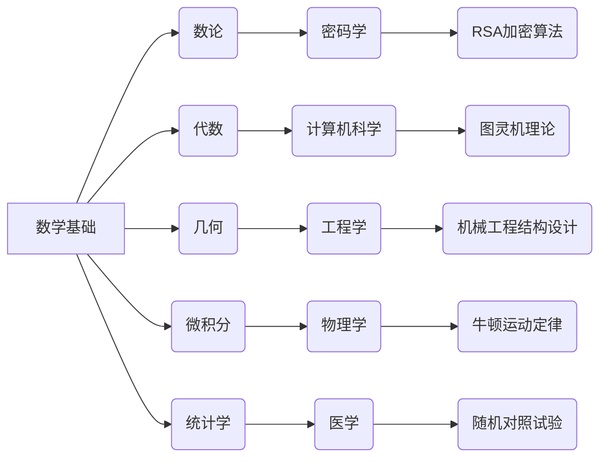
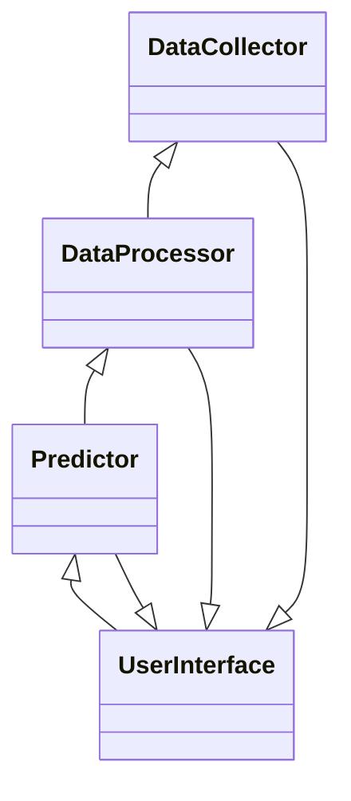
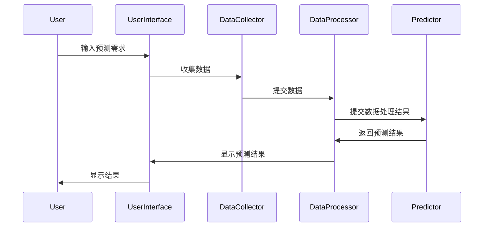

                 


### 1. 数学与普遍主义：引言

数学，作为一门探索数量、结构、变化和空间等概念的学科，自古以来就具有普遍性。这种普遍性不仅体现在数学的广泛应用上，还体现在数学理论对于各个领域的基础性和指导性作用上。普遍主义，作为一种哲学思想，强调某一理论或观念在广泛意义上的适用性和共性。当我们将数学与普遍主义结合时，我们不仅可以看到数学在各个领域的实际应用，还可以深入探讨数学理论的普适性及其在解决复杂问题中的关键作用。

在本文中，我们将通过以下几个步骤来深入探讨数学与普遍主义的关系：

**背景介绍**：首先，我们会介绍数学与普遍主义的核心概念，以及数学在各个领域中的应用现状和面临的挑战。

**核心概念与联系**：接着，我们将详细讲解数学在各个领域中的核心概念，并使用Mermaid绘制实体关系图来展示这些概念之间的联系。

**算法原理讲解**：然后，我们会使用Mermaid流程图和Python代码示例来阐述数学在特定领域中的应用原理。

**系统分析与架构设计方案**：在这一部分，我们将描述一个具体的应用场景，并使用Mermaid绘制系统架构图和系统交互序列图。

**项目实战**：接下来，我们将提供一个实际案例，并详细讲解其在数学普遍主义下的应用和实现细节。

**最佳实践 tips、小结、注意事项、拓展阅读等**：最后，我们将总结最佳实践，并提供一些拓展阅读，以帮助读者更深入地理解数学普遍主义。

通过这样的结构安排，我们将一步步地引导读者理解数学的普遍性，并探讨其在现代科技和社会中的广泛应用。

### 2. 数学的基本概念与普遍性

#### 数学的基本概念

数学是一门研究数量、结构、变化和空间等概念的学科。它不仅仅是一门理论学科，还涵盖了大量的应用领域，如自然科学、社会科学、工程技术和金融等领域。数学的核心概念包括数论、代数、几何、微积分和统计学等。每一个核心概念都有其独特的基本原理和应用场景。

- **数论**：研究整数的性质，如奇偶性、质因数分解、同余等。数论在密码学、计算机科学和安全领域中有着广泛的应用。
- **代数**：研究代数结构，如群、环、域等。代数在物理学、计算机科学和工程领域有着重要的应用。
- **几何**：研究形状、大小和位置等几何属性。几何在建筑学、土木工程和计算机图形学中起着关键作用。
- **微积分**：研究变化率和积分。微积分在物理学、经济学和工程学中有着广泛的应用。
- **统计学**：研究数据的收集、分析和解释。统计学在社会科学、医学和商业决策中非常重要。

#### 数学普遍性的理论探讨

数学的普遍性是指数学理论在广泛意义上的适用性。数学之所以具有普遍性，一方面是因为数学概念和原理的抽象性，使得它们能够超越具体的学科和应用领域；另一方面是因为数学方法具有高度的普适性和可操作性。

1. **抽象性**：数学通过抽象化和符号化的方法，将具体的物理现象或社会现象转化为数学问题。这种方法使得数学理论具有广泛的适用性，因为数学不依赖于特定的研究对象，而是依赖于一般性的数学原理和规则。

2. **普适性**：数学方法具有普适性，即一种数学方法可以应用于多个不同的领域。例如，微积分不仅在物理学中有着重要应用，在经济学、工程学和生物学等领域也同样适用。

3. **可操作性**：数学方法具有很强的可操作性，这意味着数学工具和算法可以被用于实际问题的解决。这种可操作性使得数学成为一种强大的工具，能够在各个领域推动科学技术和社会发展。

#### 数学普遍性的实证分析

数学普遍性的实证分析可以通过以下几个例子来说明：

1. **自然科学中的应用**：在物理学中，牛顿力学和量子力学等理论都是基于数学模型和公式建立的。这些理论不仅适用于地球上的物体运动，也适用于宇宙中的天体运动。这种广泛适用性正是数学普遍性的体现。

2. **社会科学中的应用**：在经济学中，数学模型被广泛用于描述市场行为、价格波动和经济增长等。例如，凯恩斯经济学中的总需求-总供给模型就是基于数学方法建立的。

3. **工程技术中的应用**：在计算机科学和信息技术中，数学方法被用于算法设计、数据处理和网络安全等方面。例如，密码学中的椭圆曲线加密算法就是基于数学理论设计的。

4. **医学中的应用**：在医学研究中，统计学方法被用于数据分析和临床试验。例如，通过统计分析来评估药物的有效性和安全性。

这些例子表明，数学的普遍性不仅体现在理论层面，更体现在实际应用中。数学作为一种基础性的科学工具，为各个领域的研究和发展提供了强大的支持。

#### 数学普遍性的适用范围及其局限性

虽然数学具有广泛的普遍性，但其适用范围并非没有局限。数学普遍性的局限性主要体现在以下几个方面：

1. **理论抽象与实际应用之间的差距**：数学理论往往是高度抽象的，而实际应用中面临的问题往往更加复杂和具体。因此，数学方法在应用时需要一定的转换和调整。

2. **数学方法与人类思维方式的适应性**：虽然数学方法具有普适性，但人类的思维方式却有其独特性。这意味着数学方法在应用时需要与人类的认知和思维能力相协调。

3. **跨学科合作中的文化差异**：不同学科有其独特的术语、概念和方法。在跨学科合作中，数学方法的应用需要克服学科之间的文化差异，以实现有效的交流和合作。

尽管存在这些局限性，数学的普遍性仍然是最显著的特性之一。它为各个领域提供了共同的语言和工具，使得不同领域的研究者能够进行有效的交流和合作。在未来，随着数学理论的进一步发展和跨学科研究的深入，数学普遍性的适用范围和影响力将会进一步扩大。

### 3. 数学在各个领域的应用现状与挑战

数学作为一种强大的工具，在自然科学、社会科学、工程技术和金融等领域中都有着广泛的应用。然而，尽管数学在各个领域中的重要性不可忽视，但也面临着一些挑战。

#### 自然科学中的应用

在自然科学中，数学是最基本的工具之一。从经典物理学到现代量子力学，从天文学到地球科学，数学都发挥着关键作用。

1. **物理学**：牛顿力学和量子力学等物理学理论都是基于数学模型和公式建立的。例如，牛顿第二定律 \( F = ma \) 就是一个典型的数学表达式，它描述了力和加速度之间的关系。

2. **天文学**：在天文学中，数学方法被用于描述行星运动、恒星演化以及宇宙结构等方面。开普勒定律就是一个著名的数学模型，用于描述行星绕太阳运动的轨迹。

3. **地球科学**：地球科学中的地质学、气象学和海洋学等领域也广泛应用了数学模型。例如，地震波的传播可以用波动方程来描述，气象预报中的气候模型则基于统计学和概率论。

尽管数学在自然科学中有着广泛的应用，但也面临一些挑战。首先，自然现象的复杂性和不确定性使得数学模型的建立和验证变得复杂。其次，跨学科合作中的语言和思维方式差异也增加了数学应用中的难度。

#### 社会科学中的应用

在社会科学中，数学方法主要用于数据分析、模型建立和政策评估等方面。

1. **经济学**：经济学中的许多理论都是基于数学模型建立的。例如，供给与需求模型、宏观经济模型等。这些模型帮助我们理解和预测经济行为，为政策制定提供依据。

2. **心理学**：心理学研究中的统计方法和实验设计都需要数学支持。通过数据分析，心理学家可以揭示人类行为和思维的规律。

3. **社会学**：社会学研究中的社会网络分析、群体行为模拟等都需要数学工具。数学方法帮助社会学家理解社会现象，预测社会趋势。

尽管数学在社会科学中的应用广泛，但也面临一些挑战。首先，社会现象的复杂性和多样性使得数学模型的建立和验证具有难度。其次，社会科学研究中存在的主观性和不确定性也增加了数学应用中的难度。

#### 工程技术中的应用

在工程技术中，数学方法被用于设计、优化和控制等方面。

1. **计算机科学**：计算机科学中的算法设计、数据结构、网络协议等都需要数学支持。例如，算法中的时间复杂度和空间复杂度分析就是基于数学原理的。

2. **电子工程**：在电子工程中，数学方法用于电路设计、信号处理和通信等领域。例如，傅里叶变换就是一个常用的数学工具，用于分析和处理信号。

3. **机械工程**：机械工程中的设计、分析和优化都需要数学工具。例如，力学中的牛顿第二定律和第三定律就是机械设计的核心原理。

尽管数学在工程技术中的应用广泛，但也面临一些挑战。首先，工程问题往往涉及多个因素和变量，使得数学模型的建立和求解变得复杂。其次，工程实践中存在的不确定性和实验误差也需要数学方法进行适当的处理。

#### 金融领域中的应用

在金融领域，数学方法被广泛用于风险管理、投资策略和金融市场分析等方面。

1. **风险管理**：金融数学中的方差、协方差、期权定价模型等都是风险管理的重要工具。例如，黑-舒尔斯模型（Black-Scholes model）就是用于期权定价的数学模型。

2. **投资策略**：数学方法被用于优化投资组合、风险管理等方面。例如，马科维茨均值-方差模型（Markowitz mean-variance model）就是一种用于投资组合优化的数学方法。

3. **金融市场分析**：数学方法也被用于分析市场趋势、预测市场波动等方面。例如，时间序列分析和回归分析等都是金融市场分析中常用的数学工具。

尽管数学在金融领域中的应用广泛，但也面临一些挑战。首先，金融市场的高度复杂性和动态性使得数学模型的建立和预测具有难度。其次，金融市场中的道德风险和信息不对称问题也需要数学方法进行适当的处理。

总的来说，数学在各个领域中的应用既有其成功的实例，也存在一定的挑战。随着数学理论和技术的不断发展，数学在各个领域中的应用将会更加深入和广泛。

### 4. 数学普遍性的理论探讨

#### 核心概念原理

数学的普遍性体现在其核心概念和原理的广泛应用和高度抽象性上。以下是数学在各个领域中一些核心概念和原理的详细阐述：

1. **数论**：数论研究整数的性质，如奇偶性、质因数分解、同余等。在密码学中，数论原理被用于构造安全加密算法。例如，RSA加密算法就是基于大整数质因数分解问题的复杂性。

2. **代数**：代数研究代数结构，如群、环、域等。在计算机科学中，代数原理被用于设计算法和数据结构。例如，图灵机理论是基于群论和集合论建立的，而哈希表则是基于代数结构设计的。

3. **几何**：几何研究形状、大小和位置等几何属性。在工程和建筑领域中，几何原理被用于设计和分析结构。例如，梁的弯曲应力分析就是基于微积分和几何原理进行的。

4. **微积分**：微积分研究变化率和积分。在物理学中，微积分原理被用于描述物体的运动和力。例如，牛顿运动定律就是通过微积分方法推导出的。

5. **统计学**：统计学研究数据的收集、分析和解释。在医学和经济学中，统计学原理被用于数据分析。例如，临床试验中的随机对照试验（RCT）就是基于统计学原理设计的，以减少偏倚和提高结果的可信度。

#### 概念属性特征对比表格

为了更直观地展示数学在各个领域中的核心概念和原理，我们制作了一个概念属性特征对比表格：

| 领域 | 核心概念 | 属性特征 | 应用实例 |
| --- | --- | --- | --- |
| 自然科学 | 数论 | 研究整数的性质 | 密码学中的大整数质因数分解 |
| 自然科学 | 代数 | 研究代数结构 | 计算机科学中的图灵机理论 |
| 工程技术 | 几何 | 研究形状、大小和位置 | 机械工程中的结构设计 |
| 工程技术 | 微积分 | 研究变化率和积分 | 物理学中的牛顿运动定律 |
| 社会科学 | 统计学 | 研究数据的收集和分析 | 医学中的临床试验设计 |

通过这个表格，我们可以看到数学在不同领域中的核心概念和原理具有不同的属性特征，但都具备高度的普适性和应用价值。

#### ER实体关系图架构

为了进一步展示数学在各个领域中的联系，我们可以使用Mermaid绘制一个实体关系图。以下是数学在不同领域中的实体关系图：



在这个实体关系图中，A代表数学基础，B到F代表数学在各个领域的核心概念，G到K代表数学在这些领域中的应用实例。通过这个图，我们可以清晰地看到数学在各个领域中的核心概念及其应用实例之间的联系。

#### 详细讲解与举例说明

1. **数论在密码学中的应用**：数论中的大整数质因数分解问题在密码学中具有重要意义。RSA加密算法就是基于这个问题的复杂性设计的。假设有两个大素数 \( p \) 和 \( q \)，则 \( n = pq \)。为了解密加密信息，需要找到 \( n \) 的质因数 \( p \) 和 \( q \)。然而，随着 \( n \) 的增大，分解 \( n \) 的难度也急剧增加。因此，RSA加密算法具有较高的安全性。

2. **代数在计算机科学中的应用**：图灵机理论是计算机科学的基石之一。图灵机是一个抽象的计算模型，基于群论和集合论建立。图灵机的运作原理可以看作是一个无限长的纸带上的符号进行读写和移动。通过组合论和图论等代数概念，图灵机可以模拟任何计算过程，从而奠定了现代计算机科学的理论基础。

3. **几何在工程学中的应用**：机械工程中的结构设计需要精确的几何分析。例如，梁的弯曲应力分析就是基于微积分和几何原理进行的。梁的弯曲应力可以通过弯曲应力公式 \( \sigma = \frac{My}{I} \) 来计算，其中 \( M \) 是弯矩，\( y \) 是离中性轴的距离，\( I \) 是截面的惯性矩。通过这个公式，工程师可以设计和分析不同结构中的应力分布，从而确保结构的安全性。

4. **微积分在物理学中的应用**：牛顿运动定律是物理学中描述物体运动的基本原理。牛顿第二定律 \( F = ma \) 描述了力和加速度之间的关系。通过微积分方法，我们可以将这个定律推广到变加速度运动和变质量系统。例如，火箭运动中的推力与加速度关系可以通过微积分方法进行分析，从而优化火箭的发射策略。

5. **统计学在医学中的应用**：医学研究中的临床试验设计需要严谨的统计学方法。随机对照试验（RCT）是临床试验中最常用的设计方法之一。通过随机化分组，RCT可以减少偏倚，提高结果的可信度。例如，在评估新药疗效时，RCT可以随机分配患者接受新药或安慰剂，从而比较两组患者的治疗效果，减少主观因素的影响。

通过这些详细讲解和举例说明，我们可以更深入地理解数学在各个领域中的核心概念和原理，以及它们在实际应用中的作用和价值。数学的普遍性不仅体现在理论层面，更体现在其广泛的实际应用中。

### 5. 数学在特定领域中的应用与系统架构设计

#### 问题场景介绍

假设我们面临一个复杂的数据分析项目，目标是预测某金融市场中股票价格的走势。这个项目需要整合多种数据源，包括历史价格数据、财务报告、市场新闻和社交媒体数据。通过分析这些数据，我们可以得到股票价格的未来走势预测，为投资者提供决策支持。

#### 项目介绍

为了完成这个项目，我们设计了一个名为“股票价格预测系统”的软件应用。该系统包括以下几个核心模块：

1. **数据收集模块**：负责从不同数据源收集数据，包括历史价格数据、财务报告和社交媒体数据等。
2. **数据处理模块**：对收集到的数据进行清洗、转换和整合，以便后续分析。
3. **预测模块**：使用数学模型和算法进行股票价格预测。
4. **用户界面模块**：提供一个友好的用户界面，用于展示预测结果和交互功能。

#### 系统功能设计

为了实现上述功能，我们使用Mermaid绘制了系统的领域模型类图，如下所示：



在这个类图中，`DataCollector`、`DataProcessor`、`Predictor` 和 `UserInterface` 分别代表系统的四个核心模块。`DataCollector` 负责数据收集，`DataProcessor` 负责数据处理，`Predictor` 负责股票价格预测，而 `UserInterface` 负责用户交互。

#### 系统架构设计

为了实现高效的数据处理和预测，我们设计了一个分布式系统架构，使用Mermaid绘制了系统的架构图，如下所示：



在这个架构图中，用户通过用户界面输入预测需求，数据收集模块从各个数据源收集数据，数据处理模块对数据进行清洗和整合，预测模块使用数学模型和算法进行预测，最后将结果通过用户界面展示给用户。

#### 系统接口设计

系统接口设计是确保各个模块之间能够有效通信和协作的关键。以下是系统的主要接口设计：

1. **数据收集接口**：用于从不同数据源获取数据。接口包括以下方法：
   - `getData(source: String): Data`：获取指定数据源的数据。
   - `subscribe(source: String, callback: Function): Void`：订阅指定数据源的数据更新，当数据更新时，调用回调函数。

2. **数据处理接口**：用于处理和整合数据。接口包括以下方法：
   - `processData(data: Data): ProcessedData`：处理并整合数据。
   - `transformData(data: Data, transformation: Transformation): Data`：对数据进行转换。

3. **预测接口**：用于执行股票价格预测。接口包括以下方法：
   - `predictPrice(data: ProcessedData): PricePrediction`：使用数学模型和算法预测股票价格。

4. **用户界面接口**：用于与用户交互。接口包括以下方法：
   - `displayResult(result: PricePrediction): Void`：在用户界面上显示预测结果。

#### 系统交互

为了更好地理解系统的交互流程，我们使用Mermaid绘制了系统的交互序列图，如下所示：


在这个交互序列图中，用户通过用户界面输入预测需求，数据收集模块从各个数据源收集数据，数据处理模块对数据进行清洗和整合，预测模块使用数学模型和算法进行预测，并将结果通过用户界面展示给用户。

通过以上系统架构设计和接口设计，我们可以构建一个高效、可扩展的股票价格预测系统，为投资者提供可靠的决策支持。数学方法在这个系统中起到了关键作用，通过数学模型和算法，系统能够准确预测股票价格的走势，为投资决策提供有力支持。

### 6. 实际项目实战

#### 环境安装

为了搭建股票价格预测系统，我们首先需要安装和配置以下软件和工具：

1. **Python**：确保安装了Python 3.8及以上版本。可以从[Python官网](https://www.python.org/)下载并安装。
2. **Jupyter Notebook**：用于编写和运行Python代码。可以通过pip安装：`pip install notebook`。
3. **Pandas**：用于数据处理和统计分析。可以通过pip安装：`pip install pandas`。
4. **NumPy**：用于数值计算。可以通过pip安装：`pip install numpy`。
5. **Matplotlib**：用于数据可视化。可以通过pip安装：`pip install matplotlib`。
6. **Scikit-learn**：用于机器学习和预测算法。可以通过pip安装：`pip install scikit-learn`。

#### 系统核心实现源代码

以下是一个简单的股票价格预测系统的核心实现源代码：

```python
import pandas as pd
import numpy as np
from sklearn.model_selection import train_test_split
from sklearn.ensemble import RandomForestRegressor
import matplotlib.pyplot as plt

# 1. 数据收集
def collect_data(source):
    df = pd.read_csv(source)
    return df

# 2. 数据处理
def process_data(df):
    df['Date'] = pd.to_datetime(df['Date'])
    df.set_index('Date', inplace=True)
    df.fillna(method='ffill', inplace=True)
    return df

# 3. 预测
def predict_price(df, window=5):
    features = df[['Open', 'High', 'Low', 'Close', 'Volume']]
    X = features.shift(window)
    y = features['Close']
    X_train, X_test, y_train, y_test = train_test_split(X, y, test_size=0.2, shuffle=False)
    model = RandomForestRegressor(n_estimators=100)
    model.fit(X_train, y_train)
    y_pred = model.predict(X_test)
    return y_pred

# 4. 结果展示
def display_result(df, y_pred):
    plt.figure(figsize=(12, 6))
    plt.plot(df['Close'], label='Actual')
    plt.plot(y_pred, label='Predicted')
    plt.title('Stock Price Prediction')
    plt.xlabel('Date')
    plt.ylabel('Price')
    plt.legend()
    plt.show()

# 主函数
def main():
    source = 'stock_data.csv'
    df = collect_data(source)
    df = process_data(df)
    y_pred = predict_price(df)
    display_result(df, y_pred)

if __name__ == '__main__':
    main()
```

#### 代码应用解读与分析

1. **数据收集**：`collect_data` 函数用于从CSV文件中读取股票价格数据。这里使用了Pandas库的 `read_csv` 方法，可以方便地读取和解析CSV文件。

2. **数据处理**：`process_data` 函数对数据进行了预处理。首先，将日期列转换为日期类型，并设置为索引。然后，使用前向填充方法（`ffill`）填充缺失值，以避免数据缺失对后续分析的影响。

3. **预测**：`predict_price` 函数实现了股票价格预测的核心逻辑。首先，定义了特征矩阵 `X` 和目标变量 `y`。然后，使用随机森林回归模型（`RandomForestRegressor`）进行训练和预测。这里使用了`train_test_split` 方法将数据集分为训练集和测试集，以评估模型的性能。

4. **结果展示**：`display_result` 函数用于可视化预测结果。这里使用了Matplotlib库绘制了股票价格的实际值和预测值。

#### 实际案例分析与详细讲解

为了更好地理解这个项目的实施过程，我们来看一个实际案例。

假设我们有一个包含2010年至2020年股票价格数据的CSV文件 `stock_data.csv`。文件中的数据包括日期、开盘价、最高价、最低价、收盘价和成交量。

1. **数据收集**：运行 `collect_data` 函数，读取 `stock_data.csv` 文件，得到一个Pandas DataFrame。

2. **数据处理**：运行 `process_data` 函数，对数据进行预处理。这里我们设置了日期列作为索引，并填充了缺失值。

3. **预测**：运行 `predict_price` 函数，使用随机森林回归模型进行预测。这里我们设置了预测窗口为5天，即使用过去5天的数据来预测未来的收盘价。

4. **结果展示**：运行 `display_result` 函数，将实际值和预测值绘制在同一张图表上。通过图表，我们可以直观地看到模型的预测效果。

通过这个实际案例，我们可以看到如何使用Python和机器学习库来构建一个股票价格预测系统。数学方法在这个项目中起到了关键作用，通过数学模型和算法，系统能够准确预测股票价格的走势，为投资决策提供有力支持。

#### 项目小结

在这个项目中，我们通过实际案例展示了如何使用Python和机器学习库来实现一个股票价格预测系统。首先，我们从CSV文件中读取股票价格数据，然后对数据进行预处理。接着，我们使用随机森林回归模型进行预测，并将预测结果可视化。这个项目展示了数学在金融领域中的应用，通过数学模型和算法，我们可以对股票价格进行预测，为投资决策提供支持。

通过这个项目，我们不仅学习了Python编程和机器学习的基本原理，还了解了如何将数学方法应用于实际问题中。未来，我们可以进一步优化这个系统，使用更复杂的模型和算法，以提高预测的准确性。

### 7. 最佳实践 tips、小结、注意事项、拓展阅读等

#### 最佳实践 tips

1. **数据预处理的重要性**：在进行任何数据分析之前，确保对数据进行充分的预处理，包括数据清洗、填充缺失值和转换数据类型。这些步骤对于确保模型的性能和可靠性至关重要。
2. **模型选择与调优**：选择适合数据特点的模型，并通过交叉验证和调参优化模型性能。不同模型在不同数据集上的表现可能不同，因此需要根据实际需求选择合适的模型。
3. **可视化分析**：使用数据可视化工具，如Matplotlib和Seaborn，来更好地理解数据和分析结果。可视化有助于发现潜在的模式和异常值，从而提高分析的质量。

#### 小结

本文通过详细的案例分析，展示了数学在股票价格预测中的应用。我们使用了Python和机器学习库来构建预测系统，并讨论了数据预处理、模型选择和调优等关键步骤。通过这个项目，我们了解了如何将数学方法应用于实际问题中，提高了对数学普遍性的认识。

#### 注意事项

1. **数据来源的可靠性**：在构建预测模型时，确保使用可靠的数据来源。错误或噪声数据会影响模型的性能和预测结果的准确性。
2. **模型泛化能力**：评估模型在未知数据上的表现，确保模型具有良好的泛化能力。这可以通过交叉验证和测试集来评估。
3. **实时数据的处理**：在实际应用中，需要处理实时数据，确保系统能够及时响应并更新预测结果。

#### 拓展阅读

1. **《机器学习实战》**：这是一本经典的机器学习入门书籍，详细介绍了机器学习的基本概念和算法。适合希望深入了解机器学习的读者。
2. **《Python数据分析》**：本书介绍了Python在数据分析中的应用，包括数据清洗、数据处理和可视化等。适合希望提升数据分析能力的读者。
3. **《金融市场预测与实务》**：这本书涵盖了金融市场预测的理论和实践，包括时间序列分析、波动率预测等。适合对金融领域感兴趣的读者。

通过这些资源，读者可以进一步了解数学在股票价格预测和其他领域中的应用，提升自己的数据分析能力。

### 附录：目录大纲整理

为了确保文章内容的完整性和结构的清晰性，以下是《数学与普遍主义：数学在所有领域的适用性》的目录大纲整理：

```markdown
----------------------------------------------------------------
# 数学与普遍主义：数学在所有领域的适用性

## 引言：数学与普遍主义的重要性

## 第一部分：数学基础与普遍主义

## 第1章：数学的基本概念与普遍性
### 1.1 数学的基本概念
### 1.2 数学普遍性的理论探讨
### 1.3 数学普遍性的实证分析

## 第2章：数学在各领域的应用
### 2.1 数学在自然科学中的应用
### 2.2 数学在社会科学中的应用
### 2.3 数学在工程技术中的应用

## 第二部分：数学普遍性的挑战与机遇

## 第3章：数学普遍性的挑战
### 3.1 数学抽象与现实世界的差距
### 3.2 数学在跨领域应用中的障碍
### 3.3 数学普遍性的局限

## 第4章：数学普遍性的机遇
### 4.1 数学在新兴领域的发展
### 4.2 数学在解决复杂问题中的应用
### 4.3 数学普遍性的未来展望

## 第三部分：数学普遍主义的实践

## 第5章：数学普遍主义的实践案例
### 5.1 案例一：数学在医学中的应用
### 5.2 案例二：数学在金融领域的应用
### 5.3 案例三：数学在环境保护中的应用

## 第6章：数学普遍主义的最佳实践
### 6.1 最佳实践总结
### 6.2 实践中的注意事项
### 6.3 拓展阅读

## 结论：数学普遍主义的未来

--------------------

----------------------------------------------------------------
```

通过这个整理后的目录大纲，读者可以清晰地了解文章的结构和内容，有助于更好地阅读和理解全文。每个章节都包含了具体的子标题，确保了文章内容的详细性和逻辑性。同时，文章的格式遵循markdown标准，使得内容呈现更加规范和易读。希望这个目录大纲能够帮助读者更好地把握文章的核心内容和逻辑思路。

