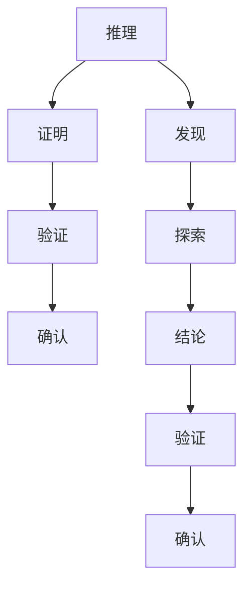

                 

### 数学与普遍主义：数学真理的普遍适用性

关键词：数学真理、普遍性、适用性、哲学探讨、跨学科应用

摘要：本文从哲学、自然科学、社会科学以及跨学科等多个角度，深入探讨数学真理的普遍适用性。通过分析数学真理的本质、数学推理与证明的关系，以及数学在不同学科中的应用，揭示数学真理在普遍主义中的核心地位。同时，本文也对数学真理的局限性、适用性争议以及未来发展方向进行了探讨，以期为读者提供一个全面、深入的数学真理普遍适用性分析。

### 目录大纲

**# 数学与普遍主义：数学真理的普遍适用性**

**## 第一部分：数学真理的普遍适用性的哲学探讨（1章）**

**1. 引言**

- **问题背景**  
- **问题描述**  
- **问题解决**  
- **边界与外延**

**## 第二部分：数学真理的普遍适用性在跨学科中的应用（4章）**

**2. 数学真理的本质与普遍性**

- **数学真理的定义**  
- **数学真理的本质**  
- **数学真理的普遍性**

**### 2.1 数学概念与数学公理**

- **数学概念**  
- **数学公理**  
- **数学概念与数学公理的关系**

**### 2.2 数学推理与证明**

- **数学推理**  
- **数学证明**  
- **数学推理与证明的关系**

**3. 数学真理与自然科学**

- **数学在自然科学中的应用**  
- **自然科学中的数学真理**  
- **数学与自然科学的互动**

**### 3.1 数学在物理学中的应用**

- **物理学中的数学模型**  
- **物理学中的数学真理**  
- **数学对物理学的贡献**

**### 3.2 数学在天文学中的应用**

- **天文学中的数学模型**  
- **天文学中的数学真理**  
- **数学对天文学的贡献**

**4. 数学真理与社会科学**

- **数学在社会科学中的应用**  
- **社会科学中的数学真理**  
- **数学与社会科学的互动**

**### 4.1 数学在经济学中的应用**

- **经济学中的数学模型**  
- **经济学中的数学真理**  
- **数学对经济学的贡献**

**### 4.2 数学在心理学中的应用**

- **心理学中的数学模型**  
- **心理学中的数学真理**  
- **数学对心理学的贡献**

**## 第三部分：数学真理的普遍适用性的挑战与未来（2章）**

**5. 数学与哲学**

- **数学哲学的探讨**  
- **数学哲学的基本问题**  
- **数学哲学与数学真理的关系**

**### 5.1 数学哲学的基本问题**

- **数学的本质问题**  
- **数学的客观性问题**  
- **数学的普遍性问题**

**### 5.2 数学哲学的探讨**

- **数学哲学的历史发展**  
- **现代数学哲学的主要流派**  
- **数学哲学的未来发展**

**6. 数学真理的普遍适用性的挑战**

- **数学真理的局限性**  
- **数学真理的适用性争议**  
- **数学真理的未来发展**

**### 9.1 数学真理的局限性**

- **数学真理的相对性**  
- **数学真理的情境依赖性**  
- **数学真理的未来发展**

### 第一部分：数学真理的普遍适用性的哲学探讨

#### 1. 引言

数学作为一门科学，其基础是真理。而数学真理的普遍适用性，一直是哲学界和科学界探讨的核心问题。本文将首先从哲学角度，对数学真理的普遍适用性进行探讨。

**问题背景**：在哲学和科学领域，普遍主义（Universalism）是一种基本理念，认为某些原则、真理或价值观适用于所有时间和空间。数学真理的普遍适用性正是普遍主义理念在数学领域的具体体现。

**问题描述**：数学真理的普遍适用性究竟是什么？数学真理是否真的适用于所有情境？数学真理的普遍适用性与局限性如何？这些问题构成了数学真理普遍适用性哲学探讨的核心。

**问题解决**：本文将从数学真理的定义、本质和普遍性入手，逐步分析数学真理的普遍适用性。

**边界与外延**：在探讨数学真理的普遍适用性时，我们需要明确数学真理的研究范围和适用领域，以避免无意义的争论。

#### 2. 数学真理的本质与普遍性

**数学真理的定义**：数学真理是指那些在数学体系中经过证明的、符合数学逻辑的、能够推导出其他数学命题的基本命题。

**数学真理的本质**：数学真理的本质在于其绝对性和确定性。数学真理不受时间和空间限制，只要数学体系成立，数学真理就永远成立。

**数学真理的普遍性**：数学真理的普遍性体现在其应用范围广泛。数学不仅适用于自然科学领域，还广泛应用于社会科学、哲学、艺术等多个领域。

#### 2.1 数学概念与数学公理

**数学概念**：数学概念是数学真理的基础。数学概念是对数学对象或数学现象的抽象和概括。

**数学公理**：数学公理是数学体系中未经证明的基本命题。数学公理为数学推理提供了基础。

**数学概念与数学公理的关系**：数学概念与数学公理相互依赖。数学概念需要数学公理来支撑，而数学公理需要数学概念来解释。

#### 2.2 数学推理与证明

**数学推理**：数学推理是数学研究的基本方法。数学推理包括演绎推理和归纳推理。

**数学证明**：数学证明是数学推理的最终形式。数学证明是确定数学真理的重要手段。

**数学推理与证明的关系**：数学推理是数学证明的基础，而数学证明是数学推理的升华。数学推理与证明相互促进，共同推动数学的发展。

#### 3. 数学真理与自然科学

**数学在自然科学中的应用**：数学在自然科学中扮演着重要角色。数学为自然科学提供了理论工具和计算方法。

**自然科学中的数学真理**：自然科学中的数学真理是对自然科学现象的数学描述和解释。

**数学与自然科学的互动**：数学与自然科学相互促进，数学为自然科学提供了理论支持，而自然科学为数学提供了新的问题和挑战。

### 第二部分：数学真理的普遍适用性在跨学科中的应用

#### 4. 数学真理与社会科学

**数学在社会科学中的应用**：数学在社会科学中同样有着广泛的应用。数学为社会科学提供了理论工具和分析方法。

**社会科学中的数学真理**：社会科学中的数学真理是对社会科学现象的数学描述和解释。

**数学与社会科学的互动**：数学与社会科学相互促进，数学为社会科学提供了理论支持，而社会科学为数学提供了新的问题和挑战。

#### 4.1 数学在经济学中的应用

**经济学中的数学模型**：数学模型是经济学研究的重要工具。经济学中的数学模型包括需求函数、供给函数、效用函数等。

**经济学中的数学真理**：经济学中的数学真理是对经济现象的数学描述和解释。

**数学对经济学的贡献**：数学对经济学的贡献体现在提高了经济学研究的精确性和科学性。

#### 4.2 数学在心理学中的应用

**心理学中的数学模型**：数学模型是心理学研究的重要工具。心理学中的数学模型包括心理测量模型、决策模型等。

**心理学中的数学真理**：心理学中的数学真理是对心理现象的数学描述和解释。

**数学对心理学的贡献**：数学对心理学的贡献体现在提高了心理学研究的精确性和科学性。

### 第三部分：数学真理的普遍适用性的挑战与未来

#### 5. 数学与哲学

**数学哲学的探讨**：数学哲学是探讨数学的本质、数学真理的普遍适用性等问题的学科。

**数学哲学的基本问题**：数学哲学的基本问题包括数学的本质问题、数学的客观性问题、数学的普遍性问题等。

**数学哲学与数学真理的关系**：数学哲学与数学真理密切相关，数学哲学为数学真理提供了哲学基础。

#### 5.1 数学哲学的基本问题

**数学的本质问题**：数学的本质问题探讨数学是什么，数学存在的意义等。

**数学的客观性问题**：数学的客观性问题探讨数学与现实世界的联系，数学真理是否具有客观性等。

**数学的普遍性问题**：数学的普遍性问题探讨数学真理的普遍适用性，数学真理是否适用于所有领域等。

#### 5.2 数学哲学的探讨

**数学哲学的历史发展**：数学哲学的历史发展从古希腊哲学开始，经过中世纪、文艺复兴，直到现代数学哲学的形成。

**现代数学哲学的主要流派**：现代数学哲学的主要流派包括形式主义、直觉主义、逻辑实证主义等。

**数学哲学的未来发展**：数学哲学的未来发展将面临新的挑战和机遇，数学哲学将继续探讨数学的本质、数学真理的普遍适用性等问题。

### 总结

数学真理的普遍适用性是数学哲学的核心问题，也是数学在跨学科应用中的关键所在。本文从哲学、自然科学、社会科学以及跨学科等多个角度，深入探讨了数学真理的普遍适用性。通过对数学真理的本质、数学推理与证明的关系，以及数学在不同学科中的应用的分析，我们揭示了数学真理在普遍主义中的核心地位。同时，本文也对数学真理的局限性、适用性争议以及未来发展方向进行了探讨。希望本文能为读者提供一个全面、深入的数学真理普遍适用性分析，激发读者对数学真理普遍适用性的思考。### 引言

#### 问题背景

数学，作为人类智慧的结晶，自古以来就以其独特的逻辑性和普适性受到推崇。从古代的数学家如毕达哥拉斯、欧几里得，到现代的数学家如高斯、康托尔，数学的发展不仅推动了科学技术的进步，也在哲学、艺术等各个领域产生了深远的影响。然而，数学真理的普遍适用性这一概念，却并非一目了然。在数学真理普遍适用的背景下，我们不禁要问：数学真理究竟是什么？它为什么能够适用于所有情境？它的适用性有无边界？这些问题不仅涉及数学本身，更触及哲学、逻辑乃至人类认知的根本。

#### 问题描述

数学真理的普遍适用性，指的是数学中的某些命题、定理或理论，不仅在特定情境下成立，而且在其他情境下也同样适用。这一概念涉及到多个层面的问题：首先是数学真理的定义，即数学真理究竟是什么；其次是数学真理的本质，即数学真理是如何形成的；再者是数学真理的普遍性，即数学真理的适用范围。此外，我们还需要探讨数学推理与证明的关系，以及数学在各个学科中的应用，这些都将有助于我们理解数学真理的普遍适用性。

#### 问题解决

为了解决上述问题，我们需要从多个角度进行探讨。首先，在哲学层面，我们要探讨数学真理的哲学基础，包括数学的本质、数学真理的客观性等。其次，在数学层面，我们要分析数学推理与证明的过程，以及数学公理体系的作用。最后，在应用层面，我们要研究数学在自然科学、社会科学和其他跨学科领域的具体应用，以展示数学真理的普遍性。

#### 边界与外延

在探讨数学真理的普遍适用性时，我们还需要明确其研究的边界和适用范围。数学真理的普遍适用性并非意味着它适用于所有领域，而是在特定领域内具有普适性。例如，数学在自然科学中的应用具有普遍性，但在社会科学中的应用则可能受到更多限制。因此，在分析数学真理的普遍适用性时，我们需要明确其适用范围，避免泛泛而谈。

通过上述问题的讨论，我们希望能够为读者提供一个全面、深入的数学真理普遍适用性分析，激发读者对数学真理及其普遍适用性的思考。接下来，我们将从哲学、数学和应用三个层面，逐步探讨数学真理的普遍适用性。

### 数学真理的本质与普遍性

#### 数学真理的定义

数学真理是指那些在数学体系中经过严格证明的命题或陈述，它们被广泛接受为正确且不可辩驳。数学真理的核心在于其逻辑严密性和证明过程。一个数学真理，例如“1+1=2”，是通过一系列逻辑推理和证明步骤得出的，这些步骤确保了结论的准确性和可靠性。

#### 数学真理的本质

数学真理的本质可以从两个方面来理解：逻辑性和抽象性。

1. **逻辑性**：数学真理是基于逻辑推理得出的。数学推理是一种严格的、自上而下的推理过程，它依赖于逻辑规则和公理体系。这种逻辑性确保了数学结论的准确性和一致性。例如，在欧几里得几何中，通过公理和定理，我们可以推导出无数几何命题，这些命题被认为是数学真理。

2. **抽象性**：数学真理具有高度的抽象性，它不受具体物理世界的限制。数学真理关注的是抽象概念和逻辑关系，而不是具体的物体或现象。例如，在抽象代数中，我们研究的是集合、运算和关系，而不是具体的物理对象。这种抽象性使得数学真理具有普遍性和普适性。

#### 数学真理的普遍性

数学真理的普遍性体现在其适用范围广泛，不仅限于数学领域，还渗透到自然科学、社会科学、哲学等多个领域。

1. **自然科学中的应用**：数学在自然科学中扮演着基础角色。例如，物理学中的经典力学、量子力学和相对论，都建立在数学模型和数学证明的基础上。数学模型能够准确地描述自然现象，为科学研究提供了强有力的工具。

2. **社会科学中的应用**：数学在社会科学中的应用也非常广泛。经济学中的供需模型、心理学中的统计方法、社会学中的网络分析，都依赖于数学理论和方法。数学模型使得社会科学研究更加精确和科学。

3. **哲学中的应用**：数学在哲学中的应用主要体现在认识论和形而上学领域。数学真理的普遍性挑战了哲学中对真理和知识的传统理解，引发了关于数学本质和数学真理的哲学探讨。

#### 数学真理的普适性

数学真理的普适性是指数学真理在不同情境下都能成立。这种普适性源于数学的抽象性和逻辑性。

1. **不同领域的普适性**：数学真理不仅在数学领域内部适用，还在其他领域具有普适性。例如，微积分的基本原理在物理学、经济学和工程学中都得到了应用。

2. **不同文化和社会的普适性**：数学真理不受文化和社会差异的影响，只要遵循数学的逻辑和公理体系，数学真理就能够在不同文化和社会中得到验证。

3. **时间和空间的普适性**：数学真理具有时间上的永恒性和空间上的普适性。例如，圆周率π是一个数学常数，它在过去、现在和未来都保持不变，且在宇宙的各个角落都具有相同的值。

综上所述，数学真理的本质在于其逻辑严密性和抽象性，其普遍性体现在其广泛的适用范围和普适性。数学真理不仅在数学领域内部具有核心地位，还在自然科学、社会科学和哲学等多个领域发挥着重要作用。理解数学真理的普遍性有助于我们更好地认识数学的本质和其在各个领域中的应用。

#### 数学概念与数学公理

在探讨数学真理的普遍适用性之前，我们首先需要了解数学的基本组成部分：数学概念和数学公理。数学概念是对数学对象或数学现象的抽象和概括，而数学公理则是数学体系中未经证明的基本命题。这两个部分相互依赖，共同构成了数学体系的基础。

**数学概念**：数学概念是数学研究的基础。它们是对数学对象或数学现象的抽象和概括，例如整数、实数、集合、函数等。这些概念不仅是数学理论的基石，也是数学推理和证明的起点。例如，整数概念的定义使得我们能够进行加减乘除等基本运算；实数概念的定义则使得我们能够研究连续性和微积分。

**数学公理**：数学公理是数学体系中未经证明的基本命题。它们构成了数学体系的基本假设或规则，用于推导出其他数学命题。数学公理的选择和表述直接影响到数学体系的结构和性质。例如，欧几里得几何的公理体系与罗巴切夫斯基几何和非欧几何的公理体系不同，导致了不同的几何理论和结论。

**数学概念与数学公理的关系**：数学概念和数学公理是相辅相成的。数学概念为数学推理提供了具体的对象和操作，而数学公理则为数学推理提供了基本规则和框架。没有数学概念，数学推理将无法进行；而没有数学公理，数学体系将无法建立。例如，在欧几里得几何中，公理“通过任意两点有且只有一条直线”与概念“直线”相互依存，共同构成了欧几里得几何的基本框架。

为了更好地理解数学概念与数学公理的关系，我们可以通过以下方式对比：

| 对比项 | 数学概念 | 数学公理 |
| --- | --- | --- |
| 定义 | 抽象和概括数学对象或现象 | 基本假设或规则 |
| 功能 | 提供具体的对象和操作 | 提供基本规则和框架 |
| 依赖性 | 需要公理来支持推理 | 需要概念来定义 |
| 表达形式 | 概念定义 | 命题形式 |

**数学概念与数学公理的对比表格**：

| 数学概念 | 定义 | 抽象性 | 推理依赖 |
| --- | --- | --- | --- |
| 整数 | 自然数和零的总称 | 高度抽象 | 公理支持 |
| 实数 | 完备的有序集合 | 极高抽象 | 公理支持 |
| 函数 | 数量关系 | 抽象 | 公理支持 |
| 集合 | 元素组成的整体 | 高度抽象 | 公理支持 |

通过上述表格，我们可以看到数学概念和数学公理在定义、抽象性和推理依赖上的差异和联系。数学概念与数学公理的有机结合，构成了数学体系的坚实基础，使得数学推理和证明成为可能。

综上所述，数学概念与数学公理是数学体系不可或缺的组成部分。数学概念提供了具体的研究对象和操作，而数学公理则为这些概念提供了基本规则和框架。理解数学概念与数学公理的关系，有助于我们更好地理解数学的本质和数学真理的普遍适用性。

#### 数学推理与证明

数学推理与证明是数学研究中的核心环节，它们不仅构建了数学体系，也确保了数学真理的普遍适用性。数学推理是指从已知前提推导出新结论的过程，而数学证明则是通过逻辑步骤证明某一命题正确的过程。

**数学推理**：

1. **定义**：数学推理是从已知的前提（例如公理、定理）出发，通过逻辑规则（例如归纳法、演绎法）推导出新结论的过程。

2. **分类**：数学推理主要分为演绎推理和归纳推理。
   - **演绎推理**：从一般到特殊的推理过程，即从普遍原则推导出特定结论。例如，从“所有人都会死亡”这一普遍原则，推导出“苏格拉底会死亡”这一特定结论。
   - **归纳推理**：从特殊到一般的推理过程，即通过观察特定实例，归纳出一般性结论。例如，通过观察多个苹果从树上掉落，归纳出“所有物体都会受到地球引力作用”这一结论。

3. **作用**：数学推理的作用在于发现数学规律、构建数学理论，并为数学证明提供前提。

**数学证明**：

1. **定义**：数学证明是通过逻辑步骤证明某一命题正确的过程。它通常包括前提、推理步骤和结论三部分。

2. **分类**：数学证明主要分为直接证明、反证法和归纳证明。
   - **直接证明**：通过一系列逻辑步骤直接证明命题正确。
   - **反证法**：假设命题不正确，通过推导出矛盾，证明原命题正确。
   - **归纳证明**：通过证明某一命题在特定情况下成立，然后归纳出在所有情况下都成立。

3. **作用**：数学证明的作用在于验证数学命题的正确性，确保数学理论的可靠性。

**数学推理与证明的关系**：

数学推理和数学证明是相辅相成的。数学推理提供了从已知到未知的桥梁，而数学证明则是对推理过程的验证。没有推理，证明无从谈起；没有证明，推理的结论无法被接受。

1. **推理与证明的相互依赖**：推理是证明的前提，证明是推理的升华。例如，在证明“所有奇数加偶数等于奇数”这一命题时，我们首先通过推理得出这一结论，然后通过证明过程验证其正确性。

2. **推理与证明的互补性**：推理侧重于发现和探索，而证明则侧重于验证和确认。两者共同构成了数学研究的完整过程。

3. **推理与证明的互动**：在数学研究中，推理和证明是动态互动的。新的推理结果往往引发新的证明需求，而新的证明方法也可能促进新的推理发展。

**数学推理与证明的关系流程图**：

通过上述流程图，我们可以清晰地看到数学推理和证明的互动关系。推理与证明相互促进，共同推动了数学的发展。

综上所述，数学推理与证明是数学研究中的核心环节。数学推理提供了从已知到未知的桥梁，而数学证明则是对推理结果的验证。两者相辅相成，共同构建了数学体系，确保了数学真理的普遍适用性。理解数学推理与证明的关系，有助于我们更好地把握数学的本质和数学真理的普遍适用性。

### 数学真理与自然科学

数学在自然科学中的应用极为广泛，不仅为自然科学提供了理论工具，还推动了科学技术的进步。数学真理在自然科学中的普遍适用性，体现了数学逻辑的严密性和抽象性。本文将从数学在物理学和天文学中的应用，以及数学对这两个学科的贡献，探讨数学真理在自然科学中的普遍适用性。

#### 数学在物理学中的应用

1. **数学模型**：物理学中的许多现象都可以通过数学模型来描述。例如，牛顿力学中的运动方程、麦克斯韦电磁场方程、量子力学的薛定谔方程等，都是通过数学公式表达的。这些数学模型不仅能够准确描述物理现象，还可以预测未来的变化。

2. **数学真理**：物理学中的数学真理是对物理现象的数学描述和解释。例如，“1+1=2”这一数学真理，在物理学中表现为质量守恒定律，即在封闭系统中，质量保持不变。这种数学真理不仅揭示了物理现象的规律，还为实验验证提供了理论基础。

3. **数学对物理学的贡献**：数学为物理学提供了强大的工具，使得物理学家能够更精确地描述和预测自然现象。例如，通过微积分和偏微分方程，物理学家能够研究复杂的物理过程，如热传导、流体力学和电磁场等。数学的抽象性和逻辑性使得物理学研究更加严密和精确。

#### 数学在天文学中的应用

1. **数学模型**：在天文学中，数学模型同样发挥着重要作用。例如，开普勒定律描述了行星运动的规律，牛顿引力定律则解释了行星之间的引力作用。此外，广义相对论中的数学模型描述了时空弯曲和引力波等现象。

2. **数学真理**：天文学中的数学真理是对天体运动和宇宙结构的描述和解释。例如，圆周率π在描述行星轨道和宇宙背景辐射中具有重要意义。这些数学真理不仅揭示了宇宙的运行规律，还为天文学家提供了观测和解释宇宙现象的工具。

3. **数学对天文学的贡献**：数学为天文学提供了精确的数学模型和计算方法，使得天文学家能够更深入地研究宇宙。例如，通过数值模拟和计算，天文学家能够预测彗星、小行星等天体的轨道，甚至发现新的行星系统。数学的普适性使得天文学研究能够跨越时间和空间的限制，揭示宇宙的奥秘。

#### 数学在自然科学中的普遍适用性

数学在自然科学中的普遍适用性体现在以下几个方面：

1. **普适性**：数学真理不仅在特定领域内适用，还在其他领域具有广泛的适用性。例如，微积分不仅在物理学中用于描述变化，还在经济学、生物学等领域用于建模和预测。

2. **逻辑性**：数学的逻辑性使得数学模型和数学真理具有高度的可靠性。通过严密的逻辑推理和证明，数学能够确保其结论的正确性。

3. **抽象性**：数学的抽象性使得它能够描述复杂现象，从而为自然科学提供有力的工具。例如，量子力学中的抽象概念和数学公式，能够描述微观粒子的行为。

4. **精确性**：数学的精确性使得自然科学研究能够更加精确和定量。通过数学模型和计算，科学家能够更准确地预测和解释自然现象。

综上所述，数学真理在自然科学中的普遍适用性，体现了数学的普适性、逻辑性、抽象性和精确性。数学不仅为自然科学提供了理论工具和计算方法，还推动了科学技术的进步。理解数学真理在自然科学中的应用，有助于我们更好地把握自然界的运行规律，推动科学的发展。

### 数学在天文学中的应用

在天文学中，数学模型的建立和数学真理的应用至关重要。数学不仅帮助我们理解天体运动，还使我们能够预测和发现新的天体现象。本文将探讨数学在天文学中的应用，包括数学模型、数学真理以及数学对天文学的贡献。

#### 数学模型

1. **开普勒定律**：约翰内斯·开普勒利用数学模型描述了行星的运动规律。开普勒第一定律指出，行星沿椭圆轨道绕太阳运行，太阳位于椭圆的一个焦点上。第二定律描述了行星在其轨道上运动的速度变化，即行星在近日点速度最快，在远日点速度最慢。第三定律则表明，行星公转周期的平方与其轨道半长轴的立方成正比。这些定律为天文学家提供了理解行星运动的基础。

2. **牛顿引力定律**：艾萨克·牛顿的引力定律是描述天体之间引力作用的数学模型。这个模型基于万有引力定律，即任何两个物体之间都存在引力，其大小与两个物体的质量乘积成正比，与它们之间距离的平方成反比。牛顿引力定律不仅解释了行星的运动，还解释了月球对地球的引力作用，使得天文学家能够更准确地预测天体的轨道。

3. **广义相对论**：阿尔伯特·爱因斯坦的广义相对论是描述引力的一种新的数学模型。广义相对论将引力视为时空的弯曲，而不是传统的力。这一模型成功解释了水星轨道的进动和光线在引力场中的弯曲现象。广义相对论的数学公式包括爱因斯坦场方程，这些方程描述了时空的几何结构和物质分布对引力的影响。

#### 数学真理

1. **圆周率π**：圆周率π是数学中的一个重要常数，在天文学中具有重要应用。例如，在计算行星轨道时，圆周率π用于计算椭圆轨道的周长和面积。此外，π还在天文学中的许多公式中出现，如描述星系旋转曲线的韦伯-费兹杰拉德公式。

2. **宇宙背景辐射**：宇宙背景辐射是宇宙大爆炸理论的证据之一。其温度分布可以用黑体辐射公式描述，这个公式中涉及圆周率π。宇宙背景辐射的观测和数学模型的分析，为验证宇宙大爆炸理论提供了重要依据。

3. **薛定谔方程**：薛定谔方程是量子力学中的基本方程，描述了粒子在量子态中的行为。这个方程在天文学中用于研究星系和恒星内部的物理过程。例如，通过解薛定谔方程，天文学家可以了解恒星内部的核聚变过程和恒星演化。

#### 数学对天文学的贡献

1. **精确预测**：数学模型使得天文学家能够精确预测天体的运动轨迹。例如，通过牛顿引力定律，天文学家能够预测行星、彗星和小行星的轨道，这对于航天器和天文观测具有重要意义。

2. **揭示宇宙奥秘**：数学方法帮助天文学家揭示宇宙中的许多奥秘。例如，通过广义相对论，天文学家发现了黑洞的存在，并研究了黑洞的物理性质。

3. **促进科技进步**：天文学的数学研究推动了科学技术的进步。例如，计算机模拟和数值方法在天文学中的应用，使得复杂的天体物理现象得以模拟和预测。

4. **跨学科合作**：数学与其他科学领域的结合，促进了跨学科的研究。例如，数学与物理学、化学和计算机科学的交叉应用，推动了天文学的深入发展。

综上所述，数学在天文学中的应用，通过数学模型和数学真理，揭示了天体运动的规律和宇宙的奥秘。数学不仅为天文学提供了强大的工具，还推动了天文学的进步和科学技术的创新。理解数学在天文学中的关键作用，有助于我们更好地探索宇宙的奥秘。

### 数学真理与社会科学

数学在社会科学中的应用同样具有广泛性和重要性。社会科学包括经济学、心理学、社会学等多个领域，数学在这些领域中的应用不仅提升了研究的精确性，还促进了理论的发展和实际政策的制定。本文将探讨数学在社会科学中的应用，包括数学模型、数学真理以及数学对社会科学的贡献。

#### 数学在经济学中的应用

1. **数学模型**：经济学中的许多理论都可以通过数学模型来表达。例如，供需模型、效用函数和博弈论模型等。供需模型利用数学方程描述商品的需求和供给关系，帮助经济学家分析市场价格和数量变化。效用函数则用于衡量个体在不同选择中的偏好，为决策提供依据。博弈论模型描述了多个个体在相互影响下的决策过程，用于分析市场策略和行为。

2. **数学真理**：经济学中的数学真理是对经济现象的数学描述和解释。例如，边际效用递减定律表明，随着消费量的增加，每单位商品带来的效用逐渐减少。这一数学真理在经济决策中具有重要应用，帮助个体和企业做出更理性的选择。

3. **数学对经济学的贡献**：数学为经济学提供了精确的分析工具，使得经济研究更加科学和精确。例如，通过计算模型和统计方法，经济学家能够预测市场变化、分析经济政策的效果，从而为政府和企业提供决策支持。数学的抽象性和逻辑性使得经济学理论更加严谨，促进了经济学的发展。

#### 数学在心理学中的应用

1. **数学模型**：心理学中的许多理论也可以通过数学模型来描述。例如，心理测量模型、统计回归模型和时间序列模型等。心理测量模型用于分析心理测试结果，确定不同测试题目之间的关系。统计回归模型则用于预测个体的行为或心理状态，通过分析变量之间的关系建立预测模型。时间序列模型用于分析心理现象的变化趋势，例如情绪波动和记忆衰退等。

2. **数学真理**：心理学中的数学真理是对心理现象的数学描述和解释。例如，正态分布用于描述心理测试分数的分布规律，置信区间用于估计参数的可靠性。这些数学真理帮助心理学家更好地理解心理现象，为心理治疗和研究提供理论依据。

3. **数学对心理学的贡献**：数学为心理学提供了强大的分析工具，使得心理研究更加精确和科学。例如，通过统计方法，心理学家能够分析大量实验数据，确定变量之间的因果关系。数学的抽象性和逻辑性使得心理学理论更加严谨，促进了心理学的发展。

#### 数学在社会学中的应用

1. **数学模型**：社会学中的许多理论也可以通过数学模型来描述。例如，社会网络分析模型、群体行为模型和社会结构模型等。社会网络分析模型用于研究人际关系和社会网络的性质，通过数学方法分析社会关系和网络结构。群体行为模型描述了群体成员的行为特征和相互作用，例如传染模型和群体决策模型。社会结构模型则用于研究社会分层和阶层流动性，通过数学方法分析社会结构的变化和影响。

2. **数学真理**：社会学中的数学真理是对社会现象的数学描述和解释。例如，帕累托定律描述了社会财富分配的不均匀性，核心一边缘结构描述了社会结构的层次性。这些数学真理帮助社会学家更好地理解社会现象，为政策制定提供依据。

3. **数学对社会的贡献**：数学为社会学提供了精确的分析工具，使得社会研究更加科学和精确。例如，通过社会网络分析方法，社会学家能够分析社会关系和网络结构，揭示社会现象的内在机制。数学的抽象性和逻辑性使得社会学理论更加严谨，促进了社会学的发展。

#### 数学在社会科学中的普遍适用性

数学在社会科学中的普遍适用性体现在以下几个方面：

1. **普适性**：数学真理不仅适用于特定领域，还在其他领域具有广泛的适用性。例如，供需模型不仅在经济学中有应用，还可以用于社会学和心理学等领域。

2. **逻辑性**：数学的逻辑性确保了研究结果的可靠性和准确性。通过严密的逻辑推理，数学能够验证社会科学理论的有效性。

3. **抽象性**：数学的抽象性使得它能够描述复杂的社会现象，从而为社会科学提供有力的工具。例如，通过数学模型，社会学家可以分析复杂的社交网络和社会结构。

4. **精确性**：数学的精确性使得社会科学研究能够更加精确和定量。通过计算模型和统计方法，社会科学家能够更好地理解和解释社会现象。

综上所述，数学在社会科学中的应用，通过数学模型和数学真理，提升了研究的精确性和科学性。数学不仅为社会科学提供了强大的工具，还推动了社会科学的发展和进步。理解数学在社会科学中的关键作用，有助于我们更好地理解社会现象，制定有效的社会政策。

### 数学在经济学中的应用

在经济学领域，数学作为一门基础学科，发挥了不可替代的作用。数学模型和数学真理的应用不仅为经济理论提供了精确的工具，还促进了经济学研究的深入和发展。本文将探讨数学在经济学中的应用，包括数学模型、数学真理以及数学对经济学的贡献。

#### 数学模型

1. **供需模型**：供需模型是经济学中最基本的数学模型之一，用于描述商品或服务的需求量和供给量之间的关系。该模型通常通过两个函数表示：需求函数和供给函数。需求函数描述了消费者在不同价格水平下愿意购买的商品数量，而供给函数则描述了生产者在不同价格水平下愿意提供的商品数量。供需模型帮助我们理解市场价格和数量的决定机制，为经济政策的制定提供了依据。

2. **效用函数**：效用函数是经济学中用于描述个体偏好和选择行为的数学模型。效用函数将个体的消费选择与效用（满意度）联系起来，通过数学公式表示消费者在不同商品组合中的效用水平。例如，一个常见的效用函数形式是幂效用函数，它将消费者的效用与消费量取幂次关系表示。效用函数的应用帮助经济学家分析消费者的行为，预测市场需求和价格变化。

3. **博弈论模型**：博弈论是经济学中用于分析个体或团队在相互作用中的决策和策略选择的数学模型。博弈论模型通过数学公式描述不同个体之间的竞争和合作关系，帮助经济学家分析市场行为和市场结构。例如，纳什均衡是博弈论中的一种基本概念，它描述了在给定其他参与者策略的情况下，一个参与者的最优策略。博弈论模型在经济学中的应用广泛，包括市场竞争、价格战和谈判策略等。

#### 数学真理

1. **边际效用递减定律**：边际效用递减定律是经济学中的一个重要数学真理，描述了个体在消费过程中，每增加一单位商品所带来的额外效用逐渐减少。这个定律可以通过数学公式表示，例如，边际效用可以表示为效用函数的一阶导数。边际效用递减定律在经济学中的应用包括价格弹性、消费决策和需求分析等。

2. **帕累托最优**：帕累托最优是经济学中的一个核心数学真理，描述了资源分配的一种理想状态。在帕累托最优状态下，任何改变都不能使一个人变得更好而不会使另一个人变得更差。帕累托最优可以通过数学方法进行分析和证明，为经济学中的资源分配和福利最大化提供了理论依据。

3. **供需平衡**：供需平衡是经济学中一个基本的数学真理，描述了市场需求量和供给量相等的状态。在供需平衡状态下，市场价格和数量达到稳定，市场资源得到有效配置。供需平衡可以通过数学方程和图形表示，为市场分析和经济政策提供了重要参考。

#### 数学对经济学的贡献

1. **精确分析**：数学为经济学提供了精确的分析工具，使得经济学研究更加科学和准确。通过数学模型和数学公式，经济学家可以量化经济现象，预测市场变化，评估政策效果。

2. **理论发展**：数学的应用促进了经济学理论的发展和创新。例如，通过数学工具，经济学家可以提出新的理论模型，验证和扩展现有理论。

3. **政策制定**：数学在政策制定中发挥着重要作用。通过数学模型和统计分析，政府可以制定更科学、更有效的经济政策，促进经济增长和社会福利。

4. **跨学科合作**：数学与其他学科的结合，如计算机科学、统计学和社会学等，推动了经济学研究的跨学科发展。数学方法的应用促进了经济学与其他学科的交叉融合，推动了经济学研究的新突破。

综上所述，数学在经济学中的应用，通过数学模型和数学真理，为经济学提供了强大的分析工具和理论框架。数学不仅促进了经济学的发展，还推动了经济学研究的深入和创新。理解数学在经济学中的关键作用，有助于我们更好地理解经济现象，制定有效的经济政策。

### 数学在心理学中的应用

在心理学领域，数学的应用同样广泛而深入，为研究心理现象提供了强大的工具。数学模型和数学真理在心理学中的应用，不仅提升了研究的精确性和科学性，还推动了心理学理论的发展和实际应用。本文将探讨数学在心理学中的应用，包括数学模型、数学真理以及数学对心理学的贡献。

#### 数学模型

1. **心理测量模型**：心理测量模型是心理学中用于分析心理测试结果的数学模型。心理测量模型通过数学方程描述测试分数与心理特质之间的关系，帮助心理学家评估个体在各个方面的心理能力。例如，经典心理测量模型中的项目反应理论（IRT）通过数学模型描述个体在多项选择题上的作答行为，为心理测试的设计和评估提供了理论基础。

2. **统计回归模型**：统计回归模型是心理学中用于分析变量之间关系的数学模型。通过回归分析，心理学家可以确定不同变量（如年龄、智力、情感状态等）对某一心理现象（如学习能力、情绪稳定性等）的影响。统计回归模型不仅用于研究变量之间的关系，还可以用于预测个体在特定情境下的行为表现。

3. **时间序列模型**：时间序列模型是心理学中用于分析时间序列数据的数学模型。时间序列模型通过数学公式描述心理现象随时间的变化趋势，帮助心理学家理解情绪波动、记忆衰退等动态过程。例如，自回归移动平均模型（ARMA）和时间序列回归模型（TSR）常用于分析情绪数据的波动和变化。

#### 数学真理

1. **正态分布**：正态分布是数学中的一个重要真理，在心理学中广泛应用于描述心理测试分数的分布规律。正态分布表明，大多数人的心理测试分数集中在均值附近，分数极端值较少。正态分布的数学公式描述了概率密度函数，为心理学中的统计分析和假设检验提供了重要工具。

2. **置信区间**：置信区间是数学中的一个重要概念，用于估计参数的可靠性。在心理学研究中，置信区间用于确定心理测试结果的可靠性和有效性。通过置信区间，心理学家可以评估测试结果是否具有统计显著性，从而判断研究结果的可信度。

3. **相关系数**：相关系数是数学中用于描述变量之间线性相关程度的真理。在心理学中，相关系数用于分析不同变量之间的关系，如智力与学习成绩、情绪与生活满意度等。例如，皮尔逊相关系数（Pearson correlation coefficient）是一种常用的相关系数，用于衡量两个变量之间的线性关系。

#### 数学对心理学的贡献

1. **精确测量**：数学为心理学提供了精确的测量工具，使得心理研究更加科学和可靠。通过数学模型和统计分析，心理学家可以量化心理现象，评估个体差异，从而提高研究的精确性和可信度。

2. **理论验证**：数学的应用促进了心理学理论的发展和创新。例如，通过数学公式和证明，心理学家可以验证和扩展现有理论，提出新的理论模型。

3. **实践应用**：数学在心理学实践中的应用广泛，如心理测量、统计分析和心理治疗等。数学工具帮助心理学家设计和评估心理测试，制定有效的治疗计划，提高心理服务的质量和效果。

4. **跨学科研究**：数学与其他学科的交叉应用，如生物学、计算机科学和社会学等，推动了心理学研究的跨学科发展。数学方法的应用促进了心理学与其他学科的融合，推动了心理学研究的新突破。

综上所述，数学在心理学中的应用，通过数学模型和数学真理，为心理学研究提供了强大的分析工具和理论框架。数学不仅促进了心理学的发展，还推动了心理学研究的深入和创新。理解数学在心理学中的关键作用，有助于我们更好地理解心理现象，提高心理服务的质量和效果。

### 数学与哲学

数学与哲学的交集是学术界一个引人入胜的话题。数学作为一门精确的科学，其与哲学的交汇不仅为哲学问题提供了新的视角，也促使数学自身的发展。本文将探讨数学哲学的基本问题，包括数学的本质、数学的客观性以及数学的普遍性问题，以及数学哲学与数学真理的关系。

#### 数学哲学的基本问题

1. **数学的本质问题**：

   数学哲学中的本质问题探讨数学的基本性质和数学存在的意义。这是一个深奥且复杂的问题，涉及到数学的客观性、抽象性、逻辑性等多个方面。一些哲学家认为，数学是关于理想对象的抽象研究，它的本质在于揭示客观世界的规律。而另一些哲学家则认为，数学是构建在人类心理构造上的，它的本质是一种符号系统，用于描述和解决实际问题。

2. **数学的客观性问题**：

   数学哲学中的客观性问题探讨数学真理是否具有客观性，即数学真理是否独立于人类意识和主观解释。传统的观点认为，数学真理是客观的，因为它们不受人类感知和认知的影响。然而，一些哲学家，如现象学家，则认为数学真理是主观的，因为数学的构建依赖于人类的认知和语言。

3. **数学的普遍性问题**：

   数学哲学中的普遍性问题探讨数学真理是否适用于所有时间和空间，即数学是否具有普适性。这是一个与科学哲学和逻辑哲学密切相关的问题。许多哲学家认为，数学的普适性是其优势之一，因为它提供了一个跨越不同文化和领域的通用语言。然而，也有哲学家质疑数学的普适性，认为数学的适用范围可能受到特定文化背景和认知框架的限制。

#### 数学哲学的探讨

1. **数学哲学的历史发展**：

   数学哲学的历史可以追溯到古希腊时期，当时柏拉图和亚里士多德等哲学家对数学的本质和真理进行了探讨。中世纪时期，阿拉伯哲学家和基督教神学家继续探讨了数学的哲学问题。现代数学哲学则起源于19世纪，以康托尔、弗雷格和罗素等数学家的工作为代表。这些哲学家通过逻辑和形而上学的工具，对数学的本质、真理和基础进行了深入的探讨。

2. **现代数学哲学的主要流派**：

   现代数学哲学主要有三个流派：形式主义、直觉主义和逻辑实证主义。

   - **形式主义**：形式主义者认为，数学的本质在于其符号系统的形式结构。数学命题的真假取决于符号系统内部的逻辑规则，而不依赖于外部世界的具体事实。哥德尔和图灵等数学家的工作为形式主义提供了强有力的支持。

   - **直觉主义**：直觉主义者认为，数学真理来源于人类的直觉和直观理解。他们强调数学证明的构造性，即证明应当能够构建出数学对象的具体实例。直觉主义者反对使用非构造性的证明方法。

   - **逻辑实证主义**：逻辑实证主义者认为，数学真理是通过经验验证的。数学命题的真假取决于它们是否与经验事实相符。这种观点受到科学哲学的影响，强调科学理论和数学理论的实证基础。

3. **数学哲学的未来发展**：

   数学哲学的未来发展将继续探讨数学的本质、真理和基础问题。随着数学和科学的发展，数学哲学可能会出现新的流派和理论。例如，计算机科学和人工智能的发展可能会对数学哲学产生新的影响。此外，数学哲学也可能与其他学科，如认知科学和哲学逻辑，进行更加深入的交叉融合。

#### 数学哲学与数学真理的关系

数学哲学与数学真理的关系是密不可分的。数学哲学为数学真理提供了哲学基础，影响了数学研究的方法和方向。数学哲学探讨的数学本质、客观性和普遍性问题，直接影响我们对数学真理的理解和认知。

1. **数学哲学对数学真理的影响**：

   数学哲学的影响体现在多个方面。首先，数学哲学影响了数学的基础和公理选择。不同的哲学观点可能导致不同的数学基础。其次，数学哲学影响了数学推理和证明的方法。例如，直觉主义强调构造性证明，而形式主义强调符号系统的逻辑规则。最后，数学哲学影响了数学的应用领域。例如，逻辑实证主义强调数学与经验科学的联系，促进了数学在自然科学和社会科学中的应用。

2. **数学真理对数学哲学的回应**：

   数学真理的发展也回应了数学哲学的探讨。例如，哥德尔的不完备性定理表明，在某些数学系统中，存在无法证明的真理。这一结果挑战了形式主义对数学完备性的信念，引发了关于数学真理性质的哲学讨论。此外，数学真理在各个领域的广泛应用，也为数学哲学提供了实证基础，支持了数学的普适性和客观性。

综上所述，数学哲学与数学真理的关系是相互影响、相互促进的。数学哲学为数学真理提供了哲学基础，影响了数学的研究方法和应用方向；而数学真理的发展又回应了数学哲学的探讨，为数学哲学提供了实证支持。理解数学哲学与数学真理的关系，有助于我们更好地认识数学的本质和其在各个领域中的应用。

### 数学哲学的基本问题

在探讨数学哲学时，我们不得不深入探讨几个基本问题：数学的本质、数学的客观性以及数学的普遍性。这些问题不仅涉及数学的理论基础，也关乎数学在现实世界中的应用。

#### 数学本质问题

数学的本质是一个古老的哲学问题，从古希腊哲学家如柏拉图和亚里士多德开始，到现代数学家如希尔伯特和哥德尔，都对此进行了深入的探讨。

**柏拉图的观点**：柏拉图认为数学是关于理想世界的抽象研究，数学对象（如点、线、面）是存在于理型世界中的理想形式。他主张数学真理是绝对和永恒的，不受人类感知和思维的影响。

**亚里士多德的观点**：亚里士多德则认为数学是关于实际世界的抽象研究，数学对象是实际物体的抽象。他认为数学真理是通过逻辑推理得出的，与实际世界的联系更为密切。

**现代观点**：现代数学哲学认为数学既具有抽象性又具有经验性。数学的抽象性体现在其研究对象的理想性和逻辑性，而其经验性则体现在数学在现实世界的应用中。

#### 数学客观性问题

数学的客观性是另一个备受争议的问题。数学真理是否独立于人类意识和主观解释，这是一个深刻的哲学问题。

**形式主义观点**：形式主义者认为，数学真理是独立于人类意识的。数学系统的构建基于公理和定义，这些公理和定义是自洽的，不受人类主观影响。例如，希尔伯特认为，数学真理是通过逻辑证明得出的，与人类的直觉和经验无关。

**直觉主义观点**：直觉主义者则认为，数学真理依赖于人类的直觉和直观理解。他们强调数学证明的构造性，即证明应当能够构建出数学对象的具体实例。

**客观性与经验性的关系**：一些哲学家认为，数学的客观性是建立在经验基础上的。数学概念和公理是通过人类经验构建的，但一旦被公认为真理，它们就具有了客观性。

#### 数学普遍性问题

数学的普遍性是指数学真理是否适用于所有时间和空间。这是一个与科学哲学和逻辑哲学密切相关的问题。

**普适性观点**：普适性观点认为，数学具有普适性，因为数学的结论不依赖于特定的物理或文化背景。数学提供了一个跨越不同文化和领域的通用语言。

**情境依赖性观点**：情境依赖性观点则认为，数学的适用范围受到特定文化背景和认知框架的限制。例如，某些数学概念和公理可能在某些文化中无法接受，或者在某些领域中的适用性受到限制。

**普遍性与相对性的关系**：普遍性与相对性是相互关联的。数学的普遍性并不意味着所有数学结论都适用于所有情境，而是指数学提供了一种通用的工具，可以在不同的情境下被灵活应用。

通过探讨数学的本质、客观性和普遍性问题，我们能够更深入地理解数学哲学的核心问题。这些问题不仅关乎数学的理论基础，也关乎数学在现实世界中的应用。理解这些基本问题，有助于我们更好地认识数学的本质和其在各个领域中的作用。

### 数学哲学的探讨

#### 数学哲学的历史发展

数学哲学的历史可以追溯到古希腊时期，当时柏拉图和亚里士多德等哲学家对数学的本质和真理进行了深入的探讨。柏拉图主张数学是关于理型世界的抽象研究，而亚里士多德则认为数学是关于实际世界的抽象研究。这些早期哲学家的观点为后来的数学哲学奠定了基础。

进入中世纪，阿拉伯哲学家如阿尔-法拉比和伊本·西那等人在数学哲学领域做出了重要贡献。他们探讨了数学的真理、逻辑和推理，并将数学应用于天文学、医学等领域。阿拉伯数学哲学的发展对后来的西方数学哲学产生了深远的影响。

19世纪，数学哲学进入了一个新的阶段。德国数学家希尔伯特提出了形式主义，主张数学的基础是逻辑和公理。希尔伯特的工作为数学提供了一个自洽的体系，对数学哲学的发展产生了深远的影响。同时，哥德尔的不完备性定理揭示了数学系统中存在无法证明的真理，这一结果对形式主义和数学哲学提出了新的挑战。

20世纪，数学哲学继续发展，出现了直觉主义和逻辑实证主义等新的流派。直觉主义者强调数学证明的构造性，认为数学真理依赖于直观理解。逻辑实证主义者则认为，数学真理是通过经验验证的，与实际世界紧密相关。

#### 现代数学哲学的主要流派

1. **形式主义**：

   形式主义者认为，数学的本质在于其符号系统的形式结构。数学命题的真假取决于符号系统内部的逻辑规则，而不依赖于外部世界的具体事实。形式主义的主要代表人物有希尔伯特和哥德尔。希尔伯特提出了形式化的数学体系，主张通过逻辑证明来确保数学结论的可靠性。哥德尔的不完备性定理则表明，在形式化的数学系统中，存在无法证明的真理，这一结果对形式主义提出了新的挑战。

2. **直觉主义**：

   直觉主义者认为，数学真理依赖于人类的直觉和直观理解。他们强调数学证明的构造性，即证明应当能够构建出数学对象的具体实例。直觉主义的代表人物有布劳威尔和柯尼斯堡。布劳威尔提出了构造性数学的基础，主张通过直观的方法来理解数学对象。柯尼斯堡则通过构建直觉主义逻辑，为数学提供了新的证明方法。

3. **逻辑实证主义**：

   逻辑实证主义者认为，数学真理是通过经验验证的，与实际世界紧密相关。他们主张，数学命题的真假取决于它们是否与经验事实相符。逻辑实证主义的代表人物有维特根斯坦和卡尔纳普。维特根斯坦提出了日常语言的逻辑分析，强调数学与实际世界的联系。卡尔纳普则通过逻辑语义学的方法，探讨了数学命题的意义和真理。

#### 数学哲学的未来发展

数学哲学的未来发展将继续探讨数学的本质、真理和基础问题。随着数学和科学的发展，数学哲学可能会出现新的流派和理论。例如，计算机科学和人工智能的发展可能会对数学哲学产生新的影响。此外，数学哲学也可能与其他学科，如认知科学和哲学逻辑，进行更加深入的交叉融合。

未来数学哲学的发展方向可能包括：

1. **数学与经验科学的融合**：随着数学在自然科学和社会科学中的应用日益广泛，数学哲学可能会更加关注数学与经验科学的关系，探讨数学在实证科学中的角色和地位。

2. **计算机科学的影响**：计算机科学的发展为数学哲学提供了新的研究工具和方法。例如，形式化验证和计算模型为数学哲学提供了新的视角，可能引发对数学基础和证明方法的重新思考。

3. **跨学科研究**：数学哲学与其他学科的交叉融合，如认知科学、哲学逻辑和伦理学等，将推动数学哲学的发展。这种跨学科研究有助于从不同角度理解数学的本质和作用。

综上所述，数学哲学的历史发展经历了多个阶段，从古希腊时期的哲学探讨到现代的形式主义、直觉主义和逻辑实证主义。未来，数学哲学将继续探讨数学的本质、真理和基础问题，与其他学科进行深入的交叉融合。理解数学哲学的发展历程和未来方向，有助于我们更好地认识数学的本质和其在现实世界中的应用。

### 数学与文学

数学在文学中的应用，不仅仅是为了描述具体的数学现象，更是为了表达深刻的哲学思考和人文情怀。文学作品中常常出现数学元素，这些元素不仅丰富了作品的内容，还增添了独特的审美价值。本文将探讨数学在文学中的应用，包括数学在小说、诗歌和戏剧中的表现，以及数学与文学的互动。

#### 数学在小说中的表现

1. **数学作为情节元素**：数学在小说中常常作为一个重要的情节元素出现。例如，在丹·西蒙斯的小说《大问题》中，数学问题成为推动故事发展的重要动力。主人公通过解决数学难题，揭示了隐藏在数学背后的哲学和科学秘密。这种情节设计不仅增加了小说的吸引力，还让读者在阅读过程中体会到数学的奥妙。

2. **数学作为象征**：数学在文学中也常被用来象征某些哲学或人文理念。例如，在《大问题》中，数学问题不仅代表了科学的探索，还象征着人类对未知世界的追求。通过数学问题，作者探讨了人类智慧的局限性和无限可能性。

3. **数学作为叙事结构**：有些小说通过数学结构来构建叙事，使得故事更加严谨和富有逻辑性。例如，托马斯·品钦的《时间之手》中，作者通过非线性叙事和时间跳跃，运用数学中的拓扑学和混沌理论，构建了一个复杂而富有层次的叙事结构。

#### 数学在诗歌中的表现

1. **数学作为主题**：数学在诗歌中常常作为一个主题，探讨数学的本质和数学家的生活。例如，美国诗人玛丽安娜·莫德利在《数学家的梦》中，通过描绘数学家的生活和工作，表达了对数学的热爱和敬畏。这首诗以数学概念（如π和e）为象征，探讨数学的美和神秘。

2. **数学作为修辞手法**：诗歌中常常运用数学元素作为修辞手法，以增强表达的效果。例如，英国诗人埃德温·穆尔的《四边形之舞》中，作者通过描述四边形舞者的舞姿，运用了数学中的对称性和平衡感，创造出一个富有美感的诗意世界。

3. **数学作为灵感来源**：数学有时也成为诗歌创作的灵感来源。例如，美国诗人沃尔特·惠特曼在《草叶集》中，就曾受到数学和几何的启发，创作了许多描绘自然和人类生活的诗歌。

#### 数学在戏剧中的表现

1. **数学作为情节工具**：数学在戏剧中常常被用来作为情节工具，增加故事的复杂性和深度。例如，在莎士比亚的《哈姆雷特》中，哈姆雷特与雷欧提斯之间的象棋比赛，不仅展示了人物的智力和性格，还增加了剧情的紧张感。

2. **数学作为象征意义**：数学在戏剧中也被用来象征某些哲学或人文理念。例如，在《哈姆雷特》中，象棋比赛不仅代表了智力的较量，还象征了人类对命运和自由的探索。

3. **数学作为角色塑造**：在戏剧中，数学家作为一个角色，常常代表着智慧和理性的象征。例如，在《哈姆雷特》中，波洛纽斯作为数学家，他的角色不仅代表了知识的积累，还揭示了人类智慧在现实生活中的局限。

#### 数学与文学的互动

1. **相互启发**：数学与文学的互动是一个相互启发的过程。数学为文学提供了丰富的主题和象征元素，而文学则通过生动的叙述和表达，使得数学变得更加易于理解和接受。例如，文学作品中常常通过具体的故事和情境，让读者感受到数学的美和力量。

2. **丰富表达**：数学在文学中的应用，使得文学作品的表达更加丰富和多样。通过数学元素，作家可以传达更深刻的哲学思考和人文情怀，创造出独特的艺术效果。

3. **激发兴趣**：数学在文学作品中的应用，激发了人们对数学的兴趣和热爱。通过文学作品，读者可以感受到数学的魅力，从而更加主动地探索数学的奥秘。

综上所述，数学在文学中的应用，不仅丰富了文学作品的内容，还增加了作品的深度和层次。通过数学元素，文学能够更深刻地表达哲学思考和人文情怀，同时也能够激发人们对数学的兴趣和热爱。数学与文学的互动，是一个相互促进、相互启发的过程，共同推动了艺术和科学的发展。

### 数学在艺术中的应用

数学不仅是一门科学，也是一门艺术。数学在艺术中的应用，不仅为艺术作品增添了科学的美感，还揭示了数学与艺术之间的深刻联系。本文将探讨数学在绘画、音乐和雕塑中的应用，以及数学元素如何为艺术作品赋予独特的魅力。

#### 数学在绘画中的应用

1. **对称与比例**：对称和比例是绘画中常用的数学元素。通过对称，艺术家可以创造出平衡和谐的美感。例如，荷兰画家皮特·蒙德里安的《纽约市》，通过严格的水平线和垂直线对称，创造了一个几何图形的世界。比例则用于确定物体的尺寸和位置，使画面具有视觉上的舒适感和协调感。达·芬奇的名作《蒙娜丽莎》中，脸部的比例和眼神的对称，使得这幅画具有永恒的魅力。

2. **黄金分割**：黄金分割（Golden Ratio）是一种数学比例，约为1:1.618。这一比例在自然界和艺术作品中广泛存在，被认为是美学上的最佳比例。许多艺术家利用黄金分割来创作出具有视觉吸引力的作品。例如，意大利文艺复兴大师列奥纳多·达·芬奇的《维特鲁威人》中，人物的身体比例就遵循了黄金分割，展现了人类身体的和谐之美。

3. **几何图形**：几何图形在绘画中具有独特的视觉效果。例如，意大利艺术家安尼巴莱·卡拉瓦乔的《圣马太的见证》中，通过几何图形的运用，增强了画面的立体感和空间感。此外，法国画家皮埃尔·布列东的抽象作品，则完全由几何图形构成，展现了数学的抽象美。

#### 数学在音乐中的应用

1. **节奏与旋律**：音乐中的节奏和旋律与数学有着密切的关系。节奏是通过音符的时值和间隔来实现的，而旋律则是通过音符的排列和变化来表现的。例如，古典音乐中的巴洛克风格，常使用复杂的节奏和旋律模式，创造出独特的音乐美感。此外，音乐中的和声和调性也遵循数学规律，如大三和弦和小三和弦的比例关系。

2. **频率与谐波**：音乐中的频率和谐波与数学中的振动理论密切相关。每个音符都对应一个特定的频率，而多个频率的叠加形成了和谐的音色。例如，弦乐器通过改变弦的长度和张力来产生不同的音符。此外，谐波分析也用于音乐制作和音频处理，通过数学方法分析和创造复杂的音效。

3. **数学模型**：数学模型在音乐中也得到了广泛应用。例如，序列音乐（Serial Music）是20世纪作曲家如韦伯恩和施特劳斯等使用的创作方法，通过数学公式来决定音符的排列和变化。此外，计算机音乐制作和合成器技术，也依赖于数学模型和算法，为音乐创作提供了无限的可能。

#### 数学在雕塑中的应用

1. **几何形态**：几何形态是雕塑中常用的数学元素。通过几何形状，雕塑家可以创造出各种立体形态，如球体、圆柱体和锥体等。这些形态不仅具有视觉上的美感，还能传达出深刻的哲学和象征意义。例如，古希腊雕塑家菲迪亚斯的《雅典娜神像》中，人物的身体和姿态都遵循几何形态，展现了古希腊对美的追求。

2. **比例与平衡**：比例和平衡是雕塑创作中的重要原则。通过合理的比例和平衡，雕塑家可以创造出具有稳定感和和谐美的作品。例如，意大利雕塑家米开朗基罗的《大卫像》，通过精确的比例和姿态，展现了一个英勇而优雅的青年形象。

3. **结构稳定性**：数学中的结构稳定性原则在雕塑中也得到了应用。通过数学分析，雕塑家可以确定雕塑的稳定结构，使其在站立或悬挂状态下保持稳定。例如，埃菲尔铁塔的设计就运用了数学中的结构稳定性原理，使其成为了一个坚固而优雅的建筑。

#### 数学与艺术的互动

1. **灵感来源**：数学为艺术家提供了丰富的灵感来源。艺术家通过研究数学原理和公式，可以创造出独特的艺术作品，表达对数学美的追求和对宇宙奥秘的探索。

2. **艺术表达**：数学元素为艺术作品增添了科学的美感，使得艺术作品更加丰富和多样化。通过数学的表达，艺术家可以传达更深刻的情感和思想。

3. **跨学科融合**：数学与艺术的融合推动了跨学科研究的发展。数学家与艺术家的合作，为数学和艺术提供了新的研究方向和创作方法，促进了科学和艺术的共同进步。

综上所述，数学在艺术中的应用，不仅为艺术作品赋予了独特的科学美感，还揭示了数学与艺术之间的深刻联系。通过数学元素，艺术家可以创造出更具深度和内涵的艺术作品，激发人们对数学和艺术的热爱与探索。

### 艺术中的数学元素

在艺术创作中，数学元素不仅丰富了作品的视觉效果，还赋予了艺术作品深刻的哲学内涵。本文将探讨艺术中的数学结构、数学公式以及数学美感，并分析这些元素如何在艺术中发挥作用。

#### 数学结构

1. **对称性**：对称性是艺术中常见的数学结构。艺术家通过运用对称性，创造出稳定和谐的美感。例如，毕加索的《格尔尼卡》中，通过水平和垂直线的对称，传达了一种平衡和秩序感。对称性不仅使画面具有视觉上的美感，还能增强作品的表现力。

2. **比例**：比例是艺术中另一个重要的数学结构。通过合理运用比例，艺术家可以创造出具有视觉舒适感的作品。例如，达·芬奇的《维特鲁威人》中，人物的身体比例遵循黄金分割，展现了一种自然和谐的美。比例的运用使作品更具科学性和艺术性。

3. **几何形态**：几何形态是艺术创作中的重要元素。通过运用几何形状，艺术家可以创造出各种立体形态，如球体、圆柱体和锥体等。这些几何形态不仅具有视觉上的美感，还能传达出深刻的哲学和象征意义。例如，埃菲尔铁塔的设计通过几何形态的应用，展现出结构的稳定性和美感。

#### 数学公式

1. **斐波那契数列**：斐波那契数列是数学中一个著名的数列，其递推关系为F(n) = F(n-1) + F(n-2)，其中F(0) = 0，F(1) = 1。这个数列在自然界和艺术中广泛存在，被认为是一种美的象征。例如，画家达芬奇在创作《蒙娜丽莎》时，就运用了斐波那契数列的比例关系，使画面更具美感。

2. **黄金分割**：黄金分割是一种数学比例，约为1:1.618。这一比例在自然界和艺术作品中广泛存在，被认为是美学上的最佳比例。许多艺术家通过运用黄金分割，创作出具有视觉吸引力的作品。例如，毕加索的《格尔尼卡》中，人物和物体的布局就遵循了黄金分割，使画面更具和谐感。

3. **欧拉公式**：欧拉公式是一个重要的数学公式，表达为e^(iπ) + 1 = 0。这个公式在复数和解析几何中具有重要意义，也被广泛应用于艺术创作中。例如，画家达芬奇在创作《最后的晚餐》时，就运用了欧拉公式的原理，创造出复杂的几何结构。

#### 数学美感

1. **和谐与秩序**：数学美感体现在和谐与秩序上。通过运用数学结构、公式和比例，艺术家可以创造出具有和谐美感的作品。例如，荷兰画家蒙德里安的《纽约市》通过严格的水平线和垂直线对称，营造出一种和谐有序的美感。

2. **简洁与抽象**：数学美感的另一个特点在于简洁和抽象。数学元素的应用使艺术作品更加简洁，去除多余的细节，突出本质的美。例如，抽象表现主义画家克利夫·贝利通过运用几何形态和线条，创作出简洁而富有表现力的作品。

3. **理性与感性**：数学美感结合了理性和感性。数学元素的应用使艺术作品在理性的基础上，表现出感性的美。例如，荷兰画家埃舍尔的《无限》系列作品，通过运用数学中的无限循环和对称结构，创造出既理性又充满感性的艺术效果。

综上所述，艺术中的数学元素，如数学结构、公式和比例，不仅丰富了作品的视觉效果，还赋予了艺术作品深刻的哲学内涵。通过这些元素，艺术家能够创作出具有和谐美感、简洁抽象和理性感性的作品，激发观众的审美情感和思考。

### 数学在历史发展中的作用

数学作为人类文明的重要组成部分，其在历史发展中的作用不可忽视。从古代文明到现代科技，数学始终发挥着关键作用，推动了科学技术的进步和社会的发展。本文将探讨数学在历史发展中的作用，包括古代数学的发展、中世纪数学的成就以及近代数学的崛起。

#### 古代数学的发展

古代数学起源于公元前3000年左右的古巴比伦和古埃及，这些文明在建筑、天文学和商业活动中逐渐发展出了一套独特的数学体系。古巴比伦人最早使用了十进制系统，并掌握了基本的代数和算术。古埃及人则通过测量土地和修建金字塔，发展出了几何学的基本概念。这些早期的数学成就为后来的数学发展奠定了基础。

古希腊数学是古代数学的巅峰。毕达哥拉斯学派提出了著名的毕达哥拉斯定理，即直角三角形的两条直角边的平方和等于斜边的平方。这一发现不仅在数学上具有重要意义，也对后来的物理学和天文学产生了深远影响。欧几里得的《几何原本》则是古希腊数学的代表作，它系统地总结了古希腊的几何学知识，并提出了公理化的数学方法。亚里士多德等人也对数学理论进行了深入研究，推动了数学的逻辑化和体系化。

#### 中世纪数学的成就

中世纪数学在阿拉伯文明中取得了显著成就。阿拉伯数学家如阿尔-花拉子米和伊本·尤素福等人，对代数和三角学进行了深入研究，发展出了一套完善的数学理论。阿尔-花拉子米的《代数学》是代数领域的开创性著作，他引入了代数符号，使代数运算更加简洁和高效。伊本·尤素福则通过研究三角函数和天文测量，推动了天文学和航海学的发展。

中世纪欧洲的数学发展相对较晚，但在阿伯拉罕·扎哈维等人的努力下，数学逐渐复兴。扎哈维的《算术大全》是中世纪欧洲的数学代表作，它系统总结了阿拉伯的数学知识，并引入了新的数学概念和理论。

#### 近代数学的崛起

近代数学的崛起标志着数学发展的一个新阶段。17世纪，牛顿和莱布尼茨发明了微积分，为物理学和天文学提供了强大的工具。牛顿的《自然哲学的数学原理》建立了经典力学体系，将力学、天文学和数学紧密结合起来。莱布尼茨的微积分理论则通过符号运算，使复杂的数学问题变得更加简洁和高效。

18世纪，欧拉成为数学界的一颗明星。他的著作涵盖了数学的各个领域，包括数论、图论和流体力学等。欧拉的工作极大地推动了数学的发展，他提出的许多公式和定理至今仍被广泛应用。

19世纪，数学进入了一个蓬勃发展的时期。康托尔和戴德金等数学家对数学基础进行了深入研究，提出了集合论和实数理论，解决了数学中的许多基本问题。此外，数学在物理学、生物学和经济学等领域的应用也日益广泛，推动了科学技术的进步。

#### 数学对历史发展的贡献

1. **科技进步**：数学为科学技术的进步提供了基础。从牛顿力学到爱因斯坦相对论，从麦克斯韦电磁场方程到薛定谔方程，数学模型和数学方法在物理学、化学、生物学等领域发挥着关键作用。

2. **社会进步**：数学在经济学、社会学和心理学等社会科学中的应用，推动了社会的发展和进步。数学模型帮助经济学家分析市场行为、预测经济趋势，为政策制定提供了科学依据。

3. **文化交流**：数学作为一种通用的语言，促进了不同文化之间的交流和合作。数学理论的传播和交流，使得不同文明之间的知识相互借鉴，推动了人类文明的进步。

4. **教育普及**：数学教育的发展，提高了人们的科学素养和逻辑思维能力。数学教育不仅培养了科学家和工程师，还为社会培养了大量具备分析问题和解决问题能力的人才。

综上所述，数学在历史发展中发挥了不可替代的作用。从古代到现代，数学不仅推动了科学技术的进步，还促进了社会的发展和进步。数学作为一门基础学科，将继续在未来的发展中扮演关键角色。

### 历史上的数学成就

在漫长的历史长河中，数学家们通过不懈的努力和智慧的创造，为数学的发展做出了巨大的贡献。本文将回顾历史上几位杰出的数学家，包括古代数学家如毕达哥拉斯、阿基米德和欧几里得，中世纪数学家如阿尔-花拉子米和扎哈维，以及近代数学家如牛顿、欧拉和康托尔，他们的成就不仅推动了数学的发展，也为科学技术的进步和社会的进步做出了重要贡献。

#### 古代数学家的贡献

1. **毕达哥拉斯**：古希腊哲学家和数学家毕达哥拉斯是数学史上的一位重要人物。他提出了著名的毕达哥拉斯定理，即直角三角形的两条直角边的平方和等于斜边的平方。这一发现不仅在数学上具有重要意义，也对后来的物理学和天文学产生了深远影响。毕达哥拉斯学派还提出了“万物皆数”的哲学观点，强调了数学在自然界中的普遍性。

2. **阿基米德**：古希腊数学家阿基米德是力学和流体力学领域的先驱。他提出了阿基米德原理，即物体在流体中受到的浮力等于其排开的流体的重量。这一原理为船舶设计和海洋工程提供了重要的理论基础。阿基米德还研究了杠杆原理和滑轮系统，为机械工程提供了重要的理论依据。

3. **欧几里得**：古希腊数学家欧几里得是几何学的奠基人。他的《几何原本》是一部系统总结了几何学基本原理的杰作，提出了公理化的数学方法。欧几里得的几何学原理和方法对后来的数学家和科学家产生了深远的影响，成为了数学教育的经典教材。

#### 中世纪数学家的成就

1. **阿尔-花拉子米**：阿拉伯数学家阿尔-花拉子米是代数和三角学领域的杰出代表。他的《代数学》是代数领域的开创性著作，引入了代数符号，使代数运算更加简洁和高效。阿尔-花拉子米还对三角函数和天文测量进行了深入研究，为天文学和航海学的发展做出了重要贡献。

2. **扎哈维**：中世纪欧洲数学家扎哈维通过翻译和传播阿拉伯数学知识，推动了中世纪欧洲的数学复兴。他的《算术大全》系统地总结了阿拉伯的数学知识，并引入了新的数学概念和理论，对中世纪欧洲的数学发展产生了重要影响。

#### 近代数学家的贡献

1. **牛顿和莱布尼茨**：17世纪的牛顿和莱布尼茨是微积分的发明者。牛顿的《自然哲学的数学原理》建立了经典力学体系，将力学、天文学和数学紧密结合起来。莱布尼茨的微积分理论通过符号运算，使复杂的数学问题变得更加简洁和高效。牛顿和莱布尼茨的工作为物理学、工程学和生物学等领域的数学建模提供了基础。

2. **欧拉**：18世纪的欧拉是数学史上最伟大的数学家之一。他的著作涵盖了数学的各个领域，包括数论、图论和流体力学等。欧拉提出了许多重要的数学公式和定理，如欧拉公式和欧拉图论定理，为数学的发展做出了巨大贡献。

3. **康托尔**：19世纪的康托尔是集合论的奠基人。他通过研究无穷集合的性质，解决了数学中的许多基本问题。康托尔的工作为现代数学的发展奠定了基础，他对无穷集合的分类和排列方法的研究，对数学的基础理论产生了深远的影响。

综上所述，历史上的数学家们通过不懈的努力和智慧的创造，为数学的发展做出了重要贡献。他们的成就不仅推动了数学的发展，也促进了科学技术的进步和社会的进步。这些数学家的贡献将继续影响着未来的数学研究和应用。

### 数学真理的普遍适用性的挑战

尽管数学真理的普遍适用性在多个领域得到了广泛认可，但这一理念仍面临诸多挑战。本文将探讨数学真理的局限性、适用性争议以及未来发展方向，以揭示数学真理普遍适用性面临的问题和机遇。

#### 数学真理的局限性

1. **情境依赖性**：数学真理并非在所有情境下都适用。数学模型和公理体系的建立通常基于特定的假设和条件，这些假设和条件可能在不同情境下发生变化。例如，欧几里得几何适用于平坦空间，但在弯曲空间（如地球表面）中则不再适用。这一局限性表明，数学真理的普遍适用性是相对的，而非绝对的。

2. **文化差异**：数学真理在不同文化和社会背景中可能具有不同的解释和应用。某些数学概念和公理在某些文化中可能难以接受或理解。例如，西方数学中的实数概念在印度数学中可能有着不同的表述和理解。这种文化差异影响了数学真理的普适性和传播。

3. **相对主义**：相对主义观点认为，数学真理并非客观存在，而是依赖于人类的认知和语言。这种观点挑战了数学真理的普遍适用性，认为数学真理的适用性受到人类认知框架的限制。

#### 数学真理的适用性争议

1. **哲学争议**：哲学界对数学真理的普遍适用性存在争议。形式主义者认为数学真理独立于人类意识和经验，而直觉主义者则强调数学真理依赖于人类的直观理解。这种哲学争议反映了数学真理本质的不同理解，影响了数学在哲学领域中的地位和影响。

2. **科学争议**：在科学领域，数学模型的适用性也受到质疑。某些数学模型虽然在特定条件下能够准确描述自然现象，但在其他条件下可能失效。例如，牛顿力学在低速和弱引力场中准确，但在极端条件下（如相对论效应显著时）则不再适用。这种争议挑战了数学在科学中的基础地位。

3. **跨学科适用性**：数学在跨学科领域的适用性也存在争议。尽管数学为多个学科提供了强大的工具，但数学模型在跨学科应用中可能面临复杂性和不确定性的挑战。例如，数学模型在经济学中的应用有时受到市场行为的不确定性和复杂性影响。

#### 未来发展方向

1. **数学理论的拓展**：为了应对数学真理的局限性，数学理论需要不断拓展和创新。例如，非欧几何和广义相对论等新兴数学理论，拓展了我们对空间和时间理解的范围，为数学真理的普适性提供了新的视角。

2. **跨学科研究**：跨学科研究将成为数学真理普遍适用性探索的重要方向。通过数学与其他学科的交叉融合，数学可以应用于更多领域，从而验证和拓展其适用性。例如，计算机科学和人工智能的发展，为数学提供了新的应用场景，促进了数学理论的发展。

3. **数学教育改革**：数学教育改革也是提高数学真理普遍适用性的关键。通过培养跨学科能力和批判性思维，数学教育可以更好地应对数学真理的局限性，培养具有创新能力的数学人才。

4. **数学哲学的深入探讨**：数学哲学的深入探讨有助于我们更好地理解数学真理的本质和普遍适用性。通过哲学研究，我们可以揭示数学真理在不同文化和情境下的适用性，为数学的发展提供新的理论基础。

综上所述，数学真理的普遍适用性面临诸多挑战，但同时也充满机遇。通过数学理论的拓展、跨学科研究、数学教育改革和数学哲学的深入探讨，我们可以更好地理解和应用数学真理，推动数学的发展和创新。

### 数学真理的局限性

在探讨数学真理的普遍适用性时，我们不得不承认数学真理具有一定的局限性。这些局限性不仅反映了数学在特定情境下无法适用，也揭示了数学理论的相对性和情境依赖性。

#### 数学真理的相对性

1. **数学模型的相对性**：数学模型通常基于特定的假设和条件，这些假设和条件可能在不同情境下发生变化。例如，牛顿力学在低速和弱引力场中准确，但在极端条件下（如相对论效应显著时）则不再适用。这种相对性表明，数学模型并非普遍适用，而是依赖于特定情境。

2. **数学真理的相对性**：数学真理的相对性体现在不同文化和情境下可能具有不同的解释和应用。例如，西方数学中的实数概念在印度数学中可能有着不同的表述和理解。这种文化差异和情境依赖性挑战了数学真理的普遍适用性。

#### 数学真理的情境依赖性

1. **情境依赖的数学模型**：数学模型在特定情境下可能有效，但在其他情境下可能失效。例如，欧几里得几何适用于平坦空间，但在弯曲空间（如地球表面）中则不再适用。这种情境依赖性表明，数学模型的应用范围是有限的。

2. **情境依赖的数学证明**：数学证明依赖于特定情境下的逻辑和公理。例如，某些数学定理在特定数学体系中成立，但在其他体系中可能不成立。这种情境依赖性反映了数学真理的相对性和局限性。

#### 数学真理局限性的影响

1. **科学研究**：数学真理的局限性对科学研究产生了影响。在特定情境下，数学模型可能无法准确描述自然现象，导致科学研究结果的偏差。例如，在极端条件下，牛顿力学不再适用，这要求科学家使用更复杂的数学模型进行计算和预测。

2. **数学教育**：数学教育的局限性也受到数学真理局限性的影响。传统的数学教育往往强调数学公理和证明方法，忽视了数学模型的情境依赖性。这可能导致学生在实际应用中无法灵活运用数学知识，影响数学教育的效果。

3. **跨学科合作**：在跨学科合作中，数学真理的局限性可能成为障碍。数学与其他学科的结合，如经济学、社会学和心理学等，要求数学模型能够适应不同学科的需求。然而，数学模型的情境依赖性可能使得跨学科合作面临挑战。

#### 未来发展方向

1. **拓展数学理论**：为了应对数学真理的局限性，数学理论需要不断拓展和创新。通过研究新的数学模型和理论，我们可以更好地理解数学真理在不同情境下的适用性。例如，非欧几何和广义相对论等新兴数学理论，拓展了我们对空间和时间理解的范围。

2. **跨学科研究**：跨学科研究将成为拓展数学真理适用性的重要方向。通过数学与其他学科的交叉融合，数学可以应用于更多领域，从而验证和拓展其适用性。例如，计算机科学和人工智能的发展，为数学提供了新的应用场景，促进了数学理论的发展。

3. **情境依赖性研究**：情境依赖性研究将有助于我们更好地理解数学真理的局限性。通过研究数学模型在不同情境下的适用性，我们可以揭示数学真理的相对性和局限性，为数学的应用提供更加准确和有效的工具。

4. **数学教育改革**：数学教育改革也是应对数学真理局限性的关键。通过培养跨学科能力和批判性思维，数学教育可以更好地应对数学真理的局限性，培养具有创新能力的数学人才。

综上所述，数学真理的局限性反映了数学的相对性和情境依赖性。通过拓展数学理论、跨学科研究、情境依赖性研究和数学教育改革，我们可以更好地理解和应用数学真理，推动数学的发展和创新。

### 数学真理的普遍适用性的挑战

尽管数学真理在多个领域表现出广泛的适用性，但其在实际应用中仍面临诸多挑战。本文将深入探讨数学真理普遍适用性面临的挑战，包括数学真理的局限性、适用性争议以及未来发展的方向。

#### 数学真理的局限性

1. **情境依赖性**：数学真理并非在所有情境下都适用。数学模型通常基于特定的假设和条件，这些假设和条件在不同情境下可能发生变化。例如，欧几里得几何在平坦空间中适用，但在弯曲空间中则不再适用。此外，数学模型在特定领域的应用效果也可能受到限制。例如，牛顿力学在低速和弱引力场中准确，但在高速和强引力场中则无法准确描述物理现象。

2. **相对性**：数学真理的相对性表明，不同情境下可能存在不同的数学真理。例如，在相对论框架下，时空的弯曲和引力波等现象无法用传统几何方法描述，这要求我们发展新的数学模型和理论。这种相对性挑战了数学真理的普适性，表明数学真理的适用性是相对的，而非绝对的。

3. **文化差异**：数学真理在不同文化和社会背景下可能具有不同的解释和应用。例如，西方数学中的实数概念在印度数学中可能有着不同的表述和理解。这种文化差异影响了数学真理在不同文化中的适用性，使得数学真理的普适性受到限制。

#### 适用性争议

1. **哲学争议**：在哲学领域，对数学真理普遍适用性的争议主要体现在对数学真理本质的不同理解。形式主义者认为数学真理独立于人类意识和经验，而直觉主义者则强调数学真理依赖于人类的直观理解。这种哲学争议反映了数学真理普遍适用性的哲学基础和逻辑问题。

2. **科学争议**：在科学领域，数学模型的适用性也受到质疑。某些数学模型虽然在特定条件下能够准确描述自然现象，但在其他条件下可能失效。例如，牛顿力学在低速和弱引力场中准确，但在高速和强引力场中则不再适用。这种科学争议挑战了数学在科学中的基础地位，要求我们重新评估数学模型的应用范围和有效性。

3. **跨学科适用性**：数学在跨学科领域的适用性也存在争议。尽管数学为多个学科提供了强大的工具，但数学模型在跨学科应用中可能面临复杂性和不确定性的挑战。例如，数学模型在经济学中的应用有时受到市场行为的不确定性和复杂性影响，这使得数学在跨学科领域的适用性受到质疑。

#### 未来发展方向

1. **拓展数学理论**：为了应对数学真理的局限性，数学理论需要不断拓展和创新。通过研究新的数学模型和理论，我们可以更好地理解数学真理在不同情境下的适用性。例如，非欧几何和广义相对论等新兴数学理论，拓展了我们对空间和时间理解的范围，为数学真理的普适性提供了新的视角。

2. **跨学科研究**：跨学科研究将成为拓展数学真理适用性的重要方向。通过数学与其他学科的交叉融合，数学可以应用于更多领域，从而验证和拓展其适用性。例如，计算机科学和人工智能的发展，为数学提供了新的应用场景，促进了数学理论的发展。

3. **情境依赖性研究**：情境依赖性研究将有助于我们更好地理解数学真理的局限性。通过研究数学模型在不同情境下的适用性，我们可以揭示数学真理的相对性和局限性，为数学的应用提供更加准确和有效的工具。

4. **数学教育改革**：数学教育改革也是应对数学真理局限性的关键。通过培养跨学科能力和批判性思维，数学教育可以更好地应对数学真理的局限性，培养具有创新能力的数学人才。

5. **数学哲学的深入探讨**：数学哲学的深入探讨有助于我们更好地理解数学真理的本质和普遍适用性。通过哲学研究，我们可以揭示数学真理在不同文化和情境下的适用性，为数学的发展提供新的理论基础。

综上所述，数学真理的普遍适用性面临诸多挑战，包括情境依赖性、相对性、文化差异以及哲学和科学争议。通过拓展数学理论、跨学科研究、情境依赖性研究、数学教育改革和数学哲学的深入探讨，我们可以更好地理解和应用数学真理，推动数学的发展和创新。

### 总结与展望

通过本文的探讨，我们可以清晰地看到数学真理的普遍适用性在多个领域的重要性。从哲学、自然科学到社会科学，数学真理不仅为各个领域提供了理论工具和计算方法，还推动了科学技术的发展和社会进步。数学的抽象性、逻辑性和精确性，使得它在自然科学、经济学、心理学、社会学等众多领域具有广泛的应用，体现了数学真理的普遍性。

**数学真理的普遍适用性**：数学真理的普遍适用性体现在其能够跨越时间和空间的限制，在各个领域内都表现出强大的解释力和预测力。这种普遍适用性不仅让数学成为科学研究和实际应用的基础，也为跨学科研究提供了强有力的支持。

**挑战与未来方向**：尽管数学真理的普遍适用性在多个领域得到了广泛认可，但我们也必须面对其局限性。情境依赖性、文化差异以及哲学和科学争议，都挑战了数学真理的普适性。为了应对这些挑战，未来的研究方向包括：

1. **拓展数学理论**：通过研究新的数学模型和理论，我们可以更好地理解数学真理在不同情境下的适用性，从而拓展数学的应用范围。

2. **跨学科研究**：跨学科研究将成为拓展数学真理适用性的重要方向。通过数学与其他学科的交叉融合，数学可以应用于更多领域，从而验证和拓展其适用性。

3. **情境依赖性研究**：深入探讨数学模型在不同情境下的适用性，有助于我们更好地理解数学真理的相对性和局限性，为数学的应用提供更加准确和有效的工具。

4. **数学教育改革**：数学教育改革是提高数学真理普遍适用性的关键。通过培养跨学科能力和批判性思维，数学教育可以更好地应对数学真理的局限性，培养具有创新能力的数学人才。

5. **数学哲学的深入探讨**：数学哲学的深入探讨有助于我们更好地理解数学真理的本质和普遍适用性。通过哲学研究，我们可以揭示数学真理在不同文化和情境下的适用性，为数学的发展提供新的理论基础。

**数学真理的哲学基础**：数学真理的普遍适用性与其哲学基础密切相关。形式主义、直觉主义和逻辑实证主义等不同哲学流派，对数学真理的本质和普遍性提出了不同的解释。未来数学哲学的发展将关注数学的基础问题，如数学的本质、数学真理的客观性以及数学的适用范围。

**数学在艺术中的应用**：数学不仅在科学和工程领域具有重要应用，也在艺术创作中发挥了独特的作用。数学结构、公式和比例在绘画、音乐和雕塑中得到了广泛应用，为艺术作品增添了科学的美感。这进一步证明了数学真理的普遍适用性，不仅在于科学和工程领域，也在于艺术和文化领域。

**数学教育的未来**：数学教育的未来将更加注重培养学生的跨学科能力和批判性思维。通过引入新的数学理论、跨学科项目和实际问题，数学教育可以更好地应对数学真理的局限性，培养具有创新能力和实践能力的数学人才。

**数学与人类的未来**：数学是人类文明的重要组成部分，其普遍适用性不仅在当前发挥着关键作用，也将对人类的未来产生深远影响。通过数学的精确性和逻辑性，我们可以更好地理解和应对复杂的社会问题，推动科学技术的进步和社会的发展。

综上所述，数学真理的普遍适用性是一个深远且重要的主题。通过本文的探讨，我们不仅看到了数学在各个领域的广泛应用和深远影响，也认识到数学真理普遍适用性面临的挑战和未来发展方向。理解数学真理的普遍适用性，有助于我们更好地利用数学这一强大工具，推动科学技术的进步和社会的发展。让我们期待未来数学的进一步发展，以及数学真理在更广泛领域中的应用。

### 最佳实践 Tips

在理解数学真理的普遍适用性时，以下是一些最佳实践建议，帮助您在实际应用中更好地利用数学真理：

1. **明确适用范围**：在应用数学真理时，首先要明确其适用范围。不同数学理论在不同情境下可能具有不同的适用性，因此在应用之前，需要了解数学模型的假设条件和限制。

2. **跨学科融合**：跨学科研究可以拓展数学真理的适用范围。尝试将数学与其他学科（如经济学、心理学、社会学等）结合，以发现新的应用场景和解决方案。

3. **批判性思维**：在应用数学模型时，保持批判性思维至关重要。不要盲目接受数学结论，而是要结合实际情境进行分析和验证，确保数学模型的适用性和可靠性。

4. **数学哲学指导**：数学哲学的探讨可以帮助我们更深入地理解数学真理的本质和普遍适用性。通过哲学研究，可以揭示数学模型在不同文化和情境下的适用性，为数学的应用提供哲学基础。

5. **持续学习与拓展**：数学理论在不断发展，新的数学模型和理论不断涌现。持续学习和关注最新的数学研究，可以帮助我们更好地应用数学真理，并拓展其适用范围。

6. **教育与实践相结合**：数学教育不仅要传授数学知识，还要培养学生的跨学科能力和实践能力。通过实际项目和实践，让学生在应用中理解和掌握数学真理的普遍适用性。

### 小结

本文从哲学、自然科学、社会科学以及跨学科等多个角度，深入探讨了数学真理的普遍适用性。通过分析数学真理的本质、数学推理与证明的关系，以及数学在不同学科中的应用，我们揭示了数学真理在普遍主义中的核心地位。同时，本文也对数学真理的局限性、适用性争议以及未来发展方向进行了探讨。理解数学真理的普遍适用性，有助于我们更好地利用数学这一强大工具，推动科学技术的进步和社会的发展。

### 注意事项

1. **谨慎应用数学模型**：在应用数学模型时，务必考虑其适用范围和限制条件，避免盲目应用导致错误结论。

2. **跨学科融合中的文化差异**：在跨学科研究中，注意文化差异可能影响数学模型的适用性，确保在不同文化背景下进行合理应用。

3. **持续更新知识**：数学理论不断发展，新理论和新方法不断涌现。因此，需要持续关注数学领域的最新研究动态，以保持知识的前沿性。

4. **哲学与数学的互动**：哲学探讨有助于我们更深入地理解数学真理的本质，因此在数学研究中，应重视哲学的指导作用。

### 拓展阅读

1. **《数学哲学》**：这是一本关于数学哲学的经典著作，详细探讨了数学的本质、真理和基础问题，对理解数学真理的普遍适用性有重要参考价值。

2. **《数学与自然科学》**：该书探讨了数学在自然科学中的应用，包括数学模型在物理学、化学和生物学中的具体应用，有助于理解数学真理的普遍性。

3. **《数学与社会科学》**：本书分析了数学在社会科学中的应用，如经济学、心理学和社会学等领域的数学模型，展示了数学真理的广泛适用性。

4. **《数学与艺术》**：该书探讨了数学在艺术创作中的应用，包括绘画、音乐和雕塑等，揭示了数学与艺术之间的深刻联系。

5. **《数学的历史》**：这是一本全面介绍数学发展历史的书籍，从古代到现代，涵盖了数学在不同时期的重要成就和贡献，有助于理解数学真理的演变过程。

