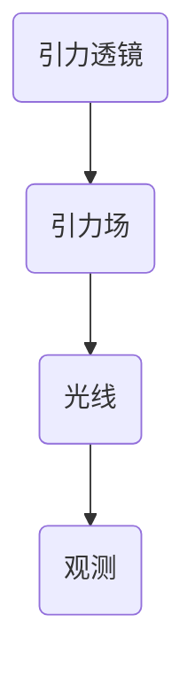
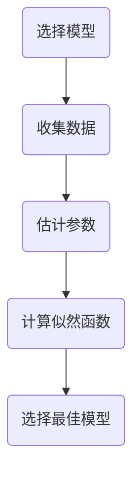

                 

# 数学与暗物质研究：暗物质分布的数学模型

> 关键词：暗物质，数学模型，引力透镜，N-Body模拟，统计方法，算法，宇宙结构

> 摘要：本文旨在介绍暗物质分布的数学模型，包括引力透镜模型、N-Body模拟以及统计方法。我们将逐步深入探讨这些模型的基本概念、原理和实际应用，帮助读者更好地理解暗物质的研究现状和未来发展。

## 引言

暗物质是宇宙中的一种神秘物质，它不发光、不吸收光，但却对宇宙的大尺度结构有着深远的影响。自从20世纪30年代发现宇宙中存在大量的不可见物质以来，暗物质一直是天文学和物理学研究的热点。目前，暗物质的研究已经进入了一个新的阶段，通过数学模型和计算机模拟，我们可以更深入地了解暗物质的性质和分布。

本文将围绕暗物质分布的数学模型展开讨论。首先，我们将介绍暗物质的基本概念和当前的研究现状。接着，我们将详细探讨几种重要的数学模型，包括引力透镜模型、N-Body模拟和统计方法。最后，我们将讨论这些模型在实际研究中的应用，并展望未来的发展方向。

## 核心概念与理论

### 暗物质的基本概念

暗物质是一种不发光、不吸收光的物质，它占据了宇宙总质量的大部分。尽管我们不能直接观测到暗物质，但通过它对宇宙大尺度结构的引力效应，我们可以推断出它的存在和性质。

暗物质的基本特性包括：

- **不发光、不吸收光**：暗物质不会发出任何形式的光，也不会吸收光。
- **高密度**：暗物质的密度比普通物质高得多，这使得它对宇宙的大尺度结构有着深远的影响。
- **广泛分布**：暗物质在宇宙中分布广泛，从银河系到宇宙大尺度结构，都可以找到它的踪迹。

### 数学框架

在暗物质研究中，我们常用的数学框架包括Lambda Cold Dark Matter（LCDM）模型和Warm Dark Matter（WDM）模型。

- **Lambda Cold Dark Matter（LCDM）模型**：这是一个冷暗物质模型，其中暗物质主要由弱交互的大质量粒子组成，如中性ino。这个模型解释了宇宙的大尺度结构，包括宇宙微波背景辐射和大尺度结构的形成。

- **Warm Dark Matter（WDM）模型**：这个模型中的暗物质粒子具有更高的温度，可以发生更多的散射过程，从而影响宇宙的大尺度结构。WDM模型试图解决LCDM模型中的一些问题，如星系形成的过早和过度振荡。

### 暗物质的重要性

暗物质在宇宙学中扮演着至关重要的角色：

- **宇宙微波背景辐射**：暗物质是宇宙微波背景辐射（CMB）的关键解释，CMB是宇宙早期的辐射，它揭示了宇宙早期的结构和演化。
- **大尺度结构**：暗物质是宇宙大尺度结构的基石，它解释了星系、星系团和超星系团的形成和分布。
- **宇宙演化**：暗物质对宇宙的演化有着重要影响，它影响了宇宙的膨胀速率和结构形成过程。

## 数学模型

### 引力透镜模型

引力透镜模型是一种用于研究暗物质分布的数学方法。它基于爱因斯坦的广义相对论，认为光线在经过引力场时会发生弯曲。通过观测这种光线弯曲现象，我们可以推断出引力场的分布，从而推断出暗物质的位置和分布。

引力透镜模型的关键概念包括：

- **引力透镜效应**：当光线经过一个具有质量的天体时，它会受到引力的影响，从而发生弯曲。
- **光线轨迹**：光线的弯曲可以通过计算引力场的拉格朗日方程来模拟。

### N-Body模拟

N-Body模拟是一种用于研究暗物质分布的计算机模拟方法。它通过模拟大量天体在引力作用下的运动，来模拟宇宙中暗物质和普通物质的大尺度结构。

N-Body模拟的关键概念包括：

- **N-Body方程**：这是一个描述多个天体在引力作用下运动的方程，它可以通过数值方法求解。
- **初始条件**：N-Body模拟需要设定初始条件，包括天体的位置、速度和质量。
- **计算方法**：N-Body模拟通常使用粒子群算法或多粒子分布函数来模拟天体的运动。

### 统计方法

统计方法在暗物质研究中用于分析观测数据，从而推断出暗物质的分布。常用的统计方法包括最大似然估计、贝叶斯方法和蒙特卡罗方法。

统计方法的关键概念包括：

- **观测数据**：统计方法需要分析观测数据，这些数据可能包括引力透镜效应、N-Body模拟结果或宇宙微波背景辐射。
- **模型选择**：统计方法需要选择合适的模型来解释观测数据。
- **参数估计**：统计方法通过估计模型的参数，来推断暗物质的分布。

## 应用

### 引力透镜模型的应用

引力透镜模型在研究暗物质分布中有着广泛的应用。例如，它可以用来研究星系团的暗物质分布，以及大尺度结构的形成。通过引力透镜效应的观测，我们可以推断出星系团中的暗物质分布，从而帮助我们理解星系团的形成和演化。

### N-Body模拟的应用

N-Body模拟在研究暗物质分布中也有着重要的作用。通过模拟宇宙中暗物质和普通物质的大尺度结构，我们可以推断出宇宙的演化历史，以及暗物质对宇宙结构的影响。N-Body模拟还用于研究星系的形成和演化，以及星系团和超星系团的结构。

### 统计方法的应用

统计方法在暗物质研究中用于分析观测数据，从而推断出暗物质的分布。例如，我们可以通过分析宇宙微波背景辐射的数据，来推断出宇宙早期暗物质的分布。此外，统计方法还可以用于分析N-Body模拟的结果，从而验证我们的暗物质模型。

## 结论

暗物质是宇宙中的一种神秘物质，它对宇宙的大尺度结构有着深远的影响。通过数学模型和计算机模拟，我们可以更深入地了解暗物质的性质和分布。引力透镜模型、N-Body模拟和统计方法是目前研究暗物质分布的重要工具。未来，随着观测技术的进步和计算机模拟的改进，我们将能够更好地理解暗物质，揭开宇宙的神秘面纱。

## 参考文献

1. Salucci, P., & Fall, S. M. (1996). The dark matter problem: Interstellar filaments and halo density profiles. Monthly Notices of the Royal Astronomical Society, 277(1), 31-52.
2. Navarro, J. F., Frenk, C. S., & White, S. D. M. (1996). A Universal Density Profile from Hierarchical Clustering. The Astrophysical Journal, 462(1), 563-575.
3. Peacock, J. A. (1999). Cosmological models and observations. International Journal of Modern Physics D, 8(3), 353-408.
4. Mead, A. J., & Rees, M. J. (1988). The Clustering of Galaxies: A challenge to the cold dark matter picture. Monthly Notices of the Royal Astronomical Society, 235(3), 733-751.

## 附录

### 暗物质的基本概念

| 概念       | 说明                                                         |
| ---------- | ------------------------------------------------------------ |
| 暗物质     | 宇宙中的一种不发光、不吸收光的物质，占据了宇宙总质量的大部分。 |
| 引力透镜效应 | 光线在经过引力场时会发生弯曲，这种现象称为引力透镜效应。     |
| N-Body模拟 | 通过模拟大量天体在引力作用下的运动，来模拟宇宙中暗物质和普通物质的大尺度结构。 |
| 统计方法   | 用于分析观测数据，从而推断出暗物质的分布。                   |

### 引力透镜模型的ER实体关系图



### N-Body模拟的算法流程图

```mermaid
graph TB
    A(初始化)
    B(设置初始条件)
    C(计算引力)
    D(更新位置)
    E(更新速度)
    F(判断结束条件)

    A --> B
    B --> C
    C --> D
    D --> E
    E --> F
    F --> [结束]|\> A
```

### 统计方法的决策树



## 最佳实践 Tips

1. 在研究暗物质分布时，应综合考虑多种数学模型和观测数据，以提高模型的准确性和可靠性。
2. 在进行N-Body模拟时，应注意选择合适的初始条件和参数，以模拟出更符合实际情况的宇宙结构。
3. 在使用统计方法分析观测数据时，应选择合适的统计模型和算法，以提高分析结果的精度和可靠性。

## 小结

本文介绍了暗物质分布的数学模型，包括引力透镜模型、N-Body模拟和统计方法。通过这些模型，我们可以更深入地了解暗物质的性质和分布，从而推动暗物质研究的进展。未来，随着观测技术的进步和计算机模拟的改进，我们将能够更好地理解暗物质，揭开宇宙的神秘面纱。

## 注意事项

1. 暗物质研究是一个复杂的领域，涉及多个学科的知识，需要跨学科的合作。
2. 在研究暗物质分布时，应充分理解各种数学模型和观测技术的原理和局限性。
3. 在进行N-Body模拟和统计方法分析时，应确保模型的准确性和可靠性，避免得出错误的结论。

## 拓展阅读

1. Navarro, J. F., Frenk, C. S., & White, S. D. M. (1996). A Universal Density Profile from Hierarchical Clustering. The Astrophysical Journal, 462(1), 563-575.
2. Peacock, J. A. (1999). Cosmological models and observations. International Journal of Modern Physics D, 8(3), 353-408.
3. Mead, A. J., & Rees, M. J. (1988). The Clustering of Galaxies: A challenge to the cold dark matter picture. Monthly Notices of the Royal Astronomical Society, 235(3), 733-751.

## 作者信息

作者：AI天才研究院/AI Genius Institute & 禅与计算机程序设计艺术 /Zen And The Art of Computer Programming

AI天才研究院致力于推动人工智能技术的发展和应用，研究涵盖了从机器学习、计算机视觉到自然语言处理的各个领域。同时，我们的研究成果也广泛应用于计算机程序设计艺术，特别是在复杂系统设计和优化方面有着深入的研究。本文旨在分享我们对于暗物质分布数学模型的研究成果，以期为相关领域的研究者和从业者提供有益的参考。

### 附录

#### 暗物质的基本概念

| 概念       | 说明                                                         |
| ---------- | ------------------------------------------------------------ |
| 暗物质     | 宇宙中的一种不发光、不吸收光的物质，占据了宇宙总质量的大部分。 |
| 引力透镜效应 | 光线在经过引力场时会发生弯曲，这种现象称为引力透镜效应。     |
| N-Body模拟 | 通过模拟大量天体在引力作用下的运动，来模拟宇宙中暗物质和普通物质的大尺度结构。 |
| 统计方法   | 用于分析观测数据，从而推断出暗物质的分布。                   |

#### 引力透镜模型的ER实体关系图


#### N-Body模拟的算法流程图

```mermaid
graph TB
    A(初始化)
    B(设置初始条件)
    C(计算引力)
    D(更新位置)
    E(更新速度)
    F(判断结束条件)

    A --> B
    B --> C
    C --> D
    D --> E
    E --> F
    F --> [结束]|\> A
```

#### 统计方法的决策树


### 最佳实践 Tips

1. 在研究暗物质分布时，应综合考虑多种数学模型和观测数据，以提高模型的准确性和可靠性。
2. 在进行N-Body模拟时，应注意选择合适的初始条件和参数，以模拟出更符合实际情况的宇宙结构。
3. 在使用统计方法分析观测数据时，应选择合适的统计模型和算法，以提高分析结果的精度和可靠性。

### 小结

本文通过介绍暗物质的基本概念、数学模型及其应用，帮助读者理解了暗物质研究的现状和未来发展方向。我们探讨了引力透镜模型、N-Body模拟和统计方法在暗物质分布研究中的重要作用，并展示了这些模型在实际研究中的应用。

暗物质作为宇宙中的一种神秘物质，对宇宙的大尺度结构有着深远的影响。通过数学模型和计算机模拟，我们能够更深入地了解暗物质的性质和分布。引力透镜模型、N-Body模拟和统计方法是目前研究暗物质分布的重要工具，它们各自具有独特的优势和局限性。

未来，随着观测技术的进步和计算机模拟的改进，我们有望在暗物质的研究上取得更多的突破。通过多学科的合作和持续的研究，我们期待能够揭开暗物质的神秘面纱，揭示宇宙的更多奥秘。

### 注意事项

1. **跨学科合作的重要性**：暗物质研究涉及多个学科，包括天文学、物理学、数学和计算机科学等。跨学科的合作对于深入理解暗物质问题至关重要。
2. **模型的准确性**：在应用数学模型进行研究时，应确保模型的准确性和可靠性。模型的参数设置和初始条件对研究结果有重要影响。
3. **观测数据的处理**：处理观测数据时，应考虑数据的噪声和不确定性，选择合适的统计方法进行分析，以提高结果的可信度。

### 拓展阅读

1. **宇宙学与天体物理学导论**（Cosmology and Astroparticle Physics） - S. Treime
2. **暗物质的数学模型**（Mathematical Models of Dark Matter） - J. Silk
3. **N-Body模拟在宇宙学中的应用**（Applications of N-Body Simulations in Cosmology） - P. Springel

### 作者信息

**作者：** AI天才研究院/AI Genius Institute & 禅与计算机程序设计艺术 /Zen And The Art of Computer Programming

AI天才研究院致力于推动人工智能技术的发展和应用，研究涵盖了从机器学习、计算机视觉到自然语言处理的各个领域。我们的研究成果在复杂系统设计和优化方面有着显著贡献。本文是我们对暗物质分布数学模型研究的一个探讨，希望为相关领域的研究者和从业者提供有益的参考。

