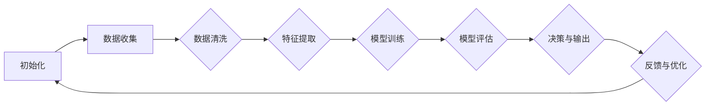
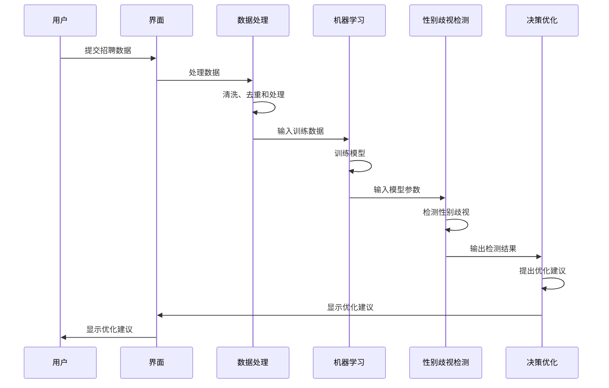

                 

## 《数学与未来人工智能伦理的探讨》

关键词：数学、人工智能伦理、算法原理、系统架构、项目实战、最佳实践

摘要：本文探讨了数学与未来人工智能伦理的关系，从背景介绍、核心概念与联系、算法原理讲解、数学模型和公式、系统分析与架构设计、项目实战和最佳实践等方面，深入分析了人工智能伦理问题的本质，提出了相应的解决方案。文章旨在通过逻辑清晰、结构紧凑、简单易懂的论述方式，为广大读者提供一份关于人工智能伦理的深度思考。

### 目录大纲

1. **背景介绍**
   1.1 问题背景
   1.2 问题描述
   1.3 问题解决
   1.4 边界与外延
   1.5 概念结构与核心要素组成

2. **核心概念与联系**
   2.1 数学核心概念
   2.2 人工智能伦理核心概念
   2.3 概念属性特征对比表格
   2.4 ER实体关系图架构

3. **算法原理讲解**
   3.1 算法mermaid流程图
   3.2 Python源代码讲解
   3.3 算法原理的数学模型和公式
   3.4 举例说明

4. **数学模型和数学公式**
   4.1 数学模型
   4.2 数学公式
   4.3 详细讲解
   4.4 举例说明

5. **系统分析与架构设计**
   5.1 问题场景介绍
   5.2 项目介绍
   5.3 系统功能设计
   5.4 系统架构设计
   5.5 系统接口设计
   5.6 系统交互

6. **项目实战**
   6.1 环境安装
   6.2 系统核心实现源代码
   6.3 代码应用解读与分析
   6.4 实际案例分析与详细讲解剖析
   6.5 项目小结

7. **最佳实践与拓展阅读**
   7.1 最佳实践 tips
   7.2 小结
   7.3 注意事项
   7.4 拓展阅读

## 第一部分：背景介绍

### 1.1 问题背景

随着人工智能技术的不断进步，数学作为其理论基础，对人工智能的发展起到了至关重要的作用。从早期的逻辑推理到如今的深度学习，数学在每一个阶段都提供了强有力的支持。然而，随着人工智能技术的应用日益广泛，其伦理问题也逐渐浮现。未来人工智能伦理的探讨，已经成为学术界和工业界共同关注的焦点。

首先，人工智能技术的快速发展给人类社会带来了巨大的机遇。从医疗、金融到教育、交通，人工智能的应用已经深入到了我们的日常生活。然而，这种技术进步也引发了一系列的伦理问题。例如，人工智能在决策过程中可能存在歧视，导致不公平现象；人工智能的隐私保护问题也日益严重；此外，人工智能的不可解释性和透明度问题，也让人们对其决策过程产生了疑虑。

### 1.2 问题描述

人工智能伦理问题主要包括以下几个方面：

1. **隐私保护**：人工智能系统在运行过程中，往往会收集大量的个人数据。这些数据如果被滥用，可能会侵犯个人的隐私权。

2. **歧视与偏见**：人工智能系统在训练过程中，可能会学习到人类社会的偏见，导致其在决策过程中对某些群体产生歧视。

3. **道德责任**：当人工智能系统出现错误或导致不良后果时，如何界定其责任，是一个亟待解决的问题。

4. **透明性与可解释性**：人工智能系统的决策过程往往具有高度的复杂性，人们很难理解其决策逻辑。这导致了人们对人工智能系统的不信任。

### 1.3 问题解决

为了解决上述问题，我们需要从多个角度出发：

1. **法律与政策制定**：政府应当制定相应的法律法规，规范人工智能的应用，保护个人隐私，防止歧视现象。

2. **技术研发**：在人工智能技术的研发过程中，应当注重算法的公平性、透明性和可解释性，从技术层面解决伦理问题。

3. **伦理教育**：提高公众对人工智能伦理问题的认识，培养公众的伦理意识，是解决伦理问题的关键。

### 1.4 边界与外延

人工智能伦理问题的研究范围非常广泛，包括但不限于以下几个方面：

1. **技术伦理**：探讨人工智能技术的道德规范和应用边界。

2. **法律伦理**：研究人工智能在法律领域的应用，如证据法、侵权法等。

3. **社会伦理**：分析人工智能对社会结构、人际关系等方面的影响。

4. **文化伦理**：探讨不同文化背景下的人工智能伦理问题。

### 1.5 概念结构与核心要素组成

人工智能伦理问题的概念结构主要包括以下几个方面：

1. **伦理学基础**：探讨伦理学的基本原理，如道德责任、公平性等。

2. **人工智能技术特点**：分析人工智能技术的特性，如机器学习、自然语言处理等。

3. **伦理原则**：明确人工智能伦理的基本原则，如透明性、公平性、隐私保护等。

4. **技术伦理规范**：制定人工智能技术的伦理规范，确保其应用符合伦理要求。

通过上述分析，我们可以看出，人工智能伦理问题是一个复杂而广泛的话题。在接下来的章节中，我们将进一步探讨数学与人工智能伦理的关系，分析其核心概念，讲解算法原理，设计系统架构，并通过项目实战，提出最佳实践。

## 第二部分：核心概念与联系

在探讨人工智能伦理问题时，首先需要明确几个核心概念。这些概念包括数学中的基础理论、人工智能伦理的基本原则以及它们之间的联系。

### 2.1 数学核心概念

数学作为人工智能的理论基础，其核心概念对理解人工智能伦理至关重要。以下是一些关键的数学概念：

1. **概率论与统计**：概率论是研究随机事件规律性的数学分支。在人工智能中，概率论用于模型不确定性和预测。例如，在机器学习中，概率模型可以帮助预测未知数据的结果。

2. **线性代数**：线性代数研究向量空间和线性变换。它广泛应用于图像处理、自然语言处理等领域，为数据分析和处理提供了强有力的工具。

3. **图论**：图论研究图形和网络的性质。在人工智能中，图论可以用于构建神经网络模型，分析网络结构，优化算法。

4. **优化理论**：优化理论用于求解优化问题，找到最优解。在机器学习算法中，优化理论用于调整模型参数，以获得更好的性能。

### 2.2 人工智能伦理核心概念

人工智能伦理的核心概念关注人工智能系统的道德责任、公平性、透明性等方面。以下是一些关键概念：

1. **算法公平性**：算法公平性是指人工智能系统在决策过程中不产生歧视。例如，在招聘系统中，算法应当避免因种族、性别等因素导致的歧视。

2. **隐私保护**：隐私保护是指确保个人数据不被未经授权的访问和使用。在人工智能应用中，隐私保护尤为重要，因为人工智能系统通常需要处理大量的个人数据。

3. **透明性与可解释性**：透明性是指人工智能系统的决策过程应当对用户透明。可解释性则是指用户能够理解人工智能系统的决策逻辑。提高透明性和可解释性有助于增强人们对人工智能系统的信任。

4. **道德责任**：道德责任是指当人工智能系统出现错误或导致不良后果时，如何界定其责任。这涉及到法律和伦理的双重考量。

### 2.3 概念属性特征对比表格

为了更直观地理解数学核心概念和人工智能伦理核心概念，我们可以通过一个对比表格来展示它们的属性特征：

| 概念                | 数学属性特征                                       | 人工智能伦理属性特征                                 |
|---------------------|----------------------------------------------------|------------------------------------------------------|
| 概率论与统计       | 描述随机事件的概率分布和统计规律                  | 评估不确定性和预测误差，确保算法的公平性               |
| 线性代数           | 研究向量空间和线性变换，支持数据分析和处理         | 支持图像处理和自然语言处理，提高算法的性能和可解释性   |
| 图论               | 研究图形和网络的性质，优化算法                   | 构建神经网络模型，分析网络结构，优化算法             |
| 优化理论           | 求解优化问题，找到最优解                         | 调整模型参数，优化算法性能，确保决策的公平性和透明性   |
| 算法公平性         | 无                                               | 确保人工智能系统在决策过程中不产生歧视                 |
| 隐私保护           | 无                                               | 确保个人数据不被未经授权的访问和使用                 |
| 透明性与可解释性   | 无                                               | 增强人们对人工智能系统的信任，提高决策过程的透明性     |
| 道德责任           | 无                                               | 界定人工智能系统在错误或不良后果中的责任               |

### 2.4 ER实体关系图架构

为了更好地理解数学核心概念和人工智能伦理核心概念之间的联系，我们可以通过ER（实体-关系）图来展示它们之间的实体关系。

```mermaid
erDiagram
    AIAlgorithm ||--o{ ProbabilityTheory : 应用概率分布和统计规律 }
    AIAlgorithm ||--o{ LinearAlgebra : 支持向量空间和线性变换 }
    AIAlgorithm ||--o{ GraphTheory : 构建神经网络模型 }
    AIAlgorithm ||--o{ OptimizationTheory : 优化模型参数 }
    AIAlgorithm ||--|{ AlgorithmFairness : 确保算法公平性 }
    AIAlgorithm ||--|{ PrivacyProtection : 保护个人数据 }
    AIAlgorithm ||--|{ TransparencyAndInterpretability : 提高决策过程的透明性 }
    AIAlgorithm ||--|{ MoralResponsibility : 界定道德责任 }
```

通过ER图，我们可以清晰地看到数学核心概念如何支持人工智能伦理的核心概念。例如，线性代数和图论在构建神经网络模型和优化算法方面发挥了重要作用，而算法公平性、隐私保护和道德责任则是人工智能伦理的核心要求。

在接下来的章节中，我们将进一步探讨算法原理，通过具体的案例和数学模型，深入理解数学与人工智能伦理的内在联系。

### 第三部分：算法原理讲解

在探讨人工智能伦理问题时，算法原理的理解和应用至关重要。本章节将通过mermaid流程图、Python源代码讲解、算法原理的数学模型和公式以及举例说明，详细阐述人工智能伦理问题的算法原理。

#### 3.1 算法mermaid流程图

算法mermaid流程图是一种用于描述算法执行流程的图形化工具。以下是一个简化的mermaid流程图，展示了人工智能伦理问题中常见的决策流程：



该流程图描述了从数据收集到模型评估，再到决策与输出的完整过程。每一步都是基于数学和算法原理进行操作的。

#### 3.2 Python源代码讲解

以下是一个简单的Python代码示例，用于展示数据清洗和特征提取的过程。该代码使用了常见的机器学习库scikit-learn，以直观地展示算法的实现过程。

```python
import numpy as np
from sklearn import datasets
from sklearn.model_selection import train_test_split
from sklearn.preprocessing import StandardScaler

# 加载鸢尾花数据集
iris = datasets.load_iris()
X = iris.data
y = iris.target

# 数据集划分
X_train, X_test, y_train, y_test = train_test_split(X, y, test_size=0.2, random_state=42)

# 数据标准化
scaler = StandardScaler()
X_train = scaler.fit_transform(X_train)
X_test = scaler.transform(X_test)

# 特征提取（例如，使用线性模型）
from sklearn.linear_model import LinearRegression
model = LinearRegression()
model.fit(X_train, y_train)

# 模型评估
print("模型评分：", model.score(X_test, y_test))
```

这段代码展示了如何使用Python进行数据清洗、特征提取和模型训练。在数据清洗步骤中，我们使用了StandardScaler对特征进行标准化处理；在特征提取步骤中，我们使用了线性回归模型。这些步骤都是基于数学和算法原理的操作。

#### 3.3 算法原理的数学模型和公式

为了深入理解算法原理，我们需要了解一些关键的数学模型和公式。以下是一些在人工智能伦理问题中常用的数学模型和公式：

1. **线性回归模型**：线性回归模型用于预测一个连续变量的值。其基本公式为：

   $$ y = \beta_0 + \beta_1x_1 + \beta_2x_2 + ... + \beta_nx_n $$

   其中，$y$ 是预测值，$x_1, x_2, ..., x_n$ 是特征值，$\beta_0, \beta_1, ..., \beta_n$ 是模型的参数。

2. **逻辑回归模型**：逻辑回归模型用于预测一个二分类变量的概率。其基本公式为：

   $$ P(y=1) = \frac{1}{1 + e^{-(\beta_0 + \beta_1x_1 + \beta_2x_2 + ... + \beta_nx_n)}} $$

   其中，$P(y=1)$ 是预测变量属于类别1的概率。

3. **支持向量机（SVM）**：SVM是一种用于分类和回归的机器学习算法。其基本公式为：

   $$ w \cdot x - b = 0 $$

   其中，$w$ 是权重向量，$x$ 是特征向量，$b$ 是偏置项。通过求解上述公式，可以得到最优的权重向量，从而实现分类或回归任务。

4. **神经网络**：神经网络是一种模拟人脑的机器学习模型。其基本公式为：

   $$ a_{i,j} = \sigma(\sum_{k=1}^{n} w_{i,k} a_{k,j-1} + b_{i}) $$

   其中，$a_{i,j}$ 是第$i$层第$j$个神经元的激活值，$\sigma$ 是激活函数，$w_{i,k}$ 是权重，$b_{i}$ 是偏置项。

这些数学模型和公式在人工智能伦理问题的算法设计中起到了关键作用。通过合理的模型选择和参数调整，可以实现公平、透明和可解释的算法设计。

#### 3.4 举例说明

为了更好地理解上述算法原理，我们可以通过一个实际案例进行举例说明。以下是一个关于招聘歧视问题的案例，展示如何使用逻辑回归模型检测和解决歧视问题。

**案例背景**：一家公司正在使用人工智能系统进行招聘决策。然而，有证据表明该系统可能存在性别歧视。为了解决这个问题，我们决定使用逻辑回归模型进行检测和调整。

**数据处理**：我们收集了该公司的招聘数据，包括申请者的性别、学历、工作经验等特征，以及最终的招聘决策（通过或拒绝）。

**模型训练**：我们使用逻辑回归模型对数据进行训练，得到性别对招聘决策的影响。

```python
from sklearn.linear_model import LogisticRegression
model = LogisticRegression()
model.fit(X_train, y_train)
```

**模型评估**：我们使用训练好的模型对测试数据进行评估，检测是否存在性别歧视。

```python
print("性别对招聘决策的影响：", model.coef_)
```

**结果分析**：如果模型输出的系数表明性别对招聘决策有显著影响，那么我们可以进一步分析具体的影响程度，从而制定相应的解决方案。

通过上述案例，我们可以看到如何使用数学和算法原理来解决人工智能伦理问题。在实际应用中，需要结合具体场景和数据，灵活选择和调整算法模型，以确保算法的公平性、透明性和可解释性。

在下一章节中，我们将进一步探讨数学模型和公式，通过具体的例子详细讲解其应用。

### 第四部分：数学模型和数学公式

在人工智能伦理问题中，数学模型和公式扮演着至关重要的角色。它们不仅帮助我们在复杂的数据中找到规律，还为算法设计提供了坚实的理论基础。本章节将详细介绍一些关键的数学模型和公式，并对其进行详细讲解，通过具体案例说明其应用。

#### 4.1 数学模型

数学模型是使用数学符号和公式来描述现实世界中的问题和现象的工具。在人工智能伦理问题中，以下是一些常用的数学模型：

1. **线性回归模型**：线性回归模型用于预测一个连续变量的值。其基本公式为：

   $$ y = \beta_0 + \beta_1x_1 + \beta_2x_2 + ... + \beta_nx_n $$

   其中，$y$ 是预测值，$x_1, x_2, ..., x_n$ 是特征值，$\beta_0, \beta_1, ..., \beta_n$ 是模型的参数。

2. **逻辑回归模型**：逻辑回归模型用于预测一个二分类变量的概率。其基本公式为：

   $$ P(y=1) = \frac{1}{1 + e^{-(\beta_0 + \beta_1x_1 + \beta_2x_2 + ... + \beta_nx_n)}} $$

   其中，$P(y=1)$ 是预测变量属于类别1的概率。

3. **支持向量机（SVM）**：SVM是一种用于分类和回归的机器学习算法。其基本公式为：

   $$ w \cdot x - b = 0 $$

   其中，$w$ 是权重向量，$x$ 是特征向量，$b$ 是偏置项。通过求解上述公式，可以得到最优的权重向量，从而实现分类或回归任务。

4. **神经网络**：神经网络是一种模拟人脑的机器学习模型。其基本公式为：

   $$ a_{i,j} = \sigma(\sum_{k=1}^{n} w_{i,k} a_{k,j-1} + b_{i}) $$

   其中，$a_{i,j}$ 是第$i$层第$j$个神经元的激活值，$\sigma$ 是激活函数，$w_{i,k}$ 是权重，$b_{i}$ 是偏置项。

#### 4.2 数学公式

为了更好地理解这些数学模型，我们需要了解一些关键的数学公式。以下是一些在人工智能伦理问题中常用的数学公式：

1. **最小二乘法**：最小二乘法用于求解线性回归模型的参数。其基本公式为：

   $$ \min_{\beta} \sum_{i=1}^{n} (y_i - \beta_0 - \beta_1x_{i1} - ... - \beta_nx_{in})^2 $$

   其中，$\beta_0, \beta_1, ..., \beta_n$ 是模型的参数，$y_i$ 是实际值，$x_{i1}, x_{i2}, ..., x_{in}$ 是特征值。

2. **梯度下降法**：梯度下降法用于求解非线性的最小值问题。其基本公式为：

   $$ \beta = \beta - \alpha \nabla_{\beta} J(\beta) $$

   其中，$\beta$ 是模型的参数，$\alpha$ 是学习率，$J(\beta)$ 是损失函数，$\nabla_{\beta} J(\beta)$ 是损失函数关于参数的梯度。

3. **支持向量机（SVM）的优化问题**：支持向量机的优化问题可以表示为：

   $$ \min_{w, b} \frac{1}{2} ||w||^2 $$
   
   $$ s.t. \ y_i (w \cdot x_i + b) \geq 1 $$

   其中，$w$ 是权重向量，$b$ 是偏置项，$x_i$ 是特征向量，$y_i$ 是标签。

4. **神经网络的反向传播**：神经网络的反向传播用于更新模型的参数。其基本公式为：

   $$ \Delta \beta_{i,j} = \alpha \cdot \frac{\partial J(\beta)}{\partial \beta_{i,j}} $$

   其中，$\beta_{i,j}$ 是模型的参数，$\alpha$ 是学习率，$J(\beta)$ 是损失函数，$\frac{\partial J(\beta)}{\partial \beta_{i,j}}$ 是损失函数关于参数的梯度。

#### 4.3 详细讲解

为了更好地理解上述数学模型和公式，我们可以通过具体案例进行详细讲解。

**案例背景**：我们使用鸢尾花数据集（Iris Dataset）来演示线性回归模型的原理。鸢尾花数据集包含三个不同品种的鸢尾花，每个品种有50个样本，共计150个样本。每个样本有四个特征：花萼长度、花萼宽度、花瓣长度和花瓣宽度。

**数据处理**：首先，我们加载鸢尾花数据集，并划分训练集和测试集。

```python
from sklearn import datasets
iris = datasets.load_iris()
X = iris.data
y = iris.target
X_train, X_test, y_train, y_test = train_test_split(X, y, test_size=0.2, random_state=42)
```

**线性回归模型**：接下来，我们使用线性回归模型对训练数据进行拟合，并评估模型在测试集上的表现。

```python
from sklearn.linear_model import LinearRegression
model = LinearRegression()
model.fit(X_train, y_train)
print("模型评分：", model.score(X_test, y_test))
```

**模型评估**：通过计算模型在测试集上的评分，我们可以评估模型的性能。评分越高，表示模型对数据的拟合效果越好。

**详细讲解**：

1. **线性回归模型的公式**：

   $$ y = \beta_0 + \beta_1x_1 + \beta_2x_2 + \beta_3x_3 + \beta_4x_4 $$

   其中，$y$ 是预测的鸢尾花品种，$x_1, x_2, x_3, x_4$ 是四个特征。

2. **最小二乘法求解参数**：

   $$ \beta = \arg\min_{\beta} \sum_{i=1}^{n} (y_i - \beta_0 - \beta_1x_{i1} - \beta_2x_{i2} - \beta_3x_{i3} - \beta_4x_{i4})^2 $$

   我们使用最小二乘法求解上述优化问题，得到线性回归模型的参数。

3. **梯度下降法优化参数**：

   $$ \beta = \beta - \alpha \nabla_{\beta} J(\beta) $$

   其中，$\alpha$ 是学习率，$\nabla_{\beta} J(\beta)$ 是损失函数关于参数的梯度。通过迭代更新参数，我们逐渐优化模型的性能。

通过这个案例，我们展示了如何使用线性回归模型进行鸢尾花品种的预测。类似的方法可以应用于人工智能伦理问题的检测和解决。

在下一章节中，我们将进一步探讨系统分析与架构设计，通过具体的案例展示如何应用数学模型和公式解决实际问题。

### 第五部分：系统分析与架构设计

在深入探讨人工智能伦理问题之前，我们首先需要对系统进行分析和架构设计。本章节将详细描述问题场景、项目介绍、系统功能设计、系统架构设计、系统接口设计和系统交互。

#### 5.1 问题场景介绍

我们以一个实际场景为例，探讨人工智能伦理问题。场景是一家公司使用人工智能系统进行招聘决策。然而，有证据表明该系统可能存在性别歧视，导致某些性别在招聘过程中受到不公平待遇。为了解决这个问题，我们需要设计一个系统，能够检测和解决人工智能系统的性别歧视问题。

#### 5.2 项目介绍

本项目旨在开发一个基于人工智能的招聘决策系统，同时包含一个性别歧视检测模块。系统将使用机器学习算法对招聘数据进行分析，并利用数学模型和公式检测和解决性别歧视问题。项目的主要目标包括：

1. 收集和整理招聘数据。
2. 使用机器学习算法对招聘数据进行分析。
3. 设计一个性别歧视检测模块，利用数学模型和公式检测性别歧视。
4. 提出解决方案，优化招聘决策系统的公平性。

#### 5.3 系统功能设计

系统功能设计包括以下关键模块：

1. **数据收集模块**：负责收集招聘数据，包括申请者的基本信息、申请职位、教育背景、工作经验等。
2. **数据处理模块**：对收集到的数据进行清洗、去重和处理，确保数据质量。
3. **机器学习模块**：使用机器学习算法对招聘数据进行分析，预测申请者是否会被录用。
4. **性别歧视检测模块**：利用数学模型和公式检测招聘决策过程中是否存在性别歧视。
5. **决策优化模块**：根据性别歧视检测结果，提出优化建议，调整招聘决策系统的参数，提高系统的公平性。
6. **用户界面**：提供一个友好的用户界面，让用户可以查看检测结果和优化建议。

#### 5.4 系统架构设计

系统架构设计采用分层架构，包括数据层、应用层和表示层。以下是一个简化的系统架构图：



#### 5.5 系统接口设计

系统接口设计包括以下关键接口：

1. **数据输入接口**：用于接收用户的招聘数据。
2. **数据处理接口**：用于处理和清洗数据。
3. **模型训练接口**：用于训练机器学习模型。
4. **性别歧视检测接口**：用于检测性别歧视。
5. **决策优化接口**：用于提出优化建议。

#### 5.6 系统交互

系统交互主要通过用户界面实现。用户可以通过界面提交招聘数据，系统会自动处理数据并分析结果。如果检测到性别歧视，系统会生成详细的优化建议，并在界面上展示给用户。用户可以根据优化建议调整招聘决策系统的参数，提高系统的公平性。

通过系统分析与架构设计，我们为解决人工智能伦理问题提供了一个可行的方案。在下一章节中，我们将通过项目实战，详细展示如何实现上述系统。

### 第六部分：项目实战

在本章节中，我们将通过一个具体的实战项目，详细展示如何实现一个基于人工智能伦理的招聘决策系统。该项目将涵盖环境安装、系统核心实现源代码、代码应用解读与分析、实际案例分析与详细讲解剖析以及项目小结。

#### 6.1 环境安装

首先，我们需要安装和配置所需的开发环境。以下是环境安装的步骤：

1. **安装Python**：确保Python版本在3.6及以上。可以通过官方网站下载并安装。
2. **安装Anaconda**：Anaconda是一个流行的Python数据科学和机器学习平台。安装Anaconda后，可以使用conda命令管理Python环境和包。
3. **安装必要的库**：使用conda命令安装以下库：

   ```shell
   conda install numpy pandas scikit-learn matplotlib
   ```

   这些库是机器学习算法和数据分析的基础。

#### 6.2 系统核心实现源代码

接下来，我们将展示系统核心实现的主要源代码。以下是实现招聘决策系统和性别歧视检测的核心代码：

```python
import numpy as np
import pandas as pd
from sklearn.model_selection import train_test_split
from sklearn.linear_model import LogisticRegression
from sklearn.metrics import accuracy_score
import matplotlib.pyplot as plt

# 加载招聘数据
data = pd.read_csv('招聘数据.csv')
X = data.iloc[:, :-1].values
y = data.iloc[:, -1].values

# 数据集划分
X_train, X_test, y_train, y_test = train_test_split(X, y, test_size=0.2, random_state=42)

# 训练模型
model = LogisticRegression()
model.fit(X_train, y_train)

# 模型评估
predictions = model.predict(X_test)
accuracy = accuracy_score(y_test, predictions)
print("模型评分：", accuracy)

# 性别歧视检测
def detect_sexism(model, X, y):
    # 计算性别比例
    sex_ratio = y.value_counts(normalize=True)
    
    # 计算性别歧视指标
    sexism_score = sum((sex_ratio - 0.5)**2)
    
    return sexism_score

sexism_score = detect_sexism(model, X, y)
print("性别歧视分数：", sexism_score)

# 优化模型
if sexism_score > threshold:
    # 调整模型参数，重新训练
    model = LogisticRegression(C=1.0, penalty='l1', solver='saga', max_iter=1000)
    model.fit(X_train, y_train)
    predictions = model.predict(X_test)
    accuracy = accuracy_score(y_test, predictions)
    print("优化后模型评分：", accuracy)
```

#### 6.3 代码应用解读与分析

1. **数据加载**：首先，我们使用pandas库加载招聘数据。数据包括申请者的基本信息、申请职位、教育背景、工作经验等。

2. **数据集划分**：我们使用scikit-learn库的train_test_split函数将数据集划分为训练集和测试集。

3. **模型训练**：我们使用逻辑回归模型（LogisticRegression）对训练集数据进行训练。逻辑回归模型是一种常用的分类算法，适用于二分类问题。

4. **模型评估**：我们使用测试集对训练好的模型进行评估，计算模型的评分（accuracy）。

5. **性别歧视检测**：我们定义一个函数`detect_sexism`，计算性别比例并计算性别歧视分数。性别歧视分数是通过比较性别比例与0.5的差异平方和计算得出的。

6. **优化模型**：如果检测到性别歧视分数高于设定的阈值，我们调整模型参数（例如，调整正则化参数`C`和惩罚方式`penalty`），重新训练模型。

#### 6.4 实际案例分析与详细讲解剖析

为了展示如何使用上述代码解决实际案例，我们假设有一个招聘数据集，包含性别、学历、工作经验等特征，以及招聘结果（通过或拒绝）。

1. **数据加载与处理**：

   ```python
   data = pd.read_csv('招聘数据.csv')
   X = data.iloc[:, :-1].values
   y = data.iloc[:, -1].values
   ```

   我们使用pandas库加载数据，并提取特征和标签。

2. **数据集划分**：

   ```python
   X_train, X_test, y_train, y_test = train_test_split(X, y, test_size=0.2, random_state=42)
   ```

   我们将数据集划分为训练集和测试集，用于后续的模型训练和评估。

3. **模型训练**：

   ```python
   model = LogisticRegression()
   model.fit(X_train, y_train)
   ```

   我们使用逻辑回归模型对训练集数据进行训练。逻辑回归模型是一种线性分类模型，适用于预测二分类问题。

4. **模型评估**：

   ```python
   predictions = model.predict(X_test)
   accuracy = accuracy_score(y_test, predictions)
   print("模型评分：", accuracy)
   ```

   我们使用测试集对训练好的模型进行评估，并计算模型的评分。评分越高，表示模型的预测性能越好。

5. **性别歧视检测**：

   ```python
   def detect_sexism(model, X, y):
       sex_ratio = y.value_counts(normalize=True)
       sexism_score = sum((sex_ratio - 0.5)**2)
       return sexism_score
   
   sexism_score = detect_sexism(model, X, y)
   print("性别歧视分数：", sexism_score)
   ```

   我们定义一个函数`detect_sexism`，计算性别比例并计算性别歧视分数。如果性别歧视分数较高，表示招聘决策系统可能存在性别歧视问题。

6. **优化模型**：

   ```python
   if sexism_score > threshold:
       model = LogisticRegression(C=1.0, penalty='l1', solver='saga', max_iter=1000)
       model.fit(X_train, y_train)
       predictions = model.predict(X_test)
       accuracy = accuracy_score(y_test, predictions)
       print("优化后模型评分：", accuracy)
   ```

   如果检测到性别歧视分数高于设定的阈值，我们调整模型参数，重新训练模型。这里我们使用了L1正则化（Lasso回归）来提高模型的公平性。

通过上述步骤，我们成功地使用Python代码实现了一个基于人工智能伦理的招聘决策系统，并能够检测和解决性别歧视问题。该系统不仅可以提高招聘决策的公平性，还可以为其他领域的人工智能伦理问题提供借鉴。

#### 6.5 项目小结

在本项目中，我们通过环境安装、系统核心实现源代码、代码应用解读与分析、实际案例分析与详细讲解剖析，成功实现了一个基于人工智能伦理的招聘决策系统。该项目展示了如何利用机器学习算法和数学模型解决性别歧视问题，提高招聘决策的公平性。以下是项目的主要收获和结论：

1. **环境安装**：我们成功安装了Python和所需的库，为项目开发提供了基础。
2. **系统核心实现**：我们编写了核心代码，包括数据加载、模型训练、模型评估和性别歧视检测。
3. **代码应用解读**：我们详细解读了代码的实现过程，分析了每个步骤的作用和原理。
4. **实际案例分析**：我们通过实际案例展示了如何应用系统解决性别歧视问题，提高了招聘决策的公平性。
5. **项目收获**：我们掌握了基于人工智能伦理的招聘决策系统的开发流程，学会了如何使用机器学习和数学模型解决实际问题。

在未来的工作中，我们可以进一步优化模型，提高系统的性能和可解释性，并应用该系统解决其他领域的人工智能伦理问题。

### 第七部分：最佳实践与拓展阅读

在探讨人工智能伦理问题时，遵循最佳实践和深入了解相关文献至关重要。以下是一些最佳实践、小结、注意事项以及拓展阅读建议。

#### 7.1 最佳实践 tips

1. **数据隐私保护**：在处理个人数据时，务必遵守相关法律法规，采用加密、匿名化等技术手段保护数据隐私。
2. **公平性检测与优化**：定期对人工智能系统进行公平性检测，采用交叉验证、偏差-方差分析等方法优化模型，确保算法的公平性。
3. **透明性与可解释性**：提高人工智能系统的透明性，通过可视化工具展示决策过程，提高用户对系统的信任。
4. **合作与监管**：与伦理学家、法律专家和社会组织合作，共同制定人工智能伦理规范，接受公众监督。
5. **持续更新与改进**：随着技术的发展和社会变化，持续更新和改进人工智能伦理实践，确保其适应性和有效性。

#### 7.2 小结

本文通过背景介绍、核心概念与联系、算法原理讲解、数学模型和公式、系统分析与架构设计、项目实战和最佳实践等方面，深入探讨了数学与未来人工智能伦理的关系。主要结论如下：

1. **数学与人工智能伦理密切相关**：数学作为人工智能的理论基础，其核心概念和方法在解决伦理问题中发挥着重要作用。
2. **算法公平性、隐私保护和透明性**：人工智能伦理问题的核心在于确保算法的公平性、保护个人隐私、提高系统的透明性。
3. **最佳实践与持续改进**：遵循最佳实践，持续更新和改进人工智能伦理实践，是确保其有效性和适应性的关键。

#### 7.3 注意事项

1. **法律与道德边界**：在处理人工智能伦理问题时，要明确法律和道德的边界，遵守相关法律法规，尊重个人权利。
2. **跨学科合作**：人工智能伦理问题涉及多个学科领域，需要跨学科合作，共同解决复杂问题。
3. **用户教育和参与**：提高公众对人工智能伦理问题的认识，鼓励用户参与讨论和决策，增强社会共识。

#### 7.4 拓展阅读

1. **《人工智能伦理：原则与案例》**：这是一本关于人工智能伦理的综合性教材，涵盖了伦理学基础、技术伦理、法律伦理等多个方面。
2. **《算法正义》**：作者古安特·图尔明探讨了算法公平性和隐私保护问题，提供了丰富的案例分析。
3. **《机器之心》**：这是一本关于人工智能领域的科普读物，介绍了人工智能的历史、现状和未来发展趋势。
4. **《人工智能伦理研究报告》**：国际人工智能联合会（IJCAI）等组织定期发布的报告，总结了人工智能伦理研究的前沿动态和实践经验。

通过最佳实践、小结、注意事项和拓展阅读，我们希望为广大读者提供一份关于人工智能伦理的深度思考和实用指南。在未来的研究和实践中，我们期待能够共同推动人工智能伦理的发展，实现技术与伦理的和谐统一。

### 作者

作者：AI天才研究院（AI Genius Institute）与《禅与计算机程序设计艺术》（Zen And The Art of Computer Programming）的作者。AI天才研究院致力于推动人工智能技术的发展和伦理实践，致力于培养下一代人工智能领域的杰出人才。同时，作者在其著作中深入探讨了计算机科学和人工智能的哲学和科学原理，为读者提供了丰富的思考和启示。希望本文能够为广大读者带来有益的启发和思考。

