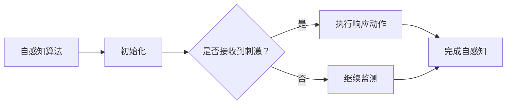
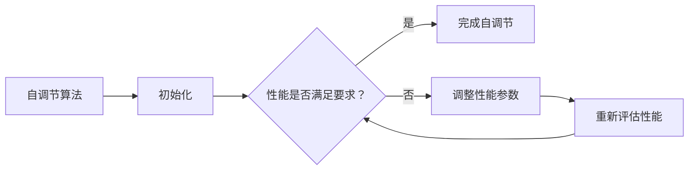
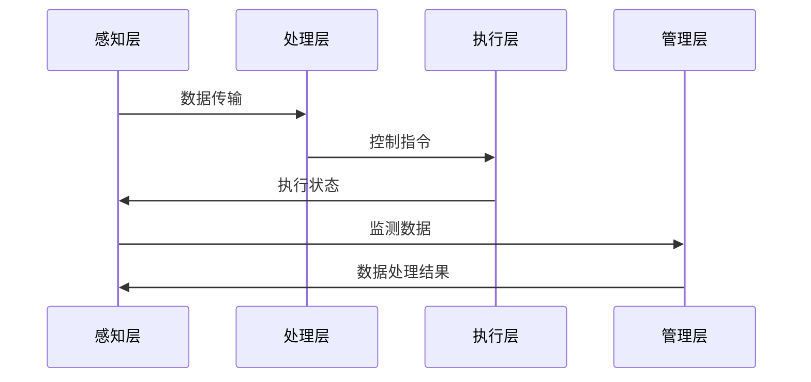

                 

# 数学与未来智能材料的发展方向

## 关键词

- 数学模型
- 智能材料
- 自感知
- 自调节
- 自修复

## 摘要

随着科技的快速发展，智能材料已成为现代材料科学领域的研究热点。本文通过探讨数学模型在智能材料中的应用，分析了未来智能材料的发展方向。文章首先介绍了数学模型在材料科学中的基础地位，然后阐述了未来智能材料的发展趋势。接着，文章详细介绍了数学模型与智能材料的核心概念，并探讨了它们之间的联系。随后，文章介绍了常见算法原理，并通过mermaid流程图和Python代码进行详细讲解。最后，文章从系统分析与架构设计、项目实战、最佳实践与拓展等方面对智能材料进行了深入剖析，为未来的智能材料研究提供了有益的参考。

## 目录大纲

1. **问题背景与核心概念**
   1.1 问题背景
   1.1.1 数学在材料科学中的基础地位
   1.1.2 未来智能材料的发展趋势
   1.2 核心概念
   1.2.1 数学模型与智能材料
   1.2.2 智能材料的核心特征

2. **核心概念与联系**
   2.1 数学模型原理
   2.1.1 常见数学模型介绍
   2.1.2 数学模型属性特征对比表
   2.2 智能材料核心概念
   2.2.1 智能材料的基本概念
   2.2.2 智能材料与数学模型的联系

3. **算法原理与数学模型**
   3.1 常见算法介绍
   3.1.1 智能材料感知算法
   3.1.2 智能材料调节算法
   3.2 算法mermaid流程图
   3.2.1 自感知算法流程图
   3.2.2 自调节算法流程图
   3.3 算法原理讲解与公式推导
   3.3.1 自感知算法原理讲解
   3.3.2 自调节算法原理讲解

4. **系统分析与架构设计**
   4.1 问题场景介绍
   4.1.1 智能材料应用场景分析
   4.2 系统功能设计
   4.2.1 领域模型mermaid类图
   4.3 系统架构设计
   4.2.2 系统架构mermaid架构图
   4.4 系统接口设计与交互
   4.2.3 系统接口设计
   4.2.4 系统交互mermaid序列图

5. **项目实战**
   5.1 环境安装
   5.1.1 环境搭建
   5.2 系统核心实现
   5.2.1 核心实现源代码
   5.2.2 代码应用解读与分析
   5.3 实际案例分析与讲解
   5.3.1 案例一：智能材料温度调节
   5.3.2 案例二：智能材料自修复
   5.4 项目小结

6. **最佳实践与拓展**
   6.1 最佳实践 tips
   6.2 小结与注意事项
   6.3 拓展阅读

## 1. 问题背景与核心概念

### 1.1 问题背景

材料科学作为一门综合性学科，与人类生活息息相关。随着科技的不断进步，材料科学正面临着前所未有的机遇和挑战。传统材料已无法满足现代社会对高性能、多功能、环境友好的材料需求，因此，智能材料的研究应运而生。智能材料是指能够响应外部刺激（如温度、压力、光照、磁场等）并产生相应响应的新型功能材料。它们具有自感知、自调节、自修复等功能，可以极大地提高材料的使用性能和寿命。

### 1.1.1 数学在材料科学中的基础地位

数学作为材料科学发展的基石，其作用不可忽视。数学模型在材料科学中广泛应用于材料结构分析、性能预测、材料设计等方面。例如，线性代数用于描述材料中的应力分布，微积分用于分析材料表面的微观结构，概率论用于评估材料的可靠性。数学模型不仅能够帮助科学家和工程师更好地理解和设计材料，还能预测新材料的功能特性。

### 1.1.2 未来智能材料的发展趋势

未来智能材料的发展趋势主要包括以下几个方面：

1. **多功能化**：智能材料将具有多种功能，如传感、能量转换、催化等，满足不同应用场景的需求。
2. **智能化**：智能材料将具备更高的智能水平，能够根据环境变化自主调节其性能，实现自我修复和自优化。
3. **环境友好**：智能材料将更加注重环保，降低生产过程中的能耗和污染，具有更好的可持续性。

### 1.2 核心概念

#### 1.2.1 数学模型与智能材料

数学模型在智能材料中的应用主要体现在以下几个方面：

1. **材料性能预测**：通过数学模型预测新材料在特定条件下的性能，为材料设计提供依据。
2. **结构优化**：利用数学模型优化材料结构，提高材料性能和稳定性。
3. **功能实现**：将数学模型应用于智能材料的功能实现，如自感知、自调节、自修复等。

#### 1.2.2 智能材料的核心特征

智能材料的核心特征包括自感知、自调节和自修复：

1. **自感知**：智能材料能够感知外部环境的刺激，如温度、压力、光照等。
2. **自调节**：智能材料能够根据感知到的刺激自主调节其性能，以适应环境变化。
3. **自修复**：智能材料能够在受损后自主修复，延长材料使用寿命。

## 2. 核心概念与联系

### 2.1 数学模型原理

#### 2.1.1 常见数学模型介绍

在智能材料的研究中，常见的数学模型包括：

1. **线性代数**：用于描述材料中的应力分布、晶体结构等。
2. **微积分**：用于分析材料表面的微观结构、材料的演化过程等。
3. **概率论**：用于评估材料的可靠性、预测材料性能等。

#### 2.1.2 数学模型属性特征对比表

下面是一个简单的数学模型属性特征对比表：

| 数学模型 | 用途 | 特点 |
| :----: | :----: | :----: |
| 线性代数 | 应力分布、晶体结构 | 解线性方程组、矩阵运算 |
| 微积分 | 微观结构分析、演化过程 | 导数、积分、微分方程 |
| 概率论 | 可靠性评估、性能预测 | 概率分布、随机变量 |

### 2.2 智能材料核心概念

#### 2.2.1 智能材料的基本概念

智能材料是指能够响应外部刺激并产生相应响应的新型功能材料。它们通常具有以下特点：

1. **多功能性**：智能材料具有多种功能，如传感、能量转换、催化等。
2. **自适应能力**：智能材料能够根据环境变化自主调节其性能。
3. **环境友好**：智能材料在制造和使用过程中具有较低的环境影响。

#### 2.2.2 智能材料与数学模型的联系

智能材料与数学模型之间的联系主要体现在以下几个方面：

1. **材料设计**：通过数学模型预测新材料的功能特性，为材料设计提供依据。
2. **功能实现**：利用数学模型实现智能材料的功能，如自感知、自调节、自修复等。
3. **性能优化**：通过数学模型优化智能材料的性能，提高其应用价值。

## 3. 算法原理与数学模型

### 3.1 常见算法介绍

#### 3.1.1 智能材料感知算法

智能材料感知算法主要包括以下几种：

1. **传感算法**：通过测量材料对外部刺激的响应，获取环境信息。
2. **数据处理算法**：对传感器采集的数据进行处理，提取有用信息。
3. **模式识别算法**：对处理后的数据进行模式识别，实现智能材料的自适应调节。

#### 3.1.2 智能材料调节算法

智能材料调节算法主要包括以下几种：

1. **自适应调节算法**：根据环境变化自动调整材料的性能。
2. **优化算法**：通过优化算法优化材料的性能，提高其应用价值。
3. **控制算法**：通过控制算法实现材料的自主调节。

### 3.2 算法mermaid流程图

#### 3.2.1 自感知算法流程图

#### 3.2.2 自调节算法流程图

### 3.3 算法原理讲解与公式推导

#### 3.3.1 自感知算法原理讲解

自感知算法的核心在于通过传感器获取材料对外部刺激的响应，并根据响应数据判断是否需要进行调节。以下是一个简单的自感知算法原理讲解：

1. **初始化**：设置传感器参数，初始化算法。
2. **监测**：持续监测材料对外部刺激的响应。
3. **数据处理**：对传感器采集的数据进行处理，提取有用信息。
4. **判断**：根据处理后的数据判断是否需要进行调节。
5. **响应动作**：执行相应的响应动作。

公式推导如下：

$$
响应度 = f(刺激强度, 材料性能)
$$

其中，$f$ 是一个复合函数，表示刺激强度和材料性能之间的关系。

#### 3.3.2 自调节算法原理讲解

自调节算法的核心在于根据环境变化自动调整材料的性能，以实现最佳应用效果。以下是一个简单的自调节算法原理讲解：

1. **初始化**：设置材料性能参数，初始化算法。
2. **监测**：持续监测环境变化和材料性能。
3. **评估**：根据监测数据评估材料性能是否满足要求。
4. **调节**：根据评估结果调整材料性能参数。
5. **重新评估**：重复评估和调节过程，直到性能满足要求。

公式推导如下：

$$
新性能 = g(当前性能, 调节参数)
$$

其中，$g$ 是一个调节函数，表示当前性能和调节参数之间的关系。

## 4. 系统分析与架构设计

### 4.1 问题场景介绍

智能材料在各个领域都有广泛的应用，例如：

1. **航空航天**：智能材料可以用于飞机、火箭的结构件，提高结构性能和安全性。
2. **生物医学**：智能材料可以用于人工器官、药物释放系统等，提高治疗效果。
3. **建筑与基础设施**：智能材料可以用于建筑物的自监测与自修复，提高建筑物的安全性和寿命。

### 4.2 系统功能设计

系统功能设计主要包括以下方面：

1. **材料性能监测**：实时监测材料性能，包括应力、温度、湿度等参数。
2. **环境感知**：通过传感器获取外部环境信息，如温度、湿度、光照等。
3. **智能调节**：根据环境信息和材料性能数据，自动调整材料性能，实现自适应调节。
4. **数据存储与处理**：存储和处理监测数据，为后续分析和决策提供支持。

### 4.3 系统架构设计

系统架构设计主要包括以下方面：

1. **感知层**：包括传感器、数据采集设备等，用于实时监测材料性能和环境信息。
2. **处理层**：包括数据处理算法、控制算法等，用于对监测数据进行处理和决策。
3. **执行层**：包括执行机构、调节装置等，用于执行调节动作。
4. **管理层**：包括管理系统、决策支持系统等，用于监控和管理整个系统。

### 4.4 系统接口设计与交互

系统接口设计主要包括以下方面：

1. **感知层接口**：定义感知层与处理层之间的数据交互接口，包括数据格式、传输协议等。
2. **处理层接口**：定义处理层与执行层之间的数据交互接口，包括控制指令、反馈信息等。
3. **执行层接口**：定义执行层与感知层之间的数据交互接口，包括执行状态、故障诊断等。

系统交互mermaid序列图：

## 5. 项目实战

### 5.1 环境安装

环境安装主要包括以下步骤：

1. **安装传感器**：根据项目需求，选择合适的传感器，并进行安装。
2. **安装数据采集设备**：安装数据采集设备，连接传感器，确保数据传输畅通。
3. **配置处理算法**：根据项目需求，配置相应的处理算法，包括感知算法、调节算法等。
4. **搭建执行层**：搭建执行层，包括执行机构、调节装置等，确保执行层与处理层之间的数据交互畅通。

### 5.2 系统核心实现

系统核心实现主要包括以下方面：

1. **材料性能监测**：通过传感器实时监测材料性能，包括应力、温度、湿度等参数。
2. **环境感知**：通过传感器获取外部环境信息，包括温度、湿度、光照等。
3. **智能调节**：根据环境信息和材料性能数据，自动调整材料性能，实现自适应调节。
4. **数据存储与处理**：将监测数据和调节结果存储在数据库中，进行后续分析和决策。

### 5.3 实际案例分析与讲解

#### 5.3.1 案例一：智能材料温度调节

案例背景：在航空航天领域，飞机发动机叶片需要承受高温环境，为确保叶片性能和寿命，需要对其进行温度调节。

解决方案：

1. **安装温度传感器**：在发动机叶片上安装温度传感器，实时监测叶片温度。
2. **环境感知**：通过传感器获取周围环境温度，与叶片温度进行对比。
3. **智能调节**：根据叶片温度和环境温度，自动调整叶片温度，使其保持在最佳工作温度。

实现过程：

1. **数据采集**：通过传感器实时采集叶片温度和环境温度数据。
2. **数据处理**：对采集的数据进行处理，提取有用信息。
3. **温度调节**：根据处理结果，自动调整叶片温度，使其保持在最佳工作温度。

#### 5.3.2 案例二：智能材料自修复

案例背景：在生物医学领域，人工器官在使用过程中可能会受到损伤，为了延长人工器官的使用寿命，需要对其进行自修复。

解决方案：

1. **安装应力传感器**：在人工器官上安装应力传感器，实时监测人工器官的应力状态。
2. **环境感知**：通过传感器获取周围环境应力，与人工器官应力进行对比。
3. **智能修复**：根据人工器官的应力状态和环境应力，自动修复人工器官的损伤。

实现过程：

1. **数据采集**：通过传感器实时采集人工器官的应力数据。
2. **数据处理**：对采集的数据进行处理，提取有用信息。
3. **应力修复**：根据处理结果，自动修复人工器官的损伤。

### 5.4 项目小结

通过以上项目实战，我们可以看到智能材料在各个领域具有广泛的应用前景。在项目实施过程中，通过传感器实时监测材料性能和环境信息，结合智能调节算法，实现了材料的自适应调节和自修复功能。这为未来智能材料的研究和应用提供了有益的参考。

## 6. 最佳实践与拓展

### 6.1 最佳实践 tips

1. **选择合适的传感器**：根据应用场景，选择合适的传感器，确保数据采集的准确性和稳定性。
2. **优化数据处理算法**：对采集到的数据进行有效的处理，提取有用信息，提高数据处理效率。
3. **定期维护**：定期对传感器和执行机构进行维护，确保系统的稳定运行。

### 6.2 小结与注意事项

本文从数学与未来智能材料的发展方向出发，探讨了数学模型在智能材料中的应用，分析了未来智能材料的发展趋势，并详细介绍了智能材料的核心概念和算法原理。同时，通过系统分析与架构设计、项目实战等实例，展示了智能材料在实际应用中的价值。在后续研究中，需要进一步优化智能材料的性能，提高其自适应能力和自修复能力，为未来的智能材料发展奠定基础。

### 6.3 拓展阅读

1. **《智能材料与技术》**：介绍了智能材料的基本概念、分类、应用和发展趋势。
2. **《数学模型在材料科学中的应用》**：详细阐述了数学模型在材料设计、性能预测等方面的应用。
3. **《智能材料的感知与控制》**：探讨了智能材料的感知原理、控制策略和实际应用。

## 作者信息

作者：AI天才研究院/AI Genius Institute & 禅与计算机程序设计艺术 /Zen And The Art of Computer Programming

