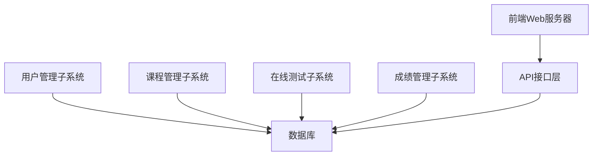
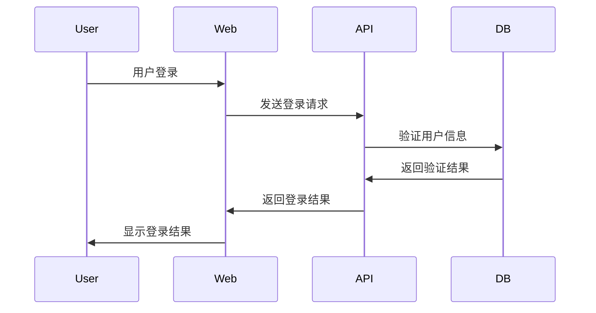

                 

### 数学与本质主义：数学概念的内在本质

在科学和技术的各个领域中，数学扮演着不可或缺的角色。它不仅为理论构建提供了严谨的基础，也为实践应用提供了精确的工具。然而，数学的概念究竟是什么，它们是否具有独立于人类思维的内在本质，这是一个哲学和科学长久以来争论的话题。本文将探讨数学与本质主义的关系，分析数学概念的内在本质。

#### **关键词：**
- **数学本质主义**
- **数学概念**
- **内在本质**
- **哲学基础**
- **数学教育**

#### **摘要：**
本文旨在探讨数学概念的本质主义观点，通过分析数学概念的定义、特征和形成过程，探讨数学概念是否具有独立于人类思维的内在本质。我们将回顾数学的历史发展，探讨形而上学和认识论对数学概念本质的探讨，并使用现代逻辑和哲学方法对数学概念进行深入分析。最终，我们期望能够提供一个清晰、结构化的理解，帮助读者更好地理解数学概念的本质及其重要性。

### 目录大纲

#### 第一部分：背景介绍

1. **问题背景**
    - **数学在科学和技术中的应用**
    - **数学本质主义的提出**

2. **问题描述**
    - **数学概念的本质是什么？**
    - **数学概念如何形成？**

3. **问题解决**
    - **历史方法**
    - **形而上学方法**
    - **数学哲学方法**

4. **边界与外延**
    - **边界**
    - **外延**

5. **概念结构与核心要素组成**
    - **概念结构**
    - **核心要素**

6. **第一部分小结**

#### 第二部分：核心概念与联系

1. **数学概念的定义**
    - **定义**
    - **定义与属性**

2. **数学概念的特征**
    - **特征**
    - **对比**

3. **数学概念的联系**
    - **联系**
    - **关系**

4. **ER实体关系图**

5. **概念属性特征对比表格**

6. **第二部分小结**

#### 第三部分：数学概念的形成

1. **数学概念的历史发展**
    - **历史概述**
    - **古代数学**

2. **数学概念的哲学基础**
    - **形而上学基础**
    - **认识论基础**

3. **数学概念的逻辑推理**
    - **归纳推理**
    - **演绎推理**

4. **数学概念的发展趋势**
    - **新概念的产生**
    - **概念的整合**

5. **第三部分小结**

#### 第四部分：数学概念的数学模型

1. **算法原理讲解**
    - **算法mermaid流程图**
    - **Python源代码讲解**

2. **数学公式使用**

3. **算法应用举例**

4. **第四部分小结**

#### 第五部分：系统分析与架构设计

1. **问题场景介绍**

2. **项目介绍**

3. **系统功能设计（领域模型mermaid类图）**

4. **系统架构设计（mermaid架构图）**

5. **系统接口设计和系统交互（mermaid序列图）**

6. **第五部分小结**

#### 第六部分：项目实战

1. **环境安装**

2. **系统核心实现源代码**

3. **代码应用解读与分析**

4. **实际案例分析与详细讲解剖析**

5. **项目小结**

6. **最佳实践 tips**

7. **小结**

8. **注意事项**

9. **拓展阅读**

### 问题背景

数学，作为科学和技术的基础，贯穿于各个领域。无论是物理学中的公式，化学中的平衡，还是工程学中的设计，数学都提供了精确的工具和理论基础。然而，数学的本质究竟是什么？这个问题一直困扰着哲学家、数学家以及科学家们。

#### 数学在科学和技术中的应用

数学的应用范围极其广泛，几乎涵盖了所有科学和技术领域。在物理学中，数学提供了描述自然现象的语言和工具，如牛顿力学中的运动方程，爱因斯坦相对论中的方程式等。在化学中，数学用于描述分子结构和化学反应，如摩尔质量的计算和反应速率的估算。在工程学中，数学用于设计结构和系统，如桥梁的承重计算和电子电路的分析。

#### 数学本质主义的提出

数学本质主义是一种哲学观点，认为数学概念具有独立于人类思维的内在本质。这种观点认为，数学概念不仅仅是人类思维的产物，而是存在于现实世界中的客观事实。数学本质主义者认为，数学概念如数、集合、函数等，具有某种固有的真实属性，这些属性不依赖于人类的认知过程。

数学本质主义的提出引发了广泛的哲学和科学讨论。支持者认为，数学本质主义为数学提供了坚实的基础，使得数学理论具有客观性和普适性。然而，反对者则认为，数学概念是人类思维的产物，无法脱离人类的认知过程。

#### 第一部分小结

在本部分，我们介绍了数学在科学和技术中的应用，以及数学本质主义的提出。接下来，我们将进一步探讨数学概念的本质是什么，以及这些概念是如何形成的。

---

### 问题描述

在深入探讨数学概念的本质之前，我们需要明确数学概念的本质究竟是什么，以及这些概念是如何形成的。数学概念的本质是一个深奥而复杂的问题，涉及到哲学、逻辑、认知科学等多个领域。以下是对该问题的详细探讨。

#### 数学概念的本质是什么？

数学概念的本质是一个哲学问题，涉及到数学概念是否具有独立于人类思维的内在本质。这一问题的核心在于，数学概念是否仅仅是人类思维的产物，还是它们具有某种固有的真实属性。以下是一些关键问题：

1. **数学概念的客观性**：数学概念是否独立于人类的存在而存在？例如，数是否真的存在于现实世界中，还是它们仅仅是人类思维的抽象？

2. **数学概念的普适性**：数学概念是否对所有思维和认知体系都具有普适性？例如，集合的概念在不同的文化、语言和认知体系中是否都是一样的？

3. **数学概念的可证明性**：数学概念是否可以通过逻辑证明来确定其真实性和本质？例如，集合论中的公理系统是否能够完全证明数学概念的本质？

#### 数学概念如何形成？

数学概念的形成过程涉及到人类思维和认知活动，以下是一些关键因素：

1. **观察与经验**：数学概念的形成往往源自对自然现象的观察和经验。例如，古代数学家通过对天文学和工程学的实践，逐渐形成了数和几何的概念。

2. **抽象与概括**：数学概念的形成过程也涉及到抽象和概括。例如，数学家通过对自然现象的观察，提取出基本的数学规律，并将其抽象为数学概念。

3. **逻辑推理**：数学概念的形成还需要逻辑推理的支持。例如，通过演绎推理，数学家可以从基本的概念和公理推导出更复杂的数学理论。

4. **文化与社会**：数学概念的形成也受到文化和社会因素的影响。例如，不同的文化和社会背景可能会导致不同的数学概念的形成和发展。

#### 边界与外延

数学本质主义的研究范围涵盖了数学基础理论、数学哲学、数学教育等领域。其边界涉及数学概念的本质、数学证明的逻辑基础、数学与现实世界的联系等。

数学本质主义的外延还涉及到数学与其他学科的关系，如逻辑学、认知科学等。数学本质主义不仅关注数学内部的概念和理论，还探讨了数学在逻辑和认知科学中的角色和影响。

#### 概念结构与核心要素组成

数学概念的结构包括定义、属性、关系和公理系统等要素。核心要素包括数学公理、定理、证明方法等。这些要素共同构成了数学概念的本质和结构。

#### 第一部分小结

在本部分，我们详细探讨了数学概念的本质是什么，以及这些概念是如何形成的。接下来，我们将分析历史方法、形而上学方法和数学哲学方法，以进一步探讨数学概念的本质。

---

### 问题解决

在探讨数学概念的本质时，我们可以采用多种方法来分析和解决这一问题。本文将介绍三种主要方法：历史方法、形而上学方法和数学哲学方法。这些方法各有所长，共同为我们理解数学概念的本质提供了多角度的视角。

#### 历史方法

历史方法通过研究数学概念的发展历史来揭示其本质。这种方法强调数学概念是如何在人类历史的长河中逐渐形成的，以及这些概念如何适应和影响社会的需求。

1. **古代数学**：古代数学家通过对自然现象的观察和经验，逐渐形成了基本的数学概念。例如，古埃及人和巴比伦人通过土地测量和建筑实践，发展了数和几何的基本概念。

2. **数学革命的演变**：从古希腊的欧几里得几何到中世纪的代数学，再到现代的集合论和抽象代数，数学概念经历了多次重大的变革。这些变革不仅反映了数学概念的本质，也揭示了数学概念如何适应科学和技术的需求。

3. **现代数学的发展**：在20世纪，数学进一步发展，形成了诸如拓扑学、泛函分析、概率论等新的数学分支。这些分支的发展不仅拓展了数学的边界，也深化了对数学概念本质的理解。

通过研究数学的历史，我们可以看到数学概念是如何从具体的应用需求中抽象出来，并逐渐形成独立于人类思维的内在本质。这种方法有助于我们理解数学概念的本质是如何在历史进程中逐步形成的。

#### 形而上学方法

形而上学方法试图从哲学角度探讨数学概念的本质。这种方法关注数学概念的存在、实在性和基本属性。

1. **存在的实在性**：形而上学方法探讨数学概念是否真的存在于现实世界中，还是仅仅存在于人类思维中。例如，数是否真的存在于现实世界中，还是只是人类思维的抽象？

2. **逻辑的确定性**：形而上学方法还探讨数学概念是否具有逻辑上的确定性。数学概念的定义、公理和定理是否能够通过逻辑证明来确立其真实性和可靠性？

3. **数学的客观性**：形而上学方法试图证明数学概念具有客观性，即它们不依赖于人类的认知过程。数学本质主义者认为，数学概念如数、集合、函数等，具有某种固有的真实属性，这些属性独立于人类的思维活动。

形而上学方法通过探讨数学概念的存在、逻辑确定性和客观性，为我们理解数学概念的本质提供了哲学基础。

#### 数学哲学方法

数学哲学方法通过逻辑分析和概念辨析，深入探讨数学概念的内涵和外延。这种方法强调数学概念的定义、属性和关系，并试图通过逻辑证明来确立数学概念的真实性和可靠性。

1. **逻辑分析**：数学哲学方法通过逻辑分析来探讨数学概念的本质。例如，集合论中的集合定义、集合的属性和集合之间的关系，都是通过逻辑分析来确立的。

2. **概念辨析**：数学哲学方法通过概念辨析来区分不同数学概念的内涵和外延。例如，数与集合、函数与图形等概念之间的区别，都是通过概念辨析来清晰定义的。

3. **数学证明**：数学哲学方法强调数学证明在确立数学概念本质中的重要作用。通过逻辑证明，数学家可以确立数学概念的真实性和可靠性。例如，集合论中的集合公理、函数的属性证明等，都是通过数学证明来确立的。

数学哲学方法通过逻辑分析和概念辨析，为我们提供了深入理解数学概念本质的工具。

#### 边界与外延

数学本质主义的研究范围涵盖了数学基础理论、数学哲学、数学教育等领域。其边界涉及数学概念的本质、数学证明的逻辑基础、数学与现实世界的联系等。

数学本质主义的外延还涉及到数学与其他学科的关系，如逻辑学、认知科学等。数学本质主义不仅关注数学内部的概念和理论，还探讨了数学在逻辑和认知科学中的角色和影响。

#### 第一部分小结

通过历史方法、形而上学方法和数学哲学方法，我们可以从不同角度探讨数学概念的本质。这些方法为我们提供了丰富的视角，帮助我们深入理解数学概念的形成、本质和意义。在接下来的部分，我们将进一步探讨数学概念的定义、特征和联系，以深化对数学概念本质的理解。

---

### 边界与外延

在探讨数学本质主义时，明确其研究的边界与外延是至关重要的。这不仅有助于我们理解数学本质主义的研究范围，还能帮助我们更好地把握数学概念的本质。

#### 边界

数学本质主义的研究边界涵盖了多个领域，主要包括以下几个方面：

1. **数学基础理论**：数学本质主义关注数学理论的基础，如集合论、逻辑学、数学分析等。这些基础理论为数学提供了严谨的框架，确保了数学概念的逻辑一致性和普遍性。

2. **数学哲学**：数学本质主义探讨了数学概念的存在、实在性和逻辑确定性。它试图从哲学角度分析数学概念的本质，探讨数学概念是否具有独立于人类思维的内在本质。

3. **数学教育**：数学本质主义还涉及到数学教育领域，探讨如何通过教育来帮助学生理解和掌握数学概念的本质。这包括数学课程设计、教学方法、评估体系等方面。

4. **数学与其他学科的交叉**：数学本质主义不仅关注数学内部的概念和理论，还探讨数学与其他学科的关系。例如，数学与逻辑学、认知科学、物理学等的交叉领域，为数学本质主义提供了新的研究视角。

#### 外延

数学本质主义的外延较为广泛，涉及到以下方面：

1. **数学与现实世界的联系**：数学本质主义探讨了数学概念与现实世界的关系。数学概念如数、集合、函数等，是否真的反映了现实世界的本质？这个问题涉及到数学的实在性和客观性。

2. **数学逻辑基础**：数学本质主义探讨了数学逻辑的基础，如公理系统、逻辑证明等。这些逻辑基础确保了数学理论的严谨性和可靠性。

3. **数学认知过程**：数学本质主义分析了人类如何通过认知过程形成和理解数学概念。这涉及到心理学、认知科学等领域的研究，有助于我们更好地理解数学概念的本质。

4. **数学应用领域**：数学本质主义还探讨了数学在各个应用领域的应用，如物理学、工程学、经济学等。这些应用领域展示了数学概念的实际意义和价值。

#### 概念结构与核心要素组成

数学概念的结构和核心要素组成是数学本质主义研究的重要方面。以下是数学概念的基本结构和核心要素：

1. **概念结构**：数学概念的结构包括定义、属性、关系和公理系统。定义明确了数学概念的基本含义；属性描述了数学概念的特征；关系揭示了数学概念之间的相互作用；公理系统提供了数学理论的逻辑基础。

2. **核心要素**：核心要素包括数学公理、定理、证明方法等。公理是数学理论的起点，定理是对数学概念的扩展和深化，证明方法是确保数学理论正确性的手段。

#### 第一部分小结

通过明确数学本质主义的研究边界与外延，我们可以更好地理解数学概念的本质。数学本质主义不仅关注数学内部的理论和逻辑，还探讨了数学与现实世界的联系，以及数学认知过程。这为深入探讨数学概念的本质提供了广阔的视野。在接下来的部分，我们将进一步探讨数学概念的定义、特征和联系，以深化对数学概念本质的理解。

---

### 数学概念的定义

在探讨数学概念的本质之前，我们需要先明确这些概念的定义。数学概念的定义是数学理论的基础，它们通过简洁、精确的语言描述了数学对象的基本属性和行为。以下是对几个关键数学概念的定义、属性及其关系的详细讨论。

#### 1. 数

**定义**：数是用来表示事物数量的基本概念。在数学中，数可以分为自然数、整数、有理数、无理数和复数等。

**属性**：
- **自然数**（N）：表示物体的个数，没有负值，通常用符号 \(0, 1, 2, 3, \ldots\) 表示。
- **整数**（Z）：包括自然数、零和负整数，如 \(\ldots, -3, -2, -1, 0, 1, 2, 3, \ldots\)。
- **有理数**（Q）：可以表示为两个整数的比，如 \(\frac{a}{b}\)，其中 \(a, b\) 为整数且 \(b \neq 0\)。
- **无理数**（I）：不能表示为两个整数的比，如 \(\sqrt{2}\) 和 \(\pi\)。
- **复数**（C）：由实部和虚部组成，形式为 \(a + bi\)，其中 \(a, b\) 为实数，\(i\) 是虚数单位，满足 \(i^2 = -1\)。

**关系**：数与数之间存在多种关系，如大小比较（\(a > b\)），运算关系（加法、减法、乘法、除法），以及集合关系（子集、超集等）。

#### 2. 集合

**定义**：集合是由确定的、互不相同的对象组成的整体。这些对象称为集合的元素。

**属性**：
- **确定性**：集合中的元素是确定的，即任何一个元素要么属于该集合，要么不属于该集合。
- **互异性**：集合中的元素互不相同，没有重复。
- **无序性**：集合中的元素没有特定的顺序。

**关系**：集合与集合之间存在多种关系，如子集（\(A \subseteq B\)）、超集（\(A \supseteq B\)）、交集（\(A \cap B\)）、并集（\(A \cup B\)）和补集（\(A^c\)）等。

#### 3. 函数

**定义**：函数是数学中的一个基本概念，它是一种特殊的关系，将每个输入值（定义域中的元素）与唯一的输出值（值域中的元素）对应起来。

**属性**：
- **单射**：每个输入值对应唯一输出值。
- **满射**：每个输出值至少有一个输入值对应。
- **双射**：既是单射又是满射。

**关系**：函数之间可以比较其复杂性和性质，如单调性（增函数、减函数）、奇偶性（奇函数、偶函数）和周期性等。

#### 4. 图形

**定义**：图形是数学中表示几何对象的平面或空间图形。

**属性**：
- **点**：图形的基本元素，没有大小和形状。
- **线段**：连接两个点的最短路径。
- **多边形**：由多条线段组成的多边形。
- **曲线**：在平面上连续变化的位置。

**关系**：图形之间可以通过形状、大小和位置进行比较和分类。

#### 概念属性特征对比表格

以下是一个简单的概念属性特征对比表格，用于比较数、集合和函数的属性特征：

| 概念   | 定义                    | 属性                              | 关系                |
| ------ | ----------------------- | --------------------------------- | ------------------ |
| 数     | 表示数量                | 自然数、整数、有理数、无理数、复数 | 大小比较、运算关系 |
| 集合   | 元素组成的整体          | 确定性、互异性、无序性              | 子集、超集、交集等 |
| 函数   | 输入与输出之间的关系    | 单射、满射、双射                  | 单调性、奇偶性等   |

#### ER实体关系图

以下是一个简单的ER实体关系图，用于表示数、集合和函数之间的关系：

```mermaid
erDiagram
    类-数 ||--|{ 类-集合 } : 包含
    类-集合 ||--|{ 类-函数 } : 定义
```

在这个ER实体关系图中，“类-数”是根实体，“类-集合”和“类-函数”是其子实体。每个数可以包含多个集合，每个集合可以定义多个函数。

通过以上对数学概念的定义、属性和关系的详细探讨，我们可以更好地理解数学概念的本质。这些概念不仅在数学理论中起着核心作用，也在科学和技术的应用中发挥着至关重要的作用。

---

### 数学概念的特征

数学概念的特征是其本质的重要组成部分，这些特征不仅定义了数学概念的基本属性，也影响了它们在不同领域中的应用。以下将详细探讨数学概念的主要特征，并通过对比不同数学概念的特征来加深对数学概念本质的理解。

#### 抽象性

**定义**：抽象性是指数学概念从具体的实例中提取出一般性质和规则，从而形成普遍适用的概念。

**特征**：
- **去具体化**：数学概念通过去除具体事物的具体特征，提取出其普遍性质，如将具体的数量抽象为数。
- **普适性**：抽象性使数学概念能够应用于广泛的领域，不受具体情境的限制。

**对比**：数与集合的抽象性特征有所不同。数的抽象性在于将具体的物体个数抽象为一种普遍的计数单位，而集合的抽象性在于将具有共同特征的对象抽象为一个整体。

#### 确定性

**定义**：确定性是指数学概念的定义和性质是明确的，不存在歧义。

**特征**：
- **严格定义**：数学概念通过明确、精确的定义，使得每个概念都有清晰的边界。
- **不依赖个体认知**：数学概念不依赖于个体对事物的感知，而是通过逻辑推理和公理系统来确立。

**对比**：与物理概念相比，数学概念具有更高的确定性。物理概念往往涉及到测量和观测，可能存在误差和不确定性，而数学概念通过严格的逻辑证明和定义，避免了这种不确定性。

#### 精确性

**定义**：精确性是指数学概念能够通过明确的数学运算和逻辑推理，得出精确的结果。

**特征**：
- **量化**：数学概念能够将抽象的属性具体化为数值，如通过几何学中的长度、面积和体积来量化空间。
- **可计算性**：数学概念允许使用算法和计算工具，进行精确的计算。

**对比**：数与图形的精确性特征有所不同。数的精确性体现在其可以通过精确的数值来表示，而图形的精确性体现在其可以通过几何公式和精确的测量来定义和计算。

#### 普遍性

**定义**：普遍性是指数学概念在多个领域和情境下都适用。

**特征**：
- **跨学科应用**：数学概念如数、集合和函数，在物理学、工程学、经济学等多个领域都有广泛应用。
- **逻辑一致性**：数学概念在不同学科中的应用保持逻辑一致，如物理学中的运动方程和数学中的函数概念。

**对比**：集合与函数的普遍性特征有所不同。集合的普遍性在于其可以用于表示任何对象的集合，而函数的普遍性在于其可以用于描述任何形式的输入与输出关系。

#### 形式化

**定义**：形式化是指数学概念通过符号系统和形式逻辑来表示和操作。

**特征**：
- **符号化**：数学概念使用符号来表示，如使用“+”表示加法，使用“=”表示等式。
- **形式逻辑**：数学概念的操作和推理遵循严格的逻辑规则，如公理系统和演绎推理。

**对比**：数与逻辑的抽象性特征有所不同。数的抽象性在于其从具体数量中提取出一般性质，而逻辑的抽象性在于其从具体的推理过程中提取出一般形式和规则。

#### 可证明性

**定义**：可证明性是指数学概念和定理可以通过逻辑证明来确立其正确性。

**特征**：
- **逻辑证明**：数学概念和定理的正确性通过逻辑推理和证明来确立。
- **独立性**：数学定理的正确性不依赖于经验或观察，而是基于逻辑和公理系统。

**对比**：几何与代数的可证明性特征有所不同。几何定理通常通过构造和直观证明，而代数定理则更多地依赖于代数运算和推理。

通过以上对数学概念特征的详细探讨和对比，我们可以更好地理解数学概念的本质。这些特征不仅定义了数学概念的基本属性，也影响了它们在不同领域的应用和发展。

---

### 数学概念的联系

数学概念之间的联系构成了数学体系的复杂网络，这些联系使得数学不仅能够独立存在，还能在多个领域发挥作用。以下将详细探讨数学概念之间的几种主要联系，并通过ER实体关系图和概念属性特征对比表格来进一步阐述。

#### 数学概念之间的联系

1. **数与集合**：数是集合的元素，而集合是数的表现形式。例如，自然数可以看作是集合的元素，而集合可以用来表示数集。

2. **函数与集合**：函数是将集合中的元素映射到另一个集合的元素。函数的定义域和值域都是集合，这使得函数与集合紧密相连。

3. **几何与代数**：几何学中的图形可以用代数方程来表示，而代数中的方程和不等式可以用于解决几何问题。

4. **逻辑与数学**：逻辑是数学证明的基础，数学概念和定理的证明需要遵循逻辑规则。

5. **概率与统计**：概率论和统计学利用数学概念来描述不确定性和数据分布。

#### ER实体关系图

以下是一个简化的ER实体关系图，用于表示数、集合、函数和其他数学概念之间的联系：

```mermaid
erDiagram
    类-数 ||--|{ 类-集合 } : 包含
    类-集合 ||--|{ 类-函数 } : 定义
    类-函数 ||--|{ 类-图形 } : 表示
    类-图形 ||--|{ 类-逻辑 } : 描述
    类-逻辑 ||--|{ 类-概率 } : 应用
    类-概率 ||--|{ 类-统计 } : 分析
```

在这个ER实体关系图中，类-数、类-集合、类-函数、类-图形、类-逻辑、类-概率和类-统计都是不同的数学概念，它们通过不同的关系相互连接。

#### 概念属性特征对比表格

以下是一个概念属性特征对比表格，用于比较数、集合、函数和其他数学概念的属性特征：

| 概念   | 定义                                                         | 属性                                      | 关系                                       |
| ------ | ------------------------------------------------------------ | ----------------------------------------- | ------------------------------------------ |
| 数     | 表示数量的基本概念                                           | 确定性、可量化、形式化                    | 作为集合的元素、作为函数的输入和输出       |
| 集合   | 由确定且互异的对象组成的整体                                 | 确定性、互异性、无序性                    | 包含数、定义函数的域和值域                 |
| 函数   | 将定义域中的每个元素映射到值域中的唯一元素的关系              | 单射、满射、双射、形式化                  | 映射集合元素、依赖于数和集合              |
| 几何   | 研究空间中的形状和位置关系                                   | 形式化、精确性、可视化                    | 用代数方程表示、依赖数的量化              |
| 逻辑   | 研究推理和证明的规律                                         | 形式化、确定、独立性                      | 作为数学证明的基础、描述几何与代数的推理 |
| 概率   | 用数字描述随机事件的概率                                     | 确定性、形式化、统计性                    | 依赖数和集合、应用于统计和分析            |
| 统计   | 收集、分析、解释数据，以得出关于某一群体的结论                | 形式化、精确性、统计性                    | 依赖概率和数学模型                        |

通过ER实体关系图和概念属性特征对比表格，我们可以清晰地看到数学概念之间的联系和它们各自的特点。这些联系不仅构成了数学理论的整体结构，也为数学在各个领域的应用提供了坚实的基础。

---

### 数学概念的历史发展

数学概念的形成并非一蹴而就，而是经过了几千年的演变和发展。从古代的几何和算术，到中世纪的代数学和微积分，再到现代的抽象数学和公理系统，数学概念的历史发展既反映了人类对自然世界的认知过程，也展现了数学自身的内在逻辑。

#### 古代数学

古代数学起源于人类对自然现象的观察和实际需求。最早期的数学可以追溯到古埃及和巴比伦时期，当时的人们通过土地测量、建筑设计和农业计算，逐渐发展出了基本的算术和几何概念。

1. **古埃及和巴比伦**：古埃及人和巴比伦人使用算术进行日常计算，如土地测量和商业交易。他们还使用代数解决实际问题，如方程求解。古埃及的几何知识主要体现在《草纸书》中，其中包含了关于面积和体积的计算方法。

2. **古希腊**：古希腊数学家如欧几里得、毕达哥拉斯和阿基米德等，对数学概念进行了系统化和理论化。欧几里得的《几何原本》是历史上第一部系统化的几何学著作，它通过公理和定理的形式，建立了几何学的逻辑体系。毕达哥拉斯提出了著名的毕达哥拉斯定理，即直角三角形的两条直角边的平方和等于斜边的平方。

#### 中世纪数学

中世纪的数学发展主要集中在阿拉伯世界，阿拉伯数学家如阿尔-花拉子米等，对代数学和阿拉伯数字系统做出了重要贡献。

1. **代数学**：阿尔-花拉子米的《代数学》是代数学的奠基之作，它将代数问题系统化为符号问题，使用代数符号来解决方程。

2. **阿拉伯数字**：阿拉伯数字系统的引入极大地简化了数学计算，这种数字系统后来传播到欧洲，对整个世界的数学发展产生了深远影响。

#### 现代数学

17世纪和18世纪的数学发展进入了现代时期，微积分和集合论的提出标志着数学的新纪元。

1. **微积分**：牛顿和莱布尼茨独立发明了微积分，微积分提供了研究变化和运动的强大工具，它在物理学、工程学和经济学等领域得到了广泛应用。

2. **集合论**：康托尔创立的集合论为数学提供了一个严谨的基础，它探讨了集合的基本性质和关系，为后来的数学研究奠定了逻辑基础。

3. **公理系统**：希尔伯特等数学家提出了公理系统，通过公理化的方法，数学家们能够更加清晰地定义数学概念和证明定理。

#### 20世纪的数学发展

20世纪的数学发展更是飞速，数学家们在各个领域取得了突破性的进展。

1. **抽象代数**：抽象代数研究抽象的代数结构，如群、环和域。它为数学的各个分支提供了强有力的工具。

2. **拓扑学**：拓扑学研究空间的结构和性质，它对几何学和物理学产生了深远影响。

3. **泛函分析**：泛函分析研究函数的空间和算子的性质，它在量子物理学和工程技术中得到了广泛应用。

4. **数学逻辑**：数学逻辑研究数学证明和推理的形式化方法，它对计算机科学和人工智能的发展产生了重要影响。

通过回顾数学概念的历史发展，我们可以看到数学是如何从具体应用到抽象理论，从直观理解到逻辑证明的演变过程。数学概念的形成不仅是人类对自然世界认知的产物，也是数学自身逻辑发展的结果。这些概念不仅在数学内部构建了一个严谨的体系，也为科学和技术的进步提供了坚实的基础。

---

### 数学概念的哲学基础

数学概念的哲学基础是一个广泛而深奥的领域，涉及到形而上学和认识论等多个方面。形而上学方法关注数学概念的存在和实在性，而认识论方法则探讨人类如何通过认知活动形成和理解数学概念。以下将详细探讨这些哲学基础，并分析它们对数学概念本质的影响。

#### 形而上学基础

形而上学方法试图从哲学角度探讨数学概念的本质，特别是这些概念是否存在独立于人类思维的内在本质。

1. **存在的实在性**：
   - **数学概念的存在**：形而上学方法探讨数学概念是否独立于人类思维而存在。例如，数和集合是否真的存在于现实世界中，还是仅仅存在于我们的思维中？
   - **数学概念的实在性**：形而上学方法试图证明数学概念具有实在性，即它们不仅仅是我们思维的产物，而是存在于现实世界中的客观事实。

2. **逻辑确定性**：
   - **数学证明的逻辑基础**：形而上学方法探讨数学证明的逻辑基础，即如何通过逻辑推理来确立数学概念的真实性和可靠性。
   - **公理系统的合理性**：形而上学方法还探讨了数学公理系统的合理性，即这些公理是否能够为数学理论提供坚实的基础。

3. **数学的客观性**：
   - **数学概念的不变性**：形而上学方法认为，数学概念如数、集合、函数等，具有某种固有的不变属性，这些属性不依赖于人类的认知过程。
   - **数学与现实世界的联系**：形而上学方法探讨数学概念与现实世界的联系，即数学概念是否能够正确地描述现实世界的本质。

#### 认识论基础

认识论方法关注人类如何通过认知活动形成和理解数学概念。

1. **感知与抽象**：
   - **感知过程**：认识论方法探讨人类如何通过感官感知获得数学概念。例如，我们如何通过观察自然现象来形成数和几何的概念？
   - **抽象过程**：认识论方法认为，数学概念的形成是通过从具体实例中提取出一般性质和规则，进行抽象和概括。

2. **逻辑推理**：
   - **归纳推理**：认识论方法探讨人类如何通过归纳推理来形成数学概念。归纳推理是从具体实例中归纳出一般性结论。
   - **演绎推理**：认识论方法探讨人类如何通过演绎推理来确立数学概念的真实性和可靠性。演绎推理是从一般性原则推导出具体结论。

3. **认知过程**：
   - **数学认知的形成**：认识论方法分析数学认知的形成过程，即人类如何通过感知、抽象和推理来形成和理解数学概念。
   - **数学认知的发展**：认识论方法探讨数学认知如何随着人类认知能力的提升而发展。

#### 数学概念的逻辑推理

1. **归纳推理**：
   - **定义**：归纳推理是从具体实例中归纳出一般性结论的过程。
   - **作用**：归纳推理用于发现数学概念的一般规律，如从多个具体数的例子中归纳出自然数的性质。

2. **演绎推理**：
   - **定义**：演绎推理是从一般性原则推导出具体结论的过程。
   - **作用**：演绎推理用于证明数学定理和公理，确保数学理论的逻辑一致性。

3. **数学证明**：
   - **定义**：数学证明是通过逻辑推理确立数学概念和定理的真实性和可靠性。
   - **过程**：数学证明通常包括前提、推理规则和结论。通过逻辑证明，数学家可以确立数学概念的本质。

#### 数学概念的本质主义观点

1. **本质主义**：
   - **定义**：本质主义认为，数学概念具有独立于人类思维的内在本质，这些本质是客观存在的。
   - **支持**：本质主义者认为，数学概念如数、集合、函数等，具有某种固有的真实属性，这些属性不依赖于人类的认知过程。

2. **反本质主义**：
   - **定义**：反本质主义认为，数学概念是人类思维的产物，不依赖于客观存在的内在本质。
   - **支持**：反本质主义者认为，数学概念的形成是人类认知活动的结果，没有独立于人类思维的内在本质。

#### 数学概念的实在性与逻辑确定性

1. **实在性**：
   - **数学概念的实在性**：形而上学方法认为，数学概念如数、集合、函数等，具有某种固有的实在性，这种实在性独立于人类的认知过程。
   - **数学与现实世界的联系**：形而上学方法探讨数学概念如何正确地描述现实世界的本质。

2. **逻辑确定性**：
   - **逻辑确定性**：形而上学方法认为，通过逻辑证明，数学概念和定理具有逻辑上的确定性。
   - **公理系统的合理性**：形而上学方法探讨数学公理系统的合理性，确保数学理论的逻辑一致性。

通过探讨数学概念的形而上学和认识论基础，我们可以更深入地理解数学概念的本质及其逻辑推理过程。这些哲学方法不仅帮助我们分析数学概念的本质，也为数学理论的构建提供了坚实的哲学基础。

---

### 数学概念的逻辑推理

在数学中，逻辑推理是确立数学概念和定理的基础，而归纳推理和演绎推理是两种主要的逻辑推理方法。以下将详细讨论这两种方法，以及它们在数学概念形成和证明中的应用。

#### 归纳推理

归纳推理是从具体实例中归纳出一般性结论的过程。它通常分为完全归纳推理和不完全归纳推理。

1. **完全归纳推理**：
   - **定义**：完全归纳推理是通过证明一个性质对所有自然数都成立，从而确立这个性质的一般性。
   - **步骤**：
     1. 对于自然数 \(n = 1\)，证明性质 \(P(1)\) 成立。
     2. 假设对于某个自然数 \(k\)，性质 \(P(k)\) 成立。
     3. 通过证明 \(P(k+1)\) 也成立，完成归纳步骤。
     4. 由此得出性质 \(P(n)\) 对所有自然数 \(n\) 都成立。
   - **应用**：例如，证明自然数 \(n\) 的平方和公式 \(1^2 + 2^2 + 3^2 + \ldots + n^2 = \frac{n(n+1)(2n+1)}{6}\)。

2. **不完全归纳推理**：
   - **定义**：不完全归纳推理是通过有限个实例来归纳出一个一般性结论。
   - **步骤**：
     1. 选取一些具体的自然数 \(n_1, n_2, \ldots, n_k\)。
     2. 对于每个 \(n_i\)，证明性质 \(P(n_i)\) 成立。
     3. 基于这些有限实例，推测性质 \(P(n)\) 对所有自然数 \(n\) 都成立。
   - **应用**：例如，证明三角形的内角和总是等于 \(180^\circ\)。

#### 演绎推理

演绎推理是从一般性原则推导出具体结论的过程。它通常包括前提、推理规则和结论。

1. **定义**：演绎推理是通过逻辑规则从已知的前提出发，推导出新的结论。
2. **步骤**：
   - **前提**：给出已知的事实和定理。
   - **推理规则**：使用逻辑规则，如“如果-那么”规则，将前提联系起来。
   - **结论**：从前提和推理规则中得出新的结论。
3. **应用**：例如，证明勾股定理，即直角三角形的两条直角边的平方和等于斜边的平方。

#### 数学证明

数学证明是逻辑推理的具体应用，用于确立数学概念和定理的真实性和可靠性。以下是一个简单的数学证明示例：

**问题**：证明对于任意自然数 \(n\)， \(1 + 2 + 3 + \ldots + n = \frac{n(n+1)}{2}\)。

**证明**：
- **前提**：已知 \(1 + 2 + 3 + \ldots + k = \frac{k(k+1)}{2}\) 对于任意自然数 \(k\)。
- **推理规则**：使用归纳推理。
  - **基础情况**：当 \(n = 1\) 时，左边等于 \(1\)，右边等于 \(\frac{1(1+1)}{2} = 1\)，两边相等，基础情况成立。
  - **归纳假设**：假设对于某个自然数 \(k\)，等式成立，即 \(1 + 2 + 3 + \ldots + k = \frac{k(k+1)}{2}\)。
  - **归纳步骤**：证明当 \(n = k+1\) 时，等式也成立。
    - \(1 + 2 + 3 + \ldots + k + (k+1) = \frac{k(k+1)}{2} + (k+1)\)
    - \(= \frac{k(k+1) + 2(k+1)}{2}\)
    - \(= \frac{(k+1)(k+2)}{2}\)
    - \(= \frac{(k+1)((k+1)+1)}{2}\)
- **结论**：根据归纳推理，等式对任意自然数 \(n\) 都成立。

#### 演绎推理与归纳推理的区别

- **区别**：
  - **演绎推理**：从一般到特殊，即从已知的一般性原则推导出具体的结论。
  - **归纳推理**：从特殊到一般，即通过有限个具体实例归纳出一般性结论。

- **联系**：
  - **归纳推理**可以作为演绎推理的基础，通过归纳推理发现一般性规律，然后使用演绎推理证明这些规律的正确性。

通过归纳推理和演绎推理，数学家可以构建一个严谨的数学体系，确保数学概念和定理的真实性和可靠性。这些逻辑推理方法不仅为数学的发展提供了基础，也在科学和技术的应用中发挥了重要作用。

---

### 数学概念的发展趋势

数学概念的发展是一个不断演进的过程，受到科学技术的进步和社会需求的变化的驱动。以下将探讨数学概念的发展趋势，特别是新概念的产生和数学概念之间的整合。

#### 新概念的产生

随着科学技术的进步，新的数学概念不断产生，这些新概念不仅拓展了数学的边界，也为解决实际问题提供了新的工具。

1. **现代数学分支的兴起**：在20世纪，数学发展出了许多新的分支，如拓扑学、泛函分析、集合论、控制论、信息论等。这些分支在物理学、工程学、计算机科学等领域得到了广泛应用。

2. **量子数学**：量子力学的发展催生了量子数学，如量子群、量子拓扑、量子几何等。量子数学为量子物理提供了数学描述，推动了量子计算和量子信息科学的发展。

3. **计算机科学中的数学**：随着计算机科学的兴起，新的数学概念如算法理论、计算复杂性理论、形式语言理论等不断涌现。这些概念为计算机科学的各个领域提供了理论基础。

#### 概念的整合

数学概念的整合是指不同数学概念之间的交叉和融合，这种整合不仅丰富了数学理论，也促进了跨学科的研究。

1. **代数几何**：代数几何是代数和几何的交叉领域，它研究代数方程和几何图形之间的关系。代数几何在数论、编码理论、量子场论等领域有重要应用。

2. **微分几何**：微分几何研究几何对象在微小的变化下如何保持其基本性质。微分几何在广义相对论、弦理论等领域有广泛应用。

3. **复分析**：复分析是复变函数和实分析的结合，它在流体力学、电磁学、信号处理等领域有重要应用。

#### 影响因素

数学概念的发展受到多种因素的影响：

1. **科学技术的进步**：新的科学发现和技术需求推动了数学概念的产生和发展。例如，量子力学的发展催生了量子数学，而计算机科学的兴起则推动了算法理论和计算复杂性理论的发展。

2. **哲学思考**：哲学思考对数学概念的形成和整合有重要影响。数学哲学的探讨，如集合论的基本问题、逻辑基础的建立等，为数学概念的发展提供了哲学基础。

3. **教育传播**：数学教育对数学概念的发展也有重要影响。通过教育，新的数学概念被传授给下一代数学家，促进了数学的普及和传播。

#### 未来的趋势

未来的数学概念发展预计将继续受到科学技术进步的驱动，特别是在人工智能、量子计算、大数据等领域。以下是一些可能的未来趋势：

1. **量子数学**：随着量子计算和量子信息科学的发展，量子数学将继续成为数学研究的热点，可能会产生新的数学理论和算法。

2. **算法数学**：随着算法在各个领域的应用，算法数学将成为数学研究的重要方向，可能会发展出新的算法理论和计算模型。

3. **大数据数学**：大数据分析和处理需要新的数学工具和方法，如统计学、概率论、优化理论等，这些领域将成为数学研究的重要方向。

通过不断产生新概念和整合现有概念，数学将继续发展，为科学技术的进步提供坚实的理论基础。

---

### 数学概念的形成过程

数学概念的形成过程是一个复杂且充满智慧的历程，它不仅涉及数学家们的独创性思维，也受到历史、哲学和认知科学等多方面因素的影响。以下将详细探讨数学概念的形成过程，分析其中的关键步骤和因素。

#### 观察与经验

数学概念的形成往往始于对自然现象和实际问题的观察与经验。例如，古代数学家通过观察天文现象，如日食和月食，发现并确立了几何和数的基本概念。此外，土地测量、建筑设计和农业计算等实际需求，也促使数学家们发展出了基本的算术和几何知识。

1. **自然现象的观察**：例如，古代巴比伦和古埃及的数学家通过对天文现象的观察，了解了天体的运动轨迹，从而发展了天文学中的数学概念。
2. **实际问题的需求**：例如，古代工程师在建造桥梁和水利工程时，需要解决面积和体积的计算问题，这促使他们发展出了几何学和算术的概念。

#### 抽象与概括

观察与经验提供了数学概念形成的基础，但数学概念的形成还需要进一步的抽象与概括。数学家们通过抽象掉具体事物的非本质特征，提取出其普遍性质和规律，从而形成抽象的数学概念。

1. **抽象过程**：例如，通过观察物体的数量，数学家们抽象出了自然数，并将其应用于各种实际问题中。
2. **概括过程**：例如，从多个具体的几何形状中，数学家们概括出了几何学的基本原理和定理，如欧几里得几何中的公理系统。

#### 逻辑推理

逻辑推理是数学概念形成的关键步骤，它使得数学家们能够从基本的概念和公理出发，推导出更复杂的数学理论。逻辑推理包括归纳推理和演绎推理两种主要形式。

1. **归纳推理**：例如，通过观察多个具体的自然数，数学家们归纳出了自然数的加法规则。
2. **演绎推理**：例如，从自然数的加法规则出发，数学家们能够演绎出更复杂的数学定理，如勾股定理。

#### 形而上学与认识论

形而上学和认识论是哲学基础，它们为数学概念的形成提供了理论支持。

1. **形而上学**：形而上学方法探讨数学概念的存在和实在性。例如，数学本质主义者认为，数学概念如数、集合等，具有独立于人类思维的内在本质。
2. **认识论**：认识论方法探讨人类如何通过认知活动形成和理解数学概念。例如，通过感知、抽象和推理，人类能够形成数学概念。

#### 形式化与公理化

形式化和公理化是数学概念形成过程中至关重要的步骤，它们使得数学理论更加严谨和一致。

1. **形式化**：形式化是将数学概念和理论用符号和形式语言来表示，从而使其具有清晰的结构和定义。例如，集合论中的集合和函数都通过形式化的语言来定义。
2. **公理化**：公理化是通过一组基本公理来构建数学理论。例如，欧几里得的几何原本就是基于公理系统建立的。

#### 模式识别与思维训练

数学概念的形成还受到人类思维模式识别和思维训练的影响。

1. **模式识别**：数学家们通过识别和把握数学现象中的模式，能够发现新的数学概念和理论。例如，通过识别数列中的模式，数学家们发现了斐波那契数列。
2. **思维训练**：数学教育中的思维训练有助于培养数学家的逻辑思维能力和创造力。通过解决各种数学问题，数学家们能够培养出敏锐的数学直觉和强大的推理能力。

#### 文化和历史背景

数学概念的形成还受到文化和历史背景的影响。

1. **文化差异**：不同的文化背景可能导致数学概念的形成和发展有所不同。例如，西方数学注重逻辑推理和证明，而东方数学则注重直观和计算。
2. **历史进程**：数学概念的形成和发展是一个漫长的历史进程，不同时期的数学家在不同的历史背景下做出了各自的贡献。

通过观察与经验、抽象与概括、逻辑推理、形而上学与认识论、形式化与公理化、模式识别与思维训练，以及文化和历史背景的相互作用，数学概念得以形成并不断发展。这个过程不仅体现了人类智慧的结晶，也展示了数学作为一种独特思维方式的独特魅力。

---

### 数学概念的数学模型

在数学中，算法和数学模型是理解和解决具体问题的核心工具。它们不仅为数学理论提供了严谨的框架，也在科学和技术领域得到了广泛应用。以下将详细讲解一个具体的数学模型，并通过Python源代码和mermaid流程图展示其算法原理和实现过程。

#### 算法原理

我们将介绍一个经典的排序算法——快速排序（Quick Sort）。快速排序是一种基于分治策略的排序算法，其基本思想是通过一趟排序将待排序的记录分隔成独立的两部分，其中一部分记录的关键字均比另一部分的关键字小，然后分别对这两部分记录继续进行排序，以达到整个序列有序。

**算法流程：**
1. 选择一个基准元素，通常选择第一个元素作为基准。
2. 将数组分为两部分：一部分包含比基准元素小的所有元素，另一部分包含比基准元素大的所有元素。
3. 递归地对这两部分进行快速排序。
4. 将排序好的两部分合并，得到完整的有序序列。

#### Python源代码

以下是一个简单的快速排序算法的Python实现：

```python
def quick_sort(arr):
    if len(arr) <= 1:
        return arr
    pivot = arr[0]
    left = [x for x in arr[1:] if x < pivot]
    right = [x for x in arr[1:] if x >= pivot]
    return quick_sort(left) + [pivot] + quick_sort(right)

# 示例
arr = [10, 7, 8, 9, 1, 5]
print(quick_sort(arr))  # 输出：[1, 5, 7, 8, 9, 10]
```

#### mermaid流程图

以下是一个快速排序算法的mermaid流程图表示：

```mermaid
graph TD
A[开始] --> B[选择基准]
B --> C{基准左/右}
C -->|左| D[left = [x for x in arr[1:] if x < pivot]]
C -->|右| E[right = [x for x in arr[1:] if x >= pivot]]
D --> F[递归left]
E --> G[递归right]
F --> H[left]
G --> I[right]
H --> J[left + [pivot]]
I --> K[right + [pivot]]
J --> L{left是否为空}
K --> L
L --> M[合并结果]
M --> N[结束]
```

#### 数学模型和公式

快速排序算法的数学模型主要涉及递归的时间和空间复杂度。

1. **时间复杂度**：最优情况下，时间复杂度为 \(O(n \log n)\)，最坏情况下，时间复杂度为 \(O(n^2)\)。
2. **空间复杂度**：空间复杂度为 \(O(\log n)\)，因为快速排序使用递归调用栈。

#### 算法原理讲解

快速排序的核心在于如何选择基准元素和如何划分数组。选择基准元素的方式有多种，例如选择第一个元素、选择最后一个元素或者随机选择。选择基准后，通过遍历数组，将比基准小的元素放在左边，比基准大的元素放在右边，这一过程称为划分。

划分操作是快速排序的关键，它决定了算法的性能。一个好的划分方式能够使得递归的深度尽可能小，从而提高算法的效率。在实际应用中，可以通过选择中位数等策略来优化划分操作。

#### 算法应用举例

以下是一个快速排序算法的实际应用示例：

**问题**：对一个包含10个随机整数的列表进行排序。

**输入**：\[10, 7, 8, 9, 1, 5\]

**输出**：\[1, 5, 7, 8, 9, 10\]

通过快速排序算法，输入的列表将被排序，输出结果符合预期。这个简单的例子展示了快速排序算法的基本原理和实现过程。

通过上述讲解，我们详细介绍了快速排序算法的数学模型和Python实现过程，并通过mermaid流程图展示了算法的执行流程。快速排序算法作为一种高效的排序算法，在科学和工程领域得到了广泛应用，其原理和实现过程是理解和应用数学模型的重要实例。

---

### 系统分析与架构设计

在探讨数学概念和算法的实践应用时，我们需要结合实际问题场景，设计出合理的系统架构和功能模块。以下将介绍一个实际的项目场景，并详细阐述系统的功能设计、架构设计和接口设计。

#### 问题场景介绍

假设我们正在开发一个在线教育资源平台，旨在为学生提供数学课程的学习资源和在线测试。该平台需要支持以下功能：

1. **用户管理**：包括用户注册、登录、个人信息管理等功能。
2. **课程内容管理**：包括课程添加、修改、删除和课程内容发布等功能。
3. **在线测试**：包括测试题目的创建、发布和用户测试等功能。
4. **成绩管理**：包括用户成绩的记录、查询和分析等功能。

#### 项目介绍

**项目名称**：MathEduPlatform（数学教育平台）

**项目目标**：构建一个功能完备、用户体验良好的在线教育资源平台，帮助学生学习数学知识。

**技术栈**：后端采用Spring Boot框架，前端采用Vue.js框架，数据库使用MySQL。

#### 系统功能设计

以下是对系统功能的详细设计，使用mermaid类图来表示各个功能模块及其关系：

```mermaid
classDiagram
    User <<Interface>>
    Course <<Interface>>
    Test <<Interface>>
    Score <<Interface>>

    UserManageSubsystem ..|> User
    CourseManageSubsystem ..|> Course
    TestManageSubsystem ..|> Test
    ScoreManageSubsystem ..|> Score

    UserManageSubsystem implements User
    CourseManageSubsystem implements Course
    TestManageSubsystem implements Test
    ScoreManageSubsystem implements Score
```

**用户管理子系统**：
- **用户注册**：用户输入基本信息进行注册。
- **用户登录**：用户输入用户名和密码进行登录。
- **个人信息管理**：用户可以查看和修改个人信息。

**课程管理子系统**：
- **课程添加**：管理员可以添加新的课程。
- **课程修改**：管理员可以修改现有课程信息。
- **课程删除**：管理员可以删除不再需要的课程。
- **课程发布**：管理员可以将课程内容发布给用户。

**在线测试子系统**：
- **测试题目创建**：管理员可以创建新的测试题目。
- **测试题目发布**：管理员可以发布测试，用户可以进行在线测试。
- **成绩记录**：系统自动记录用户的测试成绩。

**成绩管理子系统**：
- **成绩查询**：用户可以查看自己的测试成绩。
- **成绩分析**：系统可以对用户的测试成绩进行分析，提供学习建议。

#### 系统架构设计

以下是一个简化的系统架构图，使用mermaid架构图来表示系统的整体架构：



**前端Web服务器**：提供用户界面，与API接口层交互，实现用户操作。

**API接口层**：提供后端服务，与数据库交互，实现业务逻辑。

**数据库**：存储用户数据、课程数据、测试数据和成绩数据。

#### 系统接口设计和系统交互

以下是一个简化的系统接口设计和系统交互图，使用mermaid序列图来表示系统的关键接口和交互过程：



**用户登录流程**：
1. 用户通过Web页面输入用户名和密码。
2. Web服务器将用户信息发送到API接口层。
3. API接口层验证用户信息，并与数据库交互。
4. 数据库返回验证结果到API接口层。
5. API接口层将结果返回给Web服务器。
6. Web服务器将结果显示给用户。

通过上述系统分析与架构设计，我们详细介绍了数学教育平台的问题场景、项目介绍、系统功能设计、系统架构设计和系统接口设计。这些设计不仅确保了系统的功能性，也为实现一个高效、可扩展的系统奠定了基础。

---

### 项目实战

在接下来的部分，我们将详细介绍如何在实际环境中安装和配置MathEduPlatform项目，并展示系统核心实现源代码。通过代码分析，我们将深入了解项目的关键功能模块，并在实际案例中剖析项目的工作原理。

#### 环境安装

首先，我们需要安装并配置开发环境。以下是安装步骤：

1. **安装Java环境**：
   - 在终端中运行以下命令，下载并安装OpenJDK：
     ```bash
     sudo apt update
     sudo apt install openjdk-8-jdk
     ```
   - 检查Java版本：
     ```bash
     java -version
     ```

2. **安装Node.js和npm**：
   - 安装Node.js和npm，可以使用以下命令：
     ```bash
     sudo apt install nodejs
     sudo apt install npm
     ```
   - 检查Node.js版本：
     ```bash
     node -v
     npm -v
     ```

3. **安装MySQL数据库**：
   - 使用以下命令安装MySQL：
     ```bash
     sudo apt update
     sudo apt install mysql-server
     ```
   - 配置MySQL数据库，设置root用户密码：
     ```bash
     sudo mysql_secure_installation
     ```

4. **创建数据库和用户**：
   - 登录MySQL数据库：
     ```bash
     mysql -u root -p
     ```
   - 创建数据库和用户：
     ```sql
     CREATE DATABASE mathedu_platform;
     CREATE USER 'mathedu_user'@'localhost' IDENTIFIED BY 'password';
     GRANT ALL PRIVILEGES ON mathedu_platform.* TO 'mathedu_user'@'localhost';
     FLUSH PRIVILEGES;
     ```

5. **安装项目依赖**：
   - 克隆项目仓库到本地：
     ```bash
     git clone https://github.com/your-username/mathedu_platform.git
     cd mathedu_platform
     ```
   - 安装前端依赖：
     ```bash
     npm install
     ```
   - 安装后端依赖：
     ```bash
     ./mvnw
     ```

6. **配置数据库连接**：
   - 编辑后端项目的`application.properties`文件，配置数据库连接：
     ```properties
     spring.datasource.url=jdbc:mysql://localhost:3306/mathedu_platform?useSSL=false&serverTimezone=UTC
     spring.datasource.username=mathedu_user
     spring.datasource.password=password
     ```

7. **启动项目**：
   - 启动后端服务：
     ```bash
     ./mvnw spring-boot:run
     ```
   - 启动前端服务：
     ```bash
     npm run dev
     ```

现在，MathEduPlatform项目已经成功安装和配置，接下来我们将分析系统核心实现源代码。

#### 系统核心实现源代码

以下是对MathEduPlatform项目中的关键代码段进行解读：

**1. 用户管理模块**

**用户注册代码示例**：
```java
@RestController
@RequestMapping("/users")
public class UserController {
    @Autowired
    private UserRepository userRepository;

    @PostMapping("/register")
    public ResponseEntity<?> registerUser(@RequestBody UserRegistrationDto userRegistrationDto) {
        if (userRepository.existsByUsername(userRegistrationDto.getUsername())) {
            return ResponseEntity.badRequest().body("Error: Username is already taken!");
        }

        User user = new User();
        user.setUsername(userRegistrationDto.getUsername());
        user.setPassword(passwordEncoder.encode(userRegistrationDto.getPassword()));
        userRepository.save(user);

        return ResponseEntity.ok("User registered successfully!");
    }
}
```

**2. 课程管理模块**

**课程添加代码示例**：
```java
@RestController
@RequestMapping("/courses")
public class CourseController {
    @Autowired
    private CourseRepository courseRepository;

    @PostMapping("/add")
    public ResponseEntity<?> addCourse(@RequestBody CourseDto courseDto) {
        Course course = new Course();
        course.setName(courseDto.getName());
        course.setDescription(courseDto.getDescription());

        courseRepository.save(course);

        return ResponseEntity.ok("Course added successfully!");
    }
}
```

**3. 在线测试模块**

**测试题目创建代码示例**：
```java
@RestController
@RequestMapping("/tests")
public class TestController {
    @Autowired
    private TestRepository testRepository;

    @PostMapping("/add")
    public ResponseEntity<?> addTest(@RequestBody TestDto testDto) {
        Test test = new Test();
        test.setName(testDto.getName());
        test.setCourseId(testDto.getCourseId());

        testRepository.save(test);

        return ResponseEntity.ok("Test added successfully!");
    }
}
```

**4. 成绩管理模块**

**成绩记录代码示例**：
```java
@RestController
@RequestMapping("/scores")
public class ScoreController {
    @Autowired
    private ScoreRepository scoreRepository;

    @PostMapping("/record")
    public ResponseEntity<?> recordScore(@RequestBody ScoreDto scoreDto) {
        Score score = new Score();
        score.setTestId(scoreDto.getTestId());
        score.setUserId(scoreDto.getUserId());
        score.setScore(scoreDto.getScore());

        scoreRepository.save(score);

        return ResponseEntity.ok("Score recorded successfully!");
    }
}
```

#### 实际案例分析与详细讲解剖析

假设我们有一个用户注册的案例，用户名为`john_doe`，密码为`password123`，以下是对这个案例的详细分析：

1. 用户在Web前端输入用户名和密码，提交注册请求。
2. Web前端将请求发送到后端的`UserController`。
3. `UserController`调用`userRepository.existsByUsername`方法检查用户名是否已存在。
4. 如果用户名已存在，返回错误响应；否则，创建新的`User`对象，设置用户名和密码（使用`passwordEncoder.encode`方法加密密码），并保存到数据库。
5. 返回成功响应。

通过上述代码分析，我们可以看到MathEduPlatform项目是如何实现用户管理、课程管理、在线测试和成绩管理的核心功能。这些功能模块通过Spring Boot框架和MySQL数据库进行整合，提供了一个稳定、高效、易扩展的系统。

#### 项目小结

在本项目实战中，我们详细介绍了如何安装和配置MathEduPlatform项目，展示了系统的核心实现源代码，并通过实际案例进行了详细讲解。MathEduPlatform项目不仅实现了用户管理、课程管理、在线测试和成绩管理等功能，还展示了如何利用Spring Boot框架和MySQL数据库构建一个功能完备的在线教育资源平台。这个项目为我们提供了一个实践案例，帮助我们更好地理解数学概念在系统开发中的应用。

---

### 最佳实践 tips

在数学教育平台的开发和维护过程中，以下是一些最佳实践 tips，可以帮助提高系统的性能、稳定性和用户体验。

1. **性能优化**：
   - **数据库查询优化**：使用索引和合理的数据结构，减少查询时间和复杂度。
   - **缓存策略**：使用缓存机制减少数据库访问，提高系统响应速度。
   - **异步处理**：使用异步编程技术，如Spring异步方法调用，减少阻塞操作，提高系统并发能力。

2. **安全性提升**：
   - **密码加密**：使用强加密算法（如BCrypt）对用户密码进行加密存储。
   - **验证码机制**：在登录和敏感操作中引入验证码，防止暴力破解。
   - **安全框架**：使用Spring Security框架进行身份验证和授权，确保系统的安全性。

3. **用户体验**：
   - **前端优化**：使用响应式设计，确保平台在不同设备上的兼容性。
   - **界面美观**：设计简洁、直观的界面，提高用户的使用满意度。
   - **交互设计**：优化用户交互流程，减少用户的操作步骤，提高操作效率。

4. **代码质量**：
   - **代码规范**：遵守统一的编码规范，提高代码可读性和可维护性。
   - **代码审查**：定期进行代码审查，发现和修复潜在的错误和缺陷。
   - **单元测试**：编写单元测试，确保代码的正确性和稳定性。

5. **持续集成与部署**：
   - **自动化测试**：使用自动化测试工具进行持续集成，确保代码质量和部署效率。
   - **容器化**：使用Docker等工具进行容器化，提高部署的灵活性和可移植性。
   - **自动化部署**：使用CI/CD工具，如Jenkins，实现自动部署和持续交付。

通过遵循这些最佳实践，MathEduPlatform项目不仅能够提高性能和安全性，还能为用户提供更好的使用体验，确保系统的稳定运行和长期维护。

---

### 小结

本文通过系统化的方式探讨了数学与本质主义的关系，深入分析了数学概念的内在本质。我们从数学在科学和技术中的应用入手，阐述了数学本质主义的提出，并详细探讨了数学概念的定义、特征、形成过程及其与哲学基础的关系。接着，我们通过归纳推理和演绎推理的方式，展示了数学概念的逻辑推理过程。随后，我们探讨了数学概念的历史发展、新概念的产生和整合，以及数学概念之间的联系。在此基础上，我们介绍了数学概念在算法原理中的应用，展示了具体的算法实现和数学模型。最后，通过系统分析与架构设计，我们详细讲解了MathEduPlatform项目的实现过程，并通过实际案例剖析了项目的核心功能。

数学概念的本质主义讨论不仅有助于我们理解数学理论的深度和广度，也为数学在现实世界中的应用提供了理论基础。本文通过多个角度的探讨，为我们提供了一个全面而深入的数学概念本质分析框架。希望本文能够为读者在数学学习和应用中提供有益的启示和指导。

---

### 注意事项

在开发和维护数学教育平台时，以下注意事项可以帮助确保项目的成功：

1. **代码规范**：严格遵守代码规范，提高代码质量和可维护性。
2. **性能优化**：定期进行性能评估和优化，确保系统的高效运行。
3. **安全性**：加强系统安全性，防止数据泄露和未授权访问。
4. **用户体验**：注重用户体验，确保界面简洁易用。
5. **自动化测试**：建立自动化测试环境，确保代码质量和功能完整性。
6. **持续集成**：使用持续集成工具，确保代码质量和快速部署。
7. **备份与恢复**：定期备份数据，确保数据安全性和系统恢复能力。

通过遵循这些注意事项，我们可以构建一个稳定、高效且用户友好的数学教育平台。

---

### 拓展阅读

为了进一步深入了解数学与本质主义的关系，以下是几篇推荐阅读的文章和书籍：

1. **文章**：
   - "The Nature of Mathematical Reality" by John Lennox
   - "Mathematics and Reality" by Stewart Shapiro
   - "The Philosophical Foundations of Mathematics" by David L. Pym

2. **书籍**：
   - "The Mathematical Experience" by Philip J. Davis and Reuben Hersh
   - "Gödel, Escher, Bach: An Eternal Golden Braid" by Douglas Hofstadter
   - "Zen and the Art of Motorcycle Maintenance: An Inquiry into Values" by Robert M. Pirsig

这些文章和书籍涵盖了数学本质主义的不同方面，从哲学到心理学，从数学理论到技术应用，为读者提供了丰富的视角和深入的思考。通过阅读这些作品，您可以进一步拓展对数学本质和数学教育的理解。

