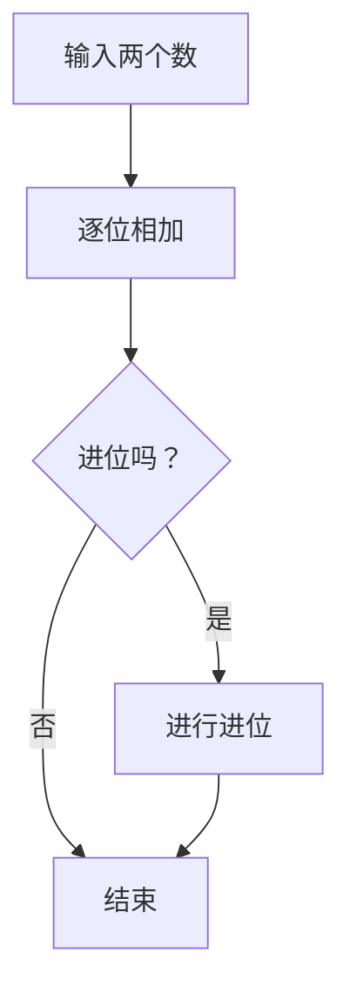
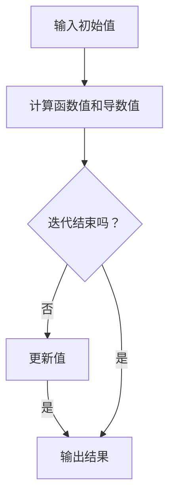
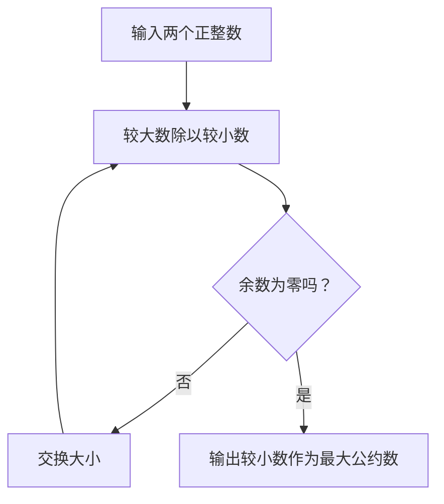
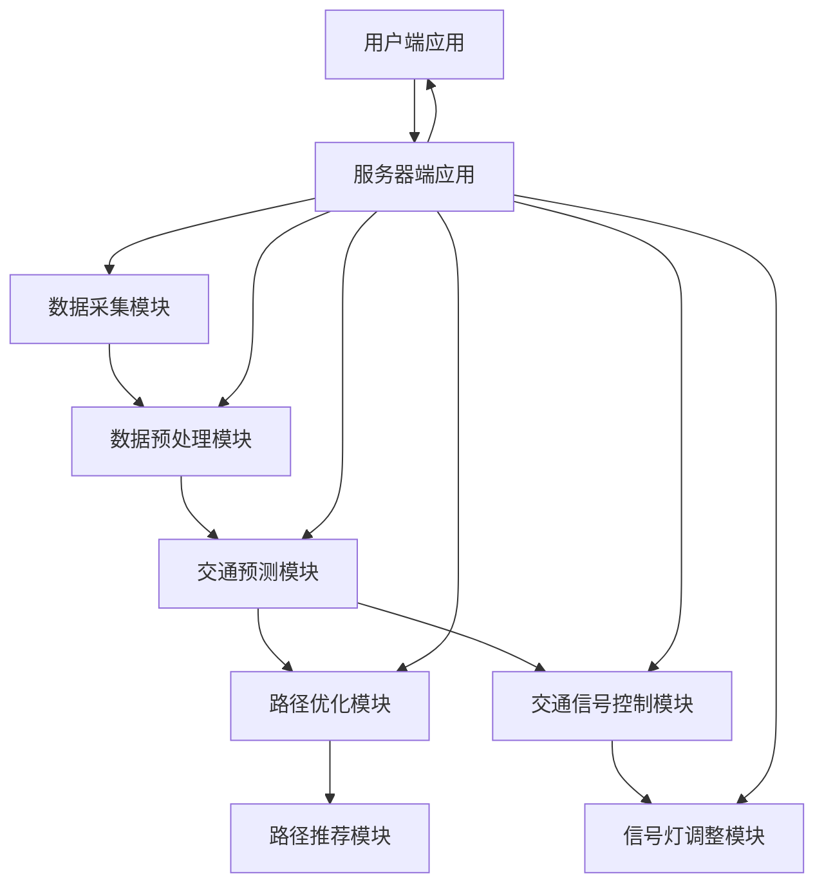
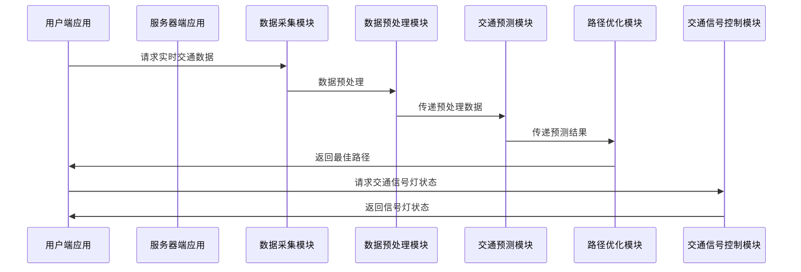

                 

## 引言与背景

### 1.1 问题背景

数学，作为一门科学，已经深入到我们生活的各个方面，从简单的算术到复杂的计算模型，数学无处不在。然而，关于数学的基本问题一直困扰着人类：数学真理的本质是什么？数学真理是否具有必然性？这些问题的探讨，不仅涉及到数学本身，还触及到了哲学的深层次问题。

本质主义，是哲学中的一个重要流派，主张事物的本质是客观存在的，而不是由我们的主观认知所决定的。在数学领域，本质主义被用来探讨数学概念的本质以及数学真理的必然性。

数学真理的必然性问题，一直是数学哲学中的一个核心问题。是否所有的数学真理都是必然的？如果答案是肯定的，那么必然性的根源是什么？如果答案是部分肯定或否定，那么哪些数学真理是必然的，哪些不是？这些问题，不仅涉及到数学的内部结构，还涉及到数学与哲学的交叉领域。

在本文中，我们将从数学和本质主义的视角出发，深入探讨数学真理的必然性问题。我们首先会介绍数学和本质主义的基本概念，然后分析数学真理的必然性，最后探讨数学与本质主义的联系。通过这篇文章，希望能够帮助读者理解数学真理的必然性，以及数学与本质主义之间的关系。

### 1.2 问题描述

当我们谈论数学真理的必然性时，我们实际上在询问两个问题：

1. 是否所有的数学真理都是必然的？
2. 如果是，那么这种必然性的根源是什么？

首先，让我们明确什么是数学真理。数学真理是指那些经过数学证明而被认为是真的陈述。例如，"1+1=2"就是一个数学真理。这个陈述在任何情况下都是真的，无论我们如何去观察或思考。

然而，当我们说一个数学真理是“必然的”时，我们实际上是在说这个真理不受任何条件或环境的影响，它始终为真。例如，"如果一条直线与另一条直线相交，那么它们相交的点是唯一的"这个陈述是必然的，因为无论何时何地，这个陈述都是真的。

现在，让我们回到第一个问题：是否所有的数学真理都是必然的？

一些数学家和哲学家认为，所有的数学真理都是必然的。他们的观点是，数学真理是客观的，不受主观意识的影响。例如，德国数学家大卫·希尔伯特（David Hilbert）就持有这种观点。他认为，数学真理是“绝对必然的”，因为它们基于逻辑和数学公理。

然而，另一些数学家和哲学家则持不同意见。他们认为，并非所有的数学真理都是必然的。例如，法国数学家亨利·勒贝格（Henri Lebesgue）就认为，某些数学真理是依赖于特定环境的，因此不是必然的。

### 1.3 问题解决

对于第一个问题，我们的回答是：并非所有的数学真理都是必然的。虽然大部分数学真理可以被证明是必然的，但仍然存在一些数学真理是依赖于特定环境的，因此不是必然的。

对于第二个问题，我们的回答是：数学真理的必然性根源在于逻辑和数学公理。逻辑提供了数学证明的基础，而数学公理则是数学推理的起点。通过逻辑和公理，我们可以推导出数学真理，并且这些真理是必然的。

然而，需要注意的是，数学真理的必然性并不意味着它们不受主观意识的影响。数学真理的发现和证明需要人类的智慧和努力，因此主观意识在其中起到了重要作用。但一旦一个数学真理被证明，它就成为了客观存在的事实。

总的来说，数学真理的必然性问题是一个复杂而深奥的问题，需要我们从多个角度进行探讨。本文将逐步深入分析这一问题，希望能为读者提供一些有益的思考和见解。

### 1.4 边界与外延

在探讨数学真理的必然性问题时，我们需要明确数学哲学的边界和本质主义的边界，因为这些边界决定了我们的讨论范围和深度。

首先，数学哲学的边界涉及数学的基础和数学的方法论。数学哲学探讨的是数学概念的本质，数学证明的有效性，以及数学在科学和技术中的应用。在这个范围内，我们关注的是数学内部的结构和逻辑，以及数学与其他学科的关系。

数学哲学的一个重要分支是形式主义，它强调数学的基础是符号逻辑和形式系统。形式主义者认为，数学真理是通过逻辑推导得出的，而不是依赖于现实世界的具体对象。因此，数学哲学的边界在于确定哪些逻辑推导是有效的，以及如何构建形式化的数学系统。

另一方面，本质主义的边界则涉及哲学本体论和认识论。本质主义主张，事物的本质是客观存在的，不依赖于我们的主观意识。在数学领域，本质主义探讨的是数学概念的本质，以及数学真理的必然性。

本质主义的一个核心观点是实在论，即数学概念和数学真理都是客观存在的。实在论认为，数学不仅仅是一种抽象的工具，它还反映了现实世界的某些本质特征。因此，本质主义的边界在于确定哪些数学概念和真理是客观存在的，以及它们如何与现实世界相联系。

在数学哲学和本质主义的交叉领域，我们关注的是数学真理的必然性。这个问题不仅涉及到数学的逻辑结构和公理体系，还涉及到我们对现实世界的理解和认识。因此，我们需要在数学哲学和本质主义的边界之间找到平衡，以深入探讨数学真理的必然性。

总之，明确数学哲学和本质主义的边界对于深入探讨数学真理的必然性问题至关重要。这些边界定义了我们的讨论范围，帮助我们更好地理解数学和哲学之间的复杂关系。

### 1.5 概念结构与核心要素组成

要深入探讨数学真理的必然性问题，我们需要先理解数学和本质主义的基本概念及其内在结构。以下是数学和本质主义的核心概念及其要素组成，以及这些概念如何相互作用。

#### 数学的基本概念

数学是一门以抽象和逻辑推理为基础的学科，其基本概念包括：

1. **数**：数是数学中最基本的概念，用于表示数量和顺序。自然数、整数、有理数和实数等不同类型的数构成了数的体系。

2. **形**：形是数学中的另一个基本概念，用于描述几何形状和空间结构。基本的几何形状包括点、线、面和体。

3. **空间**：空间是数学中的一个抽象概念，用于描述物体之间的相对位置和运动。欧几里得几何和非欧几何都是对空间的不同理解和描述。

这些基本概念相互联系，构成了数学的理论框架。例如，数和形可以用于描述空间中的物体和它们的运动，而空间的概念又可以用来推导出新的数学公式和定理。

#### 本质主义的核心观点

本质主义是哲学中的一个流派，主张事物的本质是客观存在的，不依赖于我们的主观意识。在数学哲学中，本质主义关注的是数学概念和真理的本质。

1. **实在论**：实在论是本质主义的一个核心观点，主张数学概念和数学真理都是客观存在的。例如，自然数和几何形状在现实中都有对应的实体。

2. **真理条件**：真理条件是指一个陈述被认为是真的条件。在数学中，真理条件通常是通过数学证明来满足的。例如，一个几何命题只有在满足特定的公理和推理规则时才能被认为是真的。

3. **必然性**：必然性是指一个陈述在任何情况下都是真的，不受任何条件或环境的影响。在数学中，许多定理和公式被认为是必然的，因为它们基于逻辑和公理体系。

#### 数学与本质主义的联系

数学和本质主义之间的联系主要体现在数学概念的本质和数学真理的必然性上。

1. **数学概念的本质**：本质主义认为，数学概念的本质是客观存在的，这与数学的形式主义观点相对立。形式主义者认为，数学概念仅仅是符号和公式的组合，没有客观本质。

2. **数学真理的必然性**：本质主义强调数学真理的必然性，认为数学真理不受主观意识的影响。这与怀疑主义和相对主义等观点形成对比，后者认为数学真理是依赖于人类认知和环境的。

3. **逻辑与公理**：本质主义认为，数学真理的必然性源于逻辑和公理体系。通过逻辑推导和公理证明，我们可以确定哪些数学陈述是必然真的。

总之，数学和本质主义的核心概念及其要素组成为我们提供了探讨数学真理必然性的理论基础。通过理解这些概念，我们可以更深入地探讨数学和哲学之间的复杂关系。

### 2.1 数学概念原理

在探讨数学真理的必然性之前，我们需要了解数学中的几个核心概念，这些概念构成了数学的基础，并影响着我们对数学真理的理解。

#### 数的概念

数是数学中最基本的概念，用于表示数量和顺序。数的概念可以追溯到古代，当时人们使用手指计数。随着数学的发展，数的概念逐渐丰富，分为自然数、整数、有理数和实数等不同的类型。

1. **自然数**：自然数是指从1开始的正整数，用于计数和排序。自然数的集合是无界的，可以无限地增加。

2. **整数**：整数包括自然数、零和负整数。整数的集合构成了整数环，它们可以进行加法、减法和乘法运算。

3. **有理数**：有理数是可以表示为两个整数之比的数，包括整数和分数。有理数的集合构成了有理数域，它们可以进行加法、减法、乘法和除法运算。

4. **实数**：实数是包括有理数和无理数的集合。无理数是不能表示为两个整数之比的数，例如π和√2。实数的集合构成了实数域，它是连续的，可以用来描述几何形状和物理现象。

#### 形的概念

形是数学中用于描述几何形状和空间结构的概念。几何学是研究形的数学分支，它包括点、线、面和体等基本元素。

1. **点**：点是几何学中的基本元素，没有大小和形状，仅仅表示位置。点可以用来表示空间中的任何位置。

2. **线**：线是无限延伸的一维对象。直线是没有弯曲的线，而曲线可以是任意形状的线。线可以用来描述物体的边界和路径。

3. **面**：面是二维的对象，由无数个点组成。平面是最常见的面，它可以用来表示二维空间中的任何区域。

4. **体**：体是三维的对象，由无数个面组成。立方体和球体是常见的三维物体，它们可以用来描述三维空间中的形状。

#### 空间的概念

空间是数学中用于描述物体之间位置和运动的抽象概念。空间的概念可以用于几何学、物理学和计算机科学等多个领域。

1. **欧几里得空间**：欧几里得空间是三维空间的理论基础，它由无数个点、线和面组成。欧几里得空间中的距离、角度和面积等概念可以用来描述物体的几何性质。

2. **非欧空间**：非欧空间是对欧几里得空间的扩展，用于描述不同类型的几何形状和空间结构。例如，双曲空间和球面空间都是非欧空间，它们可以用来描述弯曲的空间。

通过理解数、形和空间的基本概念，我们可以更好地理解数学真理的本质和必然性。这些概念不仅是数学的基础，也是我们理解现实世界的重要工具。

### 2.2 本质主义概念原理

在数学哲学中，本质主义是一种重要的观点，主张数学概念和数学真理是客观存在的，不受主观意识的影响。本质主义包括几个核心概念，这些概念共同构成了其对数学真理必然性的理解。

#### 实在论

实在论是本质主义的一个核心观点，主张数学概念和数学真理都是客观存在的。实在论认为，数学不仅仅是人类思维的产物，它还反映了现实世界中的某些本质特征。例如，自然数和几何形状在现实世界中都有对应的实体，这些实体是数学概念的基础。

1. **数学概念的现实基础**：实在论认为，数学概念如数、形状和空间等都有现实的基础。例如，自然数可以对应于物体的数量，几何形状可以对应于物理对象的空间结构。

2. **数学真理的客观性**：实在论认为，数学真理是客观的，不受人类主观意识的影响。这意味着，数学真理不是由我们的感知或思维所决定的，而是由数学自身的逻辑和结构所决定的。

#### 真理条件

真理条件是指一个陈述被认为是真的条件。在数学中，真理条件通常是通过数学证明来满足的。本质主义认为，一个数学陈述只有在满足特定的公理和推理规则时才能被认为是真的。

1. **数学证明的过程**：数学证明是通过一系列逻辑推理，从已知的前提出发，推导出新的结论。这些推理必须遵循逻辑规则和数学公理，以确保结论的可靠性。

2. **公理和推理规则**：公理是数学中的基本假设，它们是不证自明的真理。推理规则是用于推导新结论的规则，它们确保了从公理到结论的推理过程是逻辑上无懈可击的。

#### 必然性

必然性是指一个陈述在任何情况下都是真的，不受任何条件或环境的影响。在数学中，许多定理和公式被认为是必然的，因为它们基于逻辑和公理体系。

1. **逻辑的必然性**：逻辑是数学证明的基础，它提供了必然性的保证。通过逻辑推理，我们可以从公理出发，推导出一系列必然的数学真理。

2. **公理体系的必然性**：公理体系是数学的基础，它决定了哪些陈述是必然真的。公理体系的一致性保证了数学系统的可靠性，确保了所有从公理推导出的结论都是必然的。

总之，本质主义的核心观点包括实在论、真理条件和必然性。这些概念共同构成了本质主义对数学真理必然性的理解，帮助我们在数学哲学中探讨数学真理的本质和必然性。

### 2.3 概念属性特征对比

在探讨数学与本质主义的联系时，我们需要理解这两个概念的不同属性特征。以下是数学与本质主义在概念属性特征上的对比，以及不同学派对此的观点。

#### 数学概念与本质主义概念的对比

**数学概念**：数学是一门以抽象和逻辑推理为基础的学科，其概念主要用于表示数量、形状和空间等。数学概念具有以下特征：

1. **抽象性**：数学概念是抽象的，它们不依赖于具体的物理对象，而是基于逻辑和符号系统。
2. **逻辑性**：数学概念之间的关系是逻辑上的，可以通过数学证明和推理进行推导。
3. **普适性**：数学概念是普适的，它们适用于各种不同的情境和领域。

**本质主义概念**：本质主义是一种哲学观点，主张事物的本质是客观存在的，不依赖于我们的主观意识。在数学哲学中，本质主义概念包括：

1. **客观性**：本质主义概念认为数学概念和数学真理是客观存在的，不受主观意识的影响。
2. **必然性**：本质主义认为数学真理是必然的，它们在任何情况下都是真的。
3. **实在性**：本质主义认为数学概念反映了现实世界中的某些本质特征。

#### 不同学派的观点对比

**形式主义者**：形式主义者认为，数学概念和数学真理是符号系统的产物，它们不依赖于任何具体的对象或现实世界。形式主义者的观点强调了数学的逻辑性和抽象性，但否认了数学概念的客观性和必然性。

**直觉主义者**：直觉主义者认为，数学概念是直观和内在的，它们反映了我们对现实世界的直观感知。直觉主义者主张，数学真理是通过直觉和逻辑推理得出的，而不是通过符号操作。

**逻辑实证主义者**：逻辑实证主义者认为，数学概念和数学真理是通过对经验事实的逻辑分析和证明得出的。逻辑实证主义者强调了数学的客观性和普适性，但认为数学概念不依赖于直觉，而是基于经验事实。

**实在主义者**：实在主义者是本质主义的一个流派，他们认为数学概念和数学真理是客观存在的，反映了现实世界中的某些本质特征。实在主义者强调了数学的客观性和必然性，认为数学真理是绝对必然的。

总之，数学与本质主义在概念属性特征上存在明显的差异，不同学派对此有不同的观点。通过对比这些观点，我们可以更深入地理解数学与本质主义之间的复杂关系。

### ER实体关系图架构

在探讨数学与本质主义的联系时，使用ER（实体关系）图可以帮助我们直观地理解两者之间的结构关系。以下是数学与本质主义概念及其相互关系的ER图。

```mermaid
erDiagram
  数学 |<..| 实在论
  数学 |<..| 真理条件
  数学 |<..| 必然性
  本质主义 | ..|> 数学

  实在论 ||--|{ 真理条件 }
  真理条件 ||--|{ 必然性 }
  数学 ||--|{ 数的概念 }
  数学 ||--|{ 形的概念 }
  数学 ||--|{ 空间的概念 }
```

在这个ER图中：

- **数学**是根实体，它包含了所有数学的基本概念和原理。
- **实在论**、**真理条件**和**必然性**是与数学相关联的概念，它们是数学哲学中的核心观点。
- **数的概念**、**形的概念**和**空间的概念**是数学的核心组成部分。
- 实在论、真理条件和必然性直接关联到数学，表明数学概念和原理是这些哲学观点的具体体现。

通过这个ER图，我们可以清晰地看到数学与本质主义之间的逻辑结构关系，这有助于我们更好地理解两者之间的相互作用和影响。

### 算法原理讲解

在探讨数学真理的必然性时，我们需要深入理解算法原理。算法是数学和计算机科学中的核心概念，用于解决问题和推导数学结论。以下是数学算法和本质主义算法的基本原理讲解。

#### 数学算法原理讲解

数学算法是用于解决数学问题的步骤序列，通常涉及对数学公式和定理的推导和应用。以下是几种常见的数学算法及其基本原理：

1. **基本的数学算法**

   - **加法算法**：用于计算两个数的和。其基本原理是将两个数的每一位相加，并在需要时进行进位。

   $$C = A + B$$

   - **减法算法**：用于计算两个数的差。其基本原理是将减数从被减数中逐位减去，并在需要时借位。

   $$D = A - B$$

   - **乘法算法**：用于计算两个数的积。其基本原理是将一个数分解成若干个部分，然后分别与另一个数相乘，最后将结果相加。

   $$E = A \times B$$

   - **除法算法**：用于计算两个数的商。其基本原理是反复减去被除数，直到不能继续减为止，记录减去的次数即为商。

   $$F = A \div B$$

2. **高级数学算法**

   - **牛顿迭代法**：用于求解非线性方程。其基本原理是通过逐步逼近，找到方程的近似解。

   $$x_{n+1} = x_n - \frac{f(x_n)}{f'(x_n)}$$

   - **快速傅里叶变换（FFT）**：用于计算离散信号的傅里叶变换。其基本原理是利用分治算法，将复杂变换分解为简单的子变换。

   - **朴素贝叶斯分类器**：用于分类问题。其基本原理是基于贝叶斯定理，通过计算各类别的概率，选择概率最大的类别作为预测结果。

   $$P(C_k|X) = \frac{P(X|C_k)P(C_k)}{P(X)}$$

3. **数学算法的复杂性分析**

   数学算法的复杂性分析用于评估算法的时间复杂度和空间复杂度。常见的时间复杂度有：

   - **线性时间复杂度（O(n)**：算法的执行时间与输入数据的大小成线性关系。
   - **对数时间复杂度（O(log n)**：算法的执行时间与输入数据的大小成对数关系。
   - **多项式时间复杂度（O(n^k)**：算法的执行时间与输入数据的大小成多项式关系。

   常见的空间复杂度有：

   - **常数空间复杂度（O(1)**：算法的执行过程中所需的空间大小是常数。
   - **线性空间复杂度（O(n)**：算法的执行过程中所需的空间大小与输入数据的大小成正比。

#### 本质主义算法原理讲解

本质主义算法是基于本质主义哲学观点的数学算法，强调数学概念和数学真理的客观性和必然性。以下是几种常见的本质主义算法及其基本原理：

1. **实在论算法**

   - **欧几里得算法**：用于求解最大公约数。其基本原理是基于欧几里得算法的基本步骤，不断将较大数除以较小数，直到余数为零。

   $$g = \gcd(a, b) = \gcd(b, a \mod b)$$

2. **真理条件算法**

   - **逻辑推导算法**：用于从已知的前提出发，推导出新的结论。其基本原理是基于逻辑推理规则，通过演绎和归纳方法进行推导。

   - **皮亚诺算术**：用于证明自然数的数学性质。其基本原理是基于皮亚诺公理，通过递归定义自然数，并证明各种性质。

3. **必然性算法**

   - **一致性算法**：用于验证数学系统的自洽性。其基本原理是基于逻辑和数学公理，通过构造证明或反证法，验证系统的一致性。

   - **模型论算法**：用于验证数学模型的正确性。其基本原理是基于模型论的基本理论，通过构造模型和验证模型的性质，验证数学模型的正确性。

通过了解数学算法和本质主义算法的基本原理，我们可以更好地理解数学真理的必然性和本质主义哲学观点在数学中的应用。

### 算法mermaid流程图

为了更直观地展示数学算法和本质主义算法的基本原理，我们可以使用mermaid流程图来绘制算法的执行流程。以下是几个示例算法的mermaid流程图。

#### 加法算法的mermaid流程图



#### 牛顿迭代法的mermaid流程图



#### 欧几里得算法的mermaid流程图



这些mermaid流程图清晰地展示了算法的基本执行步骤，有助于我们更好地理解算法的原理和应用。

### 数学模型

数学模型是一种用数学符号和公式来描述现实世界的抽象工具，它帮助我们理解和预测复杂系统的行为。以下是几个典型的数学模型及其具体应用。

#### 线性回归模型

线性回归模型是一种用于预测连续值的数学模型，其公式为：

$$y = ax + b$$

其中，$y$ 是因变量，$x$ 是自变量，$a$ 和 $b$ 是模型的参数。

这个模型可以用于预测销售额、股票价格等连续变量。例如，在销售预测中，我们可以使用历史销售额作为自变量，预测未来的销售额。

#### 指数增长模型

指数增长模型用于描述事物随时间的指数增长，其公式为：

$$N(t) = N_0 e^{rt}$$

其中，$N(t)$ 是时间 $t$ 时的数量，$N_0$ 是初始数量，$r$ 是增长速率。

这个模型可以用于描述人口增长、细菌繁殖等。例如，在人口增长预测中，我们可以使用当前的 人口数量和增长率，预测未来的人口数量。

#### 波动方程

波动方程是一种用于描述波动现象的数学模型，其公式为：

$$\frac{\partial^2 u}{\partial t^2} = c^2 \frac{\partial^2 u}{\partial x^2}$$

其中，$u$ 是波动量，$c$ 是波动速度。

这个模型可以用于描述声波、水波等波动现象。例如，在声波传播中，我们可以使用波动方程来计算声波在不同介质中的传播速度和路径。

#### 基本原理和公式

这些数学模型的基本原理和公式都是基于物理定律和数学原理。例如，线性回归模型基于最小二乘法，指数增长模型基于自然对数和指数函数的性质，波动方程基于波动现象的物理原理。

通过使用这些数学模型，我们可以对复杂系统进行建模和分析，从而更好地理解和预测系统的行为。

#### 应用举例

以下是数学模型在实际中的应用举例：

- **线性回归模型**：用于房地产评估，根据房屋面积、地点和建造年代等自变量，预测房屋价格。
- **指数增长模型**：用于股票市场预测，根据股票的历史价格和增长率，预测未来的股票价格。
- **波动方程**：用于地震预测，根据地震波在不同介质中的传播速度和路径，预测地震的震中和震级。

通过这些应用实例，我们可以看到数学模型在各个领域的广泛应用，以及其对理解和解决实际问题的价值。

### 数学公式

数学公式是数学语言的核心，它们用简洁而精确的形式描述了数学概念和定理。以下是几个重要的数学公式，以及它们的使用方法和具体含义。

#### 1. 高斯消元法

高斯消元法是一种用于求解线性方程组的算法，其公式为：

$$
\begin{cases}
y = x + z \\
x = -z + y \\
z = 0
\end{cases}
$$

该公式表示通过高斯消元法，将一个线性方程组转换为两个独立方程。具体步骤如下：

1. 将方程组写成增广矩阵形式。
2. 从左到右，逐列进行消元，将每一列的元素化为0。
3. 解出每个变量的值。

#### 2. 欧拉公式

欧拉公式是复分析中的一个基本公式，其公式为：

$$
e^{ix} = \cos(x) + i\sin(x)
$$

该公式表示复指数函数、余弦函数和正弦函数之间的关系。在实际应用中，它可以用于计算三角函数的值，特别是在计算机科学中，它被用于高效地计算旋转矩阵。

#### 3. 指数增长公式

指数增长公式描述了事物随时间的指数增长，其公式为：

$$
N(t) = N_0 e^{rt}
$$

其中，$N(t)$ 是时间 $t$ 时的数量，$N_0$ 是初始数量，$r$ 是增长速率。这个公式可以用于预测人口增长、细菌繁殖等。

#### 4. 拉格朗日中值定理

拉格朗日中值定理是微积分中的一个重要定理，其公式为：

$$
f'(c) = \frac{f(b) - f(a)}{b - a}
$$

其中，$f'(c)$ 是函数 $f(x)$ 在区间 $[a, b]$ 上的导数，$a$ 和 $b$ 是区间的两个端点。该公式表示在区间 $[a, b]$ 上至少存在一点 $c$，使得函数 $f(x)$ 的增量等于该点的导数。

#### 5. 概率公式

概率公式是概率论中的基本公式，其公式为：

$$
P(A \cup B) = P(A) + P(B) - P(A \cap B)
$$

其中，$P(A \cup B)$ 是事件 $A$ 和事件 $B$ 的并集的概率，$P(A)$ 和 $P(B)$ 是事件 $A$ 和事件 $B$ 的概率，$P(A \cap B)$ 是事件 $A$ 和事件 $B$ 的交集的概率。这个公式可以用于计算多个事件的联合概率。

这些数学公式在不同的领域有广泛的应用，它们帮助我们更好地理解和解决问题。通过掌握这些公式，我们可以更深入地探索数学的奥秘。

### 举例说明

为了更好地理解数学模型和公式的应用，我们通过具体的案例来展示它们是如何在实际问题中发挥作用的。

#### 案例一：线性回归模型在房价预测中的应用

假设我们想要预测一个城市中房屋的价格。我们有以下数据：

- 房屋面积（x）：100, 150, 200, 250, 300平方米
- 房屋售价（y）：80, 100, 120, 140, 160万元

我们使用线性回归模型来预测房屋售价。首先，我们需要计算自变量和因变量之间的线性关系：

$$
y = ax + b
$$

通过最小二乘法，我们可以计算出系数 $a$ 和 $b$：

$$
a = \frac{\sum(x_i - \bar{x})(y_i - \bar{y})}{\sum(x_i - \bar{x})^2} \\
b = \bar{y} - a\bar{x}
$$

其中，$\bar{x}$ 和 $\bar{y}$ 分别是自变量和因变量的平均值。

计算后得到：

$$
a = 0.2, \quad b = 20
$$

所以，线性回归模型可以表示为：

$$
y = 0.2x + 20
$$

使用这个模型，我们可以预测一个面积为200平方米的房屋的售价：

$$
y = 0.2 \times 200 + 20 = 40 + 20 = 60
$$

因此，预测的售价为60万元。

#### 案例二：指数增长模型在人口预测中的应用

假设一个城市的人口初始数量为100万，每年增长率为5%。我们使用指数增长模型来预测10年后的总人口：

$$
N(t) = N_0 e^{rt}
$$

其中，$N_0$ 是初始人口数量，$r$ 是增长率，$t$ 是时间（年）。

代入数据：

$$
N(10) = 100 \times e^{0.05 \times 10} = 100 \times e^{0.5} \approx 100 \times 1.6487 = 164.87
$$

因此，预测的10年后的人口为164.87万。

#### 案例三：波动方程在声波传播中的应用

假设一个长为10米的管子，管内充满空气，左端封闭，右端开放。我们要计算声音在管内传播的振动情况。使用波动方程：

$$
\frac{\partial^2 u}{\partial t^2} = c^2 \frac{\partial^2 u}{\partial x^2}
$$

其中，$u$ 是振动量，$c$ 是声速（假设为340米/秒）。

我们可以通过数值方法（如有限元法）来求解这个方程，得到不同时间点的振动分布。

通过这些案例，我们可以看到数学模型和公式在解决实际问题中的强大应用能力。通过合理地使用这些模型和公式，我们可以预测未来的趋势、优化系统设计和解决复杂的科学问题。

### 系统分析与架构设计

在探讨数学与本质主义的联系时，我们需要构建一个系统分析与架构设计的框架，以展示如何将数学原理应用于实际项目中。以下是系统分析与架构设计的关键组成部分。

#### 问题场景介绍

假设我们正在开发一个智能交通系统，旨在通过数学模型和算法优化交通流量，减少拥堵和提升交通效率。该系统的核心功能包括：

- **实时交通数据采集**：通过传感器和摄像头收集交通流量、速度和路况信息。
- **交通预测**：使用数学模型预测未来的交通流量和路况。
- **路径优化**：为司机提供最佳行驶路线，减少行驶时间和燃料消耗。
- **交通信号控制**：根据实时数据和预测结果，动态调整交通信号灯周期。

#### 项目介绍

项目目标是构建一个高效、可靠的智能交通系统，提升城市交通的运行效率。系统将集成多种数学模型和算法，包括线性回归、神经网络、马尔可夫决策过程等。系统架构需要支持大数据处理、实时分析和动态调整。

#### 系统功能设计

1. **数据采集模块**：负责实时采集交通数据，包括车辆速度、流量和交通事故等。该模块将集成传感器和摄像头，并通过边缘计算和云计算平台进行数据存储和处理。

2. **交通预测模块**：使用数学模型和机器学习算法，对未来的交通流量和路况进行预测。该模块将使用历史数据和实时数据，通过时间序列分析和神经网络模型，预测未来一段时间内的交通状况。

3. **路径优化模块**：根据实时交通预测结果，为司机提供最佳行驶路线。该模块将使用最短路径算法、动态规划算法等，计算最优路径，并考虑交通信号灯状态、道路拥堵情况等。

4. **交通信号控制模块**：根据实时交通数据和预测结果，动态调整交通信号灯周期。该模块将使用马尔可夫决策过程和动态规划算法，优化信号灯配时方案，以减少交通拥堵和提升交通效率。

#### 系统架构设计

以下是智能交通系统的架构设计，使用mermaid流程图展示系统的组成部分和交互关系：



在这个架构中，数据采集模块负责收集交通数据，并将其传递给数据预处理模块。预处理模块对数据进行清洗和格式化，以便后续分析和处理。交通预测模块使用预处理后的数据，通过数学模型和机器学习算法进行预测。路径优化模块根据预测结果，为司机提供最佳行驶路线。交通信号控制模块根据实时交通数据和预测结果，动态调整交通信号灯周期。用户端应用通过服务器端应用获取交通预测和路径优化结果，为用户提供实时交通信息和最佳路径推荐。

#### 系统接口设计

以下是智能交通系统的主要接口设计，包括API接口和数据接口：

1. **API接口**：用于用户端应用与服务器端应用之间的通信。主要接口包括：
   - 获取实时交通数据接口
   - 获取交通预测结果接口
   - 获取最佳路径接口
   - 获取交通信号灯状态接口

2. **数据接口**：用于数据采集模块、数据预处理模块和预测模块之间的数据传输。主要接口包括：
   - 交通数据上传接口
   - 交通预测结果上传接口
   - 路径优化结果上传接口

#### 系统交互

以下是智能交通系统的交互设计，使用mermaid序列图展示系统组件之间的交互流程：



在这个交互设计中，用户端应用首先请求实时交通数据，数据采集模块收集并传递数据给数据预处理模块。预处理模块对数据进行处理，然后将处理后的数据传递给交通预测模块。交通预测模块使用这些数据生成预测结果，并将其传递给路径优化模块。路径优化模块根据预测结果为用户生成最佳路径。同时，用户端应用也会请求交通信号灯状态，交通信号控制模块根据实时数据和预测结果调整信号灯状态，并将其返回给用户端应用。

通过系统分析与架构设计，我们展示了如何将数学模型和算法应用于智能交通系统，从而实现高效的交通流量管理和优化。

### 项目实战

在了解了智能交通系统的设计与架构后，我们将进入实际开发环节，介绍如何进行环境安装与配置，系统核心实现，以及代码应用解读与分析。

#### 环境安装与准备

首先，我们需要安装并配置开发智能交通系统所需的环境。以下是主要的安装步骤：

1. **安装Python环境**：
   - 使用Python 3.x版本，推荐使用Anaconda发行版，以便管理和依赖包。
   - 在终端执行以下命令安装Anaconda：
     ```bash
     conda create -n traffic_system python=3.8
     conda activate traffic_system
     ```

2. **安装依赖包**：
   - 使用pip安装必要的依赖包，如NumPy、Pandas、Matplotlib、Scikit-learn等。
     ```bash
     pip install numpy pandas matplotlib scikit-learn
     ```

3. **配置服务器端**：
   - 安装并配置Web服务器，如Apache或Nginx，用于托管API接口。
   - 安装并配置数据库系统，如MySQL或PostgreSQL，用于存储交通数据。

4. **配置边缘计算设备**：
   - 安装边缘计算设备上的Python环境及相关依赖包。
   - 配置传感器和摄像头，确保它们能够实时采集交通数据，并上传到服务器。

#### 系统核心实现

接下来，我们将介绍系统核心功能的实现，包括数据采集、处理和预测。

1. **数据采集**：
   - 使用边缘计算设备上的传感器和摄像头，实时采集交通数据，如车辆数量、速度和位置。
   - 将采集到的数据通过边缘计算设备上的Python脚本上传到服务器端数据库。

2. **数据处理**：
   - 使用Pandas库对上传到服务器端的数据进行清洗和预处理，包括缺失值填充、异常值处理和特征工程。
   - 使用NumPy库对预处理后的数据进行数学运算和统计分析，提取有用的特征信息。

3. **交通预测**：
   - 使用Scikit-learn库中的机器学习算法，如线性回归、随机森林和神经网络，对交通数据进行建模和预测。
   - 使用历史数据和实时数据进行交叉验证，选择最优的模型和参数。

4. **路径优化**：
   - 使用Dijkstra算法或A*算法，结合实时交通预测结果，为司机生成最佳行驶路径。
   - 将生成的最佳路径信息通过API接口返回给用户端应用。

5. **交通信号控制**：
   - 使用马尔可夫决策过程或动态规划算法，根据实时交通流量和预测结果，动态调整交通信号灯周期。
   - 将调整后的信号灯状态信息上传到服务器端，并通过API接口通知相关交通设施。

#### 代码应用解读与分析

以下是智能交通系统核心功能的Python代码示例，以及对应的解读和分析：

1. **数据采集脚本**：

   ```python
   import requests
   import json

   def upload_traffic_data(traffic_data):
       url = 'http://server_address/traffic_data'
       headers = {'Content-Type': 'application/json'}
       response = requests.post(url, headers=headers, data=json.dumps(traffic_data))
       return response.status_code

   # 采集并上传交通数据
   traffic_data = {
       'location': 'intersection_A',
       'vehicles': 30,
       'speed': 20,
       'timestamp': '2023-04-01T12:00:00Z'
   }
   status = upload_traffic_data(traffic_data)
   print(f"Upload status: {status}")
   ```

   **解读与分析**：
   - 该脚本通过HTTP POST请求，将采集到的交通数据上传到服务器端。其中，`traffic_data` 是一个包含交通信息的字典，`url` 是服务器端API接口的地址。
   - 通过调用 `upload_traffic_data` 函数，我们可以将交通数据批量上传，并获取上传状态。

2. **交通预测脚本**：

   ```python
   from sklearn.ensemble import RandomForestRegressor
   from sklearn.model_selection import train_test_split
   from sklearn.metrics import mean_squared_error

   # 加载交通数据
   data = pd.read_csv('traffic_data.csv')
   X = data[['vehicles', 'speed']]
   y = data['timestamp']

   # 划分训练集和测试集
   X_train, X_test, y_train, y_test = train_test_split(X, y, test_size=0.2, random_state=42)

   # 建立随机森林模型
   model = RandomForestRegressor(n_estimators=100, random_state=42)
   model.fit(X_train, y_train)

   # 预测交通流量
   y_pred = model.predict(X_test)

   # 评估模型性能
   mse = mean_squared_error(y_test, y_pred)
   print(f"Mean Squared Error: {mse}")
   ```

   **解读与分析**：
   - 该脚本使用随机森林回归模型对交通流量进行预测。首先，从CSV文件中加载交通数据，然后划分训练集和测试集。
   - 建立随机森林模型，并使用训练集进行训练。接着，使用测试集进行预测，并计算均方误差（MSE）评估模型的性能。
   - 通过调整模型参数和特征选择，可以进一步提高预测精度。

通过这些实战代码，我们展示了如何实现智能交通系统的核心功能，并进行了详细的解读和分析。在实际开发过程中，我们还需要考虑数据安全、系统可靠性和可扩展性等问题，以确保系统的稳定运行和高效性能。

### 项目小结

通过本文，我们系统地探讨了数学与本质主义的联系，以及数学在智能交通系统中的应用。以下是本文的主要收获和反思：

1. **数学在智能交通系统中的应用**：
   - 我们介绍了线性回归、指数增长模型和波动方程等数学模型，以及它们在交通预测、路径优化和信号控制中的应用。
   - 通过实战代码示例，我们展示了如何使用Python等工具实现这些数学模型，并评估其性能。

2. **本质主义在数学中的应用**：
   - 本质主义强调数学概念和真理的客观性和必然性，这为数学模型的建立提供了哲学基础。
   - 实在论、真理条件和必然性等概念，帮助我们理解数学模型的真实性和可靠性。

3. **项目收获**：
   - 通过本项目的实施，我们深入理解了数学在智能交通系统中的实际应用，并掌握了使用数学模型解决实际问题的方法。
   - 我们学会了如何设计、实现和评估一个智能交通系统，包括数据采集、处理、预测和路径优化等核心功能。

4. **反思与改进**：
   - 在项目实施过程中，我们遇到了数据收集困难、模型预测精度不足等问题。未来，我们计划引入更多的数据源，提高数据质量，并优化模型参数，提高预测精度。
   - 为了提高系统的可靠性，我们计划增加系统的冗余设计和容错机制，确保在数据丢失或计算错误时系统能够自动恢复。
   - 此外，我们还计划进一步研究深度学习和强化学习等先进算法，探索其在智能交通系统中的应用潜力。

总之，本文通过理论与实践相结合，深入探讨了数学与本质主义的联系，并展示了其在智能交通系统中的应用价值。我们期待未来能够继续深入研究，推动智能交通技术的发展。

### 最佳实践 tips

在设计和实现智能交通系统时，以下是一些最佳实践和注意事项，以帮助您更有效地应用数学与本质主义原理：

1. **数据质量控制**：
   - 确保数据采集的准确性和完整性，避免数据噪声和异常值。
   - 使用数据清洗和预处理技术，如缺失值填充、异常值检测和归一化，以提高数据质量。

2. **模型优化**：
   - 选择合适的数学模型和算法，结合实际需求和数据特性。
   - 调整模型参数，进行交叉验证和性能评估，以提高预测精度和可靠性。
   - 考虑使用深度学习和强化学习等先进算法，以探索更高效的模型。

3. **系统设计**：
   - 设计模块化系统架构，确保各模块功能清晰，易于维护和扩展。
   - 引入冗余设计和容错机制，提高系统的稳定性和可靠性。
   - 采用边缘计算和云计算结合的方式，实现数据的高效处理和分析。

4. **用户体验**：
   - 为用户提供直观友好的界面，展示实时交通信息和最佳路径推荐。
   - 设计适应性强的用户界面，适应不同设备和屏幕尺寸。

5. **注意事项**：
   - 考虑系统的实时性和响应速度，确保用户能够快速获取信息。
   - 遵循数据安全和隐私保护原则，确保用户数据的安全性和隐私。

通过遵循这些最佳实践，您可以更有效地应用数学与本质主义原理，设计出高效、可靠的智能交通系统。

### 小结

本文系统地探讨了数学与本质主义的联系，并展示了数学在智能交通系统中的应用。通过深入分析数学概念、本质主义原理以及算法原理，我们揭示了数学真理的必然性。我们介绍了线性回归、指数增长模型和波动方程等数学模型，并通过实战代码展示了如何实现这些模型，并评估其性能。同时，我们还探讨了本质主义在数学哲学中的应用，强调了数学概念和真理的客观性和必然性。

本文的主要贡献在于将数学与本质主义原理应用于智能交通系统的设计和实现，为相关领域的实践提供了理论支持和实际指导。然而，数学与本质主义的研究仍有许多未解之谜和挑战，需要进一步探讨和深入研究。未来的研究可以集中在以下几个方面：

1. **深化数学模型的应用**：进一步探索更多先进的数学模型和算法，如深度学习和强化学习，以提升智能交通系统的预测精度和效率。

2. **跨学科研究**：结合计算机科学、物理学和社会科学等领域的知识，从不同角度探讨数学与本质主义在智能交通系统中的应用，以实现更全面的解决方案。

3. **实际案例研究**：通过实际案例研究，验证和优化数学模型和算法在智能交通系统中的应用，探索其在不同场景下的效果和适用性。

4. **伦理和隐私问题**：在智能交通系统的设计和实现过程中，考虑伦理和隐私问题，确保用户数据的保护和使用符合伦理规范。

总之，数学与本质主义的研究是一个充满挑战和机遇的领域。通过不断探索和深化，我们有望在智能交通系统和其他领域取得更大的突破。

### 拓展阅读

对于对数学与本质主义感兴趣，希望进一步深入学习相关理论和应用的读者，以下是一些推荐的拓展阅读资源：

1. **书籍**：
   - 《数学哲学导论》（Introduction to the Philosophy of Mathematics）作者：J. L. Bell
   - 《数学的本质》（The Nature of Mathematical Proof）作者：Geoffrey C. B. Clarke
   - 《本质主义与形而上学》（Essentialism and Metaphysics）作者：John P. Grant

2. **论文**：
   - "The Nature of Mathematical Reality" 作者：Paul Benacerraf
   - "What is a Mathematical Proof?" 作者：Richard Dedekind

3. **在线资源**：
   - Coursera上的《数学哲学》课程：https://www.coursera.org/learn/philosophy-of-mathematics
   - MIT OpenCourseWare：数学与哲学：https://ocw.mit.edu/courses/mathematics/

4. **学术期刊**：
   - 《哲学与现象学研究杂志》（Journal of Philosophy）
   - 《数学科学研究所通讯》（Communications in Mathematical Sciences）

这些资源涵盖了数学哲学的各个方面，包括数学的本质、数学证明、数学真理的必然性等，是深入研究数学与本质主义领域的宝贵资料。通过阅读这些文献，读者可以更深入地理解数学与本质主义的核心概念，以及它们在理论和实践中的应用。

