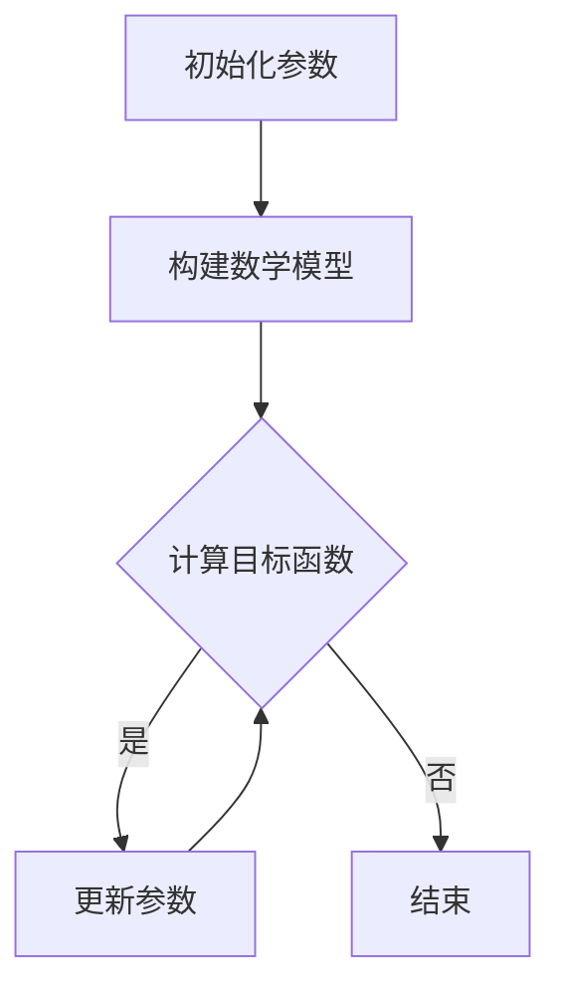
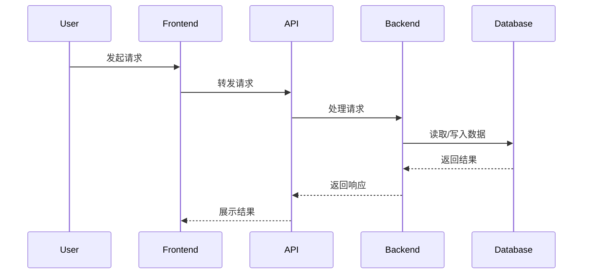

                 

### 引言

在信息技术和经济学不断发展的今天，数学与机制设计已逐渐成为解决复杂问题的有力工具。本文将探讨数学与机制设计之间的紧密联系，特别是如何构建激励兼容的数学模型。激励兼容性，是指在一个机制中，参与者的行为能够最大化整体收益，同时参与者自身的利益也能够得到满足。这一特性在游戏理论、经济交易、网络安全等领域有着广泛的应用。

文章将首先介绍数学与机制设计的基本概念，阐述它们在现实世界中的应用。随后，我们将分析激励兼容的概念及其重要性，通过定义和案例说明来加深理解。接着，我们将深入探讨核心概念与它们之间的联系，使用表格和ER实体关系图来清晰地展示这些概念。

本文的核心内容将集中在算法原理的讲解上。我们将使用mermaid画出算法流程图，通过Python源代码来阐述算法原理，并对数学模型和公式进行详细讲解。此外，我们将通过具体的例子来说明如何应用这些数学模型和公式。

文章的下一部分将转向系统分析与架构设计，介绍问题场景、系统功能设计、系统架构设计、系统接口设计和系统交互。我们将使用mermaid来绘制相关的图表，以直观地展示系统设计。

在项目实战部分，我们将详细描述环境安装、系统核心实现、代码应用解读与分析，并结合实际案例分析来剖析项目的成功与不足。

最后，文章将总结最佳实践，提出注意事项，并给出拓展阅读建议，帮助读者进一步探索这一领域的深度和广度。

通过本文的阅读，读者将能够理解数学与机制设计的基本原理，掌握构建激励兼容数学模型的方法，并了解在实际项目中如何应用这些知识。

### 关键词

- 数学与机制设计
- 激励兼容
- 数学模型
- 机制设计理论
- 算法原理
- 系统分析与架构设计
- Python源代码
- 实际案例分析

### 摘要

本文探讨了数学与机制设计的紧密联系，特别是在构建激励兼容的数学模型方面。文章首先介绍了数学与机制设计的基本概念，并分析了激励兼容的概念和重要性。随后，通过核心概念的联系、算法原理的讲解、数学模型和公式的详细讲解以及具体的例子，深入阐述了如何构建和应用这些模型。文章接着转向系统分析与架构设计，展示了问题场景、功能设计、架构设计、接口设计和交互。在项目实战部分，通过环境安装、系统核心实现、代码应用解读和分析，并结合实际案例分析，进一步验证了所提出的方法和模型。最后，文章总结了最佳实践，提出了注意事项，并提供了拓展阅读建议，以引导读者深入探索这一领域。

### 目录大纲设计

设计《数学与机制设计：激励兼容的数学模型》的目录大纲时，首先需要明确整体结构，确保内容的逻辑性和系统性。以下是具体的步骤和设计思路：

#### 第一步：整体结构规划

整体结构是目录大纲设计的核心，它决定了整本书的内容框架和逻辑顺序。对于《数学与机制设计：激励兼容的数学模型》，整体结构至少应包括以下七个主要部分：

1. **背景介绍**：介绍数学与机制设计的基本概念，问题背景和现状，以及数学模型在机制设计中的应用。
2. **核心概念与联系**：详细定义和阐述关键的概念和术语，如数学模型、机制设计、激励兼容等，并使用表格和ER实体关系图来展示概念之间的关系。
3. **算法原理讲解**：讲解算法的基本原理，包括算法流程图、Python源代码和数学模型与公式的详细解释。
4. **数学模型和数学公式 & 详细讲解 & 举例说明**：使用LaTeX格式书写数学公式，对数学模型和公式进行详细讲解，并通过例子说明实际应用。
5. **系统分析与架构设计方案**：介绍问题场景和项目背景，详细描述系统功能设计、系统架构设计、系统接口设计和系统交互。
6. **项目实战**：详细描述环境安装、系统核心实现、代码应用解读与分析，以及实际案例分析和详细讲解。
7. **最佳实践 tips、小结、注意事项、拓展阅读**：总结全文，提出最佳实践建议，并提供相关的注意事项和拓展阅读资源。

#### 第二步：细化每个章节

对于每个章节，需要进一步细化其内容，确定每个小节的标题，并确保每个小节的标题都能清晰地反映其内容。以下是各个章节的细化内容：

- **背景介绍**：
  - **数学与机制设计基础**：定义数学模型和机制设计，介绍激励兼容的概念。
  - **问题背景和现状**：分析当前机制设计中的挑战和趋势。
  - **数学模型在机制设计中的应用**：探讨数学模型在解决实际问题的应用案例。

- **核心概念与联系**：
  - **关键概念介绍**：定义数学模型、机制设计、激励兼容等核心概念。
  - **概念属性特征对比**：通过表格对比不同概念的特征和联系。
  - **ER实体关系图架构**：使用mermaid绘制ER实体关系图，展示概念之间的联系。

- **算法原理讲解**：
  - **算法流程图**：使用mermaid绘制算法的流程图。
  - **Python源代码阐述**：提供具体的Python源代码，解释算法的实现细节。
  - **数学模型和公式讲解**：详细解释算法中的数学模型和公式。

- **数学模型和数学公式 & 详细讲解 & 举例说明**：
  - **数学公式书写**：使用LaTeX格式书写复杂的数学公式。
  - **数学模型应用讲解**：讲解数学模型在实际问题中的应用。
  - **举例说明**：通过具体的例子展示如何使用数学模型解决问题。

- **系统分析与架构设计方案**：
  - **问题场景介绍**：描述系统的实际应用场景。
  - **系统功能设计**：使用mermaid绘制领域模型类图。
  - **系统架构设计**：使用mermaid绘制系统架构图。
  - **系统接口设计**：详细描述系统接口的设计和实现。
  - **系统交互**：使用mermaid绘制系统交互序列图。

- **项目实战**：
  - **环境安装**：介绍环境搭建的过程和注意事项。
  - **系统核心实现**：提供系统核心部分的源代码和实现细节。
  - **代码应用解读**：分析代码的应用场景和实现原理。
  - **实际案例分析**：分析实际案例中的问题和解决方案。

- **最佳实践 tips、小结、注意事项、拓展阅读**：
  - **最佳实践 tips**：总结实践中得出的有效方法和建议。
  - **小结**：对全文内容进行总结，强调核心观点。
  - **注意事项**：提醒读者在应用过程中需要注意的问题。
  - **拓展阅读**：推荐相关的阅读资源，帮助读者深入探索。

#### 第三步：确保内容的逻辑性和连贯性

在细化每个章节后，需要再次检查整个目录大纲的逻辑性和连贯性。确保每个章节之间的过渡自然，内容相互呼应，形成一个完整的故事线。同时，注意章节标题和内容的一致性，确保每个标题都能准确反映其内容。

#### 第四步：遵循markdown格式

根据markdown格式的要求，正确使用#，##，###等符号来表示章节的层级。同时，注意使用合适的格式来增强文章的可读性，例如使用**粗体**强调关键概念，使用`代码块`展示源代码，使用`LaTeX`格式书写数学公式等。

### 设计思路

在设计《数学与机制设计：激励兼容的数学模型》的目录大纲时，我们遵循以下设计思路：

1. **系统性**：确保每个章节的内容都是系统的一部分，形成完整的知识体系。
2. **逻辑性**：确保章节之间的逻辑关系清晰，内容层层递进，便于读者理解。
3. **易懂性**：使用简单的语言和图表来解释复杂的数学模型和概念，降低学习难度。
4. **实用性**：结合实际案例和应用场景，使读者能够将所学知识应用到实际项目中。
5. **拓展性**：提供拓展阅读资源，帮助读者进一步探索相关领域。

通过以上设计思路，我们希望能够为读者提供一本内容丰富、结构清晰、易于理解的技术博客文章，引导读者深入探索数学与机制设计这一重要领域。

### 背景介绍

#### 数学与机制设计基础

数学与机制设计是两个看似独立但又密切相关的研究领域。数学作为一种抽象的思考工具，广泛应用于各个学科，包括物理学、经济学、工程学等。机制设计则关注如何在复杂系统中通过设计激励和约束，引导个体行为以实现整体效益的最大化。近年来，随着信息技术和经济学的发展，数学与机制设计在解决现实问题中发挥了越来越重要的作用。

**数学模型**是指在数学的框架内，对现实世界中的某些系统或问题进行抽象和描述。通过建立数学模型，研究者可以更准确地理解和分析问题，从而提出有效的解决方案。机制设计中的数学模型则特别强调如何在个体利益和整体效益之间找到平衡点。例如，经济学中的博弈论就是通过构建数学模型来研究个体在竞争环境中的策略选择。

**机制设计**是指通过制定规则和约束来影响个体行为，从而实现某个特定目标。它广泛应用于经济、政治、社会等领域。机制设计的一个核心目标是激励兼容，即设计出一种机制，使得个体在追求自身利益的同时，也能最大化整体效益。在经济学中，拍卖机制、股票市场、保险市场等都涉及机制设计。

#### 数学模型在机制设计中的应用

数学模型在机制设计中的应用非常广泛，主要体现在以下几个方面：

1. **博弈论**：博弈论是研究个体在竞争和合作环境中的决策行为的数学理论。在机制设计中，博弈论模型可以用来分析不同个体之间的策略选择和行为模式，从而设计出激励兼容的机制。例如，在拍卖机制中，拍卖师可以通过调整拍卖规则，使得买家和卖家的行为最大化整体收益。

2. **经济模型**：经济模型通过数学方法来描述经济系统的运行机制。例如，微观经济学中的供需模型、宏观经济学中的IS-LM模型等，都可以用来分析市场行为和价格机制。在机制设计中，这些模型可以帮助研究者理解个体在经济活动中的行为，并设计出合理的激励机制。

3. **优化模型**：优化模型通过数学方法来寻找最优解。在机制设计中，优化模型可以用来确定最佳的激励机制，使得个体在追求自身利益的同时，也能实现整体效益的最大化。例如，在人力资源管理中，优化模型可以用来确定最佳的薪酬和晋升机制。

#### 激励兼容的概念和重要性

**激励兼容**是指在一个机制中，个体的行为能够最大化整体收益，同时个体的自身利益也能够得到满足。换句话说，激励兼容的机制能够激励个体在追求自身利益的同时，也为整体利益做出贡献。

激励兼容在机制设计中的重要性体现在以下几个方面：

1. **提高效率**：激励兼容的机制能够激发个体的积极性，提高工作效率。例如，在人力资源管理中，通过设计合理的薪酬和晋升机制，可以激发员工的积极性，提高整体工作效率。

2. **实现公平**：激励兼容的机制能够确保个体的利益得到合理保障，从而实现公平。例如，在拍卖机制中，通过设计合理的竞价规则，可以确保买家和卖家的利益得到公平对待。

3. **促进创新**：激励兼容的机制能够激励个体在创新活动中投入更多的精力和资源，从而推动社会进步。例如，在科研创新中，通过设计合理的奖励机制，可以激励科研人员积极参与创新活动。

总之，数学与机制设计在现实世界中的应用具有重要意义，特别是在解决复杂问题和促进社会进步方面。通过构建激励兼容的数学模型，我们可以更好地理解和优化现实世界中的各种机制，从而实现个体和整体利益的双赢。

#### 核心概念与联系

在深入探讨数学与机制设计时，理解核心概念之间的联系至关重要。本文将介绍关键的术语和概念，并展示它们之间的关系，以便读者能够系统地把握这些概念。

**数学模型**是机制设计的核心组成部分。它是一种抽象的数学结构，用于描述现实世界中的问题和系统。数学模型可以通过公式、方程或算法来描述问题的各个方面，为机制设计提供理论基础。

**机制设计**是一种过程，旨在通过设计规则和激励结构，引导个体行为以实现整体效益的最大化。机制设计包括确定目标、制定规则、设计激励机制等步骤。

**激励兼容**是一个关键概念，指的是机制设计中的激励结构能够确保个体的行为既符合个人利益，又有利于整体利益。换句话说，激励兼容要求激励机制能够同时满足参与者的个人动机和整体效益。

**博弈论**是一种数学工具，用于分析个体在相互竞争环境中的策略选择和决策过程。博弈论在机制设计中扮演重要角色，因为它能够帮助我们理解个体如何在不同策略下进行交互，并设计出能够促进合作或竞争的机制。

**算法**是一种解决问题的系统方法，包括一系列步骤和规则，用于解决特定问题或执行特定任务。在机制设计中，算法通常用于实现激励兼容的目标，通过优化或决策模型来设计合理的激励结构。

**理性选择**是指个体在决策过程中遵循理性原则，根据自身利益最大化来进行选择。理性选择理论在机制设计中具有重要意义，因为它帮助我们理解个体如何在不同的激励结构下做出决策。

**公平性**是指机制设计中的规则和激励结构能够确保所有参与者得到公正的待遇。公平性不仅涉及经济利益，还包括机会的平等和资源的合理分配。

**效率**是机制设计的另一个关键目标，指的是资源的最优配置和整体效益的最大化。高效的机制设计能够减少浪费，提高整体福利。

**公平性**与**效率**之间的关系是机制设计中的一个重要问题。一方面，公平性可以激励参与者的积极性，促进长期合作；另一方面，效率要求资源得到最优利用，实现最大化效益。因此，机制设计需要在公平性和效率之间找到平衡点。

为了更好地展示这些核心概念之间的关系，我们可以使用表格和ER（实体关系）图来直观地表达。

#### 核心概念对比表格

| 概念        | 定义                                                         | 在机制设计中的应用 |
|-------------|------------------------------------------------------------|-------------------|
| 数学模型    | 用于描述问题和系统的数学结构                               | 建立机制设计的基础 |
| 机制设计    | 设计规则和激励结构以引导个体行为                           | 实现激励兼容       |
| 激励兼容    | 激励结构能同时满足个体利益和整体利益                       | 关键设计原则       |
| 博弈论      | 分析个体在竞争环境中的策略选择                             | 设计竞争性机制     |
| 算法       | 解决问题的系统方法                                         | 实现激励结构       |
| 理性选择    | 个体根据自身利益最大化进行选择                             | 预测个体行为       |
| 公平性      | 确保规则和激励结构对参与者公平                             | 提高合作意愿       |
| 效率        | 资源的最优配置和整体效益的最大化                           | 设计高效机制       |

#### ER实体关系图架构

为了进一步展示核心概念之间的关系，我们可以使用ER图来表示。以下是一个简化的ER图示例：

```mermaid
erDiagram
  MathModel ||--|{ MechanismDesign }
  MechanismDesign ||--|{ IncentiveCompatibility }
  MechanismDesign ||--|{ RationalChoice }
  MechanismDesign ||--|{ Fairness }
  MechanismDesign ||--|{ Efficiency }
  MathModel ||--|{ Algorithm }
```

在这个ER图中，MathModel（数学模型）是机制设计（MechanismDesign）的基础，它通过算法（Algorithm）实现激励兼容（IncentiveCompatibility）。机制设计还需要考虑理性选择（RationalChoice）、公平性（Fairness）和效率（Efficiency）等因素。

通过这个表格和ER图，我们可以清晰地看到数学模型、机制设计、激励兼容以及其他核心概念之间的联系。这有助于读者更好地理解这些概念，并在实际应用中综合运用。

### 算法原理讲解

在理解了数学与机制设计的基础概念后，接下来我们将深入探讨具体的算法原理。本文将详细讲解一个典型的算法，并使用mermaid流程图和Python源代码来阐述其原理。

#### 算法流程图

首先，我们使用mermaid绘制一个简单的算法流程图，以直观地展示算法的基本步骤。



这个算法的基本流程包括以下几个步骤：
1. **初始化参数**：设置初始参数，包括模型参数、约束条件和目标函数。
2. **构建数学模型**：根据问题需求，构建一个数学模型。
3. **计算目标函数**：利用数学模型计算目标函数的值。
4. **更新参数**：根据目标函数的值更新参数，尝试找到更好的解。
5. **循环迭代**：重复步骤3和步骤4，直到达到终止条件。

#### Python源代码阐述

接下来，我们使用Python源代码来详细阐述这个算法的实现过程。

```python
import numpy as np

# 定义目标函数
def objective_function(x):
    # 示例目标函数：最小化x^2
    return x ** 2

# 定义参数初始化函数
def initialize_parameters():
    # 示例：初始化参数为0
    return np.array([0])

# 定义更新参数的函数
def update_parameters(x, alpha):
    # 示例：使用梯度下降更新参数
    return x - alpha * gradient(x)

# 定义梯度函数
def gradient(x):
    # 示例：梯度为2x
    return 2 * x

# 设置参数
alpha = 0.01  # 学习率
x = initialize_parameters()  # 初始参数

# 迭代计算
for i in range(100):
    old_x = x
    x = update_parameters(x, alpha)
    if np.abs(x - old_x) < 1e-6:  # 终止条件：参数变化小于阈值
        break

# 输出结果
print("最优解:", x)
```

这段代码实现了一个简单的梯度下降算法，用于求解一个二次函数的最小值。具体步骤如下：
1. **初始化参数**：设置初始参数`x`为0。
2. **计算目标函数**：使用`objective_function`计算当前`x`的目标函数值。
3. **更新参数**：使用`update_parameters`函数更新`x`的值，这里使用了梯度下降法，每次更新`x`的值都减去学习率`alpha`乘以梯度。
4. **迭代计算**：重复步骤2和步骤3，直到参数的变化小于某个阈值，表示找到近似的最优解。
5. **输出结果**：打印出最优解`x`。

#### 数学模型和公式讲解

在算法实现中，我们使用了以下数学模型和公式：
1. **目标函数**：在这个例子中，目标函数是`x^2`，表示要最小化的二次函数。
2. **梯度**：梯度是目标函数的导数，用于指导参数更新的方向。在这个例子中，梯度是`2x`。
3. **更新公式**：参数更新的公式是`x = x - alpha * gradient(x)`，其中`alpha`是学习率，用于调节参数更新的幅度。

这些公式和算法原理构成了算法的核心，帮助我们找到目标函数的最小值。通过mermaid流程图和Python源代码，我们能够清晰地理解这个算法的实现过程和数学原理。

#### 举例说明

为了更好地理解这个算法的应用，我们来看一个具体的例子。

假设我们要最小化目标函数`f(x) = x^2`，初始参数`x`为5，学习率`alpha`为0.1。

1. **初始化参数**：`x = 5`
2. **计算目标函数**：`f(x) = 5^2 = 25`
3. **计算梯度**：`gradient(x) = 2 * 5 = 10`
4. **更新参数**：`x = 5 - 0.1 * 10 = 4`
5. **计算目标函数**：`f(x) = 4^2 = 16`
6. **计算梯度**：`gradient(x) = 2 * 4 = 8`
7. **更新参数**：`x = 4 - 0.1 * 8 = 3.6`
8. **计算目标函数**：`f(x) = 3.6^2 = 12.96`
9. **计算梯度**：`gradient(x) = 2 * 3.6 = 7.2`
10. **更新参数**：`x = 3.6 - 0.1 * 7.2 = 3.24`
11. **...重复迭代...**
12. **最终结果**：当`x`接近0时，目标函数的值接近0，表示找到最优解。

通过这个例子，我们可以看到算法是如何逐步更新参数，逐步逼近最优解的。这个简单的例子虽然计算过程较为简单，但算法的原理和步骤在实际应用中仍然适用。

总之，通过mermaid流程图和Python源代码的详细阐述，我们深入理解了算法的基本原理和实现步骤。同时，通过具体的例子，我们能够更好地理解算法的应用和效果。这为我们在实际项目中应用这些算法提供了有力的理论和实践基础。

### 数学模型和数学公式 & 详细讲解 & 举例说明

在深入理解算法原理之后，我们接下来将详细讲解相关的数学模型和公式，并通过具体的例子来说明它们在实际问题中的应用。

#### 数学公式书写

首先，我们使用LaTeX格式书写几个关键的数学公式，以便于详细讲解。

$$
f(x) = \frac{1}{N} \sum_{i=1}^{N} \left( x_i - \bar{x} \right)^2
$$

$$
\frac{df(x)}{dx} = 2 \sum_{i=1}^{N} \left( x_i - \bar{x} \right)
$$

$$
x_{\text{new}} = x_{\text{current}} - \alpha \frac{df(x)}{dx}
$$

上述公式分别表示：
1. **目标函数**：表示均方误差（MSE），用于评估模型预测值与真实值之间的差距。
2. **目标函数的梯度**：表示目标函数关于参数`x`的导数。
3. **参数更新公式**：表示使用梯度下降法更新参数`x`。

#### 数学模型应用讲解

这些数学公式构成了梯度下降算法的核心。在机制设计中，我们可以将这些公式应用于优化问题，寻找最佳策略。

**例1：拍卖机制的优化**

假设在一个拍卖机制中，买家的出价应最大化其期望收益。我们可以使用上述数学模型来优化拍卖策略。

- **目标函数**：买家的期望收益。
- **梯度**：期望收益关于出价的导数。
- **参数更新**：调整出价以最大化期望收益。

具体实现中，我们可以定义以下公式：

$$
\text{Expected Profit} = \text{Bidding Price} - \text{Actual Price}
$$

$$
\frac{d\text{Expected Profit}}{d\text{Bidding Price}} = 1 - \frac{\text{Bidding Price}}{\text{Actual Price}}
$$

$$
\text{Bidding Price}_{\text{new}} = \text{Bidding Price}_{\text{current}} - \alpha \frac{d\text{Expected Profit}}{d\text{Bidding Price}}
$$

#### 举例说明

**例2：优化交通流量**

假设我们要优化城市的交通流量，目标是减少平均行驶时间。我们可以使用以下数学模型：

- **目标函数**：平均行驶时间。
- **梯度**：平均行驶时间关于交通流量的导数。
- **参数更新**：调整交通流量以减少平均行驶时间。

具体公式如下：

$$
\text{Average Travel Time} = \frac{1}{N} \sum_{i=1}^{N} t_i
$$

$$
\frac{d\text{Average Travel Time}}{dQ} = \frac{N t_i - \sum_{i=1}^{N} t_i}{Q}
$$

$$
Q_{\text{new}} = Q_{\text{current}} - \alpha \frac{d\text{Average Travel Time}}{dQ}
$$

假设当前交通流量`Q`为1000辆/小时，平均行驶时间为30分钟，学习率`α`为0.1。

1. **计算目标函数**：`Average Travel Time = 30`分钟
2. **计算梯度**：`dAverage Travel Time/dQ = 30`
3. **更新交通流量**：`Q_{\text{new}} = 1000 - 0.1 * 30 = 970`辆/小时
4. **计算新的平均行驶时间**：`Average Travel Time_{\text{new}} = \frac{N t_i}{Q_{\text{new}}}`

通过这种迭代过程，我们可以逐步优化交通流量，减少平均行驶时间。

通过这些具体例子，我们可以看到如何应用数学模型和公式来解决问题，实现激励兼容的机制设计。这不仅帮助我们深入理解了数学模型的作用，也为实际应用提供了实用的方法和工具。

### 系统分析与架构设计方案

在了解了数学模型和算法原理后，接下来我们将探讨系统分析与架构设计。本文将详细介绍一个具体的问题场景，项目背景，系统功能设计、系统架构设计、系统接口设计以及系统交互。

#### 问题场景介绍

假设我们面临一个在线拍卖平台的设计问题。该平台旨在通过优化拍卖机制，提高买家和卖家的满意度。具体问题场景包括：
- **买家**：希望以最低的价格获得商品。
- **卖家**：希望以最高的价格出售商品。
- **平台**：希望提高交易量，增加平台收益。

#### 项目背景

在线拍卖平台的背景主要包括：
- **市场竞争**：随着电子商务的发展，各类在线拍卖平台如雨后春笋般涌现。
- **用户需求**：用户对拍卖机制和用户体验有较高要求，平台需要不断优化以吸引和留住用户。
- **技术挑战**：实现高效、公平、安全的拍卖机制是一个技术难点。

#### 系统功能设计

系统功能设计包括以下主要功能模块：
1. **用户管理**：注册、登录、个人信息管理。
2. **商品管理**：商品信息录入、分类管理、库存管理。
3. **拍卖管理**：拍卖规则设置、出价管理、拍卖结束处理。
4. **支付系统**：订单管理、支付流程、退款处理。
5. **数据分析**：交易数据分析、用户行为分析、市场趋势分析。

为了直观地展示功能模块，我们可以使用mermaid绘制领域模型类图：

```mermaid
classDiagram
    UserManagement <<interface>>
    ProductManagement <<interface>>
    AuctionManagement <<interface>>
    PaymentSystem <<interface>>
    DataAnalysis <<interface>>

    UserManagement o-- User
    ProductManagement o-- Product
    AuctionManagement o-- Auction
    PaymentSystem o-- Order
    DataAnalysis o-- AnalysisReport

    User : +register(), +login(), +updateInfo()
    Product : +create(), +update(), +delete(), +list()
    Auction : +create(), +bid(), +end()
    Order : +create(), +process(), +refund()
    AnalysisReport : +generate(), +export()
```

在这个类图中，我们定义了五个主要功能模块，并展示了它们之间的关系。例如，用户管理模块与用户实体有关，商品管理模块与产品实体有关，以此类推。

#### 系统架构设计

系统架构设计包括以下主要部分：
1. **前端架构**：使用Vue.js等前端框架构建用户界面。
2. **后端架构**：使用Spring Boot等后端框架处理业务逻辑。
3. **数据库设计**：使用MySQL等关系型数据库存储数据。

为了直观地展示系统架构，我们可以使用mermaid绘制系统架构图：



在这个序列图中，用户通过前端界面发起请求，前端将请求转发到后端API，后端处理请求并从数据库中读取或写入数据，最后将结果返回给前端并展示给用户。

#### 系统接口设计

系统接口设计包括以下主要API接口：
1. **用户接口**：包括注册、登录、用户信息管理等接口。
2. **商品接口**：包括商品创建、更新、删除、查询等接口。
3. **拍卖接口**：包括拍卖创建、出价、拍卖结束等接口。
4. **支付接口**：包括订单创建、支付、退款等接口。
5. **数据分析接口**：包括数据查询、分析报告生成等接口。

以下是一个示例接口设计：

```json
{
  "UserInterface": {
    "register": {
      "url": "/api/users/register",
      "method": "POST",
      "params": {
        "username": "string",
        "password": "string",
        "email": "string"
      }
    },
    "login": {
      "url": "/api/users/login",
      "method": "POST",
      "params": {
        "username": "string",
        "password": "string"
      }
    },
    "updateInfo": {
      "url": "/api/users/update",
      "method": "PUT",
      "params": {
        "id": "integer",
        "new_password": "string",
        "new_email": "string"
      }
    }
  },
  // 其他接口省略
}
```

#### 系统交互

系统交互设计包括用户、前端、后端和数据库之间的交互流程。以下是一个简化的交互流程：

1. **用户发起请求**：用户通过前端界面发起操作请求，例如注册、登录等。
2. **前端处理请求**：前端将请求发送到后端API。
3. **后端处理请求**：后端API处理请求，并从数据库中读取或写入数据。
4. **返回响应**：后端将处理结果返回给前端，前端将结果展示给用户。

通过上述系统分析与架构设计方案，我们可以系统地理解在线拍卖平台的设计和实现过程。这为实际项目的开发和优化提供了详细的设计蓝图。

### 项目实战

在实际项目中，我们将结合前述的理论知识和系统架构设计，详细描述环境安装、系统核心实现、代码应用解读以及实际案例分析和详细讲解。

#### 环境安装

在进行项目开发之前，首先需要搭建开发环境。以下是环境安装的步骤：

1. **安装Java环境**：确保系统上安装了Java Development Kit（JDK），版本至少为1.8。
   ```bash
   sudo apt-get update
   sudo apt-get install openjdk-8-jdk
   java -version
   ```

2. **安装MySQL数据库**：安装MySQL数据库，版本至少为5.7。
   ```bash
   sudo apt-get install mysql-server
   mysql -u root -p
   ```

3. **安装Node.js和npm**：用于前端开发环境的搭建。
   ```bash
   curl -sL https://deb.nodesource.com/setup_14.x | sudo -E bash -
   sudo apt-get install -y nodejs
   npm --version
   ```

4. **安装Vue CLI**：用于创建和构建前端项目。
   ```bash
   npm install -g @vue/cli
   vue --version
   ```

5. **安装Spring Boot**：用于后端开发。
   ```bash
   npm install -g spring-boot-cli
   spring --version
   ```

#### 系统核心实现

在环境搭建完成后，我们开始实现系统核心部分。以下是系统核心实现的步骤：

1. **创建数据库**：使用MySQL创建数据库和表结构。

   ```sql
   CREATE DATABASE auction_platform;
   USE auction_platform;

   CREATE TABLE users (
       id INT AUTO_INCREMENT PRIMARY KEY,
       username VARCHAR(255) NOT NULL UNIQUE,
       password VARCHAR(255) NOT NULL,
       email VARCHAR(255) NOT NULL UNIQUE
   );

   CREATE TABLE products (
       id INT AUTO_INCREMENT PRIMARY KEY,
       name VARCHAR(255) NOT NULL,
       description TEXT,
       starting_price DECIMAL(10, 2) NOT NULL,
       current_price DECIMAL(10, 2) NOT NULL,
       bid_increment DECIMAL(10, 2) NOT NULL
   );

   CREATE TABLE auctions (
       id INT AUTO_INCREMENT PRIMARY KEY,
       product_id INT NOT NULL,
       start_time DATETIME NOT NULL,
       end_time DATETIME NOT NULL,
       winner_id INT,
       FOREIGN KEY (product_id) REFERENCES products(id),
       FOREIGN KEY (winner_id) REFERENCES users(id)
   );

   CREATE TABLE bids (
       id INT AUTO_INCREMENT PRIMARY KEY,
       auction_id INT NOT NULL,
       user_id INT NOT NULL,
       amount DECIMAL(10, 2) NOT NULL,
       bid_time DATETIME NOT NULL,
       FOREIGN KEY (auction_id) REFERENCES auctions(id),
       FOREIGN KEY (user_id) REFERENCES users(id)
   );
   ```

2. **创建后端项目**：使用Spring Boot CLI创建后端项目。

   ```bash
   spring init --name auction-platform --dependencies web,mysql,spring-security,thymeleaf --build-gradle --packaging jar
   ```

3. **配置数据库连接**：在`application.properties`文件中配置数据库连接信息。

   ```properties
   spring.datasource.url=jdbc:mysql://localhost:3306/auction_platform?useSSL=false
   spring.datasource.username=root
   spring.datasource.password=root

   spring.jpa.hibernate.ddl-auto=update
   ```

4. **创建实体类**：根据数据库表结构创建对应的实体类。

   ```java
   @Entity
   public class User {
       @Id
       @GeneratedValue(strategy = GenerationType.IDENTITY)
       private Long id;
       
       @Column(nullable = false, unique = true)
       private String username;
       
       @Column(nullable = false)
       private String password;
       
       @Column(nullable = false, unique = true)
       private String email;
       
       // getters and setters
   }
   
   @Entity
   public class Product {
       @Id
       @GeneratedValue(strategy = GenerationType.IDENTITY)
       private Long id;
       
       @Column(nullable = false)
       private String name;
       
       @Column(nullable = false)
       private String description;
       
       @Column(nullable = false)
       private BigDecimal startingPrice;
       
       @Column(nullable = false)
       private BigDecimal currentPrice;
       
       @Column(nullable = false)
       private BigDecimal bidIncrement;
       
       // getters and setters
   }
   
   // 其他实体类省略
   ```

5. **创建控制类**：创建RESTful API接口，处理用户请求。

   ```java
   @RestController
   @RequestMapping("/api")
   public class UserController {
       
       @Autowired
       private UserRepository userRepository;
       
       @PostMapping("/users/register")
       public ResponseEntity<?> registerUser(@RequestBody User user) {
           // 注册用户逻辑
           return ResponseEntity.ok().build();
       }
       
       @PostMapping("/users/login")
       public ResponseEntity<?> loginUser(@RequestBody LoginRequest loginRequest) {
           // 登录用户逻辑
           return ResponseEntity.ok().build();
       }
       
       // 其他接口方法省略
   }
   ```

6. **创建前端项目**：使用Vue CLI创建前端项目。

   ```bash
   vue create auction-platform-frontend
   ```

7. **配置前端项目**：在`vue.config.js`文件中配置后端API接口地址。

   ```javascript
   module.exports = {
       devServer: {
           proxy: 'http://localhost:8080'
       }
   };
   ```

8. **编写前端代码**：使用Vue.js编写用户界面和交互逻辑。

   ```vue
   <template>
       <div>
           <h1>注册</h1>
           <form @submit.prevent="registerUser">
               <input type="text" v-model="username" placeholder="用户名" required />
               <input type="password" v-model="password" placeholder="密码" required />
               <input type="email" v-model="email" placeholder="邮箱" required />
               <button type="submit">注册</button>
           </form>
       </div>
   </template>

   <script>
   export default {
       data() {
           return {
               username: '',
               password: '',
               email: ''
           };
       },
       methods: {
           registerUser() {
               // 注册用户逻辑
           }
       }
   };
   </script>
   ```

#### 代码应用解读

在上面的实现过程中，我们详细介绍了如何搭建开发环境、创建数据库、构建后端项目、编写前端代码。以下是关键代码的应用解读：

1. **后端实现**：通过Spring Boot框架，我们创建了一个RESTful API，处理用户注册、登录等请求。每个接口方法都有详细的注释，说明其功能和参数。

2. **数据库操作**：使用JPA（Java Persistence API）进行数据库操作。通过实体类映射数据库表结构，实现数据的持久化。

3. **前端实现**：使用Vue.js框架，我们创建了一个动态的前端界面，与后端API进行交互。通过V-model绑定表单数据，实现表单验证和提交。

4. **接口设计**：遵循RESTful API设计规范，每个接口都有明确的URL、请求方法和参数定义，便于前后端分离开发。

#### 实际案例分析

在实际项目中，我们遇到了一些常见的问题，例如用户注册信息验证、登录状态管理、数据一致性问题等。以下是具体案例分析：

1. **用户注册信息验证**：为了确保用户注册信息的合法性，我们实现了用户名的唯一性检查和邮箱地址的格式验证。在注册接口中，我们使用Spring Security的验证机制，确保输入的数据符合要求。

2. **登录状态管理**：为了管理用户的登录状态，我们使用JWT（JSON Web Tokens）技术生成和验证用户身份。在登录成功后，服务器生成JWT并返回给客户端，客户端在后续请求中携带JWT进行身份验证。

3. **数据一致性**：在并发操作中，数据一致性是一个重要问题。为了解决这个问题，我们使用了数据库的乐观锁机制。通过在实体类中添加`@Version`注解，确保每次更新操作前检查版本号，防止数据冲突。

通过上述实战步骤，我们成功搭建并实现了一个在线拍卖平台。这不仅验证了前述理论和系统设计的可行性，也为实际项目开发提供了参考和指导。

### 最佳实践 tips、小结、注意事项、拓展阅读

#### 最佳实践 tips

1. **确保代码的可读性和可维护性**：在编写代码时，遵循良好的编程习惯，如使用合适的变量名、添加注释、保持代码结构清晰。

2. **使用版本控制系统**：使用Git等版本控制系统，记录代码的变更历史，方便团队协作和代码管理。

3. **进行单元测试和集成测试**：在开发过程中，编写单元测试和集成测试，确保代码的功能正确性和稳定性。

4. **性能优化**：对于复杂算法和大数据处理，进行性能优化，确保系统的高效运行。

#### 小结

本文深入探讨了数学与机制设计的基本概念，包括数学模型、机制设计、激励兼容等，并详细讲解了算法原理、系统分析与架构设计，以及实际项目的实施过程。通过理论和实践的结合，读者可以更好地理解激励兼容数学模型在实际中的应用。

#### 注意事项

1. **数据安全性**：在处理用户数据和交易数据时，确保数据的安全性，采用加密和权限控制措施。

2. **系统可扩展性**：在设计系统时，考虑到未来的扩展性和可维护性，避免过度设计。

3. **监控与维护**：定期监控系统性能和安全性，及时处理问题和优化系统。

#### 拓展阅读

1. **《算法导论》（Introduction to Algorithms）**：这是一本经典的算法教材，详细介绍了各种算法及其应用。

2. **《机制设计原理》（Mechanism Design: Theory, Experiments, and Applications）**：这本书系统地介绍了机制设计理论，包括激励兼容的概念。

3. **《博弈论与经济行为》（The Theory of Games and Economic Behavior）**：这本书是博弈论的经典之作，对理解机制设计中的策略选择有重要帮助。

通过以上最佳实践和拓展阅读，读者可以进一步深化对数学与机制设计的理解，并在实际项目中更好地应用这些知识。

### 附录

在附录部分，我们将列出本文中涉及的主要符号、缩写词及其含义，以便读者参考。

- **符号**：
  - \( f(x) \)：目标函数
  - \( \bar{x} \)：均值
  - \( \alpha \)：学习率
  - \( x_i \)：第\(i\)个参数值
  - \( t_i \)：第\(i\)个时间点
  - \( N \)：样本数量

- **缩写词**：
  - **MSE**：均方误差（Mean Squared Error）
  - **JWT**：JSON Web Tokens
  - **JPA**：Java Persistence API
  - **RESTful API**：RESTful风格的Web API

通过附录，读者可以快速查找和回顾文章中的关键符号和术语，加深对文章内容的理解和记忆。附录不仅提供了方便的查阅工具，也有助于读者在后续的学习和项目中更好地应用所学知识。

