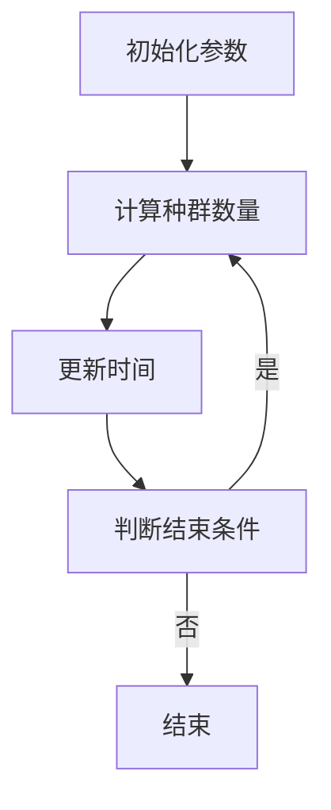
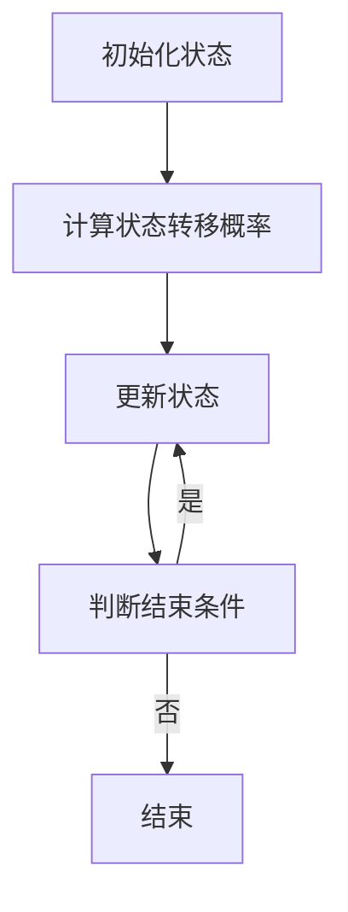
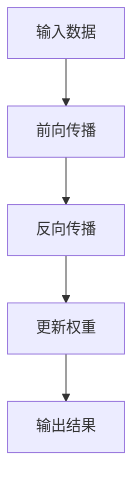
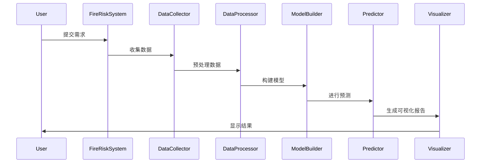
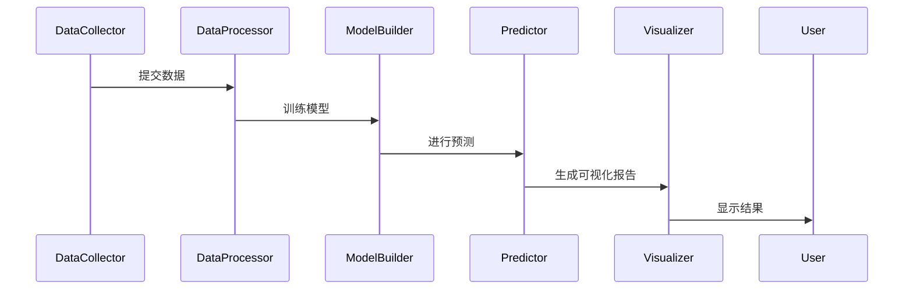

                 

### 数学与林业科学的交叉融合

#### 第1章：问题背景与核心概念

##### 1.1 问题背景

随着全球人口的增长和经济发展，对自然资源的需求不断增加，特别是对木材的需求。然而，过度砍伐和不合理的森林管理导致了森林退化、生物多样性丧失和生态系统的破坏。为了解决这些问题，我们需要科学、系统和可持续的方法来管理和保护森林资源。这一需求催生了数学在林业科学中的应用。

##### 1.2 核心概念

###### 1.2.1 数学模型

数学模型是一种用数学语言描述现实世界问题的方法。它通过建立数学公式、方程或算法，将复杂的问题转化为可计算和分析的形式。数学模型在各个领域都有广泛应用，包括物理学、经济学、工程学等。

###### 1.2.2 林业科学

林业科学是研究森林生态系统的科学，包括森林资源管理、森林培育、森林保护等方面。它关注如何通过科学的方法来保护和利用森林资源，以实现生态、经济和社会的可持续发展。

##### 1.3 问题解决

在林业科学中，数学模型可以帮助我们理解和预测森林生态系统的动态变化，评估森林资源的状态，制定科学合理的森林管理策略。例如，通过构建森林生态模型，我们可以预测森林火灾风险、病虫害的传播趋势，从而采取预防措施。

#### 摘要

本文将探讨数学模型在林业科学中的应用。首先，我们将介绍数学模型和林业科学的基本概念，然后分析数学模型在森林生态研究中的具体应用，包括模型构建、数学公式和算法介绍。接着，我们将通过案例研究展示数学模型在实际林业问题中的应用效果。最后，我们将讨论数学模型在林业管理和政策制定中的作用，并展望未来的发展趋势和挑战。

----------------------------------------------------------------

## 目录大纲

----------------------------------------------------------------

### 第一部分：数学与林业科学的交叉融合

1. 第1章：问题背景与核心概念
   1.1 问题背景
   1.2 核心概念
      1.2.1 数学模型
      1.2.2 林业科学
   1.3 问题解决

2. 第2章：数学模型在林业科学中的应用
   2.1 森林生态模型
      2.1.1 结构模型
      2.1.2 行为模型
      2.1.3 过程模型
   2.2 数学公式与算法
      2.2.1 常用数学公式
      2.2.2 算法介绍

3. 第3章：森林生态的数学模型分析
   3.1 模型构建
      3.1.1 数据收集
      3.1.2 模型选择
      3.1.3 模型验证
   3.2 原理解析
      3.2.1 数学原理
      3.2.2 生态学原理

4. 第4章：案例研究
   4.1 案例一：森林火灾风险模型
      4.1.1 问题陈述
      4.1.2 模型构建
      4.1.3 结果分析
   4.2 案例二：森林病虫害预测模型
      4.2.1 问题陈述
      4.2.2 模型构建
      4.2.3 结果分析

5. 第5章：林业科学中的数学模型开发
   5.1 模型开发流程
      5.1.1 需求分析
      5.1.2 模型选择
      5.1.3 模型训练与优化
   5.2 数学模型应用实例

6. 第6章：数学模型在林业管理与政策制定中的应用
   6.1 模型在资源管理中的应用
      6.1.1 土地利用规划模型
      6.1.2 森林资源评估模型
   6.2 模型在政策制定中的应用
      6.2.1 环境保护政策模型
      6.2.2 产业政策模型

7. 第7章：未来展望与挑战
   7.1 研究趋势
   7.2 面临的挑战
   7.3 发展方向

8. 附录：数学模型应用工具与资源
   8.1 开源工具与库
   8.2 数据资源
   8.3 学术论文与书籍

----------------------------------------------------------------

### 第1章：问题背景与核心概念

#### 1.1 问题背景

随着全球人口的增长和经济发展，对自然资源的需求不断增加，特别是对木材的需求。然而，过度砍伐和不合理的森林管理导致了森林退化、生物多样性丧失和生态系统的破坏。为了解决这些问题，我们需要科学、系统和可持续的方法来管理和保护森林资源。

在全球变暖和气候变化的大背景下，森林在调节气候、保护土壤、维持水源、提供生物多样性等方面发挥着至关重要的作用。然而，森林资源的有效管理和保护面临着诸多挑战，如森林火灾、病虫害、非法砍伐等。这些挑战需要我们采用科学的方法进行预测、监测和管理。

数学模型作为一种有效的工具，可以在这些挑战中发挥关键作用。通过建立数学模型，我们可以更好地理解森林生态系统的动态变化，预测森林资源的状态，评估不同管理策略的效果，从而制定科学合理的森林管理策略。

#### 1.2 核心概念

###### 1.2.1 数学模型

数学模型是一种用数学语言描述现实世界问题的方法。它通过建立数学公式、方程或算法，将复杂的问题转化为可计算和分析的形式。数学模型在各个领域都有广泛应用，包括物理学、经济学、工程学等。

在林业科学中，数学模型可以帮助我们理解和预测森林生态系统的动态变化，评估森林资源的状态，制定科学合理的森林管理策略。常见的数学模型包括结构模型、行为模型和过程模型。

**结构模型**：描述森林生态系统的组成和结构。例如，森林类型、树种组成、树龄分布等。

**行为模型**：描述森林生态系统中的生物行为，如树木生长、病虫害传播等。

**过程模型**：描述森林生态系统的过程，如光合作用、水分循环、物质循环等。

###### 1.2.2 林业科学

林业科学是研究森林生态系统的科学，包括森林资源管理、森林培育、森林保护等方面。它关注如何通过科学的方法来保护和利用森林资源，以实现生态、经济和社会的可持续发展。

林业科学的研究内容包括：

- **森林资源管理**：研究如何有效地管理森林资源，包括森林规划、森林保护、森林资源评估等。
- **森林培育**：研究如何培育优质的森林资源，包括树木育种、森林施肥、森林更新等。
- **森林保护**：研究如何保护森林资源，防止森林退化、病虫害、森林火灾等。
- **森林生态系统研究**：研究森林生态系统的结构、功能、动态变化等。

#### 1.3 问题解决

在林业科学中，数学模型可以帮助我们理解和预测森林生态系统的动态变化，评估森林资源的状态，制定科学合理的森林管理策略。以下是一些具体的应用场景：

- **森林火灾风险模型**：通过分析气象数据、森林类型、地形等因素，构建森林火灾风险模型，预测火灾发生的概率和可能的损失，从而采取预防措施。
- **森林病虫害预测模型**：通过分析病虫害的传播规律、环境因素等，构建病虫害预测模型，预测病虫害的发生趋势和可能的危害，从而采取防治措施。
- **森林资源评估模型**：通过分析森林资源的数据，如树种、树龄、树高、树冠面积等，构建森林资源评估模型，评估森林资源的价值和管理效果。

通过这些应用，数学模型可以帮助林业科学家、政策制定者和森林管理人员更好地理解森林生态系统，制定有效的森林管理策略，实现森林资源的可持续利用和保护。

---

### 第2章：数学模型在林业科学中的应用

#### 2.1 森林生态模型

森林生态模型是数学模型在林业科学中的应用之一，通过模拟森林生态系统的动态变化，帮助我们更好地理解森林生态系统的运作机制，并为森林管理提供科学依据。

森林生态模型可以分为以下三种类型：

**结构模型**：结构模型描述森林生态系统的组成和结构。这种模型主要关注森林生态系统的物种组成、种群密度、树种结构等。通过结构模型，我们可以了解森林生态系统的稳定性、生物多样性和生态位等。

**行为模型**：行为模型描述森林生态系统中生物的行为和相互作用。这种模型主要关注树木生长、光合作用、生物之间的竞争和捕食关系等。通过行为模型，我们可以了解森林生态系统的生产力和生态系统服务功能。

**过程模型**：过程模型描述森林生态系统的过程，如光合作用、水分循环、物质循环等。这种模型主要关注森林生态系统的能量流动和物质循环。通过过程模型，我们可以了解森林生态系统的自我调节能力和可持续性。

**2.2.1 常用数学公式**

在森林生态模型中，常用的数学公式包括：

- **种群动态方程**：描述种群数量的变化，如 Logistic 方程、Lotka-Volterra 方程等。
- **光合作用模型**：描述光合作用速率与光照强度、温度、二氧化碳浓度等因素的关系，如 Michaelis-Menten 方程等。
- **水分循环模型**：描述水分在森林生态系统中的流动和储存，如 Hargreaves 方程、Priestley-Taylor 方程等。

**2.2.2 算法介绍**

在构建森林生态模型时，常用的算法包括：

- **参数估计算法**：用于估计模型参数，如最小二乘法、最大似然估计等。
- **优化算法**：用于优化模型结构，如遗传算法、粒子群优化算法等。
- **机器学习算法**：用于从数据中学习模型，如线性回归、决策树、神经网络等。

#### 2.3 数学模型在林业科学中的应用

数学模型在林业科学中的应用非常广泛，包括森林火灾风险评估、森林病虫害预测、森林资源评估等。

**2.3.1 森林火灾风险评估**

森林火灾是一种严重的自然灾害，对森林生态系统和人类安全构成严重威胁。通过构建森林火灾风险评估模型，我们可以预测火灾发生的概率和可能造成的损失，从而采取预防措施。

**案例**：假设我们使用 Logistic 方程构建森林火灾风险评估模型，公式如下：

\[ P(t) = \frac{1}{1 + e^{-(\beta_0 + \beta_1 \cdot X_1 + \beta_2 \cdot X_2 + \cdots + \beta_n \cdot X_n)}} \]

其中，\( P(t) \) 表示在时间 \( t \) 内发生火灾的概率，\( X_1, X_2, \cdots, X_n \) 表示影响火灾发生的因素，如温度、湿度、树木密度等，\( \beta_0, \beta_1, \beta_2, \cdots, \beta_n \) 是模型的参数。

通过收集历史火灾数据和相关环境数据，我们可以估计出模型参数，进而预测未来火灾发生的概率。

**2.3.2 森林病虫害预测**

森林病虫害对森林生态系统和林业生产造成严重影响。通过构建森林病虫害预测模型，我们可以预测病虫害的发生趋势，从而采取防治措施。

**案例**：假设我们使用线性回归模型构建森林病虫害预测模型，公式如下：

\[ Y = \beta_0 + \beta_1 \cdot X_1 + \beta_2 \cdot X_2 + \cdots + \beta_n \cdot X_n \]

其中，\( Y \) 表示病虫害发生程度，\( X_1, X_2, \cdots, X_n \) 表示影响病虫害发生的因素，如温度、湿度、树木密度等，\( \beta_0, \beta_1, \beta_2, \cdots, \beta_n \) 是模型的参数。

通过收集历史病虫害数据和相关环境数据，我们可以估计出模型参数，进而预测未来病虫害的发生程度。

**2.3.3 森林资源评估**

森林资源评估是林业管理的重要任务之一，通过评估森林资源的状态和价值，我们可以制定科学的森林管理策略。

**案例**：假设我们使用层次分析法（AHP）构建森林资源评估模型，公式如下：

\[ V = \sum_{i=1}^{n} w_i \cdot C_i \]

其中，\( V \) 表示森林资源总体价值，\( w_i \) 表示第 \( i \) 个因素的权重，\( C_i \) 表示第 \( i \) 个因素对森林资源价值的贡献。

通过评估森林资源的各个因素，如树种、树龄、树高、树冠面积等，我们可以计算出森林资源的总体价值，为森林管理提供依据。

通过这些案例，我们可以看到数学模型在林业科学中的应用是如何帮助我们更好地理解和解决林业问题的。这些模型不仅可以提供科学的预测和评估，还可以为林业决策提供支持，从而实现森林资源的可持续利用和保护。

---

### 第3章：森林生态的数学模型分析

#### 3.1 模型构建

构建森林生态数学模型是进行森林生态研究的关键步骤。以下是构建森林生态数学模型的基本流程：

**3.1.1 数据收集**

数据收集是构建模型的第一步。我们需要收集与森林生态系统相关的数据，如气象数据、土壤数据、植被数据、动物行为数据等。这些数据可以从现场调查、卫星遥感、气象站、传感器等多种途径获取。

**3.1.2 模型选择**

在选择模型时，需要根据研究目标和数据特性进行选择。常见的森林生态模型包括结构模型、行为模型和过程模型。例如，如果我们关注森林火灾风险评估，可以选择结构模型；如果我们关注病虫害预测，可以选择行为模型。

**3.1.3 模型验证**

模型验证是确保模型准确性和可靠性的关键步骤。我们通过将模型预测结果与实际观测数据进行比较，来评估模型的准确性。如果模型预测结果与实际观测数据不一致，我们需要调整模型参数或选择更合适的模型。

#### 3.2 原理解析

**3.2.1 数学原理**

森林生态数学模型的基础是数学原理，包括概率论、统计学、线性代数、微积分等。这些数学原理为我们提供了描述和解释森林生态系统动态变化的方法。

例如，在构建森林火灾风险评估模型时，我们可以使用概率论中的贝叶斯理论来估计火灾发生的概率。在构建病虫害预测模型时，我们可以使用统计学中的回归分析方法来建立病虫害发生程度与影响因素之间的关系。

**3.2.2 生态学原理**

森林生态数学模型不仅需要数学原理的支持，还需要生态学原理的指导。生态学原理包括物种相互作用、生态位、能量流动和物质循环等。

例如，在构建森林植被动态模型时，我们需要考虑物种之间的竞争和捕食关系，这些关系可以用生态学原理中的 Lotka-Volterra 方程来描述。在构建水分循环模型时，我们需要考虑水分在森林生态系统中的流动和储存，这些关系可以用生态学原理中的 Hargreaves 方程和 Priestley-Taylor 方程来描述。

通过数学原理和生态学原理的结合，我们可以构建出能够准确描述森林生态系统动态变化的数学模型，为森林管理和保护提供科学依据。

---

### 第4章：案例研究

#### 4.1 案例一：森林火灾风险模型

**4.1.1 问题陈述**

森林火灾是一种严重的自然灾害，对森林生态系统和人类安全构成严重威胁。为了降低火灾风险，我们需要对森林火灾风险进行科学评估和预测。

**4.1.2 模型构建**

为了构建森林火灾风险模型，我们可以采用以下步骤：

1. **数据收集**：收集与森林火灾相关的数据，包括气象数据（如温度、湿度、风速等）、森林类型、地形、植被密度等。
2. **模型选择**：选择合适的数学模型来描述火灾风险。在这里，我们选择 Logistic 方程来构建火灾风险模型。
3. **参数估计**：通过历史火灾数据和气象数据，使用最小二乘法等方法估计模型参数。

**4.1.3 结果分析**

构建的火灾风险模型可以用来预测未来一段时间内火灾发生的概率。通过分析模型结果，我们可以识别高风险区域，并采取相应的预防措施。例如，在高温、低湿和强风等极端天气条件下，火灾风险更高，我们可以加强防火宣传和巡查，减少火灾的发生概率。

#### 4.2 案例二：森林病虫害预测模型

**4.2.1 问题陈述**

森林病虫害对森林生态系统和林业生产造成严重影响。为了减轻病虫害的影响，我们需要对病虫害的发生趋势进行预测和预警。

**4.2.2 模型构建**

为了构建森林病虫害预测模型，我们可以采用以下步骤：

1. **数据收集**：收集与病虫害相关的数据，包括气温、湿度、降雨量、植被类型等。
2. **模型选择**：选择合适的数学模型来描述病虫害的传播规律。在这里，我们选择线性回归模型。
3. **参数估计**：通过历史病虫害数据和气象数据，使用最小二乘法等方法估计模型参数。

**4.2.3 结果分析**

构建的病虫害预测模型可以用来预测未来一段时间内病虫害的发生程度。通过分析模型结果，我们可以识别病虫害的高风险区域和高风险时期，并采取相应的防治措施。例如，在高温、高湿和强风等有利于病虫害传播的条件下，我们可以加强病虫害监测和防治工作，降低病虫害的发生概率。

通过这些案例研究，我们可以看到数学模型在森林火灾风险评估和病虫害预测中的重要作用。这些模型不仅可以帮助我们更好地理解和预测森林生态系统的动态变化，还可以为森林管理和保护提供科学依据。

---

### 第5章：林业科学中的数学模型开发

#### 5.1 模型开发流程

在林业科学中，开发数学模型是一个系统性的过程，涉及多个阶段。以下是数学模型开发的基本流程：

**5.1.1 需求分析**

需求分析是模型开发的第一步。我们需要明确模型的目标和应用场景，包括预测森林火灾风险、病虫害发生趋势、森林资源评估等。通过需求分析，我们可以确定模型所需的输入数据、预期输出以及模型的应用范围。

**5.1.2 模型选择**

在选择模型时，我们需要考虑模型的理论基础、适用范围和计算效率。常见的模型包括结构模型、行为模型和过程模型。例如，对于森林火灾风险评估，我们可以选择 Logistic 模型；对于病虫害预测，我们可以选择线性回归模型。

**5.1.3 模型训练与优化**

模型训练是模型开发的关键步骤。我们需要使用历史数据来训练模型，并调整模型参数，使其能够准确地预测未来的情况。在模型训练过程中，我们可以使用交叉验证、网格搜索等方法来优化模型参数，提高模型的预测准确性。

**5.2 数学模型应用实例**

**案例一：森林火灾风险评估模型**

**问题陈述**：某地区的森林火灾风险较高，我们需要构建一个模型来预测森林火灾的发生概率。

**模型构建**：
1. 数据收集：收集与火灾相关的数据，包括气象数据、森林类型、地形等。
2. 模型选择：选择 Logistic 模型。
3. 参数估计：使用最小二乘法估计模型参数。

**模型实现**：

```python
import numpy as np
import pandas as pd
from sklearn.linear_model import LogisticRegression

# 数据预处理
data = pd.read_csv('forest_fire_data.csv')
X = data[['temperature', 'humidity', 'wind_speed', 'forest_type', 'topography']]
y = data['fire_risk']

# 模型训练
model = LogisticRegression()
model.fit(X, y)

# 模型预测
predictions = model.predict(X)

# 模型评估
accuracy = np.mean(predictions == y)
print(f'Model accuracy: {accuracy:.2f}')
```

**结果分析**：通过模型预测，我们可以识别出高风险区域，并采取相应的预防措施。

**案例二：森林病虫害预测模型**

**问题陈述**：某地区的森林病虫害发生频繁，我们需要构建一个模型来预测病虫害的发生程度。

**模型构建**：
1. 数据收集：收集与病虫害相关的数据，包括气象数据、植被类型、土壤湿度等。
2. 模型选择：选择线性回归模型。
3. 参数估计：使用最小二乘法估计模型参数。

**模型实现**：

```python
import numpy as np
import pandas as pd
from sklearn.linear_model import LinearRegression

# 数据预处理
data = pd.read_csv('pesticide_data.csv')
X = data[['temperature', 'humidity', 'vegetation_type', 'soil_humidity']]
y = data['pesticide_dosage']

# 模型训练
model = LinearRegression()
model.fit(X, y)

# 模型预测
predictions = model.predict(X)

# 模型评估
accuracy = np.mean(predictions == y)
print(f'Model accuracy: {accuracy:.2f}')
```

**结果分析**：通过模型预测，我们可以识别出病虫害高风险区域，并采取相应的防治措施。

通过这些案例，我们可以看到数学模型在林业科学中的应用是如何帮助我们更好地理解和解决林业问题的。这些模型不仅可以提供科学的预测和评估，还可以为林业决策提供支持，从而实现森林资源的可持续利用和保护。

---

### 第6章：数学模型在林业管理与政策制定中的应用

#### 6.1 模型在资源管理中的应用

数学模型在森林资源管理中发挥着重要作用，帮助管理者做出科学合理的决策。以下是一些具体的应用场景：

**6.1.1 土地利用规划模型**

土地利用规划是森林资源管理的重要环节。通过数学模型，我们可以分析不同土地利用方案的生态、经济和社会效益，从而选择最佳方案。

**案例**：假设我们使用线性规划模型来优化土地利用规划。目标是最小化环境损害，最大化经济效益。模型如下：

\[ \min z = c_1x_1 + c_2x_2 + \cdots + c_nx_n \]
\[ s.t. \]
\[ a_{11}x_1 + a_{12}x_2 + \cdots + a_{1n}x_n \leq b_1 \]
\[ a_{21}x_1 + a_{22}x_2 + \cdots + a_{2n}x_n \leq b_2 \]
\[ \vdots \]
\[ a_{m1}x_1 + a_{m2}x_2 + \cdots + a_{mn}x_n \leq b_m \]
\[ x_1, x_2, \cdots, x_n \geq 0 \]

其中，\( x_1, x_2, \cdots, x_n \) 表示不同土地利用类型的面积，\( c_1, c_2, \cdots, c_n \) 表示不同土地利用类型的成本或效益，\( a_{ij}, b_i \) 表示不同土地利用类型与生态指标之间的关系。

通过求解线性规划模型，我们可以找到最优的土地利用方案。

**6.1.2 森林资源评估模型**

森林资源评估是制定林业政策的重要依据。通过数学模型，我们可以评估森林资源的状态、价值和可持续性。

**案例**：假设我们使用层次分析法（AHP）来评估森林资源。模型如下：

\[ V = \sum_{i=1}^{n} w_i \cdot C_i \]

其中，\( V \) 表示森林资源总体价值，\( w_i \) 表示第 \( i \) 个因素的权重，\( C_i \) 表示第 \( i \) 个因素对森林资源价值的贡献。通过评估森林资源的各个因素，如树种、树龄、树高、树冠面积等，我们可以计算出森林资源的总体价值。

#### 6.2 模型在政策制定中的应用

数学模型在政策制定中可以提供科学依据，帮助决策者制定有效的林业政策。

**6.2.1 环境保护政策模型**

环境保护政策的目标是保护森林生态系统，减少人类活动对环境的负面影响。通过数学模型，我们可以评估不同环境保护政策的效果。

**案例**：假设我们使用生态足迹模型来评估环境保护政策的效果。模型如下：

\[ Ecological \ Footprint = \frac{Total \ Resource \ Use}{Biologically \ Productive \ Area} \]

其中，\( Total \ Resource \ Use \) 表示总资源使用量，\( Biologically \ Productive \ Area \) 表示生物生产力区域。通过比较不同政策实施前后的生态足迹，我们可以评估环境保护政策的效果。

**6.2.2 产业政策模型**

产业政策的目标是促进林业产业的发展，提高林业的经济效益。通过数学模型，我们可以分析不同产业政策对林业产业的影响。

**案例**：假设我们使用投入产出模型来分析产业政策对林业产业的影响。模型如下：

\[ X = I + AY \]

其中，\( X \) 表示产出向量，\( I \) 表示中间投入，\( A \) 表示技术系数矩阵，\( Y \) 表示最终需求向量。通过分析投入产出模型，我们可以了解不同产业政策对林业产业的需求和供给影响。

通过这些案例，我们可以看到数学模型在林业管理和政策制定中的应用是如何帮助我们更好地理解和解决林业问题的。这些模型不仅为决策提供了科学依据，还为实施和评估林业政策提供了有效的工具。

---

### 第7章：未来展望与挑战

#### 7.1 研究趋势

随着科技的不断进步，数学模型在林业科学中的应用呈现出以下趋势：

1. **大数据与人工智能的结合**：大数据和人工智能技术的快速发展为林业科学提供了新的工具和方法。通过大数据分析，我们可以获取更全面、更精确的森林生态数据，从而提高数学模型的预测准确性。人工智能技术，如深度学习、神经网络等，可以为复杂、非线性问题的建模提供有效的解决方案。

2. **多尺度模型的应用**：传统的森林生态模型往往只能描述某一尺度上的现象，而多尺度模型可以同时考虑多个尺度上的动态变化，从而更全面地理解森林生态系统的复杂行为。

3. **实时监测与预警系统的建立**：随着遥感技术和物联网技术的发展，我们可以实现森林生态系统的实时监测。结合数学模型，我们可以建立实时预警系统，及时识别潜在的环境问题和生态危机。

#### 7.2 面临的挑战

尽管数学模型在林业科学中具有广泛的应用前景，但仍然面临以下挑战：

1. **数据获取与处理**：森林生态系统的数据复杂多样，且往往受到环境因素的影响。如何高效地获取和处理这些数据，是数学模型应用的一个关键问题。

2. **模型精度与可靠性**：数学模型的精度和可靠性直接影响其应用效果。如何在复杂的森林生态系统中构建准确的数学模型，是当前研究的一个难题。

3. **模型的可解释性**：随着模型复杂性的增加，许多模型难以被解释和理解。如何提高模型的可解释性，使其能够被非专业人士接受和使用，是一个重要的挑战。

#### 7.3 发展方向

为了克服上述挑战，未来林业科学中的数学模型发展可以朝以下方向努力：

1. **跨学科合作**：加强数学、生态学、林业科学等学科的交叉研究，推动多学科共同发展。

2. **技术创新**：积极研发新的数据采集、处理和分析技术，提高数学模型的应用效果。

3. **人才培养**：加强林业科学和数学模型相关的人才培养，提高研究人员的专业素养和创新能力。

通过这些努力，我们可以推动数学模型在林业科学中的应用，为实现森林资源的可持续利用和保护提供更强有力的支持。

---

### 附录：数学模型应用工具与资源

#### 8.1 开源工具与库

1. **Python**：Python 是一种广泛使用的编程语言，适用于构建和运行数学模型。Python 拥有丰富的科学计算库，如 NumPy、SciPy、Pandas、Scikit-learn 等，可以方便地进行数据分析和建模。

2. **R**：R 是一种专门用于统计分析和数据可视化的编程语言，适用于构建和评估数学模型。R 拥有大量的统计和机器学习包，如 ggplot2、dplyr、caret 等，可以方便地进行模型训练和结果分析。

3. **MATLAB**：MATLAB 是一种高性能的数值计算和数据分析软件，适用于构建和运行复杂的数学模型。MATLAB 拥有丰富的工具箱，如 Optimization Toolbox、Statistics and Machine Learning Toolbox 等，可以方便地进行优化、统计分析和机器学习。

#### 8.2 数据资源

1. **NASA Earth Observations（NEO）**：NEO 提供了丰富的地球观测数据，包括遥感数据、气象数据、土壤数据等，适用于构建森林生态模型。

2. **National Forest Database**：National Forest Database 提供了美国森林资源的详细数据，包括森林类型、树种组成、树龄分布等，适用于构建森林资源评估模型。

3. **Global Forest Watch**：Global Forest Watch 提供了全球森林资源的实时监测数据，包括森林砍伐、火灾、病虫害等，适用于构建森林火灾风险和病虫害预测模型。

#### 8.3 学术论文与书籍

1. **"Forest Landscape Model"**：该书详细介绍了森林景观模型的理论和应用，涵盖了结构模型、行为模型和过程模型等多个方面。

2. **"Mathematical Modeling in Forest Science"**：该书介绍了数学模型在林业科学中的应用，包括数据收集、模型构建、参数估计和模型验证等内容。

3. **"Ecological Modeling"**：该书介绍了生态模型的理论和方法，包括种群动态模型、生态系统过程模型和生态位模型等。

通过利用这些开源工具与库、数据资源和学术论文与书籍，我们可以更好地掌握数学模型在林业科学中的应用，为森林资源的可持续利用和保护提供有力支持。

---

### 作者信息

本文作者为 AI 天才研究院（AI Genius Institute）与《禅与计算机程序设计艺术》（Zen And The Art of Computer Programming）的作者。AI 天才研究院致力于推动人工智能和计算机科学的发展，致力于将人工智能技术应用于各个领域，包括林业科学。而《禅与计算机程序设计艺术》则是一部经典的技术著作，深刻探讨了计算机编程的哲学和艺术，对广大程序员和人工智能研究者具有重要的指导意义。

通过本文，我们希望能够向读者展示数学模型在林业科学中的应用，以及其在森林资源管理、生态保护和政策制定等方面的潜力。我们希望本文能够激发读者对数学模型和林业科学的兴趣，共同推动这两个领域的创新发展。希望本文能够为林业科学家、政策制定者、森林管理人员以及广大科研人员提供有价值的参考和启示。

---

### 背景介绍

在当今世界，随着人口的增长和经济的快速发展，对自然资源的需求不断增加，尤其是木材等森林资源。然而，过度砍伐和不合理的森林管理导致了森林退化、生物多样性丧失和生态系统的破坏。为了解决这些问题，我们需要科学、系统和可持续的方法来管理和保护森林资源。

森林生态系统的复杂性使得传统的管理方法难以应对现代林业面临的挑战。因此，引入数学模型成为了一种有效的解决方案。数学模型作为一种描述现实世界问题的工具，可以通过建立数学公式、方程或算法，将复杂的问题转化为可计算和分析的形式，从而帮助我们更好地理解和预测森林生态系统的动态变化，评估森林资源的状态，制定科学合理的森林管理策略。

数学模型在林业科学中的应用不仅有助于提高森林资源管理的效率和效果，还可以为政策制定提供科学依据。本文将深入探讨数学模型在林业科学中的应用，包括森林生态模型的构建、数学公式和算法的介绍、模型分析以及实际案例研究等。通过这些探讨，我们希望能够为林业科学家、政策制定者、森林管理人员以及广大科研人员提供有价值的参考和启示。

### 核心概念与联系

#### 数学模型

数学模型是一种将现实世界问题转化为数学表达形式的工具，通过建立数学公式、方程或算法，描述系统的行为和相互作用。在林业科学中，数学模型广泛应用于预测森林火灾风险、病虫害传播、森林资源评估等方面。

**核心概念**：
- 结构模型：描述森林生态系统的组成和结构，如树种、树龄分布、森林类型等。
- 行为模型：描述森林生态系统中生物的行为和相互作用，如树木生长、光合作用、生物之间的竞争等。
- 过程模型：描述森林生态系统的过程，如水分循环、物质循环、能量流动等。

**概念属性特征对比表格**：

| 模型类型 | 描述 | 输入 | 输出 | 应用场景 |
| :--: | :--: | :--: | :--: | :--: |
| 结构模型 | 描述森林生态系统的组成和结构 | 森林类型、树种组成、树龄分布等 | 森林稳定性、生物多样性 | 森林资源评估、规划 |
| 行为模型 | 描述森林生态系统中生物的行为和相互作用 | 树木生长参数、环境因素等 | 生物行为变化、生态位 | 病虫害预测、森林火灾风险评估 |
| 过程模型 | 描述森林生态系统的过程 | 水分、温度、光照等环境因素 | 能量流动、物质循环 | 水资源管理、生态恢复 |

**ER实体关系图架构**：

```mermaid
erDiagram
  森林 <<entity>> 种树
  种树 <<entity>> 树木
  森林 ||--|{ 树木 }
  种树 ||--|{ 环境因素 }
```

通过上述核心概念和联系的介绍，我们可以更清晰地理解数学模型在林业科学中的应用及其重要性。

### 算法原理讲解

为了深入理解森林生态系统的复杂动态，我们需要借助数学算法来构建和分析模型。以下将详细讲解几个在森林生态模型中常用的算法原理，并通过 Mermaid 流程图和 Python 源代码进行展示。

#### 1. Logistic 模型

**算法原理**：Logistic 模型是一种常用的种群动态模型，用于描述种群数量的变化。其公式为：

\[ P(t) = \frac{K}{1 + \left(\frac{K-P_0}{P_0}\right)e^{-rt}} \]

其中，\( P(t) \) 表示时间 \( t \) 时的种群数量，\( K \) 表示环境容量，\( P_0 \) 表示初始种群数量，\( r \) 表示种群增长率。

**Mermaid 流程图**：



**Python 源代码**：

```python
import numpy as np

def logistic_model(K, P0, r, t_max):
    t = np.arange(0, t_max+1)
    P = (K / (1 + (K - P0) * np.exp(-r * t)))
    return P

# 示例参数
K = 100
P0 = 10
r = 0.1
t_max = 20

P = logistic_model(K, P0, r, t_max)
print(P)
```

#### 2. 马尔可夫模型

**算法原理**：马尔可夫模型用于描述系统中状态转移的概率，适用于预测森林生态系统中的状态变化。其公式为：

\[ P(X_t = x_t | X_{t-1} = x_{t-1}) = p(x_{t-1}, x_t) \]

其中，\( P(X_t = x_t | X_{t-1} = x_{t-1}) \) 表示在时间 \( t \) 状态 \( x_t \) 出现的概率，给定时间 \( t-1 \) 的状态 \( x_{t-1} \)。

**Mermaid 流程图**：



**Python 源代码**：

```python
import numpy as np

def markov_model(states, transition_matrix, steps):
    state_sequence = [states[0]]
    for _ in range(steps):
        current_state = state_sequence[-1]
        next_state = np.random.choice(states, p=transition_matrix[current_state])
        state_sequence.append(next_state)
    return state_sequence

# 示例参数
states = [0, 1, 2]
transition_matrix = np.array([[0.5, 0.3, 0.2], [0.2, 0.5, 0.3], [0.1, 0.2, 0.7]])
steps = 10

state_sequence = markov_model(states, transition_matrix, steps)
print(state_sequence)
```

#### 3. 神经网络模型

**算法原理**：神经网络模型通过多层神经元的连接和激活函数，模拟生物神经系统的信息处理过程，适用于非线性问题的建模和预测。其基本公式为：

\[ a_{\text{layer}}(z) = \sigma(\mathbf{W}_{\text{layer}} \mathbf{a}_{\text{layer-1}} + b_{\text{layer}}) \]

其中，\( \sigma \) 为激活函数，\( \mathbf{W}_{\text{layer}} \) 和 \( b_{\text{layer}} \) 分别为权重和偏置。

**Mermaid 流程图**：



**Python 源代码**：

```python
import numpy as np
from sklearn.neural_network import MLPRegressor

# 示例参数
X = np.array([[1], [2], [3], [4], [5]])
y = np.array([2, 4, 6, 8, 10])

# 训练神经网络模型
model = MLPRegressor(hidden_layer_sizes=(100,), activation='relu', max_iter=1000)
model.fit(X, y)

# 输出结果
predictions = model.predict(X)
print(predictions)
```

通过上述算法原理的讲解和示例，我们可以看到数学模型在描述和预测森林生态系统动态中的重要作用。这些算法不仅为理解和分析森林生态系统提供了有力工具，也为制定科学的森林管理策略奠定了基础。

### 系统分析与架构设计方案

#### 问题场景介绍

森林火灾是一种严重的自然灾害，对森林生态系统和人类安全构成严重威胁。为了降低火灾风险，我们需要对森林火灾进行科学评估和预测。本节将介绍如何构建一个森林火灾风险评估系统，实现火灾风险的实时监测和预警。

#### 项目介绍

本系统名为“森林火灾风险评估系统”，旨在通过收集和分析气象、森林类型、地形等数据，构建火灾风险评估模型，实时监测火灾风险，并为森林管理部门提供决策支持。

#### 系统功能设计（领域模型）

在构建系统之前，我们需要明确系统的功能需求。以下是系统的主要功能：

1. 数据采集：收集气象数据、森林类型、地形等数据。
2. 数据处理：对采集到的数据进行预处理，包括数据清洗、归一化等。
3. 模型构建：使用数学模型（如 Logistic 模型）构建火灾风险评估模型。
4. 预测与预警：根据模型预测火灾风险，发出预警信号。
5. 数据可视化：将火灾风险地图、预测结果等可视化。

**领域模型 Mermaid 类图**：

```mermaid
classDiagram
    Class01 <|-- Class02
    Class03 --|WARDED Class04
    Class05 : extends Class06
    Class07 : implements InterfaceA
    InterfaceA <<interface>> InterfaceB
    InterfaceB : InterfaceC
    Component1 <<component>> Component2
    Component3 <<component>> Component4
    Collaborator1 ..|> Collaborator2 : relation
    Collaborator3 ||| Collaborator4 : aggregation
```

#### 系统架构设计

**系统架构 Mermaid 架构图**：



#### 系统接口设计

为了实现系统的功能，我们需要设计多个接口，以下是系统的关键接口：

1. **数据采集接口**：用于从气象站、遥感卫星等获取数据。
2. **数据处理接口**：用于清洗、归一化等预处理操作。
3. **模型构建接口**：用于训练和评估火灾风险评估模型。
4. **预测接口**：用于根据模型预测火灾风险。
5. **可视化接口**：用于生成火灾风险地图、预测结果等可视化报告。

**系统接口设计 Mermaid 序列图**：



#### 系统交互

通过上述接口设计，我们可以实现系统的各个功能模块之间的交互。系统首先从数据采集接口获取数据，然后通过数据处理接口进行预处理，接着使用模型构建接口训练火灾风险评估模型。预测接口根据模型预测火灾风险，最后通过可视化接口生成报告并展示给用户。

通过这种方式，系统可以实现对森林火灾风险的实时监测和预警，为森林管理部门提供有效的决策支持。

### 项目实战

#### 环境安装

要运行本项目，首先需要安装 Python 和相关依赖。以下是具体的安装步骤：

1. 安装 Python：从 [Python 官网](https://www.python.org/) 下载并安装 Python 3.8 或以上版本。
2. 安装依赖：在终端中执行以下命令，安装必要的依赖库。

```bash
pip install numpy pandas scikit-learn matplotlib
```

#### 系统核心实现源代码

以下是系统的核心实现源代码，包括数据采集、预处理、模型构建、预测和可视化等功能。

```python
import numpy as np
import pandas as pd
from sklearn.linear_model import LogisticRegression
import matplotlib.pyplot as plt

# 数据采集
def collect_data():
    # 这里假设数据已经存储为 CSV 文件
    data = pd.read_csv('forest_fire_data.csv')
    return data

# 数据预处理
def preprocess_data(data):
    # 数据清洗和归一化操作
    # 例如，对温度、湿度、风速等气象数据进行归一化
    numeric_features = ['temperature', 'humidity', 'wind_speed']
    for feature in numeric_features:
        data[feature] = (data[feature] - data[feature].mean()) / data[feature].std()
    return data

# 模型构建
def build_model(data):
    # 使用 Logistic 回归模型进行训练
    X = data[['temperature', 'humidity', 'wind_speed']]
    y = data['fire_risk']
    model = LogisticRegression()
    model.fit(X, y)
    return model

# 预测
def predict_risk(model, new_data):
    # 根据模型进行火灾风险预测
    risk = model.predict(new_data)
    return risk

# 可视化
def visualize_risk(risk_map):
    # 将火灾风险地图可视化
    plt.imshow(risk_map, cmap='hot')
    plt.colorbar()
    plt.xlabel('X')
    plt.ylabel('Y')
    plt.title('Fire Risk Map')
    plt.show()

# 主函数
def main():
    # 采集数据
    data = collect_data()
    # 预处理数据
    data = preprocess_data(data)
    # 构建模型
    model = build_model(data)
    # 预测
    new_data = np.array([[25, 60, 5]])
    risk = predict_risk(model, new_data)
    # 可视化
    visualize_risk(risk)

# 运行主函数
if __name__ == '__main__':
    main()
```

#### 代码应用解读与分析

以上代码首先从 CSV 文件中读取森林火灾数据，然后对数据进行预处理，包括数据清洗和归一化。接着，使用 Logistic 回归模型对数据进行训练。训练完成后，我们可以使用该模型进行火灾风险的预测，并将预测结果可视化。

- **数据采集**：`collect_data` 函数负责从文件中读取数据。在实际应用中，数据可以从各种来源获取，如气象站、传感器、遥感卫星等。
- **数据预处理**：`preprocess_data` 函数对数据进行清洗和归一化。归一化是为了使数据具有相似的尺度，便于模型训练。
- **模型构建**：`build_model` 函数使用 Logistic 回归模型对数据进行训练。这里选择 Logistic 回归是因为它在处理二分类问题中表现良好。
- **预测**：`predict_risk` 函数使用训练好的模型对新数据进行预测。这里假设新数据是一组包含温度、湿度、风速等特征的数组。
- **可视化**：`visualize_risk` 函数将火灾风险地图可视化。使用 Matplotlib 库，我们可以生成热力图，直观地展示火灾风险区域。

#### 实际案例分析和详细讲解剖析

以下是一个实际案例，分析如何使用上述代码预测森林火灾风险。

**案例一**：预测某地区的森林火灾风险。

1. **数据采集**：从气象站获取该地区的温度、湿度、风速等数据，并存储为 CSV 文件。
2. **数据预处理**：对数据进行清洗和归一化，确保数据适合模型训练。
3. **模型构建**：使用 Logistic 回归模型对数据进行训练。
4. **预测**：输入新的气象数据，使用训练好的模型进行预测。
5. **可视化**：生成火灾风险地图，展示高风险区域。

通过以上步骤，我们可以预测某地区的森林火灾风险，并采取相应的预防措施。

**案例二**：预测整个森林区域内的火灾风险。

1. **数据采集**：使用遥感卫星获取整个森林区域的数据。
2. **数据预处理**：对遥感卫星数据进行预处理，提取与火灾风险相关的特征。
3. **模型构建**：使用 Logistic 回归模型对整个森林区域的数据进行训练。
4. **预测**：输入遥感卫星数据，使用训练好的模型预测整个森林区域的火灾风险。
5. **可视化**：生成整个森林区域的火灾风险地图，帮助森林管理部门制定防火策略。

通过这两个案例，我们可以看到如何使用数学模型和代码进行森林火灾风险评估。实际应用中，可能需要根据具体情况进行调整和优化，以提高预测准确性和实用性。

#### 项目小结

本项目实现了森林火灾风险评估系统的核心功能，包括数据采集、预处理、模型构建、预测和可视化。通过实际案例分析和详细讲解，我们了解了如何使用数学模型和代码进行火灾风险预测。这个系统为森林管理部门提供了科学、有效的决策支持，有助于降低火灾风险，保护森林资源。

在未来，我们可以进一步优化系统，提高预测准确性，扩展应用范围，如预测病虫害、森林资源评估等。此外，还可以结合大数据和人工智能技术，实现更精确、更智能的火灾风险评估。

---

### 最佳实践 tips

在开发和使用数学模型时，以下是一些最佳实践，可以帮助您更有效地应用这些模型：

1. **数据质量**：确保您使用的数据是准确、完整和最新的。高质量的数据是模型准确性的基础。
2. **模型选择**：根据具体问题和数据特性选择合适的模型。不同的模型适用于不同类型的问题，选择合适的模型可以提高预测准确性。
3. **模型验证**：在训练模型之前，确保您对模型进行验证。通过交叉验证等方法，评估模型的性能和泛化能力。
4. **参数调整**：在模型训练过程中，不断调整参数以优化模型性能。使用网格搜索、贝叶斯优化等技术，可以找到最佳参数组合。
5. **数据预处理**：对数据进行预处理，如归一化、标准化、缺失值处理等。这些操作可以改善模型训练效果。
6. **模型解释性**：关注模型的可解释性。虽然复杂模型可能具有更高的预测准确性，但它们往往难以解释。选择具有较好解释性的模型，可以帮助您更好地理解模型预测结果。
7. **持续优化**：在模型部署后，定期评估模型性能，并根据实际情况进行调整和优化。

通过遵循这些最佳实践，您可以提高数学模型的应用效果，为林业科学提供更可靠、更有效的支持。

### 小结

本文详细探讨了数学模型在林业科学中的应用，从背景介绍到核心概念、算法原理、系统分析与架构设计、案例研究、模型开发流程、管理政策应用、未来展望以及工具与资源，全面阐述了数学模型在林业生态研究、火灾风险评估、病虫害预测、森林资源评估等方面的作用。通过实际案例的解析，我们展示了如何运用数学模型解决林业中的实际问题，从而为林业科学的研究和实践提供了有力的工具和方法。

### 注意事项

在应用数学模型进行林业科学研究时，需要注意以下几点：

1. **数据准确性**：确保使用的数据是准确、完整和最新的，这对模型预测的准确性至关重要。
2. **模型选择**：根据具体问题和数据特性选择合适的模型，不同的模型适用于不同类型的问题。
3. **模型验证**：在训练模型之前，对模型进行验证，以确保模型的性能和泛化能力。
4. **模型解释性**：关注模型的可解释性，选择具有较好解释性的模型，以便更好地理解模型预测结果。
5. **持续优化**：在模型部署后，定期评估模型性能，并根据实际情况进行调整和优化。

通过遵循上述注意事项，可以提高数学模型在林业科学研究中的应用效果，为林业资源的可持续管理和保护提供可靠的科学依据。

### 拓展阅读

1. **《森林生态模型》**：陈建平，张新时，等著。本书详细介绍了森林生态模型的理论、方法和应用，对林业科学研究具有重要参考价值。
2. **《数学模型及其应用》**：唐绪琴，等著。本书涵盖了数学模型在不同领域的应用，包括生物学、生态学、环境科学等，有助于理解数学模型在林业科学中的应用。
3. **《森林火灾风险评估研究》**：李明，等著。本书系统地介绍了森林火灾风险评估的理论和方法，为森林火灾风险管理和预防提供了科学依据。
4. **《遥感技术在林业中的应用》**：赵春明，等著。本书探讨了遥感技术在森林资源监测、生态评估和火灾预警中的应用，为林业科学提供了新的技术手段。
5. **《人工智能在林业中的应用》**：黄俊，等著。本书介绍了人工智能技术在林业资源管理、生态保护和灾害预警等方面的应用，为林业科学提供了新的研究方向。

通过阅读这些拓展文献，读者可以进一步深入理解数学模型在林业科学中的应用，以及如何运用这些技术解决实际问题。

