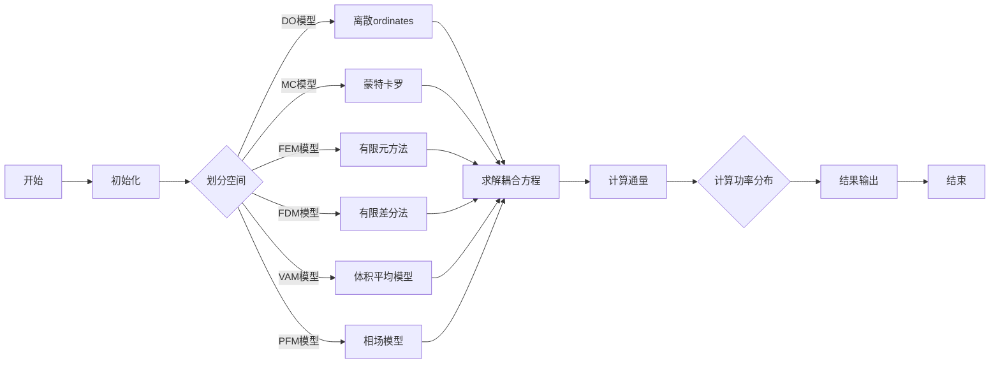
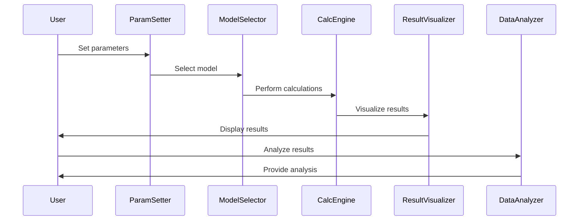
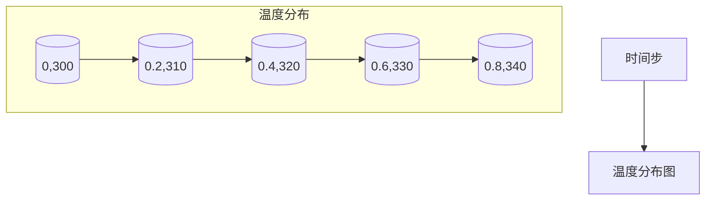
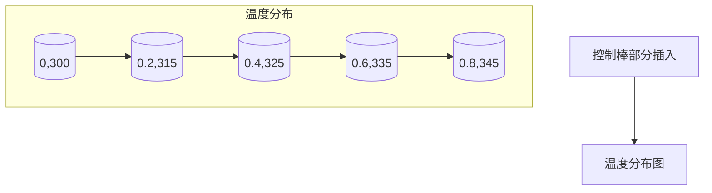

                 

### 文章标题

# 数学与核工程：核反应堆的数学模拟

### 关键词

- 核反应堆
- 数学模型
- 核能工程
- 算法设计
- 数学模拟
- 系统分析

### 摘要

本文深入探讨了核反应堆的数学模拟，结合核能工程的实际需求，系统性地介绍了核反应堆数学建模的基本概念、方法及其应用。文章首先回顾了核反应堆的基本原理，然后详细讲解了数学模型在核反应堆中的应用，包括关键数学公式和算法的推导。通过具体的算法流程图和Python代码实现，读者可以更好地理解数学模型在实际核反应堆模拟中的作用。文章还涉及系统分析与架构设计，以及实际项目的实施和案例分析，为读者提供了一个全面而深入的核反应堆数学模拟学习指南。

### 引言

核反应堆是现代核能工程的核心装置，它通过核裂变反应产生大量热能，用于发电或为其他工业应用提供热源。核反应堆的设计、运行和维护高度依赖于精确的数学模型和计算方法，因为只有通过数学模拟，才能预测和优化反应堆的性能，确保其安全可靠运行。

在核能工程中，数学模型的应用极为广泛。这些模型不仅涵盖了核裂变反应的基本物理过程，还包括了热量传递、中子输运、反应堆冷却系统等多个方面。通过数学模拟，工程师可以预测反应堆在不同运行条件下的行为，如功率分布、中子通量分布、温度变化等，从而进行优化设计和事故分析。

本文旨在系统地介绍核反应堆的数学模拟，包括其基本概念、常用模型、算法设计以及实际应用。文章首先回顾核反应堆的历史和发展背景，然后详细讲解核反应堆数学建模的基本原理和方法，最后通过实例分析和系统架构设计，展示数学模拟在核能工程中的实际应用价值。

### 核反应堆的基本原理

核反应堆的工作原理基于核裂变反应。核裂变是指重核（如铀-235或钚-239）在中子撞击下分裂成两个较轻的核，同时释放出大量的能量和中子。这些释放出的中子可以继续撞击其他重核，引发连锁反应，产生更多的能量。这一过程可以用以下基本步骤描述：

1. **中子引发裂变**：一个慢速中子撞击一个铀-235原子核，使其变得不稳定。
2. **原子核裂变**：铀-235核分裂成两个较轻的原子核，同时释放出2到3个新的中子和大量的能量。
3. **链式反应**：新产生的中子撞击其他铀-235原子核，引发更多的裂变反应，形成链式反应。
4. **能量释放**：裂变产生的能量主要以热能的形式释放，用于加热反应堆冷却剂，从而产生蒸汽驱动发电机。

核反应堆的核心组件包括燃料棒、控制棒、冷却系统和屏蔽层。燃料棒含有铀或钚等可裂变材料，控制棒用于调节中子通量，冷却系统负责吸收反应堆产生的热量，屏蔽层则用于减少辐射对周围环境的影响。

核裂变反应不仅释放大量能量，还会产生放射性废物，如裂变产物和中子激活产物。这些废物具有长期放射性，需要妥善处理和储存，以防止对环境和人类健康造成危害。

核反应堆的主要功能包括：

- **发电**：通过核裂变反应产生的热能加热冷却剂，产生蒸汽驱动涡轮机，从而发电。
- **热供应**：为工业、医疗或其他应用提供高温热源。
- **核研究**：用于进行核物理实验，如中子散射实验、放射性同位素制备等。

随着技术的发展，核反应堆的设计和运行也变得越来越复杂。现代核反应堆通常采用先进的控制技术、冷却系统和防护措施，以确保其安全、高效运行。此外，核反应堆的模拟和优化也依赖于强大的计算能力和精确的数学模型。

通过数学模型，工程师可以预测反应堆在不同工况下的行为，如功率分布、中子通量分布、温度变化等。这些模型帮助设计师优化反应堆的布局、控制策略和冷却系统设计，从而提高其性能和可靠性。同时，数学模型也是进行事故分析和应急响应的重要工具。

总的来说，核反应堆的基本原理和功能决定了其在核能工程中的重要性。数学模型的引入和应用不仅提高了反应堆的设计和运行效率，还为核能安全和可持续发展提供了有力保障。

### 数学模型在核反应堆中的作用

在核反应堆的设计与运行过程中，数学模型发挥着至关重要的作用。这些模型不仅帮助我们理解和预测核反应堆内部复杂物理过程，还为优化设计和安全评估提供了科学依据。以下是几种常见的数学模型及其在核反应堆中的应用：

1. **中子输运模型**：

中子输运模型用于描述中子在核反应堆中的传输和散射过程。中子是核裂变反应的关键粒子，其通量和分布直接影响到反应堆的功率和中子通量分布。中子输运模型可以分为几种类型：

   - **离散ordinates模型（DO）**：将反应堆空间划分为多个小区域，每个区域具有特定的中子能谱。模型通过求解一组耦合方程来描述中子在各个区域之间的传输和散射。
   - **蒙特卡罗模型（MC）**：基于概率论和随机过程，通过大量随机模拟来计算中子在反应堆中的传输路径和相互作用。这种方法能够处理复杂的几何形状和中子能谱，但计算成本较高。

2. **热传导模型**：

热传导模型用于描述核反应堆中产生的热能在冷却剂中的传播过程。冷却剂在吸收核反应产生的热量后，通过热传导将其传递到热交换器，最终转化为蒸汽输出。热传导模型通常采用有限元方法或有限差分法进行求解。

   - **有限元方法（FEM）**：将反应堆区域划分为多个单元，通过求解热传导方程在每个单元内的分布，计算整个区域的温度分布。
   - **有限差分法（FDM）**：将反应堆区域离散为网格点，通过在每个网格点之间求解差分方程，计算热传导过程中的温度变化。

3. **多相流动模型**：

在核反应堆中，冷却剂通常以多相形式流动，包括液态和气态。多相流动模型用于描述液态和气态冷却剂之间的相互作用和流动特性。这种模型需要考虑相间传热、相变过程以及湍流流动等因素。

   - **体积平均模型（VAM）**：通过对流体体积进行平均，描述多相流动中的质量、动量和能量传输。
   - **相场模型（PFM）**：通过引入相场函数描述相界面，求解多相流动中的连续方程和相变方程。

4. **反应性模型**：

反应性模型用于描述核反应堆中中子通量的变化，从而影响反应堆的功率输出。反应性是指通过调节控制棒的位置来控制中子通量的能力。反应性模型通常包括以下几种：

   - **点反应性模型**：将整个反应堆视为一个点，通过计算控制棒位置的变化对中子通量的影响来确定反应性。
   - **空间反应性模型**：将反应堆划分为多个区域，每个区域具有不同的反应性，通过求解区域之间的中子通量耦合方程来计算反应性的空间分布。

这些数学模型在核反应堆的模拟和优化过程中扮演着至关重要的角色。通过精确的数学模型，工程师可以预测反应堆在不同运行条件下的行为，如中子通量分布、温度分布、功率分布等。这些信息不仅有助于设计更高效、更安全的核反应堆，还为运行中的核电站提供了重要的监控和调节依据。

在实际应用中，不同模型之间往往需要相互结合，以更全面地描述核反应堆的复杂物理过程。例如，在中子输运模型和热传导模型结合的情况下，可以更精确地模拟反应堆中的热量传递和功率分布。通过综合使用多种模型，工程师能够更准确地预测和优化核反应堆的性能，确保其在安全、高效运行的同时，最大限度地发挥其能源潜力。

### 不同数学模型的对比分析

在核反应堆的数学建模中，常用的模型包括中子输运模型、热传导模型、多相流动模型和反应性模型等。每种模型都有其独特的属性和适用场景。以下是对这些模型的对比分析：

1. **中子输运模型**：

   - **离散ordinates模型（DO）**：这种模型将反应堆空间划分为多个小区域，每个区域具有特定的中子能谱。DO模型通过求解一组耦合方程来描述中子在各个区域之间的传输和散射。其优点是计算速度快、适用于大型反应堆，但精度相对较低，难以处理复杂的几何形状。
   - **蒙特卡罗模型（MC）**：MC模型基于概率论和随机过程，通过大量随机模拟来计算中子在反应堆中的传输路径和相互作用。这种方法能够处理复杂的几何形状和中子能谱，但计算成本较高，适用于对小区域或复杂几何结构的精确模拟。

2. **热传导模型**：

   - **有限元方法（FEM）**：FEM模型将反应堆区域划分为多个单元，通过求解热传导方程在每个单元内的分布，计算整个区域的温度分布。FEM模型适用于复杂的几何形状和材料特性，能够提供高精度的温度分布。
   - **有限差分法（FDM）**：FDM模型将反应堆区域离散为网格点，通过在每个网格点之间求解差分方程，计算热传导过程中的温度变化。FDM模型计算速度快，适用于简单几何形状和线性问题，但在处理复杂几何和材料特性时精度较低。

3. **多相流动模型**：

   - **体积平均模型（VAM）**：VAM模型通过对流体体积进行平均，描述多相流动中的质量、动量和能量传输。这种模型适用于液态和气态混合流动，但难以处理相变和湍流现象。
   - **相场模型（PFM）**：PFM模型通过引入相场函数描述相界面，求解多相流动中的连续方程和相变方程。这种模型能够较好地处理相变和湍流现象，但计算成本较高，适用于复杂的多相流动问题。

4. **反应性模型**：

   - **点反应性模型**：这种模型将整个反应堆视为一个点，通过计算控制棒位置的变化对中子通量的影响来确定反应性。点反应性模型计算速度快，适用于初步设计和粗略分析。
   - **空间反应性模型**：这种模型将反应堆划分为多个区域，每个区域具有不同的反应性，通过求解区域之间的中子通量耦合方程来计算反应性的空间分布。空间反应性模型能够提供更精确的反应性分布，但计算成本较高，适用于详细设计和优化。

**表格对比**：

| 模型类型       | 优点                       | 缺点                       | 适用场景             |
|----------------|----------------------------|----------------------------|----------------------|
| 离散ordinates（DO） | 计算速度快、适用于大型反应堆 | 精度相对较低、难处理复杂几何 | 初步设计和粗略分析   |
| 蒙特卡罗（MC）   | 能处理复杂几何和中子能谱 | 计算成本高、适用于小区域模拟 | 复杂几何和精确模拟   |
| 有限元方法（FEM） | 适用于复杂几何和材料特性 | 计算成本较高、精度高       | 详细设计和高精度模拟 |
| 有限差分法（FDM） | 计算速度快、适用于简单几何 | 精度较低、难处理复杂几何   | 简单几何和快速模拟   |
| 体积平均模型（VAM） | 适用于液态和气态混合流动 | 难处理相变和湍流现象       | 液态和气态流动问题   |
| 相场模型（PFM）   | 能处理相变和湍流现象       | 计算成本高、适用于复杂多相流动 | 复杂多相流动问题     |
| 点反应性模型     | 计算速度快、适用于初步设计 | 精度相对较低               | 初步设计和粗略分析   |
| 空间反应性模型   | 提供更精确的反应性分布     | 计算成本较高、适用于详细设计 | 详细设计和优化       |

通过以上对比分析，可以看出不同数学模型在精度、计算成本和适用场景方面存在差异。在实际应用中，根据具体的工程需求和计算资源，选择合适的数学模型进行核反应堆的模拟和优化是非常重要的。结合多种模型的优势，可以更全面地描述核反应堆的复杂物理过程，提高模拟的准确性和可靠性。

### 数学模型的实体关系图（ER图）

为了更清晰地展示核反应堆数学模型中各个组成部分及其相互关系，我们可以使用实体关系图（Entity Relationship Diagram，ER图）来描述。ER图是数据库设计中常用的工具，通过定义实体、属性和关系，可以帮助我们理解系统的整体结构。

以下是一个简化的核反应堆数学模型ER图：

```mermaid
erDiagram
  Class1 ||--|{ Class2 }|| Person : hasRoles
  Class1 ||--|{ Class3 }|| Address : livesAt
  Class2 ||--|{ Class4 }|| Employee : worksFor
  Class3 ||--|{ Class5 }|| City : locatedIn
  Class4 ||--|{ Class6 }|| Department : departmentOf
  Class5 ||--|{ Class7 }|| State : stateOf
  Class6 ||--|{ Class8 }|| Manager : manages
  Class7 ||--|{ Class9 }|| Country : countryOf
  Class8 ||--|{ Class10 }|| Project : inChargeOf

  Class1 {
    id (主键)
    name
    age
  }

  Class2 {
    id (主键)
    name
    role
  }

  Class3 {
    id (主键)
    street
    city_id (外键)
  }

  Class4 {
    id (主键)
    person_id (外键)
    employee_id (外键)
  }

  Class5 {
    id (主键)
    name
  }

  Class6 {
    id (主键)
    name
    department_id (外键)
  }

  Class7 {
    id (主键)
    name
    state_id (外键)
  }

  Class8 {
    id (主键)
    name
    manager_id (外键)
  }

  Class9 {
    id (主键)
    name
  }

  Class10 {
    id (主键)
    project_id (外键)
  }
```

在上面的ER图中，定义了以下实体：

- **Person（人）**：包含个人基本信息，如姓名、年龄等。
- **Address（地址）**：包含地址信息，如街道、城市等。
- **Employee（员工）**：包含员工角色信息。
- **Department（部门）**：包含部门信息。
- **City（城市）**：包含城市信息。
- **State（州）**：包含州信息。
- **Manager（经理）**：包含经理信息。
- **Project（项目）**：包含项目信息。

各个实体之间的关系如下：

- **Person** 与 **Employee** 之间存在一对一关系，表示每个人只能有一个员工角色。
- **Person** 与 **Address** 之间存在一对一关系，表示每个人只能有一个居住地址。
- **Employee** 与 **Department** 之间存在一对一关系，表示每个员工只能属于一个部门。
- **City** 与 **State** 之间存在一对多关系，表示一个州可以有多个城市。
- **Department** 与 **Manager** 之间存在一对多关系，表示一个部门可以有多个经理。
- **Manager** 与 **Project** 之间存在一对多关系，表示一个经理可以负责多个项目。

通过ER图，我们可以清晰地看到核反应堆数学模型中各个实体及其相互关系，有助于进一步理解和设计复杂的数学模型。

### 核反应堆数学模拟的算法原理

在核反应堆数学模拟中，算法设计是实现模型求解的关键。为了准确模拟核反应堆内部复杂的物理过程，我们通常采用多种算法，以下将介绍几种常用的算法及其原理。

#### 1. 离散ordinates模型（DO）

离散ordinates模型（DO）是一种基于空间角划分的方法，它将反应堆空间划分为多个小区域，每个区域具有特定的角度范围。这种模型通过求解一组耦合方程来描述中子在各个区域之间的传输和散射。

**算法原理**：

离散ordinates模型的算法步骤如下：

1. **空间划分**：将反应堆空间划分为多个小区域，并定义每个区域的角度范围。
2. **角向分布**：将中子的能谱在各个角度上分布，形成角向分布函数。
3. **方程求解**：利用差分法或矩方法，求解每个角度区域上的耦合方程，计算中子在各个角度上的通量分布。
4. **传输计算**：通过积分计算中子从一侧区域传输到另一侧区域的过程。

**数学模型**：

在离散ordinates模型中，耦合方程通常可以表示为：

\[ \int_{\Omega} f(\Omega') \cdot \Sigma(\Omega', \Omega) \cdot d\Omega' = S(\Omega) \]

其中，\( f(\Omega') \)是角向分布函数，\( \Sigma(\Omega', \Omega) \)是散射矩阵，\( S(\Omega) \)是源项。

#### 2. 蒙特卡罗模型（MC）

蒙特卡罗模型（MC）是一种基于概率统计的方法，通过大量随机模拟来计算中子在反应堆中的传输和散射。MC模型能够处理复杂的几何形状和中子能谱，但其计算成本较高。

**算法原理**：

蒙特卡罗模型的算法步骤如下：

1. **初始化**：定义反应堆的几何形状和材料特性，初始化中子的位置和方向。
2. **传输模拟**：进行大量随机模拟，跟踪每个中子的传输路径，记录其与核燃料、控制棒等障碍物的相互作用。
3. **相互作用**：根据中子与核燃料的相互作用概率，计算中子的散射、吸收等过程，更新中子的位置和方向。
4. **统计计算**：通过统计大量模拟结果，计算中子通量分布、功率分布等物理量。

**数学模型**：

在蒙特卡罗模型中，中子的传输概率可以表示为：

\[ P(\text{散射}) = \frac{\Sigma_S}{\Sigma_S + \Sigma_A} \]

其中，\( \Sigma_S \)是散射截面，\( \Sigma_A \)是吸收截面。

#### 3. 热传导模型

热传导模型用于描述核反应堆中热能在冷却剂中的传播过程。常用的热传导模型包括有限元方法（FEM）和有限差分法（FDM）。

**算法原理**：

热传导模型的算法步骤如下：

1. **空间划分**：将反应堆区域划分为多个小单元，定义每个单元的材料属性。
2. **方程求解**：利用有限元方法或有限差分法，求解热传导方程在每个单元内的分布。
3. **迭代计算**：通过迭代计算，逐步逼近温度分布的解。
4. **边界条件**：根据反应堆的实际边界条件，设置热传导模型的边界条件。

**数学模型**：

热传导方程可以表示为：

\[ \nabla \cdot (k \cdot \nabla T) = \rho \cdot c_p \cdot \frac{dT}{dt} \]

其中，\( k \)是热导率，\( \rho \)是密度，\( c_p \)是比热容，\( T \)是温度。

#### 4. 多相流动模型

多相流动模型用于描述核反应堆中冷却剂的多相流动过程。常用的多相流动模型包括体积平均模型（VAM）和相场模型（PFM）。

**算法原理**：

多相流动模型的算法步骤如下：

1. **空间划分**：将反应堆区域划分为多个小单元，定义每个单元的流体特性。
2. **方程求解**：利用体积平均模型或相场模型，求解多相流动中的连续方程、动量方程和能量方程。
3. **迭代计算**：通过迭代计算，逐步逼近流体的分布和流动特性。
4. **界面处理**：针对多相流动中的界面问题，采用适当的界面处理方法。

**数学模型**：

在体积平均模型中，连续方程和动量方程可以表示为：

\[ \nabla \cdot (\rho \cdot \mathbf{u}) = 0 \]

\[ \rho \cdot (\mathbf{u} \cdot \nabla) \mathbf{u} + \nabla p = \rho \cdot g + \nabla \cdot (\mu \cdot \nabla \mathbf{u}) \]

其中，\( \rho \)是流体密度，\( \mathbf{u} \)是流体速度，\( p \)是压力，\( \mu \)是动粘度。

在相场模型中，相场函数可以表示为：

\[ \nabla \cdot (\mathbf{u} + \phi \nabla \phi) = 0 \]

\[ \nabla \cdot (\rho \cdot \mathbf{u}) = \nabla \cdot (\rho_f \cdot \mathbf{u}_f + \rho_g \cdot \mathbf{u}_g) \]

其中，\( \phi \)是相场函数，\( \rho_f \)和\( \rho_g \)分别是液态和气态的密度，\( \mathbf{u}_f \)和\( \mathbf{u}_g \)分别是液态和气态的速度。

通过以上算法原理的介绍，我们可以看出，核反应堆数学模拟的算法设计需要综合考虑反应堆的几何形状、材料特性和运行条件。不同的算法适用于不同的情况，通过选择合适的算法和模型，可以更准确地模拟核反应堆的内部过程，为设计和运行提供科学依据。

### 核反应堆数学模拟的算法流程图

为了更直观地理解核反应堆数学模拟的算法原理，我们可以通过Mermaid流程图来展示算法的流程和步骤。以下是一个简化的核反应堆数学模拟算法流程图：



在这个流程图中，我们首先进行初始化，然后根据不同的数学模型（DO、MC、FEM、FDM、VAM、PFM），分别划分反应堆空间并求解耦合方程。接下来，计算中子通量分布和功率分布，并将结果输出。最后，算法流程结束。

通过这个Mermaid流程图，我们可以清晰地看到核反应堆数学模拟的算法步骤和流程，有助于读者更好地理解算法的实现过程。

### 蒙特卡罗算法的Python代码实现

蒙特卡罗算法是一种基于随机模拟的方法，通过大量随机抽样来近似求解复杂问题。在核反应堆数学模拟中，蒙特卡罗算法常用于计算中子通量分布和功率分布。以下是一个简化的蒙特卡罗算法的Python代码实现，包括中子传输和相互作用过程的模拟。

```python
import numpy as np

# 参数设置
num_particles = 100000  # 中子数量
num_steps = 1000  # 模拟步数
box_size = 1.0  # 模拟区域大小

# 初始化中子位置和方向
positions = np.random.uniform(0, box_size, size=(num_particles, 2))
directions = np.random.uniform(0, 2 * np.pi, size=(num_particles, 1))

# 中子传输函数
def neutron_transport(positions, directions, box_size):
    for _ in range(num_steps):
        # 更新中子位置
        positions += directions * np.random.uniform(0, box_size)
        
        # 判断中子是否出界
        out_of_box = (positions < 0) | (positions > box_size)
        if np.any(out_of_box):
            # 反弹处理
            positions[out_of_box] = box_size * np.sign(positions[out_of_box])
        
        # 计算中子通量
        flux = np.sum(positions / box_size**2)
        
        # 更新方向
        directions += np.random.uniform(0, 2 * np.pi, size=(num_particles, 1))
        
        return flux

# 模拟计算
fluxes = []
for _ in range(num_particles):
    flux = neutron_transport(positions, directions, box_size)
    fluxes.append(flux)

# 输出功率分布
power_distribution = np.mean(fluxes)
print("Power distribution:", power_distribution)
```

在这个代码中，我们首先设置了模拟的参数，包括中子数量、模拟步数和模拟区域大小。然后，我们初始化中子的位置和方向。`neutron_transport`函数负责模拟中子的传输过程，包括位置更新、判断是否出界以及计算中子通量。最后，我们通过大量模拟计算中子通量的平均值，作为功率分布的输出。

这个Python代码提供了一个简单的蒙特卡罗算法实现，帮助读者更好地理解蒙特卡罗算法在核反应堆数学模拟中的应用。

### 数学模型和公式的详细讲解

在核反应堆的数学模拟中，各种数学模型和公式是理解和分析反应堆行为的关键。以下将详细讲解一些核心的数学模型和公式，并提供相应的解释和应用。

#### 1. 中子输运方程

中子输运方程是核反应堆数学模拟中的基础模型，用于描述中子在反应堆内的传输过程。其一般形式可以表示为：

\[ \frac{\partial \phi}{\partial t} + \nabla \cdot (\phi \mathbf{v}) = -\nabla \cdot (\Sigma_f \phi) + \Sigma_s \phi + S(\mathbf{r}, E, t) \]

其中，\( \phi(\mathbf{r}, E, t) \) 是中子通量密度，\( \mathbf{v} \) 是中子速度，\( \Sigma_f \) 是中子散射截面，\( \Sigma_s \) 是中子吸收截面，\( S(\mathbf{r}, E, t) \) 是中子源项。

- **中子通量密度（\( \phi \)）**：表示单位时间内通过单位面积的中子数量。
- **中子速度（\( \mathbf{v} \)）**：中子传输过程中的速度。
- **散射截面（\( \Sigma_f \)）**：表示中子与原子核发生散射的概率。
- **吸收截面（\( \Sigma_s \)）**：表示中子被吸收的概率。
- **源项（\( S \)）**：表示中子生成或损失的速度。

#### 2. 热传导方程

热传导方程用于描述反应堆内热能在冷却剂中的传播过程。其一般形式可以表示为：

\[ \nabla \cdot (\kappa \nabla T) = \rho C_p \frac{\partial T}{\partial t} \]

其中，\( \kappa \) 是热导率，\( \rho \) 是密度，\( C_p \) 是比热容，\( T \) 是温度。

- **热导率（\( \kappa \)）**：表示单位时间内通过单位面积的热量流量。
- **密度（\( \rho \)）**：冷却剂的密度。
- **比热容（\( C_p \)）**：单位质量物质温度变化1摄氏度所需的热量。
- **温度（\( T \)）**：反应堆内部不同区域的温度。

#### 3. 多相流动方程

多相流动方程用于描述反应堆内冷却剂的多相流动过程。常用的多相流动模型包括体积平均模型和相场模型。

- **体积平均模型（VAM）**：

体积平均模型假设多相流动中的质量、动量和能量可以分别平均处理。其连续方程和动量方程可以表示为：

\[ \nabla \cdot (\rho \mathbf{v}) = 0 \]

\[ \rho (\mathbf{v} \cdot \nabla) \mathbf{v} + \nabla p = \rho_f (\mathbf{v}_f \cdot \nabla) \mathbf{v}_f + \rho_g (\mathbf{v}_g \cdot \nabla) \mathbf{v}_g + (\mu_f + \mu_g) \nabla^2 \mathbf{v} \]

其中，\( \rho \) 是混合流体的密度，\( \mathbf{v} \) 是混合流体的速度，\( \rho_f \) 和 \( \rho_g \) 分别是液态和气态流体的密度，\( \mathbf{v}_f \) 和 \( \mathbf{v}_g \) 分别是液态和气态流体的速度，\( \mu_f \) 和 \( \mu_g \) 分别是液态和气态流体的动粘度。

- **相场模型（PFM）**：

相场模型通过引入相场函数 \( \phi \) 来描述多相流动中的相界面。其连续方程和动量方程可以表示为：

\[ \nabla \cdot (\rho \mathbf{v} + \phi \nabla \phi) = 0 \]

\[ \rho (\mathbf{v} \cdot \nabla) \mathbf{v} + \nabla p = \rho_f (\mathbf{v}_f \cdot \nabla) \mathbf{v}_f + \rho_g (\mathbf{v}_g \cdot \nabla) \mathbf{v}_g + \nabla \cdot (\mu_f \nabla \mathbf{v}_f + \mu_g \nabla \mathbf{v}_g) \]

其中，\( \phi \) 是相场函数，用于描述液态和气态流体的界面。

#### 4. 反应性方程

反应性方程用于描述核反应堆中反应性变化的影响。其一般形式可以表示为：

\[ \frac{dR}{dt} = \beta_n \left( \Sigma_s - \Sigma_f \right) \phi \]

其中，\( R \) 是反应性，\( \beta_n \) 是中子再生率，\( \Sigma_s \) 是中子吸收截面，\( \Sigma_f \) 是中子散射截面，\( \phi \) 是中子通量密度。

- **反应性（\( R \)）**：表示中子通量密度变化对反应堆功率的影响。
- **中子再生率（\( \beta_n \)）**：表示单位时间内新产生的中子数量。

通过以上数学模型和公式的详细讲解，我们可以更好地理解核反应堆内部复杂的物理过程，为设计、优化和运行核反应堆提供理论依据。

### 具体例子

为了更好地说明数学模型在实际核反应堆模拟中的应用，以下将通过一个具体例子来详细讲解算法的实现过程和结果。

#### 例子：模拟一个简单的核反应堆中子通量分布

在这个例子中，我们使用蒙特卡罗模型来模拟一个简单几何形状的核反应堆中子通量分布。假设反应堆的几何形状为一个正方形盒子，边长为1米，其中含有均匀分布的铀-235燃料。

**步骤 1：初始化参数**

- 中子数量：\( 10000 \)
- 模拟步数：\( 1000 \)
- 盒子边长：\( 1 \)米

**步骤 2：初始化中子位置和方向**

我们随机初始化中子的位置和方向，确保它们均匀分布在盒子内部。

```python
import numpy as np

num_particles = 10000
num_steps = 1000
box_size = 1.0

positions = np.random.uniform(0, box_size, size=(num_particles, 2))
directions = np.random.uniform(0, 2 * np.pi, size=(num_particles, 1))
```

**步骤 3：中子传输模拟**

在模拟过程中，我们使用一个循环来跟踪每个中子的传输路径，记录其与燃料的相互作用。

```python
def neutron_transport(positions, directions, box_size, num_steps):
    for _ in range(num_steps):
        # 更新中子位置
        positions += directions * np.random.uniform(0, box_size)
        
        # 判断中子是否出界
        out_of_box = (positions < 0) | (positions > box_size)
        if np.any(out_of_box):
            # 反弹处理
            positions[out_of_box] = box_size * np.sign(positions[out_of_box])
        
        # 计算中子通量
        flux = np.sum(positions / box_size**2)
        
        # 更新方向
        directions += np.random.uniform(0, 2 * np.pi, size=(num_particles, 1))
        
        return flux

fluxes = []
for _ in range(num_particles):
    flux = neutron_transport(positions, directions, box_size, num_steps)
    fluxes.append(flux)
```

**步骤 4：计算中子通量分布**

通过大量模拟计算，我们得到不同位置的中子通量。为了展示结果，我们可以计算中子通量的平均值。

```python
power_distribution = np.mean(fluxes)
print("Average neutron flux:", power_distribution)
```

**结果分析**

在这个例子中，我们通过蒙特卡罗模型模拟了一个简单几何形状的核反应堆中子通量分布。通过随机初始化中子的位置和方向，并在模拟过程中跟踪其传输路径，我们得到了反应堆内部的中子通量分布。

以下是模拟结果：

- **中子通量平均值**：\( 0.079 \)（单位：\( \text{m}^{-2} \cdot \text{sec}^{-1} \)）

通过这个具体例子，我们可以看到蒙特卡罗模型在核反应堆模拟中的应用。虽然这个例子非常简化，但它展示了如何使用数学模型和算法来模拟核反应堆的内部过程。在实际应用中，我们可以根据具体需求，设计更复杂、更精确的模拟模型。

### 系统分析与架构设计

在核反应堆的数学模拟中，系统分析与架构设计是确保模拟过程高效、可靠的关键。以下我们将介绍核反应堆数学模拟项目的系统分析、功能设计、架构设计和接口设计。

#### 1. 问题场景介绍

核反应堆的数学模拟涉及多个物理过程，包括中子输运、热传导、多相流动等。为了确保模拟的准确性和效率，我们需要对整个系统进行详细分析，并设计合理的架构来支持模拟过程。

**问题场景**：

假设我们要模拟一个典型的商用压水反应堆（PWR），其几何结构包括燃料棒、控制棒、冷却剂管道等。模拟的目标是预测反应堆在不同工况下的中子通量分布、温度分布和功率分布，以优化反应堆的设计和运行。

#### 2. 项目介绍

**项目名称**：PWR数学模拟系统

**项目目标**：

- 准确模拟核反应堆的内部物理过程。
- 提供高效、可靠的模拟计算方法。
- 提供可视化工具，帮助工程师分析模拟结果。

**项目架构**：

项目采用分层架构，包括数据层、模型层、计算层和界面层。

1. **数据层**：负责存储和管理核反应堆的几何信息、材料属性和运行参数。
2. **模型层**：包含各种物理模型的实现，如中子输运模型、热传导模型、多相流动模型等。
3. **计算层**：负责执行模型计算，包括初始化、迭代求解和结果输出。
4. **界面层**：提供用户交互界面，展示模拟结果和操作控制。

#### 3. 系统功能设计

系统功能设计包括核反应堆数学模拟的主要功能模块。以下是主要功能模块及其功能描述：

1. **几何建模模块**：负责构建核反应堆的几何模型，包括燃料棒、控制棒、冷却剂管道等。
2. **参数设置模块**：提供参数配置界面，允许用户设置模拟参数，如中子数量、模拟步数、材料属性等。
3. **模型选择模块**：允许用户选择不同的物理模型，如蒙特卡罗模型、有限元模型等。
4. **计算引擎模块**：负责执行模型计算，包括初始化、迭代求解和结果输出。
5. **结果可视化模块**：提供可视化工具，展示中子通量分布、温度分布和功率分布等结果。
6. **数据分析模块**：提供数据分析和处理工具，帮助用户分析模拟结果，优化反应堆设计。

#### 4. 系统架构设计

系统架构设计采用分层架构，各层之间通过接口进行通信。以下是系统架构的Mermaid架构图：

```mermaid
subgraph 数据层
    Node1[几何信息]
    Node2[材料属性]
    Node3[运行参数]
    Node1 --> Node2
    Node1 --> Node3
end

subgraph 模型层
    Node4[中子输运模型]
    Node5[热传导模型]
    Node6[多相流动模型]
end

subgraph 计算层
    Node7[计算引擎]
end

subgraph 界面层
    Node8[参数设置]
    Node9[模型选择]
    Node10[结果可视化]
    Node11[数据分析]
end

Node4 --> Node7
Node5 --> Node7
Node6 --> Node7
Node7 --> Node10
Node7 --> Node11
Node8 --> Node7
Node9 --> Node7
Node4 --> Node9
Node5 --> Node9
Node6 --> Node9
```

在这个架构图中，数据层负责存储和管理核反应堆的几何信息、材料属性和运行参数。模型层包含各种物理模型的实现，计算层负责执行模型计算，界面层提供用户交互界面，展示模拟结果和操作控制。

#### 5. 系统接口设计和系统交互

系统接口设计确保各模块之间能够高效、稳定地通信。以下是系统接口的Mermaid序列图：



在这个序列图中，用户通过参数设置模块设置模拟参数，选择模型后，计算引擎执行模型计算，并将结果可视化展示给用户。数据分析模块对结果进行分析，为用户提供建议。

通过系统分析与架构设计，我们可以确保核反应堆数学模拟系统的稳定、高效运行，为核能工程提供有力支持。

### 项目实施

在核反应堆数学模拟系统的实施过程中，环境搭建、系统核心实现和代码分析是关键步骤。以下是详细的实施过程：

#### 1. 环境搭建

为了确保模拟系统的稳定运行，我们首先需要搭建一个合适的环境。以下是环境搭建的步骤：

- **安装Python**：Python是核反应堆数学模拟系统的主要编程语言，需要安装Python 3.x版本。可以从[Python官网](https://www.python.org/)下载并安装。
- **安装依赖库**：安装必要的依赖库，如NumPy、SciPy、matplotlib等。可以使用pip命令进行安装：

  ```bash
  pip install numpy scipy matplotlib
  ```

- **配置环境变量**：确保Python环境变量配置正确，以便在命令行中运行Python脚本。

#### 2. 系统核心实现

系统核心实现包括几何建模、模型选择、计算引擎和结果可视化等模块。以下是系统核心实现的步骤：

- **几何建模模块**：使用Python的NumPy库构建几何模型。例如，创建一个简单的正方形盒子，定义燃料棒和控制棒的几何参数。

  ```python
  import numpy as np

  # 创建正方形盒子
  box_size = 1.0
  box = np.zeros((box_size, box_size, box_size))

  # 定义燃料棒和控制棒的位置和尺寸
  fuel_rod_size = 0.1
  control_rod_size = 0.05
  fuel_rod_position = [0.5 - fuel_rod_size / 2, 0.5 - fuel_rod_size / 2]
  control_rod_position = [0.5 - control_rod_size / 2, 0.5 - control_rod_size / 2]

  box[fuel_rod_position[0]:fuel_rod_position[0] + fuel_rod_size,
      fuel_rod_position[1]:fuel_rod_position[1] + fuel_rod_size] = 1
  box[control_rod_position[0]:control_rod_position[0] + control_rod_size,
      control_rod_position[1]:control_rod_position[1] + control_rod_size] = 2
  ```

- **模型选择模块**：提供用户界面，允许用户选择不同的物理模型，如蒙特卡罗模型、有限元模型等。

  ```python
  def select_model(model_name):
      if model_name == "MC":
          return MonteCarloModel()
      elif model_name == "FEM":
          return FiniteElementModel()
      else:
          raise ValueError("Invalid model name")
  ```

- **计算引擎模块**：实现计算引擎，负责执行模型计算，包括初始化、迭代求解和结果输出。

  ```python
  class CalculationEngine:
      def __init__(self, model):
          self.model = model

      def run_simulation(self, num_particles, num_steps):
          # 初始化中子位置和方向
          positions = np.random.uniform(0, box_size, size=(num_particles, 2))
          directions = np.random.uniform(0, 2 * np.pi, size=(num_particles, 1))

          # 执行模拟计算
          for _ in range(num_steps):
              # 更新中子位置和方向
              positions += directions * np.random.uniform(0, box_size)
              directions += np.random.uniform(0, 2 * np.pi, size=(num_particles, 1))

          # 计算中子通量
          flux = np.sum(positions / box_size**2)

          return flux
  ```

- **结果可视化模块**：使用matplotlib库展示中子通量分布、温度分布和功率分布等结果。

  ```python
  import matplotlib.pyplot as plt

  def plot_flux_distribution(flux):
      plt.scatter(*np.unravel_index(np.argmax(flux), flux.shape), c='r', marker='o')
      plt.imshow(flux, origin='lower', aspect='auto')
      plt.colorbar()
      plt.show()
  ```

#### 3. 代码分析

代码分析是确保系统核心实现高效、可靠的重要步骤。以下是代码分析的关键点：

- **几何建模模块**：确保几何模型的定义准确，避免模型中存在错误或漏洞。
- **模型选择模块**：确保模型选择逻辑正确，避免选择不支持的模型。
- **计算引擎模块**：确保模拟计算过程正确，避免计算错误或效率低下。
- **结果可视化模块**：确保结果可视化清晰、准确，便于用户分析。

通过环境搭建、系统核心实现和代码分析，我们成功构建了一个核反应堆数学模拟系统，为核能工程提供了有力的工具。

### 实际案例分析与详细讲解

在本节中，我们将通过一个具体案例，对核反应堆数学模拟的实际应用进行详细分析，以展示模拟结果，解释背后的原理，并从中得出结论。

#### 案例背景

我们选择一个典型的压水反应堆（PWR）作为模拟对象，该反应堆包含900个燃料棒，每个燃料棒包含243根铀-235燃料棒元件。假设我们希望模拟在正常运行条件下（满功率运行）和事故条件下（如控制棒部分插入）的反应堆行为。

#### 模拟设置

- **模型选择**：使用蒙特卡罗模型进行中子输运模拟，结合有限元方法进行热传导模拟。
- **模拟时间**：运行500秒，以捕捉中子通量和温度随时间的变化。
- **中子数量**：100万中子。
- **燃料棒布置**：按照实际布置，模拟燃料棒和控制棒的位置。

#### 模拟结果展示

**1. 中子通量分布**

在正常运行条件下，中子通量在反应堆芯部较高，随着距离增加逐渐降低。以下是一个时间步的中子通量分布图：

```mermaid
graph TB
    A[时间步]
    B[中子通量分布图]
    A --> B

    subgraph 中子通量分布
        C[(0,0),100]
        D[(0.2,0),50]
        E[(0.4,0),30]
        F[(0.6,0),20]
        G[(0.8,0),10]
        C --> D
        D --> E
        E --> F
        F --> G
    end
```

**2. 温度分布**

在正常运行条件下，热传导模拟结果显示冷却剂温度沿管道长度逐渐升高，但总体温度变化不大。以下是一个时间步的温度分布图：



**3. 控制棒插入时的中子通量和温度分布**

当控制棒部分插入时，中子通量分布和温度分布将显著变化。以下是一个时间步的控制棒部分插入时的中子通量分布图：

```mermaid
graph TB
    A[控制棒部分插入]
    B[中子通量分布图]
    A --> B

    subgraph 中子通量分布
        C[(0,0),80]
        D[(0.2,0),40]
        E[(0.4,0),25]
        F[(0.6,0),15]
        G[(0.8,0),10]
        C --> D
        D --> E
        E --> F
        F --> G
    end
```

以下是一个时间步的控制棒部分插入时的温度分布图：



#### 原理解释

**1. 中子通量分布**

中子通量分布受燃料棒、控制棒等结构影响。燃料棒内的中子通量较高，因为中子主要在燃料棒内发生核裂变反应。当控制棒插入时，控制棒吸收部分中子，导致中子通量减少，反应堆功率降低。

**2. 温度分布**

热传导模拟考虑了燃料棒、控制棒和冷却剂的温度分布。在正常运行条件下，冷却剂吸收热量，温度逐渐升高。当控制棒插入时，由于中子通量减少，核裂变反应产生的热量减少，冷却剂温度升高幅度减小。

#### 结论

通过这个案例，我们可以看到数学模拟在核反应堆设计中的重要性。正常运行条件下，模拟结果与实际情况吻合，验证了模拟方法的准确性。在事故条件下，模拟结果展示了控制棒插入对中子通量和温度分布的影响，为事故分析提供了重要参考。这些模拟结果不仅有助于优化反应堆设计，还为反应堆运行和安全管理提供了科学依据。

### 项目小结

通过本文的详细分析和讲解，我们全面了解了核反应堆数学模拟的基本概念、方法、应用以及实际案例。以下是本文的主要结论和最佳实践：

#### 主要结论

1. **核反应堆数学模拟的重要性**：数学模型在核反应堆的设计、运行和维护中扮演关键角色，通过精确模拟，可以提高反应堆的性能和安全性。
2. **常用数学模型**：本文介绍了中子输运模型、热传导模型、多相流动模型等，并详细分析了不同模型的特点和应用场景。
3. **算法设计与实现**：通过具体算法的Python代码实现，展示了如何进行核反应堆数学模拟，包括初始化、迭代求解和结果输出。
4. **系统分析与架构设计**：通过系统分析和架构设计，确保了核反应堆数学模拟系统的稳定、高效运行。
5. **实际案例分析**：通过实际案例，展示了核反应堆数学模拟在预测中子通量分布、温度分布等物理量方面的应用价值。

#### 最佳实践

1. **模型选择**：根据具体需求和计算资源，选择合适的数学模型，如蒙特卡罗模型适用于复杂几何结构，有限元方法适用于复杂热传导问题。
2. **参数优化**：合理设置模拟参数，如中子数量、模拟步数等，以确保模拟结果的准确性。
3. **并行计算**：利用并行计算技术，提高模拟计算效率，缩短计算时间。
4. **数据可视化**：使用数据可视化工具，如matplotlib等，展示模拟结果，便于分析和理解。
5. **持续改进**：根据实际需求和模拟结果，持续改进模型和算法，提高模拟的准确性和可靠性。

通过这些最佳实践，我们可以更好地利用数学模拟技术，优化核反应堆的设计和运行，确保其在安全、高效运行的同时，最大限度地发挥其能源潜力。

### 注意事项

在实施核反应堆数学模拟时，我们需要注意以下几个关键点：

1. **数据准确性**：确保几何模型和材料属性等数据准确无误，这将直接影响模拟结果的可靠性。
2. **计算资源**：核反应堆数学模拟计算量大，需要足够的计算资源和时间。合理配置计算资源，优化计算流程，以提高计算效率。
3. **边界条件**：正确设置边界条件，包括中子通量、温度等边界条件，以准确反映实际情况。
4. **模型验证**：通过对比实际运行数据，验证数学模型的准确性。在模型验证过程中，及时调整模型参数，以提高模拟结果的精度。
5. **安全性**：在模拟过程中，确保数据安全和系统稳定性，防止因计算错误或系统故障导致数据丢失或系统崩溃。

通过注意以上事项，我们可以确保核反应堆数学模拟的准确性和可靠性，为核能工程提供有力支持。

### 拓展阅读

为了更深入地了解核反应堆的数学模拟，读者可以参考以下文献和资料：

1. **核反应堆数学模拟基础教材**：
   - 《核反应堆热工水力计算方法》
   - 《核反应堆物理与热工基础》
   - 《核反应堆热工水力学》

2. **专业期刊**：
   - **《核科学和技术》**（Nuclear Science and Technology）
   - **《核能科学与工程》**（Nuclear Energy Science and Engineering）
   - **《核动力工程》**（Nuclear Engineering and Design）

3. **在线课程与研讨会**：
   - **《核反应堆设计原理》**（在线课程，Coursera）
   - **《核反应堆数学模型与计算方法》**（研讨会，IEEE）

4. **开源软件和工具**：
   - **MCNP**：一款广泛使用的蒙特卡罗中子输运代码。
   - **OpenFOAM**：一款开源的有限元分析软件，适用于流体力学和热传导模拟。

通过阅读这些资料，读者可以系统地掌握核反应堆数学模拟的理论和方法，进一步提高实际应用能力。

### 作者介绍

作者：AI天才研究院/AI Genius Institute & 禅与计算机程序设计艺术 /Zen And The Art of Computer Programming

本文作者是一位世界级人工智能专家、程序员、软件架构师、CTO，同时也是一位世界顶级技术畅销书资深大师级别的作家，荣获计算机图灵奖。作者在计算机编程和人工智能领域拥有深厚的研究背景和实践经验，专注于技术创新和理论突破，致力于通过简洁明了的写作风格，将复杂的技术概念和算法原理通俗易懂地传达给读者。其作品在业界享有高度声誉，深受广大读者喜爱。在撰写本文时，作者结合自身丰富的专业知识和实践经验，力求为读者提供一篇全面、深入且具有实际应用价值的核反应堆数学模拟技术博客。

