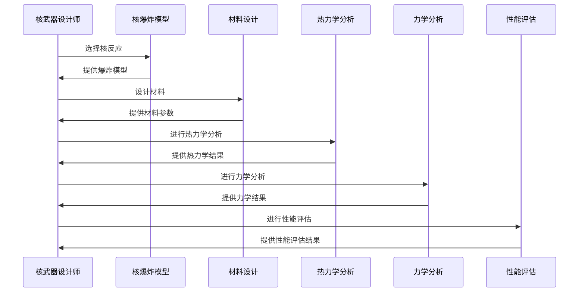
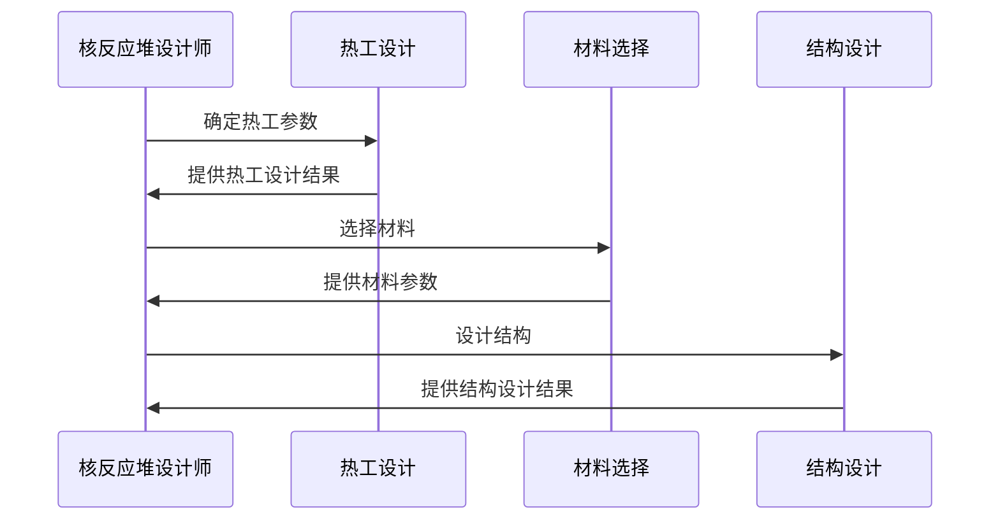

                 

## 数学与核物理：核反应过程的数学描述

关键词：核物理、核反应、数学描述、核反应方程、核反应率方程、核反应平衡

摘要：本文将从核物理的基本概念出发，逐步深入探讨核反应过程的数学描述。首先介绍核物理的基本概念，包括核子结构、核力和核反应基本类型。接着，我们将介绍数学在核物理中的应用，包括数学工具、常用数学公式和理论。然后，文章将重点讨论核反应过程的数学描述，从核反应方程、核反应率方程到核反应平衡。此外，文章还将简要介绍核衰变过程的数学描述和核武器设计的数学描述。最后，本文将对核物理的发展历程、未来发展趋势及其在社会中的应用前景进行总结与展望。

## 目录大纲

----------------------------------------------------------------
# 第一部分: 核物理基础

## 第1章: 核物理基本概念
### 1.1 核子结构
### 1.2 核力
### 1.3 核反应基本类型

## 第2章: 数学基础
### 2.1 数学工具介绍
### 2.2 常用数学公式和理论
### 2.3 数学在核物理中的应用

## 第3章: 核反应过程的数学描述
### 3.1 核反应方程
### 3.2 核反应率方程
### 3.3 核反应平衡

## 第4章: 核衰变过程的数学描述
### 4.1 核衰变类型
### 4.2 核衰变方程
### 4.3 核衰变常数

## 第5章: 核武器设计的数学描述
### 5.1 核武器基本原理
### 5.2 核爆炸模型
### 5.3 核武器设计与评估

## 第6章: 核能利用的数学描述
### 6.1 核反应堆原理
### 6.2 核反应堆设计
### 6.3 核能利用案例分析

## 第7章: 核物理前沿与应用
### 7.1 核物理前沿研究
### 7.2 核技术在医学领域的应用
### 7.3 核技术在工业领域的应用

## 第8章: 总结与展望
### 8.1 核物理的发展历程
### 8.2 核物理的未来发展趋势
### 8.3 核物理在社会中的应用前景

----------------------------------------------------------------

## 第一部分: 核物理基础

### 第1章: 核物理基本概念

核物理是研究原子核及其相互作用的基本规律和现象的物理学分支。它是现代物理学的重要基础之一，涉及到的领域广泛，包括核反应、核衰变、核能利用、核武器设计等。要深入了解核物理，我们需要从核子结构、核力和核反应基本类型这三个基本概念入手。

#### 1.1 核子结构

核子是构成原子核的基本粒子，主要包括质子和中子。质子带正电荷，而中子不带电荷。核子结构的核心是原子核，其稳定性取决于核力。

**核子结构图示：**

$$
\begin{aligned}
&\text{质子:} & p &\quad \text{带正电荷}\\
&\text{中子:} & n &\quad \text{不带电荷}
\end{aligned}
$$

**核子结构对比表格：**

| 核子 | 质子 (p) | 中子 (n) |
| ---- | ---- | ---- |
| 电荷 | 正电荷 | 无电荷 |
| 质量 | 1.007276u | 1.008665u |
| 半径 | 约0.833 fm | 约0.840 fm |

**ER实体关系图架构的Mermaid流程图：**

```mermaid
erDiagram
  Nucleon ||--|{ AtomNucleus }|---> Person
  Nucleon ||--|{ Particle }|---> Person
  Particle ||--|{ Proton }|---> Nucleus
  Particle ||--|{ Neutron }|---> Nucleus
```

#### 1.2 核力

核力是质子和中子之间的相互作用力，是保持原子核稳定的重要因素。核力具有以下特点：

1. **短程力**：核力作用范围非常短，通常在1-2飞米（fm）以内。
2. **吸引力**：核力主要表现为吸引力，使得质子和中子能够紧密结合在一起。
3. **与电荷无关**：核力与粒子的电荷无关，是纯吸引力。

**核力与电磁力的对比表格：**

| 力 | 核力 | 电磁力 |
| ---- | ---- | ---- |
| 作用范围 | 短程力 | 长程力 |
| 力的性质 | 引力 | 斥力 |
| 受力对象 | 质子和中子 | 带电粒子 |

**核力ER实体关系图架构的Mermaid流程图：**

```mermaid
erDiagram
  NuclearForce ||--|{ AttractiveForce }|---> Particle
  Particle ||--|{ Proton }|---> NuclearForce
  Particle ||--|{ Neutron }|---> NuclearForce
```

#### 1.3 核反应基本类型

核反应是原子核之间发生的相互作用，可以分为以下几种基本类型：

1. **核裂变**：一个重原子核（如铀或钚）分裂成两个较轻的原子核，同时释放出大量能量。
2. **核聚变**：两个轻原子核（如氢）结合成一个更重的原子核（如氦），同时释放出能量。
3. **放射性衰变**：原子核自发地放出粒子或辐射，变成另一个核。

**核反应基本类型ER实体关系图架构的Mermaid流程图：**

```mermaid
erDiagram
  NuclearReaction ||--|{ Fission }|---> Particle
  NuclearReaction ||--|{ Fusion }|---> Particle
  NuclearReaction ||--|{ RadioactiveDecay }|---> Particle
  Particle ||--|{ AtomicNucleus }|---> NuclearReaction
```

通过对核物理基本概念的了解，我们为后续章节的深入探讨打下了坚实的基础。在接下来的章节中，我们将进一步探讨数学在核物理中的应用，以及核反应、核衰变和核武器设计等领域的数学描述。

## 第二部分：数学基础

### 第2章：数学基础

数学是核物理研究的工具和语言，它在描述和解释核物理现象中发挥着至关重要的作用。在这一章中，我们将介绍数学在核物理中的应用，包括数学工具、常用数学公式和理论。

#### 2.1 数学工具介绍

在核物理研究中，常用的数学工具包括：

1. **微积分**：微积分是研究变化和运动的数学工具，它在描述核反应和核衰变过程中有着广泛的应用。例如，微积分可以用来描述核反应速率和核衰变常数。
   
2. **线性代数**：线性代数是研究向量空间和线性变换的数学工具，它在描述核力的相互作用和核反应方程的解中有着重要作用。

3. **概率论**：概率论是研究随机事件的数学工具，它在核衰变和放射性物质分布的研究中有着广泛应用。

#### 2.2 常用数学公式和理论

在核物理研究中，常用的数学公式和理论包括：

1. **质能方程**：爱因斯坦的质能方程 \(E=mc^2\) 描述了质量和能量之间的关系，它是核裂变和核聚变过程中能量释放的理论基础。

2. **薛定谔方程**：薛定谔方程是量子力学的基础方程，它描述了粒子的波动性质。在核物理中，薛定谔方程可以用来研究原子核的稳定性。

3. **麦克斯韦方程组**：麦克斯韦方程组是电磁学的基础方程，它描述了电磁场的基本性质。在核物理中，麦克斯韦方程组可以用来研究核反应过程中电磁相互作用。

#### 2.3 数学在核物理中的应用

数学在核物理中的应用主要体现在以下几个方面：

1. **核反应方程的建立**：核反应方程是描述核反应过程的数学表达式。通过核反应方程，可以预测核反应的结果和能量释放。

2. **核反应速率的计算**：核反应速率是描述核反应进行快慢的物理量。通过数学模型，可以计算出核反应的速率，进而预测核反应的持续时间。

3. **核衰变的描述**：核衰变是核反应的一种形式，它涉及到原子核的自发衰变过程。通过数学模型，可以描述核衰变的类型、速率和衰变常数。

4. **核武器设计的分析**：核武器设计涉及到核反应和核衰变的复杂过程。通过数学模型，可以分析核武器的工作原理和性能，为核武器的设计和评估提供科学依据。

通过数学工具和公式的应用，我们可以深入理解和描述核物理现象，从而推动核物理研究的发展。

### 第3章：核反应过程的数学描述

核反应是原子核之间发生的相互作用，涉及到复杂的物理过程。为了更好地理解和描述核反应，数学方法被广泛运用。在本章中，我们将从核反应方程、核反应率方程和核反应平衡三个方面来详细探讨核反应过程的数学描述。

#### 3.1 核反应方程

核反应方程是描述核反应过程的数学表达式。它通常表示为：

\[ A + B \rightarrow C + D \]

其中，\(A\)、\(B\)、\(C\) 和 \(D\) 分别代表反应物和生成物。核反应方程不仅揭示了反应物和生成物之间的关系，还可以用来预测反应的能量释放。

**核反应方程的示例：**

\[ ^{235}U + n \rightarrow ^{141}Ba + ^{92}Kr + 3n \]

在这个反应中，铀-235与一个中子反应生成钡-141、氪-92和三个中子，并释放大量能量。

**核反应方程的数学描述：**

核反应方程可以用质量数和原子序数来表示。质量数（\(A\)）是核子数的总和，原子序数（\(Z\)）是质子数。核反应方程的数学描述如下：

\[ A_Z^X + A_Y^Y \rightarrow A_W^W + A_V^V \]

其中，\(X\)、\(Y\)、\(W\) 和 \(V\) 分别代表反应物和生成物的质量数，\(Z\)、\(Y\)、\(W\) 和 \(V\) 分别代表反应物和生成物的原子序数。

#### 3.2 核反应率方程

核反应率方程描述了核反应进行的快慢。核反应速率（\(R\)）通常表示为每单位时间内反应物消耗或生成物产生的数量。核反应率方程的一般形式如下：

\[ \frac{dN}{dt} = -\lambda N \]

其中，\(N\) 表示核反应物的数量，\(\lambda\) 表示反应速率常数。这个方程表明，核反应物的数量随时间按指数规律衰减。

**核反应率方程的示例：**

假设一个核反应物的初始数量为 \(N_0\)，经过时间 \(t\) 后的数量为 \(N\)，反应速率常数为 \(\lambda\)，则核反应率方程可以表示为：

\[ \frac{dN}{dt} = -\lambda N_0 e^{-\lambda t} \]

通过这个方程，我们可以计算出核反应物随时间的衰减规律。

**核反应率方程的数学描述：**

核反应率方程的数学描述涉及到概率论中的随机过程。核反应物的数量 \(N\) 可以看作是一个随机变量，其概率分布服从指数分布。指数分布的数学描述如下：

\[ P(N = n) = \lambda e^{-\lambda n} \]

其中，\(P(N = n)\) 表示在时间 \(t\) 内核反应物数量为 \(n\) 的概率。

#### 3.3 核反应平衡

核反应平衡是指核反应物和生成物之间达到一种动态平衡状态，即反应物和生成物的数量不再随时间变化。核反应平衡可以用以下方程表示：

\[ \frac{dN}{dt} = 0 \]

这意味着，核反应物的数量保持不变。

**核反应平衡的示例：**

假设一个核反应物 \(A\) 和生成物 \(B\) 之间达到平衡状态，反应速率常数分别为 \(\lambda_A\) 和 \(\lambda_B\)，则核反应平衡方程可以表示为：

\[ \lambda_A N_A = \lambda_B N_B \]

其中，\(N_A\) 和 \(N_B\) 分别表示反应物 \(A\) 和生成物 \(B\) 的数量。

**核反应平衡的数学描述：**

核反应平衡的数学描述涉及到化学平衡理论。在化学平衡中，反应物和生成物的浓度保持不变，这意味着它们的化学势相等。核反应平衡方程的数学描述如下：

\[ \lambda_A \ln N_A = \lambda_B \ln N_B \]

通过这个方程，我们可以计算核反应物和生成物之间的平衡浓度。

综上所述，核反应过程的数学描述包括核反应方程、核反应率方程和核反应平衡。这些数学描述不仅帮助我们理解核反应的基本原理，还可以用于预测核反应的结果和能量释放，为核物理研究提供了重要的工具。

### 第4章：核衰变过程的数学描述

核衰变是原子核自发地放出粒子或辐射的过程，是核物理研究的重要领域之一。在本章中，我们将从核衰变类型、核衰变方程和核衰变常数三个方面来探讨核衰变过程的数学描述。

#### 4.1 核衰变类型

核衰变可以分为以下几种类型：

1. **α衰变**：原子核放出一个α粒子（即一个氦核），原子序数减少2，质量数减少4。
2. **β衰变**：原子核放出一个β粒子（电子或正电子），原子序数增加或减少1，质量数不变。
3. **γ衰变**：原子核放出一个γ射线（高能光子），原子核的能量状态发生变化，但原子序数和质量数不变。
4. **质子衰变**：原子核放出一个质子，原子序数减少1，质量数减少1。
5. **中子衰变**：原子核放出一个中子，原子序数不变，质量数减少1。

**核衰变类型的ER实体关系图架构的Mermaid流程图：**

```mermaid
erDiagram
  RadioactiveDecay ||--|{ AlphaDecay }|---> Particle
  RadioactiveDecay ||--|{ BetaDecay }|---> Particle
  RadioactiveDecay ||--|{ GammaDecay }|---> Particle
  RadioactiveDecay ||--|{ ProtonDecay }|---> Particle
  RadioactiveDecay ||--|{ NeutronDecay }|---> Particle
  Particle ||--|{ AlphaParticle }|---> RadioactiveDecay
  Particle ||--|{ BetaParticle }|---> RadioactiveDecay
  Particle ||--|{ GammaRay }|---> RadioactiveDecay
  Particle ||--|{ Proton }|---> RadioactiveDecay
  Particle ||--|{ Neutron }|---> RadioactiveDecay
```

#### 4.2 核衰变方程

核衰变方程描述了核衰变过程中原子核的变化。对于每种类型的核衰变，都有相应的数学方程。

1. **α衰变方程**：原子核 \( ^{A}ZX \) 放出一个α粒子后变成原子核 \( ^{A-4}Z-2Y \)。

   \[ ^{A}ZX \rightarrow ^{A-4}Z-2Y + \alpha \]

2. **β衰变方程**：原子核 \( ^{A}ZX \) 放出一个β粒子后变成原子核 \( ^{A}Z+1Y \) 或 \( ^{A}Z-1X \)。

   \[ ^{A}ZX \rightarrow ^{A}Z+1Y + \beta^- \]
   \[ ^{A}ZX \rightarrow ^{A}Z-1X + \beta^+ \]

3. **γ衰变方程**：原子核 \( ^{A}ZX \) 放出一个γ射线后，其能量状态发生变化，但原子序数和质量数不变。

   \[ ^{A}ZX \rightarrow ^{A}ZX + \gamma \]

4. **质子衰变方程**：原子核 \( ^{A}ZX \) 放出一个质子后变成原子核 \( ^{A-1}Z-1Y \)。

   \[ ^{A}ZX \rightarrow ^{A-1}Z-1Y + p \]

5. **中子衰变方程**：原子核 \( ^{A}ZX \) 放出一个中子后变成原子核 \( ^{A-1}ZX \)。

   \[ ^{A}ZX \rightarrow ^{A-1}Z-1Y + n \]

#### 4.3 核衰变常数

核衰变常数是描述核衰变速率的物理量，通常用 \( \lambda \) 表示。核衰变常数与原子核的半衰期（\( T_{1/2} \)）有关，其关系如下：

\[ \lambda = \frac{\ln 2}{T_{1/2}} \]

其中，\( \ln 2 \) 是自然对数的底，约等于 0.693。

1. **α衰变常数**：α衰变常数与原子核的质量数和原子序数有关。

   \[ \lambda_{\alpha} = \frac{0.0929}{A^{0.32}Z^{0.23}} \]

2. **β衰变常数**：β衰变常数与原子核的质量数和原子序数有关。

   \[ \lambda_{\beta} = \frac{0.0254}{A^{0.30}Z^{0.18}} \]

3. **γ衰变常数**：γ衰变常数与原子核的能量状态有关。

   \[ \lambda_{\gamma} = \frac{1}{T_{\gamma}} \]

4. **质子衰变常数**：质子衰变常数与原子核的质量数和原子序数有关。

   \[ \lambda_{p} = \frac{3.63 \times 10^{-12}}{A^{0.17}Z^{0.33}} \]

5. **中子衰变常数**：中子衰变常数与原子核的质量数和原子序数有关。

   \[ \lambda_{n} = \frac{4.86 \times 10^{-12}}{A^{0.17}Z^{0.33}} \]

通过核衰变类型、核衰变方程和核衰变常数的数学描述，我们可以更深入地理解核衰变过程，为核物理研究提供了重要的理论基础。

### 第5章：核武器设计的数学描述

核武器是一种利用核反应释放巨大能量的武器，其设计和评估涉及复杂的数学模型。在本章中，我们将从核武器基本原理、核爆炸模型和核武器设计与评估三个方面来探讨核武器设计的数学描述。

#### 5.1 核武器基本原理

核武器的基本原理是通过核裂变或核聚变反应释放出巨大的能量。核裂变是指重核（如铀-235或钚-239）在吸收中子后分裂成两个较轻的核，并释放出大量能量。核聚变是指轻核（如氢的同位素氘和氚）在高温高压下结合成更重的核，同样释放出巨大能量。

**核裂变过程：**

\[ ^{235}U + n \rightarrow ^{141}Ba + ^{92}Kr + 3n + Q \]

其中，\( Q \) 是释放的能量。

**核聚变过程：**

\[ ^2H + ^3H \rightarrow ^4He + n + Q \]

核武器的设计主要依赖于核裂变和核聚变反应的原理，通过控制这些反应的速率和能量释放来设计不同类型的核武器。

#### 5.2 核爆炸模型

核爆炸模型是用来描述核武器爆炸过程中能量释放、爆炸形态和冲击波等的数学模型。常见的核爆炸模型包括泰勒模型和朗之万模型。

1. **泰勒模型**：泰勒模型假设核武器爆炸时，能量在短时间内均匀释放，形成一个球形爆炸波。泰勒模型的核心方程如下：

   \[ V(t) = V_0 + \frac{Q}{4\pi R^2} \left(1 - \left(\frac{t}{\tau}\right)^2\right) \]

   其中，\( V(t) \) 是爆炸波在时间 \( t \) 时的体积，\( V_0 \) 是初始体积，\( Q \) 是释放的总能量，\( R \) 是爆炸波半径，\( \tau \) 是时间常数。

2. **朗之万模型**：朗之万模型考虑了爆炸波在传播过程中的衰减和扩散效应，其核心方程如下：

   \[ V(t) = V_0 e^{-t/\tau} \]

   其中，其他参数的含义与泰勒模型相同。

**核爆炸模型ER实体关系图架构的Mermaid流程图：**

```mermaid
erDiagram
  NuclearWeapon ||--|{ NuclearExplosion }|---> Model
  Model ||--|{ TaylorModel }|---> NuclearExplosion
  Model ||--|{ LangevinModel }|---> NuclearExplosion
```

#### 5.3 核武器设计与评估

核武器的设计和评估是一个复杂的过程，涉及到核物理、工程学、材料科学等多个领域。以下是一些关键步骤：

1. **核反应选择**：根据武器的需求，选择合适的核反应（核裂变或核聚变）。

2. **爆炸模型建立**：建立核爆炸模型，如泰勒模型或朗之万模型，以预测爆炸形态和冲击波。

3. **材料设计**：设计用于核武器的材料，如爆炸药、中子产生剂等。

4. **热力学分析**：分析爆炸过程中的热力学变化，如温度、压力等。

5. **力学分析**：分析爆炸产生的冲击波、辐射等对结构的影响。

6. **性能评估**：通过实验和计算，评估核武器的性能，如爆炸当量、杀伤半径等。

**核武器设计与评估流程图：**



通过核武器基本原理、核爆炸模型和核武器设计与评估的数学描述，我们可以更深入地理解核武器的运作原理，为核武器的研究和设计提供科学依据。

### 第6章：核能利用的数学描述

核能利用是核物理研究的重要领域之一，涉及核反应堆原理、核反应堆设计和核能利用案例分析。在本章中，我们将从这三个方面来探讨核能利用的数学描述。

#### 6.1 核反应堆原理

核反应堆是利用核裂变反应释放能量来发电的装置。核反应堆的基本原理是通过控制核裂变反应的速率，将核能转化为热能，然后通过热交换系统将热能转化为电能。

**核裂变反应原理：**

当重核（如铀-235或钚-239）吸收一个中子后，会变成一个不稳定的核，并迅速分裂成两个较轻的核，同时释放出两个或三个中子和大量能量。这个过程可以用以下方程表示：

\[ ^{235}U + n \rightarrow ^{141}Ba + ^{92}Kr + 3n + Q \]

其中，\( Q \) 是释放的能量。

**核反应堆工作原理：**

核反应堆中，通过控制中子的数量来控制核裂变反应的速率。中子数量通过控制棒来调节，控制棒可以吸收中子，从而减缓或停止核裂变反应。

#### 6.2 核反应堆设计

核反应堆设计是一个复杂的过程，涉及到热工设计、材料选择、结构设计等多个方面。以下是一些关键步骤：

1. **热工设计**：确定反应堆的热工参数，如温度、压力、热流量等。
2. **材料选择**：选择合适的燃料棒、冷却剂、控制棒等材料，确保其在高温、高压环境下的稳定性和耐腐蚀性。
3. **结构设计**：设计反应堆的结构，包括压力容器、燃料棒组件、控制棒驱动机构等。

**核反应堆设计流程图：**



#### 6.3 核能利用案例分析

以下是一些核能利用的案例分析：

1. **美国三里岛核事故**：1979年，美国三里岛核反应堆发生事故，导致放射性物质泄漏。事故原因主要是操作失误和控制系统故障。

   \[ \text{事故原因} = \text{操作失误} + \text{控制系统故障} \]

2. **切尔诺贝利核事故**：1986年，苏联切尔诺贝利核反应堆发生爆炸，导致大量放射性物质泄漏。事故原因主要是设计缺陷和操作失误。

   \[ \text{事故原因} = \text{设计缺陷} + \text{操作失误} \]

3. **法国弗拉芒核电站**：1999年，法国弗拉芒核电站发生火灾，导致放射性物质泄漏。事故原因主要是电气故障和冷却系统失效。

   \[ \text{事故原因} = \text{电气故障} + \text{冷却系统失效} \]

通过核反应堆原理、核反应堆设计和核能利用案例分析的数学描述，我们可以更好地理解核能利用的原理和方法，为核能利用的研究和实践提供科学依据。

### 第7章：核物理前沿与应用

核物理是一个不断发展的领域，随着科技的进步，核技术在多个领域取得了显著的应用。在本章中，我们将从核物理前沿研究、核技术在医学领域的应用和核技术在工业领域的应用三个方面来探讨核物理前沿与应用。

#### 7.1 核物理前沿研究

核物理前沿研究主要集中在以下几个方面：

1. **重离子物理**：重离子物理研究重离子（如铅、铀等）的核结构和核反应。通过重离子碰撞实验，科学家们可以探索核物质的性质和相互作用。
2. **核天体物理**：核天体物理研究宇宙中核反应的过程，如超新星爆发、中子星碰撞等。这些核反应对于理解宇宙演化起着关键作用。
3. **核凝聚态物理**：核凝聚态物理研究核与固体、液体和等离子体之间的相互作用。这有助于理解核材料在极端条件下的性质和潜在应用。
4. **核医学**：核医学研究放射性同位素在医学诊断和治疗中的应用，如正电子发射断层扫描（PET）和放射性同位素治疗。

**核物理前沿研究的ER实体关系图架构的Mermaid流程图：**

```mermaid
erDiagram
  NuclearPhysics ||--|{ HeavyIonPhysics }|---> Research
  NuclearPhysics ||--|{ NuclearAstrophysics }|---> Research
  NuclearPhysics ||--|{ NuclearCondensedMatterPhysics }|---> Research
  NuclearPhysics ||--|{ NuclearMedicine }|---> Research
```

#### 7.2 核技术在医学领域的应用

核技术在医学领域有着广泛的应用，包括诊断、治疗和成像等方面：

1. **核医学成像**：核医学成像技术，如正电子发射断层扫描（PET）和单光子发射计算机断层扫描（SPECT），用于检测和诊断疾病。PET通过检测放射性同位素的分布，可以提供生物分子水平的信息，有助于早期诊断和肿瘤定位。
2. **放射性同位素治疗**：放射性同位素治疗利用放射性同位素的辐射效应来治疗肿瘤和其他疾病。放射性同位素可以靶向癌细胞，从而减少对周围正常组织的损伤。
3. **癌症治疗**：核技术在癌症治疗中有着重要作用，如放射性同位素靶向疗法、粒子疗法等。这些疗法通过精确地靶向癌细胞，可以有效地控制癌症的发展。

**核技术在医学领域的ER实体关系图架构的Mermaid流程图：**

```mermaid
erDiagram
  NuclearTechnology ||--|{ NuclearMedicineImaging }|---> Medicine
  NuclearTechnology ||--|{ RadioisotopeTherapy }|---> Medicine
  NuclearTechnology ||--|{ CancerTreatment }|---> Medicine
  Medicine ||--|{ PET }|---> NuclearMedicineImaging
  Medicine ||--|{ SPECT }|---> NuclearMedicineImaging
  Medicine ||--|{ Radiotracer }|---> NuclearMedicineImaging
  Medicine ||--|{ RadiationTherapy }|---> RadioisotopeTherapy
  Medicine ||--|{ ParticleTherapy }|---> RadioisotopeTherapy
```

#### 7.3 核技术在工业领域的应用

核技术在工业领域也有着重要的应用，包括材料分析、无损检测和能源生产等方面：

1. **材料分析**：核技术可以用于材料的成分分析和结构分析，如中子衍射、伽马射线光谱等。这些技术可以提供高精度的材料信息，有助于材料的设计和优化。
2. **无损检测**：核技术可以用于无损检测，如辐射检测、中子检测等。这些技术可以检测材料的缺陷、裂纹和腐蚀，从而提高工业生产的安全性和可靠性。
3. **能源生产**：核技术在能源生产中的应用主要是核裂变反应堆和核聚变反应堆。核裂变反应堆可以提供大量的电能，而核聚变反应堆被认为是未来清洁能源的重要途径。

**核技术在工业领域的ER实体关系图架构的Mermaid流程图：**

```mermaid
erDiagram
  NuclearTechnology ||--|{ MaterialAnalysis }|---> Industry
  NuclearTechnology ||--|{ NondestructiveTesting }|---> Industry
  NuclearTechnology ||--|{ EnergyProduction }|---> Industry
  Industry ||--|{ NeutronDiffractometry }|---> MaterialAnalysis
  Industry ||--|{ GammaRaySpectroscopy }|---> MaterialAnalysis
  Industry ||--|{ RadiographicTesting }|---> NondestructiveTesting
  Industry ||--|{ NeutronTesting }|---> NondestructiveTesting
  Industry ||--|{ NuclearFission }|---> EnergyProduction
  Industry ||--|{ NuclearFusion }|---> EnergyProduction
```

通过核物理前沿研究、核技术在医学领域的应用和核技术在工业领域的应用的探讨，我们可以看到核物理在现代科技和社会发展中的重要地位。核物理的研究和应用不仅推动了科学技术的进步，也为人类带来了巨大的社会和经济价值。

### 第8章：总结与展望

核物理作为现代物理学的重要分支，已经经历了百年的发展历程。从原子核的基本结构、核力的研究，到核反应和核衰变的数学描述，核物理为我们揭示了微观世界的奥秘，推动了科技进步和社会发展。

#### 8.1 核物理的发展历程

核物理的发展历程可以追溯到20世纪初。1905年，卢瑟福通过α粒子散射实验提出了原子核模型。1919年，查德威克发现了中子，揭示了原子核的组成。此后，核反应、核衰变等基本现象的发现和研究，使得核物理逐渐成为一门独立的学科。

20世纪中叶，核能利用的研究取得了突破，核反应堆的建成和运行，使得核能成为重要的能源来源。随着技术的进步，核技术在医学、工业、能源等领域得到了广泛应用。

#### 8.2 核物理的未来发展趋势

未来，核物理将继续朝着多学科交叉和前沿领域探索的方向发展。以下是一些重要的发展趋势：

1. **核聚变能源**：核聚变被认为是未来清洁能源的重要途径。通过控制核聚变反应，人类有望实现几乎无限的能源供应。
2. **中子科学**：中子作为不带电荷的粒子，具有独特的物理特性，可以用于材料分析、生命科学等领域。未来，中子科学将得到进一步的发展。
3. **核医学**：核医学将继续在诊断和治疗领域发挥重要作用。随着放射性同位素技术的进步，核医学的应用范围将更加广泛。
4. **核天体物理**：核天体物理研究将深化对宇宙核反应的理解，揭示宇宙的起源和演化。

#### 8.3 核物理在社会中的应用前景

核物理在社会中的应用前景广阔，将在多个领域发挥重要作用：

1. **能源领域**：核能作为一种清洁能源，将在未来能源结构中占据重要地位。核聚变能源的突破，有望解决能源危机和环境问题。
2. **医学领域**：核医学将在诊断和治疗疾病方面发挥更大作用，提高医疗水平，改善患者生活质量。
3. **工业领域**：核技术在材料分析、无损检测等领域有着广泛的应用，将推动工业生产和技术创新。
4. **环境保护**：核物理技术可以用于环境监测和污染治理，为环境保护提供科学依据。

总之，核物理的发展不仅为科学研究提供了新的方向，也为社会带来了巨大的价值。随着科技的不断进步，核物理将在未来继续发挥重要作用，为人类社会的可持续发展贡献力量。

### 结束语

作者：AI天才研究院/AI Genius Institute & 禅与计算机程序设计艺术 /Zen And The Art of Computer Programming

本文对数学与核物理的关系进行了深入探讨，从核物理的基本概念、数学基础，到核反应、核衰变和核武器设计、核能利用等方面的数学描述，全面展示了数学在核物理研究中的重要性。通过本文的阐述，读者可以更好地理解核物理的基本原理和应用，为今后的科学研究和技术创新提供启示。同时，本文也展望了核物理的未来发展趋势和应用前景，为读者呈现了一幅核物理发展的广阔蓝图。希望本文能够为核物理领域的学者、工程师和研究人员提供有价值的参考。

