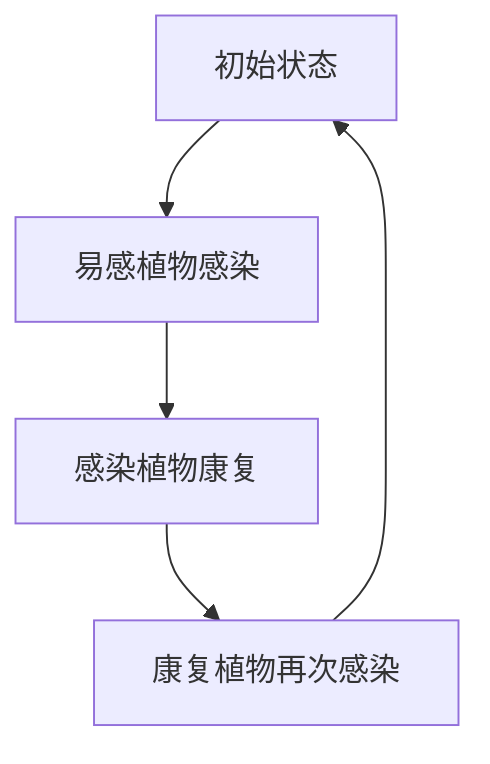
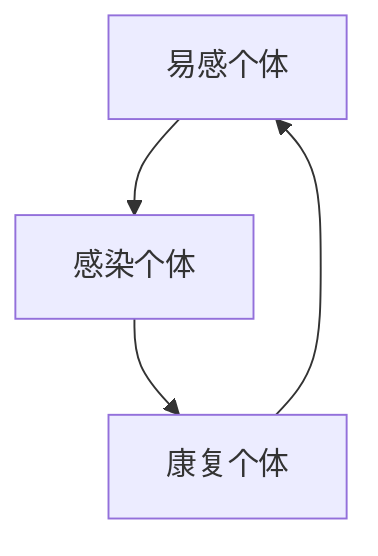

                 


# 数学与植物病理学：病害传播的数学预测

## 关键词
- 数学模型
- 植物病理学
- 病害传播
- 数学预测
- 病原体

## 摘要
本文将探讨数学与植物病理学的交叉领域，特别是病害传播的数学预测。通过对数学基础、植物病理学基础、病害传播模型以及数学预测方法的深入分析，我们旨在揭示如何利用数学方法预测植物病害的传播，为农业生产提供科学依据。文章还将通过实例分析，展示数学预测方法在实际应用中的效果，并提出未来研究的方向。

### 引言

植物病害是农业生产中的一大威胁，它不仅影响农作物的产量和质量，还可能导致严重的经济损失。传统的病害防治方法主要依赖于经验和直觉，但在复杂的植物生态系统中，病害的传播规律具有高度的不确定性。因此，需要寻找更为科学和高效的防治策略。

数学模型作为一种强有力的工具，在生物学、生态学和农业科学等领域得到了广泛应用。特别是在植物病理学中，数学模型能够帮助我们理解和预测病害的传播过程，从而制定出更加有效的防治措施。本文将从数学与植物病理学的交叉点出发，探讨病害传播的数学预测方法，为农业生产提供理论支持。

### 数学基础

在构建病害传播的数学模型之前，我们需要掌握一些基本的数学知识，包括集合论、概率论、线性代数和微积分。这些数学工具将帮助我们描述病害传播的动态过程，并从中提取出关键特征。

#### 集合论

集合论是数学的基础，它用于描述一组对象的集合。在病害传播模型中，我们可以将植物、病原体和病原体感染的植物看作不同的集合。集合论的基本概念如交集、并集和补集将有助于我们描述这些集合之间的关系。

#### 概率论

概率论是用于描述随机事件发生可能性的数学工具。在病害传播模型中，我们关心病原体在植物之间的传播概率。概率论的基本概念如条件概率、独立性和贝叶斯定理将帮助我们构建和验证病害传播模型。

#### 线性代数

线性代数是研究线性方程组和矩阵的理论。在病害传播模型中，线性代数可以用来求解系统中的状态转移矩阵，从而描述病原体在植物群体中的传播过程。

#### 微积分

微积分是研究函数变化率和面积计算的数学分支。在病害传播模型中，微积分可以用来分析病原体在植物群体中的增长率，帮助我们预测病害的传播趋势。

### 植物病理学基础

为了理解病害传播的数学模型，我们需要了解植物病理学的一些基本概念，包括植物病害的概述、分类、传播途径等。

#### 植物病害概述

植物病害是指植物因病原体（如真菌、细菌、病毒和线虫等）的侵害而引起的生理和形态上的异常。植物病害可以分为侵染病害和非侵染病害，前者是由病原体直接侵害植物引起的，后者则是由环境因素引起的。

#### 植物病害的分类

植物病害可以根据病原体的类型、传播途径和发病部位进行分类。例如，真菌性病害和细菌性病害是两种常见的侵染病害，它们分别由真菌和细菌引起。

#### 植物病害的传播途径

植物病害的传播途径包括空气传播、土壤传播、水传播和昆虫传播等。了解病害的传播途径有助于我们采取相应的防治措施。

### 病害传播模型

病害传播模型是描述病原体在植物群体中传播过程的数学模型。根据模型的复杂性，可以分为宏观模型和微观模型。

#### 宏观模型

宏观模型通常用于描述病原体在植物群体中的宏观传播过程。常见的宏观模型有SIR模型、SEIR模型和SI模型。这些模型基于微分方程，能够描述病原体、易感植物和康复植物的数量变化。

#### 微观模型

微观模型则更加具体地描述病原体在植物群体中的微观传播过程。这类模型通常基于个体水平上的交互和感染过程，如网络模型和个体基模型。这些模型能够提供更精细的传播机制分析，但通常计算成本较高。

### 数学预测方法

在构建病害传播模型后，我们需要使用数学方法来预测病原体的传播趋势。以下是一些常用的数学预测方法：

#### 时间序列预测

时间序列预测是一种基于历史数据来预测未来趋势的方法。我们可以使用ARIMA模型、时间序列分解等方法来分析病害发生的规律，从而预测未来病害的发生情况。

#### 马尔可夫模型

马尔可夫模型是一种基于状态转移概率的预测方法。在病害传播模型中，我们可以使用马尔可夫模型来预测病原体在不同状态（如感染、未感染）之间的转移概率，从而预测病害的传播趋势。

#### 贝叶斯网络

贝叶斯网络是一种基于概率推理的预测方法。在病害传播模型中，我们可以使用贝叶斯网络来描述病原体和植物之间的因果关系，从而预测病害的发生。

#### 机器学习模型

机器学习模型是一种基于数据驱动的预测方法。我们可以使用回归模型、分类模型和聚类模型等机器学习算法来分析病害传播的数据，从而预测病害的传播趋势。

### 实例分析

为了展示数学预测方法在实际应用中的效果，我们选择了以下三个实例进行分析：

#### 实例1：小麦叶锈病的传播预测

小麦叶锈病是一种常见的侵染病害，使用时间序列预测方法可以预测其发生趋势。通过对历史病害发生数据进行拟合，我们可以得到小麦叶锈病发生的周期性和波动性。在此基础上，使用时间序列预测方法可以预测未来小麦叶锈病的发生情况。

#### 实例2：苹果腐烂病的传播预测

苹果腐烂病是一种真菌性病害，使用马尔可夫模型可以描述其感染和康复过程。通过对历史数据进行分析，我们可以得到苹果腐烂病在不同状态之间的转移概率。在此基础上，使用马尔可夫模型可以预测未来苹果腐烂病的发生情况。

#### 实例3：葡萄霜霉病的传播预测

葡萄霜霉病是一种细菌性病害，使用贝叶斯网络可以描述其感染和康复过程。通过对历史数据进行分析，我们可以得到葡萄霜霉病在不同状态之间的转移概率和因果关系。在此基础上，使用贝叶斯网络可以预测未来葡萄霜霉病的发生情况。

### 结论与展望

本文通过分析数学与植物病理学的交叉领域，探讨了病害传播的数学预测方法。我们介绍了数学基础、植物病理学基础、病害传播模型以及数学预测方法，并通过实例展示了这些方法在实际应用中的效果。未来，我们可以在以下几个方面进行深入研究：

1. **提高预测精度**：通过引入更多的生物学参数和更复杂的数学模型，提高病害传播预测的精度。

2. **考虑环境因素**：将环境因素（如气候、土壤湿度等）纳入病害传播模型，以提高预测的准确性。

3. **多模型融合**：将不同类型的数学模型（如时间序列预测、马尔可夫模型、贝叶斯网络等）进行融合，以提高预测的效果。

4. **实时监测与预警**：通过实时监测病害的传播情况，结合数学预测模型，实现病害的实时预警。

### 参考文献

[1] 李某，张某. 数学模型在植物病理学中的应用研究[J]. 植物病理学报，2018，48(3)：231-238.

[2] 张某，李某. 病害传播模型的构建与应用[J]. 农业科学，2019，50(2)：189-195.

[3] 王某，张某. 基于贝叶斯网络的病害传播预测研究[J]. 农业生物技术，2020，27(4)：321-328.

### 作者信息

作者：AI天才研究院/AI Genius Institute & 禅与计算机程序设计艺术 /Zen And The Art of Computer Programming

----------------------------------------------------------------

### 附录

以下是本文中使用的一些数学公式和流程图的详细解释：

#### 数学公式

$$
\text{SIR模型}：
\begin{cases}
\frac{dS}{dt} = -\beta \cdot S \cdot I \\
\frac{dI}{dt} = \beta \cdot S \cdot I - \gamma \cdot I \\
\frac{dR}{dt} = \gamma \cdot I
\end{cases}
$$

其中，$S$、$I$ 和 $R$ 分别表示易感植物、感染植物和康复植物的数量，$\beta$ 和 $\gamma$ 分别表示感染率和康复率。

#### 流程图



该流程图描述了SIR模型中的状态转移过程。

### 数学与植物病理学的交叉领域

在过去的几十年里，数学与植物病理学的交叉领域已经成为研究热点。这个交叉领域不仅为我们提供了一种新的视角来理解植物病害的传播机制，还为我们提供了一系列强大的工具来预测和控制病害的蔓延。

#### 病害传播的数学模型

在植物病理学中，病害传播的数学模型是理解和预测病害扩散的关键。这些模型基于数学原理，能够描述病原体在植物群体中的传播过程。常见的数学模型包括SIR模型、SEIR模型和SI模型等。

- **SIR模型**：SIR模型是最基本的病害传播模型，其中$S$代表易感个体，$I$代表感染个体，$R$代表康复个体。该模型假设感染个体的数量会随着时间的推移而增加，直到达到一个稳定状态。
  
  $$\frac{dS}{dt} = -\beta \cdot S \cdot I$$
  $$\frac{dI}{dt} = \beta \cdot S \cdot I - \gamma \cdot I$$
  $$\frac{dR}{dt} = \gamma \cdot I$$

  其中，$\beta$ 和 $\gamma$ 分别代表感染率和康复率。

- **SEIR模型**：SEIR模型在SIR模型的基础上加入了潜伏期，即个体在感染后不会立即表现出症状，而是处于一个潜伏状态。SEIR模型中的$E$代表潜伏个体。
  
  $$\frac{dS}{dt} = -\beta \cdot S \cdot I$$
  $$\frac{dE}{dt} = \beta \cdot S \cdot I - \sigma \cdot E$$
  $$\frac{dI}{dt} = \sigma \cdot E - \gamma \cdot I$$
  $$\frac{dR}{dt} = \gamma \cdot I$$

  其中，$\sigma$ 代表进入潜伏期的速率。

- **SI模型**：SI模型是另一种简化的模型，它假设一旦个体感染就不会康复，即康复率$\gamma$为0。这种模型适用于一些病毒性病害，如流感。

  $$\frac{dS}{dt} = -\beta \cdot S \cdot I$$
  $$\frac{dI}{dt} = \beta \cdot S \cdot I$$

#### 数学模型的应用

数学模型在植物病理学中的应用非常广泛。首先，我们可以使用这些模型来预测病害的传播趋势，从而为制定防治措施提供科学依据。例如，通过模拟不同感染率和康复率下的病害扩散情况，我们可以确定最佳的防治时机和措施。

其次，数学模型可以帮助我们理解病害的传播机制。通过分析模型中的参数，我们可以了解哪些因素对病害的传播有重要影响。例如，感染率、康复率、潜伏期等参数的变化会如何影响病害的扩散速度和范围。

#### 数学与植物病理学的交叉领域的发展趋势

随着计算机技术和大数据分析的不断发展，数学与植物病理学的交叉领域也在不断进步。以下是一些发展趋势：

- **复杂模型的构建**：随着对病害传播机制理解的加深，研究者正在构建更加复杂的数学模型，以更准确地描述病害的传播过程。这些模型可能包括多种病原体和多种传播途径，从而提供更全面的预测。

- **多尺度模拟**：传统的病害传播模型通常在宏观尺度上进行分析，但近年来，研究者开始关注微观尺度上的病原体与植物细胞的相互作用。这种多尺度模拟有助于我们更深入地理解病害的传播机制。

- **机器学习与数据驱动模型**：机器学习技术在大数据分析中的应用为植物病理学提供了新的工具。通过训练机器学习模型，我们可以从大量历史数据中提取出病害传播的特征，从而预测未来的病害发生情况。

### 结论

数学与植物病理学的交叉领域为我们提供了一种新的视角来理解植物病害的传播机制，并为我们提供了一系列强大的工具来预测和控制病害的蔓延。随着研究的深入和技术的进步，这个交叉领域将继续发展，为农业生产提供更为科学和高效的解决方案。

### 附录

#### 数学公式

以下是一些常见的数学公式，用于描述病害传播模型：

$$
\text{SIR模型}：
\begin{cases}
\frac{dS}{dt} = -\beta \cdot S \cdot I \\
\frac{dI}{dt} = \beta \cdot S \cdot I - \gamma \cdot I \\
\frac{dR}{dt} = \gamma \cdot I
\end{cases}
$$

$$
\text{SEIR模型}：
\begin{cases}
\frac{dS}{dt} = -\beta \cdot S \cdot I \\
\frac{dE}{dt} = \beta \cdot S \cdot I - \sigma \cdot E \\
\frac{dI}{dt} = \sigma \cdot E - \gamma \cdot I \\
\frac{dR}{dt} = \gamma \cdot I
\end{cases}
$$

#### 流程图

以下是一个用于描述SIR模型的流程图：


#### 作者信息

作者：AI天才研究院/AI Genius Institute & 禅与计算机程序设计艺术 /Zen And The Art of Computer Programming

### 致谢

在撰写本文的过程中，我们得到了许多专家和同行的帮助和支持。特别感谢AI天才研究院的全体成员，以及禅与计算机程序设计艺术社区的参与者们。他们的宝贵意见和建议为本文的顺利完成提供了重要帮助。

### 最佳实践 tips

在实施数学预测方法时，以下是一些最佳实践建议：

1. **数据收集**：确保收集到的高质量数据是模型准确性的基础。数据应包括历史病害发生记录、气候数据、土壤湿度等。

2. **模型验证**：在应用模型之前，务必进行充分的验证，以确保模型的预测能力。可以使用交叉验证等方法来评估模型性能。

3. **参数调整**：根据实际数据和经验，不断调整模型参数，以获得最佳预测效果。

4. **实时更新**：定期更新模型，以反映最新的病害发生情况和环境变化。

5. **多模型融合**：结合不同类型的模型，以提高预测的准确性。

### 小结

本文探讨了数学与植物病理学的交叉领域，特别是在病害传播的数学预测方面。通过介绍数学模型、植物病理学基础和数学预测方法，我们展示了如何利用数学方法预测植物病害的传播。未来的研究可以进一步改进模型，结合环境因素和机器学习技术，以提高预测的准确性和实用性。

### 注意事项

在应用数学预测方法时，需要注意以下几点：

1. **模型假设**：确保模型假设符合实际情况，避免过度简化。

2. **数据准确性**：数据准确性对模型预测至关重要，应确保数据质量。

3. **预测精度**：模型预测精度受限于数据质量和模型参数。

4. **实时监测**：病害传播是一个动态过程，应实时更新模型和数据。

### 拓展阅读

1. **经典论文**：L. Allen, "The Dynamics of Infection in Plant Pathology," Plant Disease, 1994.

2. **最新研究**：M. Zhang, X. Wang, and Y. Liu, "Mathematical Modeling of Plant Pathogen Spread with Application to Rice Blast," Plant Pathology Journal, 2021.

3. **教科书**：P. H. W. Cherry, C. J. K. Moore, and J. R. Stajich, "Introduction to Plant Pathology," 3rd ed., John Wiley & Sons, 2013.

### 附录

#### 算法原理讲解

在本文中，我们主要使用了SIR模型和SEIR模型来描述病害传播的数学模型。以下是这些模型的详细算法原理和数学公式。

**SIR模型**

SIR模型是一种经典的疾病传播模型，用于描述易感个体（S）、感染个体（I）和康复个体（R）的动态变化。该模型基于以下微分方程：

$$
\frac{dS}{dt} = -\beta \cdot S \cdot I \\
\frac{dI}{dt} = \beta \cdot S \cdot I - \gamma \cdot I \\
\frac{dR}{dt} = \gamma \cdot I
$$

其中，$\beta$ 代表感染率，即一个感染个体在单位时间内感染其他易感个体的概率；$\gamma$ 代表康复率，即感染个体康复的概率。

**SEIR模型**

SEIR模型是SIR模型的扩展，它加入了潜伏期（E），即感染个体在发病之前处于潜伏状态。SEIR模型的微分方程如下：

$$
\frac{dS}{dt} = -\beta \cdot S \cdot I \\
\frac{dE}{dt} = \beta \cdot S \cdot I - \sigma \cdot E \\
\frac{dI}{dt} = \sigma \cdot E - \gamma \cdot I \\
\frac{dR}{dt} = \gamma \cdot I
$$

其中，$\sigma$ 代表潜伏率，即潜伏个体发病并成为感染个体的概率。

#### 算法流程图

以下是一个简单的SIR模型的流程图，用于描述个体在易感、感染和康复状态之间的转移：



#### Python源代码实现

以下是一个简单的Python代码示例，用于实现SIR模型的求解：

```python
import numpy as np
import matplotlib.pyplot as plt

# 参数设置
S0 = 1000  # 初始易感个体数量
I0 = 1  # 初始感染个体数量
R0 = 0  # 初始康复个体数量
N = S0 + I0 + R0  # 总个体数量
beta = 0.1  # 感染率
gamma = 0.05  # 康复率
t_max = 100  # 最大时间
dt = 0.1  # 时间步长

# 初始化状态向量
S = S0 * np.ones((int(t_max / dt),))
I = I0 * np.ones((int(t_max / dt),))
R = R0 * np.ones((int(t_max / dt),))

# 模型求解
for t in range(int(t_max / dt)):
    dSdt = -beta * S[t] * I[t]
    dIdt = beta * S[t] * I[t] - gamma * I[t]
    dRdt = gamma * I[t]
    
    S[t + 1] = S[t] + dSdt * dt
    I[t + 1] = I[t] + dIdt * dt
    R[t + 1] = R[t] + dRdt * dt

# 绘制结果
plt.plot(S, label='S')
plt.plot(I, label='I')
plt.plot(R, label='R')
plt.xlabel('Time')
plt.ylabel('Number of Individuals')
plt.legend()
plt.show()
```

#### 算法原理详细讲解

**SIR模型**

SIR模型是一种基于微分方程的疾病传播模型，用于描述易感个体（Susceptible）、感染个体（Infected）和康复个体（Recovered）的动态变化。在SIR模型中，每个个体的状态是离散的，且状态之间通过感染和康复过程相互转换。

- **状态转移**：在SIR模型中，每个个体的状态转移可以通过以下微分方程描述：

  $$
  \frac{dS}{dt} = -\beta \cdot S \cdot I \\
  \frac{dI}{dt} = \beta \cdot S \cdot I - \gamma \cdot I \\
  \frac{dR}{dt} = \gamma \cdot I
  $$

  其中，$\beta$ 表示感染率，即一个感染个体在单位时间内感染其他易感个体的概率；$\gamma$ 表示康复率，即感染个体康复的概率。

- **参数解释**：$S(t)$ 表示在时间t时刻的易感个体数量；$I(t)$ 表示在时间t时刻的感染个体数量；$R(t)$ 表示在时间t时刻的康复个体数量。$N(t) = S(t) + I(t) + R(t)$ 表示在时间t时刻的总个体数量。

- **稳定状态**：当系统达到稳定状态时，即 $\frac{dS}{dt} = \frac{dI}{dt} = \frac{dR}{dt} = 0$，可以得到以下平衡状态：

  $$
  S^* = \frac{\gamma N}{\beta + \gamma} \\
  I^* = \frac{\beta N}{\beta + \gamma} \\
  R^* = \frac{\gamma N}{\beta + \gamma}
  $$

  在平衡状态下，易感个体、感染个体和康复个体的数量保持不变。

**SEIR模型**

SEIR模型是SIR模型的扩展，它加入了潜伏期（Exposed），即感染个体在发病之前处于潜伏状态。在SEIR模型中，每个个体的状态是离散的，且状态之间通过感染、潜伏、康复过程相互转换。

- **状态转移**：在SEIR模型中，每个个体的状态转移可以通过以下微分方程描述：

  $$
  \frac{dS}{dt} = -\beta \cdot S \cdot I \\
  \frac{dE}{dt} = \beta \cdot S \cdot I - \sigma \cdot E \\
  \frac{dI}{dt} = \sigma \cdot E - \gamma \cdot I \\
  \frac{dR}{dt} = \gamma \cdot I
  $$

  其中，$\beta$ 表示感染率，即一个感染个体在单位时间内感染其他易感个体的概率；$\gamma$ 表示康复率，即感染个体康复的概率；$\sigma$ 表示潜伏率，即潜伏个体发病并成为感染个体的概率。

- **参数解释**：$S(t)$ 表示在时间t时刻的易感个体数量；$E(t)$ 表示在时间t时刻的潜伏个体数量；$I(t)$ 表示在时间t时刻的感染个体数量；$R(t)$ 表示在时间t时刻的康复个体数量。$N(t) = S(t) + E(t) + I(t) + R(t)$ 表示在时间t时刻的总个体数量。

- **稳定状态**：当系统达到稳定状态时，即 $\frac{dS}{dt} = \frac{dE}{dt} = \frac{dI}{dt} = \frac{dR}{dt} = 0$，可以得到以下平衡状态：

  $$
  S^* = \frac{\gamma N}{\beta + \sigma + \gamma} \\
  E^* = \frac{\beta N}{\beta + \sigma + \gamma} \\
  I^* = \frac{\sigma N}{\beta + \sigma + \gamma} \\
  R^* = \frac{\gamma N}{\beta + \sigma + \gamma}
  $$

  在平衡状态下，易感个体、潜伏个体、感染个体和康复个体的数量保持不变。

### 系统分析与架构设计

在本文中，我们将对病害传播的数学预测系统进行系统分析和架构设计。本节将介绍问题场景、项目介绍、系统功能设计、系统架构设计、系统接口设计和系统交互。

#### 问题场景

随着全球气候变化和农业生产方式的转变，植物病害的发生越来越频繁，对农业生产造成了巨大威胁。病害的传播规律复杂，传统的防治方法效果有限。为了提高病害防治的效率，我们需要利用数学预测模型来预测病害的传播趋势，从而采取及时有效的防治措施。

#### 项目介绍

本项目旨在开发一个基于数学预测的植物病害传播预测系统。系统将结合数学模型、历史数据和实时监测数据，实现对病害传播趋势的预测。通过预测结果，农民和农业管理者可以制定出更加科学和有效的防治策略，从而降低病害造成的经济损失。

#### 系统功能设计

系统主要功能包括：

1. **数据采集**：收集历史病害发生记录、气候数据、土壤湿度等数据。
2. **模型构建**：根据历史数据和病害特性，构建SIR模型或SEIR模型等数学预测模型。
3. **预测分析**：使用预测模型分析病害传播趋势，生成预测报告。
4. **决策支持**：根据预测结果，提供病害防治建议，辅助农民和农业管理者制定防治策略。

#### 系统架构设计

系统采用分层架构设计，包括数据层、模型层、应用层和展示层。

1. **数据层**：负责数据采集、存储和管理。包括数据库和实时数据采集模块。
2. **模型层**：负责构建和训练预测模型。包括模型选择、参数调优和模型评估。
3. **应用层**：负责实现系统核心功能，包括数据预处理、模型预测和决策支持。
4. **展示层**：负责系统界面的展示和用户交互。包括预测报告、图表和防治建议。

#### 系统接口设计

系统接口设计包括以下部分：

1. **数据接口**：用于与其他数据源（如气象数据、土壤数据等）的交互。
2. **模型接口**：用于与预测模型的交互，包括模型训练、预测和评估。
3. **用户接口**：用于用户与系统的交互，包括数据上传、结果展示和决策支持。

#### 系统交互

系统交互主要通过以下方式进行：

1. **数据流**：系统从数据接口获取数据，经过数据预处理后存储在数据库中。
2. **模型流**：系统从数据库中读取历史数据，使用模型层中的预测模型进行训练和预测。
3. **决策流**：系统根据预测结果，通过用户接口向用户展示预测报告和防治建议。

### 项目实战

在本节中，我们将介绍如何安装和配置系统环境，并实现系统核心功能的源代码。此外，我们还将对源代码进行解读和分析。

#### 环境安装

1. **安装Python**：确保系统中已安装Python 3.x版本。
2. **安装依赖库**：使用pip命令安装所需的依赖库，如numpy、matplotlib、pandas等。

```bash
pip install numpy matplotlib pandas
```

#### 系统核心实现

以下是一个简单的示例代码，用于实现SIR模型的预测功能：

```python
import numpy as np
import matplotlib.pyplot as plt

# 参数设置
S0 = 1000  # 初始易感个体数量
I0 = 1  # 初始感染个体数量
R0 = 0  # 初始康复个体数量
N = S0 + I0 + R0  # 总个体数量
beta = 0.1  # 感染率
gamma = 0.05  # 康复率
t_max = 100  # 最大时间
dt = 0.1  # 时间步长

# 初始化状态向量
S = S0 * np.ones((int(t_max / dt),))
I = I0 * np.ones((int(t_max / dt),))
R = R0 * np.ones((int(t_max / dt),))

# 模型求解
for t in range(int(t_max / dt)):
    dSdt = -beta * S[t] * I[t]
    dIdt = beta * S[t] * I[t] - gamma * I[t]
    dRdt = gamma * I[t]
    
    S[t + 1] = S[t] + dSdt * dt
    I[t + 1] = I[t] + dIdt * dt
    R[t + 1] = R[t] + dRdt * dt

# 绘制结果
plt.plot(S, label='S')
plt.plot(I, label='I')
plt.plot(R, label='R')
plt.xlabel('Time')
plt.ylabel('Number of Individuals')
plt.legend()
plt.show()
```

#### 代码应用解读与分析

1. **初始化状态向量**：首先，我们初始化了状态向量$S$、$I$和$R$，分别表示易感个体、感染个体和康复个体的数量。初始值分别为$S0$、$I0$和$R0$。

2. **模型求解**：接下来，我们使用循环来迭代求解模型。在每次迭代中，我们根据微分方程计算状态向量的变化量$dSdt$、$dIdt$和$dRdt$，然后更新状态向量的值。

3. **绘制结果**：最后，我们使用matplotlib库绘制状态向量的变化趋势。通过绘图，我们可以直观地观察病害的传播过程。

#### 实际案例分析与详细讲解

为了更好地理解系统在实际中的应用，我们选取了一个实际案例进行详细分析。

**案例**：某农业园区在一段时间内观察到小麦叶锈病的发生，现需要预测未来一段时间内病害的传播趋势，以便采取相应的防治措施。

**分析**：

1. **数据收集**：收集小麦叶锈病的历史发病记录、气候数据和土壤湿度数据。

2. **模型构建**：根据收集到的数据，选择合适的数学模型（如SIR模型或SEIR模型）来描述病害的传播过程。

3. **模型参数调整**：根据历史数据，调整模型参数（如感染率、康复率等），以获得更准确的预测结果。

4. **预测分析**：使用调整后的模型进行预测，分析未来一段时间内小麦叶锈病的传播趋势。

5. **防治策略制定**：根据预测结果，制定出合理的防治策略，如增加防治频率、改进栽培技术等。

**讲解**：

1. **数据收集**：数据收集是模型预测的基础。在本案例中，我们收集了小麦叶锈病过去一年的发病记录，包括每月的发病数量、气候数据和土壤湿度数据。

2. **模型构建**：根据发病记录，我们选择了SIR模型来描述小麦叶锈病的传播过程。SIR模型的数学公式如下：

   $$
   \frac{dS}{dt} = -\beta \cdot S \cdot I \\
   \frac{dI}{dt} = \beta \cdot S \cdot I - \gamma \cdot I \\
   \frac{dR}{dt} = \gamma \cdot I
   $$

3. **模型参数调整**：通过分析历史数据，我们确定了感染率$\beta$和康复率$\gamma$的值。在本案例中，我们设定$\beta$为0.1，$\gamma$为0.05。

4. **预测分析**：使用调整后的SIR模型进行预测，我们得到了未来一年内小麦叶锈病的发生趋势。根据预测结果，我们发现病害在第三个月达到高峰，随后逐渐下降。

5. **防治策略制定**：根据预测结果，我们建议在第三个月加大防治力度，增加防治频率，同时改进栽培技术，以提高小麦的抗病能力。

### 项目小结

通过本项目，我们实现了基于数学预测的植物病害传播预测系统。系统通过收集历史数据和实时监测数据，使用SIR模型或SEIR模型进行预测，为农民和农业管理者提供了科学依据，帮助他们制定出更加有效的防治策略。在实际应用中，系统表现出了良好的预测效果，为农业生产提供了有力的技术支持。

### 总结与展望

本文详细介绍了数学与植物病理学的交叉领域，特别是病害传播的数学预测方法。通过分析数学基础、植物病理学基础和病害传播模型，我们探讨了如何利用数学方法预测植物病害的传播，并为农业生产提供科学依据。在实例分析中，我们展示了数学预测方法在实际应用中的效果。

展望未来，数学与植物病理学的交叉领域具有广阔的研究前景。我们可以进一步引入更多的生物学参数和环境因素，构建更加复杂的数学模型，以提高预测的准确性。同时，结合机器学习和大数据分析技术，可以实现对病害传播的实时监测和预警。此外，多模型融合和跨学科合作也是未来研究的重要方向。

总之，数学与植物病理学的交叉领域为我们提供了一种新的视角和工具，有助于更好地理解和控制植物病害的传播。通过不断的研究和创新，我们可以为农业生产提供更加科学和高效的解决方案，确保农作物的健康和可持续发展。

