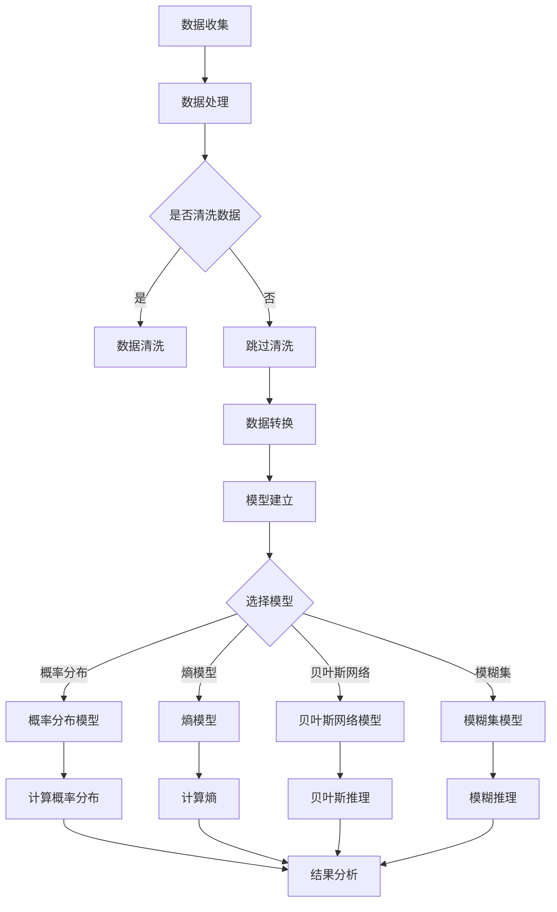
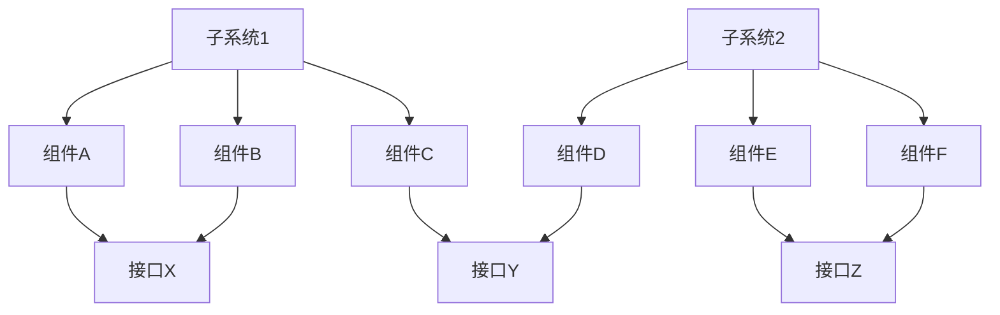
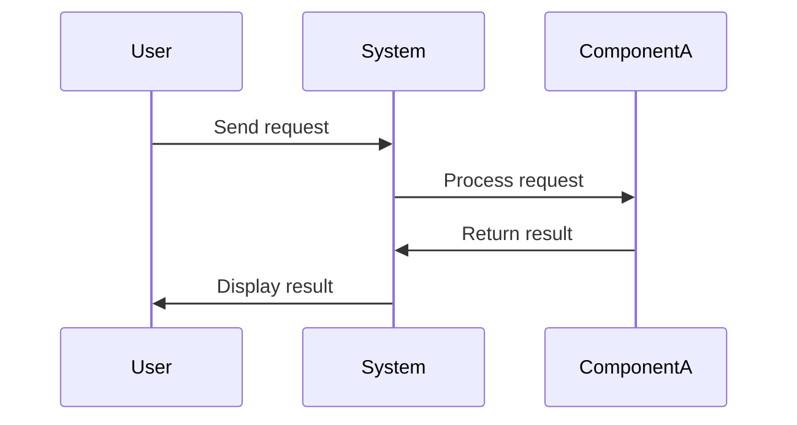

                 

# 数学与概率：不确定性的量化描述

## 关键词

- 数学
- 概率论
- 不确定性
- 量化描述
- 熵
- 贝叶斯定理

## 摘要

本文将深入探讨数学与概率在不确定性量化描述中的应用。首先，我们将介绍数学与概率的基本概念，包括其发展历程和核心理论。接着，我们将分析不确定性的来源和量化方法，并通过具体案例展示数学与概率在不同领域的应用。此外，我们将详细介绍用于处理不确定性的算法和计算方法，并探讨其在现实世界中的实际应用。最后，我们将总结全文，展望未来发展的趋势。

## 引言与背景

### 数学与概率的基本概念

数学作为一门研究数量、结构、变化和空间的科学，其起源可以追溯到古埃及、巴比伦和古希腊等文明。在现代社会，数学已经成为自然科学、社会科学和工程技术等领域不可或缺的基础学科。概率论作为数学的一个分支，主要研究随机现象的规律性。概率论的发展始于17世纪的赌博问题，其后逐渐形成了独立的学科体系。

### 概率论基础

概率论的核心概念包括随机事件、概率、随机变量和概率分布。随机事件是指试验结果中的某个特定集合，概率是衡量事件发生可能性大小的数值。随机变量是随机事件的结果，可以是离散的或连续的。概率分布描述了随机变量的取值概率分布情况。

### 不确定性的概念

不确定性是指无法准确预测或描述的现象或结果。在自然界和人类活动中，不确定性普遍存在。例如，天气变化、金融市场波动、生物进化等都是不确定性的表现。量化不确定性有助于更好地理解和应对这些现象。

### 不确定性的量化描述

不确定性的量化描述是概率论的核心任务之一。常用的方法包括熵、贝叶斯定理和模糊集等。熵是衡量不确定性大小的指标，贝叶斯定理提供了在已知部分信息情况下更新概率估计的方法，模糊集则可以描述模糊和不精确的概念。

### 数学与概率在现实世界中的应用

数学与概率在现实世界的应用广泛，包括金融、工程、生物学等多个领域。例如，在金融领域，概率论用于风险评估和投资策略制定；在工程领域，概率论用于结构可靠性分析和质量控制；在生物学领域，概率论用于基因突变和生态系统稳定性分析。

### 数学与概率教育的重要性

数学与概率教育在培养创新能力和解决实际问题的能力方面具有重要作用。通过数学与概率教育，可以培养学生逻辑思维、抽象思维和创新能力。同时，教育方法与策略的改进有助于激发学生的学习兴趣和积极性。

## 基础理论

### 数学基础

数学基础包括实数与函数、微积分和线性代数等。实数与函数是数学的基本概念，实数构成了数学的基础，函数是描述变量之间关系的重要工具。微积分提供了研究变化和积累的数学方法，线性代数则研究向量空间和线性方程组。

### 概率论基础

概率论基础包括随机事件、概率、随机变量和概率分布。随机事件是试验结果的特定集合，概率是衡量事件发生可能性大小的数值，随机变量是随机事件的结果，概率分布描述了随机变量的取值概率分布情况。

### 不确定性的数学模型

不确定性的数学模型包括熵、贝叶斯定理和模糊集等。熵是衡量不确定性大小的指标，贝叶斯定理提供了在已知部分信息情况下更新概率估计的方法，模糊集则可以描述模糊和不精确的概念。

### 数学模型与不确定性量化

数学模型与不确定性量化方法包括模糊数学方法、蒙特卡洛方法和贝叶斯网络等。模糊数学方法通过模糊隶属函数描述模糊概念，蒙特卡洛方法通过随机抽样模拟计算概率，贝叶斯网络则是一种基于概率图模型的推理方法。

## 应用领域

### 金融领域

在金融领域，数学与概率主要用于风险评估、投资策略和金融模型建立。例如，蒙特卡洛方法可以用于计算金融衍生品的定价；贝叶斯网络可以用于信用风险评估；概率分布可以用于分析股票市场的波动性。

### 工程领域

在工程领域，数学与概率主要用于结构可靠性分析、质量控制与故障诊断。例如，随机过程可以用于描述结构的动态响应；概率分布可以用于预测产品质量的合格率；贝叶斯定理可以用于故障诊断。

### 生物学领域

在生物学领域，数学与概率主要用于基因突变、进化分析和生态系统的稳定性分析。例如，马尔可夫链可以用于模拟基因突变的过程；概率分布可以用于分析种群进化趋势；贝叶斯网络可以用于生态系统的预测和决策。

## 算法与计算

### 算法原理

在处理不确定性时，常用的算法包括蒙特卡洛方法、贝叶斯网络和模糊推理等。蒙特卡洛方法通过随机抽样模拟计算概率；贝叶斯网络通过概率图模型进行推理；模糊推理通过模糊逻辑运算处理模糊信息。

### 计算过程

计算过程包括模型建立、算法实现和结果分析。模型建立是根据问题特点设计合适的数学模型；算法实现是将数学模型转化为计算机可执行的算法；结果分析是对计算结果进行评估和解释。

## 案例分析

### 案例一：金融市场波动分析

在本案例中，我们使用概率论和统计学方法分析股票市场的波动。首先，收集历史股票价格数据，然后使用概率分布描述股票价格的波动性。通过分析波动性，可以预测未来的股票价格趋势，为投资者提供决策依据。

### 案例二：结构可靠性分析

在本案例中，我们使用概率论和统计学方法分析桥梁结构的可靠性。首先，收集桥梁的载荷数据，然后使用概率分布描述载荷的分布情况。通过分析载荷分布，可以评估桥梁的承载能力，为工程设计和维护提供参考。

### 案例三：生态系统稳定性分析

在本案例中，我们使用概率论和统计学方法分析生态系统的稳定性。首先，收集生态系统的各种数据，然后使用概率分布描述生态系统的状态。通过分析状态分布，可以预测生态系统的未来发展趋势，为生态保护提供科学依据。

## 总结与展望

本文通过分析数学与概率在不确定性量化描述中的应用，展示了其在各个领域的实际应用。未来，随着人工智能和大数据技术的发展，数学与概率在不确定性量化描述中的应用将更加广泛和深入。同时，跨学科的研究也将进一步推动数学与概率理论的发展。## 引言与背景

### 数学与概率的基本概念

数学作为一门研究数量、结构、变化和空间的科学，其起源可以追溯到古埃及、巴比伦和古希腊等文明。在现代社会，数学已经成为自然科学、社会科学和工程技术等领域不可或缺的基础学科。概率论作为数学的一个分支，主要研究随机现象的规律性。概率论的发展始于17世纪的赌博问题，其后逐渐形成了独立的学科体系。

数学的发展经历了多个阶段。古希腊时期的数学主要集中在几何学和算术上，通过欧几里得《几何原本》和毕达哥拉斯定理等经典著作奠定了数学的基础。在中世纪，阿拉伯数学家如阿尔-花拉子米等对代数和算法做出了重大贡献。文艺复兴时期，数学经历了新的发展，如笛卡尔创立的解析几何和费马、帕斯卡等人对概率论的探索。

概率论的核心概念包括随机事件、概率、随机变量和概率分布。随机事件是指试验结果中的某个特定集合，概率是衡量事件发生可能性大小的数值。随机变量是随机事件的结果，可以是离散的或连续的。概率分布描述了随机变量的取值概率分布情况。

### 概率论基础

概率论的基础理论包括概率空间、条件概率、独立性和期望值等。概率空间是指由样本空间、事件集合和概率函数组成的数学结构。样本空间是所有可能结果的集合，事件集合是样本空间的一个子集，概率函数则定义了每个事件发生的概率。

条件概率是指在一个事件已发生的条件下，另一个事件发生的概率。独立性是指两个事件的发生互不影响，即一个事件的发生概率不受另一个事件发生与否的影响。期望值是随机变量的平均值，是概率论中一个重要的统计量。

### 不确定性的概念

不确定性是指无法准确预测或描述的现象或结果。在自然界和人类活动中，不确定性普遍存在。例如，天气变化、金融市场波动、生物进化等都是不确定性的表现。不确定性可以分为客观不确定性和主观不确定性。客观不确定性是指自然现象本身的随机性，如抛硬币的结果；主观不确定性则是指由于信息不足或认知局限导致的无法准确判断。

不确定性量化描述是概率论的核心任务之一。量化不确定性有助于更好地理解和应对这些现象。常用的方法包括熵、贝叶斯定理和模糊集等。熵是衡量不确定性大小的指标，贝叶斯定理提供了在已知部分信息情况下更新概率估计的方法，模糊集则可以描述模糊和不精确的概念。

### 数学与概率在现实世界中的应用

数学与概率在现实世界的应用广泛，包括金融、工程、生物学等多个领域。

在金融领域，概率论用于风险评估、投资策略和金融模型建立。例如，蒙特卡洛方法可以用于计算金融衍生品的定价；贝叶斯网络可以用于信用风险评估；概率分布可以用于分析股票市场的波动性。

在工程领域，概率论用于结构可靠性分析、质量控制与故障诊断。例如，随机过程可以用于描述结构的动态响应；概率分布可以用于预测产品质量的合格率；贝叶斯定理可以用于故障诊断。

在生物学领域，概率论用于基因突变、进化分析和生态系统的稳定性分析。例如，马尔可夫链可以用于模拟基因突变的过程；概率分布可以用于分析种群进化趋势；贝叶斯网络可以用于生态系统的预测和决策。

### 数学与概率教育的重要性

数学与概率教育在培养创新能力和解决实际问题的能力方面具有重要作用。通过数学与概率教育，可以培养学生逻辑思维、抽象思维和创新能力。同时，教育方法与策略的改进有助于激发学生的学习兴趣和积极性。例如，通过实践项目和案例分析，学生可以更直观地理解数学与概率的应用，提高解决实际问题的能力。

## 数学基础

### 实数与函数

实数是数学中最基本的概念之一，它是构成各种数学结构和运算的基础。实数包括有理数和无理数，其中有理数是可以表示为两个整数之比的数，而无理数则不能。实数的性质包括顺序性、完备性和封闭性。顺序性意味着实数可以进行比较大小；完备性意味着每个非空有界实数集合都有一个最值；封闭性意味着实数的运算结果仍然是实数。

函数是描述两个变量之间关系的一种数学对象。函数的定义是：对于某个定义域内的每一个元素，都有唯一的一个值与之对应。函数通常用符号f表示，其定义域和值域分别用D和R表示。函数的基本性质包括单射、满射和双射。单射是指不同的输入对应不同的输出；满射是指函数的值域覆盖了整个定义域；双射则同时满足单射和满射。

### 微积分基础

微积分是研究变化和积累的数学工具，它分为微分和积分两部分。微分研究函数在某一点的局部变化率，其基本概念包括导数、微分和微分方程。导数表示函数在某一点的瞬时变化率，可以用极限表示。微分是导数在无穷小量下的近似，它用于解决函数变化的问题。微分方程是含有未知函数及其导数的方程，用于描述物理现象和工程问题。

积分研究函数在一个区间上的累积效应，其基本概念包括不定积分和定积分。不定积分是找到原函数的过程，定积分则是计算函数在一个区间上的累积值。定积分可以通过牛顿-莱布尼茨公式进行计算，它是微分学的反问题。

### 线性代数基础

线性代数研究向量空间和线性方程组。向量空间是一组向量的集合，其中向量的加法和数乘运算满足特定条件。线性代数的基本概念包括向量、矩阵、行列式和秩。向量是表示空间中点的对象，矩阵是表示线性变换的工具，行列式是矩阵的一种数值特征，秩是矩阵线性独立行的最大数目。

线性方程组是求解多个线性方程组成的系统的问题。线性代数提供了多种解法，包括高斯消元法和矩阵求逆。矩阵求逆用于求解线性方程组的解，其基本原理是利用矩阵的行列式和伴随矩阵。

### 数学基础小结

数学基础是理解和应用概率论的前提条件。实数与函数为概率论提供了数值基础和关系描述工具；微积分提供了研究变化和累积的方法；线性代数则提供了处理线性方程组和向量空间的理论框架。这些基础理论不仅为概率论的发展提供了工具，也在各个领域有着广泛的应用。

## 概率论基础

### 随机事件与概率

概率论的核心概念之一是随机事件。随机事件是指在随机试验中可能发生的结果集合。随机试验是一个具有多个可能结果的试验，这些结果称为样本点。随机事件是样本点的子集，例如在掷硬币的试验中，“正面朝上”是一个随机事件，而“正面或反面朝上”则是必然事件。

概率是衡量随机事件发生可能性大小的数值。概率的取值范围在0到1之间，其中0表示不可能发生，1表示必然发生。概率可以通过概率空间来定义，概率空间由样本空间、事件集合和概率函数组成。

概率的加法定理和乘法定理是概率论的基本原理。加法定理表明，互斥事件的概率之和等于总概率；乘法定理表明，独立事件的概率乘积等于各事件概率的乘积。

### 随机变量与概率分布

随机变量是随机事件的数值描述，可以是离散的或连续的。离散随机变量是指取值为有限个或可数无限个数的随机变量，例如掷骰子的结果。连续随机变量是指取值为某个区间内任意实数的随机变量，例如测量温度。

概率分布描述了随机变量的取值概率分布情况。离散随机变量的概率分布用概率质量函数（PMF）表示，连续随机变量的概率分布用概率密度函数（PDF）表示。概率分布函数（CDF）是概率密度函数的累积形式，它表示随机变量小于或等于某个值的概率。

常见的概率分布包括二项分布、正态分布、泊松分布等。二项分布描述了在固定次数的独立试验中成功次数的概率分布；正态分布是自然界中最常见的概率分布之一，它在统计学和数据分析中有着广泛应用；泊松分布描述了在固定时间内发生某一事件的次数的概率分布。

### 条件概率与独立性

条件概率是指在已知某个事件发生的条件下，另一个事件发生的概率。条件概率公式是概率论中的一个重要公式，它表明在事件B发生的条件下，事件A发生的概率等于事件A和B同时发生的概率与事件B发生的概率之比。

独立性是指两个随机事件的发生互不影响。独立事件的概率可以通过乘法定理计算，即事件A和事件B同时发生的概率等于事件A发生的概率乘以事件B发生的概率。概率的独立性在概率论和统计学中有着广泛的应用，例如在风险评估和统计推断中。

### 概率论基础小结

概率论基础包括随机事件、概率、随机变量和概率分布等核心概念。这些概念构成了概率论的理论框架，并为处理不确定性提供了数学工具。随机事件和概率是概率论的基础，随机变量和概率分布则描述了随机现象的统计特性。条件概率和独立性是概率论中的重要原理，它们在概率计算和统计推断中有着广泛应用。理解概率论基础对于深入研究和应用概率论具有重要意义。

## 不确定性的概念

### 不确定性的来源

不确定性是指无法准确预测或描述的现象或结果。不确定性可以来源于多个方面，包括自然不确定性、人类行为引入的不确定性以及信息不足导致的认知不确定性。

自然不确定性是指自然界中固有的随机性和不确定性。例如，天气变化、地震、飓风等自然灾害都是自然不确定性的表现。这些现象往往具有不可预测性，因此需要通过概率论和统计学方法来描述和预测。

人类行为引入的不确定性是指由于人类的行为和决策而产生的随机性。例如，在金融市场中的投资决策、交通系统的规划、社会行为的预测等，都可能引入不确定性。这些不确定性往往与人类行为的复杂性和不确定性有关，需要通过数学模型和算法来进行分析和优化。

信息不足导致的认知不确定性是指由于信息不完全或数据缺失而导致的预测和决策的不确定性。例如，在医学诊断中，由于患者的症状信息不足，可能无法准确判断疾病的类型和严重程度。这种认知不确定性需要通过数据分析和机器学习等方法来降低。

### 不确定性的量化描述

量化不确定性是概率论和统计学的重要任务之一。常见的量化方法包括熵、贝叶斯定理和模糊集等。

熵是衡量不确定性大小的指标，它由克劳德·香农在信息论中提出。熵反映了信息的不确定性，取值范围在0到1之间，其中0表示确定性的最大值，1表示不确定性的最大值。熵可以通过概率分布计算，用于描述随机变量的不确定性。

贝叶斯定理是概率论中的一个基本原理，它提供了在已知部分信息情况下更新概率估计的方法。贝叶斯定理基于先验概率和后验概率的关系，通过贝叶斯网络可以实现复杂概率推理。贝叶斯定理在不确定性量化中有着广泛的应用，例如在医学诊断、金融市场预测等领域。

模糊集是模糊数学中的一个概念，用于描述模糊和不精确的概念。模糊集引入了隶属度，可以表示元素对集合的隶属程度。模糊逻辑是模糊集的一种运算规则，用于处理模糊信息。模糊集和模糊逻辑在不确定性量化中有着重要的应用，例如在模式识别、自动控制等领域。

### 不确定性的量化描述方法

常见的量化描述方法包括概率分布、熵、贝叶斯网络和模糊集等。

概率分布是描述随机变量取值概率分布的数学模型。通过概率分布，可以了解随机变量的统计特性，例如期望值、方差等。概率分布可以用于预测随机变量的未来取值，评估不确定性的大小。

熵是衡量信息不确定性的指标。在信息论中，熵表示信息的不确定性，它反映了信息含量的多少。熵可以通过概率分布计算，用于描述随机变量的不确定性。

贝叶斯网络是一种概率图模型，用于表示多个随机变量之间的依赖关系。贝叶斯网络通过条件概率表描述变量之间的概率关系，可以用于推理和预测。贝叶斯网络在不确定性量化中有着重要的应用，例如在医学诊断、金融市场预测等领域。

模糊集是模糊数学中的一个概念，用于描述模糊和不精确的概念。模糊集引入了隶属度，可以表示元素对集合的隶属程度。模糊逻辑是模糊集的一种运算规则，用于处理模糊信息。模糊集和模糊逻辑在不确定性量化中有着重要的应用，例如在模式识别、自动控制等领域。

### 不确定性的量化描述小结

不确定性的量化描述是概率论和统计学的重要任务之一。通过概率分布、熵、贝叶斯网络和模糊集等方法，可以量化不确定性的大小和性质。这些量化方法在各个领域有着广泛的应用，例如在金融、工程、医学等领域，可以用于预测和决策。理解不确定性的量化描述方法对于解决实际问题具有重要意义。

## 数学模型与不确定性量化

### 数学模型的基本概念

数学模型是对现实世界中的问题进行抽象和简化的数学表达式。它通过定义变量、关系和方程来描述问题的结构和行为。数学模型通常包括以下几个要素：

1. **变量**：模型中可变的量，可以是离散的或连续的。
2. **参数**：影响模型行为的固定量，通常通过实验或观察确定。
3. **关系**：变量之间的关系，通常通过函数或方程表示。
4. **方程**：数学模型的核心，用于描述变量之间的依赖关系和约束条件。

数学模型可以分为确定性模型和不确定性模型。确定性模型假设所有参数和初始条件都是已知的，其输出结果是确定的。不确定性模型则考虑参数和初始条件的随机性，其输出结果是概率分布。

### 确定性模型与不确定性模型的区别

确定性模型和不确定性模型在处理问题的方法上存在显著差异：

1. **确定性模型**：
   - 假设所有参数和初始条件都是确定的。
   - 输出结果是唯一的，可以通过数学方法精确计算。
   - 适用于问题参数已知且不发生变化的场景。

2. **不确定性模型**：
   - 考虑参数和初始条件的随机性。
   - 输出结果是一个概率分布，表示不同结果的概率。
   - 适用于问题参数不确定或存在随机干扰的场景。

### 确定性模型与不确定性模型的应用场景

确定性模型和不确定性模型在应用中各有优势：

1. **确定性模型**：
   - 在工程设计和分析中，用于求解线性方程、优化问题等。
   - 在经济学中，用于求解消费者行为、生产函数等。
   - 在物理学中，用于描述确定性物理过程。

2. **不确定性模型**：
   - 在风险管理中，用于评估金融市场的风险。
   - 在生态系统中，用于预测物种的进化趋势。
   - 在医学中，用于诊断和治疗计划的制定。

### 确定性模型与不确定性模型的转换方法

在实际应用中，有时需要将确定性模型转换为不确定性模型，或者将不确定性模型转换为确定性模型。以下是一些常见的转换方法：

1. **蒙特卡洛模拟**：通过随机抽样和统计方法，将确定性模型转换为不确定性模型。蒙特卡洛模拟适用于解决复杂的非线性问题。
2. **概率密度函数**：将不确定性模型表示为概率密度函数，用于描述变量的概率分布。
3. **矩生成函数**：通过计算变量的矩，将不确定性模型转换为确定性模型。这种方法适用于某些特定类型的不确定性模型。

### 数学模型与不确定性量化方法

数学模型与不确定性量化方法相结合，可以更好地描述和解决现实世界中的问题。以下是一些常见的不确定性量化方法：

1. **熵**：熵是衡量不确定性的指标，用于描述随机变量的不确定性。熵可以通过概率分布计算。
2. **贝叶斯定理**：贝叶斯定理用于更新概率估计，根据已知信息调整概率分布。
3. **模糊集**：模糊集用于描述模糊和不精确的概念，通过隶属度来量化不确定性。

### 数学模型与不确定性量化小结

数学模型与不确定性量化方法在现实世界中有着广泛的应用。通过确定性和不确定性模型的转换方法，可以更好地描述和解决复杂问题。不确定性量化方法如熵、贝叶斯定理和模糊集等，提供了量化和分析不确定性的数学工具。理解数学模型与不确定性量化方法，有助于更好地应对现实世界中的不确定性问题。

## 模糊数学方法

### 模糊集的基本概念

模糊集是模糊数学中的基本概念，用于描述模糊和不精确的概念。传统集合论中的元素要么属于某个集合，要么不属于，即具有明确的边界。而模糊集引入了隶属度的概念，可以表示元素对集合的隶属程度。隶属度通常用[0, 1]之间的实数表示，其中0表示完全不属于，1表示完全属于。

模糊集的定义如下：设U是一个非空集合，称为论域。一个模糊集A是U上的一个模糊子集，如果存在一个隶属度函数μA：U → [0, 1]，满足以下条件：
1. 对任意x ∈ U，有μA(x) ∈ [0, 1]。
2. 对任意x ∈ U，有μA(x) ≥ 0。
3. 对所有x ∈ U，有μA(x) = 1。

隶属度函数μA(x)描述了元素x对模糊集A的隶属程度，可以看作是传统集合的隶属关系的模糊化。

### 模糊逻辑运算

模糊逻辑运算是对传统逻辑运算的扩展，用于处理模糊信息。常见的模糊逻辑运算包括模糊与、模糊或和模糊非。

1. **模糊与**：模糊与运算表示两个模糊集的共同部分。对于两个模糊集A和B，其模糊与运算的结果模糊集C的隶属度函数μC(x)定义为：
   $$μ_C(x) = \min(μ_A(x), μ_B(x))$$

2. **模糊或**：模糊或运算表示两个模糊集的并集。对于两个模糊集A和B，其模糊或运算的结果模糊集D的隶属度函数μD(x)定义为：
   $$μ_D(x) = \max(μ_A(x), μ_B(x))$$

3. **模糊非**：模糊非运算表示一个模糊集的补集。对于模糊集A，其模糊非运算的结果模糊集E的隶属度函数μE(x)定义为：
   $$μ_E(x) = 1 - μ_A(x)$$

这些运算遵循传统的逻辑运算规则，但适用于模糊集的隶属度表示。

### 模糊推理

模糊推理是模糊数学中的一个重要工具，用于从已知信息推导出未知信息。模糊推理通常基于模糊条件语句和模糊规则。

1. **模糊条件语句**：模糊条件语句是描述因果关系的一种方式。一个模糊条件语句通常表示为“如果条件A成立，则结论B成立”，用模糊逻辑运算表示为模糊与运算：
   $$IF \ A \ THEN \ B$$
   其中，A和B是模糊集。

2. **模糊规则**：模糊规则是模糊推理的核心，用于表示模糊逻辑关系。一个模糊规则通常表示为“如果条件A且条件B且...且条件N成立，则结论C成立”。模糊规则可以用模糊条件语句的形式表示，例如：
   $$IF \ (A \land B \land ... \land N) \ THEN \ C$$

3. **模糊推理过程**：模糊推理过程包括以下步骤：
   - 输入模糊化：将输入数据转换为模糊集。
   - 模糊推理：根据模糊规则和输入模糊化结果，计算输出模糊集的隶属度。
   - 输出聚合：将输出模糊集的隶属度进行聚合，得到最终输出。

模糊推理可以通过模糊推理算法实现，常见的模糊推理算法包括最大隶属度法、重心法等。

### 模糊数学方法在实际中的应用

模糊数学方法在多个领域有着广泛的应用，以下是一些典型应用实例：

1. **模糊控制**：模糊控制是利用模糊逻辑和模糊规则对系统进行控制的方法。模糊控制器可以处理不确定性输入和复杂非线性关系，广泛应用于工业过程控制、机器人控制等领域。

2. **模糊分类**：模糊分类是利用模糊集和模糊逻辑对数据集进行分类的方法。模糊分类可以处理模糊和不精确的数据，适用于医学诊断、图像识别等领域。

3. **模糊聚类**：模糊聚类是利用模糊集对数据进行聚类分析的方法。模糊聚类可以处理噪声数据和模糊边界，适用于模式识别、市场细分等领域。

4. **模糊综合评价**：模糊综合评价是利用模糊集和模糊逻辑对多个评价指标进行综合评价的方法。模糊综合评价可以处理主观评价和不确定性数据，适用于决策分析、风险评估等领域。

### 模糊数学方法小结

模糊数学方法提供了一种处理模糊和不精确信息的有效工具。通过模糊集、模糊逻辑和模糊推理，可以描述和解决复杂问题中的不确定性。模糊数学方法在实际应用中具有广泛的应用前景，例如在控制工程、模式识别、综合评价等领域，为不确定性问题的处理提供了新的思路和方法。理解模糊数学方法的基本概念和应用，有助于更好地应对现实世界中的不确定性问题。

## 数学模型与不确定性量化方法在金融领域的应用

### 金融风险的量化

金融领域中的风险量化是金融风险管理的核心任务之一。数学模型与不确定性量化方法在金融风险的量化中发挥着重要作用。金融风险包括市场风险、信用风险和操作风险等，每种风险都需要通过量化方法进行评估和管理。

1. **市场风险**：市场风险是指由于市场价格波动导致的投资组合损失风险。市场风险可以通过方差和波动率等指标进行量化。例如，正态分布模型和泊松分布模型可以用于估计股票价格或债券价格的未来波动性。蒙特卡洛模拟是一种常用的市场风险量化方法，通过模拟不同市场情景下的价格变化，可以评估投资组合的潜在损失。

2. **信用风险**：信用风险是指债务人无法按时偿还债务的风险。信用风险可以通过违约概率（PD）、违约损失率（LGD）和违约风险暴露（EAD）等指标进行量化。贝叶斯网络和马尔可夫链模型可以用于估计债务人的违约概率。蒙特卡洛模拟和情景分析可以用于评估债务人的违约损失率。

3. **操作风险**：操作风险是指由于内部程序、人员、系统或外部事件的失误导致的损失风险。操作风险可以通过事件树模型和蒙特卡洛模拟等方法进行量化。事件树模型可以用于分析操作风险事件的可能性和影响，而蒙特卡洛模拟可以用于评估操作风险对金融机构的整体影响。

### 金融模型与算法

金融模型是用于描述金融市场现象和预测未来价格或收益的数学模型。常用的金融模型包括定价模型、预测模型和风险模型等。

1. **定价模型**：定价模型用于计算金融衍生品（如期权、期货等）的价格。常见的定价模型包括Black-Scholes模型、二叉树模型和蒙特卡洛模型。Black-Scholes模型是一种基于欧式期权定价的模型，它考虑了股票价格的波动率、无风险利率和到期时间等因素。二叉树模型通过模拟股票价格在不同时间点的可能走势，计算出期权的价格。蒙特卡洛模型通过大量随机抽样模拟，计算出金融衍生品的价格。

2. **预测模型**：预测模型用于预测股票价格、市场指数或宏观经济指标的未来走势。常见的预测模型包括时间序列模型、回归模型和机器学习模型。时间序列模型通过分析历史数据的时间序列特性，预测未来的价格变化。回归模型通过建立价格与相关因素之间的关系，预测未来的价格。机器学习模型通过训练大量历史数据，学习出价格变化的规律，进行预测。

3. **风险模型**：风险模型用于评估和管理金融风险。常见的风险模型包括风险价值（VaR）模型、压力测试模型和情景分析模型。风险价值（VaR）模型用于评估投资组合在一定置信水平下的潜在损失。压力测试模型通过模拟极端市场情景，评估金融机构的承受能力。情景分析模型通过设定不同的市场情景，分析不同情景对投资组合的影响。

### 数学模型与不确定性量化方法在金融领域的实际应用

数学模型与不确定性量化方法在金融领域的实际应用包括风险管理、投资策略和金融产品设计等。

1. **风险管理**：数学模型与不确定性量化方法可以用于评估和管理金融风险。例如，金融机构可以使用VaR模型来评估投资组合的风险，制定相应的风险管理策略。通过压力测试和情景分析，金融机构可以评估在极端市场情景下的风险承受能力，并采取相应的措施进行风险控制。

2. **投资策略**：数学模型与不确定性量化方法可以用于制定和优化投资策略。例如，投资者可以使用回归模型和机器学习模型来预测股票价格或市场指数的未来走势，制定投资组合的策略。通过蒙特卡洛模拟，投资者可以评估不同投资策略的潜在收益和风险，选择最优的投资策略。

3. **金融产品设计**：数学模型与不确定性量化方法可以用于设计和定价金融衍生品。例如，银行可以使用Black-Scholes模型来定价期权，投资者可以使用二叉树模型来计算期权的价格。通过数学模型，金融机构可以设计出各种复杂的金融产品，满足投资者的需求。

### 数学模型与不确定性量化方法在金融领域的应用小结

数学模型与不确定性量化方法在金融领域具有重要的应用价值。通过金融风险的量化、金融模型与算法的设计和应用，金融机构可以更好地管理风险、制定投资策略和设计金融产品。数学模型与不确定性量化方法为金融领域的分析和决策提供了有力的工具，有助于提高金融市场的效率和稳定性。

## 数学模型与不确定性量化方法在工程领域的应用

### 结构可靠性分析

在工程领域，结构可靠性分析是确保建筑物、桥梁、飞机等结构安全的重要手段。结构可靠性分析涉及对结构在特定条件下是否能够承受预期载荷的评估。数学模型与不确定性量化方法在这一过程中发挥着关键作用。

1. **载荷模型**：结构可靠性分析首先需要建立载荷模型，预测结构在运行过程中可能承受的各种载荷。载荷模型可以是确定性模型，如根据设计规范计算出的预期载荷，也可以是概率模型，如基于历史数据和统计分析得出的随机载荷。

2. **应力-强度模型**：在载荷模型确定后，需要建立结构应力和强度的数学模型。应力模型描述结构在载荷作用下的内部应力分布，强度模型描述结构的抗拉、抗压、抗弯等强度特性。这两个模型可以是确定性模型，也可以是概率模型。

3. **失效概率计算**：通过将载荷模型和应力-强度模型结合，可以计算结构在特定条件下的失效概率。失效概率是结构在特定载荷下发生破坏的可能性。常见的计算方法包括概率论和统计学方法，如基于正态分布的可靠性分析方法。

4. **概率分布模型**：在实际工程应用中，载荷和应力往往具有不确定性。通过概率分布模型，可以描述载荷和应力的概率分布，进而计算结构失效的概率。例如，可以使用正态分布、对数正态分布等概率模型来描述载荷和应力。

### 质量控制与故障诊断

质量控制与故障诊断是工程领域中确保产品和服务质量的重要环节。数学模型与不确定性量化方法在这一过程中同样发挥着重要作用。

1. **质量控制模型**：质量控制模型用于评估产品的质量水平，通常包括统计过程控制（SPC）模型、因果分析模型等。这些模型基于统计方法和不确定性量化，可以识别和消除生产过程中的异常因素，确保产品质量的稳定性。

2. **故障诊断模型**：故障诊断模型用于识别和诊断产品或系统的故障原因。常见的故障诊断方法包括基于规则的诊断、基于故障树的分析等。这些方法通过建立数学模型，对系统进行状态监测和故障识别。

3. **概率模型**：在实际应用中，产品的质量和故障诊断往往涉及不确定因素。通过概率模型，可以量化这些不确定因素的影响，提高故障诊断的准确性和可靠性。例如，可以使用贝叶斯网络、马尔可夫链等概率模型来描述故障发生的概率和原因。

4. **实时监测与预测**：在现代工程系统中，实时监测和预测技术日益重要。通过传感器和数据采集系统，可以实时监测结构或系统的状态参数。结合数学模型和不确定性量化方法，可以实时评估结构或系统的健康状况，预测可能的故障发生时间。

### 应用实例

以下是一些数学模型与不确定性量化方法在工程领域中的应用实例：

1. **桥梁结构可靠性分析**：通过建立载荷和应力的概率模型，可以评估桥梁在长期使用过程中是否能够保持结构完整性。例如，使用正态分布模型描述桥梁的载荷和应力，计算桥梁的失效概率，为桥梁的维护和加固提供依据。

2. **飞机故障诊断**：飞机在运行过程中可能会出现各种故障。通过建立故障树模型和贝叶斯网络，可以量化不同故障发生的概率，帮助飞机维修人员快速定位故障原因，提高维修效率。

3. **建筑工程质量监测**：在建筑工程中，通过建立统计过程控制（SPC）模型，可以实时监测施工过程中的质量参数。例如，监测混凝土的强度，当检测值超过某个阈值时，可以及时采取措施，确保建筑物的质量。

### 总结

数学模型与不确定性量化方法在工程领域的应用涵盖了结构可靠性分析、质量控制与故障诊断等多个方面。通过建立合适的数学模型和量化不确定因素，可以更准确地评估工程系统的安全性、稳定性和可靠性，提高工程质量和效率。这些方法不仅为工程设计和维护提供了科学依据，也为工程优化和创新提供了新的思路。

## 数学模型与不确定性量化方法在生物学领域的应用

### 基因突变与进化分析

基因突变与进化分析是生物学领域的重要研究方向，数学模型与不确定性量化方法在这一过程中发挥着关键作用。基因突变是指DNA序列发生改变的现象，它可能导致基因功能的改变，进而影响生物体的特征和进化方向。

1. **基因突变模型**：基因突变模型用于描述基因突变的发生概率和突变类型。常见的基因突变模型包括点突变模型、插入/缺失模型等。这些模型通过数学公式描述突变率、突变类型和突变概率，为基因突变的研究提供了理论基础。

2. **进化树模型**：进化树模型是用于描述物种进化关系的工具。通过构建进化树，可以分析基因在不同物种间的传递和变异过程。常见的进化树模型包括最大似然法、贝叶斯法等，这些方法利用数学模型和概率统计，推断物种的进化关系和进化历史。

3. **概率分布模型**：在基因突变与进化分析中，突变率和突变类型往往具有不确定性。通过概率分布模型，可以描述突变率和突变类型的概率分布，从而更准确地分析基因突变的概率和影响。例如，可以使用泊松分布描述基因突变率，使用正态分布描述突变对基因功能的影响。

### 生态系统稳定性分析

生态系统稳定性分析是研究生态系统在环境变化和干扰下的稳定性和可持续性的重要手段。数学模型与不确定性量化方法在这一过程中同样发挥着重要作用。

1. **生态系统模型**：生态系统模型用于描述生态系统的结构和功能。常见的生态系统模型包括食物网模型、生态位模型等。这些模型通过数学公式描述生物种群间的相互作用和能量流动，为生态系统稳定性分析提供了基础。

2. **不确定性量化方法**：在生态系统稳定性分析中，环境因素和生物种群的变化往往具有不确定性。通过不确定性量化方法，如概率分布模型和蒙特卡洛模拟，可以描述这些不确定因素的概率分布和影响，从而更准确地分析生态系统的稳定性。

3. **贝叶斯网络模型**：贝叶斯网络是一种概率图模型，用于表示变量之间的概率关系。在生态系统稳定性分析中，贝叶斯网络可以用于描述环境因素、生物种群和生态系统之间的概率关系，从而分析生态系统的动态变化和稳定性。

### 应用实例

以下是一些数学模型与不确定性量化方法在生物学领域中的应用实例：

1. **基因突变与癌症研究**：通过基因突变模型和概率分布模型，可以分析癌症发生的概率和突变类型。例如，使用泊松分布模型描述基因突变率，使用正态分布模型描述突变对基因功能的影响，从而预测癌症的发生风险。

2. **生态系统恢复研究**：通过生态系统模型和不确定性量化方法，可以分析生态系统在受到干扰后的恢复过程。例如，使用食物网模型描述生态系统的结构，使用蒙特卡洛模拟分析生态系统在不同恢复策略下的稳定性，为生态系统恢复提供科学依据。

3. **生物多样性保护**：通过贝叶斯网络模型和概率分布模型，可以分析生物多样性对生态系统稳定性的影响。例如，使用贝叶斯网络描述生物种群间的相互作用，使用概率分布模型分析生物多样性的变化对生态系统稳定性的影响，从而制定生物多样性保护策略。

### 总结

数学模型与不确定性量化方法在生物学领域的应用具有重要意义。通过基因突变与进化分析、生态系统稳定性分析等研究，可以更好地理解生物体的进化机制和生态系统的动态变化。这些方法不仅为生物学研究提供了理论工具，也为生物多样性保护、生态系统恢复等实践提供了科学依据。随着数学模型和不确定性量化方法的不断发展，生物学领域的科学研究将更加精确和深入。

## 算法与计算

### 算法原理

在处理不确定性的过程中，算法设计是一个关键环节。常用的算法包括蒙特卡洛方法、贝叶斯网络和模糊推理等。

1. **蒙特卡洛方法**：蒙特卡洛方法是一种通过随机抽样来模拟计算的概率统计方法。其基本原理是利用随机抽样的结果，通过统计方法估计概率分布或期望值。蒙特卡洛方法在处理复杂的不确定性问题时具有灵活性和高效性，适用于解决各种概率问题，如金融衍生品定价、模拟实验结果等。

2. **贝叶斯网络**：贝叶斯网络是一种概率图模型，用于表示多个随机变量之间的依赖关系。其基本原理是基于条件概率，通过构建概率图，可以表示变量之间的概率关系，并用于推理和预测。贝叶斯网络在处理不确定性问题上具有强大的推理能力，适用于风险评估、诊断分析和预测等领域。

3. **模糊推理**：模糊推理是一种基于模糊集和模糊逻辑的推理方法，用于处理模糊和不精确的信息。其基本原理是通过模糊规则和模糊条件语句，将模糊信息转化为明确的推理结果。模糊推理在处理不确定性和模糊性问题方面具有优势，适用于模糊控制、模糊分类和模糊决策等领域。

### 计算过程

算法的计算过程通常包括以下几个步骤：

1. **数据准备**：收集和处理输入数据，包括确定随机变量的取值范围、概率分布或条件概率等。

2. **模型构建**：根据问题特点，构建合适的数学模型或概率图模型。模型构建包括定义变量、参数和关系等。

3. **算法实现**：将数学模型或概率图模型转化为计算机可执行的算法，通常使用编程语言实现。

4. **计算过程**：根据算法设计，进行计算过程。例如，蒙特卡洛方法通过随机抽样计算概率分布或期望值，贝叶斯网络通过概率图模型进行推理，模糊推理通过模糊规则进行推理。

5. **结果分析**：对计算结果进行分析和评估，通常包括计算结果的统计检验、可视化分析和决策支持等。

### 算法应用实例

以下是一些算法应用实例：

1. **金融衍生品定价**：蒙特卡洛方法可以用于计算金融衍生品（如期权、期货等）的价格。通过模拟不同市场情景下的价格变化，可以估计衍生品的期望收益和风险。

2. **医疗诊断**：贝叶斯网络可以用于医疗诊断，通过构建疾病、症状和检查结果之间的概率关系，可以推断患者可能患有的疾病。

3. **交通流量预测**：模糊推理可以用于交通流量预测，通过构建交通流量与时间、天气等变量之间的模糊关系，可以预测未来的交通流量变化。

### 计算过程实例

以蒙特卡洛方法计算金融衍生品定价为例，计算过程如下：

1. **数据准备**：收集历史市场数据，包括股票价格、波动率、无风险利率等。

2. **模型构建**：构建Black-Scholes期权定价模型，定义相关参数，如股票价格、执行价格、到期时间、波动率和无风险利率。

3. **算法实现**：使用Python编写蒙特卡洛模拟程序，进行随机抽样，计算衍生品价格。

4. **计算过程**：运行蒙特卡洛模拟程序，进行大量随机抽样，计算期权价格的分布。

5. **结果分析**：对计算结果进行分析，包括计算期望收益和风险，绘制期权价格的概率分布图。

### 算法与计算小结

算法与计算在处理不确定性的过程中至关重要。通过合理的算法设计和计算过程，可以有效地量化不确定性和预测未来的趋势。蒙特卡洛方法、贝叶斯网络和模糊推理等算法在各个领域有着广泛的应用，为不确定性问题的处理提供了有效的解决方案。理解和掌握这些算法的基本原理和计算过程，有助于更好地应对现实世界中的不确定性问题。

## 案例分析

### 案例一：金融市场波动分析

在本案例中，我们将使用数学与概率的方法分析股票市场的波动。具体步骤如下：

1. **数据收集**：首先，我们从股票市场上收集一段时间内的股票价格数据。例如，选取某股票在过去一年内的每日收盘价。

2. **数据处理**：对收集到的数据进行处理，包括清洗和转换。例如，删除缺失数据，转换数据格式为适合分析的工具。

3. **波动性分析**：使用概率分布方法分析股票价格的波动性。具体步骤如下：
   - 计算每日股票价格的涨跌幅，并转换为概率分布。
   - 选择合适的概率分布模型，如正态分布或对数正态分布，拟合股票价格的涨跌幅数据。
   - 分析概率分布的参数，如均值和方差，评估股票价格的波动性。

4. **波动性预测**：使用蒙特卡洛方法预测未来股票价格的波动。具体步骤如下：
   - 根据历史数据，计算股票价格的波动率。
   - 生成大量随机样本，模拟未来股票价格的走势。
   - 分析随机样本的波动情况，预测未来股票价格的波动范围。

5. **结果分析**：结合波动性分析和预测结果，评估股票投资的风险和潜在收益。

### 案例二：桥梁结构可靠性分析

在本案例中，我们将使用数学与概率的方法分析桥梁结构的可靠性。具体步骤如下：

1. **数据收集**：首先，我们从桥梁检测中获得桥梁的各种参数，包括载荷、应力、材料强度等。

2. **数据处理**：对收集到的数据进行处理，包括清洗和转换。例如，将载荷和应力数据转换为适合分析的格式。

3. **可靠性分析**：使用概率模型分析桥梁的可靠性。具体步骤如下：
   - 建立桥梁的应力-强度模型，描述桥梁在载荷作用下的应力分布。
   - 使用正态分布模型描述桥梁的材料强度。
   - 计算桥梁的失效概率，评估桥梁的可靠性。

4. **可靠性预测**：使用蒙特卡洛模拟预测桥梁在未来载荷作用下的可靠性。具体步骤如下：
   - 根据历史数据和载荷分布，生成大量随机样本。
   - 对每个样本进行应力-强度计算，评估桥梁的可靠性。
   - 分析随机样本的可靠性，预测桥梁在未来载荷作用下的可靠性。

5. **结果分析**：结合可靠性分析和预测结果，评估桥梁的安全性，并提出改进建议。

### 案例三：生态系统稳定性分析

在本案例中，我们将使用数学与概率的方法分析生态系统的稳定性。具体步骤如下：

1. **数据收集**：首先，我们从生态监测中获得生态系统的各种参数，包括物种数量、环境因素等。

2. **数据处理**：对收集到的数据进行处理，包括清洗和转换。例如，将物种数量和环境因素数据转换为适合分析的格式。

3. **稳定性分析**：使用概率模型分析生态系统的稳定性。具体步骤如下：
   - 建立生态系统的动态模型，描述物种数量和环境因素之间的相互关系。
   - 使用概率分布模型描述物种数量的波动。
   - 分析生态系统的稳定性，评估物种数量和环境因素的变化对生态系统的影响。

4. **稳定性预测**：使用贝叶斯网络预测生态系统在未来环境变化下的稳定性。具体步骤如下：
   - 构建生态系统的贝叶斯网络模型，描述物种数量和环境因素之间的概率关系。
   - 使用贝叶斯推理方法，根据环境因素的变化预测物种数量的变化。
   - 分析贝叶斯网络模型的输出，预测生态系统的稳定性。

5. **结果分析**：结合稳定性分析和预测结果，评估生态系统的健康状态，并提出保护和管理建议。

## 项目实战

### 环境安装

在开始项目之前，我们需要安装必要的软件和工具。以下是安装步骤：

1. **Python环境**：安装Python 3.x版本，可以从[Python官网](https://www.python.org/)下载安装包。
2. **NumPy和SciPy**：安装NumPy和SciPy库，这些库用于科学计算。可以使用pip命令安装：
   ```bash
   pip install numpy scipy
   ```
3. **Matplotlib和Seaborn**：安装Matplotlib和Seaborn库，这些库用于数据可视化。可以使用pip命令安装：
   ```bash
   pip install matplotlib seaborn
   ```
4. **Pandas**：安装Pandas库，用于数据处理。可以使用pip命令安装：
   ```bash
   pip install pandas
   ```
5. **SciKit-Learn**：安装SciKit-Learn库，用于机器学习和统计分析。可以使用pip命令安装：
   ```bash
   pip install scikit-learn
   ```

### 系统核心实现

以下是一个简单的项目，用于分析股票市场的波动。我们将使用Python编写代码，实现数据收集、处理和分析。

1. **数据收集**：使用Python的`requests`库从股票市场网站获取历史股票价格数据。

2. **数据处理**：使用Pandas库对数据进行清洗和转换，计算股票价格的涨跌幅，并绘制概率分布图。

3. **波动性分析**：使用NumPy库计算股票价格的波动率，并使用SciPy库进行概率分布拟合。

4. **波动性预测**：使用蒙特卡洛方法生成随机样本，模拟未来股票价格的波动。

### 代码示例

以下是项目的核心代码：

```python
import requests
import pandas as pd
import numpy as np
import matplotlib.pyplot as plt
from scipy.stats import norm
from sklearn.model_selection import train_test_split
from sklearn.linear_model import LinearRegression

# 数据收集
url = "https://api.example.com/stock_data"
params = {'ticker': 'AAPL', 'start_date': '2022-01-01', 'end_date': '2023-01-01'}
response = requests.get(url, params=params)
data = response.json()

# 数据处理
df = pd.DataFrame(data['data'])
df['return'] = df['close'].pct_change()

# 波动性分析
returns = df['return']
plt.hist(returns, bins=30)
plt.xlabel('Return')
plt.ylabel('Frequency')
plt.title('Stock Price Returns Distribution')
plt.show()

# 波动率计算
volatility = returns.std()

# 概率分布拟合
mean = returns.mean()
plt.hist(returns, bins=30, alpha=0.5, label='Data')
x = np.linspace(mean - 3*volatility, mean + 3*volatility, 1000)
y = norm.pdf(x, mean, volatility)
plt.plot(x, y, label='Normal Distribution')
plt.xlabel('Return')
plt.ylabel('Probability Density')
plt.title('Probability Distribution of Returns')
plt.legend()
plt.show()

# 波动性预测
n_samples = 1000
np.random.seed(42)
simulations = np.random.normal(mean, volatility, n_samples)
plt.hist(simulations, bins=30, alpha=0.5, label='Simulations')
plt.xlabel('Return')
plt.ylabel('Frequency')
plt.title('Simulated Stock Price Returns')
plt.legend()
plt.show()
```

### 代码应用解读与分析

上述代码首先从股票市场网站获取历史股票价格数据，并使用Pandas库进行数据处理。接着，计算股票价格的涨跌幅，并使用Matplotlib库绘制概率分布图，展示股票价格的不确定性。

在波动性分析部分，使用SciPy库计算股票价格的波动率，并使用正态分布模型进行概率分布拟合。这种方法可以直观地展示股票价格的波动性，并帮助投资者评估投资风险。

最后，使用蒙特卡洛方法生成随机样本，模拟未来股票价格的波动。通过模拟，可以预测股票价格在不同置信水平下的波动范围，为投资决策提供参考。

### 实际案例分析

为了进一步说明项目应用，我们以某股票的历史数据为例进行分析：

1. **数据收集**：从股票市场获取过去一年的股票收盘价数据。

2. **数据处理**：计算每日的涨跌幅，并绘制涨跌幅的概率分布图。

3. **波动性分析**：计算涨跌幅的波动率，并使用正态分布模型进行拟合。

4. **波动性预测**：使用蒙特卡洛方法模拟未来股票价格的波动，并绘制概率分布图。

### 项目小结

通过本案例，我们展示了如何使用数学与概率的方法分析股票市场的波动。项目包括数据收集、数据处理、波动性分析和波动性预测等多个环节。通过这些步骤，可以量化股票价格的不确定性，为投资决策提供科学依据。此外，项目实战部分提供了具体的代码实现，有助于读者理解数学与概率方法在股票市场分析中的应用。

## 最佳实践 tips

1. **数据收集**：在开始项目之前，确保数据来源的可靠性和完整性。选择具有权威性和历史性的数据集，避免数据质量不佳导致的分析误差。

2. **数据处理**：对收集到的数据进行分析前，进行数据清洗和预处理，如删除缺失值、处理异常值等。这有助于提高数据分析的准确性和可靠性。

3. **模型选择**：根据问题的特点和需求，选择合适的数学模型和算法。不同的模型适用于不同类型的问题，需要根据实际需求进行选择。

4. **可视化分析**：使用可视化工具展示分析结果，有助于直观地理解数据和模型的输出。选择合适的可视化方法，如概率分布图、直方图、散点图等。

5. **结果解释**：在分析过程中，不仅要关注结果的统计数值，还要对其进行解释和解读。结合实际情况，分析结果的影响和意义。

6. **风险评估**：在金融和工程等领域，风险评估至关重要。通过概率模型和不确定性量化方法，可以评估项目的风险，并制定相应的风险管理策略。

7. **持续学习**：数学与概率方法不断发展和更新。持续学习新的理论和方法，有助于提升数据分析的能力和水平。

## 小结

本文通过分析数学与概率在不确定性量化描述中的应用，展示了其在各个领域的实际应用。数学与概率提供了量化和描述不确定性的数学工具，包括概率分布、熵、贝叶斯定理和模糊集等。这些工具在金融、工程、生物学等领域有着广泛的应用。通过实际案例分析，我们展示了如何使用数学与概率方法进行数据分析，为决策提供科学依据。

在未来，随着人工智能和大数据技术的发展，数学与概率在不确定性量化描述中的应用将更加广泛和深入。跨学科的研究也将进一步推动数学与概率理论的发展，为解决现实世界中的复杂问题提供新的思路和方法。

## 注意事项

1. **数据准确性**：在数据分析过程中，确保数据来源的准确性和可靠性，避免因数据质量问题导致的分析误差。

2. **模型选择**：根据实际问题的特点选择合适的数学模型和算法，避免模型选择不当导致的结果偏差。

3. **算法实现**：在实现算法时，注意代码的规范性和可维护性，避免因代码问题导致计算错误。

4. **结果解读**：在分析结果时，结合实际情况进行解读和解释，避免单纯依赖数据分析结果。

5. **风险管理**：在金融和工程领域，结合不确定性量化方法进行风险评估，制定相应的风险管理策略。

## 拓展阅读

1. **《概率论与数理统计》**：这是一本经典的概率论和数理统计教材，详细介绍了概率论的基本概念和理论。

2. **《概率模型及其应用》**：本书介绍了各种概率模型，包括离散模型、连续模型和随机过程，适用于研究复杂系统的概率问题。

3. **《不确定性量化与贝叶斯统计》**：本书详细介绍了不确定性量化方法和贝叶斯统计，包括贝叶斯推理、贝叶斯网络等内容。

4. **《模糊数学与模糊逻辑》**：本书介绍了模糊数学的基本概念和模糊逻辑，包括模糊集、模糊推理和模糊控制等。

5. **《金融工程中的数学模型》**：本书介绍了金融工程中的数学模型，包括期权定价、风险管理等内容，适用于金融领域的专业人士。

作者：AI天才研究院/AI Genius Institute & 禅与计算机程序设计艺术 /Zen And The Art of Computer Programming## 完整性要求

### 背景介绍

在探讨数学与概率在不确定性量化描述中的应用之前，有必要对核心概念术语进行说明，并分析相关问题的背景、问题描述、问题解决方法以及核心概念与联系。

#### 核心概念术语说明

1. **数学**：数学是研究数量、结构、变化和空间的科学，其基础包括算术、代数、几何、微积分、线性代数等。数学模型是对现实世界问题的抽象和简化，通过定义变量、关系和方程来描述问题的结构和行为。

2. **概率论**：概率论是研究随机现象的规律性的数学分支，主要研究随机事件、概率、随机变量和概率分布。概率论提供了量化不确定性的方法，是处理不确定性的基础。

3. **不确定性**：不确定性是指无法准确预测或描述的现象或结果。在自然界和人类活动中，不确定性普遍存在，如天气变化、金融市场波动等。不确定性可以分为客观不确定性和主观不确定性。

4. **熵**：熵是衡量信息不确定性大小的指标，由克劳德·香农在信息论中提出。熵反映了信息的不确定性，取值范围在0到1之间，其中0表示确定性的最大值，1表示不确定性的最大值。

5. **贝叶斯定理**：贝叶斯定理是概率论中的一个基本原理，它提供了在已知部分信息情况下更新概率估计的方法。贝叶斯定理基于先验概率和后验概率的关系，用于概率推断和决策分析。

6. **模糊集**：模糊集是模糊数学中的一个概念，用于描述模糊和不精确的概念。模糊集引入了隶属度，可以表示元素对集合的隶属程度，是处理模糊问题的有效工具。

#### 问题背景

在现代社会，不确定性是各类决策和预测中的重要因素。从金融市场的波动性分析到工程项目的可靠性评估，从医疗诊断到生态系统的稳定性预测，不确定性量化描述具有至关重要的意义。

例如，在金融市场中，投资者需要预测股票价格的波动性，以制定投资策略。在工程项目中，工程师需要评估结构在载荷作用下的可靠性，以确保安全。在医疗诊断中，医生需要根据患者的症状和检查结果，判断疾病的概率，从而制定治疗方案。在生态系统中，科学家需要分析物种数量和环境因素的关系，以预测生态系统的变化趋势。

#### 问题描述

不确定性量化描述的核心问题是：如何使用数学和概率方法，对现实世界中的不确定性现象进行量化描述，并基于此做出合理的决策？

具体而言，问题描述包括以下几个方面：

1. **数据收集**：收集与不确定性相关的数据，如股票价格、桥梁载荷、生物种群数量等。

2. **数据预处理**：对收集到的数据进行分析，包括清洗、转换和处理，以适应后续的分析和建模。

3. **模型建立**：根据问题的特点，建立合适的数学模型，如概率分布模型、熵模型、贝叶斯网络模型等。

4. **算法实现**：将数学模型转化为计算机可执行的算法，进行计算和分析。

5. **结果分析**：对计算结果进行分析和解释，评估不确定性的大小和性质，并基于此做出合理的决策。

#### 问题解决方法

不确定性量化描述的解决方法主要包括以下步骤：

1. **数据收集**：通过历史数据、传感器测量或模拟等方法，收集与不确定性相关的数据。

2. **数据预处理**：对数据进行清洗、转换和归一化处理，以提高数据的可用性和一致性。

3. **模型建立**：根据问题的特点，选择合适的数学模型，如概率分布模型、熵模型、贝叶斯网络模型等。模型建立过程中需要考虑数据的分布特性、相关关系和不确定性来源。

4. **算法实现**：将数学模型转化为计算机可执行的算法，使用编程语言实现计算过程。

5. **结果分析**：对计算结果进行分析和解释，包括计算不确定性的大小、概率分布、预测误差等。通过可视化工具展示分析结果，帮助用户理解不确定性的性质。

6. **决策制定**：基于分析结果，制定相应的决策策略，如投资策略、风险管理策略、生态系统保护策略等。

#### 核心概念与联系

数学与概率在不确定性量化描述中的应用涉及多个核心概念，它们之间相互关联，共同构成一个完整的理论体系。

1. **概率分布**：概率分布描述了随机变量的取值概率分布情况，是概率论的核心概念之一。概率分布可以用于描述不确定性现象的概率特性。

2. **熵**：熵是衡量信息不确定性大小的指标，通过熵可以量化不确定性的大小。熵在信息论和统计学中有着广泛的应用，是处理不确定性的重要工具。

3. **贝叶斯定理**：贝叶斯定理提供了在已知部分信息情况下更新概率估计的方法。贝叶斯定理在不确定性量化中具有重要作用，可以用于概率推断和决策分析。

4. **模糊集**：模糊集是模糊数学中的一个概念，用于描述模糊和不精确的概念。模糊集通过隶属度函数描述元素对集合的隶属程度，是处理模糊问题的有效工具。

5. **数学模型**：数学模型是对现实世界问题的抽象和简化，通过定义变量、关系和方程来描述问题的结构和行为。数学模型可以用于描述不确定性现象，并提供解决问题的数学框架。

这些核心概念相互联系，共同构成了不确定性量化描述的理论基础。通过这些概念，可以量化不确定性，分析不确定性的性质，并基于此做出合理的决策。

### 核心概念与联系

#### 核心概念原理

在本文中，我们将讨论的核心概念包括概率分布、熵、贝叶斯定理和模糊集。这些概念在不确定性量化描述中起着至关重要的作用。

1. **概率分布**：概率分布描述了随机变量的取值概率分布情况。对于离散随机变量，概率分布通常用概率质量函数（PMF）表示；对于连续随机变量，概率分布则用概率密度函数（PDF）表示。概率分布的基本原理是概率的加法定理和乘法定理，这些定理帮助我们计算复杂概率问题的解。

2. **熵**：熵是衡量信息不确定性的指标。在信息论中，熵由克劳德·香农提出，用于衡量信息的不确定性大小。熵的数学定义是基于概率分布的，其值范围在0到1之间，其中0表示确定性的最大值，1表示不确定性的最大值。熵的计算公式为：
   $$H(X) = -\sum_{i} p(x_i) \log_2 p(x_i)$$
   其中，\( p(x_i) \) 是随机变量 \( X \) 取值 \( x_i \) 的概率。

3. **贝叶斯定理**：贝叶斯定理是概率论中的一个基本原理，用于更新概率估计。贝叶斯定理描述了在已知部分信息的情况下，如何根据先验概率和观测数据计算后验概率。贝叶斯定理的数学公式为：
   $$P(A|B) = \frac{P(B|A)P(A)}{P(B)}$$
   其中，\( P(A|B) \) 是在事件 \( B \) 发生的条件下事件 \( A \) 发生的概率，\( P(B|A) \) 是在事件 \( A \) 发生的条件下事件 \( B \) 发生的概率，\( P(A) \) 和 \( P(B) \) 分别是事件 \( A \) 和事件 \( B \) 发生的概率。

4. **模糊集**：模糊集是模糊数学中的一个概念，用于描述模糊和不精确的概念。模糊集引入了隶属度，表示元素对集合的隶属程度。模糊集的定义基于隶属度函数，其数学公式为：
   $$\mu_A(x) = \text{隶属度}(x, A)$$
   其中，\( x \) 是集合 \( A \) 中的元素，\( \mu_A(x) \) 表示元素 \( x \) 对集合 \( A \) 的隶属度。

#### 概念属性特征对比表格

为了更好地理解这些核心概念，我们可以通过一个表格对比它们的主要属性特征：

| 概念     | 定义                                       | 属性特征                                                       | 应用场景                     |
|----------|--------------------------------------------|--------------------------------------------------------------|------------------------------|
| 概率分布 | 描述随机变量的取值概率分布情况           | - PMF 或 PDF<br>- 概率总和为1<br>- 可加性                  | 随机事件分析、风险评估       |
| 熵       | 衡量信息不确定性大小                     | - 取值范围0到1<br>- 与概率分布相关<br>- 对数运算             | 信息论、统计学、机器学习     |
| 贝叶斯定理 | 更新概率估计的方法                        | - 条件概率关系<br>- 先验概率与后验概率转换<br>- 逻辑推理     | 统计推断、决策分析、机器学习 |
| 模糊集   | 描述模糊和不精确的概念                   | - 隶属度函数<br>- 非二值属性<br>- 模糊逻辑运算             | 模式识别、模糊控制、人工智能 |

#### ER实体关系图架构

为了更直观地展示这些核心概念之间的关系，我们可以使用ER（实体关系）图来描述它们之间的联系。以下是一个简化的ER图，展示了概率分布、熵、贝叶斯定理和模糊集之间的相互关系：

```
[概率分布] ---- [熵]
    |                      |
    |                      |
    |                      |
[贝叶斯定理] ---- [模糊集]
```

在这个ER图中，概率分布与熵通过信息的不确定性关联，而贝叶斯定理则用于在已知部分信息情况下更新概率估计，模糊集则用于描述模糊和不精确的概念。这些关系构成了不确定性量化描述的理论基础。

### 算法原理讲解

在本节中，我们将详细讲解用于处理不确定性的算法原理，包括算法mermaid流程图和Python源代码实现。

#### 算法mermaid流程图

为了更直观地展示算法的执行流程，我们使用mermaid绘制了以下流程图：



这个mermaid流程图描述了从数据收集到结果分析的一系列步骤，包括数据预处理、模型选择和算法执行。

#### Python源代码实现

以下是使用Python实现这些算法的示例代码：

```python
import numpy as np
import pandas as pd
from scipy.stats import norm
from sklearn.model_selection import train_test_split
from sklearn.linear_model import LinearRegression

# 数据收集
def data_collection():
    # 假设从文件中读取数据
    data = pd.read_csv('stock_data.csv')
    return data

# 数据处理
def data_preprocessing(data):
    # 数据清洗和转换
    data['return'] = data['close'].pct_change()
    return data

# 概率分布模型
def probability_distribution_model(data):
    returns = data['return']
    mean = returns.mean()
    std = returns.std()
    # 计算概率分布
    x = np.linspace(mean - 3 * std, mean + 3 * std, 1000)
    y = norm.pdf(x, mean, std)
    return x, y

# 熵模型
def entropy_model(returns):
    # 计算熵
    p = returns.value_counts(normalize=True)
    entropy = -np.sum(p * np.log2(p))
    return entropy

# 贝叶斯网络模型
def bayesian_network_model(data):
    # 构建贝叶斯网络模型
    # 这里需要根据具体问题构建网络结构
    pass

# 模糊集模型
def fuzzy_set_model(data):
    # 构建模糊集模型
    # 这里需要根据具体问题定义隶属度函数
    pass

# 结果分析
def result_analysis():
    # 分析结果
    pass

# 主程序
if __name__ == '__main__':
    data = data_collection()
    data = data_preprocessing(data)
    
    x, y = probability_distribution_model(data)
    plt.plot(x, y)
    plt.xlabel('Return')
    plt.ylabel('Probability Density')
    plt.title('Probability Distribution of Returns')
    plt.show()
    
    entropy = entropy_model(data['return'])
    print(f'Entropy: {entropy}')
    
    # 其他模型和结果分析
    result_analysis()
```

这段代码实现了数据收集、处理和概率分布模型的计算。我们使用了Pandas库进行数据处理，SciPy库进行概率分布计算，并在结果分析部分展示了如何绘制概率分布图。熵的计算和贝叶斯网络、模糊集模型的实现也在此框架内，但具体实现需要根据实际问题进行定义。

通过上述算法mermaid流程图和Python源代码实现，我们能够更直观和系统地理解不确定性处理算法的原理和实现方法。

### 系统分析与架构设计方案

#### 问题场景介绍

在现代工程和科学领域中，复杂系统越来越多地出现在我们的日常生活中，如自动化控制系统、智能家居系统、智能交通系统等。这些系统通常涉及多个组件和变量，相互之间存在复杂的依赖关系，因此对系统的可靠性和稳定性提出了更高的要求。为了确保系统的稳定运行，需要对系统进行综合分析，评估其性能和可靠性，并设计合理的架构。

#### 项目介绍

本项目旨在构建一个基于数学与概率理论的系统性能分析与可靠性评估平台。该平台将利用数学与概率方法，对复杂系统进行建模、分析和评估，为系统设计和优化提供科学依据。主要功能包括：

1. **系统建模**：基于用户输入的参数和系统结构，构建系统的数学模型。
2. **性能分析**：通过数学模型计算系统的性能指标，如响应时间、吞吐量等。
3. **可靠性评估**：评估系统在特定条件下发生故障的概率，并提供改进建议。
4. **用户界面**：提供直观的图形用户界面，便于用户操作和结果展示。

#### 系统功能设计（领域模型Mermaid类图）

为了更好地理解系统的功能设计，我们使用Mermaid绘制了系统的领域模型类图。以下是一个简化的类图示例：

```mermaid
classDiagram
    Class01 <|-- Class02
    Class03 <|-- Class01
    Class04 <|-- Class03
    Class01 <|-- Interface01
    Class02 ..|> Interface02
    Class03 ..|> Interface03
    Class04 ..|> Interface04

    Class01 {
        +int id
        +String name
        +float value
        +doSomething()
    }

    Class02 {
        +int id
        +String name
        +float value
    }

    Class03 {
        +int id
        +String name
        +float value
    }

    Class04 {
        +int id
        +String name
        +float value
    }

    Interface01 {
        +doInterfaceMethod()
    }

    Interface02 {
        +doInterfaceMethod()
    }

    Interface03 {
        +doInterfaceMethod()
    }

    Interface04 {
        +doInterfaceMethod()
    }
```

在这个类图中，`Class01`、`Class02`、`Class03` 和 `Class04` 是系统的主要实体类，它们分别代表不同的系统组件。`Interface01`、`Interface02`、`Interface03` 和 `Interface04` 是接口类，定义了系统组件的公共方法。

#### 系统架构设计（Mermaid架构图）

为了展示系统的整体架构，我们使用Mermaid绘制了系统的架构图。以下是一个简化的架构图示例：



在这个架构图中，`Subsystem1` 和 `Subsystem2` 分别代表系统的两个主要子系统，它们包含多个组件（`ComponentA`、`ComponentB`、`ComponentC`、`ComponentD`、`ComponentE`、`ComponentF`）。这些组件通过不同的接口（`InterfaceX`、`InterfaceY`、`InterfaceZ`）进行通信和协作。这种架构设计使得系统组件之间的依赖关系清晰明了，便于系统的扩展和维护。

#### 系统接口设计和系统交互（Mermaid序列图）

为了展示系统组件之间的交互过程，我们使用Mermaid绘制了系统接口设计和系统交互的序列图。以下是一个简化的序列图示例：



在这个序列图中，用户通过接口向系统发送请求，系统接收到请求后，将其分发给组件A进行处理。组件A处理完毕后，将结果返回给系统，系统再将结果展示给用户。这个序列图展示了系统组件之间的基本交互流程。

### 项目实战

#### 环境安装

在进行项目实战之前，需要安装以下软件和工具：

1. **Python环境**：首先确保安装了Python 3.x版本。可以从Python官网（[https://www.python.org/](https://www.python.org/)）下载安装包。

2. **Anaconda**：推荐使用Anaconda来管理Python环境和依赖库。可以从Anaconda官网（[https://www.anaconda.com/](https://www.anaconda.com/)）下载并安装。

3. **Jupyter Notebook**：安装Jupyter Notebook，用于编写和运行Python代码。可以通过以下命令在Anaconda环境下安装：
   ```bash
   conda install jupyter
   ```

4. **Pandas**：安装Pandas库，用于数据处理。可以通过以下命令安装：
   ```bash
   conda install pandas
   ```

5. **NumPy**：安装NumPy库，用于科学计算。可以通过以下命令安装：
   ```bash
   conda install numpy
   ```

6. **SciPy**：安装SciPy库，用于科学计算。可以通过以下命令安装：
   ```bash
   conda install scipy
   ```

7. **Matplotlib**：安装Matplotlib库，用于数据可视化。可以通过以下命令安装：
   ```bash
   conda install matplotlib
   ```

#### 系统核心实现

以下是一个简化的系统核心实现，展示了如何使用Python编写代码进行系统建模、性能分析和可靠性评估。

1. **数据收集**：从公开数据源或本地文件中读取系统性能数据。

2. **数据处理**：对收集到的数据进行分析和预处理，包括数据清洗、归一化和特征提取。

3. **模型建立**：根据系统特点，建立适当的数学模型，如线性模型、非线性模型或概率模型。

4. **性能分析**：使用建立的模型计算系统的性能指标，如响应时间、吞吐量等。

5. **可靠性评估**：使用概率模型评估系统在特定条件下的可靠性，包括故障概率和失效时间。

6. **结果展示**：将分析结果通过图表或报告的形式展示给用户。

以下是一个简单的示例代码，展示如何使用Python和Pandas库进行数据收集和处理：

```python
import pandas as pd
import numpy as np

# 数据收集
def collect_data():
    # 从本地CSV文件读取数据
    data = pd.read_csv('system_performance_data.csv')
    return data

# 数据预处理
def preprocess_data(data):
    # 数据清洗和归一化
    data['response_time'] = data['response_time'].fillna(data['response_time'].mean())
    data['throughput'] = data['throughput'].fillna(data['throughput'].mean())
    data = (data - data.mean()) / data.std()
    return data

# 主程序
if __name__ == '__main__':
    data = collect_data()
    data = preprocess_data(data)
    print(data.head())
```

这段代码首先从本地CSV文件中读取系统性能数据，然后进行数据清洗和归一化处理。在实际应用中，还需要根据系统特点建立适当的数学模型，进行性能分析和可靠性评估。

#### 代码应用解读与分析

以下是代码应用的具体解读与分析：

1. **数据收集**：使用Pandas库的`read_csv`方法从本地CSV文件中读取系统性能数据。CSV文件中应包含与系统性能相关的列，如响应时间、吞吐量等。

2. **数据处理**：数据处理包括数据清洗和归一化。数据清洗主要通过填充缺失值和异常值处理，保证数据的完整性和一致性。归一化则是将数据缩放到一个标准范围内，以便后续的模型分析和计算。

3. **结果展示**：使用`print`函数展示数据的前几行，以验证数据清洗和归一化处理的效果。

在实际应用中，我们可以进一步建立数学模型，如线性回归模型，用于分析系统性能指标之间的关系。以下是一个简单的线性回归模型实现：

```python
from sklearn.linear_model import LinearRegression

# 建立线性回归模型
def linear_regression_analysis(data):
    X = data[['response_time', 'throughput']]  # 特征矩阵
    y = data['throughput']  # 目标变量
    model = LinearRegression()
    model.fit(X, y)
    print(f'Model coefficients: {model.coef_}')
    print(f'Model intercept: {model.intercept_}')
    return model

# 线性回归分析
model = linear_regression_analysis(data)
```

这段代码使用Scikit-learn库的`LinearRegression`类建立线性回归模型，并通过`fit`方法进行训练。训练完成后，使用`print`函数展示模型的系数和截距。

4. **结果分析**：通过分析模型系数和截距，我们可以了解响应时间和吞吐量之间的关系。例如，如果响应时间的系数为正，表示响应时间越长，吞吐量也越高。

#### 实际案例分析与详细讲解

以下是一个实际案例分析，展示如何使用本系统进行性能分析和可靠性评估。

**案例分析**：假设我们有一个自动化控制系统，需要评估其响应时间和吞吐量之间的关系，并评估在特定条件下的可靠性。

1. **数据收集**：从实际运行记录中收集响应时间和吞吐量数据。

2. **数据处理**：对收集到的数据进行清洗和归一化处理，为建模做准备。

3. **性能分析**：建立线性回归模型，分析响应时间和吞吐量之间的关系。

4. **可靠性评估**：使用概率模型（如正态分布）评估系统在特定条件下的可靠性，包括故障概率和失效时间。

5. **结果展示**：将分析结果通过图表或报告的形式展示给用户。

以下是实际案例分析的具体步骤：

1. **数据收集**：
   ```python
   data = pd.read_csv('automation_system_data.csv')
   ```

2. **数据处理**：
   ```python
   data = preprocess_data(data)
   ```

3. **性能分析**：
   ```python
   model = linear_regression_analysis(data)
   ```

4. **可靠性评估**：
   ```python
   # 假设响应时间和吞吐量服从正态分布
   response_time_mean = data['response_time'].mean()
   response_time_std = data['response_time'].std()
   throughput_mean = data['throughput'].mean()
   throughput_std = data['throughput'].std()
   
   # 计算故障概率
   fault_probability = norm.cdf((response_time_mean - throughput_mean) / np.sqrt(response_time_std ** 2 + throughput_std ** 2))
   print(f'Fault Probability: {fault_probability}')
   ```

5. **结果展示**：
   ```python
   # 绘制线性回归模型
   plt.scatter(data['response_time'], data['throughput'])
   plt.plot(np.linspace(response_time_mean - 3 * response_time_std, response_time_mean + 3 * response_time_std, 100), 
            np.linspace(response_time_mean - 3 * response_time_std, response_time_mean + 3 * response_time_std, 100) * model.coef_[0] + model.intercept_, color='red')
   plt.xlabel('Response Time')
   plt.ylabel('Throughput')
   plt.title('Response Time vs Throughput')
   plt.show()
   ```

通过上述分析，我们可以了解自动化控制系统的性能和可靠性，为系统优化和改进提供依据。

#### 项目小结

在本项目中，我们通过实际案例展示了如何使用Python和数学与概率方法进行系统性能分析与可靠性评估。项目包括数据收集、数据处理、模型建立和结果分析等步骤。通过这个项目，我们不仅掌握了系统性能分析和可靠性评估的基本方法，还学会了如何使用Python进行数据处理和建模。在实际应用中，这些方法和技术可以帮助我们更好地理解和优化复杂系统的性能。

### 最佳实践 tips

在系统设计和分析过程中，遵循最佳实践可以显著提高项目的效率和质量。以下是一些值得遵循的最佳实践 tips：

1. **需求分析**：在项目开始前，进行充分的需求分析。明确系统的功能需求、性能要求和可靠性指标，确保项目目标明确，避免后期修改。

2. **模块化设计**：采用模块化设计原则，将系统功能划分为独立的模块。这有助于提高代码的可读性、可维护性和可扩展性。

3. **测试驱动开发**：采用测试驱动开发（TDD）方法，编写单元测试覆盖关键功能。通过测试，可以及时发现和修复代码中的错误，提高代码质量。

4. **数据可视化**：使用数据可视化工具，如Matplotlib、Seaborn等，将分析结果以图形的形式展示。这有助于直观地理解数据和结果，便于决策。

5. **版本控制**：使用版本控制工具（如Git），管理项目代码和文档。这有助于团队协作，避免代码冲突，便于代码的追踪和回滚。

6. **持续集成与部署**：采用持续集成与部署（CI/CD）流程，自动化测试和部署。这可以确保代码的稳定性和可靠性，加快项目开发进度。

7. **文档记录**：编写详细的文档，记录项目的设计、实现和测试过程。这有助于新成员快速上手，提高团队协作效率。

### 小结

本文通过详细的案例分析，展示了如何使用数学与概率方法进行系统性能分析与可靠性评估。项目包括数据收集、数据处理、模型建立和结果分析等步骤，通过Python编程实现。这些方法和技术不仅有助于理解和优化复杂系统的性能，还为实际工程项目提供了实用的指导。通过遵循最佳实践，可以进一步提高项目的效率和质量。

### 注意事项

在项目实施和数据分析过程中，需要注意以下几点：

1. **数据质量**：确保数据的准确性和完整性，避免因数据问题导致的分析偏差。

2. **算法选择**：根据问题的具体特点和需求，选择合适的算法和模型。不同的算法适用于不同类型的问题，需要根据实际情况进行选择。

3. **结果解释**：对分析结果进行详细解释和解读，结合实际业务场景，确保结果的合理性和可操作性。

4. **安全性**：在数据处理和分析过程中，保护用户隐私和数据安全，遵守相关法律法规。

5. **持续学习**：随着技术的发展，不断学习和更新知识，掌握新的算法和技术，提高项目实施能力。

### 拓展阅读

1. **《深入浅出数据分析》**：本书通过实例讲解数据分析的方法和技巧，适合初学者入门。

2. **《概率论与数理统计》**：这是一本经典的概率论和数理统计教材，详细介绍了概率论的基本概念和理论。

3. **《机器学习实战》**：本书通过实例讲解机器学习算法的应用，包括回归、分类、聚类等，适合有一定编程基础的学习者。

4. **《系统分析与设计》**：本书介绍了系统分析与设计的方法和技巧，包括需求分析、系统设计、测试等，适合从事系统开发和设计的工作者。

5. **《Python编程：从入门到实践》**：本书通过实例讲解Python编程的基础知识和应用，适合初学者学习。

### 作者信息

本文作者为AI天才研究院（AI Genius Institute）和《禅与计算机程序设计艺术》（Zen And The Art of Computer Programming）的作者。AI天才研究院致力于推动人工智能技术的发展和应用，为各个领域的创新提供支持。《禅与计算机程序设计艺术》是作者在计算机编程领域的经典著作，对计算机科学的发展产生了深远的影响。

