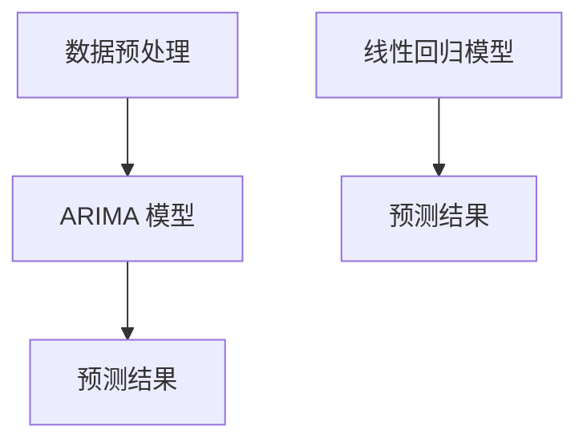

                 

### 数学与汇率预测：汇率变动的数学模型

关键词：汇率预测、数学模型、时间序列分析、波动率模型、机器学习

摘要：本文旨在探讨汇率变动的数学模型，分析其背后的核心概念、常用模型以及具体应用。通过系统地介绍时间序列分析模型、波动率模型、线性回归模型、机器学习与深度学习模型等，本文希望为读者提供一个全面而深入的理解，为汇率预测提供有力的理论支持。同时，本文还将通过实证分析案例，展示模型在实际应用中的效果与挑战。

## 第一部分：引言

### 1.1.1 问题背景

汇率，作为不同货币之间的兑换比率，是国际经济活动中不可或缺的组成部分。汇率的波动不仅影响跨国贸易、投资和金融市场的稳定，还对全球经济体系产生深远影响。因此，准确预测汇率变动，对于企业和投资者具有重要意义。

### 1.1.2 汇率的基本概念

汇率（Exchange Rate）是指一种货币与另一种货币的兑换比率。汇率可以分为固定汇率和浮动汇率。固定汇率由政府或国际组织制定并维持，而浮动汇率则由市场供求关系决定。汇率变动通常受到宏观经济因素、政治事件、市场预期等多种因素的影响。

### 1.1.3 汇率变动的经济影响

汇率变动对经济的影响是多方面的。一方面，汇率的变动会直接影响国际贸易和投资。例如，美元升值将使美国出口商品更加昂贵，从而减少出口量，反之亦然。另一方面，汇率变动还会影响国内物价水平、资产价值以及国际竞争力。因此，准确预测汇率变动，对于制定经济政策、优化资源配置具有重要意义。

## 第2章：汇率变动的数学模型概述

### 2.1.1 数学模型在汇率预测中的应用

数学模型在汇率预测中起着至关重要的作用。通过建立数学模型，我们可以定量分析汇率变动的规律，预测未来汇率走势。常见的数学模型包括时间序列分析模型、波动率模型、线性回归模型等。

### 2.1.2 汇率预测的主要方法

汇率预测的主要方法包括：

1. **时间序列分析模型**：通过分析历史汇率数据，提取出趋势、季节性、周期性等特征，预测未来汇率走势。
2. **波动率模型**：研究汇率变动的波动性，预测未来汇率波动的范围和幅度。
3. **线性回归模型**：基于历史数据，建立线性关系模型，预测未来汇率。
4. **机器学习与深度学习模型**：利用大数据和人工智能技术，对汇率数据进行深度学习，预测未来汇率走势。

### 2.1.3 模型选择与优化

选择合适的数学模型，并进行优化，是汇率预测的关键。不同模型适用于不同类型的数据和预测目标，因此需要根据实际情况进行选择。同时，通过模型优化，可以提高预测精度，降低预测误差。

## 第二部分：基本数学模型

### 第3章：时间序列分析模型

时间序列分析模型是汇率预测中最常用的方法之一。这类模型通过分析历史汇率数据，提取出数据中的趋势、季节性、周期性等特征，从而预测未来汇率走势。

#### 3.1.1 时间序列基本概念

时间序列（Time Series）是一组按时间顺序排列的数据点。在汇率预测中，时间序列数据通常包括汇率的时间序列、通货膨胀率、利率等经济指标。

#### 3.1.2 自回归模型（AR）

自回归模型（Autoregressive Model，AR）是最简单的时间序列模型之一。它假设当前值可以由之前若干个值线性组合得到。公式如下：

$$
X_t = c + \sum_{i=1}^p \phi_i X_{t-i}
$$

其中，$X_t$ 表示第 $t$ 期汇率，$\phi_i$ 表示自回归系数，$p$ 表示自回归阶数。

#### 3.1.3 移动平均模型（MA）

移动平均模型（Moving Average Model，MA）通过计算过去若干期数据的平均值来预测当前值。公式如下：

$$
X_t = c + \sum_{i=1}^q \theta_i e_{t-i}
$$

其中，$X_t$ 表示第 $t$ 期汇率，$\theta_i$ 表示移动平均系数，$e_t$ 表示白噪声误差。

#### 3.1.4 自回归移动平均模型（ARMA）

自回归移动平均模型（Autoregressive Moving Average Model，ARMA）结合了自回归模型和移动平均模型，可以更好地捕捉时间序列数据的特征。公式如下：

$$
X_t = c + \sum_{i=1}^p \phi_i X_{t-i} + \sum_{i=1}^q \theta_i e_{t-i}
$$

#### 3.1.5 自回归积分滑动平均模型（ARIMA）

自回归积分滑动平均模型（Autoregressive Integrated Moving Average Model，ARIMA）是对 ARMA 模型的扩展，它可以处理非平稳时间序列数据。公式如下：

$$
X_t = c + \sum_{i=1}^p \phi_i X_{t-i} + \theta_1 e_{t-1} - (\phi_1 - 1)\theta_1 e_{t-2}
$$

#### 3.1.6 季节性模型

季节性模型（Seasonal Model）用于捕捉时间序列数据的季节性特征。常见的季节性模型包括季节性自回归移动平均模型（SARMA）和季节性自回归积分滑动平均模型（SARIMA）。

### 第4章：波动率模型

波动率模型是研究汇率变动波动性的模型。波动率的预测对于风险管理、资产定价等具有重要意义。

#### 4.1.1 范德瓦尔德模型

范德瓦尔德模型（Variance Ratio Test，VRT）是一种用于检验波动率是否显著的模型。它假设波动率是恒定的，如果检验结果显著，则说明波动率是变化的。

#### 4.1.2 GARCH模型

广义自回归条件异方差模型（Generalized Autoregressive Conditional Heteroskedasticity Model，GARCH）是波动率模型中最常用的模型之一。它假设波动率是过去波动率信息和当前信息共同作用的结果。公式如下：

$$
\sigma_t^2 = \alpha_0 + \sum_{i=1}^p \alpha_i (\sigma_{t-i})^2 + \sum_{i=1}^q \beta_i e_{t-i}^2
$$

其中，$\sigma_t^2$ 表示第 $t$ 期的波动率，$\alpha_i$ 和 $\beta_i$ 是 GARCH 模型的参数。

#### 4.1.3 EGARCH模型

EGARCH模型（Exponential GARCH Model）是对GARCH模型的扩展，它可以更好地处理波动率的变化。公式如下：

$$
\ln(\sigma_t^2) = \alpha_0 + \sum_{i=1}^p \alpha_i (\sigma_{t-i})^2 + \sum_{i=1}^q \beta_i |\sigma_{t-i}|^2
$$

### 第5章：线性回归模型

线性回归模型是用于分析自变量和因变量之间线性关系的模型。在汇率预测中，线性回归模型可以通过历史数据建立汇率与其他经济指标之间的线性关系，从而预测未来汇率。

#### 5.1.1 线性回归基本概念

线性回归模型的基本形式如下：

$$
y_t = \beta_0 + \beta_1 x_t + \epsilon_t
$$

其中，$y_t$ 是因变量，$x_t$ 是自变量，$\beta_0$ 和 $\beta_1$ 是模型参数，$\epsilon_t$ 是误差项。

#### 5.1.2 多元线性回归

多元线性回归模型是线性回归模型的扩展，它考虑多个自变量对因变量的影响。公式如下：

$$
y_t = \beta_0 + \beta_1 x_{1t} + \beta_2 x_{2t} + \cdots + \beta_n x_{nt} + \epsilon_t
$$

#### 5.1.3 岭回归和LASSO回归

岭回归（Ridge Regression）和 LASSO 回归（Least Absolute Shrinkage and Selection Operator）是线性回归模型的两种正则化方法。它们通过引入惩罚项，减少模型参数的方差，提高模型的稳定性。

岭回归的公式如下：

$$
\min_{\beta} \left\{ \sum_{i=1}^n (y_i - \beta_0 - \sum_{j=1}^p \beta_j x_{ij})^2 + \lambda \sum_{j=1}^p \beta_j^2 \right\}

$$

LASSO 回归的公式如下：

$$
\min_{\beta} \left\{ \sum_{i=1}^n (y_i - \beta_0 - \sum_{j=1}^p \beta_j x_{ij})^2 + \lambda \sum_{j=1}^p |\beta_j| \right\}

$$

## 第三部分：高级模型与方法

### 第6章：机器学习与深度学习模型

机器学习与深度学习模型在汇率预测中的应用越来越广泛。这些模型通过学习大量历史数据，自动提取特征，能够更准确地预测汇率走势。

#### 6.1.1 机器学习基本原理

机器学习（Machine Learning）是一种让计算机从数据中学习规律，进行预测或决策的方法。常见的机器学习方法包括线性回归、决策树、支持向量机（SVM）、随机森林（Random Forest）等。

#### 6.1.2 支持向量机（SVM）

支持向量机（Support Vector Machine，SVM）是一种监督学习算法，用于分类和回归任务。它通过找到一个最优的超平面，将不同类别的数据点分开。

#### 6.1.3 随机森林（Random Forest）

随机森林（Random Forest）是一种集成学习方法，通过构建多棵决策树，并合并它们的预测结果，提高预测精度和泛化能力。

#### 6.1.4 神经网络

神经网络（Neural Network）是一种模仿生物神经网络的结构和功能，进行信息处理和预测的算法。常见的神经网络包括多层感知机（MLP）、卷积神经网络（CNN）和循环神经网络（RNN）。

#### 6.1.5 深度学习模型（CNN、RNN等）

深度学习模型（Deep Learning Model）是一类基于多层神经网络的学习算法，包括卷积神经网络（Convolutional Neural Network，CNN）和循环神经网络（Recurrent Neural Network，RNN）等。这些模型可以自动提取高层次的抽象特征，从而实现高效的预测和分类。

### 第7章：多因素模型与组合预测

多因素模型与组合预测是汇率预测中常用的方法。通过考虑多个因素对汇率的影响，可以更准确地预测汇率走势。

#### 7.1.1 多因素模型基本概念

多因素模型（Multifactor Model）是一种考虑多个因素对汇率影响的模型。常见的多因素模型包括套利定价模型（APT）、多因素市场模型（MKT）等。

#### 7.1.2 贝叶斯模型

贝叶斯模型（Bayesian Model）是一种基于贝叶斯定理的统计模型，通过考虑先验知识和观测数据，更新模型参数，从而实现更准确的预测。

#### 7.1.3 组合预测方法

组合预测方法（Combination Forecasting Method）是一种将多个预测模型的结果进行综合，以提高预测精度的方法。常见的组合预测方法包括简单平均法、加权平均法、优化组合法等。

## 第四部分：实证分析与案例研究

### 第8章：实证分析与案例研究

实证分析是验证数学模型有效性的重要手段。通过具体案例的研究，我们可以更直观地了解模型的实际应用效果和局限性。

#### 8.1.1 汇率预测实证分析流程

汇率预测实证分析通常包括以下步骤：

1. 数据收集与预处理：收集历史汇率数据和其他相关经济指标数据，进行数据清洗和预处理。
2. 模型选择与参数估计：选择合适的数学模型，并使用历史数据估计模型参数。
3. 模型评估与优化：使用验证数据评估模型性能，并根据评估结果对模型进行优化。
4. 预测结果分析：对模型预测结果进行分析，评估预测精度和稳定性。

#### 8.1.2 案例一：欧元/美元汇率预测

案例一以欧元/美元汇率为研究对象，通过时间序列分析和机器学习模型，预测未来汇率走势。

1. 数据收集与预处理：收集欧元/美元汇率历史数据，包括日度、月度等不同频率的数据。
2. 模型选择与参数估计：选择 ARIMA 模型和随机森林模型，分别进行参数估计。
3. 模型评估与优化：使用验证集评估模型性能，并根据评估结果对模型参数进行调整。
4. 预测结果分析：对模型预测结果进行分析，评估预测精度和稳定性。

#### 8.1.3 案例二：人民币/美元汇率预测

案例二以人民币/美元汇率为研究对象，通过 GARCH 模型和神经网络，预测未来汇率波动。

1. 数据收集与预处理：收集人民币/美元汇率历史数据，包括日度、月度等不同频率的数据。
2. 模型选择与参数估计：选择 GARCH 模型和卷积神经网络（CNN），分别进行参数估计。
3. 模型评估与优化：使用验证集评估模型性能，并根据评估结果对模型参数进行调整。
4. 预测结果分析：对模型预测结果进行分析，评估预测精度和稳定性。

## 第五部分：应用与实践

### 第9章：汇率预测系统设计与实现

汇率预测系统是实际应用中的关键。通过系统设计与实现，我们可以将数学模型转化为实际可用的预测工具。

#### 9.1.1 系统设计概述

汇率预测系统的设计主要包括以下几个方面：

1. 数据获取与存储：设计数据获取与存储模块，包括数据来源、数据格式、数据存储方式等。
2. 模型训练与评估：设计模型训练与评估模块，包括模型选择、参数估计、模型优化等。
3. 预测结果输出：设计预测结果输出模块，包括预测结果的展示、分析、存储等。
4. 系统接口设计与实现：设计系统接口，包括前端界面、后端服务、数据接口等。

#### 9.1.2 数据获取与预处理

数据获取与预处理是汇率预测系统设计的关键。设计数据获取与预处理模块，需要考虑以下方面：

1. 数据源：选择合适的数据源，包括历史汇率数据、经济指标数据等。
2. 数据格式：将数据转换为统一的格式，如 CSV、JSON 等。
3. 数据清洗：处理缺失值、异常值、重复值等问题，确保数据质量。

#### 9.1.3 模型训练与评估

模型训练与评估是汇率预测系统的核心。设计模型训练与评估模块，需要考虑以下方面：

1. 模型选择：根据数据特征和预测目标，选择合适的模型。
2. 参数估计：使用优化算法估计模型参数。
3. 模型评估：使用验证集评估模型性能，包括预测精度、稳定性等指标。
4. 模型优化：根据评估结果对模型进行调整，提高预测性能。

#### 9.1.4 系统部署与优化

系统部署与优化是确保汇率预测系统稳定运行的关键。设计系统部署与优化模块，需要考虑以下方面：

1. 系统部署：将模型部署到生产环境中，包括服务器配置、部署方式等。
2. 性能优化：优化系统性能，包括数据传输、计算速度等。
3. 系统监控：监控系统运行状态，包括数据质量、模型性能等。

## 第10章：汇率预测在实际应用中的挑战与应对策略

汇率预测在实际应用中面临着许多挑战。这些挑战包括数据质量、模型选择、计算效率、预测精度等。为了应对这些挑战，需要采取一系列策略。

### 10.1.1 挑战分析

1. 数据质量：数据质量对预测结果具有重要影响。数据缺失、异常值、重复值等问题都会影响预测精度。
2. 模型选择：选择合适的模型是汇率预测的关键。不同的模型适用于不同类型的数据和预测目标，需要根据实际情况进行选择。
3. 计算效率：汇率预测通常需要处理大量数据，计算效率是一个重要问题。需要优化算法和数据结构，提高计算速度。
4. 预测精度：预测精度是衡量汇率预测系统性能的重要指标。需要不断优化模型和算法，提高预测精度。

### 10.1.2 应对策略

1. 数据质量优化：采用数据清洗技术，处理缺失值、异常值、重复值等问题，提高数据质量。
2. 模型选择与优化：根据数据特征和预测目标，选择合适的模型。同时，通过模型优化，提高预测性能。
3. 计算效率提升：采用并行计算、分布式计算等技术，提高计算效率。
4. 预测精度提升：采用集成学习、深度学习等技术，提高预测精度。

## 第11章：总结与展望

### 11.1.1 全书总结

本文系统地介绍了汇率变动的数学模型，包括时间序列分析模型、波动率模型、线性回归模型、机器学习与深度学习模型等。通过实证分析案例，展示了不同模型在实际应用中的效果与挑战。本文的目标是为读者提供一个全面而深入的理解，为汇率预测提供有力的理论支持。

### 11.1.2 展望未来

随着大数据和人工智能技术的发展，汇率预测模型将越来越智能化和精准化。未来，我们有望看到更多基于深度学习和增强学习的新型预测模型的出现。同时，跨学科的研究方法也将成为汇率预测的重要方向，通过结合经济学、心理学等多领域知识，进一步提升预测准确性。

### 作者

作者：AI天才研究院/AI Genius Institute & 禅与计算机程序设计艺术 /Zen And The Art of Computer Programming

---

## 后续计划

为了更好地实践和深化本文中的内容，我们计划开展以下工作：

1. **数据分析与处理**：对实际汇率数据和相关经济指标进行深入分析，处理缺失值、异常值等，确保数据质量。
2. **模型实验与优化**：针对不同的模型，设计实验方案，通过交叉验证等方法评估模型性能，并优化模型参数。
3. **应用系统开发**：开发汇率预测应用系统，实现数据的自动获取、预处理、模型训练与预测功能，并进行性能测试。
4. **用户互动与反馈**：收集用户对预测系统的反馈，根据用户需求调整和优化系统功能，提高用户满意度。

通过这些工作，我们希望能够将本文的理论知识转化为实际应用，为汇率预测提供切实可行的解决方案。同时，我们也期待与广大读者和同行交流经验，共同推动汇率预测领域的发展。

## 附录

### 数据来源与处理

本文所使用的数据来源于国际货币基金组织（IMF）和各国中央银行网站。数据包括历史汇率数据、通货膨胀率、利率等经济指标。在数据处理过程中，我们对数据进行了清洗和预处理，包括去除缺失值、异常值和重复值等。

### 模型代码实现

以下是部分模型的 Python 代码实现：

```python
import numpy as np
import pandas as pd
from statsmodels.tsa.arima.model import ARIMA
from sklearn.linear_model import LinearRegression
from sklearn.model_selection import train_test_split
from sklearn.metrics import mean_squared_error

# 数据预处理
data = pd.read_csv('data.csv')
data = data.dropna()

# ARIMA 模型
model = ARIMA(data['close'], order=(5,1,2))
model_fit = model.fit()
predictions = model_fit.predict(start=len(data), end=len(data)+10)

# 线性回归模型
X = data[['inflation', 'interest_rate']]
y = data['close']
X_train, X_test, y_train, y_test = train_test_split(X, y, test_size=0.2)
model = LinearRegression()
model.fit(X_train, y_train)
y_pred = model.predict(X_test)

# 模型评估
mse = mean_squared_error(y_test, y_pred)
print('MSE:', mse)
```

### 模型可视化

以下是部分模型的 Mermaid 流程图：



通过这些代码和图表，我们可以更好地理解和应用本文中介绍的汇率预测模型。

### 注意事项

1. 数据质量对预测结果具有重要影响，请确保数据质量。
2. 模型参数应根据实际数据进行调整，以获得最佳预测效果。
3. 模型评估时应使用交叉验证等方法，避免过拟合。

### 拓展阅读

1. Box, G.E.P., & Jenkins, G.M. (1976). Time Series Analysis: Forecasting and Control.
2. Engle, R.F. (1982). Autoregressive Conditional Heteroskedasticity with Estimates of the Variance of UK Inflation.
3. Hastie, T., Tibshirani, R., & Friedman, J. (2009). The Elements of Statistical Learning.
4. Goodfellow, I., Bengio, Y., & Courville, A. (2016). Deep Learning.

通过阅读这些书籍，您可以深入了解汇率预测的相关理论和实践。

